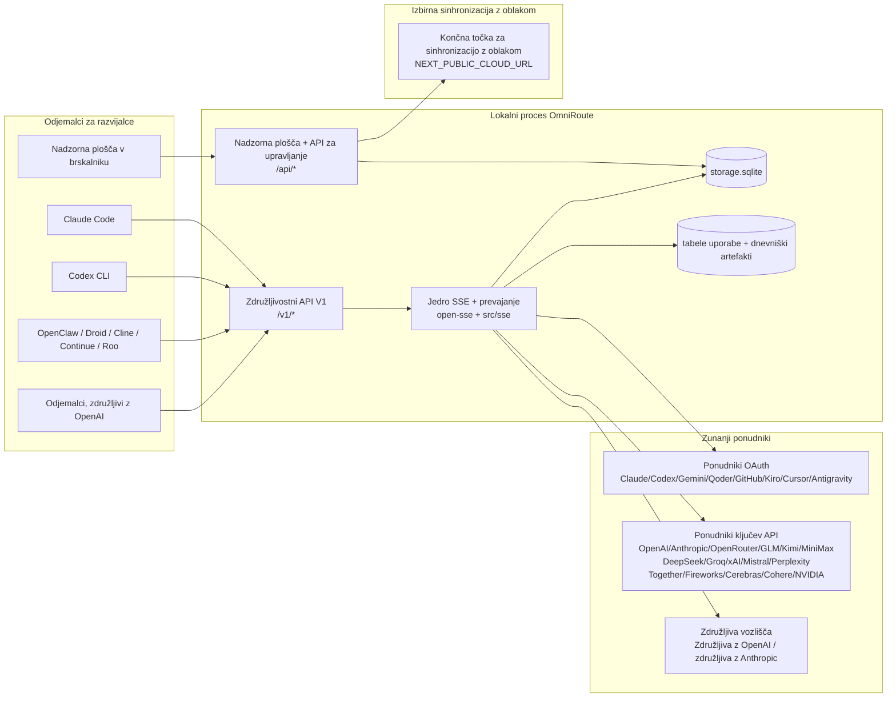
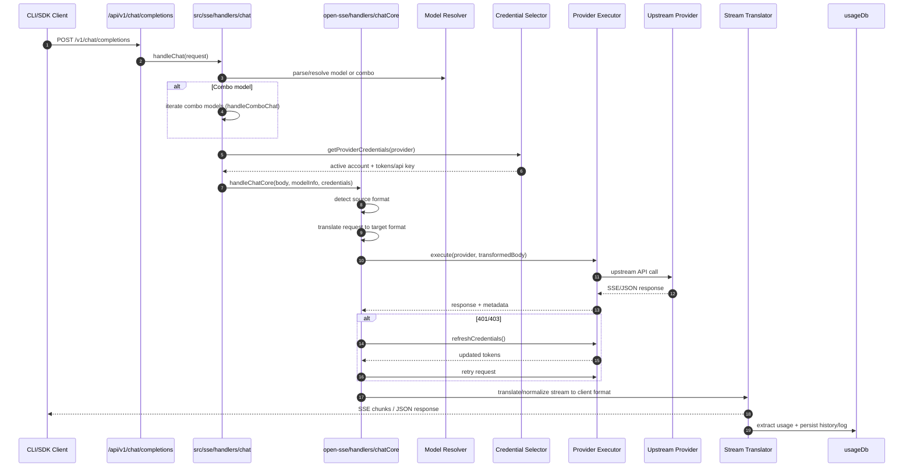
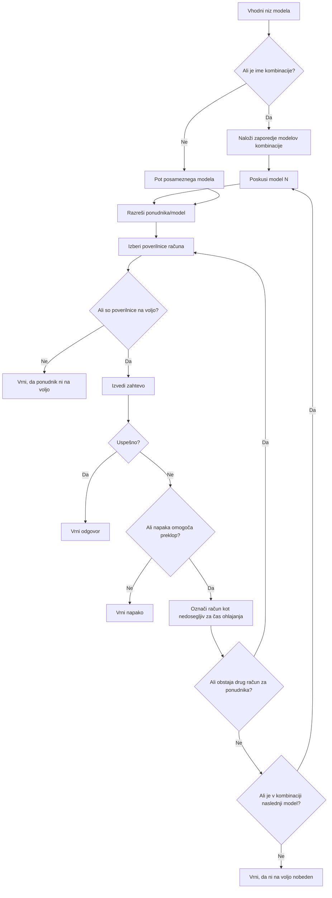
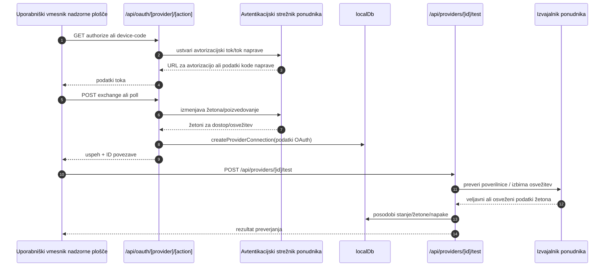
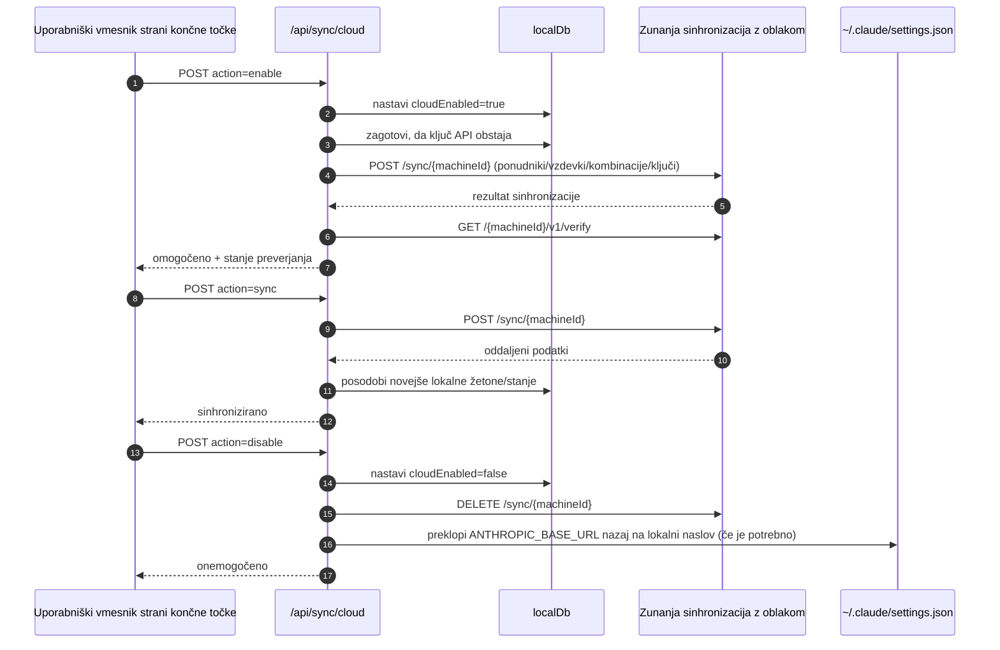
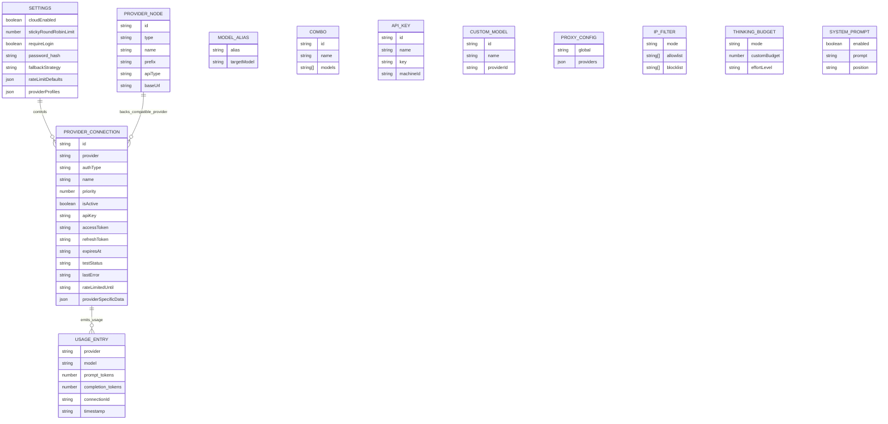
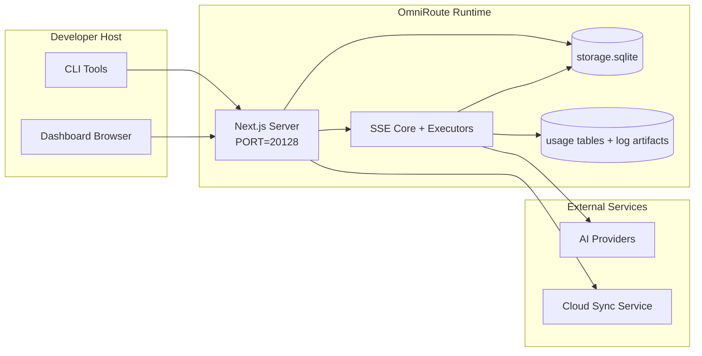

# ARCHITECTURE (Slovenščina)

🌐 **Languages:** 🇺🇸 [English](../../../../architecture/ARCHITECTURE.md) · 🇸🇦 [ar](../../../ar/docs/architecture/ARCHITECTURE.md) · 🇦🇿 [az](../../../az/docs/architecture/ARCHITECTURE.md) · 🇧🇬 [bg](../../../bg/docs/architecture/ARCHITECTURE.md) · 🇧🇩 [bn](../../../bn/docs/architecture/ARCHITECTURE.md) · 🇨🇿 [cs](../../../cs/docs/architecture/ARCHITECTURE.md) · 🇩🇰 [da](../../../da/docs/architecture/ARCHITECTURE.md) · 🇩🇪 [de](../../../de/docs/architecture/ARCHITECTURE.md) · 🇬🇷 [el](../../../el/docs/architecture/ARCHITECTURE.md) · 🇪🇸 [es](../../../es/docs/architecture/ARCHITECTURE.md) · 🇪🇪 [et](../../../et/docs/architecture/ARCHITECTURE.md) · 🇮🇷 [fa](../../../fa/docs/architecture/ARCHITECTURE.md) · 🇫🇮 [fi](../../../fi/docs/architecture/ARCHITECTURE.md) · 🇫🇷 [fr](../../../fr/docs/architecture/ARCHITECTURE.md) · 🇮🇪 [ga](../../../ga/docs/architecture/ARCHITECTURE.md) · 🇮🇳 [gu](../../../gu/docs/architecture/ARCHITECTURE.md) · 🇮🇱 [he](../../../he/docs/architecture/ARCHITECTURE.md) · 🇮🇳 [hi](../../../hi/docs/architecture/ARCHITECTURE.md) · 🇭🇷 [hr](../../../hr/docs/architecture/ARCHITECTURE.md) · 🇭🇺 [hu](../../../hu/docs/architecture/ARCHITECTURE.md) · 🇮🇩 [id](../../../id/docs/architecture/ARCHITECTURE.md) · 🇮🇹 [it](../../../it/docs/architecture/ARCHITECTURE.md) · 🇯🇵 [ja](../../../ja/docs/architecture/ARCHITECTURE.md) · 🇰🇷 [ko](../../../ko/docs/architecture/ARCHITECTURE.md) · 🇱🇹 [lt](../../../lt/docs/architecture/ARCHITECTURE.md) · 🇱🇻 [lv](../../../lv/docs/architecture/ARCHITECTURE.md) · 🇮🇳 [mr](../../../mr/docs/architecture/ARCHITECTURE.md) · 🇲🇾 [ms](../../../ms/docs/architecture/ARCHITECTURE.md) · 🇲🇹 [mt](../../../mt/docs/architecture/ARCHITECTURE.md) · 🇳🇱 [nl](../../../nl/docs/architecture/ARCHITECTURE.md) · 🇳🇴 [no](../../../no/docs/architecture/ARCHITECTURE.md) · 🇵🇭 [phi](../../../phi/docs/architecture/ARCHITECTURE.md) · 🇵🇱 [pl](../../../pl/docs/architecture/ARCHITECTURE.md) · 🇵🇹 [pt](../../../pt/docs/architecture/ARCHITECTURE.md) · 🇧🇷 [pt-BR](../../../pt-BR/docs/architecture/ARCHITECTURE.md) · 🇷🇴 [ro](../../../ro/docs/architecture/ARCHITECTURE.md) · 🇷🇺 [ru](../../../ru/docs/architecture/ARCHITECTURE.md) · 🇸🇰 [sk](../../../sk/docs/architecture/ARCHITECTURE.md) · 🇷🇸 [sr](../../../sr/docs/architecture/ARCHITECTURE.md) · 🇸🇪 [sv](../../../sv/docs/architecture/ARCHITECTURE.md) · 🇰🇪 [sw](../../../sw/docs/architecture/ARCHITECTURE.md) · 🇮🇳 [ta](../../../ta/docs/architecture/ARCHITECTURE.md) · 🇮🇳 [te](../../../te/docs/architecture/ARCHITECTURE.md) · 🇹🇭 [th](../../../th/docs/architecture/ARCHITECTURE.md) · 🇹🇷 [tr](../../../tr/docs/architecture/ARCHITECTURE.md) · 🇺🇦 [uk-UA](../../../uk-UA/docs/architecture/ARCHITECTURE.md) · 🇵🇰 [ur](../../../ur/docs/architecture/ARCHITECTURE.md) · 🇻🇳 [vi](../../../vi/docs/architecture/ARCHITECTURE.md) · 🇨🇳 [zh-CN](../../../zh-CN/docs/architecture/ARCHITECTURE.md) · 🇹🇼 [zh-TW](../../../zh-TW/docs/architecture/ARCHITECTURE.md)

---

---

title: "Arhitektura OmniRoute"
version: 3.8.40
lastUpdated: 2026-06-28
---

# Arhitektura OmniRoute

🌐 **Languages:** 🇺🇸 [English](../../../../architecture/ARCHITECTURE.md) · 🇸🇦 [ar](../../../ar/docs/architecture/ARCHITECTURE.md) · 🇦🇿 [az](../../../az/docs/architecture/ARCHITECTURE.md) · 🇧🇬 [bg](../../../bg/docs/architecture/ARCHITECTURE.md) · 🇧🇩 [bn](../../../bn/docs/architecture/ARCHITECTURE.md) · 🇨🇿 [cs](../../../cs/docs/architecture/ARCHITECTURE.md) · 🇩🇰 [da](../../../da/docs/architecture/ARCHITECTURE.md) · 🇩🇪 [de](../../../de/docs/architecture/ARCHITECTURE.md) · 🇬🇷 [el](../../../el/docs/architecture/ARCHITECTURE.md) · 🇪🇸 [es](../../../es/docs/architecture/ARCHITECTURE.md) · 🇪🇪 [et](../../../et/docs/architecture/ARCHITECTURE.md) · 🇮🇷 [fa](../../../fa/docs/architecture/ARCHITECTURE.md) · 🇫🇮 [fi](../../../fi/docs/architecture/ARCHITECTURE.md) · 🇫🇷 [fr](../../../fr/docs/architecture/ARCHITECTURE.md) · 🇮🇪 [ga](../../../ga/docs/architecture/ARCHITECTURE.md) · 🇮🇳 [gu](../../../gu/docs/architecture/ARCHITECTURE.md) · 🇮🇱 [he](../../../he/docs/architecture/ARCHITECTURE.md) · 🇮🇳 [hi](../../../hi/docs/architecture/ARCHITECTURE.md) · 🇭🇷 [hr](../../../hr/docs/architecture/ARCHITECTURE.md) · 🇭🇺 [hu](../../../hu/docs/architecture/ARCHITECTURE.md) · 🇮🇩 [id](../../../id/docs/architecture/ARCHITECTURE.md) · 🇮🇹 [it](../../../it/docs/architecture/ARCHITECTURE.md) · 🇯🇵 [ja](../../../ja/docs/architecture/ARCHITECTURE.md) · 🇰🇷 [ko](../../../ko/docs/architecture/ARCHITECTURE.md) · 🇱🇹 [lt](../../../lt/docs/architecture/ARCHITECTURE.md) · 🇱🇻 [lv](../../../lv/docs/architecture/ARCHITECTURE.md) · 🇮🇳 [mr](../../../mr/docs/architecture/ARCHITECTURE.md) · 🇲🇾 [ms](../../../ms/docs/architecture/ARCHITECTURE.md) · 🇲🇹 [mt](../../../mt/docs/architecture/ARCHITECTURE.md) · 🇳🇱 [nl](../../../nl/docs/architecture/ARCHITECTURE.md) · 🇳🇴 [no](../../../no/docs/architecture/ARCHITECTURE.md) · 🇵🇭 [phi](../../../phi/docs/architecture/ARCHITECTURE.md) · 🇵🇱 [pl](../../../pl/docs/architecture/ARCHITECTURE.md) · 🇵🇹 [pt](../../../pt/docs/architecture/ARCHITECTURE.md) · 🇧🇷 [pt-BR](../../../pt-BR/docs/architecture/ARCHITECTURE.md) · 🇷🇴 [ro](../../../ro/docs/architecture/ARCHITECTURE.md) · 🇷🇺 [ru](../../../ru/docs/architecture/ARCHITECTURE.md) · 🇸🇰 [sk](../../../sk/docs/architecture/ARCHITECTURE.md) · 🇷🇸 [sr](../../../sr/docs/architecture/ARCHITECTURE.md) · 🇸🇪 [sv](../../../sv/docs/architecture/ARCHITECTURE.md) · 🇰🇪 [sw](../../../sw/docs/architecture/ARCHITECTURE.md) · 🇮🇳 [ta](../../../ta/docs/architecture/ARCHITECTURE.md) · 🇮🇳 [te](../../../te/docs/architecture/ARCHITECTURE.md) · 🇹🇭 [th](../../../th/docs/architecture/ARCHITECTURE.md) · 🇹🇷 [tr](../../../tr/docs/architecture/ARCHITECTURE.md) · 🇺🇦 [uk-UA](../../../uk-UA/docs/architecture/ARCHITECTURE.md) · 🇵🇰 [ur](../../../ur/docs/architecture/ARCHITECTURE.md) · 🇻🇳 [vi](../../../vi/docs/architecture/ARCHITECTURE.md) · 🇨🇳 [zh-CN](../../../zh-CN/docs/architecture/ARCHITECTURE.md) · 🇹🇼 [zh-TW](../../../zh-TW/docs/architecture/ARCHITECTURE.md)

_Nazadnje posodobljeno: 2026-06-28_

## Povzetek

OmniRoute je lokalni prehod za usmerjanje umetne inteligence in nadzorna plošča, zgrajena na Next.js.
Zagotavlja enotno končno točko, združljivo z OpenAI (`/v1/*`), ter usmerja promet med več nadrejenimi ponudniki s prevajanjem, nadomestnimi možnostmi, osveževanjem žetonov in spremljanjem uporabe.

Ključne zmožnosti:

- Površina API, združljiva z OpenAI, za CLI/orodja (355 ponudnikov, 108 izvajalnikov)
- Prevajanje zahtev in odgovorov med oblikami ponudnikov
- Nadomestno izvajanje s kombinacijami modelov (zaporedje več modelov)
- Strukturirani koraki kombinacij (`provider + model + connection`) z določanjem vrstnega reda med izvajanjem prek `compositeTiers`
- Nadomestno izvajanje na ravni računa (več računov na ponudnika)
- Predhodno preverjanje kvote in izbira računa P2C z upoštevanjem kvote v glavni poti klepeta
- Upravljanje povezav s ponudniki prek OAuth in ključev API (22 modulov ponudnikov OAuth)
- Ustvarjanje vdelav prek `/v1/embeddings` (18 ponudnikov)
- Ustvarjanje slik prek `/v1/images/generations` (več kot 10 ponudnikov, več kot 20 modelov)
- Prepisovanje zvoka prek `/v1/audio/transcriptions` (18 ponudnikov)
- Pretvorba besedila v govor prek `/v1/audio/speech` (24 vgrajenih ponudnikov)
- Ustvarjanje videoposnetkov prek `/v1/videos/generations` (ComfyUI + SD WebUI)
- Ustvarjanje glasbe prek `/v1/music/generations` (ComfyUI)
- Spletno iskanje prek `/v1/search` (20 ponudnikov)
- Moderiranje prek `/v1/moderations`
- Ponovno razvrščanje prek `/v1/rerank`
- Razčlenjevanje oznak za razmišljanje (`<think>...</think>`) pri modelih sklepanja
- Čiščenje odgovorov za strogo združljivost z OpenAI SDK
- Normalizacija vlog (developer→system, system→user) za združljivost med ponudniki
- Pretvorba strukturiranega izhoda (json_schema → Gemini responseSchema)
- Lokalno shranjevanje ponudnikov, ključev, vzdevkov, kombinacij, nastavitev in cen (122 modulov zbirke podatkov)
- Spremljanje uporabe/stroškov in beleženje zahtev
- Izbirna sinhronizacija v oblaku za sinhronizacijo stanja med več napravami
- Seznam dovoljenih/blokiranih naslovov IP za nadzor dostopa do API
- Upravljanje proračuna za razmišljanje (neposredno posredovanje/samodejno/po meri/prilagodljivo)
- Globalno vstavljanje sistemskega poziva
- Spremljanje sej in ustvarjanje prstnih odtisov
- Izboljšeno omejevanje hitrosti za posamezne račune s profili, prilagojenimi ponudnikom
- Vzorec odklopnika za odpornost ponudnikov
- Zaščita pred stampedom zahtev z zaklepanjem mutex
- Predpomnilnik za odstranjevanje podvojenih zahtev na podlagi podpisov
- Domenska plast: pravila stroškov, pravilnik nadomestnega izvajanja, pravilnik zaklepanja
- Context Relay: povzetki za predajo sej, ki zagotavljajo neprekinjenost pri menjavanju računov
- Trajno shranjevanje domenskega stanja (predpomnilnik SQLite s sprotnim zapisovanjem za nadomestne možnosti, proračune, zaklepanja in odklopnike)
- Mehanizem pravilnikov za centralizirano vrednotenje zahtev (zaklepanje → proračun → nadomestna možnost)
- Telemetrija zahtev z združevanjem zakasnitev p50/p95/p99
- Telemetrija ciljev kombinacij in zgodovinsko stanje ciljev kombinacij prek `combo_execution_key` / `combo_step_id`
- Korelacijski ID (X-Request-Id) za sledenje od začetka do konca
- Beleženje revizij skladnosti z možnostjo izključitve za posamezni ključ API
- Ogrodje za vrednotenje za zagotavljanje kakovosti LLM
- Nadzorna plošča stanja s sprotnim prikazom stanja odklopnikov ponudnikov
- Strežnik MCP (110 orodij) s 3 prenosi (stdio/SSE/Streamable HTTP)
- Strežnik A2A (JSON-RPC 2.0 + SSE) z veščinami in življenjskim ciklom opravil
- Pomnilniški sistem (izvlečenje, vstavljanje, pridobivanje, povzemanje)
- Sistem veščin (register, izvajalnik, peskovnik, vgrajene veščine)
- Posredniški strežnik MITM z upravljanjem potrdil in obravnavo DNS
- Vmesna programska oprema za zaščito pred vbrizgavanjem pozivov
- Cevovod za stiskanje pozivov s Caveman, RTK, naloženimi cevovodi, kombinacijami stiskanja, jezikovnimi paketi in analitiko
- Register ACP (Agent Communication Protocol)
- Modularni ponudniki OAuth (22 posameznih modulov v `src/lib/oauth/providers/`)
- Skripti za odstranitev/popolno odstranitev
- Dejanje za popravilo okolja OAuth
- Most WebSocket za odjemalce WS, združljive z OpenAI (`/v1/ws`)
- Upravljanje žetonov za sinhronizacijo (izdaja/preklic, prenos konfiguracijskega paketa z različicami ETag)
- GLM Thinking (`glmt`) kot polnopravna prednastavitev ponudnika
- Hibridno štetje žetonov (na strani ponudnika prek `/messages/count_tokens` z nadomestnim ocenjevanjem)
- Samodejno začetno ustvarjanje vzdevkov modelov (več kot 30 normalizacij narečij med posredniškimi strežniki ob zagonu)
- Varen odhodni fetch z zaščito pred SSRF, blokiranjem zasebnih URL-jev in nastavljivim ponavljanjem poskusov
- Ponovni poskusi klepeta z upoštevanjem obdobja ohlajanja in nastavljivima `requestRetry` ter `maxRetryIntervalSec`
- Preverjanje izvajalnega okolja z Zod ob zagonu
- Revizija skladnosti v2 s paginacijo, dogodki CRUD ponudnikov in beleženjem preverjanj, blokiranih zaradi SSRF

Primarni izvajalni model:

- Poti aplikacije Next.js v `src/app/api/*` izvajajo tako API-je nadzorne plošče kot združljivostne API-je
- Skupno jedro SSE/usmerjanja v `src/sse/*` + `open-sse/*` obravnava izvajanje pri ponudnikih, prevajanje, pretočno prenašanje, nadomestno izvajanje in uporabo

## Referenčni diagrami

Kanonični viri Mermaid z nadzorom različic za platformo v3.8.0 so v
[`docs/diagrams/`](../diagrams/README.md). Spodaj sta za lažjo orientacijo prikazana dva;
ostali so povezani iz vodnikov za posamezna področja.


> Vir: [diagrams/request-pipeline.mmd](../diagrams/request-pipeline.mmd)


> Vir: [diagrams/resilience-3layers.mmd](../diagrams/resilience-3layers.mmd) — povezava je na voljo tudi v
> [RESILIENCE_GUIDE.md](./RESILIENCE_GUIDE.md) in referenci za odpornost v `CLAUDE.md`.

## Obseg in meje

### V obsegu

- Lokalno izvajalno okolje prehoda
- API-ji za upravljanje nadzorne plošče
- Preverjanje pristnosti ponudnikov in osveževanje žetonov
- Pretvarjanje zahtev in pretočno pošiljanje SSE
- Lokalno stanje + trajno shranjevanje podatkov o uporabi
- Izbirna orkestracija sinhronizacije z oblakom

### Zunaj obsega

- Implementacija storitve v oblaku za `NEXT_PUBLIC_CLOUD_URL`
- SLA/nadzorna ravnina ponudnika zunaj lokalnega procesa
- Same zunanje izvršljive datoteke CLI (Claude CLI, Codex CLI itd.)

## Površina nadzorne plošče (trenutno)

Glavne strani v `src/app/(dashboard)/dashboard/`:

- `/dashboard` — hiter začetek + pregled ponudnikov
- `/dashboard/endpoint` — posredniški strežnik končnih točk + zavihki MCP + A2A + končne točke API
- `/dashboard/providers` — povezave s ponudniki in poverilnice
- `/dashboard/combos` — kombinirane strategije, predloge, gradnik na osnovi korakov, pravila usmerjanja modelov in ročno trajno shranjeno razvrščanje
- `/dashboard/auto-combo` — Auto Combo Engine: uteži točkovanja, paketi načinov, prednastavitve navideznih tovarn in telemetrija
- `/dashboard/costs` — združevanje stroškov in preglednost cen
- `/dashboard/analytics` — analitika uporabe, vrednotenja in stanje ciljev kombinacij
- `/dashboard/limits` — nadzor kvot/hitrosti
- `/dashboard/cli-tools` — uvajanje CLI, zaznavanje izvajalnega okolja in ustvarjanje konfiguracije
- `/dashboard/agents` — zaznani agenti ACP + registracija agentov po meri
- `/dashboard/cloud-agents` — opravila agentov, gostovanih v oblaku (Codex Cloud, Devin, Jules), in življenjski cikel opravil
- `/dashboard/skills` — register veščin A2A, izvajanje v peskovniku in katalog vgrajenih veščin
- `/dashboard/memory` — pregledovanje in pridobivanje trajnega pogovornega pomnilnika
- `/dashboard/webhooks` — naročnine na izhodne spletne kavlje, menjava skrivnosti in statistika ponovnih poskusov
- `/dashboard/batch` — oddaja paketnih opravil in spremljanje napredka
- `/dashboard/cache` — statistika predpomnilnika za sprotno branje in sklepanje ter nadzor odstranjevanja
- `/dashboard/playground` — interaktivno pogovorno preizkusno okolje za katero koli konfigurirano kombinacijo/model
- `/dashboard/changelog` — pregledovalnik dnevnika sprememb v aplikaciji (upodablja `CHANGELOG.md`)
- `/dashboard/system` — diagnostika izvajalnega okolja, informacije o različici in vmesnik za preverjanje okolja
- `/dashboard/onboarding` — čarovnik za začetno nastavitev novih namestitev
- `/dashboard/media` — preizkusno okolje za slike/video/glasbo
- `/dashboard/search-tools` — preizkušanje ponudnikov iskanja in zgodovina
- `/dashboard/health` — čas delovanja, odklopniki, omejitve hitrosti in seje z nadzorovanimi kvotami
- `/dashboard/logs` — dnevniki zahtev/posredniškega strežnika/revizij/konzole
- `/dashboard/settings` — zavihki sistemskih nastavitev (splošno, usmerjanje, privzete nastavitve kombinacij itd.)
- `/dashboard/context/caveman` — pravila stiskanja Caveman, jezikovni paketi, predogled in izhodni način
- `/dashboard/context/rtk` — filtri izhoda ukazov RTK, predogled in nastavitve varnosti izvajalnega okolja
- `/dashboard/context/combos` — poimenovani cevovodi stiskanja, dodeljeni kombinacijam usmerjanja
- `/dashboard/translator` — pregled prevajalnika in predogled pretvorbe oblike zahtev
- `/dashboard/audit` — brskalnik dnevnika revizij skladnosti s številčenjem strani in strukturiranimi metapodatki
- `/dashboard/usage` — brskalnik uporabe po posameznih zahtevah, povezan z `usage_history`
- `/dashboard/compression` — analitika in statistika stiskanja ter dodeljevanje cevovodov
- `/dashboard/api-manager` — življenjski cikel ključev API in dovoljenja modelov

## Visokonivojski kontekst sistema



## Osrednje izvajalne komponente

## 1) Sloj API-ja in usmerjanja (poti aplikacije Next.js)

Glavni imeniki:

- `src/app/api/v1/*` in `src/app/api/v1beta/*` za združljivostne API-je
- `src/app/api/*` za API-je za upravljanje/konfiguracijo
- Pravila za prepisovanje Next v `next.config.mjs` preslikajo `/v1/*` v `/api/v1/*`

Pomembne združljivostne poti:

- `src/app/api/v1/chat/completions/route.ts`
- `src/app/api/v1/messages/route.ts`
- `src/app/api/v1/responses/route.ts`
- `src/app/api/v1/models/route.ts` — vključuje modele po meri z `custom: true`
- `src/app/api/v1/embeddings/route.ts` — ustvarjanje vložitev (6 ponudnikov)
- `src/app/api/v1/images/generations/route.ts` — ustvarjanje slik (več kot 4 ponudniki, vključno z Antigravity/Nebius)
- `src/app/api/v1/messages/count_tokens/route.ts`
- `src/app/api/v1/providers/[provider]/chat/completions/route.ts` — namenski klepet za posameznega ponudnika
- `src/app/api/v1/providers/[provider]/embeddings/route.ts` — namenske vložitve za posameznega ponudnika
- `src/app/api/v1/providers/[provider]/images/generations/route.ts` — namenske slike za posameznega ponudnika
- `src/app/api/v1beta/models/route.ts`
- `src/app/api/v1beta/models/[...path]/route.ts`

Področja upravljanja:

- Preverjanje pristnosti/nastavitve: `src/app/api/auth/*`, `src/app/api/settings/*`
- Ponudniki/povezave: `src/app/api/providers*`
- Vozlišča ponudnikov: `src/app/api/provider-nodes*`
- Modeli po meri: `src/app/api/provider-models` (GET/POST/DELETE)
- Katalog modelov: `src/app/api/models/route.ts` (GET)
- Konfiguracija posredniškega strežnika: `src/app/api/settings/proxy` (GET/PUT/DELETE) + `src/app/api/settings/proxy/test` (POST)
- OAuth: `src/app/api/oauth/*`
- Ključi/vzdevki/kombinacije/cene: `src/app/api/keys*`, `src/app/api/models/alias`, `src/app/api/combos*`, `src/app/api/pricing`
- Uporaba: `src/app/api/usage/*`
- Sinhronizacija/oblak: `src/app/api/sync/*`, `src/app/api/cloud/*`
- Pomožna orodja za CLI: `src/app/api/cli-tools/*`
- Filter naslovov IP: `src/app/api/settings/ip-filter` (GET/PUT)
- Proračun razmišljanja: `src/app/api/settings/thinking-budget` (GET/PUT)
- Sistemski poziv: `src/app/api/settings/system-prompt` (GET/PUT)
- Stiskanje: `src/app/api/settings/compression`, `src/app/api/compression/*` in
  `src/app/api/context/*`
- Seje: `src/app/api/sessions` (GET)
- Omejitve hitrosti: `src/app/api/rate-limits` (GET)
- Odpornost: `src/app/api/resilience` (GET/PATCH) — čakalna vrsta zahtev, čas ohlajanja povezave, odklopnik ponudnika, konfiguracija čakanja na konec ohlajanja
- Ponastavitev odpornosti: `src/app/api/resilience/reset` (POST) — ponastavitev odklopnikov ponudnikov
- Statistika predpomnilnika: `src/app/api/cache/stats` (GET/DELETE)
- Telemetrija: `src/app/api/telemetry/summary` (GET)
- Proračun: `src/app/api/usage/budget` (GET/POST)
- Verige nadomestnih možnosti: `src/app/api/fallback/chains` (GET/POST/DELETE)
- Revizija skladnosti: `src/app/api/compliance/audit-log` (GET, s paginacijo + strukturiranimi metapodatki)
- Evalvacije: `src/app/api/evals` (GET/POST), `src/app/api/evals/[suiteId]` (GET)
- Pravilniki: `src/app/api/policies` (GET/POST)
- Žetoni za sinhronizacijo: `src/app/api/sync/tokens` (GET/POST), `src/app/api/sync/tokens/[id]` (GET/DELETE)
- Konfiguracijski sveženj: `src/app/api/sync/bundle` (GET, posnetek nastavitev/ponudnikov/kombinacij/ključev z različicami ETag)
- WebSocket: `src/app/api/v1/ws/route.ts` — obdelovalnik nadgradnje za odjemalce WS, združljive z OpenAI

## 2) SSE + jedro prevajanja

Glavni moduli poteka:

- Vstopna točka: `src/sse/handlers/chat.ts`
- Osrednja orkestracija: `open-sse/handlers/chatCore.ts`
- Izvedbeni adapterji ponudnikov: `open-sse/executors/*`
- Zaznavanje formata/konfiguracija ponudnika: `open-sse/services/provider.ts`
- Razčlenjevanje/razreševanje modela: `src/sse/services/model.ts`, `open-sse/services/model.ts`
- Logika preklopa med računi: `open-sse/services/accountFallback.ts`
- Register prevajalnikov: `open-sse/translator/index.ts`
- Transformacije toka: `open-sse/utils/stream.ts`, `open-sse/utils/streamHandler.ts`
- Pridobivanje/normalizacija uporabe: `open-sse/utils/usageTracking.ts`
- Razčlenjevalnik oznak za razmišljanje: `open-sse/utils/thinkTagParser.ts`
- Obravnavalnik vdelav: `open-sse/handlers/embeddings.ts`
- Register ponudnikov vdelav: `open-sse/config/embeddingRegistry.ts`
- Obravnavalnik ustvarjanja slik: `open-sse/handlers/imageGeneration.ts`
- Register ponudnikov slik: `open-sse/config/imageRegistry.ts`
- Čiščenje odgovorov: `open-sse/handlers/responseSanitizer.ts`
- Normalizacija vlog: `open-sse/services/roleNormalizer.ts`

Storitve (poslovna logika):

- Izbira/ocenjevanje računov: `open-sse/services/accountSelector.ts`
- Upravljanje življenjskega cikla konteksta: `open-sse/services/contextManager.ts`
- Uveljavljanje filtra IP: `open-sse/services/ipFilter.ts`
- Sledenje sejam: `open-sse/services/sessionManager.ts`
- Odstranjevanje podvojenih zahtev: `open-sse/services/signatureCache.ts`
- Vstavljanje sistemskega poziva: `open-sse/services/systemPrompt.ts`
- Upravljanje proračuna za razmišljanje: `open-sse/services/thinkingBudget.ts`
- Usmerjanje modelov z nadomestnimi znaki: `open-sse/services/wildcardRouter.ts`
- Upravljanje omejitev hitrosti: `open-sse/services/rateLimitManager.ts`
- Prekinjevalnik tokokroga: `src/shared/utils/circuitBreaker.ts`
- Predaja konteksta: `open-sse/services/contextHandoff.ts` — ustvarjanje in vstavljanje povzetka predaje za strategijo posredovanja konteksta
- Stiskanje: `open-sse/services/compression/*` — proaktivno stiskanje pred prevajanjem za ponudnika;
  vključuje pravila Caveman, filtre RTK, zložene cevovode, kombinacije stiskanja, statistiko in preverjanje veljavnosti
- Pridobivalnik kvote Codex: `open-sse/services/codexQuotaFetcher.ts` — pridobiva kvoto Codex za odločitve o predaji pri posredovanju konteksta
- Ponovni poskusi z upoštevanjem obdobja ohlajanja: `src/sse/services/cooldownAwareRetry.ts` — ponovni poskusi za posamezen model po obdobju ohlajanja z nastavljivima `requestRetry` / `maxRetryIntervalSec`
- Varen odhodni dostop: `src/shared/network/safeOutboundFetch.ts` — zaščiteno pridobivanje podatkov ponudnika/modela z zaščito pred SSRF, blokiranjem zasebnih URL-jev, ponovnimi poskusi in časovno omejitvijo
- Zaščita odhodnih URL-jev: `src/shared/network/outboundUrlGuard.ts` — preverja URL-je ponudnikov glede na zasebne/lokalne obsege CIDR
- Privzete vrednosti zahtev ponudnika: `open-sse/services/providerRequestDefaults.ts` — privzete vrednosti `maxTokens`, `temperature`, `thinkingBudgetTokens` na ravni ponudnika
- Konstante ponudnika GLM: `open-sse/config/glmProvider.ts` — skupni modeli GLM, URL-ji kvot ter časovna omejitev/privzete vrednosti GLMT
- Zaledna storitev Antigravity: `open-sse/config/antigravityUpstream.ts` — osnovni URL in konstante poti za odkrivanje
- Konstante odjemalca Codex: `open-sse/config/codexClient.ts` — različicami opremljene vrednosti uporabniškega agenta in različice odjemalca
- Začetni nabor vzdevkov modelov: `src/lib/modelAliasSeed.ts` — ob zagonu inicializira več kot 30 vzdevkov narečij med posredniškimi strežniki

Moduli domenske plasti:

- Pravila stroškov/proračuni: `src/domain/costRules.ts`
- Pravilnik za preklop: `src/domain/fallbackPolicy.ts`
- Razreševalnik kombinacij: `src/domain/comboResolver.ts`
- Pravilnik zaklepanja: `src/domain/lockoutPolicy.ts`
- Mehanizem pravilnikov: `src/domain/policyEngine.ts` — centralizirano vrednotenje zaklepanja → proračuna → preklopa
- Katalog kod napak: `src/shared/constants/errorCodes.ts`
- ID zahteve: `src/shared/utils/requestId.ts`
- Časovna omejitev pridobivanja: `src/shared/utils/fetchTimeout.ts`
- Telemetrija zahtev: `src/shared/utils/requestTelemetry.ts`
- Skladnost/revizija: `src/lib/compliance/index.ts`
- Izvajalnik vrednotenj: `src/lib/evals/evalRunner.ts`
- Trajno shranjevanje stanja domene: `src/lib/db/domainState.ts` — operacije CRUD SQLite za verige preklopov, proračune, zgodovino stroškov, stanje zaklepanja in prekinjevalnike tokokroga

Moduli ponudnikov OAuth (22 posameznih datotek v `src/lib/oauth/providers/`):

- Kazalo registra: `src/lib/oauth/providers/index.ts`
- Posamezni ponudniki: `agy.ts`, `antigravity.ts`, `claude.ts`, `cline.ts`, `codebuddy-cn.ts`, `codex.ts`, `cursor.ts`, `devin-desktop.ts`, `ghe-copilot.ts`, `github.ts`, `gitlab-duo.ts`, `grok-cli-oauth.ts`, `grok-cli.ts`, `kilocode.ts`, `kimi-coding.ts`, `kiro.ts`, `openference.ts`, `qoder.ts`, `trae.ts`, `xai-oauth.ts`, `zed-hosted.ts`, `zed.ts`
- Tanek ovoj: `src/lib/oauth/providers.ts` — ponovno izvaža iz posameznih modulov

## 5) Vdelane storitve (v3.8.4)

OmniRoute lahko namesti, nadzoruje in usmerja promet v lokalno zagnane procese orodij UI,
imenovane **vdelane storitve**. Priloženih je pet: 9Router, CLIProxyAPI, Bifrost, Mux in Dario.

Arhitekturne plasti:

- **Uporabniški vmesnik** (`/dashboard/providers/services`) — stran z dvema zavihkoma in kontrolniki življenjskega cikla,
  sprotnim pretakanjem dnevnikov, upravljanjem ključev API ter (za 9Router) vdelanim izvornim uporabniškim vmesnikom prek
  notranjega obratnega posredniškega strežnika.
- **API** (`/api/services/{name}/*`) — 11 končnih točk za 9Router, 10 za CLIProxyAPI in po 8 za Bifrost / Mux / Dario,
  vse razvrščene kot **LOCAL_ONLY** (strogo pravilo št. 17). Skupna končna točka SSE `GET /api/services/[name]/logs`
  služi obema storitvama.
- **Nadzornik** (`src/lib/services/`) — splošni razred `ServiceSupervisor` ovija
  `child_process.spawn`, hrani 5-MB krožni medpomnilnik za pretakanje dnevnikov SSE, zanko
  preverjanja zdravja, zaklep za atomske operacije in postopno zaustavitev SIGTERM→SIGKILL.
  `bootstrap.ts` ob zagonu procesa poveže vse konfigurirane storitve.
- **Ponudnik/izvajalnik** (`open-sse/executors/ninerouter.ts`) — 9Router je izpostavljen kot
  dejanski ponudnik. Modeli imajo predpono `9router/{sub}/{model}` in se vsakih 5 min
  sinhronizirajo iz končne točke `/v1/models` storitve 9Router.

Podrobnejši pregled: `docs/frameworks/EMBEDDED-SERVICES.md`

## Glavni podsistemi (v3.8.0)

### A. Mehanizem Auto Combo

Auto Combo med obdelavo zahteve dinamično ocenjuje in izbira cilje usmerjanja, namesto da bi se
zanašal na statično definicijo kombinacije. Poganja družino predpon modelov `auto/*`.

- Vstopna točka mehanizma: `open-sse/services/autoCombo/` (`autoComboEngine.ts`,
  `scoringEngine.ts`, `virtualFactory.ts`, `modePacks.ts`)
- Razreševalnik: `src/domain/comboResolver.ts` (samodejno zaznavanje predpone `auto/`)
- Nadzorna plošča: `/dashboard/auto-combo`
- Telemetrija: tabela SQLite `auto_combo_decisions`

Ključne zmožnosti:

- **19 strategij usmerjanja** (priority, weighted, fill-first, round-robin, P2C, random,
  least-used, cost-optimized, reset-aware, reset-window, headroom, strict-random,
  **auto**, lkgp, context-optimized, context-relay, **fusion** ter rezervna pot) —
  auto je glavna novost v v3.8.0; `fusion` (razpršitev na nabor + sinteza presoje,
  `open-sse/services/fusion.ts`) je novost v v3.8.36.
- **Ocenjevanje s 16 dejavniki**: kvota, zdravje, obratni strošek, obratna zakasnitev, ustreznost nalogi in
  še deset drugih. Kanonična tabela dejavnikov in njihovih privzetih uteži je v
  [`docs/routing/AUTO-COMBO.md`](../routing/AUTO-COMBO.md) — če bi jo ponovili tukaj,
  bi ustvarili še eno mesto, kjer bi lahko zastarala.
- **Navidezna tovarna** ustvari kratkotrajne kombinacije, kadar ne obstaja nobena ustrezna poimenovana kombinacija,
  pri čemer kandidate pridobi iz zdravih aktivnih povezav ponudnikov.
- **Samodejne predpone**: `auto/coding`, `auto/cheap`, `auto/fast`, `auto/offline`,
  `auto/smart`, `auto/lkgp` — vsaka temelji na prilagojenem profilu uteži.
- **6 paketov načinov**: `ship-fast`, `cost-saver`, `quality-first`, `offline-friendly`,
  `reliability-first` in `chaos-mode` — prednastavljene konfiguracije uteži, ki jih je mogoče priklicati z
  nadzorne plošče. (Ne zamenjujte jih z zgornjimi predponami `auto/*`, ki so
  različice za čas obdelave zahteve.)

Za popolne podrobnosti algoritma (formule dejavnikov, prilagajanje uteži) glejte
[`docs/routing/AUTO-COMBO.md`](../routing/AUTO-COMBO.md).

### B. Agenti v oblaku

Agenti v oblaku ovijejo gostovane platforme drugih ponudnikov za agente za programsko kodo (Codex Cloud, Devin,
Jules) z enotnim življenjskim ciklom opravil, podprtim s podatkovno zbirko. Vse končne točke za ustvarjanje/pregledovanje
opravil zahtevajo upravljavsko preverjanje pristnosti.

- Koren modula: `src/lib/cloudAgent/` (`baseAgent.ts`, `registry.ts`, `api.ts`,
  `types.ts`, `db.ts` ter podimeniki posameznih agentov v `agents/`)
- Implementacije posameznih agentov: `agents/codex/`, `agents/devin/`, `agents/jules/`
- Javne končne točke: `/api/v1/agents/tasks/*` (seznam/ustvarjanje/pridobivanje/preklic)
- Upravljavske končne točke: `/api/cloud/*` (zagotavljanje virov, stanje, paketna obdelava)
- Nadzorna plošča: `/dashboard/cloud-agents`
- Shramba: tabela `cloud_agent_tasks`

Za podrobnosti zagotavljanja virov in OAuth za posamezne agente glejte
[`docs/frameworks/CLOUD_AGENT.md`](../frameworks/CLOUD_AGENT.md).

### C. Varovalni mehanizmi

Modul varovalnih mehanizmov je plast vmesne programske opreme z možnostjo sprotnega ponovnega nalaganja, ki pregleduje zahteve
in odgovore glede osebno določljivih podatkov, vrivanja pozivov in nevarne vizualne vsebine. Kršitve
predčasno prekinejo zahtevo z odgovorom HTTP **503** in strukturirano kodo napake, kar
odjemalcem nižje v verigi omogoča ponovni poskus ali razvejanje.

- Koren modula: `src/lib/guardrails/` (`base.ts`, `registry.ts`, `piiMasker.ts`,
  `promptInjection.ts`, `visionBridge.ts`, `visionBridgeHelpers.ts`)
- Sprotno ponovno nalaganje: register spremlja spremembe konfiguracije in sproti ponovno zgradi verigo
- Točke vključitve: vstop v obdelovalnik klepeta, obdelovalnik ustvarjanja slik, čistilnik odgovorov
- Pogodba HTTP: kršitve se prikažejo kot `503` z `error.code = "GUARDRAIL_VIOLATION"`

Za ustvarjanje naborov pravil in prilagajanje pragov glejte
[`docs/security/GUARDRAILS.md`](../security/GUARDRAILS.md).

### D. Domenska plast

Imenski prostor `src/domain/` centralizira odločitve o pravilnikih, zato obdelovalnikom poti
ni treba samostojno sestavljati logike za zaklepanje/proračun/nadomestne možnosti.

- Mehanizem pravilnikov: `src/domain/policyEngine.ts` — enotna vstopna točka za
  vrednotenje pred izvajanjem (vrstni red: zaklepanje → proračun → nadomestna možnost)
- Pravila stroškov: `src/domain/costRules.ts`
- Pravilnik nadomestnih možnosti: `src/domain/fallbackPolicy.ts`
- Pravilnik zaklepanja: `src/domain/lockoutPolicy.ts`
- Usmerjanje na podlagi oznak: `src/domain/tagRouter.ts`
- Razreševalnik kombinacij: `src/domain/comboResolver.ts` — razreši imena kombinacij, predpone auto/\*
  in cilje modelov z nadomestnimi znaki v konkretne načrte izvajanja
- Združevalnik pravil povezav/modelov: `src/domain/connectionModelRules.ts`
- Posnetki razpoložljivosti modelov: `src/domain/modelAvailability.ts`
- Spremljanje poteka veljavnosti ponudnikov: `src/domain/providerExpiration.ts`
- Predpomnilnik kvot: `src/domain/quotaCache.ts`
- Stanje poslabšanja: `src/domain/degradation.ts`
- Revizija konfiguracije: `src/domain/configAudit.ts`
- Graditelj metapodatkov odgovorov OmniRoute: `src/domain/omnirouteResponseMeta.ts`
- Podsistem ocenjevanja: `src/domain/assessment/` — opravila rednega ocenjevanja

### E. Cevovod avtorizacije

Cevovod avtorizacije razvrsti vsako dohodno zahtevo in pred posredovanjem
uporabi ustrezno verigo pravilnikov.

- Vstopna točka cevovoda: `src/server/authz/pipeline.ts`
- Razvrščevalnik zahtev: `src/server/authz/classify.ts` — razlikuje javne
  združljivostne poti od upravljavskih poti
- Seznam javnih poti: `src/shared/constants/publicApiRoutes.ts`
- Pravilniki: `src/server/authz/policies/` — sestavljivi predikati
  (`requireApiKey`, `requireManagement`, `requireFreshAuth` itd.)
- Pripomočki za glave: `src/server/authz/headers.ts`
- Pomožna funkcija za preverjanje: `src/server/authz/assertAuth.ts`
- Kontekst zahteve: `src/server/authz/context.ts`

Javne in upravljavske poti ločuje stroga meja: API-ji agentov/obdobij mirovanja ter
spremembe ponudnikov zahtevajo upravljavsko preverjanje pristnosti (HTTP 401, če manjka).

Za popolna pravila razvrščanja poti glejte
[`docs/architecture/AUTHZ_GUIDE.md`](./AUTHZ_GUIDE.md).

### F. FSM delovnega toka in usmerjevalnik z upoštevanjem opravil

Usmerjevalnik, ki ga vodi končni avtomat in je umeščen nad izbiro kombinacije, usmerja
promet glede na zaznano fazo delovnega toka (načrtovanje, izvajanje,
pregled) in afiniteto opravil v ozadju.

- FSM delovnega toka: `open-sse/services/workflowFSM.ts`
- Usmerjevalnik z upoštevanjem opravil: `open-sse/services/taskAwareRouter.ts`
- Zaznavalnik opravil v ozadju: `open-sse/services/backgroundTaskDetector.ts`
- Razvrščevalnik namena: `open-sse/services/intentClassifier.ts`

Prehodi FSM se vključijo v ocenjevanje mehanizma Auto Combo, kar daje prednost cenejšim modelom
za opravila v ozadju/avtomatizacijo in zmogljivejšim modelom za interaktivne korake
načrtovanja/pregleda.

### G. Odpornost, specifična za ponudnike

Več ponudnikov vključuje namenske module za odpornost in prikrivanje, ki uporabljajo
globalne plasti odklopnika / obdobja mirovanja povezave / zaklepanja modela:

- Mehanizem Antigravity 429: `open-sse/services/antigravity429Engine.ts` (menja
  identiteto, čisti glave odgovorov ter upravlja spremljanje dobroimetja/različice prek
  `antigravityCredits.ts`, `antigravityHeaderScrub.ts`, `antigravityHeaders.ts`,
  `antigravityIdentity.ts`, `antigravityVersion.ts`)
- Pravilnik kvot ModelScope: `open-sse/services/modelscopePolicy.ts`
- Claude Code CCH (Compatibility Channel Handshake): `open-sse/services/claudeCodeCCH.ts`,
  skupaj z `claudeCodeCompatible.ts`, `claudeCodeConstraints.ts`, `claudeCodeExtraRemap.ts`,
  `claudeCodeToolRemapper.ts`
- Oblikovanje prstnega odtisa Claude Code: `open-sse/services/claudeCodeFingerprint.ts`
- Zakrivanje Claude Code: `open-sse/services/claudeCodeObfuscation.ts`

Za celoten priročnik prikrivanja in operativne smernice glejte
[`docs/security/STEALTH_GUIDE.md`](../security/STEALTH_GUIDE.md).

### H. Spletne kljuke, predpomnilnik sklepanja, bralni predpomnilnik

- **Spletne kljuke** — odhodno pošiljanje dogodkov ponudnikov/računov/opravil.
  - Dispečer: `src/lib/webhookDispatcher.ts`
  - Shramba: tabela SQLite `webhooks` (prek `src/lib/db/webhooks.ts`)
  - Nadzorna plošča: `/dashboard/webhooks` (naročnine, skrivnosti, zgodovina ponovnih poskusov)
  - Za taksonomijo dogodkov in semantiko ponovnih poskusov glejte [`docs/frameworks/WEBHOOKS.md`](../frameworks/WEBHOOKS.md).
- **Predpomnilnik sklepanja** — bloki sklepanja z možnostjo ponovnega predvajanja za ponudnike, ki oddajajo
  žetone razmišljanja (Claude, GLMT itd.), tako da lahko zaporedni koraki preskočijo ponovno razmišljanje.
  - Plast podatkovne zbirke: `src/lib/db/reasoningCache.ts`
  - Storitvena plast: `open-sse/services/reasoningCache.ts`
  - Za semantiko ponovnega predvajanja glejte [`docs/routing/REASONING_REPLAY.md`](../routing/REASONING_REPLAY.md).
- **Bralni predpomnilnik** — kratkotrajni predpomnilnik odgovorov, indeksiran s podpisom in uporabljen za
  združevanje enakih ponovnih poskusov okvarjenih nadrejenih SDK-jev.
  - Plast podatkovne zbirke: `src/lib/db/readCache.ts`
  - Končna točka statistike: `GET /api/cache/stats`, nadzorna plošča na `/dashboard/cache`

## 3) Plast trajnega shranjevanja

Primarna podatkovna zbirka stanja (SQLite):

- Osnovna infrastruktura: `src/lib/db/core.ts` (better-sqlite3, migracije, WAL)
- Dostop do podatkovne zbirke: neposredno uvozite posamezne module `src/lib/db/*` (stari zbirni modul `localDb.ts` je bil odstranjen)
- datoteka: `${DATA_DIR}/storage.sqlite` (ali `$XDG_CONFIG_HOME/omniroute/storage.sqlite`, kadar je nastavljen, sicer `~/.omniroute/storage.sqlite`)
- entitete (tabele + imenski prostori KV): providerConnections, providerNodes, modelAliases, combos, apiKeys, settings, pricing, **customModels**, **proxyConfig**, **ipFilter**, **thinkingBudget**, **systemPrompt**

Trajno shranjevanje podatkov o uporabi:

- fasada: `src/lib/usageDb.ts` (razčlenjeni moduli v `src/lib/usage/*`)
- Tabele SQLite v `storage.sqlite`: `usage_history`, `call_logs`, `proxy_logs`
- izbirni datotečni artefakti ostanejo zaradi združljivosti/razhroščevanja (`${DATA_DIR}/log.txt`, `${DATA_DIR}/call_logs/`, `<repo>/logs/...`)
- podedovane datoteke JSON se ob zagonu z migracijami prenesejo v SQLite, če so prisotne

Podatkovna zbirka stanja domen (SQLite):

- `src/lib/db/domainState.ts` — operacije CRUD za stanje domen
- Tabele (ustvarjene v `src/lib/db/core.ts`): `domain_fallback_chains`, `domain_budgets`, `domain_cost_history`, `domain_lockout_state`, `domain_circuit_breakers`
- Vzorec predpomnilnika s sprotnim zapisovanjem: zemljevidi v pomnilniku so med izvajanjem avtoritativni; spremembe se sinhrono zapisujejo v SQLite; stanje se ob hladnem zagonu obnovi iz podatkovne zbirke

## 4) Vmesniki za preverjanje pristnosti in varnost

- Preverjanje pristnosti nadzorne plošče s piškotki: `src/proxy.ts`, `src/app/api/auth/login/route.ts`
- Ustvarjanje/preverjanje ključev API: `src/shared/utils/apiKey.ts`
- Skrivnosti ponudnikov so trajno shranjene v vnosih `providerConnections`
- Podpora za izhodni posredniški strežnik prek `open-sse/utils/proxyFetch.ts` (spremenljivke okolja) in `open-sse/utils/networkProxy.ts` (nastavljivo za posameznega ponudnika ali globalno)
- Zaščita pred SSRF in preverjanje izhodnih URL-jev: `src/shared/network/outboundUrlGuard.ts` — blokira zasebne, povratne in lokalne omrežne obsege za vse klice ponudnikov
- Preverjanje okolja med izvajanjem: `src/lib/env/runtimeEnv.ts` — shema Zod za vse spremenljivke okolja, pri čemer se težave prikažejo kot napake/opozorila ob zagonu
- Žetoni za sinhronizacijo: `src/lib/db/syncTokens.ts` — žetoni z omejenim obsegom za končne točke za prenos konfiguracijskih paketov; podprti s tabelo SQLite `sync_tokens` (migracija `024_create_sync_tokens.sql`)
- Preverjanje pristnosti pri vzpostavitvi povezave WebSocket: `src/lib/ws/handshake.ts` — preveri zahteve za nadgradnjo WS s ključem API ali sejskim piškotkom

## 5) Sinhronizacija z oblakom

- Inicializacija razporejevalnika: `src/lib/initCloudSync.ts`, `src/shared/services/initializeCloudSync.ts`, `src/shared/services/modelSyncScheduler.ts`
- Periodično opravilo: `src/shared/services/cloudSyncScheduler.ts`
- Periodično opravilo: `src/shared/services/modelSyncScheduler.ts`
- Nadzorna pot: `src/app/api/sync/cloud/route.ts`

## Življenjski cikel zahteve (`/v1/chat/completions`)



## Potek kombinacije in preklopa na nadomestni račun



Odločitve o preklopu določa `open-sse/services/accountFallback.ts` na podlagi kod stanja in hevristike sporočil o napakah. Usmerjanje kombinacij doda še eno varovalo: napake 400, omejene na ponudnika, kot so blokiranje vsebine pri nadrejeni storitvi in neuspešna preverjanja veljavnosti vlog, se obravnavajo kot napake, lokalne posameznemu modelu, tako da se lahko naslednji cilji kombinacije še vedno izvedejo.

## Življenjski cikel nastavitve OAuth in osveževanja žetonov



Osveževanje med prometom v živo se izvaja znotraj `open-sse/handlers/chatCore.ts` prek izvajalnikove metode `refreshCredentials()`.

## Življenjski cikel sinhronizacije z oblakom (omogočanje/sinhronizacija/onemogočanje)



Ko je oblak omogočen, periodično sinhronizacijo sproža `CloudSyncScheduler`.

## Podatkovni model in zemljevid shranjevanja



Datoteke fizične hrambe:

- primarna izvajalna podatkovna zbirka: `${DATA_DIR}/storage.sqlite`
- vrstice dnevnika zahtev: `${DATA_DIR}/log.txt` (artefakt za združljivost/razhroščevanje)
- arhivi strukturiranih koristnih vsebin klicev: `${DATA_DIR}/call_logs/`
- izbirne seje razhroščevanja prevajalnika/zahtev: `<repo>/logs/...`

## Topologija namestitve



## Preslikava modulov (ključna za odločanje)

### Moduli poti in API-jev

- `src/app/api/v1/*`, `src/app/api/v1beta/*`: API-ji za združljivost
- `src/app/api/v1/providers/[provider]/*`: namenske poti za posamezne ponudnike (klepet, vdelave, slike)
- `src/app/api/providers*`: ustvarjanje, branje, posodabljanje in brisanje ponudnikov, preverjanje veljavnosti ter preizkušanje
- `src/app/api/provider-nodes*`: upravljanje združljivih vozlišč po meri
- `src/app/api/provider-models`: upravljanje modelov po meri (CRUD)
- `src/app/api/models/route.ts`: API kataloga modelov (vzdevki + modeli po meri)
- `src/app/api/oauth/*`: tokovi OAuth/kode naprave
- `src/app/api/keys*`: življenjski cikel lokalnih ključev API
- `src/app/api/models/alias`: upravljanje vzdevkov
- `src/app/api/combos*`: upravljanje rezervnih kombinacij
- `src/app/api/pricing`: preglasitve cen za izračun stroškov
- `src/app/api/settings/proxy`: konfiguracija posredniškega strežnika (GET/PUT/DELETE)
- `src/app/api/settings/proxy/test`: preizkus izhodne povezljivosti prek posredniškega strežnika (POST)
- `src/app/api/usage/*`: API-ji za uporabo in dnevnike
- `src/app/api/sync/*` + `src/app/api/cloud/*`: sinhronizacija z oblakom in pomožna orodja za komunikacijo z oblakom
- `src/app/api/cli-tools/*`: lokalni zapisovalniki/preverjevalniki konfiguracije CLI
- `src/app/api/settings/ip-filter`: seznam dovoljenih/blokiranih naslovov IP (GET/PUT)
- `src/app/api/settings/thinking-budget`: konfiguracija proračuna žetonov za razmišljanje (GET/PUT)
- `src/app/api/settings/system-prompt`: globalni sistemski poziv (GET/PUT)
- `src/app/api/settings/compression`: globalne nastavitve stiskanja (GET/PUT)
- `src/app/api/compression/*`: predogled stiskanja, metapodatki pravil in jezikovni paketi
- `src/app/api/context/caveman/config`: vzdevek nastavitev Caveman (GET/PUT)
- `src/app/api/context/rtk/*`: konfiguracija RTK, katalog filtrov, končna točka za preizkušanje in obnovitev neobdelanega izhoda
- `src/app/api/context/combos*`: CRUD kombinacij stiskanja in dodelitve usmerjevalnim kombinacijam
- `src/app/api/context/analytics`: vzdevek analitike stiskanja
- `src/app/api/sessions`: seznam aktivnih sej (GET)
- `src/app/api/rate-limits`: stanje omejitev hitrosti za posamezen račun (GET)
- `src/app/api/sync/tokens`: CRUD žetonov za sinhronizacijo (GET/POST)
- `src/app/api/sync/tokens/[id]`: pridobivanje/brisanje žetona za sinhronizacijo (GET/DELETE)
- `src/app/api/sync/bundle`: prenos konfiguracijskega paketa (GET, določanje različic z ETag)
- `src/app/api/v1/ws`: obravnavalnik nadgradnje WebSocket za odjemalce WS, združljive z OpenAI

### Jedro usmerjanja in izvajanja

- `src/sse/handlers/chat.ts`: razčlenjevanje zahteve, obravnavanje kombinacij, zanka izbire računa
- `open-sse/handlers/chatCore.ts`: prevajanje, posredovanje izvajalniku, obravnavanje ponovnih poskusov/osveževanja, nastavitev toka
- `open-sse/executors/*`: delovanje omrežja in oblik zapisa, specifično za ponudnika

### Register prevajalnikov in pretvorniki oblik zapisa

- `open-sse/translator/index.ts`: register prevajalnikov in orkestracija
- Prevajalniki zahtev: `open-sse/translator/request/*` (9 modulov — `antigravity-to-openai`, `claude-to-gemini`, `claude-to-openai`, `gemini-to-openai`, `openai-responses`, `openai-to-claude`, `openai-to-cursor`, `openai-to-gemini`, `openai-to-kiro`)
- Prevajalniki odgovorov: `open-sse/translator/response/*` (11 modulov — `claude-to-openai`, `cursor-to-openai`, `gemini-to-claude`, `gemini-to-openai`, `kiro-to-openai`, `openai-responses`, `openai-to-antigravity`, `openai-to-claude`, `openai-to-gemini`, `openai-to-gemini-sse`, `responsesToolItem`)
- Pomožna orodja: `open-sse/translator/helpers/*` (12 modulov — `claudeHelper`, `geminiHelper`, `geminiToolsSanitizer`, `jsonUtil`, `markdownBoundary`, `maxTokensHelper`, `openaiHelper`, `responsesApiHelper`, `schemaCoercion`, `strictSystemHoist`, `toolCallHelper`, `toolCallShim`)
- Konstante oblik zapisa: `open-sse/translator/formats.ts`
- Inicializacija in register: `open-sse/translator/bootstrap.ts`, `open-sse/translator/registry.ts`
- Pomožna orodja za oblike slik: `open-sse/translator/image/`

### Trajno shranjevanje

- `src/lib/db/*`: trajna konfiguracija/stanje in domenska hramba v SQLite
- `src/lib/db/*`: določene module uvozite neposredno — brez zbirnega izvoza (stara plast za ponovni izvoz `localDb.ts` je bila odstranjena)
- `src/lib/usageDb.ts`: fasada za zgodovino uporabe/dnevnike klicev nad tabelami SQLite

## Pokritost izvajalnikov ponudnikov (vzorec strategije)

Vsak ponudnik ima specializiranega izvajalnika, ki razširja `BaseExecutor` (v `open-sse/executors/base.ts`) in zagotavlja sestavljanje URL-jev, ustvarjanje glav, ponovno poskušanje z eksponentnim podaljševanjem čakanja, kavlje za osveževanje poverilnic ter orkestracijsko metodo `execute()`.

| Izvajalnik                | Ponudnik(i)                                                                                                                                                | Posebna obravnava                                                              |
| ------------------------- | ---------------------------------------------------------------------------------------------------------------------------------------------------------- | ------------------------------------------------------------------------------ |
| `DefaultExecutor`         | OpenAI, Claude, Gemini, Qwen, OpenRouter, GLM, Kimi, MiniMax, DeepSeek, Groq, xAI, Mistral, Perplexity, Together, Fireworks, Cerebras, Cohere, NVIDIA itd. | Dinamična konfiguracija URL-ja/glav za posameznega ponudnika                   |
| `AntigravityExecutor`     | Google Antigravity                                                                                                                                         | ID-ji projektov/sej po meri, razčlenjevanje Retry-After, prikrivanje napak 429 |
| `AzureOpenAIExecutor`     | Azure OpenAI                                                                                                                                               | Usmerjanje na podlagi uvedbe, obvezna uporaba poizvedbe api-version            |
| `BlackboxWebExecutor`     | Blackbox AI (spletni način)                                                                                                                                | Obratno inženirstvo spletne seje z emulacijo prstnega odtisa TLS               |
| `ClaudeIdentityExecutor`  | Claude.ai (pot CCH)                                                                                                                                        | Cevovodi omejitev in preslikovanja orodij, oblikovanje prstnega odtisa         |
| `CliProxyApiExecutor`     | Ponudniki, združljivi s CLIProxyAPI                                                                                                                        | Obravnava preverjanja pristnosti in protokola po meri                          |
| `CloudflareAiExecutor`    | Cloudflare Workers AI                                                                                                                                      | Vstavljanje ID-ja računa, spremljanje uporabe na podlagi Neurons               |
| `CodexExecutor`           | OpenAI Codex                                                                                                                                               | Vstavi sistemska navodila in vsili stopnjo truda pri sklepanju                 |
| `ChatGptWebCodexExecutor` | ChatGPT Web (Codex)                                                                                                                                        | Most do Responses API prek brskalniške seje s pripenjanjem niti/obrata         |
| `CommandCodeExecutor`     | Command Code                                                                                                                                               | OAuth in rotacija glav za posamezno sejo                                       |
| `CursorExecutor`          | Cursor IDE                                                                                                                                                 | Protokol ConnectRPC, kodiranje Protobuf, podpisovanje zahtev s kontrolno vsoto |
| `DevinCliExecutor`        | Devin CLI                                                                                                                                                  | Premostitev življenjskega cikla opravil Devin prek modula agenta v oblaku      |
| `GithubExecutor`          | GitHub Copilot                                                                                                                                             | Osveževanje žetona Copilot, glave, ki posnemajo VSCode                         |
| `GitlabExecutor`          | GitLab Duo                                                                                                                                                 | GitLab OAuth in usmerjanje z obsegom projekta                                  |
| `GlmExecutor`             | Z.AI GLM (vključno s prednastavitvijo `glmt`)                                                                                                              | Upoštevanje proračuna za razmišljanje, konstante prednastavitve GLMT           |
| `GrokWebExecutor`         | Spletni xAI Grok                                                                                                                                           | Obratno inženirstvo spletne seje, izbira načina (razmišljanje/standardno)      |
| `KieExecutor`             | KIE                                                                                                                                                        | Izdajanje žetonov po meri z rotirajočimi sidri sej                             |
| `KiroExecutor`            | AWS CodeWhisperer/Kiro                                                                                                                                     | Binarna oblika AWS EventStream → pretvorba v SSE                               |
| `MuseSparkWebExecutor`    | Muse Spark (splet)                                                                                                                                         | Obratno inženirstvo spletne seje s premostitvijo slikovnih sporočil            |
| `NlpCloudExecutor`        | NLP Cloud                                                                                                                                                  | Oblika telesa zahteve, specifična za ponudnika                                 |
| `OpenCodeExecutor`        | OpenCode                                                                                                                                                   | Nastavitev ponudnika, združljiva z AI SDK                                      |
| `PerplexityWebExecutor`   | Spletni Perplexity                                                                                                                                         | Obratno inženirstvo spletne seje za nadaljevanje klepeta                       |
| `PetalsExecutor`          | Porazdeljeno sklepanje Petals                                                                                                                              | Decentralizirano usmerjanje po roju                                            |
| `PollinationsExecutor`    | Pollinations AI                                                                                                                                            | Ključ API ni potreben, zahteve z omejeno hitrostjo                             |
| `QoderExecutor`           | Qoder AI                                                                                                                                                   | Podpora za PAT in OAuth, brezplačna raven z več modeli                         |
| `VertexExecutor`          | Google Vertex AI                                                                                                                                           | Preverjanje pristnosti s storitvenim računom, regionalne končne točke          |
| `DevinDesktopExecutor`    | Devin Desktop                                                                                                                                              | Uvoženi ključ API in pretočni klepet prek Connect-protobuf                     |

Vsi drugi ponudniki (vključno z združljivimi vozlišči po meri) uporabljajo `DefaultExecutor`.

## Matrika združljivosti ponudnikov

> **Opomba:** Spodnja matrika je reprezentativen vzorec 351 registriranih ponudnikov v
> OmniRoute v3.8.0. Za kanonični in stalno posodobljen seznam glejte
> [`docs/reference/PROVIDER_REFERENCE.md`](../reference/PROVIDER_REFERENCE.md) (samodejno ustvarjeno) ali vir
> resnice v `src/shared/constants/providers.ts` (preverjeno z Zod ob nalaganju).

| Ponudnik              | Oblika           | Preverjanje pristnosti  | Pretakanje       | Brez pretakanja | Osvežitev žetona | API za porabo         |
| --------------------- | ---------------- | ----------------------- | ---------------- | --------------- | ---------------- | --------------------- |
| Claude                | claude           | Ključ API / OAuth       | ✅               | ✅              | ✅               | ⚠️ Samo za skrbnike   |
| Gemini                | gemini           | Ključ API / OAuth       | ✅               | ✅              | ✅               | ⚠️ Cloud Console      |
| Antigravity           | antigravity      | OAuth                   | ✅               | ✅              | ✅               | ✅ Celoten API kvot   |
| OpenAI                | openai           | Ključ API               | ✅               | ✅              | ❌               | ❌                    |
| Codex                 | openai-responses | OAuth                   | ✅ obvezno       | ❌              | ✅               | ✅ Omejitve hitrosti  |
| ChatGPT Web (Codex)   | openai-responses | Seja brskalnika         | ✅ obvezno       | ❌              | ❌               | ❌                    |
| GitHub Copilot        | openai           | OAuth + žeton Copilot   | ✅               | ✅              | ✅               | ✅ Posnetki kvot      |
| Cursor                | cursor           | Kontrolna vsota po meri | ✅               | ✅              | ❌               | ❌                    |
| Kiro                  | kiro             | AWS SSO OIDC            | ✅ (EventStream) | ❌              | ✅               | ✅ Omejitve porabe    |
| Qoder                 | openai           | OAuth / PAT             | ✅               | ✅              | ✅               | ⚠️ Na zahtevo         |
| Kilo Code             | openai           | OAuth                   | ✅               | ✅              | ✅               | ❌                    |
| Cline                 | openai           | OAuth                   | ✅               | ✅              | ✅               | ❌                    |
| Kimi Coding           | openai           | OAuth                   | ✅               | ✅              | ✅               | ❌                    |
| OpenRouter            | openai           | Ključ API               | ✅               | ✅              | ❌               | ❌                    |
| GLM/Kimi/MiniMax      | claude           | Ključ API               | ✅               | ✅              | ❌               | ❌                    |
| DeepSeek              | openai           | Ključ API               | ✅               | ✅              | ❌               | ❌                    |
| Groq                  | openai           | Ključ API               | ✅               | ✅              | ❌               | ❌                    |
| xAI (Grok)            | openai           | Ključ API               | ✅               | ✅              | ❌               | ❌                    |
| Mistral               | openai           | Ključ API               | ✅               | ✅              | ❌               | ❌                    |
| Perplexity            | openai           | Ključ API               | ✅               | ✅              | ❌               | ❌                    |
| Together AI           | openai           | Ključ API               | ✅               | ✅              | ❌               | ❌                    |
| Fireworks AI          | openai           | Ključ API               | ✅               | ✅              | ❌               | ❌                    |
| Cerebras              | openai           | Ključ API               | ✅               | ✅              | ❌               | ❌                    |
| Cohere                | openai           | Ključ API               | ✅               | ✅              | ❌               | ❌                    |
| NVIDIA NIM            | openai           | Ključ API               | ✅               | ✅              | ❌               | ❌                    |
| Cloudflare AI         | openai           | Žeton API + ID računa   | ✅               | ✅              | ❌               | ❌                    |
| Pollinations          | openai           | Brez (brez ključa)      | ✅               | ✅              | ❌               | ❌                    |
| Scaleway AI           | openai           | Ključ API               | ✅               | ✅              | ❌               | ❌                    |
| LongCat               | openai           | Ključ API               | ✅               | ✅              | ❌               | ❌                    |
| Ollama Cloud          | openai           | Ključ API (izbirno)     | ✅               | ✅              | ❌               | ❌                    |
| HuggingFace           | openai           | Ključ API               | ✅               | ✅              | ❌               | ❌                    |
| Nebius                | openai           | Ključ API               | ✅               | ✅              | ❌               | ❌                    |
| SiliconFlow           | openai           | Ključ API               | ✅               | ✅              | ❌               | ❌                    |
| Hyperbolic            | openai           | Ključ API               | ✅               | ✅              | ❌               | ❌                    |
| Vertex AI             | gemini           | Storitveni račun        | ✅               | ✅              | ✅               | ⚠️ Cloud Console      |
| Command Code          | openai           | OAuth                   | ✅               | ✅              | ✅               | ⚠️ Na zahtevo         |
| Z.AI / GLM            | openai           | Ključ API / OAuth       | ✅               | ✅              | ❌               | ❌                    |
| GLMT (prednastavitev) | claude           | Ključ API               | ✅               | ✅              | ❌               | ⚠️ Na zahtevo         |
| Kimi Coding           | openai           | OAuth / ključ API       | ✅               | ✅              | ✅               | ❌                    |
| KIE                   | openai           | Ključ API               | ✅               | ✅              | ❌               | ❌                    |
| Devin Desktop         | openai           | Uvožen ključ API        | ✅ (Connect→SSE) | ✅              | ❌               | ⚠️ Na zahtevo         |
| GitLab Duo            | openai           | OAuth (GitLab)          | ✅               | ✅              | ✅               | ❌                    |
| Devin CLI             | openai           | Lokalna prijava CLI     | ✅               | ✅              | ❌               | ✅ API za opravila    |
| Codex Cloud           | openai-responses | OAuth                   | ✅               | ❌              | ✅               | ✅ Omejitve hitrosti  |
| Jules                 | openai           | OAuth                   | ✅               | ✅              | ✅               | ✅ API za opravila    |
| AgentRouter           | openai           | Ključ API               | ✅               | ✅              | ❌               | ❌                    |
| Grok-Web              | openai           | Sejni piškotek          | ✅               | ✅              | ❌               | ❌                    |
| Perplexity-Web        | openai           | Sejni piškotek          | ✅               | ✅              | ❌               | ❌                    |
| BlackBox-Web          | openai           | Sejni piškotek + TLS    | ✅               | ✅              | ❌               | ❌                    |
| Muse-Spark-Web        | openai           | Sejni piškotek          | ✅               | ✅              | ❌               | ❌                    |
| ModelScope            | openai           | Ključ API               | ✅               | ✅              | ❌               | ⚠️ Pravilnik o kvotah |
| BazaarLink            | openai           | Ključ API               | ✅               | ✅              | ❌               | ❌                    |
| Petals                | openai           | Brez                    | ✅               | ✅              | ❌               | ❌                    |
| Qoder                 | openai           | OAuth / PAT             | ✅               | ✅              | ✅               | ⚠️ Na zahtevo         |
| OpenCode (Go/Zen)     | openai           | OAuth                   | ✅               | ✅              | ✅               | ❌                    |
| CLIProxyAPI           | openai           | Po meri                 | ✅               | ✅              | ❌               | ❌                    |

## Pokritost prevajanja formatov

Zaznani izvorni formati vključujejo:

- `openai`
- `openai-responses`
- `claude`
- `gemini`

Ciljni formati vključujejo:

- Klepet OpenAI/Responses
- Claude
- Ovojnico Gemini/Antigravity
- Kiro
- Cursor

Prevajanje uporablja **OpenAI kot osrednji format** — vse pretvorbe potekajo prek formata OpenAI kot vmesnega koraka:

```
Izvorni format → OpenAI (osrednji format) → Ciljni format
```

Prevodi se izbirajo dinamično glede na strukturo izvorne koristne vsebine in ciljni format ponudnika.

Dodatne ravni obdelave v cevovodu prevajanja:

- **Čiščenje odgovorov** — Odstrani nestandardna polja iz odgovorov v formatu OpenAI (tako pretočnih kot nepretočnih), da zagotovi strogo skladnost s SDK-jem
- **Normalizacija vlog** — Pretvori `developer` → `system` za cilje, ki niso OpenAI; združi `system` → `user` za modele, ki zavračajo sistemsko vlogo (GLM, ERNIE)
- **Izločanje oznak za razmišljanje** — Razčleni bloke `<think>...</think>` iz vsebine v polje `reasoning_content`
- **Strukturirani izhod** — Pretvori OpenAI `response_format.json_schema` v Gemini `responseMimeType` + `responseSchema`

## Podprte končne točke API-ja

| Končna točka                                       | Format                                | Obdelovalnik                                                                                     |
| -------------------------------------------------- | ------------------------------------- | ------------------------------------------------------------------------------------------------ |
| `POST /v1/chat/completions`                        | Klepet OpenAI                         | `src/sse/handlers/chat.ts`                                                                       |
| `POST /v1/messages`                                | Sporočila Claude                      | Isti obdelovalnik (samodejno zaznano)                                                            |
| `POST /v1/responses`                               | OpenAI Responses                      | `open-sse/handlers/responsesHandler.ts`                                                          |
| `POST /v1/embeddings`                              | Vložitve OpenAI                       | `open-sse/handlers/embeddings.ts`                                                                |
| `GET /v1/embeddings`                               | Seznam modelov                        | Pot API-ja                                                                                       |
| `POST /v1/images/generations`                      | Slike OpenAI                          | `open-sse/handlers/imageGeneration.ts`                                                           |
| `GET /v1/images/generations`                       | Seznam modelov                        | Pot API-ja                                                                                       |
| `POST /v1/providers/{provider}/chat/completions`   | Klepet OpenAI                         | Namenska končna točka za posameznega ponudnika s preverjanjem modela                             |
| `POST /v1/providers/{provider}/embeddings`         | Vložitve OpenAI                       | Namenska končna točka za posameznega ponudnika s preverjanjem modela                             |
| `POST /v1/providers/{provider}/images/generations` | Slike OpenAI                          | Namenska končna točka za posameznega ponudnika s preverjanjem modela                             |
| `POST /v1/messages/count_tokens`                   | Štetje žetonov Claude                 | Pot API-ja                                                                                       |
| `GET /v1/models`                                   | Seznam modelov OpenAI                 | Pot API-ja (klepetalni + vektorski + slikovni + modeli po meri)                                  |
| `GET /api/models/catalog`                          | Katalog                               | Vsi modeli, razvrščeni po ponudniku in vrsti                                                     |
| `POST /v1beta/models/*:streamGenerateContent`      | Izvorni Gemini                        | Pot API-ja                                                                                       |
| `GET/PUT/DELETE /api/settings/proxy`               | Konfiguracija posredniškega strežnika | Konfiguracija omrežnega posredniškega strežnika                                                  |
| `POST /api/settings/proxy/test`                    | Povezljivost posredniškega strežnika  | Končna točka za preverjanje stanja/povezljivosti posredniškega strežnika                         |
| `GET/POST/DELETE /api/provider-models`             | Modeli ponudnikov                     | Metapodatki o modelih ponudnikov, ki podpirajo razpoložljive modele po meri in upravljane modele |

## Obvodni obdelovalnik

Obvodni obdelovalnik (`open-sse/utils/bypassHandler.ts`) prestreže znane »odvečne« zahteve odjemalca Claude CLI — ogrevalne pinge, pridobivanje naslovov in štetje žetonov — ter vrne **lažni odgovor**, ne da bi porabil žetone ponudnika v zaledju. To se sproži samo, kadar `User-Agent` vsebuje `claude-cli`.

## Beleženje zahtev in artefakti

Starejši datotečni zapisovalnik zahtev (`open-sse/utils/requestLogger.ts`) je ohranjen samo zaradi
združljivosti s starejšimi različicami. Trenutna izvajalna pogodba uporablja:

- `APP_LOG_TO_FILE=true` za aplikacijske in revizijske dnevnike, zapisane v `<repo>/logs/`
- zapise dnevnika klicev v zbirki SQLite v tabeli `call_logs`
- artefakte v `${DATA_DIR}/call_logs/YYYY-MM-DD/...`, ko je cevovod dnevnika klicev omogočen

## Načini odpovedi in odpornost

## 1) Razpoložljivost računa/ponudnika

- čas čakanja povezave ob ponovljivih napakah ponudnika v zaledju
- preklop na nadomestni račun pred neuspehom zahteve
- preklop na nadomestni kombinirani model, ko je trenutna pot modela/ponudnika izčrpana

## 2) Potek veljavnosti žetona

- predhodno preverjanje in osvežitev s ponovnim poskusom za ponudnike, ki omogočajo osveževanje
- ponovni poskus po osvežitvi ob odzivu 401/403 na osrednji poti

## 3) Varnost pretakanja

- krmilnik pretakanja, ki upošteva prekinitev povezave
- prevajalski tok z izpraznitvijo ob koncu toka in obravnavo `[DONE]`
- nadomestna ocena porabe, kadar manjkajo metapodatki ponudnika o porabi

## 4) Poslabšano delovanje sinhronizacije z oblakom

- napake pri sinhronizaciji so prikazane, vendar se lokalno izvajanje nadaljuje
- razporejevalnik vsebuje logiko, ki podpira ponovne poskuse, vendar periodično izvajanje trenutno privzeto kliče sinhronizacijo z enim samim poskusom

## 5) Celovitost podatkov

- migracije sheme SQLite in kavlji za samodejno nadgradnjo ob zagonu
- združljivostna pot za migracijo iz starejšega formata JSON → SQLite

## 6) Zaščita pred SSRF/odhodnimi URL-ji

- `src/shared/network/outboundUrlGuard.ts` blokira vse zasebne, povratne in lokalne ciljne URL-je, preden dosežejo izvajalnike ponudnikov
- poti za odkrivanje in preverjanje modelov ponudnikov uporabljajo `src/shared/network/safeOutboundFetch.ts`, ki pred vsako odhodno zahtevo uporabi zaščito
- napake zaščite se prikažejo kot `URL_GUARD_BLOCKED` s HTTP 422 in se prek `providerAudit.ts` zabeležijo v revizijsko sled skladnosti

## Opazljivost in operativni signali

Viri vpogleda v izvajanje:

- konzolni dnevniki iz `src/sse/utils/logger.ts`
- agregirani podatki o porabi za posamezno zahtevo v zbirki SQLite (`usage_history`, `call_logs`, `proxy_logs`)
- podrobni zajemi koristnih vsebin v štirih fazah v zbirki SQLite (`request_detail_logs`), kadar je `settings.detailed_logs_enabled=true`
- besedilni dnevnik stanja zahtev v `log.txt` (izbirno/zaradi združljivosti)
- izbirne datoteke aplikacijskih dnevnikov v `logs/`, kadar je `APP_LOG_TO_FILE=true`
- izbirni artefakti zahtev v `${DATA_DIR}/call_logs/`, kadar je cevovod dnevnika klicev omogočen
- končne točke nadzorne plošče za porabo (`/api/usage/*`), namenjene uporabniškemu vmesniku

Podrobni zajem koristne vsebine zahteve shrani do štiri faze koristne vsebine JSON za vsak usmerjeni klic:

- neobdelano zahtevo, prejeto od odjemalca
- prevedeno zahtevo, ki je bila dejansko poslana v zaledje
- odgovor ponudnika, rekonstruiran kot JSON; pretočni odgovori so strnjeni v končni povzetek skupaj z metapodatki toka
- končni odgovor odjemalcu, ki ga vrne OmniRoute; pretočni odgovori so shranjeni v enaki strnjeni obliki povzetka

## Varnostno občutljive meje

- Skrivnost JWT (`JWT_SECRET`) varuje preverjanje/podpisovanje sejnega piškotka nadzorne plošče
- Začetno geslo za prvo nastavitev (`INITIAL_PASSWORD`) mora biti izrecno konfigurirano za inicializacijo ob prvem zagonu
- Skrivnost HMAC za ključ API (`API_KEY_SECRET`) varuje obliko ustvarjenih lokalnih ključev API
- Skrivnosti ponudnikov (ključi API/žetoni) so shranjene v lokalni podatkovni zbirki in morajo biti zaščitene na ravni datotečnega sistema
- Končne točke za sinhronizacijo z oblakom temeljijo na preverjanju pristnosti s ključem API in semantiki ID-ja naprave

## Matrika okolij in izvajalnih okolij

Okoljske spremenljivke, ki jih koda dejansko uporablja:

- Aplikacija/preverjanje pristnosti: `JWT_SECRET`, `INITIAL_PASSWORD`
- Shramba: `DATA_DIR`
- Izbirna preglasitev osnovne lokacije shrambe (Linux/macOS, ko `DATA_DIR` ni nastavljena): `XDG_CONFIG_HOME`
- Varnostno zgoščevanje: `API_KEY_SECRET`, `MACHINE_ID_SALT`
- Beleženje: `APP_LOG_TO_FILE`, `APP_LOG_RETENTION_DAYS`, `CALL_LOG_RETENTION_DAYS`
- URL-ji za sinhronizacijo/oblak: `NEXT_PUBLIC_BASE_URL`, `NEXT_PUBLIC_CLOUD_URL`
- Izhodni posredniški strežnik: `HTTP_PROXY`, `HTTPS_PROXY`, `ALL_PROXY`, `NO_PROXY` in različice z malimi črkami
- Zastavice funkcionalnosti SOCKS5: `ENABLE_SOCKS5_PROXY`, `NEXT_PUBLIC_ENABLE_SOCKS5_PROXY`
- Pomožne spremenljivke platforme/izvajalnega okolja (ne gre za konfiguracijo, specifično za aplikacijo): `APPDATA`, `NODE_ENV`, `PORT`, `HOSTNAME`

## Znane arhitekturne opombe

1. `usageDb` in `localDb` uporabljata isti pravilnik za osnovni imenik (`DATA_DIR` -> `XDG_CONFIG_HOME/omniroute` -> `~/.omniroute`) z migracijo starejših datotek.
2. `/api/v1/route.ts` uporablja isti enotni gradnik kataloga kot `/api/v1/models` (`src/app/api/v1/models/catalog.ts`), da prepreči semantična odstopanja.
3. Beležnik zahtev ob omogočeni funkciji zapisuje celotne glave/telo; imenik z dnevniki obravnavajte kot občutljiv.
4. Delovanje oblaka je odvisno od pravilne vrednosti `NEXT_PUBLIC_BASE_URL` in dosegljivosti končne točke v oblaku.
5. Imenik `open-sse/` je objavljen kot **paket delovnega prostora npm `@omniroute/open-sse`**. Izvorna koda ga uvaža prek `@omniroute/open-sse/...` (razrešeno z možnostjo Next.js `transpilePackages`). Zaradi doslednosti poti datotek v tem dokumentu še vedno uporabljajo ime imenika `open-sse/`.
6. Grafikoni na nadzorni plošči uporabljajo **Recharts** (temelji na SVG) za dostopne, interaktivne analitične vizualizacije (stolpčni grafikoni uporabe modelov, tabele razčlenitve po ponudnikih s stopnjami uspešnosti).
7. Testi E2E uporabljajo **Playwright** (`tests/e2e/`) in se izvajajo z `npm run test:e2e`. Testi enot uporabljajo **izvajalnik testov Node.js** (`tests/unit/`) in se izvajajo z `npm run test:unit`. Izvorna koda v `src/` je napisana v jeziku **TypeScript** (`.ts`/`.tsx`); delovni prostor `open-sse/` ostaja v jeziku JavaScript (`.js`).
8. Stran z nastavitvami je razdeljena na 7 zavihkov: Splošno, Videz, UI, Varnost, Usmerjanje, Odpornost, Napredno. Stran Odpornost konfigurira samo čakalno vrsto zahtev, obdobje mirovanja povezave, odklopnik ponudnika in vedenje čakanja na iztek obdobja mirovanja; trenutno stanje izvajanja odklopnika je prikazano na strani Stanje.
9. Strategija **Context Relay** (`context-relay`) je razdeljena na dve plasti: `combo.ts` odloči, ali je treba ustvariti predajo, `chat.ts` pa predajo vstavi po razrešitvi računa. Podatki o predajah so shranjeni v tabeli SQLite `context_handoffs`. Ta razdelitev je namerna, saj samo `chat.ts` ve, ali se je dejanski račun spremenil.
10. **Uveljavljanje posredniškega strežnika** je zdaj celovito: `tokenHealthCheck.ts` razreši posredniški strežnik za vsako povezavo, `/api/providers/validate` uporablja `runWithProxyContext`, `proxyFetch.ts` pa uporablja `undici.fetch()`, da ohrani združljivost z razpošiljevalnikom v Node 22.
11. **Zaznavanje pravilnika izvajalnega okolja Node.js**: `/api/settings/require-login` vrne polji `nodeVersion` in `nodeCompatible`. Prijavna stran prikaže opozorilno pasico, kadar izvajalno okolje ni znotraj podprtih varnih različic Node.js.

## Kontrolni seznam za preverjanje delovanja

- Gradnja iz izvorne kode: `npm run build`
- Gradnja slike Docker: `docker build -t omniroute .`
- Zaženite storitev in preverite:
- `GET /api/settings`
- `GET /api/v1/models`
- Osnovni ciljni URL za CLI mora biti `http://<host>:20128/v1`, kadar je `PORT=20128`
