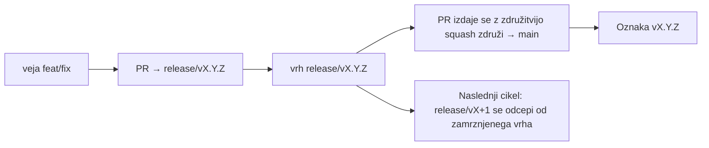

# Branching & Release Model (Slovenščina)

🌐 **Languages:** 🇺🇸 [English](../../../../ops/BRANCHING_MODEL.md) · 🇪🇹 [am](../../../am/docs/ops/BRANCHING_MODEL.md) · 🇸🇦 [ar](../../../ar/docs/ops/BRANCHING_MODEL.md) · 🇦🇿 [az](../../../az/docs/ops/BRANCHING_MODEL.md) · 🇧🇬 [bg](../../../bg/docs/ops/BRANCHING_MODEL.md) · 🇧🇩 [bn](../../../bn/docs/ops/BRANCHING_MODEL.md) · 🇧🇦 [bs](../../../bs/docs/ops/BRANCHING_MODEL.md) · 🇨🇿 [cs](../../../cs/docs/ops/BRANCHING_MODEL.md) · 🇩🇰 [da](../../../da/docs/ops/BRANCHING_MODEL.md) · 🇩🇪 [de](../../../de/docs/ops/BRANCHING_MODEL.md) · 🇬🇷 [el](../../../el/docs/ops/BRANCHING_MODEL.md) · 🇪🇸 [es](../../../es/docs/ops/BRANCHING_MODEL.md) · 🇪🇪 [et](../../../et/docs/ops/BRANCHING_MODEL.md) · 🇮🇷 [fa](../../../fa/docs/ops/BRANCHING_MODEL.md) · 🇫🇮 [fi](../../../fi/docs/ops/BRANCHING_MODEL.md) · 🇫🇷 [fr](../../../fr/docs/ops/BRANCHING_MODEL.md) · 🇮🇪 [ga](../../../ga/docs/ops/BRANCHING_MODEL.md) · 🇮🇳 [gu](../../../gu/docs/ops/BRANCHING_MODEL.md) · 🇳🇬 [ha](../../../ha/docs/ops/BRANCHING_MODEL.md) · 🇮🇱 [he](../../../he/docs/ops/BRANCHING_MODEL.md) · 🇮🇳 [hi](../../../hi/docs/ops/BRANCHING_MODEL.md) · 🇭🇷 [hr](../../../hr/docs/ops/BRANCHING_MODEL.md) · 🇭🇺 [hu](../../../hu/docs/ops/BRANCHING_MODEL.md) · 🇦🇲 [hy](../../../hy/docs/ops/BRANCHING_MODEL.md) · 🇮🇩 [id](../../../id/docs/ops/BRANCHING_MODEL.md) · 🇳🇬 [ig](../../../ig/docs/ops/BRANCHING_MODEL.md) · 🇮🇹 [it](../../../it/docs/ops/BRANCHING_MODEL.md) · 🇯🇵 [ja](../../../ja/docs/ops/BRANCHING_MODEL.md) · 🇬🇪 [ka](../../../ka/docs/ops/BRANCHING_MODEL.md) · 🇰🇭 [km](../../../km/docs/ops/BRANCHING_MODEL.md) · 🇮🇳 [kn](../../../kn/docs/ops/BRANCHING_MODEL.md) · 🇰🇷 [ko](../../../ko/docs/ops/BRANCHING_MODEL.md) · 🇱🇹 [lt](../../../lt/docs/ops/BRANCHING_MODEL.md) · 🇱🇻 [lv](../../../lv/docs/ops/BRANCHING_MODEL.md) · 🇮🇳 [ml](../../../ml/docs/ops/BRANCHING_MODEL.md) · 🇮🇳 [mr](../../../mr/docs/ops/BRANCHING_MODEL.md) · 🇲🇾 [ms](../../../ms/docs/ops/BRANCHING_MODEL.md) · 🇲🇹 [mt](../../../mt/docs/ops/BRANCHING_MODEL.md) · 🇲🇲 [my](../../../my/docs/ops/BRANCHING_MODEL.md) · 🇳🇵 [ne](../../../ne/docs/ops/BRANCHING_MODEL.md) · 🇳🇱 [nl](../../../nl/docs/ops/BRANCHING_MODEL.md) · 🇳🇴 [no](../../../no/docs/ops/BRANCHING_MODEL.md) · 🇮🇳 [or](../../../or/docs/ops/BRANCHING_MODEL.md) · 🇮🇳 [pa](../../../pa/docs/ops/BRANCHING_MODEL.md) · 🇵🇭 [phi](../../../phi/docs/ops/BRANCHING_MODEL.md) · 🇵🇱 [pl](../../../pl/docs/ops/BRANCHING_MODEL.md) · 🇵🇹 [pt](../../../pt/docs/ops/BRANCHING_MODEL.md) · 🇧🇷 [pt-BR](../../../pt-BR/docs/ops/BRANCHING_MODEL.md) · 🇷🇴 [ro](../../../ro/docs/ops/BRANCHING_MODEL.md) · 🇷🇺 [ru](../../../ru/docs/ops/BRANCHING_MODEL.md) · 🇱🇰 [si](../../../si/docs/ops/BRANCHING_MODEL.md) · 🇸🇰 [sk](../../../sk/docs/ops/BRANCHING_MODEL.md) · 🇷🇸 [sr](../../../sr/docs/ops/BRANCHING_MODEL.md) · 🇸🇪 [sv](../../../sv/docs/ops/BRANCHING_MODEL.md) · 🇰🇪 [sw](../../../sw/docs/ops/BRANCHING_MODEL.md) · 🇮🇳 [ta](../../../ta/docs/ops/BRANCHING_MODEL.md) · 🇮🇳 [te](../../../te/docs/ops/BRANCHING_MODEL.md) · 🇹🇭 [th](../../../th/docs/ops/BRANCHING_MODEL.md) · 🇹🇷 [tr](../../../tr/docs/ops/BRANCHING_MODEL.md) · 🇺🇦 [uk-UA](../../../uk-UA/docs/ops/BRANCHING_MODEL.md) · 🇵🇰 [ur](../../../ur/docs/ops/BRANCHING_MODEL.md) · 🇺🇿 [uz](../../../uz/docs/ops/BRANCHING_MODEL.md) · 🇻🇳 [vi](../../../vi/docs/ops/BRANCHING_MODEL.md) · 🇳🇬 [yo](../../../yo/docs/ops/BRANCHING_MODEL.md) · 🇨🇳 [zh-CN](../../../zh-CN/docs/ops/BRANCHING_MODEL.md) · 🇹🇼 [zh-TW](../../../zh-TW/docs/ops/BRANCHING_MODEL.md)

---

OmniRoute uporablja model izdajanja z **vzporednimi cikli**: namensko vejo `release/vX.Y.Z`
za aktivni cikel, `main` za objavljeno linijo in nespremenljivo
oznako `vX.Y.Z`, ko je cikel izdan. Pričakovano je, da se potrditve znajdejo tako na `release/*` _kot_ na
`main` — ne gre za pomoto.

Podrobnosti za vzdrževalce so v `CLAUDE.md` (strogo pravilo št. 21) in
[RELEASE_CHECKLIST.md](./RELEASE_CHECKLIST.md). Ta stran je javni
povzetek za sodelujoče.

## Kratek pregled

| Sklic             | Vloga                                                                                      |
| ----------------- | ------------------------------------------------------------------------------------------ |
| `release/vX.Y.Z`  | **Aktivni cikel** — vsakodnevni razvoj in združevanje PR-jev za to različico               |
| `main`            | **Objavljena linija** — ob izdaji prejme cikel prek združitve squash                       |
| `vX.Y.Z` (oznaka) | **Oznaka izdaje** — nespremenljiv kazalec na »to, kar je bilo izdano«, ustvarjen ob izdaji |



## Katero ciljno vejo naj ima moj PR?

**Ciljajte na aktivno vejo `release/vX.Y.Z` — ne na `main`.**

1. Poiščite najvišjo odprto vejo `release/v*` (primer v času pisanja:
   `release/v3.8.49`).
2. Ustvarite vejo iz njenega vrha (`git fetch` + checkout / rebase nanjo).
3. Odprite PR z nastavitvijo **base = ta `release/vX.Y.Z`**.

`main` ni veja za vsakodnevno integracijo. PR-je, odprte proti `main`,
je običajno treba pred združitvijo preusmeriti na drugo ciljno vejo.

## Zamrznitev izdaje (vzporedni cikli)

Ko poteka usklajevanje izdaje, se odpre označevalna zadeva z oznako `release-freeze`.
To **ne ustavi razvoja**:

- Zamrznjena veja `release/vX.Y.Z` pripada vodji te izdaje.
- Veja naslednjega cikla `release/vX+1` se odcepi od zamrznjenega vrha, da lahko sodelujoči
  nadaljujejo z vključevanjem sprememb.
- Odprte PR-je, ki še vedno ciljajo na zamrznjeno vejo, je treba **preusmeriti** na
  aktivno (najvišjo) vejo `release/v*`.

Preden domnevate, da je želeno vejo mogoče združevati, preverite, ali obstaja odprta zamrznitev:

```bash
gh issue list --repo diegosouzapw/OmniRoute --label release-freeze --state open
```

Mehanika združevanja (lastnik doda oznako `queue` → Mergify) je dokumentirana v
[MERGE_TRAIN.md](./MERGE_TRAIN.md).

## Zakaj tako veja kot oznaka?

| Artefakt         | Življenjska doba | Namen                                                                  |
| ---------------- | ---------------- | ---------------------------------------------------------------------- |
| `release/vX.Y.Z` | Cikel v teku     | Zbira pregledane PR-je, ostaja zelena v CI-ju in je ciljna veja PR-jev |
| Oznaka `vX.Y.Z`  | Za vedno         | Označuje točno vsebino, ki je bila izdana v npm / GitHub Releases      |

Veja je delavnica, oznaka pa zapečaten paket. Po združitvi squash v
`main` se naslednji cikel nadaljuje na `release/vX+1`, ne da bi čakal, da se PR prejšnje
izdaje zaključi.

## Povezana dokumentacija

- [CONTRIBUTING.md](../../CONTRIBUTING.md) — nastavitev, testi, kontrolni seznam za PR
- [RELEASE_CHECKLIST.md](./RELEASE_CHECKLIST.md) — preverjanje pred izdajo
- [MERGE_TRAIN.md](./MERGE_TRAIN.md) — čakalna vrsta za združevanje in nadomestni vlak združevanja
- [RELEASE_GREEN.md](./RELEASE_GREEN.md) — ohranjanje zelenega vrha izdaje
