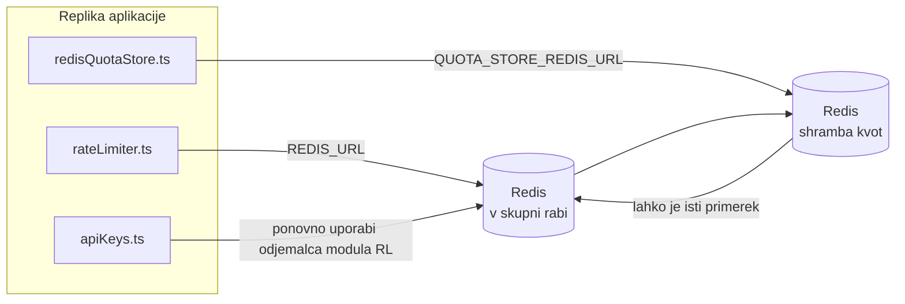

# Redis Production Configuration Guide (Slovenščina)

🌐 **Languages:** 🇺🇸 [English](../../../../ops/REDIS_PRODUCTION_CONFIG.md) · 🇪🇹 [am](../../../am/docs/ops/REDIS_PRODUCTION_CONFIG.md) · 🇸🇦 [ar](../../../ar/docs/ops/REDIS_PRODUCTION_CONFIG.md) · 🇦🇿 [az](../../../az/docs/ops/REDIS_PRODUCTION_CONFIG.md) · 🇧🇬 [bg](../../../bg/docs/ops/REDIS_PRODUCTION_CONFIG.md) · 🇧🇩 [bn](../../../bn/docs/ops/REDIS_PRODUCTION_CONFIG.md) · 🇧🇦 [bs](../../../bs/docs/ops/REDIS_PRODUCTION_CONFIG.md) · 🇨🇿 [cs](../../../cs/docs/ops/REDIS_PRODUCTION_CONFIG.md) · 🇩🇰 [da](../../../da/docs/ops/REDIS_PRODUCTION_CONFIG.md) · 🇩🇪 [de](../../../de/docs/ops/REDIS_PRODUCTION_CONFIG.md) · 🇬🇷 [el](../../../el/docs/ops/REDIS_PRODUCTION_CONFIG.md) · 🇪🇸 [es](../../../es/docs/ops/REDIS_PRODUCTION_CONFIG.md) · 🇪🇪 [et](../../../et/docs/ops/REDIS_PRODUCTION_CONFIG.md) · 🇮🇷 [fa](../../../fa/docs/ops/REDIS_PRODUCTION_CONFIG.md) · 🇫🇮 [fi](../../../fi/docs/ops/REDIS_PRODUCTION_CONFIG.md) · 🇫🇷 [fr](../../../fr/docs/ops/REDIS_PRODUCTION_CONFIG.md) · 🇮🇪 [ga](../../../ga/docs/ops/REDIS_PRODUCTION_CONFIG.md) · 🇮🇳 [gu](../../../gu/docs/ops/REDIS_PRODUCTION_CONFIG.md) · 🇳🇬 [ha](../../../ha/docs/ops/REDIS_PRODUCTION_CONFIG.md) · 🇮🇱 [he](../../../he/docs/ops/REDIS_PRODUCTION_CONFIG.md) · 🇮🇳 [hi](../../../hi/docs/ops/REDIS_PRODUCTION_CONFIG.md) · 🇭🇷 [hr](../../../hr/docs/ops/REDIS_PRODUCTION_CONFIG.md) · 🇭🇺 [hu](../../../hu/docs/ops/REDIS_PRODUCTION_CONFIG.md) · 🇦🇲 [hy](../../../hy/docs/ops/REDIS_PRODUCTION_CONFIG.md) · 🇮🇩 [id](../../../id/docs/ops/REDIS_PRODUCTION_CONFIG.md) · 🇳🇬 [ig](../../../ig/docs/ops/REDIS_PRODUCTION_CONFIG.md) · 🇮🇹 [it](../../../it/docs/ops/REDIS_PRODUCTION_CONFIG.md) · 🇯🇵 [ja](../../../ja/docs/ops/REDIS_PRODUCTION_CONFIG.md) · 🇬🇪 [ka](../../../ka/docs/ops/REDIS_PRODUCTION_CONFIG.md) · 🇰🇭 [km](../../../km/docs/ops/REDIS_PRODUCTION_CONFIG.md) · 🇮🇳 [kn](../../../kn/docs/ops/REDIS_PRODUCTION_CONFIG.md) · 🇰🇷 [ko](../../../ko/docs/ops/REDIS_PRODUCTION_CONFIG.md) · 🇱🇹 [lt](../../../lt/docs/ops/REDIS_PRODUCTION_CONFIG.md) · 🇱🇻 [lv](../../../lv/docs/ops/REDIS_PRODUCTION_CONFIG.md) · 🇮🇳 [ml](../../../ml/docs/ops/REDIS_PRODUCTION_CONFIG.md) · 🇮🇳 [mr](../../../mr/docs/ops/REDIS_PRODUCTION_CONFIG.md) · 🇲🇾 [ms](../../../ms/docs/ops/REDIS_PRODUCTION_CONFIG.md) · 🇲🇹 [mt](../../../mt/docs/ops/REDIS_PRODUCTION_CONFIG.md) · 🇲🇲 [my](../../../my/docs/ops/REDIS_PRODUCTION_CONFIG.md) · 🇳🇵 [ne](../../../ne/docs/ops/REDIS_PRODUCTION_CONFIG.md) · 🇳🇱 [nl](../../../nl/docs/ops/REDIS_PRODUCTION_CONFIG.md) · 🇳🇴 [no](../../../no/docs/ops/REDIS_PRODUCTION_CONFIG.md) · 🇮🇳 [or](../../../or/docs/ops/REDIS_PRODUCTION_CONFIG.md) · 🇮🇳 [pa](../../../pa/docs/ops/REDIS_PRODUCTION_CONFIG.md) · 🇵🇭 [phi](../../../phi/docs/ops/REDIS_PRODUCTION_CONFIG.md) · 🇵🇱 [pl](../../../pl/docs/ops/REDIS_PRODUCTION_CONFIG.md) · 🇵🇹 [pt](../../../pt/docs/ops/REDIS_PRODUCTION_CONFIG.md) · 🇧🇷 [pt-BR](../../../pt-BR/docs/ops/REDIS_PRODUCTION_CONFIG.md) · 🇷🇴 [ro](../../../ro/docs/ops/REDIS_PRODUCTION_CONFIG.md) · 🇷🇺 [ru](../../../ru/docs/ops/REDIS_PRODUCTION_CONFIG.md) · 🇱🇰 [si](../../../si/docs/ops/REDIS_PRODUCTION_CONFIG.md) · 🇸🇰 [sk](../../../sk/docs/ops/REDIS_PRODUCTION_CONFIG.md) · 🇷🇸 [sr](../../../sr/docs/ops/REDIS_PRODUCTION_CONFIG.md) · 🇸🇪 [sv](../../../sv/docs/ops/REDIS_PRODUCTION_CONFIG.md) · 🇰🇪 [sw](../../../sw/docs/ops/REDIS_PRODUCTION_CONFIG.md) · 🇮🇳 [ta](../../../ta/docs/ops/REDIS_PRODUCTION_CONFIG.md) · 🇮🇳 [te](../../../te/docs/ops/REDIS_PRODUCTION_CONFIG.md) · 🇹🇭 [th](../../../th/docs/ops/REDIS_PRODUCTION_CONFIG.md) · 🇹🇷 [tr](../../../tr/docs/ops/REDIS_PRODUCTION_CONFIG.md) · 🇺🇦 [uk-UA](../../../uk-UA/docs/ops/REDIS_PRODUCTION_CONFIG.md) · 🇵🇰 [ur](../../../ur/docs/ops/REDIS_PRODUCTION_CONFIG.md) · 🇺🇿 [uz](../../../uz/docs/ops/REDIS_PRODUCTION_CONFIG.md) · 🇻🇳 [vi](../../../vi/docs/ops/REDIS_PRODUCTION_CONFIG.md) · 🇳🇬 [yo](../../../yo/docs/ops/REDIS_PRODUCTION_CONFIG.md) · 🇨🇳 [zh-CN](../../../zh-CN/docs/ops/REDIS_PRODUCTION_CONFIG.md) · 🇹🇼 [zh-TW](../../../zh-TW/docs/ops/REDIS_PRODUCTION_CONFIG.md)

---

## Pregled

Redis je v OmniRoute **neobvezna, šibka odvisnost** — ko Redis ni na voljo, aplikacija še naprej deluje z zmanjšano zmogljivostjo (z nadomestnimi rešitvami v pomnilniku). V produkciji prilagoditev nastavitev Redis zmanjša zakasnitev pri štirih ločenih delovnih obremenitvah:

| Delovna obremenitev            | Gonilnik                      | Tovarna odjemalcev                                       | Vzorec ključev                                              |
| ------------------------------ | ----------------------------- | -------------------------------------------------------- | ----------------------------------------------------------- |
| Omejevanje hitrosti            | `rateLimiter.ts`              | `getRedisClient()` — leno inicializiran edinec `ioredis` | `<prefix>rl:*` Lua-atomska časovna okna omejevanja hitrosti |
| Predpomnilnik za avtentikacijo | `apiKeys.ts`                  | Ponovno uporabi odjemalca modula `rateLimiter`           | `<prefix>auth:api_key:<sha256>` s TTL                       |
| Shramba kvot                   | `redisQuotaStore.ts`          | Ločen edinec `getRedisClient(url)`                       | `<prefix>quota:*`, nastavljivo za posamezen primerek        |
| Odklopnik za ogrevanje         | `redisCircuitBreakerStore.ts` | Ločen odjemalec v `circuitBreakerFactory.ts`             | `<prefix>warmup:cb:<connectionId>`                          |

Vse štiri delovne obremenitve uporabljajo skupno predpono imenskega prostora, zato lahko OmniRoute sobiva z drugimi aplikacijami v enem primerku Redis (npr. `127.0.0.1:6379`). Glejte [Imenski prostori ključev](#imenski-prostori-ključev).

---

## Trenutna konfiguracija (privzete vrednosti v kodi)

| Nastavitev                                     | Vrednost                                                                   | Kje                                                                                   |
| ---------------------------------------------- | -------------------------------------------------------------------------- | ------------------------------------------------------------------------------------- |
| Okoljska spremenljivka `REDIS_URL`             | `redis://redis:6379` (compose), neobvezno                                  | `rateLimiter.ts:5`, `.env.example`                                                    |
| Okoljska spremenljivka `REDIS_KEY_PREFIX`      | `omniroute:` (privzeto)                                                    | `rateLimiter.ts`, `redisQuotaStore.ts`, `redisCircuitBreakerStore.ts`, `.env.example` |
| Okoljska spremenljivka `QUOTA_STORE_REDIS_URL` | ločena, lahko se razlikuje od `REDIS_URL`                                  | `quota/storeFactory.ts`                                                               |
| `QUOTA_STORE_DRIVER`                           | `"sqlite"` (privzeto), `"redis"` neobvezno                                 | `quota/storeFactory.ts`                                                               |
| `maxRetriesPerRequest` za ioredis              | `3`                                                                        | ustvarjanje odjemalca v `rateLimiter.ts`                                              |
| `enableReadyCheck`                             | ni nastavljeno (privzeta vrednost ioredis: `true`)                         | —                                                                                     |
| `lazyConnect`                                  | ni nastavljeno (privzeta vrednost ioredis: `false`)                        | —                                                                                     |
| `retryStrategy`                                | ni nastavljeno (privzeto za ioredis: osnova 200 ms, eksponentno)           | —                                                                                     |
| TLS / geslo / indeks podatkovne zbirke         | **ni konfigurirano**                                                       | —                                                                                     |
| Sentinel / Cluster                             | **ni konfigurirano** — podprt je samo samostojen primerek z enim vozliščem | —                                                                                     |

---

## Imenski prostori ključev

OmniRoute si primerek Redis deli z vsem drugim, kar se izvaja na gostitelju. Brez imenskega prostora bi lahko ključi, kot sta `auth:api_key:<sha256>` ali `rl:*`, prišli v navzkrižje s ključi drugih aplikacij, ki uporabljajo isti Redis (ta primerek izvaja Redis na `127.0.0.1:6379` skupaj z drugimi storitvami).

Nastavite `REDIS_KEY_PREFIX` na neprazen niz, da dodate predpono **vsakemu** ključu OmniRoute:

```bash
# .env — vsi ključi OmniRoute postanejo omniroute:rl:*, omniroute:auth:*, omniroute:quota:*, omniroute:warmup:cb:*
REDIS_KEY_PREFIX=omniroute:
```

- **Privzeto:** `omniroute:` (uporabi se, ko `REDIS_KEY_PREFIX` ni nastavljen ali je prazen).
- **Uporablja se za:** omejevalnik hitrosti + predpomnilnik za avtentikacijo (skupni odjemalec `ioredis` prek `keyPrefix`), shrambo kvot (`KEY_PREFIX = "${REDIS_KEY_PREFIX}quota"`) in odklopnik za ogrevanje (`KEY_PREFIX = "${REDIS_KEY_PREFIX}warmup:cb:"`).
- **Sprememba predpone**, ko ključi že obstajajo v Redis, osiroti stare ključe (potečejo prek TTL / LRU). Predpono je varno spremeniti; migracija ni potrebna. Edina izjema je ključ odklopnika za ogrevanje za povezavo, označeno kot prepovedano: ta se shrani brez TTL, zato preostale ključe izpišite z `redis-cli --scan --pattern '<old-prefix>warmup:cb:*'` in jih izbrišite.
- **`keyPrefix` v ioredis** samodejno doda predpono pri zapisovanju **in** jo odstrani pri branju, zato aplikacijska koda predpone nikoli ne vidi.

---

## Priporočene produkcijske nastavitve

### 1. Možnosti povezovalnega sklada/odjemalca (konstruktor ioredis `Redis`)

Trenutna koda ustvari en sam `new Redis(url)` brez možnosti po meri. Za produkcijske
postavitve z več replikami v kodi posredujte tovarno odjemalcev ali ovijte `getRedisClient()`:

```typescript
const redis = new Redis(REDIS_URL, {
  maxRetriesPerRequest: null, // brez omejitve ponovitev; odločitev prepustite retryStrategy
  enableReadyCheck: true, // pred sprejemanjem klicev preveri, ali je strežnik pripravljen
  lazyConnect: true, // ne poveži se ob ustvarjanju; počakaj na prvi klic
  retryStrategy: (times) => {
    if (times > 10) return null; // po 10 ponovitvah obupaj → znova se poveži pozneje
    return Math.min(times * 200, 5000); // 200 ms, 400 ms, …, omejitev 5 s
  },
  enableAutoPipelining: true, // združi sočasne ukaze v en zapis TCP
  keepAlive: 10000, // preverjanje aktivnosti TCP vsakih 10 s
});
```

**Ključni kompromisi:**

- `maxRetriesPerRequest: null` + `retryStrategy` — priporočeno za produkcijo, da prehodni
  ponovni zagoni Redisa ne povzročijo takojšnje neuspešnosti vseh zahtev. Rezervni mehanizem
  v pomnilniku v `checkRateLimit()` prestreže pot ob napaki.
- `lazyConnect: true` — prepreči, da bi bil zagon odvisen od razpoložljivosti Redisa, preden
  začne strežnik sprejemati povezave.
- `enableAutoPipelining: true` — zmanjša število omrežnih obhodov pri sočasnih preverjanjih omejitve hitrosti;
  koristno pri >50 RPS na eni povezavi.

### 2. Konfiguracija strežnika Redis (`redis.conf`)

```
# Pomnilnik
maxmemory 80%                        # pustite prostor za predpomnilnik strani operacijskega sistema
maxmemory-policy allkeys-lru         # ob obremenitvi odstrani zastarele vnose avtentikacijskega predpomnilnika

# Trajnost podatkov (izbirno — OmniRoute je varen ob sesutju tudi brez nje)
save 300 1                           # posnetek najmanj vsakih 5 min, če se je spremenil ≥1 ključ
appendonly no                        # AOF ni potreben; podatke je mogoče ponovno ustvariti
appendfsync no                       # brez režije fsync (RDB zadostuje)

# Omrežje
timeout 0                            # brez prekinitve nedejavne povezave
tcp-keepalive 300                    # preverjanje aktivnosti vsakih 5 min
tcp-backlog 511                      # čakalna vrsta povezav za sunkovito obremenitev

# Zmogljivost
hz 10                                # privzeto; 100 za primere, občutljive na zakasnitev
activedefrag yes                     # samodejna defragmentacija, ko je fragmentacija >10 %
```

**Kompromis pri `maxmemory-policy allkeys-lru`:** Vnosi avtentikacijskega predpomnilnika se lahko ob
pomanjkanju pomnilnika odstranijo. To je varno — `setCachedApiKey` ob zgrešitvi vedno znova zapolni
predpomnilnik, rezervni mehanizem SQLite pa je avtoritativen. Skript Lua za omejevanje hitrosti ustvarja
majhne ključe, ki so namensko kratkotrajni.

### 3. Nastavitve Docker Compose

Produkcijska konfiguracija Compose (`docker-compose.prod.yml`) uporablja `redis:8.6.2-alpine`. Dodajte:

```yaml
redis:
  image: redis:8.6.2-alpine
  command:
    [
      "redis-server",
      "--maxmemory",
      "512mb",
      "--maxmemory-policy",
      "allkeys-lru",
      "--activedefrag",
      "yes",
      "--save",
      "300 1",
    ]
  healthcheck:
    test: ["CMD", "redis-cli", "ping"]
    interval: 10s
    timeout: 3s
    retries: 3
    start_period: 5s
```

### 4. Vidiki več primerkov in skaliranja

**En Redis za vse replike** — skript Lua za omejevanje hitrosti je odvisen od enega
avtoritativnega prostora ključev. Več primerkov Redisa za replikami bi odpravilo atomarnost
in podvojilo proračun. Za vse replike aplikacije uporabite en Redis (ali gručo Redis Sentinel
s samodejnim preklopom ob izpadu).

**Število povezav:** Vsaka replika aplikacije odpre **2 povezavi TCP** z Redisom
(odjemalec omejevalnika hitrosti + odjemalec shrambe kvot). Pri 10 replikah → 20 povezav, kar je
precej pod privzeto zgornjo mejo 10.000 povezav posameznega primerka Redisa.

### 5. Spremljanje

Izpostavite prek končne točke za preverjanje zdravja:

```typescript
// src/app/api/monitoring/health/route.ts že kliče funkcije rateLimiter
// Dodajte preverjanja, specifična za Redis:
//   1. Zakasnitev PING prek ioredis .ping()
//   2. Poraba pomnilnika prek INFO memory
//   3. Število povezav prek INFO clients
//   4. Delež zadetkov za maxmemory-policy (evicted_keys / keyspace_hits)
```

Ključne metrike za spremljanje:

- **Odstranjeni ključi/s** — če je vrednost vztrajno različna od nič, povečajte `maxmemory`
- **Blokirani odjemalci** — vrednost, različna od nič, kaže na počasne skripte Lua ali veliko tekmovanje za vire
- **Zavrnjene povezave** — dosežena je omejitev povezav; pri 20 povezavah je to redko

---

## Arhitekturni diagram



---

## Reference

| Datoteka                           | Namen                                                                                        |
| ---------------------------------- | -------------------------------------------------------------------------------------------- |
| `src/shared/utils/rateLimiter.ts`  | Primarni odjemalec Redis, skript Lua za omejevanje hitrosti, nadomestna rešitev v pomnilniku |
| `src/lib/db/apiKeys.ts`            | Predpomnilnik za avtentikacijo — nadomestni prehod Redis→SQLite                              |
| `src/lib/quota/redisQuotaStore.ts` | Ločen odjemalec Redis za izbirno shrambo kvot                                                |
| `src/lib/quota/storeFactory.ts`    | Preklaplja med gonilnikoma za kvote `sqlite` in `redis`                                      |
| `docker-compose.prod.yml`          | Vsebnik Redis za produkcijo (slika `redis:8.6.2-alpine`)                                     |
| `.env.example`                     | Dokumentacija spremenljivk okolja za Redis                                                   |
| `src/app/api/local/redis/`         | Poti API za orkestracijo razvojnega vsebnika                                                 |
| `bin/cli/commands/redis.mjs`       | Ukazi CLI za orkestracijo razvojnega vsebnika                                                |
