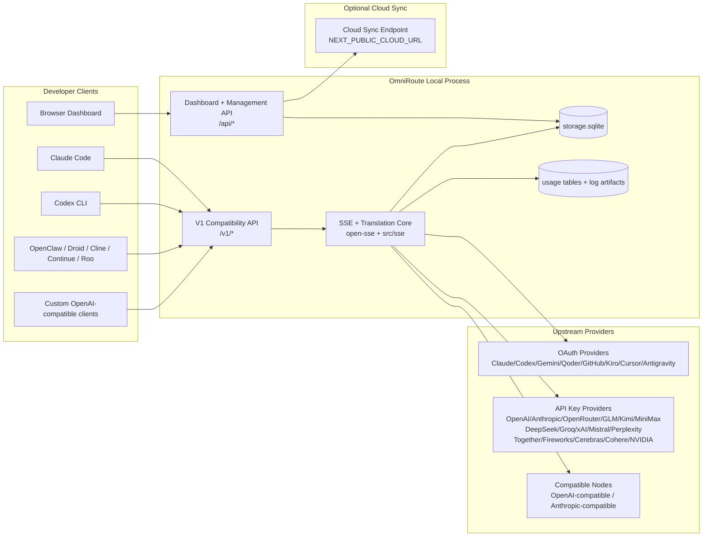
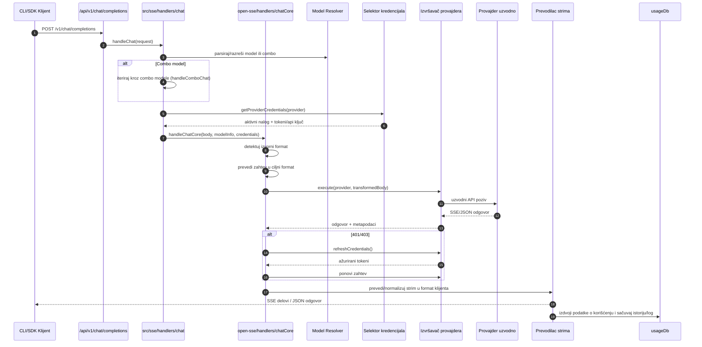
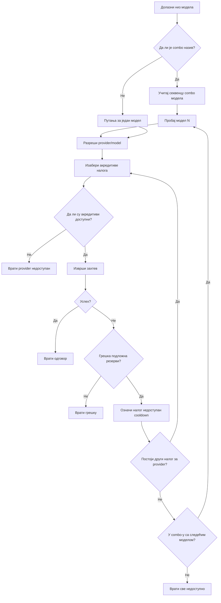
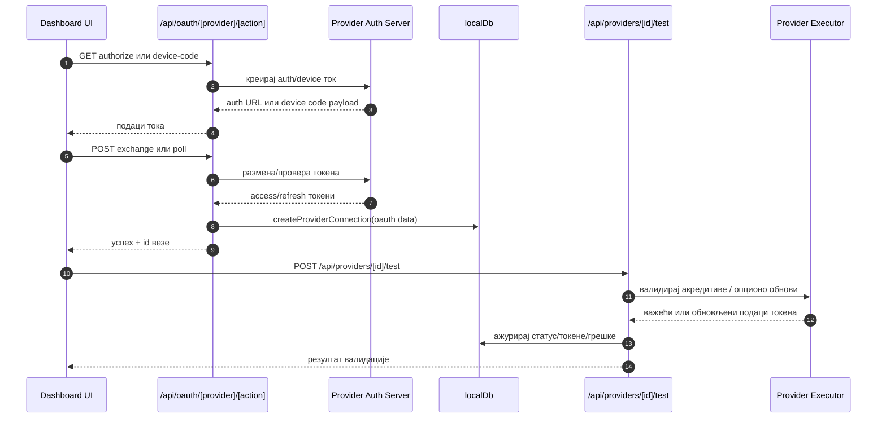
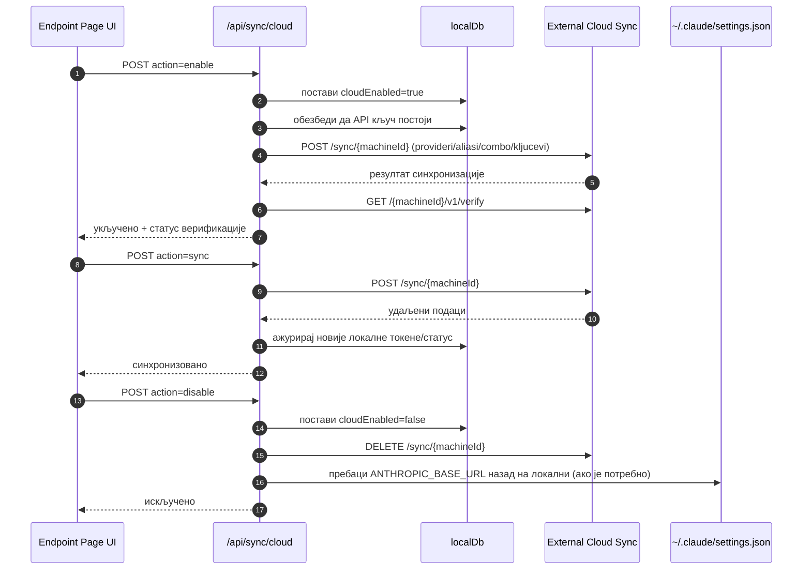
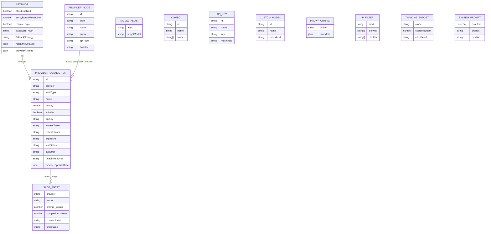
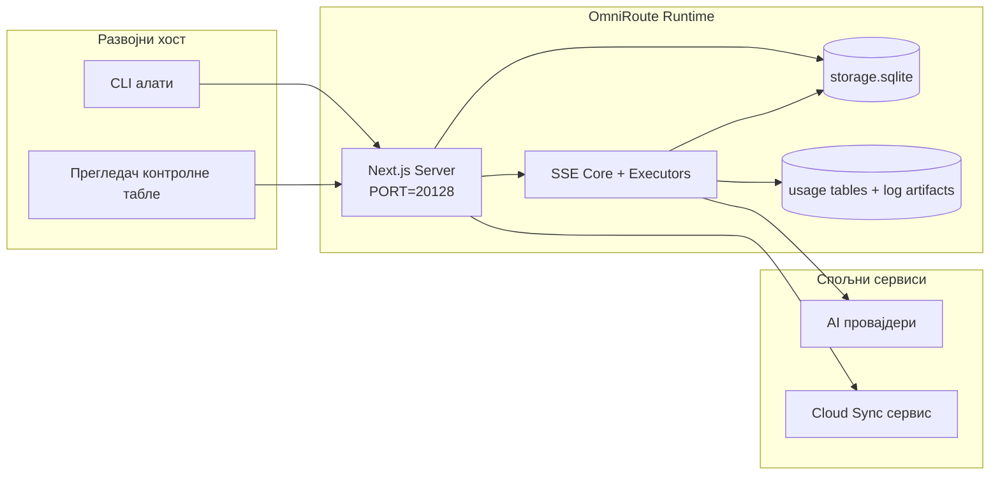

# ARCHITECTURE (Српски)

🌐 **Languages:** 🇺🇸 [English](../../../../architecture/ARCHITECTURE.md) · 🇸🇦 [ar](../../../ar/docs/architecture/ARCHITECTURE.md) · 🇦🇿 [az](../../../az/docs/architecture/ARCHITECTURE.md) · 🇧🇬 [bg](../../../bg/docs/architecture/ARCHITECTURE.md) · 🇧🇩 [bn](../../../bn/docs/architecture/ARCHITECTURE.md) · 🇨🇿 [cs](../../../cs/docs/architecture/ARCHITECTURE.md) · 🇩🇰 [da](../../../da/docs/architecture/ARCHITECTURE.md) · 🇩🇪 [de](../../../de/docs/architecture/ARCHITECTURE.md) · 🇬🇷 [el](../../../el/docs/architecture/ARCHITECTURE.md) · 🇪🇸 [es](../../../es/docs/architecture/ARCHITECTURE.md) · 🇪🇪 [et](../../../et/docs/architecture/ARCHITECTURE.md) · 🇮🇷 [fa](../../../fa/docs/architecture/ARCHITECTURE.md) · 🇫🇮 [fi](../../../fi/docs/architecture/ARCHITECTURE.md) · 🇫🇷 [fr](../../../fr/docs/architecture/ARCHITECTURE.md) · 🇮🇪 [ga](../../../ga/docs/architecture/ARCHITECTURE.md) · 🇮🇳 [gu](../../../gu/docs/architecture/ARCHITECTURE.md) · 🇮🇱 [he](../../../he/docs/architecture/ARCHITECTURE.md) · 🇮🇳 [hi](../../../hi/docs/architecture/ARCHITECTURE.md) · 🇭🇷 [hr](../../../hr/docs/architecture/ARCHITECTURE.md) · 🇭🇺 [hu](../../../hu/docs/architecture/ARCHITECTURE.md) · 🇮🇩 [id](../../../id/docs/architecture/ARCHITECTURE.md) · 🇮🇹 [it](../../../it/docs/architecture/ARCHITECTURE.md) · 🇯🇵 [ja](../../../ja/docs/architecture/ARCHITECTURE.md) · 🇰🇷 [ko](../../../ko/docs/architecture/ARCHITECTURE.md) · 🇱🇹 [lt](../../../lt/docs/architecture/ARCHITECTURE.md) · 🇱🇻 [lv](../../../lv/docs/architecture/ARCHITECTURE.md) · 🇮🇳 [mr](../../../mr/docs/architecture/ARCHITECTURE.md) · 🇲🇾 [ms](../../../ms/docs/architecture/ARCHITECTURE.md) · 🇲🇹 [mt](../../../mt/docs/architecture/ARCHITECTURE.md) · 🇳🇱 [nl](../../../nl/docs/architecture/ARCHITECTURE.md) · 🇳🇴 [no](../../../no/docs/architecture/ARCHITECTURE.md) · 🇵🇭 [phi](../../../phi/docs/architecture/ARCHITECTURE.md) · 🇵🇱 [pl](../../../pl/docs/architecture/ARCHITECTURE.md) · 🇵🇹 [pt](../../../pt/docs/architecture/ARCHITECTURE.md) · 🇧🇷 [pt-BR](../../../pt-BR/docs/architecture/ARCHITECTURE.md) · 🇷🇴 [ro](../../../ro/docs/architecture/ARCHITECTURE.md) · 🇷🇺 [ru](../../../ru/docs/architecture/ARCHITECTURE.md) · 🇸🇰 [sk](../../../sk/docs/architecture/ARCHITECTURE.md) · 🇸🇮 [sl](../../../sl/docs/architecture/ARCHITECTURE.md) · 🇸🇪 [sv](../../../sv/docs/architecture/ARCHITECTURE.md) · 🇰🇪 [sw](../../../sw/docs/architecture/ARCHITECTURE.md) · 🇮🇳 [ta](../../../ta/docs/architecture/ARCHITECTURE.md) · 🇮🇳 [te](../../../te/docs/architecture/ARCHITECTURE.md) · 🇹🇭 [th](../../../th/docs/architecture/ARCHITECTURE.md) · 🇹🇷 [tr](../../../tr/docs/architecture/ARCHITECTURE.md) · 🇺🇦 [uk-UA](../../../uk-UA/docs/architecture/ARCHITECTURE.md) · 🇵🇰 [ur](../../../ur/docs/architecture/ARCHITECTURE.md) · 🇻🇳 [vi](../../../vi/docs/architecture/ARCHITECTURE.md) · 🇨🇳 [zh-CN](../../../zh-CN/docs/architecture/ARCHITECTURE.md) · 🇹🇼 [zh-TW](../../../zh-TW/docs/architecture/ARCHITECTURE.md)

---

---

title: "OmniRoute Architecture"
version: 3.8.40
lastUpdated: 2026-06-28
---

# OmniRoute Architecture

🌐 **Languages:** 🇺🇸 [English](../../../../architecture/ARCHITECTURE.md) · 🇸🇦 [ar](../../../ar/docs/architecture/ARCHITECTURE.md) · 🇦🇿 [az](../../../az/docs/architecture/ARCHITECTURE.md) · 🇧🇬 [bg](../../../bg/docs/architecture/ARCHITECTURE.md) · 🇧🇩 [bn](../../../bn/docs/architecture/ARCHITECTURE.md) · 🇨🇿 [cs](../../../cs/docs/architecture/ARCHITECTURE.md) · 🇩🇰 [da](../../../da/docs/architecture/ARCHITECTURE.md) · 🇩🇪 [de](../../../de/docs/architecture/ARCHITECTURE.md) · 🇬🇷 [el](../../../el/docs/architecture/ARCHITECTURE.md) · 🇪🇸 [es](../../../es/docs/architecture/ARCHITECTURE.md) · 🇪🇪 [et](../../../et/docs/architecture/ARCHITECTURE.md) · 🇮🇷 [fa](../../../fa/docs/architecture/ARCHITECTURE.md) · 🇫🇮 [fi](../../../fi/docs/architecture/ARCHITECTURE.md) · 🇫🇷 [fr](../../../fr/docs/architecture/ARCHITECTURE.md) · 🇮🇪 [ga](../../../ga/docs/architecture/ARCHITECTURE.md) · 🇮🇳 [gu](../../../gu/docs/architecture/ARCHITECTURE.md) · 🇮🇱 [he](../../../he/docs/architecture/ARCHITECTURE.md) · 🇮🇳 [hi](../../../hi/docs/architecture/ARCHITECTURE.md) · 🇭🇷 [hr](../../../hr/docs/architecture/ARCHITECTURE.md) · 🇭🇺 [hu](../../../hu/docs/architecture/ARCHITECTURE.md) · 🇮🇩 [id](../../../id/docs/architecture/ARCHITECTURE.md) · 🇮🇹 [it](../../../it/docs/architecture/ARCHITECTURE.md) · 🇯🇵 [ja](../../../ja/docs/architecture/ARCHITECTURE.md) · 🇰🇷 [ko](../../../ko/docs/architecture/ARCHITECTURE.md) · 🇱🇹 [lt](../../../lt/docs/architecture/ARCHITECTURE.md) · 🇱🇻 [lv](../../../lv/docs/architecture/ARCHITECTURE.md) · 🇮🇳 [mr](../../../mr/docs/architecture/ARCHITECTURE.md) · 🇲🇾 [ms](../../../ms/docs/architecture/ARCHITECTURE.md) · 🇲🇹 [mt](../../../mt/docs/architecture/ARCHITECTURE.md) · 🇳🇱 [nl](../../../nl/docs/architecture/ARCHITECTURE.md) · 🇳🇴 [no](../../../no/docs/architecture/ARCHITECTURE.md) · 🇵🇭 [phi](../../../phi/docs/architecture/ARCHITECTURE.md) · 🇵🇱 [pl](../../../pl/docs/architecture/ARCHITECTURE.md) · 🇵🇹 [pt](../../../pt/docs/architecture/ARCHITECTURE.md) · 🇧🇷 [pt-BR](../../../pt-BR/docs/architecture/ARCHITECTURE.md) · 🇷🇴 [ro](../../../ro/docs/architecture/ARCHITECTURE.md) · 🇷🇺 [ru](../../../ru/docs/architecture/ARCHITECTURE.md) · 🇸🇰 [sk](../../../sk/docs/architecture/ARCHITECTURE.md) · 🇸🇮 [sl](../../../sl/docs/architecture/ARCHITECTURE.md) · 🇸🇪 [sv](../../../sv/docs/architecture/ARCHITECTURE.md) · 🇰🇪 [sw](../../../sw/docs/architecture/ARCHITECTURE.md) · 🇮🇳 [ta](../../../ta/docs/architecture/ARCHITECTURE.md) · 🇮🇳 [te](../../../te/docs/architecture/ARCHITECTURE.md) · 🇹🇭 [th](../../../th/docs/architecture/ARCHITECTURE.md) · 🇹🇷 [tr](../../../tr/docs/architecture/ARCHITECTURE.md) · 🇺🇦 [uk-UA](../../../uk-UA/docs/architecture/ARCHITECTURE.md) · 🇵🇰 [ur](../../../ur/docs/architecture/ARCHITECTURE.md) · 🇻🇳 [vi](../../../vi/docs/architecture/ARCHITECTURE.md) · 🇨🇳 [zh-CN](../../../zh-CN/docs/architecture/ARCHITECTURE.md) · 🇹🇼 [zh-TW](../../../zh-TW/docs/architecture/ARCHITECTURE.md)

_Последње ажурирано: 2026-06-28_

## Кратак преглед

OmniRoute је локални gateway за AI рутирање и контролна табла изграђена на Next.js.
Обезбеђује јединствену OpenAI-компатибилну крајњу тачку (`/v1/*`) и рутира саобраћај кроз више upstream провајдера уз превод, резервни режим (fallback), обнову токена и праћење потрошње.

Основне могућности:

- OpenAI-компатибилан API за CLI/алате (355 провајдера, 108 извршилаца)
- Превод захтева/одговора кроз формате различитих провајдера
- Резервни режим комбинације модела (секвенца више модела)
- Структурирани кораци комбинације (`provider + model + connection`) са runtime уређивањем по `compositeTiers`
- Резервни режим на нивоу налога (више налога по провајдеру)
- Претходна провера квоте и P2C бирање налога уз свест о квоти у главној путањи ћаскања (chat)
- Управљање OAuth + API-key повезивањем провајдера (22 OAuth модула провајдера)
- Генерисање embedding-а преко `/v1/embeddings` (18 провајдера)
- Генерисање слика преко `/v1/images/generations` (10+ провајдера, 20+ модела)
- Транскрипција аудио записа преко `/v1/audio/transcriptions` (18 провајдера)
- Претварање текста у говор преко `/v1/audio/speech` (24 уграђена провајдера)
- Генерисање видеа преко `/v1/videos/generations` (ComfyUI + SD WebUI)
- Генерисање музике преко `/v1/music/generations` (ComfyUI)
- Веб претрага преко `/v1/search` (20 провајдера)
- Модерации преко `/v1/moderations`
- Reranking преко `/v1/rerank`
- Рашчлањивање think ознака (``) за моделе који закључују (reasoning)
- Санитизација одговора за строгу компатибилност са OpenAI SDK
- Нормализација улога (developer→system, system→user) за компатибилност између провајдера
- Конверзија структурираног излаза (json_schema → Gemini responseSchema)
- Локална персистенција за провајдере, кључеве, алијасе, комбинације, подешавања, цене (122 модула базе података)
- Праћење потрошње/трошкова и логовање захтева
- Опциона синхронизација у облаку за синхронизацију стања на више уређаја
- IP allowlist/blocklist листа за контролу приступа API-ју
- Управљање буџетом размишљања (passthrough/аутоматски/прилагођено/адаптивно)
- Убацивање глобалног системског упита (prompt)
- Праћење сесија и „отисака прста“ (fingerprinting)
- Побољшано ограничавање брзине по налогу са профилима специфичним за провајдера
- Образац „circuit breaker“ за отпорност провајдера
- Заштита против „thundering herd“ ефекта уз mutex закључавање
- Кеш за дедупликацију захтева на основу потписа
- Домен слоја: правила трошкова, политика резервног режима, политика закључавања
- Context Relay: сажеци предаје сесије за континуитет ротације налога
- Персистенција стања домена (SQLite write-through кеш за резервне режиме, буџете, закључавања, circuit breaker-е)
- Механизам политика за централизовану евалуацију захтева (закључавање → буџет → резервни режим)
- Телеметрија захтева са агрегацијом латенције p50/p95/p99
- Телеметрија циљева комбинације и историјско здравље циљева комбинације преко `combo_execution_key` / `combo_step_id`
- Correlation ID (X-Request-Id) за трасирање од краја до краја
- Логовање ревизије усклађености (compliance audit) са могућношћу искључивања по API кључу
- Eval оквир за осигурање квалитета LLM-а
- Контролна табла здравља са статусом circuit breaker-а провајдера у реалном времену
- MCP сервер (110 алата) са 3 транспорта (stdio/SSE/Streamable HTTP)
- A2A сервер (JSON-RPC 2.0 + SSE) са вештинама и животним циклусом задатака
- Систем меморије (екстракција, убацивање, преузимање, сумирање)
- Систем вештина (регистар, извршилац, sandbox, уграђене вештине)
- MITM proxy са управљањем сертификатима и DNS обрадом
- Middleware за заштиту од prompt injection напада
- Пипелajн компресије упита (prompt) са Caveman, RTK, наслаганим пипелајнима, комбинацијама компресије, језичким пакетима и аналитиком
- ACP (Agent Communication Protocol) регистар
- Модуларни OAuth провајдери (22 засебна модула у `src/lib/oauth/providers/`)
- Скрипте за деинсталацију/потпуну деинсталацију
- Акција за поправку OAuth окружења
- WebSocket мост за WS клијенте компатибилне са OpenAI-јем (`/v1/ws`)
- Управљање sync токенима (издавање/опозив, преузимање конфигурационог пакета верзионисаног ETag-ом)
- GLM Thinking (`glmt`) провајдерски преподешен режим првог реда
- Хибридно бројање токена (бројање на страни провајдера `/messages/count_tokens` са резервном проценом)
- Аутоматско семенирање алијаса модела (30+ нормализација дијалеката између proxy сервера при покретању)
- Безбедно излазно преузимање (fetch) са SSRF заштитом, блокирањем приватних URL-ова и подесивим поновним покушајима
- Поновни покушаји ћаскања свесни хлађења (cooldown) са подесивим `requestRetry` и `maxRetryIntervalSec`
- Валидација runtime окружења помоћу Zod при покретању
- Ревизија усклађености v2 (compliance audit v2) са паginacijom, CRUD догађајима провајдера и логовањем валидације блокиране од SSRF-а

Примарни модел рада:

- Next.js app рутe под `src/app/api/*` имплементирају и API-је контролне табле и API-је компатибилности
- Дељено SSE/routing језгро у `src/sse/*` + `open-sse/*` обрађује извршавање провајдера, превод, стриминг, резервни режим и потрошњу

## Референтни дијаграми

Канонски, верзионисани Mermaid извори за v3.8.0 платформу налазе се у
[`docs/diagrams/`](../diagrams/README.md). Два су приказана испод ради оријентације;
остали су линковани из својих специфичних водича по домену.


> Извор: [diagrams/request-pipeline.mmd](../diagrams/request-pipeline.mmd)


> Извор: [diagrams/resilience-3layers.mmd](../diagrams/resilience-3layers.mmd) — такође линкован из
> [RESILIENCE_GUIDE.md](./RESILIENCE_GUIDE.md) и референце отпорности у `CLAUDE.md`.

## Обим и границе

### У обиму

- Локални gateway runtime
- API-ови за управљање dashboard-ом
- Аутентикација провајдера и обнова токена
- Превод захтева и SSE streaming
- Локални state + перзистенција коришћења
- Опционална оркестрација синхронизације у cloud-у

### Ван обима

- Имплементација cloud сервиса иза `NEXT_PUBLIC_CLOUD_URL`
- SLA/контролна раван провајдера ван локалног процеса
- Спољашњи CLI извршни фајлови сами по себи (Claude CLI, Codex CLI, итд.)

## Dashboard површина (тренутна)

Главне странице под `src/app/(dashboard)/dashboard/`:

- `/dashboard` — брзи почетак + преглед провајдера
- `/dashboard/endpoint` — endpoint proxy + MCP + A2A + картице API endpoint-а
- `/dashboard/providers` — конекције и креденцијали провајдера
- `/dashboard/combos` — combo стратегије, шаблони, градитељ по корацима, правила рутирања модела, ручно перзистирано редослеђивање
- `/dashboard/auto-combo` — Auto Combo Engine: тежине оцењивања, паковања режима (mode packs), пресети виртуелне фабрике, телеметрија
- `/dashboard/costs` — агрегација трошкова и видљивост цена
- `/dashboard/analytics` — аналитика коришћења, евалуације, здравље combo циљева
- `/dashboard/limits` — контроле квоте/rate-a
- `/dashboard/cli-tools` — CLI онбординг, детекција runtime-а, генерисање конфигурације
- `/dashboard/agents` — детектовани ACP агенти + регистрација прилагођених агената
- `/dashboard/cloud-agents` — задаци агента хостовани у cloud-у (Codex Cloud, Devin, Jules) и животни циклус задатака
- `/dashboard/skills` — A2A регистар вештина, sandbox извршавање, каталог уграђених вештина
- `/dashboard/memory` — инспекција и претрага перзистентне conversational memory
- `/dashboard/webhooks` — исходне webhook претплате, ротација тајних кључева, статистика поновних покушаја
- `/dashboard/batch` — слање batch послова и праћење напретка
- `/dashboard/cache` — статистике read-through и reasoning cache-a, контроле избацивања (eviction)
- `/dashboard/playground` — интерактивни чет playground против било којег конфигурисаног combo/модела
- `/dashboard/changelog` — приказивач changelog-а у апликацији (рендерује `CHANGELOG.md`)
- `/dashboard/system` — runtime дијагностика, информације о верзији, површина за валидацију окружења
- `/dashboard/onboarding` — чаробњак почетног подешавања за нове инсталације
- `/dashboard/media` — playground за слике/видео/музику
- `/dashboard/search-tools` — тестирање провајдера претраге и историја
- `/dashboard/health` — uptime, circuit breaker-и, rate limit-и, сесије под праћењем квоте
- `/dashboard/logs` — логови захтева/proxy-a/аудита/конзоле
- `/dashboard/settings` — картице системских подешавања (опште, рутирање, подразумевани combo, итд.)
- `/dashboard/context/caveman` — правила Caveman компресије, језички пакети, преглед и режим излаза
- `/dashboard/context/rtk` — филтери за RTK излаз из команде, преглед и подешавања безбедности runtime-а
- `/dashboard/context/combos` — именовани pipeline-ови компресије додељени routing combo-има
- `/dashboard/translator` — инспекција преводиоца и преглед конверзије формата захтева
- `/dashboard/audit` — прегледник compliance аудит логова са паginацијом и структурираним metadata
- `/dashboard/usage` — прегледник коришћења по захтеву везан за `usage_history`
- `/dashboard/compression` — аналитика компресије, статистике и додела pipeline-а
- `/dashboard/api-manager` — животни циклус API кључева и дозволе за модел

## Контекст система на високом нивоу



## Основне компоненте окружења за извршавање

## 1) API и слој рутирања (Next.js App Routes)

Главни директоријуми:

- `src/app/api/v1/*` и `src/app/api/v1beta/*` за компатибилне API-је
- `src/app/api/*` за API-је за управљање/конфигурацију
- Next преусмерења у `next.config.mjs` мапирају `/v1/*` на `/api/v1/*`

Важне компатибилне руте:

- `src/app/api/v1/chat/completions/route.ts`
- `src/app/api/v1/messages/route.ts`
- `src/app/api/v1/responses/route.ts`
- `src/app/api/v1/models/route.ts` — укључује прилагођене моделе са `custom: true`
- `src/app/api/v1/embeddings/route.ts` — генерисање embedding-а (6 провајдера)
- `src/app/api/v1/images/generations/route.ts` — генерисање слика (4+ провајдера, укључујући Antigravity/Nebius)
- `src/app/api/v1/messages/count_tokens/route.ts`
- `src/app/api/v1/providers/[provider]/chat/completions/route.ts` — намењен ćaskanju (chat) по провајдеру
- `src/app/api/v1/providers/[provider]/embeddings/route.ts` — намењен embedding-у по провајдеру
- `src/app/api/v1/providers/[provider]/images/generations/route.ts` — намењен сликама по провајдеру
- `src/app/api/v1beta/models/route.ts`
- `src/app/api/v1beta/models/[...path]/route.ts`

Домени за управљање:

- Аутентикација/подешавања: `src/app/api/auth/*`, `src/app/api/settings/*`
- Провајдери/конекције: `src/app/api/providers*`
- Провајдерски чворови: `src/app/api/provider-nodes*`
- Прилагођени модели: `src/app/api/provider-models` (GET/POST/DELETE)
- Каталог модела: `src/app/api/models/route.ts` (GET)
- Конфигурација proxy-ja: `src/app/api/settings/proxy` (GET/PUT/DELETE) + `src/app/api/settings/proxy/test` (POST)
- OAuth: `src/app/api/oauth/*`
- Кључеви/алијаси/комбинације/цене: `src/app/api/keys*`, `src/app/api/models/alias`, `src/app/api/combos*`, `src/app/api/pricing`
- Употреба (usage): `src/app/api/usage/*`
- Синхронизација/облак: `src/app/api/sync/*`, `src/app/api/cloud/*`
- Помагала за CLI алате: `src/app/api/cli-tools/*`
- IP филтер: `src/app/api/settings/ip-filter` (GET/PUT)
- Буџет размишљања (thinking budget): `src/app/api/settings/thinking-budget` (GET/PUT)
- Системски промпт: `src/app/api/settings/system-prompt` (GET/PUT)
- Компресија: `src/app/api/settings/compression`, `src/app/api/compression/*`, и
  `src/app/api/context/*`
- Сесије: `src/app/api/sessions` (GET)
- Ограничења брзине (rate limits): `src/app/api/rate-limits` (GET)
- Отпорност (resilience): `src/app/api/resilience` (GET/PATCH) — ред чекања захтева, период хлађења конекције, прекидач провајдера, конфигурација чекања на хлађење
- Ресетовање отпорности: `src/app/api/resilience/reset` (POST) — ресетовање прекидача провајдера
- Статистика кеша: `src/app/api/cache/stats` (GET/DELETE)
- Телеметрија: `src/app/api/telemetry/summary` (GET)
- Буџет: `src/app/api/usage/budget` (GET/POST)
- Резервни ланци (fallback chains): `src/app/api/fallback/chains` (GET/POST/DELETE)
- Ревизија усклађености (compliance audit): `src/app/api/compliance/audit-log` (GET, са пагинацијом + структурираним метаподацима)
- Евалуације: `src/app/api/evals` (GET/POST), `src/app/api/evals/[suiteId]` (GET)
- Политике: `src/app/api/policies` (GET/POST)
- Синхронизациони токени: `src/app/api/sync/tokens` (GET/POST), `src/app/api/sync/tokens/[id]` (GET/DELETE)
- Пакет конфигурације: `src/app/api/sync/bundle` (GET, ETag-верзионисани снимак подешавања/провајдера/комбинација/кључева)
- WebSocket: `src/app/api/v1/ws/route.ts` — Upgrade handler за OpenAI-компатибилне WS клијенте

## 2) SSE + Translation jezgro

Glavni moduli protoka:

- Ulaz: `src/sse/handlers/chat.ts`
- Osnovna orkestracija: `open-sse/handlers/chatCore.ts`
- Adapteri za izvršavanje kod provajdera: `open-sse/executors/*`
- Detekcija formata/konfiguracija provajdera: `open-sse/services/provider.ts`
- Parsiranje/razrešavanje modela: `src/sse/services/model.ts`, `open-sse/services/model.ts`
- Logika fallback naloga: `open-sse/services/accountFallback.ts`
- Registar prevoda: `open-sse/translator/index.ts`
- Transformacije toka (stream): `open-sse/utils/stream.ts`, `open-sse/utils/streamHandler.ts`
- Ekstrakcija/normalizacija upotrebe: `open-sse/utils/usageTracking.ts`
- Parser think tagova: `open-sse/utils/thinkTagParser.ts`
- Handler za embedding: `open-sse/handlers/embeddings.ts`
- Registar embedding provajdera: `open-sse/config/embeddingRegistry.ts`
- Handler za generisanje slika: `open-sse/handlers/imageGeneration.ts`
- Registar provajdera za slike: `open-sse/config/imageRegistry.ts`
- Sanitizacija odgovora: `open-sse/handlers/responseSanitizer.ts`
- Normalizacija uloga: `open-sse/services/roleNormalizer.ts`

Servisi (poslovna logika):

- Izbor/ocenjivanje naloga: `open-sse/services/accountSelector.ts`
- Upravljanje životnim ciklusom konteksta: `open-sse/services/contextManager.ts`
- Primena IP filtera: `open-sse/services/ipFilter.ts`
- Praćenje sesija: `open-sse/services/sessionManager.ts`
- Deduplikacija zahteva: `open-sse/services/signatureCache.ts`
- Ubacivanje system prompt-a: `open-sse/services/systemPrompt.ts`
- Upravljanje budžetom razmišljanja (thinking budget): `open-sse/services/thinkingBudget.ts`
- Wildcard rutiranje modela: `open-sse/services/wildcardRouter.ts`
- Upravljanje ograničenjima brzine (rate limit): `open-sse/services/rateLimitManager.ts`
- Circuit breaker: `src/shared/utils/circuitBreaker.ts`
- Predaja konteksta (handoff): `open-sse/services/contextHandoff.ts` — generisanje sažetka predaje i ubacivanje za strategiju context-relay
- Kompresija: `open-sse/services/compression/*` — proaktivna kompresija pre prevoda kod provajdera;
  uključuje Caveman pravila, RTK filtere, stackovane pipeline-ove, kombinacije kompresije, statistiku i validaciju
- Dobavljač kvote za Codex: `open-sse/services/codexQuotaFetcher.ts` — dobavlja Codex kvotu za odluke o context-relay predaji
- Ponovni pokušaj svestan cooldown-a: `src/sse/services/cooldownAwareRetry.ts` — ponovni pokušaji po modelu uz poštovanje cooldown-a, sa konfigurabilnim `requestRetry` / `maxRetryIntervalSec`
- Bezbedno izlazno preuzimanje (fetch): `src/shared/network/safeOutboundFetch.ts` — zaštićeno preuzimanje provajdera/modela sa SSRF zaštitom, blokiranjem privatnih URL-ova, ponovnim pokušajima i tajmautom
- Zaštita izlaznih URL-ova: `src/shared/network/outboundUrlGuard.ts` — validira URL-ove provajdera u odnosu na privatne/localhost CIDR opsege
- Podrazumevane vrednosti zahteva provajdera: `open-sse/services/providerRequestDefaults.ts` — podrazumevane vrednosti na nivou provajdera za `maxTokens`, `temperature`, `thinkingBudgetTokens`
- GLM konstante provajdera: `open-sse/config/glmProvider.ts` — deljeni GLM modeli, URL-ovi kvote, GLMT tajmaut/podrazumevane vrednosti
- Antigravity upstream: `open-sse/config/antigravityUpstream.ts` — konstante osnovnog URL-a i putanje za otkrivanje (discovery)
- Konstante Codex klijenta: `open-sse/config/codexClient.ts` — verzionisan user-agent i vrednosti verzije klijenta
- Seed alijasa modela: `src/lib/modelAliasSeed.ts` — inicijalizuje preko 30 alijasa dijalekata cross-proxy pri pokretanju

Moduli domenskog sloja:

- Pravila troškova/budžeti: `src/domain/costRules.ts`
- Fallback politika: `src/domain/fallbackPolicy.ts`
- Razrešavač kombinacija: `src/domain/comboResolver.ts`
- Politika zabrane (lockout): `src/domain/lockoutPolicy.ts`
- Mehanizam politika: `src/domain/policyEngine.ts` — centralizovana evaluacija lockout → budžet → fallback
- Katalog kodova grešaka: `src/shared/constants/errorCodes.ts`
- ID zahteva: `src/shared/utils/requestId.ts`
- Tajmaut preuzimanja (fetch): `src/shared/utils/fetchTimeout.ts`
- Telemetrija zahteva: `src/shared/utils/requestTelemetry.ts`
- Usklađenost/revizija: `src/lib/compliance/index.ts`
- Izvršavanje evaluacija: `src/lib/evals/evalRunner.ts`
- Perzistencija stanja domena: `src/lib/db/domainState.ts` — SQLite CRUD operacije za fallback lance, budžete, istoriju troškova, stanje zabrane (lockout), circuit breakere

OAuth moduli provajdera (22 pojedinačna fajla u `src/lib/oauth/providers/`):

- Indeks registra: `src/lib/oauth/providers/index.ts`
- Pojedinačni provajderi: `agy.ts`, `antigravity.ts`, `claude.ts`, `cline.ts`, `codebuddy-cn.ts`, `codex.ts`, `cursor.ts`, `devin-desktop.ts`, `ghe-copilot.ts`, `github.ts`, `gitlab-duo.ts`, `grok-cli-oauth.ts`, `grok-cli.ts`, `kilocode.ts`, `kimi-coding.ts`, `kiro.ts`, `openference.ts`, `qoder.ts`, `trae.ts`, `xai-oauth.ts`, `zed-hosted.ts`, `zed.ts`
- Tanak omotač (wrapper): `src/lib/oauth/providers.ts` — reeksportuje iz pojedinačnih modula

## 5) Уграђене услуге (v3.8.4)

OmniRoute може да инсталира, надгледа и рутира ка локално покренутим процесима AI алата
названим **уграђене услуге**. Испоручено је пет: 9Router, CLIProxyAPI, Bifrost, Mux и Dario.

Слојеви архитектуре:

- **UI** (`/dashboard/providers/services`) — страница са две картице са контролама животног циклуса,
  стримингом логова у реалном времену, управљањем API кључевима и (за 9Router) уграђеним нативним UI-јем преко
  интерног reverse proxy-ја.
- **API** (`/api/services/{name}/*`) — 11 endpoint-а за 9Router, 10 за CLIProxyAPI, по 8 за Bifrost / Mux / Dario,
  сви класификовани као **LOCAL_ONLY** (строго правило #17). Заједнички `GET /api/services/[name]/logs`
  SSE endpoint служи обе услуге.
- **Supervisor** (`src/lib/services/`) — генеричка `ServiceSupervisor` класа обмотава
  `child_process.spawn`, чува 5 MB прстенасти бафер (ring buffer) за SSE стриминг логова, петљу за
  проверу здравља (health probe), атомско закључавање операција и корак постепеног гашења SIGTERM→SIGKILL.
  `bootstrap.ts` повезује све конфигурисане услуге приликом покретања процеса.
- **Provider/executor** (`open-sse/executors/ninerouter.ts`) — 9Router је изложен као
  прави provider. Модели имају префикс `9router/{sub}/{model}` и синхронизују се сваких 5 минута
  преко endpoint-а `/v1/models` из 9Router-а.

Детаљнији увид: `docs/frameworks/EMBEDDED-SERVICES.md`

## Главни подсистеми (v3.8.0)

### A. Auto Combo механизам

Auto Combo динамички бодује и бира циљеве рутирања у тренутку захтева, уместо
да се ослања на статичку дефиницију комба. Он покреће породицу префикса модела `auto/*`.

- Улазна тачка механизма: `open-sse/services/autoCombo/` (`autoComboEngine.ts`,
  `scoringEngine.ts`, `virtualFactory.ts`, `modePacks.ts`)
- Resolver: `src/domain/comboResolver.ts` (аутоматска детекција префикса `auto/`)
- Контролна табла: `/dashboard/auto-combo`
- Телеметрија: SQLite табела `auto_combo_decisions`

Кључне могућности:

- **19 стратегија рутирања** (priority, weighted, fill-first, round-robin, P2C, random,
  least-used, cost-optimized, reset-aware, reset-window, headroom, strict-random,
  **auto**, lkgp, context-optimized, context-relay, **fusion**, плус путања за резервни случај) —
  auto је најзначајнија новина у v3.8.0; `fusion` (панелски fan-out + синтеза од стране судије,
  `open-sse/services/fusion.ts`) је нов у v3.8.36.
- **Бодовање са 16 фактора**: квота, здравље, инверзни трошак, инверзна латенција, подударност задатка и
  још десет других. Каноничка табела фактора и њихових подразумеваних тежина се налази у
  [`docs/routing/AUTO-COMBO.md`](../routing/AUTO-COMBO.md) — понављање тога овде би
  јој дало друго место да застари.
- **Виртуелна фабрика** материјализује ефемерне combo-е када не постоји одговарајући именовани combo,
  преузимајући кандидате из здравих активних веза провајдера.
- **Auto префикси**: `auto/coding`, `auto/cheap`, `auto/fast`, `auto/offline`,
  `auto/smart`, `auto/lkgp` — сваки подржан подешеним профилом тежина.
- **6 mode packs**: `ship-fast`, `cost-saver`, `quality-first`, `offline-friendly`,
  `reliability-first` и `chaos-mode` — задате конфигурације тежина које се могу позвати из
  контролне табле. (Не треба их мешати са `auto/*` префиксима изнад, који су
  варијанте у тренутку захтева.)

За потпуне алгоритамске детаље (формуле фактора, подешавање тежина), погледајте
[`docs/routing/AUTO-COMBO.md`](../routing/AUTO-COMBO.md).

### B. Cloud Agents

Cloud Agents обмотава платформе агента кода трећих страна у облаку (Codex Cloud, Devin,
Jules) иза јединственог животног циклуса задатака подржаног базом података. Сви endpoint-и за
креирање/инспекцију задатака захтевају management аутентикацију.

- Корен модула: `src/lib/cloudAgent/` (`baseAgent.ts`, `registry.ts`, `api.ts`,
  `types.ts`, `db.ts`, плус поддиректоријуми по агенту под `agents/`)
- Имплементације по агенту: `agents/codex/`, `agents/devin/`, `agents/jules/`
- Јавни endpoint-и: `/api/v1/agents/tasks/*` (list/create/get/cancel)
- Management endpoint-и: `/api/cloud/*` (provisioning, status, batch)
- Контролна табла: `/dashboard/cloud-agents`
- Складиштење: табела `cloud_agent_tasks`

За специфичности provisioning-а по агенту и OAuth, погледајте
[`docs/frameworks/CLOUD_AGENT.md`](../frameworks/CLOUD_AGENT.md).

### C. Guardrails

Модул guardrails је middleware слој који се може поново учитати без прекида рада (hot-reloadable) и који инспектује захтеве
и одговоре тражећи PII, prompt injection и небезбедан визуелни садржај. Прекршаји
прекидају захтев HTTP статусом **503** плус структурираним кодом грешке, дозвољавајући
downstream позивачима да покушају поново или гранају ток.

- Корен модула: `src/lib/guardrails/` (`base.ts`, `registry.ts`, `piiMasker.ts`,
  `promptInjection.ts`, `visionBridge.ts`, `visionBridgeHelpers.ts`)
- Hot reload: registry прати промене конфигурације и на месту поново изграђује ланац
- Тачке уклапања: улазна тачка chat handler-а, handler за генерисање слика, санитизатор одговора
- HTTP уговор: прекршаји се приказују као `503` са `error.code = "GUARDRAIL_VIOLATION"`

За писање скупова правила и подешавање прагова, погледајте
[`docs/security/GUARDRAILS.md`](../security/GUARDRAILS.md).

### D. Domain слој

Namespace `src/domain/` централизује одлуке политике тако да route handler-и не
морају сами да састављају логику закључавања/буџета/резервног пута.

- Механизам политике: `src/domain/policyEngine.ts` — јединствена улазна тачка за
  евалуацију пре извршења (редослед lockout → budget → fallback)
- Правила трошкова: `src/domain/costRules.ts`
- Политика резервног пута: `src/domain/fallbackPolicy.ts`
- Политика закључавања: `src/domain/lockoutPolicy.ts`
- Рутирање на основу тагова: `src/domain/tagRouter.ts`
- Combo resolver: `src/domain/comboResolver.ts` — разрешава називе combo-а, префиксе auto/\*
  и wildcard циљеве модела у конкретне планове извршења
- Спајач правила везе/модела: `src/domain/connectionModelRules.ts`
- Снимци доступности модела: `src/domain/modelAvailability.ts`
- Праћење истека провајдера: `src/domain/providerExpiration.ts`
- Кеш квоте: `src/domain/quotaCache.ts`
- Стање деградације: `src/domain/degradation.ts`
- Ревизија конфигурације: `src/domain/configAudit.ts`
- Градитељ метаподатака OmniRoute одговора: `src/domain/omnirouteResponseMeta.ts`
- Подсистем процене: `src/domain/assessment/` — периодични послови евалуације

### E. Токовник ауторизације (Authorization Pipeline)

Токовник ауторизације класификује сваки долазни захтев и примењује одговарајући
ланац политика пре прослеђивања (dispatch).

- Улазна тачка токовника: `src/server/authz/pipeline.ts`
- Класификатор захтева: `src/server/authz/classify.ts` — разликује јавне
  компатибилне руте од management рута
- Инвентар јавних рута: `src/shared/constants/publicApiRoutes.ts`
- Политике: `src/server/authz/policies/` — компоновани предикати
  (`requireApiKey`, `requireManagement`, `requireFreshAuth`, итд.)
- Помоћне функције за заглавља: `src/server/authz/headers.ts`
- Помагач за потврђивање: `src/server/authz/assertAuth.ts`
- Контекст захтева: `src/server/authz/context.ts`

Јавне у односу на management руте представљају строгу границу: API-ји за агенте/cooldown и
мутације провајдера захтевају management аутентикацију (HTTP 401 ако недостаје).

За потпуна правила класификације рута, погледајте
[`docs/architecture/AUTHZ_GUIDE.md`](./AUTHZ_GUIDE.md).

### F. Workflow FSM и Task-Aware Router

Router вођен коначним автоматом стања (FSM), надслојен изнад бирања combo-а да усмерава
саобраћај на основу детектоване фазе тока рада (планирање, извршење,
преглед) и афинитета према позадинским задацима.

- Workflow FSM: `open-sse/services/workflowFSM.ts`
- Task-aware router: `open-sse/services/taskAwareRouter.ts`
- Детектор позадинских задатака: `open-sse/services/backgroundTaskDetector.ts`
- Класификатор намере: `open-sse/services/intentClassifier.ts`

Транзиције FSM-а се уносе у бодовање Auto Combo-а, усмеравајући ка јефтинијим моделима
за позадинске/аутоматизоване задатке и ка снажнијим моделима за интерактивне
кориснике при планирању/прегледу.

### G. Отпорност специфична за провајдера

Неколико провајдера испоручује посвећене модуле отпорности и прикривања (stealth) који се надовезују на
глобалне слојеве circuit breaker-а / cooldown-а веза / закључавања модела:

- Antigravity 429 механизам: `open-sse/services/antigravity429Engine.ts` (ротира
  идентитет, чисти заглавља одговора, покреће праћење кредита/верзије преко
  `antigravityCredits.ts`, `antigravityHeaderScrub.ts`, `antigravityHeaders.ts`,
  `antigravityIdentity.ts`, `antigravityVersion.ts`)
- Политика квоте за ModelScope: `open-sse/services/modelscopePolicy.ts`
- Claude Code CCH (Compatibility Channel Handshake): `open-sse/services/claudeCodeCCH.ts`,
  плус `claudeCodeCompatible.ts`, `claudeCodeConstraints.ts`, `claudeCodeExtraRemap.ts`,
  `claudeCodeToolRemapper.ts`
- Обликовање отиска (fingerprint) Claude Code: `open-sse/services/claudeCodeFingerprint.ts`
- Прикривање Claude Code: `open-sse/services/claudeCodeObfuscation.ts`

За потпун stealth приручник и оперативна упутства, погледајте
[`docs/security/STEALTH_GUIDE.md`](../security/STEALTH_GUIDE.md).

### H. Webhooks, кеш резоновања, кеш читања

- **Webhooks** — одлазно слање за догађаје провајдера/налога/задатка.
  - Dispatcher: `src/lib/webhookDispatcher.ts`
  - Складиштење: SQLite табела `webhooks` (преко `src/lib/db/webhooks.ts`)
  - Контролна табла: `/dashboard/webhooks` (претплате, тајне, историја покушаја)
  - За таксономију догађаја и семантику покушаја, погледајте [`docs/frameworks/WEBHOOKS.md`](../frameworks/WEBHOOKS.md).
- **Кеш резоновања** — блокови резоновања за поновну репродукцију за провајдере који емитују
  токене мишљења (Claude, GLMT, итд.) тако да узастопни потези могу да прескоче поновно размишљање.
  - DB слој: `src/lib/db/reasoningCache.ts`
  - Слој услуге: `open-sse/services/reasoningCache.ts`
  - За семантику репродукције, погледајте [`docs/routing/REASONING_REPLAY.md`](../routing/REASONING_REPLAY.md).
- **Кеш читања** — краткотрајан кеш одговора кључан по потпису и коришћен за
  сажимање идентичних поновних покушаја од покварених upstream SDK-ова.
  - DB слој: `src/lib/db/readCache.ts`
  - Endpoint статистике: `GET /api/cache/stats`, контролна табла на `/dashboard/cache`

## 3) Sloj za perzistenciju

Primarna baza stanja (SQLite):

- Osnovna infrastruktura: `src/lib/db/core.ts` (better-sqlite3, migracije, WAL)
- Pristup bazi: uvozite konkretne `src/lib/db/*` module direktno (stari `localDb.ts` barrel je uklonjen)
- fajl: `${DATA_DIR}/storage.sqlite` (ili `$XDG_CONFIG_HOME/omniroute/storage.sqlite` kada je podešeno, inače `~/.omniroute/storage.sqlite`)
- entiteti (tabele + KV imenski prostori): providerConnections, providerNodes, modelAliases, combos, apiKeys, settings, pricing, **customModels**, **proxyConfig**, **ipFilter**, **thinkingBudget**, **systemPrompt**

Perzistencija korišćenja:

- fasada: `src/lib/usageDb.ts` (rasčlanjeni moduli u `src/lib/usage/*`)
- SQLite tabele u `storage.sqlite`: `usage_history`, `call_logs`, `proxy_logs`
- opcioni fajl artefakti ostaju iz razloga kompatibilnosti/debagovanja (`${DATA_DIR}/log.txt`, `${DATA_DIR}/call_logs/`, `<repo>/logs/...`)
- stariji JSON fajlovi se migriraju u SQLite putem migracija pri pokretanju kada postoje

Baza stanja domena (SQLite):

- `src/lib/db/domainState.ts` — CRUD operacije za stanje domena
- Tabele (kreirane u `src/lib/db/core.ts`): `domain_fallback_chains`, `domain_budgets`, `domain_cost_history`, `domain_lockout_state`, `domain_circuit_breakers`
- Šablon write-through keša: mape u memoriji su autoritativne u vreme izvršavanja; izmene se sinhrono upisuju u SQLite; stanje se obnavlja iz baze prilikom hladnog pokretanja

## 4) Površine za autentifikaciju i bezbednost

- Autentifikacija kolačićem za dashboard: `src/proxy.ts`, `src/app/api/auth/login/route.ts`
- Generisanje/verifikacija API ključa: `src/shared/utils/apiKey.ts`
- Tajne provajdera se čuvaju u zapisima `providerConnections`
- Podrška za izlazni proxy putem `open-sse/utils/proxyFetch.ts` (env promenljive) i `open-sse/utils/networkProxy.ts` (podesivo po provajderu ili globalno)
- SSRF / zaštita izlaznog URL-a: `src/shared/network/outboundUrlGuard.ts` — blokira privatne/loopback/link-local opsege za sve pozive provajdera
- Validacija env promenljivih u vreme izvršavanja: `src/lib/env/runtimeEnv.ts` — Zod šema za sve promenljive okruženja, prikazana kao greške/upozorenja prilikom pokretanja
- Sync tokeni: `src/lib/db/syncTokens.ts` — tokeni ograničenog opsega za endpointe preuzimanja konfiguracionih paketa; podržani SQLite tabelom `sync_tokens` (migracija `024_create_sync_tokens.sql`)
- Autentifikacija WebSocket handshake-a: `src/lib/ws/handshake.ts` — validira zahteve za WS upgrade putem API ključa ili sesijskog kolačića

## 5) Sinhronizacija u oblaku

- Inicijalizacija planera: `src/lib/initCloudSync.ts`, `src/shared/services/initializeCloudSync.ts`, `src/shared/services/modelSyncScheduler.ts`
- Periodični zadatak: `src/shared/services/cloudSyncScheduler.ts`
- Periodični zadatak: `src/shared/services/modelSyncScheduler.ts`
- Kontrolna ruta: `src/app/api/sync/cloud/route.ts`

## Životni ciklus zahteva (`/v1/chat/completions`)



## Ток Combo + Резервни налог (Account Fallback)



Одлуке о резервној опцији (fallback) вођене су у `open-sse/services/accountFallback.ts` уз коришћење кодова статуса и хеуристике порука о грешкама. Combo рутирање додаје још један заштитни механизам: 400 грешке специфичне за provider, као што су неуспеси блокирања садржаја (upstream content-block) и валидације улоге, третирају се као грешке локалне за модел, тако да каснији combo циљеви и даље могу да се изврше.

## Животни циклус OAuth онбординга и обновe токена



Обнова током активног саобраћаја извршава се унутар `open-sse/handlers/chatCore.ts` преко executor функције `refreshCredentials()`.

## Животни циклус Cloud синхронизације (Укључивање / Синхронизација / Искључивање)



Периодична синхронизација се покреће помоћу `CloudSyncScheduler` када је cloud опција укључена.

## Модел података и мапа складиштења



Физичке датотеке складиштења:

- примарна runtime база: `${DATA_DIR}/storage.sqlite`
- линије лога захтева: `${DATA_DIR}/log.txt` (артефакт за компатибилност/дебаговање)
- архиве структурираних payload-ова позива: `${DATA_DIR}/call_logs/`
- опционе debug сесије преводиоца/захтева: `<repo>/logs/...`

## Топологија распоређивања (Deployment Topology)



## Мапирање модула (критично за одлучивање)

### Модули рута и API-ја

- `src/app/api/v1/*`, `src/app/api/v1beta/*`: API-ови за компатибилност
- `src/app/api/v1/providers/[provider]/*`: посвећене руте по провајдеру (chat, embeddings, images)
- `src/app/api/providers*`: CRUD провајдера, валидација, тестирање
- `src/app/api/provider-nodes*`: управљање прилагођеним компатибилним чворовима
- `src/app/api/provider-models`: управљање прилагођеним моделима (CRUD)
- `src/app/api/models/route.ts`: API каталога модела (алијаси + прилагођени модели)
- `src/app/api/oauth/*`: OAuth/device-code токови
- `src/app/api/keys*`: животни циклус локалних API кључева
- `src/app/api/models/alias`: управљање алијасима
- `src/app/api/combos*`: управљање fallback комбинацијама
- `src/app/api/pricing`: прилагођавања цена за обрачун трошкова
- `src/app/api/settings/proxy`: конфигурација proxy-ja (GET/PUT/DELETE)
- `src/app/api/settings/proxy/test`: тест излазне proxy конекције (POST)
- `src/app/api/usage/*`: API-ови за коришћење и логове
- `src/app/api/sync/*` + `src/app/api/cloud/*`: cloud синхронизација и помоћни alati okrenuti ka cloud-u
- `src/app/api/cli-tools/*`: локални писачи/провера CLI конфигурације
- `src/app/api/settings/ip-filter`: IP листа дозвола/забрана (GET/PUT)
- `src/app/api/settings/thinking-budget`: конфигурација буџета thinking токена (GET/PUT)
- `src/app/api/settings/system-prompt`: глобални системски промпт (GET/PUT)
- `src/app/api/settings/compression`: глобалне поставке компресије (GET/PUT)
- `src/app/api/compression/*`: преглед компресије, метаподаци о правилима и језички пакети
- `src/app/api/context/caveman/config`: алијас за Caveman поставке (GET/PUT)
- `src/app/api/context/rtk/*`: RTK конфигурација, каталог филтера, тест ендпоинт и опоравак сировог излаза
- `src/app/api/context/combos*`: CRUD компресионих комбинација и додела routing-комбинација
- `src/app/api/context/analytics`: алијас за аналитику компресије
- `src/app/api/sessions`: листа активних сесија (GET)
- `src/app/api/rate-limits`: статус ограничења брзине по налогу (GET)
- `src/app/api/sync/tokens`: CRUD синхронизационих токена (GET/POST)
- `src/app/api/sync/tokens/[id]`: преузимање/брисање синхронизационог токена (GET/DELETE)
- `src/app/api/sync/bundle`: преузимање пакета конфигурације (GET, ETag верзионисање)
- `src/app/api/v1/ws`: WebSocket handler за upgrade, за OpenAI-компатибилне WS клијенте

### Језгро рутирања и извршавања

- `src/sse/handlers/chat.ts`: рашчлањивање захтева, обрада комбинација, петља за избор налога
- `open-sse/handlers/chatCore.ts`: превод, дистрибуција извршиоцима, обрада retry/refresh, подешавање стрима
- `open-sse/executors/*`: понашање специфично за провајдера у вези мреже и формата

### Регистар превода и конвертери формата

- `open-sse/translator/index.ts`: регистар преводиоца и оркестрација
- Преводиоци захтева: `open-sse/translator/request/*` (9 модула — `antigravity-to-openai`, `claude-to-gemini`, `claude-to-openai`, `gemini-to-openai`, `openai-responses`, `openai-to-claude`, `openai-to-cursor`, `openai-to-gemini`, `openai-to-kiro`)
- Преводиоци одговора: `open-sse/translator/response/*` (11 модула — `claude-to-openai`, `cursor-to-openai`, `gemini-to-claude`, `gemini-to-openai`, `kiro-to-openai`, `openai-responses`, `openai-to-antigravity`, `openai-to-claude`, `openai-to-gemini`, `openai-to-gemini-sse`, `responsesToolItem`)
- Помоћници: `open-sse/translator/helpers/*` (12 модула — `claudeHelper`, `geminiHelper`, `geminiToolsSanitizer`, `jsonUtil`, `markdownBoundary`, `maxTokensHelper`, `openaiHelper`, `responsesApiHelper`, `schemaCoercion`, `strictSystemHoist`, `toolCallHelper`, `toolCallShim`)
- Константе формата: `open-sse/translator/formats.ts`
- Bootstrap и регистар: `open-sse/translator/bootstrap.ts`, `open-sse/translator/registry.ts`
- Помоћници за формат слика: `open-sse/translator/image/`

### Персистенција

- `src/lib/db/*`: трајна конфигурација/стање и доменска персистенција на SQLite
- `src/lib/db/*`: увозите специфичне модуле директно — без barrel-а (стари слој ре-експорта `localDb.ts` је уклонjен)
- `src/lib/usageDb.ts`: фасада историје коришћења/логова позива изнад SQLite табела

## Покривеност извршилаца провајдера (Strategy Pattern)

Сваки провајдер има специјализовани извршилац који проширује `BaseExecutor` (у `open-sse/executors/base.ts`), који обезбеђује изградњу URL-а, конструкцију заглавља, поновне покушаје са експоненцијалним раскораком (retry with exponential backoff), куке за освежавање креденцијала и методу оркестрације `execute()`.

| Извршилац                 | Провајдер(и)                                                                                                                                                | Посебно руковање                                                                  |
| ------------------------- | ----------------------------------------------------------------------------------------------------------------------------------------------------------- | --------------------------------------------------------------------------------- |
| `DefaultExecutor`         | OpenAI, Claude, Gemini, Qwen, OpenRouter, GLM, Kimi, MiniMax, DeepSeek, Groq, xAI, Mistral, Perplexity, Together, Fireworks, Cerebras, Cohere, NVIDIA, итд. | Динамичка конфигурација URL-а/заглавља по провајдеру                              |
| `AntigravityExecutor`     | Google Antigravity                                                                                                                                          | Прилагођени ID-ови пројекта/сесије, парсирање Retry-After, 429 опструкција        |
| `AzureOpenAIExecutor`     | Azure OpenAI                                                                                                                                                | Рутирање засновано на распоређивању, обавезна провера параметра api-version       |
| `BlackboxWebExecutor`     | Blackbox AI (веб-режим)                                                                                                                                     | Реверзна веб-сесија са емулацијом TLS отиска (fingerprint)                        |
| `ClaudeIdentityExecutor`  | Claude.ai (CCH путања)                                                                                                                                      | Пипелини ограничења + премапирања алата, формирање отиска (fingerprint shaping)   |
| `CliProxyApiExecutor`     | Провајдери компатибилни са CLIProxyAPI                                                                                                                      | Прилагођено руковање аутентикацијом и протоколом                                  |
| `CloudflareAiExecutor`    | Cloudflare Workers AI                                                                                                                                       | Убацивање ID-а налога, праћење употребе на бази Neurons                           |
| `CodexExecutor`           | OpenAI Codex                                                                                                                                                | Убацује системске инструкције, форсира ниво резоновања                            |
| `ChatGptWebCodexExecutor` | ChatGPT Web (Codex)                                                                                                                                         | Мост Responses API-ја кроз browser-сесију са фиксацијом нити/потеза (thread/turn) |
| `CommandCodeExecutor`     | Command Code                                                                                                                                                | OAuth + ротација заглавља по сесији                                               |
| `CursorExecutor`          | Cursor IDE                                                                                                                                                  | ConnectRPC протокол, Protobuf енкодирање, потписивање захтева преко checksuma     |
| `DevinCliExecutor`        | Devin CLI                                                                                                                                                   | Повезивање животног циклуса Devin задатака преко облак агент модула               |
| `GithubExecutor`          | GitHub Copilot                                                                                                                                              | Освежавање Copilot токена, заглавља која опонашају VSCode                         |
| `GitlabExecutor`          | GitLab Duo                                                                                                                                                  | GitLab OAuth + рутирање ограничено на пројекат                                    |
| `GlmExecutor`             | Z.AI GLM (укључујући `glmt` подешавање)                                                                                                                     | Свесно буџета размишљања (thinking-budget aware), GLMT константе подешавања       |
| `GrokWebExecutor`         | xAI Grok web                                                                                                                                                | Реверзна веб-сесија, избор режима (мисаони/стандардни)                            |
| `KieExecutor`             | KIE                                                                                                                                                         | Прилагођено издавање токена са ротирајућим тачкама сесије                         |
| `KiroExecutor`            | AWS CodeWhisperer/Kiro                                                                                                                                      | Конверзија AWS EventStream бинарног формата → SSE                                 |
| `MuseSparkWebExecutor`    | Muse Spark (web)                                                                                                                                            | Реверзна веб-сесија са повезивањем слика-порука                                   |
| `NlpCloudExecutor`        | NLP Cloud                                                                                                                                                   | Специфичан облик тела захтева по провајдеру                                       |
| `OpenCodeExecutor`        | OpenCode                                                                                                                                                    | Подешавање провајдера компатибилно са AI SDK                                      |
| `PerplexityWebExecutor`   | Perplexity web                                                                                                                                              | Реверзна веб-сесија за настављање разговора                                       |
| `PetalsExecutor`          | Petals дистрибуирано закључивање (inference)                                                                                                                | Децентрализовано рутирање роја (swarm)                                            |
| `PollinationsExecutor`    | Pollinations AI                                                                                                                                             | API кључ није потребан, захтеви са ограничењем брзине                             |
| `QoderExecutor`           | Qoder AI                                                                                                                                                    | Подршка за PAT и OAuth, бесплатан ниво са више модела                             |
| `VertexExecutor`          | Google Vertex AI                                                                                                                                            | Аутентикација сервисним налогом, крајње тачке по регионима                        |
| `DevinDesktopExecutor`    | Devin Desktop                                                                                                                                               | Увезени API кључ + стриминг ћаскања преко Connect-protobuf                        |

Сви остали провајдери (укључујући прилагођене компатибилне чворове) користе `DefaultExecutor`.

## Матрица компатибилности провајдера

> **Напомена:** Матрица испод представља репрезентативан узорак 351 регистрованог провајдера у
> OmniRoute v3.8.0. За канонски и континуирано ажурирани списак, погледајте
> [`docs/reference/PROVIDER_REFERENCE.md`](../reference/PROVIDER_REFERENCE.md) (аутоматски генерисано) или изворну
> истину у `src/shared/constants/providers.ts` (валидирано Zod-ом при учитавању).

| Провајдер           | Формат           | Аутентикација              | Стриминг         | Без стриминга | Обнова токена | API за коришћење        |
| ------------------- | ---------------- | -------------------------- | ---------------- | ------------- | ------------- | ----------------------- |
| Claude              | claude           | API Key / OAuth            | ✅               | ✅            | ✅            | ⚠️ Само админ           |
| Gemini              | gemini           | API Key / OAuth            | ✅               | ✅            | ✅            | ⚠️ Cloud Console        |
| Antigravity         | antigravity      | OAuth                      | ✅               | ✅            | ✅            | ✅ Пун API квоте        |
| OpenAI              | openai           | API Key                    | ✅               | ✅            | ❌            | ❌                      |
| Codex               | openai-responses | OAuth                      | ✅ форсирано     | ❌            | ✅            | ✅ Ограничења стопе     |
| ChatGPT Web (Codex) | openai-responses | Сесија прегледача          | ✅ форсирано     | ❌            | ❌            | ❌                      |
| GitHub Copilot      | openai           | OAuth + Copilot Token      | ✅               | ✅            | ✅            | ✅ Снимци квоте         |
| Cursor              | cursor           | Прилагођена контролна сума | ✅               | ✅            | ❌            | ❌                      |
| Kiro                | kiro             | AWS SSO OIDC               | ✅ (EventStream) | ❌            | ✅            | ✅ Ограничења коришћења |
| Qoder               | openai           | OAuth / PAT                | ✅               | ✅            | ✅            | ⚠️ По захтеву           |
| Kilo Code           | openai           | OAuth                      | ✅               | ✅            | ✅            | ❌                      |
| Cline               | openai           | OAuth                      | ✅               | ✅            | ✅            | ❌                      |
| Kimi Coding         | openai           | OAuth                      | ✅               | ✅            | ✅            | ❌                      |
| OpenRouter          | openai           | API Key                    | ✅               | ✅            | ❌            | ❌                      |
| GLM/Kimi/MiniMax    | claude           | API Key                    | ✅               | ✅            | ❌            | ❌                      |
| DeepSeek            | openai           | API Key                    | ✅               | ✅            | ❌            | ❌                      |
| Groq                | openai           | API Key                    | ✅               | ✅            | ❌            | ❌                      |
| xAI (Grok)          | openai           | API Key                    | ✅               | ✅            | ❌            | ❌                      |
| Mistral             | openai           | API Key                    | ✅               | ✅            | ❌            | ❌                      |
| Perplexity          | openai           | API Key                    | ✅               | ✅            | ❌            | ❌                      |
| Together AI         | openai           | API Key                    | ✅               | ✅            | ❌            | ❌                      |
| Fireworks AI        | openai           | API Key                    | ✅               | ✅            | ❌            | ❌                      |
| Cerebras            | openai           | API Key                    | ✅               | ✅            | ❌            | ❌                      |
| Cohere              | openai           | API Key                    | ✅               | ✅            | ❌            | ❌                      |
| NVIDIA NIM          | openai           | API Key                    | ✅               | ✅            | ❌            | ❌                      |
| Cloudflare AI       | openai           | API токен + Acct ID        | ✅               | ✅            | ❌            | ❌                      |
| Pollinations        | openai           | Нема (без кључа)           | ✅               | ✅            | ❌            | ❌                      |
| Scaleway AI         | openai           | API Key                    | ✅               | ✅            | ❌            | ❌                      |
| LongCat             | openai           | API Key                    | ✅               | ✅            | ❌            | ❌                      |
| Ollama Cloud        | openai           | API Key (опционо)          | ✅               | ✅            | ❌            | ❌                      |
| HuggingFace         | openai           | API Key                    | ✅               | ✅            | ❌            | ❌                      |
| Nebius              | openai           | API Key                    | ✅               | ✅            | ❌            | ❌                      |
| SiliconFlow         | openai           | API Key                    | ✅               | ✅            | ❌            | ❌                      |
| Hyperbolic          | openai           | API Key                    | ✅               | ✅            | ❌            | ❌                      |
| Vertex AI           | gemini           | Сервисни налог             | ✅               | ✅            | ✅            | ⚠️ Cloud Console        |
| Command Code        | openai           | OAuth                      | ✅               | ✅            | ✅            | ⚠️ По захтеву           |
| Z.AI / GLM          | openai           | API Key / OAuth            | ✅               | ✅            | ❌            | ❌                      |
| GLMT (preset)       | claude           | API Key                    | ✅               | ✅            | ❌            | ⚠️ По захтеву           |
| Kimi Coding         | openai           | OAuth / API Key            | ✅               | ✅            | ✅            | ❌                      |
| KIE                 | openai           | API Key                    | ✅               | ✅            | ❌            | ❌                      |
| Devin Desktop       | openai           | Увезени API кључ           | ✅ (Connect→SSE) | ✅            | ❌            | ⚠️ По захтеву           |
| GitLab Duo          | openai           | OAuth (GitLab)             | ✅               | ✅            | ✅            | ❌                      |
| Devin CLI           | openai           | Локална CLI пријава        | ✅               | ✅            | ❌            | ✅ Task API             |
| Codex Cloud         | openai-responses | OAuth                      | ✅               | ❌            | ✅            | ✅ Ограничења стопе     |
| Jules               | openai           | OAuth                      | ✅               | ✅            | ✅            | ✅ Task API             |
| AgentRouter         | openai           | API Key                    | ✅               | ✅            | ❌            | ❌                      |
| Grok-Web            | openai           | Session cookie             | ✅               | ✅            | ❌            | ❌                      |
| Perplexity-Web      | openai           | Session cookie             | ✅               | ✅            | ❌            | ❌                      |
| BlackBox-Web        | openai           | Session cookie + TLS       | ✅               | ✅            | ❌            | ❌                      |
| Muse-Spark-Web      | openai           | Session cookie             | ✅               | ✅            | ❌            | ❌                      |
| ModelScope          | openai           | API Key                    | ✅               | ✅            | ❌            | ⚠️ Политика квоте       |
| BazaarLink          | openai           | API Key                    | ✅               | ✅            | ❌            | ❌                      |
| Petals              | openai           | Нема                       | ✅               | ✅            | ❌            | ❌                      |
| Qoder               | openai           | OAuth / PAT                | ✅               | ✅            | ✅            | ⚠️ По захтеву           |
| OpenCode (Go/Zen)   | openai           | OAuth                      | ✅               | ✅            | ✅            | ❌                      |
| CLIProxyAPI         | openai           | Прилагођено                | ✅               | ✅            | ❌            | ❌                      |

## Покривеност превода формата

Детектовани извориформати укључују:

- `openai`
- `openai-responses`
- `claude`
- `gemini`

Циљни формати укључују:

- OpenAI chat/Responses
- Claude
- Gemini/Antigravity envelope
- Kiro
- Cursor

Преводи користе **OpenAI као централни (hub) формат** — све конверзије пролазе кроз OpenAI као посредни формат:

```
Изворни формат → OpenAI (hub) → Циљни формат
```

Преводи се бирају динамички на основу облика изворног payload-а и циљног формата провајдера.

Додатни слојеви обраде у пипелајну превода:

- **Санитизација одговора** — Уклања нестандардна поља из одговора у OpenAI формату (и стриминг и не-стриминг) ради обезбеђивања строге усклађености са SDK-ом
- **Нормализација улога** — Конвертује `developer` → `system` за не-OpenAI циљеве; спаја `system` → `user` за моделе који одбијају улогу system (GLM, ERNIE)
- **Екстракција think ознака** — Парсира `` блокове из садржаја у поље `reasoning_content`
- **Структурисани излаз** — Конвертује OpenAI `response_format.json_schema` у Gemini-јев `responseMimeType` + `responseSchema`

## Подржани API крајњи циљеви (endpoints)

| Крајњи циљ (Endpoint)                              | Формат              | Handler                                                                                  |
| -------------------------------------------------- | ------------------- | ---------------------------------------------------------------------------------------- |
| `POST /v1/chat/completions`                        | OpenAI Chat         | `src/sse/handlers/chat.ts`                                                               |
| `POST /v1/messages`                                | Claude Messages     | Исти handler (аутоматска детекција)                                                      |
| `POST /v1/responses`                               | OpenAI Responses    | `open-sse/handlers/responsesHandler.ts`                                                  |
| `POST /v1/embeddings`                              | OpenAI Embeddings   | `open-sse/handlers/embeddings.ts`                                                        |
| `GET /v1/embeddings`                               | Листа модела        | API рута                                                                                 |
| `POST /v1/images/generations`                      | OpenAI Images       | `open-sse/handlers/imageGeneration.ts`                                                   |
| `GET /v1/images/generations`                       | Листа модела        | API рута                                                                                 |
| `POST /v1/providers/{provider}/chat/completions`   | OpenAI Chat         | Наменски по провајдеру са валидацијом модела                                             |
| `POST /v1/providers/{provider}/embeddings`         | OpenAI Embeddings   | Наменски по провајдеру са валидацијом модела                                             |
| `POST /v1/providers/{provider}/images/generations` | OpenAI Images       | Наменски по провајдеру са валидацијом модела                                             |
| `POST /v1/messages/count_tokens`                   | Claude Token Count  | API рута                                                                                 |
| `GET /v1/models`                                   | Листа OpenAI модела | API рута (chat + embedding + image + прилагођени модели)                                 |
| `GET /api/models/catalog`                          | Каталог             | Сви модели груписани по провајдеру + типу                                                |
| `POST /v1beta/models/*:streamGenerateContent`      | Gemini native       | API рута                                                                                 |
| `GET/PUT/DELETE /api/settings/proxy`               | Proxy конфигурација | Конфигурација мрежног proxy-ja                                                           |
| `POST /api/settings/proxy/test`                    | Проверa proxy везе  | Endpoint за тестирање здравственог стања/повезивости proxy-ja                            |
| `GET/POST/DELETE /api/provider-models`             | Модели провајдера   | Метаподаци о моделима провајдера који подржавају прилагођене и управљане доступне моделе |

## Bypass Handler (Rukovalac za preskakanje)

Rukovalac za preskakanje (`open-sse/utils/bypassHandler.ts`) presreće poznate „одбациве" захтеве Claude CLI-ja — пробна загревања (warmup pings), издвајања наслова и бројања токена — и враћа **лажан одговор** без трошења токена узводног провајдера. Ово се покреће само када `User-Agent` садржи `claude-cli`.

## Логовање захтева и артефакти

Старији логер захтева заснован на фајловима (`open-sse/utils/requestLogger.ts`) задржан је само за
legacy компатибилност. Тренутни runtime уговор користи:

- `APP_LOG_TO_FILE=true` за апликационе и ревизорске логове који се записују под `<repo>/logs/`
- SQLite записе логова позива у `call_logs`
- `${DATA_DIR}/call_logs/YYYY-MM-DD/...` артефакте када је омогућен pipeline за логовање позива

## Режими отказивања и отпорност (Resilience)

## 1) Доступност налога/провајдера

- period хлађења (cooldown) конекције код узводних отказивања која се могу поновити
- резервни налог (fallback) пре трајног неуспеха захтева
- резервни модел из комбо листе када је тренутна путања модел/провајдер исцрпљена

## 2) Истицање токена

- претходна провера и обнављање са поновним покушајем за провајдере који подржавају освежавање
- поновни покушај 401/403 након покушаја обнављања у главној путањи

## 3) Безбедност стриминга

- контролер стрима свестан прекида везе (disconnect-aware)
- преводилачки стрим са завршним пражњењем (end-of-stream flush) и обрадом `[DONE]`
- резервна процена коришћења (usage estimation fallback) када недостају метаподаци о коришћењу провајдера

## 4) Деградација облак синхронизације (Cloud Sync)

- грешке синхронизације се приказују, али локални runtime наставља рад
- планер (scheduler) има логику способну за поновне покушаје, али периодично извршавање тренутно подразумевано позива синхронизацију само са једним покушајем

## 5) Интегритет података

- SQLite шема миграције и куке за аутоматско ажурирање при покретању
- путања компатибилности за миграцију legacy JSON → SQLite

## 6) SSRF / Заштита излазних URL адреса

- `src/shared/network/outboundUrlGuard.ts` блокира све приватне/loopback/link-local циљне URL адресе пре него што стигну до извршиоца провајдера
- Руте за откривање и валидацију модела провајдера користе `src/shared/network/safeOutboundFetch.ts`, који примењује заштиту пре сваког излазног захтева
- Грешке заштите се приказују као `URL_GUARD_BLOCKED` са HTTP 422 статусом и логују се у трагу ревизије усклађености (compliance audit trail) путем `providerAudit.ts`

## Опсервабилност и оперативни сигнали

Извори видљивости runtime-a:

- конзолни логови из `src/sse/utils/logger.ts`
- агрегати коришћења по захтеву у SQLite (`usage_history`, `call_logs`, `proxy_logs`)
- четворостепени детаљни снимци корисног садржаја (payload) у SQLite (`request_detail_logs`) када је `settings.detailed_logs_enabled=true`
- текстуални лог статуса захтева у `log.txt` (опционо/compat)
- опциони фајлови апликационих логова под `logs/` када је `APP_LOG_TO_FILE=true`
- опциони артефакти захтева под `${DATA_DIR}/call_logs/` када је омогућен pipeline за логовање позива
- endpoint-и за коришћење на контролној табли (`/api/usage/*`) за потрошњу у UI-ју

Детаљно снимање корисног садржаја захтева чува до четири JSON фазе корисног садржаја по руtiranom позиву:

- сирови захтев примљен од клијента
- преведени захтев који је стварно послат узводно
- одговор провајдера реконструисан као JSON; стримовани одговори се сажимају у финални резиме плус метаподатке стрима
- финални одговор клијенту који враћа OmniRoute; стримовани одговори се чувају у истом сажетом облику резимеа

## Bezbednosno osetljive granice

- JWT tajni ključ (`JWT_SECRET`) obezbeđuje verifikaciju/potpisivanje sesijskog kolačića kontrolne table
- Bootstrap inicijalne lozinke (`INITIAL_PASSWORD`) treba eksplicitno konfigurisati za prvo pokretanje
- HMAC tajni ključ API ključa (`API_KEY_SECRET`) obezbeđuje generisani format lokalnog API ključa
- Tajne provajdera (API ključevi/tokeni) se čuvaju u lokalnoj bazi podataka i treba ih zaštititi na nivou fajl sistema
- Krajnje tačke sinhronizacije u облaku zavise od autentifikacije putem API ključa i semantike identifikatora mašine

## Matrica okruženja i runtime-a

Promenljive okruženja koje aktivno koristi kod:

- Aplikacija/autentifikacija: `JWT_SECRET`, `INITIAL_PASSWORD`
- Skladištenje: `DATA_DIR`
- Opciono premošćavanje osnovne putanje skladištenja (Linux/macOS kada `DATA_DIR` nije podešeno): `XDG_CONFIG_HOME`
- Bezbednosno heširanje: `API_KEY_SECRET`, `MACHINE_ID_SALT`
- Logovanje: `APP_LOG_TO_FILE`, `APP_LOG_RETENTION_DAYS`, `CALL_LOG_RETENTION_DAYS`
- URL adresiranje sinhronizacije/облака: `NEXT_PUBLIC_BASE_URL`, `NEXT_PUBLIC_CLOUD_URL`
- Izlazni proxy: `HTTP_PROXY`, `HTTPS_PROXY`, `ALL_PROXY`, `NO_PROXY` i varijante malim slovima
- SOCKS5 funkcijske oznake (feature flags): `ENABLE_SOCKS5_PROXY`, `NEXT_PUBLIC_ENABLE_SOCKS5_PROXY`
- Pomoćnici platforme/runtime-a (nisu specifični za konfiguraciju aplikacije): `APPDATA`, `NODE_ENV`, `PORT`, `HOSTNAME`

## Poznate arhitektonske napomene

1. `usageDb` i `localDb` dele istu politiku osnovnog direktorijuma (`DATA_DIR` -> `XDG_CONFIG_HOME/omniroute` -> `~/.omniroute`) uz migraciju zastarelih fajlova.
2. `/api/v1/route.ts` prosleđuje isti unifikovani graditelj katalog koji koristi `/api/v1/models` (`src/app/api/v1/models/catalog.ts`) da bi se izbeglo semantičko rasipanje.
3. Request logger upisuje kompletna zaglavlja/tela kada je omogućen; direktorijum logova treba tretirati kao osetljiv.
4. Ponašanje облака zavisi od pravilno podešenog `NEXT_PUBLIC_BASE_URL` i dostupnosti krajnje tačke облака.
5. Direktorijum `open-sse/` se objavljuje kao **npm workspace paket** `@omniroute/open-sse`. Izvorni kod ga uvozi preko `@omniroute/open-sse/...` (razrešava se putem Next.js `transpilePackages`). Putanje fajlova u ovom dokumentu i dalje koriste naziv direktorijuma `open-sse/` radi konzistentnosti.
6. Grafikoni na kontrolnoj tabli koriste **Recharts** (zasnovan na SVG-u) za pristupačne, interaktivne vizualizacije analitike (bar grafikoni korišćenja modela, tabele pregleda po provajderima sa stopama uspešnosti).
7. E2E testovi koriste **Playwright** (`tests/e2e/`), pokreću se putem `npm run test:e2e`. Jedinični testovi koriste **Node.js test runner** (`tests/unit/`), pokreću se putem `npm run test:unit`. Izvorni kod u `src/` je napisan u **TypeScript-u** (`.ts`/`.tsx`); workspace `open-sse/` ostaje u JavaScript-u (`.js`).
8. Stranica podešavanja organizovana je u 7 tabova: General, Appearance, AI, Security, Routing, Resilience, Advanced. Stranica Resilience konfiguriše samo red čekanja zahteva, hlađenje veze (connection cooldown), prekidač provajdera (provider breaker) i ponašanje čekanja na hlađenje; stanje prekidača u realnom vremenu prikazano je na stranici Health.
9. Strategija **Context Relay** (`context-relay`) je podeljena na dva sloja: `combo.ts` odlučuje da li treba generisati predaju (handoff), `chat.ts` ubacuje predaju nakon razrešavanja naloga. Podaci o predaji se čuvaju u SQLite tabeli `context_handoffs`. Ova podela je namerna jer samo `chat.ts` zna da li se stvarni nalog promenio.
10. **Sprovođenje proxy politike** je sada sveobuhvatno: `tokenHealthCheck.ts` razrešava proxy po konekciji, `/api/providers/validate` koristi `runWithProxyContext`, a `proxyFetch.ts` koristi `undici.fetch()` da bi se održala kompatibilnost dispečera na Node 22.
11. **Detekcija politike Node.js runtime-a**: `/api/settings/require-login` vraća polja `nodeVersion` i `nodeCompatible`. Stranica za prijavu prikazuje traku upozorenja kada runtime izađe iz opsega podržanih bezbednih Node.js linija.

## Контролна листа за оперативну верификацију

- Изградња из извора: `npm run build`
- Изградња Docker слике: `docker build -t omniroute .`
- Покретање сервиса и верификација:
- `GET /api/settings`
- `GET /api/v1/models`
- Циљна базна URL адреса CLI-ja треба да буде `http://<host>:20128/v1` када је `PORT=20128`
