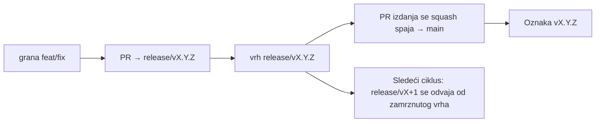

# Branching & Release Model (Српски)

🌐 **Languages:** 🇺🇸 [English](../../../../ops/BRANCHING_MODEL.md) · 🇪🇹 [am](../../../am/docs/ops/BRANCHING_MODEL.md) · 🇸🇦 [ar](../../../ar/docs/ops/BRANCHING_MODEL.md) · 🇦🇿 [az](../../../az/docs/ops/BRANCHING_MODEL.md) · 🇧🇬 [bg](../../../bg/docs/ops/BRANCHING_MODEL.md) · 🇧🇩 [bn](../../../bn/docs/ops/BRANCHING_MODEL.md) · 🇧🇦 [bs](../../../bs/docs/ops/BRANCHING_MODEL.md) · 🇨🇿 [cs](../../../cs/docs/ops/BRANCHING_MODEL.md) · 🇩🇰 [da](../../../da/docs/ops/BRANCHING_MODEL.md) · 🇩🇪 [de](../../../de/docs/ops/BRANCHING_MODEL.md) · 🇬🇷 [el](../../../el/docs/ops/BRANCHING_MODEL.md) · 🇪🇸 [es](../../../es/docs/ops/BRANCHING_MODEL.md) · 🇪🇪 [et](../../../et/docs/ops/BRANCHING_MODEL.md) · 🇮🇷 [fa](../../../fa/docs/ops/BRANCHING_MODEL.md) · 🇫🇮 [fi](../../../fi/docs/ops/BRANCHING_MODEL.md) · 🇫🇷 [fr](../../../fr/docs/ops/BRANCHING_MODEL.md) · 🇮🇪 [ga](../../../ga/docs/ops/BRANCHING_MODEL.md) · 🇮🇳 [gu](../../../gu/docs/ops/BRANCHING_MODEL.md) · 🇳🇬 [ha](../../../ha/docs/ops/BRANCHING_MODEL.md) · 🇮🇱 [he](../../../he/docs/ops/BRANCHING_MODEL.md) · 🇮🇳 [hi](../../../hi/docs/ops/BRANCHING_MODEL.md) · 🇭🇷 [hr](../../../hr/docs/ops/BRANCHING_MODEL.md) · 🇭🇺 [hu](../../../hu/docs/ops/BRANCHING_MODEL.md) · 🇦🇲 [hy](../../../hy/docs/ops/BRANCHING_MODEL.md) · 🇮🇩 [id](../../../id/docs/ops/BRANCHING_MODEL.md) · 🇳🇬 [ig](../../../ig/docs/ops/BRANCHING_MODEL.md) · 🇮🇹 [it](../../../it/docs/ops/BRANCHING_MODEL.md) · 🇯🇵 [ja](../../../ja/docs/ops/BRANCHING_MODEL.md) · 🇬🇪 [ka](../../../ka/docs/ops/BRANCHING_MODEL.md) · 🇰🇭 [km](../../../km/docs/ops/BRANCHING_MODEL.md) · 🇮🇳 [kn](../../../kn/docs/ops/BRANCHING_MODEL.md) · 🇰🇷 [ko](../../../ko/docs/ops/BRANCHING_MODEL.md) · 🇱🇹 [lt](../../../lt/docs/ops/BRANCHING_MODEL.md) · 🇱🇻 [lv](../../../lv/docs/ops/BRANCHING_MODEL.md) · 🇮🇳 [ml](../../../ml/docs/ops/BRANCHING_MODEL.md) · 🇮🇳 [mr](../../../mr/docs/ops/BRANCHING_MODEL.md) · 🇲🇾 [ms](../../../ms/docs/ops/BRANCHING_MODEL.md) · 🇲🇹 [mt](../../../mt/docs/ops/BRANCHING_MODEL.md) · 🇲🇲 [my](../../../my/docs/ops/BRANCHING_MODEL.md) · 🇳🇵 [ne](../../../ne/docs/ops/BRANCHING_MODEL.md) · 🇳🇱 [nl](../../../nl/docs/ops/BRANCHING_MODEL.md) · 🇳🇴 [no](../../../no/docs/ops/BRANCHING_MODEL.md) · 🇮🇳 [or](../../../or/docs/ops/BRANCHING_MODEL.md) · 🇮🇳 [pa](../../../pa/docs/ops/BRANCHING_MODEL.md) · 🇵🇭 [phi](../../../phi/docs/ops/BRANCHING_MODEL.md) · 🇵🇱 [pl](../../../pl/docs/ops/BRANCHING_MODEL.md) · 🇵🇹 [pt](../../../pt/docs/ops/BRANCHING_MODEL.md) · 🇧🇷 [pt-BR](../../../pt-BR/docs/ops/BRANCHING_MODEL.md) · 🇷🇴 [ro](../../../ro/docs/ops/BRANCHING_MODEL.md) · 🇷🇺 [ru](../../../ru/docs/ops/BRANCHING_MODEL.md) · 🇱🇰 [si](../../../si/docs/ops/BRANCHING_MODEL.md) · 🇸🇰 [sk](../../../sk/docs/ops/BRANCHING_MODEL.md) · 🇸🇮 [sl](../../../sl/docs/ops/BRANCHING_MODEL.md) · 🇸🇪 [sv](../../../sv/docs/ops/BRANCHING_MODEL.md) · 🇰🇪 [sw](../../../sw/docs/ops/BRANCHING_MODEL.md) · 🇮🇳 [ta](../../../ta/docs/ops/BRANCHING_MODEL.md) · 🇮🇳 [te](../../../te/docs/ops/BRANCHING_MODEL.md) · 🇹🇭 [th](../../../th/docs/ops/BRANCHING_MODEL.md) · 🇹🇷 [tr](../../../tr/docs/ops/BRANCHING_MODEL.md) · 🇺🇦 [uk-UA](../../../uk-UA/docs/ops/BRANCHING_MODEL.md) · 🇵🇰 [ur](../../../ur/docs/ops/BRANCHING_MODEL.md) · 🇺🇿 [uz](../../../uz/docs/ops/BRANCHING_MODEL.md) · 🇻🇳 [vi](../../../vi/docs/ops/BRANCHING_MODEL.md) · 🇳🇬 [yo](../../../yo/docs/ops/BRANCHING_MODEL.md) · 🇨🇳 [zh-CN](../../../zh-CN/docs/ops/BRANCHING_MODEL.md) · 🇹🇼 [zh-TW](../../../zh-TW/docs/ops/BRANCHING_MODEL.md)

---

OmniRoute koristi model izdanja sa **paralelnim ciklusima**: namensku granu `release/vX.Y.Z`
za aktivni ciklus, `main` za objavljenu liniju i nepromenljivu oznaku
`vX.Y.Z` kada se taj ciklus isporuči. Očekivano je da se commit-i pojavljuju i na `release/*` _i_ na
`main` — nije u pitanju zabuna.

Detalji za održavaoce nalaze se u `CLAUDE.md` (strogo pravilo br. 21) i
[RELEASE_CHECKLIST.md](./RELEASE_CHECKLIST.md). Ova stranica je javni
sažetak namenjen doprinosiocima.

## Ukratko

| Referenca         | Uloga                                                                                               |
| ----------------- | --------------------------------------------------------------------------------------------------- |
| `release/vX.Y.Z`  | **Aktivni ciklus** — svakodnevni razvoj i spajanje PR-ova za tu verziju                             |
| `main`            | **Objavljena linija** — prima ciklus putem squash spajanja kada se izdanje isporuči                 |
| `vX.Y.Z` (oznaka) | **Oznaka isporuke** — nepromenljiv pokazivač na „ono što je isporučeno“, napravljen u vreme izdanja |



## Koju granu treba da cilja moj PR?

**Ciljajte aktivnu granu `release/vX.Y.Z` — ne `main`.**

1. Pronađite najvišu otvorenu granu `release/v*` (primer u vreme pisanja:
   `release/v3.8.49`).
2. Napravite granu od njenog vrha (`git fetch` + checkout / rebase na nju).
3. Otvorite PR sa **base = ta `release/vX.Y.Z` grana**.

`main` nije grana za svakodnevnu integraciju. PR-ovi otvoreni prema `main`
obično moraju da promene ciljnu granu pre spajanja.

## Zamrzavanje izdanja (paralelni ciklusi)

Kada se izdanje usaglašava, otvara se marker issue sa oznakom `release-freeze`.
To **ne zaustavlja razvoj**:

- Zamrznuta grana `release/vX.Y.Z` pripada rukovodiocu izdanja za tu isporuku.
- Grana `release/vX+1` sledećeg ciklusa odvaja se od zamrznutog vrha kako bi doprinosioci mogli da nastave
  da integrišu izmene.
- Otvorenim PR-ovima koji i dalje ciljaju zamrznutu granu treba **promeniti cilj**
  na aktivnu (najvišu) granu `release/v*`.

Proverite da li postoji aktivno zamrzavanje pre nego što pretpostavite da grana koju želite može da se spoji:

```bash
gh issue list --repo diegosouzapw/OmniRoute --label release-freeze --state open
```

Mehanizam spajanja (vlasnička oznaka `queue` → Mergify) dokumentovan je u
[MERGE_TRAIN.md](./MERGE_TRAIN.md).

## Zašto i grana i oznaka?

| Artefakt         | Trajanje      | Svrha                                                                              |
| ---------------- | ------------- | ---------------------------------------------------------------------------------- |
| `release/vX.Y.Z` | Ciklus u toku | Prikuplja pregledane PR-ove, ostaje CI-zelen i predstavlja osnovnu granu za PR-ove |
| Oznaka `vX.Y.Z`  | Zauvek        | Obeležava tačan sadržaj koji je isporučen na npm / GitHub Releases                 |

Grana je radionica; oznaka je zapečaćen paket. Nakon squash spajanja u
`main`, sledeći ciklus se nastavlja na `release/vX+1` bez čekanja da se završi
PR prethodnog izdanja.

## Povezana dokumentacija

- [CONTRIBUTING.md](../../CONTRIBUTING.md) — podešavanje, testovi, kontrolna lista za PR
- [RELEASE_CHECKLIST.md](./RELEASE_CHECKLIST.md) — provera pre isporuke
- [MERGE_TRAIN.md](./MERGE_TRAIN.md) — red za spajanje i rezervni niz spajanja
- [RELEASE_GREEN.md](./RELEASE_GREEN.md) — održavanje vrha izdanja zelenim
