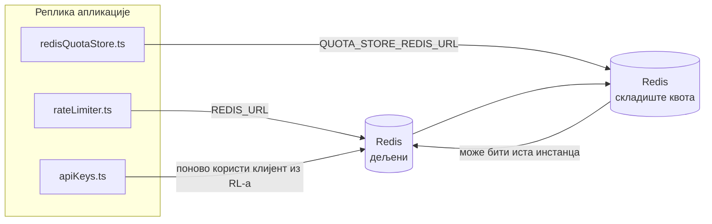

# Redis Production Configuration Guide (Српски)

🌐 **Languages:** 🇺🇸 [English](../../../../ops/REDIS_PRODUCTION_CONFIG.md) · 🇪🇹 [am](../../../am/docs/ops/REDIS_PRODUCTION_CONFIG.md) · 🇸🇦 [ar](../../../ar/docs/ops/REDIS_PRODUCTION_CONFIG.md) · 🇦🇿 [az](../../../az/docs/ops/REDIS_PRODUCTION_CONFIG.md) · 🇧🇬 [bg](../../../bg/docs/ops/REDIS_PRODUCTION_CONFIG.md) · 🇧🇩 [bn](../../../bn/docs/ops/REDIS_PRODUCTION_CONFIG.md) · 🇧🇦 [bs](../../../bs/docs/ops/REDIS_PRODUCTION_CONFIG.md) · 🇨🇿 [cs](../../../cs/docs/ops/REDIS_PRODUCTION_CONFIG.md) · 🇩🇰 [da](../../../da/docs/ops/REDIS_PRODUCTION_CONFIG.md) · 🇩🇪 [de](../../../de/docs/ops/REDIS_PRODUCTION_CONFIG.md) · 🇬🇷 [el](../../../el/docs/ops/REDIS_PRODUCTION_CONFIG.md) · 🇪🇸 [es](../../../es/docs/ops/REDIS_PRODUCTION_CONFIG.md) · 🇪🇪 [et](../../../et/docs/ops/REDIS_PRODUCTION_CONFIG.md) · 🇮🇷 [fa](../../../fa/docs/ops/REDIS_PRODUCTION_CONFIG.md) · 🇫🇮 [fi](../../../fi/docs/ops/REDIS_PRODUCTION_CONFIG.md) · 🇫🇷 [fr](../../../fr/docs/ops/REDIS_PRODUCTION_CONFIG.md) · 🇮🇪 [ga](../../../ga/docs/ops/REDIS_PRODUCTION_CONFIG.md) · 🇮🇳 [gu](../../../gu/docs/ops/REDIS_PRODUCTION_CONFIG.md) · 🇳🇬 [ha](../../../ha/docs/ops/REDIS_PRODUCTION_CONFIG.md) · 🇮🇱 [he](../../../he/docs/ops/REDIS_PRODUCTION_CONFIG.md) · 🇮🇳 [hi](../../../hi/docs/ops/REDIS_PRODUCTION_CONFIG.md) · 🇭🇷 [hr](../../../hr/docs/ops/REDIS_PRODUCTION_CONFIG.md) · 🇭🇺 [hu](../../../hu/docs/ops/REDIS_PRODUCTION_CONFIG.md) · 🇦🇲 [hy](../../../hy/docs/ops/REDIS_PRODUCTION_CONFIG.md) · 🇮🇩 [id](../../../id/docs/ops/REDIS_PRODUCTION_CONFIG.md) · 🇳🇬 [ig](../../../ig/docs/ops/REDIS_PRODUCTION_CONFIG.md) · 🇮🇹 [it](../../../it/docs/ops/REDIS_PRODUCTION_CONFIG.md) · 🇯🇵 [ja](../../../ja/docs/ops/REDIS_PRODUCTION_CONFIG.md) · 🇬🇪 [ka](../../../ka/docs/ops/REDIS_PRODUCTION_CONFIG.md) · 🇰🇭 [km](../../../km/docs/ops/REDIS_PRODUCTION_CONFIG.md) · 🇮🇳 [kn](../../../kn/docs/ops/REDIS_PRODUCTION_CONFIG.md) · 🇰🇷 [ko](../../../ko/docs/ops/REDIS_PRODUCTION_CONFIG.md) · 🇱🇹 [lt](../../../lt/docs/ops/REDIS_PRODUCTION_CONFIG.md) · 🇱🇻 [lv](../../../lv/docs/ops/REDIS_PRODUCTION_CONFIG.md) · 🇮🇳 [ml](../../../ml/docs/ops/REDIS_PRODUCTION_CONFIG.md) · 🇮🇳 [mr](../../../mr/docs/ops/REDIS_PRODUCTION_CONFIG.md) · 🇲🇾 [ms](../../../ms/docs/ops/REDIS_PRODUCTION_CONFIG.md) · 🇲🇹 [mt](../../../mt/docs/ops/REDIS_PRODUCTION_CONFIG.md) · 🇲🇲 [my](../../../my/docs/ops/REDIS_PRODUCTION_CONFIG.md) · 🇳🇵 [ne](../../../ne/docs/ops/REDIS_PRODUCTION_CONFIG.md) · 🇳🇱 [nl](../../../nl/docs/ops/REDIS_PRODUCTION_CONFIG.md) · 🇳🇴 [no](../../../no/docs/ops/REDIS_PRODUCTION_CONFIG.md) · 🇮🇳 [or](../../../or/docs/ops/REDIS_PRODUCTION_CONFIG.md) · 🇮🇳 [pa](../../../pa/docs/ops/REDIS_PRODUCTION_CONFIG.md) · 🇵🇭 [phi](../../../phi/docs/ops/REDIS_PRODUCTION_CONFIG.md) · 🇵🇱 [pl](../../../pl/docs/ops/REDIS_PRODUCTION_CONFIG.md) · 🇵🇹 [pt](../../../pt/docs/ops/REDIS_PRODUCTION_CONFIG.md) · 🇧🇷 [pt-BR](../../../pt-BR/docs/ops/REDIS_PRODUCTION_CONFIG.md) · 🇷🇴 [ro](../../../ro/docs/ops/REDIS_PRODUCTION_CONFIG.md) · 🇷🇺 [ru](../../../ru/docs/ops/REDIS_PRODUCTION_CONFIG.md) · 🇱🇰 [si](../../../si/docs/ops/REDIS_PRODUCTION_CONFIG.md) · 🇸🇰 [sk](../../../sk/docs/ops/REDIS_PRODUCTION_CONFIG.md) · 🇸🇮 [sl](../../../sl/docs/ops/REDIS_PRODUCTION_CONFIG.md) · 🇸🇪 [sv](../../../sv/docs/ops/REDIS_PRODUCTION_CONFIG.md) · 🇰🇪 [sw](../../../sw/docs/ops/REDIS_PRODUCTION_CONFIG.md) · 🇮🇳 [ta](../../../ta/docs/ops/REDIS_PRODUCTION_CONFIG.md) · 🇮🇳 [te](../../../te/docs/ops/REDIS_PRODUCTION_CONFIG.md) · 🇹🇭 [th](../../../th/docs/ops/REDIS_PRODUCTION_CONFIG.md) · 🇹🇷 [tr](../../../tr/docs/ops/REDIS_PRODUCTION_CONFIG.md) · 🇺🇦 [uk-UA](../../../uk-UA/docs/ops/REDIS_PRODUCTION_CONFIG.md) · 🇵🇰 [ur](../../../ur/docs/ops/REDIS_PRODUCTION_CONFIG.md) · 🇺🇿 [uz](../../../uz/docs/ops/REDIS_PRODUCTION_CONFIG.md) · 🇻🇳 [vi](../../../vi/docs/ops/REDIS_PRODUCTION_CONFIG.md) · 🇳🇬 [yo](../../../yo/docs/ops/REDIS_PRODUCTION_CONFIG.md) · 🇨🇳 [zh-CN](../../../zh-CN/docs/ops/REDIS_PRODUCTION_CONFIG.md) · 🇹🇼 [zh-TW](../../../zh-TW/docs/ops/REDIS_PRODUCTION_CONFIG.md)

---

## Преглед

Redis је **опциона, мека зависност** у OmniRoute-у — апликација наставља да ради уз смањене могућности (резервна решења
у меморији) када Redis није доступан. У продукцији, подешавање Redis-а смањује кашњење за четири различита
радна оптерећења:

| Радно оптерећење                 | Управљачки модул              | Фабрика клијента                                             | Образац кључа                                             |
| -------------------------------- | ----------------------------- | ------------------------------------------------------------ | --------------------------------------------------------- |
| Ограничавање брзине              | `rateLimiter.ts`              | `getRedisClient()` — лењо иницијализовани `ioredis` синглтон | `<prefix>rl:*` Lua‑атомски прозори за ограничавање брзине |
| Кеш аутентификације              | `apiKeys.ts`                  | Поново користи клијент из `rateLimiter`                      | `<prefix>auth:api_key:<sha256>` са TTL-ом                 |
| Складиште квота                  | `redisQuotaStore.ts`          | Засебан `getRedisClient(url)` синглтон                       | `<prefix>quota:*` подесиво по инстанци                    |
| Аутоматски прекидач за загревање | `redisCircuitBreakerStore.ts` | Засебан клијент у `circuitBreakerFactory.ts`                 | `<prefix>warmup:cb:<connectionId>`                        |

Сва четири радна оптерећења деле један префикс именског простора како би OmniRoute могао да ради заједно са другим апликацијама на
једној Redis инстанци (нпр. `127.0.0.1:6379`). Погледајте [Именски простор кључева](#key-namespacing).

---

## Тренутна конфигурација (подразумеване вредности у коду)

| Подешавање                                  | Вредност                                                                | Где                                                                                   |
| ------------------------------------------- | ----------------------------------------------------------------------- | ------------------------------------------------------------------------------------- |
| Променљива окружења `REDIS_URL`             | `redis://redis:6379` (compose), опционо                                 | `rateLimiter.ts:5`, `.env.example`                                                    |
| Променљива окружења `REDIS_KEY_PREFIX`      | `omniroute:` (подразумевано)                                            | `rateLimiter.ts`, `redisQuotaStore.ts`, `redisCircuitBreakerStore.ts`, `.env.example` |
| Променљива окружења `QUOTA_STORE_REDIS_URL` | засебна, може се разликовати од `REDIS_URL`                             | `quota/storeFactory.ts`                                                               |
| `QUOTA_STORE_DRIVER`                        | `"sqlite"` (подразумевано), `"redis"` опционо                           | `quota/storeFactory.ts`                                                               |
| ioredis `maxRetriesPerRequest`              | `3`                                                                     | креирање клијента у `rateLimiter.ts`                                                  |
| `enableReadyCheck`                          | није подешено (ioredis подразумевано: `true`)                           | —                                                                                     |
| `lazyConnect`                               | није подешено (ioredis подразумевано: `false`)                          | —                                                                                     |
| `retryStrategy`                             | није подешено (ioredis подразумевано: основа од 200ms, експоненцијално) | —                                                                                     |
| TLS / лозинка / индекс базе података        | **нису конфигурисани**                                                  | —                                                                                     |
| Sentinel / Cluster                          | **нису конфигурисани** — подржан је само самостални један чвор          | —                                                                                     |

---

## Именски простор кључева

OmniRoute дели Redis инстанцу са свим осталим што је покренуто на хосту. Без именског простора,
кључеви као што су `auth:api_key:<sha256>` или `rl:*` могли би да се сукобе са кључевима других апликација
које користе исти Redis (ова инстанца покреће Redis на `127.0.0.1:6379` заједно са другим сервисима).

Подесите `REDIS_KEY_PREFIX` на непразну ниску како бисте додали префикс **сваком** OmniRoute кључу:

```bash
# .env — сви OmniRoute кључеви постају omniroute:rl:*, omniroute:auth:*, omniroute:quota:*, omniroute:warmup:cb:*
REDIS_KEY_PREFIX=omniroute:
```

- **Подразумевано:** `omniroute:` (примењује се када `REDIS_KEY_PREFIX` није постављен или је празан).
- **Примењује се на:** ограничавач брзине + кеш аутентификације (заједнички `ioredis` клијент преко `keyPrefix`) и
  складиште квота (`KEY_PREFIX = "${REDIS_KEY_PREFIX}quota"`) и аутоматски прекидач за загревање
  (`KEY_PREFIX = "${REDIS_KEY_PREFIX}warmup:cb:"`).
- **Промена префикса** када кључеви већ постоје у Redis-у оставља старе кључеве без референци (истичу
  путем TTL-а / LRU-а). Промена је безбедна; миграција није потребна. Једини изузетак је кључ аутоматског
  прекидача за загревање за везу означену као забрањену: чува се без TTL-а, па
  излистајте преостале кључеве помоћу `redis-cli --scan --pattern '<old-prefix>warmup:cb:*'` и избришите их.
- **ioredis `keyPrefix`** аутоматски додаје префикс при упису **и** уклања га при читању,
  тако да код апликације никада не види префикс.

---

## Препоручена подешавања за продукцију

### 1. Опције скупа конекција / клијента (ioredis `Redis` конструктор)

Тренутни код креира један `new Redis(url)` без прилагођених опција. За продукциона
окружења са више реплика, проследите фабрику клијента у коду или обмотајте `getRedisClient()`:

```typescript
const redis = new Redis(REDIS_URL, {
  maxRetriesPerRequest: null, // без ограничења броја покушаја; нека retryStrategy одлучи
  enableReadyCheck: true, // провери да ли је сервер спреман пре прихватања позива
  lazyConnect: true, // не повезуј се при креирању; сачекај први позив
  retryStrategy: (times) => {
    if (times > 10) return null; // одустани након 10 покушаја → поново се повежи касније
    return Math.min(times * 200, 5000); // 200ms, 400ms, …, ограничење 5s
  },
  enableAutoPipelining: true, // обједини истовремене команде у један TCP упис
  keepAlive: 10000, // TCP одржавање везе сваких 10s
});
```

**Кључни компромиси:**

- `maxRetriesPerRequest: null` + `retryStrategy` — препоручено за продукцију како привремена
  рестартовања Redis-а не би одмах изазвала неуспех сваког захтева. Резервни механизам у меморији у
  `checkRateLimit()` преузима путању обраде грешке.
- `lazyConnect: true` — уклања зависност покретања од доступности Redis-а пре него што сервер
  почне да прихвата конекције.
- `enableAutoPipelining: true` — смањује број повратних мрежних путовања за истовремене провере ограничења брзине;
  корисно при >50 RPS на једној конекцији.

### 2. Конфигурација Redis сервера (`redis.conf`)

```
# Меморија
maxmemory 80%                        # остави простор за кеш страница оперативног система
maxmemory-policy allkeys-lru         # избаци застареле ставке кеша аутентификације под оптерећењем

# Перзистентност (опционо — OmniRoute је отпоран на падове и без ње)
save 300 1                           # направи снимак најмање сваких 5 минута ако је промењен ≥1 кључ
appendonly no                        # AOF није потребан; подаци се могу поново генерисати
appendfsync no                       # без fsync оптерећења (RDB је довољан)

# Умрежавање
timeout 0                            # без прекида неактивне конекције
tcp-keepalive 300                    # одржавање везе на сваких 5 минута
tcp-backlog 511                      # ред конекција за нагла оптерећења

# Перформансе
hz 10                                # подразумевано; 100 за системе осетљиве на кашњење
activedefrag yes                     # аутоматска дефрагментација када је фрагментација >10%
```

**Компромис за `maxmemory-policy allkeys-lru`:** Ставке кеша аутентификације могу бити избачене под
притиском на меморију. Ово је безбедно — `setCachedApiKey` увек поново попуњава кеш при промашају, а
SQLite резервни механизам је меродаван. Lua скрипта за ограничавање брзине креира мале кључеве који су
по дизајну кратког века.

### 3. Docker Compose подешавања

Продукциони compose (`docker-compose.prod.yml`) користи `redis:8.6.2-alpine`. Додајте:

```yaml
redis:
  image: redis:8.6.2-alpine
  command:
    [
      "redis-server",
      "--maxmemory",
      "512mb",
      "--maxmemory-policy",
      "allkeys-lru",
      "--activedefrag",
      "yes",
      "--save",
      "300 1",
    ]
  healthcheck:
    test: ["CMD", "redis-cli", "ping"]
    interval: 10s
    timeout: 3s
    retries: 3
    start_period: 5s
```

### 4. Разматрања за више инстанци / скалирање

**Један Redis за све реплике** — Lua скрипта за ограничавање брзине зависи од јединственог
меродавног простора кључева. Више Redis инстанци иза реплика нарушило би атомичност
и удвостручило буџет. Користите један Redis (или Redis Sentinel кластер са пребацивањем у случају отказа) за
све реплике апликације.

**Број конекција:** Свака реплика апликације отвара **2 TCP конекције** ка Redis-у
(клијент за ограничавање брзине + клијент складишта квота). Са 10 реплика → 20 конекција, што је знатно
испод подразумеваног ограничења Redis инстанце од 10k конекција.

### 5. Надгледање

Изложите преко крајње тачке за проверу стања:

```typescript
// src/app/api/monitoring/health/route.ts већ позива rateLimiter функције
// Додајте провере специфичне за Redis:
//   1. PING кашњење преко ioredis .ping()
//   2. Употреба меморије преко INFO memory
//   3. Број конекција преко INFO clients
//   4. Стопа погодака за maxmemory-policy (evicted_keys / keyspace_hits)
```

Кључне метрике које треба пратити:

- **Избачени кључеви / сек** — ако је вредност трајно различита од нуле, повећајте `maxmemory`
- **Блокирани клијенти** — вредност различита од нуле указује на споре Lua скрипте или високу конкурентност
- **Одбијене конекције** — достигнуто је ограничење броја конекција; ретко при 20 конекција

---

## Дијаграм архитектуре



---

## Референце

| Датотека                           | Намена                                                                                 |
| ---------------------------------- | -------------------------------------------------------------------------------------- |
| `src/shared/utils/rateLimiter.ts`  | Примарни Redis клијент, Lua скрипта за ограничавање брзине, резервна опција у меморији |
| `src/lib/db/apiKeys.ts`            | Кеш за аутентификацију — резервни прелаз са Redis-а на SQLite                          |
| `src/lib/quota/redisQuotaStore.ts` | Засебни Redis клијент за опционо складиште квота                                       |
| `src/lib/quota/storeFactory.ts`    | Пребацује се између `sqlite` и `redis` управљачких програма за квоте                   |
| `docker-compose.prod.yml`          | Продукциони Redis контејнер (слика `redis:8.6.2-alpine`)                               |
| `.env.example`                     | Документација променљивих окружења за Redis                                            |
| `src/app/api/local/redis/`         | API руте за оркестрацију развојног контејнера                                          |
| `bin/cli/commands/redis.mjs`       | CLI команде за оркестрацију развојног контејнера                                       |
