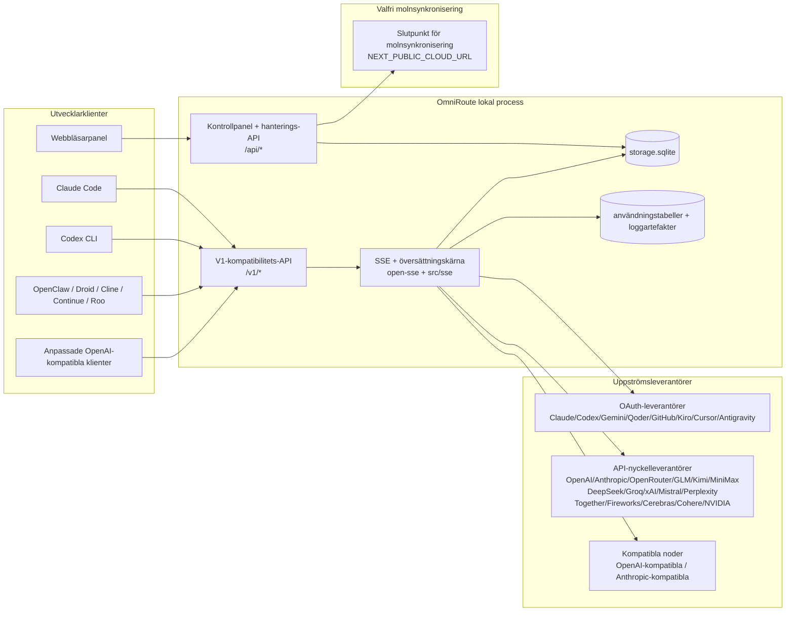
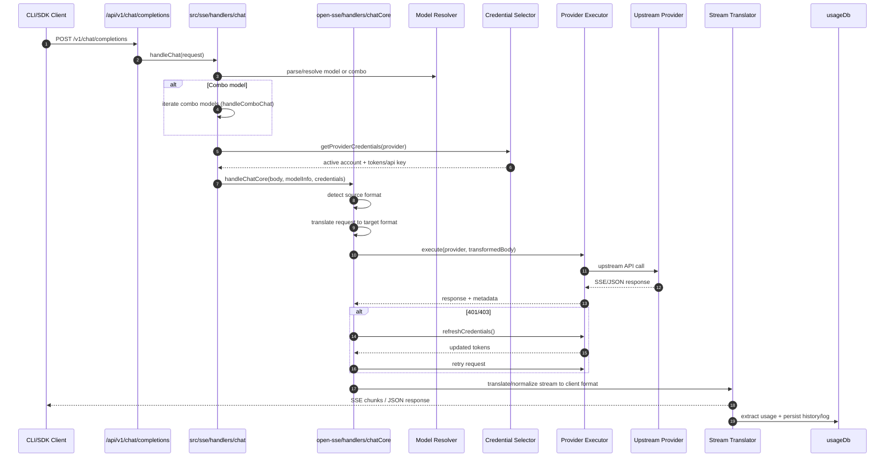
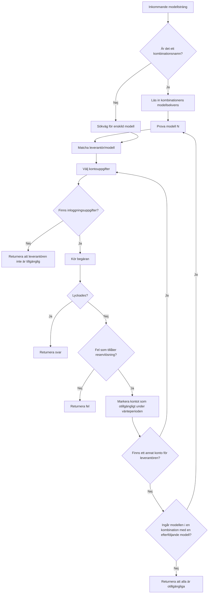
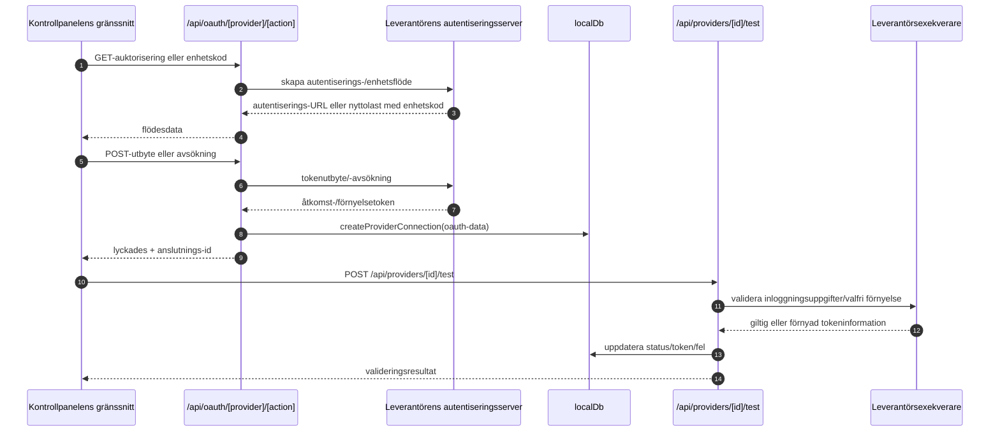
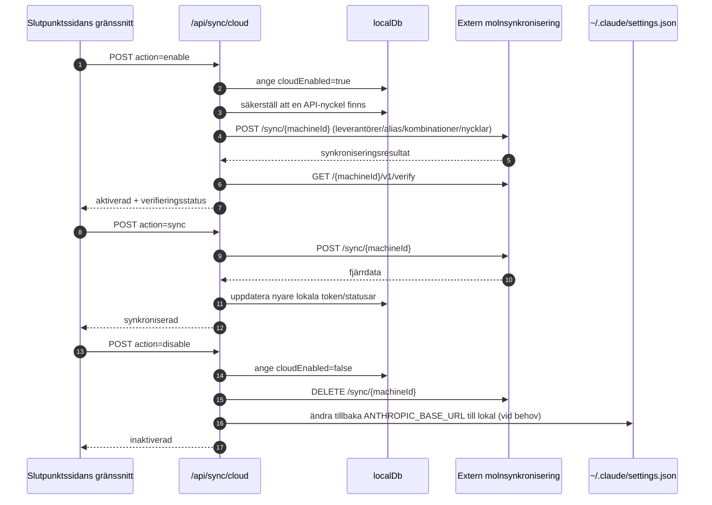
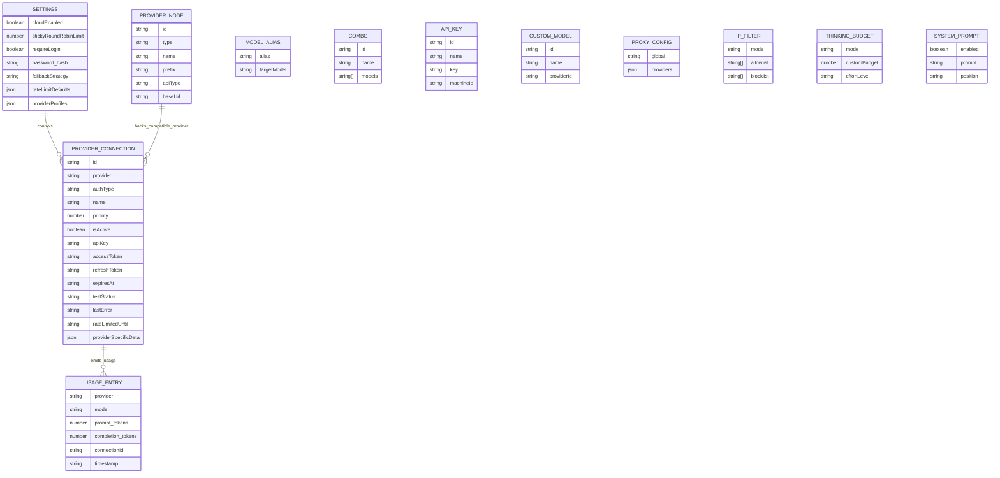
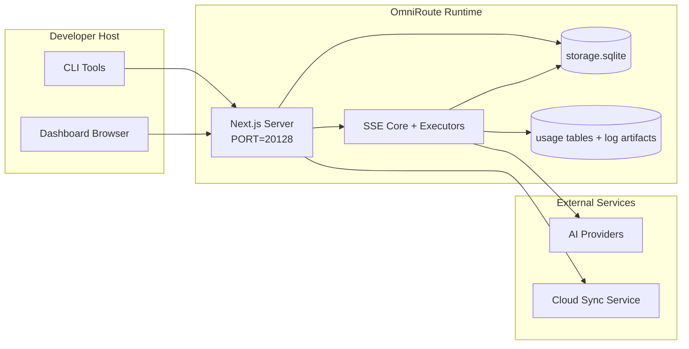

# OmniRoute Architecture (Svenska)

🌐 **Languages:** 🇺🇸 [English](../../../../architecture/ARCHITECTURE.md) · 🇪🇹 [am](../../../am/docs/architecture/ARCHITECTURE.md) · 🇸🇦 [ar](../../../ar/docs/architecture/ARCHITECTURE.md) · 🇦🇿 [az](../../../az/docs/architecture/ARCHITECTURE.md) · 🇧🇬 [bg](../../../bg/docs/architecture/ARCHITECTURE.md) · 🇧🇩 [bn](../../../bn/docs/architecture/ARCHITECTURE.md) · 🇧🇦 [bs](../../../bs/docs/architecture/ARCHITECTURE.md) · 🇨🇿 [cs](../../../cs/docs/architecture/ARCHITECTURE.md) · 🇩🇰 [da](../../../da/docs/architecture/ARCHITECTURE.md) · 🇩🇪 [de](../../../de/docs/architecture/ARCHITECTURE.md) · 🇬🇷 [el](../../../el/docs/architecture/ARCHITECTURE.md) · 🇪🇸 [es](../../../es/docs/architecture/ARCHITECTURE.md) · 🇪🇪 [et](../../../et/docs/architecture/ARCHITECTURE.md) · 🇮🇷 [fa](../../../fa/docs/architecture/ARCHITECTURE.md) · 🇫🇮 [fi](../../../fi/docs/architecture/ARCHITECTURE.md) · 🇫🇷 [fr](../../../fr/docs/architecture/ARCHITECTURE.md) · 🇮🇪 [ga](../../../ga/docs/architecture/ARCHITECTURE.md) · 🇮🇳 [gu](../../../gu/docs/architecture/ARCHITECTURE.md) · 🇳🇬 [ha](../../../ha/docs/architecture/ARCHITECTURE.md) · 🇮🇱 [he](../../../he/docs/architecture/ARCHITECTURE.md) · 🇮🇳 [hi](../../../hi/docs/architecture/ARCHITECTURE.md) · 🇭🇷 [hr](../../../hr/docs/architecture/ARCHITECTURE.md) · 🇭🇺 [hu](../../../hu/docs/architecture/ARCHITECTURE.md) · 🇦🇲 [hy](../../../hy/docs/architecture/ARCHITECTURE.md) · 🇮🇩 [id](../../../id/docs/architecture/ARCHITECTURE.md) · 🇳🇬 [ig](../../../ig/docs/architecture/ARCHITECTURE.md) · 🇮🇹 [it](../../../it/docs/architecture/ARCHITECTURE.md) · 🇯🇵 [ja](../../../ja/docs/architecture/ARCHITECTURE.md) · 🇬🇪 [ka](../../../ka/docs/architecture/ARCHITECTURE.md) · 🇰🇭 [km](../../../km/docs/architecture/ARCHITECTURE.md) · 🇮🇳 [kn](../../../kn/docs/architecture/ARCHITECTURE.md) · 🇰🇷 [ko](../../../ko/docs/architecture/ARCHITECTURE.md) · 🇱🇹 [lt](../../../lt/docs/architecture/ARCHITECTURE.md) · 🇱🇻 [lv](../../../lv/docs/architecture/ARCHITECTURE.md) · 🇮🇳 [ml](../../../ml/docs/architecture/ARCHITECTURE.md) · 🇮🇳 [mr](../../../mr/docs/architecture/ARCHITECTURE.md) · 🇲🇾 [ms](../../../ms/docs/architecture/ARCHITECTURE.md) · 🇲🇹 [mt](../../../mt/docs/architecture/ARCHITECTURE.md) · 🇲🇲 [my](../../../my/docs/architecture/ARCHITECTURE.md) · 🇳🇵 [ne](../../../ne/docs/architecture/ARCHITECTURE.md) · 🇳🇱 [nl](../../../nl/docs/architecture/ARCHITECTURE.md) · 🇳🇴 [no](../../../no/docs/architecture/ARCHITECTURE.md) · 🇮🇳 [or](../../../or/docs/architecture/ARCHITECTURE.md) · 🇮🇳 [pa](../../../pa/docs/architecture/ARCHITECTURE.md) · 🇵🇭 [phi](../../../phi/docs/architecture/ARCHITECTURE.md) · 🇵🇱 [pl](../../../pl/docs/architecture/ARCHITECTURE.md) · 🇵🇹 [pt](../../../pt/docs/architecture/ARCHITECTURE.md) · 🇧🇷 [pt-BR](../../../pt-BR/docs/architecture/ARCHITECTURE.md) · 🇷🇴 [ro](../../../ro/docs/architecture/ARCHITECTURE.md) · 🇷🇺 [ru](../../../ru/docs/architecture/ARCHITECTURE.md) · 🇱🇰 [si](../../../si/docs/architecture/ARCHITECTURE.md) · 🇸🇰 [sk](../../../sk/docs/architecture/ARCHITECTURE.md) · 🇸🇮 [sl](../../../sl/docs/architecture/ARCHITECTURE.md) · 🇷🇸 [sr](../../../sr/docs/architecture/ARCHITECTURE.md) · 🇰🇪 [sw](../../../sw/docs/architecture/ARCHITECTURE.md) · 🇮🇳 [ta](../../../ta/docs/architecture/ARCHITECTURE.md) · 🇮🇳 [te](../../../te/docs/architecture/ARCHITECTURE.md) · 🇹🇭 [th](../../../th/docs/architecture/ARCHITECTURE.md) · 🇹🇷 [tr](../../../tr/docs/architecture/ARCHITECTURE.md) · 🇺🇦 [uk-UA](../../../uk-UA/docs/architecture/ARCHITECTURE.md) · 🇵🇰 [ur](../../../ur/docs/architecture/ARCHITECTURE.md) · 🇺🇿 [uz](../../../uz/docs/architecture/ARCHITECTURE.md) · 🇻🇳 [vi](../../../vi/docs/architecture/ARCHITECTURE.md) · 🇳🇬 [yo](../../../yo/docs/architecture/ARCHITECTURE.md) · 🇨🇳 [zh-CN](../../../zh-CN/docs/architecture/ARCHITECTURE.md) · 🇹🇼 [zh-TW](../../../zh-TW/docs/architecture/ARCHITECTURE.md)

---

🌐 **Languages:** 🇺🇸 [English](../../../../architecture/ARCHITECTURE.md) · 🇪🇹 [am](../../../am/docs/architecture/ARCHITECTURE.md) · 🇸🇦 [ar](../../../ar/docs/architecture/ARCHITECTURE.md) · 🇦🇿 [az](../../../az/docs/architecture/ARCHITECTURE.md) · 🇧🇬 [bg](../../../bg/docs/architecture/ARCHITECTURE.md) · 🇧🇩 [bn](../../../bn/docs/architecture/ARCHITECTURE.md) · 🇧🇦 [bs](../../../bs/docs/architecture/ARCHITECTURE.md) · 🇨🇿 [cs](../../../cs/docs/architecture/ARCHITECTURE.md) · 🇩🇰 [da](../../../da/docs/architecture/ARCHITECTURE.md) · 🇩🇪 [de](../../../de/docs/architecture/ARCHITECTURE.md) · 🇬🇷 [el](../../../el/docs/architecture/ARCHITECTURE.md) · 🇪🇸 [es](../../../es/docs/architecture/ARCHITECTURE.md) · 🇪🇪 [et](../../../et/docs/architecture/ARCHITECTURE.md) · 🇮🇷 [fa](../../../fa/docs/architecture/ARCHITECTURE.md) · 🇫🇮 [fi](../../../fi/docs/architecture/ARCHITECTURE.md) · 🇫🇷 [fr](../../../fr/docs/architecture/ARCHITECTURE.md) · 🇮🇪 [ga](../../../ga/docs/architecture/ARCHITECTURE.md) · 🇮🇳 [gu](../../../gu/docs/architecture/ARCHITECTURE.md) · 🇳🇬 [ha](../../../ha/docs/architecture/ARCHITECTURE.md) · 🇮🇱 [he](../../../he/docs/architecture/ARCHITECTURE.md) · 🇮🇳 [hi](../../../hi/docs/architecture/ARCHITECTURE.md) · 🇭🇷 [hr](../../../hr/docs/architecture/ARCHITECTURE.md) · 🇭🇺 [hu](../../../hu/docs/architecture/ARCHITECTURE.md) · 🇦🇲 [hy](../../../hy/docs/architecture/ARCHITECTURE.md) · 🇮🇩 [id](../../../id/docs/architecture/ARCHITECTURE.md) · 🇳🇬 [ig](../../../ig/docs/architecture/ARCHITECTURE.md) · 🇮🇹 [it](../../../it/docs/architecture/ARCHITECTURE.md) · 🇯🇵 [ja](../../../ja/docs/architecture/ARCHITECTURE.md) · 🇬🇪 [ka](../../../ka/docs/architecture/ARCHITECTURE.md) · 🇰🇭 [km](../../../km/docs/architecture/ARCHITECTURE.md) · 🇮🇳 [kn](../../../kn/docs/architecture/ARCHITECTURE.md) · 🇰🇷 [ko](../../../ko/docs/architecture/ARCHITECTURE.md) · 🇱🇹 [lt](../../../lt/docs/architecture/ARCHITECTURE.md) · 🇱🇻 [lv](../../../lv/docs/architecture/ARCHITECTURE.md) · 🇮🇳 [ml](../../../ml/docs/architecture/ARCHITECTURE.md) · 🇮🇳 [mr](../../../mr/docs/architecture/ARCHITECTURE.md) · 🇲🇾 [ms](../../../ms/docs/architecture/ARCHITECTURE.md) · 🇲🇹 [mt](../../../mt/docs/architecture/ARCHITECTURE.md) · 🇲🇲 [my](../../../my/docs/architecture/ARCHITECTURE.md) · 🇳🇵 [ne](../../../ne/docs/architecture/ARCHITECTURE.md) · 🇳🇱 [nl](../../../nl/docs/architecture/ARCHITECTURE.md) · 🇳🇴 [no](../../../no/docs/architecture/ARCHITECTURE.md) · 🇮🇳 [or](../../../or/docs/architecture/ARCHITECTURE.md) · 🇮🇳 [pa](../../../pa/docs/architecture/ARCHITECTURE.md) · 🇵🇭 [phi](../../../phi/docs/architecture/ARCHITECTURE.md) · 🇵🇱 [pl](../../../pl/docs/architecture/ARCHITECTURE.md) · 🇵🇹 [pt](../../../pt/docs/architecture/ARCHITECTURE.md) · 🇧🇷 [pt-BR](../../../pt-BR/docs/architecture/ARCHITECTURE.md) · 🇷🇴 [ro](../../../ro/docs/architecture/ARCHITECTURE.md) · 🇷🇺 [ru](../../../ru/docs/architecture/ARCHITECTURE.md) · 🇱🇰 [si](../../../si/docs/architecture/ARCHITECTURE.md) · 🇸🇰 [sk](../../../sk/docs/architecture/ARCHITECTURE.md) · 🇸🇮 [sl](../../../sl/docs/architecture/ARCHITECTURE.md) · 🇷🇸 [sr](../../../sr/docs/architecture/ARCHITECTURE.md) · 🇰🇪 [sw](../../../sw/docs/architecture/ARCHITECTURE.md) · 🇮🇳 [ta](../../../ta/docs/architecture/ARCHITECTURE.md) · 🇮🇳 [te](../../../te/docs/architecture/ARCHITECTURE.md) · 🇹🇭 [th](../../../th/docs/architecture/ARCHITECTURE.md) · 🇹🇷 [tr](../../../tr/docs/architecture/ARCHITECTURE.md) · 🇺🇦 [uk-UA](../../../uk-UA/docs/architecture/ARCHITECTURE.md) · 🇵🇰 [ur](../../../ur/docs/architecture/ARCHITECTURE.md) · 🇺🇿 [uz](../../../uz/docs/architecture/ARCHITECTURE.md) · 🇻🇳 [vi](../../../vi/docs/architecture/ARCHITECTURE.md) · 🇳🇬 [yo](../../../yo/docs/architecture/ARCHITECTURE.md) · 🇨🇳 [zh-CN](../../../zh-CN/docs/architecture/ARCHITECTURE.md) · 🇹🇼 [zh-TW](../../../zh-TW/docs/architecture/ARCHITECTURE.md)

_Senast uppdaterad: 2026-06-28_

## Sammanfattning

OmniRoute är en lokal AI-routinggateway och kontrollpanel byggd på Next.js.
Den tillhandahåller en enda OpenAI-kompatibel slutpunkt (`/v1/*`) och dirigerar trafik mellan flera uppströmsleverantörer med översättning, reservväxling, tokenförnyelse och användningsspårning.

Centrala funktioner:

- OpenAI-kompatibelt API-gränssnitt för CLI/verktyg (355 leverantörer, 108 exekverare)
- Översättning av förfrågningar/svar mellan leverantörsformat
- Reservväxling för modellkombinationer (sekvens med flera modeller)
- Strukturerade kombinationssteg (`provider + model + connection`) med körningsordning baserad på `compositeTiers`
- Reservväxling på kontonivå (flera konton per leverantör)
- Förhandskontroll av kvoter och kvotmedvetet P2C-val av konto i huvudflödet för chatt
- Hantering av leverantörsanslutningar med OAuth + API-nyckel (22 OAuth-leverantörsmoduler)
- Generering av inbäddningar via `/v1/embeddings` (18 leverantörer)
- Bildgenerering via `/v1/images/generations` (över 10 leverantörer, över 20 modeller)
- Ljudtranskribering via `/v1/audio/transcriptions` (18 leverantörer)
- Text-till-tal via `/v1/audio/speech` (24 inbyggda leverantörer)
- Videogenerering via `/v1/videos/generations` (ComfyUI + SD WebUI)
- Musikgenerering via `/v1/music/generations` (ComfyUI)
- Webbsökning via `/v1/search` (20 leverantörer)
- Moderering via `/v1/moderations`
- Omrangordning via `/v1/rerank`
- Tolkning av tanketaggar (`<think>...</think>`) för resonerande modeller
- Sanering av svar för strikt kompatibilitet med OpenAI SDK
- Rollnormalisering (developer→system, system→user) för kompatibilitet mellan leverantörer
- Konvertering av strukturerade utdata (json_schema → Gemini responseSchema)
- Lokal persistens för leverantörer, nycklar, alias, kombinationer, inställningar och prissättning (122 DB-moduler)
- Spårning av användning/kostnader och loggning av förfrågningar
- Valfri molnsynkronisering för synkronisering av flera enheter/tillstånd
- Tillåtelselista/blockeringslista för IP-baserad åtkomstkontroll till API:et
- Hantering av tankebudget (direktöverföring/automatisk/anpassad/adaptiv)
- Global injicering av systemprompt
- Sessionsspårning och fingeravtryck
- Förbättrad hastighetsbegränsning per konto med leverantörsspecifika profiler
- Kretsbrytarmönster för leverantörsresiliens
- Skydd mot överbelastning från samtidiga förfrågningar med mutexlåsning
- Signaturbaserad cache för deduplicering av förfrågningar
- Domänlager: kostnadsregler, reservväxlingspolicy, spärrpolicy
- Context Relay: sammanfattningar vid sessionsöverlämning för kontinuitet vid kontorotation
- Persistens av domäntillstånd (SQLite-cache med genomskrivning för reservväxlingar, budgetar, spärrar och kretsbrytare)
- Policymotor för centraliserad utvärdering av förfrågningar (spärr → budget → reservväxling)
- Telemetri för förfrågningar med aggregering av p50/p95/p99-latens
- Telemetri för kombinationsmål och historisk hälsa för kombinationsmål via `combo_execution_key` / `combo_step_id`
- Korrelations-ID (X-Request-Id) för spårning från början till slut
- Efterlevnadsloggning för revision med möjlighet att välja bort per API-nyckel
- Utvärderingsramverk för kvalitetssäkring av LLM:er
- Hälsokontrollpanel med realtidsstatus för leverantörernas kretsbrytare
- MCP-server (110 verktyg) med 3 transporter (stdio/SSE/Streamable HTTP)
- A2A-server (JSON-RPC 2.0 + SSE) med färdigheter och uppgifters livscykel
- Minnessystem (extrahering, injicering, hämtning, sammanfattning)
- Färdighetssystem (register, exekverare, sandlåda, inbyggda färdigheter)
- MITM-proxy med certifikathantering och DNS-hantering
- Mellanprogram för skydd mot promptinjektion
- Pipeline för promptkomprimering med Caveman, RTK, staplade pipelines, komprimeringskombinationer, språkpaket och analys
- ACP-register (Agent Communication Protocol)
- Modulära OAuth-leverantörer (22 individuella moduler under `src/lib/oauth/providers/`)
- Skript för avinstallation/fullständig avinstallation
- Åtgärd för reparation av OAuth-miljön
- WebSocket-brygga för OpenAI-kompatibla WS-klienter (`/v1/ws`)
- Hantering av synkroniseringstoken (utfärdande/återkallande, hämtning av ETag-versionshanterat konfigurationspaket)
- GLM Thinking (`glmt`) som förstklassig leverantörsförinställning
- Hybridbaserad tokenräkning (leverantörssidan `/messages/count_tokens` med uppskattning som reserv)
- Automatisk initiering av modellalias (över 30 normaliseringar mellan proxydialekter vid start)
- Säker utgående hämtning med SSRF-skydd, blockering av privata URL:er och konfigurerbara återförsök
- Nedkylningsmedvetna återförsök för chatt med konfigurerbara `requestRetry` och `maxRetryIntervalSec`
- Validering av körningsmiljön med Zod vid start
- Efterlevnadsrevision v2 med sidindelning, CRUD-händelser för leverantörer och valideringsloggning av SSRF-blockeringar

Primär körningsmodell:

- Next.js-apprutter under `src/app/api/*` implementerar både API:er för kontrollpanelen och kompatibilitets-API:er
- En delad kärna för SSE/routing i `src/sse/*` + `open-sse/*` hanterar leverantörsexekvering, översättning, strömning, reservväxling och användning

## Referensdiagram

Kanoniska, versionshanterade Mermaid-källor för v3.8.0-plattformen finns i
[`docs/diagrams/`](../diagrams/README.md). Två återges nedan som orientering;
resten länkas från sina domänspecifika guider.


> Källa: [diagrams/request-pipeline.mmd](../diagrams/request-pipeline.mmd)


> Källa: [diagrams/resilience-3layers.mmd](../diagrams/resilience-3layers.mmd) — länkas även från
> [RESILIENCE_GUIDE.md](./RESILIENCE_GUIDE.md) och resiliensreferensen i `CLAUDE.md`.

## Omfattning och avgränsningar

### Ingår i omfattningen

- Lokal gateway-körmiljö
- Hanterings-API:er för kontrollpanelen
- Leverantörsautentisering och tokenförnyelse
- Översättning av begäranden och SSE-strömning
- Lokalt tillstånd + beständig lagring av användningsdata
- Valfri orkestrering av molnsynkronisering

### Ingår inte i omfattningen

- Implementering av molntjänsten bakom `NEXT_PUBLIC_CLOUD_URL`
- Leverantörens SLA/kontrollplan utanför den lokala processen
- Själva de externa CLI-binärfilerna (Claude CLI, Codex CLI osv.)

## Kontrollpanelens aktuella yta

Huvudsidor under `src/app/(dashboard)/dashboard/`:

- `/dashboard` — snabbstart + leverantörsöversikt
- `/dashboard/endpoint` — slutpunktsproxy + MCP + A2A + flikar för API-slutpunkter
- `/dashboard/providers` — leverantörsanslutningar och autentiseringsuppgifter
- `/dashboard/combos` — kombinationsstrategier, mallar, stegbaserad byggare, regler för modelldirigering, manuell beständig ordning
- `/dashboard/auto-combo` — Auto Combo Engine: poängvikter, lägespaket, förinställningar för virtuella fabriker, telemetri
- `/dashboard/costs` — kostnadsaggregering och prisöversikt
- `/dashboard/analytics` — användningsanalys, utvärderingar, hälsostatus för kombinationsmål
- `/dashboard/limits` — kvot-/hastighetskontroller
- `/dashboard/cli-tools` — introduktion till CLI, identifiering av körmiljö, konfigurationsgenerering
- `/dashboard/agents` — identifierade ACP-agenter + registrering av anpassade agenter
- `/dashboard/cloud-agents` — uppgifter för molnbaserade agenter (Codex Cloud, Devin, Jules) och uppgifternas livscykel
- `/dashboard/skills` — A2A-färdighetsregister, körning i sandlåda, inbyggd färdighetskatalog
- `/dashboard/memory` — inspektion och hämtning av beständigt konversationsminne
- `/dashboard/webhooks` — utgående webhook-prenumerationer, rotation av hemligheter, statistik över återförsök
- `/dashboard/batch` — inskickning av batchjobb och förlopp
- `/dashboard/cache` — statistik för genomläsnings- och resonemangscache, kontroller för avhysning
- `/dashboard/playground` — interaktiv chattmiljö mot valfri konfigurerad kombination/modell
- `/dashboard/changelog` — ändringsloggvisare i appen (renderar `CHANGELOG.md`)
- `/dashboard/system` — körningsdiagnostik, versionsinformation, vy för miljövalidering
- `/dashboard/onboarding` — konfigurationsguide vid första körningen för nya installationer
- `/dashboard/media` — testmiljö för bilder/video/musik
- `/dashboard/search-tools` — testning av sökleverantörer och historik
- `/dashboard/health` — drifttid, kretsbrytare, hastighetsgränser, kvotövervakade sessioner
- `/dashboard/logs` — loggar för begäranden/proxy/granskning/konsol
- `/dashboard/settings` — flikar för systeminställningar (allmänt, dirigering, standardvärden för kombinationer osv.)
- `/dashboard/context/caveman` — Caveman-komprimeringsregler, språkpaket, förhandsgranskning och utdataläge
- `/dashboard/context/rtk` — RTK-filter för kommandoutdata, förhandsgranskning och säkerhetsinställningar för körmiljön
- `/dashboard/context/combos` — namngivna komprimeringspipelines tilldelade dirigeringskombinationer
- `/dashboard/translator` — inspektion av översättaren och förhandsgranskning av konvertering av begärandeformat
- `/dashboard/audit` — webbläsare för regelefterlevnadsloggar med sidindelning och strukturerade metadata
- `/dashboard/usage` — användningshistorik per begäran kopplad till `usage_history`
- `/dashboard/compression` — komprimeringsanalys, statistik och tilldelning av pipelines
- `/dashboard/api-manager` — API-nycklars livscykel och modellbehörigheter

## Systemkontext på hög nivå



## Centrala körningskomponenter

## 1) API- och routningslager (Next.js-apprutter)

Huvudkataloger:

- `src/app/api/v1/*` och `src/app/api/v1beta/*` för kompatibilitets-API:er
- `src/app/api/*` för API:er för hantering/konfiguration
- Next-omskrivningar i `next.config.mjs` mappar `/v1/*` till `/api/v1/*`

Viktiga kompatibilitetsrutter:

- `src/app/api/v1/chat/completions/route.ts`
- `src/app/api/v1/messages/route.ts`
- `src/app/api/v1/responses/route.ts`
- `src/app/api/v1/models/route.ts` — inkluderar anpassade modeller med `custom: true`
- `src/app/api/v1/embeddings/route.ts` — generering av inbäddningar (6 leverantörer)
- `src/app/api/v1/images/generations/route.ts` — bildgenerering (4+ leverantörer, inkl. Antigravity/Nebius)
- `src/app/api/v1/messages/count_tokens/route.ts`
- `src/app/api/v1/providers/[provider]/chat/completions/route.ts` — dedikerad chatt per leverantör
- `src/app/api/v1/providers/[provider]/embeddings/route.ts` — dedikerade inbäddningar per leverantör
- `src/app/api/v1/providers/[provider]/images/generations/route.ts` — dedikerade bilder per leverantör
- `src/app/api/v1beta/models/route.ts`
- `src/app/api/v1beta/models/[...path]/route.ts`

Hanteringsområden:

- Autentisering/inställningar: `src/app/api/auth/*`, `src/app/api/settings/*`
- Leverantörer/anslutningar: `src/app/api/providers*`
- Leverantörsnoder: `src/app/api/provider-nodes*`
- Anpassade modeller: `src/app/api/provider-models` (GET/POST/DELETE)
- Modellkatalog: `src/app/api/models/route.ts` (GET)
- Proxykonfiguration: `src/app/api/settings/proxy` (GET/PUT/DELETE) + `src/app/api/settings/proxy/test` (POST)
- OAuth: `src/app/api/oauth/*`
- Nycklar/alias/kombinationer/prissättning: `src/app/api/keys*`, `src/app/api/models/alias`, `src/app/api/combos*`, `src/app/api/pricing`
- Användning: `src/app/api/usage/*`
- Synkronisering/moln: `src/app/api/sync/*`, `src/app/api/cloud/*`
- Hjälpfunktioner för CLI-verktyg: `src/app/api/cli-tools/*`
- IP-filter: `src/app/api/settings/ip-filter` (GET/PUT)
- Tankebudget: `src/app/api/settings/thinking-budget` (GET/PUT)
- Systemprompt: `src/app/api/settings/system-prompt` (GET/PUT)
- Komprimering: `src/app/api/settings/compression`, `src/app/api/compression/*` och
  `src/app/api/context/*`
- Sessioner: `src/app/api/sessions` (GET)
- Hastighetsgränser: `src/app/api/rate-limits` (GET)
- Motståndskraft: `src/app/api/resilience` (GET/PATCH) — begärandekö, nedkylningsperiod för anslutningar, leverantörsspärr och konfiguration för väntan på nedkylningsperiod
- Återställning av motståndskraft: `src/app/api/resilience/reset` (POST) — återställ leverantörsspärrar
- Cachestatistik: `src/app/api/cache/stats` (GET/DELETE)
- Telemetri: `src/app/api/telemetry/summary` (GET)
- Budget: `src/app/api/usage/budget` (GET/POST)
- Reservkedjor: `src/app/api/fallback/chains` (GET/POST/DELETE)
- Efterlevnadsgranskning: `src/app/api/compliance/audit-log` (GET, med sidindelning + strukturerade metadata)
- Utvärderingar: `src/app/api/evals` (GET/POST), `src/app/api/evals/[suiteId]` (GET)
- Policyer: `src/app/api/policies` (GET/POST)
- Synkroniseringstoken: `src/app/api/sync/tokens` (GET/POST), `src/app/api/sync/tokens/[id]` (GET/DELETE)
- Konfigurationspaket: `src/app/api/sync/bundle` (GET, ETag-versionshanterad ögonblicksbild av inställningar/leverantörer/kombinationer/nycklar)
- WebSocket: `src/app/api/v1/ws/route.ts` — Upgrade-hanterare för OpenAI-kompatibla WS-klienter

## 2) SSE + översättningskärna

Huvudflödets moduler:

- Ingångspunkt: `src/sse/handlers/chat.ts`
- Central orkestrering: `open-sse/handlers/chatCore.ts`
- Adaptrar för leverantörsexekvering: `open-sse/executors/*`
- Formatidentifiering/leverantörskonfiguration: `open-sse/services/provider.ts`
- Tolkning/matchning av modeller: `src/sse/services/model.ts`, `open-sse/services/model.ts`
- Reservlogik för konton: `open-sse/services/accountFallback.ts`
- Översättningsregister: `open-sse/translator/index.ts`
- Strömtransformeringar: `open-sse/utils/stream.ts`, `open-sse/utils/streamHandler.ts`
- Extrahering/normalisering av användning: `open-sse/utils/usageTracking.ts`
- Parser för think-taggar: `open-sse/utils/thinkTagParser.ts`
- Hanterare för inbäddningar: `open-sse/handlers/embeddings.ts`
- Register över leverantörer av inbäddningar: `open-sse/config/embeddingRegistry.ts`
- Hanterare för bildgenerering: `open-sse/handlers/imageGeneration.ts`
- Register över bildleverantörer: `open-sse/config/imageRegistry.ts`
- Sanering av svar: `open-sse/handlers/responseSanitizer.ts`
- Normalisering av roller: `open-sse/services/roleNormalizer.ts`

Tjänster (affärslogik):

- Val/poängsättning av konton: `open-sse/services/accountSelector.ts`
- Hantering av kontextens livscykel: `open-sse/services/contextManager.ts`
- Tillämpning av IP-filter: `open-sse/services/ipFilter.ts`
- Sessionsspårning: `open-sse/services/sessionManager.ts`
- Deduplicering av förfrågningar: `open-sse/services/signatureCache.ts`
- Infogning av systemprompt: `open-sse/services/systemPrompt.ts`
- Hantering av resonemangsbudget: `open-sse/services/thinkingBudget.ts`
- Modellroutning med jokertecken: `open-sse/services/wildcardRouter.ts`
- Hantering av hastighetsbegränsningar: `open-sse/services/rateLimitManager.ts`
- Kretsbrytare: `src/shared/utils/circuitBreaker.ts`
- Kontextöverlämning: `open-sse/services/contextHandoff.ts` — generering och infogning av överlämningssammanfattningar för strategin med kontextvidarebefordran
- Komprimering: `open-sse/services/compression/*` — proaktiv komprimering före leverantörsöversättning;
  omfattar Caveman-regler, RTK-filter, staplade pipelines, komprimeringskombinationer, statistik och validering
- Hämtare för Codex-kvoter: `open-sse/services/codexQuotaFetcher.ts` — hämtar Codex-kvoter för beslut om kontextöverlämning
- Cooldown-medvetna återförsök: `src/sse/services/cooldownAwareRetry.ts` — återförsök per modell under cooldown-perioder med konfigurerbara `requestRetry` / `maxRetryIntervalSec`
- Säker utgående hämtning: `src/shared/network/safeOutboundFetch.ts` — skyddad hämtning från leverantör/modell med SSRF-skydd, blockering av privata URL:er, återförsök och timeout
- Skydd för utgående URL:er: `src/shared/network/outboundUrlGuard.ts` — validerar leverantörs-URL:er mot CIDR-intervall för privata nätverk/localhost
- Standardvärden för leverantörsförfrågningar: `open-sse/services/providerRequestDefaults.ts` — standardvärden på leverantörsnivå för `maxTokens`, `temperature`, `thinkingBudgetTokens`
- GLM-leverantörskonstanter: `open-sse/config/glmProvider.ts` — gemensamma GLM-modeller, kvot-URL:er samt GLMT-timeout/standardvärden
- Antigravity-uppström: `open-sse/config/antigravityUpstream.ts` — konstanter för bas-URL och identifieringssökväg
- Codex-klientkonstanter: `open-sse/config/codexClient.ts` — versionshanterade värden för user-agent och klientversion
- Startdata för modellalias: `src/lib/modelAliasSeed.ts` — initierar fler än 30 alias mellan olika proxydialekter vid uppstart

Moduler i domänlagret:

- Kostnadsregler/budgetar: `src/domain/costRules.ts`
- Reservpolicy: `src/domain/fallbackPolicy.ts`
- Kombinationslösare: `src/domain/comboResolver.ts`
- Spärrpolicy: `src/domain/lockoutPolicy.ts`
- Policymotor: `src/domain/policyEngine.ts` — centraliserad utvärdering av spärr → budget → reserv
- Katalog över felkoder: `src/shared/constants/errorCodes.ts`
- Förfrågnings-ID: `src/shared/utils/requestId.ts`
- Timeout för hämtning: `src/shared/utils/fetchTimeout.ts`
- Telemetri för förfrågningar: `src/shared/utils/requestTelemetry.ts`
- Regelefterlevnad/revision: `src/lib/compliance/index.ts`
- Utvärderingskörare: `src/lib/evals/evalRunner.ts`
- Persistens av domäntillstånd: `src/lib/db/domainState.ts` — SQLite CRUD för reservkedjor, budgetar, kostnadshistorik, spärrtillstånd och kretsbrytare

OAuth-leverantörsmoduler (22 separata filer under `src/lib/oauth/providers/`):

- Registerindex: `src/lib/oauth/providers/index.ts`
- Enskilda leverantörer: `agy.ts`, `antigravity.ts`, `claude.ts`, `cline.ts`, `codebuddy-cn.ts`, `codex.ts`, `cursor.ts`, `devin-desktop.ts`, `ghe-copilot.ts`, `github.ts`, `gitlab-duo.ts`, `grok-cli-oauth.ts`, `grok-cli.ts`, `kilocode.ts`, `kimi-coding.ts`, `kiro.ts`, `openference.ts`, `qoder.ts`, `trae.ts`, `xai-oauth.ts`, `zed-hosted.ts`, `zed.ts`
- Tunt omslag: `src/lib/oauth/providers.ts` — återexporterar från enskilda moduler

## 5) Inbäddade tjänster (v3.8.4)

OmniRoute kan installera, övervaka och dirigera till lokalt körda AI-verktygsprocesser
som kallas **inbäddade tjänster**. Fem medföljer: 9Router, CLIProxyAPI, Bifrost, Mux och Dario.

Arkitekturlager:

- **UI** (`/dashboard/providers/services`) — sida med två flikar som innehåller livscykelkontroller,
  direktströmning av loggar, hantering av API-nycklar och (för 9Router) ett inbäddat eget UI via
  en intern omvänd proxy.
- **API** (`/api/services/{name}/*`) — 11 slutpunkter för 9Router, 10 för CLIProxyAPI, 8 vardera för Bifrost / Mux / Dario,
  samtliga klassificerade som **LOCAL_ONLY** (fast regel nr 17). En delad SSE-slutpunkt,
  `GET /api/services/[name]/logs`, betjänar båda tjänsterna.
- **Övervakare** (`src/lib/services/`) — den generiska klassen `ServiceSupervisor` omsluter
  `child_process.spawn`, upprätthåller en ringbuffert på 5 MB för SSE-strömning av loggar, en loop
  för hälsokontroller, ett atomärt operationslås och en ordnad avstängning med SIGTERM→SIGKILL.
  `bootstrap.ts` kopplar in alla konfigurerade tjänster när processen startar.
- **Leverantör/exekverare** (`open-sse/executors/ninerouter.ts`) — 9Router exponeras som
  en faktisk leverantör. Modeller får prefixet `9router/{sub}/{model}` och synkroniseras var 5:e minut
  från 9Routers slutpunkt `/v1/models`.

Fördjupning: `docs/frameworks/EMBEDDED-SERVICES.md`

## Viktiga delsystem (v3.8.0)

### A. Auto Combo-motorn

Auto Combo poängsätter och väljer dynamiskt dirigeringsmål vid tidpunkten för begäran, i stället för
att förlita sig på en statisk kombinationsdefinition. Den driver modellprefixfamiljen `auto/*`.

- Motorns startpunkt: `open-sse/services/autoCombo/` (`autoComboEngine.ts`,
  `scoringEngine.ts`, `virtualFactory.ts`, `modePacks.ts`)
- Matchningslösare: `src/domain/comboResolver.ts` (automatisk identifiering av prefixet `auto/`)
- Kontrollpanel: `/dashboard/auto-combo`
- Telemetri: SQLite-tabellen `auto_combo_decisions`

Viktiga funktioner:

- **19 dirigeringsstrategier** (prioritet, viktad, fyll-först, turordning, P2C, slumpmässig,
  minst använd, kostnadsoptimerad, återställningsmedveten, återställningsfönster, marginal, strikt slumpmässig,
  **auto**, lkgp, kontextoptimerad, kontextrelä, **fusion**, samt en reservväg) —
  auto är det främsta tillägget i v3.8.0; `fusion` (utspridning till panel + domarsyntes,
  `open-sse/services/fusion.ts`) är nytt i v3.8.36.
- **Poängsättning med 16 faktorer**: kvot, hälsa, invers kostnad, invers latens, uppgiftslämplighet och
  ytterligare tio. Den kanoniska tabellen över faktorer och deras standardvikter finns i
  [`docs/routing/AUTO-COMBO.md`](../routing/AUTO-COMBO.md) — att återge den här skulle
  skapa ännu en plats där den kan bli inaktuell.
- **Virtuell fabrik** materialiserar tillfälliga kombinationer när ingen matchande namngiven kombination
  finns, med kandidater hämtade från felfria, aktiva leverantörsanslutningar.
- **Automatiska prefix**: `auto/coding`, `auto/cheap`, `auto/fast`, `auto/offline`,
  `auto/smart`, `auto/lkgp` — vart och ett stöds av en finjusterad viktprofil.
- **6 lägespaket**: `ship-fast`, `cost-saver`, `quality-first`, `offline-friendly`,
  `reliability-first` och `chaos-mode` — förinställda viktkonfigurationer som kan anropas från
  kontrollpanelen. (Ska inte förväxlas med prefixen `auto/*` ovan, vilka är
  varianter som används vid tidpunkten för begäran.)

Fullständig algoritmisk information (faktorformler, viktjustering) finns i
[`docs/routing/AUTO-COMBO.md`](../routing/AUTO-COMBO.md).

### B. Molnagenter

Molnagenter kapslar in tredjepartsplattformar för värdbaserade kodagenter (Codex Cloud, Devin,
Jules) bakom en enhetlig, databasstödd livscykel för uppgifter. Alla slutpunkter för att skapa/inspektera
uppgifter kräver hanteringsautentisering.

- Modulrot: `src/lib/cloudAgent/` (`baseAgent.ts`, `registry.ts`, `api.ts`,
  `types.ts`, `db.ts`, plus underkataloger per agent under `agents/`)
- Implementeringar per agent: `agents/codex/`, `agents/devin/`, `agents/jules/`
- Offentliga slutpunkter: `/api/v1/agents/tasks/*` (lista/skapa/hämta/avbryt)
- Hanteringsslutpunkter: `/api/cloud/*` (etablering, status, batch)
- Kontrollpanel: `/dashboard/cloud-agents`
- Lagring: tabellen `cloud_agent_tasks`

Information om etablering per agent och OAuth-specifika detaljer finns i
[`docs/frameworks/CLOUD_AGENT.md`](../frameworks/CLOUD_AGENT.md).

### C. Skyddsregler

Modulen för skyddsregler är ett mellanprogramlager som kan laddas om under drift och som inspekterar begäranden
och svar efter personligt identifierbar information, promptinjektion och osäkert visuellt innehåll. Överträdelser
avbryter begäran med HTTP **503** samt en strukturerad felkod, vilket gör att
nedströmsanropare kan försöka igen eller välja en annan gren.

- Modulrot: `src/lib/guardrails/` (`base.ts`, `registry.ts`, `piiMasker.ts`,
  `promptInjection.ts`, `visionBridge.ts`, `visionBridgeHelpers.ts`)
- Omladdning under drift: registret bevakar konfigurationsändringar och bygger om kedjan på plats
- Inkopplingspunkter: starten av chatthanteraren, bildgenereringshanteraren, svarssaneraren
- HTTP-kontrakt: överträdelser visas som `503` med `error.code = "GUARDRAIL_VIOLATION"`

Information om hur regeluppsättningar skapas och tröskelvärden finjusteras finns i
[`docs/security/GUARDRAILS.md`](../security/GUARDRAILS.md).

### D. Domänlager

Namnrymden `src/domain/` centraliserar policybeslut så att rutthanterare inte
själva behöver sätta samman logik för låsning/budget/reservlösningar.

- Policymotor: `src/domain/policyEngine.ts` — en enda startpunkt för
  utvärdering före exekvering (låsning → budget → reservordning)
- Kostnadsregler: `src/domain/costRules.ts`
- Reservpolicy: `src/domain/fallbackPolicy.ts`
- Låsningspolicy: `src/domain/lockoutPolicy.ts`
- Taggbaserad dirigering: `src/domain/tagRouter.ts`
- Kombinationslösare: `src/domain/comboResolver.ts` — löser kombinationsnamn, auto/\*
  prefix och modellmål med jokertecken till konkreta exekveringsplaner
- Kopplare för anslutnings-/modellregler: `src/domain/connectionModelRules.ts`
- Ögonblicksbilder av modelltillgänglighet: `src/domain/modelAvailability.ts`
- Spårning av leverantörers utgångstid: `src/domain/providerExpiration.ts`
- Kvotcache: `src/domain/quotaCache.ts`
- Degraderingstillstånd: `src/domain/degradation.ts`
- Konfigurationsgranskning: `src/domain/configAudit.ts`
- Byggare för OmniRoute-svarsmetadata: `src/domain/omnirouteResponseMeta.ts`
- Bedömningsdelsystem: `src/domain/assessment/` — periodiska utvärderingsjobb

### E. Auktoriseringspipeline

Auktoriseringspipelinen klassificerar varje inkommande begäran och tillämpar den
lämpliga policykedjan före vidarebefordran.

- Pipelineingång: `src/server/authz/pipeline.ts`
- Begärandeklassificerare: `src/server/authz/classify.ts` — skiljer offentliga
  kompatibilitetsrutter från administrationsrutter
- Inventering av offentliga rutter: `src/shared/constants/publicApiRoutes.ts`
- Policyer: `src/server/authz/policies/` — sammansättningsbara predikat
  (`requireApiKey`, `requireManagement`, `requireFreshAuth` osv.)
- Headerverktyg: `src/server/authz/headers.ts`
- Verifieringshjälpare: `src/server/authz/assertAuth.ts`
- Begärandekontext: `src/server/authz/context.ts`

Offentliga rutter och administrationsrutter har en strikt gräns: API:er för agent/cooldown och
providerändringar kräver administrationsautentisering (HTTP 401 om den saknas).

Fullständiga regler för ruttklassificering finns i
[`docs/architecture/AUTHZ_GUIDE.md`](./AUTHZ_GUIDE.md).

### F. FSM för arbetsflöden och uppgiftsmedveten router

En router som drivs av en ändlig tillståndsmaskin och ligger ovanpå kombinationsvalet för att dirigera
trafik baserat på den identifierade arbetsflödesfasen (planering, exekvering,
granskning) samt affinitet till bakgrundsuppgifter.

- FSM för arbetsflöden: `open-sse/services/workflowFSM.ts`
- Uppgiftsmedveten router: `open-sse/services/taskAwareRouter.ts`
- Detektor för bakgrundsuppgifter: `open-sse/services/backgroundTaskDetector.ts`
- Avsiktsklassificerare: `open-sse/services/intentClassifier.ts`

FSM-övergångarna matas in i Auto Combos poängsättning, vilket styr mot billigare modeller
för bakgrunds-/automatiseringsuppgifter och mot kraftfullare modeller för interaktiva
planerings-/granskningssteg.

### G. Providerspecifik feltålighet

Flera providers levereras med särskilda moduler för feltålighet och stealth som bygger vidare på
de globala lagren för kretsbrytning, anslutningspaus och modellspärr:

- Antigravity 429-motor: `open-sse/services/antigravity429Engine.ts` (roterar
  identitet, rensar svarshuvuden och hanterar spårning av krediter/versioner via
  `antigravityCredits.ts`, `antigravityHeaderScrub.ts`, `antigravityHeaders.ts`,
  `antigravityIdentity.ts`, `antigravityVersion.ts`)
- Kvotpolicy för ModelScope: `open-sse/services/modelscopePolicy.ts`
- Claude Code CCH (handshake för kompatibilitetskanal): `open-sse/services/claudeCodeCCH.ts`,
  samt `claudeCodeCompatible.ts`, `claudeCodeConstraints.ts`, `claudeCodeExtraRemap.ts`,
  `claudeCodeToolRemapper.ts`
- Formning av Claude Code-fingeravtryck: `open-sse/services/claudeCodeFingerprint.ts`
- Obfuskering av Claude Code: `open-sse/services/claudeCodeObfuscation.ts`

Den fullständiga stealth-handboken och driftsvägledningen finns i
`docs/security/STEALTH_GUIDE.md` (git; kompileras inte till `/docs`).

### H. Webhooks, resonemangscache, läscache

- **Webhooks** — utgående leverans av provider-, konto- och uppgiftshändelser.
  - Dispatcher: `src/lib/webhookDispatcher.ts`
  - Lagring: SQLite-tabellen `webhooks` (via `src/lib/db/webhooks.ts`)
  - Kontrollpanel: `/dashboard/webhooks` (prenumerationer, hemligheter, historik över återförsök)
  - Händelsetaxonomi och semantik för återförsök finns i [`docs/frameworks/WEBHOOKS.md`](../frameworks/WEBHOOKS.md).
- **Resonemangscache** — återuppspelningsbara resonemangsblock för providers som genererar
  tanketokens (Claude, GLMT osv.), så att efterföljande steg kan hoppa över förnyat resonemang.
  - Databaslager: `src/lib/db/reasoningCache.ts`
  - Tjänstelager: `open-sse/services/reasoningCache.ts`
  - Semantik för återuppspelning finns i [`docs/routing/REASONING_REPLAY.md`](../routing/REASONING_REPLAY.md).
- **Läscache** — kortlivad svarscache som indexeras efter signatur och används för att
  slå samman identiska återförsök från trasiga SDK:er uppströms.
  - Databaslager: `src/lib/db/readCache.ts`
  - Statistikslutpunkt: `GET /api/cache/stats`, kontrollpanel på `/dashboard/cache`

## 3) Persistenslager

Primär tillståndsdatabas (SQLite):

- Kärninfrastruktur: `src/lib/db/core.ts` (better-sqlite3, migreringar, WAL)
- Databasåtkomst: importera specifika `src/lib/db/*`-moduler direkt (den gamla samlingsmodulen `localDb.ts` har tagits bort)
- fil: `${DATA_DIR}/storage.sqlite` (eller `$XDG_CONFIG_HOME/omniroute/storage.sqlite` när den är angiven, annars `~/.omniroute/storage.sqlite`)
- entiteter (tabeller + KV-namnrymder): providerConnections, providerNodes, modelAliases, combos, apiKeys, settings, pricing, **customModels**, **proxyConfig**, **ipFilter**, **thinkingBudget**, **systemPrompt**

Persistens för användningsdata:

- fasad: `src/lib/usageDb.ts` (uppdelade moduler i `src/lib/usage/*`)
- SQLite-tabeller i `storage.sqlite`: `usage_history`, `call_logs`, `proxy_logs`
- valfria filartefakter finns kvar för kompatibilitet/felsökning (`${DATA_DIR}/log.txt`, `${DATA_DIR}/call_logs/`, `<repo>/logs/...`)
- äldre JSON-filer migreras till SQLite av migreringar vid uppstart när de finns

Domäntillståndsdatabas (SQLite):

- `src/lib/db/domainState.ts` — CRUD-operationer för domäntillstånd
- Tabeller (skapade i `src/lib/db/core.ts`): `domain_fallback_chains`, `domain_budgets`, `domain_cost_history`, `domain_lockout_state`, `domain_circuit_breakers`
- Genomskrivningscache: minnesbaserade Maps är auktoritativa under körning; ändringar skrivs synkront till SQLite; tillståndet återställs från databasen vid kallstart

## 4) Ytor för autentisering och säkerhet

- Cookie-autentisering för kontrollpanelen: `src/proxy.ts`, `src/app/api/auth/login/route.ts`
- Generering/verifiering av API-nycklar: `src/shared/utils/apiKey.ts`
- Leverantörshemligheter lagras i poster i `providerConnections`
- Stöd för utgående proxy via `open-sse/utils/proxyFetch.ts` (miljövariabler) och `open-sse/utils/networkProxy.ts` (konfigurerbart per leverantör eller globalt)
- SSRF-/URL-skydd för utgående trafik: `src/shared/network/outboundUrlGuard.ts` — blockerar privata intervall, loopback-intervall och länklokala intervall för alla leverantörsanrop
- Validering av körmiljön: `src/lib/env/runtimeEnv.ts` — Zod-schema för alla miljövariabler, presenteras som fel/varningar vid uppstart
- Synkroniseringstoken: `src/lib/db/syncTokens.ts` — avgränsade token för slutpunkter som laddar ned konfigurationspaket; stöds av SQLite-tabellen `sync_tokens` (migrering `024_create_sync_tokens.sql`)
- Autentisering vid WebSocket-handskakning: `src/lib/ws/handshake.ts` — validerar WS-uppgraderingsförfrågningar via API-nyckel eller sessionscookie

## 5) Molnsynkronisering

- Initiering av schemaläggare: `src/lib/initCloudSync.ts`, `src/shared/services/initializeCloudSync.ts`, `src/shared/services/modelSyncScheduler.ts`
- Periodisk uppgift: `src/shared/services/cloudSyncScheduler.ts`
- Periodisk uppgift: `src/shared/services/modelSyncScheduler.ts`
- Kontrollrutt: `src/app/api/sync/cloud/route.ts`

## Livscykel för förfrågningar (`/v1/chat/completions`)



## Flöde för kombination + reservkonto



Beslut om reservlösningar styrs av `open-sse/services/accountFallback.ts` med hjälp av statuskoder och heuristik för felmeddelanden. Kombinationsroutning lägger till ytterligare en kontroll: leverantörsspecifika 400-fel, exempelvis innehållsblockering hos uppströmsleverantören och fel vid rollvalidering, behandlas som lokala fel för modellen så att senare mål i kombinationen fortfarande kan köras.

## Livscykel för OAuth-introduktion och tokenförnyelse



Förnyelse under pågående trafik utförs i `open-sse/handlers/chatCore.ts` via exekverarens `refreshCredentials()`.

## Livscykel för molnsynkronisering (aktivera/synkronisera/inaktivera)



Periodisk synkronisering utlöses av `CloudSyncScheduler` när molnet är aktiverat.

## Datamodell och lagringskarta



Fysiska lagringsfiler:

- primär databas för körning: `${DATA_DIR}/storage.sqlite`
- rader i begärandeloggen: `${DATA_DIR}/log.txt` (kompatibilitets-/felsökningsartefakt)
- arkiv med strukturerade anropsdata: `${DATA_DIR}/call_logs/`
- valfria felsökningssessioner för översättare/begäranden: `<repo>/logs/...`

## Driftsättningstopologi



## Modulmappning (avgörande för beslut)

### Rutt- och API-moduler

- `src/app/api/v1/*`, `src/app/api/v1beta/*`: kompatibilitets-API:er
- `src/app/api/v1/providers/[provider]/*`: dedikerade rutter per leverantör (chatt, inbäddningar, bilder)
- `src/app/api/providers*`: CRUD, validering och testning av leverantörer
- `src/app/api/provider-nodes*`: hantering av anpassade kompatibla noder
- `src/app/api/provider-models`: hantering av anpassade modeller (CRUD)
- `src/app/api/models/route.ts`: API för modellkatalog (alias + anpassade modeller)
- `src/app/api/oauth/*`: OAuth-/enhetskodflöden
- `src/app/api/keys*`: livscykel för lokala API-nycklar
- `src/app/api/models/alias`: aliashantering
- `src/app/api/combos*`: hantering av reservkombinationer
- `src/app/api/pricing`: åsidosättningar av priser för kostnadsberäkning
- `src/app/api/settings/proxy`: proxykonfiguration (GET/PUT/DELETE)
- `src/app/api/settings/proxy/test`: anslutningstest för utgående proxy (POST)
- `src/app/api/usage/*`: API:er för användning och loggar
- `src/app/api/sync/*` + `src/app/api/cloud/*`: molnsynkronisering och molnrelaterade hjälpfunktioner
- `src/app/api/cli-tools/*`: lokala skrivare/kontroller för CLI-konfiguration
- `src/app/api/settings/ip-filter`: lista över tillåtna/blockerade IP-adresser (GET/PUT)
- `src/app/api/settings/thinking-budget`: konfiguration av tokenbudget för tänkande (GET/PUT)
- `src/app/api/settings/system-prompt`: global systemprompt (GET/PUT)
- `src/app/api/settings/compression`: globala komprimeringsinställningar (GET/PUT)
- `src/app/api/compression/*`: förhandsgranskning av komprimering, regelmetadata och språkpaket
- `src/app/api/context/caveman/config`: alias för Caveman-inställningar (GET/PUT)
- `src/app/api/context/rtk/*`: RTK-konfiguration, filterkatalog, testslutpunkt och återställning av råutdata
- `src/app/api/context/combos*`: CRUD för komprimeringskombinationer och tilldelningar av routningskombinationer
- `src/app/api/context/analytics`: alias för komprimeringsanalys
- `src/app/api/sessions`: lista över aktiva sessioner (GET)
- `src/app/api/rate-limits`: status för hastighetsbegränsning per konto (GET)
- `src/app/api/sync/tokens`: CRUD för synkroniseringstoken (GET/POST)
- `src/app/api/sync/tokens/[id]`: hämta/ta bort synkroniseringstoken (GET/DELETE)
- `src/app/api/sync/bundle`: hämtning av konfigurationspaket (GET, ETag-versionshantering)
- `src/app/api/v1/ws`: WebSocket-uppgraderingshanterare för OpenAI-kompatibla WS-klienter

### Kärna för routning och körning

- `src/sse/handlers/chat.ts`: tolkning av begäran, kombinationshantering, loop för kontoval
- `open-sse/handlers/chatCore.ts`: översättning, dirigering till exekverare, hantering av nya försök/uppdateringar, strömkonfiguration
- `open-sse/executors/*`: leverantörsspecifikt nätverks- och formatbeteende

### Översättningsregister och formatkonverterare

- `open-sse/translator/index.ts`: översättningsregister och orkestrering
- Översättare för förfrågningar: `open-sse/translator/request/*` (9 moduler — `antigravity-to-openai`, `claude-to-gemini`, `claude-to-openai`, `gemini-to-openai`, `openai-responses`, `openai-to-claude`, `openai-to-cursor`, `openai-to-gemini`, `openai-to-kiro`)
- Översättare för svar: `open-sse/translator/response/*` (11 moduler — `claude-to-openai`, `cursor-to-openai`, `gemini-to-claude`, `gemini-to-openai`, `kiro-to-openai`, `openai-responses`, `openai-to-antigravity`, `openai-to-claude`, `openai-to-gemini`, `openai-to-gemini-sse`, `responsesToolItem`)
- Hjälpfunktioner: `open-sse/translator/helpers/*` (12 moduler — `claudeHelper`, `geminiHelper`, `geminiToolsSanitizer`, `jsonUtil`, `markdownBoundary`, `maxTokensHelper`, `openaiHelper`, `responsesApiHelper`, `schemaCoercion`, `strictSystemHoist`, `toolCallHelper`, `toolCallShim`)
- Formatkonstanter: `open-sse/translator/formats.ts`
- Initiering och register: `open-sse/translator/bootstrap.ts`, `open-sse/translator/registry.ts`
- Hjälpfunktioner för bildformat: `open-sse/translator/image/`

### Persistens

- `src/lib/db/*`: beständig konfiguration/status och domänpersistens i SQLite
- `src/lib/db/*`: importera specifika moduler direkt — ingen samlingsmodul (det gamla återexportlagret `localDb.ts` har tagits bort)
- `src/lib/usageDb.ts`: fasad för användningshistorik/anropsloggar ovanpå SQLite-tabellerna

## Täckning för leverantörsexekverare (strategimönster)

Varje leverantör har en specialiserad exekverare som utökar `BaseExecutor` (i `open-sse/executors/base.ts`), vilken tillhandahåller URL-konstruktion, konstruktion av HTTP-huvuden, återförsök med exponentiell väntetid, hookar för uppdatering av autentiseringsuppgifter och orkestreringsmetoden `execute()`.

| Exekverare                | Leverantör(er)                                                                                                                                             | Särskild hantering                                                                   |
| ------------------------- | ---------------------------------------------------------------------------------------------------------------------------------------------------------- | ------------------------------------------------------------------------------------ |
| `DefaultExecutor`         | OpenAI, Claude, Gemini, Qwen, OpenRouter, GLM, Kimi, MiniMax, DeepSeek, Groq, xAI, Mistral, Perplexity, Together, Fireworks, Cerebras, Cohere, NVIDIA osv. | Dynamisk URL-/headerkonfiguration per leverantör                                     |
| `AntigravityExecutor`     | Google Antigravity                                                                                                                                         | Anpassade projekt-/sessions-ID:n, tolkning av Retry-After, maskering av 429          |
| `AzureOpenAIExecutor`     | Azure OpenAI                                                                                                                                               | Distributionsbaserad dirigering, framtvingande av api-version-frågeparameter         |
| `BlackboxWebExecutor`     | Blackbox AI (webbläge)                                                                                                                                     | Omvänd webbsession med emulering av TLS-fingeravtryck                                |
| `ClaudeIdentityExecutor`  | Claude.ai (CCH-sökväg)                                                                                                                                     | Pipelines för begränsningar och verktygsomappning, formning av fingeravtryck         |
| `CliProxyApiExecutor`     | CLIProxyAPI-kompatibla leverantörer                                                                                                                        | Anpassad autentisering och protokollhantering                                        |
| `CloudflareAiExecutor`    | Cloudflare Workers AI                                                                                                                                      | Infogning av konto-ID, Neurons-baserad användningsspårning                           |
| `CodexExecutor`           | OpenAI Codex                                                                                                                                               | Infogar systeminstruktioner, framtvingar resonemangsnivå                             |
| `ChatGptWebCodexExecutor` | ChatGPT Web (Codex)                                                                                                                                        | Responses API-brygga för webbläsarsessioner med låsning av tråd/omgång               |
| `CommandCodeExecutor`     | Command Code                                                                                                                                               | OAuth + headerrotation per session                                                   |
| `CursorExecutor`          | Cursor IDE                                                                                                                                                 | ConnectRPC-protokoll, Protobuf-kodning, signering av förfrågningar via kontrollsumma |
| `DevinCliExecutor`        | Devin CLI                                                                                                                                                  | Bryggning av Devins uppgiftslivscykel via molnagentmodul                             |
| `GithubExecutor`          | GitHub Copilot                                                                                                                                             | Uppdatering av Copilot-token, VSCode-imiterande headers                              |
| `GitlabExecutor`          | GitLab Duo                                                                                                                                                 | GitLab OAuth + projektomfattande dirigering                                          |
| `GlmExecutor`             | Z.AI GLM (inkl. förinställningen `glmt`)                                                                                                                   | Medveten om resonemangsbudget, GLMT-förinställningskonstanter                        |
| `GrokWebExecutor`         | xAI Grok web                                                                                                                                               | Omvänd webbsession, lägesval (tänk/standard)                                         |
| `KieExecutor`             | KIE                                                                                                                                                        | Anpassad tokenutfärdning med roterande sessionsankare                                |
| `KiroExecutor`            | AWS CodeWhisperer/Kiro                                                                                                                                     | Binärt AWS EventStream-format → SSE-konvertering                                     |
| `MuseSparkWebExecutor`    | Muse Spark (webb)                                                                                                                                          | Omvänd webbsession med bryggning av bildmeddelanden                                  |
| `NlpCloudExecutor`        | NLP Cloud                                                                                                                                                  | Leverantörsspecifik struktur för förfrågningskropp                                   |
| `OpenCodeExecutor`        | OpenCode                                                                                                                                                   | AI SDK-kompatibel leverantörskonfiguration                                           |
| `PerplexityWebExecutor`   | Perplexity web                                                                                                                                             | Omvänd webbsession för fortsättning av chatt                                         |
| `PetalsExecutor`          | Petals distribuerade inferens                                                                                                                              | Decentraliserad svärmdirigering                                                      |
| `PollinationsExecutor`    | Pollinations AI                                                                                                                                            | Ingen API-nyckel krävs, frekvensbegränsade förfrågningar                             |
| `QoderExecutor`           | Qoder AI                                                                                                                                                   | Stöd för PAT och OAuth, kostnadsfri nivå med flera modeller                          |
| `VertexExecutor`          | Google Vertex AI                                                                                                                                           | Autentisering med tjänstekonto, regionbaserade slutpunkter                           |
| `DevinDesktopExecutor`    | Devin Desktop                                                                                                                                              | Importerad API-nyckel + Connect-protobuf-strömning av chatt                          |

Alla andra leverantörer (inklusive anpassade kompatibla noder) använder `DefaultExecutor`.

## Kompatibilitetsmatris för leverantörer

> **Obs!** Matrisen nedan är ett representativt urval av de 351 registrerade leverantörerna i
> OmniRoute v3.8.0. Den kanoniska och kontinuerligt uppdaterade listan finns i
> [`docs/reference/PROVIDER_REFERENCE.md`](../reference/PROVIDER_REFERENCE.md) (autogenererad) eller i den
> auktoritativa källan `src/shared/constants/providers.ts` (Zod-validerad vid inläsning).

| Leverantör            | Format           | Autentisering          | Strömning        | Utan strömning | Tokenförnyelse | Användnings-API          |
| --------------------- | ---------------- | ---------------------- | ---------------- | -------------- | -------------- | ------------------------ |
| Claude                | claude           | API-nyckel / OAuth     | ✅               | ✅             | ✅             | ⚠️ Endast administratör  |
| Gemini                | gemini           | API-nyckel / OAuth     | ✅               | ✅             | ✅             | ⚠️ Cloud Console         |
| Antigravity           | antigravity      | OAuth                  | ✅               | ✅             | ✅             | ✅ Fullständigt kvot-API |
| OpenAI                | openai           | API-nyckel             | ✅               | ✅             | ❌             | ❌                       |
| Codex                 | openai-responses | OAuth                  | ✅ tvingad       | ❌             | ✅             | ✅ Hastighetsgränser     |
| ChatGPT Web (Codex)   | openai-responses | Webbläsarsession       | ✅ tvingad       | ❌             | ❌             | ❌                       |
| GitHub Copilot        | openai           | OAuth + Copilot-token  | ✅               | ✅             | ✅             | ✅ Kvotögonblicksbilder  |
| Cursor                | cursor           | Anpassad kontrollsumma | ✅               | ✅             | ❌             | ❌                       |
| Kiro                  | kiro             | AWS SSO OIDC           | ✅ (EventStream) | ❌             | ✅             | ✅ Användningsgränser    |
| Qoder                 | openai           | OAuth / PAT            | ✅               | ✅             | ✅             | ⚠️ Per begäran           |
| Kilo Code             | openai           | OAuth                  | ✅               | ✅             | ✅             | ❌                       |
| Cline                 | openai           | OAuth                  | ✅               | ✅             | ✅             | ❌                       |
| Kimi Coding           | openai           | OAuth                  | ✅               | ✅             | ✅             | ❌                       |
| OpenRouter            | openai           | API-nyckel             | ✅               | ✅             | ❌             | ❌                       |
| GLM/Kimi/MiniMax      | claude           | API-nyckel             | ✅               | ✅             | ❌             | ❌                       |
| DeepSeek              | openai           | API-nyckel             | ✅               | ✅             | ❌             | ❌                       |
| Groq                  | openai           | API-nyckel             | ✅               | ✅             | ❌             | ❌                       |
| xAI (Grok)            | openai           | API-nyckel             | ✅               | ✅             | ❌             | ❌                       |
| Mistral               | openai           | API-nyckel             | ✅               | ✅             | ❌             | ❌                       |
| Perplexity            | openai           | API-nyckel             | ✅               | ✅             | ❌             | ❌                       |
| Together AI           | openai           | API-nyckel             | ✅               | ✅             | ❌             | ❌                       |
| Fireworks AI          | openai           | API-nyckel             | ✅               | ✅             | ❌             | ❌                       |
| Cerebras              | openai           | API-nyckel             | ✅               | ✅             | ❌             | ❌                       |
| Cohere                | openai           | API-nyckel             | ✅               | ✅             | ❌             | ❌                       |
| NVIDIA NIM            | openai           | API-nyckel             | ✅               | ✅             | ❌             | ❌                       |
| Cloudflare AI         | openai           | API-token + konto-ID   | ✅               | ✅             | ❌             | ❌                       |
| Pollinations          | openai           | Ingen (ingen nyckel)   | ✅               | ✅             | ❌             | ❌                       |
| Scaleway AI           | openai           | API-nyckel             | ✅               | ✅             | ❌             | ❌                       |
| LongCat               | openai           | API-nyckel             | ✅               | ✅             | ❌             | ❌                       |
| Ollama Cloud          | openai           | API-nyckel (valfri)    | ✅               | ✅             | ❌             | ❌                       |
| HuggingFace           | openai           | API-nyckel             | ✅               | ✅             | ❌             | ❌                       |
| Nebius                | openai           | API-nyckel             | ✅               | ✅             | ❌             | ❌                       |
| SiliconFlow           | openai           | API-nyckel             | ✅               | ✅             | ❌             | ❌                       |
| Hyperbolic            | openai           | API-nyckel             | ✅               | ✅             | ❌             | ❌                       |
| Vertex AI             | gemini           | Tjänstekonto           | ✅               | ✅             | ✅             | ⚠️ Cloud Console         |
| Command Code          | openai           | OAuth                  | ✅               | ✅             | ✅             | ⚠️ Per begäran           |
| Z.AI / GLM            | openai           | API-nyckel / OAuth     | ✅               | ✅             | ❌             | ❌                       |
| GLMT (förinställning) | claude           | API-nyckel             | ✅               | ✅             | ❌             | ⚠️ Per begäran           |
| Kimi Coding           | openai           | OAuth / API-nyckel     | ✅               | ✅             | ✅             | ❌                       |
| KIE                   | openai           | API-nyckel             | ✅               | ✅             | ❌             | ❌                       |
| Devin Desktop         | openai           | Importerad API-nyckel  | ✅ (Connect→SSE) | ✅             | ❌             | ⚠️ Per begäran           |
| GitLab Duo            | openai           | OAuth (GitLab)         | ✅               | ✅             | ✅             | ❌                       |
| Devin CLI             | openai           | Lokal CLI-inloggning   | ✅               | ✅             | ❌             | ✅ Uppgifts-API          |
| Codex Cloud           | openai-responses | OAuth                  | ✅               | ❌             | ✅             | ✅ Hastighetsgränser     |
| Jules                 | openai           | OAuth                  | ✅               | ✅             | ✅             | ✅ Uppgifts-API          |
| AgentRouter           | openai           | API-nyckel             | ✅               | ✅             | ❌             | ❌                       |
| Grok-Web              | openai           | Sessionscookie         | ✅               | ✅             | ❌             | ❌                       |
| Perplexity-Web        | openai           | Sessionscookie         | ✅               | ✅             | ❌             | ❌                       |
| BlackBox-Web          | openai           | Sessionscookie + TLS   | ✅               | ✅             | ❌             | ❌                       |
| Muse-Spark-Web        | openai           | Sessionscookie         | ✅               | ✅             | ❌             | ❌                       |
| ModelScope            | openai           | API-nyckel             | ✅               | ✅             | ❌             | ⚠️ Kvotpolicy            |
| BazaarLink            | openai           | API-nyckel             | ✅               | ✅             | ❌             | ❌                       |
| Petals                | openai           | Ingen                  | ✅               | ✅             | ❌             | ❌                       |
| Qoder                 | openai           | OAuth / PAT            | ✅               | ✅             | ✅             | ⚠️ Per begäran           |
| OpenCode (Go/Zen)     | openai           | OAuth                  | ✅               | ✅             | ✅             | ❌                       |
| CLIProxyAPI           | openai           | Anpassad               | ✅               | ✅             | ❌             | ❌                       |

## Täckning för formatöversättning

Identifierade källformat omfattar:

- `openai`
- `openai-responses`
- `claude`
- `gemini`

Målformat omfattar:

- OpenAI-chatt/Responses
- Claude
- Gemini/Antigravity-omslag
- Kiro
- Cursor

Översättningarna använder **OpenAI som navformat** – alla konverteringar går via OpenAI som mellanformat:

```
Källformat → OpenAI (nav) → Målformat
```

Översättningar väljs dynamiskt baserat på källnyttolastens struktur och målleverantörens format.

Ytterligare bearbetningslager i översättningsflödet:

- **Svarsanpassning** – Tar bort fält som inte är standard från svar i OpenAI-format (både strömmande och icke-strömmande) för att säkerställa strikt SDK-kompatibilitet
- **Rollnormalisering** – Konverterar `developer` → `system` för mål som inte är OpenAI; sammanfogar `system` → `user` för modeller som inte accepterar systemrollen (GLM, ERNIE)
- **Extrahering av think-taggar** – Tolkar `<think>...</think>`-block från innehållet till fältet `reasoning_content`
- **Strukturerade utdata** – Konverterar OpenAI `response_format.json_schema` till Geminis `responseMimeType` + `responseSchema`

## API-slutpunkter som stöds

| Slutpunkt                                          | Format                | Hanterare                                                                                 |
| -------------------------------------------------- | --------------------- | ----------------------------------------------------------------------------------------- |
| `POST /v1/chat/completions`                        | OpenAI-chatt          | `src/sse/handlers/chat.ts`                                                                |
| `POST /v1/messages`                                | Claude Messages       | Samma hanterare (identifieras automatiskt)                                                |
| `POST /v1/responses`                               | OpenAI Responses      | `open-sse/handlers/responsesHandler.ts`                                                   |
| `POST /v1/embeddings`                              | OpenAI Embeddings     | `open-sse/handlers/embeddings.ts`                                                         |
| `GET /v1/embeddings`                               | Modellista            | API-rutt                                                                                  |
| `POST /v1/images/generations`                      | OpenAI Images         | `open-sse/handlers/imageGeneration.ts`                                                    |
| `GET /v1/images/generations`                       | Modellista            | API-rutt                                                                                  |
| `POST /v1/providers/{provider}/chat/completions`   | OpenAI-chatt          | Dedikerad per leverantör med modellvalidering                                             |
| `POST /v1/providers/{provider}/embeddings`         | OpenAI Embeddings     | Dedikerad per leverantör med modellvalidering                                             |
| `POST /v1/providers/{provider}/images/generations` | OpenAI Images         | Dedikerad per leverantör med modellvalidering                                             |
| `POST /v1/messages/count_tokens`                   | Claude-tokenräkning   | API-rutt                                                                                  |
| `GET /v1/models`                                   | OpenAI-modellista     | API-rutt (chatt-, inbäddnings-, bild- och anpassade modeller)                             |
| `GET /api/models/catalog`                          | Katalog               | Alla modeller grupperade efter leverantör + typ                                           |
| `POST /v1beta/models/*:streamGenerateContent`      | Inbyggt Gemini-format | API-rutt                                                                                  |
| `GET/PUT/DELETE /api/settings/proxy`               | Proxykonfiguration    | Konfiguration av nätverksproxy                                                            |
| `POST /api/settings/proxy/test`                    | Proxyanslutning       | Slutpunkt för test av proxyns status/anslutning                                           |
| `GET/POST/DELETE /api/provider-models`             | Leverantörsmodeller   | Metadata för leverantörsmodeller som stöder anpassade och hanterade tillgängliga modeller |

## Förbigångshanterare

Förbigångshanteraren (`open-sse/utils/bypassHandler.ts`) fångar upp kända ”engångsförfrågningar” från Claude CLI — uppvärmningspingar, extrahering av titlar och beräkning av tokenantal — och returnerar ett **simulerat svar** utan att förbruka token från uppströmsleverantören. Detta utlöses endast när `User-Agent` innehåller `claude-cli`.

## Loggning av förfrågningar och artefakter

Den äldre filbaserade loggaren för förfrågningar (`open-sse/utils/requestLogger.ts`) behålls endast för
bakåtkompatibilitet. Det aktuella körningskontraktet använder:

- `APP_LOG_TO_FILE=true` för program- och granskningsloggar som skrivs under `<repo>/logs/`
- SQLite-baserade poster i anropsloggen i `call_logs`
- artefakter i `${DATA_DIR}/call_logs/YYYY-MM-DD/...` när anropsloggspipelinen är aktiverad

## Fellägen och motståndskraft

## 1) Konto-/leverantörstillgänglighet

- nedkylningsperiod för anslutningar vid uppströmsfel som kan prövas igen
- återgång till ett alternativt konto innan förfrågan misslyckas
- återgång till en alternativ kombinationsmodell när den aktuella modell-/leverantörsvägen är uttömd

## 2) Utgångna token

- förhandskontroll och uppdatering med återförsök för leverantörer som stöder uppdatering
- återförsök vid 401/403 efter uppdateringsförsök i kärnflödet

## 3) Strömsäkerhet

- strömstyrenhet som tar hänsyn till frånkopplingar
- översättningsström med tömning vid strömslut och hantering av `[DONE]`
- reservlösning för uppskattning av tokenanvändning när leverantörens metadata om användning saknas

## 4) Försämrad molnsynkronisering

- synkroniseringsfel rapporteras, men den lokala körningen fortsätter
- schemaläggaren har logik med stöd för återförsök, men periodisk körning anropar för närvarande synkronisering med ett enda försök som standard

## 5) Dataintegritet

- SQLite-schemamigreringar och krokar för automatisk uppgradering vid start
- kompatibilitetsväg för migrering från äldre JSON-format till SQLite

## 6) SSRF-/skydd för utgående URL:er

- `src/shared/network/outboundUrlGuard.ts` blockerar alla privata, lokala och länklokala mål-URL:er innan de når leverantörsexekverarna
- Rutter för identifiering och validering av leverantörsmodeller använder `src/shared/network/safeOutboundFetch.ts`, som tillämpar skyddet före varje utgående förfrågan
- Skyddsfel exponeras som `URL_GUARD_BLOCKED` med HTTP 422 och loggas i efterlevnadsgranskningsloggen via `providerAudit.ts`

## Observerbarhet och driftssignaler

Källor för insyn i körningen:

- konsolloggar från `src/sse/utils/logger.ts`
- användningsaggregat per förfrågan i SQLite (`usage_history`, `call_logs`, `proxy_logs`)
- detaljerade nyttolastinsamlingar i fyra steg i SQLite (`request_detail_logs`) när `settings.detailed_logs_enabled=true`
- textbaserad statuslogg för förfrågningar i `log.txt` (valfri/kompatibilitet)
- valfria programloggfiler under `logs/` när `APP_LOG_TO_FILE=true`
- valfria förfrågningsartefakter under `${DATA_DIR}/call_logs/` när anropsloggspipelinen är aktiverad
- kontrollpanelens användningsslutpunkter (`/api/usage/*`) för användning i gränssnittet

Detaljerad insamling av förfrågningsnyttolaster lagrar upp till fyra JSON-nyttolaststeg per dirigerat anrop:

- rå förfrågan som tas emot från klienten
- översatt förfrågan som faktiskt skickas uppströms
- leverantörssvar rekonstruerat som JSON; strömmade svar komprimeras till den slutliga sammanfattningen tillsammans med strömmetadata
- slutligt klientsvar som returneras av OmniRoute; strömmade svar lagras i samma komprimerade sammanfattningsformat

## Säkerhetskritiska gränser

- JWT-hemligheten (`JWT_SECRET`) skyddar verifiering och signering av instrumentpanelens sessionscookie
- Bootstrap-konfigurationen av det initiala lösenordet (`INITIAL_PASSWORD`) bör anges uttryckligen för provisionering vid första körningen
- HMAC-hemligheten för API-nycklar (`API_KEY_SECRET`) skyddar formatet för genererade lokala API-nycklar
- Leverantörshemligheter (API-nycklar/token) lagras i den lokala databasen och bör skyddas på filsystemsnivå
- Slutpunkter för molnsynkronisering förlitar sig på autentisering med API-nyckel samt maskin-id-semantik

## Miljö- och körningsmatris

Miljövariabler som används aktivt av koden:

- App/autentisering: `JWT_SECRET`, `INITIAL_PASSWORD`
- Lagring: `DATA_DIR`
- Valfri åsidosättning av lagringsbasen (Linux/macOS när `DATA_DIR` inte har angetts): `XDG_CONFIG_HOME`
- Säkerhetshashning: `API_KEY_SECRET`, `MACHINE_ID_SALT`
- Loggning: `APP_LOG_TO_FILE`, `APP_LOG_RETENTION_DAYS`, `CALL_LOG_RETENTION_DAYS`
- URL:er för synkronisering/moln: `NEXT_PUBLIC_BASE_URL`, `NEXT_PUBLIC_CLOUD_URL`
- Utgående proxy: `HTTP_PROXY`, `HTTPS_PROXY`, `ALL_PROXY`, `NO_PROXY` samt varianter med gemener
- Funktionsflaggor för SOCKS5: `ENABLE_SOCKS5_PROXY`, `NEXT_PUBLIC_ENABLE_SOCKS5_PROXY`
- Hjälpvariabler för plattform/körmiljö (inte appspecifik konfiguration): `APPDATA`, `NODE_ENV`, `PORT`, `HOSTNAME`

## Kända arkitekturanteckningar

1. `usageDb` och `localDb` delar samma princip för baskatalog (`DATA_DIR` -> `XDG_CONFIG_HOME/omniroute` -> `~/.omniroute`) med migrering av äldre filer.
2. `/api/v1/route.ts` delegerar till samma enhetliga katalogbyggare som används av `/api/v1/models` (`src/app/api/v1/models/catalog.ts`) för att undvika semantisk avvikelse.
3. När begärandeloggaren är aktiverad skriver den fullständiga huvuden och hela meddelandekroppen; behandla loggkatalogen som känslig.
4. Molnbeteendet är beroende av att `NEXT_PUBLIC_BASE_URL` är korrekt och att molnslutpunkten kan nås.
5. Katalogen `open-sse/` publiceras som **npm-arbetsytepaketet `@omniroute/open-sse`**. Källkoden importerar det via `@omniroute/open-sse/...` (löses av Next.js `transpilePackages`). Filsökvägar i detta dokument använder fortfarande katalognamnet `open-sse/` för konsekvens.
6. Diagrammen på instrumentpanelen använder **Recharts** (SVG-baserat) för tillgängliga och interaktiva analysvisualiseringar (stapeldiagram över modellanvändning och tabeller med leverantörsfördelning och lyckandefrekvenser).
7. E2E-tester använder **Playwright** (`tests/e2e/`) och körs via `npm run test:e2e`. Enhetstester använder **Node.js test runner** (`tests/unit/`) och körs via `npm run test:unit`. Källkoden under `src/` är **TypeScript** (`.ts`/`.tsx`); arbetsytan `open-sse/` förblir JavaScript (`.js`).
8. Inställningssidan är organiserad i 7 flikar: Allmänt, Utseende, AI, Säkerhet, Routning, Motståndskraft, Avancerat. Sidan Motståndskraft konfigurerar endast begärandekö, nedkylningsperiod för anslutningar, leverantörsbrytare och beteende för väntan på att nedkylningsperioden ska löpa ut; brytarnas aktuella körningstillstånd visas på sidan Hälsa.
9. Strategin **Context Relay** (`context-relay`) är uppdelad i två lager: `combo.ts` avgör om en överlämning ska genereras och `chat.ts` infogar överlämningen efter kontomatchningen. Överlämningsdata lagras i SQLite-tabellen `context_handoffs`. Uppdelningen är avsiktlig eftersom endast `chat.ts` vet om det faktiska kontot ändrades.
10. **Proxytillämpningen** är nu heltäckande: `tokenHealthCheck.ts` matchar proxy per anslutning, `/api/providers/validate` använder `runWithProxyContext` och `proxyFetch.ts` använder `undici.fetch()` för att bibehålla dispatcher-kompatibilitet i Node 22.
11. **Identifiering av körmiljöpolicy för Node.js**: `/api/settings/require-login` returnerar fälten `nodeVersion` och `nodeCompatible`. Inloggningssidan visar en varningsbanderoll när körmiljön ligger utanför de säkra Node.js-versioner som stöds.

## Checklista för driftverifiering

- Bygg från källkod: `npm run build`
- Bygg Docker-avbildning: `docker build -t omniroute .`
- Starta tjänsten och verifiera:
- `GET /api/settings`
- `GET /api/v1/models`
- CLI-målets bas-URL ska vara `http://<host>:20128/v1` när `PORT=20128`
