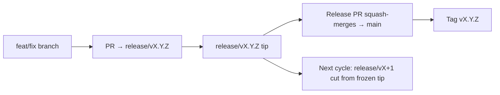

# Branching & Release Model (Svenska)

🌐 **Languages:** 🇺🇸 [English](../../../../ops/BRANCHING_MODEL.md) · 🇪🇹 [am](../../../am/docs/ops/BRANCHING_MODEL.md) · 🇸🇦 [ar](../../../ar/docs/ops/BRANCHING_MODEL.md) · 🇦🇿 [az](../../../az/docs/ops/BRANCHING_MODEL.md) · 🇧🇬 [bg](../../../bg/docs/ops/BRANCHING_MODEL.md) · 🇧🇩 [bn](../../../bn/docs/ops/BRANCHING_MODEL.md) · 🇧🇦 [bs](../../../bs/docs/ops/BRANCHING_MODEL.md) · 🇨🇿 [cs](../../../cs/docs/ops/BRANCHING_MODEL.md) · 🇩🇰 [da](../../../da/docs/ops/BRANCHING_MODEL.md) · 🇩🇪 [de](../../../de/docs/ops/BRANCHING_MODEL.md) · 🇬🇷 [el](../../../el/docs/ops/BRANCHING_MODEL.md) · 🇪🇸 [es](../../../es/docs/ops/BRANCHING_MODEL.md) · 🇪🇪 [et](../../../et/docs/ops/BRANCHING_MODEL.md) · 🇮🇷 [fa](../../../fa/docs/ops/BRANCHING_MODEL.md) · 🇫🇮 [fi](../../../fi/docs/ops/BRANCHING_MODEL.md) · 🇫🇷 [fr](../../../fr/docs/ops/BRANCHING_MODEL.md) · 🇮🇪 [ga](../../../ga/docs/ops/BRANCHING_MODEL.md) · 🇮🇳 [gu](../../../gu/docs/ops/BRANCHING_MODEL.md) · 🇳🇬 [ha](../../../ha/docs/ops/BRANCHING_MODEL.md) · 🇮🇱 [he](../../../he/docs/ops/BRANCHING_MODEL.md) · 🇮🇳 [hi](../../../hi/docs/ops/BRANCHING_MODEL.md) · 🇭🇷 [hr](../../../hr/docs/ops/BRANCHING_MODEL.md) · 🇭🇺 [hu](../../../hu/docs/ops/BRANCHING_MODEL.md) · 🇦🇲 [hy](../../../hy/docs/ops/BRANCHING_MODEL.md) · 🇮🇩 [id](../../../id/docs/ops/BRANCHING_MODEL.md) · 🇳🇬 [ig](../../../ig/docs/ops/BRANCHING_MODEL.md) · 🇮🇹 [it](../../../it/docs/ops/BRANCHING_MODEL.md) · 🇯🇵 [ja](../../../ja/docs/ops/BRANCHING_MODEL.md) · 🇬🇪 [ka](../../../ka/docs/ops/BRANCHING_MODEL.md) · 🇰🇭 [km](../../../km/docs/ops/BRANCHING_MODEL.md) · 🇮🇳 [kn](../../../kn/docs/ops/BRANCHING_MODEL.md) · 🇰🇷 [ko](../../../ko/docs/ops/BRANCHING_MODEL.md) · 🇱🇹 [lt](../../../lt/docs/ops/BRANCHING_MODEL.md) · 🇱🇻 [lv](../../../lv/docs/ops/BRANCHING_MODEL.md) · 🇮🇳 [ml](../../../ml/docs/ops/BRANCHING_MODEL.md) · 🇮🇳 [mr](../../../mr/docs/ops/BRANCHING_MODEL.md) · 🇲🇾 [ms](../../../ms/docs/ops/BRANCHING_MODEL.md) · 🇲🇹 [mt](../../../mt/docs/ops/BRANCHING_MODEL.md) · 🇲🇲 [my](../../../my/docs/ops/BRANCHING_MODEL.md) · 🇳🇵 [ne](../../../ne/docs/ops/BRANCHING_MODEL.md) · 🇳🇱 [nl](../../../nl/docs/ops/BRANCHING_MODEL.md) · 🇳🇴 [no](../../../no/docs/ops/BRANCHING_MODEL.md) · 🇮🇳 [or](../../../or/docs/ops/BRANCHING_MODEL.md) · 🇮🇳 [pa](../../../pa/docs/ops/BRANCHING_MODEL.md) · 🇵🇭 [phi](../../../phi/docs/ops/BRANCHING_MODEL.md) · 🇵🇱 [pl](../../../pl/docs/ops/BRANCHING_MODEL.md) · 🇵🇹 [pt](../../../pt/docs/ops/BRANCHING_MODEL.md) · 🇧🇷 [pt-BR](../../../pt-BR/docs/ops/BRANCHING_MODEL.md) · 🇷🇴 [ro](../../../ro/docs/ops/BRANCHING_MODEL.md) · 🇷🇺 [ru](../../../ru/docs/ops/BRANCHING_MODEL.md) · 🇱🇰 [si](../../../si/docs/ops/BRANCHING_MODEL.md) · 🇸🇰 [sk](../../../sk/docs/ops/BRANCHING_MODEL.md) · 🇸🇮 [sl](../../../sl/docs/ops/BRANCHING_MODEL.md) · 🇷🇸 [sr](../../../sr/docs/ops/BRANCHING_MODEL.md) · 🇰🇪 [sw](../../../sw/docs/ops/BRANCHING_MODEL.md) · 🇮🇳 [ta](../../../ta/docs/ops/BRANCHING_MODEL.md) · 🇮🇳 [te](../../../te/docs/ops/BRANCHING_MODEL.md) · 🇹🇭 [th](../../../th/docs/ops/BRANCHING_MODEL.md) · 🇹🇷 [tr](../../../tr/docs/ops/BRANCHING_MODEL.md) · 🇺🇦 [uk-UA](../../../uk-UA/docs/ops/BRANCHING_MODEL.md) · 🇵🇰 [ur](../../../ur/docs/ops/BRANCHING_MODEL.md) · 🇺🇿 [uz](../../../uz/docs/ops/BRANCHING_MODEL.md) · 🇻🇳 [vi](../../../vi/docs/ops/BRANCHING_MODEL.md) · 🇳🇬 [yo](../../../yo/docs/ops/BRANCHING_MODEL.md) · 🇨🇳 [zh-CN](../../../zh-CN/docs/ops/BRANCHING_MODEL.md) · 🇹🇼 [zh-TW](../../../zh-TW/docs/ops/BRANCHING_MODEL.md)

---

OmniRoute använder en **parallell cykelmodell** för releaser: en särskild `release/vX.Y.Z`-gren
för den aktiva cykeln, `main` för den publicerade linjen och en oföränderlig
`vX.Y.Z`-tagg när cykeln släpps. Det är förväntat att se commits hamna både på `release/*` _och_ på
`main` — det är inte ett misstag.

Detaljer för ansvariga finns i `CLAUDE.md` (Strikt regel nr 21) och
[RELEASE_CHECKLIST.md](./RELEASE_CHECKLIST.md). Den här sidan är den offentliga
sammanfattningen för bidragsgivare.

## I korthet

| Referens         | Roll                                                                                         |
| ---------------- | -------------------------------------------------------------------------------------------- |
| `release/vX.Y.Z` | **Aktiv cykel** — daglig utveckling och sammanslagning av PR:er för den versionen            |
| `main`           | **Publicerad linje** — tar emot cykeln via squash-sammanslagning när releasen släpps         |
| `vX.Y.Z` (tagg)  | **Releasemarkör** — oföränderlig pekare för ”det som släpptes”, skapad vid releasetillfället |



## Vilken gren ska min PR rikta sig mot?

**Rikta den mot den aktiva `release/vX.Y.Z`-grenen — inte mot `main`.**

1. Hitta den högst numrerade öppna `release/v*`-grenen (exempel vid skrivande stund:
   `release/v3.8.49`).
2. Skapa din gren från dess spets (`git fetch` + checkout/rebase mot den).
3. Öppna PR:en med **base = den `release/vX.Y.Z`-grenen**.

`main` är inte integrationsgrenen för det dagliga arbetet. PR:er som öppnas mot `main`
behöver vanligtvis riktas om innan de slås samman.

## Releasefrysning (parallella cykler)

När en release stäms av öppnas ett markörärende med etiketten `release-freeze`.
Det **stoppar inte utvecklingen**:

- Den frysta `release/vX.Y.Z` tillhör releaseansvarig för den releasen.
- Nästa cykels `release/vX+1` skapas från den frysta spetsen så att bidragsgivare kan fortsätta
  få in ändringar.
- Öppna PR:er som fortfarande riktar sig mot den frysta grenen ska **riktas om** till den
  aktiva (högst numrerade) `release/v*`-grenen.

Kontrollera om det finns en aktiv frysning innan du antar att grenen du vill använda kan slås samman:

```bash
gh issue list --repo diegosouzapw/OmniRoute --label release-freeze --state open
```

Sammanslagningsmekaniken (ägarens `queue`-etikett → Mergify) dokumenteras i
[MERGE_TRAIN.md](./MERGE_TRAIN.md).

## Varför både en gren och en tagg?

| Artefakt         | Livslängd      | Syfte                                                               |
| ---------------- | -------------- | ------------------------------------------------------------------- |
| `release/vX.Y.Z` | Pågående cykel | Samlar granskade PR:er, hålls CI-grön och används som bas för PR:er |
| Taggen `vX.Y.Z`  | För alltid     | Markerar exakt det innehåll som släpptes till npm/GitHub Releases   |

Grenen är verkstaden; taggen är det förseglade paketet. Efter squash-sammanslagningen till
`main` fortsätter nästa cykel på `release/vX+1` utan att invänta att föregående
release-PR blir klar.

## Relaterad dokumentation

- [CONTRIBUTING.md](../../CONTRIBUTING.md) — konfiguration, tester och checklista för PR:er
- [RELEASE_CHECKLIST.md](./RELEASE_CHECKLIST.md) — validering före release
- [MERGE_TRAIN.md](./MERGE_TRAIN.md) — sammanslagningskö och reservflöde
- [RELEASE_GREEN.md](./RELEASE_GREEN.md) — hålla releasespetsen grön
