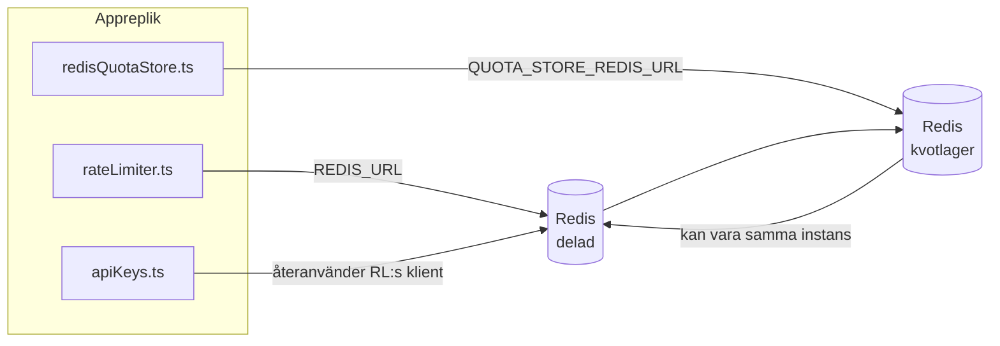

# Redis Production Configuration Guide (Svenska)

🌐 **Languages:** 🇺🇸 [English](../../../../ops/REDIS_PRODUCTION_CONFIG.md) · 🇪🇹 [am](../../../am/docs/ops/REDIS_PRODUCTION_CONFIG.md) · 🇸🇦 [ar](../../../ar/docs/ops/REDIS_PRODUCTION_CONFIG.md) · 🇦🇿 [az](../../../az/docs/ops/REDIS_PRODUCTION_CONFIG.md) · 🇧🇬 [bg](../../../bg/docs/ops/REDIS_PRODUCTION_CONFIG.md) · 🇧🇩 [bn](../../../bn/docs/ops/REDIS_PRODUCTION_CONFIG.md) · 🇧🇦 [bs](../../../bs/docs/ops/REDIS_PRODUCTION_CONFIG.md) · 🇨🇿 [cs](../../../cs/docs/ops/REDIS_PRODUCTION_CONFIG.md) · 🇩🇰 [da](../../../da/docs/ops/REDIS_PRODUCTION_CONFIG.md) · 🇩🇪 [de](../../../de/docs/ops/REDIS_PRODUCTION_CONFIG.md) · 🇬🇷 [el](../../../el/docs/ops/REDIS_PRODUCTION_CONFIG.md) · 🇪🇸 [es](../../../es/docs/ops/REDIS_PRODUCTION_CONFIG.md) · 🇪🇪 [et](../../../et/docs/ops/REDIS_PRODUCTION_CONFIG.md) · 🇮🇷 [fa](../../../fa/docs/ops/REDIS_PRODUCTION_CONFIG.md) · 🇫🇮 [fi](../../../fi/docs/ops/REDIS_PRODUCTION_CONFIG.md) · 🇫🇷 [fr](../../../fr/docs/ops/REDIS_PRODUCTION_CONFIG.md) · 🇮🇪 [ga](../../../ga/docs/ops/REDIS_PRODUCTION_CONFIG.md) · 🇮🇳 [gu](../../../gu/docs/ops/REDIS_PRODUCTION_CONFIG.md) · 🇳🇬 [ha](../../../ha/docs/ops/REDIS_PRODUCTION_CONFIG.md) · 🇮🇱 [he](../../../he/docs/ops/REDIS_PRODUCTION_CONFIG.md) · 🇮🇳 [hi](../../../hi/docs/ops/REDIS_PRODUCTION_CONFIG.md) · 🇭🇷 [hr](../../../hr/docs/ops/REDIS_PRODUCTION_CONFIG.md) · 🇭🇺 [hu](../../../hu/docs/ops/REDIS_PRODUCTION_CONFIG.md) · 🇦🇲 [hy](../../../hy/docs/ops/REDIS_PRODUCTION_CONFIG.md) · 🇮🇩 [id](../../../id/docs/ops/REDIS_PRODUCTION_CONFIG.md) · 🇳🇬 [ig](../../../ig/docs/ops/REDIS_PRODUCTION_CONFIG.md) · 🇮🇹 [it](../../../it/docs/ops/REDIS_PRODUCTION_CONFIG.md) · 🇯🇵 [ja](../../../ja/docs/ops/REDIS_PRODUCTION_CONFIG.md) · 🇬🇪 [ka](../../../ka/docs/ops/REDIS_PRODUCTION_CONFIG.md) · 🇰🇭 [km](../../../km/docs/ops/REDIS_PRODUCTION_CONFIG.md) · 🇮🇳 [kn](../../../kn/docs/ops/REDIS_PRODUCTION_CONFIG.md) · 🇰🇷 [ko](../../../ko/docs/ops/REDIS_PRODUCTION_CONFIG.md) · 🇱🇹 [lt](../../../lt/docs/ops/REDIS_PRODUCTION_CONFIG.md) · 🇱🇻 [lv](../../../lv/docs/ops/REDIS_PRODUCTION_CONFIG.md) · 🇮🇳 [ml](../../../ml/docs/ops/REDIS_PRODUCTION_CONFIG.md) · 🇮🇳 [mr](../../../mr/docs/ops/REDIS_PRODUCTION_CONFIG.md) · 🇲🇾 [ms](../../../ms/docs/ops/REDIS_PRODUCTION_CONFIG.md) · 🇲🇹 [mt](../../../mt/docs/ops/REDIS_PRODUCTION_CONFIG.md) · 🇲🇲 [my](../../../my/docs/ops/REDIS_PRODUCTION_CONFIG.md) · 🇳🇵 [ne](../../../ne/docs/ops/REDIS_PRODUCTION_CONFIG.md) · 🇳🇱 [nl](../../../nl/docs/ops/REDIS_PRODUCTION_CONFIG.md) · 🇳🇴 [no](../../../no/docs/ops/REDIS_PRODUCTION_CONFIG.md) · 🇮🇳 [or](../../../or/docs/ops/REDIS_PRODUCTION_CONFIG.md) · 🇮🇳 [pa](../../../pa/docs/ops/REDIS_PRODUCTION_CONFIG.md) · 🇵🇭 [phi](../../../phi/docs/ops/REDIS_PRODUCTION_CONFIG.md) · 🇵🇱 [pl](../../../pl/docs/ops/REDIS_PRODUCTION_CONFIG.md) · 🇵🇹 [pt](../../../pt/docs/ops/REDIS_PRODUCTION_CONFIG.md) · 🇧🇷 [pt-BR](../../../pt-BR/docs/ops/REDIS_PRODUCTION_CONFIG.md) · 🇷🇴 [ro](../../../ro/docs/ops/REDIS_PRODUCTION_CONFIG.md) · 🇷🇺 [ru](../../../ru/docs/ops/REDIS_PRODUCTION_CONFIG.md) · 🇱🇰 [si](../../../si/docs/ops/REDIS_PRODUCTION_CONFIG.md) · 🇸🇰 [sk](../../../sk/docs/ops/REDIS_PRODUCTION_CONFIG.md) · 🇸🇮 [sl](../../../sl/docs/ops/REDIS_PRODUCTION_CONFIG.md) · 🇷🇸 [sr](../../../sr/docs/ops/REDIS_PRODUCTION_CONFIG.md) · 🇰🇪 [sw](../../../sw/docs/ops/REDIS_PRODUCTION_CONFIG.md) · 🇮🇳 [ta](../../../ta/docs/ops/REDIS_PRODUCTION_CONFIG.md) · 🇮🇳 [te](../../../te/docs/ops/REDIS_PRODUCTION_CONFIG.md) · 🇹🇭 [th](../../../th/docs/ops/REDIS_PRODUCTION_CONFIG.md) · 🇹🇷 [tr](../../../tr/docs/ops/REDIS_PRODUCTION_CONFIG.md) · 🇺🇦 [uk-UA](../../../uk-UA/docs/ops/REDIS_PRODUCTION_CONFIG.md) · 🇵🇰 [ur](../../../ur/docs/ops/REDIS_PRODUCTION_CONFIG.md) · 🇺🇿 [uz](../../../uz/docs/ops/REDIS_PRODUCTION_CONFIG.md) · 🇻🇳 [vi](../../../vi/docs/ops/REDIS_PRODUCTION_CONFIG.md) · 🇳🇬 [yo](../../../yo/docs/ops/REDIS_PRODUCTION_CONFIG.md) · 🇨🇳 [zh-CN](../../../zh-CN/docs/ops/REDIS_PRODUCTION_CONFIG.md) · 🇹🇼 [zh-TW](../../../zh-TW/docs/ops/REDIS_PRODUCTION_CONFIG.md)

---

## Översikt

Redis är ett **valfritt, mjukt beroende** i OmniRoute — applikationen fortsätter fungera med reducerad funktionalitet (reservlösningar i minnet) när Redis inte är tillgängligt. I produktion minskar optimering av Redis latensen för fyra separata arbetsbelastningar:

| Arbetsbelastning             | Drivrutin                     | Klientfabrik                                     | Nyckelmönster                                                |
| ---------------------------- | ----------------------------- | ------------------------------------------------ | ------------------------------------------------------------ |
| Hastighetsbegränsning        | `rateLimiter.ts`              | `getRedisClient()` — lat singleton för `ioredis` | `<prefix>rl:*` Lua-atomära fönster för hastighetsbegränsning |
| Autentiseringscache          | `apiKeys.ts`                  | Återanvänder klienten från `rateLimiter`         | `<prefix>auth:api_key:<sha256>` med TTL                      |
| Kvotlagring                  | `redisQuotaStore.ts`          | Separat singleton för `getRedisClient(url)`      | `<prefix>quota:*` konfigurerbart per instans                 |
| Kretsbrytare för uppvärmning | `redisCircuitBreakerStore.ts` | Separat klient i `circuitBreakerFactory.ts`      | `<prefix>warmup:cb:<connectionId>`                           |

Alla fyra arbetsbelastningar delar ett namnområdesprefix så att OmniRoute kan samexistera med andra appar på en enda Redis-instans (t.ex. `127.0.0.1:6379`). Se [Namnområden för nycklar](#key-namespacing).

---

## Aktuell konfiguration (kodens standardvärden)

| Inställning                            | Värde                                                            | Var                                                                                   |
| -------------------------------------- | ---------------------------------------------------------------- | ------------------------------------------------------------------------------------- |
| Miljövariabeln `REDIS_URL`             | `redis://redis:6379` (compose), valfri                           | `rateLimiter.ts:5`, `.env.example`                                                    |
| Miljövariabeln `REDIS_KEY_PREFIX`      | `omniroute:` (standardvärde)                                     | `rateLimiter.ts`, `redisQuotaStore.ts`, `redisCircuitBreakerStore.ts`, `.env.example` |
| Miljövariabeln `QUOTA_STORE_REDIS_URL` | separat, kan skilja sig från `REDIS_URL`                         | `quota/storeFactory.ts`                                                               |
| `QUOTA_STORE_DRIVER`                   | `"sqlite"` (standardvärde), `"redis"` valfritt                   | `quota/storeFactory.ts`                                                               |
| ioredis `maxRetriesPerRequest`         | `3`                                                              | skapande av klient i `rateLimiter.ts`                                                 |
| `enableReadyCheck`                     | inte angivet (standardvärde i ioredis: `true`)                   | —                                                                                     |
| `lazyConnect`                          | inte angivet (standardvärde i ioredis: `false`)                  | —                                                                                     |
| `retryStrategy`                        | inte angivet (standardvärde i ioredis: 200 ms bas, exponentiell) | —                                                                                     |
| TLS/lösenord/databasindex              | **inte konfigurerat**                                            | —                                                                                     |
| Sentinel/Cluster                       | **inte konfigurerat** — endast fristående enskild nod            | —                                                                                     |

---

## Namnområden för nycklar

OmniRoute delar en Redis-instans med allt annat som körs på värden. Utan ett namnområde kan nycklar som `auth:api_key:<sha256>` eller `rl:*` kollidera med nycklar från andra applikationer som använder samma Redis (den här instansen kör Redis på `127.0.0.1:6379` tillsammans med andra tjänster).

Ange `REDIS_KEY_PREFIX` som en icke-tom sträng för att lägga till ett prefix till **varje** OmniRoute-nyckel:

```bash
# .env — alla OmniRoute-nycklar blir omniroute:rl:*, omniroute:auth:*, omniroute:quota:*, omniroute:warmup:cb:*
REDIS_KEY_PREFIX=omniroute:
```

- **Standardvärde:** `omniroute:` (används när `REDIS_KEY_PREFIX` inte har angetts eller är tomt).
- **Tillämpas på:** hastighetsbegränsaren + autentiseringscachen (delad `ioredis`-klient via `keyPrefix`), kvotlagringen (`KEY_PREFIX = "${REDIS_KEY_PREFIX}quota"`) och kretsbrytaren för uppvärmning (`KEY_PREFIX = "${REDIS_KEY_PREFIX}warmup:cb:"`).
- **Om prefixet ändras** när nycklar redan finns i Redis blir de gamla nycklarna övergivna (de upphör att gälla via TTL/LRU). Det är säkert att ändra prefixet och ingen migrering behövs. Det enda undantaget är en kretsbrytarnyckel för uppvärmning av en anslutning som markerats som förbjuden: den lagras utan TTL, så lista kvarvarande nycklar med `redis-cli --scan --pattern '<old-prefix>warmup:cb:*'` och ta bort dem.
- **ioredis `keyPrefix`** lägger automatiskt till prefixet vid skrivningar **och** tar bort det vid läsningar, så applikationskoden ser aldrig prefixet.

---

## Rekommenderad produktionsoptimering

### 1. Anslutningspool/klientalternativ (ioredis-konstruktorn `Redis`)

Den aktuella koden skapar en enda `new Redis(url)` utan anpassade alternativ. För produktionsdistributioner
med flera repliker bör du ange en klientfabrik i koden eller kapsla in `getRedisClient()`:

```typescript
const redis = new Redis(REDIS_URL, {
  maxRetriesPerRequest: null, // ingen gräns för återförsök; låt retryStrategy avgöra
  enableReadyCheck: true, // verifiera att servern är redo innan anrop accepteras
  lazyConnect: true, // anslut inte vid konstruktion; vänta till det första anropet
  retryStrategy: (times) => {
    if (times > 10) return null; // ge upp efter 10 återförsök → återanslut senare
    return Math.min(times * 200, 5000); // 200 ms, 400 ms, …, högst 5 s
  },
  enableAutoPipelining: true, // slå samman samtidiga kommandon till en enda TCP-skrivning
  keepAlive: 10000, // TCP keep-alive var 10:e sekund
});
```

**Viktiga avvägningar:**

- `maxRetriesPerRequest: null` + `retryStrategy` — rekommenderas för produktion så att tillfälliga
  omstarter av Redis inte omedelbart leder till att varje begäran misslyckas. Reservlösningen i minnet i
  `checkRateLimit()` hanterar felvägen.
- `lazyConnect: true` — undviker att uppstarten är beroende av att Redis är igång innan servern
  börjar acceptera anslutningar.
- `enableAutoPipelining: true` — minskar antalet tur-och-retur-anrop för samtidiga kontroller av hastighetsgränser;
  fördelaktigt vid >50 RPS på en enda anslutning.

### 2. Redis-serverkonfiguration (`redis.conf`)

```
# Minne
maxmemory 80%                        # lämna utrymme för operativsystemets sidcache
maxmemory-policy allkeys-lru         # avlägsna inaktuella poster i autentiseringscachen vid minnesbrist

# Persistens (valfritt — OmniRoute är kraschsäkert utan detta)
save 300 1                           # skapa ögonblicksbild minst var 5:e minut om ≥1 nyckel har ändrats
appendonly no                        # AOF behövs inte; data kan återskapas
appendfsync no                       # ingen fsync-overhead (RDB är tillräckligt)

# Nätverk
timeout 0                            # ingen frånkoppling vid inaktivitet
tcp-keepalive 300                    # keep-alive var 5:e minut
tcp-backlog 511                      # anslutningskö för ojämn belastning med toppar

# Prestanda
hz 10                                # standardvärde; 100 för latenskänsliga tillämpningar
activedefrag yes                     # defragmentera automatiskt när fragmenteringen är >10 %
```

**Avvägning för `maxmemory-policy allkeys-lru`:** Poster i autentiseringscachen kan avlägsnas vid
minnesbrist. Detta är säkert — `setCachedApiKey` fyller alltid på cachen igen vid en miss, och
SQLite-reservlösningen är auktoritativ. Lua-skriptet för hastighetsbegränsning skapar små nycklar som avsiktligt
är kortlivade.

### 3. Inställningar för Docker Compose

Compose-filen för produktion (`docker-compose.prod.yml`) använder `redis:8.6.2-alpine`. Lägg till:

```yaml
redis:
  image: redis:8.6.2-alpine
  command:
    [
      "redis-server",
      "--maxmemory",
      "512mb",
      "--maxmemory-policy",
      "allkeys-lru",
      "--activedefrag",
      "yes",
      "--save",
      "300 1",
    ]
  healthcheck:
    test: ["CMD", "redis-cli", "ping"]
    interval: 10s
    timeout: 3s
    retries: 3
    start_period: 5s
```

### 4. Överväganden för flera instanser/skalning

**En enda Redis-instans för alla repliker** — Lua-skriptet för hastighetsbegränsning är beroende av ett enda
auktoritativt nyckelutrymme. Flera Redis-instanser bakom replikerna skulle göra att atomiciteten går förlorad
och budgeten fördubblas. Använd en enda Redis-instans (eller ett Redis Sentinel-kluster med redundansväxling) för
alla applikationsrepliker.

**Antal anslutningar:** Varje applikationsreplik öppnar **2 TCP-anslutningar** till Redis
(klient för hastighetsbegränsning + klient för kvotlagring). Vid 10 repliker → 20 anslutningar, vilket ligger
väl inom standardgränsen på 10 000 anslutningar för en Redis-instans.

### 5. Övervakning

Exponera via en hälsokontrollendpoint:

```typescript
// src/app/api/monitoring/health/route.ts anropar redan rateLimiter-funktioner
// Lägg till Redis-specifika kontroller:
//   1. PING-latens via ioredis .ping()
//   2. Minnesanvändning via INFO memory
//   3. Antal anslutningar via INFO clients
//   4. Träfffrekvens för maxmemory-policy (evicted_keys / keyspace_hits)
```

Viktiga mätvärden att bevaka:

- **Avlägsnade nycklar/sek** — öka `maxmemory` om värdet är ihållande större än noll
- **Blockerade klienter** — ett värde större än noll tyder på långsamma Lua-skript eller hög resurskonkurrens
- **Avvisade anslutningar** — anslutningsgränsen har nåtts; osannolikt vid 20 anslutningar

---

## Arkitekturdiagram



---

## Referenser

| Fil                                | Syfte                                                                             |
| ---------------------------------- | --------------------------------------------------------------------------------- |
| `src/shared/utils/rateLimiter.ts`  | Primär Redis-klient, Lua-skript för hastighetsbegränsning, reservlösning i minnet |
| `src/lib/db/apiKeys.ts`            | Autentiseringscache — reservlösning från Redis till SQLite                        |
| `src/lib/quota/redisQuotaStore.ts` | Separat Redis-klient för valfritt kvotlager                                       |
| `src/lib/quota/storeFactory.ts`    | Växlar mellan kvotdrivrutinerna `sqlite` och `redis`                              |
| `docker-compose.prod.yml`          | Redis-container för produktion (avbildning `redis:8.6.2-alpine`)                  |
| `.env.example`                     | Dokumentation för Redis-miljövariabler                                            |
| `src/app/api/local/redis/`         | API-rutter för orkestrering av utvecklingscontainrar                              |
| `bin/cli/commands/redis.mjs`       | CLI-kommandon för orkestrering av utvecklingscontainrar                           |
