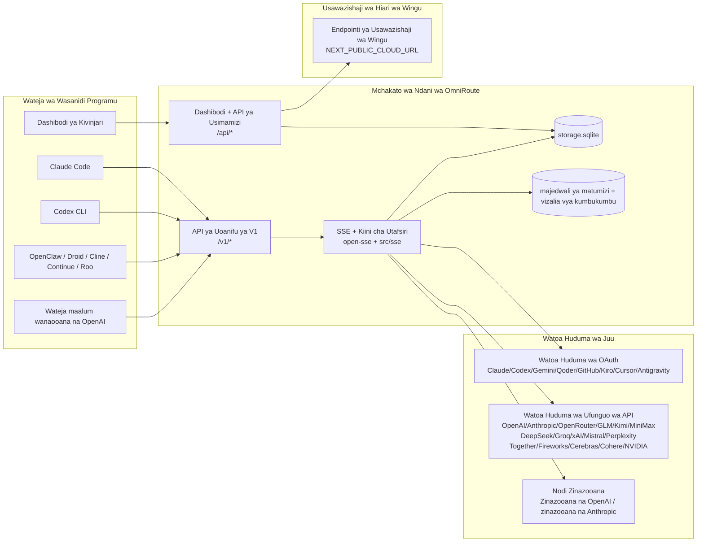
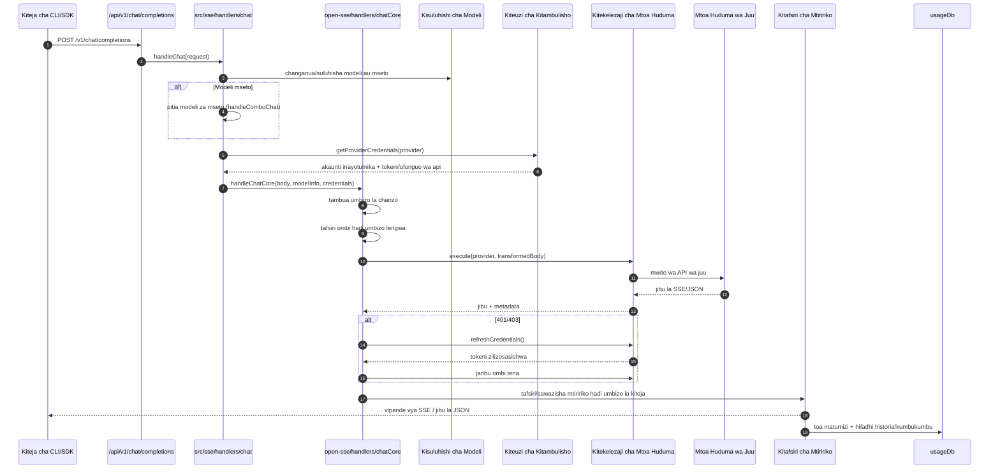
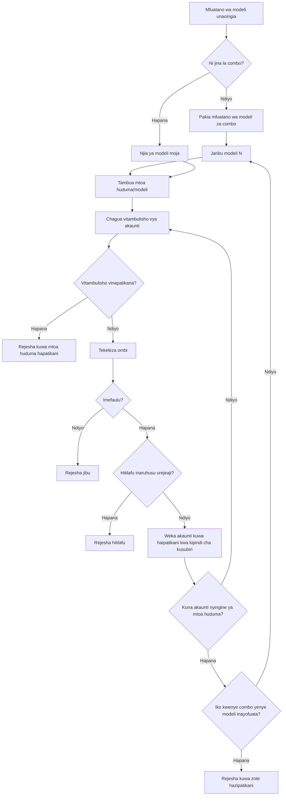
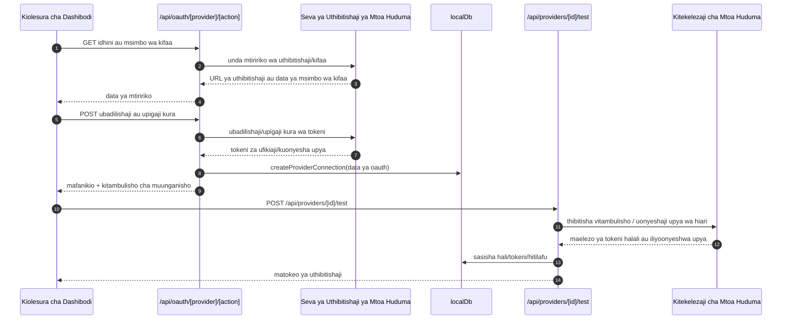
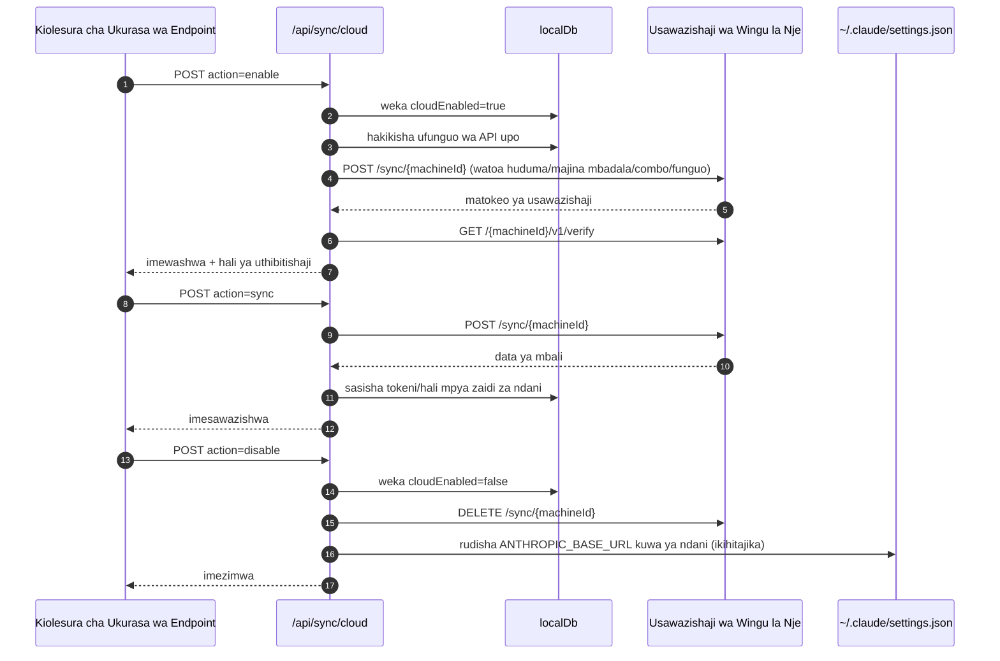
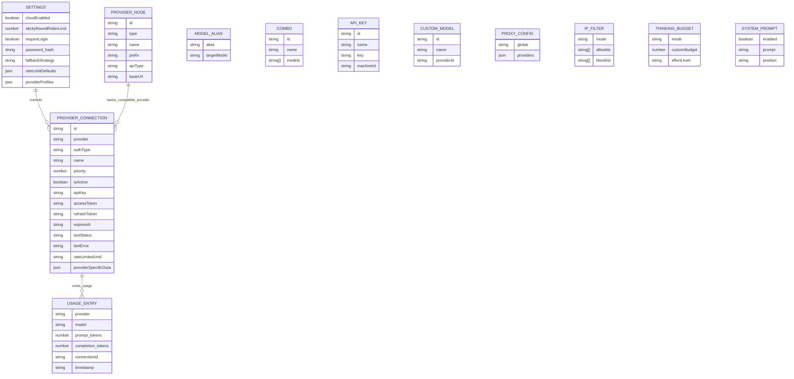
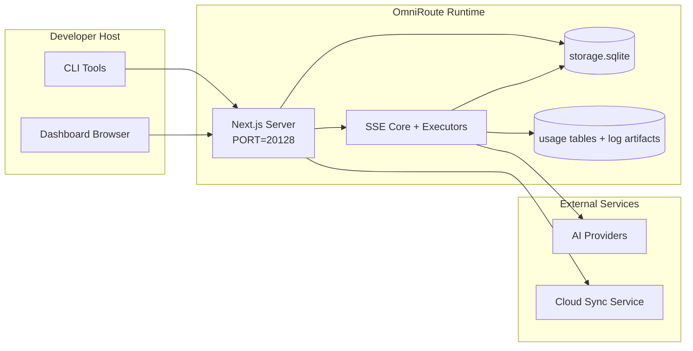

# OmniRoute Architecture (Kiswahili)

🌐 **Languages:** 🇺🇸 [English](../../../../architecture/ARCHITECTURE.md) · 🇪🇹 [am](../../../am/docs/architecture/ARCHITECTURE.md) · 🇸🇦 [ar](../../../ar/docs/architecture/ARCHITECTURE.md) · 🇦🇿 [az](../../../az/docs/architecture/ARCHITECTURE.md) · 🇧🇬 [bg](../../../bg/docs/architecture/ARCHITECTURE.md) · 🇧🇩 [bn](../../../bn/docs/architecture/ARCHITECTURE.md) · 🇧🇦 [bs](../../../bs/docs/architecture/ARCHITECTURE.md) · 🇨🇿 [cs](../../../cs/docs/architecture/ARCHITECTURE.md) · 🇩🇰 [da](../../../da/docs/architecture/ARCHITECTURE.md) · 🇩🇪 [de](../../../de/docs/architecture/ARCHITECTURE.md) · 🇬🇷 [el](../../../el/docs/architecture/ARCHITECTURE.md) · 🇪🇸 [es](../../../es/docs/architecture/ARCHITECTURE.md) · 🇪🇪 [et](../../../et/docs/architecture/ARCHITECTURE.md) · 🇮🇷 [fa](../../../fa/docs/architecture/ARCHITECTURE.md) · 🇫🇮 [fi](../../../fi/docs/architecture/ARCHITECTURE.md) · 🇫🇷 [fr](../../../fr/docs/architecture/ARCHITECTURE.md) · 🇮🇪 [ga](../../../ga/docs/architecture/ARCHITECTURE.md) · 🇮🇳 [gu](../../../gu/docs/architecture/ARCHITECTURE.md) · 🇳🇬 [ha](../../../ha/docs/architecture/ARCHITECTURE.md) · 🇮🇱 [he](../../../he/docs/architecture/ARCHITECTURE.md) · 🇮🇳 [hi](../../../hi/docs/architecture/ARCHITECTURE.md) · 🇭🇷 [hr](../../../hr/docs/architecture/ARCHITECTURE.md) · 🇭🇺 [hu](../../../hu/docs/architecture/ARCHITECTURE.md) · 🇦🇲 [hy](../../../hy/docs/architecture/ARCHITECTURE.md) · 🇮🇩 [id](../../../id/docs/architecture/ARCHITECTURE.md) · 🇳🇬 [ig](../../../ig/docs/architecture/ARCHITECTURE.md) · 🇮🇹 [it](../../../it/docs/architecture/ARCHITECTURE.md) · 🇯🇵 [ja](../../../ja/docs/architecture/ARCHITECTURE.md) · 🇬🇪 [ka](../../../ka/docs/architecture/ARCHITECTURE.md) · 🇰🇭 [km](../../../km/docs/architecture/ARCHITECTURE.md) · 🇮🇳 [kn](../../../kn/docs/architecture/ARCHITECTURE.md) · 🇰🇷 [ko](../../../ko/docs/architecture/ARCHITECTURE.md) · 🇱🇹 [lt](../../../lt/docs/architecture/ARCHITECTURE.md) · 🇱🇻 [lv](../../../lv/docs/architecture/ARCHITECTURE.md) · 🇮🇳 [ml](../../../ml/docs/architecture/ARCHITECTURE.md) · 🇮🇳 [mr](../../../mr/docs/architecture/ARCHITECTURE.md) · 🇲🇾 [ms](../../../ms/docs/architecture/ARCHITECTURE.md) · 🇲🇹 [mt](../../../mt/docs/architecture/ARCHITECTURE.md) · 🇲🇲 [my](../../../my/docs/architecture/ARCHITECTURE.md) · 🇳🇵 [ne](../../../ne/docs/architecture/ARCHITECTURE.md) · 🇳🇱 [nl](../../../nl/docs/architecture/ARCHITECTURE.md) · 🇳🇴 [no](../../../no/docs/architecture/ARCHITECTURE.md) · 🇮🇳 [or](../../../or/docs/architecture/ARCHITECTURE.md) · 🇮🇳 [pa](../../../pa/docs/architecture/ARCHITECTURE.md) · 🇵🇭 [phi](../../../phi/docs/architecture/ARCHITECTURE.md) · 🇵🇱 [pl](../../../pl/docs/architecture/ARCHITECTURE.md) · 🇵🇹 [pt](../../../pt/docs/architecture/ARCHITECTURE.md) · 🇧🇷 [pt-BR](../../../pt-BR/docs/architecture/ARCHITECTURE.md) · 🇷🇴 [ro](../../../ro/docs/architecture/ARCHITECTURE.md) · 🇷🇺 [ru](../../../ru/docs/architecture/ARCHITECTURE.md) · 🇱🇰 [si](../../../si/docs/architecture/ARCHITECTURE.md) · 🇸🇰 [sk](../../../sk/docs/architecture/ARCHITECTURE.md) · 🇸🇮 [sl](../../../sl/docs/architecture/ARCHITECTURE.md) · 🇷🇸 [sr](../../../sr/docs/architecture/ARCHITECTURE.md) · 🇸🇪 [sv](../../../sv/docs/architecture/ARCHITECTURE.md) · 🇮🇳 [ta](../../../ta/docs/architecture/ARCHITECTURE.md) · 🇮🇳 [te](../../../te/docs/architecture/ARCHITECTURE.md) · 🇹🇭 [th](../../../th/docs/architecture/ARCHITECTURE.md) · 🇹🇷 [tr](../../../tr/docs/architecture/ARCHITECTURE.md) · 🇺🇦 [uk-UA](../../../uk-UA/docs/architecture/ARCHITECTURE.md) · 🇵🇰 [ur](../../../ur/docs/architecture/ARCHITECTURE.md) · 🇺🇿 [uz](../../../uz/docs/architecture/ARCHITECTURE.md) · 🇻🇳 [vi](../../../vi/docs/architecture/ARCHITECTURE.md) · 🇳🇬 [yo](../../../yo/docs/architecture/ARCHITECTURE.md) · 🇨🇳 [zh-CN](../../../zh-CN/docs/architecture/ARCHITECTURE.md) · 🇹🇼 [zh-TW](../../../zh-TW/docs/architecture/ARCHITECTURE.md)

---

🌐 **Languages:** 🇺🇸 [English](../../../../architecture/ARCHITECTURE.md) · 🇪🇹 [am](../../../am/docs/architecture/ARCHITECTURE.md) · 🇸🇦 [ar](../../../ar/docs/architecture/ARCHITECTURE.md) · 🇦🇿 [az](../../../az/docs/architecture/ARCHITECTURE.md) · 🇧🇬 [bg](../../../bg/docs/architecture/ARCHITECTURE.md) · 🇧🇩 [bn](../../../bn/docs/architecture/ARCHITECTURE.md) · 🇧🇦 [bs](../../../bs/docs/architecture/ARCHITECTURE.md) · 🇨🇿 [cs](../../../cs/docs/architecture/ARCHITECTURE.md) · 🇩🇰 [da](../../../da/docs/architecture/ARCHITECTURE.md) · 🇩🇪 [de](../../../de/docs/architecture/ARCHITECTURE.md) · 🇬🇷 [el](../../../el/docs/architecture/ARCHITECTURE.md) · 🇪🇸 [es](../../../es/docs/architecture/ARCHITECTURE.md) · 🇪🇪 [et](../../../et/docs/architecture/ARCHITECTURE.md) · 🇮🇷 [fa](../../../fa/docs/architecture/ARCHITECTURE.md) · 🇫🇮 [fi](../../../fi/docs/architecture/ARCHITECTURE.md) · 🇫🇷 [fr](../../../fr/docs/architecture/ARCHITECTURE.md) · 🇮🇪 [ga](../../../ga/docs/architecture/ARCHITECTURE.md) · 🇮🇳 [gu](../../../gu/docs/architecture/ARCHITECTURE.md) · 🇳🇬 [ha](../../../ha/docs/architecture/ARCHITECTURE.md) · 🇮🇱 [he](../../../he/docs/architecture/ARCHITECTURE.md) · 🇮🇳 [hi](../../../hi/docs/architecture/ARCHITECTURE.md) · 🇭🇷 [hr](../../../hr/docs/architecture/ARCHITECTURE.md) · 🇭🇺 [hu](../../../hu/docs/architecture/ARCHITECTURE.md) · 🇦🇲 [hy](../../../hy/docs/architecture/ARCHITECTURE.md) · 🇮🇩 [id](../../../id/docs/architecture/ARCHITECTURE.md) · 🇳🇬 [ig](../../../ig/docs/architecture/ARCHITECTURE.md) · 🇮🇹 [it](../../../it/docs/architecture/ARCHITECTURE.md) · 🇯🇵 [ja](../../../ja/docs/architecture/ARCHITECTURE.md) · 🇬🇪 [ka](../../../ka/docs/architecture/ARCHITECTURE.md) · 🇰🇭 [km](../../../km/docs/architecture/ARCHITECTURE.md) · 🇮🇳 [kn](../../../kn/docs/architecture/ARCHITECTURE.md) · 🇰🇷 [ko](../../../ko/docs/architecture/ARCHITECTURE.md) · 🇱🇹 [lt](../../../lt/docs/architecture/ARCHITECTURE.md) · 🇱🇻 [lv](../../../lv/docs/architecture/ARCHITECTURE.md) · 🇮🇳 [ml](../../../ml/docs/architecture/ARCHITECTURE.md) · 🇮🇳 [mr](../../../mr/docs/architecture/ARCHITECTURE.md) · 🇲🇾 [ms](../../../ms/docs/architecture/ARCHITECTURE.md) · 🇲🇹 [mt](../../../mt/docs/architecture/ARCHITECTURE.md) · 🇲🇲 [my](../../../my/docs/architecture/ARCHITECTURE.md) · 🇳🇵 [ne](../../../ne/docs/architecture/ARCHITECTURE.md) · 🇳🇱 [nl](../../../nl/docs/architecture/ARCHITECTURE.md) · 🇳🇴 [no](../../../no/docs/architecture/ARCHITECTURE.md) · 🇮🇳 [or](../../../or/docs/architecture/ARCHITECTURE.md) · 🇮🇳 [pa](../../../pa/docs/architecture/ARCHITECTURE.md) · 🇵🇭 [phi](../../../phi/docs/architecture/ARCHITECTURE.md) · 🇵🇱 [pl](../../../pl/docs/architecture/ARCHITECTURE.md) · 🇵🇹 [pt](../../../pt/docs/architecture/ARCHITECTURE.md) · 🇧🇷 [pt-BR](../../../pt-BR/docs/architecture/ARCHITECTURE.md) · 🇷🇴 [ro](../../../ro/docs/architecture/ARCHITECTURE.md) · 🇷🇺 [ru](../../../ru/docs/architecture/ARCHITECTURE.md) · 🇱🇰 [si](../../../si/docs/architecture/ARCHITECTURE.md) · 🇸🇰 [sk](../../../sk/docs/architecture/ARCHITECTURE.md) · 🇸🇮 [sl](../../../sl/docs/architecture/ARCHITECTURE.md) · 🇷🇸 [sr](../../../sr/docs/architecture/ARCHITECTURE.md) · 🇸🇪 [sv](../../../sv/docs/architecture/ARCHITECTURE.md) · 🇮🇳 [ta](../../../ta/docs/architecture/ARCHITECTURE.md) · 🇮🇳 [te](../../../te/docs/architecture/ARCHITECTURE.md) · 🇹🇭 [th](../../../th/docs/architecture/ARCHITECTURE.md) · 🇹🇷 [tr](../../../tr/docs/architecture/ARCHITECTURE.md) · 🇺🇦 [uk-UA](../../../uk-UA/docs/architecture/ARCHITECTURE.md) · 🇵🇰 [ur](../../../ur/docs/architecture/ARCHITECTURE.md) · 🇺🇿 [uz](../../../uz/docs/architecture/ARCHITECTURE.md) · 🇻🇳 [vi](../../../vi/docs/architecture/ARCHITECTURE.md) · 🇳🇬 [yo](../../../yo/docs/architecture/ARCHITECTURE.md) · 🇨🇳 [zh-CN](../../../zh-CN/docs/architecture/ARCHITECTURE.md) · 🇹🇼 [zh-TW](../../../zh-TW/docs/architecture/ARCHITECTURE.md)

_Ilisasishwa mara ya mwisho: 2026-06-28_

## Muhtasari Mkuu

OmniRoute ni lango la ndani la uelekezaji wa AI na dashibodi iliyojengwa kwa Next.js.
Hutoa endpoint moja inayooana na OpenAI (`/v1/*`) na kuelekeza trafiki kwenye watoa huduma wengi wa nje huku ikitekeleza utafsiri, urejeaji mbadala, uonyeshaji upya wa tokeni, na ufuatiliaji wa matumizi.

Uwezo mkuu:

- Kiolesura cha API kinachooana na OpenAI kwa CLI/zana (watoa huduma 355, vitekelezaji 108)
- Utafsiri wa maombi/majibu kati ya miundo ya watoa huduma
- Urejeaji mbadala wa mchanganyiko wa modeli (mfuatano wa modeli nyingi)
- Hatua za mchanganyiko zenye muundo (`provider + model + connection`) zikiwa na mpangilio wa wakati wa utekelezaji kupitia `compositeTiers`
- Urejeaji mbadala katika kiwango cha akaunti (akaunti nyingi kwa kila mtoa huduma)
- Ukaguzi wa awali wa mgao na uteuzi wa akaunti wa P2C unaozingatia mgao katika njia kuu ya gumzo
- Usimamizi wa miunganisho ya watoa huduma kwa OAuth + ufunguo wa API (moduli 22 za watoa huduma wa OAuth)
- Uzalishaji wa embeddings kupitia `/v1/embeddings` (watoa huduma 18)
- Uzalishaji wa picha kupitia `/v1/images/generations` (watoa huduma 10+, modeli 20+)
- Unukuzi wa sauti kupitia `/v1/audio/transcriptions` (watoa huduma 18)
- Ubadilishaji wa maandishi kuwa matamshi kupitia `/v1/audio/speech` (watoa huduma 24 waliojumuishwa)
- Uzalishaji wa video kupitia `/v1/videos/generations` (ComfyUI + SD WebUI)
- Uzalishaji wa muziki kupitia `/v1/music/generations` (ComfyUI)
- Utafutaji wa wavuti kupitia `/v1/search` (watoa huduma 20)
- Ukaguzi wa maudhui kupitia `/v1/moderations`
- Upangaji upya wa matokeo kupitia `/v1/rerank`
- Uchanganuzi wa lebo za fikra (`<think>...</think>`) kwa modeli za kutoa hoja
- Usafishaji wa majibu ili kuhakikisha uoanifu mkali na OpenAI SDK
- Urekebishaji wa majukumu (developer→system, system→user) kwa ajili ya uoanifu kati ya watoa huduma
- Ubadilishaji wa matokeo yenye muundo (json_schema → Gemini responseSchema)
- Uhifadhi wa ndani wa watoa huduma, funguo, lakabu, michanganyiko, mipangilio, na bei (moduli 122 za DB)
- Ufuatiliaji wa matumizi/gharama na uwekaji kumbukumbu za maombi
- Usawazishaji wa hiari wa wingu kwa ajili ya usawazishaji wa vifaa vingi/hali
- Orodha ya kuruhusu/kuzuia anwani za IP kwa udhibiti wa ufikiaji wa API
- Usimamizi wa bajeti ya kufikiri (upitishaji wa moja kwa moja/otomatiki/maalumu/inayobadilika)
- Uingizaji wa ujumbe wa mfumo wa kimataifa
- Ufuatiliaji wa vipindi na utambuzi kwa alama bainifu
- Uwekaji kikomo ulioboreshwa wa kasi kwa kila akaunti kwa kutumia wasifu maalumu wa kila mtoa huduma
- Muundo wa circuit breaker kwa ustahimilivu wa watoa huduma
- Ulinzi dhidi ya msongamano wa maombi ya wakati mmoja kwa kutumia kufunga kwa mutex
- Akiba ya kuondoa urudiaji wa maombi kulingana na sahihi
- Tabaka la kikoa: kanuni za gharama, sera ya urejeaji mbadala, sera ya kufungia ufikiaji
- Context Relay: muhtasari wa kukabidhi vipindi ili kudumisha mwendelezo wakati wa kubadilisha akaunti
- Uhifadhi wa hali ya kikoa (akiba ya SQLite ya uandishi wa moja kwa moja kwa urejeaji mbadala, bajeti, kufungia ufikiaji, na circuit breakers)
- Injini ya sera kwa tathmini ya kati ya maombi (kufungia ufikiaji → bajeti → urejeaji mbadala)
- Telemetria ya maombi yenye ujumlishaji wa ucheleweshaji wa p50/p95/p99
- Telemetria ya malengo ya mchanganyiko na historia ya afya ya malengo ya mchanganyiko kupitia `combo_execution_key` / `combo_step_id`
- Kitambulisho cha uhusiano (X-Request-Id) kwa ufuatiliaji kutoka mwanzo hadi mwisho
- Uwekaji kumbukumbu za ukaguzi wa uzingatiaji wenye chaguo la kujiondoa kwa kila ufunguo wa API
- Mfumo wa tathmini kwa uhakikisho wa ubora wa LLM
- Dashibodi ya afya yenye hali ya wakati halisi ya circuit breaker ya mtoa huduma
- Seva ya MCP (zana 110) yenye njia 3 za usafirishaji (stdio/SSE/Streamable HTTP)
- Seva ya A2A (JSON-RPC 2.0 + SSE) yenye ujuzi na mzunguko wa maisha wa kazi
- Mfumo wa kumbukumbu (uchimbaji, uingizaji, urejeshaji, ufupishaji)
- Mfumo wa ujuzi (sajili, kitekelezaji, sandbox, ujuzi uliojumuishwa)
- Proksi ya MITM yenye usimamizi wa vyeti na ushughulikiaji wa DNS
- Middleware ya ulinzi dhidi ya uingizaji wa hila katika prompt
- Mchakato wa kubana prompt wenye Caveman, RTK, michakato iliyopangwa kwa tabaka, michanganyiko ya ubanaji, vifurushi vya lugha, na uchanganuzi
- Sajili ya ACP (Agent Communication Protocol)
- Watoa huduma wa OAuth wenye moduli (moduli 22 tofauti chini ya `src/lib/oauth/providers/`)
- Hati za kusanidua/kusanidua kikamilifu
- Kitendo cha kurekebisha mazingira ya OAuth
- Daraja la WebSocket kwa wateja wa WS wanaooana na OpenAI (`/v1/ws`)
- Usimamizi wa tokeni za usawazishaji (utoaji/ubatilishaji, upakuaji wa kifurushi cha usanidi chenye matoleo ya ETag)
- Mpangilio wa awali wa mtoa huduma wa kiwango cha kwanza wa GLM Thinking (`glmt`)
- Kuhesabu tokeni kwa njia mseto (`/messages/count_tokens` ya upande wa mtoa huduma yenye makadirio kama mbadala)
- Uanzishaji wa kiotomatiki wa lakabu za modeli (urekebishaji 30+ wa lahaja za proksi mbalimbali wakati wa kuanza)
- Uchotaji salama wa nje wenye ulinzi wa SSRF, uzuiaji wa URL za faragha, na majaribio mapya yanayoweza kusanidiwa
- Majaribio mapya ya gumzo yanayozingatia muda wa kusubiri na yenye `requestRetry` pamoja na `maxRetryIntervalSec` zinazoweza kusanidiwa
- Uthibitishaji wa mazingira ya wakati wa utekelezaji kwa kutumia Zod wakati wa kuanza
- Ukaguzi wa uzingatiaji v2 wenye ugawaji wa kurasa, matukio ya CRUD ya watoa huduma, na uwekaji kumbukumbu wa uthibitishaji uliozuiwa na SSRF

Muundo mkuu wa wakati wa utekelezaji:

- Njia za programu ya Next.js chini ya `src/app/api/*` hutekeleza API za dashibodi pamoja na API za uoanifu
- Kiini cha pamoja cha SSE/uelekezaji katika `src/sse/*` + `open-sse/*` hushughulikia utekelezaji wa watoa huduma, utafsiri, utiririshaji, urejeaji mbadala, na matumizi

## Michoro ya Marejeleo

Vyanzo rasmi vya Mermaid vinavyodhibitiwa kwa matoleo kwa ajili ya jukwaa la v3.8.0 vinapatikana katika
[`docs/diagrams/`](../diagrams/README.md). Miwili imewasilishwa tena hapa chini kwa mwongozo;
mingine imeunganishwa kutoka kwenye miongozo yake mahususi ya kikoa.


> Chanzo: [diagrams/request-pipeline.mmd](../diagrams/request-pipeline.mmd)


> Chanzo: [diagrams/resilience-3layers.mmd](../diagrams/resilience-3layers.mmd) — pia imeunganishwa kutoka
> [RESILIENCE_GUIDE.md](./RESILIENCE_GUIDE.md) na marejeleo ya ustahimilivu ya `CLAUDE.md`.

## Upeo na Mipaka

### Ndani ya Upeo

- Mazingira ya utekelezaji ya gateway ya ndani
- API za usimamizi za dashboard
- Uthibitishaji wa watoa huduma na uonyeshaji upya wa tokeni
- Ubadilishaji wa maombi na utiririshaji wa SSE
- Hali ya ndani + uhifadhi wa matumizi
- Uratibu wa hiari wa ulandanishaji na cloud

### Nje ya Upeo

- Utekelezaji wa huduma ya cloud nyuma ya `NEXT_PUBLIC_CLOUD_URL`
- SLA/kiwango cha udhibiti cha mtoa huduma nje ya mchakato wa ndani
- Faili tekelezi za nje za CLI zenyewe (Claude CLI, Codex CLI, n.k.)

## Sehemu za Dashboard (Za Sasa)

Kurasa kuu zilizo chini ya `src/app/(dashboard)/dashboard/`:

- `/dashboard` — mwongozo wa kuanza haraka + muhtasari wa watoa huduma
- `/dashboard/endpoint` — proxy ya endpoint + MCP + A2A + vichupo vya endpoint za API
- `/dashboard/providers` — miunganisho na vitambulisho vya watoa huduma
- `/dashboard/combos` — mikakati ya combo, violezo, kijenzi kinachotegemea hatua, kanuni za kuelekeza modeli, mpangilio wa kudumu unaosimamiwa mwenyewe
- `/dashboard/auto-combo` — Auto Combo Engine: uzani wa alama, vifurushi vya hali, mipangilio awali ya kiwanda pepe, telemetria
- `/dashboard/costs` — ujumlishaji wa gharama na mwonekano wa bei
- `/dashboard/analytics` — uchanganuzi wa matumizi, tathmini, hali ya malengo ya combo
- `/dashboard/limits` — vidhibiti vya kiwango cha matumizi/kasi
- `/dashboard/cli-tools` — utambulishaji wa CLI, utambuzi wa mazingira ya utekelezaji, utengenezaji wa usanidi
- `/dashboard/agents` — mawakala wa ACP waliotambuliwa + usajili wa mawakala maalum
- `/dashboard/cloud-agents` — kazi za mawakala wanaopangishwa kwenye cloud (Codex Cloud, Devin, Jules) na mzunguko wa maisha wa kazi
- `/dashboard/skills` — sajili ya ujuzi wa A2A, utekelezaji katika sandbox, katalogi ya ujuzi uliojengewa ndani
- `/dashboard/memory` — ukaguzi na urejeshaji wa kumbukumbu endelevu za mazungumzo
- `/dashboard/webhooks` — usajili wa webhook zinazotoka, ubadilishaji wa siri, takwimu za majaribio ya kutuma tena
- `/dashboard/batch` — uwasilishaji wa kazi za kundi na maendeleo
- `/dashboard/cache` — takwimu za akiba ya usomaji-pitia na uhoji, vidhibiti vya uondoaji
- `/dashboard/playground` — mazingira shirikishi ya mazungumzo dhidi ya combo/modeli yoyote iliyosanidiwa
- `/dashboard/changelog` — kitazamaji cha kumbukumbu ya mabadiliko ndani ya programu (huonyesha `CHANGELOG.md`)
- `/dashboard/system` — uchunguzi wa mazingira ya utekelezaji, taarifa za toleo, sehemu ya uthibitishaji wa mazingira
- `/dashboard/onboarding` — mchawi wa usanidi wa matumizi ya kwanza kwa usakinishaji mpya
- `/dashboard/media` — mazingira ya majaribio ya picha/video/muziki
- `/dashboard/search-tools` — majaribio na historia ya watoa huduma za utafutaji
- `/dashboard/health` — muda wa upatikanaji, vivunja mzunguko, vikomo vya kasi, vipindi vinavyofuatiliwa kiwango cha matumizi
- `/dashboard/logs` — kumbukumbu za maombi/proxy/ukaguzi/console
- `/dashboard/settings` — vichupo vya mipangilio ya mfumo (ya jumla, uelekezaji, chaguo-msingi za combo, n.k.)
- `/dashboard/context/caveman` — kanuni za ukandamizaji za Caveman, vifurushi vya lugha, onyesho la kuchungulia, na hali ya matokeo
- `/dashboard/context/rtk` — vichujio vya matokeo ya amri za RTK, onyesho la kuchungulia, na mipangilio ya usalama wa mazingira ya utekelezaji
- `/dashboard/context/combos` — mifumo ya ukandamizaji yenye majina iliyogawiwa kwa combo za uelekezaji
- `/dashboard/translator` — ukaguzi wa kitafsiri na onyesho la kuchungulia ubadilishaji wa muundo wa ombi
- `/dashboard/audit` — kivinjari cha kumbukumbu za ukaguzi wa uzingatiaji chenye ugawaji wa kurasa na metadata iliyopangwa
- `/dashboard/usage` — kivinjari cha matumizi kwa kila ombi kilichounganishwa na `usage_history`
- `/dashboard/compression` — uchanganuzi wa ukandamizaji, takwimu, na ugawaji wa mfumo wa uchakataji
- `/dashboard/api-manager` — mzunguko wa maisha wa ufunguo wa API na ruhusa za modeli

## Muktadha wa Mfumo wa Kiwango cha Juu



## Vipengele vya Msingi vya Wakati wa Uendeshaji

## 1) Safu ya API na Uelekezaji (Njia za Programu za Next.js)

Saraka kuu:

- `src/app/api/v1/*` na `src/app/api/v1beta/*` kwa API za uoanifu
- `src/app/api/*` kwa API za usimamizi/usanidi
- Uandikaji upya wa Next katika `next.config.mjs` huunganisha `/v1/*` na `/api/v1/*`

Njia muhimu za uoanifu:

- `src/app/api/v1/chat/completions/route.ts`
- `src/app/api/v1/messages/route.ts`
- `src/app/api/v1/responses/route.ts`
- `src/app/api/v1/models/route.ts` — inajumuisha modeli maalum zenye `custom: true`
- `src/app/api/v1/embeddings/route.ts` — utengenezaji wa upachikaji (watoa huduma 6)
- `src/app/api/v1/images/generations/route.ts` — utengenezaji wa picha (watoa huduma 4+ ikijumuisha Antigravity/Nebius)
- `src/app/api/v1/messages/count_tokens/route.ts`
- `src/app/api/v1/providers/[provider]/chat/completions/route.ts` — mazungumzo maalum kwa kila mtoa huduma
- `src/app/api/v1/providers/[provider]/embeddings/route.ts` — upachikaji maalum kwa kila mtoa huduma
- `src/app/api/v1/providers/[provider]/images/generations/route.ts` — picha maalum kwa kila mtoa huduma
- `src/app/api/v1beta/models/route.ts`
- `src/app/api/v1beta/models/[...path]/route.ts`

Vikoa vya usimamizi:

- Uthibitishaji/mipangilio: `src/app/api/auth/*`, `src/app/api/settings/*`
- Watoa huduma/miunganisho: `src/app/api/providers*`
- Nodi za watoa huduma: `src/app/api/provider-nodes*`
- Modeli maalum: `src/app/api/provider-models` (GET/POST/DELETE)
- Katalogi ya modeli: `src/app/api/models/route.ts` (GET)
- Usanidi wa proksi: `src/app/api/settings/proxy` (GET/PUT/DELETE) + `src/app/api/settings/proxy/test` (POST)
- OAuth: `src/app/api/oauth/*`
- Funguo/majina mbadala/michanganyiko/uwekaji bei: `src/app/api/keys*`, `src/app/api/models/alias`, `src/app/api/combos*`, `src/app/api/pricing`
- Matumizi: `src/app/api/usage/*`
- Usawazishaji/wingu: `src/app/api/sync/*`, `src/app/api/cloud/*`
- Visaidizi vya zana za CLI: `src/app/api/cli-tools/*`
- Kichujio cha IP: `src/app/api/settings/ip-filter` (GET/PUT)
- Bajeti ya kufikiri: `src/app/api/settings/thinking-budget` (GET/PUT)
- Kidokezo cha mfumo: `src/app/api/settings/system-prompt` (GET/PUT)
- Mfinyazo: `src/app/api/settings/compression`, `src/app/api/compression/*`, na
  `src/app/api/context/*`
- Vipindi: `src/app/api/sessions` (GET)
- Vikomo vya kiwango: `src/app/api/rate-limits` (GET)
- Ustahimilivu: `src/app/api/resilience` (GET/PATCH) — foleni ya maombi, kipindi cha kupumzisha muunganisho, kivunja mzunguko cha mtoa huduma, usanidi wa kusubiri kipindi cha kupumzisha
- Uwekaji upya wa ustahimilivu: `src/app/api/resilience/reset` (POST) — weka upya vivunja mzunguko vya watoa huduma
- Takwimu za kache: `src/app/api/cache/stats` (GET/DELETE)
- Telemetria: `src/app/api/telemetry/summary` (GET)
- Bajeti: `src/app/api/usage/budget` (GET/POST)
- Minyororo ya mbadala: `src/app/api/fallback/chains` (GET/POST/DELETE)
- Ukaguzi wa utiifu: `src/app/api/compliance/audit-log` (GET, pamoja na upangaji wa kurasa + metadata iliyopangwa)
- Tathmini: `src/app/api/evals` (GET/POST), `src/app/api/evals/[suiteId]` (GET)
- Sera: `src/app/api/policies` (GET/POST)
- Tokeni za usawazishaji: `src/app/api/sync/tokens` (GET/POST), `src/app/api/sync/tokens/[id]` (GET/DELETE)
- Kifurushi cha usanidi: `src/app/api/sync/bundle` (GET, picha-tuli yenye toleo la ETag ya mipangilio/watoa huduma/michanganyiko/funguo)
- WebSocket: `src/app/api/v1/ws/route.ts` — kishughulikiaji cha Upgrade kwa wateja wa WS wanaooana na OpenAI

## 2) SSE + Kiini cha Tafsiri

Moduli za mtiririko mkuu:

- Kiingilio: `src/sse/handlers/chat.ts`
- Uratibu mkuu: `open-sse/handlers/chatCore.ts`
- Adapta za utekelezaji wa watoa huduma: `open-sse/executors/*`
- Utambuzi wa umbizo/usanidi wa mtoa huduma: `open-sse/services/provider.ts`
- Uchanganuzi/utatuzi wa modeli: `src/sse/services/model.ts`, `open-sse/services/model.ts`
- Mantiki ya kutumia akaunti mbadala: `open-sse/services/accountFallback.ts`
- Sajili ya tafsiri: `open-sse/translator/index.ts`
- Mageuzi ya mtiririko: `open-sse/utils/stream.ts`, `open-sse/utils/streamHandler.ts`
- Uchimbaji/usawazishaji wa matumizi: `open-sse/utils/usageTracking.ts`
- Kichanganuzi cha tagi ya kufikiri: `open-sse/utils/thinkTagParser.ts`
- Kishughulikiaji cha upachikaji: `open-sse/handlers/embeddings.ts`
- Sajili ya watoa huduma za upachikaji: `open-sse/config/embeddingRegistry.ts`
- Kishughulikiaji cha utengenezaji wa picha: `open-sse/handlers/imageGeneration.ts`
- Sajili ya watoa huduma za picha: `open-sse/config/imageRegistry.ts`
- Usafishaji wa majibu: `open-sse/handlers/responseSanitizer.ts`
- Usawazishaji wa majukumu: `open-sse/services/roleNormalizer.ts`

Huduma (mantiki ya biashara):

- Uteuzi/uwekaji alama wa akaunti: `open-sse/services/accountSelector.ts`
- Usimamizi wa mzunguko wa maisha wa muktadha: `open-sse/services/contextManager.ts`
- Utekelezaji wa kichujio cha IP: `open-sse/services/ipFilter.ts`
- Ufuatiliaji wa vipindi: `open-sse/services/sessionManager.ts`
- Uondoaji wa nakala rudufu za maombi: `open-sse/services/signatureCache.ts`
- Uingizaji wa kidokezo cha mfumo: `open-sse/services/systemPrompt.ts`
- Usimamizi wa bajeti ya kufikiri: `open-sse/services/thinkingBudget.ts`
- Uelekezaji wa modeli kwa kutumia kibambo-jumuishi: `open-sse/services/wildcardRouter.ts`
- Usimamizi wa kikomo cha kasi: `open-sse/services/rateLimitManager.ts`
- Kikatiza mzunguko: `src/shared/utils/circuitBreaker.ts`
- Uhamishaji wa muktadha: `open-sse/services/contextHandoff.ts` — utengenezaji na uingizaji wa muhtasari wa uhamishaji kwa mkakati wa upeanaji muktadha
- Mbanano: `open-sse/services/compression/*` — mbanano wa mapema kabla ya tafsiri ya mtoa huduma;
  unajumuisha kanuni za Caveman, vichujio vya RTK, mifuatano ya hatua zilizorundikwa, michanganyiko ya mbanano, takwimu na uthibitishaji
- Kileta kiwango cha matumizi cha Codex: `open-sse/services/codexQuotaFetcher.ts` — huleta kiwango cha matumizi cha Codex kwa maamuzi ya uhamishaji wa upeanaji muktadha
- Kujaribu tena kwa kuzingatia muda wa kusubiri: `src/sse/services/cooldownAwareRetry.ts` — majaribio ya kila modeli baada ya muda wa kusubiri yenye `requestRetry` / `maxRetryIntervalSec` inayoweza kusanidiwa
- Uletaji salama wa nje: `src/shared/network/safeOutboundFetch.ts` — uletaji uliolindwa wa mtoa huduma/modeli wenye kinga dhidi ya SSRF, uzuiaji wa URL za faragha, jaribio upya na muda wa kuisha
- Kinga ya URL zinazotoka nje: `src/shared/network/outboundUrlGuard.ts` — huthibitisha URL za watoa huduma dhidi ya masafa ya CIDR ya faragha/localhost
- Chaguo-msingi za maombi ya mtoa huduma: `open-sse/services/providerRequestDefaults.ts` — chaguo-msingi za kiwango cha mtoa huduma za `maxTokens`, `temperature`, `thinkingBudgetTokens`
- Konstanti za mtoa huduma wa GLM: `open-sse/config/glmProvider.ts` — modeli zinazoshirikiwa za GLM, URL za kiwango cha matumizi, muda wa kuisha/chaguo-msingi za GLMT
- Chanzo cha juu cha Antigravity: `open-sse/config/antigravityUpstream.ts` — URL msingi na konstanti za njia ya ugunduzi
- Konstanti za kiteja cha Codex: `open-sse/config/codexClient.ts` — thamani za user-agent na toleo la kiteja zilizo na matoleo
- Mbegu ya lakabu za modeli: `src/lib/modelAliasSeed.ts` — huanzisha lakabu 30+ za lahaja zinazotumika kwenye proksi mbalimbali wakati wa kuanzisha

Moduli za tabaka la kikoa:

- Kanuni/bajeti za gharama: `src/domain/costRules.ts`
- Sera ya kutumia mbadala: `src/domain/fallbackPolicy.ts`
- Kitatuzi cha michanganyiko: `src/domain/comboResolver.ts`
- Sera ya kufungia nje: `src/domain/lockoutPolicy.ts`
- Injini ya sera: `src/domain/policyEngine.ts` — tathmini ya kati ya kufungia nje → bajeti → kutumia mbadala
- Katalogi ya misimbo ya hitilafu: `src/shared/constants/errorCodes.ts`
- Kitambulisho cha ombi: `src/shared/utils/requestId.ts`
- Muda wa kuisha wa uletaji: `src/shared/utils/fetchTimeout.ts`
- Telemetria ya maombi: `src/shared/utils/requestTelemetry.ts`
- Uzingatiaji/ukaguzi: `src/lib/compliance/index.ts`
- Kiendeshaji cha tathmini: `src/lib/evals/evalRunner.ts`
- Uhifadhi wa hali ya kikoa: `src/lib/db/domainState.ts` — SQLite CRUD kwa minyororo ya kutumia mbadala, bajeti, historia ya gharama, hali ya kufungia nje na vikatiza mzunguko

Moduli za watoa huduma wa OAuth (faili 22 mahususi chini ya `src/lib/oauth/providers/`):

- Fahirisi ya sajili: `src/lib/oauth/providers/index.ts`
- Watoa huduma mahususi: `agy.ts`, `antigravity.ts`, `claude.ts`, `cline.ts`, `codebuddy-cn.ts`, `codex.ts`, `cursor.ts`, `devin-desktop.ts`, `ghe-copilot.ts`, `github.ts`, `gitlab-duo.ts`, `grok-cli-oauth.ts`, `grok-cli.ts`, `kilocode.ts`, `kimi-coding.ts`, `kiro.ts`, `openference.ts`, `qoder.ts`, `trae.ts`, `xai-oauth.ts`, `zed-hosted.ts`, `zed.ts`
- Kifungashio chepesi: `src/lib/oauth/providers.ts` — husafirisha tena kutoka kwenye moduli mahususi

## 5) Huduma Zilizopachikwa (v3.8.4)

OmniRoute inaweza kusakinisha, kusimamia na kuelekeza maombi kwa michakato ya zana za AI inayoendeshwa ndani ya mfumo
inayoitwa **huduma zilizopachikwa**. Huduma tano hutolewa: 9Router, CLIProxyAPI, Bifrost, Mux na Dario.

Tabaka za usanifu:

- **UI** (`/dashboard/providers/services`) — ukurasa wenye vichupo viwili na vidhibiti vya mzunguko wa uhai,
  utiririshaji wa kumbukumbu mubashara, usimamizi wa funguo za API, na (kwa 9Router) UI asilia iliyopachikwa kupitia
  proksi ya ndani ya kinyume.
- **API** (`/api/services/{name}/*`) — sehemu-fikio 11 za 9Router, 10 za CLIProxyAPI, na 8 kwa kila moja ya Bifrost / Mux / Dario,
  zote zimeainishwa kuwa **LOCAL_ONLY** (kanuni thabiti #17). Sehemu-fikio ya pamoja ya SSE `GET /api/services/[name]/logs`
  huhudumia huduma zote mbili.
- **Msimamizi** (`src/lib/services/`) — darasa la jumla la `ServiceSupervisor` hufunika
  `child_process.spawn`, huhifadhi bafa ya mzunguko ya MB 5 kwa ajili ya utiririshaji wa kumbukumbu za SSE, kitanzi cha
  uchunguzi wa afya, kufuli atomiki ya operesheni, na uzimaji laini wa SIGTERM→SIGKILL.
  `bootstrap.ts` huunganisha huduma zote zilizosanidiwa wakati mchakato unapoanza.
- **Mtoa huduma/kitekelezaji** (`open-sse/executors/ninerouter.ts`) — 9Router hutolewa kama
  mtoa huduma halisi. Miundo huwekewa kiambishi-awali `9router/{sub}/{model}` na husawazishwa kila dakika 5
  kutoka sehemu-fikio ya 9Router ya `/v1/models`.

Uchambuzi wa kina: `docs/frameworks/EMBEDDED-SERVICES.md`

## Mifumo Midogo Mikuu (v3.8.0)

### A. Injini ya Auto Combo

Auto Combo hupatia malengo ya uelekezaji alama kwa njia inayobadilika na kuyachagua wakati ombi linapowasilishwa, badala ya
kutegemea ufafanuzi tuli wa combo. Huwezesha familia ya viambishi-awali vya miundo ya `auto/*`.

- Kiingilio cha injini: `open-sse/services/autoCombo/` (`autoComboEngine.ts`,
  `scoringEngine.ts`, `virtualFactory.ts`, `modePacks.ts`)
- Kitatuzi: `src/domain/comboResolver.ts` (utambuzi wa kiotomatiki wa kiambishi-awali cha `auto/`)
- Dashibodi: `/dashboard/auto-combo`
- Telemetria: jedwali la SQLite la `auto_combo_decisions`

Uwezo muhimu:

- **Mikakati 19 ya uelekezaji** (kipaumbele, yenye uzani, kujaza-kwanza, mzunguko wa zamu, P2C, nasibu,
  iliyotumika-kidogo-zaidi, iliyoboreshwa-kwa-gharama, inayozingatia-kuweka-upya, dirisha-la-kuweka-upya, nafasi-ya-ziada, nasibu-kali,
  **auto**, lkgp, iliyoboreshwa-kwa-muktadha, upelekaji-wa-muktadha, **fusion**, pamoja na njia mbadala) —
  auto ndiyo nyongeza kuu katika v3.8.0; `fusion` (usambazaji sambamba kwa paneli + usanisi wa mwamuzi,
  `open-sse/services/fusion.ts`) ni mpya katika v3.8.36.
- **Utoaji alama wa vipengele 16**: kikomo, afya, kinyume cha gharama, kinyume cha muda wa kusubiri, kufaa kwa kazi na
  vipengele vingine kumi. Jedwali rasmi la vipengele na uzani wake chaguomsingi linapatikana katika
  [`docs/routing/AUTO-COMBO.md`](../routing/AUTO-COMBO.md) — kulirudia hapa kungelipatia sehemu ya pili
  ambapo linaweza kupitwa na wakati.
- **Kiwanda pepe** huunda combo za muda mfupi wakati hakuna combo yenye jina inayolingana,
  kikichukua wagombea kutoka kwa miunganisho hai na yenye afya ya watoa huduma.
- **Viambishi-awali vya auto**: `auto/coding`, `auto/cheap`, `auto/fast`, `auto/offline`,
  `auto/smart`, `auto/lkgp` — kila kimoja kikitegemezwa na wasifu wa uzani ulioboreshwa.
- **Vifurushi 6 vya hali**: `ship-fast`, `cost-saver`, `quality-first`, `offline-friendly`,
  `reliability-first` na `chaos-mode` — usanidi wa uzani uliowekwa tayari unaoweza kuitwa kutoka
  kwenye dashibodi. (Visichanganywe na viambishi-awali vya `auto/*` vilivyo hapo juu, ambavyo ni
  vibadala vya wakati wa ombi.)

Kwa maelezo kamili ya algoriti (fomula za vipengele, urekebishaji wa uzani), angalia
[`docs/routing/AUTO-COMBO.md`](../routing/AUTO-COMBO.md).

### B. Mawakala wa Wingu

Cloud Agents hufunika majukwaa ya mawakala wa msimbo yanayopangishwa na wahusika wengine (Codex Cloud, Devin,
Jules) nyuma ya mzunguko sawa wa maisha ya kazi unaotegemea hifadhidata. Sehemu-fikio zote za kuunda/kukagua kazi
zinahitaji uthibitishaji wa usimamizi.

- Mzizi wa moduli: `src/lib/cloudAgent/` (`baseAgent.ts`, `registry.ts`, `api.ts`,
  `types.ts`, `db.ts`, pamoja na saraka ndogo za kila wakala chini ya `agents/`)
- Utekelezaji wa kila wakala: `agents/codex/`, `agents/devin/`, `agents/jules/`
- Sehemu-fikio za umma: `/api/v1/agents/tasks/*` (orodhesha/unda/pata/ghairi)
- Sehemu-fikio za usimamizi: `/api/cloud/*` (uandalizi, hali, bechi)
- Dashibodi: `/dashboard/cloud-agents`
- Hifadhi: jedwali la `cloud_agent_tasks`

Kwa maelezo ya uandalizi wa kila wakala na OAuth, angalia
[`docs/frameworks/CLOUD_AGENT.md`](../frameworks/CLOUD_AGENT.md).

### C. Vizuizi vya Usalama

Moduli ya vizuizi vya usalama ni tabaka la programu kati linaloweza kupakiwa upya papo hapo ambalo hukagua maombi
na majibu ili kubaini PII, udukuzi wa prompt, na maudhui hatari ya kuona. Ukiukaji
hukatiza ombi mara moja kwa HTTP **503** pamoja na msimbo wa hitilafu uliopangwa, hivyo kuruhusu
waitaji wa chini ya mtiririko kujaribu tena au kufuata tawi jingine.

- Mzizi wa moduli: `src/lib/guardrails/` (`base.ts`, `registry.ts`, `piiMasker.ts`,
  `promptInjection.ts`, `visionBridge.ts`, `visionBridgeHelpers.ts`)
- Upakiaji upya papo hapo: rejista hufuatilia mabadiliko ya usanidi na kujenga upya mnyororo pale ulipo
- Sehemu za kuunganisha: kiingilio cha kishughulikiaji cha gumzo, kishughulikiaji cha uzalishaji wa picha, kitakasaji cha majibu
- Mkataba wa HTTP: ukiukaji hujitokeza kama `503` wenye `error.code = "GUARDRAIL_VIOLATION"`

Kwa uandishi wa seti za kanuni na urekebishaji wa viwango, angalia
[`docs/security/GUARDRAILS.md`](../security/GUARDRAILS.md).

### D. Tabaka la Kikoa

Nafasi ya majina ya `src/domain/` huweka maamuzi ya sera katika sehemu moja ili vishughulikiaji vya njia
visilazimike kuunganisha mantiki ya kufungia/bajeti/njia mbadala vyenyewe.

- Injini ya sera: `src/domain/policyEngine.ts` — sehemu moja ya kuingilia kwa
  tathmini kabla ya utekelezaji (ufungiaji → bajeti → mpangilio wa njia mbadala)
- Kanuni za gharama: `src/domain/costRules.ts`
- Sera ya njia mbadala: `src/domain/fallbackPolicy.ts`
- Sera ya kufungia: `src/domain/lockoutPolicy.ts`
- Uelekezaji kulingana na lebo: `src/domain/tagRouter.ts`
- Kitatuzi cha combo: `src/domain/comboResolver.ts` — hutatua majina ya combo, viambishi-awali vya auto/\*,
  na malengo ya miundo yenye vibambo-wakilishi kuwa mipango mahususi ya utekelezaji
- Kiunganishi cha kanuni za muunganisho/muundo: `src/domain/connectionModelRules.ts`
- Vijipicha vya upatikanaji wa miundo: `src/domain/modelAvailability.ts`
- Ufuatiliaji wa kuisha kwa muda wa mtoa huduma: `src/domain/providerExpiration.ts`
- Akiba ya kikomo: `src/domain/quotaCache.ts`
- Hali ya kuzorota: `src/domain/degradation.ts`
- Ukaguzi wa usanidi: `src/domain/configAudit.ts`
- Kijenzi cha metadata ya majibu ya OmniRoute: `src/domain/omnirouteResponseMeta.ts`
- Mfumo mdogo wa tathmini: `src/domain/assessment/` — kazi za tathmini za mara kwa mara

### E. Msururu wa Uidhinishaji

Darasa la mchakato wa uidhinishaji huainisha kila ombi linaloingia na kutumia
msururu unaofaa wa sera kabla ya kulipeleka.

- Kiingilio cha mchakato: `src/server/authz/pipeline.ts`
- Kiainishaji cha ombi: `src/server/authz/classify.ts` — hutofautisha njia za umma
  za uoanifu na njia za usimamizi
- Orodha ya njia za umma: `src/shared/constants/publicApiRoutes.ts`
- Sera: `src/server/authz/policies/` — vihusishi vinavyoweza kuunganishwa
  (`requireApiKey`, `requireManagement`, `requireFreshAuth`, n.k.)
- Zana za vichwa: `src/server/authz/headers.ts`
- Kisaidizi cha uthibitishaji: `src/server/authz/assertAuth.ts`
- Muktadha wa ombi: `src/server/authz/context.ts`

Njia za umma na za usimamizi zina mpaka madhubuti: API za wakala/kusubiri na
mabadiliko ya watoa huduma yanahitaji uthibitishaji wa usimamizi (HTTP 401 ikiwa haupo).

Kwa kanuni kamili za uainishaji wa njia, angalia
[`docs/architecture/AUTHZ_GUIDE.md`](./AUTHZ_GUIDE.md).

### F. FSM ya Mtiririko wa Kazi na Kipanga-Njia Kinachozingatia Kazi

Kipanga-njia kinachoendeshwa na mashine ya hali yenye kikomo, kilichowekwa juu ya uteuzi wa mchanganyiko ili kuelekeza
trafiki kulingana na hatua iliyotambuliwa ya mtiririko wa kazi (upangaji, utekelezaji,
ukaguzi) na uhusiano na kazi ya chinichini.

- FSM ya mtiririko wa kazi: `open-sse/services/workflowFSM.ts`
- Kipanga-njia kinachozingatia kazi: `open-sse/services/taskAwareRouter.ts`
- Kitambuzi cha kazi za chinichini: `open-sse/services/backgroundTaskDetector.ts`
- Kiainishaji cha dhamira: `open-sse/services/intentClassifier.ts`

Mabadiliko ya hali ya FSM huingizwa katika uwekaji alama wa Auto Combo, yakipendelea modeli za gharama nafuu
kwa kazi za chinichini/otomatiki na modeli zenye uwezo zaidi kwa hatua shirikishi za
upangaji/ukaguzi.

### G. Ustahimilivu Mahususi kwa Mtoa Huduma

Watoa huduma kadhaa huja na moduli maalumu za ustahimilivu na ufichaji ambazo hutumia
matabaka ya jumla ya kikatiza saketi / muda wa kusubiri wa muunganisho / kufungiwa kwa modeli:

- Injini ya Antigravity 429: `open-sse/services/antigravity429Engine.ts` (hubadilisha
  utambulisho, husafisha vichwa vya majibu, huendesha ufuatiliaji wa salio/toleo kupitia
  `antigravityCredits.ts`, `antigravityHeaderScrub.ts`, `antigravityHeaders.ts`,
  `antigravityIdentity.ts`, `antigravityVersion.ts`)
- Sera ya kiasi cha matumizi cha ModelScope: `open-sse/services/modelscopePolicy.ts`
- CCH (Makubaliano ya Awali ya Njia ya Uoanifu) ya Claude Code: `open-sse/services/claudeCodeCCH.ts`,
  pamoja na `claudeCodeCompatible.ts`, `claudeCodeConstraints.ts`, `claudeCodeExtraRemap.ts`,
  `claudeCodeToolRemapper.ts`
- Uundaji wa alama bainifu ya Claude Code: `open-sse/services/claudeCodeFingerprint.ts`
- Ufichaji wa Claude Code: `open-sse/services/claudeCodeObfuscation.ts`

Kwa mwongozo kamili wa mbinu za ufichaji na uendeshaji, angalia
`docs/security/STEALTH_GUIDE.md` (git; haijajumuishwa katika `/docs`).

### H. Webhooks, Akiba ya Utoaji Hoja, Akiba ya Usomaji

- **Webhooks** — usambazaji wa nje kwa matukio ya mtoa huduma/akaunti/kazi.
  - Kisambazaji: `src/lib/webhookDispatcher.ts`
  - Hifadhi: jedwali la SQLite la `webhooks` (kupitia `src/lib/db/webhooks.ts`)
  - Dashibodi: `/dashboard/webhooks` (usajili, siri, historia ya majaribio upya)
  - Kwa uainishaji wa matukio na taratibu za majaribio upya, angalia [`docs/frameworks/WEBHOOKS.md`](../frameworks/WEBHOOKS.md).
- **Akiba ya Utoaji Hoja** — vizuizi vya utoaji hoja vinavyoweza kuchezwa tena kwa watoa huduma wanaotoa
  tokeni za kufikiri (Claude, GLMT, n.k.) ili hatua zinazofuatana ziweze kuruka kufikiri upya.
  - Tabaka la DB: `src/lib/db/reasoningCache.ts`
  - Tabaka la huduma: `open-sse/services/reasoningCache.ts`
  - Kwa taratibu za kucheza tena, angalia [`docs/routing/REASONING_REPLAY.md`](../routing/REASONING_REPLAY.md).
- **Akiba ya Usomaji** — akiba ya majibu ya muda mfupi inayotambuliwa kwa saini na kutumiwa
  kuunganisha majaribio upya yanayofanana kutoka kwa SDK za awali zenye hitilafu.
  - Tabaka la DB: `src/lib/db/readCache.ts`
  - Endpoint ya takwimu: `GET /api/cache/stats`, dashibodi iko katika `/dashboard/cache`

## 3) Safu ya Uhifadhi Endelevu

DB kuu ya hali (SQLite):

- Miundombinu ya msingi: `src/lib/db/core.ts` (better-sqlite3, uhamishaji, WAL)
- Ufikiaji wa DB: leta moduli mahususi za `src/lib/db/*` moja kwa moja (moduli ya zamani ya mkusanyiko `localDb.ts` iliondolewa)
- faili: `${DATA_DIR}/storage.sqlite` (au `$XDG_CONFIG_HOME/omniroute/storage.sqlite` inapowekwa, vinginevyo `~/.omniroute/storage.sqlite`)
- huluki (majediwali + nafasi za majina za KV): providerConnections, providerNodes, modelAliases, combos, apiKeys, settings, pricing, **customModels**, **proxyConfig**, **ipFilter**, **thinkingBudget**, **systemPrompt**

Uhifadhi endelevu wa matumizi:

- kiolesura: `src/lib/usageDb.ts` (moduli zilizogawanywa katika `src/lib/usage/*`)
- Majedwali ya SQLite katika `storage.sqlite`: `usage_history`, `call_logs`, `proxy_logs`
- mabaki ya faili ya hiari yanaendelea kuwepo kwa ajili ya uoanifu/utatuzi (`${DATA_DIR}/log.txt`, `${DATA_DIR}/call_logs/`, `<repo>/logs/...`)
- faili za zamani za JSON huhamishiwa SQLite kupitia uhamishaji wa wakati wa kuanzisha zinapokuwepo

DB ya Hali ya Kikoa (SQLite):

- `src/lib/db/domainState.ts` — operesheni za CRUD kwa hali ya kikoa
- Majedwali (yaliyoundwa katika `src/lib/db/core.ts`): `domain_fallback_chains`, `domain_budgets`, `domain_cost_history`, `domain_lockout_state`, `domain_circuit_breakers`
- Muundo wa akiba ya uandishi-pitia: Maps za kumbukumbu ndizo zenye mamlaka wakati wa utekelezaji; mabadiliko huandikwa kwa usawazifu katika SQLite; hali hurejeshwa kutoka DB wakati wa uanzishaji mpya

## 4) Sehemu za Uthibitishaji + Usalama

- Uthibitishaji wa kidakuzi cha dashibodi: `src/proxy.ts`, `src/app/api/auth/login/route.ts`
- Uundaji/uthibitishaji wa ufunguo wa API: `src/shared/utils/apiKey.ts`
- Siri za watoa huduma huhifadhiwa katika maingizo ya `providerConnections`
- Usaidizi wa proksi inayotoka kupitia `open-sse/utils/proxyFetch.ts` (vigezo vya mazingira) na `open-sse/utils/networkProxy.ts` (inaweza kusanidiwa kwa kila mtoa huduma au kwa jumla)
- Kinga ya SSRF / URL inayotoka: `src/shared/network/outboundUrlGuard.ts` — huzuia masafa ya faragha/loopback/link-local kwa miito yote ya watoa huduma
- Uthibitishaji wa mazingira wakati wa utekelezaji: `src/lib/env/runtimeEnv.ts` — schema ya Zod kwa vigezo vyote vya mazingira, inayoonyeshwa kama hitilafu/maonyo ya kuanzisha
- Tokeni za ulandanishi: `src/lib/db/syncTokens.ts` — tokeni zenye upeo kwa sehemu za mwisho za kupakua kifurushi cha usanidi; zinaungwa mkono na jedwali la SQLite `sync_tokens` (uhamishaji `024_create_sync_tokens.sql`)
- Uthibitishaji wa mawasiliano ya awali ya WebSocket: `src/lib/ws/handshake.ts` — huthibitisha maombi ya uboreshaji wa WS kupitia ufunguo wa API au kidakuzi cha kipindi

## 5) Ulandanishi wa Wingu

- Uanzishaji wa kipanga ratiba: `src/lib/initCloudSync.ts`, `src/shared/services/initializeCloudSync.ts`, `src/shared/services/modelSyncScheduler.ts`
- Jukumu la mara kwa mara: `src/shared/services/cloudSyncScheduler.ts`
- Jukumu la mara kwa mara: `src/shared/services/modelSyncScheduler.ts`
- Njia ya udhibiti: `src/app/api/sync/cloud/route.ts`

## Mzunguko wa Maisha wa Ombi (`/v1/chat/completions`)



## Mtiririko wa Combo + Urejeaji wa Akaunti



Maamuzi ya urejeaji huendeshwa na `open-sse/services/accountFallback.ts` kwa kutumia misimbo ya hali na mbinu za kukisia kutokana na ujumbe wa hitilafu. Uelekezaji wa combo huongeza kinga moja ya ziada: hitilafu za 400 zinazohusishwa na mtoa huduma, kama vile kuzuiwa kwa maudhui na mfumo wa juu na kushindwa kwa uthibitishaji wa jukumu, huchukuliwa kuwa hitilafu za modeli husika ili malengo ya baadaye ya combo yaweze kuendelea kutekelezwa.

## Mzunguko wa Kuanzisha OAuth na Kuonyesha Upya Tokeni



Uonyeshaji upya wakati wa trafiki ya moja kwa moja hutekelezwa ndani ya `open-sse/handlers/chatCore.ts` kupitia `refreshCredentials()` ya kitekelezaji.

## Mzunguko wa Usawazishaji wa Wingu (Washa / Sawazisha / Zima)



Usawazishaji wa mara kwa mara huanzishwa na `CloudSyncScheduler` wakati wingu limewashwa.

## Muundo wa Data na Ramani ya Hifadhi



Faili halisi za hifadhi:

- hifadhidata kuu ya mazingira ya utekelezaji: `${DATA_DIR}/storage.sqlite`
- mistari ya kumbukumbu za maombi: `${DATA_DIR}/log.txt` (salia la uoanifu/utatuzi)
- kumbukumbu zilizopangwa za data za miito: `${DATA_DIR}/call_logs/`
- vipindi vya hiari vya utatuzi wa kitafsiri/maombi: `<repo>/logs/...`

## Topolojia ya Utekelezaji



## Ulinganishaji wa Moduli (Muhimu kwa Maamuzi)

### Moduli za Njia na API

- `src/app/api/v1/*`, `src/app/api/v1beta/*`: API za uoanifu
- `src/app/api/v1/providers/[provider]/*`: njia mahususi kwa kila mtoa huduma (mazungumzo, embeddings, picha)
- `src/app/api/providers*`: CRUD, uthibitishaji na majaribio ya watoa huduma
- `src/app/api/provider-nodes*`: usimamizi wa nodi maalum zinazooana
- `src/app/api/provider-models`: usimamizi wa modeli maalum (CRUD)
- `src/app/api/models/route.ts`: API ya katalogi ya modeli (majina mbadala + modeli maalum)
- `src/app/api/oauth/*`: mitiririko ya OAuth/msimbo wa kifaa
- `src/app/api/keys*`: mzunguko wa maisha wa ufunguo wa API wa ndani
- `src/app/api/models/alias`: usimamizi wa majina mbadala
- `src/app/api/combos*`: usimamizi wa michanganyiko mbadala
- `src/app/api/pricing`: ubatilishaji wa bei kwa ajili ya ukokotoaji wa gharama
- `src/app/api/settings/proxy`: usanidi wa proksi (GET/PUT/DELETE)
- `src/app/api/settings/proxy/test`: jaribio la muunganisho wa proksi unaotoka (POST)
- `src/app/api/usage/*`: API za matumizi na kumbukumbu
- `src/app/api/sync/*` + `src/app/api/cloud/*`: usawazishaji wa wingu na visaidizi vinavyoelekea kwenye wingu
- `src/app/api/cli-tools/*`: viandikaji/vikaguzi vya usanidi wa CLI wa ndani
- `src/app/api/settings/ip-filter`: orodha ya kuruhusu/kuzuia IP (GET/PUT)
- `src/app/api/settings/thinking-budget`: usanidi wa bajeti ya tokeni za kufikiri (GET/PUT)
- `src/app/api/settings/system-prompt`: kidokezo cha mfumo cha jumla (GET/PUT)
- `src/app/api/settings/compression`: mipangilio ya jumla ya ubanaji (GET/PUT)
- `src/app/api/compression/*`: onyesho la awali la ubanaji, metadata ya kanuni na vifurushi vya lugha
- `src/app/api/context/caveman/config`: jina mbadala la mipangilio ya Caveman (GET/PUT)
- `src/app/api/context/rtk/*`: usanidi wa RTK, katalogi ya vichujio, ncha ya jaribio na urejeshaji wa matokeo ghafi
- `src/app/api/context/combos*`: CRUD ya michanganyiko ya ubanaji na ugawaji wa michanganyiko ya uelekezaji
- `src/app/api/context/analytics`: jina mbadala la uchanganuzi wa ubanaji
- `src/app/api/sessions`: orodha ya vipindi amilifu (GET)
- `src/app/api/rate-limits`: hali ya kikomo cha kiwango kwa kila akaunti (GET)
- `src/app/api/sync/tokens`: CRUD ya tokeni za usawazishaji (GET/POST)
- `src/app/api/sync/tokens/[id]`: kupata/kufuta tokeni ya usawazishaji (GET/DELETE)
- `src/app/api/sync/bundle`: upakuaji wa kifurushi cha usanidi (GET, uwekaji matoleo kwa ETag)
- `src/app/api/v1/ws`: kishughulikiaji cha uboreshaji wa WebSocket kwa wateja wa WS wanaooana na OpenAI

### Msingi wa Uelekezaji na Utekelezaji

- `src/sse/handlers/chat.ts`: uchanganuzi wa ombi, ushughulikiaji wa michanganyiko, mzunguko wa uteuzi wa akaunti
- `open-sse/handlers/chatCore.ts`: tafsiri, uelekezaji kwa kitekelezaji, ushughulikiaji wa kujaribu tena/kuonyesha upya, usanidi wa mtiririko
- `open-sse/executors/*`: tabia za mtandao na umbizo mahususi kwa mtoa huduma

### Rejesta ya Tafsiri na Vigeuzi vya Umbizo

- `open-sse/translator/index.ts`: sajili na uratibu wa vitafsiri
- Vitafsiri vya maombi: `open-sse/translator/request/*` (moduli 9 — `antigravity-to-openai`, `claude-to-gemini`, `claude-to-openai`, `gemini-to-openai`, `openai-responses`, `openai-to-claude`, `openai-to-cursor`, `openai-to-gemini`, `openai-to-kiro`)
- Vitafsiri vya majibu: `open-sse/translator/response/*` (moduli 11 — `claude-to-openai`, `cursor-to-openai`, `gemini-to-claude`, `gemini-to-openai`, `kiro-to-openai`, `openai-responses`, `openai-to-antigravity`, `openai-to-claude`, `openai-to-gemini`, `openai-to-gemini-sse`, `responsesToolItem`)
- Visaidizi: `open-sse/translator/helpers/*` (moduli 12 — `claudeHelper`, `geminiHelper`, `geminiToolsSanitizer`, `jsonUtil`, `markdownBoundary`, `maxTokensHelper`, `openaiHelper`, `responsesApiHelper`, `schemaCoercion`, `strictSystemHoist`, `toolCallHelper`, `toolCallShim`)
- Konstanti za umbizo: `open-sse/translator/formats.ts`
- Uanzishaji na sajili: `open-sse/translator/bootstrap.ts`, `open-sse/translator/registry.ts`
- Visaidizi vya umbizo la picha: `open-sse/translator/image/`

### Uhifadhi Endelevu

- `src/lib/db/*`: usanidi/hali endelevu na uhifadhi wa kikoa kwenye SQLite
- `src/lib/db/*`: leta moduli mahususi moja kwa moja — hakuna barrel (safu ya zamani ya kusafirisha upya ya `localDb.ts` iliondolewa)
- `src/lib/usageDb.ts`: kiolesura cha historia ya matumizi/kumbukumbu za miito kilichojengwa juu ya majedwali ya SQLite

## Ufunikaji wa Kitekelezaji cha Mtoa Huduma (Muundo wa Mkakati)

Kila mtoa huduma ana kitekelezaji maalumu kinachopanua `BaseExecutor` (katika `open-sse/executors/base.ts`), ambacho hutoa uundaji wa URL, utayarishaji wa vichwa, ujaribishaji upya kwa muda wa kusubiri unaoongezeka kwa kasi, vihusishi vya kuonyesha upya vitambulisho vya uthibitishaji, na mbinu ya uratibu ya `execute()`.

| Kitekelezaji              | Watoa huduma                                                                                                                                                | Ushughulikiaji Maalum                                                              |
| ------------------------- | ----------------------------------------------------------------------------------------------------------------------------------------------------------- | ---------------------------------------------------------------------------------- |
| `DefaultExecutor`         | OpenAI, Claude, Gemini, Qwen, OpenRouter, GLM, Kimi, MiniMax, DeepSeek, Groq, xAI, Mistral, Perplexity, Together, Fireworks, Cerebras, Cohere, NVIDIA, n.k. | Usanidi badilifu wa URL/vichwa kwa kila mtoa huduma                                |
| `AntigravityExecutor`     | Google Antigravity                                                                                                                                          | Vitambulisho maalum vya mradi/kikao, uchanganuzi wa Retry-After, ufichaji wa 429   |
| `AzureOpenAIExecutor`     | Azure OpenAI                                                                                                                                                | Uelekezaji unaotegemea upelekaji, utekelezaji wa hoja ya api-version               |
| `BlackboxWebExecutor`     | Blackbox AI (hali ya wavuti)                                                                                                                                | Uhandisi wa nyuma wa kikao cha wavuti kwa uigaji wa alama ya utambulisho ya TLS    |
| `ClaudeIdentityExecutor`  | Claude.ai (njia ya CCH)                                                                                                                                     | Mifumo ya masharti na upangaji upya wa zana, uundaji wa alama ya utambulisho       |
| `CliProxyApiExecutor`     | Watoa huduma wanaooana na CLIProxyAPI                                                                                                                       | Ushughulikiaji maalum wa uthibitishaji na itifaki                                  |
| `CloudflareAiExecutor`    | Cloudflare Workers AI                                                                                                                                       | Uingizaji wa kitambulisho cha akaunti, ufuatiliaji wa matumizi unaotumia Neurons   |
| `CodexExecutor`           | OpenAI Codex                                                                                                                                                | Huingiza maagizo ya mfumo, hulazimisha kiwango cha juhudi za kufikiri              |
| `ChatGptWebCodexExecutor` | ChatGPT Web (Codex)                                                                                                                                         | Daraja la Responses API la kikao cha kivinjari lenye ubandikaji wa uzi/zamu        |
| `CommandCodeExecutor`     | Command Code                                                                                                                                                | OAuth pamoja na mzunguko wa vichwa kwa kila kikao                                  |
| `CursorExecutor`          | Cursor IDE                                                                                                                                                  | Itifaki ya ConnectRPC, usimbaji wa Protobuf, utiaji saini wa ombi kupitia checksum |
| `DevinCliExecutor`        | Devin CLI                                                                                                                                                   | Kuunganisha mzunguko wa maisha wa kazi za Devin kupitia moduli ya wakala wa wingu  |
| `GithubExecutor`          | GitHub Copilot                                                                                                                                              | Uonyeshaji upya wa tokeni ya Copilot, vichwa vinavyoiga VSCode                     |
| `GitlabExecutor`          | GitLab Duo                                                                                                                                                  | GitLab OAuth pamoja na uelekezaji unaofungamana na mradi                           |
| `GlmExecutor`             | Z.AI GLM (ikiwemo usanidi awali wa `glmt`)                                                                                                                  | Huzingatia bajeti ya kufikiri, konstanti za usanidi awali wa GLMT                  |
| `GrokWebExecutor`         | wavuti ya xAI Grok                                                                                                                                          | Uhandisi wa nyuma wa kikao cha wavuti, uteuzi wa hali (fikiri/kawaida)             |
| `KieExecutor`             | KIE                                                                                                                                                         | Utoaji maalum wa tokeni kwa kutumia nanga za kikao zinazozunguka                   |
| `KiroExecutor`            | AWS CodeWhisperer/Kiro                                                                                                                                      | Umbizo jozi la AWS EventStream → ubadilishaji wa SSE                               |
| `MuseSparkWebExecutor`    | Muse Spark (wavuti)                                                                                                                                         | Uhandisi wa nyuma wa kikao cha wavuti wenye daraja la ujumbe wa picha              |
| `NlpCloudExecutor`        | NLP Cloud                                                                                                                                                   | Muundo wa mwili wa ombi unaotegemea mtoa huduma                                    |
| `OpenCodeExecutor`        | OpenCode                                                                                                                                                    | Usanidi wa mtoa huduma unaooana na AI SDK                                          |
| `PerplexityWebExecutor`   | wavuti ya Perplexity                                                                                                                                        | Uhandisi wa nyuma wa kikao cha wavuti kwa mwendelezo wa gumzo                      |
| `PetalsExecutor`          | Uinferishaji uliosambazwa wa Petals                                                                                                                         | Uelekezaji wa kundi lililogatuliwa                                                 |
| `PollinationsExecutor`    | Pollinations AI                                                                                                                                             | Hakuna ufunguo wa API unaohitajika, maombi yenye kikomo cha kasi                   |
| `QoderExecutor`           | Qoder AI                                                                                                                                                    | Usaidizi wa PAT na OAuth, kiwango cha bure cha modeli nyingi                       |
| `VertexExecutor`          | Google Vertex AI                                                                                                                                            | Uthibitishaji wa akaunti ya huduma, ncha zinazotegemea eneo                        |
| `DevinDesktopExecutor`    | Devin Desktop                                                                                                                                               | Ufunguo wa API ulioingizwa pamoja na utiririshaji wa gumzo wa Connect-protobuf     |

Watoa huduma wengine wote (ikiwemo nodi maalum zinazooana) hutumia `DefaultExecutor`.

## Jedwali la Uoanifu wa Watoa Huduma

> **Kumbuka:** Jedwali lililo hapa chini ni sampuli wakilishi ya watoa huduma 351 waliosajiliwa katika
> OmniRoute v3.8.0. Kwa orodha rasmi na inayosasishwa kila wakati, rejelea
> [`docs/reference/PROVIDER_REFERENCE.md`](../reference/PROVIDER_REFERENCE.md) (inayozalishwa kiotomatiki) au chanzo
> halisi kilicho katika `src/shared/constants/providers.ts` (kinachothibitishwa na Zod wakati wa kupakia).

| Mtoa huduma             | Muundo           | Uthibitishaji                            | Mtiririko        | Bila Mtiririko | Uonyeshaji Upya wa Tokeni | API ya Matumizi        |
| ----------------------- | ---------------- | ---------------------------------------- | ---------------- | -------------- | ------------------------- | ---------------------- |
| Claude                  | claude           | Ufunguo wa API / OAuth                   | ✅               | ✅             | ✅                        | ⚠️ Wasimamizi pekee    |
| Gemini                  | gemini           | Ufunguo wa API / OAuth                   | ✅               | ✅             | ✅                        | ⚠️ Cloud Console       |
| Antigravity             | antigravity      | OAuth                                    | ✅               | ✅             | ✅                        | ✅ API kamili ya mgao  |
| OpenAI                  | openai           | Ufunguo wa API                           | ✅               | ✅             | ❌                        | ❌                     |
| Codex                   | openai-responses | OAuth                                    | ✅ kwa lazima    | ❌             | ✅                        | ✅ Vikomo vya matumizi |
| ChatGPT Web (Codex)     | openai-responses | Kipindi cha kivinjari                    | ✅ kwa lazima    | ❌             | ❌                        | ❌                     |
| GitHub Copilot          | openai           | OAuth + Tokeni ya Copilot                | ✅               | ✅             | ✅                        | ✅ Muhtasari wa mgao   |
| Cursor                  | cursor           | Checksum maalum                          | ✅               | ✅             | ❌                        | ❌                     |
| Kiro                    | kiro             | AWS SSO OIDC                             | ✅ (EventStream) | ❌             | ✅                        | ✅ Vikomo vya matumizi |
| Qoder                   | openai           | OAuth / PAT                              | ✅               | ✅             | ✅                        | ⚠️ Kwa kila ombi       |
| Kilo Code               | openai           | OAuth                                    | ✅               | ✅             | ✅                        | ❌                     |
| Cline                   | openai           | OAuth                                    | ✅               | ✅             | ✅                        | ❌                     |
| Kimi Coding             | openai           | OAuth                                    | ✅               | ✅             | ✅                        | ❌                     |
| OpenRouter              | openai           | Ufunguo wa API                           | ✅               | ✅             | ❌                        | ❌                     |
| GLM/Kimi/MiniMax        | claude           | Ufunguo wa API                           | ✅               | ✅             | ❌                        | ❌                     |
| DeepSeek                | openai           | Ufunguo wa API                           | ✅               | ✅             | ❌                        | ❌                     |
| Groq                    | openai           | Ufunguo wa API                           | ✅               | ✅             | ❌                        | ❌                     |
| xAI (Grok)              | openai           | Ufunguo wa API                           | ✅               | ✅             | ❌                        | ❌                     |
| Mistral                 | openai           | Ufunguo wa API                           | ✅               | ✅             | ❌                        | ❌                     |
| Perplexity              | openai           | Ufunguo wa API                           | ✅               | ✅             | ❌                        | ❌                     |
| Together AI             | openai           | Ufunguo wa API                           | ✅               | ✅             | ❌                        | ❌                     |
| Fireworks AI            | openai           | Ufunguo wa API                           | ✅               | ✅             | ❌                        | ❌                     |
| Cerebras                | openai           | Ufunguo wa API                           | ✅               | ✅             | ❌                        | ❌                     |
| Cohere                  | openai           | Ufunguo wa API                           | ✅               | ✅             | ❌                        | ❌                     |
| NVIDIA NIM              | openai           | Ufunguo wa API                           | ✅               | ✅             | ❌                        | ❌                     |
| Cloudflare AI           | openai           | Tokeni ya API + Kitambulisho cha Akaunti | ✅               | ✅             | ❌                        | ❌                     |
| Pollinations            | openai           | Hakuna (bila ufunguo)                    | ✅               | ✅             | ❌                        | ❌                     |
| Scaleway AI             | openai           | Ufunguo wa API                           | ✅               | ✅             | ❌                        | ❌                     |
| LongCat                 | openai           | Ufunguo wa API                           | ✅               | ✅             | ❌                        | ❌                     |
| Ollama Cloud            | openai           | Ufunguo wa API (si lazima)               | ✅               | ✅             | ❌                        | ❌                     |
| HuggingFace             | openai           | Ufunguo wa API                           | ✅               | ✅             | ❌                        | ❌                     |
| Nebius                  | openai           | Ufunguo wa API                           | ✅               | ✅             | ❌                        | ❌                     |
| SiliconFlow             | openai           | Ufunguo wa API                           | ✅               | ✅             | ❌                        | ❌                     |
| Hyperbolic              | openai           | Ufunguo wa API                           | ✅               | ✅             | ❌                        | ❌                     |
| Vertex AI               | gemini           | Akaunti ya Huduma                        | ✅               | ✅             | ✅                        | ⚠️ Cloud Console       |
| Command Code            | openai           | OAuth                                    | ✅               | ✅             | ✅                        | ⚠️ Kwa kila ombi       |
| Z.AI / GLM              | openai           | Ufunguo wa API / OAuth                   | ✅               | ✅             | ❌                        | ❌                     |
| GLMT (iliyowekwa awali) | claude           | Ufunguo wa API                           | ✅               | ✅             | ❌                        | ⚠️ Kwa kila ombi       |
| Kimi Coding             | openai           | OAuth / Ufunguo wa API                   | ✅               | ✅             | ✅                        | ❌                     |
| KIE                     | openai           | Ufunguo wa API                           | ✅               | ✅             | ❌                        | ❌                     |
| Devin Desktop           | openai           | Ufunguo wa API ulioingizwa               | ✅ (Connect→SSE) | ✅             | ❌                        | ⚠️ Kwa kila ombi       |
| GitLab Duo              | openai           | OAuth (GitLab)                           | ✅               | ✅             | ✅                        | ❌                     |
| Devin CLI               | openai           | Kuingia kupitia CLI ya ndani             | ✅               | ✅             | ❌                        | ✅ API ya Majukumu     |
| Codex Cloud             | openai-responses | OAuth                                    | ✅               | ❌             | ✅                        | ✅ Vikomo vya matumizi |
| Jules                   | openai           | OAuth                                    | ✅               | ✅             | ✅                        | ✅ API ya Majukumu     |
| AgentRouter             | openai           | Ufunguo wa API                           | ✅               | ✅             | ❌                        | ❌                     |
| Grok-Web                | openai           | Cookie ya kipindi                        | ✅               | ✅             | ❌                        | ❌                     |
| Perplexity-Web          | openai           | Cookie ya kipindi                        | ✅               | ✅             | ❌                        | ❌                     |
| BlackBox-Web            | openai           | Cookie ya kipindi + TLS                  | ✅               | ✅             | ❌                        | ❌                     |
| Muse-Spark-Web          | openai           | Cookie ya kipindi                        | ✅               | ✅             | ❌                        | ❌                     |
| ModelScope              | openai           | Ufunguo wa API                           | ✅               | ✅             | ❌                        | ⚠️ Sera ya mgao        |
| BazaarLink              | openai           | Ufunguo wa API                           | ✅               | ✅             | ❌                        | ❌                     |
| Petals                  | openai           | Hakuna                                   | ✅               | ✅             | ❌                        | ❌                     |
| Qoder                   | openai           | OAuth / PAT                              | ✅               | ✅             | ✅                        | ⚠️ Kwa kila ombi       |
| OpenCode (Go/Zen)       | openai           | OAuth                                    | ✅               | ✅             | ✅                        | ❌                     |
| CLIProxyAPI             | openai           | Maalum                                   | ✅               | ✅             | ❌                        | ❌                     |

## Ufikaji wa Tafsiri za Miundo

Miundo ya chanzo iliyogunduliwa inajumuisha:

- `openai`
- `openai-responses`
- `claude`
- `gemini`

Miundo lengwa inajumuisha:

- Gumzo/Responses za OpenAI
- Claude
- Bahasha ya Gemini/Antigravity
- Kiro
- Cursor

Tafsiri hutumia **OpenAI kama muundo kitovu** — ubadilishaji wote hupitia OpenAI kama muundo wa kati:

```
Muundo wa Chanzo → OpenAI (kitovu) → Muundo Lengwa
```

Tafsiri huchaguliwa kwa nguvu kulingana na muundo wa payload ya chanzo na muundo lengwa wa mtoa huduma.

Tabaka za ziada za uchakataji katika mkondo wa tafsiri:

- **Usafishaji wa jibu** — Huondoa sehemu zisizo za kawaida kutoka kwenye majibu ya muundo wa OpenAI (ya kutiririsha na yasiyotiririsha) ili kuhakikisha uzingatiaji mkali wa SDK
- **Usawazishaji wa majukumu** — Hubadilisha `developer` → `system` kwa malengo yasiyo ya OpenAI; huunganisha `system` → `user` kwa miundo inayokataa jukumu la mfumo (GLM, ERNIE)
- **Uchomoaji wa lebo za fikra** — Huchanganua vizuizi vya `<think>...</think>` kutoka kwenye maudhui hadi katika sehemu ya `reasoning_content`
- **Tokeo lenye muundo** — Hubadilisha `response_format.json_schema` ya OpenAI kuwa `responseMimeType` + `responseSchema` za Gemini

## Vituo vya API Vinavyotumika

| Kituo                                              | Muundo                     | Kishughulikiaji                                                                               |
| -------------------------------------------------- | -------------------------- | --------------------------------------------------------------------------------------------- |
| `POST /v1/chat/completions`                        | Gumzo la OpenAI            | `src/sse/handlers/chat.ts`                                                                    |
| `POST /v1/messages`                                | Ujumbe wa Claude           | Kishughulikiaji kilekile (hugunduliwa kiotomatiki)                                            |
| `POST /v1/responses`                               | Responses za OpenAI        | `open-sse/handlers/responsesHandler.ts`                                                       |
| `POST /v1/embeddings`                              | Embeddings za OpenAI       | `open-sse/handlers/embeddings.ts`                                                             |
| `GET /v1/embeddings`                               | Orodha ya miundo           | Njia ya API                                                                                   |
| `POST /v1/images/generations`                      | Picha za OpenAI            | `open-sse/handlers/imageGeneration.ts`                                                        |
| `GET /v1/images/generations`                       | Orodha ya miundo           | Njia ya API                                                                                   |
| `POST /v1/providers/{provider}/chat/completions`   | Gumzo la OpenAI            | Mahususi kwa kila mtoa huduma, pamoja na uthibitishaji wa muundo                              |
| `POST /v1/providers/{provider}/embeddings`         | Embeddings za OpenAI       | Mahususi kwa kila mtoa huduma, pamoja na uthibitishaji wa muundo                              |
| `POST /v1/providers/{provider}/images/generations` | Picha za OpenAI            | Mahususi kwa kila mtoa huduma, pamoja na uthibitishaji wa muundo                              |
| `POST /v1/messages/count_tokens`                   | Hesabu ya Tokeni za Claude | Njia ya API                                                                                   |
| `GET /v1/models`                                   | Orodha ya Miundo ya OpenAI | Njia ya API (gumzo + embedding + picha + miundo maalum)                                       |
| `GET /api/models/catalog`                          | Katalogi                   | Miundo yote iliyopangwa kulingana na mtoa huduma + aina                                       |
| `POST /v1beta/models/*:streamGenerateContent`      | Gemini asilia              | Njia ya API                                                                                   |
| `GET/PUT/DELETE /api/settings/proxy`               | Usanidi wa Proxy           | Usanidi wa proxy ya mtandao                                                                   |
| `POST /api/settings/proxy/test`                    | Muunganisho wa Proxy       | Kituo cha kupima hali/ufikikaji wa proxy                                                      |
| `GET/POST/DELETE /api/provider-models`             | Miundo ya Mtoa Huduma      | Metadata ya miundo ya mtoa huduma inayotegemeza miundo maalum na inayodhibitiwa inayopatikana |

## Kishughulikiaji cha Njia ya Mkato

Kishughulikiaji cha njia ya mkato (`open-sse/utils/bypassHandler.ts`) hunasa maombi yanayojulikana kuwa ya muda mfupi kutoka Claude CLI — ishara za kuamsha mfumo, uchimbaji wa vichwa, na hesabu za tokeni — na kurejesha **jibu bandia** bila kutumia tokeni za mtoa huduma wa juu. Hii huanzishwa tu wakati `User-Agent` ina `claude-cli`.

## Uwekaji Kumbukumbu wa Maombi na Vizalia

Kiweka kumbukumbu cha zamani cha maombi kinachotegemea faili (`open-sse/utils/requestLogger.ts`) kimehifadhiwa kwa ajili ya
uoanifu na mifumo ya zamani pekee. Mkataba wa sasa wa wakati wa utekelezaji hutumia:

- `APP_LOG_TO_FILE=true` kwa kumbukumbu za programu na ukaguzi zinazoandikwa chini ya `<repo>/logs/`
- rekodi za kumbukumbu za miito zinazotegemea SQLite katika `call_logs`
- vizalia vya `${DATA_DIR}/call_logs/YYYY-MM-DD/...` wakati bomba la kumbukumbu za miito limewezeshwa

## Hali za Kushindwa na Ustahimilivu

## 1) Upatikanaji wa Akaunti/Mtoa Huduma

- kipindi cha kusubiri cha muunganisho baada ya hitilafu za juu zinazoweza kujaribiwa tena
- kutumia akaunti mbadala kabla ya ombi kutangazwa kuwa limeshindwa
- kutumia modeli mchanganyiko mbadala wakati njia ya sasa ya modeli/mtoa huduma imekwisha

## 2) Kuisha kwa Muda wa Tokeni

- ukaguzi wa awali na uonyeshaji upya wenye jaribio jingine kwa watoa huduma wanaoweza kuonyeshwa upya
- jaribio jingine la 401/403 baada ya kujaribu kuonyesha upya katika njia kuu

## 3) Usalama wa Mtiririko

- kidhibiti cha mtiririko kinachotambua kukatika kwa muunganisho
- mtiririko wa tafsiri wenye uondoaji wa data iliyosalia mwishoni mwa mtiririko na ushughulikiaji wa `[DONE]`
- makadirio mbadala ya matumizi wakati metadata ya matumizi ya mtoa huduma haipo

## 4) Kuzorota kwa Usawazishaji wa Wingu

- hitilafu za usawazishaji huonyeshwa, lakini wakati wa utekelezaji wa ndani huendelea
- kipanga ratiba kina mantiki inayoweza kujaribu tena, lakini utekelezaji wa mara kwa mara kwa sasa huita usawazishaji wa jaribio moja kwa chaguo-msingi

## 5) Uadilifu wa Data

- uhamishaji wa schema za SQLite na vihusishi vya uboreshaji otomatiki wakati wa kuanzisha
- njia ya uoanifu ya uhamishaji kutoka JSON ya zamani → SQLite

## 6) Kizuizi cha SSRF / URL Zinazotoka Nje

- `src/shared/network/outboundUrlGuard.ts` huzuia URL zote lengwa za faragha/loopback/link-local kabla hazijafikia vitekelezaji vya mtoa huduma
- Njia za kugundua na kuthibitisha modeli za mtoa huduma hutumia `src/shared/network/safeOutboundFetch.ts`, ambayo hutumia kizuizi kabla ya kila ombi linalotoka nje
- Hitilafu za kizuizi huonyeshwa kama `URL_GUARD_BLOCKED` zikiwa na HTTP 422 na huwekwa kwenye kumbukumbu ya ukaguzi wa uzingatiaji kupitia `providerAudit.ts`

## Uangalizi na Ishara za Uendeshaji

Vyanzo vya mwonekano wa wakati wa utekelezaji:

- kumbukumbu za dashibodi kutoka `src/sse/utils/logger.ts`
- jumla za matumizi kwa kila ombi katika SQLite (`usage_history`, `call_logs`, `proxy_logs`)
- unakili wa kina wa data za hatua nne katika SQLite (`request_detail_logs`) wakati `settings.detailed_logs_enabled=true`
- kumbukumbu ya maandishi ya hali ya ombi katika `log.txt` (ya hiari/uoanifu)
- faili za hiari za kumbukumbu za programu chini ya `logs/` wakati `APP_LOG_TO_FILE=true`
- vizalia vya hiari vya maombi chini ya `${DATA_DIR}/call_logs/` wakati bomba la kumbukumbu za miito limewezeshwa
- ncha za matumizi za dashibodi (`/api/usage/*`) kwa matumizi ya UI

Unakili wa kina wa data ya ombi huhifadhi hadi hatua nne za data ya JSON kwa kila mwito ulioelekezwa:

- ombi ghafi lililopokelewa kutoka kwa mteja
- ombi lililotafsiriwa ambalo kwa hakika lilitumwa kwa huduma ya juu
- jibu la mtoa huduma lililoundwa upya kama JSON; majibu ya mtiririko hubanwa kuwa muhtasari wa mwisho pamoja na metadata ya mtiririko
- jibu la mwisho kwa mteja lililorejeshwa na OmniRoute; majibu ya mtiririko huhifadhiwa katika muundo huo huo wa muhtasari uliobanwa

## Mipaka Nyeti ya Usalama

- Siri ya JWT (`JWT_SECRET`) hulinda uthibitishaji/utiaji saini wa kidakuzi cha kipindi cha dashibodi
- Uanzishaji wa awali wa nenosiri (`INITIAL_PASSWORD`) unapaswa kusanidiwa waziwazi kwa ajili ya utoaji wa huduma wakati wa uendeshaji wa kwanza
- Siri ya HMAC ya ufunguo wa API (`API_KEY_SECRET`) hulinda muundo wa ufunguo wa API wa ndani unaozalishwa
- Siri za watoa huduma (funguo/tokeni za API) huhifadhiwa katika DB ya ndani na zinapaswa kulindwa katika kiwango cha mfumo wa faili
- Vituo vya mwisho vya usawazishaji wa wingu hutegemea uthibitishaji kwa ufunguo wa API pamoja na semantiki za kitambulisho cha mashine

## Jedwali la Mazingira na Muda wa Utekelezaji

Vigeu vya mazingira vinavyotumiwa kikamilifu na msimbo:

- Programu/uthibitishaji: `JWT_SECRET`, `INITIAL_PASSWORD`
- Hifadhi: `DATA_DIR`
- Ubatilishaji wa hiari wa msingi wa hifadhi (Linux/macOS wakati `DATA_DIR` haijawekwa): `XDG_CONFIG_HOME`
- Uhashishaji wa usalama: `API_KEY_SECRET`, `MACHINE_ID_SALT`
- Uwekaji kumbukumbu: `APP_LOG_TO_FILE`, `APP_LOG_RETENTION_DAYS`, `CALL_LOG_RETENTION_DAYS`
- URL za usawazishaji/wingu: `NEXT_PUBLIC_BASE_URL`, `NEXT_PUBLIC_CLOUD_URL`
- Proksi ya miunganisho ya kutoka: `HTTP_PROXY`, `HTTPS_PROXY`, `ALL_PROXY`, `NO_PROXY` na vibadala vya herufi ndogo
- Alama za vipengele vya SOCKS5: `ENABLE_SOCKS5_PROXY`, `NEXT_PUBLIC_ENABLE_SOCKS5_PROXY`
- Visaidizi vya jukwaa/muda wa utekelezaji (si usanidi mahususi wa programu): `APPDATA`, `NODE_ENV`, `PORT`, `HOSTNAME`

## Maelezo Yanayojulikana ya Usanifu

1. `usageDb` na `localDb` hushiriki sera ileile ya saraka msingi (`DATA_DIR` -> `XDG_CONFIG_HOME/omniroute` -> `~/.omniroute`) pamoja na uhamishaji wa faili za mfumo wa zamani.
2. `/api/v1/route.ts` hukabidhi kazi kwa kiundaji kilekile cha katalogi iliyounganishwa kinachotumiwa na `/api/v1/models` (`src/app/api/v1/models/catalog.ts`) ili kuepuka kutofautiana kwa semantiki.
3. Kirekodi maombi huandika vichwa/mwili kamili kinapowashwa; chukulia saraka ya kumbukumbu kuwa nyeti.
4. Tabia ya wingu hutegemea usahihi wa `NEXT_PUBLIC_BASE_URL` na ufikikaji wa kituo cha mwisho cha wingu.
5. Saraka ya `open-sse/` huchapishwa kama **kifurushi cha nafasi ya kazi cha npm** cha `@omniroute/open-sse`. Msimbo chanzo hukiingiza kupitia `@omniroute/open-sse/...` (ikitatuliwa na `transpilePackages` ya Next.js). Njia za faili katika hati hii bado hutumia jina la saraka `open-sse/` kwa ajili ya uthabiti.
6. Chati katika dashibodi hutumia **Recharts** (inayotegemea SVG) kwa uonyeshaji wa takwimu za uchanganuzi unaofikika na shirikishi (chati pau za matumizi ya modeli, majedwali ya uchanganuzi wa watoa huduma yenye viwango vya mafanikio).
7. Majaribio ya E2E hutumia **Playwright** (`tests/e2e/`), na huendeshwa kupitia `npm run test:e2e`. Majaribio ya vipengele hutumia **kiendeshaji cha majaribio cha Node.js** (`tests/unit/`), na huendeshwa kupitia `npm run test:unit`. Msimbo chanzo chini ya `src/` ni **TypeScript** (`.ts`/`.tsx`); nafasi ya kazi ya `open-sse/` inabaki kuwa JavaScript (`.js`).
8. Ukurasa wa mipangilio umepangwa katika vichupo 7: Jumla, Mwonekano, AI, Usalama, Uelekezaji, Ustahimilivu, Kina. Ukurasa wa Ustahimilivu husanidi tu foleni ya maombi, kipindi cha kusubiri cha muunganisho, kikata huduma cha mtoa huduma, na tabia ya kusubiri kipindi cha kusubiri kiishe; hali ya moja kwa moja ya muda wa utekelezaji ya kikata huduma huonyeshwa kwenye ukurasa wa Afya.
9. Mkakati wa **Uhamishaji wa Muktadha** (`context-relay`) umegawanywa katika tabaka mbili: `combo.ts` huamua ikiwa makabidhiano yanapaswa kuzalishwa, `chat.ts` huingiza makabidhiano baada ya akaunti kutambuliwa. Data ya makabidhiano huhifadhiwa katika jedwali la SQLite la `context_handoffs`. Mgawanyo huu ni wa kukusudia kwa sababu ni `chat.ts` pekee inayojua ikiwa akaunti halisi imebadilika.
10. **Utekelezaji wa lazima wa proksi** sasa ni wa kina: `tokenHealthCheck.ts` hutatua proksi kwa kila muunganisho, `/api/providers/validate` hutumia `runWithProxyContext`, na `proxyFetch.ts` hutumia `undici.fetch()` ili kudumisha uoanifu wa kisambazaji kwenye Node 22.
11. **Utambuzi wa sera ya muda wa utekelezaji wa Node.js**: `/api/settings/require-login` hurudisha sehemu za `nodeVersion` na `nodeCompatible`. Ukurasa wa kuingia huonyesha bango la onyo wakati muda wa utekelezaji uko nje ya matoleo salama ya Node.js yanayotumika.

## Orodha Hakiki ya Uthibitishaji wa Uendeshaji

- Jenga kutoka kwenye msimbo chanzo: `npm run build`
- Jenga taswira ya Docker: `docker build -t omniroute .`
- Anzisha huduma na uthibitishe:
- `GET /api/settings`
- `GET /api/v1/models`
- URL ya msingi inayolengwa na CLI inapaswa kuwa `http://<host>:20128/v1` wakati `PORT=20128`
