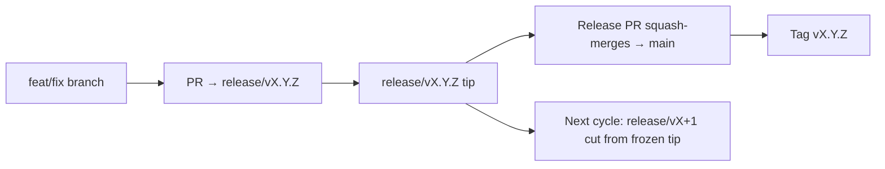

# Branching & Release Model (Kiswahili)

🌐 **Languages:** 🇺🇸 [English](../../../../ops/BRANCHING_MODEL.md) · 🇪🇹 [am](../../../am/docs/ops/BRANCHING_MODEL.md) · 🇸🇦 [ar](../../../ar/docs/ops/BRANCHING_MODEL.md) · 🇦🇿 [az](../../../az/docs/ops/BRANCHING_MODEL.md) · 🇧🇬 [bg](../../../bg/docs/ops/BRANCHING_MODEL.md) · 🇧🇩 [bn](../../../bn/docs/ops/BRANCHING_MODEL.md) · 🇨🇿 [cs](../../../cs/docs/ops/BRANCHING_MODEL.md) · 🇩🇰 [da](../../../da/docs/ops/BRANCHING_MODEL.md) · 🇩🇪 [de](../../../de/docs/ops/BRANCHING_MODEL.md) · 🇬🇷 [el](../../../el/docs/ops/BRANCHING_MODEL.md) · 🇪🇸 [es](../../../es/docs/ops/BRANCHING_MODEL.md) · 🇪🇪 [et](../../../et/docs/ops/BRANCHING_MODEL.md) · 🇮🇷 [fa](../../../fa/docs/ops/BRANCHING_MODEL.md) · 🇫🇮 [fi](../../../fi/docs/ops/BRANCHING_MODEL.md) · 🇫🇷 [fr](../../../fr/docs/ops/BRANCHING_MODEL.md) · 🇮🇪 [ga](../../../ga/docs/ops/BRANCHING_MODEL.md) · 🇮🇳 [gu](../../../gu/docs/ops/BRANCHING_MODEL.md) · 🇳🇬 [ha](../../../ha/docs/ops/BRANCHING_MODEL.md) · 🇮🇱 [he](../../../he/docs/ops/BRANCHING_MODEL.md) · 🇮🇳 [hi](../../../hi/docs/ops/BRANCHING_MODEL.md) · 🇭🇷 [hr](../../../hr/docs/ops/BRANCHING_MODEL.md) · 🇭🇺 [hu](../../../hu/docs/ops/BRANCHING_MODEL.md) · 🇦🇲 [hy](../../../hy/docs/ops/BRANCHING_MODEL.md) · 🇮🇩 [id](../../../id/docs/ops/BRANCHING_MODEL.md) · 🇳🇬 [ig](../../../ig/docs/ops/BRANCHING_MODEL.md) · 🇮🇹 [it](../../../it/docs/ops/BRANCHING_MODEL.md) · 🇯🇵 [ja](../../../ja/docs/ops/BRANCHING_MODEL.md) · 🇬🇪 [ka](../../../ka/docs/ops/BRANCHING_MODEL.md) · 🇰🇭 [km](../../../km/docs/ops/BRANCHING_MODEL.md) · 🇮🇳 [kn](../../../kn/docs/ops/BRANCHING_MODEL.md) · 🇰🇷 [ko](../../../ko/docs/ops/BRANCHING_MODEL.md) · 🇱🇹 [lt](../../../lt/docs/ops/BRANCHING_MODEL.md) · 🇱🇻 [lv](../../../lv/docs/ops/BRANCHING_MODEL.md) · 🇮🇳 [ml](../../../ml/docs/ops/BRANCHING_MODEL.md) · 🇮🇳 [mr](../../../mr/docs/ops/BRANCHING_MODEL.md) · 🇲🇾 [ms](../../../ms/docs/ops/BRANCHING_MODEL.md) · 🇲🇹 [mt](../../../mt/docs/ops/BRANCHING_MODEL.md) · 🇲🇲 [my](../../../my/docs/ops/BRANCHING_MODEL.md) · 🇳🇵 [ne](../../../ne/docs/ops/BRANCHING_MODEL.md) · 🇳🇱 [nl](../../../nl/docs/ops/BRANCHING_MODEL.md) · 🇳🇴 [no](../../../no/docs/ops/BRANCHING_MODEL.md) · 🇮🇳 [or](../../../or/docs/ops/BRANCHING_MODEL.md) · 🇮🇳 [pa](../../../pa/docs/ops/BRANCHING_MODEL.md) · 🇵🇭 [phi](../../../phi/docs/ops/BRANCHING_MODEL.md) · 🇵🇱 [pl](../../../pl/docs/ops/BRANCHING_MODEL.md) · 🇵🇹 [pt](../../../pt/docs/ops/BRANCHING_MODEL.md) · 🇧🇷 [pt-BR](../../../pt-BR/docs/ops/BRANCHING_MODEL.md) · 🇷🇴 [ro](../../../ro/docs/ops/BRANCHING_MODEL.md) · 🇷🇺 [ru](../../../ru/docs/ops/BRANCHING_MODEL.md) · 🇱🇰 [si](../../../si/docs/ops/BRANCHING_MODEL.md) · 🇸🇰 [sk](../../../sk/docs/ops/BRANCHING_MODEL.md) · 🇸🇮 [sl](../../../sl/docs/ops/BRANCHING_MODEL.md) · 🇷🇸 [sr](../../../sr/docs/ops/BRANCHING_MODEL.md) · 🇸🇪 [sv](../../../sv/docs/ops/BRANCHING_MODEL.md) · 🇮🇳 [ta](../../../ta/docs/ops/BRANCHING_MODEL.md) · 🇮🇳 [te](../../../te/docs/ops/BRANCHING_MODEL.md) · 🇹🇭 [th](../../../th/docs/ops/BRANCHING_MODEL.md) · 🇹🇷 [tr](../../../tr/docs/ops/BRANCHING_MODEL.md) · 🇺🇦 [uk-UA](../../../uk-UA/docs/ops/BRANCHING_MODEL.md) · 🇵🇰 [ur](../../../ur/docs/ops/BRANCHING_MODEL.md) · 🇺🇿 [uz](../../../uz/docs/ops/BRANCHING_MODEL.md) · 🇻🇳 [vi](../../../vi/docs/ops/BRANCHING_MODEL.md) · 🇳🇬 [yo](../../../yo/docs/ops/BRANCHING_MODEL.md) · 🇨🇳 [zh-CN](../../../zh-CN/docs/ops/BRANCHING_MODEL.md) · 🇹🇼 [zh-TW](../../../zh-TW/docs/ops/BRANCHING_MODEL.md)

---

OmniRoute hutumia muundo wa uchapishaji wa **mizunguko sambamba**: tawi maalumu la `release/vX.Y.Z`
kwa ajili ya mzunguko unaoendelea, `main` kwa ajili ya mkondo uliochapishwa, na lebo isiyoweza kubadilishwa ya
`vX.Y.Z` wakati mzunguko huo unapotolewa. Kuona commits zikiingia kwenye `release/*` _na_ kwenye
`main` ni jambo linalotarajiwa — si mkanganyiko.

Maelezo kwa wasimamizi yanapatikana katika `CLAUDE.md` (Kanuni Isiyokiukwa #21) na
[RELEASE_CHECKLIST.md](./RELEASE_CHECKLIST.md). Ukurasa huu ni muhtasari wa umma
unaolenga wachangiaji.

## Kwa muhtasari

| Ref              | Jukumu                                                                                                               |
| ---------------- | -------------------------------------------------------------------------------------------------------------------- |
| `release/vX.Y.Z` | **Mzunguko unaoendelea** — usanidi wa kila siku na kuunganisha PR kwa toleo hilo                                     |
| `main`           | **Mkondo uliochapishwa** — hupokea mzunguko kupitia squash-merge wakati toleo linapotolewa                           |
| `vX.Y.Z` (lebo)  | **Alama ya utoaji** — kielekezi kisichoweza kubadilishwa cha “kile kilichotolewa” kinachoundwa wakati wa uchapishaji |



## PR yangu ilenge wapi?

**Lenga tawi linalotumika la `release/vX.Y.Z` — si `main`.**

1. Tafuta tawi la juu zaidi lililo wazi la `release/v*` (mfano wakati wa kuandika:
   `release/v3.8.49`).
2. Unda tawi kutoka kwenye ncha hiyo (`git fetch` + checkout / rebase juu yake).
3. Fungua PR ikiwa na **base = hiyo `release/vX.Y.Z`**.

`main` si tawi la ujumuishaji wa kazi za kila siku. PR zinazofunguliwa dhidi ya `main`
kwa kawaida zinahitaji kuelekezwa kwenye tawi jingine kabla ya kuunganishwa.

## Kusitisha toleo (mizunguko sambamba)

Wakati toleo linasawazishwa, issue ya alama yenye lebo ya `release-freeze`
hufunguliwa. Hilo **halisimamishi usanidi**:

- `release/vX.Y.Z` iliyositishwa inasimamiwa na msimamizi mkuu wa toleo hilo.
- `release/vX+1` ya mzunguko unaofuata huundwa kutoka kwenye ncha iliyositishwa ili wachangiaji waendelee
  kuwasilisha kazi.
- PR zilizo wazi ambazo bado zinalenga tawi lililositishwa zinapaswa **kuelekezwa upya** kwenye
  tawi linalotumika (la juu zaidi) la `release/v*`.

Kagua kama kuna usitishaji ulio wazi kabla ya kudhani kuwa tawi unalotaka linaweza kuunganishwa:

```bash
gh issue list --repo diegosouzapw/OmniRoute --label release-freeze --state open
```

Taratibu za kuunganisha (lebo ya mmiliki ya `queue` → Mergify) zimefafanuliwa katika
[MERGE_TRAIN.md](./MERGE_TRAIN.md).

## Kwa nini kuwe na tawi na lebo?

| Kipengee         | Muda wa kudumu       | Kusudi                                                                                       |
| ---------------- | -------------------- | -------------------------------------------------------------------------------------------- |
| `release/vX.Y.Z` | Mzunguko unaoendelea | Hukusanya PR zilizokaguliwa, hudumisha hali ya CI kuwa kijani, na hutumika kama msingi wa PR |
| Lebo `vX.Y.Z`    | Milele               | Huonyesha bits mahususi zilizotolewa kwa npm / GitHub Releases                               |

Tawi ni karakana; lebo ni kifurushi kilichofungwa. Baada ya squash-merge kwenda
`main`, mzunguko unaofuata huendelea kwenye `release/vX+1` bila kusubiri PR ya
toleo lililotangulia ikamilike.

## Nyaraka zinazohusiana

- [CONTRIBUTING.md](../../CONTRIBUTING.md) — usanidi, majaribio, orodha ya ukaguzi ya PR
- [RELEASE_CHECKLIST.md](./RELEASE_CHECKLIST.md) — uthibitishaji kabla ya utoaji
- [MERGE_TRAIN.md](./MERGE_TRAIN.md) — foleni ya kuunganisha na utaratibu mbadala
- [RELEASE_GREEN.md](./RELEASE_GREEN.md) — kudumisha ncha ya toleo ikiwa kijani
