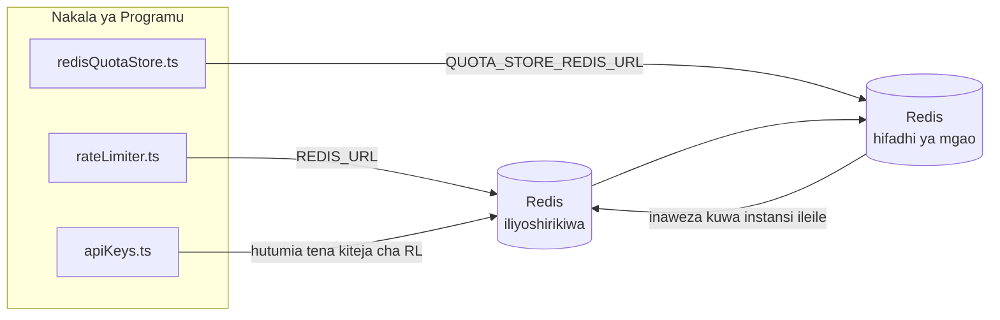

# Redis Production Configuration Guide (Kiswahili)

🌐 **Languages:** 🇺🇸 [English](../../../../ops/REDIS_PRODUCTION_CONFIG.md) · 🇪🇹 [am](../../../am/docs/ops/REDIS_PRODUCTION_CONFIG.md) · 🇸🇦 [ar](../../../ar/docs/ops/REDIS_PRODUCTION_CONFIG.md) · 🇦🇿 [az](../../../az/docs/ops/REDIS_PRODUCTION_CONFIG.md) · 🇧🇬 [bg](../../../bg/docs/ops/REDIS_PRODUCTION_CONFIG.md) · 🇧🇩 [bn](../../../bn/docs/ops/REDIS_PRODUCTION_CONFIG.md) · 🇨🇿 [cs](../../../cs/docs/ops/REDIS_PRODUCTION_CONFIG.md) · 🇩🇰 [da](../../../da/docs/ops/REDIS_PRODUCTION_CONFIG.md) · 🇩🇪 [de](../../../de/docs/ops/REDIS_PRODUCTION_CONFIG.md) · 🇬🇷 [el](../../../el/docs/ops/REDIS_PRODUCTION_CONFIG.md) · 🇪🇸 [es](../../../es/docs/ops/REDIS_PRODUCTION_CONFIG.md) · 🇪🇪 [et](../../../et/docs/ops/REDIS_PRODUCTION_CONFIG.md) · 🇮🇷 [fa](../../../fa/docs/ops/REDIS_PRODUCTION_CONFIG.md) · 🇫🇮 [fi](../../../fi/docs/ops/REDIS_PRODUCTION_CONFIG.md) · 🇫🇷 [fr](../../../fr/docs/ops/REDIS_PRODUCTION_CONFIG.md) · 🇮🇪 [ga](../../../ga/docs/ops/REDIS_PRODUCTION_CONFIG.md) · 🇮🇳 [gu](../../../gu/docs/ops/REDIS_PRODUCTION_CONFIG.md) · 🇳🇬 [ha](../../../ha/docs/ops/REDIS_PRODUCTION_CONFIG.md) · 🇮🇱 [he](../../../he/docs/ops/REDIS_PRODUCTION_CONFIG.md) · 🇮🇳 [hi](../../../hi/docs/ops/REDIS_PRODUCTION_CONFIG.md) · 🇭🇷 [hr](../../../hr/docs/ops/REDIS_PRODUCTION_CONFIG.md) · 🇭🇺 [hu](../../../hu/docs/ops/REDIS_PRODUCTION_CONFIG.md) · 🇦🇲 [hy](../../../hy/docs/ops/REDIS_PRODUCTION_CONFIG.md) · 🇮🇩 [id](../../../id/docs/ops/REDIS_PRODUCTION_CONFIG.md) · 🇳🇬 [ig](../../../ig/docs/ops/REDIS_PRODUCTION_CONFIG.md) · 🇮🇹 [it](../../../it/docs/ops/REDIS_PRODUCTION_CONFIG.md) · 🇯🇵 [ja](../../../ja/docs/ops/REDIS_PRODUCTION_CONFIG.md) · 🇬🇪 [ka](../../../ka/docs/ops/REDIS_PRODUCTION_CONFIG.md) · 🇰🇭 [km](../../../km/docs/ops/REDIS_PRODUCTION_CONFIG.md) · 🇮🇳 [kn](../../../kn/docs/ops/REDIS_PRODUCTION_CONFIG.md) · 🇰🇷 [ko](../../../ko/docs/ops/REDIS_PRODUCTION_CONFIG.md) · 🇱🇹 [lt](../../../lt/docs/ops/REDIS_PRODUCTION_CONFIG.md) · 🇱🇻 [lv](../../../lv/docs/ops/REDIS_PRODUCTION_CONFIG.md) · 🇮🇳 [ml](../../../ml/docs/ops/REDIS_PRODUCTION_CONFIG.md) · 🇮🇳 [mr](../../../mr/docs/ops/REDIS_PRODUCTION_CONFIG.md) · 🇲🇾 [ms](../../../ms/docs/ops/REDIS_PRODUCTION_CONFIG.md) · 🇲🇹 [mt](../../../mt/docs/ops/REDIS_PRODUCTION_CONFIG.md) · 🇲🇲 [my](../../../my/docs/ops/REDIS_PRODUCTION_CONFIG.md) · 🇳🇵 [ne](../../../ne/docs/ops/REDIS_PRODUCTION_CONFIG.md) · 🇳🇱 [nl](../../../nl/docs/ops/REDIS_PRODUCTION_CONFIG.md) · 🇳🇴 [no](../../../no/docs/ops/REDIS_PRODUCTION_CONFIG.md) · 🇮🇳 [or](../../../or/docs/ops/REDIS_PRODUCTION_CONFIG.md) · 🇮🇳 [pa](../../../pa/docs/ops/REDIS_PRODUCTION_CONFIG.md) · 🇵🇭 [phi](../../../phi/docs/ops/REDIS_PRODUCTION_CONFIG.md) · 🇵🇱 [pl](../../../pl/docs/ops/REDIS_PRODUCTION_CONFIG.md) · 🇵🇹 [pt](../../../pt/docs/ops/REDIS_PRODUCTION_CONFIG.md) · 🇧🇷 [pt-BR](../../../pt-BR/docs/ops/REDIS_PRODUCTION_CONFIG.md) · 🇷🇴 [ro](../../../ro/docs/ops/REDIS_PRODUCTION_CONFIG.md) · 🇷🇺 [ru](../../../ru/docs/ops/REDIS_PRODUCTION_CONFIG.md) · 🇱🇰 [si](../../../si/docs/ops/REDIS_PRODUCTION_CONFIG.md) · 🇸🇰 [sk](../../../sk/docs/ops/REDIS_PRODUCTION_CONFIG.md) · 🇸🇮 [sl](../../../sl/docs/ops/REDIS_PRODUCTION_CONFIG.md) · 🇷🇸 [sr](../../../sr/docs/ops/REDIS_PRODUCTION_CONFIG.md) · 🇸🇪 [sv](../../../sv/docs/ops/REDIS_PRODUCTION_CONFIG.md) · 🇮🇳 [ta](../../../ta/docs/ops/REDIS_PRODUCTION_CONFIG.md) · 🇮🇳 [te](../../../te/docs/ops/REDIS_PRODUCTION_CONFIG.md) · 🇹🇭 [th](../../../th/docs/ops/REDIS_PRODUCTION_CONFIG.md) · 🇹🇷 [tr](../../../tr/docs/ops/REDIS_PRODUCTION_CONFIG.md) · 🇺🇦 [uk-UA](../../../uk-UA/docs/ops/REDIS_PRODUCTION_CONFIG.md) · 🇵🇰 [ur](../../../ur/docs/ops/REDIS_PRODUCTION_CONFIG.md) · 🇺🇿 [uz](../../../uz/docs/ops/REDIS_PRODUCTION_CONFIG.md) · 🇻🇳 [vi](../../../vi/docs/ops/REDIS_PRODUCTION_CONFIG.md) · 🇳🇬 [yo](../../../yo/docs/ops/REDIS_PRODUCTION_CONFIG.md) · 🇨🇳 [zh-CN](../../../zh-CN/docs/ops/REDIS_PRODUCTION_CONFIG.md) · 🇹🇼 [zh-TW](../../../zh-TW/docs/ops/REDIS_PRODUCTION_CONFIG.md)

---

## Muhtasari

Redis ni **tegemezi la hiari, lisilo la lazima** katika OmniRoute — programu huendelea kufanya kazi kwa utaratibu mbadala (uhifadhi wa ndani ya kumbukumbu)
wakati Redis haipatikani. Katika mazingira ya uzalishaji, kusanidi Redis kwa ufanisi hupunguza muda wa kusubiri kwa aina nne tofauti za
mizigo ya kazi:

| Mzigo wa kazi                    | Kiendeshi                     | Kiwanda cha Kiteja                                                    | Muundo wa Ufunguo                                                   |
| -------------------------------- | ----------------------------- | --------------------------------------------------------------------- | ------------------------------------------------------------------- |
| Uzuiaji wa kiwango               | `rateLimiter.ts`              | `getRedisClient()` — singleton ya `ioredis` inayopakiwa inapohitajika | `<prefix>rl:*` madirisha ya kiwango yenye operesheni atomiki ya Lua |
| Akiba ya uthibitishaji           | `apiKeys.ts`                  | Hutumia tena kiteja cha `rateLimiter`                                 | `<prefix>auth:api_key:<sha256>` yenye TTL                           |
| Hifadhi ya mgao                  | `redisQuotaStore.ts`          | Singleton tofauti ya `getRedisClient(url)`                            | `<prefix>quota:*` inayoweza kusanidiwa kwa kila instansi            |
| Kivunja saketi cha upashaji joto | `redisCircuitBreakerStore.ts` | Kiteja tofauti katika `circuitBreakerFactory.ts`                      | `<prefix>warmup:cb:<connectionId>`                                  |

Mizigo yote minne ya kazi hutumia kiambishi awali kimoja cha nafasi ya majina ili OmniRoute iweze kutumika pamoja na programu nyingine kwenye
instansi moja ya Redis (k.m. `127.0.0.1:6379`). Tazama [Upangaji wa Nafasi za Majina za Funguo](#key-namespacing).

---

## Usanidi wa Sasa (Chaguomsingi za Msimbo)

| Mpangilio                                        | Thamani                                                                      | Mahali                                                                                |
| ------------------------------------------------ | ---------------------------------------------------------------------------- | ------------------------------------------------------------------------------------- |
| Kigezo cha mazingira cha `REDIS_URL`             | `redis://redis:6379` (compose), hiari                                        | `rateLimiter.ts:5`, `.env.example`                                                    |
| Kigezo cha mazingira cha `REDIS_KEY_PREFIX`      | `omniroute:` (chaguomsingi)                                                  | `rateLimiter.ts`, `redisQuotaStore.ts`, `redisCircuitBreakerStore.ts`, `.env.example` |
| Kigezo cha mazingira cha `QUOTA_STORE_REDIS_URL` | tofauti, kinaweza kutofautiana na `REDIS_URL`                                | `quota/storeFactory.ts`                                                               |
| `QUOTA_STORE_DRIVER`                             | `"sqlite"` (chaguomsingi), `"redis"` hiari                                   | `quota/storeFactory.ts`                                                               |
| `maxRetriesPerRequest` ya ioredis                | `3`                                                                          | uundaji wa kiteja katika `rateLimiter.ts`                                             |
| `enableReadyCheck`                               | haijawekwa (chaguomsingi la ioredis: `true`)                                 | —                                                                                     |
| `lazyConnect`                                    | haijawekwa (chaguomsingi la ioredis: `false`)                                | —                                                                                     |
| `retryStrategy`                                  | haijawekwa (chaguomsingi la ioredis: msingi wa 200ms, ongezeko la kielelezo) | —                                                                                     |
| TLS / nenosiri / faharasa ya DB                  | **havijasanidiwa**                                                           | —                                                                                     |
| Sentinel / Cluster                               | **havijasanidiwa** — nodi moja inayojitegemea pekee                          | —                                                                                     |

---

## Upangaji wa Nafasi za Majina za Funguo

OmniRoute hutumia instansi ya Redis kwa pamoja na huduma nyingine zozote zinazoendeshwa kwenye seva. Bila nafasi ya majina,
funguo kama `auth:api_key:<sha256>` au `rl:*` zinaweza kugongana na funguo za programu nyingine
zinazotumia Redis hiyo hiyo (instansi hii huendesha Redis kwenye `127.0.0.1:6379` pamoja na huduma nyingine).

Weka `REDIS_KEY_PREFIX` kuwa mfuatano usio tupu ili kuweka kiambishi awali kwa **kila** ufunguo wa OmniRoute:

```bash
# .env — funguo zote za OmniRoute zinakuwa omniroute:rl:*, omniroute:auth:*, omniroute:quota:*, omniroute:warmup:cb:*
REDIS_KEY_PREFIX=omniroute:
```

- **Chaguomsingi:** `omniroute:` (hutumika wakati `REDIS_KEY_PREFIX` haijawekwa au ni tupu).
- **Hutumika kwa:** kizuia kiwango + akiba ya uthibitishaji (kiteja cha pamoja cha `ioredis` kupitia `keyPrefix`) na
  hifadhi ya mgao (`KEY_PREFIX = "${REDIS_KEY_PREFIX}quota"`) pamoja na kivunja saketi cha upashaji joto
  (`KEY_PREFIX = "${REDIS_KEY_PREFIX}warmup:cb:"`).
- **Kubadilisha kiambishi awali** wakati funguo tayari zipo katika Redis huacha funguo za zamani bila kutumika (huisha
  kupitia TTL / LRU). Ni salama kubadilisha; hakuna uhamishaji unaohitajika. Isipokuwa moja ni ufunguo wa
  kivunja saketi cha upashaji joto kwa muunganisho uliowekwa alama kuwa umekatazwa: huhifadhiwa bila TTL, kwa hivyo
  orodhesha mabaki kwa kutumia `redis-cli --scan --pattern '<old-prefix>warmup:cb:*'` na uyafute.
- **`keyPrefix` ya ioredis** huongeza kiambishi awali kiotomatiki wakati wa kuandika **na** hukiondoa wakati wa kusoma,
  kwa hivyo msimbo wa programu hauoni kiambishi awali kamwe.

---

## Uboreshaji Unaopendekezwa kwa Mazingira ya Uzalishaji

### 1. Chaguo za Connection Pool / Client (constructor ya ioredis `Redis`)

Msimbo wa sasa huunda `new Redis(url)` moja bila chaguo maalum. Kwa upelekaji wa uzalishaji
wenye replica nyingi, pitisha client factory kwenye msimbo au zungushia `getRedisClient()`:

```typescript
const redis = new Redis(REDIS_URL, {
  maxRetriesPerRequest: null, // hakuna kikomo cha kujaribu tena; acha retryStrategy iamue
  enableReadyCheck: true, // thibitisha kuwa seva iko tayari kabla ya kukubali miito
  lazyConnect: true, // usiunganishe wakati wa uundaji; subiri mwito wa kwanza
  retryStrategy: (times) => {
    if (times > 10) return null; // kata tamaa baada ya majaribio 10 → unganisha tena baadaye
    return Math.min(times * 200, 5000); // 200ms, 400ms, …, kikomo cha 5s
  },
  enableAutoPipelining: true, // unganisha amri za wakati mmoja kuwa andiko moja la TCP
  keepAlive: 10000, // TCP keep-alive kila 10s
});
```

**Mabadilishano muhimu:**

- `maxRetriesPerRequest: null` + `retryStrategy` — inapendelewa kwa uzalishaji ili kuwashwa
  upya kwa muda kwa Redis kusisababishe kila ombi kushindwa mara moja. Mfumo mbadala wa kumbukumbu
  katika `checkRateLimit()` hushughulikia njia ya hitilafu.
- `lazyConnect: true` — huepuka kutegemea Redis kuwapo wakati wa kuanzisha kabla seva
  haijaanza kukubali miunganisho.
- `enableAutoPipelining: true` — hupunguza safari za kwenda na kurudi kwa ukaguzi wa wakati mmoja wa vikomo vya kasi;
  ni muhimu kwa >50 RPS kwenye muunganisho mmoja.

### 2. Usanidi wa Seva ya Redis (`redis.conf`)

```
# Kumbukumbu
maxmemory 80%                        # acha nafasi kwa akiba ya kurasa ya OS
maxmemory-policy allkeys-lru         # ondoa maingizo ya zamani ya akiba ya uthibitishaji kumbukumbu inapobanwa

# Uhifadhi endelevu (si lazima — OmniRoute ni salama dhidi ya hitilafu hata bila huu)
save 300 1                           # tengeneza snapshot angalau kila dakika 5 ikiwa ≥1 key imebadilika
appendonly no                        # AOF haihitajiki; data inaweza kutengenezwa upya
appendfsync no                       # hakuna gharama ya ziada ya fsync (RDB inatosha)

# Mtandao
timeout 0                            # hakuna kukata muunganisho usiotumika
tcp-keepalive 300                    # keep-alive ya dakika 5
tcp-backlog 511                      # foleni ya miunganisho kwa mzigo unaoongezeka ghafla

# Utendaji
hz 10                                # chaguo-msingi; 100 kwa matumizi nyeti kwa ucheleweshaji
activedefrag yes                     # tenganisha vipande kiotomatiki mgawanyiko unapozidi >10%
```

**Mabadilishano ya `maxmemory-policy allkeys-lru`:** Maingizo ya akiba ya uthibitishaji yanaweza kuondolewa
kumbukumbu inapobanwa. Hii ni salama — `setCachedApiKey` daima hujaza upya kunapokuwa na kosa la kutopatikana, na
mfumo mbadala wa SQLite ndio wenye mamlaka. Skripti ya Lua ya kikomo cha kasi huunda keys ndogo ambazo
kwa muundo wake hudumu kwa muda mfupi.

### 3. Mipangilio ya Docker Compose

Compose ya uzalishaji (`docker-compose.prod.yml`) hutumia `redis:8.6.2-alpine`. Ongeza:

```yaml
redis:
  image: redis:8.6.2-alpine
  command:
    [
      "redis-server",
      "--maxmemory",
      "512mb",
      "--maxmemory-policy",
      "allkeys-lru",
      "--activedefrag",
      "yes",
      "--save",
      "300 1",
    ]
  healthcheck:
    test: ["CMD", "redis-cli", "ping"]
    interval: 10s
    timeout: 3s
    retries: 3
    start_period: 5s
```

### 4. Mazingatio ya Instance Nyingi / Upanuzi

**Redis moja kwa replica zote** — skripti ya Lua ya kikomo cha kasi hutegemea nafasi moja
ya keys yenye mamlaka. Instance nyingi za Redis zilizo nyuma ya replica zingepoteza atomicity
na kuongeza bajeti mara mbili. Tumia Redis moja (au cluster ya Redis Sentinel yenye failover) kwa
replica zote za programu.

**Idadi ya miunganisho:** Kila replica ya programu hufungua **miunganisho 2 ya TCP** kwenda Redis
(client ya kikomo cha kasi + client ya hifadhi ya quota). Kwa replica 10 → miunganisho 20, ikiwa
ndani kabisa ya kikomo chaguo-msingi cha miunganisho 10k cha instance ya Redis.

### 5. Ufuatiliaji

Fichua kupitia endpoint ya health-check:

```typescript
// src/app/api/monitoring/health/route.ts tayari huita functions za rateLimiter
// Ongeza ukaguzi mahususi wa Redis:
//   1. Ucheleweshaji wa PING kupitia ioredis .ping()
//   2. Matumizi ya kumbukumbu kupitia INFO memory
//   3. Idadi ya miunganisho kupitia INFO clients
//   4. Kiwango cha hit kwa maxmemory-policy (evicted_keys / keyspace_hits)
```

Vipimo muhimu vya kufuatilia:

- **Keys zilizoondolewa / sekunde** — ikiwa thamani si sifuri kwa muda mrefu, ongeza `maxmemory`
- **Clients waliozuiwa** — thamani isiyo sifuri inaashiria skripti za Lua zinazoenda polepole au ushindani mkubwa
- **Miunganisho iliyokataliwa** — kikomo cha miunganisho kimefikiwa; ni nadra kwa miunganisho 20

---

## Mchoro wa Usanifu



---

## Marejeleo

| Faili                              | Kusudi                                                                                    |
| ---------------------------------- | ----------------------------------------------------------------------------------------- |
| `src/shared/utils/rateLimiter.ts`  | Kiteja msingi cha Redis, hati ya Lua ya kudhibiti kiwango, mbadala wa kumbukumbu ya ndani |
| `src/lib/db/apiKeys.ts`            | Akiba ya uthibitishaji — mbadala wa Redis→SQLite                                          |
| `src/lib/quota/redisQuotaStore.ts` | Kiteja tofauti cha Redis kwa hifadhi ya hiari ya mgao                                     |
| `src/lib/quota/storeFactory.ts`    | Hubadilisha kati ya viendeshaji vya mgao vya `sqlite` na `redis`                          |
| `docker-compose.prod.yml`          | Kontena la Redis la mazingira ya uzalishaji (taswira `redis:8.6.2-alpine`)                |
| `.env.example`                     | Nyaraka za vigeu vya mazingira vya Redis                                                  |
| `src/app/api/local/redis/`         | Njia za API za uratibu wa kontena la usanidi                                              |
| `bin/cli/commands/redis.mjs`       | Amri za CLI za uratibu wa kontena la usanidi                                              |
