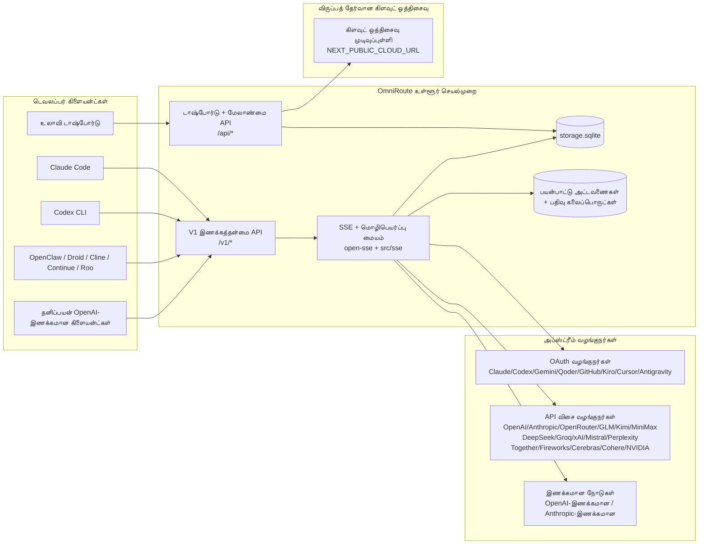
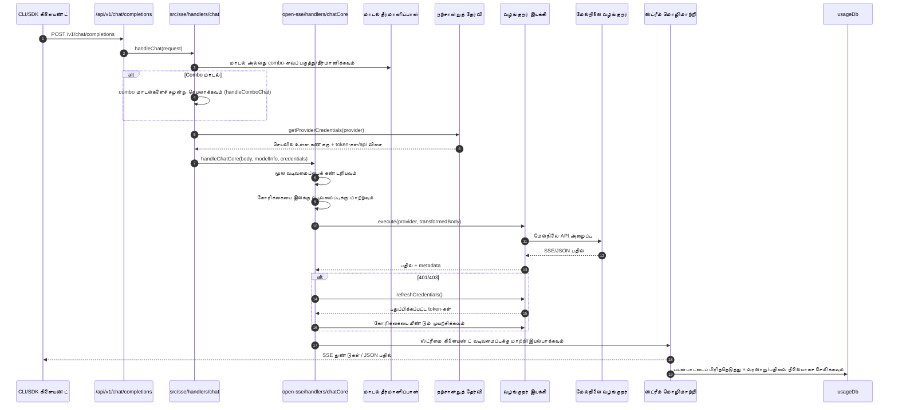
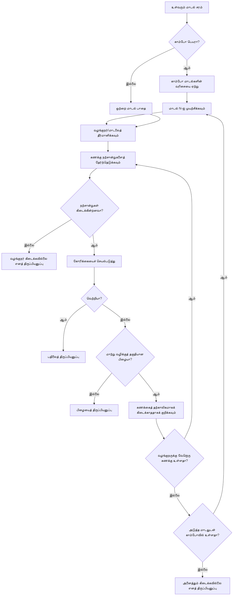
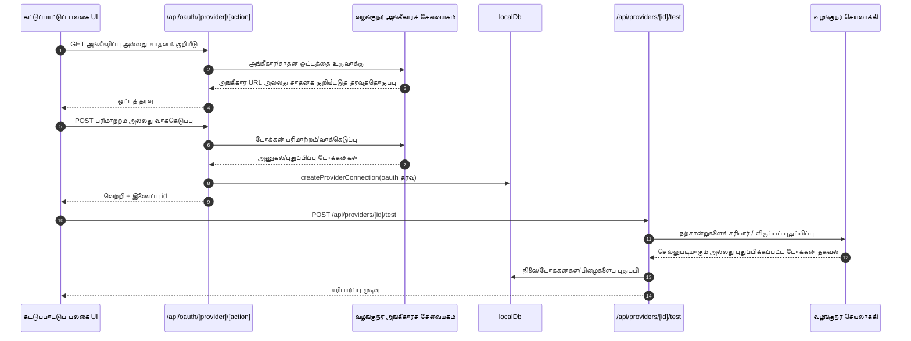
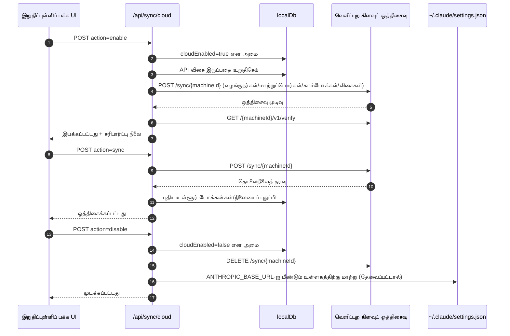
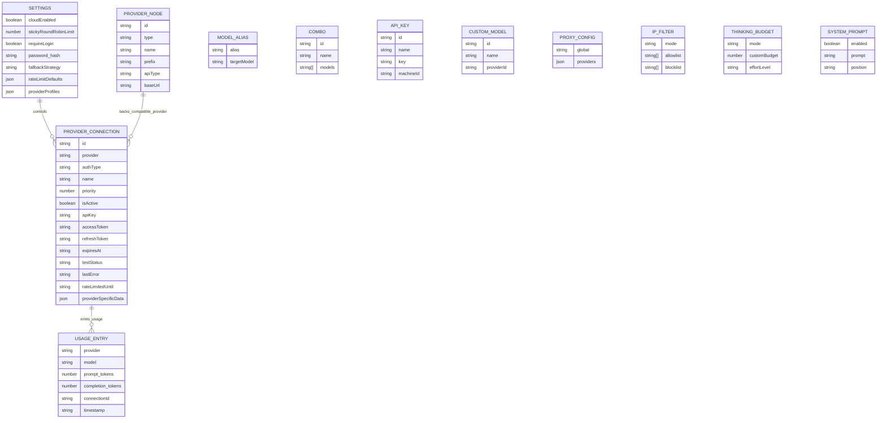
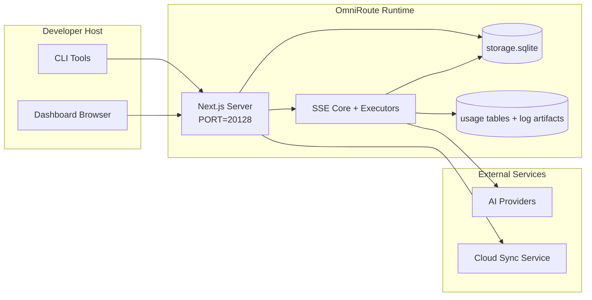

# OmniRoute Architecture (தமிழ்)

🌐 **Languages:** 🇺🇸 [English](../../../../architecture/ARCHITECTURE.md) · 🇪🇹 [am](../../../am/docs/architecture/ARCHITECTURE.md) · 🇸🇦 [ar](../../../ar/docs/architecture/ARCHITECTURE.md) · 🇦🇿 [az](../../../az/docs/architecture/ARCHITECTURE.md) · 🇧🇬 [bg](../../../bg/docs/architecture/ARCHITECTURE.md) · 🇧🇩 [bn](../../../bn/docs/architecture/ARCHITECTURE.md) · 🇨🇿 [cs](../../../cs/docs/architecture/ARCHITECTURE.md) · 🇩🇰 [da](../../../da/docs/architecture/ARCHITECTURE.md) · 🇩🇪 [de](../../../de/docs/architecture/ARCHITECTURE.md) · 🇬🇷 [el](../../../el/docs/architecture/ARCHITECTURE.md) · 🇪🇸 [es](../../../es/docs/architecture/ARCHITECTURE.md) · 🇪🇪 [et](../../../et/docs/architecture/ARCHITECTURE.md) · 🇮🇷 [fa](../../../fa/docs/architecture/ARCHITECTURE.md) · 🇫🇮 [fi](../../../fi/docs/architecture/ARCHITECTURE.md) · 🇫🇷 [fr](../../../fr/docs/architecture/ARCHITECTURE.md) · 🇮🇪 [ga](../../../ga/docs/architecture/ARCHITECTURE.md) · 🇮🇳 [gu](../../../gu/docs/architecture/ARCHITECTURE.md) · 🇳🇬 [ha](../../../ha/docs/architecture/ARCHITECTURE.md) · 🇮🇱 [he](../../../he/docs/architecture/ARCHITECTURE.md) · 🇮🇳 [hi](../../../hi/docs/architecture/ARCHITECTURE.md) · 🇭🇷 [hr](../../../hr/docs/architecture/ARCHITECTURE.md) · 🇭🇺 [hu](../../../hu/docs/architecture/ARCHITECTURE.md) · 🇦🇲 [hy](../../../hy/docs/architecture/ARCHITECTURE.md) · 🇮🇩 [id](../../../id/docs/architecture/ARCHITECTURE.md) · 🇳🇬 [ig](../../../ig/docs/architecture/ARCHITECTURE.md) · 🇮🇹 [it](../../../it/docs/architecture/ARCHITECTURE.md) · 🇯🇵 [ja](../../../ja/docs/architecture/ARCHITECTURE.md) · 🇬🇪 [ka](../../../ka/docs/architecture/ARCHITECTURE.md) · 🇰🇭 [km](../../../km/docs/architecture/ARCHITECTURE.md) · 🇮🇳 [kn](../../../kn/docs/architecture/ARCHITECTURE.md) · 🇰🇷 [ko](../../../ko/docs/architecture/ARCHITECTURE.md) · 🇱🇹 [lt](../../../lt/docs/architecture/ARCHITECTURE.md) · 🇱🇻 [lv](../../../lv/docs/architecture/ARCHITECTURE.md) · 🇮🇳 [ml](../../../ml/docs/architecture/ARCHITECTURE.md) · 🇮🇳 [mr](../../../mr/docs/architecture/ARCHITECTURE.md) · 🇲🇾 [ms](../../../ms/docs/architecture/ARCHITECTURE.md) · 🇲🇹 [mt](../../../mt/docs/architecture/ARCHITECTURE.md) · 🇲🇲 [my](../../../my/docs/architecture/ARCHITECTURE.md) · 🇳🇵 [ne](../../../ne/docs/architecture/ARCHITECTURE.md) · 🇳🇱 [nl](../../../nl/docs/architecture/ARCHITECTURE.md) · 🇳🇴 [no](../../../no/docs/architecture/ARCHITECTURE.md) · 🇮🇳 [or](../../../or/docs/architecture/ARCHITECTURE.md) · 🇮🇳 [pa](../../../pa/docs/architecture/ARCHITECTURE.md) · 🇵🇭 [phi](../../../phi/docs/architecture/ARCHITECTURE.md) · 🇵🇱 [pl](../../../pl/docs/architecture/ARCHITECTURE.md) · 🇵🇹 [pt](../../../pt/docs/architecture/ARCHITECTURE.md) · 🇧🇷 [pt-BR](../../../pt-BR/docs/architecture/ARCHITECTURE.md) · 🇷🇴 [ro](../../../ro/docs/architecture/ARCHITECTURE.md) · 🇷🇺 [ru](../../../ru/docs/architecture/ARCHITECTURE.md) · 🇱🇰 [si](../../../si/docs/architecture/ARCHITECTURE.md) · 🇸🇰 [sk](../../../sk/docs/architecture/ARCHITECTURE.md) · 🇸🇮 [sl](../../../sl/docs/architecture/ARCHITECTURE.md) · 🇷🇸 [sr](../../../sr/docs/architecture/ARCHITECTURE.md) · 🇸🇪 [sv](../../../sv/docs/architecture/ARCHITECTURE.md) · 🇰🇪 [sw](../../../sw/docs/architecture/ARCHITECTURE.md) · 🇮🇳 [te](../../../te/docs/architecture/ARCHITECTURE.md) · 🇹🇭 [th](../../../th/docs/architecture/ARCHITECTURE.md) · 🇹🇷 [tr](../../../tr/docs/architecture/ARCHITECTURE.md) · 🇺🇦 [uk-UA](../../../uk-UA/docs/architecture/ARCHITECTURE.md) · 🇵🇰 [ur](../../../ur/docs/architecture/ARCHITECTURE.md) · 🇺🇿 [uz](../../../uz/docs/architecture/ARCHITECTURE.md) · 🇻🇳 [vi](../../../vi/docs/architecture/ARCHITECTURE.md) · 🇳🇬 [yo](../../../yo/docs/architecture/ARCHITECTURE.md) · 🇨🇳 [zh-CN](../../../zh-CN/docs/architecture/ARCHITECTURE.md) · 🇹🇼 [zh-TW](../../../zh-TW/docs/architecture/ARCHITECTURE.md)

---

🌐 **Languages:** 🇺🇸 [English](../../../../architecture/ARCHITECTURE.md) · 🇪🇹 [am](../../../am/docs/architecture/ARCHITECTURE.md) · 🇸🇦 [ar](../../../ar/docs/architecture/ARCHITECTURE.md) · 🇦🇿 [az](../../../az/docs/architecture/ARCHITECTURE.md) · 🇧🇬 [bg](../../../bg/docs/architecture/ARCHITECTURE.md) · 🇧🇩 [bn](../../../bn/docs/architecture/ARCHITECTURE.md) · 🇨🇿 [cs](../../../cs/docs/architecture/ARCHITECTURE.md) · 🇩🇰 [da](../../../da/docs/architecture/ARCHITECTURE.md) · 🇩🇪 [de](../../../de/docs/architecture/ARCHITECTURE.md) · 🇬🇷 [el](../../../el/docs/architecture/ARCHITECTURE.md) · 🇪🇸 [es](../../../es/docs/architecture/ARCHITECTURE.md) · 🇪🇪 [et](../../../et/docs/architecture/ARCHITECTURE.md) · 🇮🇷 [fa](../../../fa/docs/architecture/ARCHITECTURE.md) · 🇫🇮 [fi](../../../fi/docs/architecture/ARCHITECTURE.md) · 🇫🇷 [fr](../../../fr/docs/architecture/ARCHITECTURE.md) · 🇮🇪 [ga](../../../ga/docs/architecture/ARCHITECTURE.md) · 🇮🇳 [gu](../../../gu/docs/architecture/ARCHITECTURE.md) · 🇳🇬 [ha](../../../ha/docs/architecture/ARCHITECTURE.md) · 🇮🇱 [he](../../../he/docs/architecture/ARCHITECTURE.md) · 🇮🇳 [hi](../../../hi/docs/architecture/ARCHITECTURE.md) · 🇭🇷 [hr](../../../hr/docs/architecture/ARCHITECTURE.md) · 🇭🇺 [hu](../../../hu/docs/architecture/ARCHITECTURE.md) · 🇦🇲 [hy](../../../hy/docs/architecture/ARCHITECTURE.md) · 🇮🇩 [id](../../../id/docs/architecture/ARCHITECTURE.md) · 🇳🇬 [ig](../../../ig/docs/architecture/ARCHITECTURE.md) · 🇮🇹 [it](../../../it/docs/architecture/ARCHITECTURE.md) · 🇯🇵 [ja](../../../ja/docs/architecture/ARCHITECTURE.md) · 🇬🇪 [ka](../../../ka/docs/architecture/ARCHITECTURE.md) · 🇰🇭 [km](../../../km/docs/architecture/ARCHITECTURE.md) · 🇮🇳 [kn](../../../kn/docs/architecture/ARCHITECTURE.md) · 🇰🇷 [ko](../../../ko/docs/architecture/ARCHITECTURE.md) · 🇱🇹 [lt](../../../lt/docs/architecture/ARCHITECTURE.md) · 🇱🇻 [lv](../../../lv/docs/architecture/ARCHITECTURE.md) · 🇮🇳 [ml](../../../ml/docs/architecture/ARCHITECTURE.md) · 🇮🇳 [mr](../../../mr/docs/architecture/ARCHITECTURE.md) · 🇲🇾 [ms](../../../ms/docs/architecture/ARCHITECTURE.md) · 🇲🇹 [mt](../../../mt/docs/architecture/ARCHITECTURE.md) · 🇲🇲 [my](../../../my/docs/architecture/ARCHITECTURE.md) · 🇳🇵 [ne](../../../ne/docs/architecture/ARCHITECTURE.md) · 🇳🇱 [nl](../../../nl/docs/architecture/ARCHITECTURE.md) · 🇳🇴 [no](../../../no/docs/architecture/ARCHITECTURE.md) · 🇮🇳 [or](../../../or/docs/architecture/ARCHITECTURE.md) · 🇮🇳 [pa](../../../pa/docs/architecture/ARCHITECTURE.md) · 🇵🇭 [phi](../../../phi/docs/architecture/ARCHITECTURE.md) · 🇵🇱 [pl](../../../pl/docs/architecture/ARCHITECTURE.md) · 🇵🇹 [pt](../../../pt/docs/architecture/ARCHITECTURE.md) · 🇧🇷 [pt-BR](../../../pt-BR/docs/architecture/ARCHITECTURE.md) · 🇷🇴 [ro](../../../ro/docs/architecture/ARCHITECTURE.md) · 🇷🇺 [ru](../../../ru/docs/architecture/ARCHITECTURE.md) · 🇱🇰 [si](../../../si/docs/architecture/ARCHITECTURE.md) · 🇸🇰 [sk](../../../sk/docs/architecture/ARCHITECTURE.md) · 🇸🇮 [sl](../../../sl/docs/architecture/ARCHITECTURE.md) · 🇷🇸 [sr](../../../sr/docs/architecture/ARCHITECTURE.md) · 🇸🇪 [sv](../../../sv/docs/architecture/ARCHITECTURE.md) · 🇰🇪 [sw](../../../sw/docs/architecture/ARCHITECTURE.md) · 🇮🇳 [te](../../../te/docs/architecture/ARCHITECTURE.md) · 🇹🇭 [th](../../../th/docs/architecture/ARCHITECTURE.md) · 🇹🇷 [tr](../../../tr/docs/architecture/ARCHITECTURE.md) · 🇺🇦 [uk-UA](../../../uk-UA/docs/architecture/ARCHITECTURE.md) · 🇵🇰 [ur](../../../ur/docs/architecture/ARCHITECTURE.md) · 🇺🇿 [uz](../../../uz/docs/architecture/ARCHITECTURE.md) · 🇻🇳 [vi](../../../vi/docs/architecture/ARCHITECTURE.md) · 🇳🇬 [yo](../../../yo/docs/architecture/ARCHITECTURE.md) · 🇨🇳 [zh-CN](../../../zh-CN/docs/architecture/ARCHITECTURE.md) · 🇹🇼 [zh-TW](../../../zh-TW/docs/architecture/ARCHITECTURE.md)

_கடைசியாகப் புதுப்பிக்கப்பட்டது: 2026-06-28_

## நிர்வாகச் சுருக்கம்

OmniRoute என்பது Next.js அடிப்படையில் உருவாக்கப்பட்ட உள்ளூர் AI வழித்தட நுழைவாயிலும் கட்டுப்பாட்டுப் பலகையும் ஆகும்.
இது OpenAI-இணக்கமான ஒற்றை முனைப்புள்ளியை (`/v1/*`) வழங்கி, வடிவமைப்பு மாற்றம், மாற்றுவழி, டோக்கன் புதுப்பித்தல் மற்றும் பயன்பாட்டுக் கண்காணிப்பு ஆகியவற்றுடன் பல மேல்நிலை வழங்குநர்களுக்கு இடையே போக்குவரத்தை வழிநடத்துகிறது.

முக்கிய திறன்கள்:

- CLI/கருவிகளுக்கான OpenAI-இணக்கமான API இடைமுகம் (355 வழங்குநர்கள், 108 செயலாக்கிகள்)
- வழங்குநர் வடிவமைப்புகளுக்கு இடையேயான கோரிக்கை/பதில் மாற்றம்
- மாதிரித் தொகுப்பு மாற்றுவழி (பல-மாதிரி வரிசை)
- `compositeTiers` அடிப்படையிலான இயக்கநேர வரிசைப்படுத்தலுடன் கூடிய கட்டமைக்கப்பட்ட தொகுப்புப் படிகள் (`provider + model + connection`)
- கணக்கு-நிலை மாற்றுவழி (ஒவ்வொரு வழங்குநருக்கும் பல கணக்குகள்)
- முதன்மை அரட்டைப் பாதையில் ஒதுக்கீட்டு முன்சரிபார்ப்பும் ஒதுக்கீட்டை உணரும் P2C கணக்குத் தேர்வும்
- OAuth + API-key வழங்குநர் இணைப்பு மேலாண்மை (22 OAuth வழங்குநர் தொகுதிகள்)
- `/v1/embeddings` வழியாக உட்பொதித்தல் உருவாக்கம் (18 வழங்குநர்கள்)
- `/v1/images/generations` வழியாகப் பட உருவாக்கம் (10+ வழங்குநர்கள், 20+ மாதிரிகள்)
- `/v1/audio/transcriptions` வழியாக ஒலி எழுத்துப்பதிவு (18 வழங்குநர்கள்)
- `/v1/audio/speech` வழியாக உரையிலிருந்து பேச்சு உருவாக்கம் (24 உள்ளமைந்த வழங்குநர்கள்)
- `/v1/videos/generations` வழியாக காணொளி உருவாக்கம் (ComfyUI + SD WebUI)
- `/v1/music/generations` வழியாக இசை உருவாக்கம் (ComfyUI)
- `/v1/search` வழியாக இணையத் தேடல் (20 வழங்குநர்கள்)
- `/v1/moderations` வழியாக உள்ளடக்க மதிப்பாய்வுகள்
- `/v1/rerank` வழியாக மறுதரவரிசைப்படுத்தல்
- பகுத்தறிவு மாதிரிகளுக்கான Think குறிச்சொல் பாகுபடுத்தல் (`<think>...</think>`)
- கண்டிப்பான OpenAI SDK இணக்கத்தன்மைக்கான பதில் சுத்திகரிப்பு
- பல்வேறு வழங்குநர்களுக்கிடையேயான இணக்கத்தன்மைக்கான பாத்திர இயல்பாக்கம் (developer→system, system→user)
- கட்டமைக்கப்பட்ட வெளியீட்டு மாற்றம் (json_schema → Gemini responseSchema)
- வழங்குநர்கள், விசைகள், மாற்றுப்பெயர்கள், தொகுப்புகள், அமைப்புகள் மற்றும் விலை நிர்ணயத்திற்கான உள்ளூர் நிலைத்த சேமிப்பு (122 DB தொகுதிகள்)
- பயன்பாடு/செலவுக் கண்காணிப்பும் கோரிக்கைப் பதிவேற்றமும்
- பல சாதன/நிலை ஒத்திசைவிற்கான விருப்பத் தேர்வான மேக ஒத்திசைவு
- API அணுகல் கட்டுப்பாட்டிற்கான IP அனுமதிப்பட்டியல்/தடுப்புப்பட்டியல்
- சிந்தனை வரவுசெலவுத் திட்ட மேலாண்மை (passthrough/auto/custom/adaptive)
- முழுமையான system தூண்டுதல் உட்செலுத்தல்
- அமர்வு கண்காணிப்பும் கைரேகை உருவாக்கமும்
- வழங்குநருக்கே உரிய சுயவிவரங்களுடன் ஒவ்வொரு கணக்கிற்குமான மேம்பட்ட விகித வரம்பிடல்
- வழங்குநர் மீள்திறனுக்கான சுற்று முறிப்பான் வடிவமைப்பு
- மியூடெக்ஸ் பூட்டுதலுடன் ஒரே நேரத்தில் திரளும் கோரிக்கைகளுக்கு எதிரான பாதுகாப்பு
- கையொப்ப அடிப்படையிலான கோரிக்கை நகல்நீக்கத் தேக்ககம்
- கள அடுக்கு: செலவு விதிகள், மாற்றுவழிக் கொள்கை, பூட்டல் கொள்கை
- Context Relay: கணக்குச் சுழற்சியின்போது தொடர்ச்சியைப் பேணுவதற்கான அமர்வுக் கைமாற்றச் சுருக்கங்கள்
- கள நிலை நிலைத்த சேமிப்பு (மாற்றுவழிகள், வரவுசெலவுத் திட்டங்கள், பூட்டல்கள் மற்றும் சுற்று முறிப்பான்களுக்கான SQLite உடனடி-எழுத்துத் தேக்ககம்)
- மையப்படுத்தப்பட்ட கோரிக்கை மதிப்பீட்டிற்கான கொள்கை இயந்திரம் (பூட்டல் → வரவுசெலவுத் திட்டம் → மாற்றுவழி)
- p50/p95/p99 தாமத ஒருங்கிணைப்புடன் கோரிக்கை தொலைஅளவீடு
- `combo_execution_key` / `combo_step_id` வழியாகத் தொகுப்பு இலக்கு தொலைஅளவீடும் வரலாற்றுத் தொகுப்பு இலக்கு ஆரோக்கியமும்
- முனை முதல் முனை வரையிலான தடமறிதலுக்கான தொடர்பு ID (X-Request-Id)
- ஒவ்வொரு API விசைக்கும் விலகல் விருப்பத்துடன் இணக்கத் தணிக்கைப் பதிவேற்றம்
- LLM தர உறுதிப்பாட்டிற்கான மதிப்பீட்டுக் கட்டமைப்பு
- நிகழ்நேர வழங்குநர் சுற்று முறிப்பான் நிலையைக் கொண்ட ஆரோக்கியக் கட்டுப்பாட்டுப் பலகை
- 3 போக்குவரத்து முறைகளுடன் (stdio/SSE/Streamable HTTP) MCP Server (110 கருவிகள்)
- திறன்கள் மற்றும் பணிப் பயன்சுழற்சியுடன் A2A Server (JSON-RPC 2.0 + SSE)
- நினைவக அமைப்பு (பிரித்தெடுத்தல், உட்செலுத்தல், மீட்டெடுத்தல், சுருக்கமாக்கல்)
- திறன் அமைப்பு (பதிவகம், செயலாக்கி, தனிமச் சோதனைக்களம், உள்ளமைந்த திறன்கள்)
- சான்றிதழ் மேலாண்மை மற்றும் DNS கையாளுதலுடன் MITM ப்ராக்ஸி
- தூண்டுதல் உட்செலுத்தல் தடுப்பு இடைமென்பொருள்
- Caveman, RTK, அடுக்கப்பட்ட செயலாக்கத் தொடர்கள், சுருக்கத் தொகுப்புகள், மொழித் தொகுப்புகள் மற்றும் பகுப்பாய்வுகளைக் கொண்ட தூண்டுதல் சுருக்கச் செயலாக்கத் தொடர்
- ACP (Agent Communication Protocol) பதிவகம்
- தொகுதிவாரியான OAuth வழங்குநர்கள் (`src/lib/oauth/providers/`-இன் கீழ் 22 தனிப்பட்ட தொகுதிகள்)
- நிறுவல்நீக்க/முழு-நிறுவல்நீக்க ஸ்கிரிப்ட்கள்
- OAuth சூழல் பழுதுபார்ப்பு நடவடிக்கை
- OpenAI-இணக்கமான WS கிளையண்டுகளுக்கான WebSocket பாலம் (`/v1/ws`)
- ஒத்திசைவு டோக்கன் மேலாண்மை (வழங்குதல்/திரும்பப்பெறுதல், ETag-பதிப்பிடப்பட்ட உள்ளமைவுத் தொகுப்புப் பதிவிறக்கம்)
- முதல்-தர வழங்குநர் முன்னமைவாக GLM Thinking (`glmt`)
- கலப்பு டோக்கன் எண்ணிக்கை (மதிப்பீட்டு மாற்றுவழியுடன் வழங்குநர்-பக்க `/messages/count_tokens`)
- மாதிரி மாற்றுப்பெயர் தானியங்கு தொடக்கப் பதிவேற்றம் (தொடக்கத்தின்போது 30+ பல்வேறு ப்ராக்ஸி வழக்குமொழி இயல்பாக்கங்கள்)
- SSRF தடுப்பு, தனிப்பட்ட URL தடுப்பு மற்றும் உள்ளமைக்கக்கூடிய மறுமுயற்சியுடன் பாதுகாப்பான வெளிச்செல்லும் பெறுதல்
- உள்ளமைக்கக்கூடிய `requestRetry` மற்றும் `maxRetryIntervalSec` உடன் தணிவுக் காலத்தை உணரும் அரட்டை மறுமுயற்சிகள்
- தொடக்கத்தின்போது Zod மூலம் இயக்கநேரச் சூழல் சரிபார்ப்பு
- பக்கமாக்கல், வழங்குநர் CRUD நிகழ்வுகள் மற்றும் SSRF-ஆல் தடுக்கப்பட்ட சரிபார்ப்புப் பதிவேற்றத்துடன் இணக்கத் தணிக்கை v2

முதன்மை இயக்கநேர மாதிரி:

- `src/app/api/*`-இன் கீழுள்ள Next.js பயன்பாட்டு வழித்தடங்கள் கட்டுப்பாட்டுப் பலகை API-களையும் இணக்கத்தன்மை API-களையும் செயல்படுத்துகின்றன
- `src/sse/*` + `open-sse/*`-இல் உள்ள பகிரப்பட்ட SSE/வழித்தட மையம் வழங்குநர் செயலாக்கம், வடிவமைப்பு மாற்றம், ஸ்ட்ரீமிங், மாற்றுவழி மற்றும் பயன்பாட்டைக் கையாளுகிறது

## குறிப்பு வரைபடங்கள்

v3.8.0 தளத்திற்கான நியமமான, பதிப்புக் கட்டுப்பாட்டிலுள்ள Mermaid மூலங்கள்
[`docs/diagrams/`](../diagrams/README.md) இல் உள்ளன. புரிதலுக்காக அவற்றில் இரண்டு கீழே மீண்டும் வழங்கப்பட்டுள்ளன;
மற்றவை அவற்றின் களம் சார்ந்த வழிகாட்டிகளிலிருந்து இணைக்கப்பட்டுள்ளன.


> மூலம்: [diagrams/request-pipeline.mmd](../diagrams/request-pipeline.mmd)


> மூலம்: [diagrams/resilience-3layers.mmd](../diagrams/resilience-3layers.mmd) — மேலும்
> [RESILIENCE_GUIDE.md](./RESILIENCE_GUIDE.md) மற்றும் `CLAUDE.md` மீள்திறன் குறிப்பிலிருந்தும் இணைக்கப்பட்டுள்ளது.

## நோக்கெல்லையும் வரம்புகளும்

### நோக்கெல்லைக்குள் உள்ளவை

- உள்ளமை நுழைவாயில் இயக்கச் சூழல்
- முகப்புப்பலகை மேலாண்மை API-கள்
- வழங்குநர் அங்கீகாரம் மற்றும் டோக்கன் புதுப்பிப்பு
- கோரிக்கை மொழிமாற்றம் மற்றும் SSE தொடரோட்டம்
- உள்ளமை நிலை + பயன்பாட்டுத் தரவு நிலைநிறுத்தம்
- விருப்பத்திற்குரிய மேக ஒத்திசைவு ஒருங்கிணைப்பு

### நோக்கெல்லைக்கு வெளியே உள்ளவை

- `NEXT_PUBLIC_CLOUD_URL`-க்குப் பின்னாலுள்ள மேகச் சேவைச் செயலாக்கம்
- உள்ளமை செயல்முறைக்கு வெளியேயுள்ள வழங்குநர் SLA/கட்டுப்பாட்டுத் தளம்
- வெளிப்புற CLI இருமக் கோப்புகள் (Claude CLI, Codex CLI போன்றவை)

## முகப்புப்பலகைப் பரப்பு (தற்போதையது)

`src/app/(dashboard)/dashboard/`-இன் கீழுள்ள முதன்மைப் பக்கங்கள்:

- `/dashboard` — விரைவுத் தொடக்கம் + வழங்குநர் மேலோட்டம்
- `/dashboard/endpoint` — முனைப்புள்ளி பதிலி + MCP + A2A + API முனைப்புள்ளித் தாவல்கள்
- `/dashboard/providers` — வழங்குநர் இணைப்புகள் மற்றும் நற்சான்றுகள்
- `/dashboard/combos` — சேர்க்கை உத்திகள், வார்ப்புருக்கள், படிநிலை அடிப்படையிலான உருவாக்கி, மாதிரி வழிப்படுத்தல் விதிகள், கைமுறையாக நிலைநிறுத்தப்பட்ட வரிசைப்படுத்தல்
- `/dashboard/auto-combo` — தானியங்கு சேர்க்கைப் பொறி: மதிப்பீட்டு எடைகள், பயன்முறைத் தொகுப்புகள், மெய்நிகர் தொழிற்சாலை முன்னமைவுகள், தொலைஅளவியல்
- `/dashboard/costs` — செலவுத் திரட்டல் மற்றும் விலைத் தெரிவுத்தன்மை
- `/dashboard/analytics` — பயன்பாட்டுப் பகுப்பாய்வு, மதிப்பீடுகள், சேர்க்கை இலக்கு நிலை
- `/dashboard/limits` — ஒதுக்கீடு/விகிதக் கட்டுப்பாடுகள்
- `/dashboard/cli-tools` — CLI அறிமுக அமைப்பு, இயக்கச் சூழல் கண்டறிதல், உள்ளமைவு உருவாக்கம்
- `/dashboard/agents` — கண்டறியப்பட்ட ACP முகவர்கள் + தனிப்பயன் முகவர் பதிவு
- `/dashboard/cloud-agents` — மேகத்தில் வழங்கப்படும் முகவர் பணிகள் (Codex Cloud, Devin, Jules) மற்றும் பணியின் வாழ்வுச்சுழற்சி
- `/dashboard/skills` — A2A திறன் பதிவகம், தனிமைப்படுத்தப்பட்ட சூழல் இயக்கம், உள்ளமைந்த திறன் பட்டியல்
- `/dashboard/memory` — நிலையான உரையாடல் நினைவக ஆய்வு மற்றும் மீட்டெடுப்பு
- `/dashboard/webhooks` — வெளிச்செல்லும் webhook சந்தாக்கள், இரகசியச் சுழற்சி, மறுமுயற்சிப் புள்ளிவிவரங்கள்
- `/dashboard/batch` — தொகுதிப் பணி சமர்ப்பிப்பு மற்றும் முன்னேற்றம்
- `/dashboard/cache` — வாசிப்புவழி மற்றும் பகுத்தறிதல் இடைநினைவகப் புள்ளிவிவரங்கள், வெளியேற்றக் கட்டுப்பாடுகள்
- `/dashboard/playground` — உள்ளமைக்கப்பட்ட எந்தவொரு சேர்க்கை/மாதிரியுடனும் ஊடாடும் அரட்டைச் சோதனைக்களம்
- `/dashboard/changelog` — செயலிக்குள்ளான மாற்றப் பதிவுப் பார்வையாளர் (`CHANGELOG.md`-ஐக் காட்சிப்படுத்துகிறது)
- `/dashboard/system` — இயக்கச் சூழல் கண்டறிதல்கள், பதிப்புத் தகவல், சூழல் சரிபார்ப்பு இடைமுகம்
- `/dashboard/onboarding` — புதிய நிறுவல்களுக்கான முதல் இயக்க அமைப்பு வழிகாட்டி
- `/dashboard/media` — படம்/காணொளி/இசைச் சோதனைக்களம்
- `/dashboard/search-tools` — தேடல் வழங்குநர் சோதனை மற்றும் வரலாறு
- `/dashboard/health` — செயல்நேரம், சுற்றுத் துண்டிப்பான்கள், விகித வரம்புகள், ஒதுக்கீடு கண்காணிக்கப்படும் அமர்வுகள்
- `/dashboard/logs` — கோரிக்கை/பதிலி/தணிக்கை/பணியகப் பதிவுகள்
- `/dashboard/settings` — கணினி அமைப்புத் தாவல்கள் (பொது, வழிப்படுத்தல், சேர்க்கை இயல்புநிலைகள் போன்றவை)
- `/dashboard/context/caveman` — Caveman சுருக்க விதிகள், மொழித் தொகுப்புகள், முன்னோட்டம் மற்றும் வெளியீட்டுப் பயன்முறை
- `/dashboard/context/rtk` — RTK கட்டளை-வெளியீட்டு வடிப்பான்கள், முன்னோட்டம் மற்றும் இயக்கநேரப் பாதுகாப்பு அமைப்புகள்
- `/dashboard/context/combos` — வழிப்படுத்தல் சேர்க்கைகளுக்கு ஒதுக்கப்பட்ட பெயரிடப்பட்ட சுருக்கச் செயலாக்கத் தொடர்கள்
- `/dashboard/translator` — மொழிமாற்றி ஆய்வு மற்றும் கோரிக்கை வடிவமைப்பு மாற்றத்தின் முன்னோட்டம்
- `/dashboard/audit` — பக்கப் பிரிப்பு மற்றும் கட்டமைக்கப்பட்ட மேனிலையுடன் கூடிய இணக்கத் தணிக்கைப் பதிவு உலாவி
- `/dashboard/usage` — `usage_history` உடன் இணைக்கப்பட்ட ஒவ்வொரு கோரிக்கைக்குமான பயன்பாட்டு உலாவி
- `/dashboard/compression` — சுருக்கப் பகுப்பாய்வு, புள்ளிவிவரங்கள் மற்றும் செயலாக்கத் தொடர் ஒதுக்கீடு
- `/dashboard/api-manager` — API விசை வாழ்வுச்சுழற்சி மற்றும் மாதிரி அனுமதிகள்

## உயர்நிலை அமைப்புச் சூழல்



## மைய இயக்கநேரக் கூறுகள்

## 1) API மற்றும் ரூட்டிங் அடுக்கு (Next.js பயன்பாட்டு ரூட்கள்)

முக்கிய அடைவுகள்:

- இணக்கத்தன்மை API-களுக்கான `src/app/api/v1/*` மற்றும் `src/app/api/v1beta/*`
- மேலாண்மை/உள்ளமைவு API-களுக்கான `src/app/api/*`
- `next.config.mjs`-இல் உள்ள Next மறுஎழுதல்கள் `/v1/*`-ஐ `/api/v1/*`-க்கு வரைபடமாக்குகின்றன

முக்கியமான இணக்கத்தன்மை ரூட்கள்:

- `src/app/api/v1/chat/completions/route.ts`
- `src/app/api/v1/messages/route.ts`
- `src/app/api/v1/responses/route.ts`
- `src/app/api/v1/models/route.ts` — `custom: true` கொண்ட தனிப்பயன் மாடல்களையும் உள்ளடக்குகிறது
- `src/app/api/v1/embeddings/route.ts` — உட்பொதிவுகளை உருவாக்குதல் (6 வழங்குநர்கள்)
- `src/app/api/v1/images/generations/route.ts` — படங்களை உருவாக்குதல் (Antigravity/Nebius உட்பட 4+ வழங்குநர்கள்)
- `src/app/api/v1/messages/count_tokens/route.ts`
- `src/app/api/v1/providers/[provider]/chat/completions/route.ts` — ஒவ்வொரு வழங்குநருக்குமான பிரத்யேக அரட்டை
- `src/app/api/v1/providers/[provider]/embeddings/route.ts` — ஒவ்வொரு வழங்குநருக்குமான பிரத்யேக உட்பொதிவுகள்
- `src/app/api/v1/providers/[provider]/images/generations/route.ts` — ஒவ்வொரு வழங்குநருக்குமான பிரத்யேகப் படங்கள்
- `src/app/api/v1beta/models/route.ts`
- `src/app/api/v1beta/models/[...path]/route.ts`

மேலாண்மைக் களங்கள்:

- அங்கீகாரம்/அமைப்புகள்: `src/app/api/auth/*`, `src/app/api/settings/*`
- வழங்குநர்கள்/இணைப்புகள்: `src/app/api/providers*`
- வழங்குநர் நோடுகள்: `src/app/api/provider-nodes*`
- தனிப்பயன் மாடல்கள்: `src/app/api/provider-models` (GET/POST/DELETE)
- மாடல் பட்டியல்: `src/app/api/models/route.ts` (GET)
- பதிலாள் உள்ளமைவு: `src/app/api/settings/proxy` (GET/PUT/DELETE) + `src/app/api/settings/proxy/test` (POST)
- OAuth: `src/app/api/oauth/*`
- விசைகள்/மாற்றுப்பெயர்கள்/சேர்க்கைகள்/விலை நிர்ணயம்: `src/app/api/keys*`, `src/app/api/models/alias`, `src/app/api/combos*`, `src/app/api/pricing`
- பயன்பாடு: `src/app/api/usage/*`
- ஒத்திசைவு/கிளவுட்: `src/app/api/sync/*`, `src/app/api/cloud/*`
- CLI கருவியமைப்புக்கான உதவிகள்: `src/app/api/cli-tools/*`
- IP வடிகட்டி: `src/app/api/settings/ip-filter` (GET/PUT)
- சிந்தனை வரம்பு: `src/app/api/settings/thinking-budget` (GET/PUT)
- அமைப்பு தூண்டுரை: `src/app/api/settings/system-prompt` (GET/PUT)
- சுருக்கம்: `src/app/api/settings/compression`, `src/app/api/compression/*`, மற்றும்
  `src/app/api/context/*`
- அமர்வுகள்: `src/app/api/sessions` (GET)
- விகித வரம்புகள்: `src/app/api/rate-limits` (GET)
- மீட்சித்திறன்: `src/app/api/resilience` (GET/PATCH) — கோரிக்கை வரிசை, இணைப்பு இடைநிறுத்தம், வழங்குநர் சர்க்யூட் பிரேக்கர், இடைநிறுத்தம் முடியும் வரை காத்திருக்கும் உள்ளமைவு
- மீட்சித்திறன் மீட்டமைப்பு: `src/app/api/resilience/reset` (POST) — வழங்குநர் சர்க்யூட் பிரேக்கர்களை மீட்டமைத்தல்
- தற்காலிகச் சேமிப்பகப் புள்ளிவிவரங்கள்: `src/app/api/cache/stats` (GET/DELETE)
- தொலைஅளவியல்: `src/app/api/telemetry/summary` (GET)
- வரவுசெலவுத் திட்டம்: `src/app/api/usage/budget` (GET/POST)
- மாற்று வழித் தொடர்கள்: `src/app/api/fallback/chains` (GET/POST/DELETE)
- இணக்கத் தணிக்கை: `src/app/api/compliance/audit-log` (GET, பக்கப்பிரிப்பு + கட்டமைக்கப்பட்ட மெட்டாடேட்டாவுடன்)
- மதிப்பீடுகள்: `src/app/api/evals` (GET/POST), `src/app/api/evals/[suiteId]` (GET)
- கொள்கைகள்: `src/app/api/policies` (GET/POST)
- ஒத்திசைவு டோக்கன்கள்: `src/app/api/sync/tokens` (GET/POST), `src/app/api/sync/tokens/[id]` (GET/DELETE)
- உள்ளமைவுத் தொகுப்பு: `src/app/api/sync/bundle` (GET, அமைப்புகள்/வழங்குநர்கள்/சேர்க்கைகள்/விசைகளின் ETag-பதிப்பிடப்பட்ட நிலைப்படம்)
- WebSocket: `src/app/api/v1/ws/route.ts` — OpenAI-இணக்கமான WS கிளையன்ட்களுக்கான Upgrade கையாளி

## 2) SSE + மொழிபெயர்ப்பு மையம்

முதன்மை ஓட்டத் தொகுதிகள்:

- நுழைவுப் புள்ளி: `src/sse/handlers/chat.ts`
- மைய ஒருங்கிணைப்பு: `open-sse/handlers/chatCore.ts`
- வழங்குநர் செயல்படுத்தல் அடாப்டர்கள்: `open-sse/executors/*`
- வடிவமைப்பைக் கண்டறிதல்/வழங்குநர் கட்டமைப்பு: `open-sse/services/provider.ts`
- மாதிரியைப் பகுத்தல்/தீர்மானித்தல்: `src/sse/services/model.ts`, `open-sse/services/model.ts`
- கணக்கு மாற்று ஏற்புத் தர்க்கம்: `open-sse/services/accountFallback.ts`
- மொழிபெயர்ப்புப் பதிவகம்: `open-sse/translator/index.ts`
- ஸ்ட்ரீம் உருமாற்றங்கள்: `open-sse/utils/stream.ts`, `open-sse/utils/streamHandler.ts`
- பயன்பாட்டைப் பிரித்தெடுத்தல்/இயல்பாக்குதல்: `open-sse/utils/usageTracking.ts`
- சிந்தனைக் குறிச்சொல் பகுப்பி: `open-sse/utils/thinkTagParser.ts`
- உட்பொதித்தல் கையாளுநர்: `open-sse/handlers/embeddings.ts`
- உட்பொதித்தல் வழங்குநர் பதிவகம்: `open-sse/config/embeddingRegistry.ts`
- பட உருவாக்கக் கையாளுநர்: `open-sse/handlers/imageGeneration.ts`
- பட வழங்குநர் பதிவகம்: `open-sse/config/imageRegistry.ts`
- பதில் தூய்மைப்படுத்தல்: `open-sse/handlers/responseSanitizer.ts`
- பங்கு இயல்பாக்குதல்: `open-sse/services/roleNormalizer.ts`

சேவைகள் (வணிகத் தர்க்கம்):

- கணக்குத் தேர்வு/மதிப்பீடு: `open-sse/services/accountSelector.ts`
- சூழல் வாழ்நிலைச் சுழற்சி மேலாண்மை: `open-sse/services/contextManager.ts`
- IP வடிகட்டி அமலாக்கம்: `open-sse/services/ipFilter.ts`
- அமர்வு கண்காணிப்பு: `open-sse/services/sessionManager.ts`
- கோரிக்கை நகல் நீக்கம்: `open-sse/services/signatureCache.ts`
- அமைப்பு அறிவுறுத்தல் உட்செலுத்தல்: `open-sse/services/systemPrompt.ts`
- சிந்தனை ஒதுக்கீட்டு மேலாண்மை: `open-sse/services/thinkingBudget.ts`
- வைல்ட்கார்டு மாதிரி வழிப்படுத்தல்: `open-sse/services/wildcardRouter.ts`
- விகித வரம்பு மேலாண்மை: `open-sse/services/rateLimitManager.ts`
- சுற்றுத்தடைப் பொறிமுறை: `src/shared/utils/circuitBreaker.ts`
- சூழல் ஒப்படைப்பு: `open-sse/services/contextHandoff.ts` — சூழல்-தொடர்ப்பு உத்திக்கான ஒப்படைப்புச் சுருக்க உருவாக்கம் மற்றும் உட்செலுத்தல்
- சுருக்கம்: `open-sse/services/compression/*` — வழங்குநர் மொழிபெயர்ப்புக்கு முன்பான முன்கூட்டிய சுருக்கம்;
  Caveman விதிகள், RTK வடிகட்டிகள், அடுக்கப்பட்ட செயலாக்கத் தொடர்கள், சுருக்கச் சேர்க்கைகள், புள்ளிவிவரங்கள் மற்றும் சரிபார்ப்பு ஆகியவற்றை உள்ளடக்கியது
- Codex ஒதுக்கீடு பெறுநர்: `open-sse/services/codexQuotaFetcher.ts` — சூழல்-தொடர்ப்பு ஒப்படைப்புத் தீர்மானங்களுக்காக Codex ஒதுக்கீட்டைப் பெறுகிறது
- காத்திருப்புக் காலத்தை அறிந்த மறுமுயற்சி: `src/sse/services/cooldownAwareRetry.ts` — கட்டமைக்கக்கூடிய `requestRetry` / `maxRetryIntervalSec` உடன் ஒவ்வொரு மாதிரிக்குமான காத்திருப்புக் கால மறுமுயற்சிகள்
- பாதுகாப்பான வெளிச்செல்லும் பெறுதல்: `src/shared/network/safeOutboundFetch.ts` — SSRF பாதுகாப்பு, தனிப்பட்ட URL தடுப்பு, மறுமுயற்சி மற்றும் காலக்கெடுவுடன் பாதுகாக்கப்பட்ட வழங்குநர்/மாதிரி பெறுதல்
- வெளிச்செல்லும் URL பாதுகாப்பு: `src/shared/network/outboundUrlGuard.ts` — தனிப்பட்ட/localhost CIDR வரம்புகளுக்கு எதிராக வழங்குநர் URL-களைச் சரிபார்க்கிறது
- வழங்குநர் கோரிக்கை இயல்புநிலைகள்: `open-sse/services/providerRequestDefaults.ts` — வழங்குநர்-நிலை `maxTokens`, `temperature`, `thinkingBudgetTokens` இயல்புநிலைகள்
- GLM வழங்குநர் மாறிலிகள்: `open-sse/config/glmProvider.ts` — பகிரப்பட்ட GLM மாதிரிகள், ஒதுக்கீட்டு URL-கள், GLMT காலக்கெடு/இயல்புநிலைகள்
- Antigravity மேல்நிலை: `open-sse/config/antigravityUpstream.ts` — அடிப்படை URL மற்றும் கண்டறிதல் பாதை மாறிலிகள்
- Codex கிளையன்ட் மாறிலிகள்: `open-sse/config/codexClient.ts` — பதிப்பிடப்பட்ட பயனர்-முகவர் மற்றும் கிளையன்ட்-பதிப்பு மதிப்புகள்
- மாதிரி மாற்றுப்பெயர் தொடக்கத் தரவு: `src/lib/modelAliasSeed.ts` — தொடக்கத்தின்போது 30+ குறுக்கு-பதிலி வட்டார வழக்கு மாற்றுப்பெயர்களை விதைக்கிறது

டொமைன் அடுக்குத் தொகுதிகள்:

- செலவு விதிகள்/ஒதுக்கீடுகள்: `src/domain/costRules.ts`
- மாற்று ஏற்புக் கொள்கை: `src/domain/fallbackPolicy.ts`
- சேர்க்கைத் தீர்மானிப்பான்: `src/domain/comboResolver.ts`
- பூட்டல் கொள்கை: `src/domain/lockoutPolicy.ts`
- கொள்கைப் பொறி: `src/domain/policyEngine.ts` — மையப்படுத்தப்பட்ட பூட்டல் → ஒதுக்கீடு → மாற்று ஏற்பு மதிப்பீடு
- பிழைக் குறியீடுகளின் பட்டியல்: `src/shared/constants/errorCodes.ts`
- கோரிக்கை ID: `src/shared/utils/requestId.ts`
- பெறுதல் காலக்கெடு: `src/shared/utils/fetchTimeout.ts`
- கோரிக்கை தொலைஅளவியல்: `src/shared/utils/requestTelemetry.ts`
- இணக்கப்பாடு/தணிக்கை: `src/lib/compliance/index.ts`
- மதிப்பீட்டு இயக்கி: `src/lib/evals/evalRunner.ts`
- டொமைன் நிலை நிலைநிறுத்தம்: `src/lib/db/domainState.ts` — மாற்று ஏற்புச் சங்கிலிகள், ஒதுக்கீடுகள், செலவு வரலாறு, பூட்டல் நிலை மற்றும் சுற்றுத்தடைகளுக்கான SQLite CRUD

OAuth வழங்குநர் தொகுதிகள் (`src/lib/oauth/providers/` என்பதன் கீழ் 22 தனித்தனி கோப்புகள்):

- பதிவக அட்டவணை: `src/lib/oauth/providers/index.ts`
- தனிப்பட்ட வழங்குநர்கள்: `agy.ts`, `antigravity.ts`, `claude.ts`, `cline.ts`, `codebuddy-cn.ts`, `codex.ts`, `cursor.ts`, `devin-desktop.ts`, `ghe-copilot.ts`, `github.ts`, `gitlab-duo.ts`, `grok-cli-oauth.ts`, `grok-cli.ts`, `kilocode.ts`, `kimi-coding.ts`, `kiro.ts`, `openference.ts`, `qoder.ts`, `trae.ts`, `xai-oauth.ts`, `zed-hosted.ts`, `zed.ts`
- மெல்லிய உறை: `src/lib/oauth/providers.ts` — தனித்தனி தொகுதிகளிலிருந்து மீண்டும் ஏற்றுமதி செய்கிறது

## 5) உட்பொதிக்கப்பட்ட சேவைகள் (v3.8.4)

**உட்பொதிக்கப்பட்ட சேவைகள்** எனப்படும், உள்ளூரில் இயங்கும் AI கருவிச் செயல்முறைகளை
OmniRoute நிறுவவும், மேற்பார்வையிடவும், அவற்றுக்கு வழிச்செலுத்தவும் முடியும். இதில் ஐந்து வழங்கப்படுகின்றன: 9Router, CLIProxyAPI, Bifrost, Mux மற்றும் Dario.

கட்டமைப்பு அடுக்குகள்:

- **UI** (`/dashboard/providers/services`) — வாழ்க்கைச் சுழற்சிக் கட்டுப்பாடுகள்,
  நேரடி பதிவுச் ஸ்ட்ரீமிங், API விசை மேலாண்மை மற்றும் (9Router-க்கு) ஓர் உள்புறத் தலைகீழ் பதிலி வழியாக
  உட்பொதிக்கப்பட்ட இயல்புநிலை UI ஆகியவற்றைக் கொண்ட இரண்டு-தாவல் பக்கம்.
- **API** (`/api/services/{name}/*`) — 9Router-க்கு 11 முனைப்புள்ளிகள், CLIProxyAPI-க்கு 10, Bifrost / Mux / Dario ஒவ்வொன்றுக்கும் 8,
  அனைத்தும் **LOCAL_ONLY** என வகைப்படுத்தப்பட்டுள்ளன (கடுமையான விதி #17). பகிரப்பட்ட `GET /api/services/[name]/logs`
  SSE முனைப்புள்ளி இரு சேவைகளுக்கும் சேவை வழங்குகிறது.
- **மேற்பார்வையாளர்** (`src/lib/services/`) — பொதுவான `ServiceSupervisor` வகுப்பு
  `child_process.spawn`-ஐச் சுற்றிவைத்து, SSE பதிவுச் ஸ்ட்ரீமிங்கிற்கான 5 MB வளையத் தாங்கியை, ஆரோக்கியச்
  சோதனைச் சுழற்சியை, அணுக்கச் செயல்பாட்டுப் பூட்டை மற்றும் SIGTERM→SIGKILL முறையான நிறுத்தத்தைப் பராமரிக்கிறது.
  செயல்முறை தொடக்கத்தில் கட்டமைக்கப்பட்ட அனைத்து சேவைகளையும் `bootstrap.ts` இணைக்கிறது.
- **வழங்குநர்/செயல்படுத்தி** (`open-sse/executors/ninerouter.ts`) — 9Router ஓர்
  உண்மையான வழங்குநராக வெளிப்படுத்தப்படுகிறது. மாதிரிகள் `9router/{sub}/{model}` என்ற முன்னொட்டைப் பெறுகின்றன மற்றும் 9Router-இன் `/v1/models` முனைப்புள்ளியிலிருந்து ஒவ்வொரு 5 நிமிடங்களுக்கும்
  ஒத்திசைக்கப்படுகின்றன.

விரிவான ஆய்வு: `docs/frameworks/EMBEDDED-SERVICES.md`

## முக்கியத் துணைஅமைப்புகள் (v3.8.0)

### A. தானியங்கு காம்போ எஞ்சின்

நிலையான காம்போ வரையறையைச் சார்ந்திருப்பதற்குப் பதிலாக, கோரிக்கை நேரத்தில் வழிச்செலுத்தல் இலக்குகளை Auto Combo இயக்கநிலையில் மதிப்பிட்டு தேர்ந்தெடுக்கிறது. இது `auto/*` மாதிரி முன்னொட்டுக் குடும்பத்தை இயக்குகிறது.

- எஞ்சின் நுழைவிடம்: `open-sse/services/autoCombo/` (`autoComboEngine.ts`,
  `scoringEngine.ts`, `virtualFactory.ts`, `modePacks.ts`)
- தீர்வி: `src/domain/comboResolver.ts` (`auto/` முன்னொட்டின் தானியங்குக் கண்டறிதல்)
- கட்டுப்பாட்டுப் பலகை: `/dashboard/auto-combo`
- தொலைஅளவியல்: `auto_combo_decisions` SQLite அட்டவணை

முக்கியத் திறன்கள்:

- **19 வழிச்செலுத்தல் உத்திகள்** (முன்னுரிமை, எடையிடப்பட்டது, முதலில்-நிரப்பு, சுற்று-முறை, P2C, சீரற்றது,
  குறைவாகப்-பயன்படுத்தப்பட்டது, செலவு-உகப்பாக்கப்பட்டது, மீட்டமைப்பு-விழிப்புணர்வு, மீட்டமைப்பு-சாளரம், உபரி-இடம், கடுமையான-சீரற்றது,
  **auto**, lkgp, சூழல்-உகப்பாக்கப்பட்டது, சூழல்-தொடரனுப்பல், **fusion**, மேலும் ஒரு மாற்றுப் பாதை) —
  v3.8.0-இன் முதன்மைச் சேர்ப்பு auto ஆகும்; `fusion` (குழுப் பரவல் + தீர்ப்பாளர் தொகுப்பு,
  `open-sse/services/fusion.ts`) v3.8.36-இல் புதிதாகச் சேர்க்கப்பட்டது.
- **16-காரணி மதிப்பீடு**: ஒதுக்கீடு, ஆரோக்கியம், தலைகீழ் செலவு, தலைகீழ் தாமதம், பணிப் பொருத்தம் மற்றும்
  மேலும் பத்து காரணிகள். காரணிகளின் அதிகாரப்பூர்வ அட்டவணையும் அவற்றின் இயல்புநிலை எடைகளும்
  [`docs/routing/AUTO-COMBO.md`](../routing/AUTO-COMBO.md)-இல் உள்ளன — அதை இங்கே மீண்டும் குறிப்பிடுவது
  காலாவதியாகக்கூடிய இரண்டாவது இடத்தை உருவாக்கும்.
- பொருந்தும் பெயரிடப்பட்ட காம்போ எதுவும் இல்லாதபோது, ஆரோக்கியமான செயலில் உள்ள வழங்குநர் இணைப்புகளிலிருந்து
  வேட்பாளர்களைப் பெற்று, **மெய்நிகர் தொழிற்சாலை** தற்காலிக காம்போக்களை உருவாக்குகிறது.
- **தானியங்கு முன்னொட்டுகள்**: `auto/coding`, `auto/cheap`, `auto/fast`, `auto/offline`,
  `auto/smart`, `auto/lkgp` — ஒவ்வொன்றும் செம்மைப்படுத்தப்பட்ட எடைச் சுயவிவரத்தால் ஆதரிக்கப்படுகின்றன.
- **6 பயன்முறைத் தொகுப்புகள்**: `ship-fast`, `cost-saver`, `quality-first`, `offline-friendly`,
  `reliability-first` மற்றும் `chaos-mode` — கட்டுப்பாட்டுப் பலகையிலிருந்து அழைக்கக்கூடிய முன்னமைக்கப்பட்ட எடை உள்ளமைவுகள்.
  (மேலே உள்ள `auto/*` முன்னொட்டுகளுடன் இவற்றைக் குழப்ப வேண்டாம்; அவை கோரிக்கை-நேர மாறுபாடுகள்.)

முழுமையான வழிமுறை விவரங்களுக்கு (காரணி சூத்திரங்கள், எடைச் செம்மைப்படுத்தல்), பார்க்கவும்
[`docs/routing/AUTO-COMBO.md`](../routing/AUTO-COMBO.md).

### B. கிளவுட் முகவர்கள்

Cloud Agents, மூன்றாம் தரப்பு ஹோஸ்ட் செய்யப்பட்ட குறியீட்டு-முகவர் தளங்களை (Codex Cloud, Devin,
Jules) ஒரே சீரான DB-ஆதரவுள்ள பணியின் வாழ்க்கைச் சுழற்சிக்குப் பின்னால் பொதிகிறது. அனைத்து பணி உருவாக்கம்/ஆய்வு
முனைப்புள்ளிகளுக்கும் மேலாண்மை அங்கீகாரம் தேவை.

- தொகுதி மூலம்: `src/lib/cloudAgent/` (`baseAgent.ts`, `registry.ts`, `api.ts`,
  `types.ts`, `db.ts`, மேலும் `agents/`-இன் கீழுள்ள ஒவ்வொரு முகவருக்குமான துணைக் கோப்பகங்கள்)
- ஒவ்வொரு முகவருக்குமான செயலாக்கங்கள்: `agents/codex/`, `agents/devin/`, `agents/jules/`
- பொது முனைப்புள்ளிகள்: `/api/v1/agents/tasks/*` (பட்டியலிடு/உருவாக்கு/பெறு/ரத்துசெய்)
- மேலாண்மை முனைப்புள்ளிகள்: `/api/cloud/*` (வளஒதுக்கீடு, நிலை, தொகுதி)
- கட்டுப்பாட்டுப் பலகை: `/dashboard/cloud-agents`
- சேமிப்பகம்: `cloud_agent_tasks` அட்டவணை

ஒவ்வொரு முகவருக்குமான வளஒதுக்கீடு மற்றும் OAuth விவரங்களுக்கு, பார்க்கவும்
[`docs/frameworks/CLOUD_AGENT.md`](../frameworks/CLOUD_AGENT.md).

### C. பாதுகாப்புத் தடுப்புகள்

பாதுகாப்புத் தடுப்புகள் தொகுதி என்பது PII, தூண்டுரை உட்செலுத்தல் மற்றும் பாதுகாப்பற்ற காட்சி உள்ளடக்கத்திற்காகக் கோரிக்கைகளையும் பதில்களையும் ஆய்வு செய்யும், சூடான-மறுஏற்றம் செய்யக்கூடிய இடைநிரல் அடுக்காகும். மீறல்கள்
HTTP **503** மற்றும் கட்டமைக்கப்பட்ட பிழைக் குறியீட்டுடன் கோரிக்கையை உடனடியாக நிறுத்துகின்றன; இதனால்
கீழ்நிலை அழைப்பாளர்கள் மீண்டும் முயற்சிக்கவோ கிளைபிரிக்கவோ முடியும்.

- தொகுதி மூலம்: `src/lib/guardrails/` (`base.ts`, `registry.ts`, `piiMasker.ts`,
  `promptInjection.ts`, `visionBridge.ts`, `visionBridgeHelpers.ts`)
- சூடான மறுஏற்றம்: உள்ளமைவு மாற்றங்களைக் கண்காணித்து, தொடரை இருந்த இடத்திலேயே பதிவகம் மீண்டும் உருவாக்குகிறது
- இணைப்புப் புள்ளிகள்: அரட்டை கையாளுநர் நுழைவிடம், பட உருவாக்கக் கையாளுநர், பதில் தூய்மைப்படுத்தி
- HTTP ஒப்பந்தம்: மீறல்கள் `error.code = "GUARDRAIL_VIOLATION"` உடன் `503` ஆக வெளிப்படுகின்றன

விதித்தொகுப்பு உருவாக்கம் மற்றும் வரம்பு செம்மைப்படுத்தலுக்கு, பார்க்கவும்
[`docs/security/GUARDRAILS.md`](../security/GUARDRAILS.md).

### D. கள அடுக்கு

வழித்தடக் கையாளுநர்கள் பூட்டுதல்/பட்ஜெட்/மாற்று தர்க்கத்தைத் தாங்களே ஒன்றுசேர்க்க வேண்டியதில்லை என்பதற்காக,
`src/domain/` பெயர்வெளி கொள்கை முடிவுகளை மையப்படுத்துகிறது.

- கொள்கை எஞ்சின்: `src/domain/policyEngine.ts` — செயல்படுத்தலுக்கு முந்தைய
  மதிப்பீட்டிற்கான ஒற்றை நுழைவிடம் (பூட்டுதல் → பட்ஜெட் → மாற்று வரிசைப்படுத்தல்)
- செலவு விதிகள்: `src/domain/costRules.ts`
- மாற்றுக் கொள்கை: `src/domain/fallbackPolicy.ts`
- பூட்டுதல் கொள்கை: `src/domain/lockoutPolicy.ts`
- குறிச்சொல்-அடிப்படையிலான வழிச்செலுத்தல்: `src/domain/tagRouter.ts`
- காம்போ தீர்வி: `src/domain/comboResolver.ts` — காம்போ பெயர்கள், auto/\*
  முன்னொட்டுகள் மற்றும் வில்ட்கார்டு மாதிரி இலக்குகளைத் திட்டவட்டமான செயலாக்கத் திட்டங்களாகத் தீர்க்கிறது
- இணைப்பு/மாதிரி விதி இணைப்பான்: `src/domain/connectionModelRules.ts`
- மாதிரிக் கிடைப்புநிலை உடனடிப்படங்கள்: `src/domain/modelAvailability.ts`
- வழங்குநர் காலாவதி கண்காணிப்பு: `src/domain/providerExpiration.ts`
- ஒதுக்கீட்டுத் தற்காலிகச் சேமிப்பு: `src/domain/quotaCache.ts`
- தரச்சரிவு நிலை: `src/domain/degradation.ts`
- உள்ளமைவுத் தணிக்கை: `src/domain/configAudit.ts`
- OmniRoute பதில் மேனிலைக் கட்டமைப்பான்: `src/domain/omnirouteResponseMeta.ts`
- மதிப்பீட்டுத் துணைஅமைப்பு: `src/domain/assessment/` — காலமுறை மதிப்பீட்டுப் பணிகள்

### E. அங்கீகாரச் செயல்தொடர்

அங்கீகாரப் பைப்லைன் உள்வரும் ஒவ்வொரு கோரிக்கையையும் வகைப்படுத்தி, அனுப்புவதற்கு முன்
பொருத்தமான கொள்கைச் சங்கிலியைப் பயன்படுத்துகிறது.

- பைப்லைன் நுழைவுப் புள்ளி: `src/server/authz/pipeline.ts`
- கோரிக்கை வகைப்படுத்தி: `src/server/authz/classify.ts` — பொது இணக்கத்தன்மை
  வழித்தடங்களையும் மேலாண்மை வழித்தடங்களையும் வேறுபடுத்துகிறது
- பொது வழித்தடப் பட்டியல்: `src/shared/constants/publicApiRoutes.ts`
- கொள்கைகள்: `src/server/authz/policies/` — ஒன்றிணைக்கக்கூடிய நிபந்தனைகள்
  (`requireApiKey`, `requireManagement`, `requireFreshAuth`, போன்றவை)
- தலைப்புப் பயன்பாட்டுக் கருவிகள்: `src/server/authz/headers.ts`
- உறுதிப்படுத்தல் உதவி: `src/server/authz/assertAuth.ts`
- கோரிக்கைச் சூழல்: `src/server/authz/context.ts`

பொது மற்றும் மேலாண்மை வழித்தடங்களுக்கு இடையே கண்டிப்பான எல்லை உள்ளது: agent/cooldown API-களுக்கும்
provider மாற்றங்களுக்கும் மேலாண்மை அங்கீகாரம் தேவை (இல்லையெனில் HTTP 401).

முழுமையான வழித்தட வகைப்பாட்டு விதிகளுக்கு,
[`docs/architecture/AUTHZ_GUIDE.md`](./AUTHZ_GUIDE.md)-ஐப் பார்க்கவும்.

### F. பணிப்பாய்வு FSM மற்றும் பணியை உணரும் திசைவி

கண்டறியப்பட்ட பணிப்பாய்வு கட்டம் (திட்டமிடல், செயலாக்கம்,
மதிப்பாய்வு) மற்றும் பின்னணிப் பணி சார்பு ஆகியவற்றின் அடிப்படையில் போக்குவரத்தை வழிநடத்த, combo தேர்விற்கு மேலடுக்காக அமைக்கப்பட்ட finite-state-machine-ஆல் இயக்கப்படும் திசைவி.

- பணிப்பாய்வு FSM: `open-sse/services/workflowFSM.ts`
- பணியை உணரும் திசைவி: `open-sse/services/taskAwareRouter.ts`
- பின்னணிப் பணி கண்டறிவான்: `open-sse/services/backgroundTaskDetector.ts`
- நோக்க வகைப்படுத்தி: `open-sse/services/intentClassifier.ts`

FSM நிலைமாற்றங்கள் Auto Combo-வின் மதிப்பெண் கணக்கீட்டில் உள்ளீடாகி, பின்னணி/தானியக்கப் பணிகளுக்குக்
குறைந்த செலவுள்ள மாதிரிகளையும், ஊடாடும் திட்டமிடல்/மதிப்பாய்வுச் சுற்றுகளுக்கு அதிகத் திறனுள்ள
மாதிரிகளையும் முன்னிலைப்படுத்துகின்றன.

### G. Provider-க்கே உரிய மீட்சித்திறன்

பல provider-கள், உலகளாவிய circuit breaker / இணைப்பு cooldown / மாதிரி lockout அடுக்குகளுடன்
இணைந்து செயல்படும் பிரத்யேக மீட்சித்திறன் மற்றும் மறைவுத்தன்மைத் தொகுதிகளுடன் வழங்கப்படுகின்றன:

- Antigravity 429 இயந்திரம்: `open-sse/services/antigravity429Engine.ts` (அடையாளத்தைச்
  சுழற்சிமுறையில் மாற்றுகிறது, பதில் தலைப்புகளைச் சுத்திகரிக்கிறது, மேலும் credits/version கண்காணிப்பை
  `antigravityCredits.ts`, `antigravityHeaderScrub.ts`, `antigravityHeaders.ts`,
  `antigravityIdentity.ts`, `antigravityVersion.ts` வழியாக இயக்குகிறது)
- ModelScope ஒதுக்கீட்டுக் கொள்கை: `open-sse/services/modelscopePolicy.ts`
- Claude Code CCH (இணக்கத்தன்மைச் சேனல் கைகுலுக்கல்): `open-sse/services/claudeCodeCCH.ts`,
  அத்துடன் `claudeCodeCompatible.ts`, `claudeCodeConstraints.ts`, `claudeCodeExtraRemap.ts`,
  `claudeCodeToolRemapper.ts`
- Claude Code கைரேகை வடிவமைப்பு: `open-sse/services/claudeCodeFingerprint.ts`
- Claude Code மறைப்பாக்கம்: `open-sse/services/claudeCodeObfuscation.ts`

முழுமையான மறைவுத்தன்மைச் செயல்திட்டம் மற்றும் செயல்பாட்டு வழிகாட்டுதலுக்கு,
`docs/security/STEALTH_GUIDE.md`-ஐப் பார்க்கவும் (git; `/docs`-இல் தொகுக்கப்படவில்லை).

### H. Webhook-கள், பகுத்தறிதல் Cache, வாசிப்பு Cache

- **Webhook-கள்** — provider/account/task நிகழ்வுகளுக்கான வெளிச்செல்லும் அனுப்புதல்.
  - அனுப்பி: `src/lib/webhookDispatcher.ts`
  - சேமிப்பகம்: `webhooks` SQLite அட்டவணை (`src/lib/db/webhooks.ts` வழியாக)
  - Dashboard: `/dashboard/webhooks` (சந்தாக்கள், இரகசியங்கள், மீள்முயற்சி வரலாறு)
  - நிகழ்வு வகைப்பாடு மற்றும் மீள்முயற்சி விதிமுறைகளுக்கு, [`docs/frameworks/WEBHOOKS.md`](../frameworks/WEBHOOKS.md)-ஐப் பார்க்கவும்.
- **பகுத்தறிதல் Cache** — சிந்தனை token-களை வெளியிடும் provider-களுக்கான
  (Claude, GLMT, போன்றவை) மீண்டும் இயக்கக்கூடிய பகுத்தறிதல் தொகுதிகள்; இதனால் தொடர்ச்சியான சுற்றுகள் மறுபடியும் சிந்திப்பதைத் தவிர்க்கலாம்.
  - DB அடுக்கு: `src/lib/db/reasoningCache.ts`
  - சேவை அடுக்கு: `open-sse/services/reasoningCache.ts`
  - மீளியக்க விதிமுறைகளுக்கு, [`docs/routing/REASONING_REPLAY.md`](../routing/REASONING_REPLAY.md)-ஐப் பார்க்கவும்.
- **வாசிப்பு Cache** — signature அடிப்படையில் விசையிடப்பட்டு, செயலிழந்த upstream SDK-களிடமிருந்து வரும்
  ஒரே மாதிரியான மீள்முயற்சிகளை ஒன்றிணைக்கப் பயன்படுத்தப்படும் குறுகிய கால பதில் cache.
  - DB அடுக்கு: `src/lib/db/readCache.ts`
  - புள்ளிவிவர endpoint: `GET /api/cache/stats`, dashboard: `/dashboard/cache`

## 3) நிலைத்தன்மை அடுக்கு

முதன்மை நிலை DB (SQLite):

- மைய உள்கட்டமைப்பு: `src/lib/db/core.ts` (better-sqlite3, இடம்பெயர்வுகள், WAL)
- DB அணுகல்: குறிப்பிட்ட `src/lib/db/*` தொகுதிகளை நேரடியாக இறக்குமதி செய்யவும் (பழைய `localDb.ts` barrel அகற்றப்பட்டது)
- கோப்பு: `${DATA_DIR}/storage.sqlite` (அமைக்கப்பட்டிருந்தால் `$XDG_CONFIG_HOME/omniroute/storage.sqlite`, இல்லையெனில் `~/.omniroute/storage.sqlite`)
- உட்பொருட்கள் (அட்டவணைகள் + KV பெயர்வெளிகள்): providerConnections, providerNodes, modelAliases, combos, apiKeys, settings, pricing, **customModels**, **proxyConfig**, **ipFilter**, **thinkingBudget**, **systemPrompt**

பயன்பாட்டு நிலைத்தன்மை:

- முகப்பு: `src/lib/usageDb.ts` (`src/lib/usage/*`-இல் பிரிக்கப்பட்ட தொகுதிகள்)
- `storage.sqlite`-இல் உள்ள SQLite அட்டவணைகள்: `usage_history`, `call_logs`, `proxy_logs`
- இணக்கத்தன்மை/பிழைத்திருத்தத்திற்காக விருப்பத்தேர்வு கோப்புக் கலைப்பொருட்கள் தொடர்ந்து உள்ளன (`${DATA_DIR}/log.txt`, `${DATA_DIR}/call_logs/`, `<repo>/logs/...`)
- பழைய JSON கோப்புகள் இருந்தால், தொடக்க இடம்பெயர்வுகளால் அவை SQLite-க்கு இடம்பெயர்த்தப்படுகின்றன

டொமைன் நிலை DB (SQLite):

- `src/lib/db/domainState.ts` — டொமைன் நிலைக்கான CRUD செயல்பாடுகள்
- அட்டவணைகள் (`src/lib/db/core.ts`-இல் உருவாக்கப்படுகின்றன): `domain_fallback_chains`, `domain_budgets`, `domain_cost_history`, `domain_lockout_state`, `domain_circuit_breakers`
- எழுதுகையிலேயே சேமிப்பகத்திற்குச் செலுத்தும் முறை: இயக்கநேரத்தில் நினைவகத்திலுள்ள Maps அதிகாரப்பூர்வமானவை; மாற்றங்கள் SQLite-க்கு ஒத்திசைவாக எழுதப்படுகின்றன; குளிர் தொடக்கத்தின்போது நிலை DB-இலிருந்து மீட்டமைக்கப்படுகிறது

## 4) அங்கீகாரம் + பாதுகாப்புப் பரப்புகள்

- கட்டுப்பாட்டுப் பலகை cookie அங்கீகாரம்: `src/proxy.ts`, `src/app/api/auth/login/route.ts`
- API விசை உருவாக்கம்/சரிபார்ப்பு: `src/shared/utils/apiKey.ts`
- வழங்குநர் ரகசியங்கள் `providerConnections` உள்ளீடுகளில் நிலையாகச் சேமிக்கப்படுகின்றன
- `open-sse/utils/proxyFetch.ts` (சூழல் மாறிகள்) மற்றும் `open-sse/utils/networkProxy.ts` (ஒவ்வொரு வழங்குநருக்கும் தனியாக அல்லது உலகளாவிய முறையில் உள்ளமைக்கக்கூடியது) வழியாக வெளிச்செல்லும் proxy ஆதரவு
- SSRF / வெளிச்செல்லும் URL பாதுகாப்பு: `src/shared/network/outboundUrlGuard.ts` — அனைத்து வழங்குநர் அழைப்புகளுக்கும் தனிப்பட்ட/loopback/link-local வரம்புகளைத் தடுக்கிறது
- இயக்கநேரச் சூழல் சரிபார்ப்பு: `src/lib/env/runtimeEnv.ts` — அனைத்து சூழல் மாறிகளுக்குமான Zod schema; தொடக்கப் பிழைகள்/எச்சரிக்கைகளாகக் காட்டப்படும்
- ஒத்திசைவு token-கள்: `src/lib/db/syncTokens.ts` — உள்ளமைவுத் தொகுப்பு பதிவிறக்க endpoint-களுக்கான வரம்பிட்ட token-கள்; `sync_tokens` SQLite அட்டவணையால் ஆதரிக்கப்படுகின்றன (இடம்பெயர்வு `024_create_sync_tokens.sql`)
- WebSocket handshake அங்கீகாரம்: `src/lib/ws/handshake.ts` — API விசை அல்லது அமர்வு cookie வழியாக WS மேம்படுத்தல் கோரிக்கைகளைச் சரிபார்க்கிறது

## 5) கிளவுட் ஒத்திசைவு

- திட்டமிடுபவர் துவக்கம்: `src/lib/initCloudSync.ts`, `src/shared/services/initializeCloudSync.ts`, `src/shared/services/modelSyncScheduler.ts`
- காலமுறைப் பணி: `src/shared/services/cloudSyncScheduler.ts`
- காலமுறைப் பணி: `src/shared/services/modelSyncScheduler.ts`
- கட்டுப்பாட்டு route: `src/app/api/sync/cloud/route.ts`

## கோரிக்கை வாழ்க்கைச் சுழற்சி (`/v1/chat/completions`)



## காம்போ + கணக்கு மாற்று வழிமுறை ஓட்டம்



மாற்று வழி முடிவுகள், நிலைக் குறியீடுகள் மற்றும் பிழைச் செய்தி ஊக விதிகளைப் பயன்படுத்தும் `open-sse/services/accountFallback.ts` மூலம் இயக்கப்படுகின்றன. காம்போ வழித்தேர்வு ஒரு கூடுதல் பாதுகாப்பைச் சேர்க்கிறது: மேல்நிலை உள்ளடக்கத் தடுப்பு மற்றும் பங்கு-சரிபார்ப்புத் தோல்விகள் போன்ற வழங்குநர் வரம்பிற்குட்பட்ட 400 பிழைகள், மாடல்-சார்ந்த தோல்விகளாகக் கருதப்படுகின்றன; இதனால் அடுத்தடுத்த காம்போ இலக்குகள் தொடர்ந்து இயங்க முடியும்.

## OAuth அறிமுகப்படுத்தல் மற்றும் டோக்கன் புதுப்பிப்பு வாழ்க்கைச் சுழற்சி



நேரடி போக்குவரத்தின்போது புதுப்பித்தல், செயலாக்கியின் `refreshCredentials()` வழியாக `open-sse/handlers/chatCore.ts`-க்குள் செயல்படுத்தப்படுகிறது.

## கிளவுட் ஒத்திசைவு வாழ்க்கைச் சுழற்சி (இயக்குதல் / ஒத்திசைத்தல் / முடக்குதல்)



கிளவுட் இயக்கப்பட்டிருக்கும்போது, காலமுறை ஒத்திசைவு `CloudSyncScheduler` மூலம் தூண்டப்படுகிறது.

## தரவு மாதிரி மற்றும் சேமிப்பக வரைபடம்



இயற்பியல் சேமிப்பகக் கோப்புகள்:

- முதன்மை இயக்கநேர DB: `${DATA_DIR}/storage.sqlite`
- கோரிக்கைப் பதிவுக் கோடுகள்: `${DATA_DIR}/log.txt` (இணக்கத்தன்மை/பிழைத்திருத்தத் துணை உருவாக்கம்)
- கட்டமைக்கப்பட்ட அழைப்புத் தரவுச் சுமை காப்பகங்கள்: `${DATA_DIR}/call_logs/`
- விருப்பத்தேர்வு மொழிபெயர்ப்பி/கோரிக்கைப் பிழைத்திருத்த அமர்வுகள்: `<repo>/logs/...`

## வரிசைப்படுத்தல் கட்டமைப்பு



## தொகுதிப் பொருத்தம் (முடிவெடுப்பதற்கு முக்கியமானது)

### வழித்தட மற்றும் API தொகுதிகள்

- `src/app/api/v1/*`, `src/app/api/v1beta/*`: இணக்கத்தன்மை API-கள்
- `src/app/api/v1/providers/[provider]/*`: ஒவ்வொரு வழங்குநருக்குமான பிரத்யேக வழித்தடங்கள் (அரட்டை, உட்பொதிவுகள், படங்கள்)
- `src/app/api/providers*`: வழங்குநர் CRUD, சரிபார்ப்பு, சோதனை
- `src/app/api/provider-nodes*`: தனிப்பயன் இணக்கமான முனை மேலாண்மை
- `src/app/api/provider-models`: தனிப்பயன் மாதிரி மேலாண்மை (CRUD)
- `src/app/api/models/route.ts`: மாதிரிப் பட்டியல் API (மாற்றுப்பெயர்கள் + தனிப்பயன் மாதிரிகள்)
- `src/app/api/oauth/*`: OAuth/சாதனக் குறியீட்டுப் பாய்வுகள்
- `src/app/api/keys*`: உள்ளூர் API விசை வாழ்க்கைச்சுழற்சி
- `src/app/api/models/alias`: மாற்றுப்பெயர் மேலாண்மை
- `src/app/api/combos*`: மாற்று சேர்க்கை மேலாண்மை
- `src/app/api/pricing`: செலவைக் கணக்கிடுவதற்கான விலை மேலெழுதல்கள்
- `src/app/api/settings/proxy`: ப்ராக்ஸி உள்ளமைவு (GET/PUT/DELETE)
- `src/app/api/settings/proxy/test`: வெளிச்செல்லும் ப்ராக்ஸி இணைப்புச் சோதனை (POST)
- `src/app/api/usage/*`: பயன்பாடு மற்றும் பதிவுகள் API-கள்
- `src/app/api/sync/*` + `src/app/api/cloud/*`: கிளவுட் ஒத்திசைவு மற்றும் கிளவுட் சார்ந்த உதவியாளர்கள்
- `src/app/api/cli-tools/*`: உள்ளூர் CLI உள்ளமைவு எழுதிகள்/சரிபார்ப்பிகள்
- `src/app/api/settings/ip-filter`: IP அனுமதிப்பட்டியல்/தடுப்புப்பட்டியல் (GET/PUT)
- `src/app/api/settings/thinking-budget`: சிந்தனை டோக்கன் வரவுசெலவுத் திட்ட உள்ளமைவு (GET/PUT)
- `src/app/api/settings/system-prompt`: உலகளாவிய கணினித் தூண்டல் (GET/PUT)
- `src/app/api/settings/compression`: உலகளாவிய சுருக்க அமைப்புகள் (GET/PUT)
- `src/app/api/compression/*`: சுருக்க முன்னோட்டம், விதி மெட்டாடேட்டா மற்றும் மொழித் தொகுப்புகள்
- `src/app/api/context/caveman/config`: Caveman அமைப்புகளுக்கான மாற்றுப்பெயர் (GET/PUT)
- `src/app/api/context/rtk/*`: RTK உள்ளமைவு, வடிகட்டி பட்டியல், சோதனை முனைப்புள்ளி மற்றும் மூல வெளியீட்டு மீட்பு
- `src/app/api/context/combos*`: சுருக்கச் சேர்க்கை CRUD மற்றும் வழித்தடச் சேர்க்கை ஒதுக்கீடுகள்
- `src/app/api/context/analytics`: சுருக்கப் பகுப்பாய்வுக்கான மாற்றுப்பெயர்
- `src/app/api/sessions`: செயலில் உள்ள அமர்வுகளின் பட்டியல் (GET)
- `src/app/api/rate-limits`: ஒவ்வொரு கணக்கிற்குமான வீத வரம்பு நிலை (GET)
- `src/app/api/sync/tokens`: ஒத்திசைவு டோக்கன் CRUD (GET/POST)
- `src/app/api/sync/tokens/[id]`: ஒத்திசைவு டோக்கனைப் பெறுதல்/நீக்குதல் (GET/DELETE)
- `src/app/api/sync/bundle`: உள்ளமைவுத் தொகுப்பைப் பதிவிறக்குதல் (GET, ETag பதிப்பாக்கம்)
- `src/app/api/v1/ws`: OpenAI-இணக்கமான WS கிளையண்டுகளுக்கான WebSocket மேம்படுத்தல் கையாளுநர்

### வழிப்படுத்தல் மற்றும் செயலாக்க மையம்

- `src/sse/handlers/chat.ts`: கோரிக்கை பாகுபடுத்தல், சேர்க்கை கையாளுதல், கணக்குத் தேர்வு சுழற்சி
- `open-sse/handlers/chatCore.ts`: மொழிபெயர்ப்பு, செயலாக்கி அனுப்புதல், மறுமுயற்சி/புதுப்பித்தல் கையாளுதல், ஸ்ட்ரீம் அமைத்தல்
- `open-sse/executors/*`: வழங்குநர் சார்ந்த பிணைய மற்றும் வடிவமைப்பு நடத்தை

### மொழிபெயர்ப்புப் பதிவேடு மற்றும் வடிவ மாற்றிகள்

- `open-sse/translator/index.ts`: மொழிபெயர்ப்பி பதிவகமும் ஒருங்கிணைப்பும்
- கோரிக்கை மொழிபெயர்ப்பிகள்: `open-sse/translator/request/*` (9 தொகுதிகள் — `antigravity-to-openai`, `claude-to-gemini`, `claude-to-openai`, `gemini-to-openai`, `openai-responses`, `openai-to-claude`, `openai-to-cursor`, `openai-to-gemini`, `openai-to-kiro`)
- பதில் மொழிபெயர்ப்பிகள்: `open-sse/translator/response/*` (11 தொகுதிகள் — `claude-to-openai`, `cursor-to-openai`, `gemini-to-claude`, `gemini-to-openai`, `kiro-to-openai`, `openai-responses`, `openai-to-antigravity`, `openai-to-claude`, `openai-to-gemini`, `openai-to-gemini-sse`, `responsesToolItem`)
- துணைச் செயல்பாடுகள்: `open-sse/translator/helpers/*` (12 தொகுதிகள் — `claudeHelper`, `geminiHelper`, `geminiToolsSanitizer`, `jsonUtil`, `markdownBoundary`, `maxTokensHelper`, `openaiHelper`, `responsesApiHelper`, `schemaCoercion`, `strictSystemHoist`, `toolCallHelper`, `toolCallShim`)
- வடிவமைப்பு மாறிலிகள்: `open-sse/translator/formats.ts`
- தொடக்கநிலையாக்கமும் பதிவகமும்: `open-sse/translator/bootstrap.ts`, `open-sse/translator/registry.ts`
- பட வடிவமைப்புத் துணைச் செயல்பாடுகள்: `open-sse/translator/image/`

### நிலைத்த சேமிப்பு

- `src/lib/db/*`: SQLite-இல் நிலைத்த உள்ளமைவு/நிலை மற்றும் களத் தரவுச் சேமிப்பு
- `src/lib/db/*`: குறிப்பிட்ட தொகுதிகளை நேரடியாக இறக்குமதி செய்யவும் — barrel இல்லை (பழைய `localDb.ts` மறு-ஏற்றுமதி அடுக்கு அகற்றப்பட்டது)
- `src/lib/usageDb.ts`: SQLite அட்டவணைகளின் மேல் அமைந்த பயன்பாட்டு வரலாறு/அழைப்புப் பதிவுகளுக்கான facade

## வழங்குநர் செயலாக்கியின் கவரேஜ் (வியூக வடிவமைப்பு முறை)

ஒவ்வொரு வழங்குநருக்கும் `BaseExecutor`-ஐ (`open-sse/executors/base.ts`-இல் உள்ளது) விரிவாக்கும் ஒரு சிறப்புச் செயலாக்கி உள்ளது. இது URL உருவாக்கம், தலைப்புகளை அமைத்தல், அடுக்குக்குறி பின்வாங்கலுடன் மறுமுயற்சி செய்தல், நற்சான்றுகளைப் புதுப்பிக்கும் ஹுக்குகள் மற்றும் `execute()` ஒருங்கிணைப்பு முறை ஆகியவற்றை வழங்குகிறது.

| செயல்படுத்தி              | வழங்குநர்(கள்)                                                                                                                                                | சிறப்புக் கையாளுதல்                                                              |
| ------------------------- | ------------------------------------------------------------------------------------------------------------------------------------------------------------- | -------------------------------------------------------------------------------- |
| `DefaultExecutor`         | OpenAI, Claude, Gemini, Qwen, OpenRouter, GLM, Kimi, MiniMax, DeepSeek, Groq, xAI, Mistral, Perplexity, Together, Fireworks, Cerebras, Cohere, NVIDIA போன்றவை | ஒவ்வொரு வழங்குநருக்கும் மாறும் URL/தலைப்பு உள்ளமைவு                              |
| `AntigravityExecutor`     | Google Antigravity                                                                                                                                            | தனிப்பயன் திட்ட/அமர்வு ID-கள், Retry-After பகுப்பாய்வு, 429 மறைப்பு              |
| `AzureOpenAIExecutor`     | Azure OpenAI                                                                                                                                                  | வரிசைப்படுத்தல் அடிப்படையிலான வழிச்செலுத்தல், api-version வினவல் அமலாக்கம்       |
| `BlackboxWebExecutor`     | Blackbox AI (வலைப் பயன்முறை)                                                                                                                                  | TLS கைரேகைப் பாவனையாக்கத்துடன் வலை அமர்வு தலைகீழ்ப் பொறியியல்                    |
| `ClaudeIdentityExecutor`  | Claude.ai (CCH பாதை)                                                                                                                                          | கட்டுப்பாடு + கருவி-மறுவரைபடப் பணித்தொடர்கள், கைரேகை வடிவமைப்பு                  |
| `CliProxyApiExecutor`     | CLIProxyAPI-இணக்கமான வழங்குநர்கள்                                                                                                                             | தனிப்பயன் அங்கீகாரம் மற்றும் நெறிமுறைக் கையாளுதல்                                |
| `CloudflareAiExecutor`    | Cloudflare Workers AI                                                                                                                                         | கணக்கு ID உட்செலுத்தல், Neurons அடிப்படையிலான பயன்பாட்டுக் கண்காணிப்பு           |
| `CodexExecutor`           | OpenAI Codex                                                                                                                                                  | அமைப்பு வழிமுறைகளை உட்செலுத்தி, பகுத்தறிவு முயற்சியைக் கட்டாயப்படுத்துகிறது      |
| `ChatGptWebCodexExecutor` | ChatGPT வலை (Codex)                                                                                                                                           | தொடரிழை/முறை நிலைநிறுத்தலுடன் உலாவி அமர்வு Responses API இணைப்புப் பாலம்         |
| `CommandCodeExecutor`     | Command Code                                                                                                                                                  | OAuth + ஒவ்வொரு அமர்விற்குமான தலைப்புச் சுழற்சி                                  |
| `CursorExecutor`          | Cursor IDE                                                                                                                                                    | ConnectRPC நெறிமுறை, Protobuf குறியாக்கம், checksum வழியான கோரிக்கை கையொப்பமிடல் |
| `DevinCliExecutor`        | Devin CLI                                                                                                                                                     | மேக முகவர் தொகுதி வழியான Devin பணிச் சுழற்சி இணைப்பு                             |
| `GithubExecutor`          | GitHub Copilot                                                                                                                                                | Copilot டோக்கன் புதுப்பிப்பு, VSCode-ஐப் பின்பற்றும் தலைப்புகள்                  |
| `GitlabExecutor`          | GitLab Duo                                                                                                                                                    | GitLab OAuth + திட்ட-வரம்பிலான வழிச்செலுத்தல்                                    |
| `GlmExecutor`             | Z.AI GLM (`glmt` முன்னமைவு உட்பட)                                                                                                                             | சிந்தனை ஒதுக்கீட்டை உணரும் திறன், GLMT முன்னமைவு மாறிலிகள்                       |
| `GrokWebExecutor`         | xAI Grok வலை                                                                                                                                                  | வலை அமர்வு தலைகீழ்ப் பொறியியல், பயன்முறைத் தேர்வு (சிந்தனை/நிலையானது)            |
| `KieExecutor`             | KIE                                                                                                                                                           | சுழலும் அமர்வு நங்கூரங்களுடன் தனிப்பயன் டோக்கன் வழங்கல்                          |
| `KiroExecutor`            | AWS CodeWhisperer/Kiro                                                                                                                                        | AWS EventStream இரும வடிவம் → SSE மாற்றம்                                        |
| `MuseSparkWebExecutor`    | Muse Spark (வலை)                                                                                                                                              | பட-செய்தி இணைப்புடன் வலை அமர்வு தலைகீழ்ப் பொறியியல்                              |
| `NlpCloudExecutor`        | NLP Cloud                                                                                                                                                     | வழங்குநர்-சார்ந்த கோரிக்கை உடல் அமைப்பு                                          |
| `OpenCodeExecutor`        | OpenCode                                                                                                                                                      | AI SDK-இணக்கமான வழங்குநர் அமைப்பு                                                |
| `PerplexityWebExecutor`   | Perplexity வலை                                                                                                                                                | அரட்டைத் தொடர்ச்சிக்கான வலை அமர்வு தலைகீழ்ப் பொறியியல்                           |
| `PetalsExecutor`          | Petals பரவலாக்கப்பட்ட அனுமானம்                                                                                                                                | பரவலாக்கப்பட்ட கூட்ட வழிச்செலுத்தல்                                              |
| `PollinationsExecutor`    | Pollinations AI                                                                                                                                               | API விசை தேவையில்லை, வீத-வரம்புக்குட்பட்ட கோரிக்கைகள்                            |
| `QoderExecutor`           | Qoder AI                                                                                                                                                      | PAT மற்றும் OAuth ஆதரவு, பல-மாதிரி இலவச அடுக்கு                                  |
| `VertexExecutor`          | Google Vertex AI                                                                                                                                              | சேவைக் கணக்கு அங்கீகாரம், பிராந்திய அடிப்படையிலான முனைப்புள்ளிகள்                |
| `DevinDesktopExecutor`    | Devin Desktop                                                                                                                                                 | இறக்குமதி செய்யப்பட்ட API விசை + Connect-protobuf அரட்டைத் தொடரோட்டம்            |

மற்ற அனைத்து வழங்குநர்களும் (தனிப்பயன் இணக்கமான நோடுகள் உட்பட) `DefaultExecutor`-ஐப் பயன்படுத்துகின்றனர்.

## வழங்குநர் இணக்கத்தன்மை அட்டவணை

> **குறிப்பு:** கீழே உள்ள அட்டவணை, OmniRoute v3.8.0-இல் பதிவுசெய்யப்பட்டுள்ள 351 வழங்குநர்களின் ஒரு பிரதிநிதித்துவ மாதிரியாகும்.
> அதிகாரப்பூர்வமானதும் தொடர்ச்சியாகப் புதுப்பிக்கப்படுவதுமான பட்டியலுக்கு,
> [`docs/reference/PROVIDER_REFERENCE.md`](../reference/PROVIDER_REFERENCE.md) (தானாக உருவாக்கப்பட்டது) அல்லது
> ஏற்றப்படும்போது Zod மூலம் சரிபார்க்கப்படும் அதிகாரப்பூர்வ மூலமான `src/shared/constants/providers.ts`-ஐப் பார்க்கவும்.

| வழங்குநர்           | வடிவம்           | அங்கீகாரம்                     | ஸ்ட்ரீம்         | ஸ்ட்ரீம் அல்லாதது | டோக்கன் புதுப்பிப்பு | பயன்பாட்டு API               |
| ------------------- | ---------------- | ------------------------------ | ---------------- | ----------------- | -------------------- | ---------------------------- |
| Claude              | claude           | API விசை / OAuth               | ✅               | ✅                | ✅                   | ⚠️ நிர்வாகிக்கு மட்டும்      |
| Gemini              | gemini           | API விசை / OAuth               | ✅               | ✅                | ✅                   | ⚠️ Cloud Console             |
| Antigravity         | antigravity      | OAuth                          | ✅               | ✅                | ✅                   | ✅ முழு ஒதுக்கீட்டு API      |
| OpenAI              | openai           | API விசை                       | ✅               | ✅                | ❌                   | ❌                           |
| Codex               | openai-responses | OAuth                          | ✅ கட்டாயம்      | ❌                | ✅                   | ✅ விகித வரம்புகள்           |
| ChatGPT Web (Codex) | openai-responses | உலாவி அமர்வு                   | ✅ கட்டாயம்      | ❌                | ❌                   | ❌                           |
| GitHub Copilot      | openai           | OAuth + Copilot டோக்கன்        | ✅               | ✅                | ✅                   | ✅ ஒதுக்கீட்டு நிலைப்படங்கள் |
| Cursor              | cursor           | தனிப்பயன் checksum             | ✅               | ✅                | ❌                   | ❌                           |
| Kiro                | kiro             | AWS SSO OIDC                   | ✅ (EventStream) | ❌                | ✅                   | ✅ பயன்பாட்டு வரம்புகள்      |
| Qoder               | openai           | OAuth / PAT                    | ✅               | ✅                | ✅                   | ⚠️ கோரிக்கைக்கு ஒன்று        |
| Kilo Code           | openai           | OAuth                          | ✅               | ✅                | ✅                   | ❌                           |
| Cline               | openai           | OAuth                          | ✅               | ✅                | ✅                   | ❌                           |
| Kimi Coding         | openai           | OAuth                          | ✅               | ✅                | ✅                   | ❌                           |
| OpenRouter          | openai           | API விசை                       | ✅               | ✅                | ❌                   | ❌                           |
| GLM/Kimi/MiniMax    | claude           | API விசை                       | ✅               | ✅                | ❌                   | ❌                           |
| DeepSeek            | openai           | API விசை                       | ✅               | ✅                | ❌                   | ❌                           |
| Groq                | openai           | API விசை                       | ✅               | ✅                | ❌                   | ❌                           |
| xAI (Grok)          | openai           | API விசை                       | ✅               | ✅                | ❌                   | ❌                           |
| Mistral             | openai           | API விசை                       | ✅               | ✅                | ❌                   | ❌                           |
| Perplexity          | openai           | API விசை                       | ✅               | ✅                | ❌                   | ❌                           |
| Together AI         | openai           | API விசை                       | ✅               | ✅                | ❌                   | ❌                           |
| Fireworks AI        | openai           | API விசை                       | ✅               | ✅                | ❌                   | ❌                           |
| Cerebras            | openai           | API விசை                       | ✅               | ✅                | ❌                   | ❌                           |
| Cohere              | openai           | API விசை                       | ✅               | ✅                | ❌                   | ❌                           |
| NVIDIA NIM          | openai           | API விசை                       | ✅               | ✅                | ❌                   | ❌                           |
| Cloudflare AI       | openai           | API டோக்கன் + கணக்கு ID        | ✅               | ✅                | ❌                   | ❌                           |
| Pollinations        | openai           | ஏதுமில்லை (விசை தேவையில்லை)    | ✅               | ✅                | ❌                   | ❌                           |
| Scaleway AI         | openai           | API விசை                       | ✅               | ✅                | ❌                   | ❌                           |
| LongCat             | openai           | API விசை                       | ✅               | ✅                | ❌                   | ❌                           |
| Ollama Cloud        | openai           | API விசை (விருப்பத்தேர்வு)     | ✅               | ✅                | ❌                   | ❌                           |
| HuggingFace         | openai           | API விசை                       | ✅               | ✅                | ❌                   | ❌                           |
| Nebius              | openai           | API விசை                       | ✅               | ✅                | ❌                   | ❌                           |
| SiliconFlow         | openai           | API விசை                       | ✅               | ✅                | ❌                   | ❌                           |
| Hyperbolic          | openai           | API விசை                       | ✅               | ✅                | ❌                   | ❌                           |
| Vertex AI           | gemini           | சேவைக் கணக்கு                  | ✅               | ✅                | ✅                   | ⚠️ Cloud Console             |
| Command Code        | openai           | OAuth                          | ✅               | ✅                | ✅                   | ⚠️ கோரிக்கைக்கு ஒன்று        |
| Z.AI / GLM          | openai           | API விசை / OAuth               | ✅               | ✅                | ❌                   | ❌                           |
| GLMT (முன்னமைவு)    | claude           | API விசை                       | ✅               | ✅                | ❌                   | ⚠️ கோரிக்கைக்கு ஒன்று        |
| Kimi Coding         | openai           | OAuth / API விசை               | ✅               | ✅                | ✅                   | ❌                           |
| KIE                 | openai           | API விசை                       | ✅               | ✅                | ❌                   | ❌                           |
| Devin Desktop       | openai           | இறக்குமதி செய்யப்பட்ட API விசை | ✅ (Connect→SSE) | ✅                | ❌                   | ⚠️ கோரிக்கைக்கு ஒன்று        |
| GitLab Duo          | openai           | OAuth (GitLab)                 | ✅               | ✅                | ✅                   | ❌                           |
| Devin CLI           | openai           | உள்ளூர் CLI உள்நுழைவு          | ✅               | ✅                | ❌                   | ✅ பணி API                   |
| Codex Cloud         | openai-responses | OAuth                          | ✅               | ❌                | ✅                   | ✅ விகித வரம்புகள்           |
| Jules               | openai           | OAuth                          | ✅               | ✅                | ✅                   | ✅ பணி API                   |
| AgentRouter         | openai           | API விசை                       | ✅               | ✅                | ❌                   | ❌                           |
| Grok-Web            | openai           | அமர்வு cookie                  | ✅               | ✅                | ❌                   | ❌                           |
| Perplexity-Web      | openai           | அமர்வு cookie                  | ✅               | ✅                | ❌                   | ❌                           |
| BlackBox-Web        | openai           | அமர்வு cookie + TLS            | ✅               | ✅                | ❌                   | ❌                           |
| Muse-Spark-Web      | openai           | அமர்வு cookie                  | ✅               | ✅                | ❌                   | ❌                           |
| ModelScope          | openai           | API விசை                       | ✅               | ✅                | ❌                   | ⚠️ ஒதுக்கீட்டுக் கொள்கை      |
| BazaarLink          | openai           | API விசை                       | ✅               | ✅                | ❌                   | ❌                           |
| Petals              | openai           | ஏதுமில்லை                      | ✅               | ✅                | ❌                   | ❌                           |
| Qoder               | openai           | OAuth / PAT                    | ✅               | ✅                | ✅                   | ⚠️ கோரிக்கைக்கு ஒன்று        |
| OpenCode (Go/Zen)   | openai           | OAuth                          | ✅               | ✅                | ✅                   | ❌                           |
| CLIProxyAPI         | openai           | தனிப்பயன்                      | ✅               | ✅                | ❌                   | ❌                           |

## வடிவ மொழிபெயர்ப்பு ஆதரவு

கண்டறியப்பட்ட மூல வடிவங்களில் பின்வருவன அடங்கும்:

- `openai`
- `openai-responses`
- `claude`
- `gemini`

இலக்கு வடிவங்களில் பின்வருவன அடங்கும்:

- OpenAI chat/Responses
- Claude
- Gemini/Antigravity உறை
- Kiro
- Cursor

மொழிபெயர்ப்புகள் **OpenAI-ஐ மைய வடிவமாகப்** பயன்படுத்துகின்றன — அனைத்து மாற்றங்களும் இடைநிலையாக OpenAI வழியாகச் செல்கின்றன:

```
மூல வடிவம் → OpenAI (மையம்) → இலக்கு வடிவம்
```

மூல payload அமைப்பு மற்றும் provider இலக்கு வடிவத்தின் அடிப்படையில் மொழிபெயர்ப்புகள் இயக்கநிலையில் தேர்ந்தெடுக்கப்படுகின்றன.

மொழிபெயர்ப்பு pipeline-இல் உள்ள கூடுதல் செயலாக்க அடுக்குகள்:

- **Response தூய்மைப்படுத்தல்** — கடுமையான SDK இணக்கத்தை உறுதிப்படுத்த, OpenAI வடிவ response-களிலிருந்து தரநிலையற்ற field-களை நீக்குகிறது (streaming மற்றும் non-streaming இரண்டிலும்)
- **Role இயல்பாக்கம்** — OpenAI அல்லாத இலக்குகளுக்காக `developer` → `system` ஆக மாற்றுகிறது; system role-ஐ நிராகரிக்கும் model-களுக்காக (GLM, ERNIE) `system` → `user` ஆக ஒன்றிணைக்கிறது
- **Think tag பிரித்தெடுத்தல்** — content-இலுள்ள `<think>...</think>` block-களைப் பகுத்து `reasoning_content` field-க்கு மாற்றுகிறது
- **கட்டமைக்கப்பட்ட output** — OpenAI `response_format.json_schema`-ஐ Gemini-யின் `responseMimeType` + `responseSchema` ஆக மாற்றுகிறது

## ஆதரிக்கப்படும் API Endpoint-கள்

| Endpoint                                           | வடிவம்                 | Handler                                                                                   |
| -------------------------------------------------- | ---------------------- | ----------------------------------------------------------------------------------------- |
| `POST /v1/chat/completions`                        | OpenAI Chat            | `src/sse/handlers/chat.ts`                                                                |
| `POST /v1/messages`                                | Claude Messages        | அதே handler (தானாகக் கண்டறியப்படும்)                                                      |
| `POST /v1/responses`                               | OpenAI Responses       | `open-sse/handlers/responsesHandler.ts`                                                   |
| `POST /v1/embeddings`                              | OpenAI Embeddings      | `open-sse/handlers/embeddings.ts`                                                         |
| `GET /v1/embeddings`                               | Model பட்டியல்         | API route                                                                                 |
| `POST /v1/images/generations`                      | OpenAI Images          | `open-sse/handlers/imageGeneration.ts`                                                    |
| `GET /v1/images/generations`                       | Model பட்டியல்         | API route                                                                                 |
| `POST /v1/providers/{provider}/chat/completions`   | OpenAI Chat            | model சரிபார்ப்புடன் ஒவ்வொரு provider-க்கும் பிரத்யேகமானது                                |
| `POST /v1/providers/{provider}/embeddings`         | OpenAI Embeddings      | model சரிபார்ப்புடன் ஒவ்வொரு provider-க்கும் பிரத்யேகமானது                                |
| `POST /v1/providers/{provider}/images/generations` | OpenAI Images          | model சரிபார்ப்புடன் ஒவ்வொரு provider-க்கும் பிரத்யேகமானது                                |
| `POST /v1/messages/count_tokens`                   | Claude Token Count     | API route                                                                                 |
| `GET /v1/models`                                   | OpenAI Models பட்டியல் | API route (chat + embedding + image + தனிப்பயன் model-கள்)                                |
| `GET /api/models/catalog`                          | பட்டியல் தொகுப்பு      | provider + type அடிப்படையில் தொகுக்கப்பட்ட அனைத்து model-களும்                            |
| `POST /v1beta/models/*:streamGenerateContent`      | Gemini native          | API route                                                                                 |
| `GET/PUT/DELETE /api/settings/proxy`               | Proxy உள்ளமைவு         | Network proxy உள்ளமைவு                                                                    |
| `POST /api/settings/proxy/test`                    | Proxy இணைப்பு          | Proxy நிலை/இணைப்புச் சோதனை endpoint                                                       |
| `GET/POST/DELETE /api/provider-models`             | Provider Models        | தனிப்பயன் மற்றும் நிர்வகிக்கப்படும் கிடைக்கக்கூடிய model-களுக்கான provider model metadata |

## பைபாஸ் கையாளி

பைபாஸ் கையாளி (`open-sse/utils/bypassHandler.ts`), Claude CLI-இலிருந்து வரும் அறியப்பட்ட "தற்காலிக" கோரிக்கைகளை — தயார்நிலை பிங்ஸ், தலைப்புப் பிரித்தெடுப்புகள் மற்றும் டோக்கன் எண்ணிக்கைகள் — இடைமறித்து, மேல்நிலை வழங்குநரின் டோக்கன்களைப் பயன்படுத்தாமல் ஒரு **போலியான பதிலை** வழங்குகிறது. `User-Agent`-இல் `claude-cli` இருந்தால் மட்டுமே இது தூண்டப்படும்.

## கோரிக்கைப் பதிவேற்றமும் கலைப்பொருட்களும்

பழைய கோப்பு அடிப்படையிலான கோரிக்கைப் பதிவி (`open-sse/utils/requestLogger.ts`), மரபுவழிப் பொருந்துதலுக்காக மட்டுமே தக்கவைக்கப்பட்டுள்ளது. தற்போதைய இயக்கநேர ஒப்பந்தம் பின்வருவனவற்றைப் பயன்படுத்துகிறது:

- `<repo>/logs/`-இன் கீழ் எழுதப்படும் பயன்பாட்டு மற்றும் தணிக்கைப் பதிவுகளுக்கு `APP_LOG_TO_FILE=true`
- `call_logs`-இல் SQLite ஆதரவிலான அழைப்புப் பதிவுகள்
- அழைப்புப் பதிவு செயலாக்கத் தொடர் இயக்கப்பட்டிருக்கும்போது `${DATA_DIR}/call_logs/YYYY-MM-DD/...` கலைப்பொருட்கள்

## தோல்வி நிலைகளும் மீட்சித்திறனும்

## 1) கணக்கு/வழங்குநர் கிடைப்புத்தன்மை

- மீண்டும் முயற்சிக்கக்கூடிய மேல்நிலைத் தோல்விகளின்போது இணைப்பு காத்திருப்புக் காலம்
- கோரிக்கையைத் தோல்வியடையச் செய்வதற்கு முன் மாற்றுக் கணக்கைப் பயன்படுத்துதல்
- தற்போதைய மாடல்/வழங்குநர் பாதையின் வாய்ப்புகள் தீர்ந்துவிட்டால் கூட்டு மாடலுக்கு மாறுதல்

## 2) டோக்கன் காலாவதி

- புதுப்பிக்கக்கூடிய வழங்குநர்களுக்கான முன்சரிபார்ப்பும், மறுமுயற்சியுடன் கூடிய புதுப்பிப்பும்
- மையப் பாதையில் புதுப்பிப்பு முயற்சிக்குப் பிறகு 401/403 மறுமுயற்சி

## 3) ஸ்ட்ரீம் பாதுகாப்பு

- துண்டிப்பை உணரும் ஸ்ட்ரீம் கட்டுப்படுத்தி
- ஸ்ட்ரீம் முடிவில் வெளியேற்றம் மற்றும் `[DONE]` கையாளுதலுடன் கூடிய மொழிபெயர்ப்பு ஸ்ட்ரீம்
- வழங்குநரின் பயன்பாட்டு மெட்டாதரவு கிடைக்காதபோது பயன்பாட்டு மதிப்பீட்டை மாற்று வழியாகப் பயன்படுத்துதல்

## 4) கிளவுட் ஒத்திசைவு தரக்குறைவு

- ஒத்திசைவுப் பிழைகள் வெளிப்படுத்தப்படுகின்றன; இருப்பினும் உள்ளூர் இயக்கநேரம் தொடர்ந்து செயல்படும்
- திட்டமிடுபவரில் மறுமுயற்சி செய்யக்கூடிய தர்க்கம் உள்ளது; ஆனால் காலமுறைச் செயலாக்கம் தற்போது இயல்பாக ஒற்றை முயற்சி ஒத்திசைவை அழைக்கிறது

## 5) தரவு ஒருமைப்பாடு

- தொடக்கத்தில் SQLite திட்டவடிவ இடம்பெயர்வுகளும் தானியங்கு மேம்படுத்தல் கொக்கிகளும்
- மரபுவழி JSON → SQLite இடம்பெயர்வுக்கான பொருந்துதல் பாதை

## 6) SSRF / வெளிச்செல்லும் URL பாதுகாப்பு

- `src/shared/network/outboundUrlGuard.ts`, அனைத்து தனிப்பட்ட/லூப்பேக்/இணைப்பு-உள்ளூர் இலக்கு URL-களும் வழங்குநர் செயலாக்கிகளை அடைவதற்கு முன் அவற்றைத் தடுக்கிறது
- வழங்குநர் மாடல் கண்டறிதல் மற்றும் சரிபார்ப்புப் பாதைகள் `src/shared/network/safeOutboundFetch.ts`-ஐப் பயன்படுத்துகின்றன; இது ஒவ்வொரு வெளிச்செல்லும் கோரிக்கைக்கும் முன் பாதுகாப்பைப் பயன்படுத்துகிறது
- பாதுகாப்புப் பிழைகள் HTTP 422 உடன் `URL_GUARD_BLOCKED` ஆக வெளிப்படுத்தப்பட்டு, `providerAudit.ts` வழியாக இணக்கத் தணிக்கைத் தடத்தில் பதிவு செய்யப்படுகின்றன

## கண்காணிப்புத் திறனும் செயல்பாட்டுச் சமிக்ஞைகளும்

இயக்கநேரத் தெளிவுநிலைக்கான ஆதாரங்கள்:

- `src/sse/utils/logger.ts`-இலிருந்து கன்சோல் பதிவுகள்
- SQLite-இல் ஒவ்வொரு கோரிக்கைக்குமான பயன்பாட்டுத் தொகுப்புகள் (`usage_history`, `call_logs`, `proxy_logs`)
- `settings.detailed_logs_enabled=true` ஆக இருக்கும்போது SQLite-இல் (`request_detail_logs`) நான்கு கட்ட விரிவான பேலோடு பதிவுகள்
- `log.txt`-இல் உரை வடிவிலான கோரிக்கை நிலைப் பதிவு (விருப்பத்தேர்வு/பொருந்துதலுக்கானது)
- `APP_LOG_TO_FILE=true` ஆக இருக்கும்போது `logs/`-இன் கீழ் விருப்பத்தேர்வு பயன்பாட்டுப் பதிவுக் கோப்புகள்
- அழைப்புப் பதிவு செயலாக்கத் தொடர் இயக்கப்பட்டிருக்கும்போது `${DATA_DIR}/call_logs/`-இன் கீழ் விருப்பத்தேர்வு கோரிக்கைக் கலைப்பொருட்கள்
- UI பயன்பாட்டிற்கான கட்டுப்பாட்டுப் பலகைப் பயன்பாட்டு முனைப்புள்ளிகள் (`/api/usage/*`)

விரிவான கோரிக்கை பேலோடு பதிவு, வழிப்படுத்தப்பட்ட ஒவ்வொரு அழைப்புக்கும் அதிகபட்சமாக நான்கு JSON பேலோடு கட்டங்களைச் சேமிக்கிறது:

- கிளையண்டிடமிருந்து பெறப்பட்ட மூலக் கோரிக்கை
- உண்மையில் மேல்நிலைக்கு அனுப்பப்பட்ட மொழிபெயர்க்கப்பட்ட கோரிக்கை
- JSON ஆக மறுகட்டமைக்கப்பட்ட வழங்குநர் பதில்; ஸ்ட்ரீம் செய்யப்பட்ட பதில்கள் இறுதிச் சுருக்கம் மற்றும் ஸ்ட்ரீம் மெட்டாதரவாகச் சுருக்கப்படுகின்றன
- OmniRoute திருப்பிய இறுதி கிளையண்ட் பதில்; ஸ்ட்ரீம் செய்யப்பட்ட பதில்கள் அதே சுருக்கமான வடிவத்தில் சேமிக்கப்படுகின்றன

## பாதுகாப்பு உணர்திறன் கொண்ட எல்லைகள்

- JWT இரகசியம் (`JWT_SECRET`) டாஷ்போர்டு அமர்வு cookie சரிபார்ப்பு/கையொப்பமிடுதலைப் பாதுகாக்கிறது
- தொடக்கக் கடவுச்சொல் bootstrap (`INITIAL_PASSWORD`) முதல் இயக்கத்தின் provisioning-க்காக வெளிப்படையாக உள்ளமைக்கப்பட வேண்டும்
- API key HMAC இரகசியம் (`API_KEY_SECRET`) உருவாக்கப்படும் உள்ளூர் API key வடிவமைப்பைப் பாதுகாக்கிறது
- Provider இரகசியங்கள் (API keys/tokens) உள்ளூர் DB-இல் நிலையாகச் சேமிக்கப்படுகின்றன; அவை filesystem மட்டத்தில் பாதுகாக்கப்பட வேண்டும்
- Cloud sync endpoints, API key அங்கீகாரம் + machine id semantics-ஐச் சார்ந்துள்ளன

## சூழல் மற்றும் இயக்கநேர அணி

குறியீட்டால் செயலில் பயன்படுத்தப்படும் சூழல் மாறிகள்:

- செயலி/அங்கீகாரம்: `JWT_SECRET`, `INITIAL_PASSWORD`
- சேமிப்பகம்: `DATA_DIR`
- விருப்பத்திற்குரிய சேமிப்பக அடிப்படை override (`DATA_DIR` அமைக்கப்படாதபோது Linux/macOS-இல்): `XDG_CONFIG_HOME`
- பாதுகாப்பு hashing: `API_KEY_SECRET`, `MACHINE_ID_SALT`
- பதிவிடுதல்: `APP_LOG_TO_FILE`, `APP_LOG_RETENTION_DAYS`, `CALL_LOG_RETENTION_DAYS`
- Sync/cloud URL அமைப்பு: `NEXT_PUBLIC_BASE_URL`, `NEXT_PUBLIC_CLOUD_URL`
- வெளிச்செல்லும் proxy: `HTTP_PROXY`, `HTTPS_PROXY`, `ALL_PROXY`, `NO_PROXY` மற்றும் சிற்றெழுத்து வடிவங்கள்
- SOCKS5 அம்சக் கொடிகள்: `ENABLE_SOCKS5_PROXY`, `NEXT_PUBLIC_ENABLE_SOCKS5_PROXY`
- இயங்குதளம்/இயக்கநேர உதவிகள் (செயலி-சார்ந்த உள்ளமைவு அல்ல): `APPDATA`, `NODE_ENV`, `PORT`, `HOSTNAME`

## அறியப்பட்ட கட்டமைப்புக் குறிப்புகள்

1. `usageDb` மற்றும் `localDb` ஆகியவை மரபு கோப்பு இடமாற்றத்துடன் ஒரே அடிப்படை அடைவு கொள்கையைப் (`DATA_DIR` -> `XDG_CONFIG_HOME/omniroute` -> `~/.omniroute`) பகிர்கின்றன.
2. சொற்பொருள் வேறுபாட்டைத் தவிர்க்க, `/api/v1/route.ts` ஆனது `/api/v1/models` பயன்படுத்தும் அதே ஒருங்கிணைந்த catalog builder-க்கு (`src/app/api/v1/models/catalog.ts`) பொறுப்பை ஒப்படைக்கிறது.
3. இயக்கப்பட்டிருக்கும்போது request logger முழு headers/body-ஐ எழுதுகிறது; log அடைவை உணர்திறன் மிக்கதாகக் கருதவும்.
4. Cloud செயல்பாடு சரியான `NEXT_PUBLIC_BASE_URL` மற்றும் cloud endpoint-ஐ அணுகக்கூடிய தன்மையைச் சார்ந்துள்ளது.
5. `open-sse/` அடைவு `@omniroute/open-sse` **npm workspace package** ஆக வெளியிடப்படுகிறது. Source code அதை `@omniroute/open-sse/...` வழியாக import செய்கிறது (Next.js `transpilePackages` மூலம் resolve செய்யப்படுகிறது). ஒருமைப்பாட்டிற்காக இந்த ஆவணத்திலுள்ள file paths இன்னும் `open-sse/` என்ற அடைவுப் பெயரையே பயன்படுத்துகின்றன.
6. அணுகக்கூடிய, ஊடாடும் analytics காட்சிப்படுத்தல்களுக்காக (model பயன்பாட்டு bar charts, வெற்றி விகிதங்களுடன் கூடிய provider breakdown tables) டாஷ்போர்டிலுள்ள charts **Recharts**-ஐ (SVG-அடிப்படையிலானது) பயன்படுத்துகின்றன.
7. E2E சோதனைகள் **Playwright**-ஐ (`tests/e2e/`) பயன்படுத்துகின்றன; அவை `npm run test:e2e` வழியாக இயக்கப்படுகின்றன. Unit சோதனைகள் **Node.js test runner**-ஐ (`tests/unit/`) பயன்படுத்துகின்றன; அவை `npm run test:unit` வழியாக இயக்கப்படுகின்றன. `src/`-இன் கீழுள்ள source code **TypeScript** (`.ts`/`.tsx`) ஆகும்; `open-sse/` workspace JavaScript (`.js`) ஆகவே உள்ளது.
8. Settings பக்கம் 7 tabs ஆக ஒழுங்கமைக்கப்பட்டுள்ளது: பொது, தோற்றம், AI, பாதுகாப்பு, Routing, Resilience, மேம்பட்டவை. Resilience பக்கம் request queue, connection cooldown, provider breaker மற்றும் wait-for-cooldown நடத்தையை மட்டுமே உள்ளமைக்கிறது; நேரடி breaker runtime நிலை Health பக்கத்தில் காட்டப்படுகிறது.
9. **Context Relay** உத்தி (`context-relay`) இரண்டு அடுக்குகளாகப் பிரிக்கப்பட்டுள்ளது: handoff உருவாக்கப்பட வேண்டுமா என்பதை `combo.ts` தீர்மானிக்கிறது; account resolution-க்குப் பிறகு `chat.ts` handoff-ஐ உட்செலுத்துகிறது. Handoff தரவு `context_handoffs` SQLite table-இல் உள்ளது. உண்மையான account மாறியதா என்பது `chat.ts`-க்கு மட்டுமே தெரியும் என்பதால் இந்தப் பிரிப்பு நோக்கத்துடன் செய்யப்பட்டதாகும்.
10. **Proxy அமலாக்கம்** இப்போது விரிவானதாக உள்ளது: `tokenHealthCheck.ts` ஒவ்வொரு connection-க்கும் proxy-ஐ resolve செய்கிறது, `/api/providers/validate` ஆனது `runWithProxyContext`-ஐப் பயன்படுத்துகிறது, மேலும் Node 22-இல் dispatcher இணக்கத்தன்மையைப் பராமரிக்க `proxyFetch.ts` ஆனது `undici.fetch()`-ஐப் பயன்படுத்துகிறது.
11. **Node.js இயக்கநேரக் கொள்கை கண்டறிதல்**: `/api/settings/require-login` ஆனது `nodeVersion` மற்றும் `nodeCompatible` fields-ஐ வழங்குகிறது. ஆதரிக்கப்படும் பாதுகாப்பான Node.js வரம்புகளுக்கு வெளியே runtime இருக்கும்போது login பக்கம் ஓர் எச்சரிக்கை banner-ஐக் காட்டுகிறது.

## செயல்பாட்டு சரிபார்ப்புப் பட்டியல்

- மூலத்திலிருந்து உருவாக்கவும்: `npm run build`
- Docker படிமத்தை உருவாக்கவும்: `docker build -t omniroute .`
- சேவையைத் தொடங்கி சரிபார்க்கவும்:
- `GET /api/settings`
- `GET /api/v1/models`
- `PORT=20128` ஆக இருக்கும்போது CLI இலக்கின் அடிப்படை URL `http://<host>:20128/v1` ஆக இருக்க வேண்டும்
