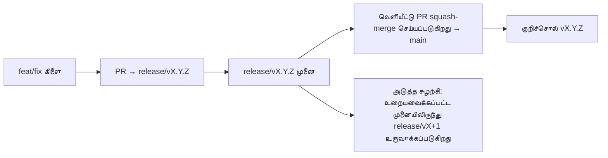

# Branching & Release Model (தமிழ்)

🌐 **Languages:** 🇺🇸 [English](../../../../ops/BRANCHING_MODEL.md) · 🇪🇹 [am](../../../am/docs/ops/BRANCHING_MODEL.md) · 🇸🇦 [ar](../../../ar/docs/ops/BRANCHING_MODEL.md) · 🇦🇿 [az](../../../az/docs/ops/BRANCHING_MODEL.md) · 🇧🇬 [bg](../../../bg/docs/ops/BRANCHING_MODEL.md) · 🇧🇩 [bn](../../../bn/docs/ops/BRANCHING_MODEL.md) · 🇧🇦 [bs](../../../bs/docs/ops/BRANCHING_MODEL.md) · 🇨🇿 [cs](../../../cs/docs/ops/BRANCHING_MODEL.md) · 🇩🇰 [da](../../../da/docs/ops/BRANCHING_MODEL.md) · 🇩🇪 [de](../../../de/docs/ops/BRANCHING_MODEL.md) · 🇬🇷 [el](../../../el/docs/ops/BRANCHING_MODEL.md) · 🇪🇸 [es](../../../es/docs/ops/BRANCHING_MODEL.md) · 🇪🇪 [et](../../../et/docs/ops/BRANCHING_MODEL.md) · 🇮🇷 [fa](../../../fa/docs/ops/BRANCHING_MODEL.md) · 🇫🇮 [fi](../../../fi/docs/ops/BRANCHING_MODEL.md) · 🇫🇷 [fr](../../../fr/docs/ops/BRANCHING_MODEL.md) · 🇮🇪 [ga](../../../ga/docs/ops/BRANCHING_MODEL.md) · 🇮🇳 [gu](../../../gu/docs/ops/BRANCHING_MODEL.md) · 🇳🇬 [ha](../../../ha/docs/ops/BRANCHING_MODEL.md) · 🇮🇱 [he](../../../he/docs/ops/BRANCHING_MODEL.md) · 🇮🇳 [hi](../../../hi/docs/ops/BRANCHING_MODEL.md) · 🇭🇷 [hr](../../../hr/docs/ops/BRANCHING_MODEL.md) · 🇭🇺 [hu](../../../hu/docs/ops/BRANCHING_MODEL.md) · 🇦🇲 [hy](../../../hy/docs/ops/BRANCHING_MODEL.md) · 🇮🇩 [id](../../../id/docs/ops/BRANCHING_MODEL.md) · 🇳🇬 [ig](../../../ig/docs/ops/BRANCHING_MODEL.md) · 🇮🇹 [it](../../../it/docs/ops/BRANCHING_MODEL.md) · 🇯🇵 [ja](../../../ja/docs/ops/BRANCHING_MODEL.md) · 🇬🇪 [ka](../../../ka/docs/ops/BRANCHING_MODEL.md) · 🇰🇭 [km](../../../km/docs/ops/BRANCHING_MODEL.md) · 🇮🇳 [kn](../../../kn/docs/ops/BRANCHING_MODEL.md) · 🇰🇷 [ko](../../../ko/docs/ops/BRANCHING_MODEL.md) · 🇱🇹 [lt](../../../lt/docs/ops/BRANCHING_MODEL.md) · 🇱🇻 [lv](../../../lv/docs/ops/BRANCHING_MODEL.md) · 🇮🇳 [ml](../../../ml/docs/ops/BRANCHING_MODEL.md) · 🇮🇳 [mr](../../../mr/docs/ops/BRANCHING_MODEL.md) · 🇲🇾 [ms](../../../ms/docs/ops/BRANCHING_MODEL.md) · 🇲🇹 [mt](../../../mt/docs/ops/BRANCHING_MODEL.md) · 🇲🇲 [my](../../../my/docs/ops/BRANCHING_MODEL.md) · 🇳🇵 [ne](../../../ne/docs/ops/BRANCHING_MODEL.md) · 🇳🇱 [nl](../../../nl/docs/ops/BRANCHING_MODEL.md) · 🇳🇴 [no](../../../no/docs/ops/BRANCHING_MODEL.md) · 🇮🇳 [or](../../../or/docs/ops/BRANCHING_MODEL.md) · 🇮🇳 [pa](../../../pa/docs/ops/BRANCHING_MODEL.md) · 🇵🇭 [phi](../../../phi/docs/ops/BRANCHING_MODEL.md) · 🇵🇱 [pl](../../../pl/docs/ops/BRANCHING_MODEL.md) · 🇵🇹 [pt](../../../pt/docs/ops/BRANCHING_MODEL.md) · 🇧🇷 [pt-BR](../../../pt-BR/docs/ops/BRANCHING_MODEL.md) · 🇷🇴 [ro](../../../ro/docs/ops/BRANCHING_MODEL.md) · 🇷🇺 [ru](../../../ru/docs/ops/BRANCHING_MODEL.md) · 🇱🇰 [si](../../../si/docs/ops/BRANCHING_MODEL.md) · 🇸🇰 [sk](../../../sk/docs/ops/BRANCHING_MODEL.md) · 🇸🇮 [sl](../../../sl/docs/ops/BRANCHING_MODEL.md) · 🇷🇸 [sr](../../../sr/docs/ops/BRANCHING_MODEL.md) · 🇸🇪 [sv](../../../sv/docs/ops/BRANCHING_MODEL.md) · 🇰🇪 [sw](../../../sw/docs/ops/BRANCHING_MODEL.md) · 🇮🇳 [te](../../../te/docs/ops/BRANCHING_MODEL.md) · 🇹🇭 [th](../../../th/docs/ops/BRANCHING_MODEL.md) · 🇹🇷 [tr](../../../tr/docs/ops/BRANCHING_MODEL.md) · 🇺🇦 [uk-UA](../../../uk-UA/docs/ops/BRANCHING_MODEL.md) · 🇵🇰 [ur](../../../ur/docs/ops/BRANCHING_MODEL.md) · 🇺🇿 [uz](../../../uz/docs/ops/BRANCHING_MODEL.md) · 🇻🇳 [vi](../../../vi/docs/ops/BRANCHING_MODEL.md) · 🇳🇬 [yo](../../../yo/docs/ops/BRANCHING_MODEL.md) · 🇨🇳 [zh-CN](../../../zh-CN/docs/ops/BRANCHING_MODEL.md) · 🇹🇼 [zh-TW](../../../zh-TW/docs/ops/BRANCHING_MODEL.md)

---

OmniRoute ஒரு **இணை-சுழற்சி** வெளியீட்டு மாதிரியைப் பயன்படுத்துகிறது: செயலில் உள்ள சுழற்சிக்காகப் பிரத்யேகமான `release/vX.Y.Z`
கிளை, வெளியிடப்பட்ட வரிசைக்காக `main`, மேலும் அந்தச் சுழற்சி வெளியிடப்படும்போது மாற்ற முடியாத
`vX.Y.Z` குறிச்சொல். Commit-கள் `release/*`-இலும்
`main`-இலும் சேர்வது எதிர்பார்க்கப்பட்டதே — அது குழப்பத்தால் நிகழ்வது அல்ல.

பராமரிப்பாளர்களுக்கான விவரங்கள் `CLAUDE.md`-இல் (கடுமையான விதி #21) மற்றும்
[RELEASE_CHECKLIST.md](./RELEASE_CHECKLIST.md)-இல் உள்ளன. இந்தப் பக்கம் பங்களிப்பாளர்களுக்கான பொதுச்
சுருக்கமாகும்.

## ஒரு பார்வையில்

| குறிப்பு              | பங்கு                                                                                                                    |
| --------------------- | ------------------------------------------------------------------------------------------------------------------------ |
| `release/vX.Y.Z`      | **செயலில் உள்ள சுழற்சி** — அந்தப் பதிப்புக்கான அன்றாட மேம்பாடு மற்றும் PR இணைப்புகள்                                     |
| `main`                | **வெளியிடப்பட்ட வரிசை** — வெளியீடு அனுப்பப்படும்போது squash-merge மூலம் சுழற்சியைப் பெறுகிறது                            |
| `vX.Y.Z` (குறிச்சொல்) | **வெளியீட்டுக் குறியீடு** — வெளியீட்டு நேரத்தில் உருவாக்கப்படும், மாற்ற முடியாத “என்ன வெளியிடப்பட்டது” என்பதற்கான சுட்டி |



## எனது PR எந்தக் கிளையைக் குறிவைக்க வேண்டும்?

**செயலில் உள்ள `release/vX.Y.Z` கிளையைக் குறிவையுங்கள் — `main`-ஐ அல்ல.**

1. திறந்திருக்கும் `release/v*` கிளைகளில் உயர்ந்ததைக் கண்டறியுங்கள் (இதை எழுதும் நேரத்திலான எடுத்துக்காட்டு:
   `release/v3.8.49`).
2. அந்த முனையிலிருந்து கிளையை உருவாக்குங்கள் (`git fetch` + checkout / அதன் மீது rebase).
3. **base = அந்த `release/vX.Y.Z`** என அமைத்து PR-ஐத் திறக்கவும்.

`main` அன்றாட ஒருங்கிணைப்புக் கிளை அல்ல. `main`-ஐக் குறிவைத்துத் திறக்கப்படும் PR-கள்
பொதுவாக merge செய்வதற்கு முன் வேறு இலக்கிற்கு மாற்றப்பட வேண்டும்.

## வெளியீட்டு உறைநிலை (இணைச் சுழற்சிகள்)

ஒரு வெளியீடு ஒத்திசைக்கப்படும்போது, `release-freeze` என்ற label கொண்ட ஒரு குறியீட்டுச் சிக்கல்
திறக்கப்படும். அது **மேம்பாட்டை நிறுத்தாது**:

- உறையவைக்கப்பட்ட `release/vX.Y.Z`, அந்த வெளியீட்டுக்கான வெளியீட்டுப் பொறுப்பாளருக்குச் சொந்தமானது.
- பங்களிப்பாளர்கள் தொடர்ந்து பணிகளைச் சேர்க்கும் வகையில், உறையவைக்கப்பட்ட முனையிலிருந்து அடுத்த சுழற்சியின் `release/vX+1` உருவாக்கப்படும்.
- இன்னும் உறையவைக்கப்பட்ட கிளையைக் குறிவைக்கும் திறந்த PR-கள், செயலில் உள்ள (உயர்ந்த)
  `release/v*` கிளைக்கு **மீண்டும் குறிவைக்கப்பட வேண்டும்**.

நீங்கள் விரும்பும் கிளையில் merge செய்ய முடியும் என்று கருதுவதற்கு முன், திறந்த உறைநிலை உள்ளதா எனச் சரிபார்க்கவும்:

```bash
gh issue list --repo diegosouzapw/OmniRoute --label release-freeze --state open
```

Merge செயல்முறைகள் (உரிமையாளரின் `queue` label → Mergify) குறித்து
[MERGE_TRAIN.md](./MERGE_TRAIN.md)-இல் ஆவணப்படுத்தப்பட்டுள்ளது.

## கிளையும் குறிச்சொல்லும் இரண்டும் ஏன்?

| ஆவணப்பொருள்         | ஆயுட்காலம்               | நோக்கம்                                                                                                |
| ------------------- | ------------------------ | ------------------------------------------------------------------------------------------------------ |
| `release/vX.Y.Z`    | செயல்பாட்டிலுள்ள சுழற்சி | மதிப்பாய்வு செய்யப்பட்ட PR-களைச் சேகரிக்கிறது, CI-green நிலையில் நீடிக்கிறது, மேலும் PR base ஆக உள்ளது |
| குறிச்சொல் `vX.Y.Z` | நிரந்தரம்                | npm / GitHub Releases-க்கு அனுப்பப்பட்ட துல்லியமான உள்ளடக்கத்தைக் குறிக்கிறது                          |

கிளை என்பது பணிமனை; குறிச்சொல் என்பது முத்திரையிடப்பட்ட தொகுப்பு. `main`-க்கு squash-merge செய்த பிறகு,
முந்தைய வெளியீட்டு PR முடிவடையும் வரை காத்திருக்காமல் அடுத்த சுழற்சி `release/vX+1`-இல் தொடர்கிறது.

## தொடர்புடைய ஆவணங்கள்

- [CONTRIBUTING.md](../../CONTRIBUTING.md) — அமைப்பு, சோதனைகள், PR சரிபார்ப்புப் பட்டியல்
- [RELEASE_CHECKLIST.md](./RELEASE_CHECKLIST.md) — வெளியீட்டுக்கு முந்தைய சரிபார்ப்பு
- [MERGE_TRAIN.md](./MERGE_TRAIN.md) — merge queue மற்றும் மாற்று merge train
- [RELEASE_GREEN.md](./RELEASE_GREEN.md) — வெளியீட்டு முனையை green நிலையில் வைத்திருத்தல்
