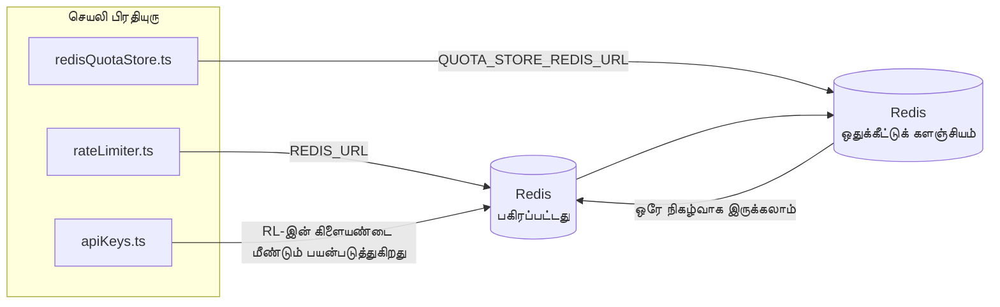

# Redis Production Configuration Guide (தமிழ்)

🌐 **Languages:** 🇺🇸 [English](../../../../ops/REDIS_PRODUCTION_CONFIG.md) · 🇪🇹 [am](../../../am/docs/ops/REDIS_PRODUCTION_CONFIG.md) · 🇸🇦 [ar](../../../ar/docs/ops/REDIS_PRODUCTION_CONFIG.md) · 🇦🇿 [az](../../../az/docs/ops/REDIS_PRODUCTION_CONFIG.md) · 🇧🇬 [bg](../../../bg/docs/ops/REDIS_PRODUCTION_CONFIG.md) · 🇧🇩 [bn](../../../bn/docs/ops/REDIS_PRODUCTION_CONFIG.md) · 🇨🇿 [cs](../../../cs/docs/ops/REDIS_PRODUCTION_CONFIG.md) · 🇩🇰 [da](../../../da/docs/ops/REDIS_PRODUCTION_CONFIG.md) · 🇩🇪 [de](../../../de/docs/ops/REDIS_PRODUCTION_CONFIG.md) · 🇬🇷 [el](../../../el/docs/ops/REDIS_PRODUCTION_CONFIG.md) · 🇪🇸 [es](../../../es/docs/ops/REDIS_PRODUCTION_CONFIG.md) · 🇪🇪 [et](../../../et/docs/ops/REDIS_PRODUCTION_CONFIG.md) · 🇮🇷 [fa](../../../fa/docs/ops/REDIS_PRODUCTION_CONFIG.md) · 🇫🇮 [fi](../../../fi/docs/ops/REDIS_PRODUCTION_CONFIG.md) · 🇫🇷 [fr](../../../fr/docs/ops/REDIS_PRODUCTION_CONFIG.md) · 🇮🇪 [ga](../../../ga/docs/ops/REDIS_PRODUCTION_CONFIG.md) · 🇮🇳 [gu](../../../gu/docs/ops/REDIS_PRODUCTION_CONFIG.md) · 🇳🇬 [ha](../../../ha/docs/ops/REDIS_PRODUCTION_CONFIG.md) · 🇮🇱 [he](../../../he/docs/ops/REDIS_PRODUCTION_CONFIG.md) · 🇮🇳 [hi](../../../hi/docs/ops/REDIS_PRODUCTION_CONFIG.md) · 🇭🇷 [hr](../../../hr/docs/ops/REDIS_PRODUCTION_CONFIG.md) · 🇭🇺 [hu](../../../hu/docs/ops/REDIS_PRODUCTION_CONFIG.md) · 🇦🇲 [hy](../../../hy/docs/ops/REDIS_PRODUCTION_CONFIG.md) · 🇮🇩 [id](../../../id/docs/ops/REDIS_PRODUCTION_CONFIG.md) · 🇳🇬 [ig](../../../ig/docs/ops/REDIS_PRODUCTION_CONFIG.md) · 🇮🇹 [it](../../../it/docs/ops/REDIS_PRODUCTION_CONFIG.md) · 🇯🇵 [ja](../../../ja/docs/ops/REDIS_PRODUCTION_CONFIG.md) · 🇬🇪 [ka](../../../ka/docs/ops/REDIS_PRODUCTION_CONFIG.md) · 🇰🇭 [km](../../../km/docs/ops/REDIS_PRODUCTION_CONFIG.md) · 🇮🇳 [kn](../../../kn/docs/ops/REDIS_PRODUCTION_CONFIG.md) · 🇰🇷 [ko](../../../ko/docs/ops/REDIS_PRODUCTION_CONFIG.md) · 🇱🇹 [lt](../../../lt/docs/ops/REDIS_PRODUCTION_CONFIG.md) · 🇱🇻 [lv](../../../lv/docs/ops/REDIS_PRODUCTION_CONFIG.md) · 🇮🇳 [ml](../../../ml/docs/ops/REDIS_PRODUCTION_CONFIG.md) · 🇮🇳 [mr](../../../mr/docs/ops/REDIS_PRODUCTION_CONFIG.md) · 🇲🇾 [ms](../../../ms/docs/ops/REDIS_PRODUCTION_CONFIG.md) · 🇲🇹 [mt](../../../mt/docs/ops/REDIS_PRODUCTION_CONFIG.md) · 🇲🇲 [my](../../../my/docs/ops/REDIS_PRODUCTION_CONFIG.md) · 🇳🇵 [ne](../../../ne/docs/ops/REDIS_PRODUCTION_CONFIG.md) · 🇳🇱 [nl](../../../nl/docs/ops/REDIS_PRODUCTION_CONFIG.md) · 🇳🇴 [no](../../../no/docs/ops/REDIS_PRODUCTION_CONFIG.md) · 🇮🇳 [or](../../../or/docs/ops/REDIS_PRODUCTION_CONFIG.md) · 🇮🇳 [pa](../../../pa/docs/ops/REDIS_PRODUCTION_CONFIG.md) · 🇵🇭 [phi](../../../phi/docs/ops/REDIS_PRODUCTION_CONFIG.md) · 🇵🇱 [pl](../../../pl/docs/ops/REDIS_PRODUCTION_CONFIG.md) · 🇵🇹 [pt](../../../pt/docs/ops/REDIS_PRODUCTION_CONFIG.md) · 🇧🇷 [pt-BR](../../../pt-BR/docs/ops/REDIS_PRODUCTION_CONFIG.md) · 🇷🇴 [ro](../../../ro/docs/ops/REDIS_PRODUCTION_CONFIG.md) · 🇷🇺 [ru](../../../ru/docs/ops/REDIS_PRODUCTION_CONFIG.md) · 🇱🇰 [si](../../../si/docs/ops/REDIS_PRODUCTION_CONFIG.md) · 🇸🇰 [sk](../../../sk/docs/ops/REDIS_PRODUCTION_CONFIG.md) · 🇸🇮 [sl](../../../sl/docs/ops/REDIS_PRODUCTION_CONFIG.md) · 🇷🇸 [sr](../../../sr/docs/ops/REDIS_PRODUCTION_CONFIG.md) · 🇸🇪 [sv](../../../sv/docs/ops/REDIS_PRODUCTION_CONFIG.md) · 🇰🇪 [sw](../../../sw/docs/ops/REDIS_PRODUCTION_CONFIG.md) · 🇮🇳 [te](../../../te/docs/ops/REDIS_PRODUCTION_CONFIG.md) · 🇹🇭 [th](../../../th/docs/ops/REDIS_PRODUCTION_CONFIG.md) · 🇹🇷 [tr](../../../tr/docs/ops/REDIS_PRODUCTION_CONFIG.md) · 🇺🇦 [uk-UA](../../../uk-UA/docs/ops/REDIS_PRODUCTION_CONFIG.md) · 🇵🇰 [ur](../../../ur/docs/ops/REDIS_PRODUCTION_CONFIG.md) · 🇺🇿 [uz](../../../uz/docs/ops/REDIS_PRODUCTION_CONFIG.md) · 🇻🇳 [vi](../../../vi/docs/ops/REDIS_PRODUCTION_CONFIG.md) · 🇳🇬 [yo](../../../yo/docs/ops/REDIS_PRODUCTION_CONFIG.md) · 🇨🇳 [zh-CN](../../../zh-CN/docs/ops/REDIS_PRODUCTION_CONFIG.md) · 🇹🇼 [zh-TW](../../../zh-TW/docs/ops/REDIS_PRODUCTION_CONFIG.md)

---

## மேலோட்டம்

Redis என்பது OmniRoute-இல் ஒரு **விருப்பத்திற்குரிய, மென்மையான சார்பு** ஆகும் — Redis கிடைக்காதபோது பயன்பாடு சீராகத் தரம் குறைந்து செயல்படும் (நினைவகத்திலுள்ள மாற்று ஏற்பாடுகளைப் பயன்படுத்தும்). உற்பத்திச் சூழலில், Redis-ஐச் சீரமைப்பது நான்கு தனித்துவமான பணிச்சுமைகளுக்கான தாமதத்தைக் குறைக்கிறது:

| பணிச்சுமை                      | இயக்கி                        | கிளையண்ட் உருவாக்கி                                              | விசை வடிவம்                                                |
| ------------------------------ | ----------------------------- | ---------------------------------------------------------------- | ---------------------------------------------------------- |
| வீத வரம்பிடல்                  | `rateLimiter.ts`              | `getRedisClient()` — தாமதமாகத் தொடங்கப்படும் `ioredis` singleton | `<prefix>rl:*` Lua‑அணுநிலை வீத வரம்புச் சாளரங்கள்          |
| அங்கீகாரத் தற்காலிகச் சேமிப்பு | `apiKeys.ts`                  | `rateLimiter`-இன் கிளையண்டை மீண்டும் பயன்படுத்துகிறது            | TTL உடன் `<prefix>auth:api_key:<sha256>`                   |
| ஒதுக்கீட்டுச் சேமிப்பகம்       | `redisQuotaStore.ts`          | தனியான `getRedisClient(url)` singleton                           | ஒவ்வொரு instance-க்கும் உள்ளமைக்கக்கூடிய `<prefix>quota:*` |
| தயார்நிலை circuit breaker      | `redisCircuitBreakerStore.ts` | `circuitBreakerFactory.ts`-இல் தனியான கிளையண்ட்                  | `<prefix>warmup:cb:<connectionId>`                         |

நான்கு பணிச்சுமைகளும் ஒரே namespace prefix-ஐப் பகிர்ந்துகொள்வதால், ஒரே Redis instance-இல் (எ.கா. `127.0.0.1:6379`) OmniRoute மற்ற பயன்பாடுகளுடன் இணைந்து இயங்க முடியும். [விசை namespace அமைப்பு](#key-namespacing) என்பதைப் பார்க்கவும்.

---

## தற்போதைய உள்ளமைவு (குறியீட்டு இயல்புநிலைகள்)

| அமைப்பு                            | மதிப்பு                                                                  | அமைவிடம்                                                                              |
| ---------------------------------- | ------------------------------------------------------------------------ | ------------------------------------------------------------------------------------- |
| `REDIS_URL` சூழல் மாறி             | `redis://redis:6379` (compose), விருப்பத்திற்குரியது                     | `rateLimiter.ts:5`, `.env.example`                                                    |
| `REDIS_KEY_PREFIX` சூழல் மாறி      | `omniroute:` (இயல்புநிலை)                                                | `rateLimiter.ts`, `redisQuotaStore.ts`, `redisCircuitBreakerStore.ts`, `.env.example` |
| `QUOTA_STORE_REDIS_URL` சூழல் மாறி | தனியானது, `REDIS_URL`-இலிருந்து வேறுபடலாம்                               | `quota/storeFactory.ts`                                                               |
| `QUOTA_STORE_DRIVER`               | `"sqlite"` (இயல்புநிலை), `"redis"` விருப்பத்திற்குரியது                  | `quota/storeFactory.ts`                                                               |
| ioredis `maxRetriesPerRequest`     | `3`                                                                      | `rateLimiter.ts` கிளையண்ட் உருவாக்கம்                                                 |
| `enableReadyCheck`                 | அமைக்கப்படவில்லை (ioredis இயல்புநிலை: `true`)                            | —                                                                                     |
| `lazyConnect`                      | அமைக்கப்படவில்லை (ioredis இயல்புநிலை: `false`)                           | —                                                                                     |
| `retryStrategy`                    | அமைக்கப்படவில்லை (ioredis இயல்புநிலை: 200ms அடிப்படை, அதிவேக அதிகரிப்பு) | —                                                                                     |
| TLS / கடவுச்சொல் / DB சுட்டெண்     | **உள்ளமைக்கப்படவில்லை**                                                  | —                                                                                     |
| Sentinel / Cluster                 | **உள்ளமைக்கப்படவில்லை** — தனித்த ஒற்றை-node மட்டும்                      | —                                                                                     |

---

## விசை namespace அமைப்பு

ஹோஸ்டில் இயங்கும் பிற சேவைகளுடன் OmniRoute ஒரு Redis instance-ஐப் பகிர்ந்துகொள்கிறது. namespace இல்லாமல், `auth:api_key:<sha256>` அல்லது `rl:*` போன்ற விசைகள் அதே Redis-ஐப் பயன்படுத்தும் பிற பயன்பாடுகளின் விசைகளுடன் மோதக்கூடும் (இந்த instance, பிற சேவைகளுடன் சேர்ந்து `127.0.0.1:6379`-இல் Redis-ஐ இயக்குகிறது).

OmniRoute-இன் **ஒவ்வொரு** விசைக்கும் prefix சேர்க்க, `REDIS_KEY_PREFIX`-ஐ வெறுமையற்ற string-ஆக அமைக்கவும்:

```bash
# .env — அனைத்து OmniRoute விசைகளும் omniroute:rl:*, omniroute:auth:*, omniroute:quota:*, omniroute:warmup:cb:* ஆகும்
REDIS_KEY_PREFIX=omniroute:
```

- **இயல்புநிலை:** `omniroute:` (`REDIS_KEY_PREFIX` அமைக்கப்படாதபோது அல்லது வெறுமையாக இருக்கும்போது பயன்படுத்தப்படும்).
- **பயன்படுத்தப்படுபவை:** வீத வரம்பி + அங்கீகாரத் தற்காலிகச் சேமிப்பு (`keyPrefix` வழியாகப் பகிரப்படும் `ioredis` கிளையண்ட்), ஒதுக்கீட்டுச் சேமிப்பகம் (`KEY_PREFIX = "${REDIS_KEY_PREFIX}quota"`) மற்றும் தயார்நிலை circuit breaker (`KEY_PREFIX = "${REDIS_KEY_PREFIX}warmup:cb:"`).
- Redis-இல் விசைகள் ஏற்கெனவே இருக்கும்போது **prefix-ஐ மாற்றுவது**, பழைய விசைகளைத் தொடர்பற்றவையாக விட்டுவிடும் (அவை TTL / LRU வழியாகக் காலாவதியாகும்). மாற்றுவது பாதுகாப்பானது; இடமாற்றம் தேவையில்லை. தடைசெய்யப்பட்டதாகக் குறிக்கப்பட்ட இணைப்புக்கான தயார்நிலை circuit-breaker விசை மட்டும் இதற்கு விதிவிலக்கு: அது TTL இல்லாமல் நிரந்தரமாகச் சேமிக்கப்படுகிறது; எனவே எஞ்சியவற்றை `redis-cli --scan --pattern '<old-prefix>warmup:cb:*'` மூலம் பட்டியலிட்டு அவற்றை நீக்கவும்.
- **ioredis `keyPrefix`**, எழுதும்போது prefix-ஐத் தானாக முன்சேர்ப்பதுடன், படிக்கும்போது அதை நீக்குவதால், பயன்பாட்டுக் குறியீடு prefix-ஐ ஒருபோதும் காணாது.

---

## பரிந்துரைக்கப்பட்ட தயாரிப்புச் சூழல் மேம்படுத்தல்கள்

### 1. இணைப்புத் தொகுப்பு / கிளையன்ட் விருப்பங்கள் (ioredis `Redis` constructor)

தற்போதைய குறியீடு தனிப்பயன் விருப்பங்கள் எதுவுமின்றி ஒற்றை `new Redis(url)`-ஐ உருவாக்குகிறது. தயாரிப்புச் சூழலின்
பல பிரதிப் பயன்பாடுகளுக்கு, குறியீட்டில் ஒரு கிளையன்ட் தொழிற்செயல்பாட்டை வழங்கவும் அல்லது `getRedisClient()`-ஐச் சுற்றி அமைக்கவும்:

```typescript
const redis = new Redis(REDIS_URL, {
  maxRetriesPerRequest: null, // மறுமுயற்சி வரம்பு இல்லை; retryStrategy முடிவெடுக்கட்டும்
  enableReadyCheck: true, // அழைப்புகளை ஏற்கும் முன் சேவையகம் தயாராக இருப்பதைச் சரிபார்க்கவும்
  lazyConnect: true, // உருவாக்கும்போது இணைக்க வேண்டாம்; முதல் அழைப்புக்காகக் காத்திருக்கவும்
  retryStrategy: (times) => {
    if (times > 10) return null; // 10 மறுமுயற்சிகளுக்குப் பிறகு கைவிட்டு → பின்னர் மீண்டும் இணைக்கவும்
    return Math.min(times * 200, 5000); // 200ms, 400ms, …, அதிகபட்சம் 5s
  },
  enableAutoPipelining: true, // ஒரே நேரத்தில் நிகழும் கட்டளைகளை ஒரு TCP எழுதுதலாக ஒன்றிணைக்கவும்
  keepAlive: 10000, // ஒவ்வொரு 10s-க்கும் TCP இணைப்பைச் செயல்பாட்டில் வைத்திருக்கவும்
});
```

**முக்கிய சாதக-பாதகங்கள்:**

- `maxRetriesPerRequest: null` + `retryStrategy` — தற்காலிகமான Redis மறுதொடக்கங்கள் ஒவ்வொரு
  கோரிக்கையையும் உடனடியாகத் தோல்வியடையச் செய்யாமல் இருப்பதால், தயாரிப்புச் சூழலுக்கு இது விரும்பத்தக்கது. `checkRateLimit()`-இல் உள்ள நினைவகச் சார்ந்த மாற்று
  தோல்விப் பாதையைத் தாங்குகிறது.
- `lazyConnect: true` — சேவையகம் இணைப்புகளை ஏற்கத் தொடங்குவதற்கு முன் Redis இயங்கிக் கொண்டிருக்க வேண்டும் என்ற தொடக்கநிலைச்
  சார்பைத் தவிர்க்கிறது.
- `enableAutoPipelining: true` — ஒரே நேரத்தில் நிகழும் வீத-வரம்புச் சரிபார்ப்புகளுக்கான சுற்றுப்பயணங்களைக் குறைக்கிறது;
  ஒற்றை இணைப்பில் >50 RPS இருக்கும்போது பயனளிக்கும்.

### 2. Redis சேவையக உள்ளமைவு (`redis.conf`)

```
# நினைவகம்
maxmemory 80%                        # OS பக்கத் தேக்ககத்திற்கு இடம் விடவும்
maxmemory-policy allkeys-lru         # அழுத்தத்தின் கீழ் காலாவதியான அங்கீகாரத் தேக்ககப் பதிவுகளை வெளியேற்றவும்

# நிலைத்தன்மை (விருப்பத்திற்குரியது — இது இல்லாமலும் OmniRoute செயலிழப்பிலிருந்து பாதுகாப்பானது)
save 300 1                           # ≥1 விசை மாறியிருந்தால், குறைந்தது ஒவ்வொரு 5 நிமிடங்களுக்கும் நிலைப்படம் எடுக்கவும்
appendonly no                        # AOF தேவையில்லை; தரவை மீண்டும் உருவாக்க முடியும்
appendfsync no                       # fsync கூடுதல் செலவு இல்லை (RDB போதுமானது)

# வலையமைப்பு
timeout 0                            # செயலற்ற இணைப்பைத் துண்டிக்க வேண்டாம்
tcp-keepalive 300                    # 5 நிமிடங்களுக்கு ஒருமுறை இணைப்பைச் செயல்பாட்டில் வைத்திருக்கவும்
tcp-backlog 511                      # திடீர் சுமைக்கான இணைப்புப் பின்னிருப்பு

# செயல்திறன்
hz 10                                # இயல்புநிலை; தாமதத்திற்கு உணர்திறன் கொண்ட பயன்பாடுகளுக்கு 100
activedefrag yes                     # துண்டாக்கம் >10% ஆகும்போது தானாகத் துண்டாக்கத்தைச் சீரமைக்கவும்
```

**`maxmemory-policy allkeys-lru`-க்கான சாதக-பாதகம்:** நினைவக
அழுத்தத்தின்போது அங்கீகாரத் தேக்ககப் பதிவுகள் வெளியேற்றப்படலாம். இது பாதுகாப்பானது — தவறிய தேடலின்போது `setCachedApiKey` எப்போதும் மீண்டும் நிரப்புகிறது, மேலும்
SQLite மாற்று அதிகாரபூர்வமானது. வீத-வரம்பாக்கி Lua நிரல், வடிவமைப்பின்படியே குறுகிய ஆயுட்காலமுள்ள சிறிய விசைகளை
உருவாக்குகிறது.

### 3. Docker Compose அமைப்புகள்

தயாரிப்புச் சூழல் compose (`docker-compose.prod.yml`) `redis:8.6.2-alpine`-ஐப் பயன்படுத்துகிறது. பின்வருவதைச் சேர்க்கவும்:

```yaml
redis:
  image: redis:8.6.2-alpine
  command:
    [
      "redis-server",
      "--maxmemory",
      "512mb",
      "--maxmemory-policy",
      "allkeys-lru",
      "--activedefrag",
      "yes",
      "--save",
      "300 1",
    ]
  healthcheck:
    test: ["CMD", "redis-cli", "ping"]
    interval: 10s
    timeout: 3s
    retries: 3
    start_period: 5s
```

### 4. பல நிகழ்வு / அளவீட்டுப் பரிசீலனைகள்

**அனைத்துப் பிரதிகளுக்கும் ஒற்றை Redis** — வீத-வரம்பாக்கி Lua நிரல் ஒற்றை
அதிகாரபூர்வ விசைவெளியைச் சார்ந்துள்ளது. பிரதிகளுக்குப் பின்னால் பல Redis நிகழ்வுகளைப் பயன்படுத்தினால் அணுத்தன்மை
இழக்கப்பட்டு, ஒதுக்கீடு இரட்டிப்பாகும். அனைத்துப் பயன்பாட்டுப் பிரதிகளுக்கும் ஒற்றை Redis-ஐ (அல்லது தானியங்கு மாற்றத்துடன் கூடிய Redis Sentinel தொகுதியை)
பயன்படுத்தவும்.

**இணைப்பு எண்ணிக்கை:** ஒவ்வொரு பயன்பாட்டுப் பிரதியும் Redis-க்கு **2 TCP இணைப்புகளைத்** திறக்கிறது
(வீத-வரம்பாக்கி கிளையன்ட் + ஒதுக்கீட்டுக் களஞ்சிய கிளையன்ட்). 10 பிரதிகளில் → 20 இணைப்புகள்; இது
இயல்புநிலை Redis நிகழ்வின் 10k இணைப்பு உச்சவரம்பிற்குள் எளிதாக உள்ளது.

### 5. கண்காணிப்பு

நிலைச் சரிபார்ப்பு முனைப்புள்ளி வழியாக வெளியிடவும்:

```typescript
// src/app/api/monitoring/health/route.ts ஏற்கனவே rateLimiter செயல்பாடுகளை அழைக்கிறது
// Redis-க்கான குறிப்பிட்ட சரிபார்ப்புகளைச் சேர்க்கவும்:
//   1. ioredis .ping() வழியான PING தாமதம்
//   2. INFO memory வழியான நினைவகப் பயன்பாடு
//   3. INFO clients வழியான இணைப்பு எண்ணிக்கை
//   4. maxmemory-policy-க்கான வெற்றி வீதம் (evicted_keys / keyspace_hits)
```

கவனிக்க வேண்டிய முக்கிய அளவீடுகள்:

- **வினாடிக்குச் வெளியேற்றப்பட்ட விசைகள்** — தொடர்ந்து பூஜ்ஜியமல்லாமல் இருந்தால், `maxmemory`-ஐ அதிகரிக்கவும்
- **தடுக்கப்பட்ட கிளையன்ட்கள்** — பூஜ்ஜியமல்லாமல் இருப்பது மெதுவான Lua நிரல்கள் அல்லது அதிகப் போட்டியைக் குறிக்கிறது
- **நிராகரிக்கப்பட்ட இணைப்புகள்** — இணைப்பு வரம்பு எட்டப்பட்டுள்ளது; 20 இணைப்புகளில் இது அரிது

---

## கட்டமைப்பு வரைபடம்



---

## மேற்கோள்கள்

| கோப்பு                             | நோக்கம்                                                                         |
| ---------------------------------- | ------------------------------------------------------------------------------- |
| `src/shared/utils/rateLimiter.ts`  | முதன்மை Redis கிளையண்ட், Lua விகித-வரம்பு ஸ்கிரிப்ட், நினைவகத்திலுள்ள மாற்றுவழி |
| `src/lib/db/apiKeys.ts`            | அங்கீகாரத் தற்காலிகச் சேமிப்பு — Redis→SQLite மாற்றுவழி                         |
| `src/lib/quota/redisQuotaStore.ts` | விருப்ப ஒதுக்கீட்டுக் களஞ்சியத்திற்கான தனி Redis கிளையண்ட்                      |
| `src/lib/quota/storeFactory.ts`    | `sqlite` மற்றும் `redis` ஒதுக்கீட்டு இயக்கிகளுக்கு இடையே மாறுகிறது              |
| `docker-compose.prod.yml`          | உற்பத்திச் சூழல் Redis கொள்கலன் (`redis:8.6.2-alpine` இமேஜ்)                    |
| `.env.example`                     | Redis சூழல் மாறிகள் பற்றிய ஆவணம்                                                |
| `src/app/api/local/redis/`         | உருவாக்கச் சூழல் கொள்கலன் ஒருங்கிணைப்பிற்கான API வழித்தடங்கள்                   |
| `bin/cli/commands/redis.mjs`       | உருவாக்கச் சூழல் கொள்கலன் ஒருங்கிணைப்பிற்கான CLI கட்டளைகள்                      |
