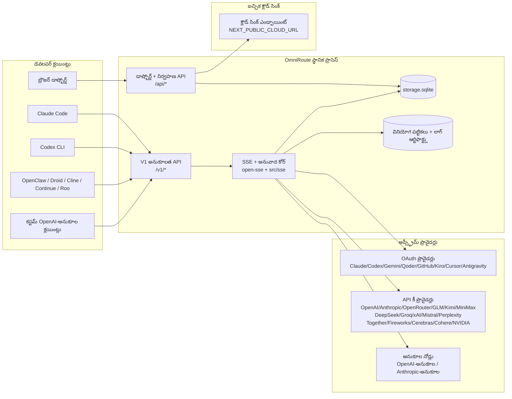
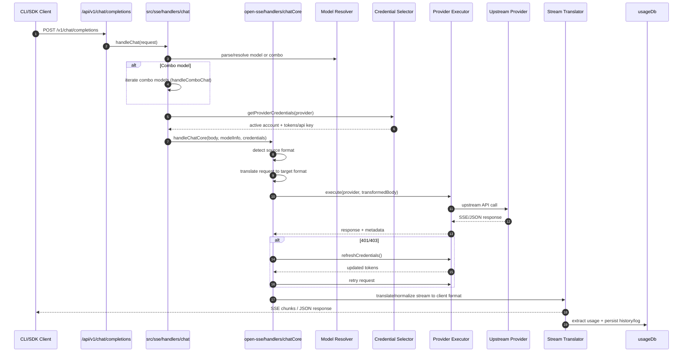
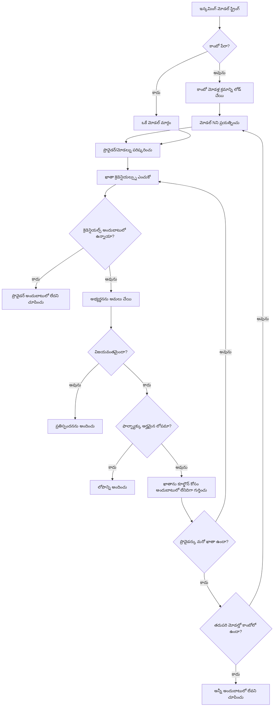
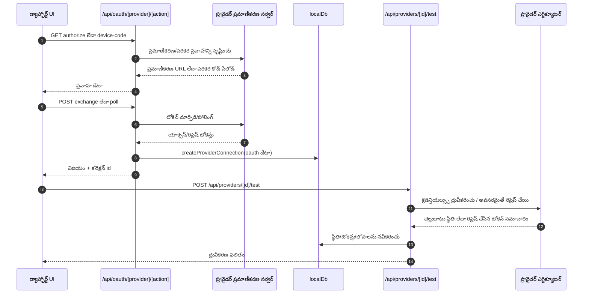
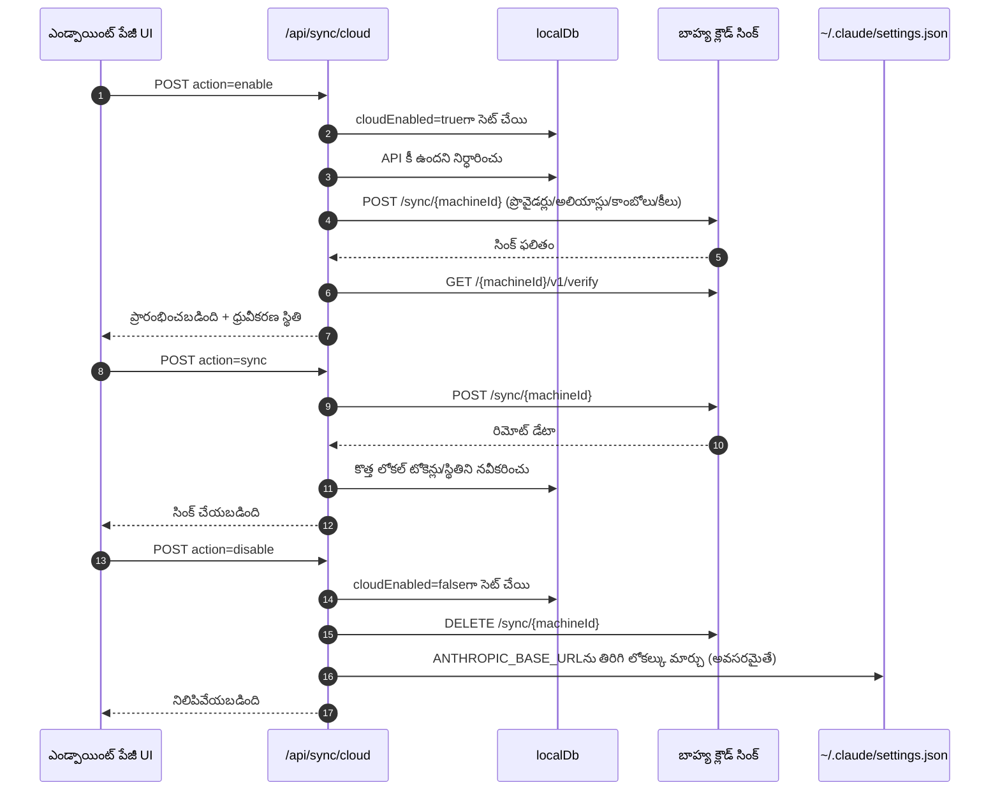
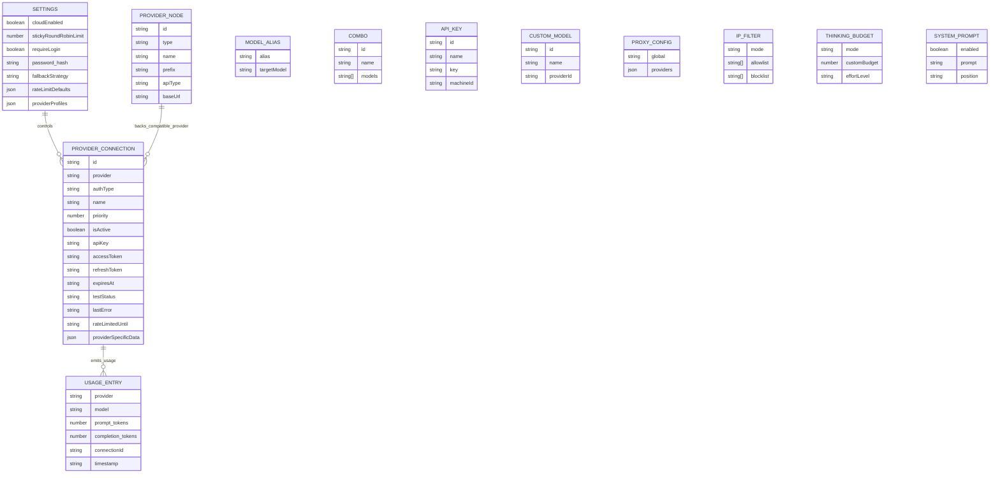
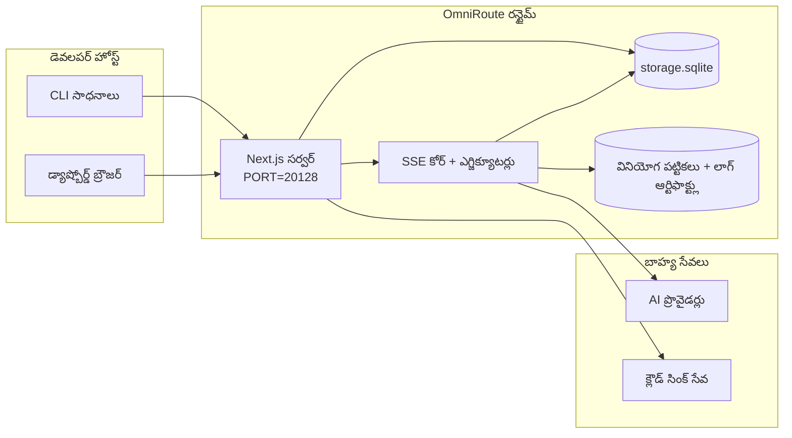

# OmniRoute Architecture (తెలుగు)

🌐 **Languages:** 🇺🇸 [English](../../../../architecture/ARCHITECTURE.md) · 🇪🇹 [am](../../../am/docs/architecture/ARCHITECTURE.md) · 🇸🇦 [ar](../../../ar/docs/architecture/ARCHITECTURE.md) · 🇦🇿 [az](../../../az/docs/architecture/ARCHITECTURE.md) · 🇧🇬 [bg](../../../bg/docs/architecture/ARCHITECTURE.md) · 🇧🇩 [bn](../../../bn/docs/architecture/ARCHITECTURE.md) · 🇧🇦 [bs](../../../bs/docs/architecture/ARCHITECTURE.md) · 🇨🇿 [cs](../../../cs/docs/architecture/ARCHITECTURE.md) · 🇩🇰 [da](../../../da/docs/architecture/ARCHITECTURE.md) · 🇩🇪 [de](../../../de/docs/architecture/ARCHITECTURE.md) · 🇬🇷 [el](../../../el/docs/architecture/ARCHITECTURE.md) · 🇪🇸 [es](../../../es/docs/architecture/ARCHITECTURE.md) · 🇪🇪 [et](../../../et/docs/architecture/ARCHITECTURE.md) · 🇮🇷 [fa](../../../fa/docs/architecture/ARCHITECTURE.md) · 🇫🇮 [fi](../../../fi/docs/architecture/ARCHITECTURE.md) · 🇫🇷 [fr](../../../fr/docs/architecture/ARCHITECTURE.md) · 🇮🇪 [ga](../../../ga/docs/architecture/ARCHITECTURE.md) · 🇮🇳 [gu](../../../gu/docs/architecture/ARCHITECTURE.md) · 🇳🇬 [ha](../../../ha/docs/architecture/ARCHITECTURE.md) · 🇮🇱 [he](../../../he/docs/architecture/ARCHITECTURE.md) · 🇮🇳 [hi](../../../hi/docs/architecture/ARCHITECTURE.md) · 🇭🇷 [hr](../../../hr/docs/architecture/ARCHITECTURE.md) · 🇭🇺 [hu](../../../hu/docs/architecture/ARCHITECTURE.md) · 🇦🇲 [hy](../../../hy/docs/architecture/ARCHITECTURE.md) · 🇮🇩 [id](../../../id/docs/architecture/ARCHITECTURE.md) · 🇳🇬 [ig](../../../ig/docs/architecture/ARCHITECTURE.md) · 🇮🇹 [it](../../../it/docs/architecture/ARCHITECTURE.md) · 🇯🇵 [ja](../../../ja/docs/architecture/ARCHITECTURE.md) · 🇬🇪 [ka](../../../ka/docs/architecture/ARCHITECTURE.md) · 🇰🇭 [km](../../../km/docs/architecture/ARCHITECTURE.md) · 🇮🇳 [kn](../../../kn/docs/architecture/ARCHITECTURE.md) · 🇰🇷 [ko](../../../ko/docs/architecture/ARCHITECTURE.md) · 🇱🇹 [lt](../../../lt/docs/architecture/ARCHITECTURE.md) · 🇱🇻 [lv](../../../lv/docs/architecture/ARCHITECTURE.md) · 🇮🇳 [ml](../../../ml/docs/architecture/ARCHITECTURE.md) · 🇮🇳 [mr](../../../mr/docs/architecture/ARCHITECTURE.md) · 🇲🇾 [ms](../../../ms/docs/architecture/ARCHITECTURE.md) · 🇲🇹 [mt](../../../mt/docs/architecture/ARCHITECTURE.md) · 🇲🇲 [my](../../../my/docs/architecture/ARCHITECTURE.md) · 🇳🇵 [ne](../../../ne/docs/architecture/ARCHITECTURE.md) · 🇳🇱 [nl](../../../nl/docs/architecture/ARCHITECTURE.md) · 🇳🇴 [no](../../../no/docs/architecture/ARCHITECTURE.md) · 🇮🇳 [or](../../../or/docs/architecture/ARCHITECTURE.md) · 🇮🇳 [pa](../../../pa/docs/architecture/ARCHITECTURE.md) · 🇵🇭 [phi](../../../phi/docs/architecture/ARCHITECTURE.md) · 🇵🇱 [pl](../../../pl/docs/architecture/ARCHITECTURE.md) · 🇵🇹 [pt](../../../pt/docs/architecture/ARCHITECTURE.md) · 🇧🇷 [pt-BR](../../../pt-BR/docs/architecture/ARCHITECTURE.md) · 🇷🇴 [ro](../../../ro/docs/architecture/ARCHITECTURE.md) · 🇷🇺 [ru](../../../ru/docs/architecture/ARCHITECTURE.md) · 🇱🇰 [si](../../../si/docs/architecture/ARCHITECTURE.md) · 🇸🇰 [sk](../../../sk/docs/architecture/ARCHITECTURE.md) · 🇸🇮 [sl](../../../sl/docs/architecture/ARCHITECTURE.md) · 🇷🇸 [sr](../../../sr/docs/architecture/ARCHITECTURE.md) · 🇸🇪 [sv](../../../sv/docs/architecture/ARCHITECTURE.md) · 🇰🇪 [sw](../../../sw/docs/architecture/ARCHITECTURE.md) · 🇮🇳 [ta](../../../ta/docs/architecture/ARCHITECTURE.md) · 🇹🇭 [th](../../../th/docs/architecture/ARCHITECTURE.md) · 🇹🇷 [tr](../../../tr/docs/architecture/ARCHITECTURE.md) · 🇺🇦 [uk-UA](../../../uk-UA/docs/architecture/ARCHITECTURE.md) · 🇵🇰 [ur](../../../ur/docs/architecture/ARCHITECTURE.md) · 🇺🇿 [uz](../../../uz/docs/architecture/ARCHITECTURE.md) · 🇻🇳 [vi](../../../vi/docs/architecture/ARCHITECTURE.md) · 🇳🇬 [yo](../../../yo/docs/architecture/ARCHITECTURE.md) · 🇨🇳 [zh-CN](../../../zh-CN/docs/architecture/ARCHITECTURE.md) · 🇹🇼 [zh-TW](../../../zh-TW/docs/architecture/ARCHITECTURE.md)

---

🌐 **Languages:** 🇺🇸 [English](../../../../architecture/ARCHITECTURE.md) · 🇪🇹 [am](../../../am/docs/architecture/ARCHITECTURE.md) · 🇸🇦 [ar](../../../ar/docs/architecture/ARCHITECTURE.md) · 🇦🇿 [az](../../../az/docs/architecture/ARCHITECTURE.md) · 🇧🇬 [bg](../../../bg/docs/architecture/ARCHITECTURE.md) · 🇧🇩 [bn](../../../bn/docs/architecture/ARCHITECTURE.md) · 🇧🇦 [bs](../../../bs/docs/architecture/ARCHITECTURE.md) · 🇨🇿 [cs](../../../cs/docs/architecture/ARCHITECTURE.md) · 🇩🇰 [da](../../../da/docs/architecture/ARCHITECTURE.md) · 🇩🇪 [de](../../../de/docs/architecture/ARCHITECTURE.md) · 🇬🇷 [el](../../../el/docs/architecture/ARCHITECTURE.md) · 🇪🇸 [es](../../../es/docs/architecture/ARCHITECTURE.md) · 🇪🇪 [et](../../../et/docs/architecture/ARCHITECTURE.md) · 🇮🇷 [fa](../../../fa/docs/architecture/ARCHITECTURE.md) · 🇫🇮 [fi](../../../fi/docs/architecture/ARCHITECTURE.md) · 🇫🇷 [fr](../../../fr/docs/architecture/ARCHITECTURE.md) · 🇮🇪 [ga](../../../ga/docs/architecture/ARCHITECTURE.md) · 🇮🇳 [gu](../../../gu/docs/architecture/ARCHITECTURE.md) · 🇳🇬 [ha](../../../ha/docs/architecture/ARCHITECTURE.md) · 🇮🇱 [he](../../../he/docs/architecture/ARCHITECTURE.md) · 🇮🇳 [hi](../../../hi/docs/architecture/ARCHITECTURE.md) · 🇭🇷 [hr](../../../hr/docs/architecture/ARCHITECTURE.md) · 🇭🇺 [hu](../../../hu/docs/architecture/ARCHITECTURE.md) · 🇦🇲 [hy](../../../hy/docs/architecture/ARCHITECTURE.md) · 🇮🇩 [id](../../../id/docs/architecture/ARCHITECTURE.md) · 🇳🇬 [ig](../../../ig/docs/architecture/ARCHITECTURE.md) · 🇮🇹 [it](../../../it/docs/architecture/ARCHITECTURE.md) · 🇯🇵 [ja](../../../ja/docs/architecture/ARCHITECTURE.md) · 🇬🇪 [ka](../../../ka/docs/architecture/ARCHITECTURE.md) · 🇰🇭 [km](../../../km/docs/architecture/ARCHITECTURE.md) · 🇮🇳 [kn](../../../kn/docs/architecture/ARCHITECTURE.md) · 🇰🇷 [ko](../../../ko/docs/architecture/ARCHITECTURE.md) · 🇱🇹 [lt](../../../lt/docs/architecture/ARCHITECTURE.md) · 🇱🇻 [lv](../../../lv/docs/architecture/ARCHITECTURE.md) · 🇮🇳 [ml](../../../ml/docs/architecture/ARCHITECTURE.md) · 🇮🇳 [mr](../../../mr/docs/architecture/ARCHITECTURE.md) · 🇲🇾 [ms](../../../ms/docs/architecture/ARCHITECTURE.md) · 🇲🇹 [mt](../../../mt/docs/architecture/ARCHITECTURE.md) · 🇲🇲 [my](../../../my/docs/architecture/ARCHITECTURE.md) · 🇳🇵 [ne](../../../ne/docs/architecture/ARCHITECTURE.md) · 🇳🇱 [nl](../../../nl/docs/architecture/ARCHITECTURE.md) · 🇳🇴 [no](../../../no/docs/architecture/ARCHITECTURE.md) · 🇮🇳 [or](../../../or/docs/architecture/ARCHITECTURE.md) · 🇮🇳 [pa](../../../pa/docs/architecture/ARCHITECTURE.md) · 🇵🇭 [phi](../../../phi/docs/architecture/ARCHITECTURE.md) · 🇵🇱 [pl](../../../pl/docs/architecture/ARCHITECTURE.md) · 🇵🇹 [pt](../../../pt/docs/architecture/ARCHITECTURE.md) · 🇧🇷 [pt-BR](../../../pt-BR/docs/architecture/ARCHITECTURE.md) · 🇷🇴 [ro](../../../ro/docs/architecture/ARCHITECTURE.md) · 🇷🇺 [ru](../../../ru/docs/architecture/ARCHITECTURE.md) · 🇱🇰 [si](../../../si/docs/architecture/ARCHITECTURE.md) · 🇸🇰 [sk](../../../sk/docs/architecture/ARCHITECTURE.md) · 🇸🇮 [sl](../../../sl/docs/architecture/ARCHITECTURE.md) · 🇷🇸 [sr](../../../sr/docs/architecture/ARCHITECTURE.md) · 🇸🇪 [sv](../../../sv/docs/architecture/ARCHITECTURE.md) · 🇰🇪 [sw](../../../sw/docs/architecture/ARCHITECTURE.md) · 🇮🇳 [ta](../../../ta/docs/architecture/ARCHITECTURE.md) · 🇹🇭 [th](../../../th/docs/architecture/ARCHITECTURE.md) · 🇹🇷 [tr](../../../tr/docs/architecture/ARCHITECTURE.md) · 🇺🇦 [uk-UA](../../../uk-UA/docs/architecture/ARCHITECTURE.md) · 🇵🇰 [ur](../../../ur/docs/architecture/ARCHITECTURE.md) · 🇺🇿 [uz](../../../uz/docs/architecture/ARCHITECTURE.md) · 🇻🇳 [vi](../../../vi/docs/architecture/ARCHITECTURE.md) · 🇳🇬 [yo](../../../yo/docs/architecture/ARCHITECTURE.md) · 🇨🇳 [zh-CN](../../../zh-CN/docs/architecture/ARCHITECTURE.md) · 🇹🇼 [zh-TW](../../../zh-TW/docs/architecture/ARCHITECTURE.md)

_చివరిగా నవీకరించబడింది: 2026-06-28_

## కార్యనిర్వాహక సారాంశం

OmniRoute అనేది Next.jsపై నిర్మించిన స్థానిక AI రూటింగ్ గేట్వే మరియు డాష్బోర్డ్.
ఇది ఒకే OpenAI-అనుకూల ఎండ్పాయింట్ను (`/v1/*`) అందిస్తుంది మరియు అనువాదం, ఫాల్బ్యాక్, టోకెన్ రిఫ్రెష్, వినియోగ ట్రాకింగ్తో అనేక అప్స్ట్రీమ్ ప్రొవైడర్ల మధ్య ట్రాఫిక్ను రూట్ చేస్తుంది.

ప్రధాన సామర్థ్యాలు:

- CLI/సాధనాల కోసం OpenAI-అనుకూల API ఉపరితలం (355 ప్రొవైడర్లు, 108 ఎగ్జిక్యూటర్లు)
- ప్రొవైడర్ ఫార్మాట్ల మధ్య అభ్యర్థన/ప్రతిస్పందన అనువాదం
- మోడల్ కాంబో ఫాల్బ్యాక్ (బహుళ-మోడల్ క్రమం)
- `compositeTiers` ఆధారిత రన్టైమ్ క్రమీకరణతో నిర్మిత కాంబో దశలు (`provider + model + connection`)
- ఖాతా-స్థాయి ఫాల్బ్యాక్ (ప్రతి ప్రొవైడర్కు బహుళ ఖాతాలు)
- ప్రధాన చాట్ మార్గంలో కోటా ముందస్తు తనిఖీ మరియు కోటా-అవగాహన గల P2C ఖాతా ఎంపిక
- OAuth + API-key ప్రొవైడర్ కనెక్షన్ నిర్వహణ (22 OAuth ప్రొవైడర్ మాడ్యూళ్లు)
- `/v1/embeddings` ద్వారా ఎంబెడ్డింగ్ ఉత్పత్తి (18 ప్రొవైడర్లు)
- `/v1/images/generations` ద్వారా చిత్ర ఉత్పత్తి (10+ ప్రొవైడర్లు, 20+ మోడళ్లు)
- `/v1/audio/transcriptions` ద్వారా ఆడియో లిప్యంతరీకరణ (18 ప్రొవైడర్లు)
- `/v1/audio/speech` ద్వారా టెక్స్ట్-టు-స్పీచ్ (24 అంతర్నిర్మిత ప్రొవైడర్లు)
- `/v1/videos/generations` ద్వారా వీడియో ఉత్పత్తి (ComfyUI + SD WebUI)
- `/v1/music/generations` ద్వారా సంగీత ఉత్పత్తి (ComfyUI)
- `/v1/search` ద్వారా వెబ్ శోధన (20 ప్రొవైడర్లు)
- `/v1/moderations` ద్వారా మోడరేషన్లు
- `/v1/rerank` ద్వారా పునఃర్యాంకింగ్
- రీజనింగ్ మోడళ్ల కోసం థింక్ ట్యాగ్ పార్సింగ్ (`<think>...</think>`)
- కఠినమైన OpenAI SDK అనుకూలత కోసం ప్రతిస్పందన శుద్ధీకరణ
- ప్రొవైడర్ల మధ్య అనుకూలత కోసం పాత్ర సాధారణీకరణ (developer→system, system→user)
- నిర్మిత అవుట్పుట్ మార్పిడి (json_schema → Gemini responseSchema)
- ప్రొవైడర్లు, కీలు, అలియాస్లు, కాంబోలు, సెట్టింగ్లు, ధరల కోసం స్థానిక స్థిర నిల్వ (122 DB మాడ్యూళ్లు)
- వినియోగం/వ్యయ ట్రాకింగ్ మరియు అభ్యర్థన లాగింగ్
- బహుళ-పరికర/స్థితి సమకాలీకరణ కోసం ఐచ్ఛిక క్లౌడ్ సింక్
- API యాక్సెస్ నియంత్రణ కోసం IP అనుమతి జాబితా/నిరోధ జాబితా
- థింకింగ్ బడ్జెట్ నిర్వహణ (పాస్త్రూ/ఆటో/కస్టమ్/అడాప్టివ్)
- గ్లోబల్ సిస్టమ్ ప్రాంప్ట్ ఇంజెక్షన్
- సెషన్ ట్రాకింగ్ మరియు ఫింగర్ప్రింటింగ్
- ప్రొవైడర్-నిర్దిష్ట ప్రొఫైల్లతో ప్రతి ఖాతాకు మెరుగైన రేట్ లిమిటింగ్
- ప్రొవైడర్ స్థితిస్థాపకత కోసం సర్క్యూట్ బ్రేకర్ నమూనా
- మ్యూటెక్స్ లాకింగ్తో యాంటీ-థండరింగ్ హెర్డ్ రక్షణ
- సిగ్నేచర్-ఆధారిత అభ్యర్థన డీడూప్లికేషన్ క్యాష్
- డొమైన్ లేయర్: వ్యయ నియమాలు, ఫాల్బ్యాక్ విధానం, లాకౌట్ విధానం
- Context Relay: ఖాతా రొటేషన్ కొనసాగింపు కోసం సెషన్ హ్యాండ్ఆఫ్ సారాంశాలు
- డొమైన్ స్థితి స్థిర నిల్వ (ఫాల్బ్యాక్లు, బడ్జెట్లు, లాకౌట్లు, సర్క్యూట్ బ్రేకర్ల కోసం SQLite రైట్-త్రూ క్యాష్)
- కేంద్రీకృత అభ్యర్థన మూల్యాంకనం కోసం పాలసీ ఇంజిన్ (లాకౌట్ → బడ్జెట్ → ఫాల్బ్యాక్)
- p50/p95/p99 లేటెన్సీ సమీకరణతో అభ్యర్థన టెలిమెట్రీ
- `combo_execution_key` / `combo_step_id` ద్వారా కాంబో లక్ష్య టెలిమెట్రీ మరియు చారిత్రక కాంబో లక్ష్య ఆరోగ్యం
- ఎండ్-టు-ఎండ్ ట్రేసింగ్ కోసం కోరిలేషన్ ID (X-Request-Id)
- ప్రతి API కీకి ఆప్ట్-అవుట్తో కంప్లయన్స్ ఆడిట్ లాగింగ్
- LLM నాణ్యత హామీ కోసం మూల్యాంకన ఫ్రేమ్వర్క్
- రియల్-టైమ్ ప్రొవైడర్ సర్క్యూట్ బ్రేకర్ స్థితితో హెల్త్ డాష్బోర్డ్
- 3 ట్రాన్స్పోర్ట్లతో (stdio/SSE/Streamable HTTP) MCP Server (110 సాధనాలు)
- నైపుణ్యాలు మరియు టాస్క్ జీవితచక్రంతో A2A Server (JSON-RPC 2.0 + SSE)
- మెమరీ సిస్టమ్ (సంగ్రహణ, ఇంజెక్షన్, రిట్రీవల్, సారాంశీకరణ)
- నైపుణ్యాల సిస్టమ్ (రిజిస్ట్రీ, ఎగ్జిక్యూటర్, శాండ్బాక్స్, అంతర్నిర్మిత నైపుణ్యాలు)
- సర్టిఫికేట్ నిర్వహణ మరియు DNS హ్యాండ్లింగ్తో MITM ప్రాక్సీ
- ప్రాంప్ట్ ఇంజెక్షన్ గార్డ్ మిడిల్వేర్
- Caveman, RTK, స్టాక్డ్ పైప్లైన్లు, కంప్రెషన్ కాంబోలు, భాషా ప్యాక్లు మరియు అనలిటిక్స్తో ప్రాంప్ట్ కంప్రెషన్ పైప్లైన్
- ACP (Agent Communication Protocol) రిజిస్ట్రీ
- మాడ్యులర్ OAuth ప్రొవైడర్లు (`src/lib/oauth/providers/` కింద 22 ప్రత్యేక మాడ్యూళ్లు)
- అన్ఇన్స్టాల్/పూర్తి-అన్ఇన్స్టాల్ స్క్రిప్ట్లు
- OAuth ఎన్విరాన్మెంట్ మరమ్మతు చర్య
- OpenAI-అనుకూల WS క్లయింట్ల కోసం WebSocket బ్రిడ్జ్ (`/v1/ws`)
- సింక్ టోకెన్ నిర్వహణ (జారీ/ఉపసంహరణ, ETag-వెర్షన్ గల కాన్ఫిగరేషన్ బండిల్ డౌన్లోడ్)
- GLM Thinking (`glmt`) ప్రథమ-శ్రేణి ప్రొవైడర్ ప్రీసెట్
- హైబ్రిడ్ టోకెన్ లెక్కింపు (అంచనా ఫాల్బ్యాక్తో ప్రొవైడర్-వైపు `/messages/count_tokens`)
- మోడల్ అలియాస్ ఆటో-సీడింగ్ (స్టార్టప్ సమయంలో 30+ క్రాస్-ప్రాక్సీ డయలెక్ట్ సాధారణీకరణలు)
- SSRF గార్డ్, ప్రైవేట్ URL నిరోధం మరియు కాన్ఫిగర్ చేయగల రీట్రైతో సురక్షిత అవుట్బౌండ్ ఫెచ్
- కాన్ఫిగర్ చేయగల `requestRetry` మరియు `maxRetryIntervalSec`తో కూల్డౌన్-అవగాహన గల చాట్ రీట్రైలు
- స్టార్టప్ సమయంలో Zodతో రన్టైమ్ ఎన్విరాన్మెంట్ ధ్రువీకరణ
- పేజినేషన్, ప్రొవైడర్ CRUD ఈవెంట్లు మరియు SSRF-నిరోధిత ధ్రువీకరణ లాగింగ్తో కంప్లయన్స్ ఆడిట్ v2

ప్రాథమిక రన్టైమ్ నమూనా:

- `src/app/api/*` కింద ఉన్న Next.js యాప్ రూట్లు డాష్బోర్డ్ APIలు మరియు అనుకూలత APIలు రెండింటినీ అమలు చేస్తాయి
- `src/sse/*` + `open-sse/*`లోని భాగస్వామ్య SSE/రూటింగ్ కోర్ ప్రొవైడర్ ఎగ్జిక్యూషన్, అనువాదం, స్ట్రీమింగ్, ఫాల్బ్యాక్ మరియు వినియోగాన్ని నిర్వహిస్తుంది

## సూచన రేఖాచిత్రాలు

v3.8.0 ప్లాట్ఫారమ్కు సంబంధించిన ప్రామాణిక, వెర్షన్-నియంత్రిత Mermaid మూలాలు
[`docs/diagrams/`](../diagrams/README.md)లో ఉన్నాయి. అవగాహన కోసం వాటిలో రెండింటిని క్రింద పునరుత్పత్తి చేశాము;
మిగిలినవి వాటి డొమైన్-నిర్దిష్ట మార్గదర్శకాల నుండి లింక్ చేయబడ్డాయి.


> మూలం: [diagrams/request-pipeline.mmd](../diagrams/request-pipeline.mmd)


> మూలం: [diagrams/resilience-3layers.mmd](../diagrams/resilience-3layers.mmd) — ఇది
> [RESILIENCE_GUIDE.md](./RESILIENCE_GUIDE.md) మరియు `CLAUDE.md` స్థితిస్థాపకత సూచన నుండి కూడా లింక్ చేయబడింది.

## పరిధి మరియు హద్దులు

### పరిధిలో ఉన్నవి

- స్థానిక గేట్వే రన్టైమ్
- డ్యాష్బోర్డ్ నిర్వహణ APIలు
- ప్రొవైడర్ ప్రామాణీకరణ మరియు టోకెన్ రిఫ్రెష్
- అభ్యర్థన అనువాదం మరియు SSE స్ట్రీమింగ్
- స్థానిక స్థితి + వినియోగ స్థిరనిల్వ
- ఐచ్ఛిక క్లౌడ్ సింక్ ఆర్కెస్ట్రేషన్

### పరిధికి వెలుపల ఉన్నవి

- `NEXT_PUBLIC_CLOUD_URL` వెనుక ఉన్న క్లౌడ్ సేవ అమలు
- స్థానిక ప్రాసెస్కు వెలుపల ఉన్న ప్రొవైడర్ SLA/కంట్రోల్ ప్లేన్
- బాహ్య CLI బైనరీలు (Claude CLI, Codex CLI మొదలైనవి)

## డ్యాష్బోర్డ్ ఉపరితలం (ప్రస్తుత)

`src/app/(dashboard)/dashboard/` కింద ఉన్న ప్రధాన పేజీలు:

- `/dashboard` — త్వరిత ప్రారంభం + ప్రొవైడర్ అవలోకనం
- `/dashboard/endpoint` — ఎండ్పాయింట్ ప్రాక్సీ + MCP + A2A + API ఎండ్పాయింట్ ట్యాబ్లు
- `/dashboard/providers` — ప్రొవైడర్ కనెక్షన్లు మరియు ఆధారాలు
- `/dashboard/combos` — కాంబో వ్యూహాలు, టెంప్లేట్లు, దశ-ఆధారిత బిల్డర్, మోడల్ రూటింగ్ నియమాలు, మాన్యువల్గా స్థిరపరచిన క్రమం
- `/dashboard/auto-combo` — ఆటో కాంబో ఇంజిన్: స్కోరింగ్ వెయిట్లు, మోడ్ ప్యాక్లు, వర్చువల్ ఫ్యాక్టరీ ప్రీసెట్లు, టెలిమెట్రీ
- `/dashboard/costs` — వ్యయ సమీకరణ మరియు ధరల దృశ్యమానత
- `/dashboard/analytics` — వినియోగ విశ్లేషణలు, మూల్యాంకనాలు, కాంబో లక్ష్య ఆరోగ్యం
- `/dashboard/limits` — కోటా/రేట్ నియంత్రణలు
- `/dashboard/cli-tools` — CLI ఆన్బోర్డింగ్, రన్టైమ్ గుర్తింపు, కాన్ఫిగరేషన్ ఉత్పత్తి
- `/dashboard/agents` — గుర్తించబడిన ACP ఏజెంట్లు + అనుకూల ఏజెంట్ నమోదు
- `/dashboard/cloud-agents` — క్లౌడ్లో హోస్ట్ చేయబడిన ఏజెంట్ టాస్క్లు (Codex Cloud, Devin, Jules) మరియు టాస్క్ జీవితచక్రం
- `/dashboard/skills` — A2A స్కిల్ రిజిస్ట్రీ, శాండ్బాక్స్ అమలు, అంతర్నిర్మిత స్కిల్ కేటలాగ్
- `/dashboard/memory` — స్థిరమైన సంభాషణ మెమరీ పరిశీలన మరియు తిరిగి పొందడం
- `/dashboard/webhooks` — అవుట్బౌండ్ వెబ్హుక్ సబ్స్క్రిప్షన్లు, సీక్రెట్ రొటేషన్, రీట్రై గణాంకాలు
- `/dashboard/batch` — బ్యాచ్ జాబ్ సమర్పణ మరియు పురోగతి
- `/dashboard/cache` — రీడ్-త్రూ మరియు రీజనింగ్ క్యాష్ గణాంకాలు, తొలగింపు నియంత్రణలు
- `/dashboard/playground` — కాన్ఫిగర్ చేసిన ఏదైనా కాంబో/మోడల్తో ఇంటరాక్టివ్ చాట్ ప్లేగ్రౌండ్
- `/dashboard/changelog` — యాప్లోని చేంజ్లాగ్ వ్యూయర్ (`CHANGELOG.md`ను రెండర్ చేస్తుంది)
- `/dashboard/system` — రన్టైమ్ డయాగ్నస్టిక్స్, వెర్షన్ సమాచారం, ఎన్విరాన్మెంట్ ధ్రువీకరణ ఉపరితలం
- `/dashboard/onboarding` — కొత్త ఇన్స్టాలేషన్ల కోసం మొదటి-అమలు సెటప్ విజార్డ్
- `/dashboard/media` — చిత్రం/వీడియో/సంగీత ప్లేగ్రౌండ్
- `/dashboard/search-tools` — సెర్చ్ ప్రొవైడర్ పరీక్ష మరియు చరిత్ర
- `/dashboard/health` — అప్టైమ్, సర్క్యూట్ బ్రేకర్లు, రేట్ పరిమితులు, కోటా-పర్యవేక్షిత సెషన్లు
- `/dashboard/logs` — అభ్యర్థన/ప్రాక్సీ/ఆడిట్/కన్సోల్ లాగ్లు
- `/dashboard/settings` — సిస్టమ్ సెట్టింగ్ల ట్యాబ్లు (సాధారణ, రూటింగ్, కాంబో డిఫాల్ట్లు మొదలైనవి)
- `/dashboard/context/caveman` — Caveman కంప్రెషన్ నియమాలు, లాంగ్వేజ్ ప్యాక్లు, ప్రివ్యూ మరియు అవుట్పుట్ మోడ్
- `/dashboard/context/rtk` — RTK కమాండ్-అవుట్పుట్ ఫిల్టర్లు, ప్రివ్యూ మరియు రన్టైమ్ భద్రతా సెట్టింగ్లు
- `/dashboard/context/combos` — రూటింగ్ కాంబోలకు కేటాయించిన పేరుగల కంప్రెషన్ పైప్లైన్లు
- `/dashboard/translator` — అనువాదక పరిశీలన మరియు అభ్యర్థన ఫార్మాట్ మార్పిడి ప్రివ్యూ
- `/dashboard/audit` — పేజినేషన్ మరియు నిర్మిత మెటాడేటాతో కంప్లయన్స్ ఆడిట్ లాగ్ బ్రౌజర్
- `/dashboard/usage` — `usage_history`కు అనుసంధానించబడిన ప్రతి-అభ్యర్థన వినియోగ బ్రౌజర్
- `/dashboard/compression` — కంప్రెషన్ విశ్లేషణలు, గణాంకాలు మరియు పైప్లైన్ కేటాయింపు
- `/dashboard/api-manager` — API కీ జీవితచక్రం మరియు మోడల్ అనుమతులు

## ఉన్నత-స్థాయి సిస్టమ్ సందర్భం



## ప్రధాన రన్టైమ్ భాగాలు

## 1) API మరియు రూటింగ్ లేయర్ (Next.js యాప్ రూట్లు)

ప్రధాన డైరెక్టరీలు:

- అనుకూలత APIల కోసం `src/app/api/v1/*` మరియు `src/app/api/v1beta/*`
- నిర్వహణ/కాన్ఫిగరేషన్ APIల కోసం `src/app/api/*`
- `next.config.mjs`లోని Next రీరైట్లు `/v1/*`ను `/api/v1/*`కు మ్యాప్ చేస్తాయి

ముఖ్యమైన అనుకూలత రూట్లు:

- `src/app/api/v1/chat/completions/route.ts`
- `src/app/api/v1/messages/route.ts`
- `src/app/api/v1/responses/route.ts`
- `src/app/api/v1/models/route.ts` — `custom: true`తో కస్టమ్ మోడల్లను కలిగి ఉంటుంది
- `src/app/api/v1/embeddings/route.ts` — ఎంబెడ్డింగ్ జనరేషన్ (6 ప్రొవైడర్లు)
- `src/app/api/v1/images/generations/route.ts` — ఇమేజ్ జనరేషన్ (Antigravity/Nebiusతో సహా 4+ ప్రొవైడర్లు)
- `src/app/api/v1/messages/count_tokens/route.ts`
- `src/app/api/v1/providers/[provider]/chat/completions/route.ts` — ప్రతి ప్రొవైడర్కు ప్రత్యేక చాట్
- `src/app/api/v1/providers/[provider]/embeddings/route.ts` — ప్రతి ప్రొవైడర్కు ప్రత్యేక ఎంబెడ్డింగ్లు
- `src/app/api/v1/providers/[provider]/images/generations/route.ts` — ప్రతి ప్రొవైడర్కు ప్రత్యేక ఇమేజ్లు
- `src/app/api/v1beta/models/route.ts`
- `src/app/api/v1beta/models/[...path]/route.ts`

నిర్వహణ డొమైన్లు:

- ప్రామాణీకరణ/సెట్టింగ్లు: `src/app/api/auth/*`, `src/app/api/settings/*`
- ప్రొవైడర్లు/కనెక్షన్లు: `src/app/api/providers*`
- ప్రొవైడర్ నోడ్లు: `src/app/api/provider-nodes*`
- కస్టమ్ మోడల్లు: `src/app/api/provider-models` (GET/POST/DELETE)
- మోడల్ కేటలాగ్: `src/app/api/models/route.ts` (GET)
- ప్రాక్సీ కాన్ఫిగరేషన్: `src/app/api/settings/proxy` (GET/PUT/DELETE) + `src/app/api/settings/proxy/test` (POST)
- OAuth: `src/app/api/oauth/*`
- కీలు/అలియాస్లు/కాంబోలు/ధర నిర్ణయం: `src/app/api/keys*`, `src/app/api/models/alias`, `src/app/api/combos*`, `src/app/api/pricing`
- వినియోగం: `src/app/api/usage/*`
- సింక్/క్లౌడ్: `src/app/api/sync/*`, `src/app/api/cloud/*`
- CLI టూలింగ్ సహాయకాలు: `src/app/api/cli-tools/*`
- IP ఫిల్టర్: `src/app/api/settings/ip-filter` (GET/PUT)
- థింకింగ్ బడ్జెట్: `src/app/api/settings/thinking-budget` (GET/PUT)
- సిస్టమ్ ప్రాంప్ట్: `src/app/api/settings/system-prompt` (GET/PUT)
- కంప్రెషన్: `src/app/api/settings/compression`, `src/app/api/compression/*`, మరియు
  `src/app/api/context/*`
- సెషన్లు: `src/app/api/sessions` (GET)
- రేట్ పరిమితులు: `src/app/api/rate-limits` (GET)
- స్థితిస్థాపకత: `src/app/api/resilience` (GET/PATCH) — అభ్యర్థన క్యూ, కనెక్షన్ కూల్డౌన్, ప్రొవైడర్ బ్రేకర్, కూల్డౌన్ కోసం వేచి ఉండే కాన్ఫిగరేషన్
- స్థితిస్థాపకత రీసెట్: `src/app/api/resilience/reset` (POST) — ప్రొవైడర్ బ్రేకర్లను రీసెట్ చేస్తుంది
- క్యాష్ గణాంకాలు: `src/app/api/cache/stats` (GET/DELETE)
- టెలిమెట్రీ: `src/app/api/telemetry/summary` (GET)
- బడ్జెట్: `src/app/api/usage/budget` (GET/POST)
- ఫాల్బ్యాక్ చైన్లు: `src/app/api/fallback/chains` (GET/POST/DELETE)
- కంప్లయన్స్ ఆడిట్: `src/app/api/compliance/audit-log` (GET, పేజినేషన్ + నిర్మిత మెటాడేటాతో)
- మూల్యాంకనాలు: `src/app/api/evals` (GET/POST), `src/app/api/evals/[suiteId]` (GET)
- విధానాలు: `src/app/api/policies` (GET/POST)
- సింక్ టోకెన్లు: `src/app/api/sync/tokens` (GET/POST), `src/app/api/sync/tokens/[id]` (GET/DELETE)
- కాన్ఫిగరేషన్ బండిల్: `src/app/api/sync/bundle` (GET, సెట్టింగ్లు/ప్రొవైడర్లు/కాంబోలు/కీల యొక్క ETag-వెర్షన్ చేయబడిన స్నాప్షాట్)
- WebSocket: `src/app/api/v1/ws/route.ts` — OpenAI-అనుకూల WS క్లయింట్ల కోసం Upgrade హ్యాండ్లర్

## 2) SSE + అనువాద కోర్

ప్రధాన ప్రవాహ మాడ్యూల్స్:

- ప్రవేశ స్థానం: `src/sse/handlers/chat.ts`
- కోర్ ఆర్కెస్ట్రేషన్: `open-sse/handlers/chatCore.ts`
- ప్రొవైడర్ అమలు అడాప్టర్లు: `open-sse/executors/*`
- ఫార్మాట్ గుర్తింపు/ప్రొవైడర్ కాన్ఫిగరేషన్: `open-sse/services/provider.ts`
- మోడల్ పార్సింగ్/రిజల్యూషన్: `src/sse/services/model.ts`, `open-sse/services/model.ts`
- ఖాతా ఫాల్బ్యాక్ లాజిక్: `open-sse/services/accountFallback.ts`
- అనువాద రిజిస్ట్రీ: `open-sse/translator/index.ts`
- స్ట్రీమ్ రూపాంతరాలు: `open-sse/utils/stream.ts`, `open-sse/utils/streamHandler.ts`
- వినియోగ సంగ్రహణ/సాధారణీకరణ: `open-sse/utils/usageTracking.ts`
- Think ట్యాగ్ పార్సర్: `open-sse/utils/thinkTagParser.ts`
- ఎంబెడింగ్ హ్యాండ్లర్: `open-sse/handlers/embeddings.ts`
- ఎంబెడింగ్ ప్రొవైడర్ రిజిస్ట్రీ: `open-sse/config/embeddingRegistry.ts`
- ఇమేజ్ జనరేషన్ హ్యాండ్లర్: `open-sse/handlers/imageGeneration.ts`
- ఇమేజ్ ప్రొవైడర్ రిజిస్ట్రీ: `open-sse/config/imageRegistry.ts`
- ప్రతిస్పందన శుద్ధీకరణ: `open-sse/handlers/responseSanitizer.ts`
- పాత్ర సాధారణీకరణ: `open-sse/services/roleNormalizer.ts`

సేవలు (వ్యాపార లాజిక్):

- ఖాతా ఎంపిక/స్కోరింగ్: `open-sse/services/accountSelector.ts`
- కాంటెక్స్ట్ జీవితచక్ర నిర్వహణ: `open-sse/services/contextManager.ts`
- IP ఫిల్టర్ అమలు: `open-sse/services/ipFilter.ts`
- సెషన్ ట్రాకింగ్: `open-sse/services/sessionManager.ts`
- అభ్యర్థనల డీడూప్లికేషన్: `open-sse/services/signatureCache.ts`
- సిస్టమ్ ప్రాంప్ట్ ఇంజెక్షన్: `open-sse/services/systemPrompt.ts`
- థింకింగ్ బడ్జెట్ నిర్వహణ: `open-sse/services/thinkingBudget.ts`
- వైల్డ్కార్డ్ మోడల్ రూటింగ్: `open-sse/services/wildcardRouter.ts`
- రేట్ లిమిట్ నిర్వహణ: `open-sse/services/rateLimitManager.ts`
- సర్క్యూట్ బ్రేకర్: `src/shared/utils/circuitBreaker.ts`
- కాంటెక్స్ట్ హ్యాండాఫ్: `open-sse/services/contextHandoff.ts` — కాంటెక్స్ట్-రిలే వ్యూహం కోసం హ్యాండాఫ్ సారాంశ ఉత్పత్తి మరియు ఇంజెక్షన్
- కంప్రెషన్: `open-sse/services/compression/*` — ప్రొవైడర్ అనువాదానికి ముందు ముందస్తు కంప్రెషన్;
  Caveman నియమాలు, RTK ఫిల్టర్లు, స్టాక్డ్ పైప్లైన్లు, కంప్రెషన్ కాంబోలు, గణాంకాలు మరియు ధ్రువీకరణను కలిగి ఉంటుంది
- Codex కోటా ఫెచర్: `open-sse/services/codexQuotaFetcher.ts` — కాంటెక్స్ట్-రిలే హ్యాండాఫ్ నిర్ణయాల కోసం Codex కోటాను పొందుతుంది
- కూల్డౌన్-అవేర్ రీట్రై: `src/sse/services/cooldownAwareRetry.ts` — కాన్ఫిగర్ చేయగల `requestRetry` / `maxRetryIntervalSec`తో ప్రతి మోడల్కు కూల్డౌన్ రీట్రైలు
- సురక్షిత అవుట్బౌండ్ ఫెచ్: `src/shared/network/safeOutboundFetch.ts` — SSRF గార్డ్, ప్రైవేట్-URL బ్లాకింగ్, రీట్రై మరియు టైమ్అవుట్తో రక్షిత ప్రొవైడర్/మోడల్ ఫెచ్
- అవుట్బౌండ్ URL గార్డ్: `src/shared/network/outboundUrlGuard.ts` — ప్రైవేట్/localhost CIDR పరిధులకు వ్యతిరేకంగా ప్రొవైడర్ URLలను ధ్రువీకరిస్తుంది
- ప్రొవైడర్ అభ్యర్థన డిఫాల్ట్లు: `open-sse/services/providerRequestDefaults.ts` — ప్రొవైడర్-స్థాయి `maxTokens`, `temperature`, `thinkingBudgetTokens` డిఫాల్ట్లు
- GLM ప్రొవైడర్ స్థిరాంకాలు: `open-sse/config/glmProvider.ts` — భాగస్వామ్య GLM మోడల్లు, కోటా URLలు, GLMT టైమ్అవుట్/డిఫాల్ట్లు
- Antigravity అప్స్ట్రీమ్: `open-sse/config/antigravityUpstream.ts` — బేస్ URL మరియు డిస్కవరీ పాత్ స్థిరాంకాలు
- Codex క్లయింట్ స్థిరాంకాలు: `open-sse/config/codexClient.ts` — వెర్షన్ కలిగిన యూజర్-ఏజెంట్ మరియు క్లయింట్-వెర్షన్ విలువలు
- మోడల్ అలియాస్ సీడ్: `src/lib/modelAliasSeed.ts` — స్టార్టప్ సమయంలో 30+ క్రాస్-ప్రాక్సీ డయలెక్ట్ అలియాస్లను సీడ్ చేస్తుంది

డొమైన్ లేయర్ మాడ్యూల్స్:

- ఖర్చు నియమాలు/బడ్జెట్లు: `src/domain/costRules.ts`
- ఫాల్బ్యాక్ పాలసీ: `src/domain/fallbackPolicy.ts`
- కాంబో రిజాల్వర్: `src/domain/comboResolver.ts`
- లాకౌట్ పాలసీ: `src/domain/lockoutPolicy.ts`
- పాలసీ ఇంజిన్: `src/domain/policyEngine.ts` — కేంద్రీకృత లాకౌట్ → బడ్జెట్ → ఫాల్బ్యాక్ మూల్యాంకనం
- ఎర్రర్ కోడ్ల కేటలాగ్: `src/shared/constants/errorCodes.ts`
- అభ్యర్థన ID: `src/shared/utils/requestId.ts`
- ఫెచ్ టైమ్అవుట్: `src/shared/utils/fetchTimeout.ts`
- అభ్యర్థన టెలిమెట్రీ: `src/shared/utils/requestTelemetry.ts`
- కంప్లయన్స్/ఆడిట్: `src/lib/compliance/index.ts`
- మూల్యాంకన రన్నర్: `src/lib/evals/evalRunner.ts`
- డొమైన్ స్థితి పర్సిస్టెన్స్: `src/lib/db/domainState.ts` — ఫాల్బ్యాక్ చైన్లు, బడ్జెట్లు, ఖర్చు చరిత్ర, లాకౌట్ స్థితి, సర్క్యూట్ బ్రేకర్ల కోసం SQLite CRUD

OAuth ప్రొవైడర్ మాడ్యూల్స్ (`src/lib/oauth/providers/` కింద 22 వ్యక్తిగత ఫైల్లు):

- రిజిస్ట్రీ ఇండెక్స్: `src/lib/oauth/providers/index.ts`
- వ్యక్తిగత ప్రొవైడర్లు: `agy.ts`, `antigravity.ts`, `claude.ts`, `cline.ts`, `codebuddy-cn.ts`, `codex.ts`, `cursor.ts`, `devin-desktop.ts`, `ghe-copilot.ts`, `github.ts`, `gitlab-duo.ts`, `grok-cli-oauth.ts`, `grok-cli.ts`, `kilocode.ts`, `kimi-coding.ts`, `kiro.ts`, `openference.ts`, `qoder.ts`, `trae.ts`, `xai-oauth.ts`, `zed-hosted.ts`, `zed.ts`
- తేలికపాటి ర్యాపర్: `src/lib/oauth/providers.ts` — వ్యక్తిగత మాడ్యూల్స్ నుండి తిరిగి ఎగుమతి చేస్తుంది

## 5) ఎంబెడెడ్ సేవలు (v3.8.4)

OmniRoute స్థానికంగా నడుస్తున్న AI సాధన ప్రాసెస్లను ఇన్స్టాల్ చేయగలదు, పర్యవేక్షించగలదు మరియు వాటికి రూట్ చేయగలదు; వీటిని **ఎంబెడెడ్ సేవలు** అంటారు. వీటిలో ఐదు అందించబడతాయి: 9Router, CLIProxyAPI, Bifrost, Mux మరియు Dario.

ఆర్కిటెక్చర్ లేయర్లు:

- **UI** (`/dashboard/providers/services`) — లైఫ్సైకిల్ నియంత్రణలు,
  లైవ్ లాగ్ స్ట్రీమింగ్, API కీ నిర్వహణ మరియు (9Router కోసం) అంతర్గత రివర్స్ ప్రాక్సీ ద్వారా
  ఎంబెడ్ చేసిన స్థానిక UI కలిగిన రెండు-ట్యాబ్ల పేజీ.
- **API** (`/api/services/{name}/*`) — 9Router కోసం 11 ఎండ్పాయింట్లు, CLIProxyAPI కోసం 10, Bifrost / Mux / Dario కోసం ఒక్కొక్కటికి 8,
  అన్నీ **LOCAL_ONLY**గా వర్గీకరించబడ్డాయి (కఠిన నియమం #17). భాగస్వామ్య `GET /api/services/[name]/logs`
  SSE ఎండ్పాయింట్ రెండు సేవలకు లాగ్లను అందిస్తుంది.
- **సూపర్వైజర్** (`src/lib/services/`) — సాధారణ `ServiceSupervisor` క్లాస్
  `child_process.spawn`ను ర్యాప్ చేస్తుంది, SSE లాగ్ స్ట్రీమింగ్ కోసం 5 MB రింగ్ బఫర్ను, హెల్త్
  ప్రోబ్ లూప్ను, అటామిక్ ఆపరేషన్ లాక్ను మరియు SIGTERM→SIGKILL గ్రేస్ఫుల్ షట్డౌన్ను నిర్వహిస్తుంది.
  ప్రాసెస్ ప్రారంభంలో కాన్ఫిగర్ చేసిన అన్ని సేవలను `bootstrap.ts` అనుసంధానిస్తుంది.
- **ప్రొవైడర్/ఎగ్జిక్యూటర్** (`open-sse/executors/ninerouter.ts`) — 9Router ఒక
  నిజమైన ప్రొవైడర్గా అందుబాటులో ఉంటుంది. మోడల్లకు `9router/{sub}/{model}` ప్రిఫిక్స్ జోడించబడుతుంది మరియు 9Router యొక్క `/v1/models` ఎండ్పాయింట్ నుంచి ప్రతి 5 నిమిషాలకు
  సింక్ చేయబడతాయి.

లోతైన వివరణ: `docs/frameworks/EMBEDDED-SERVICES.md`

## ప్రధాన ఉపవ్యవస్థలు (v3.8.0)

### A. ఆటో కాంబో ఇంజిన్

స్థిరమైన కాంబో నిర్వచనంపై ఆధారపడటానికి బదులుగా, Auto Combo అభ్యర్థన సమయంలో రూటింగ్ లక్ష్యాలకు డైనమిక్గా స్కోర్ ఇచ్చి వాటిని ఎంచుకుంటుంది. ఇది `auto/*` మోడల్ ప్రిఫిక్స్ కుటుంబానికి శక్తినిస్తుంది.

- ఇంజిన్ ఎంట్రీ: `open-sse/services/autoCombo/` (`autoComboEngine.ts`,
  `scoringEngine.ts`, `virtualFactory.ts`, `modePacks.ts`)
- రిజాల్వర్: `src/domain/comboResolver.ts` (`auto/` ప్రిఫిక్స్ యొక్క స్వయంచాలక గుర్తింపు)
- డ్యాష్బోర్డ్: `/dashboard/auto-combo`
- టెలిమెట్రీ: `auto_combo_decisions` SQLite పట్టిక

ముఖ్య సామర్థ్యాలు:

- **19 రూటింగ్ వ్యూహాలు** (ప్రాధాన్యత, వెయిటెడ్, మొదటిదాన్ని-నింపడం, రౌండ్-రాబిన్, P2C, యాదృచ్ఛికం,
  అతి తక్కువగా-ఉపయోగించినది, ఖర్చు-ఆప్టిమైజ్డ్, రీసెట్-అవేర్, రీసెట్-విండో, హెడ్రూమ్, స్ట్రిక్ట్-రాండమ్,
  **auto**, lkgp, కాంటెక్స్ట్-ఆప్టిమైజ్డ్, కాంటెక్స్ట్-రిలే, **fusion**, అదనంగా ఒక ఫాల్బ్యాక్ మార్గం) —
  v3.8.0లో auto ప్రధాన కొత్త జోడింపు; `fusion` (ప్యానెల్ ఫ్యాన్-అవుట్ + జడ్జ్ సింథసిస్,
  `open-sse/services/fusion.ts`) v3.8.36లో కొత్తది.
- **16-కారకాల స్కోరింగ్**: కోటా, హెల్త్, విలోమ ఖర్చు, విలోమ లేటెన్సీ, టాస్క్ ఫిట్ మరియు
  మరో పది. కారకాలు మరియు వాటి డిఫాల్ట్ వెయిట్ల అధికారిక పట్టిక
  [`docs/routing/AUTO-COMBO.md`](../routing/AUTO-COMBO.md)లో ఉంది — దాన్ని ఇక్కడ మళ్లీ పేర్కొంటే
  పాతబడేందుకు మరో చోటు ఏర్పడుతుంది.
- సరిపోలే పేరుగల కాంబో ఏదీ లేనప్పుడు **వర్చువల్ ఫ్యాక్టరీ** తాత్కాలిక కాంబోలను
  రూపొందిస్తుంది; హెల్తీగా ఉన్న యాక్టివ్ ప్రొవైడర్ కనెక్షన్ల నుంచి అభ్యర్థులను తీసుకుంటుంది.
- **ఆటో ప్రిఫిక్స్లు**: `auto/coding`, `auto/cheap`, `auto/fast`, `auto/offline`,
  `auto/smart`, `auto/lkgp` — ప్రతిదానికీ ట్యూన్ చేసిన వెయిట్ ప్రొఫైల్ మద్దతుగా ఉంటుంది.
- **6 మోడ్ ప్యాక్లు**: `ship-fast`, `cost-saver`, `quality-first`, `offline-friendly`,
  `reliability-first` మరియు `chaos-mode` — డ్యాష్బోర్డ్ నుంచి అమలు చేయగల ప్రీసెట్ వెయిట్ కాన్ఫిగరేషన్లు.
  (పైన ఉన్న `auto/*` ప్రిఫిక్స్లతో వీటిని గందరగోళపరచవద్దు; అవి
  అభ్యర్థన-సమయ వేరియంట్లు.)

పూర్తి అల్గోరిథమిక్ వివరాల కోసం (కారకాల ఫార్ములాలు, వెయిట్ ట్యూనింగ్),
[`docs/routing/AUTO-COMBO.md`](../routing/AUTO-COMBO.md) చూడండి.

### B. క్లౌడ్ ఏజెంట్లు

Cloud Agents మూడవ-పక్ష హోస్ట్ చేసిన కోడ్-ఏజెంట్ ప్లాట్ఫారమ్లను (Codex Cloud, Devin,
Jules) ఏకరీతి DB-ఆధారిత టాస్క్ లైఫ్సైకిల్ వెనుక ర్యాప్ చేస్తుంది. అన్ని టాస్క్ సృష్టి/పరిశీలన
ఎండ్పాయింట్లకు మేనేజ్మెంట్ ప్రామాణీకరణ అవసరం.

- మాడ్యూల్ రూట్: `src/lib/cloudAgent/` (`baseAgent.ts`, `registry.ts`, `api.ts`,
  `types.ts`, `db.ts`, అదనంగా `agents/` కింద ప్రతి ఏజెంట్కు ఉపడైరెక్టరీలు)
- ప్రతి ఏజెంట్కు అమలులు: `agents/codex/`, `agents/devin/`, `agents/jules/`
- పబ్లిక్ ఎండ్పాయింట్లు: `/api/v1/agents/tasks/*` (జాబితా/సృష్టి/పొందడం/రద్దు)
- మేనేజ్మెంట్ ఎండ్పాయింట్లు: `/api/cloud/*` (ప్రొవిజనింగ్, స్థితి, బ్యాచ్)
- డ్యాష్బోర్డ్: `/dashboard/cloud-agents`
- స్టోరేజ్: `cloud_agent_tasks` పట్టిక

ప్రతి ఏజెంట్కు సంబంధించిన ప్రొవిజనింగ్ మరియు OAuth ప్రత్యేక వివరాల కోసం,
[`docs/frameworks/CLOUD_AGENT.md`](../frameworks/CLOUD_AGENT.md) చూడండి.

### C. గార్డ్రెయిల్స్

గార్డ్రెయిల్స్ మాడ్యూల్ అనేది హాట్-రీలోడ్ చేయగల మిడిల్వేర్ లేయర్; ఇది PII, ప్రాంప్ట్ ఇంజెక్షన్ మరియు అసురక్షిత విజన్ కంటెంట్ కోసం అభ్యర్థనలు
మరియు ప్రతిస్పందనలను పరిశీలిస్తుంది. ఉల్లంఘనలు అభ్యర్థనను HTTP **503**తో పాటు నిర్మిత ఎర్రర్ కోడ్తో తక్షణమే నిలిపివేస్తాయి, తద్వారా
డౌన్స్ట్రీమ్ కాలర్లు మళ్లీ ప్రయత్నించవచ్చు లేదా వేరొక శాఖను ఎంచుకోవచ్చు.

- మాడ్యూల్ రూట్: `src/lib/guardrails/` (`base.ts`, `registry.ts`, `piiMasker.ts`,
  `promptInjection.ts`, `visionBridge.ts`, `visionBridgeHelpers.ts`)
- హాట్ రీలోడ్: రిజిస్ట్రీ కాన్ఫిగరేషన్ మార్పులను గమనించి, చైన్ను అదే స్థానంలో మళ్లీ నిర్మిస్తుంది
- అనుసంధాన పాయింట్లు: చాట్ హ్యాండ్లర్ ఎంట్రీ, ఇమేజ్ జనరేషన్ హ్యాండ్లర్, రెస్పాన్స్ శానిటైజర్
- HTTP కాంట్రాక్ట్: ఉల్లంఘనలు `error.code = "GUARDRAIL_VIOLATION"`తో `503`గా కనిపిస్తాయి

రూల్సెట్ రచన మరియు థ్రెషోల్డ్ ట్యూనింగ్ కోసం,
[`docs/security/GUARDRAILS.md`](../security/GUARDRAILS.md) చూడండి.

### D. డొమైన్ లేయర్

`src/domain/` నేమ్స్పేస్ పాలసీ నిర్ణయాలను కేంద్రీకరిస్తుంది, తద్వారా రూట్ హ్యాండ్లర్లు
లాకౌట్/బడ్జెట్/ఫాల్బ్యాక్ లాజిక్ను స్వయంగా సమీకరించాల్సిన అవసరం ఉండదు.

- పాలసీ ఇంజిన్: `src/domain/policyEngine.ts` — అమలుకు-ముందు మూల్యాంకనం కోసం
  ఏకైక ఎంట్రీ పాయింట్ (లాకౌట్ → బడ్జెట్ → ఫాల్బ్యాక్ క్రమం)
- ఖర్చు నియమాలు: `src/domain/costRules.ts`
- ఫాల్బ్యాక్ పాలసీ: `src/domain/fallbackPolicy.ts`
- లాకౌట్ పాలసీ: `src/domain/lockoutPolicy.ts`
- ట్యాగ్-ఆధారిత రూటింగ్: `src/domain/tagRouter.ts`
- కాంబో రిజాల్వర్: `src/domain/comboResolver.ts` — కాంబో పేర్లు, auto/\*
  ప్రిఫిక్స్లు మరియు వైల్డ్కార్డ్ మోడల్ లక్ష్యాలను నిర్దిష్ట అమలు ప్లాన్లుగా పరిష్కరిస్తుంది
- కనెక్షన్/మోడల్ నియమాల జాయినర్: `src/domain/connectionModelRules.ts`
- మోడల్ లభ్యత స్నాప్షాట్లు: `src/domain/modelAvailability.ts`
- ప్రొవైడర్ గడువు ట్రాకింగ్: `src/domain/providerExpiration.ts`
- కోటా క్యాష్: `src/domain/quotaCache.ts`
- డీగ్రేడేషన్ స్థితి: `src/domain/degradation.ts`
- కాన్ఫిగరేషన్ ఆడిట్: `src/domain/configAudit.ts`
- OmniRoute ప్రతిస్పందన మెటాడేటా బిల్డర్: `src/domain/omnirouteResponseMeta.ts`
- అసెస్మెంట్ ఉపవ్యవస్థ: `src/domain/assessment/` — కాలానుగుణ మూల్యాంకన జాబ్లు

### E. ఆథరైజేషన్ పైప్లైన్

అధికార నిర్ధారణ పైప్లైన్ ప్రతి ఇన్కమింగ్ అభ్యర్థనను వర్గీకరించి, డిస్పాచ్ చేయడానికి ముందు
తగిన పాలసీ చైన్ను వర్తింపజేస్తుంది.

- పైప్లైన్ ప్రవేశం: `src/server/authz/pipeline.ts`
- అభ్యర్థన వర్గీకరణ సాధనం: `src/server/authz/classify.ts` — పబ్లిక్
  కంపాటిబిలిటీ రూట్లను మేనేజ్మెంట్ రూట్ల నుంచి వేరు చేస్తుంది
- పబ్లిక్ రూట్ల జాబితా: `src/shared/constants/publicApiRoutes.ts`
- పాలసీలు: `src/server/authz/policies/` — కూర్చగల ప్రెడికేట్లు
  (`requireApiKey`, `requireManagement`, `requireFreshAuth`, మొదలైనవి)
- హెడర్ యుటిలిటీలు: `src/server/authz/headers.ts`
- అసర్షన్ సహాయకం: `src/server/authz/assertAuth.ts`
- అభ్యర్థన కాంటెక్స్ట్: `src/server/authz/context.ts`

పబ్లిక్ మరియు మేనేజ్మెంట్ రూట్ల మధ్య కఠినమైన సరిహద్దు ఉంది: ఏజెంట్/కూల్డౌన్ APIలు మరియు
ప్రొవైడర్ మ్యూటేషన్లకు మేనేజ్మెంట్ ఆథ్ అవసరం (లేకపోతే HTTP 401).

పూర్తి రూట్ వర్గీకరణ నియమాల కోసం,
[`docs/architecture/AUTHZ_GUIDE.md`](./AUTHZ_GUIDE.md) చూడండి.

### F. వర్క్ఫ్లో FSM మరియు టాస్క్-అవేర్ రౌటర్

గుర్తించిన వర్క్ఫ్లో దశ (ప్లానింగ్, ఎగ్జిక్యూషన్,
రివ్యూ) మరియు బ్యాక్గ్రౌండ్-టాస్క్ అనుబంధం ఆధారంగా ట్రాఫిక్ను మళ్లించేందుకు, కాంబో ఎంపికకు పైన లేయర్గా ఉండే
ఫైనైట్-స్టేట్-మెషిన్ ఆధారిత రౌటర్.

- వర్క్ఫ్లో FSM: `open-sse/services/workflowFSM.ts`
- టాస్క్-అవేర్ రౌటర్: `open-sse/services/taskAwareRouter.ts`
- బ్యాక్గ్రౌండ్ టాస్క్ డిటెక్టర్: `open-sse/services/backgroundTaskDetector.ts`
- ఉద్దేశ వర్గీకరణ సాధనం: `open-sse/services/intentClassifier.ts`

FSM ట్రాన్సిషన్లు Auto Combo స్కోరింగ్లోకి ప్రవేశించి, బ్యాక్గ్రౌండ్/ఆటోమేషన్ టాస్క్ల కోసం
తక్కువ ఖర్చు మోడళ్లకు, ఇంటరాక్టివ్ ప్లానింగ్/రివ్యూ టర్న్ల కోసం మరింత శక్తివంతమైన
మోడళ్లకు ప్రాధాన్యత ఇస్తాయి.

### G. ప్రొవైడర్-నిర్దిష్ట స్థితిస్థాపకత

అనేక ప్రొవైడర్లు గ్లోబల్ సర్క్యూట్ బ్రేకర్ / కనెక్షన్ కూల్డౌన్ / మోడల్ లాకౌట్ లేయర్లను
ఆధారంగా చేసుకునే ప్రత్యేక స్థితిస్థాపకత మరియు స్టెల్త్ మాడ్యూళ్లను అందిస్తారు:

- Antigravity 429 ఇంజిన్: `open-sse/services/antigravity429Engine.ts` (ఐడెంటిటీని
  రొటేట్ చేస్తుంది, రెస్పాన్స్ హెడర్లను శుద్ధి చేస్తుంది, క్రెడిట్లు/వెర్షన్ ట్రాకింగ్ను
  `antigravityCredits.ts`, `antigravityHeaderScrub.ts`, `antigravityHeaders.ts`,
  `antigravityIdentity.ts`, `antigravityVersion.ts` ద్వారా నడిపిస్తుంది)
- ModelScope కోటా పాలసీ: `open-sse/services/modelscopePolicy.ts`
- Claude Code CCH (కంపాటిబిలిటీ ఛానల్ హ్యాండ్షేక్): `open-sse/services/claudeCodeCCH.ts`,
  అలాగే `claudeCodeCompatible.ts`, `claudeCodeConstraints.ts`, `claudeCodeExtraRemap.ts`,
  `claudeCodeToolRemapper.ts`
- Claude Code ఫింగర్ప్రింట్ షేపింగ్: `open-sse/services/claudeCodeFingerprint.ts`
- Claude Code అబ్ఫస్కేషన్: `open-sse/services/claudeCodeObfuscation.ts`

పూర్తి స్టెల్త్ ప్లేబుక్ మరియు కార్యాచరణ మార్గదర్శకత్వం కోసం,
`docs/security/STEALTH_GUIDE.md` చూడండి (gitలో ఉంది; `/docs`లోకి కంపైల్ చేయబడదు).

### H. వెబ్హుక్స్, రీజనింగ్ క్యాష్, రీడ్ క్యాష్

- **వెబ్హుక్స్** — ప్రొవైడర్/అకౌంట్/టాస్క్ ఈవెంట్ల కోసం అవుట్బౌండ్ డిస్పాచ్.
  - డిస్పాచర్: `src/lib/webhookDispatcher.ts`
  - స్టోరేజ్: `webhooks` SQLite టేబుల్ (`src/lib/db/webhooks.ts` ద్వారా)
  - డ్యాష్బోర్డ్: `/dashboard/webhooks` (సబ్స్క్రిప్షన్లు, సీక్రెట్లు, రీట్రై చరిత్ర)
  - ఈవెంట్ వర్గీకరణ మరియు రీట్రై సెమాంటిక్స్ కోసం, [`docs/frameworks/WEBHOOKS.md`](../frameworks/WEBHOOKS.md) చూడండి.
- **రీజనింగ్ క్యాష్** — థింకింగ్ టోకెన్లను విడుదల చేసే ప్రొవైడర్ల కోసం
  (Claude, GLMT, మొదలైనవి) మళ్లీ ప్లే చేయగల రీజనింగ్ బ్లాక్లు; తద్వారా వరుస టర్న్లు మళ్లీ ఆలోచించడాన్ని దాటవేయగలవు.
  - DB లేయర్: `src/lib/db/reasoningCache.ts`
  - సర్వీస్ లేయర్: `open-sse/services/reasoningCache.ts`
  - రీప్లే సెమాంటిక్స్ కోసం, [`docs/routing/REASONING_REPLAY.md`](../routing/REASONING_REPLAY.md) చూడండి.
- **రీడ్ క్యాష్** — సిగ్నేచర్ ఆధారంగా కీ చేయబడే, లోపభూయిష్టమైన అప్స్ట్రీమ్ SDKల నుంచి వచ్చే
  ఒకే విధమైన రీట్రైలను ఏకీకృతం చేయడానికి ఉపయోగించే స్వల్పకాలిక రెస్పాన్స్ క్యాష్.
  - DB లేయర్: `src/lib/db/readCache.ts`
  - గణాంకాల ఎండ్పాయింట్: `GET /api/cache/stats`, డ్యాష్బోర్డ్: `/dashboard/cache`

## 3) స్థిర నిల్వ లేయర్

ప్రాథమిక స్థితి DB (SQLite):

- కోర్ మౌలిక సదుపాయాలు: `src/lib/db/core.ts` (better-sqlite3, మైగ్రేషన్లు, WAL)
- DB యాక్సెస్: నిర్దిష్ట `src/lib/db/*` మాడ్యూల్లను నేరుగా ఇంపోర్ట్ చేయండి (పాత `localDb.ts` బ్యారెల్ తొలగించబడింది)
- ఫైల్: `${DATA_DIR}/storage.sqlite` (`$XDG_CONFIG_HOME/omniroute/storage.sqlite` సెట్ చేసి ఉంటే అది, లేకపోతే `~/.omniroute/storage.sqlite`)
- ఎంటిటీలు (టేబుల్లు + KV నేమ్స్పేస్లు): providerConnections, providerNodes, modelAliases, combos, apiKeys, settings, pricing, **customModels**, **proxyConfig**, **ipFilter**, **thinkingBudget**, **systemPrompt**

వినియోగ స్థిర నిల్వ:

- ఫసాడ్: `src/lib/usageDb.ts` (`src/lib/usage/*`లో విభజించబడిన మాడ్యూల్లు)
- `storage.sqlite`లోని SQLite టేబుల్లు: `usage_history`, `call_logs`, `proxy_logs`
- అనుకూలత/డీబగ్గింగ్ కోసం ఐచ్ఛిక ఫైల్ ఆర్టిఫాక్ట్లు కొనసాగుతాయి (`${DATA_DIR}/log.txt`, `${DATA_DIR}/call_logs/`, `<repo>/logs/...`)
- లెగసీ JSON ఫైల్లు ఉన్నప్పుడు, స్టార్టప్ మైగ్రేషన్ల ద్వారా అవి SQLiteకి మైగ్రేట్ చేయబడతాయి

డొమైన్ స్థితి DB (SQLite):

- `src/lib/db/domainState.ts` — డొమైన్ స్థితికి సంబంధించిన CRUD ఆపరేషన్లు
- టేబుల్లు (`src/lib/db/core.ts`లో సృష్టించబడతాయి): `domain_fallback_chains`, `domain_budgets`, `domain_cost_history`, `domain_lockout_state`, `domain_circuit_breakers`
- రైట్-త్రూ క్యాష్ నమూనా: రన్టైమ్లో ఇన్-మెమరీ Maps ప్రామాణికమైనవి; మార్పులు సమకాలికంగా SQLiteకు వ్రాయబడతాయి; కోల్డ్ స్టార్ట్ సమయంలో స్థితి DB నుండి పునరుద్ధరించబడుతుంది

## 4) ప్రామాణీకరణ + భద్రతా ఉపరితలాలు

- డ్యాష్బోర్డ్ కుకీ ప్రామాణీకరణ: `src/proxy.ts`, `src/app/api/auth/login/route.ts`
- API కీ ఉత్పత్తి/ధృవీకరణ: `src/shared/utils/apiKey.ts`
- ప్రొవైడర్ రహస్యాలు `providerConnections` ఎంట్రీలలో స్థిరంగా నిల్వ చేయబడతాయి
- `open-sse/utils/proxyFetch.ts` (env vars) మరియు `open-sse/utils/networkProxy.ts` (ప్రతి ప్రొవైడర్కు లేదా గ్లోబల్గా కాన్ఫిగర్ చేయదగినది) ద్వారా అవుట్బౌండ్ ప్రాక్సీ మద్దతు
- SSRF / అవుట్బౌండ్ URL గార్డ్: `src/shared/network/outboundUrlGuard.ts` — అన్ని ప్రొవైడర్ కాల్ల కోసం ప్రైవేట్/లూప్బ్యాక్/లింక్-లోకల్ పరిధులను బ్లాక్ చేస్తుంది
- రన్టైమ్ env ధృవీకరణ: `src/lib/env/runtimeEnv.ts` — అన్ని ఎన్విరాన్మెంట్ వేరియబుల్స్ కోసం Zod స్కీమా; స్టార్టప్ లోపాలు/హెచ్చరికలుగా చూపబడుతుంది
- సింక్ టోకెన్లు: `src/lib/db/syncTokens.ts` — కాన్ఫిగరేషన్ బండిల్ డౌన్లోడ్ ఎండ్పాయింట్ల కోసం స్కోప్ చేసిన టోకెన్లు; `sync_tokens` SQLite టేబుల్ (మైగ్రేషన్ `024_create_sync_tokens.sql`) ద్వారా మద్దతు పొందుతాయి
- WebSocket హ్యాండ్షేక్ ప్రామాణీకరణ: `src/lib/ws/handshake.ts` — API కీ లేదా సెషన్ కుకీ ద్వారా WS అప్గ్రేడ్ అభ్యర్థనలను ధృవీకరిస్తుంది

## 5) క్లౌడ్ సింక్

- షెడ్యూలర్ ప్రారంభీకరణ: `src/lib/initCloudSync.ts`, `src/shared/services/initializeCloudSync.ts`, `src/shared/services/modelSyncScheduler.ts`
- ఆవర్తన టాస్క్: `src/shared/services/cloudSyncScheduler.ts`
- ఆవర్తన టాస్క్: `src/shared/services/modelSyncScheduler.ts`
- నియంత్రణ రూట్: `src/app/api/sync/cloud/route.ts`

## అభ్యర్థన జీవితచక్రం (`/v1/chat/completions`)



## కాంబో + ఖాతా ఫాల్బ్యాక్ ప్రవాహం



ఫాల్బ్యాక్ నిర్ణయాలు స్థితి కోడ్లు మరియు లోప సందేశ హ్యూరిస్టిక్స్ను ఉపయోగించే `open-sse/services/accountFallback.ts` ద్వారా నియంత్రించబడతాయి. కాంబో రూటింగ్ ఒక అదనపు రక్షణను జోడిస్తుంది: అప్స్ట్రీమ్ కంటెంట్-బ్లాక్ మరియు పాత్ర-ధ్రువీకరణ వైఫల్యాల వంటి ప్రొవైడర్-పరిధిలోని 400 లోపాలు మోడల్కు మాత్రమే పరిమితమైన వైఫల్యాలుగా పరిగణించబడతాయి, తద్వారా కాంబోలోని తదుపరి లక్ష్యాలు అమలవుతూనే ఉంటాయి.

## OAuth ఆన్బోర్డింగ్ మరియు టోకెన్ రిఫ్రెష్ జీవితచక్రం



లైవ్ ట్రాఫిక్ సమయంలో రిఫ్రెష్, ఎగ్జిక్యూటర్ `refreshCredentials()` ద్వారా `open-sse/handlers/chatCore.ts` లోపల అమలు చేయబడుతుంది.

## క్లౌడ్ సింక్ జీవితచక్రం (ప్రారంభించడం / సింక్ చేయడం / నిలిపివేయడం)



క్లౌడ్ ప్రారంభించబడి ఉన్నప్పుడు కాలానుగుణ సింక్ను `CloudSyncScheduler` ట్రిగ్గర్ చేస్తుంది.

## డేటా మోడల్ మరియు స్టోరేజ్ మ్యాప్



భౌతిక స్టోరేజ్ ఫైళ్లు:

- ప్రాథమిక రన్టైమ్ DB: `${DATA_DIR}/storage.sqlite`
- అభ్యర్థన లాగ్ లైన్లు: `${DATA_DIR}/log.txt` (అనుకూలత/డీబగ్ ఆర్టిఫాక్ట్)
- నిర్మిత కాల్ పేలోడ్ ఆర్కైవ్లు: `${DATA_DIR}/call_logs/`
- ఐచ్ఛిక అనువాదక/అభ్యర్థన డీబగ్ సెషన్లు: `<repo>/logs/...`

## డిప్లాయ్మెంట్ టోపాలజీ



## మాడ్యూల్ మ్యాపింగ్ (నిర్ణయానికి కీలకమైనది)

### రూట్ మరియు API మాడ్యూల్లు

- `src/app/api/v1/*`, `src/app/api/v1beta/*`: అనుకూలత APIలు
- `src/app/api/v1/providers/[provider]/*`: ప్రతి ప్రొవైడర్కు ప్రత్యేక రూట్లు (చాట్, ఎంబెడ్డింగ్లు, చిత్రాలు)
- `src/app/api/providers*`: ప్రొవైడర్ CRUD, ధ్రువీకరణ, పరీక్ష
- `src/app/api/provider-nodes*`: అనుకూల కస్టమ్ నోడ్ నిర్వహణ
- `src/app/api/provider-models`: కస్టమ్ మోడల్ నిర్వహణ (CRUD)
- `src/app/api/models/route.ts`: మోడల్ కేటలాగ్ API (అలియాస్లు + కస్టమ్ మోడళ్లు)
- `src/app/api/oauth/*`: OAuth/డివైస్-కోడ్ ప్రవాహాలు
- `src/app/api/keys*`: స్థానిక API కీ జీవితచక్రం
- `src/app/api/models/alias`: అలియాస్ నిర్వహణ
- `src/app/api/combos*`: ఫాల్బ్యాక్ కాంబో నిర్వహణ
- `src/app/api/pricing`: ఖర్చు గణన కోసం ధర ఓవర్రైడ్లు
- `src/app/api/settings/proxy`: ప్రాక్సీ కాన్ఫిగరేషన్ (GET/PUT/DELETE)
- `src/app/api/settings/proxy/test`: అవుట్బౌండ్ ప్రాక్సీ కనెక్టివిటీ పరీక్ష (POST)
- `src/app/api/usage/*`: వినియోగం మరియు లాగ్ల APIలు
- `src/app/api/sync/*` + `src/app/api/cloud/*`: క్లౌడ్ సింక్ మరియు క్లౌడ్-ఆధారిత సహాయకాలు
- `src/app/api/cli-tools/*`: స్థానిక CLI కాన్ఫిగరేషన్ రైటర్లు/చెకర్లు
- `src/app/api/settings/ip-filter`: IP అనుమతి జాబితా/నిరోధ జాబితా (GET/PUT)
- `src/app/api/settings/thinking-budget`: థింకింగ్ టోకెన్ బడ్జెట్ కాన్ఫిగరేషన్ (GET/PUT)
- `src/app/api/settings/system-prompt`: గ్లోబల్ సిస్టమ్ ప్రాంప్ట్ (GET/PUT)
- `src/app/api/settings/compression`: గ్లోబల్ కంప్రెషన్ సెట్టింగ్లు (GET/PUT)
- `src/app/api/compression/*`: కంప్రెషన్ ప్రివ్యూ, నియమ మెటాడేటా మరియు భాషా ప్యాక్లు
- `src/app/api/context/caveman/config`: Caveman సెట్టింగ్ల అలియాస్ (GET/PUT)
- `src/app/api/context/rtk/*`: RTK కాన్ఫిగరేషన్, ఫిల్టర్ కేటలాగ్, పరీక్ష ఎండ్పాయింట్ మరియు ముడి అవుట్పుట్ పునరుద్ధరణ
- `src/app/api/context/combos*`: కంప్రెషన్ కాంబో CRUD మరియు రూటింగ్-కాంబో కేటాయింపులు
- `src/app/api/context/analytics`: కంప్రెషన్ అనలిటిక్స్ అలియాస్
- `src/app/api/sessions`: సక్రియ సెషన్ల జాబితా (GET)
- `src/app/api/rate-limits`: ప్రతి ఖాతాకు రేట్ లిమిట్ స్థితి (GET)
- `src/app/api/sync/tokens`: సింక్ టోకెన్ CRUD (GET/POST)
- `src/app/api/sync/tokens/[id]`: సింక్ టోకెన్ పొందడం/తొలగించడం (GET/DELETE)
- `src/app/api/sync/bundle`: కాన్ఫిగరేషన్ బండిల్ డౌన్లోడ్ (GET, ETag వెర్షనింగ్)
- `src/app/api/v1/ws`: OpenAI-అనుకూల WS క్లయింట్ల కోసం WebSocket అప్గ్రేడ్ హ్యాండ్లర్

### రూటింగ్ మరియు ఎగ్జిక్యూషన్ కోర్

- `src/sse/handlers/chat.ts`: అభ్యర్థన పార్సింగ్, కాంబో నిర్వహణ, ఖాతా ఎంపిక లూప్
- `open-sse/handlers/chatCore.ts`: అనువాదం, ఎగ్జిక్యూటర్ డిస్పాచ్, రీట్రై/రిఫ్రెష్ నిర్వహణ, స్ట్రీమ్ సెటప్
- `open-sse/executors/*`: ప్రొవైడర్-నిర్దిష్ట నెట్వర్క్ మరియు ఫార్మాట్ ప్రవర్తన

### అనువాద రిజిస్ట్రీ మరియు ఫార్మాట్ కన్వర్టర్లు

- `open-sse/translator/index.ts`: అనువాదక రిజిస్ట్రీ మరియు ఆర్కెస్ట్రేషన్
- అభ్యర్థన అనువాదకాలు: `open-sse/translator/request/*` (9 మాడ్యూళ్లు — `antigravity-to-openai`, `claude-to-gemini`, `claude-to-openai`, `gemini-to-openai`, `openai-responses`, `openai-to-claude`, `openai-to-cursor`, `openai-to-gemini`, `openai-to-kiro`)
- ప్రతిస్పందన అనువాదకాలు: `open-sse/translator/response/*` (11 మాడ్యూళ్లు — `claude-to-openai`, `cursor-to-openai`, `gemini-to-claude`, `gemini-to-openai`, `kiro-to-openai`, `openai-responses`, `openai-to-antigravity`, `openai-to-claude`, `openai-to-gemini`, `openai-to-gemini-sse`, `responsesToolItem`)
- సహాయకాలు: `open-sse/translator/helpers/*` (12 మాడ్యూళ్లు — `claudeHelper`, `geminiHelper`, `geminiToolsSanitizer`, `jsonUtil`, `markdownBoundary`, `maxTokensHelper`, `openaiHelper`, `responsesApiHelper`, `schemaCoercion`, `strictSystemHoist`, `toolCallHelper`, `toolCallShim`)
- ఫార్మాట్ స్థిరాంకాలు: `open-sse/translator/formats.ts`
- బూట్స్ట్రాప్ మరియు రిజిస్ట్రీ: `open-sse/translator/bootstrap.ts`, `open-sse/translator/registry.ts`
- ఇమేజ్-ఫార్మాట్ సహాయకాలు: `open-sse/translator/image/`

### స్థిర నిల్వ

- `src/lib/db/*`: SQLiteలో స్థిర కాన్ఫిగరేషన్/స్టేట్ మరియు డొమైన్ స్థిర నిల్వ
- `src/lib/db/*`: నిర్దిష్ట మాడ్యూళ్లను నేరుగా దిగుమతి చేయండి — బారెల్ లేదు (పాత `localDb.ts` రీ-ఎక్స్పోర్ట్ లేయర్ తొలగించబడింది)
- `src/lib/usageDb.ts`: SQLite పట్టికలపై వినియోగ చరిత్ర/కాల్ లాగ్ల ఫసాడ్

## ప్రొవైడర్ ఎగ్జిక్యూటర్ కవరేజ్ (స్ట్రాటజీ ప్యాటర్న్)

ప్రతి ప్రొవైడర్కు `BaseExecutor`ను విస్తరించే ప్రత్యేక ఎగ్జిక్యూటర్ ఉంటుంది (`open-sse/executors/base.ts`లో). ఇది URL నిర్మాణం, హెడర్ నిర్మాణం, ఎక్స్పోనెన్షియల్ బ్యాక్ఆఫ్తో పునఃప్రయత్నం, క్రెడెన్షియల్ రిఫ్రెష్ హుక్స్ మరియు `execute()` ఆర్కెస్ట్రేషన్ పద్ధతిని అందిస్తుంది.

| ఎగ్జిక్యూటర్              | ప్రొవైడర్(లు)                                                                                                                                                  | ప్రత్యేక నిర్వహణ                                                              |
| ------------------------- | -------------------------------------------------------------------------------------------------------------------------------------------------------------- | ----------------------------------------------------------------------------- |
| `DefaultExecutor`         | OpenAI, Claude, Gemini, Qwen, OpenRouter, GLM, Kimi, MiniMax, DeepSeek, Groq, xAI, Mistral, Perplexity, Together, Fireworks, Cerebras, Cohere, NVIDIA మొదలైనవి | ప్రతి ప్రొవైడర్కు డైనమిక్ URL/హెడర్ కాన్ఫిగరేషన్                              |
| `AntigravityExecutor`     | Google Antigravity                                                                                                                                             | అనుకూల ప్రాజెక్ట్/సెషన్ IDలు, Retry-After పార్సింగ్, 429 అస్పష్టీకరణ          |
| `AzureOpenAIExecutor`     | Azure OpenAI                                                                                                                                                   | డిప్లాయ్మెంట్-ఆధారిత రూటింగ్, api-version క్వెరీ అమలు                         |
| `BlackboxWebExecutor`     | Blackbox AI (వెబ్-మోడ్)                                                                                                                                        | TLS ఫింగర్ప్రింట్ ఎమ్యులేషన్తో వెబ్-సెషన్ రివర్స్                             |
| `ClaudeIdentityExecutor`  | Claude.ai (CCH పాత్)                                                                                                                                           | పరిమితి + టూల్-రీమ్యాప్ పైప్లైన్లు, ఫింగర్ప్రింట్ షేపింగ్                     |
| `CliProxyApiExecutor`     | CLIProxyAPI-అనుకూల ప్రొవైడర్లు                                                                                                                                 | అనుకూల ఆథ్ మరియు ప్రోటోకాల్ నిర్వహణ                                           |
| `CloudflareAiExecutor`    | Cloudflare Workers AI                                                                                                                                          | అకౌంట్ ID ఇంజెక్షన్, Neurons-ఆధారిత వినియోగ ట్రాకింగ్                         |
| `CodexExecutor`           | OpenAI Codex                                                                                                                                                   | సిస్టమ్ సూచనలను ఇంజెక్ట్ చేస్తుంది, రీజనింగ్ ఎఫర్ట్ను నిర్బంధిస్తుంది         |
| `ChatGptWebCodexExecutor` | ChatGPT Web (Codex)                                                                                                                                            | థ్రెడ్/టర్న్ పిన్నింగ్తో బ్రౌజర్-సెషన్ Responses API బ్రిడ్జ్                 |
| `CommandCodeExecutor`     | Command Code                                                                                                                                                   | OAuth + ప్రతి సెషన్కు హెడర్ రొటేషన్                                           |
| `CursorExecutor`          | Cursor IDE                                                                                                                                                     | ConnectRPC ప్రోటోకాల్, Protobuf ఎన్కోడింగ్, చెక్సమ్ ద్వారా రిక్వెస్ట్ సైనింగ్ |
| `DevinCliExecutor`        | Devin CLI                                                                                                                                                      | క్లౌడ్ ఏజెంట్ మాడ్యూల్ ద్వారా Devin టాస్క్ లైఫ్సైకిల్ బ్రిడ్జింగ్             |
| `GithubExecutor`          | GitHub Copilot                                                                                                                                                 | Copilot టోకెన్ రిఫ్రెష్, VSCodeను అనుకరించే హెడర్లు                           |
| `GitlabExecutor`          | GitLab Duo                                                                                                                                                     | GitLab OAuth + ప్రాజెక్ట్-స్కోప్డ్ రూటింగ్                                    |
| `GlmExecutor`             | Z.AI GLM (`glmt` ప్రీసెట్తో సహా)                                                                                                                               | థింకింగ్-బడ్జెట్ అవగాహన, GLMT ప్రీసెట్ కాన్స్టెంట్లు                          |
| `GrokWebExecutor`         | xAI Grok వెబ్                                                                                                                                                  | వెబ్-సెషన్ రివర్స్, మోడ్ ఎంపిక (థింక్/స్టాండర్డ్)                             |
| `KieExecutor`             | KIE                                                                                                                                                            | రొటేటింగ్ సెషన్ యాంకర్లతో అనుకూల టోకెన్ జారీ                                  |
| `KiroExecutor`            | AWS CodeWhisperer/Kiro                                                                                                                                         | AWS EventStream బైనరీ ఫార్మాట్ → SSE మార్పిడి                                 |
| `MuseSparkWebExecutor`    | Muse Spark (వెబ్)                                                                                                                                              | ఇమేజ్-మెసేజ్ బ్రిడ్జింగ్తో వెబ్-సెషన్ రివర్స్                                 |
| `NlpCloudExecutor`        | NLP Cloud                                                                                                                                                      | ప్రొవైడర్-నిర్దిష్ట రిక్వెస్ట్ బాడీ ఆకృతి                                     |
| `OpenCodeExecutor`        | OpenCode                                                                                                                                                       | AI SDK-అనుకూల ప్రొవైడర్ సెటప్                                                 |
| `PerplexityWebExecutor`   | Perplexity వెబ్                                                                                                                                                | చాట్ కొనసాగింపు కోసం వెబ్-సెషన్ రివర్స్                                       |
| `PetalsExecutor`          | Petals డిస్ట్రిబ్యూటెడ్ ఇన్ఫరెన్స్                                                                                                                             | వికేంద్రీకృత స్వార్మ్ రూటింగ్                                                 |
| `PollinationsExecutor`    | Pollinations AI                                                                                                                                                | API కీ అవసరం లేదు, రేట్-లిమిటెడ్ రిక్వెస్ట్లు                                 |
| `QoderExecutor`           | Qoder AI                                                                                                                                                       | PAT మరియు OAuth మద్దతు, మల్టీ-మోడల్ ఉచిత టైర్                                 |
| `VertexExecutor`          | Google Vertex AI                                                                                                                                               | సర్వీస్ అకౌంట్ ఆథ్, ప్రాంత-ఆధారిత ఎండ్పాయింట్లు                               |
| `DevinDesktopExecutor`    | Devin Desktop                                                                                                                                                  | దిగుమతి చేసిన API కీ + Connect-protobuf చాట్ స్ట్రీమింగ్                      |

ఇతర అన్ని ప్రొవైడర్లు (అనుకూల కస్టమ్ నోడ్లతో సహా) `DefaultExecutor`ను ఉపయోగిస్తాయి.

## ప్రొవైడర్ అనుకూలత మ్యాట్రిక్స్

> **గమనిక:** దిగువన ఉన్న మ్యాట్రిక్స్, OmniRoute v3.8.0లో నమోదైన 351 ప్రొవైడర్లకు ప్రాతినిధ్య నమూనా.
> అధికారికమైన మరియు నిరంతరం నవీకరించబడే జాబితా కోసం,
> [`docs/reference/PROVIDER_REFERENCE.md`](../reference/PROVIDER_REFERENCE.md) (స్వయంచాలకంగా రూపొందించబడినది)ను లేదా
> `src/shared/constants/providers.ts`లోని ప్రామాణిక మూలాన్ని చూడండి (లోడ్ సమయంలో Zod ద్వారా ధృవీకరించబడుతుంది).

| ప్రొవైడర్           | ఫార్మాట్         | ప్రామాణీకరణ              | స్ట్రీమ్         | నాన్-స్ట్రీమ్ | టోకెన్ రిఫ్రెష్ | వినియోగ API          |
| ------------------- | ---------------- | ------------------------ | ---------------- | ------------- | --------------- | -------------------- |
| Claude              | claude           | API కీ / OAuth           | ✅               | ✅            | ✅              | ⚠️ అడ్మిన్కు మాత్రమే |
| Gemini              | gemini           | API కీ / OAuth           | ✅               | ✅            | ✅              | ⚠️ క్లౌడ్ కన్సోల్    |
| Antigravity         | antigravity      | OAuth                    | ✅               | ✅            | ✅              | ✅ పూర్తి కోటా API   |
| OpenAI              | openai           | API కీ                   | ✅               | ✅            | ❌              | ❌                   |
| Codex               | openai-responses | OAuth                    | ✅ తప్పనిసరి     | ❌            | ✅              | ✅ రేట్ పరిమితులు    |
| ChatGPT Web (Codex) | openai-responses | బ్రౌజర్ సెషన్            | ✅ తప్పనిసరి     | ❌            | ❌              | ❌                   |
| GitHub Copilot      | openai           | OAuth + Copilot టోకెన్   | ✅               | ✅            | ✅              | ✅ కోటా స్నాప్షాట్లు |
| Cursor              | cursor           | అనుకూల చెక్సమ్           | ✅               | ✅            | ❌              | ❌                   |
| Kiro                | kiro             | AWS SSO OIDC             | ✅ (EventStream) | ❌            | ✅              | ✅ వినియోగ పరిమితులు |
| Qoder               | openai           | OAuth / PAT              | ✅               | ✅            | ✅              | ⚠️ ప్రతి అభ్యర్థనకు  |
| Kilo Code           | openai           | OAuth                    | ✅               | ✅            | ✅              | ❌                   |
| Cline               | openai           | OAuth                    | ✅               | ✅            | ✅              | ❌                   |
| Kimi Coding         | openai           | OAuth                    | ✅               | ✅            | ✅              | ❌                   |
| OpenRouter          | openai           | API కీ                   | ✅               | ✅            | ❌              | ❌                   |
| GLM/Kimi/MiniMax    | claude           | API కీ                   | ✅               | ✅            | ❌              | ❌                   |
| DeepSeek            | openai           | API కీ                   | ✅               | ✅            | ❌              | ❌                   |
| Groq                | openai           | API కీ                   | ✅               | ✅            | ❌              | ❌                   |
| xAI (Grok)          | openai           | API కీ                   | ✅               | ✅            | ❌              | ❌                   |
| Mistral             | openai           | API కీ                   | ✅               | ✅            | ❌              | ❌                   |
| Perplexity          | openai           | API కీ                   | ✅               | ✅            | ❌              | ❌                   |
| Together AI         | openai           | API కీ                   | ✅               | ✅            | ❌              | ❌                   |
| Fireworks AI        | openai           | API కీ                   | ✅               | ✅            | ❌              | ❌                   |
| Cerebras            | openai           | API కీ                   | ✅               | ✅            | ❌              | ❌                   |
| Cohere              | openai           | API కీ                   | ✅               | ✅            | ❌              | ❌                   |
| NVIDIA NIM          | openai           | API కీ                   | ✅               | ✅            | ❌              | ❌                   |
| Cloudflare AI       | openai           | API టోకెన్ + ఖాతా ID     | ✅               | ✅            | ❌              | ❌                   |
| Pollinations        | openai           | ఏదీ లేదు (కీ అవసరం లేదు) | ✅               | ✅            | ❌              | ❌                   |
| Scaleway AI         | openai           | API కీ                   | ✅               | ✅            | ❌              | ❌                   |
| LongCat             | openai           | API కీ                   | ✅               | ✅            | ❌              | ❌                   |
| Ollama Cloud        | openai           | API కీ (ఐచ్ఛికం)         | ✅               | ✅            | ❌              | ❌                   |
| HuggingFace         | openai           | API కీ                   | ✅               | ✅            | ❌              | ❌                   |
| Nebius              | openai           | API కీ                   | ✅               | ✅            | ❌              | ❌                   |
| SiliconFlow         | openai           | API కీ                   | ✅               | ✅            | ❌              | ❌                   |
| Hyperbolic          | openai           | API కీ                   | ✅               | ✅            | ❌              | ❌                   |
| Vertex AI           | gemini           | సేవా ఖాతా                | ✅               | ✅            | ✅              | ⚠️ క్లౌడ్ కన్సోల్    |
| Command Code        | openai           | OAuth                    | ✅               | ✅            | ✅              | ⚠️ ప్రతి అభ్యర్థనకు  |
| Z.AI / GLM          | openai           | API కీ / OAuth           | ✅               | ✅            | ❌              | ❌                   |
| GLMT (ప్రీసెట్)     | claude           | API కీ                   | ✅               | ✅            | ❌              | ⚠️ ప్రతి అభ్యర్థనకు  |
| Kimi Coding         | openai           | OAuth / API కీ           | ✅               | ✅            | ✅              | ❌                   |
| KIE                 | openai           | API కీ                   | ✅               | ✅            | ❌              | ❌                   |
| Devin Desktop       | openai           | దిగుమతి చేసిన API కీ     | ✅ (Connect→SSE) | ✅            | ❌              | ⚠️ ప్రతి అభ్యర్థనకు  |
| GitLab Duo          | openai           | OAuth (GitLab)           | ✅               | ✅            | ✅              | ❌                   |
| Devin CLI           | openai           | స్థానిక CLI లాగిన్       | ✅               | ✅            | ❌              | ✅ టాస్క్ API        |
| Codex Cloud         | openai-responses | OAuth                    | ✅               | ❌            | ✅              | ✅ రేట్ పరిమితులు    |
| Jules               | openai           | OAuth                    | ✅               | ✅            | ✅              | ✅ టాస్క్ API        |
| AgentRouter         | openai           | API కీ                   | ✅               | ✅            | ❌              | ❌                   |
| Grok-Web            | openai           | సెషన్ కుకీ               | ✅               | ✅            | ❌              | ❌                   |
| Perplexity-Web      | openai           | సెషన్ కుకీ               | ✅               | ✅            | ❌              | ❌                   |
| BlackBox-Web        | openai           | సెషన్ కుకీ + TLS         | ✅               | ✅            | ❌              | ❌                   |
| Muse-Spark-Web      | openai           | సెషన్ కుకీ               | ✅               | ✅            | ❌              | ❌                   |
| ModelScope          | openai           | API కీ                   | ✅               | ✅            | ❌              | ⚠️ కోటా విధానం       |
| BazaarLink          | openai           | API కీ                   | ✅               | ✅            | ❌              | ❌                   |
| Petals              | openai           | ఏదీ లేదు                 | ✅               | ✅            | ❌              | ❌                   |
| Qoder               | openai           | OAuth / PAT              | ✅               | ✅            | ✅              | ⚠️ ప్రతి అభ్యర్థనకు  |
| OpenCode (Go/Zen)   | openai           | OAuth                    | ✅               | ✅            | ✅              | ❌                   |
| CLIProxyAPI         | openai           | అనుకూలం                  | ✅               | ✅            | ❌              | ❌                   |

## ఫార్మాట్ అనువాద కవరేజ్

గుర్తించబడిన మూల ఫార్మాట్లలో ఇవి ఉన్నాయి:

- `openai`
- `openai-responses`
- `claude`
- `gemini`

లక్ష్య ఫార్మాట్లలో ఇవి ఉన్నాయి:

- OpenAI చాట్/Responses
- Claude
- Gemini/Antigravity ఎన్వలప్
- Kiro
- Cursor

అనువాదాలు **OpenAIని హబ్ ఫార్మాట్గా** ఉపయోగిస్తాయి — అన్ని మార్పిడులూ మధ్యంతర ఫార్మాట్గా OpenAI ద్వారా జరుగుతాయి:

```
మూల ఫార్మాట్ → OpenAI (హబ్) → లక్ష్య ఫార్మాట్
```

మూల పేలోడ్ ఆకృతి మరియు ప్రొవైడర్ లక్ష్య ఫార్మాట్ ఆధారంగా అనువాదాలు డైనమిక్గా ఎంపిక చేయబడతాయి.

అనువాద పైప్లైన్లోని అదనపు ప్రాసెసింగ్ లేయర్లు:

- **రెస్పాన్స్ శానిటైజేషన్** — ఖచ్చితమైన SDK అనుకూలతను నిర్ధారించడానికి OpenAI-ఫార్మాట్ రెస్పాన్స్ల నుండి (స్ట్రీమింగ్ మరియు నాన్-స్ట్రీమింగ్ రెండింటిలోనూ) ప్రామాణికం కాని ఫీల్డ్లను తొలగిస్తుంది
- **రోల్ నార్మలైజేషన్** — OpenAI కాని లక్ష్యాల కోసం `developer` → `system`గా మారుస్తుంది; system రోల్ను తిరస్కరించే మోడల్ల (GLM, ERNIE) కోసం `system` → `user`గా విలీనం చేస్తుంది
- **థింక్ ట్యాగ్ ఎక్స్ట్రాక్షన్** — కంటెంట్లోని `<think>...</think>` బ్లాక్లను పార్స్ చేసి `reasoning_content` ఫీల్డ్లోకి మారుస్తుంది
- **స్ట్రక్చర్డ్ అవుట్పుట్** — OpenAI `response_format.json_schema`ను Gemini యొక్క `responseMimeType` + `responseSchema`గా మారుస్తుంది

## మద్దతు ఉన్న API ఎండ్పాయింట్లు

| ఎండ్పాయింట్                                        | ఫార్మాట్                | హ్యాండ్లర్                                                                      |
| -------------------------------------------------- | ----------------------- | ------------------------------------------------------------------------------- |
| `POST /v1/chat/completions`                        | OpenAI చాట్             | `src/sse/handlers/chat.ts`                                                      |
| `POST /v1/messages`                                | Claude సందేశాలు         | అదే హ్యాండ్లర్ (స్వయంచాలకంగా గుర్తించబడుతుంది)                                  |
| `POST /v1/responses`                               | OpenAI Responses        | `open-sse/handlers/responsesHandler.ts`                                         |
| `POST /v1/embeddings`                              | OpenAI Embeddings       | `open-sse/handlers/embeddings.ts`                                               |
| `GET /v1/embeddings`                               | మోడల్ జాబితా            | API రూట్                                                                        |
| `POST /v1/images/generations`                      | OpenAI చిత్రాలు         | `open-sse/handlers/imageGeneration.ts`                                          |
| `GET /v1/images/generations`                       | మోడల్ జాబితా            | API రూట్                                                                        |
| `POST /v1/providers/{provider}/chat/completions`   | OpenAI చాట్             | మోడల్ ధ్రువీకరణతో ప్రతి ప్రొవైడర్కు ప్రత్యేకమైనది                               |
| `POST /v1/providers/{provider}/embeddings`         | OpenAI Embeddings       | మోడల్ ధ్రువీకరణతో ప్రతి ప్రొవైడర్కు ప్రత్యేకమైనది                               |
| `POST /v1/providers/{provider}/images/generations` | OpenAI చిత్రాలు         | మోడల్ ధ్రువీకరణతో ప్రతి ప్రొవైడర్కు ప్రత్యేకమైనది                               |
| `POST /v1/messages/count_tokens`                   | Claude టోకెన్ లెక్కింపు | API రూట్                                                                        |
| `GET /v1/models`                                   | OpenAI మోడల్ల జాబితా    | API రూట్ (చాట్ + ఎంబెడ్డింగ్ + చిత్రం + కస్టమ్ మోడల్లు)                         |
| `GET /api/models/catalog`                          | కేటలాగ్                 | ప్రొవైడర్ + రకం ఆధారంగా సమూహపరచబడిన అన్ని మోడల్లు                               |
| `POST /v1beta/models/*:streamGenerateContent`      | Gemini నేటివ్           | API రూట్                                                                        |
| `GET/PUT/DELETE /api/settings/proxy`               | ప్రాక్సీ కాన్ఫిగరేషన్   | నెట్వర్క్ ప్రాక్సీ కాన్ఫిగరేషన్                                                 |
| `POST /api/settings/proxy/test`                    | ప్రాక్సీ కనెక్టివిటీ    | ప్రాక్సీ ఆరోగ్యం/కనెక్టివిటీ పరీక్ష ఎండ్పాయింట్                                 |
| `GET/POST/DELETE /api/provider-models`             | ప్రొవైడర్ మోడల్లు       | కస్టమ్ మరియు నిర్వహిత అందుబాటులో ఉన్న మోడల్లకు ఆధారమైన ప్రొవైడర్ మోడల్ మెటాడేటా |

## బైపాస్ హ్యాండ్లర్

బైపాస్ హ్యాండ్లర్ (`open-sse/utils/bypassHandler.ts`) Claude CLI నుండి వచ్చే తెలిసిన "తాత్కాలిక" అభ్యర్థనలను — వార్మప్ పింగ్లు, శీర్షిక సంగ్రహణలు మరియు టోకెన్ లెక్కింపులను — మధ్యలో అడ్డుకుని, అప్స్ట్రీమ్ ప్రొవైడర్ టోకెన్లను వినియోగించకుండానే **నకిలీ ప్రతిస్పందనను** అందిస్తుంది. `User-Agent`లో `claude-cli` ఉన్నప్పుడు మాత్రమే ఇది ట్రిగ్గర్ అవుతుంది.

## అభ్యర్థన లాగింగ్ మరియు ఆర్టిఫాక్ట్లు

పాత ఫైల్-ఆధారిత అభ్యర్థన లాగర్ (`open-sse/utils/requestLogger.ts`) లెగసీ అనుకూలత కోసం మాత్రమే కొనసాగించబడుతోంది. ప్రస్తుత రన్టైమ్ కాంట్రాక్ట్ వీటిని ఉపయోగిస్తుంది:

- `<repo>/logs/` కింద వ్రాయబడే అప్లికేషన్ మరియు ఆడిట్ లాగ్ల కోసం `APP_LOG_TO_FILE=true`
- `call_logs`లో SQLite-ఆధారిత కాల్ లాగ్ రికార్డ్లు
- కాల్ లాగ్ పైప్లైన్ ప్రారంభించబడినప్పుడు `${DATA_DIR}/call_logs/YYYY-MM-DD/...` ఆర్టిఫాక్ట్లు

## వైఫల్య రీతులు మరియు స్థితిస్థాపకత

## 1) ఖాతా/ప్రొవైడర్ లభ్యత

- మళ్లీ ప్రయత్నించదగిన అప్స్ట్రీమ్ వైఫల్యాలపై కనెక్షన్ కూల్డౌన్
- అభ్యర్థనను విఫలంగా ప్రకటించే ముందు ఖాతా ఫాల్బ్యాక్
- ప్రస్తుత మోడల్/ప్రొవైడర్ మార్గం పూర్తిగా వినియోగించబడినప్పుడు కాంబో మోడల్ ఫాల్బ్యాక్

## 2) టోకెన్ గడువు ముగియడం

- రిఫ్రెష్ చేయగల ప్రొవైడర్ల కోసం ముందస్తు తనిఖీ మరియు మళ్లీ ప్రయత్నించే సదుపాయంతో రిఫ్రెష్
- కోర్ మార్గంలో రిఫ్రెష్ ప్రయత్నం తర్వాత 401/403 కోసం మళ్లీ ప్రయత్నించడం

## 3) స్ట్రీమ్ భద్రత

- డిస్కనెక్షన్ను గుర్తించే స్ట్రీమ్ కంట్రోలర్
- ఎండ్-ఆఫ్-స్ట్రీమ్ ఫ్లష్ మరియు `[DONE]` నిర్వహణతో ట్రాన్స్లేషన్ స్ట్రీమ్
- ప్రొవైడర్ వినియోగ మెటాడేటా లేనప్పుడు వినియోగ అంచనా ఫాల్బ్యాక్

## 4) క్లౌడ్ సింక్ క్షీణత

- సింక్ లోపాలు ప్రదర్శించబడతాయి, కానీ స్థానిక రన్టైమ్ కొనసాగుతుంది
- షెడ్యూలర్లో మళ్లీ ప్రయత్నించగల లాజిక్ ఉంది, కానీ ఆవర్తన అమలు ప్రస్తుతం డిఫాల్ట్గా ఒకే-ప్రయత్న సింక్ను కాల్ చేస్తుంది

## 5) డేటా సమగ్రత

- ప్రారంభ సమయంలో SQLite స్కీమా మైగ్రేషన్లు మరియు ఆటో-అప్గ్రేడ్ హుక్లు
- లెగసీ JSON → SQLite మైగ్రేషన్ అనుకూలత మార్గం

## 6) SSRF / అవుట్బౌండ్ URL గార్డ్

- `src/shared/network/outboundUrlGuard.ts` అన్ని ప్రైవేట్/లూప్బ్యాక్/లింక్-లోకల్ లక్ష్య URLలు ప్రొవైడర్ ఎగ్జిక్యూటర్లను చేరుకునే ముందే వాటిని బ్లాక్ చేస్తుంది
- ప్రొవైడర్ మోడల్ డిస్కవరీ మరియు ధ్రువీకరణ రూట్లు `src/shared/network/safeOutboundFetch.ts`ను ఉపయోగిస్తాయి; ఇది ప్రతి అవుట్బౌండ్ అభ్యర్థనకు ముందు గార్డ్ను వర్తింపజేస్తుంది
- గార్డ్ లోపాలు HTTP 422తో `URL_GUARD_BLOCKED`గా ప్రదర్శించబడతాయి మరియు `providerAudit.ts` ద్వారా అనుగుణత ఆడిట్ ట్రెయిల్లో లాగ్ చేయబడతాయి

## పరిశీలనీయత మరియు కార్యాచరణ సంకేతాలు

రన్టైమ్ విజిబిలిటీ మూలాలు:

- `src/sse/utils/logger.ts` నుండి కన్సోల్ లాగ్లు
- SQLiteలో ప్రతి అభ్యర్థనకు సంబంధించిన వినియోగ సమగ్రాలు (`usage_history`, `call_logs`, `proxy_logs`)
- `settings.detailed_logs_enabled=true` అయినప్పుడు SQLiteలో నాలుగు-దశల వివరణాత్మక పేలోడ్ క్యాప్చర్లు (`request_detail_logs`)
- `log.txt`లో టెక్స్ట్ రూపంలోని అభ్యర్థన స్థితి లాగ్ (ఐచ్ఛికం/అనుకూలత కోసం)
- `APP_LOG_TO_FILE=true` అయినప్పుడు `logs/` కింద ఐచ్ఛిక అప్లికేషన్ లాగ్ ఫైల్లు
- కాల్ లాగ్ పైప్లైన్ ప్రారంభించబడినప్పుడు `${DATA_DIR}/call_logs/` కింద ఐచ్ఛిక అభ్యర్థన ఆర్టిఫాక్ట్లు
- UI వినియోగం కోసం డ్యాష్బోర్డ్ వినియోగ ఎండ్పాయింట్లు (`/api/usage/*`)

వివరణాత్మక అభ్యర్థన పేలోడ్ క్యాప్చర్ ప్రతి రూట్ చేయబడిన కాల్కు గరిష్ఠంగా నాలుగు JSON పేలోడ్ దశలను నిల్వ చేస్తుంది:

- క్లయింట్ నుండి అందుకున్న ముడి అభ్యర్థన
- వాస్తవంగా అప్స్ట్రీమ్కు పంపిన అనువదించిన అభ్యర్థన
- JSONగా పునర్నిర్మించిన ప్రొవైడర్ ప్రతిస్పందన; స్ట్రీమ్ చేయబడిన ప్రతిస్పందనలు తుది సారాంశంతో పాటు స్ట్రీమ్ మెటాడేటాకు సంక్షిప్తీకరించబడతాయి
- OmniRoute తిరిగి అందించిన తుది క్లయింట్ ప్రతిస్పందన; స్ట్రీమ్ చేయబడిన ప్రతిస్పందనలు అదే సంక్షిప్త సారాంశ రూపంలో నిల్వ చేయబడతాయి

## భద్రతా-సున్నితమైన సరిహద్దులు

- JWT సీక్రెట్ (`JWT_SECRET`) డ్యాష్బోర్డ్ సెషన్ కుకీ ధృవీకరణ/సంతకాన్ని సురక్షితం చేస్తుంది
- ప్రారంభ పాస్వర్డ్ బూట్స్ట్రాప్ (`INITIAL_PASSWORD`) మొదటిసారి అమలు చేసే ప్రొవిజనింగ్ కోసం స్పష్టంగా కాన్ఫిగర్ చేయాలి
- API కీ HMAC సీక్రెట్ (`API_KEY_SECRET`) రూపొందించిన స్థానిక API కీ ఫార్మాట్ను సురక్షితం చేస్తుంది
- ప్రొవైడర్ సీక్రెట్లు (API కీలు/టోకెన్లు) స్థానిక DBలో నిల్వ చేయబడతాయి మరియు ఫైల్సిస్టమ్ స్థాయిలో రక్షించబడాలి
- క్లౌడ్ సింక్ ఎండ్పాయింట్లు API కీ ప్రమాణీకరణ + మెషిన్ id అర్థనిర్వచనాలపై ఆధారపడతాయి

## పర్యావరణం మరియు రన్టైమ్ మ్యాట్రిక్స్

కోడ్ ద్వారా క్రియాశీలంగా ఉపయోగించబడే పర్యావరణ వేరియబుల్స్:

- యాప్/ప్రమాణీకరణ: `JWT_SECRET`, `INITIAL_PASSWORD`
- నిల్వ: `DATA_DIR`
- ఐచ్ఛిక నిల్వ బేస్ ఓవర్రైడ్ (`DATA_DIR` సెట్ చేయనప్పుడు Linux/macOSలో): `XDG_CONFIG_HOME`
- భద్రతా హ్యాషింగ్: `API_KEY_SECRET`, `MACHINE_ID_SALT`
- లాగింగ్: `APP_LOG_TO_FILE`, `APP_LOG_RETENTION_DAYS`, `CALL_LOG_RETENTION_DAYS`
- సింక్/క్లౌడ్ URL నిర్వహణ: `NEXT_PUBLIC_BASE_URL`, `NEXT_PUBLIC_CLOUD_URL`
- అవుట్బౌండ్ ప్రాక్సీ: `HTTP_PROXY`, `HTTPS_PROXY`, `ALL_PROXY`, `NO_PROXY` మరియు చిన్న అక్షరాల వేరియంట్లు
- SOCKS5 ఫీచర్ ఫ్లాగ్లు: `ENABLE_SOCKS5_PROXY`, `NEXT_PUBLIC_ENABLE_SOCKS5_PROXY`
- ప్లాట్ఫారమ్/రన్టైమ్ సహాయకాలు (యాప్కు నిర్దిష్టమైన కాన్ఫిగరేషన్ కాదు): `APPDATA`, `NODE_ENV`, `PORT`, `HOSTNAME`

## తెలిసిన ఆర్కిటెక్చరల్ గమనికలు

1. `usageDb` మరియు `localDb` లెగసీ ఫైల్ మైగ్రేషన్తో ఒకే బేస్ డైరెక్టరీ విధానాన్ని (`DATA_DIR` -> `XDG_CONFIG_HOME/omniroute` -> `~/.omniroute`) పంచుకుంటాయి.
2. అర్థపరమైన వ్యత్యాసాన్ని నివారించడానికి, `/api/v1/route.ts` అనేది `/api/v1/models` (`src/app/api/v1/models/catalog.ts`) ఉపయోగించే అదే ఏకీకృత కేటలాగ్ బిల్డర్కు బాధ్యతను అప్పగిస్తుంది.
3. ప్రారంభించినప్పుడు రిక్వెస్ట్ లాగర్ పూర్తి హెడర్లు/బాడీని రాస్తుంది; లాగ్ డైరెక్టరీని సున్నితమైనదిగా పరిగణించండి.
4. క్లౌడ్ ప్రవర్తన సరైన `NEXT_PUBLIC_BASE_URL` మరియు క్లౌడ్ ఎండ్పాయింట్ చేరుకోగల సామర్థ్యంపై ఆధారపడి ఉంటుంది.
5. `open-sse/` డైరెక్టరీ `@omniroute/open-sse` **npm వర్క్స్పేస్ ప్యాకేజీ**గా ప్రచురించబడుతుంది. సోర్స్ కోడ్ దాన్ని `@omniroute/open-sse/...` ద్వారా దిగుమతి చేస్తుంది (Next.js `transpilePackages` ద్వారా పరిష్కరించబడుతుంది). స్థిరత్వం కోసం ఈ పత్రంలోని ఫైల్ పాత్లు ఇప్పటికీ `open-sse/` డైరెక్టరీ పేరునే ఉపయోగిస్తాయి.
6. డ్యాష్బోర్డ్లోని చార్ట్లు అందుబాటులో ఉండే, ఇంటరాక్టివ్ అనలిటిక్స్ విజువలైజేషన్ల కోసం **Recharts**ను (SVG-ఆధారిత) ఉపయోగిస్తాయి (మోడల్ వినియోగ బార్ చార్ట్లు, విజయ రేట్లతో కూడిన ప్రొవైడర్ విభజన పట్టికలు).
7. E2E పరీక్షలు **Playwright**ను (`tests/e2e/`) ఉపయోగిస్తాయి, `npm run test:e2e` ద్వారా అమలవుతాయి. యూనిట్ పరీక్షలు **Node.js test runner**ను (`tests/unit/`) ఉపయోగిస్తాయి, `npm run test:unit` ద్వారా అమలవుతాయి. `src/` కింద ఉన్న సోర్స్ కోడ్ **TypeScript** (`.ts`/`.tsx`); `open-sse/` వర్క్స్పేస్ JavaScript (`.js`)గానే ఉంటుంది.
8. సెట్టింగ్ల పేజీ 7 ట్యాబ్లుగా అమర్చబడింది: సాధారణం, రూపం, AI, భద్రత, రూటింగ్, స్థితిస్థాపకత, అధునాతనం. స్థితిస్థాపకత పేజీ రిక్వెస్ట్ క్యూ, కనెక్షన్ కూల్డౌన్, ప్రొవైడర్ బ్రేకర్ మరియు కూల్డౌన్ కోసం వేచి ఉండే ప్రవర్తనను మాత్రమే కాన్ఫిగర్ చేస్తుంది; ప్రత్యక్ష బ్రేకర్ రన్టైమ్ స్థితి ఆరోగ్య పేజీలో చూపబడుతుంది.
9. **కాంటెక్స్ట్ రిలే** వ్యూహం (`context-relay`) రెండు లేయర్లలో విభజించబడింది: హ్యాండ్ఆఫ్ రూపొందించాలా వద్దా అని `combo.ts` నిర్ణయిస్తుంది, ఖాతా పరిష్కారం తర్వాత `chat.ts` హ్యాండ్ఆఫ్ను చొప్పిస్తుంది. హ్యాండ్ఆఫ్ డేటా `context_handoffs` SQLite పట్టికలో ఉంటుంది. వాస్తవ ఖాతా మారిందో లేదో `chat.ts`కు మాత్రమే తెలుసు కాబట్టి ఈ విభజన ఉద్దేశపూర్వకమైనది.
10. **ప్రాక్సీ అమలు** ఇప్పుడు సమగ్రమైనది: `tokenHealthCheck.ts` ప్రతి కనెక్షన్కు ప్రాక్సీని పరిష్కరిస్తుంది, `/api/providers/validate` అనేది `runWithProxyContext`ను ఉపయోగిస్తుంది మరియు Node 22లో డిస్పాచర్ అనుకూలతను కొనసాగించడానికి `proxyFetch.ts` అనేది `undici.fetch()`ను ఉపయోగిస్తుంది.
11. **Node.js రన్టైమ్ విధాన గుర్తింపు**: `/api/settings/require-login` అనేది `nodeVersion` మరియు `nodeCompatible` ఫీల్డ్లను తిరిగి ఇస్తుంది. రన్టైమ్ మద్దతు ఉన్న సురక్షిత Node.js లైన్ల పరిధికి వెలుపల ఉన్నప్పుడు లాగిన్ పేజీ హెచ్చరిక బ్యానర్ను రెండర్ చేస్తుంది.

## ఆపరేషనల్ ధృవీకరణ తనిఖీ జాబితా

- సోర్స్ నుండి బిల్డ్ చేయండి: `npm run build`
- Docker ఇమేజ్ను బిల్డ్ చేయండి: `docker build -t omniroute .`
- సర్వీస్ను ప్రారంభించి, ధృవీకరించండి:
- `GET /api/settings`
- `GET /api/v1/models`
- `PORT=20128` అయినప్పుడు CLI టార్గెట్ బేస్ URL `http://<host>:20128/v1` అయి ఉండాలి
