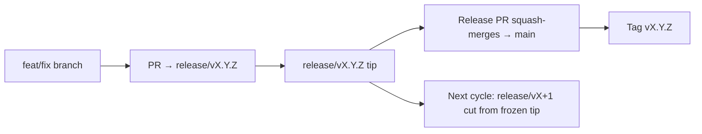

# Branching & Release Model (తెలుగు)

🌐 **Languages:** 🇺🇸 [English](../../../../ops/BRANCHING_MODEL.md) · 🇪🇹 [am](../../../am/docs/ops/BRANCHING_MODEL.md) · 🇸🇦 [ar](../../../ar/docs/ops/BRANCHING_MODEL.md) · 🇦🇿 [az](../../../az/docs/ops/BRANCHING_MODEL.md) · 🇧🇬 [bg](../../../bg/docs/ops/BRANCHING_MODEL.md) · 🇧🇩 [bn](../../../bn/docs/ops/BRANCHING_MODEL.md) · 🇨🇿 [cs](../../../cs/docs/ops/BRANCHING_MODEL.md) · 🇩🇰 [da](../../../da/docs/ops/BRANCHING_MODEL.md) · 🇩🇪 [de](../../../de/docs/ops/BRANCHING_MODEL.md) · 🇬🇷 [el](../../../el/docs/ops/BRANCHING_MODEL.md) · 🇪🇸 [es](../../../es/docs/ops/BRANCHING_MODEL.md) · 🇪🇪 [et](../../../et/docs/ops/BRANCHING_MODEL.md) · 🇮🇷 [fa](../../../fa/docs/ops/BRANCHING_MODEL.md) · 🇫🇮 [fi](../../../fi/docs/ops/BRANCHING_MODEL.md) · 🇫🇷 [fr](../../../fr/docs/ops/BRANCHING_MODEL.md) · 🇮🇪 [ga](../../../ga/docs/ops/BRANCHING_MODEL.md) · 🇮🇳 [gu](../../../gu/docs/ops/BRANCHING_MODEL.md) · 🇳🇬 [ha](../../../ha/docs/ops/BRANCHING_MODEL.md) · 🇮🇱 [he](../../../he/docs/ops/BRANCHING_MODEL.md) · 🇮🇳 [hi](../../../hi/docs/ops/BRANCHING_MODEL.md) · 🇭🇷 [hr](../../../hr/docs/ops/BRANCHING_MODEL.md) · 🇭🇺 [hu](../../../hu/docs/ops/BRANCHING_MODEL.md) · 🇦🇲 [hy](../../../hy/docs/ops/BRANCHING_MODEL.md) · 🇮🇩 [id](../../../id/docs/ops/BRANCHING_MODEL.md) · 🇳🇬 [ig](../../../ig/docs/ops/BRANCHING_MODEL.md) · 🇮🇹 [it](../../../it/docs/ops/BRANCHING_MODEL.md) · 🇯🇵 [ja](../../../ja/docs/ops/BRANCHING_MODEL.md) · 🇬🇪 [ka](../../../ka/docs/ops/BRANCHING_MODEL.md) · 🇰🇭 [km](../../../km/docs/ops/BRANCHING_MODEL.md) · 🇮🇳 [kn](../../../kn/docs/ops/BRANCHING_MODEL.md) · 🇰🇷 [ko](../../../ko/docs/ops/BRANCHING_MODEL.md) · 🇱🇹 [lt](../../../lt/docs/ops/BRANCHING_MODEL.md) · 🇱🇻 [lv](../../../lv/docs/ops/BRANCHING_MODEL.md) · 🇮🇳 [ml](../../../ml/docs/ops/BRANCHING_MODEL.md) · 🇮🇳 [mr](../../../mr/docs/ops/BRANCHING_MODEL.md) · 🇲🇾 [ms](../../../ms/docs/ops/BRANCHING_MODEL.md) · 🇲🇹 [mt](../../../mt/docs/ops/BRANCHING_MODEL.md) · 🇲🇲 [my](../../../my/docs/ops/BRANCHING_MODEL.md) · 🇳🇵 [ne](../../../ne/docs/ops/BRANCHING_MODEL.md) · 🇳🇱 [nl](../../../nl/docs/ops/BRANCHING_MODEL.md) · 🇳🇴 [no](../../../no/docs/ops/BRANCHING_MODEL.md) · 🇮🇳 [or](../../../or/docs/ops/BRANCHING_MODEL.md) · 🇮🇳 [pa](../../../pa/docs/ops/BRANCHING_MODEL.md) · 🇵🇭 [phi](../../../phi/docs/ops/BRANCHING_MODEL.md) · 🇵🇱 [pl](../../../pl/docs/ops/BRANCHING_MODEL.md) · 🇵🇹 [pt](../../../pt/docs/ops/BRANCHING_MODEL.md) · 🇧🇷 [pt-BR](../../../pt-BR/docs/ops/BRANCHING_MODEL.md) · 🇷🇴 [ro](../../../ro/docs/ops/BRANCHING_MODEL.md) · 🇷🇺 [ru](../../../ru/docs/ops/BRANCHING_MODEL.md) · 🇱🇰 [si](../../../si/docs/ops/BRANCHING_MODEL.md) · 🇸🇰 [sk](../../../sk/docs/ops/BRANCHING_MODEL.md) · 🇸🇮 [sl](../../../sl/docs/ops/BRANCHING_MODEL.md) · 🇷🇸 [sr](../../../sr/docs/ops/BRANCHING_MODEL.md) · 🇸🇪 [sv](../../../sv/docs/ops/BRANCHING_MODEL.md) · 🇰🇪 [sw](../../../sw/docs/ops/BRANCHING_MODEL.md) · 🇮🇳 [ta](../../../ta/docs/ops/BRANCHING_MODEL.md) · 🇹🇭 [th](../../../th/docs/ops/BRANCHING_MODEL.md) · 🇹🇷 [tr](../../../tr/docs/ops/BRANCHING_MODEL.md) · 🇺🇦 [uk-UA](../../../uk-UA/docs/ops/BRANCHING_MODEL.md) · 🇵🇰 [ur](../../../ur/docs/ops/BRANCHING_MODEL.md) · 🇺🇿 [uz](../../../uz/docs/ops/BRANCHING_MODEL.md) · 🇻🇳 [vi](../../../vi/docs/ops/BRANCHING_MODEL.md) · 🇳🇬 [yo](../../../yo/docs/ops/BRANCHING_MODEL.md) · 🇨🇳 [zh-CN](../../../zh-CN/docs/ops/BRANCHING_MODEL.md) · 🇹🇼 [zh-TW](../../../zh-TW/docs/ops/BRANCHING_MODEL.md)

---

OmniRoute **సమాంతర-చక్రం** విడుదల నమూనాను ఉపయోగిస్తుంది: సక్రియ చక్రం కోసం ప్రత్యేకమైన `release/vX.Y.Z`
బ్రాంచ్, ప్రచురించిన లైన్ కోసం `main`, అలాగే ఆ చక్రం విడుదలైనప్పుడు మార్చలేని
`vX.Y.Z` ట్యాగ్. కమిట్లు `release/*` _మరియు_ `main` రెండింటిలోనూ కనిపించడం
సహజమే — అది పొరపాటు కాదు.

నిర్వాహకుల కోసం వివరణాత్మక సమాచారం `CLAUDE.md` (కఠిన నియమం #21) మరియు
[RELEASE_CHECKLIST.md](./RELEASE_CHECKLIST.md)లో ఉంది. ఈ పేజీ కంట్రిబ్యూటర్ల కోసం ఉద్దేశించిన
పబ్లిక్ సారాంశం.

## ఒక చూపులో

| రెఫ్              | పాత్ర                                                                                      |
| ----------------- | ------------------------------------------------------------------------------------------ |
| `release/vX.Y.Z`  | **సక్రియ చక్రం** — ఆ వెర్షన్కు రోజువారీ అభివృద్ధి మరియు PR విలీనాలు                        |
| `main`            | **ప్రచురించిన లైన్** — విడుదల జరిగినప్పుడు స్క్వాష్-మెర్జ్ ద్వారా చక్రాన్ని స్వీకరిస్తుంది |
| `vX.Y.Z` (ట్యాగ్) | **విడుదల గుర్తు** — విడుదల సమయంలో సృష్టించే, మార్చలేని “విడుదలైనది ఏమిటి” అనే పాయింటర్     |



## నా PR ఏ బ్రాంచ్ను లక్ష్యంగా చేసుకోవాలి?

**సక్రియ `release/vX.Y.Z` బ్రాంచ్ను లక్ష్యంగా చేసుకోండి — `main`ను కాదు.**

1. తెరిచి ఉన్న అత్యధిక `release/v*` బ్రాంచ్ను కనుగొనండి (ఈ పత్రం రాసే సమయానికి ఉదాహరణ:
   `release/v3.8.49`).
2. ఆ టిప్ నుండి బ్రాంచ్ను సృష్టించండి (`git fetch` + checkout / దానిపై rebase).
3. **base = ఆ `release/vX.Y.Z`**గా ఉంచి PRను తెరవండి.

`main` రోజువారీ ఇంటిగ్రేషన్ బ్రాంచ్ కాదు. `main`ను లక్ష్యంగా చేసుకుని తెరిచిన PRలను
సాధారణంగా విలీనం చేసే ముందు వేరే బ్రాంచ్కు మళ్లించాలి.

## విడుదల ఫ్రీజ్ (సమాంతర చక్రాలు)

ఒక విడుదలను సమన్వయం చేస్తున్నప్పుడు, `release-freeze` లేబుల్తో ఒక మార్కర్ issue
తెరవబడుతుంది. అది **అభివృద్ధిని ఆపదు**:

- ఫ్రీజ్ చేసిన `release/vX.Y.Z` ఆ విడుదలకు బాధ్యత వహించే release captain అధీనంలో ఉంటుంది.
- కంట్రిబ్యూటర్లు తమ పనిని విలీనం చేస్తూనే ఉండేలా, తదుపరి చక్రపు `release/vX+1`ను ఫ్రీజ్ చేసిన టిప్ నుండి
  సృష్టిస్తారు.
- ఇంకా ఫ్రీజ్ చేసిన బ్రాంచ్ను లక్ష్యంగా చేసుకున్న తెరిచి ఉన్న PRలను సక్రియంగా ఉన్న (అత్యధిక)
  `release/v*` బ్రాంచ్కు **మళ్లించాలి**.

మీరు కోరుకునే బ్రాంచ్లో విలీనం చేయవచ్చని భావించే ముందు, తెరిచి ఉన్న ఫ్రీజ్ ఉందేమో తనిఖీ చేయండి:

```bash
gh issue list --repo diegosouzapw/OmniRoute --label release-freeze --state open
```

విలీన విధానాలు (యజమాని `queue` లేబుల్ → Mergify) గురించి
[MERGE_TRAIN.md](./MERGE_TRAIN.md)లో వివరించబడింది.

## బ్రాంచ్ మరియు ట్యాగ్ రెండూ ఎందుకు?

| ఆర్టిఫ్యాక్ట్    | జీవితకాలం          | ఉద్దేశ్యం                                                                    |
| ---------------- | ------------------ | ---------------------------------------------------------------------------- |
| `release/vX.Y.Z` | కొనసాగుతున్న చక్రం | సమీక్షించిన PRలను సేకరిస్తుంది, CIను విజయవంతంగా ఉంచుతుంది, PR baseగా ఉంటుంది |
| ట్యాగ్ `vX.Y.Z`  | శాశ్వతం            | npm / GitHub Releasesకు విడుదలైన ఖచ్చితమైన బిట్లను గుర్తిస్తుంది             |

బ్రాంచ్ అనేది పనివేదిక; ట్యాగ్ అనేది సీల్ చేసిన ప్యాకేజ్. `main`కు స్క్వాష్-మెర్జ్ చేసిన తర్వాత,
మునుపటి విడుదల PR పూర్తయ్యే వరకు వేచి ఉండకుండానే తదుపరి చక్రం `release/vX+1`పై కొనసాగుతుంది.

## సంబంధిత పత్రాలు

- [CONTRIBUTING.md](../../CONTRIBUTING.md) — సెటప్, పరీక్షలు, PR చెక్లిస్ట్
- [RELEASE_CHECKLIST.md](./RELEASE_CHECKLIST.md) — విడుదలకు ముందరి ధ్రువీకరణ
- [MERGE_TRAIN.md](./MERGE_TRAIN.md) — విలీన క్యూ మరియు ప్రత్యామ్నాయ ట్రైన్
- [RELEASE_GREEN.md](./RELEASE_GREEN.md) — విడుదల టిప్ను విజయవంతమైన స్థితిలో ఉంచడం
