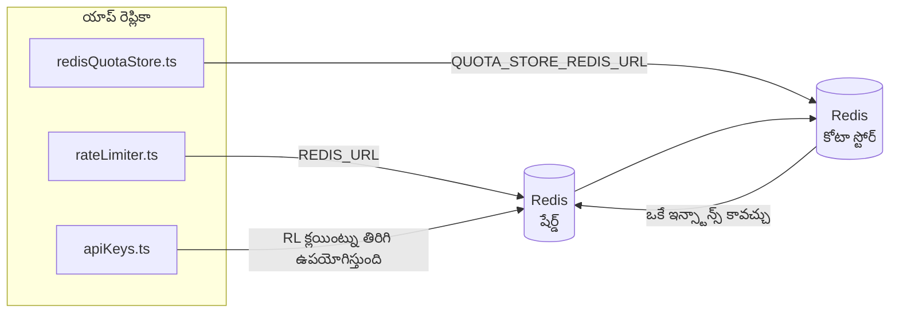

# Redis Production Configuration Guide (తెలుగు)

🌐 **Languages:** 🇺🇸 [English](../../../../ops/REDIS_PRODUCTION_CONFIG.md) · 🇪🇹 [am](../../../am/docs/ops/REDIS_PRODUCTION_CONFIG.md) · 🇸🇦 [ar](../../../ar/docs/ops/REDIS_PRODUCTION_CONFIG.md) · 🇦🇿 [az](../../../az/docs/ops/REDIS_PRODUCTION_CONFIG.md) · 🇧🇬 [bg](../../../bg/docs/ops/REDIS_PRODUCTION_CONFIG.md) · 🇧🇩 [bn](../../../bn/docs/ops/REDIS_PRODUCTION_CONFIG.md) · 🇨🇿 [cs](../../../cs/docs/ops/REDIS_PRODUCTION_CONFIG.md) · 🇩🇰 [da](../../../da/docs/ops/REDIS_PRODUCTION_CONFIG.md) · 🇩🇪 [de](../../../de/docs/ops/REDIS_PRODUCTION_CONFIG.md) · 🇬🇷 [el](../../../el/docs/ops/REDIS_PRODUCTION_CONFIG.md) · 🇪🇸 [es](../../../es/docs/ops/REDIS_PRODUCTION_CONFIG.md) · 🇪🇪 [et](../../../et/docs/ops/REDIS_PRODUCTION_CONFIG.md) · 🇮🇷 [fa](../../../fa/docs/ops/REDIS_PRODUCTION_CONFIG.md) · 🇫🇮 [fi](../../../fi/docs/ops/REDIS_PRODUCTION_CONFIG.md) · 🇫🇷 [fr](../../../fr/docs/ops/REDIS_PRODUCTION_CONFIG.md) · 🇮🇪 [ga](../../../ga/docs/ops/REDIS_PRODUCTION_CONFIG.md) · 🇮🇳 [gu](../../../gu/docs/ops/REDIS_PRODUCTION_CONFIG.md) · 🇳🇬 [ha](../../../ha/docs/ops/REDIS_PRODUCTION_CONFIG.md) · 🇮🇱 [he](../../../he/docs/ops/REDIS_PRODUCTION_CONFIG.md) · 🇮🇳 [hi](../../../hi/docs/ops/REDIS_PRODUCTION_CONFIG.md) · 🇭🇷 [hr](../../../hr/docs/ops/REDIS_PRODUCTION_CONFIG.md) · 🇭🇺 [hu](../../../hu/docs/ops/REDIS_PRODUCTION_CONFIG.md) · 🇦🇲 [hy](../../../hy/docs/ops/REDIS_PRODUCTION_CONFIG.md) · 🇮🇩 [id](../../../id/docs/ops/REDIS_PRODUCTION_CONFIG.md) · 🇳🇬 [ig](../../../ig/docs/ops/REDIS_PRODUCTION_CONFIG.md) · 🇮🇹 [it](../../../it/docs/ops/REDIS_PRODUCTION_CONFIG.md) · 🇯🇵 [ja](../../../ja/docs/ops/REDIS_PRODUCTION_CONFIG.md) · 🇬🇪 [ka](../../../ka/docs/ops/REDIS_PRODUCTION_CONFIG.md) · 🇰🇭 [km](../../../km/docs/ops/REDIS_PRODUCTION_CONFIG.md) · 🇮🇳 [kn](../../../kn/docs/ops/REDIS_PRODUCTION_CONFIG.md) · 🇰🇷 [ko](../../../ko/docs/ops/REDIS_PRODUCTION_CONFIG.md) · 🇱🇹 [lt](../../../lt/docs/ops/REDIS_PRODUCTION_CONFIG.md) · 🇱🇻 [lv](../../../lv/docs/ops/REDIS_PRODUCTION_CONFIG.md) · 🇮🇳 [ml](../../../ml/docs/ops/REDIS_PRODUCTION_CONFIG.md) · 🇮🇳 [mr](../../../mr/docs/ops/REDIS_PRODUCTION_CONFIG.md) · 🇲🇾 [ms](../../../ms/docs/ops/REDIS_PRODUCTION_CONFIG.md) · 🇲🇹 [mt](../../../mt/docs/ops/REDIS_PRODUCTION_CONFIG.md) · 🇲🇲 [my](../../../my/docs/ops/REDIS_PRODUCTION_CONFIG.md) · 🇳🇵 [ne](../../../ne/docs/ops/REDIS_PRODUCTION_CONFIG.md) · 🇳🇱 [nl](../../../nl/docs/ops/REDIS_PRODUCTION_CONFIG.md) · 🇳🇴 [no](../../../no/docs/ops/REDIS_PRODUCTION_CONFIG.md) · 🇮🇳 [or](../../../or/docs/ops/REDIS_PRODUCTION_CONFIG.md) · 🇮🇳 [pa](../../../pa/docs/ops/REDIS_PRODUCTION_CONFIG.md) · 🇵🇭 [phi](../../../phi/docs/ops/REDIS_PRODUCTION_CONFIG.md) · 🇵🇱 [pl](../../../pl/docs/ops/REDIS_PRODUCTION_CONFIG.md) · 🇵🇹 [pt](../../../pt/docs/ops/REDIS_PRODUCTION_CONFIG.md) · 🇧🇷 [pt-BR](../../../pt-BR/docs/ops/REDIS_PRODUCTION_CONFIG.md) · 🇷🇴 [ro](../../../ro/docs/ops/REDIS_PRODUCTION_CONFIG.md) · 🇷🇺 [ru](../../../ru/docs/ops/REDIS_PRODUCTION_CONFIG.md) · 🇱🇰 [si](../../../si/docs/ops/REDIS_PRODUCTION_CONFIG.md) · 🇸🇰 [sk](../../../sk/docs/ops/REDIS_PRODUCTION_CONFIG.md) · 🇸🇮 [sl](../../../sl/docs/ops/REDIS_PRODUCTION_CONFIG.md) · 🇷🇸 [sr](../../../sr/docs/ops/REDIS_PRODUCTION_CONFIG.md) · 🇸🇪 [sv](../../../sv/docs/ops/REDIS_PRODUCTION_CONFIG.md) · 🇰🇪 [sw](../../../sw/docs/ops/REDIS_PRODUCTION_CONFIG.md) · 🇮🇳 [ta](../../../ta/docs/ops/REDIS_PRODUCTION_CONFIG.md) · 🇹🇭 [th](../../../th/docs/ops/REDIS_PRODUCTION_CONFIG.md) · 🇹🇷 [tr](../../../tr/docs/ops/REDIS_PRODUCTION_CONFIG.md) · 🇺🇦 [uk-UA](../../../uk-UA/docs/ops/REDIS_PRODUCTION_CONFIG.md) · 🇵🇰 [ur](../../../ur/docs/ops/REDIS_PRODUCTION_CONFIG.md) · 🇺🇿 [uz](../../../uz/docs/ops/REDIS_PRODUCTION_CONFIG.md) · 🇻🇳 [vi](../../../vi/docs/ops/REDIS_PRODUCTION_CONFIG.md) · 🇳🇬 [yo](../../../yo/docs/ops/REDIS_PRODUCTION_CONFIG.md) · 🇨🇳 [zh-CN](../../../zh-CN/docs/ops/REDIS_PRODUCTION_CONFIG.md) · 🇹🇼 [zh-TW](../../../zh-TW/docs/ops/REDIS_PRODUCTION_CONFIG.md)

---

## అవలోకనం

OmniRouteలో Redis ఒక **ఐచ్ఛికమైన, సాఫ్ట్ డిపెండెన్సీ** — Redis అందుబాటులో లేనప్పుడు అప్లికేషన్ సునాయాసంగా దిగువ స్థాయి ప్రత్యామ్నాయాలకు (ఇన్-మెమరీ
ఫాల్బ్యాక్లకు) మారుతుంది. ప్రొడక్షన్లో, Redisను ట్యూన్ చేయడం నాలుగు వేర్వేరు
వర్క్లోడ్ల లేటెన్సీని తగ్గిస్తుంది:

| వర్క్లోడ్                 | డ్రైవర్                       | క్లయింట్ ఫ్యాక్టరీ                             | కీ నమూనా                                              |
| ------------------------- | ----------------------------- | ---------------------------------------------- | ----------------------------------------------------- |
| రేట్ పరిమితి              | `rateLimiter.ts`              | `getRedisClient()` — లేజీ `ioredis` సింగిల్టన్ | `<prefix>rl:*` Lua‑అటామిక్ రేట్ పరిమితి విండోలు       |
| ప్రామాణీకరణ క్యాష్        | `apiKeys.ts`                  | `rateLimiter` క్లయింట్ను తిరిగి ఉపయోగిస్తుంది  | TTLతో `<prefix>auth:api_key:<sha256>`                 |
| కోటా స్టోర్               | `redisQuotaStore.ts`          | ప్రత్యేక `getRedisClient(url)` సింగిల్టన్      | ప్రతి ఇన్స్టాన్స్కు కాన్ఫిగర్ చేయగల `<prefix>quota:*` |
| వార్మప్ సర్క్యూట్ బ్రేకర్ | `redisCircuitBreakerStore.ts` | `circuitBreakerFactory.ts`లో ప్రత్యేక క్లయింట్ | `<prefix>warmup:cb:<connectionId>`                    |

OmniRoute ఒకే Redis ఇన్స్టాన్స్ను (ఉదా. `127.0.0.1:6379`) ఇతర యాప్లతో కలిసి ఉపయోగించగలిగేలా, ఈ నాలుగు వర్క్లోడ్లు ఒకే నేమ్స్పేస్ ప్రిఫిక్స్ను పంచుకుంటాయి.
[కీ నేమ్స్పేసింగ్](#key-namespacing) చూడండి.

---

## ప్రస్తుత కాన్ఫిగరేషన్ (కోడ్ డిఫాల్ట్లు)

| సెట్టింగ్                                        | విలువ                                                           | స్థానం                                                                                |
| ------------------------------------------------ | --------------------------------------------------------------- | ------------------------------------------------------------------------------------- |
| `REDIS_URL` ఎన్విరాన్మెంట్ వేరియబుల్             | `redis://redis:6379` (compose), ఐచ్ఛికం                         | `rateLimiter.ts:5`, `.env.example`                                                    |
| `REDIS_KEY_PREFIX` ఎన్విరాన్మెంట్ వేరియబుల్      | `omniroute:` (డిఫాల్ట్)                                         | `rateLimiter.ts`, `redisQuotaStore.ts`, `redisCircuitBreakerStore.ts`, `.env.example` |
| `QUOTA_STORE_REDIS_URL` ఎన్విరాన్మెంట్ వేరియబుల్ | ప్రత్యేకమైనది, `REDIS_URL`కు భిన్నంగా ఉండవచ్చు                  | `quota/storeFactory.ts`                                                               |
| `QUOTA_STORE_DRIVER`                             | `"sqlite"` (డిఫాల్ట్), `"redis"` ఐచ్ఛికం                        | `quota/storeFactory.ts`                                                               |
| ioredis `maxRetriesPerRequest`                   | `3`                                                             | `rateLimiter.ts` క్లయింట్ సృష్టి                                                      |
| `enableReadyCheck`                               | సెట్ చేయబడలేదు (ioredis డిఫాల్ట్: `true`)                       | —                                                                                     |
| `lazyConnect`                                    | సెట్ చేయబడలేదు (ioredis డిఫాల్ట్: `false`)                      | —                                                                                     |
| `retryStrategy`                                  | సెట్ చేయబడలేదు (ioredis డిఫాల్ట్: 200ms బేస్, ఎక్స్పోనెన్షియల్) | —                                                                                     |
| TLS / పాస్వర్డ్ / DB ఇండెక్స్                    | **కాన్ఫిగర్ చేయబడలేదు**                                         | —                                                                                     |
| Sentinel / Cluster                               | **కాన్ఫిగర్ చేయబడలేదు** — స్వతంత్ర సింగిల్-నోడ్ మాత్రమే         | —                                                                                     |

---

## కీ నేమ్స్పేసింగ్

OmniRoute, హోస్ట్పై రన్ అయ్యే ఇతర వాటితో Redis ఇన్స్టాన్స్ను పంచుకుంటుంది. నేమ్స్పేస్ లేకుండా,
`auth:api_key:<sha256>` లేదా `rl:*` వంటి కీలు అదే Redisను ఉపయోగించే ఇతర అప్లికేషన్ల కీలతో
ఘర్షణ పడవచ్చు (ఈ ఇన్స్టాన్స్ ఇతర సర్వీస్లతో పాటు `127.0.0.1:6379`పై Redisను రన్ చేస్తుంది).

**ప్రతి** OmniRoute కీకి ప్రిఫిక్స్ను జోడించడానికి `REDIS_KEY_PREFIX`ను ఖాళీ కాని స్ట్రింగ్కు సెట్ చేయండి:

```bash
# .env — అన్ని OmniRoute కీలు omniroute:rl:*, omniroute:auth:*, omniroute:quota:*, omniroute:warmup:cb:*గా మారతాయి
REDIS_KEY_PREFIX=omniroute:
```

- **డిఫాల్ట్:** `omniroute:` (`REDIS_KEY_PREFIX` సెట్ చేయనప్పుడు లేదా ఖాళీగా ఉన్నప్పుడు వర్తింపజేయబడుతుంది).
- **దీనికి వర్తిస్తుంది:** రేట్ లిమిటర్ + ప్రామాణీకరణ క్యాష్ (`keyPrefix` ద్వారా పంచుకున్న `ioredis` క్లయింట్) మరియు
  కోటా స్టోర్ (`KEY_PREFIX = "${REDIS_KEY_PREFIX}quota"`) మరియు వార్మప్ సర్క్యూట్ బ్రేకర్
  (`KEY_PREFIX = "${REDIS_KEY_PREFIX}warmup:cb:"`).
- Redisలో కీలు ఇప్పటికే ఉన్నప్పుడు **ప్రిఫిక్స్ను మార్చడం** పాత కీలను అనాథలుగా వదిలివేస్తుంది (అవి
  TTL / LRU ద్వారా గడువు ముగుస్తాయి). మార్చడం సురక్షితం; మైగ్రేషన్ అవసరం లేదు. ఒక మినహాయింపు ఏమిటంటే,
  నిషేధించబడినదిగా గుర్తించిన కనెక్షన్కు సంబంధించిన వార్మప్ సర్క్యూట్-బ్రేకర్ కీ: అది TTL లేకుండా శాశ్వతంగా నిల్వ చేయబడుతుంది, కాబట్టి
  మిగిలిపోయిన వాటిని `redis-cli --scan --pattern '<old-prefix>warmup:cb:*'`తో జాబితా చేసి తొలగించండి.
- **ioredis `keyPrefix`** రైట్స్ సమయంలో ప్రిఫిక్స్ను స్వయంచాలకంగా ముందుంచి, రీడ్స్ సమయంలో దాన్ని తొలగిస్తుంది,
  కాబట్టి అప్లికేషన్ కోడ్కు ప్రిఫిక్స్ ఎప్పుడూ కనిపించదు.

---

## సిఫార్సు చేసిన ప్రొడక్షన్ ట్యూనింగ్

### 1. కనెక్షన్ పూల్ / క్లయింట్ ఎంపికలు (ioredis `Redis` కన్స్ట్రక్టర్)

ప్రస్తుత కోడ్ ఎలాంటి కస్టమ్ ఎంపికలు లేకుండా ఒకే `new Redis(url)`ను సృష్టిస్తుంది. ప్రొడక్షన్
మల్టీ-రెప్లికా డిప్లాయ్మెంట్ల కోసం, కోడ్లో క్లయింట్ ఫ్యాక్టరీని పాస్ చేయండి లేదా `getRedisClient()`ను ర్యాప్ చేయండి:

```typescript
const redis = new Redis(REDIS_URL, {
  maxRetriesPerRequest: null, // రీట్రై పరిమితి లేదు; retryStrategy నిర్ణయించనివ్వండి
  enableReadyCheck: true, // కాల్లను అంగీకరించే ముందు సర్వర్ సిద్ధంగా ఉందో ధృవీకరించండి
  lazyConnect: true, // నిర్మాణ సమయంలో కనెక్ట్ చేయవద్దు; మొదటి కాల్ వరకు వేచి ఉండండి
  retryStrategy: (times) => {
    if (times > 10) return null; // 10 రీట్రైల తర్వాత విరమించండి → తర్వాత మళ్లీ కనెక్ట్ చేయండి
    return Math.min(times * 200, 5000); // 200ms, 400ms, …, గరిష్ఠంగా 5s
  },
  enableAutoPipelining: true, // ఏకకాలిక కమాండ్లను ఒకే TCP రైట్గా కలపండి
  keepAlive: 10000, // ప్రతి 10sకు TCP keep-alive
});
```

**ముఖ్యమైన ట్రేడ్-ఆఫ్లు:**

- `maxRetriesPerRequest: null` + `retryStrategy` — తాత్కాలిక Redis పునఃప్రారంభాలు ప్రతి అభ్యర్థనను
  వెంటనే విఫలం చేయకుండా ఉండేందుకు ప్రొడక్షన్లో ప్రాధాన్యమివ్వబడుతుంది. `checkRateLimit()`లోని
  ఇన్-మెమరీ ఫాల్బ్యాక్ వైఫల్య మార్గాన్ని నిర్వహిస్తుంది.
- `lazyConnect: true` — సర్వర్ కనెక్షన్లను అంగీకరించడం ప్రారంభించే ముందు Redis అందుబాటులో ఉండాలనే
  స్టార్టప్ డిపెండెన్సీని నివారిస్తుంది.
- `enableAutoPipelining: true` — ఏకకాలిక రేట్-లిమిట్ తనిఖీల రౌండ్-ట్రిప్లను తగ్గిస్తుంది;
  ఒకే కనెక్షన్పై >50 RPS ఉన్నప్పుడు ప్రయోజనకరం.

### 2. Redis సర్వర్ కాన్ఫిగరేషన్ (`redis.conf`)

```
# మెమరీ
maxmemory 80%                        # OS పేజ్ క్యాష్ కోసం స్థలం వదిలివేయండి
maxmemory-policy allkeys-lru         # ఒత్తిడిలో పాత auth క్యాష్ ఎంట్రీలను తొలగించండి

# పెర్సిస్టెన్స్ (ఐచ్ఛికం — ఇది లేకుండానే OmniRoute క్రాష్-సురక్షితం)
save 300 1                           # ≥1 కీ మారితే కనీసం ప్రతి 5 నిమిషాలకు స్నాప్షాట్ తీసుకోండి
appendonly no                        # AOF అవసరం లేదు; డేటాను మళ్లీ రూపొందించవచ్చు
appendfsync no                       # fsync ఓవర్హెడ్ లేదు (RDB సరిపోతుంది)

# నెట్వర్కింగ్
timeout 0                            # ఐడిల్ డిస్కనెక్ట్ లేదు
tcp-keepalive 300                    # 5 నిమిషాల keep-alive
tcp-backlog 511                      # ఆకస్మిక లోడ్ కోసం కనెక్షన్ బ్యాక్లాగ్

# పనితీరు
hz 10                                # డిఫాల్ట్; లేటెన్సీకి సున్నితమైన సందర్భాల్లో 100
activedefrag yes                     # ఫ్రాగ్మెంటేషన్ >10% అయినప్పుడు స్వయంచాలకంగా డీఫ్రాగ్మెంట్ చేయండి
```

**`maxmemory-policy allkeys-lru` కోసం ట్రేడ్-ఆఫ్:** మెమరీ ఒత్తిడిలో Auth క్యాష్ ఎంట్రీలు
తొలగించబడవచ్చు. ఇది సురక్షితం — మిస్ అయినప్పుడు `setCachedApiKey` ఎల్లప్పుడూ మళ్లీ నింపుతుంది, అలాగే
SQLite ఫాల్బ్యాక్ ప్రామాణిక మూలంగా ఉంటుంది. రేట్-లిమిటర్ Lua స్క్రిప్ట్ రూపకల్పన ప్రకారమే
స్వల్పకాలం మాత్రమే ఉండే చిన్న కీలను సృష్టిస్తుంది.

### 3. Docker Compose సెట్టింగ్లు

ప్రొడక్షన్ compose (`docker-compose.prod.yml`) `redis:8.6.2-alpine`ను ఉపయోగిస్తుంది. దీన్ని జోడించండి:

```yaml
redis:
  image: redis:8.6.2-alpine
  command:
    [
      "redis-server",
      "--maxmemory",
      "512mb",
      "--maxmemory-policy",
      "allkeys-lru",
      "--activedefrag",
      "yes",
      "--save",
      "300 1",
    ]
  healthcheck:
    test: ["CMD", "redis-cli", "ping"]
    interval: 10s
    timeout: 3s
    retries: 3
    start_period: 5s
```

### 4. మల్టీ-ఇన్స్టాన్స్ / స్కేలింగ్ పరిగణనలు

**అన్ని రెప్లికాల కోసం ఒకే Redis** — రేట్-లిమిటర్ Lua స్క్రిప్ట్ ఒకే ప్రామాణిక కీ స్పేస్పై
ఆధారపడుతుంది. రెప్లికాల వెనుక అనేక Redis ఇన్స్టాన్స్లను ఉపయోగిస్తే అటామిసిటీ కోల్పోయి
బడ్జెట్ రెట్టింపవుతుంది. అన్ని అప్లికేషన్ రెప్లికాల కోసం ఒకే Redisను (లేదా ఫెయిల్ఓవర్తో కూడిన Redis Sentinel క్లస్టర్ను)
ఉపయోగించండి.

**కనెక్షన్ల సంఖ్య:** ప్రతి అప్లికేషన్ రెప్లికా Redisకు **2 TCP కనెక్షన్లను** తెరుస్తుంది
(రేట్ లిమిటర్ క్లయింట్ + కోటా స్టోర్ క్లయింట్). 10 రెప్లికాల వద్ద → 20 కనెక్షన్లు, ఇది
డిఫాల్ట్ Redis ఇన్స్టాన్స్లోని 10k కనెక్షన్ల గరిష్ఠ పరిమితికి చాలా తక్కువ.

### 5. మానిటరింగ్

హెల్త్-చెక్ ఎండ్పాయింట్ ద్వారా అందుబాటులో ఉంచండి:

```typescript
// src/app/api/monitoring/health/route.ts ఇప్పటికే rateLimiter ఫంక్షన్లను కాల్ చేస్తుంది
// Redisకు సంబంధించిన తనిఖీలను జోడించండి:
//   1. ioredis .ping() ద్వారా PING లేటెన్సీ
//   2. INFO memory ద్వారా మెమరీ వినియోగం
//   3. INFO clients ద్వారా కనెక్షన్ల సంఖ్య
//   4. maxmemory-policy కోసం హిట్ రేట్ (evicted_keys / keyspace_hits)
```

గమనించాల్సిన ముఖ్యమైన మెట్రిక్స్:

- **సెకనుకు తొలగించబడిన కీలు** — నిరంతరం సున్నా కంటే ఎక్కువగా ఉంటే, `maxmemory`ని పెంచండి
- **బ్లాక్ చేయబడిన క్లయింట్లు** — సున్నా కంటే ఎక్కువగా ఉంటే, నెమ్మదైన Lua స్క్రిప్ట్లు లేదా అధిక కంటెన్షన్ను సూచిస్తుంది
- **తిరస్కరించబడిన కనెక్షన్లు** — కనెక్షన్ పరిమితి చేరుకుంది; 20 కనెక్షన్ల వద్ద ఇది అరుదు

---

## ఆర్కిటెక్చర్ రేఖాచిత్రం



---

## సూచనలు

| ఫైల్                               | ప్రయోజనం                                                                  |
| ---------------------------------- | ------------------------------------------------------------------------- |
| `src/shared/utils/rateLimiter.ts`  | ప్రాథమిక Redis క్లయింట్, Lua రేట్-లిమిట్ స్క్రిప్ట్, ఇన్-మెమరీ ఫాల్బ్యాక్ |
| `src/lib/db/apiKeys.ts`            | ప్రమాణీకరణ క్యాష్ — Redis→SQLite ఫాల్బ్యాక్                               |
| `src/lib/quota/redisQuotaStore.ts` | ఐచ్ఛిక కోటా స్టోర్ కోసం ప్రత్యేక Redis క్లయింట్                           |
| `src/lib/quota/storeFactory.ts`    | `sqlite` మరియు `redis` కోటా డ్రైవర్ల మధ్య మారుతుంది                       |
| `docker-compose.prod.yml`          | ప్రొడక్షన్ Redis కంటైనర్ (`redis:8.6.2-alpine` ఇమేజ్)                     |
| `.env.example`                     | Redis ఎన్విరాన్మెంట్ వేరియబుల్స్ డాక్యుమెంటేషన్                           |
| `src/app/api/local/redis/`         | డెవలప్మెంట్ కంటైనర్ ఆర్కెస్ట్రేషన్ కోసం API రూట్లు                        |
| `bin/cli/commands/redis.mjs`       | డెవలప్మెంట్ కంటైనర్ ఆర్కెస్ట్రేషన్ కోసం CLI కమాండ్లు                      |
