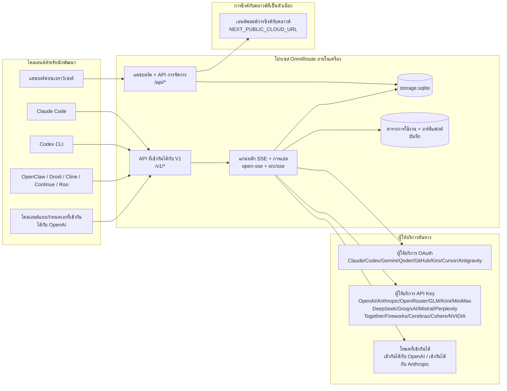
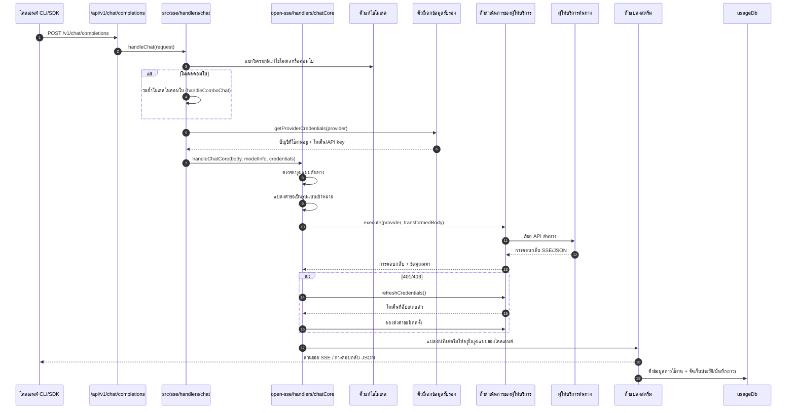
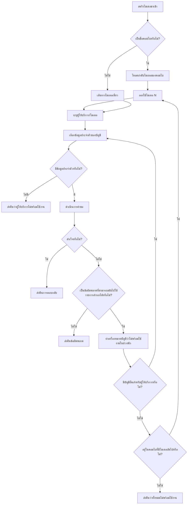
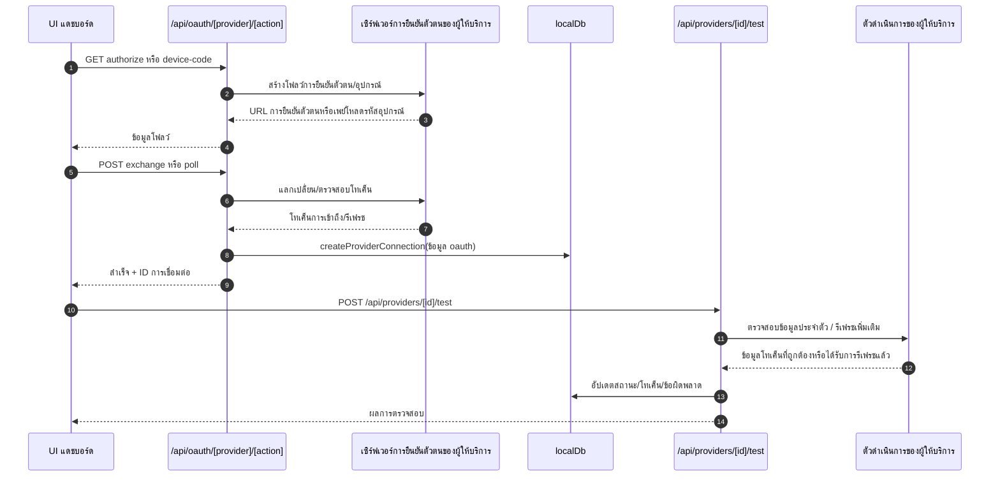
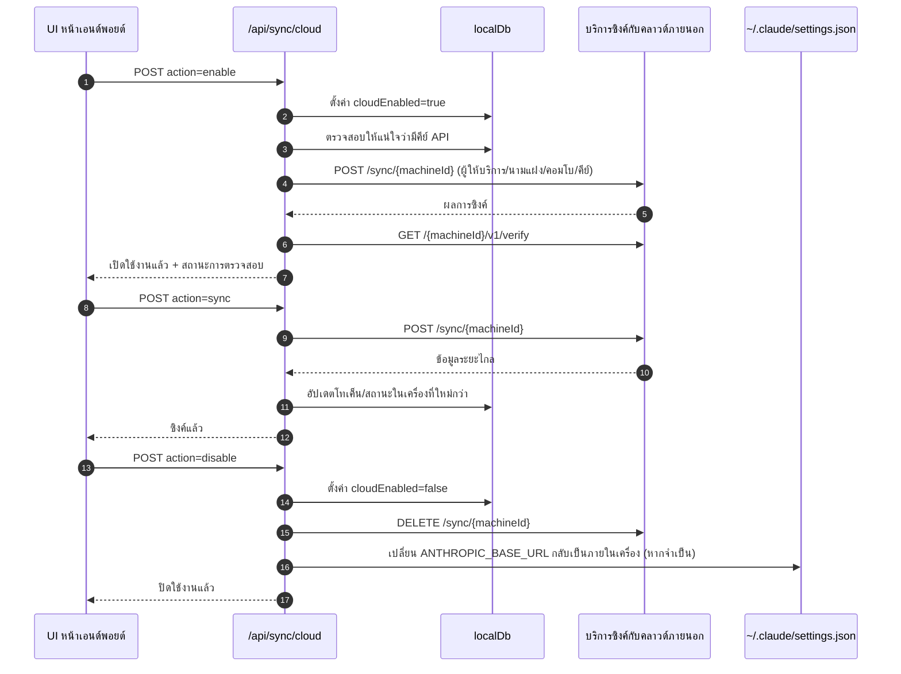
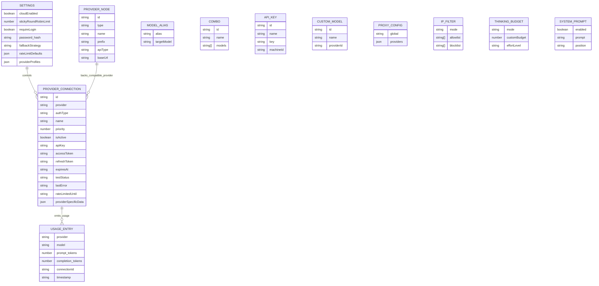
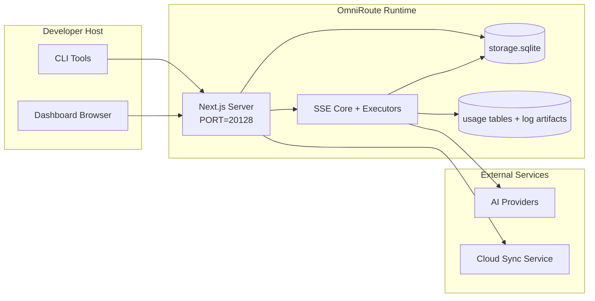

# OmniRoute Architecture (ไทย)

🌐 **Languages:** 🇺🇸 [English](../../../../architecture/ARCHITECTURE.md) · 🇪🇹 [am](../../../am/docs/architecture/ARCHITECTURE.md) · 🇸🇦 [ar](../../../ar/docs/architecture/ARCHITECTURE.md) · 🇦🇿 [az](../../../az/docs/architecture/ARCHITECTURE.md) · 🇧🇬 [bg](../../../bg/docs/architecture/ARCHITECTURE.md) · 🇧🇩 [bn](../../../bn/docs/architecture/ARCHITECTURE.md) · 🇧🇦 [bs](../../../bs/docs/architecture/ARCHITECTURE.md) · 🇨🇿 [cs](../../../cs/docs/architecture/ARCHITECTURE.md) · 🇩🇰 [da](../../../da/docs/architecture/ARCHITECTURE.md) · 🇩🇪 [de](../../../de/docs/architecture/ARCHITECTURE.md) · 🇬🇷 [el](../../../el/docs/architecture/ARCHITECTURE.md) · 🇪🇸 [es](../../../es/docs/architecture/ARCHITECTURE.md) · 🇪🇪 [et](../../../et/docs/architecture/ARCHITECTURE.md) · 🇮🇷 [fa](../../../fa/docs/architecture/ARCHITECTURE.md) · 🇫🇮 [fi](../../../fi/docs/architecture/ARCHITECTURE.md) · 🇫🇷 [fr](../../../fr/docs/architecture/ARCHITECTURE.md) · 🇮🇪 [ga](../../../ga/docs/architecture/ARCHITECTURE.md) · 🇮🇳 [gu](../../../gu/docs/architecture/ARCHITECTURE.md) · 🇳🇬 [ha](../../../ha/docs/architecture/ARCHITECTURE.md) · 🇮🇱 [he](../../../he/docs/architecture/ARCHITECTURE.md) · 🇮🇳 [hi](../../../hi/docs/architecture/ARCHITECTURE.md) · 🇭🇷 [hr](../../../hr/docs/architecture/ARCHITECTURE.md) · 🇭🇺 [hu](../../../hu/docs/architecture/ARCHITECTURE.md) · 🇦🇲 [hy](../../../hy/docs/architecture/ARCHITECTURE.md) · 🇮🇩 [id](../../../id/docs/architecture/ARCHITECTURE.md) · 🇳🇬 [ig](../../../ig/docs/architecture/ARCHITECTURE.md) · 🇮🇹 [it](../../../it/docs/architecture/ARCHITECTURE.md) · 🇯🇵 [ja](../../../ja/docs/architecture/ARCHITECTURE.md) · 🇬🇪 [ka](../../../ka/docs/architecture/ARCHITECTURE.md) · 🇰🇭 [km](../../../km/docs/architecture/ARCHITECTURE.md) · 🇮🇳 [kn](../../../kn/docs/architecture/ARCHITECTURE.md) · 🇰🇷 [ko](../../../ko/docs/architecture/ARCHITECTURE.md) · 🇱🇹 [lt](../../../lt/docs/architecture/ARCHITECTURE.md) · 🇱🇻 [lv](../../../lv/docs/architecture/ARCHITECTURE.md) · 🇮🇳 [ml](../../../ml/docs/architecture/ARCHITECTURE.md) · 🇮🇳 [mr](../../../mr/docs/architecture/ARCHITECTURE.md) · 🇲🇾 [ms](../../../ms/docs/architecture/ARCHITECTURE.md) · 🇲🇹 [mt](../../../mt/docs/architecture/ARCHITECTURE.md) · 🇲🇲 [my](../../../my/docs/architecture/ARCHITECTURE.md) · 🇳🇵 [ne](../../../ne/docs/architecture/ARCHITECTURE.md) · 🇳🇱 [nl](../../../nl/docs/architecture/ARCHITECTURE.md) · 🇳🇴 [no](../../../no/docs/architecture/ARCHITECTURE.md) · 🇮🇳 [or](../../../or/docs/architecture/ARCHITECTURE.md) · 🇮🇳 [pa](../../../pa/docs/architecture/ARCHITECTURE.md) · 🇵🇭 [phi](../../../phi/docs/architecture/ARCHITECTURE.md) · 🇵🇱 [pl](../../../pl/docs/architecture/ARCHITECTURE.md) · 🇵🇹 [pt](../../../pt/docs/architecture/ARCHITECTURE.md) · 🇧🇷 [pt-BR](../../../pt-BR/docs/architecture/ARCHITECTURE.md) · 🇷🇴 [ro](../../../ro/docs/architecture/ARCHITECTURE.md) · 🇷🇺 [ru](../../../ru/docs/architecture/ARCHITECTURE.md) · 🇱🇰 [si](../../../si/docs/architecture/ARCHITECTURE.md) · 🇸🇰 [sk](../../../sk/docs/architecture/ARCHITECTURE.md) · 🇸🇮 [sl](../../../sl/docs/architecture/ARCHITECTURE.md) · 🇷🇸 [sr](../../../sr/docs/architecture/ARCHITECTURE.md) · 🇸🇪 [sv](../../../sv/docs/architecture/ARCHITECTURE.md) · 🇰🇪 [sw](../../../sw/docs/architecture/ARCHITECTURE.md) · 🇮🇳 [ta](../../../ta/docs/architecture/ARCHITECTURE.md) · 🇮🇳 [te](../../../te/docs/architecture/ARCHITECTURE.md) · 🇹🇷 [tr](../../../tr/docs/architecture/ARCHITECTURE.md) · 🇺🇦 [uk-UA](../../../uk-UA/docs/architecture/ARCHITECTURE.md) · 🇵🇰 [ur](../../../ur/docs/architecture/ARCHITECTURE.md) · 🇺🇿 [uz](../../../uz/docs/architecture/ARCHITECTURE.md) · 🇻🇳 [vi](../../../vi/docs/architecture/ARCHITECTURE.md) · 🇳🇬 [yo](../../../yo/docs/architecture/ARCHITECTURE.md) · 🇨🇳 [zh-CN](../../../zh-CN/docs/architecture/ARCHITECTURE.md) · 🇹🇼 [zh-TW](../../../zh-TW/docs/architecture/ARCHITECTURE.md)

---

🌐 **Languages:** 🇺🇸 [English](../../../../architecture/ARCHITECTURE.md) · 🇪🇹 [am](../../../am/docs/architecture/ARCHITECTURE.md) · 🇸🇦 [ar](../../../ar/docs/architecture/ARCHITECTURE.md) · 🇦🇿 [az](../../../az/docs/architecture/ARCHITECTURE.md) · 🇧🇬 [bg](../../../bg/docs/architecture/ARCHITECTURE.md) · 🇧🇩 [bn](../../../bn/docs/architecture/ARCHITECTURE.md) · 🇧🇦 [bs](../../../bs/docs/architecture/ARCHITECTURE.md) · 🇨🇿 [cs](../../../cs/docs/architecture/ARCHITECTURE.md) · 🇩🇰 [da](../../../da/docs/architecture/ARCHITECTURE.md) · 🇩🇪 [de](../../../de/docs/architecture/ARCHITECTURE.md) · 🇬🇷 [el](../../../el/docs/architecture/ARCHITECTURE.md) · 🇪🇸 [es](../../../es/docs/architecture/ARCHITECTURE.md) · 🇪🇪 [et](../../../et/docs/architecture/ARCHITECTURE.md) · 🇮🇷 [fa](../../../fa/docs/architecture/ARCHITECTURE.md) · 🇫🇮 [fi](../../../fi/docs/architecture/ARCHITECTURE.md) · 🇫🇷 [fr](../../../fr/docs/architecture/ARCHITECTURE.md) · 🇮🇪 [ga](../../../ga/docs/architecture/ARCHITECTURE.md) · 🇮🇳 [gu](../../../gu/docs/architecture/ARCHITECTURE.md) · 🇳🇬 [ha](../../../ha/docs/architecture/ARCHITECTURE.md) · 🇮🇱 [he](../../../he/docs/architecture/ARCHITECTURE.md) · 🇮🇳 [hi](../../../hi/docs/architecture/ARCHITECTURE.md) · 🇭🇷 [hr](../../../hr/docs/architecture/ARCHITECTURE.md) · 🇭🇺 [hu](../../../hu/docs/architecture/ARCHITECTURE.md) · 🇦🇲 [hy](../../../hy/docs/architecture/ARCHITECTURE.md) · 🇮🇩 [id](../../../id/docs/architecture/ARCHITECTURE.md) · 🇳🇬 [ig](../../../ig/docs/architecture/ARCHITECTURE.md) · 🇮🇹 [it](../../../it/docs/architecture/ARCHITECTURE.md) · 🇯🇵 [ja](../../../ja/docs/architecture/ARCHITECTURE.md) · 🇬🇪 [ka](../../../ka/docs/architecture/ARCHITECTURE.md) · 🇰🇭 [km](../../../km/docs/architecture/ARCHITECTURE.md) · 🇮🇳 [kn](../../../kn/docs/architecture/ARCHITECTURE.md) · 🇰🇷 [ko](../../../ko/docs/architecture/ARCHITECTURE.md) · 🇱🇹 [lt](../../../lt/docs/architecture/ARCHITECTURE.md) · 🇱🇻 [lv](../../../lv/docs/architecture/ARCHITECTURE.md) · 🇮🇳 [ml](../../../ml/docs/architecture/ARCHITECTURE.md) · 🇮🇳 [mr](../../../mr/docs/architecture/ARCHITECTURE.md) · 🇲🇾 [ms](../../../ms/docs/architecture/ARCHITECTURE.md) · 🇲🇹 [mt](../../../mt/docs/architecture/ARCHITECTURE.md) · 🇲🇲 [my](../../../my/docs/architecture/ARCHITECTURE.md) · 🇳🇵 [ne](../../../ne/docs/architecture/ARCHITECTURE.md) · 🇳🇱 [nl](../../../nl/docs/architecture/ARCHITECTURE.md) · 🇳🇴 [no](../../../no/docs/architecture/ARCHITECTURE.md) · 🇮🇳 [or](../../../or/docs/architecture/ARCHITECTURE.md) · 🇮🇳 [pa](../../../pa/docs/architecture/ARCHITECTURE.md) · 🇵🇭 [phi](../../../phi/docs/architecture/ARCHITECTURE.md) · 🇵🇱 [pl](../../../pl/docs/architecture/ARCHITECTURE.md) · 🇵🇹 [pt](../../../pt/docs/architecture/ARCHITECTURE.md) · 🇧🇷 [pt-BR](../../../pt-BR/docs/architecture/ARCHITECTURE.md) · 🇷🇴 [ro](../../../ro/docs/architecture/ARCHITECTURE.md) · 🇷🇺 [ru](../../../ru/docs/architecture/ARCHITECTURE.md) · 🇱🇰 [si](../../../si/docs/architecture/ARCHITECTURE.md) · 🇸🇰 [sk](../../../sk/docs/architecture/ARCHITECTURE.md) · 🇸🇮 [sl](../../../sl/docs/architecture/ARCHITECTURE.md) · 🇷🇸 [sr](../../../sr/docs/architecture/ARCHITECTURE.md) · 🇸🇪 [sv](../../../sv/docs/architecture/ARCHITECTURE.md) · 🇰🇪 [sw](../../../sw/docs/architecture/ARCHITECTURE.md) · 🇮🇳 [ta](../../../ta/docs/architecture/ARCHITECTURE.md) · 🇮🇳 [te](../../../te/docs/architecture/ARCHITECTURE.md) · 🇹🇷 [tr](../../../tr/docs/architecture/ARCHITECTURE.md) · 🇺🇦 [uk-UA](../../../uk-UA/docs/architecture/ARCHITECTURE.md) · 🇵🇰 [ur](../../../ur/docs/architecture/ARCHITECTURE.md) · 🇺🇿 [uz](../../../uz/docs/architecture/ARCHITECTURE.md) · 🇻🇳 [vi](../../../vi/docs/architecture/ARCHITECTURE.md) · 🇳🇬 [yo](../../../yo/docs/architecture/ARCHITECTURE.md) · 🇨🇳 [zh-CN](../../../zh-CN/docs/architecture/ARCHITECTURE.md) · 🇹🇼 [zh-TW](../../../zh-TW/docs/architecture/ARCHITECTURE.md)

_อัปเดตล่าสุด: 2026-06-28_

## บทสรุปสำหรับผู้บริหาร

OmniRoute คือเกตเวย์กำหนดเส้นทาง AI ภายในเครื่องและแดชบอร์ดที่สร้างขึ้นบน Next.js
โดยมีปลายทางเดียวที่เข้ากันได้กับ OpenAI (`/v1/*`) และกำหนดเส้นทางทราฟฟิกไปยังผู้ให้บริการต้นทางหลายราย พร้อมการแปลงรูปแบบ การสำรองเมื่อเกิดข้อผิดพลาด การรีเฟรชโทเค็น และการติดตามการใช้งาน

ความสามารถหลัก:

- พื้นผิว API ที่เข้ากันได้กับ OpenAI สำหรับ CLI/เครื่องมือ (ผู้ให้บริการ 355 ราย, ตัวดำเนินการ 108 ตัว)
- การแปลงคำขอ/การตอบกลับระหว่างรูปแบบของผู้ให้บริการ
- การสำรองด้วยชุดโมเดล (ลำดับหลายโมเดล)
- ขั้นตอนชุดแบบมีโครงสร้าง (`provider + model + connection`) พร้อมการจัดลำดับขณะรันตาม `compositeTiers`
- การสำรองระดับบัญชี (หลายบัญชีต่อผู้ให้บริการ)
- การตรวจสอบโควตาล่วงหน้าและการเลือกบัญชีแบบ P2C ที่คำนึงถึงโควตาในเส้นทางแชตหลัก
- การจัดการการเชื่อมต่อผู้ให้บริการด้วย OAuth + คีย์ API (โมดูลผู้ให้บริการ OAuth 22 โมดูล)
- การสร้างเวกเตอร์ฝังผ่าน `/v1/embeddings` (ผู้ให้บริการ 18 ราย)
- การสร้างรูปภาพผ่าน `/v1/images/generations` (ผู้ให้บริการมากกว่า 10 ราย, โมเดลมากกว่า 20 โมเดล)
- การถอดเสียงผ่าน `/v1/audio/transcriptions` (ผู้ให้บริการ 18 ราย)
- การแปลงข้อความเป็นเสียงผ่าน `/v1/audio/speech` (ผู้ให้บริการในตัว 24 ราย)
- การสร้างวิดีโอผ่าน `/v1/videos/generations` (ComfyUI + SD WebUI)
- การสร้างเพลงผ่าน `/v1/music/generations` (ComfyUI)
- การค้นหาเว็บผ่าน `/v1/search` (ผู้ให้บริการ 20 ราย)
- การกลั่นกรองเนื้อหาผ่าน `/v1/moderations`
- การจัดอันดับใหม่ผ่าน `/v1/rerank`
- การแยกวิเคราะห์แท็กการคิด (`<think>...</think>`) สำหรับโมเดลการให้เหตุผล
- การปรับการตอบกลับให้เป็นมาตรฐานเพื่อให้เข้ากันได้อย่างเคร่งครัดกับ OpenAI SDK
- การปรับบทบาทให้เป็นมาตรฐาน (developer→system, system→user) เพื่อความเข้ากันได้ระหว่างผู้ให้บริการ
- การแปลงเอาต์พุตแบบมีโครงสร้าง (json_schema → Gemini responseSchema)
- การจัดเก็บภายในเครื่องสำหรับผู้ให้บริการ คีย์ นามแฝง ชุด การตั้งค่า และราคา (โมดูล DB 122 โมดูล)
- การติดตามการใช้งาน/ค่าใช้จ่ายและการบันทึกคำขอ
- การซิงค์กับคลาวด์แบบเลือกใช้สำหรับการซิงค์สถานะระหว่างอุปกรณ์
- รายการอนุญาต/รายการบล็อก IP สำหรับควบคุมการเข้าถึง API
- การจัดการงบประมาณการคิด (ส่งผ่าน/อัตโนมัติ/กำหนดเอง/ปรับตามสถานการณ์)
- การแทรกพรอมต์ระบบส่วนกลาง
- การติดตามเซสชันและการสร้างลายนิ้วมือ
- การจำกัดอัตราขั้นสูงต่อบัญชีด้วยโปรไฟล์เฉพาะของผู้ให้บริการ
- รูปแบบเซอร์กิตเบรกเกอร์เพื่อเพิ่มความทนทานต่อความล้มเหลวของผู้ให้บริการ
- การป้องกันปัญหา thundering herd ด้วยการล็อกแบบ mutex
- แคชขจัดคำขอซ้ำโดยอิงลายเซ็น
- เลเยอร์โดเมน: กฎค่าใช้จ่าย นโยบายการสำรอง และนโยบายการล็อก
- Context Relay: สรุปการส่งต่อเซสชันเพื่อรักษาความต่อเนื่องเมื่อหมุนเวียนบัญชี
- การจัดเก็บสถานะโดเมน (แคชแบบเขียนผ่านของ SQLite สำหรับการสำรอง งบประมาณ การล็อก และเซอร์กิตเบรกเกอร์)
- กลไกนโยบายสำหรับการประเมินคำขอจากศูนย์กลาง (การล็อก → งบประมาณ → การสำรอง)
- เทเลเมทรีคำขอพร้อมการรวมค่าความหน่วง p50/p95/p99
- เทเลเมทรีเป้าหมายของชุดและสถานะย้อนหลังของเป้าหมายในชุดผ่าน `combo_execution_key` / `combo_step_id`
- ID สหสัมพันธ์ (X-Request-Id) สำหรับการติดตามแบบต้นทางถึงปลายทาง
- การบันทึกการตรวจสอบด้านการปฏิบัติตามข้อกำหนด พร้อมตัวเลือกปิดใช้งานสำหรับแต่ละคีย์ API
- เฟรมเวิร์กการประเมินสำหรับการประกันคุณภาพ LLM
- แดชบอร์ดสถานะพร้อมสถานะเซอร์กิตเบรกเกอร์ของผู้ให้บริการแบบเรียลไทม์
- MCP Server (เครื่องมือ 110 รายการ) พร้อมการรับส่งข้อมูล 3 รูปแบบ (stdio/SSE/Streamable HTTP)
- A2A Server (JSON-RPC 2.0 + SSE) พร้อมทักษะและวงจรชีวิตของงาน
- ระบบหน่วยความจำ (การสกัด การแทรก การเรียกค้น และการสรุป)
- ระบบทักษะ (รีจิสทรี ตัวดำเนินการ แซนด์บ็อกซ์ และทักษะในตัว)
- พร็อกซี MITM พร้อมการจัดการใบรับรองและ DNS
- มิดเดิลแวร์ป้องกันการแทรกพรอมต์
- ไปป์ไลน์บีบอัดพรอมต์พร้อม Caveman, RTK, ไปป์ไลน์แบบซ้อน ชุดการบีบอัด ชุดภาษา และการวิเคราะห์
- รีจิสทรี ACP (Agent Communication Protocol)
- ผู้ให้บริการ OAuth แบบโมดูลาร์ (โมดูลแยก 22 โมดูลภายใต้ `src/lib/oauth/providers/`)
- สคริปต์ถอนการติดตั้ง/ถอนการติดตั้งทั้งหมด
- การดำเนินการซ่อมแซมสภาพแวดล้อม OAuth
- บริดจ์ WebSocket สำหรับไคลเอ็นต์ WS ที่เข้ากันได้กับ OpenAI (`/v1/ws`)
- การจัดการโทเค็นซิงค์ (การออก/เพิกถอน และการดาวน์โหลดชุดการกำหนดค่าที่กำหนดเวอร์ชันด้วย ETag)
- พรีเซ็ตผู้ให้บริการระดับเฟิร์สคลาส GLM Thinking (`glmt`)
- การนับโทเค็นแบบไฮบริด (`/messages/count_tokens` ฝั่งผู้ให้บริการ พร้อมการประมาณค่าเป็นทางเลือกสำรอง)
- การสร้างนามแฝงโมเดลเริ่มต้นโดยอัตโนมัติ (การปรับภาษาถิ่นข้ามพร็อกซีมากกว่า 30 รายการเมื่อเริ่มต้นระบบ)
- การดึงข้อมูลขาออกอย่างปลอดภัย พร้อมการป้องกัน SSRF การบล็อก URL ส่วนตัว และการลองใหม่ที่กำหนดค่าได้
- การลองส่งแชตใหม่โดยคำนึงถึงช่วงพัก พร้อม `requestRetry` และ `maxRetryIntervalSec` ที่กำหนดค่าได้
- การตรวจสอบสภาพแวดล้อมรันไทม์ด้วย Zod เมื่อเริ่มต้นระบบ
- การตรวจสอบด้านการปฏิบัติตามข้อกำหนด v2 พร้อมการแบ่งหน้า เหตุการณ์ CRUD ของผู้ให้บริการ และการบันทึกการตรวจสอบเมื่อถูกบล็อกโดย SSRF

โมเดลรันไทม์หลัก:

- เส้นทางแอป Next.js ภายใต้ `src/app/api/*` ใช้งานทั้ง API ของแดชบอร์ดและ API สำหรับความเข้ากันได้
- แกนกลาง SSE/การกำหนดเส้นทางที่ใช้ร่วมกันใน `src/sse/*` + `open-sse/*` จัดการการดำเนินการของผู้ให้บริการ การแปลงรูปแบบ การสตรีม การสำรอง และการใช้งาน

## ไดอะแกรมอ้างอิง

ซอร์ส Mermaid มาตรฐานที่ควบคุมเวอร์ชันสำหรับแพลตฟอร์ม v3.8.0 อยู่ใน
[`docs/diagrams/`](../diagrams/README.md) โดยนำมาจัดแสดงด้านล่างสองรายการเพื่อช่วยให้เห็นภาพรวม
ส่วนรายการที่เหลือเชื่อมโยงจากคู่มือเฉพาะโดเมนที่เกี่ยวข้อง


> ซอร์ส: [diagrams/request-pipeline.mmd](../diagrams/request-pipeline.mmd)


> ซอร์ส: [diagrams/resilience-3layers.mmd](../diagrams/resilience-3layers.mmd) — เชื่อมโยงจาก
> [RESILIENCE_GUIDE.md](./RESILIENCE_GUIDE.md) และเอกสารอ้างอิงด้านความยืดหยุ่นใน `CLAUDE.md` ด้วย

## ขอบเขตและข้อจำกัด

### อยู่ในขอบเขต

- รันไทม์เกตเวย์ภายในเครื่อง
- API สำหรับจัดการแดชบอร์ด
- การยืนยันตัวตนกับผู้ให้บริการและการรีเฟรชโทเค็น
- การแปลงคำขอและการสตรีมแบบ SSE
- สถานะภายในเครื่อง + การจัดเก็บข้อมูลการใช้งาน
- การประสานงานการซิงค์กับคลาวด์ที่เปิดใช้ได้ตามต้องการ

### อยู่นอกขอบเขต

- การติดตั้งใช้งานบริการคลาวด์เบื้องหลัง `NEXT_PUBLIC_CLOUD_URL`
- SLA/ระนาบควบคุมของผู้ให้บริการที่อยู่นอกโพรเซสภายในเครื่อง
- ไบนารี CLI ภายนอกโดยตรง (Claude CLI, Codex CLI เป็นต้น)

## ส่วนติดต่อแดชบอร์ด (ปัจจุบัน)

หน้าหลักภายใต้ `src/app/(dashboard)/dashboard/`:

- `/dashboard` — เริ่มต้นอย่างรวดเร็ว + ภาพรวมผู้ให้บริการ
- `/dashboard/endpoint` — พร็อกซีเอนด์พอยต์ + MCP + A2A + แท็บ API เอนด์พอยต์
- `/dashboard/providers` — การเชื่อมต่อและข้อมูลประจำตัวของผู้ให้บริการ
- `/dashboard/combos` — กลยุทธ์คอมโบ เทมเพลต เครื่องมือสร้างแบบเป็นขั้นตอน กฎการกำหนดเส้นทางโมเดล และลำดับที่จัดเก็บแบบกำหนดเอง
- `/dashboard/auto-combo` — Auto Combo Engine: ค่าน้ำหนักการให้คะแนน ชุดโหมด พรีเซ็ตโรงงานเสมือน และข้อมูลเทเลเมทรี
- `/dashboard/costs` — การรวมค่าใช้จ่ายและการแสดงข้อมูลราคา
- `/dashboard/analytics` — การวิเคราะห์การใช้งาน การประเมินผล และสถานะเป้าหมายของคอมโบ
- `/dashboard/limits` — การควบคุมโควตา/อัตรา
- `/dashboard/cli-tools` — การเริ่มต้นใช้งาน CLI การตรวจหารันไทม์ และการสร้างการกำหนดค่า
- `/dashboard/agents` — เอเจนต์ ACP ที่ตรวจพบ + การลงทะเบียนเอเจนต์แบบกำหนดเอง
- `/dashboard/cloud-agents` — งานของเอเจนต์ที่โฮสต์บนคลาวด์ (Codex Cloud, Devin, Jules) และวงจรชีวิตของงาน
- `/dashboard/skills` — รีจิสทรีทักษะ A2A การดำเนินการในแซนด์บ็อกซ์ และแค็ตตาล็อกทักษะในตัว
- `/dashboard/memory` — การตรวจสอบและเรียกคืนหน่วยความจำการสนทนาแบบถาวร
- `/dashboard/webhooks` — การสมัครรับเว็บฮุกขาออก การหมุนเวียนข้อมูลลับ และสถิติการลองใหม่
- `/dashboard/batch` — การส่งงานแบบแบตช์และความคืบหน้า
- `/dashboard/cache` — สถิติแคชแบบอ่านผ่านและแคชการให้เหตุผล รวมถึงการควบคุมการขับข้อมูลออก
- `/dashboard/playground` — สนามทดลองแชตแบบโต้ตอบกับคอมโบ/โมเดลที่กำหนดค่าไว้
- `/dashboard/changelog` — ตัวแสดงบันทึกการเปลี่ยนแปลงภายในแอป (เรนเดอร์ `CHANGELOG.md`)
- `/dashboard/system` — การวินิจฉัยรันไทม์ ข้อมูลเวอร์ชัน และส่วนตรวจสอบความถูกต้องของสภาพแวดล้อม
- `/dashboard/onboarding` — วิซาร์ดตั้งค่าครั้งแรกสำหรับการติดตั้งใหม่
- `/dashboard/media` — สนามทดลองรูปภาพ/วิดีโอ/เพลง
- `/dashboard/search-tools` — การทดสอบและประวัติผู้ให้บริการค้นหา
- `/dashboard/health` — ระยะเวลาทำงาน เซอร์กิตเบรกเกอร์ ขีดจำกัดอัตรา และเซสชันที่มีการตรวจสอบโควตา
- `/dashboard/logs` — บันทึกคำขอ/พร็อกซี/การตรวจสอบ/คอนโซล
- `/dashboard/settings` — แท็บการตั้งค่าระบบ (ทั่วไป การกำหนดเส้นทาง ค่าเริ่มต้นของคอมโบ เป็นต้น)
- `/dashboard/context/caveman` — กฎการบีบอัด Caveman ชุดภาษา ตัวอย่าง และโหมดเอาต์พุต
- `/dashboard/context/rtk` — ตัวกรองเอาต์พุตคำสั่ง RTK ตัวอย่าง และการตั้งค่าความปลอดภัยของรันไทม์
- `/dashboard/context/combos` — ไปป์ไลน์การบีบอัดที่มีชื่อซึ่งกำหนดให้กับคอมโบการกำหนดเส้นทาง
- `/dashboard/translator` — การตรวจสอบตัวแปลและตัวอย่างการแปลงรูปแบบคำขอ
- `/dashboard/audit` — เบราว์เซอร์บันทึกการตรวจสอบการปฏิบัติตามข้อกำหนด พร้อมการแบ่งหน้าและข้อมูลเมตาแบบมีโครงสร้าง
- `/dashboard/usage` — เบราว์เซอร์การใช้งานรายคำขอที่เชื่อมโยงกับ `usage_history`
- `/dashboard/compression` — การวิเคราะห์และสถิติการบีบอัด รวมถึงการกำหนดไปป์ไลน์
- `/dashboard/api-manager` — วงจรชีวิตของคีย์ API และสิทธิ์อนุญาตของโมเดล

## บริบทระบบระดับสูง



## คอมโพเนนต์รันไทม์หลัก

## 1) เลเยอร์ API และการกำหนดเส้นทาง (Next.js App Routes)

ไดเรกทอรีหลัก:

- `src/app/api/v1/*` และ `src/app/api/v1beta/*` สำหรับ API ที่เข้ากันได้
- `src/app/api/*` สำหรับ API การจัดการ/การกำหนดค่า
- การเขียนเส้นทางใหม่ของ Next ใน `next.config.mjs` แมป `/v1/*` ไปยัง `/api/v1/*`

เส้นทางความเข้ากันได้ที่สำคัญ:

- `src/app/api/v1/chat/completions/route.ts`
- `src/app/api/v1/messages/route.ts`
- `src/app/api/v1/responses/route.ts`
- `src/app/api/v1/models/route.ts` — รวมโมเดลแบบกำหนดเองที่มี `custom: true`
- `src/app/api/v1/embeddings/route.ts` — การสร้าง embedding (ผู้ให้บริการ 6 ราย)
- `src/app/api/v1/images/generations/route.ts` — การสร้างรูปภาพ (ผู้ให้บริการ 4 รายขึ้นไป รวมถึง Antigravity/Nebius)
- `src/app/api/v1/messages/count_tokens/route.ts`
- `src/app/api/v1/providers/[provider]/chat/completions/route.ts` — แชตเฉพาะสำหรับผู้ให้บริการแต่ละราย
- `src/app/api/v1/providers/[provider]/embeddings/route.ts` — embedding เฉพาะสำหรับผู้ให้บริการแต่ละราย
- `src/app/api/v1/providers/[provider]/images/generations/route.ts` — รูปภาพเฉพาะสำหรับผู้ให้บริการแต่ละราย
- `src/app/api/v1beta/models/route.ts`
- `src/app/api/v1beta/models/[...path]/route.ts`

โดเมนการจัดการ:

- การยืนยันตัวตน/การตั้งค่า: `src/app/api/auth/*`, `src/app/api/settings/*`
- ผู้ให้บริการ/การเชื่อมต่อ: `src/app/api/providers*`
- โหนดผู้ให้บริการ: `src/app/api/provider-nodes*`
- โมเดลแบบกำหนดเอง: `src/app/api/provider-models` (GET/POST/DELETE)
- แค็ตตาล็อกโมเดล: `src/app/api/models/route.ts` (GET)
- การกำหนดค่าพร็อกซี: `src/app/api/settings/proxy` (GET/PUT/DELETE) + `src/app/api/settings/proxy/test` (POST)
- OAuth: `src/app/api/oauth/*`
- คีย์/นามแฝง/คอมโบ/ราคา: `src/app/api/keys*`, `src/app/api/models/alias`, `src/app/api/combos*`, `src/app/api/pricing`
- การใช้งาน: `src/app/api/usage/*`
- การซิงค์/คลาวด์: `src/app/api/sync/*`, `src/app/api/cloud/*`
- ตัวช่วยเครื่องมือ CLI: `src/app/api/cli-tools/*`
- ตัวกรอง IP: `src/app/api/settings/ip-filter` (GET/PUT)
- งบประมาณการคิด: `src/app/api/settings/thinking-budget` (GET/PUT)
- พรอมป์ต์ระบบ: `src/app/api/settings/system-prompt` (GET/PUT)
- การบีบอัด: `src/app/api/settings/compression`, `src/app/api/compression/*` และ
  `src/app/api/context/*`
- เซสชัน: `src/app/api/sessions` (GET)
- ขีดจำกัดอัตรา: `src/app/api/rate-limits` (GET)
- ความยืดหยุ่นต่อความล้มเหลว: `src/app/api/resilience` (GET/PATCH) — คิวคำขอ ช่วงพักการเชื่อมต่อ ตัวตัดวงจรของผู้ให้บริการ และการกำหนดค่าการรอช่วงพัก
- การรีเซ็ตความยืดหยุ่นต่อความล้มเหลว: `src/app/api/resilience/reset` (POST) — รีเซ็ตตัวตัดวงจรของผู้ให้บริการ
- สถิติแคช: `src/app/api/cache/stats` (GET/DELETE)
- เทเลเมทรี: `src/app/api/telemetry/summary` (GET)
- งบประมาณ: `src/app/api/usage/budget` (GET/POST)
- เชนสำรอง: `src/app/api/fallback/chains` (GET/POST/DELETE)
- การตรวจสอบการปฏิบัติตามข้อกำหนด: `src/app/api/compliance/audit-log` (GET พร้อมการแบ่งหน้า + เมทาดาทาที่มีโครงสร้าง)
- การประเมินผล: `src/app/api/evals` (GET/POST), `src/app/api/evals/[suiteId]` (GET)
- นโยบาย: `src/app/api/policies` (GET/POST)
- โทเค็นการซิงค์: `src/app/api/sync/tokens` (GET/POST), `src/app/api/sync/tokens/[id]` (GET/DELETE)
- บันเดิลการกำหนดค่า: `src/app/api/sync/bundle` (GET, สแนปช็อตของการตั้งค่า/ผู้ให้บริการ/คอมโบ/คีย์ที่กำหนดเวอร์ชันด้วย ETag)
- WebSocket: `src/app/api/v1/ws/route.ts` — ตัวจัดการ Upgrade สำหรับไคลเอนต์ WS ที่เข้ากันได้กับ OpenAI

## 2) SSE + แกนหลักการแปล

โมดูลโฟลว์หลัก:

- จุดเริ่มต้น: `src/sse/handlers/chat.ts`
- การประสานงานหลัก: `open-sse/handlers/chatCore.ts`
- อะแดปเตอร์สำหรับดำเนินการกับผู้ให้บริการ: `open-sse/executors/*`
- การตรวจหารูปแบบ/การกำหนดค่าผู้ให้บริการ: `open-sse/services/provider.ts`
- การแยกวิเคราะห์/ระบุโมเดล: `src/sse/services/model.ts`, `open-sse/services/model.ts`
- ตรรกะการใช้บัญชีสำรอง: `open-sse/services/accountFallback.ts`
- รีจิสทรีการแปล: `open-sse/translator/index.ts`
- การแปลงสตรีม: `open-sse/utils/stream.ts`, `open-sse/utils/streamHandler.ts`
- การดึงข้อมูล/ปรับข้อมูลการใช้งานให้เป็นมาตรฐาน: `open-sse/utils/usageTracking.ts`
- ตัวแยกวิเคราะห์แท็ก Think: `open-sse/utils/thinkTagParser.ts`
- ตัวจัดการ Embedding: `open-sse/handlers/embeddings.ts`
- รีจิสทรีผู้ให้บริการ Embedding: `open-sse/config/embeddingRegistry.ts`
- ตัวจัดการการสร้างรูปภาพ: `open-sse/handlers/imageGeneration.ts`
- รีจิสทรีผู้ให้บริการรูปภาพ: `open-sse/config/imageRegistry.ts`
- การปรับแต่งการตอบกลับให้ปลอดภัย: `open-sse/handlers/responseSanitizer.ts`
- การปรับบทบาทให้เป็นมาตรฐาน: `open-sse/services/roleNormalizer.ts`

บริการ (ตรรกะทางธุรกิจ):

- การเลือก/ให้คะแนนบัญชี: `open-sse/services/accountSelector.ts`
- การจัดการวงจรชีวิตของบริบท: `open-sse/services/contextManager.ts`
- การบังคับใช้ตัวกรอง IP: `open-sse/services/ipFilter.ts`
- การติดตามเซสชัน: `open-sse/services/sessionManager.ts`
- การขจัดคำขอซ้ำ: `open-sse/services/signatureCache.ts`
- การแทรกพรอมต์ระบบ: `open-sse/services/systemPrompt.ts`
- การจัดการงบประมาณการคิด: `open-sse/services/thinkingBudget.ts`
- การกำหนดเส้นทางโมเดลด้วยไวลด์การ์ด: `open-sse/services/wildcardRouter.ts`
- การจัดการขีดจำกัดอัตรา: `open-sse/services/rateLimitManager.ts`
- เซอร์กิตเบรกเกอร์: `src/shared/utils/circuitBreaker.ts`
- การส่งมอบบริบท: `open-sse/services/contextHandoff.ts` — การสร้างและแทรกข้อมูลสรุปการส่งมอบสำหรับกลยุทธ์การส่งต่อบริบท
- การบีบอัด: `open-sse/services/compression/*` — การบีบอัดเชิงรุกก่อนการแปลของผู้ให้บริการ;
  รวมถึงกฎ Caveman, ตัวกรอง RTK, ไปป์ไลน์แบบซ้อน, ชุดการบีบอัด, สถิติ และการตรวจสอบความถูกต้อง
- ตัวดึงโควตา Codex: `open-sse/services/codexQuotaFetcher.ts` — ดึงโควตา Codex สำหรับการตัดสินใจส่งมอบในการส่งต่อบริบท
- การลองใหม่โดยคำนึงถึงช่วงพัก: `src/sse/services/cooldownAwareRetry.ts` — ลองใหม่ตามช่วงพักของแต่ละโมเดลด้วย `requestRetry` / `maxRetryIntervalSec` ที่กำหนดค่าได้
- การดึงข้อมูลขาออกอย่างปลอดภัย: `src/shared/network/safeOutboundFetch.ts` — การดึงข้อมูลผู้ให้บริการ/โมเดลที่มีการป้องกัน SSRF, การบล็อก URL ส่วนตัว, การลองใหม่ และการหมดเวลา
- ตัวป้องกัน URL ขาออก: `src/shared/network/outboundUrlGuard.ts` — ตรวจสอบ URL ของผู้ให้บริการเทียบกับช่วง CIDR ส่วนตัว/localhost
- ค่าเริ่มต้นคำขอของผู้ให้บริการ: `open-sse/services/providerRequestDefaults.ts` — ค่าเริ่มต้นระดับผู้ให้บริการสำหรับ `maxTokens`, `temperature`, `thinkingBudgetTokens`
- ค่าคงที่ของผู้ให้บริการ GLM: `open-sse/config/glmProvider.ts` — โมเดล GLM, URL โควตา และค่าหมดเวลา/ค่าเริ่มต้น GLMT ที่ใช้ร่วมกัน
- อัปสตรีม Antigravity: `open-sse/config/antigravityUpstream.ts` — URL ฐานและค่าคงที่ของพาธสำหรับการค้นหา
- ค่าคงที่ไคลเอนต์ Codex: `open-sse/config/codexClient.ts` — ค่า user-agent และ client-version ที่มีการกำหนดเวอร์ชัน
- ข้อมูลตั้งต้นนามแฝงโมเดล: `src/lib/modelAliasSeed.ts` — สร้างข้อมูลตั้งต้นนามแฝงข้ามสำเนียงพร็อกซีมากกว่า 30 รายการเมื่อเริ่มต้นระบบ

โมดูลเลเยอร์โดเมน:

- กฎต้นทุน/งบประมาณ: `src/domain/costRules.ts`
- นโยบายสำรอง: `src/domain/fallbackPolicy.ts`
- ตัวระบุชุดผสม: `src/domain/comboResolver.ts`
- นโยบายการล็อกเอาต์: `src/domain/lockoutPolicy.ts`
- กลไกนโยบาย: `src/domain/policyEngine.ts` — การประเมินแบบรวมศูนย์ตามลำดับ การล็อกเอาต์ → งบประมาณ → การสำรอง
- แค็ตตาล็อกรหัสข้อผิดพลาด: `src/shared/constants/errorCodes.ts`
- ID คำขอ: `src/shared/utils/requestId.ts`
- การหมดเวลาการดึงข้อมูล: `src/shared/utils/fetchTimeout.ts`
- ข้อมูลเทเลเมทรีของคำขอ: `src/shared/utils/requestTelemetry.ts`
- การปฏิบัติตามข้อกำหนด/การตรวจสอบ: `src/lib/compliance/index.ts`
- ตัวรันการประเมิน: `src/lib/evals/evalRunner.ts`
- การคงอยู่ของสถานะโดเมน: `src/lib/db/domainState.ts` — CRUD ของ SQLite สำหรับสายโซ่สำรอง, งบประมาณ, ประวัติต้นทุน, สถานะการล็อกเอาต์ และเซอร์กิตเบรกเกอร์

โมดูลผู้ให้บริการ OAuth (ไฟล์แยกกัน 22 ไฟล์ภายใต้ `src/lib/oauth/providers/`):

- ดัชนีรีจิสทรี: `src/lib/oauth/providers/index.ts`
- ผู้ให้บริการแต่ละราย: `agy.ts`, `antigravity.ts`, `claude.ts`, `cline.ts`, `codebuddy-cn.ts`, `codex.ts`, `cursor.ts`, `devin-desktop.ts`, `ghe-copilot.ts`, `github.ts`, `gitlab-duo.ts`, `grok-cli-oauth.ts`, `grok-cli.ts`, `kilocode.ts`, `kimi-coding.ts`, `kiro.ts`, `openference.ts`, `qoder.ts`, `trae.ts`, `xai-oauth.ts`, `zed-hosted.ts`, `zed.ts`
- แรปเปอร์แบบบาง: `src/lib/oauth/providers.ts` — ส่งออกซ้ำจากแต่ละโมดูล

## 5) บริการแบบฝังตัว (v3.8.4)

OmniRoute สามารถติดตั้ง กำกับดูแล และกำหนดเส้นทางไปยังกระบวนการเครื่องมือ AI ที่ทำงานอยู่ภายในเครื่อง
ซึ่งเรียกว่า **บริการแบบฝังตัว** โดยมีบริการที่มาพร้อมกันห้ารายการ ได้แก่ 9Router, CLIProxyAPI, Bifrost, Mux และ Dario

ชั้นสถาปัตยกรรม:

- **UI** (`/dashboard/providers/services`) — หน้าแบบสองแท็บพร้อมตัวควบคุมวงจรชีวิต
  การสตรีมบันทึกแบบเรียลไทม์ การจัดการคีย์ API และ (สำหรับ 9Router) UI แบบเนทีฟที่ฝังอยู่ผ่าน
  reverse proxy ภายใน
- **API** (`/api/services/{name}/*`) — 11 endpoint สำหรับ 9Router, 10 สำหรับ CLIProxyAPI และอย่างละ 8 สำหรับ Bifrost / Mux / Dario
  โดยทั้งหมดจัดประเภทเป็น **LOCAL_ONLY** (กฎบังคับ #17) endpoint SSE ที่ใช้ร่วมกัน
  `GET /api/services/[name]/logs` ให้บริการทั้งสองบริการ
- **Supervisor** (`src/lib/services/`) — คลาส `ServiceSupervisor` แบบทั่วไปครอบ
  `child_process.spawn` มี ring buffer ขนาด 5 MB สำหรับการสตรีมบันทึกผ่าน SSE มีลูป
  ตรวจสอบสถานะการทำงาน ล็อกการดำเนินการแบบอะตอมมิก และการปิดระบบอย่างนุ่มนวลด้วย SIGTERM→SIGKILL
  `bootstrap.ts` เชื่อมต่อบริการทั้งหมดที่กำหนดค่าไว้เมื่อกระบวนการเริ่มทำงาน
- **Provider/executor** (`open-sse/executors/ninerouter.ts`) — 9Router ถูกเปิดให้ใช้งานในฐานะ
  provider จริง โมเดลใช้คำนำหน้า `9router/{sub}/{model}` และซิงค์ทุก 5 นาที
  จาก endpoint `/v1/models` ของ 9Router

รายละเอียดเชิงลึก: `docs/frameworks/EMBEDDED-SERVICES.md`

## ระบบย่อยหลัก (v3.8.0)

### A. กลไก Auto Combo

Auto Combo ให้คะแนนและเลือกเป้าหมายการกำหนดเส้นทางแบบไดนามิกในขณะรับคำขอ แทนที่จะ
อาศัยข้อกำหนด combo แบบคงที่ โดยเป็นกลไกเบื้องหลังตระกูลคำนำหน้าโมเดล `auto/*`

- จุดเริ่มต้นของกลไก: `open-sse/services/autoCombo/` (`autoComboEngine.ts`,
  `scoringEngine.ts`, `virtualFactory.ts`, `modePacks.ts`)
- ตัวแก้ไขเส้นทาง: `src/domain/comboResolver.ts` (ตรวจจับคำนำหน้า `auto/` โดยอัตโนมัติ)
- แดชบอร์ด: `/dashboard/auto-combo`
- ข้อมูลเทเลเมทรี: ตาราง SQLite `auto_combo_decisions`

ความสามารถหลัก:

- **กลยุทธ์การกำหนดเส้นทาง 19 แบบ** (ตามลำดับความสำคัญ, ถ่วงน้ำหนัก, เติมรายการแรกให้เต็ม, วนรอบ, P2C, สุ่ม,
  ใช้น้อยที่สุด, ปรับต้นทุนให้เหมาะสม, คำนึงถึงการรีเซ็ต, ช่วงเวลาการรีเซ็ต, ความจุสำรอง, สุ่มแบบเคร่งครัด,
  **auto**, lkgp, ปรับตามบริบท, ส่งต่อบริบท, **fusion** รวมถึงเส้นทางสำรอง) —
  auto คือฟีเจอร์เด่นที่เพิ่มเข้ามาใน v3.8.0 ส่วน `fusion` (กระจายคำขอไปยังพาเนล + สังเคราะห์ผลโดยตัวตัดสิน,
  `open-sse/services/fusion.ts`) เพิ่มเข้ามาใหม่ใน v3.8.36
- **การให้คะแนนด้วย 16 ปัจจัย**: โควตา สถานะการทำงาน ค่าผกผันของต้นทุน ค่าผกผันของเวลาแฝง ความเหมาะสมกับงาน และ
  อีกสิบปัจจัย ตารางมาตรฐานของปัจจัยและค่าน้ำหนักเริ่มต้นอยู่ใน
  [`docs/routing/AUTO-COMBO.md`](../routing/AUTO-COMBO.md) — การระบุซ้ำที่นี่จะ
  ทำให้มีอีกจุดหนึ่งที่ข้อมูลอาจล้าสมัย
- **Virtual factory** สร้าง combo ชั่วคราวเมื่อไม่มี combo ที่มีชื่อตรงกัน
  โดยดึงตัวเลือกจากการเชื่อมต่อ provider ที่ทำงานอยู่และมีสถานะสมบูรณ์
- **คำนำหน้า Auto**: `auto/coding`, `auto/cheap`, `auto/fast`, `auto/offline`,
  `auto/smart`, `auto/lkgp` — แต่ละรายการรองรับด้วยโปรไฟล์ค่าน้ำหนักที่ปรับแต่งมาแล้ว
- **ชุดโหมด 6 ชุด**: `ship-fast`, `cost-saver`, `quality-first`, `offline-friendly`,
  `reliability-first` และ `chaos-mode` — การกำหนดค่าค่าน้ำหนักสำเร็จรูปที่เรียกใช้ได้จาก
  แดชบอร์ด (อย่าสับสนกับคำนำหน้า `auto/*` ข้างต้น ซึ่งเป็นตัวแปรที่ใช้ในขณะรับคำขอ)

สำหรับรายละเอียดทั้งหมดของอัลกอริทึม (สูตรปัจจัย การปรับแต่งค่าน้ำหนัก) โปรดดู
[`docs/routing/AUTO-COMBO.md`](../routing/AUTO-COMBO.md)

### B. Cloud Agents

Cloud Agents ครอบแพลตฟอร์ม code agent ที่โฮสต์โดยบุคคลที่สาม (Codex Cloud, Devin,
Jules) ไว้เบื้องหลังวงจรชีวิตงานแบบเดียวกันซึ่งมีฐานข้อมูลรองรับ endpoint ทั้งหมดสำหรับการสร้าง/ตรวจสอบงาน
ต้องมีการยืนยันตัวตนเพื่อการจัดการ

- รูทของโมดูล: `src/lib/cloudAgent/` (`baseAgent.ts`, `registry.ts`, `api.ts`,
  `types.ts`, `db.ts` รวมถึงไดเรกทอรีย่อยของแต่ละ agent ภายใต้ `agents/`)
- การใช้งานสำหรับแต่ละ agent: `agents/codex/`, `agents/devin/`, `agents/jules/`
- endpoint สาธารณะ: `/api/v1/agents/tasks/*` (แสดงรายการ/สร้าง/รับ/ยกเลิก)
- endpoint สำหรับการจัดการ: `/api/cloud/*` (การจัดเตรียม สถานะ การประมวลผลแบบกลุ่ม)
- แดชบอร์ด: `/dashboard/cloud-agents`
- ที่จัดเก็บข้อมูล: ตาราง `cloud_agent_tasks`

สำหรับรายละเอียดการจัดเตรียมและ OAuth ของแต่ละ agent โปรดดู
[`docs/frameworks/CLOUD_AGENT.md`](../frameworks/CLOUD_AGENT.md)

### C. Guardrails

โมดูล guardrails เป็นชั้น middleware ที่โหลดซ้ำขณะทำงานได้ ซึ่งตรวจสอบคำขอ
และการตอบกลับเพื่อค้นหา PII, prompt injection และเนื้อหาภาพที่ไม่ปลอดภัย การละเมิด
จะยุติคำขอทันทีด้วย HTTP **503** พร้อมรหัสข้อผิดพลาดที่มีโครงสร้าง ทำให้
ผู้เรียกใช้ปลายทางสามารถลองใหม่หรือแยกเส้นทางการทำงานได้

- รูทของโมดูล: `src/lib/guardrails/` (`base.ts`, `registry.ts`, `piiMasker.ts`,
  `promptInjection.ts`, `visionBridge.ts`, `visionBridgeHelpers.ts`)
- การโหลดซ้ำขณะทำงาน: registry เฝ้าดูการเปลี่ยนแปลงการกำหนดค่าและสร้างสายโซ่ใหม่ภายในตำแหน่งเดิม
- จุดเชื่อมต่อ: จุดเริ่มต้นของตัวจัดการแชต ตัวจัดการการสร้างภาพ และตัวทำความสะอาดการตอบกลับ
- ข้อตกลง HTTP: การละเมิดแสดงผลเป็น `503` พร้อม `error.code = "GUARDRAIL_VIOLATION"`

สำหรับการสร้างชุดกฎและการปรับแต่งค่าเกณฑ์ โปรดดู
[`docs/security/GUARDRAILS.md`](../security/GUARDRAILS.md)

### D. ชั้นโดเมน

namespace `src/domain/` รวมศูนย์การตัดสินใจด้านนโยบาย เพื่อให้ตัวจัดการเส้นทางไม่จำเป็นต้อง
ประกอบตรรกะการล็อกเอาต์/งบประมาณ/เส้นทางสำรองด้วยตนเอง

- กลไกนโยบาย: `src/domain/policyEngine.ts` — จุดเริ่มต้นเดียวสำหรับ
  การประเมินก่อนดำเนินการ (ลำดับการล็อกเอาต์ → งบประมาณ → เส้นทางสำรอง)
- กฎต้นทุน: `src/domain/costRules.ts`
- นโยบายเส้นทางสำรอง: `src/domain/fallbackPolicy.ts`
- นโยบายการล็อกเอาต์: `src/domain/lockoutPolicy.ts`
- การกำหนดเส้นทางตามแท็ก: `src/domain/tagRouter.ts`
- ตัวแก้ไข combo: `src/domain/comboResolver.ts` — แปลงชื่อ combo, คำนำหน้า auto/\*
  และเป้าหมายโมเดลแบบ wildcard ให้เป็นแผนการดำเนินงานที่เป็นรูปธรรม
- ตัวเชื่อมกฎการเชื่อมต่อ/โมเดล: `src/domain/connectionModelRules.ts`
- สแนปช็อตความพร้อมใช้งานของโมเดล: `src/domain/modelAvailability.ts`
- การติดตามวันหมดอายุของ provider: `src/domain/providerExpiration.ts`
- แคชโควตา: `src/domain/quotaCache.ts`
- สถานะการลดระดับ: `src/domain/degradation.ts`
- การตรวจสอบการกำหนดค่า: `src/domain/configAudit.ts`
- ตัวสร้างข้อมูลเมตาการตอบกลับของ OmniRoute: `src/domain/omnirouteResponseMeta.ts`
- ระบบย่อยการประเมิน: `src/domain/assessment/` — งานประเมินผลตามรอบเวลา

### E. ไปป์ไลน์การให้สิทธิ์

คลาสไปป์ไลน์การอนุญาตจะจำแนกทุกคำขอขาเข้าและใช้ลำดับนโยบายที่เหมาะสมก่อนส่งต่อ

- จุดเข้าสู่ไปป์ไลน์: `src/server/authz/pipeline.ts`
- ตัวจำแนกคำขอ: `src/server/authz/classify.ts` — แยกเส้นทางความเข้ากันได้แบบสาธารณะออกจากเส้นทางการจัดการ
- รายการเส้นทางสาธารณะ: `src/shared/constants/publicApiRoutes.ts`
- นโยบาย: `src/server/authz/policies/` — เพรดิเคตที่ประกอบร่วมกันได้
  (`requireApiKey`, `requireManagement`, `requireFreshAuth` เป็นต้น)
- ยูทิลิตีส่วนหัว: `src/server/authz/headers.ts`
- ตัวช่วยการยืนยันเงื่อนไข: `src/server/authz/assertAuth.ts`
- บริบทคำขอ: `src/server/authz/context.ts`

เส้นทางสาธารณะและเส้นทางการจัดการมีขอบเขตแบ่งแยกที่ชัดเจน: API ของเอเจนต์/ช่วงพัก และการเปลี่ยนแปลงผู้ให้บริการจำเป็นต้องมีการยืนยันตัวตนสำหรับการจัดการ (HTTP 401 หากไม่มี)

สำหรับกฎการจำแนกเส้นทางฉบับเต็ม โปรดดู
[`docs/architecture/AUTHZ_GUIDE.md`](./AUTHZ_GUIDE.md)

### F. FSM เวิร์กโฟลว์และเราเตอร์ที่ตระหนักถึงงาน

เราเตอร์ที่ขับเคลื่อนด้วยเครื่องสถานะจำกัดซึ่งวางซ้อนเหนือการเลือกคอมโบ เพื่อกำหนดทิศทางทราฟฟิกตามขั้นตอนของเวิร์กโฟลว์ที่ตรวจพบ (การวางแผน การดำเนินการ การตรวจทาน) และความเชื่อมโยงกับงานเบื้องหลัง

- FSM เวิร์กโฟลว์: `open-sse/services/workflowFSM.ts`
- เราเตอร์ที่ตระหนักถึงงาน: `open-sse/services/taskAwareRouter.ts`
- ตัวตรวจจับงานเบื้องหลัง: `open-sse/services/backgroundTaskDetector.ts`
- ตัวจำแนกเจตนา: `open-sse/services/intentClassifier.ts`

การเปลี่ยนสถานะของ FSM จะถูกป้อนเข้าสู่การให้คะแนนของ Auto Combo โดยให้น้ำหนักไปยังโมเดลที่มีต้นทุนต่ำกว่าสำหรับงานเบื้องหลัง/งานอัตโนมัติ และให้น้ำหนักไปยังโมเดลที่มีประสิทธิภาพสูงกว่าสำหรับรอบการวางแผน/ตรวจทานแบบโต้ตอบ

### G. ความยืดหยุ่นเฉพาะผู้ให้บริการ

ผู้ให้บริการหลายรายมาพร้อมโมดูลความยืดหยุ่นและการพรางตัวโดยเฉพาะ ซึ่งทำงานเสริมกับชั้นตัวตัดวงจรส่วนกลาง / ช่วงพักการเชื่อมต่อ / การล็อกโมเดล:

- เอนจิน Antigravity 429: `open-sse/services/antigravity429Engine.ts` (หมุนเวียนข้อมูลประจำตัว ล้างส่วนหัวการตอบกลับ และขับเคลื่อนการติดตามเครดิต/เวอร์ชันผ่าน
  `antigravityCredits.ts`, `antigravityHeaderScrub.ts`, `antigravityHeaders.ts`,
  `antigravityIdentity.ts`, `antigravityVersion.ts`)
- นโยบายโควตา ModelScope: `open-sse/services/modelscopePolicy.ts`
- Claude Code CCH (แฮนด์เช็กช่องทางความเข้ากันได้): `open-sse/services/claudeCodeCCH.ts`,
  รวมถึง `claudeCodeCompatible.ts`, `claudeCodeConstraints.ts`, `claudeCodeExtraRemap.ts`,
  `claudeCodeToolRemapper.ts`
- การปรับแต่งลายนิ้วมือ Claude Code: `open-sse/services/claudeCodeFingerprint.ts`
- การทำให้อ่านไม่ออกของ Claude Code: `open-sse/services/claudeCodeObfuscation.ts`

สำหรับคู่มือการพรางตัวฉบับเต็มและแนวทางการปฏิบัติงาน โปรดดู
`docs/security/STEALTH_GUIDE.md` (git; ไม่ได้คอมไพล์ไว้ใน `/docs`)

### H. เว็บฮุก แคชการให้เหตุผล และแคชการอ่าน

- **เว็บฮุก** — การส่งข้อมูลขาออกสำหรับเหตุการณ์ของผู้ให้บริการ/บัญชี/งาน
  - ตัวส่ง: `src/lib/webhookDispatcher.ts`
  - พื้นที่จัดเก็บ: ตาราง SQLite `webhooks` (ผ่าน `src/lib/db/webhooks.ts`)
  - แดชบอร์ด: `/dashboard/webhooks` (การสมัครรับข้อมูล ข้อมูลลับ ประวัติการลองใหม่)
  - สำหรับอนุกรมวิธานของเหตุการณ์และความหมายของการลองใหม่ โปรดดู [`docs/frameworks/WEBHOOKS.md`](../frameworks/WEBHOOKS.md)
- **แคชการให้เหตุผล** — บล็อกการให้เหตุผลที่เล่นซ้ำได้สำหรับผู้ให้บริการที่ปล่อยโทเค็นการคิด (Claude, GLMT เป็นต้น) เพื่อให้รอบสนทนาต่อเนื่องสามารถข้ามการคิดซ้ำได้
  - ชั้นฐานข้อมูล: `src/lib/db/reasoningCache.ts`
  - ชั้นบริการ: `open-sse/services/reasoningCache.ts`
  - สำหรับความหมายของการเล่นซ้ำ โปรดดู [`docs/routing/REASONING_REPLAY.md`](../routing/REASONING_REPLAY.md)
- **แคชการอ่าน** — แคชการตอบกลับอายุสั้นที่ใช้ลายเซ็นเป็นคีย์ และใช้รวมการลองใหม่ที่เหมือนกันจาก SDK ต้นทางที่ทำงานผิดพลาด
  - ชั้นฐานข้อมูล: `src/lib/db/readCache.ts`
  - เอนด์พอยต์สถิติ: `GET /api/cache/stats`, แดชบอร์ดที่ `/dashboard/cache`

## 3) เลเยอร์การจัดเก็บข้อมูลถาวร

ฐานข้อมูลสถานะหลัก (SQLite):

- โครงสร้างพื้นฐานหลัก: `src/lib/db/core.ts` (better-sqlite3, การย้ายข้อมูล, WAL)
- การเข้าถึงฐานข้อมูล: นำเข้าโมดูล `src/lib/db/*` ที่ต้องการโดยตรง (barrel `localDb.ts` แบบเก่าถูกนำออกแล้ว)
- ไฟล์: `${DATA_DIR}/storage.sqlite` (หรือ `$XDG_CONFIG_HOME/omniroute/storage.sqlite` เมื่อตั้งค่าไว้ มิฉะนั้นใช้ `~/.omniroute/storage.sqlite`)
- เอนทิตี (ตาราง + เนมสเปซ KV): providerConnections, providerNodes, modelAliases, combos, apiKeys, settings, pricing, **customModels**, **proxyConfig**, **ipFilter**, **thinkingBudget**, **systemPrompt**

การจัดเก็บข้อมูลการใช้งาน:

- facade: `src/lib/usageDb.ts` (โมดูลที่แยกย่อยอยู่ใน `src/lib/usage/*`)
- ตาราง SQLite ใน `storage.sqlite`: `usage_history`, `call_logs`, `proxy_logs`
- อาร์ติแฟกต์ไฟล์เสริมยังคงมีไว้เพื่อความเข้ากันได้/การดีบัก (`${DATA_DIR}/log.txt`, `${DATA_DIR}/call_logs/`, `<repo>/logs/...`)
- ไฟล์ JSON แบบเดิมจะถูกย้ายไปยัง SQLite โดยการย้ายข้อมูลเมื่อเริ่มต้นระบบ หากตรวจพบไฟล์เหล่านั้น

ฐานข้อมูลสถานะโดเมน (SQLite):

- `src/lib/db/domainState.ts` — การดำเนินการ CRUD สำหรับสถานะโดเมน
- ตาราง (สร้างใน `src/lib/db/core.ts`): `domain_fallback_chains`, `domain_budgets`, `domain_cost_history`, `domain_lockout_state`, `domain_circuit_breakers`
- รูปแบบแคชแบบเขียนผ่าน: Maps ในหน่วยความจำเป็นแหล่งข้อมูลหลักขณะรันไทม์ การเปลี่ยนแปลงจะถูกเขียนไปยัง SQLite แบบซิงโครนัส และสถานะจะถูกกู้คืนจากฐานข้อมูลเมื่อเริ่มต้นระบบแบบ cold start

## 4) พื้นผิวการยืนยันตัวตน + ความปลอดภัย

- การยืนยันตัวตนด้วยคุกกี้ของแดชบอร์ด: `src/proxy.ts`, `src/app/api/auth/login/route.ts`
- การสร้าง/ตรวจสอบ API key: `src/shared/utils/apiKey.ts`
- ข้อมูลลับของผู้ให้บริการถูกจัดเก็บถาวรในรายการ `providerConnections`
- รองรับพร็อกซีขาออกผ่าน `open-sse/utils/proxyFetch.ts` (ตัวแปรสภาพแวดล้อม) และ `open-sse/utils/networkProxy.ts` (กำหนดค่าได้แยกตามผู้ให้บริการหรือแบบส่วนกลาง)
- ตัวป้องกัน SSRF / URL ขาออก: `src/shared/network/outboundUrlGuard.ts` — บล็อกช่วงเครือข่ายแบบ private/loopback/link-local สำหรับการเรียกผู้ให้บริการทั้งหมด
- การตรวจสอบตัวแปรสภาพแวดล้อมขณะรันไทม์: `src/lib/env/runtimeEnv.ts` — สคีมา Zod สำหรับตัวแปรสภาพแวดล้อมทั้งหมด โดยแสดงผลเป็นข้อผิดพลาด/คำเตือนเมื่อเริ่มต้นระบบ
- โทเค็นการซิงค์: `src/lib/db/syncTokens.ts` — โทเค็นที่จำกัดขอบเขตสำหรับเอนด์พอยต์ดาวน์โหลดบันเดิลการกำหนดค่า รองรับโดยตาราง SQLite `sync_tokens` (การย้ายข้อมูล `024_create_sync_tokens.sql`)
- การยืนยันตัวตนระหว่าง WebSocket handshake: `src/lib/ws/handshake.ts` — ตรวจสอบคำขออัปเกรด WS ผ่าน API key หรือคุกกี้เซสชัน

## 5) การซิงค์กับคลาวด์

- การเริ่มต้นตัวกำหนดเวลา: `src/lib/initCloudSync.ts`, `src/shared/services/initializeCloudSync.ts`, `src/shared/services/modelSyncScheduler.ts`
- งานตามรอบเวลา: `src/shared/services/cloudSyncScheduler.ts`
- งานตามรอบเวลา: `src/shared/services/modelSyncScheduler.ts`
- เส้นทางควบคุม: `src/app/api/sync/cloud/route.ts`

## วงจรชีวิตของคำขอ (`/v1/chat/completions`)



## โฟลว์คอมโบ + การสลับไปใช้บัญชีสำรอง



การตัดสินใจสลับไปใช้รายการสำรองขับเคลื่อนโดย `open-sse/services/accountFallback.ts` ซึ่งใช้รหัสสถานะและฮิวริสติกจากข้อความข้อผิดพลาด การกำหนดเส้นทางแบบคอมโบเพิ่มเงื่อนไขป้องกันอีกหนึ่งชั้น: ข้อผิดพลาด 400 ที่จำกัดขอบเขตเฉพาะผู้ให้บริการ เช่น ความล้มเหลวจากการบล็อกเนื้อหาต้นทางและการตรวจสอบบทบาท จะถือเป็นความล้มเหลวเฉพาะโมเดล เพื่อให้เป้าหมายลำดับถัดไปในคอมโบยังคงทำงานได้

## วงจรการเริ่มต้นใช้งาน OAuth และการรีเฟรชโทเค็น



การรีเฟรชระหว่างการรับส่งข้อมูลจริงจะดำเนินการภายใน `open-sse/handlers/chatCore.ts` ผ่าน `refreshCredentials()` ของตัวดำเนินการ

## วงจรการซิงค์กับคลาวด์ (เปิดใช้งาน / ซิงค์ / ปิดใช้งาน)



การซิงค์ตามช่วงเวลาจะถูกทริกเกอร์โดย `CloudSyncScheduler` เมื่อเปิดใช้งานคลาวด์

## โมเดลข้อมูลและแผนผังพื้นที่จัดเก็บ



ไฟล์จัดเก็บจริง:

- ฐานข้อมูลรันไทม์หลัก: `${DATA_DIR}/storage.sqlite`
- บรรทัดบันทึกคำขอ: `${DATA_DIR}/log.txt` (อาร์ติแฟกต์สำหรับความเข้ากันได้/การดีบัก)
- ที่จัดเก็บถาวรสำหรับเพย์โหลดการเรียกแบบมีโครงสร้าง: `${DATA_DIR}/call_logs/`
- เซสชันดีบักตัวแปล/คำขอที่ไม่บังคับ: `<repo>/logs/...`

## โทโพโลยีการปรับใช้



## การแมปโมดูล (สำคัญต่อการตัดสินใจ)

### โมดูลเส้นทางและ API

- `src/app/api/v1/*`, `src/app/api/v1beta/*`: API สำหรับความเข้ากันได้
- `src/app/api/v1/providers/[provider]/*`: เส้นทางเฉพาะสำหรับผู้ให้บริการแต่ละราย (แชต, embeddings, รูปภาพ)
- `src/app/api/providers*`: การดำเนินการ CRUD, การตรวจสอบความถูกต้อง และการทดสอบผู้ให้บริการ
- `src/app/api/provider-nodes*`: การจัดการโหนดแบบกำหนดเองที่เข้ากันได้
- `src/app/api/provider-models`: การจัดการโมเดลแบบกำหนดเอง (CRUD)
- `src/app/api/models/route.ts`: API แค็ตตาล็อกโมเดล (ชื่อแทน + โมเดลแบบกำหนดเอง)
- `src/app/api/oauth/*`: โฟลว์ OAuth/รหัสอุปกรณ์
- `src/app/api/keys*`: วงจรชีวิตของคีย์ API ภายในเครื่อง
- `src/app/api/models/alias`: การจัดการชื่อแทน
- `src/app/api/combos*`: การจัดการคอมโบสำรอง
- `src/app/api/pricing`: การแทนที่ราคาสำหรับการคำนวณต้นทุน
- `src/app/api/settings/proxy`: การกำหนดค่าพร็อกซี (GET/PUT/DELETE)
- `src/app/api/settings/proxy/test`: การทดสอบการเชื่อมต่อพร็อกซีขาออก (POST)
- `src/app/api/usage/*`: API สำหรับการใช้งานและบันทึก
- `src/app/api/sync/*` + `src/app/api/cloud/*`: การซิงค์กับคลาวด์และตัวช่วยสำหรับการติดต่อกับคลาวด์
- `src/app/api/cli-tools/*`: ตัวเขียน/ตัวตรวจสอบการกำหนดค่า CLI ภายในเครื่อง
- `src/app/api/settings/ip-filter`: รายการอนุญาต/รายการบล็อก IP (GET/PUT)
- `src/app/api/settings/thinking-budget`: การกำหนดค่างบประมาณโทเค็นสำหรับการคิด (GET/PUT)
- `src/app/api/settings/system-prompt`: พรอมต์ระบบส่วนกลาง (GET/PUT)
- `src/app/api/settings/compression`: การตั้งค่าการบีบอัดส่วนกลาง (GET/PUT)
- `src/app/api/compression/*`: ตัวอย่างการบีบอัด ข้อมูลเมตาของกฎ และชุดภาษา
- `src/app/api/context/caveman/config`: ชื่อแทนสำหรับการตั้งค่า Caveman (GET/PUT)
- `src/app/api/context/rtk/*`: การกำหนดค่า RTK, แค็ตตาล็อกตัวกรอง, เอนด์พอยต์ทดสอบ และการกู้คืนเอาต์พุตดิบ
- `src/app/api/context/combos*`: การดำเนินการ CRUD สำหรับคอมโบการบีบอัดและการกำหนดคอมโบการกำหนดเส้นทาง
- `src/app/api/context/analytics`: ชื่อแทนสำหรับการวิเคราะห์การบีบอัด
- `src/app/api/sessions`: รายการเซสชันที่ใช้งานอยู่ (GET)
- `src/app/api/rate-limits`: สถานะขีดจำกัดอัตราต่อบัญชี (GET)
- `src/app/api/sync/tokens`: การดำเนินการ CRUD สำหรับโทเค็นการซิงค์ (GET/POST)
- `src/app/api/sync/tokens/[id]`: การรับ/ลบโทเค็นการซิงค์ (GET/DELETE)
- `src/app/api/sync/bundle`: การดาวน์โหลดบันเดิลการกำหนดค่า (GET, การกำหนดเวอร์ชันด้วย ETag)
- `src/app/api/v1/ws`: ตัวจัดการการอัปเกรด WebSocket สำหรับไคลเอนต์ WS ที่เข้ากันได้กับ OpenAI

### แกนหลักของการกำหนดเส้นทางและการดำเนินการ

- `src/sse/handlers/chat.ts`: การแยกวิเคราะห์คำขอ การจัดการคอมโบ และลูปการเลือกบัญชี
- `open-sse/handlers/chatCore.ts`: การแปล การส่งต่อไปยังตัวดำเนินการ การจัดการการลองใหม่/รีเฟรช และการตั้งค่าสตรีม
- `open-sse/executors/*`: พฤติกรรมด้านเครือข่ายและรูปแบบที่เฉพาะเจาะจงสำหรับผู้ให้บริการ

### รีจิสทรีการแปลและตัวแปลงรูปแบบ

- `open-sse/translator/index.ts`: รีจิสทรีและการประสานงานของตัวแปล
- ตัวแปลคำขอ: `open-sse/translator/request/*` (9 โมดูล — `antigravity-to-openai`, `claude-to-gemini`, `claude-to-openai`, `gemini-to-openai`, `openai-responses`, `openai-to-claude`, `openai-to-cursor`, `openai-to-gemini`, `openai-to-kiro`)
- ตัวแปลการตอบกลับ: `open-sse/translator/response/*` (11 โมดูล — `claude-to-openai`, `cursor-to-openai`, `gemini-to-claude`, `gemini-to-openai`, `kiro-to-openai`, `openai-responses`, `openai-to-antigravity`, `openai-to-claude`, `openai-to-gemini`, `openai-to-gemini-sse`, `responsesToolItem`)
- ตัวช่วย: `open-sse/translator/helpers/*` (12 โมดูล — `claudeHelper`, `geminiHelper`, `geminiToolsSanitizer`, `jsonUtil`, `markdownBoundary`, `maxTokensHelper`, `openaiHelper`, `responsesApiHelper`, `schemaCoercion`, `strictSystemHoist`, `toolCallHelper`, `toolCallShim`)
- ค่าคงที่ของรูปแบบ: `open-sse/translator/formats.ts`
- การเริ่มต้นระบบและรีจิสทรี: `open-sse/translator/bootstrap.ts`, `open-sse/translator/registry.ts`
- ตัวช่วยสำหรับรูปแบบรูปภาพ: `open-sse/translator/image/`

### การจัดเก็บถาวร

- `src/lib/db/*`: การกำหนดค่า/สถานะถาวรและการจัดเก็บข้อมูลโดเมนบน SQLite
- `src/lib/db/*`: นำเข้าโมดูลที่ต้องการโดยตรง — ไม่มี barrel (เลเยอร์ re-export เดิม `localDb.ts` ถูกนำออกแล้ว)
- `src/lib/usageDb.ts`: facade สำหรับประวัติการใช้งาน/บันทึกการเรียกที่อยู่บนตาราง SQLite

## ความครอบคลุมของ Provider Executor (รูปแบบ Strategy)

ผู้ให้บริการแต่ละรายมี executor เฉพาะทางที่สืบทอดจาก `BaseExecutor` (ใน `open-sse/executors/base.ts`) ซึ่งมีความสามารถในการสร้าง URL, การสร้าง header, การลองใหม่โดยใช้ exponential backoff, hook สำหรับรีเฟรชข้อมูลประจำตัว และเมธอด `execute()` สำหรับควบคุมลำดับการทำงาน

| ตัวดำเนินการ              | ผู้ให้บริการ                                                                                                                                              | การจัดการพิเศษ                                                                     |
| ------------------------- | --------------------------------------------------------------------------------------------------------------------------------------------------------- | ---------------------------------------------------------------------------------- |
| `DefaultExecutor`         | OpenAI, Claude, Gemini, Qwen, OpenRouter, GLM, Kimi, MiniMax, DeepSeek, Groq, xAI, Mistral, Perplexity, Together, Fireworks, Cerebras, Cohere, NVIDIA ฯลฯ | การกำหนดค่า URL/ส่วนหัวแบบไดนามิกสำหรับผู้ให้บริการแต่ละราย                        |
| `AntigravityExecutor`     | Google Antigravity                                                                                                                                        | ID โปรเจกต์/เซสชันแบบกำหนดเอง การแยกวิเคราะห์ Retry-After และการพรางข้อผิดพลาด 429 |
| `AzureOpenAIExecutor`     | Azure OpenAI                                                                                                                                              | การกำหนดเส้นทางตามการปรับใช้ และการบังคับใช้คิวรี api-version                      |
| `BlackboxWebExecutor`     | Blackbox AI (โหมดเว็บ)                                                                                                                                    | การทำวิศวกรรมย้อนกลับเซสชันเว็บพร้อมจำลองลายนิ้วมือ TLS                            |
| `ClaudeIdentityExecutor`  | Claude.ai (เส้นทาง CCH)                                                                                                                                   | ไปป์ไลน์ข้อจำกัดและการแมปเครื่องมือใหม่ พร้อมการปรับแต่งลายนิ้วมือ                 |
| `CliProxyApiExecutor`     | ผู้ให้บริการที่เข้ากันได้กับ CLIProxyAPI                                                                                                                  | การจัดการการยืนยันตัวตนและโปรโตคอลแบบกำหนดเอง                                      |
| `CloudflareAiExecutor`    | Cloudflare Workers AI                                                                                                                                     | การแทรก ID บัญชี และการติดตามการใช้งานที่อิงกับ Neurons                            |
| `CodexExecutor`           | OpenAI Codex                                                                                                                                              | แทรกคำสั่งระบบและบังคับระดับความพยายามในการให้เหตุผล                               |
| `ChatGptWebCodexExecutor` | ChatGPT Web (Codex)                                                                                                                                       | บริดจ์ Responses API สำหรับเซสชันเบราว์เซอร์ พร้อมการตรึงเธรด/เทิร์น               |
| `CommandCodeExecutor`     | Command Code                                                                                                                                              | OAuth และการหมุนเวียนส่วนหัวต่อเซสชัน                                              |
| `CursorExecutor`          | Cursor IDE                                                                                                                                                | โปรโตคอล ConnectRPC การเข้ารหัส Protobuf และการลงนามคำขอผ่าน checksum              |
| `DevinCliExecutor`        | Devin CLI                                                                                                                                                 | บริดจ์วงจรชีวิตงาน Devin ผ่านโมดูลเอเจนต์บนคลาวด์                                  |
| `GithubExecutor`          | GitHub Copilot                                                                                                                                            | การรีเฟรชโทเค็น Copilot และส่วนหัวที่เลียนแบบ VSCode                               |
| `GitlabExecutor`          | GitLab Duo                                                                                                                                                | GitLab OAuth และการกำหนดเส้นทางตามขอบเขตโปรเจกต์                                   |
| `GlmExecutor`             | Z.AI GLM (รวมพรีเซ็ต `glmt`)                                                                                                                              | รองรับงบประมาณการคิด พร้อมค่าคงที่ของพรีเซ็ต GLMT                                  |
| `GrokWebExecutor`         | xAI Grok web                                                                                                                                              | การทำวิศวกรรมย้อนกลับเซสชันเว็บ และการเลือกโหมด (คิด/มาตรฐาน)                      |
| `KieExecutor`             | KIE                                                                                                                                                       | การออกโทเค็นแบบกำหนดเองพร้อมจุดยึดเซสชันที่หมุนเวียน                               |
| `KiroExecutor`            | AWS CodeWhisperer/Kiro                                                                                                                                    | การแปลงรูปแบบไบนารี AWS EventStream → SSE                                          |
| `MuseSparkWebExecutor`    | Muse Spark (เว็บ)                                                                                                                                         | การทำวิศวกรรมย้อนกลับเซสชันเว็บพร้อมบริดจ์ข้อความรูปภาพ                            |
| `NlpCloudExecutor`        | NLP Cloud                                                                                                                                                 | รูปแบบเนื้อหาคำขอเฉพาะผู้ให้บริการ                                                 |
| `OpenCodeExecutor`        | OpenCode                                                                                                                                                  | การตั้งค่าผู้ให้บริการที่เข้ากันได้กับ AI SDK                                      |
| `PerplexityWebExecutor`   | Perplexity web                                                                                                                                            | การทำวิศวกรรมย้อนกลับเซสชันเว็บเพื่อสนทนาต่อเนื่อง                                 |
| `PetalsExecutor`          | การอนุมานแบบกระจายของ Petals                                                                                                                              | การกำหนดเส้นทางผ่านสวอร์มแบบกระจายศูนย์                                            |
| `PollinationsExecutor`    | Pollinations AI                                                                                                                                           | ไม่ต้องใช้คีย์ API และมีการจำกัดอัตราคำขอ                                          |
| `QoderExecutor`           | Qoder AI                                                                                                                                                  | รองรับ PAT และ OAuth พร้อมระดับใช้งานฟรีแบบหลายโมเดล                               |
| `VertexExecutor`          | Google Vertex AI                                                                                                                                          | การยืนยันตัวตนด้วยบัญชีบริการ และเอนด์พอยต์ตามภูมิภาค                              |
| `DevinDesktopExecutor`    | Devin Desktop                                                                                                                                             | คีย์ API ที่นำเข้า และการสตรีมแชตผ่าน Connect-protobuf                             |

ผู้ให้บริการอื่นๆ ทั้งหมด (รวมถึงโหนดแบบกำหนดเองที่เข้ากันได้) ใช้ `DefaultExecutor`

## เมทริกซ์ความเข้ากันได้ของผู้ให้บริการ

> **หมายเหตุ:** เมทริกซ์ด้านล่างเป็นตัวอย่างที่ใช้เป็นตัวแทนของผู้ให้บริการที่ลงทะเบียนไว้ทั้งหมด 351 รายใน
> OmniRoute v3.8.0 สำหรับรายการมาตรฐานที่อัปเดตอย่างต่อเนื่อง โปรดดูที่
> [`docs/reference/PROVIDER_REFERENCE.md`](../reference/PROVIDER_REFERENCE.md) (สร้างขึ้นโดยอัตโนมัติ) หรือแหล่งข้อมูล
> ที่เป็นข้อมูลอ้างอิงหลักที่ `src/shared/constants/providers.ts` (ตรวจสอบความถูกต้องด้วย Zod ขณะโหลด)

| ผู้ให้บริการ                 | รูปแบบ           | การยืนยันตัวตน                  | สตรีม            | ไม่สตรีม | การรีเฟรชโทเค็น | API การใช้งาน             |
| ---------------------------- | ---------------- | ------------------------------- | ---------------- | -------- | --------------- | ------------------------- |
| Claude                       | claude           | คีย์ API / OAuth                | ✅               | ✅       | ✅              | ⚠️ ผู้ดูแลระบบเท่านั้น    |
| Gemini                       | gemini           | คีย์ API / OAuth                | ✅               | ✅       | ✅              | ⚠️ Cloud Console          |
| Antigravity                  | antigravity      | OAuth                           | ✅               | ✅       | ✅              | ✅ API โควตาแบบเต็ม       |
| OpenAI                       | openai           | คีย์ API                        | ✅               | ✅       | ❌              | ❌                        |
| Codex                        | openai-responses | OAuth                           | ✅ บังคับ        | ❌       | ✅              | ✅ ขีดจำกัดอัตราการใช้งาน |
| ChatGPT Web (Codex)          | openai-responses | เซสชันเบราว์เซอร์               | ✅ บังคับ        | ❌       | ❌              | ❌                        |
| GitHub Copilot               | openai           | OAuth + โทเค็น Copilot          | ✅               | ✅       | ✅              | ✅ สแนปชอตโควตา           |
| Cursor                       | cursor           | เช็กซัมแบบกำหนดเอง              | ✅               | ✅       | ❌              | ❌                        |
| Kiro                         | kiro             | AWS SSO OIDC                    | ✅ (EventStream) | ❌       | ✅              | ✅ ขีดจำกัดการใช้งาน      |
| Qoder                        | openai           | OAuth / PAT                     | ✅               | ✅       | ✅              | ⚠️ ต่อคำขอ                |
| Kilo Code                    | openai           | OAuth                           | ✅               | ✅       | ✅              | ❌                        |
| Cline                        | openai           | OAuth                           | ✅               | ✅       | ✅              | ❌                        |
| Kimi Coding                  | openai           | OAuth                           | ✅               | ✅       | ✅              | ❌                        |
| OpenRouter                   | openai           | คีย์ API                        | ✅               | ✅       | ❌              | ❌                        |
| GLM/Kimi/MiniMax             | claude           | คีย์ API                        | ✅               | ✅       | ❌              | ❌                        |
| DeepSeek                     | openai           | คีย์ API                        | ✅               | ✅       | ❌              | ❌                        |
| Groq                         | openai           | คีย์ API                        | ✅               | ✅       | ❌              | ❌                        |
| xAI (Grok)                   | openai           | คีย์ API                        | ✅               | ✅       | ❌              | ❌                        |
| Mistral                      | openai           | คีย์ API                        | ✅               | ✅       | ❌              | ❌                        |
| Perplexity                   | openai           | คีย์ API                        | ✅               | ✅       | ❌              | ❌                        |
| Together AI                  | openai           | คีย์ API                        | ✅               | ✅       | ❌              | ❌                        |
| Fireworks AI                 | openai           | คีย์ API                        | ✅               | ✅       | ❌              | ❌                        |
| Cerebras                     | openai           | คีย์ API                        | ✅               | ✅       | ❌              | ❌                        |
| Cohere                       | openai           | คีย์ API                        | ✅               | ✅       | ❌              | ❌                        |
| NVIDIA NIM                   | openai           | คีย์ API                        | ✅               | ✅       | ❌              | ❌                        |
| Cloudflare AI                | openai           | โทเค็น API + ID บัญชี           | ✅               | ✅       | ❌              | ❌                        |
| Pollinations                 | openai           | ไม่มี (ไม่ต้องใช้คีย์)          | ✅               | ✅       | ❌              | ❌                        |
| Scaleway AI                  | openai           | คีย์ API                        | ✅               | ✅       | ❌              | ❌                        |
| LongCat                      | openai           | คีย์ API                        | ✅               | ✅       | ❌              | ❌                        |
| Ollama Cloud                 | openai           | คีย์ API (ไม่บังคับ)            | ✅               | ✅       | ❌              | ❌                        |
| HuggingFace                  | openai           | คีย์ API                        | ✅               | ✅       | ❌              | ❌                        |
| Nebius                       | openai           | คีย์ API                        | ✅               | ✅       | ❌              | ❌                        |
| SiliconFlow                  | openai           | คีย์ API                        | ✅               | ✅       | ❌              | ❌                        |
| Hyperbolic                   | openai           | คีย์ API                        | ✅               | ✅       | ❌              | ❌                        |
| Vertex AI                    | gemini           | บัญชีบริการ                     | ✅               | ✅       | ✅              | ⚠️ Cloud Console          |
| Command Code                 | openai           | OAuth                           | ✅               | ✅       | ✅              | ⚠️ ต่อคำขอ                |
| Z.AI / GLM                   | openai           | คีย์ API / OAuth                | ✅               | ✅       | ❌              | ❌                        |
| GLMT (ค่าที่ตั้งไว้ล่วงหน้า) | claude           | คีย์ API                        | ✅               | ✅       | ❌              | ⚠️ ต่อคำขอ                |
| Kimi Coding                  | openai           | OAuth / คีย์ API                | ✅               | ✅       | ✅              | ❌                        |
| KIE                          | openai           | คีย์ API                        | ✅               | ✅       | ❌              | ❌                        |
| Devin Desktop                | openai           | คีย์ API ที่นำเข้า              | ✅ (Connect→SSE) | ✅       | ❌              | ⚠️ ต่อคำขอ                |
| GitLab Duo                   | openai           | OAuth (GitLab)                  | ✅               | ✅       | ✅              | ❌                        |
| Devin CLI                    | openai           | การเข้าสู่ระบบ CLI ภายในเครื่อง | ✅               | ✅       | ❌              | ✅ API งาน                |
| Codex Cloud                  | openai-responses | OAuth                           | ✅               | ❌       | ✅              | ✅ ขีดจำกัดอัตราการใช้งาน |
| Jules                        | openai           | OAuth                           | ✅               | ✅       | ✅              | ✅ API งาน                |
| AgentRouter                  | openai           | คีย์ API                        | ✅               | ✅       | ❌              | ❌                        |
| Grok-Web                     | openai           | คุกกี้เซสชัน                    | ✅               | ✅       | ❌              | ❌                        |
| Perplexity-Web               | openai           | คุกกี้เซสชัน                    | ✅               | ✅       | ❌              | ❌                        |
| BlackBox-Web                 | openai           | คุกกี้เซสชัน + TLS              | ✅               | ✅       | ❌              | ❌                        |
| Muse-Spark-Web               | openai           | คุกกี้เซสชัน                    | ✅               | ✅       | ❌              | ❌                        |
| ModelScope                   | openai           | คีย์ API                        | ✅               | ✅       | ❌              | ⚠️ นโยบายโควตา            |
| BazaarLink                   | openai           | คีย์ API                        | ✅               | ✅       | ❌              | ❌                        |
| Petals                       | openai           | ไม่มี                           | ✅               | ✅       | ❌              | ❌                        |
| Qoder                        | openai           | OAuth / PAT                     | ✅               | ✅       | ✅              | ⚠️ ต่อคำขอ                |
| OpenCode (Go/Zen)            | openai           | OAuth                           | ✅               | ✅       | ✅              | ❌                        |
| CLIProxyAPI                  | openai           | กำหนดเอง                        | ✅               | ✅       | ❌              | ❌                        |

## ความครอบคลุมของการแปลงรูปแบบ

รูปแบบต้นทางที่ตรวจพบประกอบด้วย:

- `openai`
- `openai-responses`
- `claude`
- `gemini`

รูปแบบปลายทางประกอบด้วย:

- แชต/Responses ของ OpenAI
- Claude
- เอนเวโลป Gemini/Antigravity
- Kiro
- Cursor

การแปลงใช้ **OpenAI เป็นรูปแบบศูนย์กลาง** — การแปลงทั้งหมดจะผ่าน OpenAI เป็นรูปแบบตัวกลาง:

```
รูปแบบต้นทาง → OpenAI (ศูนย์กลาง) → รูปแบบปลายทาง
```

ระบบจะเลือกวิธีการแปลงแบบไดนามิกตามโครงสร้างเพย์โหลดต้นทางและรูปแบบปลายทางของผู้ให้บริการ

ชั้นการประมวลผลเพิ่มเติมในไปป์ไลน์การแปลง:

- **การปรับการตอบกลับให้เป็นมาตรฐาน** — ลบฟิลด์ที่ไม่เป็นมาตรฐานออกจากการตอบกลับในรูปแบบ OpenAI (ทั้งแบบสตรีมและไม่ใช่สตรีม) เพื่อให้สอดคล้องกับข้อกำหนดของ SDK อย่างเคร่งครัด
- **การปรับบทบาทให้เป็นมาตรฐาน** — แปลง `developer` → `system` สำหรับปลายทางที่ไม่ใช่ OpenAI และผสาน `system` → `user` สำหรับโมเดลที่ไม่รองรับบทบาท system (GLM, ERNIE)
- **การแยกแท็กการคิดวิเคราะห์** — แยกวิเคราะห์บล็อก `<think>...</think>` จากเนื้อหาไปยังฟิลด์ `reasoning_content`
- **เอาต์พุตแบบมีโครงสร้าง** — แปลง `response_format.json_schema` ของ OpenAI เป็น `responseMimeType` + `responseSchema` ของ Gemini

## เอนด์พอยต์ API ที่รองรับ

| เอนด์พอยต์                                         | รูปแบบ                 | ตัวจัดการ                                                                        |
| -------------------------------------------------- | ---------------------- | -------------------------------------------------------------------------------- |
| `POST /v1/chat/completions`                        | แชต OpenAI             | `src/sse/handlers/chat.ts`                                                       |
| `POST /v1/messages`                                | Messages ของ Claude    | ตัวจัดการเดียวกัน (ตรวจจับอัตโนมัติ)                                             |
| `POST /v1/responses`                               | Responses ของ OpenAI   | `open-sse/handlers/responsesHandler.ts`                                          |
| `POST /v1/embeddings`                              | Embeddings ของ OpenAI  | `open-sse/handlers/embeddings.ts`                                                |
| `GET /v1/embeddings`                               | รายการโมเดล            | เส้นทาง API                                                                      |
| `POST /v1/images/generations`                      | Images ของ OpenAI      | `open-sse/handlers/imageGeneration.ts`                                           |
| `GET /v1/images/generations`                       | รายการโมเดล            | เส้นทาง API                                                                      |
| `POST /v1/providers/{provider}/chat/completions`   | แชต OpenAI             | เอนด์พอยต์เฉพาะสำหรับผู้ให้บริการแต่ละราย พร้อมการตรวจสอบโมเดล                   |
| `POST /v1/providers/{provider}/embeddings`         | Embeddings ของ OpenAI  | เอนด์พอยต์เฉพาะสำหรับผู้ให้บริการแต่ละราย พร้อมการตรวจสอบโมเดล                   |
| `POST /v1/providers/{provider}/images/generations` | Images ของ OpenAI      | เอนด์พอยต์เฉพาะสำหรับผู้ให้บริการแต่ละราย พร้อมการตรวจสอบโมเดล                   |
| `POST /v1/messages/count_tokens`                   | การนับโทเค็นของ Claude | เส้นทาง API                                                                      |
| `GET /v1/models`                                   | รายการโมเดลของ OpenAI  | เส้นทาง API (โมเดลแชต + embedding + รูปภาพ + โมเดลกำหนดเอง)                      |
| `GET /api/models/catalog`                          | แค็ตตาล็อก             | โมเดลทั้งหมดที่จัดกลุ่มตามผู้ให้บริการ + ประเภท                                  |
| `POST /v1beta/models/*:streamGenerateContent`      | Gemini แบบเนทีฟ        | เส้นทาง API                                                                      |
| `GET/PUT/DELETE /api/settings/proxy`               | การกำหนดค่าพร็อกซี     | การกำหนดค่าพร็อกซีเครือข่าย                                                      |
| `POST /api/settings/proxy/test`                    | การเชื่อมต่อพร็อกซี    | เอนด์พอยต์สำหรับทดสอบสถานะและการเชื่อมต่อของพร็อกซี                              |
| `GET/POST/DELETE /api/provider-models`             | โมเดลของผู้ให้บริการ   | เมทาดาทาโมเดลของผู้ให้บริการที่รองรับโมเดลพร้อมใช้งานทั้งแบบกำหนดเองและแบบจัดการ |

## ตัวจัดการการข้ามคำขอ

ตัวจัดการการข้ามคำขอ (`open-sse/utils/bypassHandler.ts`) จะดักจับคำขอแบบ "ใช้แล้วทิ้ง" ที่ทราบจักจาก Claude CLI ได้แก่ ping สำหรับการอุ่นระบบ การดึงชื่อเรื่อง และการนับโทเค็น แล้วส่งคืน **การตอบกลับปลอม** โดยไม่ใช้โทเค็นของผู้ให้บริการต้นทาง กลไกนี้จะทำงานเฉพาะเมื่อ `User-Agent` มี `claude-cli`

## การบันทึกคำขอและอาร์ติแฟกต์

ตัวบันทึกคำขอแบบไฟล์รุ่นเก่า (`open-sse/utils/requestLogger.ts`) ยังคงมีไว้เพื่อ
รองรับความเข้ากันได้กับระบบเดิมเท่านั้น ข้อกำหนดของรันไทม์ปัจจุบันใช้:

- `APP_LOG_TO_FILE=true` สำหรับบันทึกของแอปพลิเคชันและบันทึกการตรวจสอบที่เขียนไว้ภายใต้ `<repo>/logs/`
- ระเบียนบันทึกการเรียกที่ใช้ SQLite เป็นระบบจัดเก็บใน `call_logs`
- อาร์ติแฟกต์ `${DATA_DIR}/call_logs/YYYY-MM-DD/...` เมื่อเปิดใช้งานไปป์ไลน์บันทึกการเรียก

## โหมดความล้มเหลวและความยืดหยุ่น

## 1) ความพร้อมใช้งานของบัญชี/ผู้ให้บริการ

- พักการเชื่อมต่อชั่วคราวเมื่อเกิดความล้มเหลวจากต้นทางที่ลองใหม่ได้
- สลับไปใช้บัญชีสำรองก่อนทำให้คำขอล้มเหลว
- สลับไปใช้โมเดลแบบผสมสำรองเมื่อเส้นทางโมเดล/ผู้ให้บริการปัจจุบันไม่สามารถใช้งานต่อได้

## 2) การหมดอายุของโทเค็น

- ตรวจสอบล่วงหน้าและรีเฟรชพร้อมการลองใหม่สำหรับผู้ให้บริการที่รองรับการรีเฟรช
- ลองใหม่เมื่อได้รับ 401/403 หลังจากพยายามรีเฟรชในเส้นทางหลัก

## 3) ความปลอดภัยของสตรีม

- ตัวควบคุมสตรีมที่รับรู้การตัดการเชื่อมต่อ
- สตรีมการแปลงที่มีการระบายข้อมูลเมื่อสิ้นสุดสตรีมและการจัดการ `[DONE]`
- ใช้การประมาณการใช้งานเป็นทางเลือกสำรองเมื่อไม่มีข้อมูลเมตาการใช้งานจากผู้ให้บริการ

## 4) การลดระดับการทำงานของการซิงค์กับคลาวด์

- ข้อผิดพลาดจากการซิงค์จะถูกรายงาน แต่รันไทม์ภายในเครื่องยังคงทำงานต่อไป
- ตัวจัดกำหนดการมีตรรกะที่รองรับการลองใหม่ แต่ปัจจุบันการทำงานตามรอบจะเรียกใช้การซิงค์แบบพยายามครั้งเดียวโดยค่าเริ่มต้น

## 5) ความสมบูรณ์ของข้อมูล

- การย้ายสคีมา SQLite และฮุกอัปเกรดอัตโนมัติเมื่อเริ่มต้นระบบ
- เส้นทางความเข้ากันได้สำหรับการย้ายข้อมูลจาก JSON รุ่นเก่า → SQLite

## 6) ตัวป้องกัน SSRF / URL ขาออก

- `src/shared/network/outboundUrlGuard.ts` บล็อก URL เป้าหมายที่เป็นเครือข่ายส่วนตัว/ลูปแบ็ก/ลิงก์โลคัลทั้งหมดก่อนที่จะไปถึงตัวดำเนินการของผู้ให้บริการ
- เส้นทางการค้นหาและตรวจสอบความถูกต้องของโมเดลผู้ให้บริการใช้ `src/shared/network/safeOutboundFetch.ts` ซึ่งใช้ตัวป้องกันก่อนคำขอขาออกทุกครั้ง
- ข้อผิดพลาดของตัวป้องกันจะแสดงเป็น `URL_GUARD_BLOCKED` พร้อม HTTP 422 และถูกบันทึกลงในบันทึกการตรวจสอบการปฏิบัติตามข้อกำหนดผ่าน `providerAudit.ts`

## การสังเกตการณ์และสัญญาณการปฏิบัติงาน

แหล่งข้อมูลสำหรับตรวจสอบสถานะรันไทม์:

- บันทึกคอนโซลจาก `src/sse/utils/logger.ts`
- ข้อมูลสรุปการใช้งานต่อคำขอใน SQLite (`usage_history`, `call_logs`, `proxy_logs`)
- การบันทึกเพย์โหลดโดยละเอียดสี่ขั้นตอนใน SQLite (`request_detail_logs`) เมื่อ `settings.detailed_logs_enabled=true`
- บันทึกสถานะคำขอแบบข้อความใน `log.txt` (เป็นทางเลือก/เพื่อความเข้ากันได้)
- ไฟล์บันทึกของแอปพลิเคชันภายใต้ `logs/` ซึ่งเป็นทางเลือก เมื่อ `APP_LOG_TO_FILE=true`
- อาร์ติแฟกต์คำขอภายใต้ `${DATA_DIR}/call_logs/` ซึ่งเป็นทางเลือก เมื่อเปิดใช้งานไปป์ไลน์บันทึกการเรียก
- เอนด์พอยต์การใช้งานของแดชบอร์ด (`/api/usage/*`) สำหรับการใช้งานโดย UI

การบันทึกเพย์โหลดคำขอโดยละเอียดจะจัดเก็บเพย์โหลด JSON ได้สูงสุดสี่ขั้นตอนต่อการเรียกที่ผ่านการกำหนดเส้นทาง:

- คำขอดิบที่ได้รับจากไคลเอนต์
- คำขอที่แปลงแล้วและส่งไปยังต้นทางจริง
- การตอบกลับจากผู้ให้บริการที่สร้างกลับเป็น JSON โดยการตอบกลับแบบสตรีมจะถูกย่อให้เหลือข้อมูลสรุปสุดท้ายพร้อมข้อมูลเมตาของสตรีม
- การตอบกลับสุดท้ายของไคลเอนต์ที่ส่งคืนโดย OmniRoute โดยการตอบกลับแบบสตรีมจะถูกจัดเก็บในรูปแบบสรุปแบบย่อเดียวกัน

## ขอบเขตที่มีความอ่อนไหวด้านความปลอดภัย

- ข้อมูลลับ JWT (`JWT_SECRET`) ใช้รักษาความปลอดภัยในการตรวจสอบ/ลงนามคุกกี้เซสชันของแดชบอร์ด
- การตั้งรหัสผ่านเริ่มต้น (`INITIAL_PASSWORD`) ควรได้รับการกำหนดค่าอย่างชัดเจนสำหรับการจัดเตรียมระบบเมื่อเรียกใช้ครั้งแรก
- ข้อมูลลับ HMAC ของ API key (`API_KEY_SECRET`) ใช้รักษาความปลอดภัยของรูปแบบ API key ภายในเครื่องที่สร้างขึ้น
- ข้อมูลลับของผู้ให้บริการ (API key/token) จะถูกจัดเก็บไว้ในฐานข้อมูลภายในเครื่อง และควรได้รับการปกป้องในระดับระบบไฟล์
- Endpoint สำหรับการซิงค์กับคลาวด์อาศัยการยืนยันตัวตนด้วย API key ร่วมกับความหมายเชิงตรรกะของ machine id

## เมทริกซ์สภาพแวดล้อมและรันไทม์

ตัวแปรสภาพแวดล้อมที่โค้ดใช้งานอยู่:

- แอป/การยืนยันตัวตน: `JWT_SECRET`, `INITIAL_PASSWORD`
- พื้นที่จัดเก็บ: `DATA_DIR`
- ตัวเลือกสำหรับแทนที่ไดเรกทอรีฐานของพื้นที่จัดเก็บ (Linux/macOS เมื่อไม่ได้ตั้งค่า `DATA_DIR`): `XDG_CONFIG_HOME`
- การแฮชเพื่อความปลอดภัย: `API_KEY_SECRET`, `MACHINE_ID_SALT`
- การบันทึกล็อก: `APP_LOG_TO_FILE`, `APP_LOG_RETENTION_DAYS`, `CALL_LOG_RETENTION_DAYS`
- การกำหนด URL สำหรับการซิงค์/คลาวด์: `NEXT_PUBLIC_BASE_URL`, `NEXT_PUBLIC_CLOUD_URL`
- พร็อกซีขาออก: `HTTP_PROXY`, `HTTPS_PROXY`, `ALL_PROXY`, `NO_PROXY` และรูปแบบตัวพิมพ์เล็ก
- Feature flag สำหรับ SOCKS5: `ENABLE_SOCKS5_PROXY`, `NEXT_PUBLIC_ENABLE_SOCKS5_PROXY`
- ตัวช่วยด้านแพลตฟอร์ม/รันไทม์ (ไม่ใช่การกำหนดค่าเฉพาะของแอป): `APPDATA`, `NODE_ENV`, `PORT`, `HOSTNAME`

## หมายเหตุด้านสถาปัตยกรรมที่ทราบ

1. `usageDb` และ `localDb` ใช้นโยบายไดเรกทอรีฐานเดียวกัน (`DATA_DIR` -> `XDG_CONFIG_HOME/omniroute` -> `~/.omniroute`) พร้อมการย้ายไฟล์แบบเดิม
2. `/api/v1/route.ts` มอบหมายการทำงานให้กับตัวสร้างแค็ตตาล็อกแบบรวมศูนย์เดียวกับที่ `/api/v1/models` ใช้ (`src/app/api/v1/models/catalog.ts`) เพื่อหลีกเลี่ยงความคลาดเคลื่อนเชิงความหมาย
3. ตัวบันทึกคำขอจะเขียน header/body ทั้งหมดเมื่อเปิดใช้งาน โปรดถือว่าไดเรกทอรีล็อกเป็นพื้นที่ที่มีข้อมูลอ่อนไหว
4. พฤติกรรมของคลาวด์ขึ้นอยู่กับความถูกต้องของ `NEXT_PUBLIC_BASE_URL` และความสามารถในการเข้าถึง endpoint ของคลาวด์
5. ไดเรกทอรี `open-sse/` ถูกเผยแพร่เป็น **แพ็กเกจ npm workspace** `@omniroute/open-sse` ซอร์สโค้ดนำเข้าแพ็กเกจนี้ผ่าน `@omniroute/open-sse/...` (แก้ไขการอ้างอิงโดย Next.js `transpilePackages`) พาธไฟล์ในเอกสารนี้ยังคงใช้ชื่อไดเรกทอรี `open-sse/` เพื่อความสอดคล้อง
6. แผนภูมิในแดชบอร์ดใช้ **Recharts** (ทำงานบน SVG) เพื่อแสดงภาพการวิเคราะห์ที่เข้าถึงได้และโต้ตอบได้ (แผนภูมิแท่งแสดงการใช้งานโมเดล ตารางแจกแจงตามผู้ให้บริการพร้อมอัตราความสำเร็จ)
7. การทดสอบ E2E ใช้ **Playwright** (`tests/e2e/`) และเรียกใช้ผ่าน `npm run test:e2e` การทดสอบหน่วยใช้ **ตัวรันการทดสอบของ Node.js** (`tests/unit/`) และเรียกใช้ผ่าน `npm run test:unit` ซอร์สโค้ดภายใต้ `src/` เป็น **TypeScript** (`.ts`/`.tsx`) ส่วน workspace `open-sse/` ยังคงเป็น JavaScript (`.js`)
8. หน้าการตั้งค่าแบ่งออกเป็น 7 แท็บ: ทั่วไป, รูปลักษณ์, AI, ความปลอดภัย, การกำหนดเส้นทาง, ความยืดหยุ่น และขั้นสูง หน้าความยืดหยุ่นกำหนดค่าเฉพาะคิวคำขอ ช่วงพักการเชื่อมต่อ ตัวตัดวงจรของผู้ให้บริการ และพฤติกรรมการรอให้ช่วงพักสิ้นสุดลงเท่านั้น ส่วนสถานะรันไทม์ปัจจุบันของตัวตัดวงจรจะแสดงในหน้าสถานภาพ
9. กลยุทธ์ **Context Relay** (`context-relay`) แบ่งออกเป็นสองชั้น: `combo.ts` ตัดสินใจว่าควรสร้างการส่งต่อหรือไม่ ส่วน `chat.ts` จะแทรกการส่งต่อหลังจากระบุบัญชีแล้ว ข้อมูลการส่งต่อจัดเก็บอยู่ในตาราง SQLite `context_handoffs` การแบ่งเช่นนี้เป็นไปโดยเจตนา เนื่องจากมีเพียง `chat.ts` เท่านั้นที่ทราบว่าบัญชีจริงมีการเปลี่ยนแปลงหรือไม่
10. ขณะนี้มีการ **บังคับใช้พร็อกซี** อย่างครอบคลุม: `tokenHealthCheck.ts` ระบุพร็อกซีแยกตามการเชื่อมต่อ, `/api/providers/validate` ใช้ `runWithProxyContext` และ `proxyFetch.ts` ใช้ `undici.fetch()` เพื่อรักษาความเข้ากันได้กับ dispatcher บน Node 22
11. **การตรวจหานโยบายรันไทม์ Node.js**: `/api/settings/require-login` ส่งคืนฟิลด์ `nodeVersion` และ `nodeCompatible` หน้าล็อกอินจะแสดงแบนเนอร์คำเตือนเมื่อรันไทม์อยู่นอกสายรุ่น Node.js ที่ปลอดภัยและรองรับ

## รายการตรวจสอบการทำงาน

- สร้างจากซอร์สโค้ด: `npm run build`
- สร้างอิมเมจ Docker: `docker build -t omniroute .`
- เริ่มบริการและตรวจสอบ:
- `GET /api/settings`
- `GET /api/v1/models`
- URL ฐานเป้าหมายของ CLI ควรเป็น `http://<host>:20128/v1` เมื่อ `PORT=20128`
