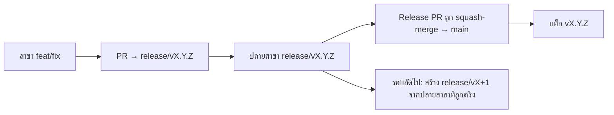

# Branching & Release Model (ไทย)

🌐 **Languages:** 🇺🇸 [English](../../../../ops/BRANCHING_MODEL.md) · 🇪🇹 [am](../../../am/docs/ops/BRANCHING_MODEL.md) · 🇸🇦 [ar](../../../ar/docs/ops/BRANCHING_MODEL.md) · 🇦🇿 [az](../../../az/docs/ops/BRANCHING_MODEL.md) · 🇧🇬 [bg](../../../bg/docs/ops/BRANCHING_MODEL.md) · 🇧🇩 [bn](../../../bn/docs/ops/BRANCHING_MODEL.md) · 🇧🇦 [bs](../../../bs/docs/ops/BRANCHING_MODEL.md) · 🇨🇿 [cs](../../../cs/docs/ops/BRANCHING_MODEL.md) · 🇩🇰 [da](../../../da/docs/ops/BRANCHING_MODEL.md) · 🇩🇪 [de](../../../de/docs/ops/BRANCHING_MODEL.md) · 🇬🇷 [el](../../../el/docs/ops/BRANCHING_MODEL.md) · 🇪🇸 [es](../../../es/docs/ops/BRANCHING_MODEL.md) · 🇪🇪 [et](../../../et/docs/ops/BRANCHING_MODEL.md) · 🇮🇷 [fa](../../../fa/docs/ops/BRANCHING_MODEL.md) · 🇫🇮 [fi](../../../fi/docs/ops/BRANCHING_MODEL.md) · 🇫🇷 [fr](../../../fr/docs/ops/BRANCHING_MODEL.md) · 🇮🇪 [ga](../../../ga/docs/ops/BRANCHING_MODEL.md) · 🇮🇳 [gu](../../../gu/docs/ops/BRANCHING_MODEL.md) · 🇳🇬 [ha](../../../ha/docs/ops/BRANCHING_MODEL.md) · 🇮🇱 [he](../../../he/docs/ops/BRANCHING_MODEL.md) · 🇮🇳 [hi](../../../hi/docs/ops/BRANCHING_MODEL.md) · 🇭🇷 [hr](../../../hr/docs/ops/BRANCHING_MODEL.md) · 🇭🇺 [hu](../../../hu/docs/ops/BRANCHING_MODEL.md) · 🇦🇲 [hy](../../../hy/docs/ops/BRANCHING_MODEL.md) · 🇮🇩 [id](../../../id/docs/ops/BRANCHING_MODEL.md) · 🇳🇬 [ig](../../../ig/docs/ops/BRANCHING_MODEL.md) · 🇮🇹 [it](../../../it/docs/ops/BRANCHING_MODEL.md) · 🇯🇵 [ja](../../../ja/docs/ops/BRANCHING_MODEL.md) · 🇬🇪 [ka](../../../ka/docs/ops/BRANCHING_MODEL.md) · 🇰🇭 [km](../../../km/docs/ops/BRANCHING_MODEL.md) · 🇮🇳 [kn](../../../kn/docs/ops/BRANCHING_MODEL.md) · 🇰🇷 [ko](../../../ko/docs/ops/BRANCHING_MODEL.md) · 🇱🇹 [lt](../../../lt/docs/ops/BRANCHING_MODEL.md) · 🇱🇻 [lv](../../../lv/docs/ops/BRANCHING_MODEL.md) · 🇮🇳 [ml](../../../ml/docs/ops/BRANCHING_MODEL.md) · 🇮🇳 [mr](../../../mr/docs/ops/BRANCHING_MODEL.md) · 🇲🇾 [ms](../../../ms/docs/ops/BRANCHING_MODEL.md) · 🇲🇹 [mt](../../../mt/docs/ops/BRANCHING_MODEL.md) · 🇲🇲 [my](../../../my/docs/ops/BRANCHING_MODEL.md) · 🇳🇵 [ne](../../../ne/docs/ops/BRANCHING_MODEL.md) · 🇳🇱 [nl](../../../nl/docs/ops/BRANCHING_MODEL.md) · 🇳🇴 [no](../../../no/docs/ops/BRANCHING_MODEL.md) · 🇮🇳 [or](../../../or/docs/ops/BRANCHING_MODEL.md) · 🇮🇳 [pa](../../../pa/docs/ops/BRANCHING_MODEL.md) · 🇵🇭 [phi](../../../phi/docs/ops/BRANCHING_MODEL.md) · 🇵🇱 [pl](../../../pl/docs/ops/BRANCHING_MODEL.md) · 🇵🇹 [pt](../../../pt/docs/ops/BRANCHING_MODEL.md) · 🇧🇷 [pt-BR](../../../pt-BR/docs/ops/BRANCHING_MODEL.md) · 🇷🇴 [ro](../../../ro/docs/ops/BRANCHING_MODEL.md) · 🇷🇺 [ru](../../../ru/docs/ops/BRANCHING_MODEL.md) · 🇱🇰 [si](../../../si/docs/ops/BRANCHING_MODEL.md) · 🇸🇰 [sk](../../../sk/docs/ops/BRANCHING_MODEL.md) · 🇸🇮 [sl](../../../sl/docs/ops/BRANCHING_MODEL.md) · 🇷🇸 [sr](../../../sr/docs/ops/BRANCHING_MODEL.md) · 🇸🇪 [sv](../../../sv/docs/ops/BRANCHING_MODEL.md) · 🇰🇪 [sw](../../../sw/docs/ops/BRANCHING_MODEL.md) · 🇮🇳 [ta](../../../ta/docs/ops/BRANCHING_MODEL.md) · 🇮🇳 [te](../../../te/docs/ops/BRANCHING_MODEL.md) · 🇹🇷 [tr](../../../tr/docs/ops/BRANCHING_MODEL.md) · 🇺🇦 [uk-UA](../../../uk-UA/docs/ops/BRANCHING_MODEL.md) · 🇵🇰 [ur](../../../ur/docs/ops/BRANCHING_MODEL.md) · 🇺🇿 [uz](../../../uz/docs/ops/BRANCHING_MODEL.md) · 🇻🇳 [vi](../../../vi/docs/ops/BRANCHING_MODEL.md) · 🇳🇬 [yo](../../../yo/docs/ops/BRANCHING_MODEL.md) · 🇨🇳 [zh-CN](../../../zh-CN/docs/ops/BRANCHING_MODEL.md) · 🇹🇼 [zh-TW](../../../zh-TW/docs/ops/BRANCHING_MODEL.md)

---

OmniRoute ใช้โมเดลการออกรุ่นแบบ **รอบคู่ขนาน (parallel-cycle)** ได้แก่ สาขาเฉพาะ `release/vX.Y.Z`
สำหรับรอบที่กำลังดำเนินการ, `main` สำหรับสายรุ่นที่เผยแพร่แล้ว และแท็ก `vX.Y.Z`
ที่เปลี่ยนแปลงไม่ได้เมื่อรอบนั้นออกรุ่น การเห็นคอมมิตถูกรวมเข้าไปทั้งใน `release/*` _และ_
`main` ถือเป็นเรื่องปกติ — ไม่ใช่ความสับสนผิดพลาด

รายละเอียดสำหรับผู้ดูแลอยู่ใน `CLAUDE.md` (กฎตายตัวข้อที่ 21) และ
[RELEASE_CHECKLIST.md](./RELEASE_CHECKLIST.md) หน้านี้เป็นบทสรุปสาธารณะ
สำหรับผู้มีส่วนร่วม

## ภาพรวม

| Ref              | บทบาท                                                                                                      |
| ---------------- | ---------------------------------------------------------------------------------------------------------- |
| `release/vX.Y.Z` | **รอบที่กำลังดำเนินการ** — การพัฒนาประจำวันและการรวม PR สำหรับเวอร์ชันนั้น                                 |
| `main`           | **สายรุ่นที่เผยแพร่แล้ว** — รับการเปลี่ยนแปลงจากรอบผ่านการ squash-merge เมื่อออกรุ่น                       |
| `vX.Y.Z` (แท็ก)  | **เครื่องหมายการออกรุ่น** — ตัวชี้ที่เปลี่ยนแปลงไม่ได้ซึ่งระบุ “สิ่งที่ออกรุ่น” และสร้างขึ้น ณ เวลาออกรุ่น |



## PR ของฉันควรกำหนดเป้าหมายไปที่ใด?

**กำหนดเป้าหมายไปที่สาขา `release/vX.Y.Z` ที่กำลังดำเนินการ — ไม่ใช่ `main`**

1. ค้นหาสาขา `release/v*` ที่เปิดอยู่และมีเวอร์ชันสูงสุด (ตัวอย่าง ณ เวลาที่เขียน:
   `release/v3.8.49`)
2. สร้างสาขาจากปลายสาขานั้น (`git fetch` + checkout / rebase ลงบนนั้น)
3. เปิด PR โดยกำหนด **base = `release/vX.Y.Z` นั้น**

`main` ไม่ใช่สาขาสำหรับรวมการเปลี่ยนแปลงประจำวัน โดยปกติแล้ว PR ที่เปิดโดยมี `main`
เป็นเป้าหมายจะต้องเปลี่ยนเป้าหมายก่อนรวม

## การตรึงรุ่น (รอบคู่ขนาน)

เมื่อกำลังปรับรุ่นให้สอดคล้องกัน จะมีการเปิด issue เครื่องหมายที่มีป้ายกำกับ `release-freeze`
การดำเนินการนี้ **ไม่ได้หยุดการพัฒนา**:

- `release/vX.Y.Z` ที่ถูกตรึงจะอยู่ภายใต้ความรับผิดชอบของผู้ควบคุมการออกรุ่นนั้น
- `release/vX+1` ของรอบถัดไปจะถูกสร้างจากปลายสาขาที่ถูกตรึง เพื่อให้ผู้มีส่วนร่วมยังคง
  รวมงานต่อไปได้
- PR ที่เปิดอยู่ซึ่งยังคงกำหนดเป้าหมายไปยังสาขาที่ถูกตรึงควรได้รับการ **เปลี่ยนเป้าหมาย** ไปยัง
  สาขา `release/v*` ที่กำลังดำเนินการ (และมีเวอร์ชันสูงสุด)

ตรวจสอบว่ามีการตรึงที่เปิดอยู่หรือไม่ ก่อนสันนิษฐานว่าสาขาที่คุณต้องการสามารถรวมได้:

```bash
gh issue list --repo diegosouzapw/OmniRoute --label release-freeze --state open
```

กลไกการรวม (ป้ายกำกับ `queue` โดยเจ้าของ → Mergify) มีเอกสารอยู่ใน
[MERGE_TRAIN.md](./MERGE_TRAIN.md)

## เหตุใดจึงต้องมีทั้งสาขาและแท็ก?

| อาร์ติแฟกต์      | อายุการใช้งาน        | วัตถุประสงค์                                                          |
| ---------------- | -------------------- | --------------------------------------------------------------------- |
| `release/vX.Y.Z` | รอบที่กำลังดำเนินการ | รวบรวม PR ที่ผ่านการตรวจสอบ รักษาสถานะ CI ให้ผ่าน และใช้เป็นฐานของ PR |
| แท็ก `vX.Y.Z`    | ถาวร                 | ระบุบิตที่แน่นอนซึ่งเผยแพร่ไปยัง npm / GitHub Releases                |

สาขาคือพื้นที่ทำงาน ส่วนแท็กคือแพ็กเกจที่ปิดผนึกแล้ว หลังจาก squash-merge ไปยัง
`main` รอบถัดไปจะดำเนินต่อบน `release/vX+1` โดยไม่ต้องรอให้
Release PR ก่อนหน้าเสร็จสิ้น

## เอกสารที่เกี่ยวข้อง

- [CONTRIBUTING.md](../../CONTRIBUTING.md) — การตั้งค่า การทดสอบ และรายการตรวจสอบ PR
- [RELEASE_CHECKLIST.md](./RELEASE_CHECKLIST.md) — การตรวจสอบก่อนออกรุ่น
- [MERGE_TRAIN.md](./MERGE_TRAIN.md) — คิวการรวมและกระบวนการรวมสำรอง
- [RELEASE_GREEN.md](./RELEASE_GREEN.md) — การรักษาปลายสาขารุ่นให้ผ่านการตรวจสอบ
