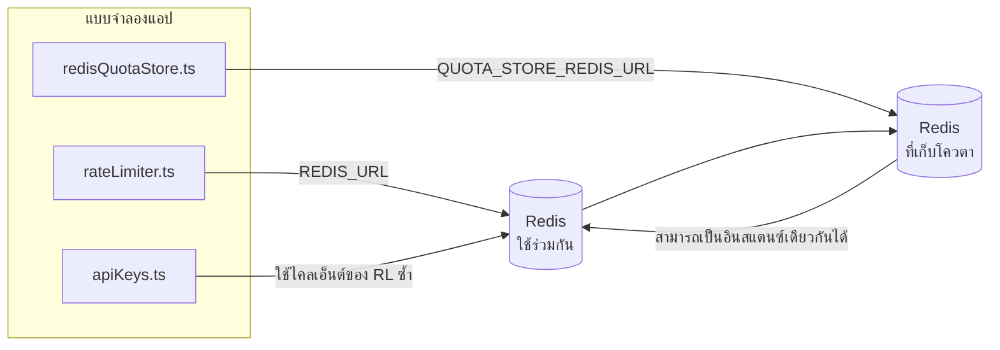

# Redis Production Configuration Guide (ไทย)

🌐 **Languages:** 🇺🇸 [English](../../../../ops/REDIS_PRODUCTION_CONFIG.md) · 🇪🇹 [am](../../../am/docs/ops/REDIS_PRODUCTION_CONFIG.md) · 🇸🇦 [ar](../../../ar/docs/ops/REDIS_PRODUCTION_CONFIG.md) · 🇦🇿 [az](../../../az/docs/ops/REDIS_PRODUCTION_CONFIG.md) · 🇧🇬 [bg](../../../bg/docs/ops/REDIS_PRODUCTION_CONFIG.md) · 🇧🇩 [bn](../../../bn/docs/ops/REDIS_PRODUCTION_CONFIG.md) · 🇧🇦 [bs](../../../bs/docs/ops/REDIS_PRODUCTION_CONFIG.md) · 🇨🇿 [cs](../../../cs/docs/ops/REDIS_PRODUCTION_CONFIG.md) · 🇩🇰 [da](../../../da/docs/ops/REDIS_PRODUCTION_CONFIG.md) · 🇩🇪 [de](../../../de/docs/ops/REDIS_PRODUCTION_CONFIG.md) · 🇬🇷 [el](../../../el/docs/ops/REDIS_PRODUCTION_CONFIG.md) · 🇪🇸 [es](../../../es/docs/ops/REDIS_PRODUCTION_CONFIG.md) · 🇪🇪 [et](../../../et/docs/ops/REDIS_PRODUCTION_CONFIG.md) · 🇮🇷 [fa](../../../fa/docs/ops/REDIS_PRODUCTION_CONFIG.md) · 🇫🇮 [fi](../../../fi/docs/ops/REDIS_PRODUCTION_CONFIG.md) · 🇫🇷 [fr](../../../fr/docs/ops/REDIS_PRODUCTION_CONFIG.md) · 🇮🇪 [ga](../../../ga/docs/ops/REDIS_PRODUCTION_CONFIG.md) · 🇮🇳 [gu](../../../gu/docs/ops/REDIS_PRODUCTION_CONFIG.md) · 🇳🇬 [ha](../../../ha/docs/ops/REDIS_PRODUCTION_CONFIG.md) · 🇮🇱 [he](../../../he/docs/ops/REDIS_PRODUCTION_CONFIG.md) · 🇮🇳 [hi](../../../hi/docs/ops/REDIS_PRODUCTION_CONFIG.md) · 🇭🇷 [hr](../../../hr/docs/ops/REDIS_PRODUCTION_CONFIG.md) · 🇭🇺 [hu](../../../hu/docs/ops/REDIS_PRODUCTION_CONFIG.md) · 🇦🇲 [hy](../../../hy/docs/ops/REDIS_PRODUCTION_CONFIG.md) · 🇮🇩 [id](../../../id/docs/ops/REDIS_PRODUCTION_CONFIG.md) · 🇳🇬 [ig](../../../ig/docs/ops/REDIS_PRODUCTION_CONFIG.md) · 🇮🇹 [it](../../../it/docs/ops/REDIS_PRODUCTION_CONFIG.md) · 🇯🇵 [ja](../../../ja/docs/ops/REDIS_PRODUCTION_CONFIG.md) · 🇬🇪 [ka](../../../ka/docs/ops/REDIS_PRODUCTION_CONFIG.md) · 🇰🇭 [km](../../../km/docs/ops/REDIS_PRODUCTION_CONFIG.md) · 🇮🇳 [kn](../../../kn/docs/ops/REDIS_PRODUCTION_CONFIG.md) · 🇰🇷 [ko](../../../ko/docs/ops/REDIS_PRODUCTION_CONFIG.md) · 🇱🇹 [lt](../../../lt/docs/ops/REDIS_PRODUCTION_CONFIG.md) · 🇱🇻 [lv](../../../lv/docs/ops/REDIS_PRODUCTION_CONFIG.md) · 🇮🇳 [ml](../../../ml/docs/ops/REDIS_PRODUCTION_CONFIG.md) · 🇮🇳 [mr](../../../mr/docs/ops/REDIS_PRODUCTION_CONFIG.md) · 🇲🇾 [ms](../../../ms/docs/ops/REDIS_PRODUCTION_CONFIG.md) · 🇲🇹 [mt](../../../mt/docs/ops/REDIS_PRODUCTION_CONFIG.md) · 🇲🇲 [my](../../../my/docs/ops/REDIS_PRODUCTION_CONFIG.md) · 🇳🇵 [ne](../../../ne/docs/ops/REDIS_PRODUCTION_CONFIG.md) · 🇳🇱 [nl](../../../nl/docs/ops/REDIS_PRODUCTION_CONFIG.md) · 🇳🇴 [no](../../../no/docs/ops/REDIS_PRODUCTION_CONFIG.md) · 🇮🇳 [or](../../../or/docs/ops/REDIS_PRODUCTION_CONFIG.md) · 🇮🇳 [pa](../../../pa/docs/ops/REDIS_PRODUCTION_CONFIG.md) · 🇵🇭 [phi](../../../phi/docs/ops/REDIS_PRODUCTION_CONFIG.md) · 🇵🇱 [pl](../../../pl/docs/ops/REDIS_PRODUCTION_CONFIG.md) · 🇵🇹 [pt](../../../pt/docs/ops/REDIS_PRODUCTION_CONFIG.md) · 🇧🇷 [pt-BR](../../../pt-BR/docs/ops/REDIS_PRODUCTION_CONFIG.md) · 🇷🇴 [ro](../../../ro/docs/ops/REDIS_PRODUCTION_CONFIG.md) · 🇷🇺 [ru](../../../ru/docs/ops/REDIS_PRODUCTION_CONFIG.md) · 🇱🇰 [si](../../../si/docs/ops/REDIS_PRODUCTION_CONFIG.md) · 🇸🇰 [sk](../../../sk/docs/ops/REDIS_PRODUCTION_CONFIG.md) · 🇸🇮 [sl](../../../sl/docs/ops/REDIS_PRODUCTION_CONFIG.md) · 🇷🇸 [sr](../../../sr/docs/ops/REDIS_PRODUCTION_CONFIG.md) · 🇸🇪 [sv](../../../sv/docs/ops/REDIS_PRODUCTION_CONFIG.md) · 🇰🇪 [sw](../../../sw/docs/ops/REDIS_PRODUCTION_CONFIG.md) · 🇮🇳 [ta](../../../ta/docs/ops/REDIS_PRODUCTION_CONFIG.md) · 🇮🇳 [te](../../../te/docs/ops/REDIS_PRODUCTION_CONFIG.md) · 🇹🇷 [tr](../../../tr/docs/ops/REDIS_PRODUCTION_CONFIG.md) · 🇺🇦 [uk-UA](../../../uk-UA/docs/ops/REDIS_PRODUCTION_CONFIG.md) · 🇵🇰 [ur](../../../ur/docs/ops/REDIS_PRODUCTION_CONFIG.md) · 🇺🇿 [uz](../../../uz/docs/ops/REDIS_PRODUCTION_CONFIG.md) · 🇻🇳 [vi](../../../vi/docs/ops/REDIS_PRODUCTION_CONFIG.md) · 🇳🇬 [yo](../../../yo/docs/ops/REDIS_PRODUCTION_CONFIG.md) · 🇨🇳 [zh-CN](../../../zh-CN/docs/ops/REDIS_PRODUCTION_CONFIG.md) · 🇹🇼 [zh-TW](../../../zh-TW/docs/ops/REDIS_PRODUCTION_CONFIG.md)

---

## ภาพรวม

Redis เป็น **dependency แบบไม่บังคับและไม่ตายตัว** ใน OmniRoute — แอปพลิเคชันจะลดระดับการทำงานอย่างราบรื่น (fallback
ไปใช้หน่วยความจำภายใน) เมื่อ Redis ไม่พร้อมใช้งาน ในระบบ production การปรับแต่ง Redis ช่วยลด latency สำหรับ workload
ที่แตกต่างกันสี่ประเภท:

| Workload                      | ตัวขับเคลื่อน                 | Client Factory                                       | รูปแบบคีย์                                       |
| ----------------------------- | ----------------------------- | ---------------------------------------------------- | ------------------------------------------------ |
| การจำกัดอัตรา                 | `rateLimiter.ts`              | singleton `ioredis` แบบ lazy ผ่าน `getRedisClient()` | หน้าต่างจำกัดอัตราแบบ Lua‑atomic `<prefix>rl:*`  |
| แคชการยืนยันตัวตน             | `apiKeys.ts`                  | ใช้ client ของ `rateLimiter` ซ้ำ                     | `<prefix>auth:api_key:<sha256>` พร้อม TTL        |
| ที่เก็บโควตา                  | `redisQuotaStore.ts`          | singleton `getRedisClient(url)` แยกต่างหาก           | `<prefix>quota:*` ที่กำหนดค่าแยกต่อ instance ได้ |
| circuit breaker สำหรับ warmup | `redisCircuitBreakerStore.ts` | client แยกต่างหากใน `circuitBreakerFactory.ts`       | `<prefix>warmup:cb:<connectionId>`               |

workload ทั้งสี่ประเภทใช้ prefix ของ namespace เดียวกัน เพื่อให้ OmniRoute สามารถทำงานร่วมกับแอปอื่นบน
Redis instance เดียวกันได้ (เช่น `127.0.0.1:6379`) ดู [การกำหนด Namespace ให้คีย์](#การกำหนด-namespace-ให้คีย์)

---

## การกำหนดค่าปัจจุบัน (ค่าเริ่มต้นในโค้ด)

| การตั้งค่า                         | ค่า                                                                     | ตำแหน่ง                                                                               |
| ---------------------------------- | ----------------------------------------------------------------------- | ------------------------------------------------------------------------------------- |
| ตัวแปร env `REDIS_URL`             | `redis://redis:6379` (compose), ไม่บังคับ                               | `rateLimiter.ts:5`, `.env.example`                                                    |
| ตัวแปร env `REDIS_KEY_PREFIX`      | `omniroute:` (ค่าเริ่มต้น)                                              | `rateLimiter.ts`, `redisQuotaStore.ts`, `redisCircuitBreakerStore.ts`, `.env.example` |
| ตัวแปร env `QUOTA_STORE_REDIS_URL` | แยกต่างหากและอาจแตกต่างจาก `REDIS_URL`                                  | `quota/storeFactory.ts`                                                               |
| `QUOTA_STORE_DRIVER`               | `"sqlite"` (ค่าเริ่มต้น), `"redis"` เป็นตัวเลือก                        | `quota/storeFactory.ts`                                                               |
| `maxRetriesPerRequest` ของ ioredis | `3`                                                                     | การสร้าง client ใน `rateLimiter.ts`                                                   |
| `enableReadyCheck`                 | ไม่ได้ตั้งค่า (ค่าเริ่มต้นของ ioredis: `true`)                          | —                                                                                     |
| `lazyConnect`                      | ไม่ได้ตั้งค่า (ค่าเริ่มต้นของ ioredis: `false`)                         | —                                                                                     |
| `retryStrategy`                    | ไม่ได้ตั้งค่า (ค่าเริ่มต้นของ ioredis: ฐาน 200ms, เพิ่มแบบ exponential) | —                                                                                     |
| TLS / รหัสผ่าน / ดัชนี DB          | **ไม่ได้กำหนดค่า**                                                      | —                                                                                     |
| Sentinel / Cluster                 | **ไม่ได้กำหนดค่า** — รองรับเฉพาะ standalone แบบ single-node             | —                                                                                     |

---

## การกำหนด Namespace ให้คีย์

OmniRoute ใช้ Redis instance ร่วมกับบริการอื่นใดก็ตามที่ทำงานอยู่บนโฮสต์ หากไม่มี namespace
คีย์อย่าง `auth:api_key:<sha256>` หรือ `rl:*` อาจชนกับคีย์จากแอปพลิเคชันอื่น
ที่ใช้ Redis เดียวกัน (instance นี้เรียกใช้ Redis บน `127.0.0.1:6379` ร่วมกับบริการอื่น)

ตั้งค่า `REDIS_KEY_PREFIX` เป็นสตริงที่ไม่ว่าง เพื่อเพิ่ม prefix ให้กับคีย์ **ทุกคีย์** ของ OmniRoute:

```bash
# .env — คีย์ OmniRoute ทั้งหมดจะกลายเป็น omniroute:rl:*, omniroute:auth:*, omniroute:quota:*, omniroute:warmup:cb:*
REDIS_KEY_PREFIX=omniroute:
```

- **ค่าเริ่มต้น:** `omniroute:` (นำไปใช้เมื่อไม่ได้ตั้งค่า `REDIS_KEY_PREFIX` หรือค่าที่ตั้งไว้ว่างเปล่า)
- **นำไปใช้กับ:** ตัวจำกัดอัตรา + แคชการยืนยันตัวตน (ใช้ client `ioredis` ร่วมกันผ่าน `keyPrefix`) และ
  ที่เก็บโควตา (`KEY_PREFIX = "${REDIS_KEY_PREFIX}quota"`) รวมถึง circuit breaker สำหรับ warmup
  (`KEY_PREFIX = "${REDIS_KEY_PREFIX}warmup:cb:"`)
- **การเปลี่ยน prefix** ขณะที่มีคีย์อยู่ใน Redis แล้ว จะทำให้คีย์เก่าถูกทิ้งไว้โดยไม่มีการอ้างอิง (คีย์จะหมดอายุ
  ผ่าน TTL / LRU) สามารถเปลี่ยนได้อย่างปลอดภัยและไม่จำเป็นต้องย้ายข้อมูล ข้อยกเว้นหนึ่งประการคือคีย์ของ
  circuit breaker สำหรับ warmup ของการเชื่อมต่อที่ถูกทำเครื่องหมายว่าห้ามใช้งาน ซึ่งจะถูกเก็บไว้โดยไม่มี TTL ดังนั้น
  ให้แสดงรายการคีย์ตกค้างด้วย `redis-cli --scan --pattern '<old-prefix>warmup:cb:*'` แล้วลบคีย์เหล่านั้น
- **`keyPrefix` ของ ioredis** จะเพิ่ม prefix ไว้ข้างหน้าโดยอัตโนมัติเมื่อเขียนข้อมูล **และ** ตัด prefix ออกเมื่ออ่านข้อมูล
  ดังนั้นโค้ดของแอปพลิเคชันจะไม่เห็น prefix เลย

---

## การปรับแต่งที่แนะนำสำหรับระบบ Production

### 1. ตัวเลือก Connection Pool / Client (คอนสตรักเตอร์ `Redis` ของ ioredis)

โค้ดปัจจุบันสร้าง `new Redis(url)` เพียงอินสแตนซ์เดียวโดยไม่มีตัวเลือกแบบกำหนดเอง สำหรับการปรับใช้แบบหลาย replica ในระบบ Production ให้ส่ง client factory เข้าไปในโค้ด หรือครอบ `getRedisClient()`:

```typescript
const redis = new Redis(REDIS_URL, {
  maxRetriesPerRequest: null, // ไม่จำกัดจำนวนครั้งที่ลองใหม่ ให้ retryStrategy เป็นตัวตัดสินใจ
  enableReadyCheck: true, // ตรวจสอบว่าเซิร์ฟเวอร์พร้อมก่อนรับคำสั่ง
  lazyConnect: true, // ไม่เชื่อมต่อขณะสร้าง ให้รอจนมีการเรียกครั้งแรก
  retryStrategy: (times) => {
    if (times > 10) return null; // ยกเลิกหลังลองใหม่ 10 ครั้ง → เชื่อมต่อใหม่ภายหลัง
    return Math.min(times * 200, 5000); // 200ms, 400ms, …, สูงสุด 5s
  },
  enableAutoPipelining: true, // รวมคำสั่งที่ทำงานพร้อมกันไว้ในการเขียน TCP ครั้งเดียว
  keepAlive: 10000, // ส่ง TCP keep-alive ทุก 10s
});
```

**ข้อแลกเปลี่ยนที่สำคัญ:**

- `maxRetriesPerRequest: null` + `retryStrategy` — แนะนำสำหรับระบบ Production เพื่อให้การรีสตาร์ต Redis ชั่วคราวไม่ทำให้ทุกคำขอล้มเหลวทันที กลไกสำรองในหน่วยความจำของ `checkRateLimit()` จะรองรับเส้นทางเมื่อเกิดความล้มเหลว
- `lazyConnect: true` — หลีกเลี่ยงไม่ให้การเริ่มต้นระบบต้องพึ่งพาว่า Redis พร้อมใช้งานก่อนที่เซิร์ฟเวอร์จะเริ่มรับการเชื่อมต่อ
- `enableAutoPipelining: true` — ลดจำนวนรอบการสื่อสารสำหรับการตรวจสอบขีดจำกัดอัตราที่เกิดขึ้นพร้อมกัน ซึ่งมีประโยชน์เมื่อมีอัตรามากกว่า 50 RPS บนการเชื่อมต่อเดียว

### 2. การกำหนดค่าเซิร์ฟเวอร์ Redis (`redis.conf`)

```
# หน่วยความจำ
maxmemory 80%                        # เว้นพื้นที่สำหรับแคชเพจของ OS
maxmemory-policy allkeys-lru         # ขับรายการแคชการยืนยันตัวตนที่เก่าออกเมื่อหน่วยความจำตึงตัว

# การเก็บข้อมูลถาวร (ไม่บังคับ — OmniRoute ปลอดภัยจากการขัดข้องแม้ไม่มีส่วนนี้)
save 300 1                           # สร้างสแนปช็อตอย่างน้อยทุก 5 นาที หากมีคีย์เปลี่ยนแปลง ≥1 คีย์
appendonly no                        # ไม่จำเป็นต้องใช้ AOF เพราะสามารถสร้างข้อมูลขึ้นใหม่ได้
appendfsync no                       # ไม่มีโอเวอร์เฮดจาก fsync (RDB เพียงพอแล้ว)

# เครือข่าย
timeout 0                            # ไม่ตัดการเชื่อมต่อที่ไม่มีการใช้งาน
tcp-keepalive 300                    # ส่ง keep-alive ทุก 5 นาที
tcp-backlog 511                      # คิวรอการเชื่อมต่อสำหรับโหลดที่พุ่งสูงเป็นช่วงๆ

# ประสิทธิภาพ
hz 10                                # ค่าเริ่มต้น ใช้ 100 สำหรับงานที่อ่อนไหวต่อเวลาแฝง
activedefrag yes                     # จัดเรียงหน่วยความจำอัตโนมัติเมื่อการกระจัดกระจาย >10%
```

**ข้อแลกเปลี่ยนของ `maxmemory-policy allkeys-lru`:** รายการแคชการยืนยันตัวตนอาจถูกขับออกเมื่อหน่วยความจำตึงตัว ซึ่งปลอดภัย เนื่องจาก `setCachedApiKey` จะเติมข้อมูลกลับเสมอเมื่อไม่พบในแคช และ SQLite fallback เป็นแหล่งข้อมูลที่มีอำนาจตัดสิน กลไก rate limiter ที่เป็นสคริปต์ Lua จะสร้างคีย์ขนาดเล็กซึ่งได้รับการออกแบบมาให้มีอายุสั้น

### 3. การตั้งค่า Docker Compose

ไฟล์ compose สำหรับระบบ Production (`docker-compose.prod.yml`) ใช้ `redis:8.6.2-alpine` ให้เพิ่ม:

```yaml
redis:
  image: redis:8.6.2-alpine
  command:
    [
      "redis-server",
      "--maxmemory",
      "512mb",
      "--maxmemory-policy",
      "allkeys-lru",
      "--activedefrag",
      "yes",
      "--save",
      "300 1",
    ]
  healthcheck:
    test: ["CMD", "redis-cli", "ping"]
    interval: 10s
    timeout: 3s
    retries: 3
    start_period: 5s
```

### 4. ข้อควรพิจารณาสำหรับหลายอินสแตนซ์ / การปรับขนาด

**ใช้ Redis เดียวสำหรับทุก replica** — สคริปต์ Lua ของ rate limiter ต้องพึ่งพาพื้นที่คีย์ที่มีอำนาจตัดสินเพียงแห่งเดียว การใช้ Redis หลายอินสแตนซ์แยกกันตาม replica จะทำให้สูญเสีย atomicity และทำให้งบประมาณเพิ่มเป็นสองเท่า ให้ใช้ Redis อินสแตนซ์เดียว (หรือคลัสเตอร์ Redis Sentinel ที่รองรับ failover) สำหรับ replica ทั้งหมดของแอปพลิเคชัน

**จำนวนการเชื่อมต่อ:** replica ของแอปพลิเคชันแต่ละตัวจะเปิด **การเชื่อมต่อ TCP 2 รายการ** ไปยัง Redis (ไคลเอนต์ rate limiter + ไคลเอนต์ quota store) เมื่อมี 10 replica → 20 การเชื่อมต่อ ซึ่งยังต่ำกว่าขีดจำกัดเริ่มต้นของ Redis ที่ 10k การเชื่อมต่ออย่างมาก

### 5. การมอนิเตอร์

เปิดเผยข้อมูลผ่าน endpoint สำหรับ health check:

```typescript
// src/app/api/monitoring/health/route.ts เรียกใช้ฟังก์ชันของ rateLimiter อยู่แล้ว
// เพิ่มการตรวจสอบเฉพาะสำหรับ Redis:
//   1. เวลาแฝงของ PING ผ่าน ioredis .ping()
//   2. การใช้หน่วยความจำผ่าน INFO memory
//   3. จำนวนการเชื่อมต่อผ่าน INFO clients
//   4. อัตราการพบข้อมูลสำหรับ maxmemory-policy (evicted_keys / keyspace_hits)
```

เมตริกสำคัญที่ควรเฝ้าดู:

- **คีย์ที่ถูกขับออก / วินาที** — หากมีค่ามากกว่าศูนย์อย่างต่อเนื่อง ให้เพิ่ม `maxmemory`
- **ไคลเอนต์ที่ถูกบล็อก** — ค่าที่ไม่เป็นศูนย์บ่งชี้ว่าสคริปต์ Lua ทำงานช้า หรือมีการแย่งใช้ทรัพยากรสูง
- **การเชื่อมต่อที่ถูกปฏิเสธ** — ถึงขีดจำกัดการเชื่อมต่อ ซึ่งเกิดขึ้นได้ยากเมื่อมีเพียง 20 การเชื่อมต่อ

---

## แผนภาพสถาปัตยกรรม



---

## เอกสารอ้างอิง

| ไฟล์                               | วัตถุประสงค์                                                               |
| ---------------------------------- | -------------------------------------------------------------------------- |
| `src/shared/utils/rateLimiter.ts`  | ไคลเอ็นต์ Redis หลัก, สคริปต์ Lua สำหรับจำกัดอัตรา, ระบบสำรองในหน่วยความจำ |
| `src/lib/db/apiKeys.ts`            | แคชการยืนยันตัวตน — สำรองจาก Redis ไปยัง SQLite                            |
| `src/lib/quota/redisQuotaStore.ts` | ไคลเอ็นต์ Redis แยกต่างหากสำหรับที่เก็บโควตาเสริม                          |
| `src/lib/quota/storeFactory.ts`    | สลับไดรเวอร์โควตาระหว่าง `sqlite` และ `redis`                              |
| `docker-compose.prod.yml`          | คอนเทนเนอร์ Redis สำหรับระบบใช้งานจริง (อิมเมจ `redis:8.6.2-alpine`)       |
| `.env.example`                     | เอกสารตัวแปรสภาพแวดล้อมของ Redis                                           |
| `src/app/api/local/redis/`         | เส้นทาง API สำหรับการควบคุมคอนเทนเนอร์ในสภาพแวดล้อมการพัฒนา                |
| `bin/cli/commands/redis.mjs`       | คำสั่ง CLI สำหรับการควบคุมคอนเทนเนอร์ในสภาพแวดล้อมการพัฒนา                 |
