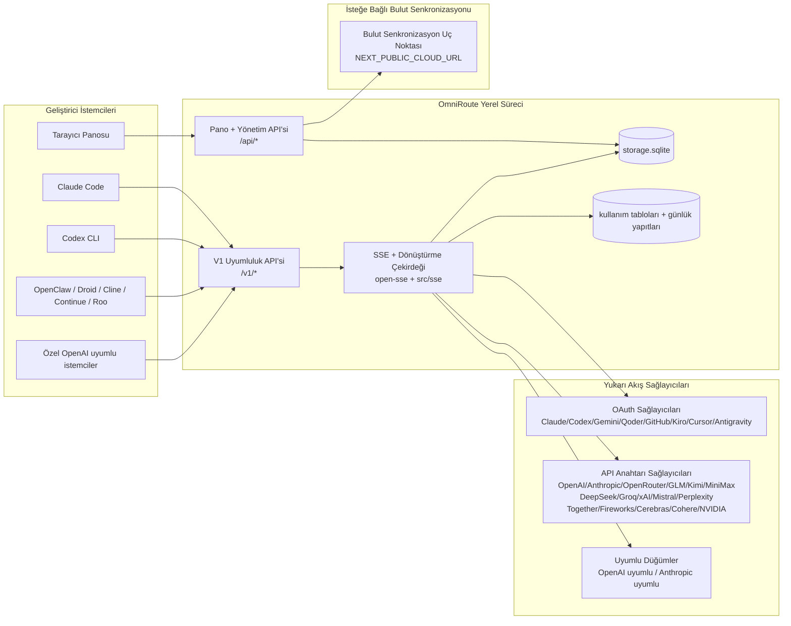
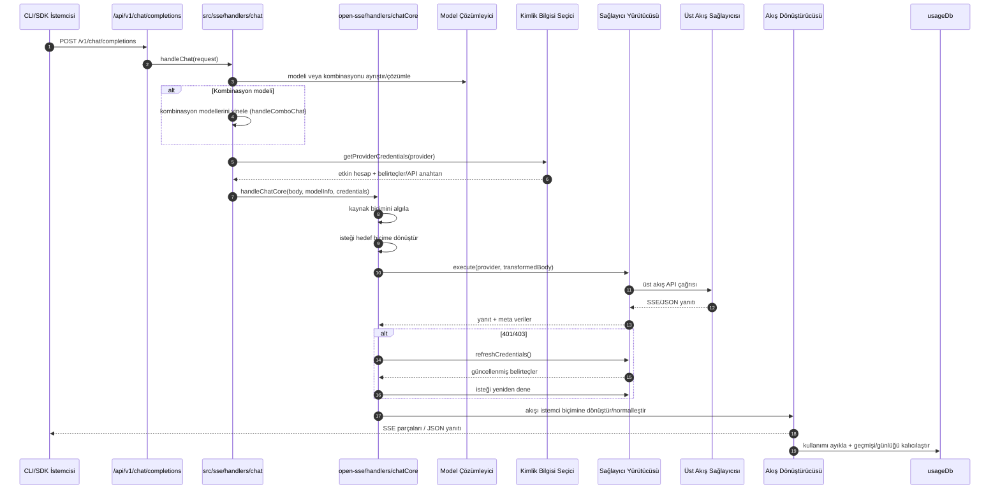
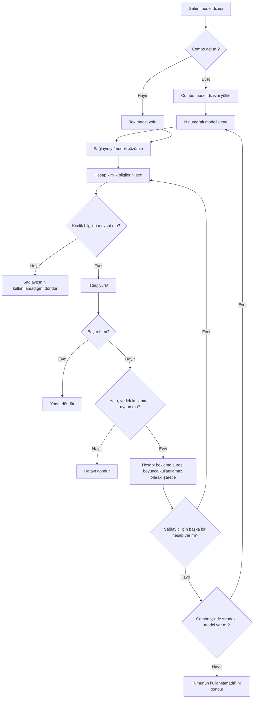
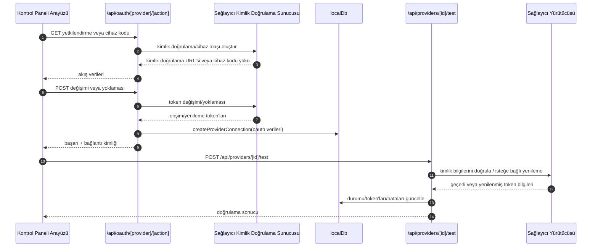
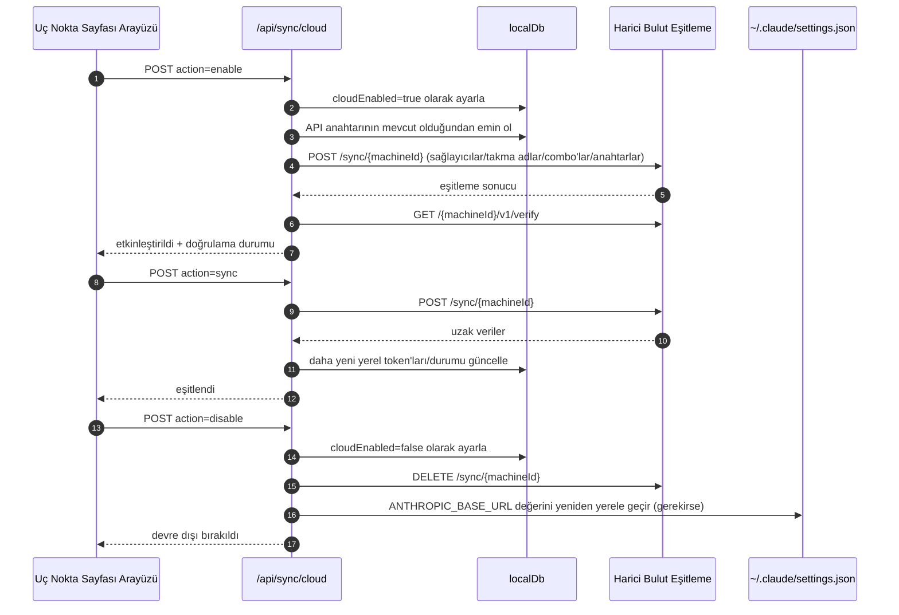
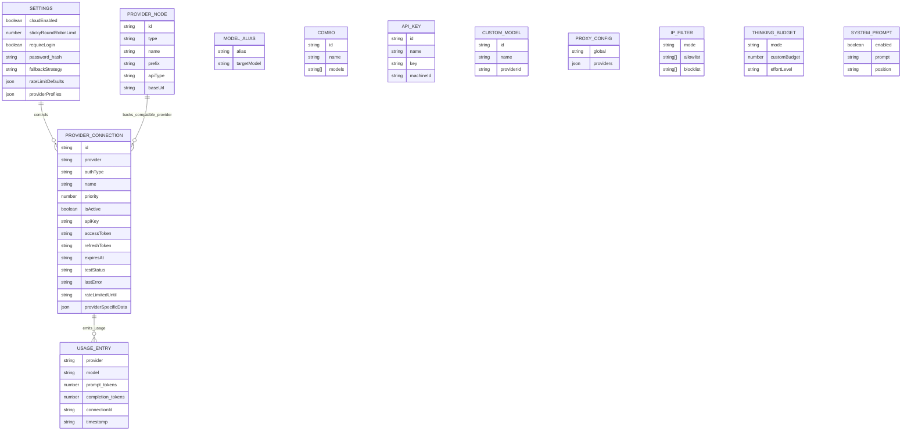
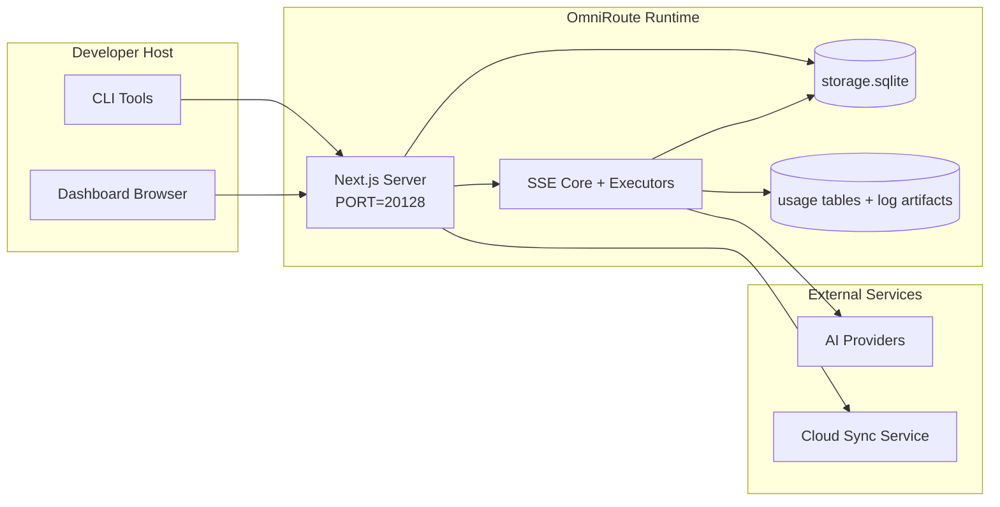

# OmniRoute Architecture (Türkçe)

🌐 **Languages:** 🇺🇸 [English](../../../../architecture/ARCHITECTURE.md) · 🇪🇹 [am](../../../am/docs/architecture/ARCHITECTURE.md) · 🇸🇦 [ar](../../../ar/docs/architecture/ARCHITECTURE.md) · 🇦🇿 [az](../../../az/docs/architecture/ARCHITECTURE.md) · 🇧🇬 [bg](../../../bg/docs/architecture/ARCHITECTURE.md) · 🇧🇩 [bn](../../../bn/docs/architecture/ARCHITECTURE.md) · 🇧🇦 [bs](../../../bs/docs/architecture/ARCHITECTURE.md) · 🇨🇿 [cs](../../../cs/docs/architecture/ARCHITECTURE.md) · 🇩🇰 [da](../../../da/docs/architecture/ARCHITECTURE.md) · 🇩🇪 [de](../../../de/docs/architecture/ARCHITECTURE.md) · 🇬🇷 [el](../../../el/docs/architecture/ARCHITECTURE.md) · 🇪🇸 [es](../../../es/docs/architecture/ARCHITECTURE.md) · 🇪🇪 [et](../../../et/docs/architecture/ARCHITECTURE.md) · 🇮🇷 [fa](../../../fa/docs/architecture/ARCHITECTURE.md) · 🇫🇮 [fi](../../../fi/docs/architecture/ARCHITECTURE.md) · 🇫🇷 [fr](../../../fr/docs/architecture/ARCHITECTURE.md) · 🇮🇪 [ga](../../../ga/docs/architecture/ARCHITECTURE.md) · 🇮🇳 [gu](../../../gu/docs/architecture/ARCHITECTURE.md) · 🇳🇬 [ha](../../../ha/docs/architecture/ARCHITECTURE.md) · 🇮🇱 [he](../../../he/docs/architecture/ARCHITECTURE.md) · 🇮🇳 [hi](../../../hi/docs/architecture/ARCHITECTURE.md) · 🇭🇷 [hr](../../../hr/docs/architecture/ARCHITECTURE.md) · 🇭🇺 [hu](../../../hu/docs/architecture/ARCHITECTURE.md) · 🇦🇲 [hy](../../../hy/docs/architecture/ARCHITECTURE.md) · 🇮🇩 [id](../../../id/docs/architecture/ARCHITECTURE.md) · 🇳🇬 [ig](../../../ig/docs/architecture/ARCHITECTURE.md) · 🇮🇹 [it](../../../it/docs/architecture/ARCHITECTURE.md) · 🇯🇵 [ja](../../../ja/docs/architecture/ARCHITECTURE.md) · 🇬🇪 [ka](../../../ka/docs/architecture/ARCHITECTURE.md) · 🇰🇭 [km](../../../km/docs/architecture/ARCHITECTURE.md) · 🇮🇳 [kn](../../../kn/docs/architecture/ARCHITECTURE.md) · 🇰🇷 [ko](../../../ko/docs/architecture/ARCHITECTURE.md) · 🇱🇹 [lt](../../../lt/docs/architecture/ARCHITECTURE.md) · 🇱🇻 [lv](../../../lv/docs/architecture/ARCHITECTURE.md) · 🇮🇳 [ml](../../../ml/docs/architecture/ARCHITECTURE.md) · 🇮🇳 [mr](../../../mr/docs/architecture/ARCHITECTURE.md) · 🇲🇾 [ms](../../../ms/docs/architecture/ARCHITECTURE.md) · 🇲🇹 [mt](../../../mt/docs/architecture/ARCHITECTURE.md) · 🇲🇲 [my](../../../my/docs/architecture/ARCHITECTURE.md) · 🇳🇵 [ne](../../../ne/docs/architecture/ARCHITECTURE.md) · 🇳🇱 [nl](../../../nl/docs/architecture/ARCHITECTURE.md) · 🇳🇴 [no](../../../no/docs/architecture/ARCHITECTURE.md) · 🇮🇳 [or](../../../or/docs/architecture/ARCHITECTURE.md) · 🇮🇳 [pa](../../../pa/docs/architecture/ARCHITECTURE.md) · 🇵🇭 [phi](../../../phi/docs/architecture/ARCHITECTURE.md) · 🇵🇱 [pl](../../../pl/docs/architecture/ARCHITECTURE.md) · 🇵🇹 [pt](../../../pt/docs/architecture/ARCHITECTURE.md) · 🇧🇷 [pt-BR](../../../pt-BR/docs/architecture/ARCHITECTURE.md) · 🇷🇴 [ro](../../../ro/docs/architecture/ARCHITECTURE.md) · 🇷🇺 [ru](../../../ru/docs/architecture/ARCHITECTURE.md) · 🇱🇰 [si](../../../si/docs/architecture/ARCHITECTURE.md) · 🇸🇰 [sk](../../../sk/docs/architecture/ARCHITECTURE.md) · 🇸🇮 [sl](../../../sl/docs/architecture/ARCHITECTURE.md) · 🇷🇸 [sr](../../../sr/docs/architecture/ARCHITECTURE.md) · 🇸🇪 [sv](../../../sv/docs/architecture/ARCHITECTURE.md) · 🇰🇪 [sw](../../../sw/docs/architecture/ARCHITECTURE.md) · 🇮🇳 [ta](../../../ta/docs/architecture/ARCHITECTURE.md) · 🇮🇳 [te](../../../te/docs/architecture/ARCHITECTURE.md) · 🇹🇭 [th](../../../th/docs/architecture/ARCHITECTURE.md) · 🇺🇦 [uk-UA](../../../uk-UA/docs/architecture/ARCHITECTURE.md) · 🇵🇰 [ur](../../../ur/docs/architecture/ARCHITECTURE.md) · 🇺🇿 [uz](../../../uz/docs/architecture/ARCHITECTURE.md) · 🇻🇳 [vi](../../../vi/docs/architecture/ARCHITECTURE.md) · 🇳🇬 [yo](../../../yo/docs/architecture/ARCHITECTURE.md) · 🇨🇳 [zh-CN](../../../zh-CN/docs/architecture/ARCHITECTURE.md) · 🇹🇼 [zh-TW](../../../zh-TW/docs/architecture/ARCHITECTURE.md)

---

🌐 **Languages:** 🇺🇸 [English](../../../../architecture/ARCHITECTURE.md) · 🇪🇹 [am](../../../am/docs/architecture/ARCHITECTURE.md) · 🇸🇦 [ar](../../../ar/docs/architecture/ARCHITECTURE.md) · 🇦🇿 [az](../../../az/docs/architecture/ARCHITECTURE.md) · 🇧🇬 [bg](../../../bg/docs/architecture/ARCHITECTURE.md) · 🇧🇩 [bn](../../../bn/docs/architecture/ARCHITECTURE.md) · 🇧🇦 [bs](../../../bs/docs/architecture/ARCHITECTURE.md) · 🇨🇿 [cs](../../../cs/docs/architecture/ARCHITECTURE.md) · 🇩🇰 [da](../../../da/docs/architecture/ARCHITECTURE.md) · 🇩🇪 [de](../../../de/docs/architecture/ARCHITECTURE.md) · 🇬🇷 [el](../../../el/docs/architecture/ARCHITECTURE.md) · 🇪🇸 [es](../../../es/docs/architecture/ARCHITECTURE.md) · 🇪🇪 [et](../../../et/docs/architecture/ARCHITECTURE.md) · 🇮🇷 [fa](../../../fa/docs/architecture/ARCHITECTURE.md) · 🇫🇮 [fi](../../../fi/docs/architecture/ARCHITECTURE.md) · 🇫🇷 [fr](../../../fr/docs/architecture/ARCHITECTURE.md) · 🇮🇪 [ga](../../../ga/docs/architecture/ARCHITECTURE.md) · 🇮🇳 [gu](../../../gu/docs/architecture/ARCHITECTURE.md) · 🇳🇬 [ha](../../../ha/docs/architecture/ARCHITECTURE.md) · 🇮🇱 [he](../../../he/docs/architecture/ARCHITECTURE.md) · 🇮🇳 [hi](../../../hi/docs/architecture/ARCHITECTURE.md) · 🇭🇷 [hr](../../../hr/docs/architecture/ARCHITECTURE.md) · 🇭🇺 [hu](../../../hu/docs/architecture/ARCHITECTURE.md) · 🇦🇲 [hy](../../../hy/docs/architecture/ARCHITECTURE.md) · 🇮🇩 [id](../../../id/docs/architecture/ARCHITECTURE.md) · 🇳🇬 [ig](../../../ig/docs/architecture/ARCHITECTURE.md) · 🇮🇹 [it](../../../it/docs/architecture/ARCHITECTURE.md) · 🇯🇵 [ja](../../../ja/docs/architecture/ARCHITECTURE.md) · 🇬🇪 [ka](../../../ka/docs/architecture/ARCHITECTURE.md) · 🇰🇭 [km](../../../km/docs/architecture/ARCHITECTURE.md) · 🇮🇳 [kn](../../../kn/docs/architecture/ARCHITECTURE.md) · 🇰🇷 [ko](../../../ko/docs/architecture/ARCHITECTURE.md) · 🇱🇹 [lt](../../../lt/docs/architecture/ARCHITECTURE.md) · 🇱🇻 [lv](../../../lv/docs/architecture/ARCHITECTURE.md) · 🇮🇳 [ml](../../../ml/docs/architecture/ARCHITECTURE.md) · 🇮🇳 [mr](../../../mr/docs/architecture/ARCHITECTURE.md) · 🇲🇾 [ms](../../../ms/docs/architecture/ARCHITECTURE.md) · 🇲🇹 [mt](../../../mt/docs/architecture/ARCHITECTURE.md) · 🇲🇲 [my](../../../my/docs/architecture/ARCHITECTURE.md) · 🇳🇵 [ne](../../../ne/docs/architecture/ARCHITECTURE.md) · 🇳🇱 [nl](../../../nl/docs/architecture/ARCHITECTURE.md) · 🇳🇴 [no](../../../no/docs/architecture/ARCHITECTURE.md) · 🇮🇳 [or](../../../or/docs/architecture/ARCHITECTURE.md) · 🇮🇳 [pa](../../../pa/docs/architecture/ARCHITECTURE.md) · 🇵🇭 [phi](../../../phi/docs/architecture/ARCHITECTURE.md) · 🇵🇱 [pl](../../../pl/docs/architecture/ARCHITECTURE.md) · 🇵🇹 [pt](../../../pt/docs/architecture/ARCHITECTURE.md) · 🇧🇷 [pt-BR](../../../pt-BR/docs/architecture/ARCHITECTURE.md) · 🇷🇴 [ro](../../../ro/docs/architecture/ARCHITECTURE.md) · 🇷🇺 [ru](../../../ru/docs/architecture/ARCHITECTURE.md) · 🇱🇰 [si](../../../si/docs/architecture/ARCHITECTURE.md) · 🇸🇰 [sk](../../../sk/docs/architecture/ARCHITECTURE.md) · 🇸🇮 [sl](../../../sl/docs/architecture/ARCHITECTURE.md) · 🇷🇸 [sr](../../../sr/docs/architecture/ARCHITECTURE.md) · 🇸🇪 [sv](../../../sv/docs/architecture/ARCHITECTURE.md) · 🇰🇪 [sw](../../../sw/docs/architecture/ARCHITECTURE.md) · 🇮🇳 [ta](../../../ta/docs/architecture/ARCHITECTURE.md) · 🇮🇳 [te](../../../te/docs/architecture/ARCHITECTURE.md) · 🇹🇭 [th](../../../th/docs/architecture/ARCHITECTURE.md) · 🇺🇦 [uk-UA](../../../uk-UA/docs/architecture/ARCHITECTURE.md) · 🇵🇰 [ur](../../../ur/docs/architecture/ARCHITECTURE.md) · 🇺🇿 [uz](../../../uz/docs/architecture/ARCHITECTURE.md) · 🇻🇳 [vi](../../../vi/docs/architecture/ARCHITECTURE.md) · 🇳🇬 [yo](../../../yo/docs/architecture/ARCHITECTURE.md) · 🇨🇳 [zh-CN](../../../zh-CN/docs/architecture/ARCHITECTURE.md) · 🇹🇼 [zh-TW](../../../zh-TW/docs/architecture/ARCHITECTURE.md)

_Son güncelleme: 2026-06-28_

## Yönetici Özeti

OmniRoute, Next.js üzerine kurulmuş yerel bir yapay zekâ yönlendirme ağ geçidi ve kontrol panelidir.
Tek bir OpenAI uyumlu uç nokta (`/v1/*`) sağlar ve trafiği çeviri, yedek modele geçiş, token yenileme ve kullanım takibi özellikleriyle birden fazla üst sağlayıcı arasında yönlendirir.

Temel yetenekler:

- CLI/araçlar için OpenAI uyumlu API yüzeyi (355 sağlayıcı, 108 yürütücü)
- Sağlayıcı biçimleri arasında istek/yanıt çevirisi
- Model kombinasyonu yedekleme mekanizması (çok modelli sıra)
- `compositeTiers` tarafından çalışma zamanında sıralanan yapılandırılmış kombinasyon adımları (`provider + model + connection`)
- Hesap düzeyinde yedekleme mekanizması (sağlayıcı başına birden fazla hesap)
- Ana sohbet akışında kota ön kontrolü ve kotayı dikkate alan P2C hesap seçimi
- OAuth + API anahtarı tabanlı sağlayıcı bağlantı yönetimi (22 OAuth sağlayıcı modülü)
- `/v1/embeddings` üzerinden gömme oluşturma (18 sağlayıcı)
- `/v1/images/generations` üzerinden görsel oluşturma (10+ sağlayıcı, 20+ model)
- `/v1/audio/transcriptions` üzerinden ses transkripsiyonu (18 sağlayıcı)
- `/v1/audio/speech` üzerinden metinden konuşmaya dönüştürme (24 yerleşik sağlayıcı)
- `/v1/videos/generations` üzerinden video oluşturma (ComfyUI + SD WebUI)
- `/v1/music/generations` üzerinden müzik oluşturma (ComfyUI)
- `/v1/search` üzerinden web araması (20 sağlayıcı)
- `/v1/moderations` üzerinden moderasyon
- `/v1/rerank` üzerinden yeniden sıralama
- Akıl yürütme modelleri için düşünme etiketi ayrıştırma (`<think>...</think>`)
- Katı OpenAI SDK uyumluluğu için yanıt temizleme
- Sağlayıcılar arası uyumluluk için rol normalleştirme (developer→system, system→user)
- Yapılandırılmış çıktı dönüştürme (json_schema → Gemini responseSchema)
- Sağlayıcılar, anahtarlar, takma adlar, kombinasyonlar, ayarlar ve fiyatlandırma için yerel kalıcılık (122 DB modülü)
- Kullanım/maliyet takibi ve istek günlükleme
- Çoklu cihaz/durum senkronizasyonu için isteğe bağlı bulut senkronizasyonu
- API erişim denetimi için IP izin listesi/engelleme listesi
- Düşünme bütçesi yönetimi (doğrudan geçiş/otomatik/özel/uyarlanabilir)
- Genel sistem istemi ekleme
- Oturum takibi ve parmak izi oluşturma
- Sağlayıcıya özgü profillerle hesap başına gelişmiş hız sınırlama
- Sağlayıcı dayanıklılığı için devre kesici kalıbı
- Mutex kilitleme ile ani yoğun istek yığılmasına karşı koruma
- İmza tabanlı istek tekilleştirme önbelleği
- Etki alanı katmanı: maliyet kuralları, yedekleme politikası, kilitleme politikası
- Context Relay: hesap rotasyonu sürekliliği için oturum devretme özetleri
- Etki alanı durumu kalıcılığı (yedeklemeler, bütçeler, kilitlemeler ve devre kesiciler için SQLite eşzamanlı yazma önbelleği)
- Merkezi istek değerlendirmesi için politika motoru (kilitleme → bütçe → yedekleme)
- p50/p95/p99 gecikme toplamasıyla istek telemetrisi
- `combo_execution_key` / `combo_step_id` üzerinden kombinasyon hedefi telemetrisi ve geçmiş kombinasyon hedefi durumu
- Uçtan uca izleme için korelasyon kimliği (X-Request-Id)
- API anahtarı başına kapsam dışında kalma seçeneği sunan uyumluluk denetimi günlüklemesi
- LLM kalite güvencesi için değerlendirme çerçevesi
- Gerçek zamanlı sağlayıcı devre kesici durumunu gösteren sistem sağlığı kontrol paneli
- 3 aktarım yöntemine (stdio/SSE/Streamable HTTP) sahip MCP Server (110 araç)
- Beceriler ve görev yaşam döngüsü içeren A2A Server (JSON-RPC 2.0 + SSE)
- Bellek sistemi (çıkarma, ekleme, erişim, özetleme)
- Beceri sistemi (kayıt defteri, yürütücü, korumalı alan, yerleşik beceriler)
- Sertifika yönetimi ve DNS işleme özelliklerine sahip MITM proxy
- İstem enjeksiyonu koruma ara yazılımı
- Caveman, RTK, yığınlanmış işlem hatları, sıkıştırma kombinasyonları, dil paketleri ve analitik içeren istem sıkıştırma işlem hattı
- ACP (Agent Communication Protocol) kayıt defteri
- Modüler OAuth sağlayıcıları (`src/lib/oauth/providers/` altında 22 ayrı modül)
- Kaldırma/tam kaldırma betikleri
- OAuth ortamı onarma eylemi
- OpenAI uyumlu WS istemcileri için WebSocket köprüsü (`/v1/ws`)
- Senkronizasyon token'ı yönetimi (oluşturma/iptal etme, ETag sürümlü yapılandırma paketi indirme)
- Birinci sınıf sağlayıcı ön ayarı olarak GLM Thinking (`glmt`)
- Hibrit token sayımı (tahmin yedeklemesiyle sağlayıcı taraflı `/messages/count_tokens`)
- Model takma adı otomatik başlangıç verisi oluşturma (başlangıçta 30+ proxy'ler arası lehçe normalleştirmesi)
- SSRF koruması, özel URL engelleme ve yapılandırılabilir yeniden deneme özellikleriyle güvenli giden istek
- Yapılandırılabilir `requestRetry` ve `maxRetryIntervalSec` ile bekleme süresini dikkate alan sohbet yeniden denemeleri
- Başlangıçta Zod ile çalışma zamanı ortam doğrulaması
- Sayfalama, sağlayıcı CRUD olayları ve SSRF tarafından engellenen doğrulama günlüklemesi içeren uyumluluk denetimi v2

Birincil çalışma zamanı modeli:

- `src/app/api/*` altındaki Next.js uygulama rotaları hem kontrol paneli API'lerini hem de uyumluluk API'lerini uygular
- `src/sse/*` + `open-sse/*` içindeki paylaşılan SSE/yönlendirme çekirdeği; sağlayıcı yürütme, çeviri, akış, yedekleme ve kullanım işlemlerini yönetir

## Referans Diyagramları

v3.8.0 platformuna ait standart, sürüm kontrollü Mermaid kaynakları
[`docs/diagrams/`](../diagrams/README.md) konumunda bulunur. Yönlendirme amacıyla bunlardan ikisi aşağıda yeniden gösterilmiştir;
diğerlerine alana özgü kılavuzlardan bağlantı verilmiştir.


> Kaynak: [diagrams/request-pipeline.mmd](../diagrams/request-pipeline.mmd)


> Kaynak: [diagrams/resilience-3layers.mmd](../diagrams/resilience-3layers.mmd) — ayrıca
> [RESILIENCE_GUIDE.md](./RESILIENCE_GUIDE.md) ve `CLAUDE.md` dayanıklılık referansından da bağlantı verilmiştir.

## Kapsam ve Sınırlar

### Kapsam Dahilinde

- Yerel ağ geçidi çalışma zamanı
- Pano yönetim API'leri
- Sağlayıcı kimlik doğrulaması ve belirteç yenileme
- İstek dönüştürme ve SSE akışı
- Yerel durum ve kullanım kalıcılığı
- İsteğe bağlı bulut eşitleme orkestrasyonu

### Kapsam Dışında

- `NEXT_PUBLIC_CLOUD_URL` arkasındaki bulut hizmeti uygulaması
- Yerel süreç dışındaki sağlayıcı SLA'sı/kontrol düzlemi
- Harici CLI ikili dosyalarının kendileri (Claude CLI, Codex CLI vb.)

## Pano Yüzeyi (Güncel)

`src/app/(dashboard)/dashboard/` altındaki ana sayfalar:

- `/dashboard` — hızlı başlangıç ve sağlayıcılara genel bakış
- `/dashboard/endpoint` — uç nokta proxy'si + MCP + A2A + API uç noktası sekmeleri
- `/dashboard/providers` — sağlayıcı bağlantıları ve kimlik bilgileri
- `/dashboard/combos` — kombinasyon stratejileri, şablonlar, adım tabanlı oluşturucu, model yönlendirme kuralları ve elle kalıcı hâle getirilen sıralama
- `/dashboard/auto-combo` — Otomatik Kombinasyon Motoru: puanlama ağırlıkları, mod paketleri, sanal fabrika ön ayarları ve telemetri
- `/dashboard/costs` — maliyet toplama ve fiyatlandırma görünürlüğü
- `/dashboard/analytics` — kullanım analitiği, değerlendirmeler ve kombinasyon hedefi sağlığı
- `/dashboard/limits` — kota/hız kontrolleri
- `/dashboard/cli-tools` — CLI ilk kurulumu, çalışma zamanı algılama ve yapılandırma oluşturma
- `/dashboard/agents` — algılanan ACP ajanları ve özel ajan kaydı
- `/dashboard/cloud-agents` — bulutta barındırılan ajan görevleri (Codex Cloud, Devin, Jules) ve görev yaşam döngüsü
- `/dashboard/skills` — A2A beceri kayıt defteri, korumalı alan yürütmesi ve yerleşik beceri kataloğu
- `/dashboard/memory` — kalıcı konuşma belleğini inceleme ve geri getirme
- `/dashboard/webhooks` — giden webhook abonelikleri, gizli anahtar döndürme ve yeniden deneme istatistikleri
- `/dashboard/batch` — toplu iş gönderimi ve ilerleme durumu
- `/dashboard/cache` — doğrudan okuma ve akıl yürütme önbelleği istatistikleri ile çıkarma kontrolleri
- `/dashboard/playground` — yapılandırılmış herhangi bir kombinasyon/model ile etkileşimli sohbet deneme alanı
- `/dashboard/changelog` — uygulama içi değişiklik günlüğü görüntüleyicisi (`CHANGELOG.md` dosyasını işler)
- `/dashboard/system` — çalışma zamanı tanılaması, sürüm bilgileri ve ortam doğrulama yüzeyi
- `/dashboard/onboarding` — yeni kurulumlar için ilk çalıştırma kurulum sihirbazı
- `/dashboard/media` — görsel/video/müzik deneme alanı
- `/dashboard/search-tools` — arama sağlayıcısı testi ve geçmişi
- `/dashboard/health` — çalışma süresi, devre kesiciler, hız sınırları ve kotası izlenen oturumlar
- `/dashboard/logs` — istek/proxy/denetim/konsol günlükleri
- `/dashboard/settings` — sistem ayarları sekmeleri (genel, yönlendirme, kombinasyon varsayılanları vb.)
- `/dashboard/context/caveman` — Caveman sıkıştırma kuralları, dil paketleri, önizleme ve çıktı modu
- `/dashboard/context/rtk` — RTK komut çıktısı filtreleri, önizleme ve çalışma zamanı güvenlik ayarları
- `/dashboard/context/combos` — yönlendirme kombinasyonlarına atanmış adlandırılmış sıkıştırma işlem hatları
- `/dashboard/translator` — çevirici incelemesi ve istek biçimi dönüştürme önizlemesi
- `/dashboard/audit` — sayfalandırma ve yapılandırılmış meta veriler içeren uyumluluk denetim günlüğü tarayıcısı
- `/dashboard/usage` — `usage_history` ile ilişkilendirilmiş istek başına kullanım tarayıcısı
- `/dashboard/compression` — sıkıştırma analitiği, istatistikleri ve işlem hattı ataması
- `/dashboard/api-manager` — API anahtarı yaşam döngüsü ve model izinleri

## Üst Düzey Sistem Bağlamı



## Temel Çalışma Zamanı Bileşenleri

## 1) API ve Yönlendirme Katmanı (Next.js Uygulama Rotaları)

Ana dizinler:

- Uyumluluk API'leri için `src/app/api/v1/*` ve `src/app/api/v1beta/*`
- Yönetim/yapılandırma API'leri için `src/app/api/*`
- `next.config.mjs` içindeki Next yeniden yazma kuralları, `/v1/*` yolunu `/api/v1/*` yoluna eşler

Önemli uyumluluk rotaları:

- `src/app/api/v1/chat/completions/route.ts`
- `src/app/api/v1/messages/route.ts`
- `src/app/api/v1/responses/route.ts`
- `src/app/api/v1/models/route.ts` — `custom: true` olan özel modelleri içerir
- `src/app/api/v1/embeddings/route.ts` — gömme üretimi (6 sağlayıcı)
- `src/app/api/v1/images/generations/route.ts` — görüntü üretimi (Antigravity/Nebius dâhil 4+ sağlayıcı)
- `src/app/api/v1/messages/count_tokens/route.ts`
- `src/app/api/v1/providers/[provider]/chat/completions/route.ts` — sağlayıcı başına özel sohbet
- `src/app/api/v1/providers/[provider]/embeddings/route.ts` — sağlayıcı başına özel gömmeler
- `src/app/api/v1/providers/[provider]/images/generations/route.ts` — sağlayıcı başına özel görüntüler
- `src/app/api/v1beta/models/route.ts`
- `src/app/api/v1beta/models/[...path]/route.ts`

Yönetim alanları:

- Kimlik doğrulama/ayarlar: `src/app/api/auth/*`, `src/app/api/settings/*`
- Sağlayıcılar/bağlantılar: `src/app/api/providers*`
- Sağlayıcı düğümleri: `src/app/api/provider-nodes*`
- Özel modeller: `src/app/api/provider-models` (GET/POST/DELETE)
- Model kataloğu: `src/app/api/models/route.ts` (GET)
- Proxy yapılandırması: `src/app/api/settings/proxy` (GET/PUT/DELETE) + `src/app/api/settings/proxy/test` (POST)
- OAuth: `src/app/api/oauth/*`
- Anahtarlar/takma adlar/kombinasyonlar/fiyatlandırma: `src/app/api/keys*`, `src/app/api/models/alias`, `src/app/api/combos*`, `src/app/api/pricing`
- Kullanım: `src/app/api/usage/*`
- Senkronizasyon/bulut: `src/app/api/sync/*`, `src/app/api/cloud/*`
- CLI araç yardımcıları: `src/app/api/cli-tools/*`
- IP filtresi: `src/app/api/settings/ip-filter` (GET/PUT)
- Düşünme bütçesi: `src/app/api/settings/thinking-budget` (GET/PUT)
- Sistem istemi: `src/app/api/settings/system-prompt` (GET/PUT)
- Sıkıştırma: `src/app/api/settings/compression`, `src/app/api/compression/*` ve
  `src/app/api/context/*`
- Oturumlar: `src/app/api/sessions` (GET)
- Hız sınırları: `src/app/api/rate-limits` (GET)
- Dayanıklılık: `src/app/api/resilience` (GET/PATCH) — istek kuyruğu, bağlantı bekleme süresi, sağlayıcı devre kesicisi, bekleme süresinin dolmasını bekleme yapılandırması
- Dayanıklılık sıfırlama: `src/app/api/resilience/reset` (POST) — sağlayıcı devre kesicilerini sıfırlar
- Önbellek istatistikleri: `src/app/api/cache/stats` (GET/DELETE)
- Telemetri: `src/app/api/telemetry/summary` (GET)
- Bütçe: `src/app/api/usage/budget` (GET/POST)
- Geri dönüş zincirleri: `src/app/api/fallback/chains` (GET/POST/DELETE)
- Uyumluluk denetimi: `src/app/api/compliance/audit-log` (GET, sayfalama + yapılandırılmış meta veriler ile)
- Değerlendirmeler: `src/app/api/evals` (GET/POST), `src/app/api/evals/[suiteId]` (GET)
- Politikalar: `src/app/api/policies` (GET/POST)
- Senkronizasyon belirteçleri: `src/app/api/sync/tokens` (GET/POST), `src/app/api/sync/tokens/[id]` (GET/DELETE)
- Yapılandırma paketi: `src/app/api/sync/bundle` (GET, ayarların/sağlayıcıların/kombinasyonların/anahtarların ETag sürümlü anlık görüntüsü)
- WebSocket: `src/app/api/v1/ws/route.ts` — OpenAI uyumlu WS istemcileri için Upgrade işleyicisi

## 2) SSE + Çeviri Çekirdeği

Ana akış modülleri:

- Giriş: `src/sse/handlers/chat.ts`
- Çekirdek orkestrasyon: `open-sse/handlers/chatCore.ts`
- Sağlayıcı yürütme adaptörleri: `open-sse/executors/*`
- Biçim algılama/sağlayıcı yapılandırması: `open-sse/services/provider.ts`
- Model ayrıştırma/çözümleme: `src/sse/services/model.ts`, `open-sse/services/model.ts`
- Hesap geri dönüş mantığı: `open-sse/services/accountFallback.ts`
- Çeviri kayıt defteri: `open-sse/translator/index.ts`
- Akış dönüşümleri: `open-sse/utils/stream.ts`, `open-sse/utils/streamHandler.ts`
- Kullanım verilerini çıkarma/normalleştirme: `open-sse/utils/usageTracking.ts`
- Think etiketi ayrıştırıcısı: `open-sse/utils/thinkTagParser.ts`
- Gömme işleyicisi: `open-sse/handlers/embeddings.ts`
- Gömme sağlayıcısı kayıt defteri: `open-sse/config/embeddingRegistry.ts`
- Görüntü oluşturma işleyicisi: `open-sse/handlers/imageGeneration.ts`
- Görüntü sağlayıcısı kayıt defteri: `open-sse/config/imageRegistry.ts`
- Yanıt temizleme: `open-sse/handlers/responseSanitizer.ts`
- Rol normalleştirme: `open-sse/services/roleNormalizer.ts`

Hizmetler (iş mantığı):

- Hesap seçimi/puanlaması: `open-sse/services/accountSelector.ts`
- Bağlam yaşam döngüsü yönetimi: `open-sse/services/contextManager.ts`
- IP filtresi uygulaması: `open-sse/services/ipFilter.ts`
- Oturum takibi: `open-sse/services/sessionManager.ts`
- İstek tekilleştirme: `open-sse/services/signatureCache.ts`
- Sistem istemi ekleme: `open-sse/services/systemPrompt.ts`
- Düşünme bütçesi yönetimi: `open-sse/services/thinkingBudget.ts`
- Joker karakterli model yönlendirme: `open-sse/services/wildcardRouter.ts`
- Hız sınırı yönetimi: `open-sse/services/rateLimitManager.ts`
- Devre kesici: `src/shared/utils/circuitBreaker.ts`
- Bağlam devri: `open-sse/services/contextHandoff.ts` — bağlam aktarma stratejisi için devir özeti oluşturma ve ekleme
- Sıkıştırma: `open-sse/services/compression/*` — sağlayıcı çevirisinden önce proaktif sıkıştırma;
  Caveman kurallarını, RTK filtrelerini, yığınlanmış işlem hatlarını, sıkıştırma kombinasyonlarını, istatistikleri ve doğrulamayı içerir
- Codex kota getiricisi: `open-sse/services/codexQuotaFetcher.ts` — bağlam aktarma devri kararları için Codex kotasını getirir
- Bekleme süresini dikkate alan yeniden deneme: `src/sse/services/cooldownAwareRetry.ts` — yapılandırılabilir `requestRetry` / `maxRetryIntervalSec` ile model başına bekleme süreli yeniden denemeler
- Güvenli giden getirme: `src/shared/network/safeOutboundFetch.ts` — SSRF koruması, özel URL engelleme, yeniden deneme ve zaman aşımı özellikli korumalı sağlayıcı/model getirme
- Giden URL koruması: `src/shared/network/outboundUrlGuard.ts` — sağlayıcı URL'lerini özel/localhost CIDR aralıklarına karşı doğrular
- Sağlayıcı istek varsayılanları: `open-sse/services/providerRequestDefaults.ts` — sağlayıcı düzeyinde `maxTokens`, `temperature`, `thinkingBudgetTokens` varsayılanları
- GLM sağlayıcı sabitleri: `open-sse/config/glmProvider.ts` — paylaşılan GLM modelleri, kota URL'leri, GLMT zaman aşımı/varsayılanları
- Antigravity üst akışı: `open-sse/config/antigravityUpstream.ts` — temel URL ve keşif yolu sabitleri
- Codex istemci sabitleri: `open-sse/config/codexClient.ts` — sürümlendirilmiş kullanıcı aracısı ve istemci sürümü değerleri
- Model diğer ad başlangıç verileri: `src/lib/modelAliasSeed.ts` — başlangıçta 30'dan fazla çapraz proxy lehçesi diğer adını ekler

Etki alanı katmanı modülleri:

- Maliyet kuralları/bütçeleri: `src/domain/costRules.ts`
- Geri dönüş politikası: `src/domain/fallbackPolicy.ts`
- Kombinasyon çözümleyicisi: `src/domain/comboResolver.ts`
- Kilitleme politikası: `src/domain/lockoutPolicy.ts`
- Politika motoru: `src/domain/policyEngine.ts` — merkezi kilitleme → bütçe → geri dönüş değerlendirmesi
- Hata kodları kataloğu: `src/shared/constants/errorCodes.ts`
- İstek kimliği: `src/shared/utils/requestId.ts`
- Getirme zaman aşımı: `src/shared/utils/fetchTimeout.ts`
- İstek telemetrisi: `src/shared/utils/requestTelemetry.ts`
- Uyumluluk/denetim: `src/lib/compliance/index.ts`
- Değerlendirme çalıştırıcısı: `src/lib/evals/evalRunner.ts`
- Etki alanı durumu kalıcılığı: `src/lib/db/domainState.ts` — geri dönüş zincirleri, bütçeler, maliyet geçmişi, kilitleme durumu ve devre kesiciler için SQLite CRUD işlemleri

OAuth sağlayıcı modülleri (`src/lib/oauth/providers/` altında 22 ayrı dosya):

- Kayıt defteri dizini: `src/lib/oauth/providers/index.ts`
- Ayrı sağlayıcılar: `agy.ts`, `antigravity.ts`, `claude.ts`, `cline.ts`, `codebuddy-cn.ts`, `codex.ts`, `cursor.ts`, `devin-desktop.ts`, `ghe-copilot.ts`, `github.ts`, `gitlab-duo.ts`, `grok-cli-oauth.ts`, `grok-cli.ts`, `kilocode.ts`, `kimi-coding.ts`, `kiro.ts`, `openference.ts`, `qoder.ts`, `trae.ts`, `xai-oauth.ts`, `zed-hosted.ts`, `zed.ts`
- İnce sarmalayıcı: `src/lib/oauth/providers.ts` — ayrı modüllerden yeniden dışa aktarır

## 5) Gömülü Hizmetler (v3.8.4)

OmniRoute, **gömülü hizmetler** olarak adlandırılan ve yerel olarak çalışan AI araç süreçlerini
kurabilir, denetleyebilir ve bunlara yönlendirme yapabilir. Beş hizmet birlikte sunulur: 9Router, CLIProxyAPI, Bifrost, Mux ve Dario.

Mimari katmanlar:

- **UI** (`/dashboard/providers/services`) — yaşam döngüsü kontrolleri,
  canlı günlük akışı, API anahtarı yönetimi ve (9Router için) dahili bir ters proxy
  üzerinden gömülü yerel UI içeren iki sekmeli sayfa.
- **API** (`/api/services/{name}/*`) — 9Router için 11, CLIProxyAPI için 10, Bifrost / Mux / Dario için ayrı ayrı 8 uç nokta;
  tümü **LOCAL_ONLY** olarak sınıflandırılmıştır (kesin kural #17). Paylaşılan bir `GET /api/services/[name]/logs`
  SSE uç noktası her iki hizmete de hizmet verir.
- **Denetleyici** (`src/lib/services/`) — genel `ServiceSupervisor` sınıfı
  `child_process.spawn` öğesini sarmalar; SSE günlük akışı için 5 MB'lık bir halka arabellek, bir sistem durumu
  yoklama döngüsü, atomik işlem kilidi ve SIGTERM→SIGKILL ile aşamalı kapatma mekanizması barındırır.
  `bootstrap.ts`, yapılandırılmış tüm hizmetleri süreç başlangıcında bağlar.
- **Sağlayıcı/yürütücü** (`open-sse/executors/ninerouter.ts`) — 9Router gerçek
  bir sağlayıcı olarak sunulur. Modeller `9router/{sub}/{model}` önekiyle adlandırılır ve
  9Router'ın `/v1/models` uç noktasından her 5 dakikada bir eşitlenir.

Ayrıntılı inceleme: `docs/frameworks/EMBEDDED-SERVICES.md`

## Başlıca Alt Sistemler (v3.8.0)

### A. Auto Combo Motoru

Auto Combo, statik bir combo tanımına güvenmek yerine istek zamanında yönlendirme hedeflerini
dinamik olarak puanlar ve seçer. `auto/*` model öneki ailesini destekler.

- Motor giriş noktası: `open-sse/services/autoCombo/` (`autoComboEngine.ts`,
  `scoringEngine.ts`, `virtualFactory.ts`, `modePacks.ts`)
- Çözümleyici: `src/domain/comboResolver.ts` (`auto/` önekinin otomatik algılanması)
- Kontrol paneli: `/dashboard/auto-combo`
- Telemetri: `auto_combo_decisions` SQLite tablosu

Temel yetenekler:

- **19 yönlendirme stratejisi** (öncelik, ağırlıklı, önce doldurma, döngüsel, P2C, rastgele,
  en az kullanılan, maliyet optimizasyonlu, sıfırlama duyarlı, sıfırlama penceresi, kullanılabilir kapasite, katı rastgele,
  **auto**, lkgp, bağlam optimizasyonlu, bağlam aktarımlı, **fusion** ve ayrıca bir geri dönüş yolu) —
  auto, v3.8.0 sürümünün öne çıkan yeniliğidir; `fusion` (panel dağıtımı + hakem sentezi,
  `open-sse/services/fusion.ts`) ise v3.8.36 sürümünde yenidir.
- **16 faktörlü puanlama**: kota, sistem durumu, ters maliyet, ters gecikme, göreve uygunluk ve
  on faktör daha. Faktörlerin ve varsayılan ağırlıklarının standart tablosu
  [`docs/routing/AUTO-COMBO.md`](../routing/AUTO-COMBO.md) içinde bulunur — burada tekrar belirtilmesi,
  güncelliğini yitirebileceği ikinci bir yer oluşturur.
- **Sanal fabrika**, eşleşen adlandırılmış bir combo olmadığında geçici combo'lar oluşturur
  ve adayları sistem durumu sağlıklı olan etkin sağlayıcı bağlantılarından alır.
- **Auto önekleri**: `auto/coding`, `auto/cheap`, `auto/fast`, `auto/offline`,
  `auto/smart`, `auto/lkgp` — her biri ayarlanmış bir ağırlık profiliyle desteklenir.
- **6 mod paketi**: `ship-fast`, `cost-saver`, `quality-first`, `offline-friendly`,
  `reliability-first` ve `chaos-mode` — kontrol panelinden çağrılabilen önceden ayarlanmış ağırlık
  yapılandırmalarıdır. (Yukarıdaki, istek zamanı varyantları olan `auto/*` önekleriyle
  karıştırılmamalıdır.)

Algoritmaya ilişkin tüm ayrıntılar (faktör formülleri, ağırlık ayarlama) için
[`docs/routing/AUTO-COMBO.md`](../routing/AUTO-COMBO.md) belgesine bakın.

### B. Bulut Ajanları

Cloud Agents, üçüncü taraf barındırılan kod ajanı platformlarını (Codex Cloud, Devin,
Jules) tek tip ve DB destekli bir görev yaşam döngüsünün arkasında sarmalar. Tüm görev oluşturma/inceleme
uç noktaları yönetim kimlik doğrulaması gerektirir.

- Modül kökü: `src/lib/cloudAgent/` (`baseAgent.ts`, `registry.ts`, `api.ts`,
  `types.ts`, `db.ts` ve `agents/` altındaki ajan başına alt dizinler)
- Ajan başına uygulamalar: `agents/codex/`, `agents/devin/`, `agents/jules/`
- Genel uç noktalar: `/api/v1/agents/tasks/*` (listeleme/oluşturma/alma/iptal etme)
- Yönetim uç noktaları: `/api/cloud/*` (hazırlama, durum, toplu işlem)
- Kontrol paneli: `/dashboard/cloud-agents`
- Depolama: `cloud_agent_tasks` tablosu

Ajan başına hazırlama ve OAuth ayrıntıları için
[`docs/frameworks/CLOUD_AGENT.md`](../frameworks/CLOUD_AGENT.md) belgesine bakın.

### C. Koruma Mekanizmaları

Koruma mekanizmaları modülü; PII, istem enjeksiyonu ve güvenli olmayan görsel içerik açısından istekleri
ve yanıtları inceleyen, çalışırken yeniden yüklenebilir bir ara yazılım katmanıdır. İhlaller,
isteği HTTP **503** ve yapılandırılmış bir hata koduyla kısa devreye alarak
aşağı akıştaki çağıranların yeniden denemesine veya dallanmasına olanak tanır.

- Modül kökü: `src/lib/guardrails/` (`base.ts`, `registry.ts`, `piiMasker.ts`,
  `promptInjection.ts`, `visionBridge.ts`, `visionBridgeHelpers.ts`)
- Çalışırken yeniden yükleme: kayıt defteri yapılandırma değişikliklerini izler ve zinciri yerinde yeniden oluşturur
- Bağlantı noktaları: sohbet işleyicisi girişi, görüntü oluşturma işleyicisi, yanıt temizleyicisi
- HTTP sözleşmesi: ihlaller, `error.code = "GUARDRAIL_VIOLATION"` ile birlikte `503` olarak gösterilir

Kural kümesi oluşturma ve eşik ayarlama için
[`docs/security/GUARDRAILS.md`](../security/GUARDRAILS.md) belgesine bakın.

### D. Etki Alanı Katmanı

`src/domain/` ad alanı, rota işleyicilerinin kilitleme/bütçe/geri dönüş mantığını
kendilerinin bir araya getirmek zorunda kalmaması için ilke kararlarını merkezileştirir.

- İlke motoru: `src/domain/policyEngine.ts` — yürütme öncesi
  değerlendirme için tek giriş noktası (kilitleme → bütçe → geri dönüş sıralaması)
- Maliyet kuralları: `src/domain/costRules.ts`
- Geri dönüş ilkesi: `src/domain/fallbackPolicy.ts`
- Kilitleme ilkesi: `src/domain/lockoutPolicy.ts`
- Etiket tabanlı yönlendirme: `src/domain/tagRouter.ts`
- Combo çözümleyici: `src/domain/comboResolver.ts` — combo adlarını, auto/\*
  öneklerini ve joker karakterli model hedeflerini somut yürütme planlarına çözümler
- Bağlantı/model kuralı birleştiricisi: `src/domain/connectionModelRules.ts`
- Model kullanılabilirliği anlık görüntüleri: `src/domain/modelAvailability.ts`
- Sağlayıcı süre sonu takibi: `src/domain/providerExpiration.ts`
- Kota önbelleği: `src/domain/quotaCache.ts`
- Bozulma durumu: `src/domain/degradation.ts`
- Yapılandırma denetimi: `src/domain/configAudit.ts`
- OmniRoute yanıt meta verisi oluşturucusu: `src/domain/omnirouteResponseMeta.ts`
- Değerlendirme alt sistemi: `src/domain/assessment/` — periyodik değerlendirme işleri

### E. Yetkilendirme İşlem Hattı

Yetkilendirme işlem hattı, gelen her isteği sınıflandırır ve yönlendirmeden önce
uygun politika zincirini uygular.

- İşlem hattı giriş noktası: `src/server/authz/pipeline.ts`
- İstek sınıflandırıcısı: `src/server/authz/classify.ts` — herkese açık
  uyumluluk rotalarını yönetim rotalarından ayırır
- Herkese açık rota envanteri: `src/shared/constants/publicApiRoutes.ts`
- Politikalar: `src/server/authz/policies/` — birleştirilebilir koşullar
  (`requireApiKey`, `requireManagement`, `requireFreshAuth` vb.)
- Başlık yardımcı araçları: `src/server/authz/headers.ts`
- Doğrulama yardımcı işlevi: `src/server/authz/assertAuth.ts`
- İstek bağlamı: `src/server/authz/context.ts`

Herkese açık rotalar ile yönetim rotaları arasında kesin bir sınır vardır: agent/cooldown API'leri ve
sağlayıcı değişiklikleri yönetim yetkilendirmesi gerektirir (eksikse HTTP 401).

Rota sınıflandırma kurallarının tamamı için
[`docs/architecture/AUTHZ_GUIDE.md`](./AUTHZ_GUIDE.md) belgesine bakın.

### F. İş Akışı FSM'si ve Görev Duyarlı Yönlendirici

Algılanan iş akışı aşamasına (planlama, yürütme,
inceleme) ve arka plan görevi yakınlığına göre trafiği yönlendirmek için
kombinasyon seçiminin üzerinde katmanlanan sonlu durum makinesi tabanlı bir yönlendirici.

- İş akışı FSM'si: `open-sse/services/workflowFSM.ts`
- Görev duyarlı yönlendirici: `open-sse/services/taskAwareRouter.ts`
- Arka plan görevi algılayıcısı: `open-sse/services/backgroundTaskDetector.ts`
- Niyet sınıflandırıcısı: `open-sse/services/intentClassifier.ts`

FSM geçişleri Auto Combo'nun puanlamasına aktarılır; arka plan/otomasyon görevlerinde
daha ekonomik modellere, etkileşimli planlama/inceleme adımlarında ise daha güçlü
modellere öncelik verilmesini sağlar.

### G. Sağlayıcıya Özgü Dayanıklılık

Bazı sağlayıcılar, genel devre kesici / bağlantı bekleme süresi / model kilitleme katmanlarından
yararlanan özel dayanıklılık ve gizlilik modülleri sunar:

- Antigravity 429 motoru: `open-sse/services/antigravity429Engine.ts` (kimliği
  dönüşümlü olarak değiştirir, yanıt başlıklarını temizler; kredi/sürüm takibini
  `antigravityCredits.ts`, `antigravityHeaderScrub.ts`, `antigravityHeaders.ts`,
  `antigravityIdentity.ts`, `antigravityVersion.ts` aracılığıyla yürütür)
- ModelScope kota politikası: `open-sse/services/modelscopePolicy.ts`
- Claude Code CCH (Uyumluluk Kanalı El Sıkışması): `open-sse/services/claudeCodeCCH.ts`,
  ayrıca `claudeCodeCompatible.ts`, `claudeCodeConstraints.ts`, `claudeCodeExtraRemap.ts`,
  `claudeCodeToolRemapper.ts`
- Claude Code parmak izi biçimlendirmesi: `open-sse/services/claudeCodeFingerprint.ts`
- Claude Code gizleme: `open-sse/services/claudeCodeObfuscation.ts`

Gizlilik stratejisinin tamamı ve operasyonel yönergeler için
`docs/security/STEALTH_GUIDE.md` belgesine bakın (git'te bulunur; `/docs` içine derlenmez).

### H. Webhook'lar, Akıl Yürütme Önbelleği, Okuma Önbelleği

- **Webhook'lar** — sağlayıcı/hesap/görev olayları için dışa yönelik gönderim.
  - Dağıtıcı: `src/lib/webhookDispatcher.ts`
  - Depolama: `webhooks` SQLite tablosu (`src/lib/db/webhooks.ts` üzerinden)
  - Kontrol paneli: `/dashboard/webhooks` (abonelikler, gizli anahtarlar, yeniden deneme geçmişi)
  - Olay sınıflandırması ve yeniden deneme semantiği için [`docs/frameworks/WEBHOOKS.md`](../frameworks/WEBHOOKS.md) belgesine bakın.
- **Akıl Yürütme Önbelleği** — düşünme token'ları üreten sağlayıcılar
  (Claude, GLMT vb.) için yeniden oynatılabilir akıl yürütme blokları; böylece ardışık adımlarda yeniden düşünme atlanabilir.
  - DB katmanı: `src/lib/db/reasoningCache.ts`
  - Hizmet katmanı: `open-sse/services/reasoningCache.ts`
  - Yeniden oynatma semantiği için [`docs/routing/REASONING_REPLAY.md`](../routing/REASONING_REPLAY.md) belgesine bakın.
- **Okuma Önbelleği** — imzaya göre anahtarlanan ve bozuk yukarı akış SDK'larından gelen
  aynı yeniden denemeleri birleştirmek için kullanılan kısa ömürlü yanıt önbelleği.
  - DB katmanı: `src/lib/db/readCache.ts`
  - İstatistik uç noktası: `GET /api/cache/stats`, kontrol paneli: `/dashboard/cache`

## 3) Kalıcılık Katmanı

Birincil durum veritabanı (SQLite):

- Temel altyapı: `src/lib/db/core.ts` (better-sqlite3, migrasyonlar, WAL)
- Veritabanı erişimi: belirli `src/lib/db/*` modüllerini doğrudan içe aktarın (eski `localDb.ts` toplu dışa aktarım modülü kaldırıldı)
- Dosya: `${DATA_DIR}/storage.sqlite` (ayarlandığında `$XDG_CONFIG_HOME/omniroute/storage.sqlite`, aksi takdirde `~/.omniroute/storage.sqlite`)
- Varlıklar (tablolar + KV ad alanları): providerConnections, providerNodes, modelAliases, combos, apiKeys, settings, pricing, **customModels**, **proxyConfig**, **ipFilter**, **thinkingBudget**, **systemPrompt**

Kullanım verilerinin kalıcılığı:

- Dış arayüz: `src/lib/usageDb.ts` (`src/lib/usage/*` altındaki ayrıştırılmış modüller)
- `storage.sqlite` içindeki SQLite tabloları: `usage_history`, `call_logs`, `proxy_logs`
- İsteğe bağlı dosya yapıtları uyumluluk/hata ayıklama amacıyla korunur (`${DATA_DIR}/log.txt`, `${DATA_DIR}/call_logs/`, `<repo>/logs/...`)
- Eski JSON dosyaları mevcut olduklarında başlangıç migrasyonları tarafından SQLite'a taşınır

Etki Alanı Durum Veritabanı (SQLite):

- `src/lib/db/domainState.ts` — etki alanı durumu için CRUD işlemleri
- Tablolar (`src/lib/db/core.ts` içinde oluşturulur): `domain_fallback_chains`, `domain_budgets`, `domain_cost_history`, `domain_lockout_state`, `domain_circuit_breakers`
- Eşzamanlı yazma önbelleği kalıbı: Çalışma zamanında bellek içi Map'ler yetkili kaynaktır; değişiklikler eşzamanlı olarak SQLite'a yazılır; soğuk başlatmada durum veritabanından geri yüklenir

## 4) Kimlik Doğrulama + Güvenlik Yüzeyleri

- Kontrol paneli çerez kimlik doğrulaması: `src/proxy.ts`, `src/app/api/auth/login/route.ts`
- API anahtarı oluşturma/doğrulama: `src/shared/utils/apiKey.ts`
- Sağlayıcı gizli bilgileri `providerConnections` girdilerinde saklanır
- `open-sse/utils/proxyFetch.ts` (ortam değişkenleri) ve `open-sse/utils/networkProxy.ts` (sağlayıcı başına veya genel olarak yapılandırılabilir) üzerinden giden proxy desteği
- SSRF / giden URL koruması: `src/shared/network/outboundUrlGuard.ts` — tüm sağlayıcı çağrılarında özel/geri döngü/yerel bağlantı aralıklarını engeller
- Çalışma zamanı ortam doğrulaması: `src/lib/env/runtimeEnv.ts` — tüm ortam değişkenleri için Zod şeması; başlangıç hataları/uyarıları olarak gösterilir
- Eşzamanlama belirteçleri: `src/lib/db/syncTokens.ts` — yapılandırma paketi indirme uç noktaları için kapsamlı belirteçler; `sync_tokens` SQLite tablosu tarafından desteklenir (`024_create_sync_tokens.sql` migrasyonu)
- WebSocket el sıkışması kimlik doğrulaması: `src/lib/ws/handshake.ts` — WS yükseltme isteklerini API anahtarı veya oturum çerezi aracılığıyla doğrular

## 5) Bulut Eşzamanlama

- Zamanlayıcı başlatma: `src/lib/initCloudSync.ts`, `src/shared/services/initializeCloudSync.ts`, `src/shared/services/modelSyncScheduler.ts`
- Periyodik görev: `src/shared/services/cloudSyncScheduler.ts`
- Periyodik görev: `src/shared/services/modelSyncScheduler.ts`
- Denetim rotası: `src/app/api/sync/cloud/route.ts`

## İstek Yaşam Döngüsü (`/v1/chat/completions`)



## Combo + Hesap Yedek Akışı



Yedek kullanma kararları, durum kodları ve hata mesajı sezgisel yöntemleri kullanılarak `open-sse/services/accountFallback.ts` tarafından yönlendirilir. Combo yönlendirmesi ek bir koruma daha ekler: yukarı akış içerik engelleme ve rol doğrulama hataları gibi sağlayıcı kapsamındaki 400 hataları, sonraki combo hedeflerinin çalışmaya devam edebilmesi için modele özgü hatalar olarak değerlendirilir.

## OAuth İlk Kurulum ve Token Yenileme Yaşam Döngüsü



Canlı trafik sırasında yenileme, yürütücünün `refreshCredentials()` işlevi aracılığıyla `open-sse/handlers/chatCore.ts` içinde gerçekleştirilir.

## Bulut Eşitleme Yaşam Döngüsü (Etkinleştirme / Eşitleme / Devre Dışı Bırakma)



Periyodik eşitleme, bulut etkinleştirildiğinde `CloudSyncScheduler` tarafından tetiklenir.

## Veri Modeli ve Depolama Haritası



Fiziksel depolama dosyaları:

- birincil çalışma zamanı veritabanı: `${DATA_DIR}/storage.sqlite`
- istek günlüğü satırları: `${DATA_DIR}/log.txt` (uyumluluk/hata ayıklama çıktısı)
- yapılandırılmış çağrı yükü arşivleri: `${DATA_DIR}/call_logs/`
- isteğe bağlı çevirici/istek hata ayıklama oturumları: `<repo>/logs/...`

## Dağıtım Topolojisi



## Modül Eşlemesi (Karar Açısından Kritik)

### Rota ve API Modülleri

- `src/app/api/v1/*`, `src/app/api/v1beta/*`: uyumluluk API'leri
- `src/app/api/v1/providers/[provider]/*`: sağlayıcı başına ayrılmış rotalar (sohbet, gömmeler, görseller)
- `src/app/api/providers*`: sağlayıcı CRUD işlemleri, doğrulama ve test
- `src/app/api/provider-nodes*`: özel uyumlu düğüm yönetimi
- `src/app/api/provider-models`: özel model yönetimi (CRUD)
- `src/app/api/models/route.ts`: model kataloğu API'si (takma adlar + özel modeller)
- `src/app/api/oauth/*`: OAuth/cihaz kodu akışları
- `src/app/api/keys*`: yerel API anahtarı yaşam döngüsü
- `src/app/api/models/alias`: takma ad yönetimi
- `src/app/api/combos*`: geri dönüş kombinasyonu yönetimi
- `src/app/api/pricing`: maliyet hesaplaması için fiyatlandırma geçersiz kılmaları
- `src/app/api/settings/proxy`: proxy yapılandırması (GET/PUT/DELETE)
- `src/app/api/settings/proxy/test`: giden proxy bağlantı testi (POST)
- `src/app/api/usage/*`: kullanım ve günlük API'leri
- `src/app/api/sync/*` + `src/app/api/cloud/*`: bulut senkronizasyonu ve buluta yönelik yardımcılar
- `src/app/api/cli-tools/*`: yerel CLI yapılandırma yazıcıları/denetleyicileri
- `src/app/api/settings/ip-filter`: IP izin listesi/engelleme listesi (GET/PUT)
- `src/app/api/settings/thinking-budget`: düşünme token'ı bütçe yapılandırması (GET/PUT)
- `src/app/api/settings/system-prompt`: genel sistem istemi (GET/PUT)
- `src/app/api/settings/compression`: genel sıkıştırma ayarları (GET/PUT)
- `src/app/api/compression/*`: sıkıştırma önizlemesi, kural meta verileri ve dil paketleri
- `src/app/api/context/caveman/config`: Caveman ayarları takma adı (GET/PUT)
- `src/app/api/context/rtk/*`: RTK yapılandırması, filtre kataloğu, test uç noktası ve ham çıktı kurtarma
- `src/app/api/context/combos*`: sıkıştırma kombinasyonu CRUD işlemleri ve yönlendirme kombinasyonu atamaları
- `src/app/api/context/analytics`: sıkıştırma analitiği takma adı
- `src/app/api/sessions`: etkin oturumları listeleme (GET)
- `src/app/api/rate-limits`: hesap başına hız sınırı durumu (GET)
- `src/app/api/sync/tokens`: senkronizasyon token'ı CRUD işlemleri (GET/POST)
- `src/app/api/sync/tokens/[id]`: senkronizasyon token'ını alma/silme (GET/DELETE)
- `src/app/api/sync/bundle`: yapılandırma paketi indirme (GET, ETag sürümleme)
- `src/app/api/v1/ws`: OpenAI uyumlu WS istemcileri için WebSocket yükseltme işleyicisi

### Yönlendirme ve Yürütme Çekirdeği

- `src/sse/handlers/chat.ts`: istek ayrıştırma, kombinasyon işleme, hesap seçme döngüsü
- `open-sse/handlers/chatCore.ts`: çeviri, yürütücüye yönlendirme, yeniden deneme/yenileme işlemleri, akış kurulumu
- `open-sse/executors/*`: sağlayıcıya özgü ağ ve biçim davranışı

### Çeviri Kayıt Defteri ve Biçim Dönüştürücüleri

- `open-sse/translator/index.ts`: çevirmen kayıt defteri ve orkestrasyon
- İstek çevirmenleri: `open-sse/translator/request/*` (9 modül — `antigravity-to-openai`, `claude-to-gemini`, `claude-to-openai`, `gemini-to-openai`, `openai-responses`, `openai-to-claude`, `openai-to-cursor`, `openai-to-gemini`, `openai-to-kiro`)
- Yanıt çevirmenleri: `open-sse/translator/response/*` (11 modül — `claude-to-openai`, `cursor-to-openai`, `gemini-to-claude`, `gemini-to-openai`, `kiro-to-openai`, `openai-responses`, `openai-to-antigravity`, `openai-to-claude`, `openai-to-gemini`, `openai-to-gemini-sse`, `responsesToolItem`)
- Yardımcılar: `open-sse/translator/helpers/*` (12 modül — `claudeHelper`, `geminiHelper`, `geminiToolsSanitizer`, `jsonUtil`, `markdownBoundary`, `maxTokensHelper`, `openaiHelper`, `responsesApiHelper`, `schemaCoercion`, `strictSystemHoist`, `toolCallHelper`, `toolCallShim`)
- Biçim sabitleri: `open-sse/translator/formats.ts`
- Önyükleme ve kayıt defteri: `open-sse/translator/bootstrap.ts`, `open-sse/translator/registry.ts`
- Görüntü biçimi yardımcıları: `open-sse/translator/image/`

### Kalıcılık

- `src/lib/db/*`: SQLite üzerinde kalıcı yapılandırma/durum ve etki alanı kalıcılığı
- `src/lib/db/*`: belirli modülleri doğrudan içe aktarın — barrel kullanmayın (eski `localDb.ts` yeniden dışa aktarma katmanı kaldırıldı)
- `src/lib/usageDb.ts`: SQLite tabloları üzerinde kullanım geçmişi/çağrı günlükleri cephesi

## Sağlayıcı Yürütücü Kapsamı (Strateji Kalıbı)

Her sağlayıcı, URL oluşturma, üstbilgi yapılandırma, üstel geri çekilmeli yeniden deneme, kimlik bilgilerini yenileme kancaları ve `execute()` orkestrasyon yöntemini sağlayan `BaseExecutor` sınıfını (`open-sse/executors/base.ts` içinde) genişleten özelleştirilmiş bir yürütücüye sahiptir.

| Yürütücü                  | Sağlayıcı(lar)                                                                                                                                            | Özel İşleme                                                               |
| ------------------------- | --------------------------------------------------------------------------------------------------------------------------------------------------------- | ------------------------------------------------------------------------- |
| `DefaultExecutor`         | OpenAI, Claude, Gemini, Qwen, OpenRouter, GLM, Kimi, MiniMax, DeepSeek, Groq, xAI, Mistral, Perplexity, Together, Fireworks, Cerebras, Cohere, NVIDIA vb. | Sağlayıcı başına dinamik URL/başlık yapılandırması                        |
| `AntigravityExecutor`     | Google Antigravity                                                                                                                                        | Özel proje/oturum kimlikleri, Retry-After ayrıştırma, 429 gizleme         |
| `AzureOpenAIExecutor`     | Azure OpenAI                                                                                                                                              | Dağıtım tabanlı yönlendirme, api-version sorgusu zorunluluğu              |
| `BlackboxWebExecutor`     | Blackbox AI (web modu)                                                                                                                                    | TLS parmak izi öykünmeli web oturumu tersine mühendisliği                 |
| `ClaudeIdentityExecutor`  | Claude.ai (CCH yolu)                                                                                                                                      | Kısıtlama + araç yeniden eşleme işlem hatları, parmak izi şekillendirme   |
| `CliProxyApiExecutor`     | CLIProxyAPI uyumlu sağlayıcılar                                                                                                                           | Özel kimlik doğrulama ve protokol işleme                                  |
| `CloudflareAiExecutor`    | Cloudflare Workers AI                                                                                                                                     | Hesap kimliği ekleme, Neurons tabanlı kullanım izleme                     |
| `CodexExecutor`           | OpenAI Codex                                                                                                                                              | Sistem talimatlarını ekler, akıl yürütme düzeyini zorunlu kılar           |
| `ChatGptWebCodexExecutor` | ChatGPT Web (Codex)                                                                                                                                       | İş parçacığı/etkileşim sabitlemeli tarayıcı oturumu Responses API köprüsü |
| `CommandCodeExecutor`     | Command Code                                                                                                                                              | OAuth + oturum başına başlık rotasyonu                                    |
| `CursorExecutor`          | Cursor IDE                                                                                                                                                | ConnectRPC protokolü, Protobuf kodlama, sağlama toplamıyla istek imzalama |
| `DevinCliExecutor`        | Devin CLI                                                                                                                                                 | Bulut aracısı modülü üzerinden Devin görev yaşam döngüsü köprüleme        |
| `GithubExecutor`          | GitHub Copilot                                                                                                                                            | Copilot belirteci yenileme, VSCode'u taklit eden başlıklar                |
| `GitlabExecutor`          | GitLab Duo                                                                                                                                                | GitLab OAuth + proje kapsamlı yönlendirme                                 |
| `GlmExecutor`             | Z.AI GLM (`glmt` ön ayarı dâhil)                                                                                                                          | Düşünme bütçesine duyarlı, GLMT ön ayar sabitleri                         |
| `GrokWebExecutor`         | xAI Grok web                                                                                                                                              | Web oturumu tersine mühendisliği, mod seçimi (düşünme/standart)           |
| `KieExecutor`             | KIE                                                                                                                                                       | Dönen oturum dayanaklarıyla özel belirteç oluşturma                       |
| `KiroExecutor`            | AWS CodeWhisperer/Kiro                                                                                                                                    | AWS EventStream ikili biçimi → SSE dönüştürme                             |
| `MuseSparkWebExecutor`    | Muse Spark (web)                                                                                                                                          | Görüntülü mesaj köprülemeli web oturumu tersine mühendisliği              |
| `NlpCloudExecutor`        | NLP Cloud                                                                                                                                                 | Sağlayıcıya özgü istek gövdesi yapısı                                     |
| `OpenCodeExecutor`        | OpenCode                                                                                                                                                  | AI SDK uyumlu sağlayıcı kurulumu                                          |
| `PerplexityWebExecutor`   | Perplexity web                                                                                                                                            | Sohbet devamlılığı için web oturumu tersine mühendisliği                  |
| `PetalsExecutor`          | Petals dağıtık çıkarımı                                                                                                                                   | Merkeziyetsiz sürü yönlendirmesi                                          |
| `PollinationsExecutor`    | Pollinations AI                                                                                                                                           | API anahtarı gerektirmez, hız sınırlamalı istekler                        |
| `QoderExecutor`           | Qoder AI                                                                                                                                                  | PAT ve OAuth desteği, çok modelli ücretsiz katman                         |
| `VertexExecutor`          | Google Vertex AI                                                                                                                                          | Hizmet hesabı kimlik doğrulaması, bölge tabanlı uç noktalar               |
| `DevinDesktopExecutor`    | Devin Desktop                                                                                                                                             | İçe aktarılan API anahtarı + Connect-protobuf sohbet akışı                |

Diğer tüm sağlayıcılar (özel uyumlu düğümler dahil) `DefaultExecutor` kullanır.

## Sağlayıcı Uyumluluk Matrisi

> **Not:** Aşağıdaki matris, OmniRoute v3.8.0'da kayıtlı 351 sağlayıcıyı temsil eden bir örneklemdir.
> Standart ve sürekli güncellenen liste için [`docs/reference/PROVIDER_REFERENCE.md`](../reference/PROVIDER_REFERENCE.md)
> (otomatik oluşturulur) belgesine veya yükleme sırasında Zod ile doğrulanan asıl kaynak olan
> `src/shared/constants/providers.ts` dosyasına başvurun.

| Sağlayıcı           | Biçim            | Kimlik Doğrulama            | Akış             | Akışsız | Token Yenileme | Kullanım API'si           |
| ------------------- | ---------------- | --------------------------- | ---------------- | ------- | -------------- | ------------------------- |
| Claude              | claude           | API Anahtarı / OAuth        | ✅               | ✅      | ✅             | ⚠️ Yalnızca yönetici      |
| Gemini              | gemini           | API Anahtarı / OAuth        | ✅               | ✅      | ✅             | ⚠️ Cloud Console          |
| Antigravity         | antigravity      | OAuth                       | ✅               | ✅      | ✅             | ✅ Tam kota API'si        |
| OpenAI              | openai           | API Anahtarı                | ✅               | ✅      | ❌             | ❌                        |
| Codex               | openai-responses | OAuth                       | ✅ zorunlu       | ❌      | ✅             | ✅ Hız sınırları          |
| ChatGPT Web (Codex) | openai-responses | Tarayıcı oturumu            | ✅ zorunlu       | ❌      | ❌             | ❌                        |
| GitHub Copilot      | openai           | OAuth + Copilot Token'ı     | ✅               | ✅      | ✅             | ✅ Kota anlık görüntüleri |
| Cursor              | cursor           | Özel sağlama toplamı        | ✅               | ✅      | ❌             | ❌                        |
| Kiro                | kiro             | AWS SSO OIDC                | ✅ (EventStream) | ❌      | ✅             | ✅ Kullanım sınırları     |
| Qoder               | openai           | OAuth / PAT                 | ✅               | ✅      | ✅             | ⚠️ İstek başına           |
| Kilo Code           | openai           | OAuth                       | ✅               | ✅      | ✅             | ❌                        |
| Cline               | openai           | OAuth                       | ✅               | ✅      | ✅             | ❌                        |
| Kimi Coding         | openai           | OAuth                       | ✅               | ✅      | ✅             | ❌                        |
| OpenRouter          | openai           | API Anahtarı                | ✅               | ✅      | ❌             | ❌                        |
| GLM/Kimi/MiniMax    | claude           | API Anahtarı                | ✅               | ✅      | ❌             | ❌                        |
| DeepSeek            | openai           | API Anahtarı                | ✅               | ✅      | ❌             | ❌                        |
| Groq                | openai           | API Anahtarı                | ✅               | ✅      | ❌             | ❌                        |
| xAI (Grok)          | openai           | API Anahtarı                | ✅               | ✅      | ❌             | ❌                        |
| Mistral             | openai           | API Anahtarı                | ✅               | ✅      | ❌             | ❌                        |
| Perplexity          | openai           | API Anahtarı                | ✅               | ✅      | ❌             | ❌                        |
| Together AI         | openai           | API Anahtarı                | ✅               | ✅      | ❌             | ❌                        |
| Fireworks AI        | openai           | API Anahtarı                | ✅               | ✅      | ❌             | ❌                        |
| Cerebras            | openai           | API Anahtarı                | ✅               | ✅      | ❌             | ❌                        |
| Cohere              | openai           | API Anahtarı                | ✅               | ✅      | ❌             | ❌                        |
| NVIDIA NIM          | openai           | API Anahtarı                | ✅               | ✅      | ❌             | ❌                        |
| Cloudflare AI       | openai           | API Token'ı + Hesap Kimliği | ✅               | ✅      | ❌             | ❌                        |
| Pollinations        | openai           | Yok (anahtar gerektirmez)   | ✅               | ✅      | ❌             | ❌                        |
| Scaleway AI         | openai           | API Anahtarı                | ✅               | ✅      | ❌             | ❌                        |
| LongCat             | openai           | API Anahtarı                | ✅               | ✅      | ❌             | ❌                        |
| Ollama Cloud        | openai           | API Anahtarı (isteğe bağlı) | ✅               | ✅      | ❌             | ❌                        |
| HuggingFace         | openai           | API Anahtarı                | ✅               | ✅      | ❌             | ❌                        |
| Nebius              | openai           | API Anahtarı                | ✅               | ✅      | ❌             | ❌                        |
| SiliconFlow         | openai           | API Anahtarı                | ✅               | ✅      | ❌             | ❌                        |
| Hyperbolic          | openai           | API Anahtarı                | ✅               | ✅      | ❌             | ❌                        |
| Vertex AI           | gemini           | Hizmet Hesabı               | ✅               | ✅      | ✅             | ⚠️ Cloud Console          |
| Command Code        | openai           | OAuth                       | ✅               | ✅      | ✅             | ⚠️ İstek başına           |
| Z.AI / GLM          | openai           | API Anahtarı / OAuth        | ✅               | ✅      | ❌             | ❌                        |
| GLMT (ön ayar)      | claude           | API Anahtarı                | ✅               | ✅      | ❌             | ⚠️ İstek başına           |
| Kimi Coding         | openai           | OAuth / API Anahtarı        | ✅               | ✅      | ✅             | ❌                        |
| KIE                 | openai           | API Anahtarı                | ✅               | ✅      | ❌             | ❌                        |
| Devin Desktop       | openai           | İçe aktarılmış API anahtarı | ✅ (Connect→SSE) | ✅      | ❌             | ⚠️ İstek başına           |
| GitLab Duo          | openai           | OAuth (GitLab)              | ✅               | ✅      | ✅             | ❌                        |
| Devin CLI           | openai           | Yerel CLI oturumu           | ✅               | ✅      | ❌             | ✅ Görev API'si           |
| Codex Cloud         | openai-responses | OAuth                       | ✅               | ❌      | ✅             | ✅ Hız sınırları          |
| Jules               | openai           | OAuth                       | ✅               | ✅      | ✅             | ✅ Görev API'si           |
| AgentRouter         | openai           | API Anahtarı                | ✅               | ✅      | ❌             | ❌                        |
| Grok-Web            | openai           | Oturum çerezi               | ✅               | ✅      | ❌             | ❌                        |
| Perplexity-Web      | openai           | Oturum çerezi               | ✅               | ✅      | ❌             | ❌                        |
| BlackBox-Web        | openai           | Oturum çerezi + TLS         | ✅               | ✅      | ❌             | ❌                        |
| Muse-Spark-Web      | openai           | Oturum çerezi               | ✅               | ✅      | ❌             | ❌                        |
| ModelScope          | openai           | API Anahtarı                | ✅               | ✅      | ❌             | ⚠️ Kota politikası        |
| BazaarLink          | openai           | API Anahtarı                | ✅               | ✅      | ❌             | ❌                        |
| Petals              | openai           | Yok                         | ✅               | ✅      | ❌             | ❌                        |
| Qoder               | openai           | OAuth / PAT                 | ✅               | ✅      | ✅             | ⚠️ İstek başına           |
| OpenCode (Go/Zen)   | openai           | OAuth                       | ✅               | ✅      | ✅             | ❌                        |
| CLIProxyAPI         | openai           | Özel                        | ✅               | ✅      | ❌             | ❌                        |

## Biçim Dönüştürme Kapsamı

Algılanan kaynak biçimleri şunlardır:

- `openai`
- `openai-responses`
- `claude`
- `gemini`

Hedef biçimler şunlardır:

- OpenAI sohbet/Responses
- Claude
- Gemini/Antigravity zarfı
- Kiro
- Cursor

Dönüşümlerde **merkez biçim olarak OpenAI** kullanılır — tüm dönüştürmeler ara biçim olarak OpenAI üzerinden gerçekleştirilir:

```
Kaynak Biçim → OpenAI (merkez) → Hedef Biçim
```

Dönüşümler, kaynak yükünün yapısına ve sağlayıcının hedef biçimine göre dinamik olarak seçilir.

Dönüştürme işlem hattındaki ek işleme katmanları:

- **Yanıt temizleme** — Katı SDK uyumluluğunu sağlamak için OpenAI biçimindeki yanıtlardan (hem akışlı hem de akışsız) standart dışı alanları kaldırır
- **Rol normalleştirme** — OpenAI dışındaki hedefler için `developer` → `system` dönüşümünü gerçekleştirir; sistem rolünü reddeden modellerde (GLM, ERNIE) `system` → `user` birleştirmesi yapar
- **Think etiketi çıkarma** — İçerikteki `<think>...</think>` bloklarını ayrıştırarak `reasoning_content` alanına aktarır
- **Yapılandırılmış çıktı** — OpenAI `response_format.json_schema` biçimini Gemini'nin `responseMimeType` + `responseSchema` biçimine dönüştürür

## Desteklenen API Uç Noktaları

| Uç Nokta                                           | Biçim                | İşleyici                                                                             |
| -------------------------------------------------- | -------------------- | ------------------------------------------------------------------------------------ |
| `POST /v1/chat/completions`                        | OpenAI Chat          | `src/sse/handlers/chat.ts`                                                           |
| `POST /v1/messages`                                | Claude Messages      | Aynı işleyici (otomatik algılanır)                                                   |
| `POST /v1/responses`                               | OpenAI Responses     | `open-sse/handlers/responsesHandler.ts`                                              |
| `POST /v1/embeddings`                              | OpenAI Embeddings    | `open-sse/handlers/embeddings.ts`                                                    |
| `GET /v1/embeddings`                               | Model listeleme      | API rotası                                                                           |
| `POST /v1/images/generations`                      | OpenAI Images        | `open-sse/handlers/imageGeneration.ts`                                               |
| `GET /v1/images/generations`                       | Model listeleme      | API rotası                                                                           |
| `POST /v1/providers/{provider}/chat/completions`   | OpenAI Chat          | Model doğrulamasıyla sağlayıcıya özel                                                |
| `POST /v1/providers/{provider}/embeddings`         | OpenAI Embeddings    | Model doğrulamasıyla sağlayıcıya özel                                                |
| `POST /v1/providers/{provider}/images/generations` | OpenAI Images        | Model doğrulamasıyla sağlayıcıya özel                                                |
| `POST /v1/messages/count_tokens`                   | Claude Token Sayımı  | API rotası                                                                           |
| `GET /v1/models`                                   | OpenAI model listesi | API rotası (sohbet + gömme + görüntü + özel modeller)                                |
| `GET /api/models/catalog`                          | Katalog              | Sağlayıcı ve türe göre gruplandırılmış tüm modeller                                  |
| `POST /v1beta/models/*:streamGenerateContent`      | Yerel Gemini         | API rotası                                                                           |
| `GET/PUT/DELETE /api/settings/proxy`               | Proxy Yapılandırması | Ağ proxy yapılandırması                                                              |
| `POST /api/settings/proxy/test`                    | Proxy Bağlantısı     | Proxy durumu/bağlantı testi uç noktası                                               |
| `GET/POST/DELETE /api/provider-models`             | Sağlayıcı Modelleri  | Özel ve yönetilen kullanılabilir modelleri destekleyen sağlayıcı model meta verileri |

## Baypas İşleyicisi

Baypas işleyicisi (`open-sse/utils/bypassHandler.ts`), Claude CLI'dan gelen bilinen "tek kullanımlık" istekleri — ısınma ping'leri, başlık çıkarımları ve token sayımları — yakalar ve üst sağlayıcının token'larını tüketmeden **sahte bir yanıt** döndürür. Bu yalnızca `User-Agent`, `claude-cli` içerdiğinde tetiklenir.

## İstek Günlükleri ve Yapıtlar

Eski dosya tabanlı istek günlükleyicisi (`open-sse/utils/requestLogger.ts`) yalnızca geriye dönük uyumluluk için korunmaktadır. Mevcut çalışma zamanı sözleşmesi şunları kullanır:

- `<repo>/logs/` altına yazılan uygulama ve denetim günlükleri için `APP_LOG_TO_FILE=true`
- `call_logs` içindeki SQLite destekli çağrı günlüğü kayıtları
- Çağrı günlüğü işlem hattı etkinleştirildiğinde `${DATA_DIR}/call_logs/YYYY-MM-DD/...` yapıtları

## Hata Modları ve Dayanıklılık

## 1) Hesap/Sağlayıcı Kullanılabilirliği

- Yeniden denenebilir üst sağlayıcı hatalarında bağlantı bekleme süresi
- İstek başarısız sayılmadan önce hesap yedeklemesi
- Geçerli model/sağlayıcı yolu tükendiğinde birleşik model yedeklemesi

## 2) Token Süresinin Dolması

- Yenilenebilir sağlayıcılar için ön kontrol ve yeniden denemeli yenileme
- Çekirdek akışta yenileme girişiminden sonra 401/403 için yeniden deneme

## 3) Akış Güvenliği

- Bağlantı kesintisini algılayan akış denetleyicisi
- Akış sonu boşaltma ve `[DONE]` işleme özellikli çeviri akışı
- Sağlayıcı kullanım meta verileri eksik olduğunda kullanım tahmini yedeği

## 4) Bulut Senkronizasyonunda Bozulma

- Senkronizasyon hataları görünür hâle getirilir, ancak yerel çalışma zamanı çalışmaya devam eder
- Zamanlayıcı yeniden deneme özellikli mantığa sahiptir, ancak periyodik yürütme şu anda varsayılan olarak tek denemeli senkronizasyonu çağırır

## 5) Veri Bütünlüğü

- Başlangıçta SQLite şema geçişleri ve otomatik yükseltme kancaları
- Eski JSON → SQLite geçişi için uyumluluk yolu

## 6) SSRF / Giden URL Koruması

- `src/shared/network/outboundUrlGuard.ts`, sağlayıcı yürütücülerine ulaşmadan önce tüm özel/geri döngü/yerel bağlantı hedef URL'lerini engeller
- Sağlayıcı modeli keşif ve doğrulama rotaları, her giden istekten önce korumayı uygulayan `src/shared/network/safeOutboundFetch.ts` dosyasını kullanır
- Koruma hataları, HTTP 422 ile `URL_GUARD_BLOCKED` olarak görünür hâle gelir ve `providerAudit.ts` aracılığıyla uyumluluk denetim izine kaydedilir

## Gözlemlenebilirlik ve Operasyonel Sinyaller

Çalışma zamanı görünürlük kaynakları:

- `src/sse/utils/logger.ts` kaynaklı konsol günlükleri
- SQLite'taki istek başına kullanım toplamları (`usage_history`, `call_logs`, `proxy_logs`)
- `settings.detailed_logs_enabled=true` olduğunda SQLite'ta dört aşamalı ayrıntılı yük yakalamaları (`request_detail_logs`)
- `log.txt` içindeki metinsel istek durumu günlüğü (isteğe bağlı/uyumluluk amaçlı)
- `APP_LOG_TO_FILE=true` olduğunda `logs/` altındaki isteğe bağlı uygulama günlük dosyaları
- Çağrı günlüğü işlem hattı etkinleştirildiğinde `${DATA_DIR}/call_logs/` altındaki isteğe bağlı istek yapıtları
- Kullanıcı arayüzü tüketimi için pano kullanım uç noktaları (`/api/usage/*`)

Ayrıntılı istek yükü yakalama, yönlendirilen çağrı başına en fazla dört JSON yük aşamasını depolar:

- İstemciden alınan ham istek
- Gerçekte üst sağlayıcıya gönderilen çevrilmiş istek
- JSON olarak yeniden oluşturulan sağlayıcı yanıtı; akışlı yanıtlar, nihai özet ve akış meta verileri biçiminde sıkıştırılır
- OmniRoute tarafından döndürülen nihai istemci yanıtı; akışlı yanıtlar aynı sıkıştırılmış özet biçiminde depolanır

## Güvenlik Açısından Hassas Sınırlar

- JWT gizli anahtarı (`JWT_SECRET`), pano oturum çerezinin doğrulanmasını/imzalanmasını güvence altına alır
- İlk parola önyüklemesi (`INITIAL_PASSWORD`), ilk çalıştırmada hazırlık işlemi için açıkça yapılandırılmalıdır
- API anahtarı HMAC gizli anahtarı (`API_KEY_SECRET`), oluşturulan yerel API anahtarı biçimini güvence altına alır
- Sağlayıcı gizli bilgileri (API anahtarları/token'lar) yerel veritabanında kalıcı olarak saklanır ve dosya sistemi düzeyinde korunmalıdır
- Bulut eşitleme uç noktaları, API anahtarı kimlik doğrulamasına ve makine kimliği semantiğine dayanır

## Ortam ve Çalışma Zamanı Matrisi

Kod tarafından etkin olarak kullanılan ortam değişkenleri:

- Uygulama/kimlik doğrulama: `JWT_SECRET`, `INITIAL_PASSWORD`
- Depolama: `DATA_DIR`
- İsteğe bağlı depolama tabanı geçersiz kılma ayarı (`DATA_DIR` ayarlanmamışsa Linux/macOS'ta): `XDG_CONFIG_HOME`
- Güvenlik karmalama: `API_KEY_SECRET`, `MACHINE_ID_SALT`
- Günlük kaydı: `APP_LOG_TO_FILE`, `APP_LOG_RETENTION_DAYS`, `CALL_LOG_RETENTION_DAYS`
- Eşitleme/bulut URL'leri: `NEXT_PUBLIC_BASE_URL`, `NEXT_PUBLIC_CLOUD_URL`
- Giden trafik proxy'si: `HTTP_PROXY`, `HTTPS_PROXY`, `ALL_PROXY`, `NO_PROXY` ve küçük harfli çeşitleri
- SOCKS5 özellik bayrakları: `ENABLE_SOCKS5_PROXY`, `NEXT_PUBLIC_ENABLE_SOCKS5_PROXY`
- Platform/çalışma zamanı yardımcıları (uygulamaya özgü yapılandırma değildir): `APPDATA`, `NODE_ENV`, `PORT`, `HOSTNAME`

## Bilinen Mimari Notlar

1. `usageDb` ve `localDb`, eski dosya taşıma desteğiyle aynı temel dizin politikasını (`DATA_DIR` -> `XDG_CONFIG_HOME/omniroute` -> `~/.omniroute`) paylaşır.
2. `/api/v1/route.ts`, anlamsal sapmayı önlemek için `/api/v1/models` tarafından kullanılan aynı birleşik katalog oluşturucusuna (`src/app/api/v1/models/catalog.ts`) yetki devreder.
3. İstek günlükleyicisi etkinleştirildiğinde tüm üst bilgileri/gövdeyi yazar; günlük dizinini hassas olarak değerlendirin.
4. Bulut davranışı, `NEXT_PUBLIC_BASE_URL` değerinin doğruluğuna ve bulut uç noktasının erişilebilirliğine bağlıdır.
5. `open-sse/` dizini, `@omniroute/open-sse` **npm çalışma alanı paketi** olarak yayımlanır. Kaynak kod, bunu `@omniroute/open-sse/...` aracılığıyla içe aktarır (Next.js `transpilePackages` tarafından çözümlenir). Bu belgedeki dosya yolları, tutarlılık için hâlâ `open-sse/` dizin adını kullanır.
6. Panodaki grafikler, erişilebilir ve etkileşimli analitik görselleştirmeler (model kullanım çubuk grafikleri, başarı oranlarını içeren sağlayıcı döküm tabloları) için **Recharts** (SVG tabanlı) kullanır.
7. E2E testleri **Playwright** (`tests/e2e/`) kullanır ve `npm run test:e2e` aracılığıyla çalıştırılır. Birim testleri **Node.js test çalıştırıcısını** (`tests/unit/`) kullanır ve `npm run test:unit` aracılığıyla çalıştırılır. `src/` altındaki kaynak kod **TypeScript** (`.ts`/`.tsx`) kullanır; `open-sse/` çalışma alanı ise JavaScript (`.js`) olarak kalır.
8. Ayarlar sayfası 7 sekme hâlinde düzenlenmiştir: Genel, Görünüm, Yapay Zekâ, Güvenlik, Yönlendirme, Dayanıklılık, Gelişmiş. Dayanıklılık sayfası yalnızca istek kuyruğunu, bağlantı bekleme süresini, sağlayıcı devre kesicisini ve bekleme süresinin dolmasını bekleme davranışını yapılandırır; canlı devre kesici çalışma zamanı durumu Sağlık sayfasında gösterilir.
9. **Context Relay** stratejisi (`context-relay`) iki katmana ayrılmıştır: `combo.ts` bir aktarım oluşturulup oluşturulmayacağına karar verir, `chat.ts` ise hesap çözümlemesinden sonra aktarımı ekler. Aktarım verileri `context_handoffs` SQLite tablosunda bulunur. Bu ayrım bilinçlidir; çünkü gerçek hesabın değişip değişmediğini yalnızca `chat.ts` bilir.
10. **Proxy zorunluluğu** artık kapsamlıdır: `tokenHealthCheck.ts` proxy'yi bağlantı başına çözümler, `/api/providers/validate` `runWithProxyContext` kullanır ve `proxyFetch.ts`, Node 22'de yönlendirici uyumluluğunu korumak için `undici.fetch()` kullanır.
11. **Node.js çalışma zamanı politikası algılama**: `/api/settings/require-login`, `nodeVersion` ve `nodeCompatible` alanlarını döndürür. Çalışma zamanı, desteklenen güvenli Node.js sürüm hatlarının dışında kaldığında giriş sayfası bir uyarı bandı görüntüler.

## Operasyonel Doğrulama Kontrol Listesi

- Kaynak koddan derleyin: `npm run build`
- Docker imajını oluşturun: `docker build -t omniroute .`
- Hizmeti başlatın ve şunları doğrulayın:
- `GET /api/settings`
- `GET /api/v1/models`
- `PORT=20128` olduğunda CLI hedef temel URL'si `http://<host>:20128/v1` olmalıdır
