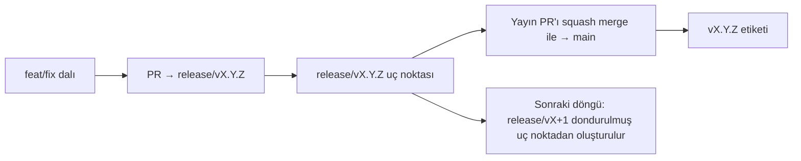

# Branching & Release Model (Türkçe)

🌐 **Languages:** 🇺🇸 [English](../../../../ops/BRANCHING_MODEL.md) · 🇪🇹 [am](../../../am/docs/ops/BRANCHING_MODEL.md) · 🇸🇦 [ar](../../../ar/docs/ops/BRANCHING_MODEL.md) · 🇦🇿 [az](../../../az/docs/ops/BRANCHING_MODEL.md) · 🇧🇬 [bg](../../../bg/docs/ops/BRANCHING_MODEL.md) · 🇧🇩 [bn](../../../bn/docs/ops/BRANCHING_MODEL.md) · 🇧🇦 [bs](../../../bs/docs/ops/BRANCHING_MODEL.md) · 🇨🇿 [cs](../../../cs/docs/ops/BRANCHING_MODEL.md) · 🇩🇰 [da](../../../da/docs/ops/BRANCHING_MODEL.md) · 🇩🇪 [de](../../../de/docs/ops/BRANCHING_MODEL.md) · 🇬🇷 [el](../../../el/docs/ops/BRANCHING_MODEL.md) · 🇪🇸 [es](../../../es/docs/ops/BRANCHING_MODEL.md) · 🇪🇪 [et](../../../et/docs/ops/BRANCHING_MODEL.md) · 🇮🇷 [fa](../../../fa/docs/ops/BRANCHING_MODEL.md) · 🇫🇮 [fi](../../../fi/docs/ops/BRANCHING_MODEL.md) · 🇫🇷 [fr](../../../fr/docs/ops/BRANCHING_MODEL.md) · 🇮🇪 [ga](../../../ga/docs/ops/BRANCHING_MODEL.md) · 🇮🇳 [gu](../../../gu/docs/ops/BRANCHING_MODEL.md) · 🇳🇬 [ha](../../../ha/docs/ops/BRANCHING_MODEL.md) · 🇮🇱 [he](../../../he/docs/ops/BRANCHING_MODEL.md) · 🇮🇳 [hi](../../../hi/docs/ops/BRANCHING_MODEL.md) · 🇭🇷 [hr](../../../hr/docs/ops/BRANCHING_MODEL.md) · 🇭🇺 [hu](../../../hu/docs/ops/BRANCHING_MODEL.md) · 🇦🇲 [hy](../../../hy/docs/ops/BRANCHING_MODEL.md) · 🇮🇩 [id](../../../id/docs/ops/BRANCHING_MODEL.md) · 🇳🇬 [ig](../../../ig/docs/ops/BRANCHING_MODEL.md) · 🇮🇹 [it](../../../it/docs/ops/BRANCHING_MODEL.md) · 🇯🇵 [ja](../../../ja/docs/ops/BRANCHING_MODEL.md) · 🇬🇪 [ka](../../../ka/docs/ops/BRANCHING_MODEL.md) · 🇰🇭 [km](../../../km/docs/ops/BRANCHING_MODEL.md) · 🇮🇳 [kn](../../../kn/docs/ops/BRANCHING_MODEL.md) · 🇰🇷 [ko](../../../ko/docs/ops/BRANCHING_MODEL.md) · 🇱🇹 [lt](../../../lt/docs/ops/BRANCHING_MODEL.md) · 🇱🇻 [lv](../../../lv/docs/ops/BRANCHING_MODEL.md) · 🇮🇳 [ml](../../../ml/docs/ops/BRANCHING_MODEL.md) · 🇮🇳 [mr](../../../mr/docs/ops/BRANCHING_MODEL.md) · 🇲🇾 [ms](../../../ms/docs/ops/BRANCHING_MODEL.md) · 🇲🇹 [mt](../../../mt/docs/ops/BRANCHING_MODEL.md) · 🇲🇲 [my](../../../my/docs/ops/BRANCHING_MODEL.md) · 🇳🇵 [ne](../../../ne/docs/ops/BRANCHING_MODEL.md) · 🇳🇱 [nl](../../../nl/docs/ops/BRANCHING_MODEL.md) · 🇳🇴 [no](../../../no/docs/ops/BRANCHING_MODEL.md) · 🇮🇳 [or](../../../or/docs/ops/BRANCHING_MODEL.md) · 🇮🇳 [pa](../../../pa/docs/ops/BRANCHING_MODEL.md) · 🇵🇭 [phi](../../../phi/docs/ops/BRANCHING_MODEL.md) · 🇵🇱 [pl](../../../pl/docs/ops/BRANCHING_MODEL.md) · 🇵🇹 [pt](../../../pt/docs/ops/BRANCHING_MODEL.md) · 🇧🇷 [pt-BR](../../../pt-BR/docs/ops/BRANCHING_MODEL.md) · 🇷🇴 [ro](../../../ro/docs/ops/BRANCHING_MODEL.md) · 🇷🇺 [ru](../../../ru/docs/ops/BRANCHING_MODEL.md) · 🇱🇰 [si](../../../si/docs/ops/BRANCHING_MODEL.md) · 🇸🇰 [sk](../../../sk/docs/ops/BRANCHING_MODEL.md) · 🇸🇮 [sl](../../../sl/docs/ops/BRANCHING_MODEL.md) · 🇷🇸 [sr](../../../sr/docs/ops/BRANCHING_MODEL.md) · 🇸🇪 [sv](../../../sv/docs/ops/BRANCHING_MODEL.md) · 🇰🇪 [sw](../../../sw/docs/ops/BRANCHING_MODEL.md) · 🇮🇳 [ta](../../../ta/docs/ops/BRANCHING_MODEL.md) · 🇮🇳 [te](../../../te/docs/ops/BRANCHING_MODEL.md) · 🇹🇭 [th](../../../th/docs/ops/BRANCHING_MODEL.md) · 🇺🇦 [uk-UA](../../../uk-UA/docs/ops/BRANCHING_MODEL.md) · 🇵🇰 [ur](../../../ur/docs/ops/BRANCHING_MODEL.md) · 🇺🇿 [uz](../../../uz/docs/ops/BRANCHING_MODEL.md) · 🇻🇳 [vi](../../../vi/docs/ops/BRANCHING_MODEL.md) · 🇳🇬 [yo](../../../yo/docs/ops/BRANCHING_MODEL.md) · 🇨🇳 [zh-CN](../../../zh-CN/docs/ops/BRANCHING_MODEL.md) · 🇹🇼 [zh-TW](../../../zh-TW/docs/ops/BRANCHING_MODEL.md)

---

OmniRoute, **paralel döngü** yayın modelini kullanır: etkin döngü için özel bir `release/vX.Y.Z`
dalı, yayımlanmış hat için `main` ve döngü yayınlandığında değiştirilemez bir
`vX.Y.Z` etiketi. Commit'lerin hem `release/*` dallarına _hem de_
`main` dalına gelmesi beklenen bir durumdur — bir karışıklık değildir.

Bakım sorumlularına yönelik ayrıntılar `CLAUDE.md` (Kesin Kural #21) ve
[RELEASE_CHECKLIST.md](./RELEASE_CHECKLIST.md) dosyalarında yer alır. Bu sayfa,
katkıda bulunanlara yönelik genel özettir.

## Bir bakışta

| Ref               | Rol                                                                                            |
| ----------------- | ---------------------------------------------------------------------------------------------- |
| `release/vX.Y.Z`  | **Etkin döngü** — bu sürüm için günlük geliştirme ve PR birleştirmeleri                        |
| `main`            | **Yayımlanmış hat** — sürüm yayınlandığında döngüyü squash merge yoluyla alır                  |
| `vX.Y.Z` (etiket) | **Yayın işareti** — yayın sırasında oluşturulan, değiştirilemez “yayınlanan içerik” işaretçisi |



## PR'ım hangi dalı hedeflemeli?

**Etkin `release/vX.Y.Z` dalını hedefleyin — `main` dalını değil.**

1. En yüksek açık `release/v*` dalını bulun (bu metnin yazıldığı sıradaki örnek:
   `release/v3.8.49`).
2. Bu dalın uç noktasından yeni bir dal oluşturun (`git fetch` + checkout / bunun üzerine rebase).
3. PR'ı **base = ilgili `release/vX.Y.Z`** olacak şekilde açın.

`main`, günlük entegrasyon dalı değildir. `main` hedef alınarak açılan PR'ların
genellikle birleştirilmeden önce başka bir dalı hedefleyecek şekilde değiştirilmesi gerekir.

## Yayın dondurma (paralel döngüler)

Bir yayın uzlaştırılırken `release-freeze` etiketli bir işaretleyici issue
açılır. Bu, **geliştirmeyi durdurmaz**:

- Dondurulmuş `release/vX.Y.Z`, ilgili yayından sorumlu yayın yöneticisine aittir.
- Katkıda bulunanların çalışmalarını birleştirmeye devam edebilmesi için sonraki döngünün `release/vX+1` dalı dondurulmuş uç noktadan oluşturulur.
- Hâlâ dondurulmuş dalı hedefleyen açık PR'lar, etkin (en yüksek) `release/v*`
  dalını **hedefleyecek şekilde değiştirilmelidir**.

İstediğiniz dalın birleştirilebilir olduğunu varsaymadan önce açık bir dondurma olup olmadığını kontrol edin:

```bash
gh issue list --repo diegosouzapw/OmniRoute --label release-freeze --state open
```

Birleştirme mekanizmaları (sahibin eklediği `queue` etiketi → Mergify)
[MERGE_TRAIN.md](./MERGE_TRAIN.md) belgesinde açıklanmıştır.

## Neden hem dal hem de etiket var?

| Yapı             | Kullanım ömrü    | Amaç                                                                                        |
| ---------------- | ---------------- | ------------------------------------------------------------------------------------------- |
| `release/vX.Y.Z` | Devam eden döngü | İncelenmiş PR'ları toplar, CI testlerini geçer durumda kalır ve PR tabanı olarak kullanılır |
| `vX.Y.Z` etiketi | Sonsuza kadar    | npm / GitHub Releases üzerinde yayımlanan içeriğin tam hâlini işaretler                     |

Dal atölyedir; etiket ise mühürlü pakettir. `main` dalına squash merge yapıldıktan
sonra, önceki yayın PR'ının tamamlanması beklenmeden sonraki döngü `release/vX+1`
üzerinde devam eder.

## İlgili belgeler

- [CONTRIBUTING.md](../../CONTRIBUTING.md) — kurulum, testler, PR kontrol listesi
- [RELEASE_CHECKLIST.md](./RELEASE_CHECKLIST.md) — yayın öncesi doğrulama
- [MERGE_TRAIN.md](./MERGE_TRAIN.md) — birleştirme kuyruğu ve yedek birleştirme treni
- [RELEASE_GREEN.md](./RELEASE_GREEN.md) — yayın uç noktasını sorunsuz durumda tutma
