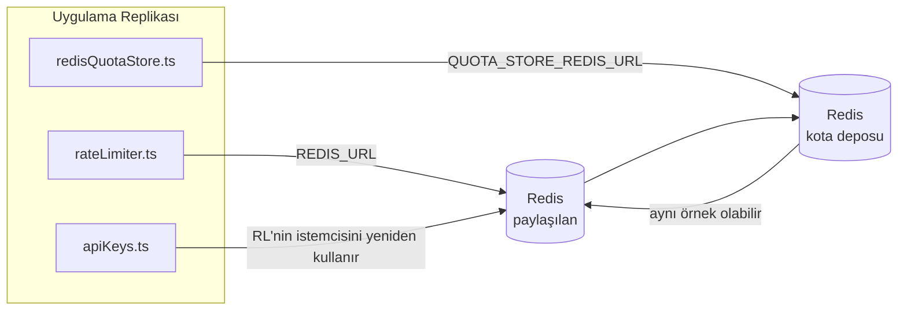

# Redis Production Configuration Guide (Türkçe)

🌐 **Languages:** 🇺🇸 [English](../../../../ops/REDIS_PRODUCTION_CONFIG.md) · 🇪🇹 [am](../../../am/docs/ops/REDIS_PRODUCTION_CONFIG.md) · 🇸🇦 [ar](../../../ar/docs/ops/REDIS_PRODUCTION_CONFIG.md) · 🇦🇿 [az](../../../az/docs/ops/REDIS_PRODUCTION_CONFIG.md) · 🇧🇬 [bg](../../../bg/docs/ops/REDIS_PRODUCTION_CONFIG.md) · 🇧🇩 [bn](../../../bn/docs/ops/REDIS_PRODUCTION_CONFIG.md) · 🇨🇿 [cs](../../../cs/docs/ops/REDIS_PRODUCTION_CONFIG.md) · 🇩🇰 [da](../../../da/docs/ops/REDIS_PRODUCTION_CONFIG.md) · 🇩🇪 [de](../../../de/docs/ops/REDIS_PRODUCTION_CONFIG.md) · 🇬🇷 [el](../../../el/docs/ops/REDIS_PRODUCTION_CONFIG.md) · 🇪🇸 [es](../../../es/docs/ops/REDIS_PRODUCTION_CONFIG.md) · 🇪🇪 [et](../../../et/docs/ops/REDIS_PRODUCTION_CONFIG.md) · 🇮🇷 [fa](../../../fa/docs/ops/REDIS_PRODUCTION_CONFIG.md) · 🇫🇮 [fi](../../../fi/docs/ops/REDIS_PRODUCTION_CONFIG.md) · 🇫🇷 [fr](../../../fr/docs/ops/REDIS_PRODUCTION_CONFIG.md) · 🇮🇪 [ga](../../../ga/docs/ops/REDIS_PRODUCTION_CONFIG.md) · 🇮🇳 [gu](../../../gu/docs/ops/REDIS_PRODUCTION_CONFIG.md) · 🇳🇬 [ha](../../../ha/docs/ops/REDIS_PRODUCTION_CONFIG.md) · 🇮🇱 [he](../../../he/docs/ops/REDIS_PRODUCTION_CONFIG.md) · 🇮🇳 [hi](../../../hi/docs/ops/REDIS_PRODUCTION_CONFIG.md) · 🇭🇷 [hr](../../../hr/docs/ops/REDIS_PRODUCTION_CONFIG.md) · 🇭🇺 [hu](../../../hu/docs/ops/REDIS_PRODUCTION_CONFIG.md) · 🇦🇲 [hy](../../../hy/docs/ops/REDIS_PRODUCTION_CONFIG.md) · 🇮🇩 [id](../../../id/docs/ops/REDIS_PRODUCTION_CONFIG.md) · 🇳🇬 [ig](../../../ig/docs/ops/REDIS_PRODUCTION_CONFIG.md) · 🇮🇹 [it](../../../it/docs/ops/REDIS_PRODUCTION_CONFIG.md) · 🇯🇵 [ja](../../../ja/docs/ops/REDIS_PRODUCTION_CONFIG.md) · 🇬🇪 [ka](../../../ka/docs/ops/REDIS_PRODUCTION_CONFIG.md) · 🇰🇭 [km](../../../km/docs/ops/REDIS_PRODUCTION_CONFIG.md) · 🇮🇳 [kn](../../../kn/docs/ops/REDIS_PRODUCTION_CONFIG.md) · 🇰🇷 [ko](../../../ko/docs/ops/REDIS_PRODUCTION_CONFIG.md) · 🇱🇹 [lt](../../../lt/docs/ops/REDIS_PRODUCTION_CONFIG.md) · 🇱🇻 [lv](../../../lv/docs/ops/REDIS_PRODUCTION_CONFIG.md) · 🇮🇳 [ml](../../../ml/docs/ops/REDIS_PRODUCTION_CONFIG.md) · 🇮🇳 [mr](../../../mr/docs/ops/REDIS_PRODUCTION_CONFIG.md) · 🇲🇾 [ms](../../../ms/docs/ops/REDIS_PRODUCTION_CONFIG.md) · 🇲🇹 [mt](../../../mt/docs/ops/REDIS_PRODUCTION_CONFIG.md) · 🇲🇲 [my](../../../my/docs/ops/REDIS_PRODUCTION_CONFIG.md) · 🇳🇵 [ne](../../../ne/docs/ops/REDIS_PRODUCTION_CONFIG.md) · 🇳🇱 [nl](../../../nl/docs/ops/REDIS_PRODUCTION_CONFIG.md) · 🇳🇴 [no](../../../no/docs/ops/REDIS_PRODUCTION_CONFIG.md) · 🇮🇳 [or](../../../or/docs/ops/REDIS_PRODUCTION_CONFIG.md) · 🇮🇳 [pa](../../../pa/docs/ops/REDIS_PRODUCTION_CONFIG.md) · 🇵🇭 [phi](../../../phi/docs/ops/REDIS_PRODUCTION_CONFIG.md) · 🇵🇱 [pl](../../../pl/docs/ops/REDIS_PRODUCTION_CONFIG.md) · 🇵🇹 [pt](../../../pt/docs/ops/REDIS_PRODUCTION_CONFIG.md) · 🇧🇷 [pt-BR](../../../pt-BR/docs/ops/REDIS_PRODUCTION_CONFIG.md) · 🇷🇴 [ro](../../../ro/docs/ops/REDIS_PRODUCTION_CONFIG.md) · 🇷🇺 [ru](../../../ru/docs/ops/REDIS_PRODUCTION_CONFIG.md) · 🇱🇰 [si](../../../si/docs/ops/REDIS_PRODUCTION_CONFIG.md) · 🇸🇰 [sk](../../../sk/docs/ops/REDIS_PRODUCTION_CONFIG.md) · 🇸🇮 [sl](../../../sl/docs/ops/REDIS_PRODUCTION_CONFIG.md) · 🇷🇸 [sr](../../../sr/docs/ops/REDIS_PRODUCTION_CONFIG.md) · 🇸🇪 [sv](../../../sv/docs/ops/REDIS_PRODUCTION_CONFIG.md) · 🇰🇪 [sw](../../../sw/docs/ops/REDIS_PRODUCTION_CONFIG.md) · 🇮🇳 [ta](../../../ta/docs/ops/REDIS_PRODUCTION_CONFIG.md) · 🇮🇳 [te](../../../te/docs/ops/REDIS_PRODUCTION_CONFIG.md) · 🇹🇭 [th](../../../th/docs/ops/REDIS_PRODUCTION_CONFIG.md) · 🇺🇦 [uk-UA](../../../uk-UA/docs/ops/REDIS_PRODUCTION_CONFIG.md) · 🇵🇰 [ur](../../../ur/docs/ops/REDIS_PRODUCTION_CONFIG.md) · 🇺🇿 [uz](../../../uz/docs/ops/REDIS_PRODUCTION_CONFIG.md) · 🇻🇳 [vi](../../../vi/docs/ops/REDIS_PRODUCTION_CONFIG.md) · 🇳🇬 [yo](../../../yo/docs/ops/REDIS_PRODUCTION_CONFIG.md) · 🇨🇳 [zh-CN](../../../zh-CN/docs/ops/REDIS_PRODUCTION_CONFIG.md) · 🇹🇼 [zh-TW](../../../zh-TW/docs/ops/REDIS_PRODUCTION_CONFIG.md)

---

## Genel Bakış

Redis, OmniRoute'ta **isteğe bağlı, zorunlu olmayan bir bağımlılıktır** — Redis kullanılamadığında uygulama
sorunsuz biçimde daha düşük kapasiteli çalışma moduna geçer (bellek içi geri dönüşler). Üretim ortamında Redis'i ayarlamak, dört farklı
iş yükü için gecikmeyi azaltır:

| İş Yükü                    | Sürücü                        | İstemci Fabrikası                                             | Anahtar Kalıbı                                       |
| -------------------------- | ----------------------------- | ------------------------------------------------------------- | ---------------------------------------------------- |
| Hız sınırlama              | `rateLimiter.ts`              | `getRedisClient()` — tembel başlatılan tekil `ioredis` örneği | `<prefix>rl:*` Lua ile atomik hız sınırı pencereleri |
| Kimlik doğrulama önbelleği | `apiKeys.ts`                  | `rateLimiter` istemcisini yeniden kullanır                    | TTL ile `<prefix>auth:api_key:<sha256>`              |
| Kota deposu                | `redisQuotaStore.ts`          | Ayrı `getRedisClient(url)` tekil örneği                       | `<prefix>quota:*`, örnek başına yapılandırılabilir   |
| Isınma devre kesicisi      | `redisCircuitBreakerStore.ts` | `circuitBreakerFactory.ts` içinde ayrı istemci                | `<prefix>warmup:cb:<connectionId>`                   |

OmniRoute'un tek bir Redis örneğinde (ör. `127.0.0.1:6379`) diğer uygulamalarla birlikte
çalışabilmesi için dört iş yükünün tamamı aynı ad alanı önekini paylaşır. Bkz. [Anahtar Ad Alanları](#key-namespacing).

---

## Geçerli Yapılandırma (Kod Varsayılanları)

| Ayar                                    | Değer                                                    | Konum                                                                                 |
| --------------------------------------- | -------------------------------------------------------- | ------------------------------------------------------------------------------------- |
| `REDIS_URL` ortam değişkeni             | `redis://redis:6379` (compose), isteğe bağlı             | `rateLimiter.ts:5`, `.env.example`                                                    |
| `REDIS_KEY_PREFIX` ortam değişkeni      | `omniroute:` (varsayılan)                                | `rateLimiter.ts`, `redisQuotaStore.ts`, `redisCircuitBreakerStore.ts`, `.env.example` |
| `QUOTA_STORE_REDIS_URL` ortam değişkeni | ayrı olabilir, `REDIS_URL` değerinden farklı olabilir    | `quota/storeFactory.ts`                                                               |
| `QUOTA_STORE_DRIVER`                    | `"sqlite"` (varsayılan), `"redis"` isteğe bağlı          | `quota/storeFactory.ts`                                                               |
| ioredis `maxRetriesPerRequest`          | `3`                                                      | `rateLimiter.ts` istemci oluşturma işlemi                                             |
| `enableReadyCheck`                      | ayarlanmamış (ioredis varsayılanı: `true`)               | —                                                                                     |
| `lazyConnect`                           | ayarlanmamış (ioredis varsayılanı: `false`)              | —                                                                                     |
| `retryStrategy`                         | ayarlanmamış (ioredis varsayılanı: 200ms tabanlı, üstel) | —                                                                                     |
| TLS / parola / DB dizini                | **yapılandırılmamış**                                    | —                                                                                     |
| Sentinel / Cluster                      | **yapılandırılmamış** — yalnızca bağımsız tek düğüm      | —                                                                                     |

---

## Anahtar Ad Alanları

OmniRoute, bir Redis örneğini ana makinede çalışan diğer hizmetlerle paylaşır. Bir ad alanı olmadan
`auth:api_key:<sha256>` veya `rl:*` gibi anahtarlar, aynı Redis'i kullanan diğer uygulamaların
anahtarlarıyla çakışabilir (bu örnek, diğer hizmetlerle birlikte `127.0.0.1:6379` üzerinde Redis çalıştırır).

**Her** OmniRoute anahtarına önek eklemek için `REDIS_KEY_PREFIX` değerini boş olmayan bir dize olarak ayarlayın:

```bash
# .env — tüm OmniRoute anahtarları omniroute:rl:*, omniroute:auth:*, omniroute:quota:*, omniroute:warmup:cb:* olur
REDIS_KEY_PREFIX=omniroute:
```

- **Varsayılan:** `omniroute:` (`REDIS_KEY_PREFIX` ayarlanmamış veya boş olduğunda uygulanır).
- **Uygulandığı yerler:** hız sınırlayıcı + kimlik doğrulama önbelleği (`keyPrefix` aracılığıyla paylaşılan `ioredis` istemcisi),
  kota deposu (`KEY_PREFIX = "${REDIS_KEY_PREFIX}quota"`) ve ısınma devre kesicisi
  (`KEY_PREFIX = "${REDIS_KEY_PREFIX}warmup:cb:"`).
- Redis'te anahtarlar zaten mevcutken **öneki değiştirmek**, eski anahtarları sahipsiz bırakır (TTL / LRU
  aracılığıyla süreleri dolar). Değiştirmek güvenlidir; geçiş gerekmez. Bunun tek istisnası, yasaklı olarak
  işaretlenmiş bir bağlantıya ait ısınma devre kesicisi anahtarıdır: bu anahtar TTL olmadan kalıcı hâle getirilir; bu nedenle
  kalanları `redis-cli --scan --pattern '<old-prefix>warmup:cb:*'` ile listeleyip silin.
- **ioredis `keyPrefix`**, yazma işlemlerinde öneki otomatik olarak ekler **ve** okuma işlemlerinde kaldırır;
  dolayısıyla uygulama kodu öneki hiçbir zaman görmez.

---

## Önerilen Üretim Ortamı Ayarları

### 1. Bağlantı Havuzu / İstemci Seçenekleri (ioredis `Redis` constructor)

Mevcut kod, özel seçenekler olmadan tek bir `new Redis(url)` oluşturur. Üretim ortamındaki
çok replikalı dağıtımlar için kod içinde bir istemci fabrikası sağlayın veya `getRedisClient()` işlevini sarmalayın:

```typescript
const redis = new Redis(REDIS_URL, {
  maxRetriesPerRequest: null, // yeniden deneme sınırı yok; kararı retryStrategy versin
  enableReadyCheck: true, // çağrıları kabul etmeden önce sunucunun hazır olduğunu doğrula
  lazyConnect: true, // oluşturma sırasında bağlanma; ilk çağrıyı bekle
  retryStrategy: (times) => {
    if (times > 10) return null; // 10 yeniden denemeden sonra vazgeç → daha sonra yeniden bağlan
    return Math.min(times * 200, 5000); // 200ms, 400ms, …, üst sınır 5s
  },
  enableAutoPipelining: true, // eş zamanlı komutları tek bir TCP yazma işleminde birleştir
  keepAlive: 10000, // her 10s'de bir TCP bağlantısını canlı tut
});
```

**Temel ödünleşimler:**

- `maxRetriesPerRequest: null` + `retryStrategy` — geçici Redis yeniden başlatmalarının
  her isteğin hemen başarısız olmasına neden olmaması için üretim ortamında tercih edilir.
  `checkRateLimit()` içindeki bellek içi geri dönüş mekanizması, hata yolunu karşılar.
- `lazyConnect: true` — sunucu bağlantıları kabul etmeye başlamadan önce Redis'in çalışır
  durumda olmasına yönelik başlangıç bağımlılığını önler.
- `enableAutoPipelining: true` — eş zamanlı hız sınırı denetimlerinde gidiş-dönüşleri azaltır;
  tek bağlantıda >50 RPS için faydalıdır.

### 2. Redis Sunucu Yapılandırması (`redis.conf`)

```
# Bellek
maxmemory 80%                        # işletim sistemi sayfa önbelleği için yer bırak
maxmemory-policy allkeys-lru         # baskı altında eski kimlik doğrulama önbelleği girdilerini çıkar

# Kalıcılık (isteğe bağlı — OmniRoute bu olmadan da çökmelere karşı güvenlidir)
save 300 1                           # ≥1 anahtar değiştiyse en az her 5 dakikada bir anlık görüntü al
appendonly no                        # AOF gerekli değil; veriler yeniden oluşturulabilir
appendfsync no                       # fsync ek yükü yok (RDB yeterlidir)

# Ağ
timeout 0                            # boşta kalan bağlantıyı kesme
tcp-keepalive 300                    # 5 dakikalık bağlantıyı canlı tutma aralığı
tcp-backlog 511                      # ani yükler için bağlantı bekleme kuyruğu

# Performans
hz 10                                # varsayılan; gecikmeye duyarlı kullanım için 100
activedefrag yes                     # parçalanma >%10 olduğunda otomatik birleştir
```

**`maxmemory-policy allkeys-lru` için ödünleşim:** Kimlik doğrulama önbelleği girdileri,
bellek baskısı altında çıkarılabilir. Bu güvenlidir — `setCachedApiKey`, önbellekte bulunamadığında
her zaman girdiyi yeniden doldurur ve SQLite geri dönüşü yetkili kaynaktır. Hız sınırlayıcı Lua
betiği, tasarım gereği kısa ömürlü olan küçük anahtarlar oluşturur.

### 3. Docker Compose Ayarları

Üretim compose dosyası (`docker-compose.prod.yml`), `redis:8.6.2-alpine` kullanır. Şunları ekleyin:

```yaml
redis:
  image: redis:8.6.2-alpine
  command:
    [
      "redis-server",
      "--maxmemory",
      "512mb",
      "--maxmemory-policy",
      "allkeys-lru",
      "--activedefrag",
      "yes",
      "--save",
      "300 1",
    ]
  healthcheck:
    test: ["CMD", "redis-cli", "ping"]
    interval: 10s
    timeout: 3s
    retries: 3
    start_period: 5s
```

### 4. Çoklu Örnek / Ölçeklendirme Hususları

**Tüm replikalar için tek Redis** — hız sınırlayıcı Lua betiği, tek ve yetkili bir anahtar
alanına bağlıdır. Replikaların arkasındaki birden fazla Redis örneği atomikliği kaybeder
ve bütçeyi ikiye katlar. Tüm uygulama replikaları için tek bir Redis (veya yük devretme
özellikli Redis Sentinel kümesi) kullanın.

**Bağlantı sayısı:** Her uygulama replikası Redis'e **2 TCP bağlantısı** açar
(hız sınırlayıcı istemcisi + kota deposu istemcisi). 10 replikada → 20 bağlantı oluşur;
bu, varsayılan bir Redis örneğinin 10k bağlantı üst sınırının oldukça altındadır.

### 5. İzleme

Durum denetimi uç noktası üzerinden kullanıma sunun:

```typescript
// src/app/api/monitoring/health/route.ts zaten rateLimiter işlevlerini çağırıyor
// Redis'e özgü denetimler ekleyin:
//   1. ioredis .ping() aracılığıyla PING gecikmesi
//   2. INFO memory aracılığıyla bellek kullanımı
//   3. INFO clients aracılığıyla bağlantı sayısı
//   4. maxmemory-policy için isabet oranı (evicted_keys / keyspace_hits)
```

İzlenecek temel metrikler:

- **Çıkarılan anahtarlar / sn** — sürekli olarak sıfırdan farklıysa `maxmemory` değerini artırın
- **Engellenen istemciler** — sıfırdan farklı olması, yavaş Lua betiklerine veya yüksek çekişmeye işaret eder
- **Reddedilen bağlantılar** — bağlantı sınırına ulaşıldı; 20 bağlantıda nadir görülür

---

## Mimari Diyagramı



---

## Referanslar

| Dosya                              | Amaç                                                                      |
| ---------------------------------- | ------------------------------------------------------------------------- |
| `src/shared/utils/rateLimiter.ts`  | Birincil Redis istemcisi, Lua hız sınırlama betiği, bellek içi geri dönüş |
| `src/lib/db/apiKeys.ts`            | Kimlik doğrulama önbelleği — Redis→SQLite geri dönüşü                     |
| `src/lib/quota/redisQuotaStore.ts` | İsteğe bağlı kota deposu için ayrı Redis istemcisi                        |
| `src/lib/quota/storeFactory.ts`    | `sqlite` ve `redis` kota sürücüleri arasında geçiş yapar                  |
| `docker-compose.prod.yml`          | Üretim Redis konteyneri (`redis:8.6.2-alpine` imajı)                      |
| `.env.example`                     | Redis ortam değişkenleri dokümantasyonu                                   |
| `src/app/api/local/redis/`         | Geliştirme konteyneri orkestrasyonu için API rotaları                     |
| `bin/cli/commands/redis.mjs`       | Geliştirme konteyneri orkestrasyonu için CLI komutları                    |
