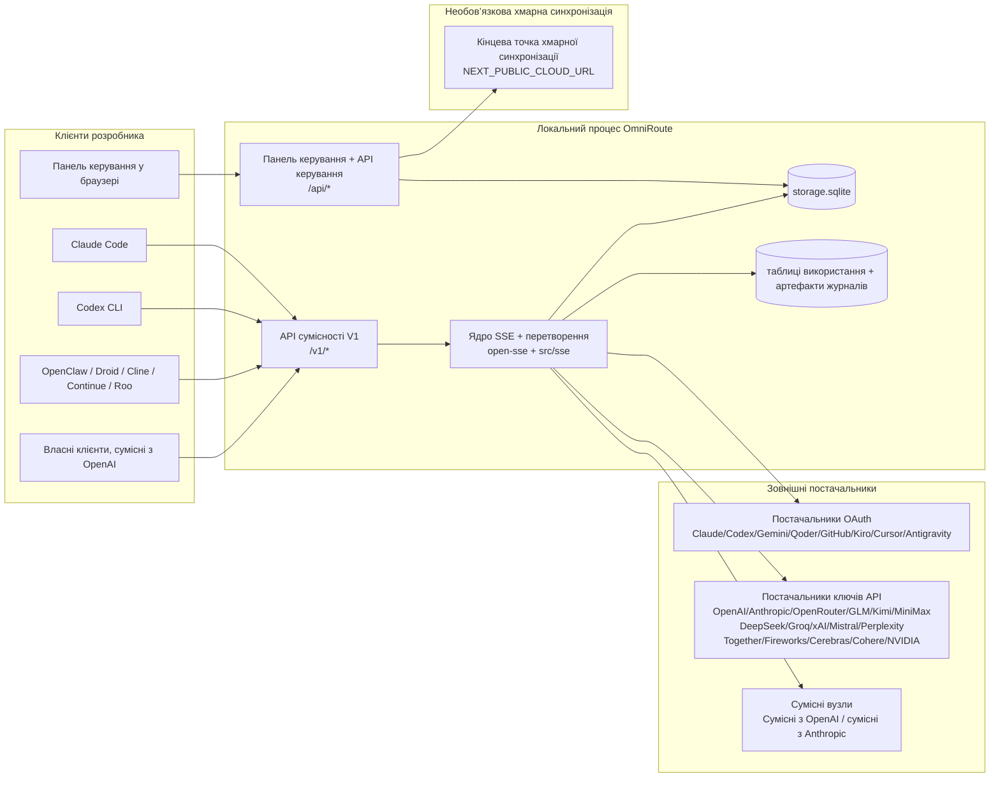
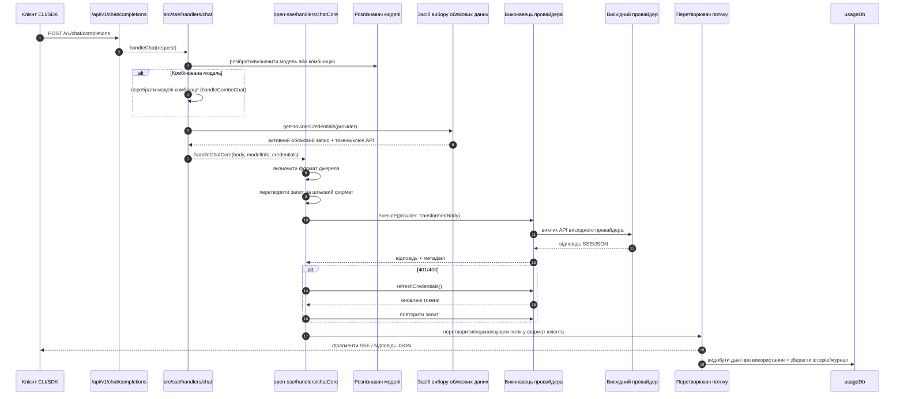
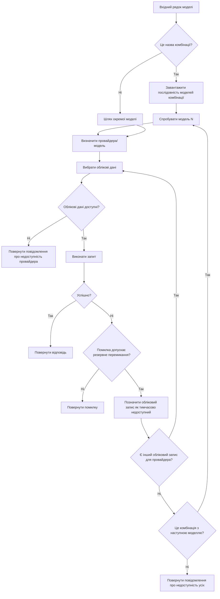
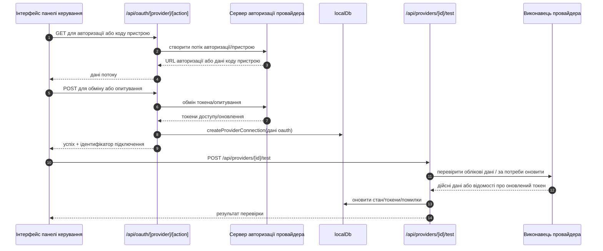
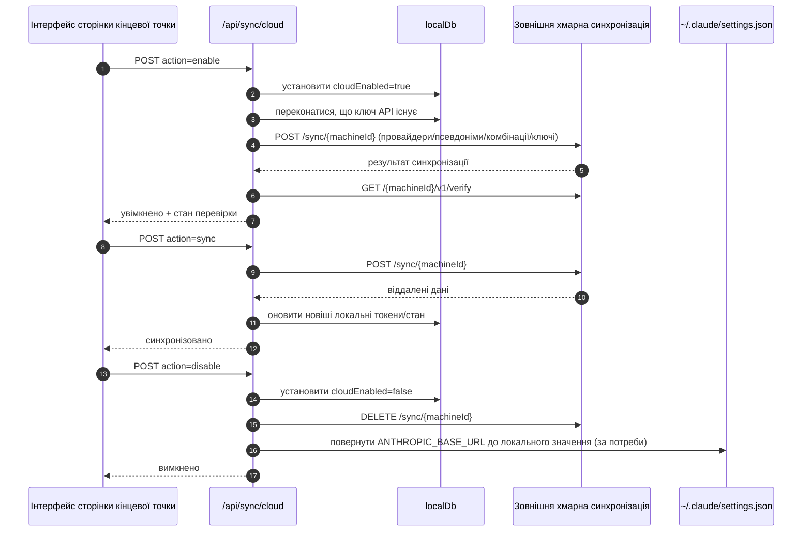
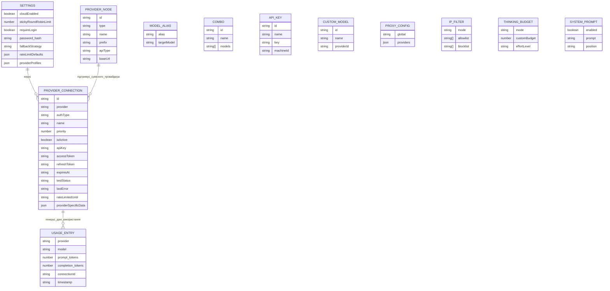
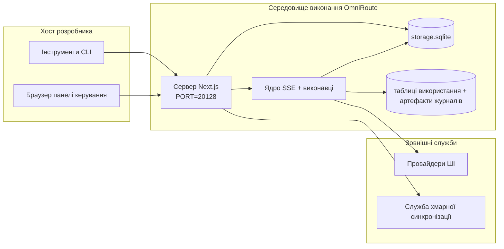

# OmniRoute Architecture (Українська)

🌐 **Languages:** 🇺🇸 [English](../../../../architecture/ARCHITECTURE.md) · 🇪🇹 [am](../../../am/docs/architecture/ARCHITECTURE.md) · 🇸🇦 [ar](../../../ar/docs/architecture/ARCHITECTURE.md) · 🇦🇿 [az](../../../az/docs/architecture/ARCHITECTURE.md) · 🇧🇬 [bg](../../../bg/docs/architecture/ARCHITECTURE.md) · 🇧🇩 [bn](../../../bn/docs/architecture/ARCHITECTURE.md) · 🇨🇿 [cs](../../../cs/docs/architecture/ARCHITECTURE.md) · 🇩🇰 [da](../../../da/docs/architecture/ARCHITECTURE.md) · 🇩🇪 [de](../../../de/docs/architecture/ARCHITECTURE.md) · 🇬🇷 [el](../../../el/docs/architecture/ARCHITECTURE.md) · 🇪🇸 [es](../../../es/docs/architecture/ARCHITECTURE.md) · 🇪🇪 [et](../../../et/docs/architecture/ARCHITECTURE.md) · 🇮🇷 [fa](../../../fa/docs/architecture/ARCHITECTURE.md) · 🇫🇮 [fi](../../../fi/docs/architecture/ARCHITECTURE.md) · 🇫🇷 [fr](../../../fr/docs/architecture/ARCHITECTURE.md) · 🇮🇪 [ga](../../../ga/docs/architecture/ARCHITECTURE.md) · 🇮🇳 [gu](../../../gu/docs/architecture/ARCHITECTURE.md) · 🇳🇬 [ha](../../../ha/docs/architecture/ARCHITECTURE.md) · 🇮🇱 [he](../../../he/docs/architecture/ARCHITECTURE.md) · 🇮🇳 [hi](../../../hi/docs/architecture/ARCHITECTURE.md) · 🇭🇷 [hr](../../../hr/docs/architecture/ARCHITECTURE.md) · 🇭🇺 [hu](../../../hu/docs/architecture/ARCHITECTURE.md) · 🇦🇲 [hy](../../../hy/docs/architecture/ARCHITECTURE.md) · 🇮🇩 [id](../../../id/docs/architecture/ARCHITECTURE.md) · 🇳🇬 [ig](../../../ig/docs/architecture/ARCHITECTURE.md) · 🇮🇹 [it](../../../it/docs/architecture/ARCHITECTURE.md) · 🇯🇵 [ja](../../../ja/docs/architecture/ARCHITECTURE.md) · 🇬🇪 [ka](../../../ka/docs/architecture/ARCHITECTURE.md) · 🇰🇭 [km](../../../km/docs/architecture/ARCHITECTURE.md) · 🇮🇳 [kn](../../../kn/docs/architecture/ARCHITECTURE.md) · 🇰🇷 [ko](../../../ko/docs/architecture/ARCHITECTURE.md) · 🇱🇹 [lt](../../../lt/docs/architecture/ARCHITECTURE.md) · 🇱🇻 [lv](../../../lv/docs/architecture/ARCHITECTURE.md) · 🇮🇳 [ml](../../../ml/docs/architecture/ARCHITECTURE.md) · 🇮🇳 [mr](../../../mr/docs/architecture/ARCHITECTURE.md) · 🇲🇾 [ms](../../../ms/docs/architecture/ARCHITECTURE.md) · 🇲🇹 [mt](../../../mt/docs/architecture/ARCHITECTURE.md) · 🇲🇲 [my](../../../my/docs/architecture/ARCHITECTURE.md) · 🇳🇵 [ne](../../../ne/docs/architecture/ARCHITECTURE.md) · 🇳🇱 [nl](../../../nl/docs/architecture/ARCHITECTURE.md) · 🇳🇴 [no](../../../no/docs/architecture/ARCHITECTURE.md) · 🇮🇳 [or](../../../or/docs/architecture/ARCHITECTURE.md) · 🇮🇳 [pa](../../../pa/docs/architecture/ARCHITECTURE.md) · 🇵🇭 [phi](../../../phi/docs/architecture/ARCHITECTURE.md) · 🇵🇱 [pl](../../../pl/docs/architecture/ARCHITECTURE.md) · 🇵🇹 [pt](../../../pt/docs/architecture/ARCHITECTURE.md) · 🇧🇷 [pt-BR](../../../pt-BR/docs/architecture/ARCHITECTURE.md) · 🇷🇴 [ro](../../../ro/docs/architecture/ARCHITECTURE.md) · 🇷🇺 [ru](../../../ru/docs/architecture/ARCHITECTURE.md) · 🇱🇰 [si](../../../si/docs/architecture/ARCHITECTURE.md) · 🇸🇰 [sk](../../../sk/docs/architecture/ARCHITECTURE.md) · 🇸🇮 [sl](../../../sl/docs/architecture/ARCHITECTURE.md) · 🇷🇸 [sr](../../../sr/docs/architecture/ARCHITECTURE.md) · 🇸🇪 [sv](../../../sv/docs/architecture/ARCHITECTURE.md) · 🇰🇪 [sw](../../../sw/docs/architecture/ARCHITECTURE.md) · 🇮🇳 [ta](../../../ta/docs/architecture/ARCHITECTURE.md) · 🇮🇳 [te](../../../te/docs/architecture/ARCHITECTURE.md) · 🇹🇭 [th](../../../th/docs/architecture/ARCHITECTURE.md) · 🇹🇷 [tr](../../../tr/docs/architecture/ARCHITECTURE.md) · 🇵🇰 [ur](../../../ur/docs/architecture/ARCHITECTURE.md) · 🇺🇿 [uz](../../../uz/docs/architecture/ARCHITECTURE.md) · 🇻🇳 [vi](../../../vi/docs/architecture/ARCHITECTURE.md) · 🇳🇬 [yo](../../../yo/docs/architecture/ARCHITECTURE.md) · 🇨🇳 [zh-CN](../../../zh-CN/docs/architecture/ARCHITECTURE.md) · 🇹🇼 [zh-TW](../../../zh-TW/docs/architecture/ARCHITECTURE.md)

---

🌐 **Languages:** 🇺🇸 [English](../../../../architecture/ARCHITECTURE.md) · 🇪🇹 [am](../../../am/docs/architecture/ARCHITECTURE.md) · 🇸🇦 [ar](../../../ar/docs/architecture/ARCHITECTURE.md) · 🇦🇿 [az](../../../az/docs/architecture/ARCHITECTURE.md) · 🇧🇬 [bg](../../../bg/docs/architecture/ARCHITECTURE.md) · 🇧🇩 [bn](../../../bn/docs/architecture/ARCHITECTURE.md) · 🇨🇿 [cs](../../../cs/docs/architecture/ARCHITECTURE.md) · 🇩🇰 [da](../../../da/docs/architecture/ARCHITECTURE.md) · 🇩🇪 [de](../../../de/docs/architecture/ARCHITECTURE.md) · 🇬🇷 [el](../../../el/docs/architecture/ARCHITECTURE.md) · 🇪🇸 [es](../../../es/docs/architecture/ARCHITECTURE.md) · 🇪🇪 [et](../../../et/docs/architecture/ARCHITECTURE.md) · 🇮🇷 [fa](../../../fa/docs/architecture/ARCHITECTURE.md) · 🇫🇮 [fi](../../../fi/docs/architecture/ARCHITECTURE.md) · 🇫🇷 [fr](../../../fr/docs/architecture/ARCHITECTURE.md) · 🇮🇪 [ga](../../../ga/docs/architecture/ARCHITECTURE.md) · 🇮🇳 [gu](../../../gu/docs/architecture/ARCHITECTURE.md) · 🇳🇬 [ha](../../../ha/docs/architecture/ARCHITECTURE.md) · 🇮🇱 [he](../../../he/docs/architecture/ARCHITECTURE.md) · 🇮🇳 [hi](../../../hi/docs/architecture/ARCHITECTURE.md) · 🇭🇷 [hr](../../../hr/docs/architecture/ARCHITECTURE.md) · 🇭🇺 [hu](../../../hu/docs/architecture/ARCHITECTURE.md) · 🇦🇲 [hy](../../../hy/docs/architecture/ARCHITECTURE.md) · 🇮🇩 [id](../../../id/docs/architecture/ARCHITECTURE.md) · 🇳🇬 [ig](../../../ig/docs/architecture/ARCHITECTURE.md) · 🇮🇹 [it](../../../it/docs/architecture/ARCHITECTURE.md) · 🇯🇵 [ja](../../../ja/docs/architecture/ARCHITECTURE.md) · 🇬🇪 [ka](../../../ka/docs/architecture/ARCHITECTURE.md) · 🇰🇭 [km](../../../km/docs/architecture/ARCHITECTURE.md) · 🇮🇳 [kn](../../../kn/docs/architecture/ARCHITECTURE.md) · 🇰🇷 [ko](../../../ko/docs/architecture/ARCHITECTURE.md) · 🇱🇹 [lt](../../../lt/docs/architecture/ARCHITECTURE.md) · 🇱🇻 [lv](../../../lv/docs/architecture/ARCHITECTURE.md) · 🇮🇳 [ml](../../../ml/docs/architecture/ARCHITECTURE.md) · 🇮🇳 [mr](../../../mr/docs/architecture/ARCHITECTURE.md) · 🇲🇾 [ms](../../../ms/docs/architecture/ARCHITECTURE.md) · 🇲🇹 [mt](../../../mt/docs/architecture/ARCHITECTURE.md) · 🇲🇲 [my](../../../my/docs/architecture/ARCHITECTURE.md) · 🇳🇵 [ne](../../../ne/docs/architecture/ARCHITECTURE.md) · 🇳🇱 [nl](../../../nl/docs/architecture/ARCHITECTURE.md) · 🇳🇴 [no](../../../no/docs/architecture/ARCHITECTURE.md) · 🇮🇳 [or](../../../or/docs/architecture/ARCHITECTURE.md) · 🇮🇳 [pa](../../../pa/docs/architecture/ARCHITECTURE.md) · 🇵🇭 [phi](../../../phi/docs/architecture/ARCHITECTURE.md) · 🇵🇱 [pl](../../../pl/docs/architecture/ARCHITECTURE.md) · 🇵🇹 [pt](../../../pt/docs/architecture/ARCHITECTURE.md) · 🇧🇷 [pt-BR](../../../pt-BR/docs/architecture/ARCHITECTURE.md) · 🇷🇴 [ro](../../../ro/docs/architecture/ARCHITECTURE.md) · 🇷🇺 [ru](../../../ru/docs/architecture/ARCHITECTURE.md) · 🇱🇰 [si](../../../si/docs/architecture/ARCHITECTURE.md) · 🇸🇰 [sk](../../../sk/docs/architecture/ARCHITECTURE.md) · 🇸🇮 [sl](../../../sl/docs/architecture/ARCHITECTURE.md) · 🇷🇸 [sr](../../../sr/docs/architecture/ARCHITECTURE.md) · 🇸🇪 [sv](../../../sv/docs/architecture/ARCHITECTURE.md) · 🇰🇪 [sw](../../../sw/docs/architecture/ARCHITECTURE.md) · 🇮🇳 [ta](../../../ta/docs/architecture/ARCHITECTURE.md) · 🇮🇳 [te](../../../te/docs/architecture/ARCHITECTURE.md) · 🇹🇭 [th](../../../th/docs/architecture/ARCHITECTURE.md) · 🇹🇷 [tr](../../../tr/docs/architecture/ARCHITECTURE.md) · 🇵🇰 [ur](../../../ur/docs/architecture/ARCHITECTURE.md) · 🇺🇿 [uz](../../../uz/docs/architecture/ARCHITECTURE.md) · 🇻🇳 [vi](../../../vi/docs/architecture/ARCHITECTURE.md) · 🇳🇬 [yo](../../../yo/docs/architecture/ARCHITECTURE.md) · 🇨🇳 [zh-CN](../../../zh-CN/docs/architecture/ARCHITECTURE.md) · 🇹🇼 [zh-TW](../../../zh-TW/docs/architecture/ARCHITECTURE.md)

_Останнє оновлення: 2026-06-28_

## Короткий огляд

OmniRoute — це локальний шлюз маршрутизації ШІ та інформаційна панель, створені на базі Next.js.
Він надає єдину OpenAI-сумісну кінцеву точку (`/v1/*`) і маршрутизує трафік між кількома висхідними провайдерами з трансляцією, резервним перемиканням, оновленням токенів і відстеженням використання.

Основні можливості:

- OpenAI-сумісна поверхня API для CLI/інструментів (355 провайдерів, 108 виконавців)
- Трансляція запитів/відповідей між форматами провайдерів
- Резервне перемикання комбінацій моделей (послідовність із кількох моделей)
- Структуровані кроки комбінацій (`provider + model + connection`) із визначенням порядку під час виконання за допомогою `compositeTiers`
- Резервне перемикання на рівні облікових записів (кілька облікових записів для кожного провайдера)
- Попередня перевірка квоти та вибір облікового запису P2C з урахуванням квоти в основному потоці чату
- Керування підключеннями до провайдерів через OAuth та API-ключі (22 модулі OAuth-провайдерів)
- Створення вбудовувань через `/v1/embeddings` (18 провайдерів)
- Генерування зображень через `/v1/images/generations` (понад 10 провайдерів, понад 20 моделей)
- Транскрибування аудіо через `/v1/audio/transcriptions` (18 провайдерів)
- Перетворення тексту на мовлення через `/v1/audio/speech` (24 вбудовані провайдери)
- Генерування відео через `/v1/videos/generations` (ComfyUI + SD WebUI)
- Генерування музики через `/v1/music/generations` (ComfyUI)
- Вебпошук через `/v1/search` (20 провайдерів)
- Модерація через `/v1/moderations`
- Повторне ранжування через `/v1/rerank`
- Розбір тегів міркувань (`<think>...</think>`) для моделей із логічним міркуванням
- Очищення відповідей для суворої сумісності з OpenAI SDK
- Нормалізація ролей (developer→system, system→user) для сумісності між провайдерами
- Перетворення структурованого виводу (json_schema → Gemini responseSchema)
- Локальне зберігання провайдерів, ключів, псевдонімів, комбінацій, налаштувань і цін (122 модулі БД)
- Відстеження використання/вартості та журналювання запитів
- Необов’язкова хмарна синхронізація для синхронізації стану між кількома пристроями
- Список дозволених/заблокованих IP-адрес для контролю доступу до API
- Керування бюджетом міркувань (наскрізний/автоматичний/власний/адаптивний)
- Глобальне впровадження системного запиту
- Відстеження сесій і створення цифрових відбитків
- Розширене обмеження частоти запитів для кожного облікового запису з профілями, специфічними для провайдера
- Шаблон автоматичного вимикача для забезпечення стійкості провайдерів
- Захист від ефекту «стада, що мчить» за допомогою м’ютекс-блокування
- Кеш дедуплікації запитів на основі сигнатур
- Доменний рівень: правила вартості, політика резервного перемикання, політика блокування
- Context Relay: зведення для передавання сеансу, що забезпечують безперервність під час ротації облікових записів
- Збереження стану домену (кеш SQLite із наскрізним записом для резервних перемикань, бюджетів, блокувань і автоматичних вимикачів)
- Рушій політик для централізованого оцінювання запитів (блокування → бюджет → резервне перемикання)
- Телеметрія запитів з агрегацією затримок p50/p95/p99
- Телеметрія цілей комбінацій та історичні дані про стан цілей комбінацій через `combo_execution_key` / `combo_step_id`
- Ідентифікатор кореляції (X-Request-Id) для наскрізного трасування
- Журналювання аудиту відповідності з можливістю відмови для кожного API-ключа
- Фреймворк оцінювання для забезпечення якості LLM
- Панель моніторингу стану зі статусом автоматичних вимикачів провайдерів у реальному часі
- Сервер MCP (110 інструментів) із 3 транспортами (stdio/SSE/Streamable HTTP)
- Сервер A2A (JSON-RPC 2.0 + SSE) із навичками та життєвим циклом завдань
- Система пам’яті (видобування, впровадження, пошук, узагальнення)
- Система навичок (реєстр, виконавець, пісочниця, вбудовані навички)
- Проксі MITM із керуванням сертифікатами та обробкою DNS
- Проміжне ПЗ захисту від ін’єкцій у запити
- Конвеєр стиснення запитів із Caveman, RTK, стековими конвеєрами, комбінаціями стиснення, мовними пакетами й аналітикою
- Реєстр ACP (Agent Communication Protocol)
- Модульні OAuth-провайдери (22 окремі модулі в `src/lib/oauth/providers/`)
- Сценарії видалення/повного видалення
- Дія з відновлення середовища OAuth
- Міст WebSocket для OpenAI-сумісних клієнтів WS (`/v1/ws`)
- Керування токенами синхронізації (випуск/відкликання, завантаження пакета конфігурації з версіями ETag)
- Першокласний профіль провайдера GLM Thinking (`glmt`)
- Гібридний підрахунок токенів (на стороні провайдера через `/messages/count_tokens` із резервним оцінюванням)
- Автоматичне початкове заповнення псевдонімів моделей (понад 30 нормалізацій діалектів між проксі під час запуску)
- Безпечні вихідні запити з перевіркою SSRF, блокуванням приватних URL-адрес і налаштовуваними повторними спробами
- Повторні спроби чату з урахуванням періоду очікування та налаштовуваними `requestRetry` і `maxRetryIntervalSec`
- Перевірка середовища виконання за допомогою Zod під час запуску
- Аудит відповідності v2 із пагінацією, подіями CRUD провайдерів і журналюванням перевірок, заблокованих через SSRF

Основна модель виконання:

- Маршрути застосунку Next.js у `src/app/api/*` реалізують як API інформаційної панелі, так і API сумісності
- Спільне ядро SSE/маршрутизації в `src/sse/*` + `open-sse/*` забезпечує виконання провайдерів, трансляцію, потокове передавання, резервне перемикання та облік використання

## Довідкові діаграми

Канонічні джерела Mermaid із контролем версій для платформи v3.8.0 розміщені в
[`docs/diagrams/`](../diagrams/README.md). Дві з них відтворено нижче для ознайомлення;
решта доступні за посиланнями у відповідних тематичних посібниках.


> Джерело: [diagrams/request-pipeline.mmd](../diagrams/request-pipeline.mmd)


> Джерело: [diagrams/resilience-3layers.mmd](../diagrams/resilience-3layers.mmd) — посилання також наведено в
> [RESILIENCE_GUIDE.md](./RESILIENCE_GUIDE.md) і довіднику `CLAUDE.md` з відмовостійкості.

## Обсяг і межі

### Входить до обсягу

- Локальне середовище виконання шлюзу
- API керування панеллю
- Автентифікація в постачальників і оновлення токенів
- Перетворення запитів і потокове передавання SSE
- Локальний стан і збереження даних про використання
- Необов’язкова оркестрація синхронізації з хмарою

### Не входить до обсягу

- Реалізація хмарної служби за `NEXT_PUBLIC_CLOUD_URL`
- SLA/площина керування постачальника за межами локального процесу
- Власне зовнішні двійкові файли CLI (Claude CLI, Codex CLI тощо)

## Можливості панелі (поточні)

Основні сторінки в `src/app/(dashboard)/dashboard/`:

- `/dashboard` — швидкий початок і огляд постачальників
- `/dashboard/endpoint` — проксі кінцевих точок і вкладки MCP, A2A та кінцевих точок API
- `/dashboard/providers` — підключення постачальників і облікові дані
- `/dashboard/combos` — стратегії комбінацій, шаблони, покроковий конструктор, правила маршрутизації моделей, збережене ручне впорядкування
- `/dashboard/auto-combo` — рушій Auto Combo: ваги оцінювання, пакети режимів, попередньо налаштовані віртуальні фабрики, телеметрія
- `/dashboard/costs` — агрегування витрат і відображення цін
- `/dashboard/analytics` — аналітика використання, оцінювання, стан цілей комбінацій
- `/dashboard/limits` — керування квотами й обмеженнями частоти
- `/dashboard/cli-tools` — початкове налаштування CLI, виявлення середовища виконання, генерування конфігурації
- `/dashboard/agents` — виявлені агенти ACP і реєстрація власних агентів
- `/dashboard/cloud-agents` — завдання хмарних агентів (Codex Cloud, Devin, Jules) і життєвий цикл завдань
- `/dashboard/skills` — реєстр навичок A2A, виконання в ізольованому середовищі, каталог вбудованих навичок
- `/dashboard/memory` — перевірка та отримання постійної пам’яті розмов
- `/dashboard/webhooks` — підписки на вихідні вебхуки, ротація секретів, статистика повторних спроб
- `/dashboard/batch` — надсилання пакетних завдань і відстеження перебігу
- `/dashboard/cache` — статистика наскрізного кешу й кешу міркувань, засоби керування витісненням
- `/dashboard/playground` — інтерактивний чат для будь-якої налаштованої комбінації або моделі
- `/dashboard/changelog` — вбудований переглядач журналу змін (відображає `CHANGELOG.md`)
- `/dashboard/system` — діагностика середовища виконання, відомості про версію, інтерфейс перевірки середовища
- `/dashboard/onboarding` — майстер першого налаштування для нових інсталяцій
- `/dashboard/media` — середовище для роботи із зображеннями, відео та музикою
- `/dashboard/search-tools` — тестування постачальників пошуку та історія
- `/dashboard/health` — час безперервної роботи, автоматичні вимикачі, обмеження частоти, сеанси з контролем квот
- `/dashboard/logs` — журнали запитів, проксі, аудиту та консолі
- `/dashboard/settings` — вкладки системних налаштувань (загальні, маршрутизація, типові параметри комбінацій тощо)
- `/dashboard/context/caveman` — правила стиснення Caveman, мовні пакети, попередній перегляд і режим виведення
- `/dashboard/context/rtk` — фільтри виведення команд RTK, попередній перегляд і налаштування безпеки середовища виконання
- `/dashboard/context/combos` — іменовані конвеєри стиснення, призначені комбінаціям маршрутизації
- `/dashboard/translator` — перевірка транслятора й попередній перегляд перетворення формату запиту
- `/dashboard/audit` — переглядач журналу аудиту відповідності з пагінацією та структурованими метаданими
- `/dashboard/usage` — переглядач використання за окремими запитами, пов’язаний із `usage_history`
- `/dashboard/compression` — аналітика й статистика стиснення та призначення конвеєрів
- `/dashboard/api-manager` — життєвий цикл ключів API та дозволи моделей

## Високорівневий контекст системи



## Основні компоненти середовища виконання

## 1) Рівень API та маршрутизації (маршрути застосунку Next.js)

Основні каталоги:

- `src/app/api/v1/*` і `src/app/api/v1beta/*` для API сумісності
- `src/app/api/*` для API керування та конфігурації
- Правила перезапису Next у `next.config.mjs` зіставляють `/v1/*` з `/api/v1/*`

Важливі маршрути сумісності:

- `src/app/api/v1/chat/completions/route.ts`
- `src/app/api/v1/messages/route.ts`
- `src/app/api/v1/responses/route.ts`
- `src/app/api/v1/models/route.ts` — включає власні моделі з `custom: true`
- `src/app/api/v1/embeddings/route.ts` — генерування векторних представлень (6 постачальників)
- `src/app/api/v1/images/generations/route.ts` — генерування зображень (понад 4 постачальники, зокрема Antigravity/Nebius)
- `src/app/api/v1/messages/count_tokens/route.ts`
- `src/app/api/v1/providers/[provider]/chat/completions/route.ts` — окремий чат для кожного постачальника
- `src/app/api/v1/providers/[provider]/embeddings/route.ts` — окремі векторні представлення для кожного постачальника
- `src/app/api/v1/providers/[provider]/images/generations/route.ts` — окреме генерування зображень для кожного постачальника
- `src/app/api/v1beta/models/route.ts`
- `src/app/api/v1beta/models/[...path]/route.ts`

Домени керування:

- Автентифікація/налаштування: `src/app/api/auth/*`, `src/app/api/settings/*`
- Постачальники/підключення: `src/app/api/providers*`
- Вузли постачальників: `src/app/api/provider-nodes*`
- Власні моделі: `src/app/api/provider-models` (GET/POST/DELETE)
- Каталог моделей: `src/app/api/models/route.ts` (GET)
- Конфігурація проксі: `src/app/api/settings/proxy` (GET/PUT/DELETE) + `src/app/api/settings/proxy/test` (POST)
- OAuth: `src/app/api/oauth/*`
- Ключі/псевдоніми/комбінації/ціноутворення: `src/app/api/keys*`, `src/app/api/models/alias`, `src/app/api/combos*`, `src/app/api/pricing`
- Використання: `src/app/api/usage/*`
- Синхронізація/хмара: `src/app/api/sync/*`, `src/app/api/cloud/*`
- Допоміжні засоби CLI: `src/app/api/cli-tools/*`
- Фільтр IP-адрес: `src/app/api/settings/ip-filter` (GET/PUT)
- Бюджет міркувань: `src/app/api/settings/thinking-budget` (GET/PUT)
- Системний запит: `src/app/api/settings/system-prompt` (GET/PUT)
- Стиснення: `src/app/api/settings/compression`, `src/app/api/compression/*` і
  `src/app/api/context/*`
- Сеанси: `src/app/api/sessions` (GET)
- Обмеження частоти запитів: `src/app/api/rate-limits` (GET)
- Відмовостійкість: `src/app/api/resilience` (GET/PATCH) — черга запитів, період очікування підключення, запобіжник постачальника, конфігурація очікування завершення періоду
- Скидання відмовостійкості: `src/app/api/resilience/reset` (POST) — скидання запобіжників постачальників
- Статистика кешу: `src/app/api/cache/stats` (GET/DELETE)
- Телеметрія: `src/app/api/telemetry/summary` (GET)
- Бюджет: `src/app/api/usage/budget` (GET/POST)
- Ланцюжки резервного перемикання: `src/app/api/fallback/chains` (GET/POST/DELETE)
- Аудит відповідності: `src/app/api/compliance/audit-log` (GET, із пагінацією + структурованими метаданими)
- Оцінювання: `src/app/api/evals` (GET/POST), `src/app/api/evals/[suiteId]` (GET)
- Політики: `src/app/api/policies` (GET/POST)
- Токени синхронізації: `src/app/api/sync/tokens` (GET/POST), `src/app/api/sync/tokens/[id]` (GET/DELETE)
- Пакет конфігурації: `src/app/api/sync/bundle` (GET, версіонований за допомогою ETag знімок налаштувань/постачальників/комбінацій/ключів)
- WebSocket: `src/app/api/v1/ws/route.ts` — обробник Upgrade для сумісних з OpenAI клієнтів WS

## 2) SSE + ядро трансляції

Основні модулі потоку:

- Точка входу: `src/sse/handlers/chat.ts`
- Основна оркестрація: `open-sse/handlers/chatCore.ts`
- Адаптери виконання провайдерів: `open-sse/executors/*`
- Визначення формату/конфігурація провайдера: `open-sse/services/provider.ts`
- Розбір/визначення моделі: `src/sse/services/model.ts`, `open-sse/services/model.ts`
- Логіка резервного вибору облікового запису: `open-sse/services/accountFallback.ts`
- Реєстр трансляції: `open-sse/translator/index.ts`
- Перетворення потоків: `open-sse/utils/stream.ts`, `open-sse/utils/streamHandler.ts`
- Вилучення/нормалізація даних про використання: `open-sse/utils/usageTracking.ts`
- Парсер тегів міркування: `open-sse/utils/thinkTagParser.ts`
- Обробник вбудовувань: `open-sse/handlers/embeddings.ts`
- Реєстр провайдерів вбудовувань: `open-sse/config/embeddingRegistry.ts`
- Обробник генерації зображень: `open-sse/handlers/imageGeneration.ts`
- Реєстр провайдерів зображень: `open-sse/config/imageRegistry.ts`
- Санітизація відповідей: `open-sse/handlers/responseSanitizer.ts`
- Нормалізація ролей: `open-sse/services/roleNormalizer.ts`

Сервіси (бізнес-логіка):

- Вибір/оцінювання облікового запису: `open-sse/services/accountSelector.ts`
- Керування життєвим циклом контексту: `open-sse/services/contextManager.ts`
- Застосування IP-фільтра: `open-sse/services/ipFilter.ts`
- Відстеження сеансів: `open-sse/services/sessionManager.ts`
- Дедуплікація запитів: `open-sse/services/signatureCache.ts`
- Впровадження системного промпту: `open-sse/services/systemPrompt.ts`
- Керування бюджетом міркування: `open-sse/services/thinkingBudget.ts`
- Маршрутизація моделей за шаблонами: `open-sse/services/wildcardRouter.ts`
- Керування обмеженнями частоти запитів: `open-sse/services/rateLimitManager.ts`
- Автоматичний вимикач: `src/shared/utils/circuitBreaker.ts`
- Передавання контексту: `open-sse/services/contextHandoff.ts` — генерування та впровадження зведення для стратегії ретрансляції контексту
- Стиснення: `open-sse/services/compression/*` — проактивне стиснення перед трансляцією для провайдера;
  включає правила Caveman, фільтри RTK, складені конвеєри, комбінації стиснення, статистику та валідацію
- Отримувач квоти Codex: `open-sse/services/codexQuotaFetcher.ts` — отримує квоту Codex для ухвалення рішень щодо передавання контексту
- Повторні спроби з урахуванням періоду очікування: `src/sse/services/cooldownAwareRetry.ts` — повторні спроби для кожної моделі з періодом очікування, що налаштовується через `requestRetry` / `maxRetryIntervalSec`
- Безпечний вихідний запит: `src/shared/network/safeOutboundFetch.ts` — захищений запит до провайдера/моделі із захистом від SSRF, блокуванням приватних URL-адрес, повторними спробами та тайм-аутом
- Захист вихідних URL-адрес: `src/shared/network/outboundUrlGuard.ts` — перевіряє URL-адреси провайдерів щодо приватних/локальних діапазонів CIDR
- Типові параметри запитів до провайдера: `open-sse/services/providerRequestDefaults.ts` — типові для провайдера значення `maxTokens`, `temperature`, `thinkingBudgetTokens`
- Константи провайдера GLM: `open-sse/config/glmProvider.ts` — спільні моделі GLM, URL-адреси квот, тайм-аут і типові значення GLMT
- Висхідний сервіс Antigravity: `open-sse/config/antigravityUpstream.ts` — базова URL-адреса та константи шляхів виявлення
- Константи клієнта Codex: `open-sse/config/codexClient.ts` — версіоновані значення агента користувача та версії клієнта
- Початкові псевдоніми моделей: `src/lib/modelAliasSeed.ts` — ініціалізує понад 30 псевдонімів діалектів для різних проксі під час запуску

Модулі доменного шару:

- Правила вартості/бюджети: `src/domain/costRules.ts`
- Політика резервного вибору: `src/domain/fallbackPolicy.ts`
- Засіб визначення комбінацій: `src/domain/comboResolver.ts`
- Політика блокування: `src/domain/lockoutPolicy.ts`
- Рушій політик: `src/domain/policyEngine.ts` — централізована оцінка в порядку блокування → бюджет → резервний вибір
- Каталог кодів помилок: `src/shared/constants/errorCodes.ts`
- Ідентифікатор запиту: `src/shared/utils/requestId.ts`
- Тайм-аут запиту: `src/shared/utils/fetchTimeout.ts`
- Телеметрія запитів: `src/shared/utils/requestTelemetry.ts`
- Відповідність вимогам/аудит: `src/lib/compliance/index.ts`
- Засіб запуску оцінювань: `src/lib/evals/evalRunner.ts`
- Збереження стану домену: `src/lib/db/domainState.ts` — операції CRUD у SQLite для ланцюжків резервного вибору, бюджетів, історії вартості, стану блокування та автоматичних вимикачів

Модулі OAuth-провайдерів (22 окремі файли в `src/lib/oauth/providers/`):

- Індекс реєстру: `src/lib/oauth/providers/index.ts`
- Окремі провайдери: `agy.ts`, `antigravity.ts`, `claude.ts`, `cline.ts`, `codebuddy-cn.ts`, `codex.ts`, `cursor.ts`, `devin-desktop.ts`, `ghe-copilot.ts`, `github.ts`, `gitlab-duo.ts`, `grok-cli-oauth.ts`, `grok-cli.ts`, `kilocode.ts`, `kimi-coding.ts`, `kiro.ts`, `openference.ts`, `qoder.ts`, `trae.ts`, `xai-oauth.ts`, `zed-hosted.ts`, `zed.ts`
- Тонка обгортка: `src/lib/oauth/providers.ts` — повторно експортує з окремих модулів

## 5) Вбудовані сервіси (v3.8.4)

OmniRoute може встановлювати, контролювати та маршрутизувати запити до локально запущених процесів інструментів ШІ, які називаються **вбудованими сервісами**. Постачаються п’ять таких сервісів: 9Router, CLIProxyAPI, Bifrost, Mux і Dario.

Архітектурні рівні:

- **Інтерфейс користувача** (`/dashboard/providers/services`) — сторінка з двома вкладками, елементами керування життєвим циклом, потоковою передачею журналів у реальному часі, керуванням ключами API та (для 9Router) вбудованим нативним інтерфейсом через внутрішній зворотний проксі.
- **API** (`/api/services/{name}/*`) — 11 кінцевих точок для 9Router, 10 для CLIProxyAPI, по 8 для Bifrost / Mux / Dario; усі класифіковані як **LOCAL_ONLY** (жорстке правило №17). Спільна кінцева точка SSE `GET /api/services/[name]/logs` обслуговує обидва сервіси.
- **Супервізор** (`src/lib/services/`) — універсальний клас `ServiceSupervisor` обгортає `child_process.spawn`, містить кільцевий буфер обсягом 5 МБ для потокової передачі журналів через SSE, цикл перевірки працездатності, блокування атомарних операцій і коректне завершення роботи SIGTERM→SIGKILL. `bootstrap.ts` підключає всі налаштовані сервіси під час запуску процесу.
- **Провайдер/виконавець** (`open-sse/executors/ninerouter.ts`) — 9Router представлено як повноцінний провайдер. Моделі мають префікс `9router/{sub}/{model}` і синхронізуються кожні 5 хвилин із кінцевої точки `/v1/models` сервісу 9Router.

Докладний опис: `docs/frameworks/EMBEDDED-SERVICES.md`

## Основні підсистеми (v3.8.0)

### A. Рушій Auto Combo

Auto Combo динамічно оцінює та вибирає цілі маршрутизації під час обробки запиту замість використання статичного визначення комбінації. Він забезпечує роботу сімейства префіксів моделей `auto/*`.

- Точка входу рушія: `open-sse/services/autoCombo/` (`autoComboEngine.ts`,
  `scoringEngine.ts`, `virtualFactory.ts`, `modePacks.ts`)
- Розпізнавач: `src/domain/comboResolver.ts` (автоматичне виявлення префікса `auto/`)
- Панель керування: `/dashboard/auto-combo`
- Телеметрія: таблиця SQLite `auto_combo_decisions`

Ключові можливості:

- **19 стратегій маршрутизації** (пріоритетна, зважена, послідовного заповнення, циклічна, P2C, випадкова, найменш використовувана, оптимізована за вартістю, з урахуванням скидання, за вікном скидання, за резервом, строго випадкова, **auto**, lkgp, оптимізована за контекстом, ретрансляція контексту, **fusion**, а також резервний шлях) — auto є головним нововведенням у v3.8.0; `fusion` (паралельне розгалуження на панель + синтез оцінювачем, `open-sse/services/fusion.ts`) з’явився у v3.8.36.
- **Оцінювання за 16 факторами**: квота, працездатність, обернена вартість, обернена затримка, відповідність завданню та ще десять. Канонічна таблиця факторів і їхніх стандартних ваг міститься в
  [`docs/routing/AUTO-COMBO.md`](../routing/AUTO-COMBO.md) — її повторення тут створило б ще одне місце, де вона могла б застаріти.
- **Віртуальна фабрика** створює тимчасові комбінації, коли відповідної іменованої комбінації не існує, добираючи кандидатів із працездатних активних підключень провайдерів.
- **Автоматичні префікси**: `auto/coding`, `auto/cheap`, `auto/fast`, `auto/offline`,
  `auto/smart`, `auto/lkgp` — кожен із налаштованим профілем ваг.
- **6 пакетів режимів**: `ship-fast`, `cost-saver`, `quality-first`, `offline-friendly`,
  `reliability-first` і `chaos-mode` — попередньо налаштовані конфігурації ваг, які можна викликати з панелі керування. (Їх не слід плутати з наведеними вище префіксами `auto/*`, які є варіантами для вибору під час обробки запиту.)

Повний опис алгоритмів (формули факторів, налаштування ваг) див. у
[`docs/routing/AUTO-COMBO.md`](../routing/AUTO-COMBO.md).

### B. Хмарні агенти

Cloud Agents обгортає сторонні платформи розміщених у хмарі агентів для роботи з кодом (Codex Cloud, Devin, Jules) в уніфікований життєвий цикл завдань, що зберігається в базі даних. Усі кінцеві точки створення та перегляду завдань потребують автентифікації керування.

- Корінь модуля: `src/lib/cloudAgent/` (`baseAgent.ts`, `registry.ts`, `api.ts`,
  `types.ts`, `db.ts`, а також підкаталоги окремих агентів у `agents/`)
- Реалізації окремих агентів: `agents/codex/`, `agents/devin/`, `agents/jules/`
- Публічні кінцеві точки: `/api/v1/agents/tasks/*` (перелік/створення/отримання/скасування)
- Кінцеві точки керування: `/api/cloud/*` (підготовка, стан, пакетна обробка)
- Панель керування: `/dashboard/cloud-agents`
- Сховище: таблиця `cloud_agent_tasks`

Докладні відомості про підготовку кожного агента та особливості OAuth див. у
[`docs/frameworks/CLOUD_AGENT.md`](../frameworks/CLOUD_AGENT.md).

### C. Захисні механізми

Модуль захисних механізмів — це рівень проміжного ПЗ з підтримкою гарячого перезавантаження, який перевіряє запити й відповіді на наявність персональних даних, ін’єкцій у промпти та небезпечного візуального вмісту. У разі порушення запит негайно завершується з HTTP **503** і структурованим кодом помилки, що дає змогу нижчестоящим викликачам повторити запит або вибрати іншу гілку виконання.

- Корінь модуля: `src/lib/guardrails/` (`base.ts`, `registry.ts`, `piiMasker.ts`,
  `promptInjection.ts`, `visionBridge.ts`, `visionBridgeHelpers.ts`)
- Гаряче перезавантаження: реєстр відстежує зміни конфігурації та перебудовує ланцюжок на місці
- Точки підключення: вхід обробника чату, обробник генерування зображень, санітизатор відповідей
- Контракт HTTP: порушення повертаються як `503` з `error.code = "GUARDRAIL_VIOLATION"`

Відомості про створення наборів правил і налаштування порогових значень див. у
[`docs/security/GUARDRAILS.md`](../security/GUARDRAILS.md).

### D. Доменний рівень

Простір імен `src/domain/` централізує рішення щодо політик, щоб обробникам маршрутів не доводилося самостійно компонувати логіку блокування, бюджету та резервного перемикання.

- Рушій політик: `src/domain/policyEngine.ts` — єдина точка входу для оцінювання перед виконанням (порядок: блокування → бюджет → резервне перемикання)
- Правила вартості: `src/domain/costRules.ts`
- Політика резервного перемикання: `src/domain/fallbackPolicy.ts`
- Політика блокування: `src/domain/lockoutPolicy.ts`
- Маршрутизація на основі тегів: `src/domain/tagRouter.ts`
- Розпізнавач комбінацій: `src/domain/comboResolver.ts` — перетворює назви комбінацій, префікси auto/\* і цілі моделей із символами підстановки на конкретні плани виконання
- Об’єднувач правил підключень і моделей: `src/domain/connectionModelRules.ts`
- Знімки доступності моделей: `src/domain/modelAvailability.ts`
- Відстеження завершення терміну дії провайдерів: `src/domain/providerExpiration.ts`
- Кеш квот: `src/domain/quotaCache.ts`
- Стан деградації: `src/domain/degradation.ts`
- Аудит конфігурації: `src/domain/configAudit.ts`
- Побудовник метаданих відповіді OmniRoute: `src/domain/omnirouteResponseMeta.ts`
- Підсистема оцінювання: `src/domain/assessment/` — завдання періодичного оцінювання

### E. Конвеєр авторизації

Конвеєр авторизації класифікує кожен вхідний запит і застосовує
відповідний ланцюжок політик перед передаванням на обробку.

- Точка входу конвеєра: `src/server/authz/pipeline.ts`
- Класифікатор запитів: `src/server/authz/classify.ts` — відрізняє публічні
  маршрути сумісності від маршрутів керування
- Перелік публічних маршрутів: `src/shared/constants/publicApiRoutes.ts`
- Політики: `src/server/authz/policies/` — компоновані предикати
  (`requireApiKey`, `requireManagement`, `requireFreshAuth` тощо)
- Утиліти заголовків: `src/server/authz/headers.ts`
- Допоміжна функція перевірки: `src/server/authz/assertAuth.ts`
- Контекст запиту: `src/server/authz/context.ts`

Публічні маршрути й маршрути керування мають жорстку межу: API агентів/періодів
очікування та операції зміни провайдерів потребують автентифікації керування
(HTTP 401, якщо вона відсутня).

Повні правила класифікації маршрутів наведено в
[`docs/architecture/AUTHZ_GUIDE.md`](./AUTHZ_GUIDE.md).

### F. Кінцевий автомат робочого процесу та маршрутизатор з урахуванням завдань

Керований кінцевим автоматом маршрутизатор, розміщений над механізмом вибору
комбінацій, спрямовує трафік залежно від виявленого етапу робочого процесу
(планування, виконання, перевірка) і прив’язки до фонових завдань.

- Кінцевий автомат робочого процесу: `open-sse/services/workflowFSM.ts`
- Маршрутизатор з урахуванням завдань: `open-sse/services/taskAwareRouter.ts`
- Детектор фонових завдань: `open-sse/services/backgroundTaskDetector.ts`
- Класифікатор намірів: `open-sse/services/intentClassifier.ts`

Переходи кінцевого автомата враховуються під час оцінювання Auto Combo,
віддаючи перевагу дешевшим моделям для фонових/автоматизованих завдань і
потужнішим моделям для інтерактивних етапів планування та перевірки.

### G. Відмовостійкість для окремих провайдерів

Кілька провайдерів постачають спеціалізовані модулі відмовостійкості та
маскування, що працюють поверх глобальних рівнів автоматичного вимикача,
періоду очікування з’єднання та блокування моделей:

- Механізм Antigravity 429: `open-sse/services/antigravity429Engine.ts` (змінює
  ідентичність, очищує заголовки відповіді, керує відстеженням кредитів/версій через
  `antigravityCredits.ts`, `antigravityHeaderScrub.ts`, `antigravityHeaders.ts`,
  `antigravityIdentity.ts`, `antigravityVersion.ts`)
- Політика квот ModelScope: `open-sse/services/modelscopePolicy.ts`
- CCH (рукостискання каналу сумісності) Claude Code: `open-sse/services/claudeCodeCCH.ts`,
  а також `claudeCodeCompatible.ts`, `claudeCodeConstraints.ts`, `claudeCodeExtraRemap.ts`,
  `claudeCodeToolRemapper.ts`
- Формування відбитка Claude Code: `open-sse/services/claudeCodeFingerprint.ts`
- Обфускація Claude Code: `open-sse/services/claudeCodeObfuscation.ts`

Повний посібник із маскування та практичні рекомендації наведено в
`docs/security/STEALTH_GUIDE.md` (git; не компілюється до `/docs`).

### H. Вебхуки, кеш міркувань, кеш читання

- **Вебхуки** — вихідне надсилання подій провайдерів/облікових записів/завдань.
  - Диспетчер: `src/lib/webhookDispatcher.ts`
  - Сховище: таблиця SQLite `webhooks` (через `src/lib/db/webhooks.ts`)
  - Панель керування: `/dashboard/webhooks` (підписки, секрети, історія повторних спроб)
  - Таксономію подій і семантику повторних спроб наведено в [`docs/frameworks/WEBHOOKS.md`](../frameworks/WEBHOOKS.md).
- **Кеш міркувань** — придатні до повторного відтворення блоки міркувань для
  провайдерів, які генерують токени мислення (Claude, GLMT тощо), щоб у послідовних
  ходах можна було уникати повторного обдумування.
  - Рівень БД: `src/lib/db/reasoningCache.ts`
  - Сервісний рівень: `open-sse/services/reasoningCache.ts`
  - Семантику повторного відтворення наведено в [`docs/routing/REASONING_REPLAY.md`](../routing/REASONING_REPLAY.md).
- **Кеш читання** — короткочасний кеш відповідей із ключами на основі сигнатур,
  який використовується для об’єднання однакових повторних спроб від несправних
  SDK вищого рівня.
  - Рівень БД: `src/lib/db/readCache.ts`
  - Кінцева точка статистики: `GET /api/cache/stats`, панель керування — `/dashboard/cache`

## 3) Рівень персистентності

Основна БД стану (SQLite):

- Базова інфраструктура: `src/lib/db/core.ts` (better-sqlite3, міграції, WAL)
- Доступ до БД: імпортуйте конкретні модулі `src/lib/db/*` безпосередньо (старий агрегувальний модуль `localDb.ts` було видалено)
- файл: `${DATA_DIR}/storage.sqlite` (або `$XDG_CONFIG_HOME/omniroute/storage.sqlite`, якщо змінну задано, інакше `~/.omniroute/storage.sqlite`)
- сутності (таблиці + простори імен KV): providerConnections, providerNodes, modelAliases, combos, apiKeys, settings, pricing, **customModels**, **proxyConfig**, **ipFilter**, **thinkingBudget**, **systemPrompt**

Персистентність даних про використання:

- фасад: `src/lib/usageDb.ts` (декомпоновані модулі в `src/lib/usage/*`)
- таблиці SQLite у `storage.sqlite`: `usage_history`, `call_logs`, `proxy_logs`
- необов’язкові файлові артефакти зберігаються для сумісності/налагодження (`${DATA_DIR}/log.txt`, `${DATA_DIR}/call_logs/`, `<repo>/logs/...`)
- за наявності застарілі JSON-файли мігруються до SQLite під час стартових міграцій

БД стану доменів (SQLite):

- `src/lib/db/domainState.ts` — CRUD-операції для стану доменів
- Таблиці (створюються в `src/lib/db/core.ts`): `domain_fallback_chains`, `domain_budgets`, `domain_cost_history`, `domain_lockout_state`, `domain_circuit_breakers`
- Шаблон наскрізного запису в кеш: мапи в пам’яті є авторитетним джерелом під час виконання; зміни синхронно записуються до SQLite; стан відновлюється з БД після холодного запуску

## 4) Поверхні автентифікації та безпеки

- Автентифікація панелі керування за допомогою cookie: `src/proxy.ts`, `src/app/api/auth/login/route.ts`
- Генерування/перевірка ключів API: `src/shared/utils/apiKey.ts`
- Секрети провайдерів зберігаються в записах `providerConnections`
- Підтримка вихідного проксі через `open-sse/utils/proxyFetch.ts` (змінні середовища) і `open-sse/utils/networkProxy.ts` (налаштовується окремо для кожного провайдера або глобально)
- Захист від SSRF / перевірка вихідних URL-адрес: `src/shared/network/outboundUrlGuard.ts` — блокує приватні, loopback- і link-local-діапазони для всіх викликів провайдерів
- Перевірка середовища під час виконання: `src/lib/env/runtimeEnv.ts` — схема Zod для всіх змінних середовища, помилки/попередження якої відображаються під час запуску
- Токени синхронізації: `src/lib/db/syncTokens.ts` — токени з обмеженою областю дії для кінцевих точок завантаження пакетів конфігурації; зберігаються в таблиці SQLite `sync_tokens` (міграція `024_create_sync_tokens.sql`)
- Автентифікація рукостискання WebSocket: `src/lib/ws/handshake.ts` — перевіряє запити на оновлення з’єднання WS за допомогою ключа API або cookie сеансу

## 5) Хмарна синхронізація

- Ініціалізація планувальника: `src/lib/initCloudSync.ts`, `src/shared/services/initializeCloudSync.ts`, `src/shared/services/modelSyncScheduler.ts`
- Періодичне завдання: `src/shared/services/cloudSyncScheduler.ts`
- Періодичне завдання: `src/shared/services/modelSyncScheduler.ts`
- Маршрут керування: `src/app/api/sync/cloud/route.ts`

## Життєвий цикл запиту (`/v1/chat/completions`)



## Потік комбінації та резервного перемикання облікових записів



Рішення щодо резервного перемикання приймаються в `open-sse/services/accountFallback.ts` на основі кодів стану та евристичного аналізу повідомлень про помилки. Маршрутизація комбінацій додає ще одну перевірку: обмежені провайдером помилки 400, як-от блокування вмісту на боці зовнішнього сервісу та помилки перевірки ролей, вважаються локальними помилками моделі, щоб наступні цільові моделі комбінації все одно могли бути запущені.

## Життєвий цикл підключення OAuth та оновлення токенів



Оновлення під час активного трафіку виконується в `open-sse/handlers/chatCore.ts` за допомогою методу виконавця `refreshCredentials()`.

## Життєвий цикл хмарної синхронізації (увімкнення / синхронізація / вимкнення)



Періодична синхронізація запускається компонентом `CloudSyncScheduler`, коли хмарну синхронізацію ввімкнено.

## Модель даних і карта сховища



Фізичні файли сховища:

- основна база даних середовища виконання: `${DATA_DIR}/storage.sqlite`
- рядки журналу запитів: `${DATA_DIR}/log.txt` (артефакт для сумісності/налагодження)
- архіви структурованих даних викликів: `${DATA_DIR}/call_logs/`
- необов’язкові сеанси налагодження транслятора/запитів: `<repo>/logs/...`

## Топологія розгортання



## Відображення модулів (критично важливе для ухвалення рішень)

### Модулі маршрутів і API

- `src/app/api/v1/*`, `src/app/api/v1beta/*`: API сумісності
- `src/app/api/v1/providers/[provider]/*`: окремі маршрути для кожного провайдера (чат, вбудовування, зображення)
- `src/app/api/providers*`: CRUD-операції, перевірка та тестування провайдерів
- `src/app/api/provider-nodes*`: керування власними сумісними вузлами
- `src/app/api/provider-models`: керування власними моделями (CRUD)
- `src/app/api/models/route.ts`: API каталогу моделей (псевдоніми + власні моделі)
- `src/app/api/oauth/*`: потоки OAuth/коду пристрою
- `src/app/api/keys*`: життєвий цикл локальних ключів API
- `src/app/api/models/alias`: керування псевдонімами
- `src/app/api/combos*`: керування комбінаціями резервування
- `src/app/api/pricing`: перевизначення цін для обчислення вартості
- `src/app/api/settings/proxy`: конфігурація проксі (GET/PUT/DELETE)
- `src/app/api/settings/proxy/test`: тест вихідного підключення через проксі (POST)
- `src/app/api/usage/*`: API використання та журналів
- `src/app/api/sync/*` + `src/app/api/cloud/*`: хмарна синхронізація та допоміжні засоби для взаємодії з хмарою
- `src/app/api/cli-tools/*`: локальні засоби запису/перевірки конфігурації CLI
- `src/app/api/settings/ip-filter`: список дозволених/заблокованих IP-адрес (GET/PUT)
- `src/app/api/settings/thinking-budget`: конфігурація бюджету токенів міркування (GET/PUT)
- `src/app/api/settings/system-prompt`: глобальний системний промпт (GET/PUT)
- `src/app/api/settings/compression`: глобальні налаштування стиснення (GET/PUT)
- `src/app/api/compression/*`: попередній перегляд стиснення, метадані правил і мовні пакети
- `src/app/api/context/caveman/config`: псевдонім налаштувань Caveman (GET/PUT)
- `src/app/api/context/rtk/*`: конфігурація RTK, каталог фільтрів, кінцева точка тестування та відновлення необробленого виводу
- `src/app/api/context/combos*`: CRUD-операції для комбінацій стиснення та призначення комбінацій маршрутизації
- `src/app/api/context/analytics`: псевдонім аналітики стиснення
- `src/app/api/sessions`: перелік активних сеансів (GET)
- `src/app/api/rate-limits`: стан обмеження частоти запитів для кожного облікового запису (GET)
- `src/app/api/sync/tokens`: CRUD-операції для токенів синхронізації (GET/POST)
- `src/app/api/sync/tokens/[id]`: отримання/видалення токена синхронізації (GET/DELETE)
- `src/app/api/sync/bundle`: завантаження пакета конфігурації (GET, керування версіями через ETag)
- `src/app/api/v1/ws`: обробник оновлення WebSocket для WS-клієнтів, сумісних з OpenAI

### Ядро маршрутизації та виконання

- `src/sse/handlers/chat.ts`: розбір запиту, обробка комбінацій, цикл вибору облікового запису
- `open-sse/handlers/chatCore.ts`: трансляція, передавання виконавцю, обробка повторних спроб/оновлення, налаштування потоку
- `open-sse/executors/*`: мережева поведінка та поведінка форматів, специфічна для провайдера

### Реєстр трансляції та перетворювачі форматів

- `open-sse/translator/index.ts`: реєстр трансляторів та оркестрація
- Транслятори запитів: `open-sse/translator/request/*` (9 модулів — `antigravity-to-openai`, `claude-to-gemini`, `claude-to-openai`, `gemini-to-openai`, `openai-responses`, `openai-to-claude`, `openai-to-cursor`, `openai-to-gemini`, `openai-to-kiro`)
- Транслятори відповідей: `open-sse/translator/response/*` (11 модулів — `claude-to-openai`, `cursor-to-openai`, `gemini-to-claude`, `gemini-to-openai`, `kiro-to-openai`, `openai-responses`, `openai-to-antigravity`, `openai-to-claude`, `openai-to-gemini`, `openai-to-gemini-sse`, `responsesToolItem`)
- Допоміжні модулі: `open-sse/translator/helpers/*` (12 модулів — `claudeHelper`, `geminiHelper`, `geminiToolsSanitizer`, `jsonUtil`, `markdownBoundary`, `maxTokensHelper`, `openaiHelper`, `responsesApiHelper`, `schemaCoercion`, `strictSystemHoist`, `toolCallHelper`, `toolCallShim`)
- Константи форматів: `open-sse/translator/formats.ts`
- Ініціалізація та реєстр: `open-sse/translator/bootstrap.ts`, `open-sse/translator/registry.ts`
- Допоміжні модулі для форматів зображень: `open-sse/translator/image/`

### Персистентність

- `src/lib/db/*`: персистентна конфігурація/стан і зберігання даних предметної області в SQLite
- `src/lib/db/*`: імпортуйте конкретні модулі безпосередньо — без барельного файлу (старий шар реекспорту `localDb.ts` видалено)
- `src/lib/usageDb.ts`: фасад історії використання/журналів викликів поверх таблиць SQLite

## Покриття виконавців провайдерів (патерн «Стратегія»)

Кожен провайдер має спеціалізований виконавець, що розширює `BaseExecutor` (у `open-sse/executors/base.ts`), який забезпечує формування URL-адрес, створення заголовків, повторні спроби з експоненційною затримкою, хуки оновлення облікових даних і метод оркестрації `execute()`.

| Виконавець                | Постачальник(и)                                                                                                                                            | Особлива обробка                                                                   |
| ------------------------- | ---------------------------------------------------------------------------------------------------------------------------------------------------------- | ---------------------------------------------------------------------------------- |
| `DefaultExecutor`         | OpenAI, Claude, Gemini, Qwen, OpenRouter, GLM, Kimi, MiniMax, DeepSeek, Groq, xAI, Mistral, Perplexity, Together, Fireworks, Cerebras, Cohere, NVIDIA тощо | Динамічна конфігурація URL/заголовків для кожного постачальника                    |
| `AntigravityExecutor`     | Google Antigravity                                                                                                                                         | Власні ідентифікатори проєкту/сеансу, аналіз Retry-After, маскування 429           |
| `AzureOpenAIExecutor`     | Azure OpenAI                                                                                                                                               | Маршрутизація на основі розгортання, обов’язковий параметр запиту api-version      |
| `BlackboxWebExecutor`     | Blackbox AI (вебрежим)                                                                                                                                     | Реверс вебсеансу з емуляцією відбитка TLS                                          |
| `ClaudeIdentityExecutor`  | Claude.ai (шлях CCH)                                                                                                                                       | Конвеєри обмежень і перепризначення інструментів, формування відбитка              |
| `CliProxyApiExecutor`     | Постачальники, сумісні з CLIProxyAPI                                                                                                                       | Власна обробка автентифікації та протоколу                                         |
| `CloudflareAiExecutor`    | Cloudflare Workers AI                                                                                                                                      | Додавання ідентифікатора облікового запису, відстеження використання через Neurons |
| `CodexExecutor`           | OpenAI Codex                                                                                                                                               | Додає системні інструкції, примусово встановлює рівень зусиль для міркування       |
| `ChatGptWebCodexExecutor` | ChatGPT Web (Codex)                                                                                                                                        | Міст до Responses API через браузерний сеанс із закріпленням гілки/ходу            |
| `CommandCodeExecutor`     | Command Code                                                                                                                                               | OAuth + ротація заголовків для кожного сеансу                                      |
| `CursorExecutor`          | Cursor IDE                                                                                                                                                 | Протокол ConnectRPC, кодування Protobuf, підписування запитів контрольною сумою    |
| `DevinCliExecutor`        | Devin CLI                                                                                                                                                  | Зв’язування життєвого циклу завдань Devin через модуль хмарного агента             |
| `GithubExecutor`          | GitHub Copilot                                                                                                                                             | Оновлення токена Copilot, заголовки, що імітують VSCode                            |
| `GitlabExecutor`          | GitLab Duo                                                                                                                                                 | GitLab OAuth + маршрутизація в межах проєкту                                       |
| `GlmExecutor`             | Z.AI GLM (включно з попередньо налаштованим профілем `glmt`)                                                                                               | Урахування бюджету міркувань, константи профілю GLMT                               |
| `GrokWebExecutor`         | Вебверсія xAI Grok                                                                                                                                         | Реверс вебсеансу, вибір режиму (міркування/стандартний)                            |
| `KieExecutor`             | KIE                                                                                                                                                        | Власна видача токенів із ротацією прив’язок сеансу                                 |
| `KiroExecutor`            | AWS CodeWhisperer/Kiro                                                                                                                                     | Двійковий формат AWS EventStream → перетворення на SSE                             |
| `MuseSparkWebExecutor`    | Muse Spark (вебверсія)                                                                                                                                     | Реверс вебсеансу з мостом для повідомлень із зображеннями                          |
| `NlpCloudExecutor`        | NLP Cloud                                                                                                                                                  | Специфічна для постачальника структура тіла запиту                                 |
| `OpenCodeExecutor`        | OpenCode                                                                                                                                                   | Налаштування постачальника, сумісне з AI SDK                                       |
| `PerplexityWebExecutor`   | Вебверсія Perplexity                                                                                                                                       | Реверс вебсеансу для продовження чату                                              |
| `PetalsExecutor`          | Розподілене виведення Petals                                                                                                                               | Децентралізована маршрутизація через рій                                           |
| `PollinationsExecutor`    | Pollinations AI                                                                                                                                            | Ключ API не потрібен, запити з обмеженням частоти                                  |
| `QoderExecutor`           | Qoder AI                                                                                                                                                   | Підтримка PAT та OAuth, безплатний рівень із кількома моделями                     |
| `VertexExecutor`          | Google Vertex AI                                                                                                                                           | Автентифікація облікового запису служби, регіональні кінцеві точки                 |
| `DevinDesktopExecutor`    | Devin Desktop                                                                                                                                              | Імпортований ключ API + потокове передавання чату через Connect-protobuf           |

Усі інші провайдери (включно з власними сумісними вузлами) використовують `DefaultExecutor`.

## Матриця сумісності провайдерів

> **Примітка:** Наведена нижче матриця є репрезентативною вибіркою з 351 зареєстрованого провайдера в
> OmniRoute v3.8.0. Актуальний список, що постійно оновлюється, див.
> у [`docs/reference/PROVIDER_REFERENCE.md`](../reference/PROVIDER_REFERENCE.md) (згенеровано автоматично) або в джерелі
> істини за адресою `src/shared/constants/providers.ts` (перевіряється за допомогою Zod під час завантаження).

| Провайдер           | Формат           | Автентифікація                   | Потік            | Без потоку | Оновлення токена | API використання            |
| ------------------- | ---------------- | -------------------------------- | ---------------- | ---------- | ---------------- | --------------------------- |
| Claude              | claude           | API-ключ / OAuth                 | ✅               | ✅         | ✅               | ⚠️ Лише для адміністраторів |
| Gemini              | gemini           | API-ключ / OAuth                 | ✅               | ✅         | ✅               | ⚠️ Cloud Console            |
| Antigravity         | antigravity      | OAuth                            | ✅               | ✅         | ✅               | ✅ API повної квоти         |
| OpenAI              | openai           | API-ключ                         | ✅               | ✅         | ❌               | ❌                          |
| Codex               | openai-responses | OAuth                            | ✅ примусово     | ❌         | ✅               | ✅ Обмеження частоти        |
| ChatGPT Web (Codex) | openai-responses | Сеанс браузера                   | ✅ примусово     | ❌         | ❌               | ❌                          |
| GitHub Copilot      | openai           | OAuth + токен Copilot            | ✅               | ✅         | ✅               | ✅ Знімки квоти             |
| Cursor              | cursor           | Власна контрольна сума           | ✅               | ✅         | ❌               | ❌                          |
| Kiro                | kiro             | AWS SSO OIDC                     | ✅ (EventStream) | ❌         | ✅               | ✅ Обмеження використання   |
| Qoder               | openai           | OAuth / PAT                      | ✅               | ✅         | ✅               | ⚠️ Для кожного запиту       |
| Kilo Code           | openai           | OAuth                            | ✅               | ✅         | ✅               | ❌                          |
| Cline               | openai           | OAuth                            | ✅               | ✅         | ✅               | ❌                          |
| Kimi Coding         | openai           | OAuth                            | ✅               | ✅         | ✅               | ❌                          |
| OpenRouter          | openai           | API-ключ                         | ✅               | ✅         | ❌               | ❌                          |
| GLM/Kimi/MiniMax    | claude           | API-ключ                         | ✅               | ✅         | ❌               | ❌                          |
| DeepSeek            | openai           | API-ключ                         | ✅               | ✅         | ❌               | ❌                          |
| Groq                | openai           | API-ключ                         | ✅               | ✅         | ❌               | ❌                          |
| xAI (Grok)          | openai           | API-ключ                         | ✅               | ✅         | ❌               | ❌                          |
| Mistral             | openai           | API-ключ                         | ✅               | ✅         | ❌               | ❌                          |
| Perplexity          | openai           | API-ключ                         | ✅               | ✅         | ❌               | ❌                          |
| Together AI         | openai           | API-ключ                         | ✅               | ✅         | ❌               | ❌                          |
| Fireworks AI        | openai           | API-ключ                         | ✅               | ✅         | ❌               | ❌                          |
| Cerebras            | openai           | API-ключ                         | ✅               | ✅         | ❌               | ❌                          |
| Cohere              | openai           | API-ключ                         | ✅               | ✅         | ❌               | ❌                          |
| NVIDIA NIM          | openai           | API-ключ                         | ✅               | ✅         | ❌               | ❌                          |
| Cloudflare AI       | openai           | API-токен + ID облікового запису | ✅               | ✅         | ❌               | ❌                          |
| Pollinations        | openai           | Немає (без ключа)                | ✅               | ✅         | ❌               | ❌                          |
| Scaleway AI         | openai           | API-ключ                         | ✅               | ✅         | ❌               | ❌                          |
| LongCat             | openai           | API-ключ                         | ✅               | ✅         | ❌               | ❌                          |
| Ollama Cloud        | openai           | API-ключ (необов’язково)         | ✅               | ✅         | ❌               | ❌                          |
| HuggingFace         | openai           | API-ключ                         | ✅               | ✅         | ❌               | ❌                          |
| Nebius              | openai           | API-ключ                         | ✅               | ✅         | ❌               | ❌                          |
| SiliconFlow         | openai           | API-ключ                         | ✅               | ✅         | ❌               | ❌                          |
| Hyperbolic          | openai           | API-ключ                         | ✅               | ✅         | ❌               | ❌                          |
| Vertex AI           | gemini           | Сервісний обліковий запис        | ✅               | ✅         | ✅               | ⚠️ Cloud Console            |
| Command Code        | openai           | OAuth                            | ✅               | ✅         | ✅               | ⚠️ Для кожного запиту       |
| Z.AI / GLM          | openai           | API-ключ / OAuth                 | ✅               | ✅         | ❌               | ❌                          |
| GLMT (preset)       | claude           | API-ключ                         | ✅               | ✅         | ❌               | ⚠️ Для кожного запиту       |
| Kimi Coding         | openai           | OAuth / API-ключ                 | ✅               | ✅         | ✅               | ❌                          |
| KIE                 | openai           | API-ключ                         | ✅               | ✅         | ❌               | ❌                          |
| Devin Desktop       | openai           | Імпортований API-ключ            | ✅ (Connect→SSE) | ✅         | ❌               | ⚠️ Для кожного запиту       |
| GitLab Duo          | openai           | OAuth (GitLab)                   | ✅               | ✅         | ✅               | ❌                          |
| Devin CLI           | openai           | Локальний вхід через CLI         | ✅               | ✅         | ❌               | ✅ API завдань              |
| Codex Cloud         | openai-responses | OAuth                            | ✅               | ❌         | ✅               | ✅ Обмеження частоти        |
| Jules               | openai           | OAuth                            | ✅               | ✅         | ✅               | ✅ API завдань              |
| AgentRouter         | openai           | API-ключ                         | ✅               | ✅         | ❌               | ❌                          |
| Grok-Web            | openai           | Файл cookie сеансу               | ✅               | ✅         | ❌               | ❌                          |
| Perplexity-Web      | openai           | Файл cookie сеансу               | ✅               | ✅         | ❌               | ❌                          |
| BlackBox-Web        | openai           | Файл cookie сеансу + TLS         | ✅               | ✅         | ❌               | ❌                          |
| Muse-Spark-Web      | openai           | Файл cookie сеансу               | ✅               | ✅         | ❌               | ❌                          |
| ModelScope          | openai           | API-ключ                         | ✅               | ✅         | ❌               | ⚠️ Політика квот            |
| BazaarLink          | openai           | API-ключ                         | ✅               | ✅         | ❌               | ❌                          |
| Petals              | openai           | Немає                            | ✅               | ✅         | ❌               | ❌                          |
| Qoder               | openai           | OAuth / PAT                      | ✅               | ✅         | ✅               | ⚠️ Для кожного запиту       |
| OpenCode (Go/Zen)   | openai           | OAuth                            | ✅               | ✅         | ✅               | ❌                          |
| CLIProxyAPI         | openai           | Власна                           | ✅               | ✅         | ❌               | ❌                          |

## Покриття перетворення форматів

Виявлені вихідні формати:

- `openai`
- `openai-responses`
- `claude`
- `gemini`

Цільові формати:

- Чат OpenAI/Responses
- Claude
- Конверт Gemini/Antigravity
- Kiro
- Cursor

Для перетворень **OpenAI використовується як центральний формат** — усі перетворення виконуються через OpenAI як проміжний формат:

```
Вихідний формат → OpenAI (центральний формат) → Цільовий формат
```

Перетворення вибираються динамічно на основі структури вихідного корисного навантаження та цільового формату постачальника.

Додаткові рівні обробки в конвеєрі перетворення:

- **Очищення відповіді** — видаляє нестандартні поля з відповідей у форматі OpenAI (як потокових, так і непотокових), щоб забезпечити сувору сумісність із SDK
- **Нормалізація ролей** — перетворює `developer` → `system` для цільових форматів, відмінних від OpenAI; об’єднує `system` → `user` для моделей, які відхиляють системну роль (GLM, ERNIE)
- **Видобування тегів міркування** — аналізує блоки `<think>...</think>` у вмісті та переносить їх у поле `reasoning_content`
- **Структурований вивід** — перетворює OpenAI `response_format.json_schema` на `responseMimeType` + `responseSchema` Gemini

## Підтримувані кінцеві точки API

| Кінцева точка                                      | Формат                    | Обробник                                                                                       |
| -------------------------------------------------- | ------------------------- | ---------------------------------------------------------------------------------------------- |
| `POST /v1/chat/completions`                        | Чат OpenAI                | `src/sse/handlers/chat.ts`                                                                     |
| `POST /v1/messages`                                | Повідомлення Claude       | Той самий обробник (автоматичне визначення)                                                    |
| `POST /v1/responses`                               | Відповіді OpenAI          | `open-sse/handlers/responsesHandler.ts`                                                        |
| `POST /v1/embeddings`                              | Векторні подання OpenAI   | `open-sse/handlers/embeddings.ts`                                                              |
| `GET /v1/embeddings`                               | Перелік моделей           | Маршрут API                                                                                    |
| `POST /v1/images/generations`                      | Зображення OpenAI         | `open-sse/handlers/imageGeneration.ts`                                                         |
| `GET /v1/images/generations`                       | Перелік моделей           | Маршрут API                                                                                    |
| `POST /v1/providers/{provider}/chat/completions`   | Чат OpenAI                | Окремий маршрут для кожного постачальника з перевіркою моделі                                  |
| `POST /v1/providers/{provider}/embeddings`         | Векторні подання OpenAI   | Окремий маршрут для кожного постачальника з перевіркою моделі                                  |
| `POST /v1/providers/{provider}/images/generations` | Зображення OpenAI         | Окремий маршрут для кожного постачальника з перевіркою моделі                                  |
| `POST /v1/messages/count_tokens`                   | Підрахунок токенів Claude | Маршрут API                                                                                    |
| `GET /v1/models`                                   | Перелік моделей OpenAI    | Маршрут API (чат + векторні подання + зображення + власні моделі)                              |
| `GET /api/models/catalog`                          | Каталог                   | Усі моделі, згруповані за постачальником і типом                                               |
| `POST /v1beta/models/*:streamGenerateContent`      | Нативний формат Gemini    | Маршрут API                                                                                    |
| `GET/PUT/DELETE /api/settings/proxy`               | Конфігурація проксі       | Конфігурація мережевого проксі                                                                 |
| `POST /api/settings/proxy/test`                    | Підключення через проксі  | Кінцева точка перевірки стану/підключення проксі                                               |
| `GET/POST/DELETE /api/provider-models`             | Моделі постачальників     | Метадані моделей постачальників, що слугують основою для власних і керованих доступних моделей |

## Обробник обходу

Обробник обходу (`open-sse/utils/bypassHandler.ts`) перехоплює відомі «одноразові» запити від Claude CLI — сигнали прогрівання, вилучення заголовків і підрахунок токенів — та повертає **підроблену відповідь**, не витрачаючи токени провайдера. Він спрацьовує лише тоді, коли `User-Agent` містить `claude-cli`.

## Журналювання запитів і артефакти

Старіший файловий журналювальник запитів (`open-sse/utils/requestLogger.ts`) збережено лише для
сумісності із застарілими версіями. Поточний контракт середовища виконання використовує:

- `APP_LOG_TO_FILE=true` для журналів застосунку та аудиту, які записуються до `<repo>/logs/`
- записи журналу викликів у `call_logs`, що зберігаються в SQLite
- артефакти в `${DATA_DIR}/call_logs/YYYY-MM-DD/...`, коли конвеєр журналу викликів увімкнено

## Режими відмови та відмовостійкість

## 1) Доступність облікового запису/провайдера

- період очікування для підключення після повторюваних помилок вищого рівня
- перехід до резервного облікового запису перед завершенням запиту з помилкою
- перехід до резервної комбінованої моделі, коли поточний шлях моделі/провайдера вичерпано

## 2) Завершення терміну дії токена

- попередня перевірка й оновлення з повторною спробою для провайдерів, що підтримують оновлення
- повторна спроба після оновлення у разі 401/403 в основному шляху

## 3) Безпека потоку

- контролер потоку, що враховує розрив з’єднання
- потік трансляції з очищенням наприкінці потоку й обробкою `[DONE]`
- резервне оцінювання використання, коли метадані про використання від провайдера відсутні

## 4) Деградація хмарної синхронізації

- помилки синхронізації повідомляються, але локальне середовище виконання продовжує працювати
- планувальник має логіку з підтримкою повторних спроб, але періодичне виконання наразі за замовчуванням запускає синхронізацію з однією спробою

## 5) Цілісність даних

- міграції схеми SQLite та обробники автоматичного оновлення під час запуску
- шлях сумісності для міграції із застарілого JSON → SQLite

## 6) Захист від SSRF / перевірка вихідних URL-адрес

- `src/shared/network/outboundUrlGuard.ts` блокує всі приватні, loopback- та link-local-адреси призначення до того, як вони потраплять до виконавців провайдера
- маршрути виявлення та перевірки моделей провайдера використовують `src/shared/network/safeOutboundFetch.ts`, який застосовує перевірку перед кожним вихідним запитом
- помилки перевірки повертаються як `URL_GUARD_BLOCKED` з HTTP 422 і записуються до журналу аудиту відповідності через `providerAudit.ts`

## Спостережуваність і робочі сигнали

Джерела відомостей про роботу середовища виконання:

- журнали консолі з `src/sse/utils/logger.ts`
- агреговані показники використання для кожного запиту в SQLite (`usage_history`, `call_logs`, `proxy_logs`)
- детальні знімки корисного навантаження на чотирьох етапах у SQLite (`request_detail_logs`), коли `settings.detailed_logs_enabled=true`
- текстовий журнал стану запитів у `log.txt` (необов’язково/для сумісності)
- необов’язкові файли журналів застосунку в `logs/`, коли `APP_LOG_TO_FILE=true`
- необов’язкові артефакти запитів у `${DATA_DIR}/call_logs/`, коли конвеєр журналу викликів увімкнено
- кінцеві точки використання для панелі керування (`/api/usage/*`), призначені для споживання інтерфейсом користувача

Детальне збереження корисного навантаження запитів містить до чотирьох етапів JSON-навантаження для кожного маршрутизованого виклику:

- необроблений запит, отриманий від клієнта
- перетворений запит, фактично надісланий провайдеру
- відповідь провайдера, відновлена у форматі JSON; потокові відповіді стискаються до фінального підсумку разом із метаданими потоку
- остаточна відповідь клієнту, повернута OmniRoute; потокові відповіді зберігаються в тій самій стислій формі підсумку

## Межі, критичні для безпеки

- Секрет JWT (`JWT_SECRET`) захищає перевірку та підписування cookie сеансу панелі керування
- Початковий пароль для первинного налаштування (`INITIAL_PASSWORD`) слід явно задати для підготовки системи під час першого запуску
- Секрет HMAC для ключа API (`API_KEY_SECRET`) захищає формат згенерованого локального ключа API
- Секрети провайдерів (ключі API/токени) зберігаються в локальній БД і мають бути захищені на рівні файлової системи
- Кінцеві точки хмарної синхронізації покладаються на автентифікацію за ключем API та семантику ідентифікатора машини

## Матриця середовищ і середовищ виконання

Змінні середовища, які активно використовуються кодом:

- Застосунок/автентифікація: `JWT_SECRET`, `INITIAL_PASSWORD`
- Сховище: `DATA_DIR`
- Необов’язкове перевизначення базового каталогу сховища (Linux/macOS, коли `DATA_DIR` не задано): `XDG_CONFIG_HOME`
- Хешування для безпеки: `API_KEY_SECRET`, `MACHINE_ID_SALT`
- Журналювання: `APP_LOG_TO_FILE`, `APP_LOG_RETENTION_DAYS`, `CALL_LOG_RETENTION_DAYS`
- URL-адреси синхронізації/хмари: `NEXT_PUBLIC_BASE_URL`, `NEXT_PUBLIC_CLOUD_URL`
- Вихідний проксі: `HTTP_PROXY`, `HTTPS_PROXY`, `ALL_PROXY`, `NO_PROXY` та їхні варіанти в нижньому регістрі
- Прапорці функціональності SOCKS5: `ENABLE_SOCKS5_PROXY`, `NEXT_PUBLIC_ENABLE_SOCKS5_PROXY`
- Допоміжні змінні платформи/середовища виконання (не конфігурація, специфічна для застосунку): `APPDATA`, `NODE_ENV`, `PORT`, `HOSTNAME`

## Відомі архітектурні примітки

1. `usageDb` і `localDb` використовують спільну політику базового каталогу (`DATA_DIR` -> `XDG_CONFIG_HOME/omniroute` -> `~/.omniroute`) з міграцією застарілих файлів.
2. `/api/v1/route.ts` делегує роботу тому самому уніфікованому побудовнику каталогу, який використовується `/api/v1/models` (`src/app/api/v1/models/catalog.ts`), щоб уникнути семантичних розбіжностей.
3. Реєстратор запитів записує всі заголовки й тіло запиту, коли його ввімкнено; вважайте каталог журналів чутливим.
4. Поведінка хмарних функцій залежить від правильного значення `NEXT_PUBLIC_BASE_URL` і доступності хмарної кінцевої точки.
5. Каталог `open-sse/` публікується як **пакет робочої області npm** `@omniroute/open-sse`. Вихідний код імпортує його через `@omniroute/open-sse/...` (розв’язується за допомогою `transpilePackages` у Next.js). Для узгодженості шляхи до файлів у цьому документі й надалі використовують назву каталогу `open-sse/`.
6. Діаграми на панелі керування використовують **Recharts** (на основі SVG) для доступних інтерактивних візуалізацій аналітики (стовпчикові діаграми використання моделей, таблиці розподілу за провайдерами з показниками успішності).
7. E2E-тести використовують **Playwright** (`tests/e2e/`) і запускаються через `npm run test:e2e`. Модульні тести використовують **засіб запуску тестів Node.js** (`tests/unit/`) і запускаються через `npm run test:unit`. Вихідний код у `src/` написано мовою **TypeScript** (`.ts`/`.tsx`); робоча область `open-sse/` залишається на JavaScript (`.js`).
8. Сторінку налаштувань організовано у 7 вкладок: Загальні, Вигляд, ШІ, Безпека, Маршрутизація, Відмовостійкість, Розширені. Сторінка «Відмовостійкість» налаштовує лише чергу запитів, період очікування для з’єднань, автоматичний вимикач провайдера та поведінку очікування завершення періоду відновлення; поточний стан автоматичного вимикача під час виконання відображається на сторінці «Стан системи».
9. Стратегію **Context Relay** (`context-relay`) розділено між двома рівнями: `combo.ts` визначає, чи потрібно створювати передачу контексту, а `chat.ts` вставляє її після визначення облікового запису. Дані передачі зберігаються в таблиці SQLite `context_handoffs`. Такий поділ є навмисним, оскільки лише `chat.ts` знає, чи змінився фактичний обліковий запис.
10. **Застосування проксі** тепер є комплексним: `tokenHealthCheck.ts` визначає проксі для кожного з’єднання, `/api/providers/validate` використовує `runWithProxyContext`, а `proxyFetch.ts` використовує `undici.fetch()` для збереження сумісності з диспетчером у Node 22.
11. **Визначення політики середовища виконання Node.js**: `/api/settings/require-login` повертає поля `nodeVersion` і `nodeCompatible`. Сторінка входу відображає банер із попередженням, коли середовище виконання не належить до підтримуваних безпечних гілок Node.js.

## Контрольний список операційної перевірки

- Зберіть із вихідного коду: `npm run build`
- Зберіть Docker-образ: `docker build -t omniroute .`
- Запустіть сервіс і перевірте:
- `GET /api/settings`
- `GET /api/v1/models`
- Базова URL-адреса цільового сервісу CLI має бути `http://<host>:20128/v1`, коли `PORT=20128`
