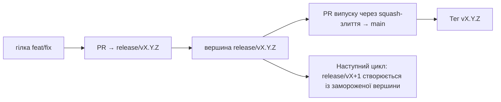

# Branching & Release Model (Українська)

🌐 **Languages:** 🇺🇸 [English](../../../../ops/BRANCHING_MODEL.md) · 🇪🇹 [am](../../../am/docs/ops/BRANCHING_MODEL.md) · 🇸🇦 [ar](../../../ar/docs/ops/BRANCHING_MODEL.md) · 🇦🇿 [az](../../../az/docs/ops/BRANCHING_MODEL.md) · 🇧🇬 [bg](../../../bg/docs/ops/BRANCHING_MODEL.md) · 🇧🇩 [bn](../../../bn/docs/ops/BRANCHING_MODEL.md) · 🇧🇦 [bs](../../../bs/docs/ops/BRANCHING_MODEL.md) · 🇨🇿 [cs](../../../cs/docs/ops/BRANCHING_MODEL.md) · 🇩🇰 [da](../../../da/docs/ops/BRANCHING_MODEL.md) · 🇩🇪 [de](../../../de/docs/ops/BRANCHING_MODEL.md) · 🇬🇷 [el](../../../el/docs/ops/BRANCHING_MODEL.md) · 🇪🇸 [es](../../../es/docs/ops/BRANCHING_MODEL.md) · 🇪🇪 [et](../../../et/docs/ops/BRANCHING_MODEL.md) · 🇮🇷 [fa](../../../fa/docs/ops/BRANCHING_MODEL.md) · 🇫🇮 [fi](../../../fi/docs/ops/BRANCHING_MODEL.md) · 🇫🇷 [fr](../../../fr/docs/ops/BRANCHING_MODEL.md) · 🇮🇪 [ga](../../../ga/docs/ops/BRANCHING_MODEL.md) · 🇮🇳 [gu](../../../gu/docs/ops/BRANCHING_MODEL.md) · 🇳🇬 [ha](../../../ha/docs/ops/BRANCHING_MODEL.md) · 🇮🇱 [he](../../../he/docs/ops/BRANCHING_MODEL.md) · 🇮🇳 [hi](../../../hi/docs/ops/BRANCHING_MODEL.md) · 🇭🇷 [hr](../../../hr/docs/ops/BRANCHING_MODEL.md) · 🇭🇺 [hu](../../../hu/docs/ops/BRANCHING_MODEL.md) · 🇦🇲 [hy](../../../hy/docs/ops/BRANCHING_MODEL.md) · 🇮🇩 [id](../../../id/docs/ops/BRANCHING_MODEL.md) · 🇳🇬 [ig](../../../ig/docs/ops/BRANCHING_MODEL.md) · 🇮🇹 [it](../../../it/docs/ops/BRANCHING_MODEL.md) · 🇯🇵 [ja](../../../ja/docs/ops/BRANCHING_MODEL.md) · 🇬🇪 [ka](../../../ka/docs/ops/BRANCHING_MODEL.md) · 🇰🇭 [km](../../../km/docs/ops/BRANCHING_MODEL.md) · 🇮🇳 [kn](../../../kn/docs/ops/BRANCHING_MODEL.md) · 🇰🇷 [ko](../../../ko/docs/ops/BRANCHING_MODEL.md) · 🇱🇹 [lt](../../../lt/docs/ops/BRANCHING_MODEL.md) · 🇱🇻 [lv](../../../lv/docs/ops/BRANCHING_MODEL.md) · 🇮🇳 [ml](../../../ml/docs/ops/BRANCHING_MODEL.md) · 🇮🇳 [mr](../../../mr/docs/ops/BRANCHING_MODEL.md) · 🇲🇾 [ms](../../../ms/docs/ops/BRANCHING_MODEL.md) · 🇲🇹 [mt](../../../mt/docs/ops/BRANCHING_MODEL.md) · 🇲🇲 [my](../../../my/docs/ops/BRANCHING_MODEL.md) · 🇳🇵 [ne](../../../ne/docs/ops/BRANCHING_MODEL.md) · 🇳🇱 [nl](../../../nl/docs/ops/BRANCHING_MODEL.md) · 🇳🇴 [no](../../../no/docs/ops/BRANCHING_MODEL.md) · 🇮🇳 [or](../../../or/docs/ops/BRANCHING_MODEL.md) · 🇮🇳 [pa](../../../pa/docs/ops/BRANCHING_MODEL.md) · 🇵🇭 [phi](../../../phi/docs/ops/BRANCHING_MODEL.md) · 🇵🇱 [pl](../../../pl/docs/ops/BRANCHING_MODEL.md) · 🇵🇹 [pt](../../../pt/docs/ops/BRANCHING_MODEL.md) · 🇧🇷 [pt-BR](../../../pt-BR/docs/ops/BRANCHING_MODEL.md) · 🇷🇴 [ro](../../../ro/docs/ops/BRANCHING_MODEL.md) · 🇷🇺 [ru](../../../ru/docs/ops/BRANCHING_MODEL.md) · 🇱🇰 [si](../../../si/docs/ops/BRANCHING_MODEL.md) · 🇸🇰 [sk](../../../sk/docs/ops/BRANCHING_MODEL.md) · 🇸🇮 [sl](../../../sl/docs/ops/BRANCHING_MODEL.md) · 🇷🇸 [sr](../../../sr/docs/ops/BRANCHING_MODEL.md) · 🇸🇪 [sv](../../../sv/docs/ops/BRANCHING_MODEL.md) · 🇰🇪 [sw](../../../sw/docs/ops/BRANCHING_MODEL.md) · 🇮🇳 [ta](../../../ta/docs/ops/BRANCHING_MODEL.md) · 🇮🇳 [te](../../../te/docs/ops/BRANCHING_MODEL.md) · 🇹🇭 [th](../../../th/docs/ops/BRANCHING_MODEL.md) · 🇹🇷 [tr](../../../tr/docs/ops/BRANCHING_MODEL.md) · 🇵🇰 [ur](../../../ur/docs/ops/BRANCHING_MODEL.md) · 🇺🇿 [uz](../../../uz/docs/ops/BRANCHING_MODEL.md) · 🇻🇳 [vi](../../../vi/docs/ops/BRANCHING_MODEL.md) · 🇳🇬 [yo](../../../yo/docs/ops/BRANCHING_MODEL.md) · 🇨🇳 [zh-CN](../../../zh-CN/docs/ops/BRANCHING_MODEL.md) · 🇹🇼 [zh-TW](../../../zh-TW/docs/ops/BRANCHING_MODEL.md)

---

OmniRoute використовує модель випусків із **паралельними циклами**: окрема гілка `release/vX.Y.Z`
для активного циклу, `main` для опублікованої лінії та незмінний
тег `vX.Y.Z`, коли цей цикл випускається. Коміти потрапляють і до `release/*`, _і_ до
`main` — це очікувана поведінка, а не плутанина.

Докладна інформація для супроводжувачів міститься в `CLAUDE.md` (Жорстке правило №21) та
[RELEASE_CHECKLIST.md](./RELEASE_CHECKLIST.md). Ця сторінка є загальнодоступним
стислим оглядом для учасників проєкту.

## Короткий огляд

| Посилання        | Роль                                                                                          |
| ---------------- | --------------------------------------------------------------------------------------------- |
| `release/vX.Y.Z` | **Активний цикл** — щоденна розробка та злиття PR для цієї версії                             |
| `main`           | **Опублікована лінія** — отримує цикл через squash-злиття під час випуску                     |
| `vX.Y.Z` (тег)   | **Маркер випуску** — незмінний вказівник на те, «що було випущено», створений під час випуску |



## Яку цільову гілку слід вибрати для мого PR?

**Вибирайте активну гілку `release/vX.Y.Z`, а не `main`.**

1. Знайдіть найстаршу відкриту гілку `release/v*` (приклад на момент написання:
   `release/v3.8.49`).
2. Створіть відгалуження від її вершини (`git fetch` + checkout / rebase на неї).
3. Відкрийте PR із **base = ця `release/vX.Y.Z`**.

`main` не є гілкою для щоденної інтеграції. Для PR, відкритих проти `main`,
зазвичай потрібно змінити цільову гілку перед злиттям.

## Заморожування випуску (паралельні цикли)

Коли виконується узгодження випуску, відкривається службова задача з міткою `release-freeze`.
Це **не зупиняє розробку**:

- Заморожена `release/vX.Y.Z` належить керівнику цього випуску.
- `release/vX+1` наступного циклу створюється із замороженої вершини, щоб учасники могли
  продовжувати додавати зміни.
- Для відкритих PR, які все ще націлені на заморожену гілку, слід **змінити цільову гілку** на
  активну (найстаршу) гілку `release/v*`.

Перш ніж вважати потрібну гілку доступною для злиття, перевірте, чи немає відкритого заморожування:

```bash
gh issue list --repo diegosouzapw/OmniRoute --label release-freeze --state open
```

Механіку злиття (мітка власника `queue` → Mergify) описано в
[MERGE_TRAIN.md](./MERGE_TRAIN.md).

## Навіщо потрібні і гілка, і тег?

| Артефакт         | Час існування | Призначення                                                    |
| ---------------- | ------------- | -------------------------------------------------------------- |
| `release/vX.Y.Z` | Поточний цикл | Збирає перевірені PR, залишається CI-зеленою та є базою для PR |
| Тег `vX.Y.Z`     | Назавжди      | Позначає точний код, випущений у npm / GitHub Releases         |

Гілка — це майстерня, а тег — запечатаний пакунок. Після squash-злиття до
`main` наступний цикл продовжується в `release/vX+1`, не очікуючи завершення PR
попереднього випуску.

## Пов’язана документація

- [CONTRIBUTING.md](../../CONTRIBUTING.md) — налаштування, тести, контрольний список PR
- [RELEASE_CHECKLIST.md](./RELEASE_CHECKLIST.md) — перевірка перед випуском
- [MERGE_TRAIN.md](./MERGE_TRAIN.md) — черга злиття та резервний ланцюжок
- [RELEASE_GREEN.md](./RELEASE_GREEN.md) — підтримання вершини гілки випуску в зеленому стані
