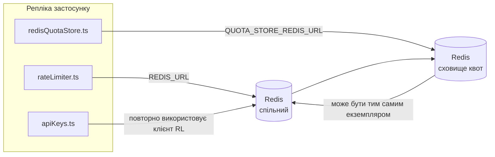

# Redis Production Configuration Guide (Українська)

🌐 **Languages:** 🇺🇸 [English](../../../../ops/REDIS_PRODUCTION_CONFIG.md) · 🇪🇹 [am](../../../am/docs/ops/REDIS_PRODUCTION_CONFIG.md) · 🇸🇦 [ar](../../../ar/docs/ops/REDIS_PRODUCTION_CONFIG.md) · 🇦🇿 [az](../../../az/docs/ops/REDIS_PRODUCTION_CONFIG.md) · 🇧🇬 [bg](../../../bg/docs/ops/REDIS_PRODUCTION_CONFIG.md) · 🇧🇩 [bn](../../../bn/docs/ops/REDIS_PRODUCTION_CONFIG.md) · 🇨🇿 [cs](../../../cs/docs/ops/REDIS_PRODUCTION_CONFIG.md) · 🇩🇰 [da](../../../da/docs/ops/REDIS_PRODUCTION_CONFIG.md) · 🇩🇪 [de](../../../de/docs/ops/REDIS_PRODUCTION_CONFIG.md) · 🇬🇷 [el](../../../el/docs/ops/REDIS_PRODUCTION_CONFIG.md) · 🇪🇸 [es](../../../es/docs/ops/REDIS_PRODUCTION_CONFIG.md) · 🇪🇪 [et](../../../et/docs/ops/REDIS_PRODUCTION_CONFIG.md) · 🇮🇷 [fa](../../../fa/docs/ops/REDIS_PRODUCTION_CONFIG.md) · 🇫🇮 [fi](../../../fi/docs/ops/REDIS_PRODUCTION_CONFIG.md) · 🇫🇷 [fr](../../../fr/docs/ops/REDIS_PRODUCTION_CONFIG.md) · 🇮🇪 [ga](../../../ga/docs/ops/REDIS_PRODUCTION_CONFIG.md) · 🇮🇳 [gu](../../../gu/docs/ops/REDIS_PRODUCTION_CONFIG.md) · 🇳🇬 [ha](../../../ha/docs/ops/REDIS_PRODUCTION_CONFIG.md) · 🇮🇱 [he](../../../he/docs/ops/REDIS_PRODUCTION_CONFIG.md) · 🇮🇳 [hi](../../../hi/docs/ops/REDIS_PRODUCTION_CONFIG.md) · 🇭🇷 [hr](../../../hr/docs/ops/REDIS_PRODUCTION_CONFIG.md) · 🇭🇺 [hu](../../../hu/docs/ops/REDIS_PRODUCTION_CONFIG.md) · 🇦🇲 [hy](../../../hy/docs/ops/REDIS_PRODUCTION_CONFIG.md) · 🇮🇩 [id](../../../id/docs/ops/REDIS_PRODUCTION_CONFIG.md) · 🇳🇬 [ig](../../../ig/docs/ops/REDIS_PRODUCTION_CONFIG.md) · 🇮🇹 [it](../../../it/docs/ops/REDIS_PRODUCTION_CONFIG.md) · 🇯🇵 [ja](../../../ja/docs/ops/REDIS_PRODUCTION_CONFIG.md) · 🇬🇪 [ka](../../../ka/docs/ops/REDIS_PRODUCTION_CONFIG.md) · 🇰🇭 [km](../../../km/docs/ops/REDIS_PRODUCTION_CONFIG.md) · 🇮🇳 [kn](../../../kn/docs/ops/REDIS_PRODUCTION_CONFIG.md) · 🇰🇷 [ko](../../../ko/docs/ops/REDIS_PRODUCTION_CONFIG.md) · 🇱🇹 [lt](../../../lt/docs/ops/REDIS_PRODUCTION_CONFIG.md) · 🇱🇻 [lv](../../../lv/docs/ops/REDIS_PRODUCTION_CONFIG.md) · 🇮🇳 [ml](../../../ml/docs/ops/REDIS_PRODUCTION_CONFIG.md) · 🇮🇳 [mr](../../../mr/docs/ops/REDIS_PRODUCTION_CONFIG.md) · 🇲🇾 [ms](../../../ms/docs/ops/REDIS_PRODUCTION_CONFIG.md) · 🇲🇹 [mt](../../../mt/docs/ops/REDIS_PRODUCTION_CONFIG.md) · 🇲🇲 [my](../../../my/docs/ops/REDIS_PRODUCTION_CONFIG.md) · 🇳🇵 [ne](../../../ne/docs/ops/REDIS_PRODUCTION_CONFIG.md) · 🇳🇱 [nl](../../../nl/docs/ops/REDIS_PRODUCTION_CONFIG.md) · 🇳🇴 [no](../../../no/docs/ops/REDIS_PRODUCTION_CONFIG.md) · 🇮🇳 [or](../../../or/docs/ops/REDIS_PRODUCTION_CONFIG.md) · 🇮🇳 [pa](../../../pa/docs/ops/REDIS_PRODUCTION_CONFIG.md) · 🇵🇭 [phi](../../../phi/docs/ops/REDIS_PRODUCTION_CONFIG.md) · 🇵🇱 [pl](../../../pl/docs/ops/REDIS_PRODUCTION_CONFIG.md) · 🇵🇹 [pt](../../../pt/docs/ops/REDIS_PRODUCTION_CONFIG.md) · 🇧🇷 [pt-BR](../../../pt-BR/docs/ops/REDIS_PRODUCTION_CONFIG.md) · 🇷🇴 [ro](../../../ro/docs/ops/REDIS_PRODUCTION_CONFIG.md) · 🇷🇺 [ru](../../../ru/docs/ops/REDIS_PRODUCTION_CONFIG.md) · 🇱🇰 [si](../../../si/docs/ops/REDIS_PRODUCTION_CONFIG.md) · 🇸🇰 [sk](../../../sk/docs/ops/REDIS_PRODUCTION_CONFIG.md) · 🇸🇮 [sl](../../../sl/docs/ops/REDIS_PRODUCTION_CONFIG.md) · 🇷🇸 [sr](../../../sr/docs/ops/REDIS_PRODUCTION_CONFIG.md) · 🇸🇪 [sv](../../../sv/docs/ops/REDIS_PRODUCTION_CONFIG.md) · 🇰🇪 [sw](../../../sw/docs/ops/REDIS_PRODUCTION_CONFIG.md) · 🇮🇳 [ta](../../../ta/docs/ops/REDIS_PRODUCTION_CONFIG.md) · 🇮🇳 [te](../../../te/docs/ops/REDIS_PRODUCTION_CONFIG.md) · 🇹🇭 [th](../../../th/docs/ops/REDIS_PRODUCTION_CONFIG.md) · 🇹🇷 [tr](../../../tr/docs/ops/REDIS_PRODUCTION_CONFIG.md) · 🇵🇰 [ur](../../../ur/docs/ops/REDIS_PRODUCTION_CONFIG.md) · 🇺🇿 [uz](../../../uz/docs/ops/REDIS_PRODUCTION_CONFIG.md) · 🇻🇳 [vi](../../../vi/docs/ops/REDIS_PRODUCTION_CONFIG.md) · 🇳🇬 [yo](../../../yo/docs/ops/REDIS_PRODUCTION_CONFIG.md) · 🇨🇳 [zh-CN](../../../zh-CN/docs/ops/REDIS_PRODUCTION_CONFIG.md) · 🇹🇼 [zh-TW](../../../zh-TW/docs/ops/REDIS_PRODUCTION_CONFIG.md)

---

## Огляд

Redis є **необов’язковою, м’якою залежністю** в OmniRoute — коли Redis недоступний, застосунок продовжує працювати з обмеженою функціональністю (використовуючи резервні механізми в пам’яті). У виробничому середовищі налаштування Redis зменшує затримку для чотирьох окремих робочих навантажень:

| Робоче навантаження              | Драйвер                       | Фабрика клієнта                                                | Шаблон ключа                                                |
| -------------------------------- | ----------------------------- | -------------------------------------------------------------- | ----------------------------------------------------------- |
| Обмеження частоти запитів        | `rateLimiter.ts`              | `getRedisClient()` — ліниво ініціалізований синглтон `ioredis` | `<prefix>rl:*` Lua‑атомарні вікна обмеження частоти запитів |
| Кеш автентифікації               | `apiKeys.ts`                  | Повторно використовує клієнт із `rateLimiter`                  | `<prefix>auth:api_key:<sha256>` з TTL                       |
| Сховище квот                     | `redisQuotaStore.ts`          | Окремий синглтон `getRedisClient(url)`                         | `<prefix>quota:*`, налаштовується для кожного екземпляра    |
| Автоматичний вимикач прогрівання | `redisCircuitBreakerStore.ts` | Окремий клієнт у `circuitBreakerFactory.ts`                    | `<prefix>warmup:cb:<connectionId>`                          |

Усі чотири робочі навантаження використовують спільний префікс простору імен, завдяки чому OmniRoute може співіснувати з іншими застосунками в одному екземплярі Redis (наприклад, `127.0.0.1:6379`). Див. [Простір імен ключів](#key-namespacing).

---

## Поточна конфігурація (типові значення в коді)

| Налаштування                              | Значення                                                                     | Де                                                                                    |
| ----------------------------------------- | ---------------------------------------------------------------------------- | ------------------------------------------------------------------------------------- |
| Змінна середовища `REDIS_URL`             | `redis://redis:6379` (compose), необов’язкова                                | `rateLimiter.ts:5`, `.env.example`                                                    |
| Змінна середовища `REDIS_KEY_PREFIX`      | `omniroute:` (типове значення)                                               | `rateLimiter.ts`, `redisQuotaStore.ts`, `redisCircuitBreakerStore.ts`, `.env.example` |
| Змінна середовища `QUOTA_STORE_REDIS_URL` | окрема, може відрізнятися від `REDIS_URL`                                    | `quota/storeFactory.ts`                                                               |
| `QUOTA_STORE_DRIVER`                      | `"sqlite"` (типове значення), `"redis"` — необов’язкове                      | `quota/storeFactory.ts`                                                               |
| `maxRetriesPerRequest` в ioredis          | `3`                                                                          | створення клієнта в `rateLimiter.ts`                                                  |
| `enableReadyCheck`                        | не задано (типове значення ioredis: `true`)                                  | —                                                                                     |
| `lazyConnect`                             | не задано (типове значення ioredis: `false`)                                 | —                                                                                     |
| `retryStrategy`                           | не задано (типове значення ioredis: базові 200 мс, експоненційне збільшення) | —                                                                                     |
| TLS / пароль / індекс БД                  | **не налаштовано**                                                           | —                                                                                     |
| Sentinel / Cluster                        | **не налаштовано** — підтримується лише автономний одновузловий режим        | —                                                                                     |

---

## Простір імен ключів

OmniRoute спільно використовує екземпляр Redis з усіма іншими сервісами, що працюють на хості. Без простору імен ключі на кшталт `auth:api_key:<sha256>` або `rl:*` можуть конфліктувати з ключами інших застосунків, які використовують той самий Redis (цей екземпляр запускає Redis на `127.0.0.1:6379` разом з іншими сервісами).

Задайте для `REDIS_KEY_PREFIX` непорожній рядок, щоб додати префікс до **кожного** ключа OmniRoute:

```bash
# .env — усі ключі OmniRoute матимуть вигляд omniroute:rl:*, omniroute:auth:*, omniroute:quota:*, omniroute:warmup:cb:*
REDIS_KEY_PREFIX=omniroute:
```

- **Типове значення:** `omniroute:` (застосовується, якщо `REDIS_KEY_PREFIX` не задано або має порожнє значення).
- **Застосовується до:** обмежувача частоти запитів і кешу автентифікації (спільний клієнт `ioredis` через `keyPrefix`), сховища квот (`KEY_PREFIX = "${REDIS_KEY_PREFIX}quota"`) та автоматичного вимикача прогрівання (`KEY_PREFIX = "${REDIS_KEY_PREFIX}warmup:cb:"`).
- **Зміна префікса**, коли ключі вже існують у Redis, залишає старі ключі без прив’язки (вони видаляються після завершення TTL / за алгоритмом LRU). Префікс можна безпечно змінювати; міграція не потрібна. Єдиний виняток — ключ автоматичного вимикача прогрівання для з’єднання, позначеного як заборонене: він зберігається без TTL, тому знайдіть залишки за допомогою `redis-cli --scan --pattern '<old-prefix>warmup:cb:*'` і видаліть їх.
- **`keyPrefix` в ioredis** автоматично додає префікс під час запису **та** видаляє його під час читання, тому код застосунку ніколи не бачить префікс.

---

## Рекомендоване налаштування для робочого середовища

### 1. Пул з’єднань / параметри клієнта (конструктор ioredis `Redis`)

Поточний код створює один екземпляр `new Redis(url)` без спеціальних параметрів. Для робочих
розгортань із кількома репліками передайте фабрику клієнтів у коді або обгорніть `getRedisClient()`:

```typescript
const redis = new Redis(REDIS_URL, {
  maxRetriesPerRequest: null, // без обмеження повторних спроб; рішення приймає retryStrategy
  enableReadyCheck: true, // перевіряти готовність сервера перед прийманням викликів
  lazyConnect: true, // не підключатися під час створення; чекати першого виклику
  retryStrategy: (times) => {
    if (times > 10) return null; // припинити після 10 спроб → підключитися пізніше
    return Math.min(times * 200, 5000); // 200 мс, 400 мс, …, максимум 5 с
  },
  enableAutoPipelining: true, // об’єднувати паралельні команди в один запис TCP
  keepAlive: 10000, // TCP keep-alive кожні 10 с
});
```

**Ключові компроміси:**

- `maxRetriesPerRequest: null` + `retryStrategy` — рекомендовано для робочого середовища, щоб тимчасові
  перезапуски Redis не спричиняли негайного збою кожного запиту. Резервний механізм у пам’яті в
  `checkRateLimit()` обробляє сценарій збою.
- `lazyConnect: true` — усуває залежність запуску від доступності Redis до того, як сервер
  почне приймати з’єднання.
- `enableAutoPipelining: true` — зменшує кількість циклів обміну для паралельних перевірок обмеження частоти;
  корисно за навантаження >50 RPS на одному з’єднанні.

### 2. Конфігурація сервера Redis (`redis.conf`)

```
# Пам’ять
maxmemory 80%                        # залишити місце для кешу сторінок ОС
maxmemory-policy allkeys-lru         # витісняти застарілі записи кешу автентифікації за браку пам’яті

# Збереження даних (необов’язково — OmniRoute безпечно переживає збій без нього)
save 300 1                           # створювати знімок щонайменше кожні 5 хв, якщо змінено ≥1 ключ
appendonly no                        # AOF не потрібен; дані можна відновити
appendfsync no                       # без накладних витрат на fsync (RDB достатньо)

# Мережа
timeout 0                            # не відключати неактивні з’єднання
tcp-keepalive 300                    # keep-alive кожні 5 хв
tcp-backlog 511                      # черга з’єднань для стрибкоподібного навантаження

# Продуктивність
hz 10                                # типове значення; 100 для систем, чутливих до затримки
activedefrag yes                     # автоматична дефрагментація, коли фрагментація >10%
```

**Компроміс для `maxmemory-policy allkeys-lru`:** записи кешу автентифікації можуть бути витіснені за
браку пам’яті. Це безпечно — `setCachedApiKey` завжди повторно заповнює кеш у разі промаху, а
резервна база SQLite є авторитетним джерелом. Lua-скрипт обмежувача частоти створює невеликі ключі, які
за задумом мають короткий термін існування.

### 3. Налаштування Docker Compose

Робоча конфігурація Compose (`docker-compose.prod.yml`) використовує `redis:8.6.2-alpine`. Додайте:

```yaml
redis:
  image: redis:8.6.2-alpine
  command:
    [
      "redis-server",
      "--maxmemory",
      "512mb",
      "--maxmemory-policy",
      "allkeys-lru",
      "--activedefrag",
      "yes",
      "--save",
      "300 1",
    ]
  healthcheck:
    test: ["CMD", "redis-cli", "ping"]
    interval: 10s
    timeout: 3s
    retries: 3
    start_period: 5s
```

### 4. Особливості використання кількох екземплярів / масштабування

**Один Redis для всіх реплік** — Lua-скрипт обмежувача частоти залежить від єдиного
авторитетного простору ключів. Використання кількох екземплярів Redis за репліками призвело б до втрати атомарності
та подвоєння бюджету. Використовуйте один Redis (або кластер Redis Sentinel із перемиканням після відмови) для
всіх реплік застосунку.

**Кількість з’єднань:** кожна репліка застосунку відкриває **2 TCP-з’єднання** з Redis
(клієнт обмежувача частоти + клієнт сховища квот). За 10 реплік → 20 з’єднань, що значно
нижче за типове для екземпляра Redis обмеження в 10 тис. з’єднань.

### 5. Моніторинг

Надайте через кінцеву точку перевірки працездатності:

```typescript
// src/app/api/monitoring/health/route.ts уже викликає функції rateLimiter
// Додайте перевірки, специфічні для Redis:
//   1. Затримка PING через ioredis .ping()
//   2. Використання пам’яті через INFO memory
//   3. Кількість з’єднань через INFO clients
//   4. Частота влучань для maxmemory-policy (evicted_keys / keyspace_hits)
```

Ключові метрики для відстеження:

- **Витіснені ключі / с** — якщо значення постійно ненульове, збільште `maxmemory`
- **Заблоковані клієнти** — ненульове значення вказує на повільні Lua-скрипти або високу конкуренцію
- **Відхилені з’єднання** — досягнуто обмеження кількості з’єднань; малоймовірно за 20 з’єднань

---

## Діаграма архітектури



---

## Посилання

| Файл                               | Призначення                                                                              |
| ---------------------------------- | ---------------------------------------------------------------------------------------- |
| `src/shared/utils/rateLimiter.ts`  | Основний клієнт Redis, Lua-скрипт обмеження частоти запитів, резервний варіант у пам’яті |
| `src/lib/db/apiKeys.ts`            | Кеш автентифікації — Redis→SQLite як резервний варіант                                   |
| `src/lib/quota/redisQuotaStore.ts` | Окремий клієнт Redis для необов’язкового сховища квот                                    |
| `src/lib/quota/storeFactory.ts`    | Перемикає драйвери квот між `sqlite` і `redis`                                           |
| `docker-compose.prod.yml`          | Контейнер Redis для продакшену (образ `redis:8.6.2-alpine`)                              |
| `.env.example`                     | Документація змінних середовища Redis                                                    |
| `src/app/api/local/redis/`         | Маршрути API для оркестрації контейнера середовища розробки                              |
| `bin/cli/commands/redis.mjs`       | Команди CLI для оркестрації контейнера середовища розробки                               |
