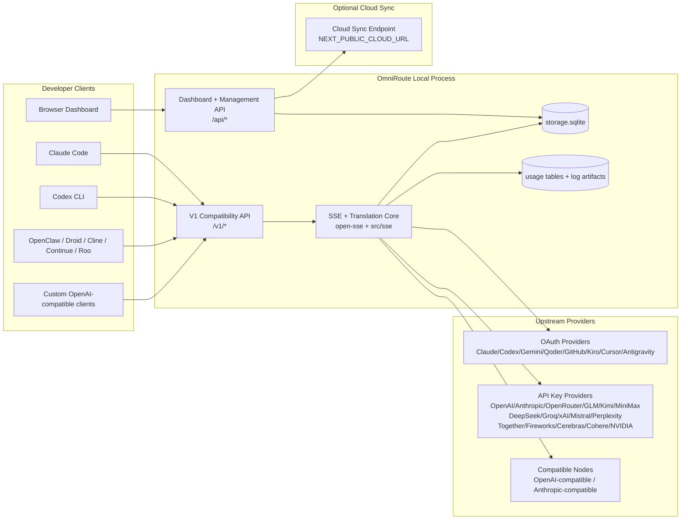
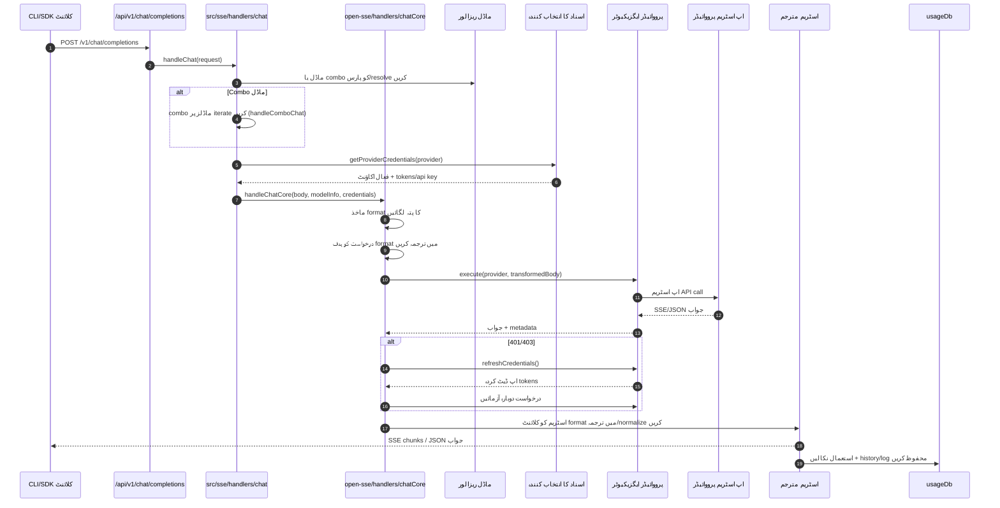
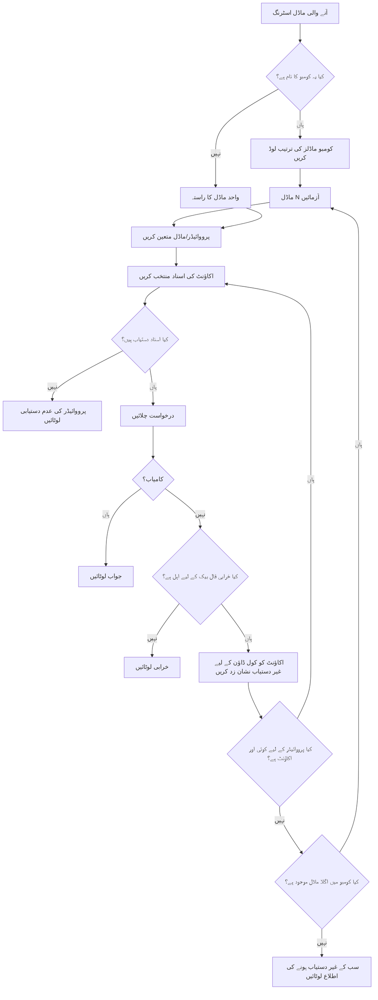
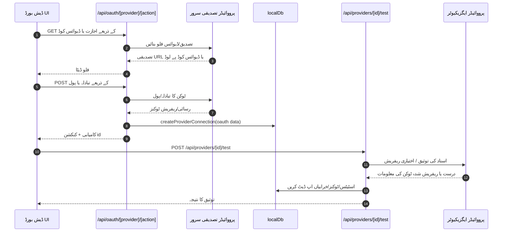
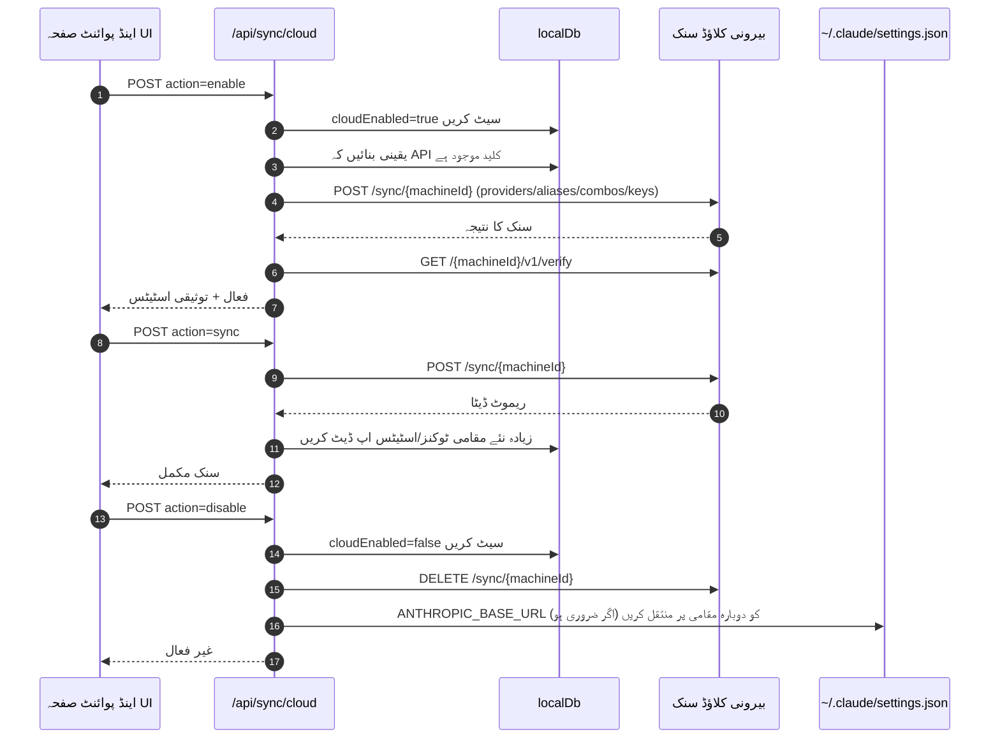
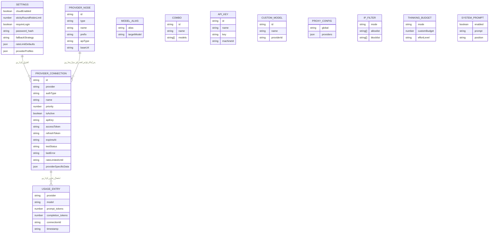
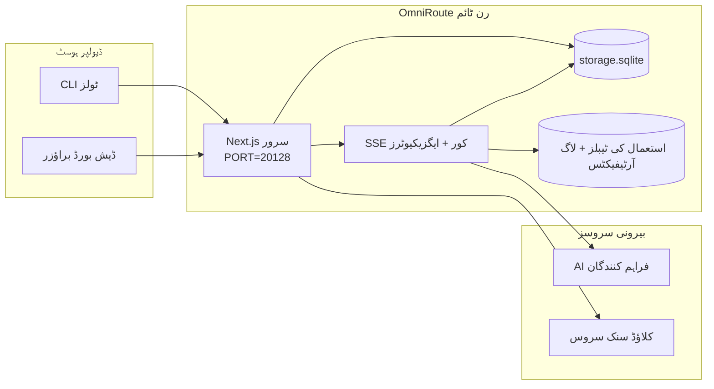

# OmniRoute Architecture (اردو)

🌐 **Languages:** 🇺🇸 [English](../../../../architecture/ARCHITECTURE.md) · 🇪🇹 [am](../../../am/docs/architecture/ARCHITECTURE.md) · 🇸🇦 [ar](../../../ar/docs/architecture/ARCHITECTURE.md) · 🇦🇿 [az](../../../az/docs/architecture/ARCHITECTURE.md) · 🇧🇬 [bg](../../../bg/docs/architecture/ARCHITECTURE.md) · 🇧🇩 [bn](../../../bn/docs/architecture/ARCHITECTURE.md) · 🇧🇦 [bs](../../../bs/docs/architecture/ARCHITECTURE.md) · 🇨🇿 [cs](../../../cs/docs/architecture/ARCHITECTURE.md) · 🇩🇰 [da](../../../da/docs/architecture/ARCHITECTURE.md) · 🇩🇪 [de](../../../de/docs/architecture/ARCHITECTURE.md) · 🇬🇷 [el](../../../el/docs/architecture/ARCHITECTURE.md) · 🇪🇸 [es](../../../es/docs/architecture/ARCHITECTURE.md) · 🇪🇪 [et](../../../et/docs/architecture/ARCHITECTURE.md) · 🇮🇷 [fa](../../../fa/docs/architecture/ARCHITECTURE.md) · 🇫🇮 [fi](../../../fi/docs/architecture/ARCHITECTURE.md) · 🇫🇷 [fr](../../../fr/docs/architecture/ARCHITECTURE.md) · 🇮🇪 [ga](../../../ga/docs/architecture/ARCHITECTURE.md) · 🇮🇳 [gu](../../../gu/docs/architecture/ARCHITECTURE.md) · 🇳🇬 [ha](../../../ha/docs/architecture/ARCHITECTURE.md) · 🇮🇱 [he](../../../he/docs/architecture/ARCHITECTURE.md) · 🇮🇳 [hi](../../../hi/docs/architecture/ARCHITECTURE.md) · 🇭🇷 [hr](../../../hr/docs/architecture/ARCHITECTURE.md) · 🇭🇺 [hu](../../../hu/docs/architecture/ARCHITECTURE.md) · 🇦🇲 [hy](../../../hy/docs/architecture/ARCHITECTURE.md) · 🇮🇩 [id](../../../id/docs/architecture/ARCHITECTURE.md) · 🇳🇬 [ig](../../../ig/docs/architecture/ARCHITECTURE.md) · 🇮🇹 [it](../../../it/docs/architecture/ARCHITECTURE.md) · 🇯🇵 [ja](../../../ja/docs/architecture/ARCHITECTURE.md) · 🇬🇪 [ka](../../../ka/docs/architecture/ARCHITECTURE.md) · 🇰🇭 [km](../../../km/docs/architecture/ARCHITECTURE.md) · 🇮🇳 [kn](../../../kn/docs/architecture/ARCHITECTURE.md) · 🇰🇷 [ko](../../../ko/docs/architecture/ARCHITECTURE.md) · 🇱🇹 [lt](../../../lt/docs/architecture/ARCHITECTURE.md) · 🇱🇻 [lv](../../../lv/docs/architecture/ARCHITECTURE.md) · 🇮🇳 [ml](../../../ml/docs/architecture/ARCHITECTURE.md) · 🇮🇳 [mr](../../../mr/docs/architecture/ARCHITECTURE.md) · 🇲🇾 [ms](../../../ms/docs/architecture/ARCHITECTURE.md) · 🇲🇹 [mt](../../../mt/docs/architecture/ARCHITECTURE.md) · 🇲🇲 [my](../../../my/docs/architecture/ARCHITECTURE.md) · 🇳🇵 [ne](../../../ne/docs/architecture/ARCHITECTURE.md) · 🇳🇱 [nl](../../../nl/docs/architecture/ARCHITECTURE.md) · 🇳🇴 [no](../../../no/docs/architecture/ARCHITECTURE.md) · 🇮🇳 [or](../../../or/docs/architecture/ARCHITECTURE.md) · 🇮🇳 [pa](../../../pa/docs/architecture/ARCHITECTURE.md) · 🇵🇭 [phi](../../../phi/docs/architecture/ARCHITECTURE.md) · 🇵🇱 [pl](../../../pl/docs/architecture/ARCHITECTURE.md) · 🇵🇹 [pt](../../../pt/docs/architecture/ARCHITECTURE.md) · 🇧🇷 [pt-BR](../../../pt-BR/docs/architecture/ARCHITECTURE.md) · 🇷🇴 [ro](../../../ro/docs/architecture/ARCHITECTURE.md) · 🇷🇺 [ru](../../../ru/docs/architecture/ARCHITECTURE.md) · 🇱🇰 [si](../../../si/docs/architecture/ARCHITECTURE.md) · 🇸🇰 [sk](../../../sk/docs/architecture/ARCHITECTURE.md) · 🇸🇮 [sl](../../../sl/docs/architecture/ARCHITECTURE.md) · 🇷🇸 [sr](../../../sr/docs/architecture/ARCHITECTURE.md) · 🇸🇪 [sv](../../../sv/docs/architecture/ARCHITECTURE.md) · 🇰🇪 [sw](../../../sw/docs/architecture/ARCHITECTURE.md) · 🇮🇳 [ta](../../../ta/docs/architecture/ARCHITECTURE.md) · 🇮🇳 [te](../../../te/docs/architecture/ARCHITECTURE.md) · 🇹🇭 [th](../../../th/docs/architecture/ARCHITECTURE.md) · 🇹🇷 [tr](../../../tr/docs/architecture/ARCHITECTURE.md) · 🇺🇦 [uk-UA](../../../uk-UA/docs/architecture/ARCHITECTURE.md) · 🇺🇿 [uz](../../../uz/docs/architecture/ARCHITECTURE.md) · 🇻🇳 [vi](../../../vi/docs/architecture/ARCHITECTURE.md) · 🇳🇬 [yo](../../../yo/docs/architecture/ARCHITECTURE.md) · 🇨🇳 [zh-CN](../../../zh-CN/docs/architecture/ARCHITECTURE.md) · 🇹🇼 [zh-TW](../../../zh-TW/docs/architecture/ARCHITECTURE.md)

---

🌐 **Languages:** 🇺🇸 [English](../../../../architecture/ARCHITECTURE.md) · 🇪🇹 [am](../../../am/docs/architecture/ARCHITECTURE.md) · 🇸🇦 [ar](../../../ar/docs/architecture/ARCHITECTURE.md) · 🇦🇿 [az](../../../az/docs/architecture/ARCHITECTURE.md) · 🇧🇬 [bg](../../../bg/docs/architecture/ARCHITECTURE.md) · 🇧🇩 [bn](../../../bn/docs/architecture/ARCHITECTURE.md) · 🇧🇦 [bs](../../../bs/docs/architecture/ARCHITECTURE.md) · 🇨🇿 [cs](../../../cs/docs/architecture/ARCHITECTURE.md) · 🇩🇰 [da](../../../da/docs/architecture/ARCHITECTURE.md) · 🇩🇪 [de](../../../de/docs/architecture/ARCHITECTURE.md) · 🇬🇷 [el](../../../el/docs/architecture/ARCHITECTURE.md) · 🇪🇸 [es](../../../es/docs/architecture/ARCHITECTURE.md) · 🇪🇪 [et](../../../et/docs/architecture/ARCHITECTURE.md) · 🇮🇷 [fa](../../../fa/docs/architecture/ARCHITECTURE.md) · 🇫🇮 [fi](../../../fi/docs/architecture/ARCHITECTURE.md) · 🇫🇷 [fr](../../../fr/docs/architecture/ARCHITECTURE.md) · 🇮🇪 [ga](../../../ga/docs/architecture/ARCHITECTURE.md) · 🇮🇳 [gu](../../../gu/docs/architecture/ARCHITECTURE.md) · 🇳🇬 [ha](../../../ha/docs/architecture/ARCHITECTURE.md) · 🇮🇱 [he](../../../he/docs/architecture/ARCHITECTURE.md) · 🇮🇳 [hi](../../../hi/docs/architecture/ARCHITECTURE.md) · 🇭🇷 [hr](../../../hr/docs/architecture/ARCHITECTURE.md) · 🇭🇺 [hu](../../../hu/docs/architecture/ARCHITECTURE.md) · 🇦🇲 [hy](../../../hy/docs/architecture/ARCHITECTURE.md) · 🇮🇩 [id](../../../id/docs/architecture/ARCHITECTURE.md) · 🇳🇬 [ig](../../../ig/docs/architecture/ARCHITECTURE.md) · 🇮🇹 [it](../../../it/docs/architecture/ARCHITECTURE.md) · 🇯🇵 [ja](../../../ja/docs/architecture/ARCHITECTURE.md) · 🇬🇪 [ka](../../../ka/docs/architecture/ARCHITECTURE.md) · 🇰🇭 [km](../../../km/docs/architecture/ARCHITECTURE.md) · 🇮🇳 [kn](../../../kn/docs/architecture/ARCHITECTURE.md) · 🇰🇷 [ko](../../../ko/docs/architecture/ARCHITECTURE.md) · 🇱🇹 [lt](../../../lt/docs/architecture/ARCHITECTURE.md) · 🇱🇻 [lv](../../../lv/docs/architecture/ARCHITECTURE.md) · 🇮🇳 [ml](../../../ml/docs/architecture/ARCHITECTURE.md) · 🇮🇳 [mr](../../../mr/docs/architecture/ARCHITECTURE.md) · 🇲🇾 [ms](../../../ms/docs/architecture/ARCHITECTURE.md) · 🇲🇹 [mt](../../../mt/docs/architecture/ARCHITECTURE.md) · 🇲🇲 [my](../../../my/docs/architecture/ARCHITECTURE.md) · 🇳🇵 [ne](../../../ne/docs/architecture/ARCHITECTURE.md) · 🇳🇱 [nl](../../../nl/docs/architecture/ARCHITECTURE.md) · 🇳🇴 [no](../../../no/docs/architecture/ARCHITECTURE.md) · 🇮🇳 [or](../../../or/docs/architecture/ARCHITECTURE.md) · 🇮🇳 [pa](../../../pa/docs/architecture/ARCHITECTURE.md) · 🇵🇭 [phi](../../../phi/docs/architecture/ARCHITECTURE.md) · 🇵🇱 [pl](../../../pl/docs/architecture/ARCHITECTURE.md) · 🇵🇹 [pt](../../../pt/docs/architecture/ARCHITECTURE.md) · 🇧🇷 [pt-BR](../../../pt-BR/docs/architecture/ARCHITECTURE.md) · 🇷🇴 [ro](../../../ro/docs/architecture/ARCHITECTURE.md) · 🇷🇺 [ru](../../../ru/docs/architecture/ARCHITECTURE.md) · 🇱🇰 [si](../../../si/docs/architecture/ARCHITECTURE.md) · 🇸🇰 [sk](../../../sk/docs/architecture/ARCHITECTURE.md) · 🇸🇮 [sl](../../../sl/docs/architecture/ARCHITECTURE.md) · 🇷🇸 [sr](../../../sr/docs/architecture/ARCHITECTURE.md) · 🇸🇪 [sv](../../../sv/docs/architecture/ARCHITECTURE.md) · 🇰🇪 [sw](../../../sw/docs/architecture/ARCHITECTURE.md) · 🇮🇳 [ta](../../../ta/docs/architecture/ARCHITECTURE.md) · 🇮🇳 [te](../../../te/docs/architecture/ARCHITECTURE.md) · 🇹🇭 [th](../../../th/docs/architecture/ARCHITECTURE.md) · 🇹🇷 [tr](../../../tr/docs/architecture/ARCHITECTURE.md) · 🇺🇦 [uk-UA](../../../uk-UA/docs/architecture/ARCHITECTURE.md) · 🇺🇿 [uz](../../../uz/docs/architecture/ARCHITECTURE.md) · 🇻🇳 [vi](../../../vi/docs/architecture/ARCHITECTURE.md) · 🇳🇬 [yo](../../../yo/docs/architecture/ARCHITECTURE.md) · 🇨🇳 [zh-CN](../../../zh-CN/docs/architecture/ARCHITECTURE.md) · 🇹🇼 [zh-TW](../../../zh-TW/docs/architecture/ARCHITECTURE.md)

_آخری بار اپ ڈیٹ کیا گیا: 2026-06-28_

## انتظامی خلاصہ

OmniRoute ایک مقامی AI روٹنگ گیٹ وے اور ڈیش بورڈ ہے جو Next.js پر بنایا گیا ہے۔
یہ ایک واحد OpenAI-مطابق اینڈ پوائنٹ (`/v1/*`) فراہم کرتا ہے اور ترجمے، متبادل راستے، ٹوکن کی تجدید، اور استعمال کی ٹریکنگ کے ساتھ ٹریفک کو متعدد اپ اسٹریم فراہم کنندگان میں روٹ کرتا ہے۔

بنیادی صلاحیتیں:

- CLI/ٹولز کے لیے OpenAI-مطابق API سطح (355 فراہم کنندگان، 108 ایگزیکیوٹرز)
- فراہم کنندگان کے فارمیٹس کے درمیان درخواست/جواب کا ترجمہ
- ماڈل کومبو کا متبادل راستہ (متعدد ماڈلز کی ترتیب)
- `compositeTiers` کے لحاظ سے رن ٹائم ترتیب کے ساتھ منظم کومبو مراحل (`provider + model + connection`)
- اکاؤنٹ کی سطح پر متبادل راستہ (ہر فراہم کنندہ کے لیے متعدد اکاؤنٹس)
- مرکزی چیٹ پاتھ میں کوٹا کی پیشگی جانچ اور کوٹا سے آگاہ P2C اکاؤنٹ کا انتخاب
- OAuth + API کلید کے ذریعے فراہم کنندہ کنکشن کا نظم (22 OAuth فراہم کنندہ ماڈیولز)
- `/v1/embeddings` کے ذریعے ایمبیڈنگز کی تخلیق (18 فراہم کنندگان)
- `/v1/images/generations` کے ذریعے تصاویر کی تخلیق (10+ فراہم کنندگان، 20+ ماڈلز)
- `/v1/audio/transcriptions` کے ذریعے آڈیو کی نقل نویسی (18 فراہم کنندگان)
- `/v1/audio/speech` کے ذریعے متن سے آواز کی تخلیق (24 بلٹ اِن فراہم کنندگان)
- `/v1/videos/generations` کے ذریعے ویڈیو کی تخلیق (ComfyUI + SD WebUI)
- `/v1/music/generations` کے ذریعے موسیقی کی تخلیق (ComfyUI)
- `/v1/search` کے ذریعے ویب تلاش (20 فراہم کنندگان)
- `/v1/moderations` کے ذریعے مواد کی جانچ
- `/v1/rerank` کے ذریعے دوبارہ درجہ بندی
- استدلالی ماڈلز کے لیے تھنک ٹیگ کی پارسنگ (`<think>...</think>`)
- سخت OpenAI SDK مطابقت کے لیے جوابات کی صفائی
- مختلف فراہم کنندگان کے درمیان مطابقت کے لیے رول نارملائزیشن (developer→system، system→user)
- منظم آؤٹ پٹ کی تبدیلی (json_schema → Gemini responseSchema)
- فراہم کنندگان، کلیدوں، عرفی ناموں، کومبوز، ترتیبات، اور قیمتوں کے لیے مقامی مستقل ذخیرہ (122 DB ماڈیولز)
- استعمال/لاگت کی ٹریکنگ اور درخواستوں کی لاگنگ
- متعدد ڈیوائسز/حالت کی ہم وقت سازی کے لیے اختیاری کلاؤڈ سنک
- API رسائی کے کنٹرول کے لیے IP اجازت فہرست/بلاک فہرست
- تھنکنگ بجٹ کا نظم (passthrough/auto/custom/adaptive)
- عالمی سسٹم پرامپٹ کا اندراج
- سیشن ٹریکنگ اور فنگر پرنٹنگ
- فراہم کنندہ سے مخصوص پروفائلز کے ساتھ فی اکاؤنٹ بہتر شرح کی تحدید
- فراہم کنندہ کی لچک کے لیے سرکٹ بریکر پیٹرن
- میوٹیکس لاکنگ کے ساتھ تھنڈرنگ ہرڈ سے تحفظ
- دستخط پر مبنی درخواستوں کی نقل ختم کرنے والا کیش
- ڈومین لیئر: لاگت کے قواعد، متبادل راستے کی پالیسی، لاک آؤٹ پالیسی
- Context Relay: اکاؤنٹ کی تبدیلی کے دوران تسلسل کے لیے سیشن ہینڈ آف کے خلاصے
- ڈومین اسٹیٹ کا مستقل ذخیرہ (متبادل راستوں، بجٹس، لاک آؤٹس، اور سرکٹ بریکرز کے لیے SQLite رائٹ تھرو کیش)
- درخواستوں کی مرکزی جانچ کے لیے پالیسی انجن (لاک آؤٹ → بجٹ → متبادل راستہ)
- p50/p95/p99 تاخیر کی مجموعی پیمائش کے ساتھ درخواست ٹیلی میٹری
- `combo_execution_key` / `combo_step_id` کے ذریعے کومبو ٹارگٹ ٹیلی میٹری اور کومبو ٹارگٹ کی تاریخی صحت
- ابتدا سے انتہا تک ٹریسنگ کے لیے کوریلیشن ID (X-Request-Id)
- فی API کلید آپٹ آؤٹ کے ساتھ تعمیل کی آڈٹ لاگنگ
- LLM معیار کی یقین دہانی کے لیے ایویل فریم ورک
- فراہم کنندہ کے سرکٹ بریکر کی حقیقی وقت کی حالت کے ساتھ صحت کا ڈیش بورڈ
- MCP Server (110 ٹولز)، 3 ٹرانسپورٹس کے ساتھ (stdio/SSE/Streamable HTTP)
- A2A Server (JSON-RPC 2.0 + SSE)، مہارتوں اور ٹاسک لائف سائیکل کے ساتھ
- میموری سسٹم (اخذ، اندراج، بازیافت، خلاصہ سازی)
- مہارتوں کا نظام (رجسٹری، ایگزیکیوٹر، سینڈ باکس، بلٹ اِن مہارتیں)
- سرٹیفکیٹ کے نظم اور DNS ہینڈلنگ کے ساتھ MITM پراکسی
- پرامپٹ انجیکشن گارڈ مڈل ویئر
- Caveman، RTK، اسٹیک شدہ پائپ لائنز، کمپریشن کومبوز، لینگویج پیکس، اور تجزیات کے ساتھ پرامپٹ کمپریشن پائپ لائن
- ACP (Agent Communication Protocol) رجسٹری
- ماڈیولر OAuth فراہم کنندگان (`src/lib/oauth/providers/` کے تحت 22 انفرادی ماڈیولز)
- اَن انسٹال/مکمل اَن انسٹال اسکرپٹس
- OAuth ماحول کی مرمت کی کارروائی
- OpenAI-مطابق WS کلائنٹس کے لیے WebSocket برج (`/v1/ws`)
- سنک ٹوکن کا نظم (اجرا/تنسیخ، ETag-ورژن شدہ کنفیگریشن بنڈل ڈاؤن لوڈ)
- GLM Thinking (`glmt`) بطور فرسٹ کلاس فراہم کنندہ پری سیٹ
- ہائبرڈ ٹوکن گنتی (فراہم کنندہ کی جانب سے `/messages/count_tokens`، تخمینے کے متبادل کے ساتھ)
- ماڈل عرفی ناموں کی خودکار ابتدائی تیاری (اسٹارٹ اپ پر 30+ کراس پراکسی ڈائیلیکٹ نارملائزیشنز)
- SSRF گارڈ، نجی URLs کی بلاکنگ، اور قابل ترتیب دوبارہ کوشش کے ساتھ محفوظ آؤٹ باؤنڈ فیچ
- قابل ترتیب `requestRetry` اور `maxRetryIntervalSec` کے ساتھ کول ڈاؤن سے آگاہ چیٹ کی دوبارہ کوششیں
- اسٹارٹ اپ پر Zod کے ذریعے رن ٹائم ماحول کی توثیق
- صفحہ بندی، فراہم کنندہ کے CRUD واقعات، اور SSRF کے باعث بلاک شدہ توثیق کی لاگنگ کے ساتھ تعمیل آڈٹ v2

بنیادی رن ٹائم ماڈل:

- `src/app/api/*` کے تحت Next.js ایپ روٹس ڈیش بورڈ APIs اور مطابقتی APIs دونوں نافذ کرتے ہیں
- `src/sse/*` + `open-sse/*` میں موجود مشترکہ SSE/روٹنگ کور فراہم کنندہ کے نفاذ، ترجمے، اسٹریمنگ، متبادل راستے، اور استعمال کو سنبھالتا ہے

## حوالہ جاتی خاکے

v3.8.0 پلیٹ فارم کے لیے مستند، ورژن کنٹرول شدہ Mermaid ماخذ
[`docs/diagrams/`](../diagrams/README.md) میں موجود ہیں۔ رہنمائی کے لیے ان میں سے دو ذیل میں دوبارہ پیش کیے گئے ہیں؛
باقی خاکوں کے روابط ان کی ڈومین سے مخصوص رہنما دستاویزات میں موجود ہیں۔


> ماخذ: [diagrams/request-pipeline.mmd](../diagrams/request-pipeline.mmd)


> ماخذ: [diagrams/resilience-3layers.mmd](../diagrams/resilience-3layers.mmd) — اس کا ربط
> [RESILIENCE_GUIDE.md](./RESILIENCE_GUIDE.md) اور `CLAUDE.md` کے لچک پذیری کے حوالے میں بھی موجود ہے۔

## دائرۂ کار اور حدود

### دائرۂ کار میں شامل

- مقامی گیٹ وے رن ٹائم
- ڈیش بورڈ مینجمنٹ APIs
- فراہم کنندہ کی توثیق اور ٹوکن ریفریش
- درخواست کی تبدیلی اور SSE اسٹریمنگ
- مقامی حالت + استعمال کی مستقل ذخیرہ کاری
- اختیاری کلاؤڈ سنک آرکیسٹریشن

### دائرۂ کار سے خارج

- `NEXT_PUBLIC_CLOUD_URL` کے پسِ پشت کلاؤڈ سروس کا نفاذ
- مقامی پراسیس سے باہر فراہم کنندہ کا SLA/کنٹرول پلین
- خود بیرونی CLI بائنریز (Claude CLI، Codex CLI، وغیرہ)

## ڈیش بورڈ کی سطح (موجودہ)

`src/app/(dashboard)/dashboard/` کے تحت مرکزی صفحات:

- `/dashboard` — فوری آغاز + فراہم کنندگان کا جائزہ
- `/dashboard/endpoint` — اینڈ پوائنٹ پراکسی + MCP + A2A + API اینڈ پوائنٹ ٹیبز
- `/dashboard/providers` — فراہم کنندگان کے کنکشنز اور اسناد
- `/dashboard/combos` — کومبو حکمتِ عملیاں، ٹیمپلیٹس، مرحلہ وار بلڈر، ماڈل روٹنگ کے قواعد، دستی طور پر مستقل محفوظ کردہ ترتیب
- `/dashboard/auto-combo` — Auto Combo Engine: اسکورنگ کے اوزان، موڈ پیکس، ورچوئل فیکٹری پری سیٹس، ٹیلی میٹری
- `/dashboard/costs` — لاگت کی مجموعہ بندی اور قیمتوں کی مرئیت
- `/dashboard/analytics` — استعمال کے تجزیات، جائزے، کومبو اہداف کی صحت
- `/dashboard/limits` — کوٹا/شرح کے کنٹرولز
- `/dashboard/cli-tools` — CLI آن بورڈنگ، رن ٹائم کی شناخت، کنفیگریشن کی تخلیق
- `/dashboard/agents` — شناخت شدہ ACP ایجنٹس + حسبِ ضرورت ایجنٹ رجسٹریشن
- `/dashboard/cloud-agents` — کلاؤڈ پر ہوسٹ کردہ ایجنٹ ٹاسکس (Codex Cloud، Devin، Jules) اور ٹاسک لائف سائیکل
- `/dashboard/skills` — A2A اسکل رجسٹری، سینڈ باکس عمل درآمد، بلٹ اِن اسکل کیٹلاگ
- `/dashboard/memory` — مستقل مکالماتی میموری کا معائنہ اور بازیافت
- `/dashboard/webhooks` — آؤٹ باؤنڈ ویب ہُک سبسکرپشنز، سیکرٹ روٹیشن، دوبارہ کوشش کے اعداد و شمار
- `/dashboard/batch` — بیچ جاب جمع کروانا اور پیش رفت
- `/dashboard/cache` — ریڈ تھرو اور ریزننگ کیش کے اعداد و شمار، اخراج کے کنٹرولز
- `/dashboard/playground` — کسی بھی کنفیگر کردہ کومبو/ماڈل کے ساتھ انٹرایکٹو چیٹ پلے گراؤنڈ
- `/dashboard/changelog` — ایپ کے اندر چینج لاگ ویور (`CHANGELOG.md` کو رینڈر کرتا ہے)
- `/dashboard/system` — رن ٹائم تشخیص، ورژن کی معلومات، ماحول کی توثیق کی سطح
- `/dashboard/onboarding` — نئی تنصیبات کے لیے پہلی بار سیٹ اپ وزرڈ
- `/dashboard/media` — تصویر/ویڈیو/موسیقی کا پلے گراؤنڈ
- `/dashboard/search-tools` — تلاش کے فراہم کنندگان کی جانچ اور تاریخچہ
- `/dashboard/health` — اپ ٹائم، سرکٹ بریکرز، شرح کی حدود، کوٹا کی نگرانی والے سیشنز
- `/dashboard/logs` — درخواست/پراکسی/آڈٹ/کنسول لاگز
- `/dashboard/settings` — سسٹم سیٹنگز کے ٹیبز (عمومی، روٹنگ، کومبو ڈیفالٹس، وغیرہ)
- `/dashboard/context/caveman` — Caveman کمپریشن کے قواعد، لینگویج پیکس، پیش منظر، اور آؤٹ پٹ موڈ
- `/dashboard/context/rtk` — RTK کمانڈ آؤٹ پٹ فلٹرز، پیش منظر، اور رن ٹائم حفاظتی سیٹنگز
- `/dashboard/context/combos` — روٹنگ کومبوز کو تفویض کردہ نام زد کمپریشن پائپ لائنز
- `/dashboard/translator` — مترجم کا معائنہ اور درخواست کے فارمیٹ کی تبدیلی کا پیش منظر
- `/dashboard/audit` — صفحہ بندی اور ساختی میٹا ڈیٹا کے ساتھ تعمیل آڈٹ لاگ براؤزر
- `/dashboard/usage` — `usage_history` سے منسلک فی درخواست استعمال کا براؤزر
- `/dashboard/compression` — کمپریشن کے تجزیات، اعداد و شمار، اور پائپ لائن کی تفویض
- `/dashboard/api-manager` — API کلید کا لائف سائیکل اور ماڈل کی اجازتیں

## اعلیٰ سطحی سسٹم کا سیاق و سباق



## بنیادی رن ٹائم اجزاء

## 1) API اور روٹنگ کی تہہ (Next.js ایپ روٹس)

مرکزی ڈائریکٹریاں:

- مطابقتی APIs کے لیے `src/app/api/v1/*` اور `src/app/api/v1beta/*`
- انتظامی/کنفیگریشن APIs کے لیے `src/app/api/*`
- `next.config.mjs` میں موجود Next ری رائٹس، `/v1/*` کو `/api/v1/*` سے میپ کرتی ہیں

اہم مطابقتی روٹس:

- `src/app/api/v1/chat/completions/route.ts`
- `src/app/api/v1/messages/route.ts`
- `src/app/api/v1/responses/route.ts`
- `src/app/api/v1/models/route.ts` — اس میں `custom: true` والے کسٹم ماڈلز شامل ہیں
- `src/app/api/v1/embeddings/route.ts` — ایمبیڈنگ جنریشن (6 پرووائیڈرز)
- `src/app/api/v1/images/generations/route.ts` — امیج جنریشن (4+ پرووائیڈرز، بشمول Antigravity/Nebius)
- `src/app/api/v1/messages/count_tokens/route.ts`
- `src/app/api/v1/providers/[provider]/chat/completions/route.ts` — ہر پرووائیڈر کے لیے مختص چیٹ
- `src/app/api/v1/providers/[provider]/embeddings/route.ts` — ہر پرووائیڈر کے لیے مختص ایمبیڈنگز
- `src/app/api/v1/providers/[provider]/images/generations/route.ts` — ہر پرووائیڈر کے لیے مختص تصاویر
- `src/app/api/v1beta/models/route.ts`
- `src/app/api/v1beta/models/[...path]/route.ts`

انتظامی ڈومینز:

- توثیق/ترتیبات: `src/app/api/auth/*`، `src/app/api/settings/*`
- پرووائیڈرز/کنکشنز: `src/app/api/providers*`
- پرووائیڈر نوڈز: `src/app/api/provider-nodes*`
- کسٹم ماڈلز: `src/app/api/provider-models` (GET/POST/DELETE)
- ماڈل کیٹلاگ: `src/app/api/models/route.ts` (GET)
- پراکسی کنفیگریشن: `src/app/api/settings/proxy` (GET/PUT/DELETE) + `src/app/api/settings/proxy/test` (POST)
- OAuth: `src/app/api/oauth/*`
- کیز/عرف/کومبوز/قیمت گذاری: `src/app/api/keys*`، `src/app/api/models/alias`، `src/app/api/combos*`، `src/app/api/pricing`
- استعمال: `src/app/api/usage/*`
- سنک/کلاؤڈ: `src/app/api/sync/*`، `src/app/api/cloud/*`
- CLI ٹولنگ معاونین: `src/app/api/cli-tools/*`
- IP فلٹر: `src/app/api/settings/ip-filter` (GET/PUT)
- تھنکنگ بجٹ: `src/app/api/settings/thinking-budget` (GET/PUT)
- سسٹم پرامپٹ: `src/app/api/settings/system-prompt` (GET/PUT)
- کمپریشن: `src/app/api/settings/compression`، `src/app/api/compression/*`، اور
  `src/app/api/context/*`
- سیشنز: `src/app/api/sessions` (GET)
- ریٹ لمٹس: `src/app/api/rate-limits` (GET)
- لچک پذیری: `src/app/api/resilience` (GET/PATCH) — ریکوئسٹ قطار، کنکشن کول ڈاؤن، پرووائیڈر بریکر، ویٹ فار کول ڈاؤن کنفیگریشن
- لچک پذیری ری سیٹ: `src/app/api/resilience/reset` (POST) — پرووائیڈر بریکرز کو ری سیٹ کریں
- کیش کے اعدادوشمار: `src/app/api/cache/stats` (GET/DELETE)
- ٹیلی میٹری: `src/app/api/telemetry/summary` (GET)
- بجٹ: `src/app/api/usage/budget` (GET/POST)
- فال بیک چینز: `src/app/api/fallback/chains` (GET/POST/DELETE)
- تعمیلی آڈٹ: `src/app/api/compliance/audit-log` (GET، پیجینیشن + منظم میٹا ڈیٹا کے ساتھ)
- ایویلز: `src/app/api/evals` (GET/POST)، `src/app/api/evals/[suiteId]` (GET)
- پالیسیاں: `src/app/api/policies` (GET/POST)
- سنک ٹوکنز: `src/app/api/sync/tokens` (GET/POST)، `src/app/api/sync/tokens/[id]` (GET/DELETE)
- کنفیگریشن بنڈل: `src/app/api/sync/bundle` (GET، ترتیبات/پرووائیڈرز/کومبوز/کیز کا ETag-ورژن شدہ اسنیپ شاٹ)
- WebSocket: `src/app/api/v1/ws/route.ts` — OpenAI سے مطابقت رکھنے والے WS کلائنٹس کے لیے اپ گریڈ ہینڈلر

## 2) SSE + ترجمے کا بنیادی نظام

مرکزی فلو کے ماڈیولز:

- انٹری: `src/sse/handlers/chat.ts`
- بنیادی آرکیسٹریشن: `open-sse/handlers/chatCore.ts`
- پرووائیڈر ایگزیکیوشن اڈاپٹرز: `open-sse/executors/*`
- فارمیٹ کی شناخت/پرووائیڈر کنفیگریشن: `open-sse/services/provider.ts`
- ماڈل پارس/ریزولو: `src/sse/services/model.ts`، `open-sse/services/model.ts`
- اکاؤنٹ فال بیک لاجک: `open-sse/services/accountFallback.ts`
- ترجمہ رجسٹری: `open-sse/translator/index.ts`
- اسٹریم ٹرانسفارمیشنز: `open-sse/utils/stream.ts`، `open-sse/utils/streamHandler.ts`
- استعمال کا اخراج/نارملائزیشن: `open-sse/utils/usageTracking.ts`
- تھنک ٹیگ پارسر: `open-sse/utils/thinkTagParser.ts`
- ایمبیڈنگ ہینڈلر: `open-sse/handlers/embeddings.ts`
- ایمبیڈنگ پرووائیڈر رجسٹری: `open-sse/config/embeddingRegistry.ts`
- امیج جنریشن ہینڈلر: `open-sse/handlers/imageGeneration.ts`
- امیج پرووائیڈر رجسٹری: `open-sse/config/imageRegistry.ts`
- رسپانس سینیٹائزیشن: `open-sse/handlers/responseSanitizer.ts`
- رول نارملائزیشن: `open-sse/services/roleNormalizer.ts`

سروسز (کاروباری منطق):

- اکاؤنٹ کا انتخاب/اسکورنگ: `open-sse/services/accountSelector.ts`
- کانٹیکسٹ لائف سائیکل مینجمنٹ: `open-sse/services/contextManager.ts`
- IP فلٹر کا نفاذ: `open-sse/services/ipFilter.ts`
- سیشن ٹریکنگ: `open-sse/services/sessionManager.ts`
- ریکویسٹ ڈی ڈپلیکیشن: `open-sse/services/signatureCache.ts`
- سسٹم پرامپٹ انجیکشن: `open-sse/services/systemPrompt.ts`
- تھنکنگ بجٹ مینجمنٹ: `open-sse/services/thinkingBudget.ts`
- وائلڈ کارڈ ماڈل روٹنگ: `open-sse/services/wildcardRouter.ts`
- ریٹ لمٹ مینجمنٹ: `open-sse/services/rateLimitManager.ts`
- سرکٹ بریکر: `src/shared/utils/circuitBreaker.ts`
- کانٹیکسٹ ہینڈ آف: `open-sse/services/contextHandoff.ts` — کانٹیکسٹ ریلے حکمتِ عملی کے لیے ہینڈ آف خلاصے کی تیاری اور انجیکشن
- کمپریشن: `open-sse/services/compression/*` — پرووائیڈر ترجمے سے پہلے فعال کمپریشن؛
  اس میں Caveman قواعد، RTK فلٹرز، اسٹیک شدہ پائپ لائنز، کمپریشن امتزاج، اعدادوشمار اور توثیق شامل ہیں
- Codex کوٹا فیچر: `open-sse/services/codexQuotaFetcher.ts` — کانٹیکسٹ ریلے ہینڈ آف کے فیصلوں کے لیے Codex کوٹا حاصل کرتا ہے
- کول ڈاؤن سے آگاہ ری ٹرائی: `src/sse/services/cooldownAwareRetry.ts` — قابلِ ترتیب `requestRetry` / `maxRetryIntervalSec` کے ساتھ فی ماڈل کول ڈاؤن ری ٹرائیز
- محفوظ آؤٹ باؤنڈ فیچ: `src/shared/network/safeOutboundFetch.ts` — SSRF تحفظ، نجی URL بلاکنگ، ری ٹرائی اور ٹائم آؤٹ کے ساتھ محفوظ پرووائیڈر/ماڈل فیچ
- آؤٹ باؤنڈ URL گارڈ: `src/shared/network/outboundUrlGuard.ts` — نجی/localhost CIDR رینجز کے مقابل پرووائیڈر URLs کی توثیق کرتا ہے
- پرووائیڈر ریکویسٹ ڈیفالٹس: `open-sse/services/providerRequestDefaults.ts` — پرووائیڈر سطح کی `maxTokens`، `temperature`، `thinkingBudgetTokens` ڈیفالٹ اقدار
- GLM پرووائیڈر کانسٹنٹس: `open-sse/config/glmProvider.ts` — مشترکہ GLM ماڈلز، کوٹا URLs، GLMT ٹائم آؤٹ/ڈیفالٹس
- Antigravity اپ اسٹریم: `open-sse/config/antigravityUpstream.ts` — بنیادی URL اور ڈسکوری پاتھ کانسٹنٹس
- Codex کلائنٹ کانسٹنٹس: `open-sse/config/codexClient.ts` — ورژن شدہ یوزر ایجنٹ اور کلائنٹ ورژن اقدار
- ماڈل عرف سیڈ: `src/lib/modelAliasSeed.ts` — آغاز پر 30+ کراس پراکسی ڈائلیکٹ عرف سیڈ کرتا ہے

ڈومین لیئر ماڈیولز:

- لاگت کے قواعد/بجٹس: `src/domain/costRules.ts`
- فال بیک پالیسی: `src/domain/fallbackPolicy.ts`
- کومبو ریزولور: `src/domain/comboResolver.ts`
- لاک آؤٹ پالیسی: `src/domain/lockoutPolicy.ts`
- پالیسی انجن: `src/domain/policyEngine.ts` — مرکزی لاک آؤٹ → بجٹ → فال بیک جائزہ
- ایرر کوڈز کیٹلاگ: `src/shared/constants/errorCodes.ts`
- ریکویسٹ ID: `src/shared/utils/requestId.ts`
- فیچ ٹائم آؤٹ: `src/shared/utils/fetchTimeout.ts`
- ریکویسٹ ٹیلی میٹری: `src/shared/utils/requestTelemetry.ts`
- کمپلائنس/آڈٹ: `src/lib/compliance/index.ts`
- ایویل رنر: `src/lib/evals/evalRunner.ts`
- ڈومین اسٹیٹ پرسسٹنس: `src/lib/db/domainState.ts` — فال بیک چینز، بجٹس، لاگت کی ہسٹری، لاک آؤٹ اسٹیٹ اور سرکٹ بریکرز کے لیے SQLite CRUD

OAuth پرووائیڈر ماڈیولز (`src/lib/oauth/providers/` کے تحت 22 انفرادی فائلیں):

- رجسٹری انڈیکس: `src/lib/oauth/providers/index.ts`
- انفرادی پرووائیڈرز: `agy.ts`، `antigravity.ts`، `claude.ts`، `cline.ts`، `codebuddy-cn.ts`، `codex.ts`، `cursor.ts`، `devin-desktop.ts`، `ghe-copilot.ts`، `github.ts`، `gitlab-duo.ts`، `grok-cli-oauth.ts`، `grok-cli.ts`، `kilocode.ts`، `kimi-coding.ts`، `kiro.ts`، `openference.ts`، `qoder.ts`، `trae.ts`، `xai-oauth.ts`، `zed-hosted.ts`، `zed.ts`
- ہلکا ریپر: `src/lib/oauth/providers.ts` — انفرادی ماڈیولز سے دوبارہ ایکسپورٹ کرتا ہے

## 5) ایمبیڈڈ سروسز (v3.8.4)

OmniRoute مقامی طور پر چلنے والے AI ٹول پراسیسز کو انسٹال، زیرِ نگرانی، اور ان کی جانب روٹ کر سکتا ہے،
جنہیں **ایمبیڈڈ سروسز** کہا جاتا ہے۔ پانچ سروسز فراہم کی جاتی ہیں: 9Router، CLIProxyAPI، Bifrost، Mux اور Dario۔

آرکیٹیکچر کی تہیں:

- **UI** (`/dashboard/providers/services`) — دو ٹیبز پر مشتمل صفحہ، جس میں لائف سائیکل کنٹرولز،
  لائیو لاگ اسٹریمنگ، API کلید کا انتظام، اور (9Router کے لیے) ایک اندرونی ریورس پراکسی کے ذریعے
  ایمبیڈڈ نیٹو UI شامل ہیں۔
- **API** (`/api/services/{name}/*`) — 9Router کے لیے 11 اینڈ پوائنٹس، CLIProxyAPI کے لیے 10، اور Bifrost / Mux / Dario میں سے ہر ایک کے لیے 8،
  جن سب کی درجہ بندی **LOCAL_ONLY** (سخت اصول #17) کے طور پر کی گئی ہے۔ ایک مشترکہ `GET /api/services/[name]/logs`
  SSE اینڈ پوائنٹ دونوں سروسز کو فراہم کیا جاتا ہے۔
- **سپروائزر** (`src/lib/services/`) — عمومی `ServiceSupervisor` کلاس
  `child_process.spawn` کو ریپ کرتی ہے، SSE لاگ اسٹریمنگ کے لیے 5 MB کا رِنگ بفر، ایک ہیلتھ
  پروب لوپ، ایک ایٹامک آپریشن لاک، اور SIGTERM→SIGKILL کے ذریعے تدریجی شٹ ڈاؤن برقرار رکھتی ہے۔
  `bootstrap.ts` پراسیس شروع ہوتے وقت تمام کنفیگر کردہ سروسز کو مربوط کرتی ہے۔
- **پرووائیڈر/ایگزیکیوٹر** (`open-sse/executors/ninerouter.ts`) — 9Router کو
  ایک حقیقی پرووائیڈر کے طور پر پیش کیا جاتا ہے۔ ماڈلز کے ساتھ `9router/{sub}/{model}` سابقہ لگایا جاتا ہے اور انہیں ہر 5 منٹ بعد
  9Router کے `/v1/models` اینڈ پوائنٹ سے ہم وقت کیا جاتا ہے۔

تفصیلی جائزہ: `docs/frameworks/EMBEDDED-SERVICES.md`

## بڑے ذیلی نظام (v3.8.0)

### A. آٹو کومبو انجن

آٹو کومبو کسی جامد کومبو تعریف پر انحصار کرنے کے بجائے،
درخواست کے وقت روٹنگ اہداف کو متحرک طور پر اسکور کرتا اور منتخب کرتا ہے۔ یہ `auto/*` ماڈل سابقہ فیملی کو تقویت دیتا ہے۔

- انجن کا نقطۂ آغاز: `open-sse/services/autoCombo/` (`autoComboEngine.ts`,
  `scoringEngine.ts`, `virtualFactory.ts`, `modePacks.ts`)
- ریزالور: `src/domain/comboResolver.ts` (`auto/` سابقے کی خودکار شناخت)
- ڈیش بورڈ: `/dashboard/auto-combo`
- ٹیلی میٹری: `auto_combo_decisions` SQLite ٹیبل

اہم صلاحیتیں:

- **19 روٹنگ حکمتِ عملیاں** (ترجیح، وزنی، پہلے پُر کرنا، راؤنڈ رابن، P2C، بے ترتیب،
  کم ترین استعمال، لاگت کے لحاظ سے بہتر، ری سیٹ سے باخبر، ری سیٹ ونڈو، اضافی گنجائش، سخت بے ترتیب،
  **auto**، lkgp، سیاق کے لحاظ سے بہتر، سیاق ریلے، **fusion**، نیز ایک فال بیک راستہ) —
  auto، v3.8.0 میں نمایاں اضافہ ہے؛ `fusion` (پینل فین آؤٹ + جج ترکیب،
  `open-sse/services/fusion.ts`) v3.8.36 میں نیا ہے۔
- **16 عوامل پر مبنی اسکورنگ**: کوٹا، صحت، معکوس لاگت، معکوس تاخیر، کام سے مطابقت اور
  مزید دس عوامل۔ عوامل اور ان کے ڈیفالٹ اوزان کی مستند جدول
  [`docs/routing/AUTO-COMBO.md`](../routing/AUTO-COMBO.md) میں موجود ہے — اسے یہاں دوبارہ بیان کرنے سے
  اس کے متروک ہونے کا ایک دوسرا مقام بن جائے گا۔
- **ورچوئل فیکٹری** اس وقت عارضی کومبوز تشکیل دیتی ہے جب کوئی مماثل نام زد کومبو
  موجود نہ ہو، اور امیدواروں کو صحت مند فعال پرووائیڈر کنکشنز سے حاصل کرتی ہے۔
- **آٹو سابقے**: `auto/coding`، `auto/cheap`، `auto/fast`، `auto/offline`،
  `auto/smart`، `auto/lkgp` — ہر ایک کو مخصوص طور پر ٹیون کردہ وزن پروفائل کی معاونت حاصل ہے۔
- **6 موڈ پیکس**: `ship-fast`، `cost-saver`، `quality-first`، `offline-friendly`،
  `reliability-first` اور `chaos-mode` — پہلے سے طے شدہ وزن کنفیگریشنز جنہیں
  ڈیش بورڈ سے استعمال کیا جا سکتا ہے۔ (انہیں اوپر موجود `auto/*` سابقوں کے ساتھ خلط ملط نہ کریں، جو
  درخواست کے وقت استعمال ہونے والی مختلف حالتیں ہیں۔)

الگورتھم کی مکمل تفصیلات (عوامل کے فارمولے، وزن کی ٹیوننگ) کے لیے،
[`docs/routing/AUTO-COMBO.md`](../routing/AUTO-COMBO.md) دیکھیں۔

### B. کلاؤڈ ایجنٹس

کلاؤڈ ایجنٹس فریقِ ثالث کے ہوسٹ کردہ کوڈ ایجنٹ پلیٹ فارمز (Codex Cloud، Devin،
Jules) کو یکساں، DB کی پشت پناہی والے ٹاسک لائف سائیکل میں ریپ کرتا ہے۔ ٹاسک بنانے/معائنہ کرنے والے
تمام اینڈ پوائنٹس کے لیے انتظامی توثیق درکار ہے۔

- ماڈیول روٹ: `src/lib/cloudAgent/` (`baseAgent.ts`، `registry.ts`، `api.ts`،
  `types.ts`، `db.ts`، نیز `agents/` کے تحت ہر ایجنٹ کی ذیلی ڈائریکٹریاں)
- ہر ایجنٹ کے نفاذ: `agents/codex/`، `agents/devin/`، `agents/jules/`
- عوامی اینڈ پوائنٹس: `/api/v1/agents/tasks/*` (فہرست/تخلیق/حصول/منسوخی)
- انتظامی اینڈ پوائنٹس: `/api/cloud/*` (فراہمی، حیثیت، بیچ)
- ڈیش بورڈ: `/dashboard/cloud-agents`
- اسٹوریج: `cloud_agent_tasks` ٹیبل

ہر ایجنٹ کی فراہمی اور OAuth کی تفصیلات کے لیے،
[`docs/frameworks/CLOUD_AGENT.md`](../frameworks/CLOUD_AGENT.md) دیکھیں۔

### C. حفاظتی پابندیاں

حفاظتی پابندیوں کا ماڈیول ایک ہاٹ ری لوڈ ہونے والی مڈل ویئر تہہ ہے جو PII، پرامپٹ انجیکشن،
اور غیر محفوظ بصری مواد کے لیے درخواستوں اور جوابات کا معائنہ کرتی ہے۔ خلاف ورزیاں
ایک منظم ایرر کوڈ کے ساتھ HTTP **503** واپس کر کے درخواست کو فوری طور پر روک دیتی ہیں، جس سے
بعد کے کالرز دوبارہ کوشش یا متبادل شاخ اختیار کر سکتے ہیں۔

- ماڈیول روٹ: `src/lib/guardrails/` (`base.ts`، `registry.ts`، `piiMasker.ts`،
  `promptInjection.ts`، `visionBridge.ts`، `visionBridgeHelpers.ts`)
- ہاٹ ری لوڈ: رجسٹری کنفیگریشن کی تبدیلیوں کی نگرانی کرتی اور چین کو وہیں دوبارہ تشکیل دیتی ہے
- انضمام کے مقامات: چیٹ ہینڈلر کا نقطۂ آغاز، تصویر بنانے والا ہینڈلر، رسپانس سینیٹائزر
- HTTP معاہدہ: خلاف ورزیاں `503` کے طور پر ظاہر ہوتی ہیں، جس میں `error.code = "GUARDRAIL_VIOLATION"` ہوتا ہے

رول سیٹ لکھنے اور حد کی ٹیوننگ کے لیے،
[`docs/security/GUARDRAILS.md`](../security/GUARDRAILS.md) دیکھیں۔

### D. ڈومین تہہ

`src/domain/` نیم اسپیس پالیسی کے فیصلوں کو مرکزی بناتی ہے تاکہ روٹ ہینڈلرز کو
لاک آؤٹ/بجٹ/فال بیک منطق خود ترتیب نہ دینی پڑے۔

- پالیسی انجن: `src/domain/policyEngine.ts` — نفاذ سے پہلے کی
  جانچ کے لیے واحد نقطۂ آغاز (لاک آؤٹ → بجٹ → فال بیک ترتیب)
- لاگت کے اصول: `src/domain/costRules.ts`
- فال بیک پالیسی: `src/domain/fallbackPolicy.ts`
- لاک آؤٹ پالیسی: `src/domain/lockoutPolicy.ts`
- ٹیگ پر مبنی روٹنگ: `src/domain/tagRouter.ts`
- کومبو ریزالور: `src/domain/comboResolver.ts` — کومبو ناموں، auto/\*
  سابقوں، اور وائلڈ کارڈ ماڈل اہداف کو ٹھوس نفاذی منصوبوں میں ریزالو کرتا ہے
- کنکشن/ماڈل رول جوائنر: `src/domain/connectionModelRules.ts`
- ماڈل دستیابی کے اسنیپ شاٹس: `src/domain/modelAvailability.ts`
- پرووائیڈر کی میعاد ختم ہونے کی ٹریکنگ: `src/domain/providerExpiration.ts`
- کوٹا کیش: `src/domain/quotaCache.ts`
- تنزلی کی حالت: `src/domain/degradation.ts`
- کنفیگریشن آڈٹ: `src/domain/configAudit.ts`
- OmniRoute رسپانس میٹا ڈیٹا بلڈر: `src/domain/omnirouteResponseMeta.ts`
- تشخیصی ذیلی نظام: `src/domain/assessment/` — وقتاً فوقتاً چلنے والے تشخیصی جابز

### E. اجازت دہی پائپ لائن

اجازت دہی کی پائپ لائن ہر آنے والی درخواست کی درجہ بندی کرتی ہے اور اسے آگے بھیجنے سے پہلے
مناسب پالیسی چین لاگو کرتی ہے۔

- پائپ لائن کا نقطۂ آغاز: `src/server/authz/pipeline.ts`
- درخواست کی درجہ بندی کرنے والا: `src/server/authz/classify.ts` — عوامی
  مطابقتی روٹس کو انتظامی روٹس سے ممتاز کرتا ہے
- عوامی روٹس کی فہرست: `src/shared/constants/publicApiRoutes.ts`
- پالیسیاں: `src/server/authz/policies/` — قابلِ ترکیب شرائط
  (`requireApiKey`, `requireManagement`, `requireFreshAuth`، وغیرہ)
- ہیڈر کی سہولیات: `src/server/authz/headers.ts`
- تصدیقی معاون: `src/server/authz/assertAuth.ts`
- درخواست کا سیاق: `src/server/authz/context.ts`

عوامی اور انتظامی روٹس کے درمیان سخت حد بندی ہے: ایجنٹ/کول ڈاؤن APIs اور
فراہم کنندہ کی تبدیلیوں کے لیے انتظامی توثیق درکار ہے (موجود نہ ہو تو HTTP 401)۔

روٹس کی درجہ بندی کے مکمل قواعد کے لیے،
[`docs/architecture/AUTHZ_GUIDE.md`](./AUTHZ_GUIDE.md) دیکھیں۔

### F. ورک فلو FSM اور ٹاسک سے آگاہ راؤٹر

کومبو کے انتخاب کے اوپر موجود ایک finite-state-machine سے چلنے والا راؤٹر، جو
شناخت شدہ ورک فلو مرحلے (منصوبہ بندی، عمل درآمد،
جائزہ) اور پس منظر کے ٹاسک سے وابستگی کی بنیاد پر ٹریفک کو ہدایت دیتا ہے۔

- ورک فلو FSM: `open-sse/services/workflowFSM.ts`
- ٹاسک سے آگاہ راؤٹر: `open-sse/services/taskAwareRouter.ts`
- پس منظر کے ٹاسک کا شناخت کنندہ: `open-sse/services/backgroundTaskDetector.ts`
- ارادے کی درجہ بندی کرنے والا: `open-sse/services/intentClassifier.ts`

FSM کی حالتوں میں تبدیلیاں Auto Combo کی اسکورنگ میں شامل ہوتی ہیں، جس سے پس منظر/خودکاری
کے ٹاسکس کے لیے کم لاگت والے ماڈلز اور تعاملی منصوبہ بندی/جائزے کے مراحل کے لیے
زیادہ طاقتور ماڈلز کی جانب ترجیح بڑھتی ہے۔

### G. فراہم کنندہ کے لیے مخصوص لچک پذیری

متعدد فراہم کنندگان خصوصی لچک پذیری اور مخفی طرزِ عمل کے ماڈیولز فراہم کرتے ہیں، جو
عالمی سرکٹ بریکر / کنکشن کول ڈاؤن / ماڈل لاک آؤٹ تہوں سے منسلک ہوتے ہیں:

- Antigravity 429 انجن: `open-sse/services/antigravity429Engine.ts` (شناخت تبدیل کرتا ہے،
  جوابی ہیڈرز صاف کرتا ہے، اور کریڈٹس/ورژن کی نگرانی
  `antigravityCredits.ts`, `antigravityHeaderScrub.ts`, `antigravityHeaders.ts`,
  `antigravityIdentity.ts`, `antigravityVersion.ts` کے ذریعے چلاتا ہے)
- ModelScope کوٹا پالیسی: `open-sse/services/modelscopePolicy.ts`
- Claude Code CCH (مطابقتی چینل ہینڈ شیک): `open-sse/services/claudeCodeCCH.ts`,
  نیز `claudeCodeCompatible.ts`, `claudeCodeConstraints.ts`, `claudeCodeExtraRemap.ts`,
  `claudeCodeToolRemapper.ts`
- Claude Code فنگر پرنٹ کی تشکیل: `open-sse/services/claudeCodeFingerprint.ts`
- Claude Code کی مبہم کاری: `open-sse/services/claudeCodeObfuscation.ts`

مخفی طرزِ عمل کی مکمل عملی کتاب اور آپریشنل رہنمائی کے لیے،
`docs/security/STEALTH_GUIDE.md` دیکھیں (git؛ `/docs` میں کمپائل نہیں کی گئی)۔

### H. ویب ہکس، استدلالی کیش، مطالعاتی کیش

- **ویب ہکس** — فراہم کنندہ/اکاؤنٹ/ٹاسک ایونٹس کی بیرونی ترسیل۔
  - ڈسپیچر: `src/lib/webhookDispatcher.ts`
  - ذخیرہ: `webhooks` SQLite ٹیبل (`src/lib/db/webhooks.ts` کے ذریعے)
  - ڈیش بورڈ: `/dashboard/webhooks` (سبسکرپشنز، راز، دوبارہ کوشش کی تاریخ)
  - ایونٹس کی درجہ بندی اور دوبارہ کوشش کے قواعد کے لیے، [`docs/frameworks/WEBHOOKS.md`](../frameworks/WEBHOOKS.md) دیکھیں۔
- **استدلالی کیش** — ایسے فراہم کنندگان کے لیے دوبارہ چلائے جا سکنے والے استدلالی بلاکس جو
  سوچ کے ٹوکنز (Claude، GLMT، وغیرہ) خارج کرتے ہیں، تاکہ مسلسل مراحل میں دوبارہ سوچنے سے بچا جا سکے۔
  - DB تہہ: `src/lib/db/reasoningCache.ts`
  - سروس تہہ: `open-sse/services/reasoningCache.ts`
  - دوبارہ چلانے کے قواعد کے لیے، [`docs/routing/REASONING_REPLAY.md`](../routing/REASONING_REPLAY.md) دیکھیں۔
- **مطالعاتی کیش** — دستخط کے لحاظ سے کلید بند مختصر مدتی جوابی کیش، جو
  خراب اپ اسٹریم SDKs کی یکساں دوبارہ کوششوں کو یکجا کرنے کے لیے استعمال ہوتی ہے۔
  - DB تہہ: `src/lib/db/readCache.ts`
  - شماریات کا اینڈ پوائنٹ: `GET /api/cache/stats`، ڈیش بورڈ `/dashboard/cache` پر ہے

## 3) مستقل ذخیرہ کاری کی تہہ

بنیادی اسٹیٹ DB (SQLite):

- بنیادی انفراسٹرکچر: `src/lib/db/core.ts` (better-sqlite3، migrations، WAL)
- DB تک رسائی: مخصوص `src/lib/db/*` ماڈیولز کو براہِ راست import کریں (پرانا `localDb.ts` barrel ہٹا دیا گیا تھا)
- فائل: `${DATA_DIR}/storage.sqlite` (یا `$XDG_CONFIG_HOME/omniroute/storage.sqlite` جب یہ سیٹ ہو، بصورتِ دیگر `~/.omniroute/storage.sqlite`)
- اکائیاں (ٹیبلز + KV namespaces): providerConnections، providerNodes، modelAliases، combos، apiKeys، settings، pricing، **customModels**، **proxyConfig**، **ipFilter**، **thinkingBudget**، **systemPrompt**

استعمال کی مستقل ذخیرہ کاری:

- facade: `src/lib/usageDb.ts` (`src/lib/usage/*` میں منقسم ماڈیولز)
- `storage.sqlite` میں SQLite ٹیبلز: `usage_history`، `call_logs`، `proxy_logs`
- مطابقت/ڈیبگنگ کے لیے اختیاری فائل artifacts برقرار رہتے ہیں (`${DATA_DIR}/log.txt`، `${DATA_DIR}/call_logs/`، `<repo>/logs/...`)
- موجود ہونے کی صورت میں پرانی JSON فائلیں startup migrations کے ذریعے SQLite میں منتقل کی جاتی ہیں

ڈومین اسٹیٹ DB (SQLite):

- `src/lib/db/domainState.ts` — ڈومین اسٹیٹ کے لیے CRUD کارروائیاں
- ٹیبلز (`src/lib/db/core.ts` میں تخلیق کردہ): `domain_fallback_chains`، `domain_budgets`، `domain_cost_history`، `domain_lockout_state`، `domain_circuit_breakers`
- Write-through cache پیٹرن: runtime کے دوران in-memory Maps مستند ماخذ ہوتے ہیں؛ تبدیلیاں ہم وقت طور پر SQLite میں لکھی جاتی ہیں؛ cold start پر اسٹیٹ DB سے بحال کی جاتی ہے

## 4) تصدیق + سیکیورٹی کی سطحیں

- ڈیش بورڈ cookie کی تصدیق: `src/proxy.ts`، `src/app/api/auth/login/route.ts`
- API key بنانا/تصدیق کرنا: `src/shared/utils/apiKey.ts`
- Provider secrets کو `providerConnections` اندراجات میں محفوظ کیا جاتا ہے
- `open-sse/utils/proxyFetch.ts` (env vars) اور `open-sse/utils/networkProxy.ts` (ہر provider کے لیے یا عالمی سطح پر قابلِ ترتیب) کے ذریعے outbound proxy کی معاونت
- SSRF / outbound URL حفاظتی رکاوٹ: `src/shared/network/outboundUrlGuard.ts` — تمام provider calls کے لیے private/loopback/link-local ranges کو مسدود کرتی ہے
- Runtime env کی توثیق: `src/lib/env/runtimeEnv.ts` — تمام environment variables کے لیے Zod schema، جس کی خرابیاں/انتباہات startup پر ظاہر کیے جاتے ہیں
- Sync tokens: `src/lib/db/syncTokens.ts` — config bundle download endpoints کے لیے محدود دائرۂ کار والے tokens؛ `sync_tokens` SQLite ٹیبل سے تقویت یافتہ (migration `024_create_sync_tokens.sql`)
- WebSocket handshake کی تصدیق: `src/lib/ws/handshake.ts` — API key یا session cookie کے ذریعے WS upgrade requests کی توثیق کرتی ہے

## 5) کلاؤڈ سنک

- Scheduler کی ابتدا: `src/lib/initCloudSync.ts`، `src/shared/services/initializeCloudSync.ts`، `src/shared/services/modelSyncScheduler.ts`
- دورانیہ وار کام: `src/shared/services/cloudSyncScheduler.ts`
- دورانیہ وار کام: `src/shared/services/modelSyncScheduler.ts`
- کنٹرول route: `src/app/api/sync/cloud/route.ts`

## درخواست کا دورِ حیات (`/v1/chat/completions`)



## کومبو + اکاؤنٹ فال بیک فلو



فال بیک کے فیصلے `open-sse/services/accountFallback.ts` میں اسٹیٹس کوڈز اور خرابی کے پیغام سے متعلق ہیورسٹکس کی بنیاد پر کیے جاتے ہیں۔ کومبو روٹنگ ایک اضافی حفاظتی شرط شامل کرتی ہے: پرووائیڈر کے دائرۂ کار والے 400s، مثلاً اپ اسٹریم مواد بلاک ہونے اور رول کی توثیق ناکام ہونے کی خرابیاں، ماڈل تک محدود ناکامیاں سمجھی جاتی ہیں تاکہ بعد کے کومبو اہداف پھر بھی چل سکیں۔

## OAuth آن بورڈنگ اور ٹوکن ریفریش لائف سائیکل



لائیو ٹریفک کے دوران ریفریش `open-sse/handlers/chatCore.ts` کے اندر ایگزیکیوٹر `refreshCredentials()` کے ذریعے انجام دیا جاتا ہے۔

## کلاؤڈ سنک لائف سائیکل (فعال کرنا / سنک کرنا / غیر فعال کرنا)



کلاؤڈ فعال ہونے پر وقفے وقفے سے سنک `CloudSyncScheduler` کے ذریعے شروع کیا جاتا ہے۔

## ڈیٹا ماڈل اور اسٹوریج میپ



فزیکل اسٹوریج فائلیں:

- بنیادی رن ٹائم DB: `${DATA_DIR}/storage.sqlite`
- درخواست کی لاگ لائنیں: `${DATA_DIR}/log.txt` (مطابقت/ڈیبگ آرٹیفیکٹ)
- منظم کال پے لوڈ آرکائیوز: `${DATA_DIR}/call_logs/`
- اختیاری مترجم/درخواست ڈیبگ سیشنز: `<repo>/logs/...`

## تعیناتی کی ٹوپولوجی



## ماڈیول میپنگ (فیصلے کے لیے نہایت اہم)

### روٹ اور API ماڈیولز

- `src/app/api/v1/*`, `src/app/api/v1beta/*`: مطابقتی APIs
- `src/app/api/v1/providers/[provider]/*`: ہر فراہم کنندہ کے لیے مخصوص روٹس (چیٹ، ایمبیڈنگز، تصاویر)
- `src/app/api/providers*`: فراہم کنندہ CRUD، توثیق، جانچ
- `src/app/api/provider-nodes*`: حسبِ ضرورت ہم آہنگ نوڈ کا انتظام
- `src/app/api/provider-models`: حسبِ ضرورت ماڈل کا انتظام (CRUD)
- `src/app/api/models/route.ts`: ماڈل کیٹلاگ API (عرفی نام + حسبِ ضرورت ماڈلز)
- `src/app/api/oauth/*`: OAuth/ڈیوائس کوڈ فلوز
- `src/app/api/keys*`: مقامی API کلید کا لائف سائیکل
- `src/app/api/models/alias`: عرفی نام کا انتظام
- `src/app/api/combos*`: فال بیک کومبو کا انتظام
- `src/app/api/pricing`: لاگت کے حساب کے لیے قیمتوں کی اوور رائیڈز
- `src/app/api/settings/proxy`: پراکسی کنفیگریشن (GET/PUT/DELETE)
- `src/app/api/settings/proxy/test`: آؤٹ باؤنڈ پراکسی کنیکٹیویٹی ٹیسٹ (POST)
- `src/app/api/usage/*`: استعمال اور لاگز APIs
- `src/app/api/sync/*` + `src/app/api/cloud/*`: کلاؤڈ سنک اور کلاؤڈ سے متعلق معاون ماڈیولز
- `src/app/api/cli-tools/*`: مقامی CLI کنفیگ رائٹرز/چیکرز
- `src/app/api/settings/ip-filter`: IP اجازت فہرست/بلاک فہرست (GET/PUT)
- `src/app/api/settings/thinking-budget`: تھنکنگ ٹوکن بجٹ کنفیگ (GET/PUT)
- `src/app/api/settings/system-prompt`: عالمی سسٹم پرامپٹ (GET/PUT)
- `src/app/api/settings/compression`: عالمی کمپریشن ترتیبات (GET/PUT)
- `src/app/api/compression/*`: کمپریشن پیش منظر، اصول کا میٹا ڈیٹا، اور لینگویج پیکس
- `src/app/api/context/caveman/config`: Caveman ترتیبات کا عرفی نام (GET/PUT)
- `src/app/api/context/rtk/*`: RTK کنفیگ، فلٹر کیٹلاگ، ٹیسٹ اینڈ پوائنٹ، اور خام آؤٹ پٹ کی بازیابی
- `src/app/api/context/combos*`: کمپریشن کومبو CRUD اور روٹنگ کومبو اسائنمنٹس
- `src/app/api/context/analytics`: کمپریشن اینالیٹکس کا عرفی نام
- `src/app/api/sessions`: فعال سیشنز کی فہرست (GET)
- `src/app/api/rate-limits`: فی اکاؤنٹ ریٹ لمٹ کی حالت (GET)
- `src/app/api/sync/tokens`: سنک ٹوکن CRUD (GET/POST)
- `src/app/api/sync/tokens/[id]`: سنک ٹوکن حاصل کرنا/حذف کرنا (GET/DELETE)
- `src/app/api/sync/bundle`: کنفیگ بنڈل ڈاؤن لوڈ (GET، ETag ورژننگ)
- `src/app/api/v1/ws`: OpenAI سے ہم آہنگ WS کلائنٹس کے لیے WebSocket اپ گریڈ ہینڈلر

### روٹنگ اور ایگزیکیوشن کور

- `src/sse/handlers/chat.ts`: درخواست کی پارسنگ، کومبو ہینڈلنگ، اکاؤنٹ انتخاب کا لوپ
- `open-sse/handlers/chatCore.ts`: ترجمہ، ایگزیکیوٹر ڈسپیچ، دوبارہ کوشش/ریفریش ہینڈلنگ، اسٹریم سیٹ اپ
- `open-sse/executors/*`: فراہم کنندہ سے مخصوص نیٹ ورک اور فارمیٹ کا طرزِ عمل

### ترجمہ رجسٹری اور فارمیٹ کنورٹرز

- `open-sse/translator/index.ts`: مترجم رجسٹری اور آرکیسٹریشن
- درخواست کے مترجم: `open-sse/translator/request/*` (9 ماڈیولز — `antigravity-to-openai`, `claude-to-gemini`, `claude-to-openai`, `gemini-to-openai`, `openai-responses`, `openai-to-claude`, `openai-to-cursor`, `openai-to-gemini`, `openai-to-kiro`)
- جواب کے مترجم: `open-sse/translator/response/*` (11 ماڈیولز — `claude-to-openai`, `cursor-to-openai`, `gemini-to-claude`, `gemini-to-openai`, `kiro-to-openai`, `openai-responses`, `openai-to-antigravity`, `openai-to-claude`, `openai-to-gemini`, `openai-to-gemini-sse`, `responsesToolItem`)
- معاون اجزا: `open-sse/translator/helpers/*` (12 ماڈیولز — `claudeHelper`, `geminiHelper`, `geminiToolsSanitizer`, `jsonUtil`, `markdownBoundary`, `maxTokensHelper`, `openaiHelper`, `responsesApiHelper`, `schemaCoercion`, `strictSystemHoist`, `toolCallHelper`, `toolCallShim`)
- فارمیٹ کانسٹنٹس: `open-sse/translator/formats.ts`
- بوٹ اسٹریپ اور رجسٹری: `open-sse/translator/bootstrap.ts`, `open-sse/translator/registry.ts`
- تصویری فارمیٹ کے معاون اجزا: `open-sse/translator/image/`

### مستقل ذخیرہ

- `src/lib/db/*`: SQLite پر مستقل کنفیگریشن/اسٹیٹ اور ڈومین ڈیٹا کا ذخیرہ
- `src/lib/db/*`: مخصوص ماڈیولز براہِ راست درآمد کریں — کوئی بیرل نہیں (پرانی `localDb.ts` ری ایکسپورٹ تہہ ہٹا دی گئی تھی)
- `src/lib/usageDb.ts`: SQLite ٹیبلز کے اوپر استعمال کی ہسٹری/کال لاگز کا فساڈ

## پرووائیڈر ایگزیکیوٹر کوریج (اسٹریٹیجی پیٹرن)

ہر پرووائیڈر کے پاس ایک مخصوص ایگزیکیوٹر ہوتا ہے جو `BaseExecutor` (درج `open-sse/executors/base.ts`) کو توسیع دیتا ہے، جو URL بنانا، ہیڈر تشکیل دینا، ایکسپونینشل بیک آف کے ساتھ دوبارہ کوشش کرنا، کریڈینشل ریفریش ہُکس، اور `execute()` آرکیسٹریشن میتھڈ فراہم کرتا ہے۔

| ایگزیکیوٹر                | فراہم کنندہ (فراہم کنندگان)                                                                                                                                  | خصوصی ہینڈلنگ                                                           |
| ------------------------- | ------------------------------------------------------------------------------------------------------------------------------------------------------------ | ----------------------------------------------------------------------- |
| `DefaultExecutor`         | OpenAI، Claude، Gemini، Qwen، OpenRouter، GLM، Kimi، MiniMax، DeepSeek، Groq، xAI، Mistral، Perplexity، Together، Fireworks، Cerebras، Cohere، NVIDIA، وغیرہ | ہر فراہم کنندہ کے لیے متحرک URL/ہیڈر کنفیگریشن                          |
| `AntigravityExecutor`     | Google Antigravity                                                                                                                                           | حسبِ ضرورت پروجیکٹ/سیشن IDs، Retry-After کی پارسنگ، 429 کی مبہم سازی    |
| `AzureOpenAIExecutor`     | Azure OpenAI                                                                                                                                                 | ڈیپلائمنٹ پر مبنی روٹنگ، api-version کوئری کا نفاذ                      |
| `BlackboxWebExecutor`     | Blackbox AI (ویب موڈ)                                                                                                                                        | TLS فنگرپرنٹ ایمولیشن کے ساتھ ویب سیشن ریورس                            |
| `ClaudeIdentityExecutor`  | Claude.ai (CCH پاتھ)                                                                                                                                         | پابندی + ٹول ری میپ پائپ لائنز، فنگرپرنٹ کی تشکیل                       |
| `CliProxyApiExecutor`     | CLIProxyAPI سے مطابقت رکھنے والے فراہم کنندگان                                                                                                               | حسبِ ضرورت توثیق اور پروٹوکول ہینڈلنگ                                   |
| `CloudflareAiExecutor`    | Cloudflare Workers AI                                                                                                                                        | اکاؤنٹ ID کا اندراج، Neurons پر مبنی استعمال کی ٹریکنگ                  |
| `CodexExecutor`           | OpenAI Codex                                                                                                                                                 | سسٹم ہدایات شامل کرتا ہے، استدلالی کاوش کو لازمی بناتا ہے               |
| `ChatGptWebCodexExecutor` | ChatGPT Web (Codex)                                                                                                                                          | تھریڈ/ٹرن پننگ کے ساتھ براؤزر سیشن Responses API برج                    |
| `CommandCodeExecutor`     | Command Code                                                                                                                                                 | OAuth + ہر سیشن کے لیے ہیڈر روٹیشن                                      |
| `CursorExecutor`          | Cursor IDE                                                                                                                                                   | ConnectRPC پروٹوکول، Protobuf انکوڈنگ، چیک سم کے ذریعے درخواست پر دستخط |
| `DevinCliExecutor`        | Devin CLI                                                                                                                                                    | کلاؤڈ ایجنٹ ماڈیول کے ذریعے Devin ٹاسک لائف سائیکل برجنگ                |
| `GithubExecutor`          | GitHub Copilot                                                                                                                                               | Copilot ٹوکن ریفریش، VSCode کی نقل کرنے والے ہیڈرز                      |
| `GitlabExecutor`          | GitLab Duo                                                                                                                                                   | GitLab OAuth + پروجیکٹ کے دائرۂ کار والی روٹنگ                          |
| `GlmExecutor`             | Z.AI GLM (بشمول `glmt` پری سیٹ)                                                                                                                              | تھنکنگ بجٹ سے آگاہ، GLMT پری سیٹ مستقلات                                |
| `GrokWebExecutor`         | xAI Grok ویب                                                                                                                                                 | ویب سیشن ریورس، موڈ کا انتخاب (سوچ/معیاری)                              |
| `KieExecutor`             | KIE                                                                                                                                                          | گھومتے ہوئے سیشن اینکرز کے ساتھ حسبِ ضرورت ٹوکن کا اجرا                 |
| `KiroExecutor`            | AWS CodeWhisperer/Kiro                                                                                                                                       | AWS EventStream بائنری فارمیٹ → SSE تبدیلی                              |
| `MuseSparkWebExecutor`    | Muse Spark (ویب)                                                                                                                                             | امیج میسج برجنگ کے ساتھ ویب سیشن ریورس                                  |
| `NlpCloudExecutor`        | NLP Cloud                                                                                                                                                    | فراہم کنندہ کے لیے مخصوص ریکویسٹ باڈی کی ساخت                           |
| `OpenCodeExecutor`        | OpenCode                                                                                                                                                     | AI SDK سے مطابقت رکھنے والا فراہم کنندہ سیٹ اپ                          |
| `PerplexityWebExecutor`   | Perplexity ویب                                                                                                                                               | چیٹ جاری رکھنے کے لیے ویب سیشن ریورس                                    |
| `PetalsExecutor`          | Petals تقسیم شدہ انفرنس                                                                                                                                      | غیر مرکزی سوارم روٹنگ                                                   |
| `PollinationsExecutor`    | Pollinations AI                                                                                                                                              | API کلید درکار نہیں، شرح محدود درخواستیں                                |
| `QoderExecutor`           | Qoder AI                                                                                                                                                     | PAT اور OAuth سپورٹ، متعدد ماڈلز والا مفت درجہ                          |
| `VertexExecutor`          | Google Vertex AI                                                                                                                                             | سروس اکاؤنٹ کی توثیق، خطے پر مبنی اینڈ پوائنٹس                          |
| `DevinDesktopExecutor`    | Devin Desktop                                                                                                                                                | درآمد شدہ API کلید + Connect-protobuf چیٹ اسٹریمنگ                      |

دیگر تمام فراہم کنندگان (بشمول حسبِ ضرورت ہم آہنگ نوڈز) `DefaultExecutor` استعمال کرتے ہیں۔

## پرووائیڈر مطابقت میٹرکس

> **نوٹ:** ذیل کا میٹرکس OmniRoute v3.8.0 میں رجسٹرڈ 351 پرووائیڈرز کا نمائندہ نمونہ ہے۔
> مستند اور مسلسل اپ ڈیٹ ہونے والی فہرست کے لیے، [`docs/reference/PROVIDER_REFERENCE.md`](../reference/PROVIDER_REFERENCE.md) (خودکار طور پر تیار کردہ) یا
> اصل ماخذ `src/shared/constants/providers.ts` (لوڈ کے وقت Zod سے توثیق شدہ) سے رجوع کریں۔

| فراہم کنندہ         | فارمیٹ           | تصدیق                       | اسٹریمنگ         | غیر اسٹریمنگ | ٹوکن ریفریش | استعمال کا API     |
| ------------------- | ---------------- | --------------------------- | ---------------- | ------------ | ----------- | ------------------ |
| Claude              | claude           | API کلید / OAuth            | ✅               | ✅           | ✅          | ⚠️ صرف منتظم       |
| Gemini              | gemini           | API کلید / OAuth            | ✅               | ✅           | ✅          | ⚠️ Cloud Console   |
| Antigravity         | antigravity      | OAuth                       | ✅               | ✅           | ✅          | ✅ مکمل کوٹا API   |
| OpenAI              | openai           | API کلید                    | ✅               | ✅           | ❌          | ❌                 |
| Codex               | openai-responses | OAuth                       | ✅ لازمی         | ❌           | ✅          | ✅ شرح کی حدود     |
| ChatGPT Web (Codex) | openai-responses | براؤزر سیشن                 | ✅ لازمی         | ❌           | ❌          | ❌                 |
| GitHub Copilot      | openai           | OAuth + Copilot ٹوکن        | ✅               | ✅           | ✅          | ✅ کوٹا اسنیپ شاٹس |
| Cursor              | cursor           | حسبِ ضرورت چیک سم           | ✅               | ✅           | ❌          | ❌                 |
| Kiro                | kiro             | AWS SSO OIDC                | ✅ (EventStream) | ❌           | ✅          | ✅ استعمال کی حدود |
| Qoder               | openai           | OAuth / PAT                 | ✅               | ✅           | ✅          | ⚠️ فی درخواست      |
| Kilo Code           | openai           | OAuth                       | ✅               | ✅           | ✅          | ❌                 |
| Cline               | openai           | OAuth                       | ✅               | ✅           | ✅          | ❌                 |
| Kimi Coding         | openai           | OAuth                       | ✅               | ✅           | ✅          | ❌                 |
| OpenRouter          | openai           | API کلید                    | ✅               | ✅           | ❌          | ❌                 |
| GLM/Kimi/MiniMax    | claude           | API کلید                    | ✅               | ✅           | ❌          | ❌                 |
| DeepSeek            | openai           | API کلید                    | ✅               | ✅           | ❌          | ❌                 |
| Groq                | openai           | API کلید                    | ✅               | ✅           | ❌          | ❌                 |
| xAI (Grok)          | openai           | API کلید                    | ✅               | ✅           | ❌          | ❌                 |
| Mistral             | openai           | API کلید                    | ✅               | ✅           | ❌          | ❌                 |
| Perplexity          | openai           | API کلید                    | ✅               | ✅           | ❌          | ❌                 |
| Together AI         | openai           | API کلید                    | ✅               | ✅           | ❌          | ❌                 |
| Fireworks AI        | openai           | API کلید                    | ✅               | ✅           | ❌          | ❌                 |
| Cerebras            | openai           | API کلید                    | ✅               | ✅           | ❌          | ❌                 |
| Cohere              | openai           | API کلید                    | ✅               | ✅           | ❌          | ❌                 |
| NVIDIA NIM          | openai           | API کلید                    | ✅               | ✅           | ❌          | ❌                 |
| Cloudflare AI       | openai           | API ٹوکن + اکاؤنٹ ID        | ✅               | ✅           | ❌          | ❌                 |
| Pollinations        | openai           | کوئی نہیں (کلید درکار نہیں) | ✅               | ✅           | ❌          | ❌                 |
| Scaleway AI         | openai           | API کلید                    | ✅               | ✅           | ❌          | ❌                 |
| LongCat             | openai           | API کلید                    | ✅               | ✅           | ❌          | ❌                 |
| Ollama Cloud        | openai           | API کلید (اختیاری)          | ✅               | ✅           | ❌          | ❌                 |
| HuggingFace         | openai           | API کلید                    | ✅               | ✅           | ❌          | ❌                 |
| Nebius              | openai           | API کلید                    | ✅               | ✅           | ❌          | ❌                 |
| SiliconFlow         | openai           | API کلید                    | ✅               | ✅           | ❌          | ❌                 |
| Hyperbolic          | openai           | API کلید                    | ✅               | ✅           | ❌          | ❌                 |
| Vertex AI           | gemini           | سروس اکاؤنٹ                 | ✅               | ✅           | ✅          | ⚠️ Cloud Console   |
| Command Code        | openai           | OAuth                       | ✅               | ✅           | ✅          | ⚠️ فی درخواست      |
| Z.AI / GLM          | openai           | API کلید / OAuth            | ✅               | ✅           | ❌          | ❌                 |
| GLMT (پیش سیٹ)      | claude           | API کلید                    | ✅               | ✅           | ❌          | ⚠️ فی درخواست      |
| Kimi Coding         | openai           | OAuth / API کلید            | ✅               | ✅           | ✅          | ❌                 |
| KIE                 | openai           | API کلید                    | ✅               | ✅           | ❌          | ❌                 |
| Devin Desktop       | openai           | درآمد کردہ API کلید         | ✅ (Connect→SSE) | ✅           | ❌          | ⚠️ فی درخواست      |
| GitLab Duo          | openai           | OAuth (GitLab)              | ✅               | ✅           | ✅          | ❌                 |
| Devin CLI           | openai           | مقامی CLI لاگ اِن           | ✅               | ✅           | ❌          | ✅ ٹاسک API        |
| Codex Cloud         | openai-responses | OAuth                       | ✅               | ❌           | ✅          | ✅ شرح کی حدود     |
| Jules               | openai           | OAuth                       | ✅               | ✅           | ✅          | ✅ ٹاسک API        |
| AgentRouter         | openai           | API کلید                    | ✅               | ✅           | ❌          | ❌                 |
| Grok-Web            | openai           | سیشن کوکی                   | ✅               | ✅           | ❌          | ❌                 |
| Perplexity-Web      | openai           | سیشن کوکی                   | ✅               | ✅           | ❌          | ❌                 |
| BlackBox-Web        | openai           | سیشن کوکی + TLS             | ✅               | ✅           | ❌          | ❌                 |
| Muse-Spark-Web      | openai           | سیشن کوکی                   | ✅               | ✅           | ❌          | ❌                 |
| ModelScope          | openai           | API کلید                    | ✅               | ✅           | ❌          | ⚠️ کوٹا پالیسی     |
| BazaarLink          | openai           | API کلید                    | ✅               | ✅           | ❌          | ❌                 |
| Petals              | openai           | کوئی نہیں                   | ✅               | ✅           | ❌          | ❌                 |
| Qoder               | openai           | OAuth / PAT                 | ✅               | ✅           | ✅          | ⚠️ فی درخواست      |
| OpenCode (Go/Zen)   | openai           | OAuth                       | ✅               | ✅           | ✅          | ❌                 |
| CLIProxyAPI         | openai           | حسبِ ضرورت                  | ✅               | ✅           | ❌          | ❌                 |

## فارمیٹ ترجمے کی کوریج

شناخت شدہ ماخذ فارمیٹس میں شامل ہیں:

- `openai`
- `openai-responses`
- `claude`
- `gemini`

ہدف فارمیٹس میں شامل ہیں:

- OpenAI chat/Responses
- Claude
- Gemini/Antigravity envelope
- Kiro
- Cursor

تراجم میں **OpenAI کو مرکزی فارمیٹ کے طور پر** استعمال کیا جاتا ہے — تمام تبدیلیاں درمیانی مرحلے کے طور پر OpenAI سے گزرتی ہیں:

```
ماخذ فارمیٹ → OpenAI (مرکزی) → ہدف فارمیٹ
```

ماخذ پے لوڈ کی ساخت اور فراہم کنندہ کے ہدف فارمیٹ کی بنیاد پر تراجم متحرک طور پر منتخب کیے جاتے ہیں۔

ترجمے کی پائپ لائن میں اضافی پروسیسنگ پرتیں:

- **رسپانس کی صفائی** — OpenAI فارمیٹ والے رسپانسز (اسٹریمنگ اور نان اسٹریمنگ دونوں) سے غیر معیاری فیلڈز ہٹاتی ہے تاکہ SDK کی سخت مطابقت یقینی بنائی جا سکے
- **کرداروں کی معیار بندی** — غیر OpenAI اہداف کے لیے `developer` → `system` میں تبدیل کرتی ہے؛ اور ان ماڈلز کے لیے جو سسٹم کردار مسترد کرتے ہیں (GLM، ERNIE)، `system` → `user` میں ضم کرتی ہے
- **Think ٹیگ کا اخراج** — مواد میں موجود `<think>...</think>` بلاکس کو پارس کر کے `reasoning_content` فیلڈ میں منتقل کرتی ہے
- **ساختی آؤٹ پٹ** — OpenAI کے `response_format.json_schema` کو Gemini کے `responseMimeType` + `responseSchema` میں تبدیل کرتی ہے

## معاونت یافتہ API اینڈ پوائنٹس

| اینڈ پوائنٹ                                        | فارمیٹ               | ہینڈلر                                                                   |
| -------------------------------------------------- | -------------------- | ------------------------------------------------------------------------ |
| `POST /v1/chat/completions`                        | OpenAI Chat          | `src/sse/handlers/chat.ts`                                               |
| `POST /v1/messages`                                | Claude Messages      | وہی ہینڈلر (خودکار طور پر شناخت شدہ)                                     |
| `POST /v1/responses`                               | OpenAI Responses     | `open-sse/handlers/responsesHandler.ts`                                  |
| `POST /v1/embeddings`                              | OpenAI Embeddings    | `open-sse/handlers/embeddings.ts`                                        |
| `GET /v1/embeddings`                               | ماڈلز کی فہرست       | API روٹ                                                                  |
| `POST /v1/images/generations`                      | OpenAI Images        | `open-sse/handlers/imageGeneration.ts`                                   |
| `GET /v1/images/generations`                       | ماڈلز کی فہرست       | API روٹ                                                                  |
| `POST /v1/providers/{provider}/chat/completions`   | OpenAI Chat          | ماڈل کی توثیق کے ساتھ ہر فراہم کنندہ کے لیے مخصوص                        |
| `POST /v1/providers/{provider}/embeddings`         | OpenAI Embeddings    | ماڈل کی توثیق کے ساتھ ہر فراہم کنندہ کے لیے مخصوص                        |
| `POST /v1/providers/{provider}/images/generations` | OpenAI Images        | ماڈل کی توثیق کے ساتھ ہر فراہم کنندہ کے لیے مخصوص                        |
| `POST /v1/messages/count_tokens`                   | Claude Token Count   | API روٹ                                                                  |
| `GET /v1/models`                                   | OpenAI Models list   | API روٹ (chat + embedding + image + custom ماڈلز)                        |
| `GET /api/models/catalog`                          | کیٹلاگ               | فراہم کنندہ + قسم کے لحاظ سے گروپ کیے گئے تمام ماڈلز                     |
| `POST /v1beta/models/*:streamGenerateContent`      | Gemini native        | API روٹ                                                                  |
| `GET/PUT/DELETE /api/settings/proxy`               | پراکسی کنفیگریشن     | نیٹ ورک پراکسی کی کنفیگریشن                                              |
| `POST /api/settings/proxy/test`                    | پراکسی کنیکٹیویٹی    | پراکسی کی صحت/کنیکٹیویٹی جانچنے کا اینڈ پوائنٹ                           |
| `GET/POST/DELETE /api/provider-models`             | فراہم کنندہ کے ماڈلز | کسٹم اور منظم دستیاب ماڈلز کی بنیاد بننے والا فراہم کنندہ ماڈل میٹا ڈیٹا |

## بائی پاس ہینڈلر

بائی پاس ہینڈلر (`open-sse/utils/bypassHandler.ts`) Claude CLI کی معلوم "عارضی" درخواستوں — وارم اپ پنگز، عنوان اخذ کرنے، اور ٹوکن کی گنتی — کو روک کر upstream فراہم کنندہ کے ٹوکن استعمال کیے بغیر ایک **جعلی جواب** واپس کرتا ہے۔ یہ صرف اس وقت متحرک ہوتا ہے جب `User-Agent` میں `claude-cli` شامل ہو۔

## درخواست کی لاگنگ اور آرٹیفیکٹس

پرانا فائل پر مبنی درخواست لاگر (`open-sse/utils/requestLogger.ts`) صرف سابقہ مطابقت کے لیے برقرار رکھا گیا ہے۔ موجودہ رن ٹائم معاہدہ درج ذیل استعمال کرتا ہے:

- `<repo>/logs/` کے تحت لکھی جانے والی ایپلیکیشن اور آڈٹ لاگز کے لیے `APP_LOG_TO_FILE=true`
- `call_logs` میں SQLite پر مبنی کال لاگ ریکارڈز
- کال لاگ پائپ لائن فعال ہونے پر `${DATA_DIR}/call_logs/YYYY-MM-DD/...` آرٹیفیکٹس

## ناکامی کی صورتیں اور لچک

## 1) اکاؤنٹ/فراہم کنندہ کی دستیابی

- دوبارہ کوشش کے قابل upstream ناکامیوں پر کنکشن کول ڈاؤن
- درخواست کو ناکام قرار دینے سے پہلے متبادل اکاؤنٹ کا استعمال
- موجودہ ماڈل/فراہم کنندہ کا راستہ ختم ہونے پر کومبو ماڈل کا متبادل استعمال

## 2) ٹوکن کی میعاد ختم ہونا

- ریفریش کیے جا سکنے والے فراہم کنندگان کے لیے پیشگی جانچ اور دوبارہ کوشش کے ساتھ ریفریش
- بنیادی راستے میں ریفریش کی کوشش کے بعد 401/403 پر دوبارہ کوشش

## 3) اسٹریم کی حفاظت

- منقطع ہونے سے آگاہ اسٹریم کنٹرولر
- اسٹریم کے اختتام پر فلش اور `[DONE]` ہینڈلنگ کے ساتھ ترجمہ اسٹریم
- فراہم کنندہ کے استعمال کا میٹا ڈیٹا موجود نہ ہونے پر استعمال کے تخمینے کا متبادل طریقہ

## 4) کلاؤڈ سنک کی تنزلی

- سنک کی خرابیاں ظاہر کی جاتی ہیں، لیکن مقامی رن ٹائم جاری رہتا ہے
- شیڈیولر میں دوبارہ کوشش کی صلاحیت رکھنے والی منطق موجود ہے، لیکن دورانیہ وار عمل درآمد فی الحال بطور ڈیفالٹ صرف ایک کوشش والی سنک کو کال کرتا ہے

## 5) ڈیٹا کی سالمیت

- آغاز کے وقت SQLite اسکیما مائیگریشنز اور خودکار اپ گریڈ ہکس
- سابقہ JSON → SQLite مائیگریشن کے لیے مطابقتی راستہ

## 6) SSRF / آؤٹ باؤنڈ URL گارڈ

- `src/shared/network/outboundUrlGuard.ts` تمام نجی/لوپ بیک/لنک-لوکل ہدف URLs کو فراہم کنندہ کے ایگزیکیوٹرز تک پہنچنے سے پہلے بلاک کرتا ہے
- فراہم کنندہ کے ماڈل کی دریافت اور توثیقی روٹس `src/shared/network/safeOutboundFetch.ts` استعمال کرتے ہیں، جو ہر آؤٹ باؤنڈ درخواست سے پہلے گارڈ لاگو کرتا ہے
- گارڈ کی خرابیاں HTTP 422 کے ساتھ `URL_GUARD_BLOCKED` کے طور پر ظاہر ہوتی ہیں اور `providerAudit.ts` کے ذریعے تعمیلی آڈٹ ٹریل میں لاگ کی جاتی ہیں

## مشاہدہ پذیری اور آپریشنل اشارے

رن ٹائم کی مرئیت کے ذرائع:

- `src/sse/utils/logger.ts` سے کنسول لاگز
- SQLite میں فی درخواست استعمال کے مجموعے (`usage_history`، `call_logs`، `proxy_logs`)
- `settings.detailed_logs_enabled=true` ہونے پر SQLite (`request_detail_logs`) میں چار مراحل پر مشتمل تفصیلی پے لوڈ کیپچرز
- `log.txt` میں متنی درخواست اسٹیٹس لاگ (اختیاری/مطابقت کے لیے)
- `APP_LOG_TO_FILE=true` ہونے پر `logs/` کے تحت اختیاری ایپلیکیشن لاگ فائلیں
- کال لاگ پائپ لائن فعال ہونے پر `${DATA_DIR}/call_logs/` کے تحت اختیاری درخواست آرٹیفیکٹس
- UI کے استعمال کے لیے ڈیش بورڈ استعمال کے اینڈ پوائنٹس (`/api/usage/*`)

تفصیلی درخواست پے لوڈ کیپچر ہر روٹ شدہ کال کے لیے زیادہ سے زیادہ چار JSON پے لوڈ مراحل محفوظ کرتا ہے:

- کلائنٹ سے موصول ہونے والی خام درخواست
- ترجمہ شدہ درخواست جو حقیقتاً upstream کو بھیجی گئی
- فراہم کنندہ کا جواب جو JSON کے طور پر دوبارہ تشکیل دیا گیا؛ اسٹریم شدہ جوابات کو حتمی خلاصے اور اسٹریم میٹا ڈیٹا تک مختصر کیا جاتا ہے
- OmniRoute کی جانب سے واپس کیا گیا حتمی کلائنٹ جواب؛ اسٹریم شدہ جوابات اسی مختصر خلاصے کی شکل میں محفوظ کیے جاتے ہیں

## سیکیورٹی سے حساس حدود

- JWT سیکرٹ (`JWT_SECRET`) ڈیش بورڈ سیشن کوکی کی تصدیق/دستخط کو محفوظ بناتا ہے
- ابتدائی پاس ورڈ بوٹسٹریپ (`INITIAL_PASSWORD`) کو پہلی بار کی پروویژننگ کے لیے واضح طور پر کنفیگر کیا جانا چاہیے
- API کلید HMAC سیکرٹ (`API_KEY_SECRET`) مقامی طور پر تیار کردہ API کلید کے فارمیٹ کو محفوظ بناتا ہے
- پرووائیڈر سیکرٹس (API کلیدیں/ٹوکنز) مقامی DB میں محفوظ کیے جاتے ہیں اور انہیں فائل سسٹم کی سطح پر تحفظ دیا جانا چاہیے
- کلاؤڈ سنک اینڈ پوائنٹس API کلید کی توثیق + مشین id کے مفہوم پر انحصار کرتے ہیں

## ماحول اور رن ٹائم میٹرکس

کوڈ کے ذریعے فعال طور پر استعمال ہونے والے ماحول کے متغیرات:

- ایپ/توثیق: `JWT_SECRET`، `INITIAL_PASSWORD`
- اسٹوریج: `DATA_DIR`
- اختیاری اسٹوریج بیس اوور رائیڈ (Linux/macOS پر جب `DATA_DIR` سیٹ نہ ہو): `XDG_CONFIG_HOME`
- سیکیورٹی ہیشنگ: `API_KEY_SECRET`، `MACHINE_ID_SALT`
- لاگنگ: `APP_LOG_TO_FILE`، `APP_LOG_RETENTION_DAYS`، `CALL_LOG_RETENTION_DAYS`
- سنک/کلاؤڈ URL سازی: `NEXT_PUBLIC_BASE_URL`، `NEXT_PUBLIC_CLOUD_URL`
- آؤٹ باؤنڈ پراکسی: `HTTP_PROXY`، `HTTPS_PROXY`، `ALL_PROXY`، `NO_PROXY` اور چھوٹے حروف والی اقسام
- SOCKS5 فیچر فلیگز: `ENABLE_SOCKS5_PROXY`، `NEXT_PUBLIC_ENABLE_SOCKS5_PROXY`
- پلیٹ فارم/رن ٹائم معاونین (ایپ کے لیے مخصوص کنفیگریشن نہیں): `APPDATA`، `NODE_ENV`، `PORT`، `HOSTNAME`

## معلوم آرکیٹیکچرل نکات

1. `usageDb` اور `localDb` لیگیسی فائل مائیگریشن کے ساتھ ایک ہی بیس ڈائریکٹری پالیسی (`DATA_DIR` -> `XDG_CONFIG_HOME/omniroute` -> `~/.omniroute`) استعمال کرتے ہیں۔
2. معنوی انحراف سے بچنے کے لیے `/api/v1/route.ts` اسی متحد کیٹلاگ بلڈر کو ذمہ داری سونپتا ہے جو `/api/v1/models` (`src/app/api/v1/models/catalog.ts`) استعمال کرتا ہے۔
3. فعال ہونے پر ریکوئسٹ لاگر مکمل ہیڈرز/باڈی لکھتا ہے؛ لاگ ڈائریکٹری کو حساس تصور کریں۔
4. کلاؤڈ کا طرزِ عمل درست `NEXT_PUBLIC_BASE_URL` اور کلاؤڈ اینڈ پوائنٹ کی قابلِ رسائی ہونے پر منحصر ہے۔
5. `open-sse/` ڈائریکٹری کو `@omniroute/open-sse` **npm ورک اسپیس پیکیج** کے طور پر شائع کیا جاتا ہے۔ سورس کوڈ اسے `@omniroute/open-sse/...` کے ذریعے امپورٹ کرتا ہے (جسے Next.js `transpilePackages` کے ذریعے حل کرتا ہے)۔ مطابقت برقرار رکھنے کے لیے اس دستاویز میں فائل پاتھ اب بھی ڈائریکٹری کا نام `open-sse/` استعمال کرتے ہیں۔
6. ڈیش بورڈ میں چارٹس قابلِ رسائی، انٹرایکٹو اینالیٹکس ویژولائزیشنز (ماڈل استعمال کے بار چارٹس، کامیابی کی شرحوں کے ساتھ پرووائیڈر بریک ڈاؤن ٹیبلز) کے لیے **Recharts** (SVG پر مبنی) استعمال کرتے ہیں۔
7. E2E ٹیسٹس **Playwright** (`tests/e2e/`) استعمال کرتے ہیں، جنہیں `npm run test:e2e` کے ذریعے چلایا جاتا ہے۔ یونٹ ٹیسٹس **Node.js test runner** (`tests/unit/`) استعمال کرتے ہیں، جنہیں `npm run test:unit` کے ذریعے چلایا جاتا ہے۔ `src/` کے تحت سورس کوڈ **TypeScript** (`.ts`/`.tsx`) ہے؛ `open-sse/` ورک اسپیس JavaScript (`.js`) ہی رہتا ہے۔
8. سیٹنگز صفحہ 7 ٹیبز میں منظم ہے: عمومی، ظاہری شکل، AI، سیکیورٹی، راؤٹنگ، لچک پذیری، ایڈوانسڈ۔ لچک پذیری کا صفحہ صرف ریکوئسٹ کیو، کنکشن کول ڈاؤن، پرووائیڈر بریکر، اور کول ڈاؤن کے انتظار کے طرزِ عمل کو کنفیگر کرتا ہے؛ بریکر کی لائیو رن ٹائم حالت ہیلتھ صفحے پر دکھائی جاتی ہے۔
9. **Context Relay** حکمتِ عملی (`context-relay`) دو تہوں میں تقسیم ہے: `combo.ts` فیصلہ کرتا ہے کہ آیا ہینڈ آف تیار کیا جانا چاہیے، جبکہ `chat.ts` اکاؤنٹ ریزولیوشن کے بعد ہینڈ آف داخل کرتا ہے۔ ہینڈ آف ڈیٹا `context_handoffs` SQLite ٹیبل میں موجود ہوتا ہے۔ یہ تقسیم دانستہ ہے کیونکہ صرف `chat.ts` جانتا ہے کہ آیا اصل اکاؤنٹ تبدیل ہوا تھا۔
10. **پراکسی کا نفاذ** اب جامع ہے: `tokenHealthCheck.ts` فی کنکشن پراکسی ریزولو کرتا ہے، `/api/providers/validate`، `runWithProxyContext` استعمال کرتا ہے، اور `proxyFetch.ts`، Node 22 پر ڈسپیچر مطابقت برقرار رکھنے کے لیے `undici.fetch()` استعمال کرتا ہے۔
11. **Node.js رن ٹائم پالیسی کی شناخت**: `/api/settings/require-login`، `nodeVersion` اور `nodeCompatible` فیلڈز واپس کرتا ہے۔ جب رن ٹائم معاونت یافتہ محفوظ Node.js لائنز سے باہر ہو تو لاگ اِن صفحہ انتباہی بینر دکھاتا ہے۔

## آپریشنل تصدیقی چیک لسٹ

- سورس سے بلڈ کریں: `npm run build`
- Docker امیج بلڈ کریں: `docker build -t omniroute .`
- سروس شروع کریں اور تصدیق کریں:
- `GET /api/settings`
- `GET /api/v1/models`
- جب `PORT=20128` ہو تو CLI کا ہدفی بنیادی URL، `http://<host>:20128/v1` ہونا چاہیے
