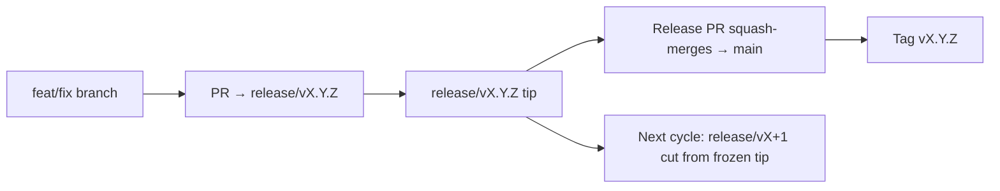

# Branching & Release Model (اردو)

🌐 **Languages:** 🇺🇸 [English](../../../../ops/BRANCHING_MODEL.md) · 🇪🇹 [am](../../../am/docs/ops/BRANCHING_MODEL.md) · 🇸🇦 [ar](../../../ar/docs/ops/BRANCHING_MODEL.md) · 🇦🇿 [az](../../../az/docs/ops/BRANCHING_MODEL.md) · 🇧🇬 [bg](../../../bg/docs/ops/BRANCHING_MODEL.md) · 🇧🇩 [bn](../../../bn/docs/ops/BRANCHING_MODEL.md) · 🇨🇿 [cs](../../../cs/docs/ops/BRANCHING_MODEL.md) · 🇩🇰 [da](../../../da/docs/ops/BRANCHING_MODEL.md) · 🇩🇪 [de](../../../de/docs/ops/BRANCHING_MODEL.md) · 🇬🇷 [el](../../../el/docs/ops/BRANCHING_MODEL.md) · 🇪🇸 [es](../../../es/docs/ops/BRANCHING_MODEL.md) · 🇪🇪 [et](../../../et/docs/ops/BRANCHING_MODEL.md) · 🇮🇷 [fa](../../../fa/docs/ops/BRANCHING_MODEL.md) · 🇫🇮 [fi](../../../fi/docs/ops/BRANCHING_MODEL.md) · 🇫🇷 [fr](../../../fr/docs/ops/BRANCHING_MODEL.md) · 🇮🇪 [ga](../../../ga/docs/ops/BRANCHING_MODEL.md) · 🇮🇳 [gu](../../../gu/docs/ops/BRANCHING_MODEL.md) · 🇳🇬 [ha](../../../ha/docs/ops/BRANCHING_MODEL.md) · 🇮🇱 [he](../../../he/docs/ops/BRANCHING_MODEL.md) · 🇮🇳 [hi](../../../hi/docs/ops/BRANCHING_MODEL.md) · 🇭🇷 [hr](../../../hr/docs/ops/BRANCHING_MODEL.md) · 🇭🇺 [hu](../../../hu/docs/ops/BRANCHING_MODEL.md) · 🇦🇲 [hy](../../../hy/docs/ops/BRANCHING_MODEL.md) · 🇮🇩 [id](../../../id/docs/ops/BRANCHING_MODEL.md) · 🇳🇬 [ig](../../../ig/docs/ops/BRANCHING_MODEL.md) · 🇮🇹 [it](../../../it/docs/ops/BRANCHING_MODEL.md) · 🇯🇵 [ja](../../../ja/docs/ops/BRANCHING_MODEL.md) · 🇬🇪 [ka](../../../ka/docs/ops/BRANCHING_MODEL.md) · 🇰🇭 [km](../../../km/docs/ops/BRANCHING_MODEL.md) · 🇮🇳 [kn](../../../kn/docs/ops/BRANCHING_MODEL.md) · 🇰🇷 [ko](../../../ko/docs/ops/BRANCHING_MODEL.md) · 🇱🇹 [lt](../../../lt/docs/ops/BRANCHING_MODEL.md) · 🇱🇻 [lv](../../../lv/docs/ops/BRANCHING_MODEL.md) · 🇮🇳 [ml](../../../ml/docs/ops/BRANCHING_MODEL.md) · 🇮🇳 [mr](../../../mr/docs/ops/BRANCHING_MODEL.md) · 🇲🇾 [ms](../../../ms/docs/ops/BRANCHING_MODEL.md) · 🇲🇹 [mt](../../../mt/docs/ops/BRANCHING_MODEL.md) · 🇲🇲 [my](../../../my/docs/ops/BRANCHING_MODEL.md) · 🇳🇵 [ne](../../../ne/docs/ops/BRANCHING_MODEL.md) · 🇳🇱 [nl](../../../nl/docs/ops/BRANCHING_MODEL.md) · 🇳🇴 [no](../../../no/docs/ops/BRANCHING_MODEL.md) · 🇮🇳 [or](../../../or/docs/ops/BRANCHING_MODEL.md) · 🇮🇳 [pa](../../../pa/docs/ops/BRANCHING_MODEL.md) · 🇵🇭 [phi](../../../phi/docs/ops/BRANCHING_MODEL.md) · 🇵🇱 [pl](../../../pl/docs/ops/BRANCHING_MODEL.md) · 🇵🇹 [pt](../../../pt/docs/ops/BRANCHING_MODEL.md) · 🇧🇷 [pt-BR](../../../pt-BR/docs/ops/BRANCHING_MODEL.md) · 🇷🇴 [ro](../../../ro/docs/ops/BRANCHING_MODEL.md) · 🇷🇺 [ru](../../../ru/docs/ops/BRANCHING_MODEL.md) · 🇱🇰 [si](../../../si/docs/ops/BRANCHING_MODEL.md) · 🇸🇰 [sk](../../../sk/docs/ops/BRANCHING_MODEL.md) · 🇸🇮 [sl](../../../sl/docs/ops/BRANCHING_MODEL.md) · 🇷🇸 [sr](../../../sr/docs/ops/BRANCHING_MODEL.md) · 🇸🇪 [sv](../../../sv/docs/ops/BRANCHING_MODEL.md) · 🇰🇪 [sw](../../../sw/docs/ops/BRANCHING_MODEL.md) · 🇮🇳 [ta](../../../ta/docs/ops/BRANCHING_MODEL.md) · 🇮🇳 [te](../../../te/docs/ops/BRANCHING_MODEL.md) · 🇹🇭 [th](../../../th/docs/ops/BRANCHING_MODEL.md) · 🇹🇷 [tr](../../../tr/docs/ops/BRANCHING_MODEL.md) · 🇺🇦 [uk-UA](../../../uk-UA/docs/ops/BRANCHING_MODEL.md) · 🇺🇿 [uz](../../../uz/docs/ops/BRANCHING_MODEL.md) · 🇻🇳 [vi](../../../vi/docs/ops/BRANCHING_MODEL.md) · 🇳🇬 [yo](../../../yo/docs/ops/BRANCHING_MODEL.md) · 🇨🇳 [zh-CN](../../../zh-CN/docs/ops/BRANCHING_MODEL.md) · 🇹🇼 [zh-TW](../../../zh-TW/docs/ops/BRANCHING_MODEL.md)

---

OmniRoute ایک **متوازی سائیکل** ریلیز ماڈل استعمال کرتا ہے: فعال سائیکل کے لیے ایک مخصوص `release/vX.Y.Z` برانچ، شائع شدہ سلسلے کے لیے `main`، اور سائیکل کی ترسیل کے وقت ایک ناقابلِ تبدیلی `vX.Y.Z` ٹیگ۔ `release/*` _اور_ `main` دونوں پر commits آنا متوقع ہے — یہ کوئی گڑبڑ نہیں۔

مینٹینر سے متعلق تفصیلات `CLAUDE.md` (Hard Rule #21) اور
[RELEASE_CHECKLIST.md](./RELEASE_CHECKLIST.md) میں موجود ہیں۔ یہ صفحہ عوامی طور پر
contributors کے لیے خلاصہ ہے۔

## ایک نظر میں

| Ref              | کردار                                                                                 |
| ---------------- | ------------------------------------------------------------------------------------- |
| `release/vX.Y.Z` | **فعال سائیکل** — اس ورژن کے لیے روزمرہ development اور PR merges                     |
| `main`           | **شائع شدہ سلسلہ** — ریلیز کی ترسیل کے وقت squash-merge کے ذریعے سائیکل وصول کرتا ہے  |
| `vX.Y.Z` (ٹیگ)   | **ترسیل کا نشان** — ریلیز کے وقت بنایا گیا ناقابلِ تبدیلی “کیا ترسیل کیا گیا” pointer |



## میرے PR کو کس branch کو ہدف بنانا چاہیے؟

**فعال `release/vX.Y.Z` branch کو ہدف بنائیں — `main` کو نہیں۔**

1. سب سے بلند کھلی `release/v*` branch تلاش کریں (تحریر کے وقت مثال:
   `release/v3.8.49`)۔
2. اس tip سے branch بنائیں (`git fetch` + checkout / اس پر rebase)۔
3. PR کو **base = وہ `release/vX.Y.Z`** رکھ کر کھولیں۔

`main` روزمرہ integration branch نہیں ہے۔ `main` کے خلاف کھولے گئے PRs کو
عموماً merge سے پہلے دوبارہ ہدف بنانا پڑتا ہے۔

## ریلیز freeze (متوازی سائیکلز)

جب کسی ریلیز میں مطابقت پیدا کی جا رہی ہو تو `release-freeze` label والا ایک marker issue
کھولا جاتا ہے۔ اس سے **development نہیں رکتی**:

- منجمد `release/vX.Y.Z` اس ترسیل کے release captain کے اختیار میں ہوتا ہے۔
- اگلے سائیکل کی `release/vX+1` منجمد tip سے بنائی جاتی ہے تاکہ contributors اپنا
  کام شامل کرتے رہیں۔
- جو کھلے PRs اب بھی منجمد branch کو ہدف بناتے ہوں، انہیں فعال (سب سے بلند)
  `release/v*` branch کی طرف **دوبارہ ہدف** بنایا جانا چاہیے۔

یہ فرض کرنے سے پہلے کہ مطلوبہ branch merge کی جا سکتی ہے، کسی کھلے freeze کی جانچ کریں:

```bash
gh issue list --repo diegosouzapw/OmniRoute --label release-freeze --state open
```

Merge کا طریقۂ کار (مالک کا `queue` label → Mergify)
[MERGE_TRAIN.md](./MERGE_TRAIN.md) میں درج ہے۔

## branch اور tag دونوں کیوں؟

| Artifact         | مدت               | مقصد                                                             |
| ---------------- | ----------------- | ---------------------------------------------------------------- |
| `release/vX.Y.Z` | زیرِ تکمیل سائیکل | جائزہ شدہ PRs جمع کرتی ہے، CI-green رہتی ہے، اور PR base ہوتی ہے |
| ٹیگ `vX.Y.Z`     | ہمیشہ کے لیے      | npm / GitHub Releases پر بھیجے گئے عین مواد کو نشان زد کرتا ہے   |

branch ورکشاپ ہے؛ tag سربمہر پیکج ہے۔ `main` میں squash-merge کے بعد، اگلا سائیکل
`release/vX+1` پر جاری رہتا ہے اور پچھلے release PR کے مکمل ہونے کا انتظار نہیں کرتا۔

## متعلقہ دستاویزات

- [CONTRIBUTING.md](../../CONTRIBUTING.md) — setup، tests، PR checklist
- [RELEASE_CHECKLIST.md](./RELEASE_CHECKLIST.md) — ترسیل سے پہلے کی توثیق
- [MERGE_TRAIN.md](./MERGE_TRAIN.md) — merge queue اور fallback train
- [RELEASE_GREEN.md](./RELEASE_GREEN.md) — release tip کو green رکھنا
