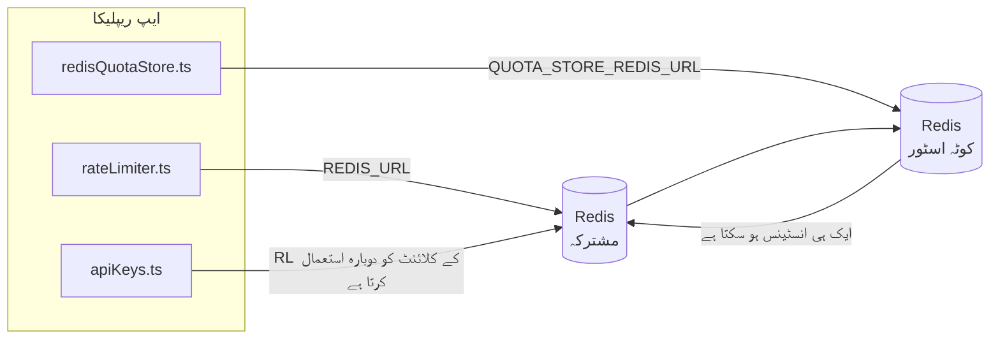

# Redis Production Configuration Guide (اردو)

🌐 **Languages:** 🇺🇸 [English](../../../../ops/REDIS_PRODUCTION_CONFIG.md) · 🇪🇹 [am](../../../am/docs/ops/REDIS_PRODUCTION_CONFIG.md) · 🇸🇦 [ar](../../../ar/docs/ops/REDIS_PRODUCTION_CONFIG.md) · 🇦🇿 [az](../../../az/docs/ops/REDIS_PRODUCTION_CONFIG.md) · 🇧🇬 [bg](../../../bg/docs/ops/REDIS_PRODUCTION_CONFIG.md) · 🇧🇩 [bn](../../../bn/docs/ops/REDIS_PRODUCTION_CONFIG.md) · 🇨🇿 [cs](../../../cs/docs/ops/REDIS_PRODUCTION_CONFIG.md) · 🇩🇰 [da](../../../da/docs/ops/REDIS_PRODUCTION_CONFIG.md) · 🇩🇪 [de](../../../de/docs/ops/REDIS_PRODUCTION_CONFIG.md) · 🇬🇷 [el](../../../el/docs/ops/REDIS_PRODUCTION_CONFIG.md) · 🇪🇸 [es](../../../es/docs/ops/REDIS_PRODUCTION_CONFIG.md) · 🇪🇪 [et](../../../et/docs/ops/REDIS_PRODUCTION_CONFIG.md) · 🇮🇷 [fa](../../../fa/docs/ops/REDIS_PRODUCTION_CONFIG.md) · 🇫🇮 [fi](../../../fi/docs/ops/REDIS_PRODUCTION_CONFIG.md) · 🇫🇷 [fr](../../../fr/docs/ops/REDIS_PRODUCTION_CONFIG.md) · 🇮🇪 [ga](../../../ga/docs/ops/REDIS_PRODUCTION_CONFIG.md) · 🇮🇳 [gu](../../../gu/docs/ops/REDIS_PRODUCTION_CONFIG.md) · 🇳🇬 [ha](../../../ha/docs/ops/REDIS_PRODUCTION_CONFIG.md) · 🇮🇱 [he](../../../he/docs/ops/REDIS_PRODUCTION_CONFIG.md) · 🇮🇳 [hi](../../../hi/docs/ops/REDIS_PRODUCTION_CONFIG.md) · 🇭🇷 [hr](../../../hr/docs/ops/REDIS_PRODUCTION_CONFIG.md) · 🇭🇺 [hu](../../../hu/docs/ops/REDIS_PRODUCTION_CONFIG.md) · 🇦🇲 [hy](../../../hy/docs/ops/REDIS_PRODUCTION_CONFIG.md) · 🇮🇩 [id](../../../id/docs/ops/REDIS_PRODUCTION_CONFIG.md) · 🇳🇬 [ig](../../../ig/docs/ops/REDIS_PRODUCTION_CONFIG.md) · 🇮🇹 [it](../../../it/docs/ops/REDIS_PRODUCTION_CONFIG.md) · 🇯🇵 [ja](../../../ja/docs/ops/REDIS_PRODUCTION_CONFIG.md) · 🇬🇪 [ka](../../../ka/docs/ops/REDIS_PRODUCTION_CONFIG.md) · 🇰🇭 [km](../../../km/docs/ops/REDIS_PRODUCTION_CONFIG.md) · 🇮🇳 [kn](../../../kn/docs/ops/REDIS_PRODUCTION_CONFIG.md) · 🇰🇷 [ko](../../../ko/docs/ops/REDIS_PRODUCTION_CONFIG.md) · 🇱🇹 [lt](../../../lt/docs/ops/REDIS_PRODUCTION_CONFIG.md) · 🇱🇻 [lv](../../../lv/docs/ops/REDIS_PRODUCTION_CONFIG.md) · 🇮🇳 [ml](../../../ml/docs/ops/REDIS_PRODUCTION_CONFIG.md) · 🇮🇳 [mr](../../../mr/docs/ops/REDIS_PRODUCTION_CONFIG.md) · 🇲🇾 [ms](../../../ms/docs/ops/REDIS_PRODUCTION_CONFIG.md) · 🇲🇹 [mt](../../../mt/docs/ops/REDIS_PRODUCTION_CONFIG.md) · 🇲🇲 [my](../../../my/docs/ops/REDIS_PRODUCTION_CONFIG.md) · 🇳🇵 [ne](../../../ne/docs/ops/REDIS_PRODUCTION_CONFIG.md) · 🇳🇱 [nl](../../../nl/docs/ops/REDIS_PRODUCTION_CONFIG.md) · 🇳🇴 [no](../../../no/docs/ops/REDIS_PRODUCTION_CONFIG.md) · 🇮🇳 [or](../../../or/docs/ops/REDIS_PRODUCTION_CONFIG.md) · 🇮🇳 [pa](../../../pa/docs/ops/REDIS_PRODUCTION_CONFIG.md) · 🇵🇭 [phi](../../../phi/docs/ops/REDIS_PRODUCTION_CONFIG.md) · 🇵🇱 [pl](../../../pl/docs/ops/REDIS_PRODUCTION_CONFIG.md) · 🇵🇹 [pt](../../../pt/docs/ops/REDIS_PRODUCTION_CONFIG.md) · 🇧🇷 [pt-BR](../../../pt-BR/docs/ops/REDIS_PRODUCTION_CONFIG.md) · 🇷🇴 [ro](../../../ro/docs/ops/REDIS_PRODUCTION_CONFIG.md) · 🇷🇺 [ru](../../../ru/docs/ops/REDIS_PRODUCTION_CONFIG.md) · 🇱🇰 [si](../../../si/docs/ops/REDIS_PRODUCTION_CONFIG.md) · 🇸🇰 [sk](../../../sk/docs/ops/REDIS_PRODUCTION_CONFIG.md) · 🇸🇮 [sl](../../../sl/docs/ops/REDIS_PRODUCTION_CONFIG.md) · 🇷🇸 [sr](../../../sr/docs/ops/REDIS_PRODUCTION_CONFIG.md) · 🇸🇪 [sv](../../../sv/docs/ops/REDIS_PRODUCTION_CONFIG.md) · 🇰🇪 [sw](../../../sw/docs/ops/REDIS_PRODUCTION_CONFIG.md) · 🇮🇳 [ta](../../../ta/docs/ops/REDIS_PRODUCTION_CONFIG.md) · 🇮🇳 [te](../../../te/docs/ops/REDIS_PRODUCTION_CONFIG.md) · 🇹🇭 [th](../../../th/docs/ops/REDIS_PRODUCTION_CONFIG.md) · 🇹🇷 [tr](../../../tr/docs/ops/REDIS_PRODUCTION_CONFIG.md) · 🇺🇦 [uk-UA](../../../uk-UA/docs/ops/REDIS_PRODUCTION_CONFIG.md) · 🇺🇿 [uz](../../../uz/docs/ops/REDIS_PRODUCTION_CONFIG.md) · 🇻🇳 [vi](../../../vi/docs/ops/REDIS_PRODUCTION_CONFIG.md) · 🇳🇬 [yo](../../../yo/docs/ops/REDIS_PRODUCTION_CONFIG.md) · 🇨🇳 [zh-CN](../../../zh-CN/docs/ops/REDIS_PRODUCTION_CONFIG.md) · 🇹🇼 [zh-TW](../../../zh-TW/docs/ops/REDIS_PRODUCTION_CONFIG.md)

---

## جائزہ

Redis، OmniRoute میں ایک **اختیاری، نرم انحصار** ہے — Redis دستیاب نہ ہونے پر ایپلیکیشن بخوبی کم فعالیت والے موڈ میں منتقل ہو جاتی ہے (ان میموری
متبادل)۔ پروڈکشن میں Redis کی ٹیوننگ چار مختلف
ورک لوڈز کے لیے تاخیر کم کرتی ہے:

| ورک لوڈ            | ڈرائیور                       | کلائنٹ فیکٹری                                       | کلید کا پیٹرن                                    |
| ------------------ | ----------------------------- | --------------------------------------------------- | ------------------------------------------------ |
| شرح کی تحدید       | `rateLimiter.ts`              | `getRedisClient()` — سست آغاز والا `ioredis` سنگلٹن | `<prefix>rl:*` Lua‑اٹامک شرح تحدید ونڈوز         |
| توثیقی کیش         | `apiKeys.ts`                  | `rateLimiter` کا کلائنٹ دوبارہ استعمال کرتا ہے      | `<prefix>auth:api_key:<sha256>` بمع TTL          |
| کوٹہ اسٹور         | `redisQuotaStore.ts`          | علیحدہ `getRedisClient(url)` سنگلٹن                 | `<prefix>quota:*`، ہر انسٹینس کے لیے قابلِ ترتیب |
| وارم اپ سرکٹ بریکر | `redisCircuitBreakerStore.ts` | `circuitBreakerFactory.ts` میں علیحدہ کلائنٹ        | `<prefix>warmup:cb:<connectionId>`               |

چاروں ورک لوڈز ایک ہی نیم اسپیس پری فکس استعمال کرتے ہیں، تاکہ OmniRoute ایک ہی Redis انسٹینس پر دیگر ایپس کے ساتھ
موجود رہ سکے (مثلاً `127.0.0.1:6379`)۔ [کلیدی نیم اسپیسنگ](#key-namespacing) دیکھیں۔

---

## موجودہ کنفیگریشن (کوڈ ڈیفالٹس)

| ترتیب                                   | قدر                                                   | مقام                                                                                  |
| --------------------------------------- | ----------------------------------------------------- | ------------------------------------------------------------------------------------- |
| `REDIS_URL` ماحولیاتی متغیر             | `redis://redis:6379` (compose)، اختیاری               | `rateLimiter.ts:5`, `.env.example`                                                    |
| `REDIS_KEY_PREFIX` ماحولیاتی متغیر      | `omniroute:` (ڈیفالٹ)                                 | `rateLimiter.ts`, `redisQuotaStore.ts`, `redisCircuitBreakerStore.ts`, `.env.example` |
| `QUOTA_STORE_REDIS_URL` ماحولیاتی متغیر | علیحدہ، `REDIS_URL` سے مختلف ہو سکتا ہے               | `quota/storeFactory.ts`                                                               |
| `QUOTA_STORE_DRIVER`                    | `"sqlite"` (ڈیفالٹ)، `"redis"` اختیاری                | `quota/storeFactory.ts`                                                               |
| ioredis `maxRetriesPerRequest`          | `3`                                                   | `rateLimiter.ts` میں کلائنٹ کی تخلیق                                                  |
| `enableReadyCheck`                      | مقرر نہیں (ioredis ڈیفالٹ: `true`)                    | —                                                                                     |
| `lazyConnect`                           | مقرر نہیں (ioredis ڈیفالٹ: `false`)                   | —                                                                                     |
| `retryStrategy`                         | مقرر نہیں (ioredis ڈیفالٹ: 200ms بنیادی، ایکسپونینشل) | —                                                                                     |
| TLS / پاس ورڈ / DB انڈیکس               | **کنفیگر نہیں کیے گئے**                               | —                                                                                     |
| Sentinel / Cluster                      | **کنفیگر نہیں کیے گئے** — صرف اسٹینڈ الون سنگل نوڈ    | —                                                                                     |

---

## کلیدی نیم اسپیسنگ

OmniRoute میزبان پر چلنے والی دیگر سروسز کے ساتھ ایک Redis انسٹینس شیئر کرتا ہے۔ نیم اسپیس کے بغیر،
`auth:api_key:<sha256>` یا `rl:*` جیسی کلیدیں اسی Redis کو استعمال کرنے والی دیگر ایپلیکیشنز کی
کلیدوں سے متصادم ہو سکتی ہیں (یہ انسٹینس دیگر سروسز کے ساتھ `127.0.0.1:6379` پر Redis چلاتا ہے)۔

OmniRoute کی **ہر** کلید کے شروع میں پری فکس شامل کرنے کے لیے `REDIS_KEY_PREFIX` کو کسی غیر خالی اسٹرنگ پر مقرر کریں:

```bash
# .env — OmniRoute کی تمام کلیدیں omniroute:rl:*, omniroute:auth:*, omniroute:quota:*, omniroute:warmup:cb:* بن جاتی ہیں
REDIS_KEY_PREFIX=omniroute:
```

- **ڈیفالٹ:** `omniroute:` (`REDIS_KEY_PREFIX` غیر مقرر یا خالی ہونے پر لاگو ہوتا ہے)۔
- **جن پر لاگو ہوتا ہے:** شرح محدد + توثیقی کیش (`keyPrefix` کے ذریعے مشترکہ `ioredis` کلائنٹ) اور
  کوٹہ اسٹور (`KEY_PREFIX = "${REDIS_KEY_PREFIX}quota"`) اور وارم اپ سرکٹ بریکر
  (`KEY_PREFIX = "${REDIS_KEY_PREFIX}warmup:cb:"`)۔
- Redis میں کلیدیں پہلے سے موجود ہونے کی صورت میں **پری فکس تبدیل کرنے** سے پرانی کلیدیں لاوارث ہو جاتی ہیں (وہ
  TTL / LRU کے ذریعے زائد المیعاد ہو جاتی ہیں)۔ اسے تبدیل کرنا محفوظ ہے؛ کسی منتقلی کی ضرورت نہیں۔ واحد استثنا کسی ایسے کنکشن کی وارم اپ
  سرکٹ بریکر کلید ہے جسے ممنوع نشان زد کیا گیا ہو: اسے TTL کے بغیر مستقل محفوظ کیا جاتا ہے، لہٰذا باقی رہ جانے والی کلیدوں کی فہرست
  `redis-cli --scan --pattern '<old-prefix>warmup:cb:*'` سے حاصل کریں اور انہیں حذف کر دیں۔
- **ioredis `keyPrefix`** تحریر کے وقت خودکار طور پر پری فکس شامل کرتا ہے **اور** پڑھنے کے وقت اسے ہٹا دیتا ہے،
  اس لیے ایپلیکیشن کوڈ کو کبھی پری فکس نظر نہیں آتا۔

---

## تجویز کردہ پروڈکشن ٹیوننگ

### 1. کنکشن پول / کلائنٹ کے اختیارات (ioredis کا `Redis` کنسٹرکٹر)

موجودہ کوڈ کسی حسبِ ضرورت اختیارات کے بغیر ایک `new Redis(url)` بناتا ہے۔ پروڈکشن میں
کثیر ریپلیکا تعیناتیوں کے لیے، کوڈ میں کلائنٹ فیکٹری فراہم کریں یا `getRedisClient()` کو ریپ کریں:

```typescript
const redis = new Redis(REDIS_URL, {
  maxRetriesPerRequest: null, // دوبارہ کوشش کی کوئی حد نہیں؛ retryStrategy کو فیصلہ کرنے دیں
  enableReadyCheck: true, // کالز قبول کرنے سے پہلے تصدیق کریں کہ سرور تیار ہے
  lazyConnect: true, // بناتے وقت متصل نہ ہوں؛ پہلی کال کا انتظار کریں
  retryStrategy: (times) => {
    if (times > 10) return null; // 10 دوبارہ کوششوں کے بعد ترک کریں → بعد میں دوبارہ متصل ہوں
    return Math.min(times * 200, 5000); // 200ms، 400ms، …، زیادہ سے زیادہ 5s
  },
  enableAutoPipelining: true, // بیک وقت کمانڈز کو ایک TCP رائٹ میں یکجا کریں
  keepAlive: 10000, // ہر 10s بعد TCP کیپ الائیو
});
```

**اہم موازنے:**

- `maxRetriesPerRequest: null` + `retryStrategy` — پروڈکشن کے لیے ترجیح دی جاتی ہے تاکہ عارضی
  Redis ری اسٹارٹس ہر درخواست کو فوری طور پر ناکام نہ کریں۔ `checkRateLimit()` میں موجود اِن میموری فال بیک
  ناکامی کے راستے کو سنبھال لیتا ہے۔
- `lazyConnect: true` — سرور کے کنکشنز قبول کرنا شروع کرنے سے پہلے Redis کے دستیاب ہونے پر
  اسٹارٹ اپ انحصار سے بچاتا ہے۔
- `enableAutoPipelining: true` — بیک وقت ریٹ لمٹ چیکس کے لیے راؤنڈ ٹرپس کم کرتا ہے؛
  ایک کنکشن پر >50 RPS میں فائدہ مند ہے۔

### 2. Redis سرور کی کنفیگریشن (`redis.conf`)

```
# میموری
maxmemory 80%                        # OS پیج کیش کے لیے جگہ چھوڑیں
maxmemory-policy allkeys-lru         # دباؤ کی صورت میں پرانی auth کیش اندراجات نکال دیں

# پائیداری (اختیاری — OmniRoute اس کے بغیر بھی کریش سے محفوظ ہے)
save 300 1                           # اگر ≥1 کلید تبدیل ہوئی ہو تو کم از کم ہر 5 منٹ بعد اسنیپ شاٹ لیں
appendonly no                        # AOF درکار نہیں؛ ڈیٹا دوبارہ تخلیق کیا جا سکتا ہے
appendfsync no                       # fsync کا کوئی اضافی بوجھ نہیں (RDB کافی ہے)

# نیٹ ورکنگ
timeout 0                            # بیکار کنکشن منقطع نہ کریں
tcp-keepalive 300                    # 5 منٹ کی کیپ الائیو
tcp-backlog 511                      # اچانک بڑھنے والے لوڈ کے لیے کنکشن بیک لاگ

# کارکردگی
hz 10                                # ڈیفالٹ؛ تاخیر کے حوالے سے حساس صورتوں کے لیے 100
activedefrag yes                     # جب فریگمینٹیشن >10% ہو تو خودکار ڈی فریگمنٹ کریں
```

**`maxmemory-policy allkeys-lru` کا موازنہ:** میموری کے دباؤ میں auth کیش اندراجات
نکالی جا سکتی ہیں۔ یہ محفوظ ہے — مس ہونے پر `setCachedApiKey` ہمیشہ دوبارہ ڈیٹا بھرتا ہے، اور
SQLite فال بیک مستند ذریعہ ہے۔ ریٹ لمیٹر کی Lua اسکرپٹ چھوٹی کلیدیں بناتی ہے جو
ڈیزائن کے مطابق مختصر مدت کے لیے موجود رہتی ہیں۔

### 3. Docker Compose کی ترتیبات

پروڈکشن compose (`docker-compose.prod.yml`) میں `redis:8.6.2-alpine` استعمال ہوتا ہے۔ یہ شامل کریں:

```yaml
redis:
  image: redis:8.6.2-alpine
  command:
    [
      "redis-server",
      "--maxmemory",
      "512mb",
      "--maxmemory-policy",
      "allkeys-lru",
      "--activedefrag",
      "yes",
      "--save",
      "300 1",
    ]
  healthcheck:
    test: ["CMD", "redis-cli", "ping"]
    interval: 10s
    timeout: 3s
    retries: 3
    start_period: 5s
```

### 4. متعدد انسٹینسز / اسکیلنگ کے تحفظات

**تمام ریپلیکاز کے لیے ایک Redis** — ریٹ لمیٹر کی Lua اسکرپٹ ایک واحد
مستند کلیدی اسپیس پر منحصر ہے۔ ریپلیکاز کے پیچھے متعدد Redis انسٹینسز استعمال کرنے سے اٹامک خصوصیت
ختم ہو جائے گی اور بجٹ دوگنا ہو جائے گا۔ تمام ایپلیکیشن ریپلیکاز کے لیے ایک Redis
(یا فیل اوور کے ساتھ Redis Sentinel کلسٹر) استعمال کریں۔

**کنکشنز کی تعداد:** ہر ایپلیکیشن ریپلیکا Redis کے ساتھ **2 TCP کنکشنز** کھولتا ہے
(ریٹ لمیٹر کلائنٹ + کوٹا اسٹور کلائنٹ)۔ 10 ریپلیکاز پر → 20 کنکشنز، جو
ڈیفالٹ Redis انسٹینس کی 10k کنکشنز کی حد کے اندر ہیں۔

### 5. مانیٹرنگ

ہیلتھ چیک اینڈ پوائنٹ کے ذریعے ظاہر کریں:

```typescript
// src/app/api/monitoring/health/route.ts پہلے ہی rateLimiter فنکشنز کو کال کرتا ہے
// Redis سے متعلق مخصوص چیکس شامل کریں:
//   1. ioredis کے .ping() کے ذریعے PING کی تاخیر
//   2. INFO memory کے ذریعے میموری کا استعمال
//   3. INFO clients کے ذریعے کنکشنز کی تعداد
//   4. maxmemory-policy کے لیے ہٹ ریٹ (evicted_keys / keyspace_hits)
```

نگرانی کے لیے اہم میٹرکس:

- **نکالی گئی کلیدیں / سیکنڈ** — اگر مسلسل صفر سے زیادہ ہوں تو `maxmemory` بڑھائیں
- **بلاک شدہ کلائنٹس** — صفر سے زیادہ ہونا سست Lua اسکرپٹس یا زیادہ تنازع کی نشاندہی کرتا ہے
- **مسترد شدہ کنکشنز** — کنکشن کی حد پوری ہو گئی؛ 20 کنکشنز پر ایسا شاذ و نادر ہوتا ہے

---

## آرکیٹیکچر ڈایاگرام



---

## حوالہ جات

| فائل                               | مقصد                                                        |
| ---------------------------------- | ----------------------------------------------------------- |
| `src/shared/utils/rateLimiter.ts`  | بنیادی Redis کلائنٹ، Lua ریٹ لمٹ اسکرپٹ، اِن میموری فال بیک |
| `src/lib/db/apiKeys.ts`            | توثیقی کیش — Redis→SQLite فال بیک                           |
| `src/lib/quota/redisQuotaStore.ts` | اختیاری کوٹہ اسٹور کے لیے علیحدہ Redis کلائنٹ               |
| `src/lib/quota/storeFactory.ts`    | `sqlite` اور `redis` کوٹہ ڈرائیورز کے درمیان سوئچ کرتا ہے   |
| `docker-compose.prod.yml`          | پروڈکشن Redis کنٹینر (امیج `redis:8.6.2-alpine`)            |
| `.env.example`                     | Redis انوائرمنٹ ویری ایبلز کی دستاویزات                     |
| `src/app/api/local/redis/`         | ڈیولپمنٹ کنٹینر آرکیسٹریشن کے لیے API روٹس                  |
| `bin/cli/commands/redis.mjs`       | ڈیولپمنٹ کنٹینر آرکیسٹریشن کے لیے CLI کمانڈز                |
