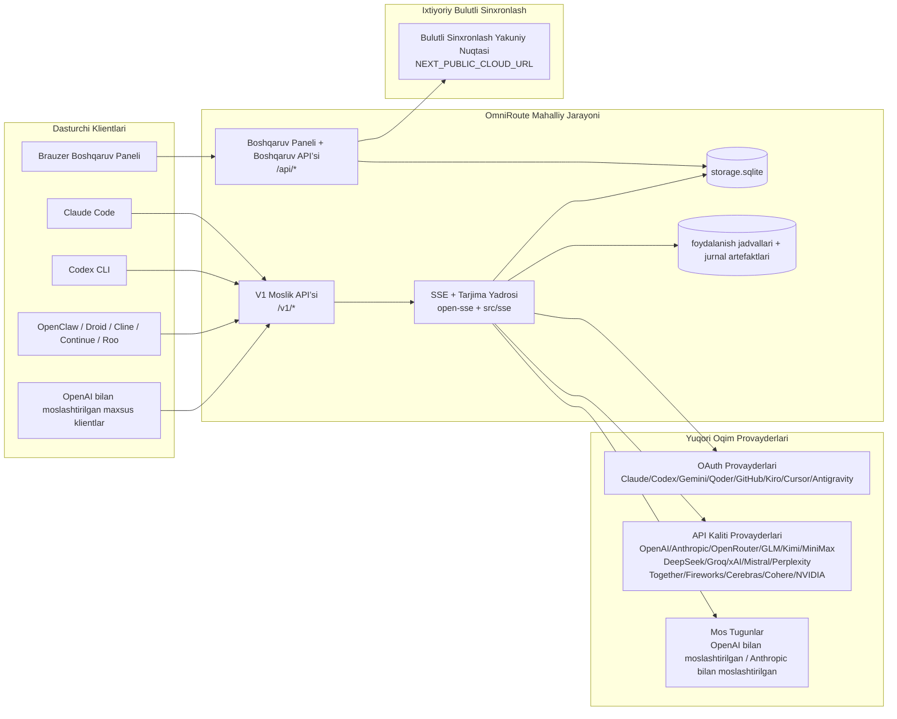
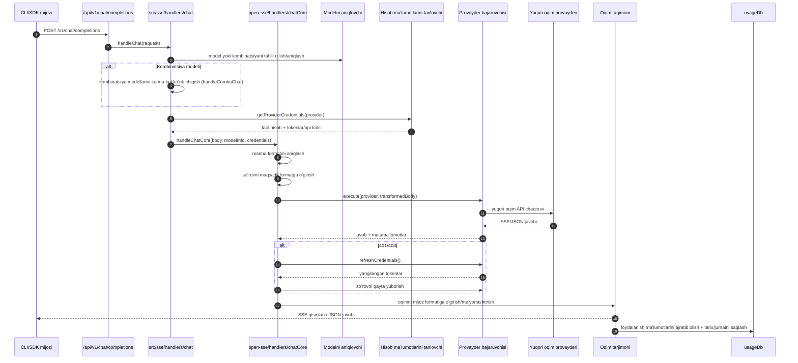
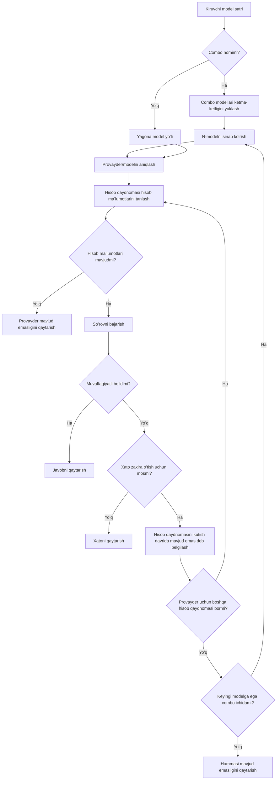
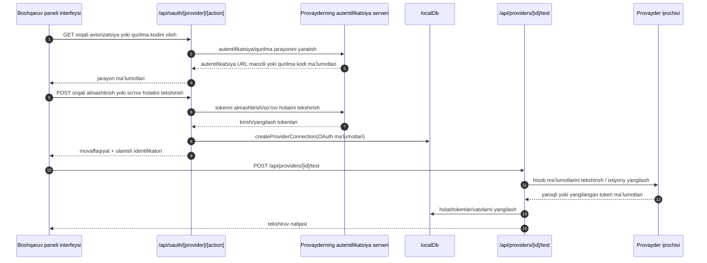
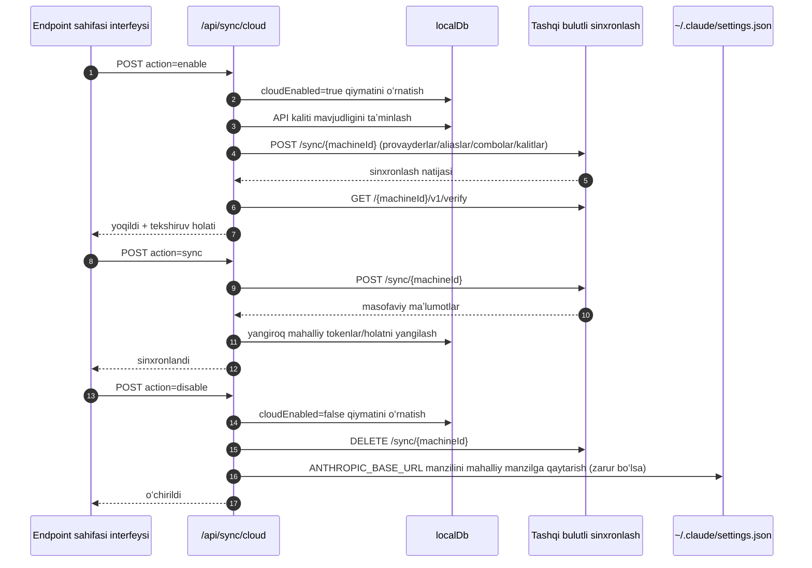
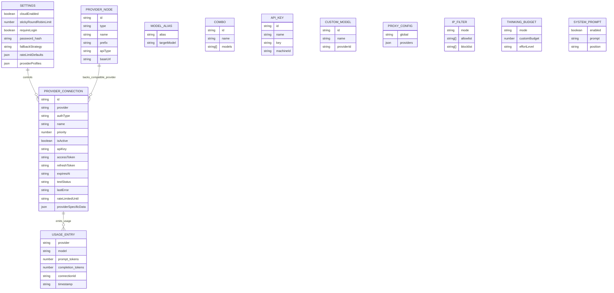
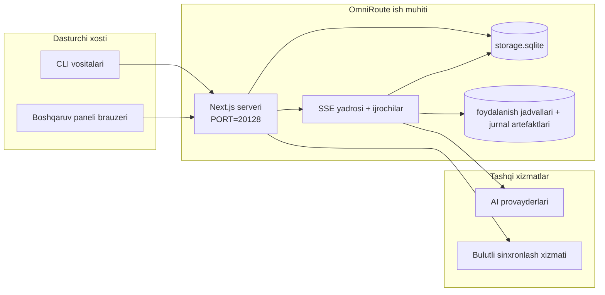

# OmniRoute Architecture (Oʻzbekcha)

🌐 **Languages:** 🇺🇸 [English](../../../../architecture/ARCHITECTURE.md) · 🇪🇹 [am](../../../am/docs/architecture/ARCHITECTURE.md) · 🇸🇦 [ar](../../../ar/docs/architecture/ARCHITECTURE.md) · 🇦🇿 [az](../../../az/docs/architecture/ARCHITECTURE.md) · 🇧🇬 [bg](../../../bg/docs/architecture/ARCHITECTURE.md) · 🇧🇩 [bn](../../../bn/docs/architecture/ARCHITECTURE.md) · 🇧🇦 [bs](../../../bs/docs/architecture/ARCHITECTURE.md) · 🇨🇿 [cs](../../../cs/docs/architecture/ARCHITECTURE.md) · 🇩🇰 [da](../../../da/docs/architecture/ARCHITECTURE.md) · 🇩🇪 [de](../../../de/docs/architecture/ARCHITECTURE.md) · 🇬🇷 [el](../../../el/docs/architecture/ARCHITECTURE.md) · 🇪🇸 [es](../../../es/docs/architecture/ARCHITECTURE.md) · 🇪🇪 [et](../../../et/docs/architecture/ARCHITECTURE.md) · 🇮🇷 [fa](../../../fa/docs/architecture/ARCHITECTURE.md) · 🇫🇮 [fi](../../../fi/docs/architecture/ARCHITECTURE.md) · 🇫🇷 [fr](../../../fr/docs/architecture/ARCHITECTURE.md) · 🇮🇪 [ga](../../../ga/docs/architecture/ARCHITECTURE.md) · 🇮🇳 [gu](../../../gu/docs/architecture/ARCHITECTURE.md) · 🇳🇬 [ha](../../../ha/docs/architecture/ARCHITECTURE.md) · 🇮🇱 [he](../../../he/docs/architecture/ARCHITECTURE.md) · 🇮🇳 [hi](../../../hi/docs/architecture/ARCHITECTURE.md) · 🇭🇷 [hr](../../../hr/docs/architecture/ARCHITECTURE.md) · 🇭🇺 [hu](../../../hu/docs/architecture/ARCHITECTURE.md) · 🇦🇲 [hy](../../../hy/docs/architecture/ARCHITECTURE.md) · 🇮🇩 [id](../../../id/docs/architecture/ARCHITECTURE.md) · 🇳🇬 [ig](../../../ig/docs/architecture/ARCHITECTURE.md) · 🇮🇹 [it](../../../it/docs/architecture/ARCHITECTURE.md) · 🇯🇵 [ja](../../../ja/docs/architecture/ARCHITECTURE.md) · 🇬🇪 [ka](../../../ka/docs/architecture/ARCHITECTURE.md) · 🇰🇭 [km](../../../km/docs/architecture/ARCHITECTURE.md) · 🇮🇳 [kn](../../../kn/docs/architecture/ARCHITECTURE.md) · 🇰🇷 [ko](../../../ko/docs/architecture/ARCHITECTURE.md) · 🇱🇹 [lt](../../../lt/docs/architecture/ARCHITECTURE.md) · 🇱🇻 [lv](../../../lv/docs/architecture/ARCHITECTURE.md) · 🇮🇳 [ml](../../../ml/docs/architecture/ARCHITECTURE.md) · 🇮🇳 [mr](../../../mr/docs/architecture/ARCHITECTURE.md) · 🇲🇾 [ms](../../../ms/docs/architecture/ARCHITECTURE.md) · 🇲🇹 [mt](../../../mt/docs/architecture/ARCHITECTURE.md) · 🇲🇲 [my](../../../my/docs/architecture/ARCHITECTURE.md) · 🇳🇵 [ne](../../../ne/docs/architecture/ARCHITECTURE.md) · 🇳🇱 [nl](../../../nl/docs/architecture/ARCHITECTURE.md) · 🇳🇴 [no](../../../no/docs/architecture/ARCHITECTURE.md) · 🇮🇳 [or](../../../or/docs/architecture/ARCHITECTURE.md) · 🇮🇳 [pa](../../../pa/docs/architecture/ARCHITECTURE.md) · 🇵🇭 [phi](../../../phi/docs/architecture/ARCHITECTURE.md) · 🇵🇱 [pl](../../../pl/docs/architecture/ARCHITECTURE.md) · 🇵🇹 [pt](../../../pt/docs/architecture/ARCHITECTURE.md) · 🇧🇷 [pt-BR](../../../pt-BR/docs/architecture/ARCHITECTURE.md) · 🇷🇴 [ro](../../../ro/docs/architecture/ARCHITECTURE.md) · 🇷🇺 [ru](../../../ru/docs/architecture/ARCHITECTURE.md) · 🇱🇰 [si](../../../si/docs/architecture/ARCHITECTURE.md) · 🇸🇰 [sk](../../../sk/docs/architecture/ARCHITECTURE.md) · 🇸🇮 [sl](../../../sl/docs/architecture/ARCHITECTURE.md) · 🇷🇸 [sr](../../../sr/docs/architecture/ARCHITECTURE.md) · 🇸🇪 [sv](../../../sv/docs/architecture/ARCHITECTURE.md) · 🇰🇪 [sw](../../../sw/docs/architecture/ARCHITECTURE.md) · 🇮🇳 [ta](../../../ta/docs/architecture/ARCHITECTURE.md) · 🇮🇳 [te](../../../te/docs/architecture/ARCHITECTURE.md) · 🇹🇭 [th](../../../th/docs/architecture/ARCHITECTURE.md) · 🇹🇷 [tr](../../../tr/docs/architecture/ARCHITECTURE.md) · 🇺🇦 [uk-UA](../../../uk-UA/docs/architecture/ARCHITECTURE.md) · 🇵🇰 [ur](../../../ur/docs/architecture/ARCHITECTURE.md) · 🇻🇳 [vi](../../../vi/docs/architecture/ARCHITECTURE.md) · 🇳🇬 [yo](../../../yo/docs/architecture/ARCHITECTURE.md) · 🇨🇳 [zh-CN](../../../zh-CN/docs/architecture/ARCHITECTURE.md) · 🇹🇼 [zh-TW](../../../zh-TW/docs/architecture/ARCHITECTURE.md)

---

🌐 **Languages:** 🇺🇸 [English](../../../../architecture/ARCHITECTURE.md) · 🇪🇹 [am](../../../am/docs/architecture/ARCHITECTURE.md) · 🇸🇦 [ar](../../../ar/docs/architecture/ARCHITECTURE.md) · 🇦🇿 [az](../../../az/docs/architecture/ARCHITECTURE.md) · 🇧🇬 [bg](../../../bg/docs/architecture/ARCHITECTURE.md) · 🇧🇩 [bn](../../../bn/docs/architecture/ARCHITECTURE.md) · 🇧🇦 [bs](../../../bs/docs/architecture/ARCHITECTURE.md) · 🇨🇿 [cs](../../../cs/docs/architecture/ARCHITECTURE.md) · 🇩🇰 [da](../../../da/docs/architecture/ARCHITECTURE.md) · 🇩🇪 [de](../../../de/docs/architecture/ARCHITECTURE.md) · 🇬🇷 [el](../../../el/docs/architecture/ARCHITECTURE.md) · 🇪🇸 [es](../../../es/docs/architecture/ARCHITECTURE.md) · 🇪🇪 [et](../../../et/docs/architecture/ARCHITECTURE.md) · 🇮🇷 [fa](../../../fa/docs/architecture/ARCHITECTURE.md) · 🇫🇮 [fi](../../../fi/docs/architecture/ARCHITECTURE.md) · 🇫🇷 [fr](../../../fr/docs/architecture/ARCHITECTURE.md) · 🇮🇪 [ga](../../../ga/docs/architecture/ARCHITECTURE.md) · 🇮🇳 [gu](../../../gu/docs/architecture/ARCHITECTURE.md) · 🇳🇬 [ha](../../../ha/docs/architecture/ARCHITECTURE.md) · 🇮🇱 [he](../../../he/docs/architecture/ARCHITECTURE.md) · 🇮🇳 [hi](../../../hi/docs/architecture/ARCHITECTURE.md) · 🇭🇷 [hr](../../../hr/docs/architecture/ARCHITECTURE.md) · 🇭🇺 [hu](../../../hu/docs/architecture/ARCHITECTURE.md) · 🇦🇲 [hy](../../../hy/docs/architecture/ARCHITECTURE.md) · 🇮🇩 [id](../../../id/docs/architecture/ARCHITECTURE.md) · 🇳🇬 [ig](../../../ig/docs/architecture/ARCHITECTURE.md) · 🇮🇹 [it](../../../it/docs/architecture/ARCHITECTURE.md) · 🇯🇵 [ja](../../../ja/docs/architecture/ARCHITECTURE.md) · 🇬🇪 [ka](../../../ka/docs/architecture/ARCHITECTURE.md) · 🇰🇭 [km](../../../km/docs/architecture/ARCHITECTURE.md) · 🇮🇳 [kn](../../../kn/docs/architecture/ARCHITECTURE.md) · 🇰🇷 [ko](../../../ko/docs/architecture/ARCHITECTURE.md) · 🇱🇹 [lt](../../../lt/docs/architecture/ARCHITECTURE.md) · 🇱🇻 [lv](../../../lv/docs/architecture/ARCHITECTURE.md) · 🇮🇳 [ml](../../../ml/docs/architecture/ARCHITECTURE.md) · 🇮🇳 [mr](../../../mr/docs/architecture/ARCHITECTURE.md) · 🇲🇾 [ms](../../../ms/docs/architecture/ARCHITECTURE.md) · 🇲🇹 [mt](../../../mt/docs/architecture/ARCHITECTURE.md) · 🇲🇲 [my](../../../my/docs/architecture/ARCHITECTURE.md) · 🇳🇵 [ne](../../../ne/docs/architecture/ARCHITECTURE.md) · 🇳🇱 [nl](../../../nl/docs/architecture/ARCHITECTURE.md) · 🇳🇴 [no](../../../no/docs/architecture/ARCHITECTURE.md) · 🇮🇳 [or](../../../or/docs/architecture/ARCHITECTURE.md) · 🇮🇳 [pa](../../../pa/docs/architecture/ARCHITECTURE.md) · 🇵🇭 [phi](../../../phi/docs/architecture/ARCHITECTURE.md) · 🇵🇱 [pl](../../../pl/docs/architecture/ARCHITECTURE.md) · 🇵🇹 [pt](../../../pt/docs/architecture/ARCHITECTURE.md) · 🇧🇷 [pt-BR](../../../pt-BR/docs/architecture/ARCHITECTURE.md) · 🇷🇴 [ro](../../../ro/docs/architecture/ARCHITECTURE.md) · 🇷🇺 [ru](../../../ru/docs/architecture/ARCHITECTURE.md) · 🇱🇰 [si](../../../si/docs/architecture/ARCHITECTURE.md) · 🇸🇰 [sk](../../../sk/docs/architecture/ARCHITECTURE.md) · 🇸🇮 [sl](../../../sl/docs/architecture/ARCHITECTURE.md) · 🇷🇸 [sr](../../../sr/docs/architecture/ARCHITECTURE.md) · 🇸🇪 [sv](../../../sv/docs/architecture/ARCHITECTURE.md) · 🇰🇪 [sw](../../../sw/docs/architecture/ARCHITECTURE.md) · 🇮🇳 [ta](../../../ta/docs/architecture/ARCHITECTURE.md) · 🇮🇳 [te](../../../te/docs/architecture/ARCHITECTURE.md) · 🇹🇭 [th](../../../th/docs/architecture/ARCHITECTURE.md) · 🇹🇷 [tr](../../../tr/docs/architecture/ARCHITECTURE.md) · 🇺🇦 [uk-UA](../../../uk-UA/docs/architecture/ARCHITECTURE.md) · 🇵🇰 [ur](../../../ur/docs/architecture/ARCHITECTURE.md) · 🇻🇳 [vi](../../../vi/docs/architecture/ARCHITECTURE.md) · 🇳🇬 [yo](../../../yo/docs/architecture/ARCHITECTURE.md) · 🇨🇳 [zh-CN](../../../zh-CN/docs/architecture/ARCHITECTURE.md) · 🇹🇼 [zh-TW](../../../zh-TW/docs/architecture/ARCHITECTURE.md)

_Oxirgi yangilanish: 2026-06-28_

## Qisqacha mazmun

OmniRoute — Next.js asosida yaratilgan lokal AI marshrutlash shlyuzi va boshqaruv paneli.
U OpenAI bilan mos yagona yakuniy nuqtani (`/v1/*`) taqdim etadi hamda tarjima, zaxira variantga oʻtish, tokenni yangilash va foydalanishni kuzatish imkoniyatlari bilan trafikni bir nechta yuqori oqim provayderlari oʻrtasida marshrutlaydi.

Asosiy imkoniyatlar:

- CLI/vositalar uchun OpenAI bilan mos API interfeysi (355 ta provayder, 108 ta ijrochi)
- Provayder formatlari oʻrtasida soʻrov/javoblarni tarjima qilish
- Modellar kombinatsiyasi orqali zaxira variantga oʻtish (koʻp modelli ketma-ketlik)
- `compositeTiers` asosida bajarilish vaqtida tartiblanadigan tuzilgan kombinatsiya qadamlari (`provider + model + connection`)
- Hisob darajasida zaxira variantga oʻtish (har bir provayder uchun bir nechta hisob)
- Asosiy chat yoʻlida kvotani oldindan tekshirish va kvotani hisobga oluvchi P2C hisob tanlovi
- OAuth + API kaliti orqali provayder ulanishlarini boshqarish (22 ta OAuth provayder moduli)
- `/v1/embeddings` orqali embedding yaratish (18 ta provayder)
- `/v1/images/generations` orqali tasvir yaratish (10+ provayder, 20+ model)
- `/v1/audio/transcriptions` orqali audio transkripsiyasi (18 ta provayder)
- `/v1/audio/speech` orqali matndan nutq yaratish (24 ta ichki provayder)
- `/v1/videos/generations` orqali video yaratish (ComfyUI + SD WebUI)
- `/v1/music/generations` orqali musiqa yaratish (ComfyUI)
- `/v1/search` orqali veb-qidiruv (20 ta provayder)
- `/v1/moderations` orqali moderatsiya
- `/v1/rerank` orqali qayta tartiblash
- Mulohaza yurituvchi modellar uchun fikrlash teglarini (`<think>...</think>`) tahlil qilish
- OpenAI SDK bilan qatʼiy muvofiqlik uchun javoblarni tozalash
- Provayderlararo muvofiqlik uchun rollarni meʼyorlashtirish (developer→system, system→user)
- Tuzilgan chiqishni oʻzgartirish (json_schema → Gemini responseSchema)
- Provayderlar, kalitlar, taxalluslar, kombinatsiyalar, sozlamalar va narxlar uchun lokal doimiy saqlash (122 ta DB moduli)
- Foydalanish/xarajatlarni kuzatish va soʻrovlarni jurnalga yozish
- Bir nechta qurilma/holatni sinxronlash uchun ixtiyoriy bulut sinxronizatsiyasi
- API kirishini boshqarish uchun IP ruxsat roʻyxati/bloklash roʻyxati
- Fikrlash budjetini boshqarish (passthrough/auto/custom/adaptive)
- Global tizim promptini kiritish
- Seanslarni kuzatish va raqamli izlarni aniqlash
- Provayderga xos profillar bilan har bir hisob uchun kengaytirilgan tezlik cheklovi
- Provayderlar barqarorligi uchun avtomatik uzgich andozasi
- Mutex qulflash orqali ommaviy bir vaqtda yuboriladigan soʻrovlardan himoya
- Imzoga asoslangan soʻrovlarni takrorlanishdan saqlovchi kesh
- Domen qatlami: xarajat qoidalari, zaxira variantga oʻtish siyosati, bloklash siyosati
- Context Relay: hisoblarni almashtirishda uzluksizlikni taʼminlash uchun seansni topshirish xulosalari
- Domen holatini doimiy saqlash (zaxira variantlar, budjetlar, bloklashlar va avtomatik uzgichlar uchun SQLite write-through keshi)
- Soʻrovlarni markazlashgan tarzda baholash uchun siyosat mexanizmi (bloklash → budjet → zaxira variant)
- p50/p95/p99 kechikish agregatsiyasiga ega soʻrov telemetriyasi
- `combo_execution_key` / `combo_step_id` orqali kombinatsiya nishoni telemetriyasi va kombinatsiya nishonlarining tarixiy holati
- Boshidan oxirigacha kuzatish uchun korrelyatsiya IDsi (X-Request-Id)
- Har bir API kaliti boʻyicha rad etish imkoniyatiga ega muvofiqlik auditi jurnali
- LLM sifatini taʼminlash uchun baholash freymvorki
- Provayder avtomatik uzgichlarining real vaqt holatini koʻrsatuvchi salomatlik boshqaruv paneli
- 3 ta transportga (stdio/SSE/Streamable HTTP) ega MCP Server (110 ta vosita)
- Koʻnikmalar va vazifa hayotiy sikliga ega A2A Server (JSON-RPC 2.0 + SSE)
- Xotira tizimi (ajratib olish, kiritish, qidirib topish, umumlashtirish)
- Koʻnikmalar tizimi (reestr, ijrochi, sandbox, ichki koʻnikmalar)
- Sertifikatlarni boshqarish va DNS bilan ishlash imkoniyatiga ega MITM proksi
- Prompt kiritish hujumidan himoyalovchi oraliq dastur
- Caveman, RTK, ketma-ket quvurlar, siqish kombinatsiyalari, til paketlari va tahlil imkoniyatlariga ega promptlarni siqish quvuri
- ACP (Agent Communication Protocol) reyestri
- Modulli OAuth provayderlari (`src/lib/oauth/providers/` ichidagi 22 ta alohida modul)
- Olib tashlash/toʻliq olib tashlash skriptlari
- OAuth muhitini tiklash amali
- OpenAI bilan mos WS mijozlari uchun WebSocket koʻprigi (`/v1/ws`)
- Sinxronlash tokenlarini boshqarish (yaratish/bekor qilish, ETag versiyalangan konfiguratsiya toʻplamini yuklab olish)
- GLM Thinking (`glmt`) uchun birinchi darajali provayder shabloni
- Gibrid token hisoblash (provayder tomonidagi `/messages/count_tokens`, baholash asosidagi zaxira variant bilan)
- Model taxalluslarini avtomatik boshlangʻich toʻldirish (ishga tushishda 30+ proksilararo dialekt meʼyorlashtirishlari)
- SSRF himoyasi, xususiy URL manzillarni bloklash va sozlanadigan qayta urinishga ega xavfsiz chiquvchi fetch
- Sozlanadigan `requestRetry` va `maxRetryIntervalSec` bilan kutish muddatini hisobga oluvchi chat qayta urinishlari
- Ishga tushishda Zod yordamida bajarilish muhiti validatsiyasi
- Sahifalash, provayder CRUD hodisalari va SSRF tomonidan bloklangan validatsiyani jurnalga yozishga ega muvofiqlik auditi v2

Asosiy bajarilish modeli:

- `src/app/api/*` ichidagi Next.js ilova marshrutlari ham boshqaruv paneli APIlarini, ham moslik APIlarini amalga oshiradi
- `src/sse/*` + `open-sse/*` ichidagi umumiy SSE/marshrutlash yadrosi provayder bajarilishi, tarjima, oqimli uzatish, zaxira variantga oʻtish va foydalanishni boshqaradi

## Maʼlumotnoma diagrammalari

v3.8.0 platformasi uchun kanonik, versiyalar nazoratidagi Mermaid manbalari
[`docs/diagrams/`](../diagrams/README.md) ichida joylashgan. Yoʻnalishni tushunish uchun ulardan ikkitasi quyida keltirilgan;
qolganlariga tegishli soha qoʻllanmalaridan havolalar berilgan.


> Manba: [diagrams/request-pipeline.mmd](../diagrams/request-pipeline.mmd)


> Manba: [diagrams/resilience-3layers.mmd](../diagrams/resilience-3layers.mmd) — shuningdek,
> [RESILIENCE_GUIDE.md](./RESILIENCE_GUIDE.md) va `CLAUDE.md` faylidagi bardoshlilik maʼlumotnomasida havola qilingan.

## Qamrov va chegaralar

### Qamrov doirasida

- Mahalliy shlyuzning ish muhiti
- Boshqaruv panelini boshqarish APIʼlari
- Provayder autentifikatsiyasi va tokenni yangilash
- Soʻrovlarni oʻgirish va SSE oqimli uzatish
- Mahalliy holat va foydalanish maʼlumotlarini doimiy saqlash
- Ixtiyoriy bulutli sinxronlashni muvofiqlashtirish

### Qamrovdan tashqarida

- `NEXT_PUBLIC_CLOUD_URL` ortidagi bulut xizmatini amalga oshirish
- Mahalliy jarayondan tashqaridagi provayder SLA/boshqaruv tekisligi
- Tashqi CLI bajariluvchi fayllarining oʻzi (Claude CLI, Codex CLI va boshqalar)

## Boshqaruv paneli yuzasi (joriy)

`src/app/(dashboard)/dashboard/` ostidagi asosiy sahifalar:

- `/dashboard` — tezkor boshlash + provayderlar sharhi
- `/dashboard/endpoint` — soʻnggi nuqta proksisi + MCP + A2A + API soʻnggi nuqtasi varaqlari
- `/dashboard/providers` — provayder ulanishlari va hisob maʼlumotlari
- `/dashboard/combos` — kombinatsiya strategiyalari, shablonlar, qadamlarga asoslangan tuzuvchi, modelni yoʻnaltirish qoidalari, qoʻlda belgilangan doimiy tartib
- `/dashboard/auto-combo` — Avtomatik kombinatsiya mexanizmi: baholash vaznlari, rejim toʻplamlari, virtual fabrika andozalari, telemetriya
- `/dashboard/costs` — xarajatlarni jamlash va narxlar koʻrinishi
- `/dashboard/analytics` — foydalanish tahlili, baholashlar, kombinatsiya maqsadlari holati
- `/dashboard/limits` — kvota/tezlik boshqaruvlari
- `/dashboard/cli-tools` — CLI bilan ish boshlash, ish muhitini aniqlash, konfiguratsiya yaratish
- `/dashboard/agents` — aniqlangan ACP agentlari + maxsus agentni roʻyxatdan oʻtkazish
- `/dashboard/cloud-agents` — bulutda joylashtirilgan agent vazifalari (Codex Cloud, Devin, Jules) va vazifaning hayotiy sikli
- `/dashboard/skills` — A2A koʻnikmalar reyestri, sinov muhitida bajarish, ichki koʻnikmalar katalogi
- `/dashboard/memory` — doimiy suhbat xotirasini tekshirish va olish
- `/dashboard/webhooks` — chiquvchi webhook obunalari, maxfiy kalitni almashtirish, qayta urinish statistikasi
- `/dashboard/batch` — paketli vazifani yuborish va bajarilish jarayoni
- `/dashboard/cache` — oʻqish orqali va mulohaza yuritish keshi statistikasi, chiqarib tashlash boshqaruvlari
- `/dashboard/playground` — sozlangan istalgan kombinatsiya/model bilan interaktiv suhbat sinov maydoni
- `/dashboard/changelog` — ilova ichidagi oʻzgarishlar jurnali koʻruvchisi (`CHANGELOG.md` faylini namoyish qiladi)
- `/dashboard/system` — ish muhiti diagnostikasi, versiya maʼlumotlari, muhitni tekshirish interfeysi
- `/dashboard/onboarding` — yangi oʻrnatishlar uchun birinchi ishga tushirishni sozlash ustasi
- `/dashboard/media` — tasvir/video/musiqa sinov maydoni
- `/dashboard/search-tools` — qidiruv provayderlarini sinash va tarix
- `/dashboard/health` — uzluksiz ishlash vaqti, zanjir uzgichlar, tezlik cheklovlari, kvotasi kuzatiladigan seanslar
- `/dashboard/logs` — soʻrov/proksi/audit/konsol jurnallari
- `/dashboard/settings` — tizim sozlamalari varaqlari (umumiy, yoʻnaltirish, standart kombinatsiyalar va boshqalar)
- `/dashboard/context/caveman` — Caveman siqish qoidalari, til paketlari, oldindan koʻrish va chiqish rejimi
- `/dashboard/context/rtk` — RTK buyruq chiqishi filtrlari, oldindan koʻrish va ish muhiti xavfsizligi sozlamalari
- `/dashboard/context/combos` — yoʻnaltirish kombinatsiyalariga tayinlangan nomli siqish konveyerlari
- `/dashboard/translator` — tarjimonni tekshirish va soʻrov formatini oʻzgartirishni oldindan koʻrish
- `/dashboard/audit` — sahifalash va tuzilmaviy metamaʼlumotlarga ega muvofiqlik auditi jurnali brauzeri
- `/dashboard/usage` — `usage_history` bilan bogʻlangan har bir soʻrov boʻyicha foydalanish brauzeri
- `/dashboard/compression` — siqish tahlili, statistika va konveyerlarni tayinlash
- `/dashboard/api-manager` — API kalitining hayotiy sikli va model ruxsatlari

## Yuqori Darajadagi Tizim Konteksti



## Asosiy Ish Muhiti Komponentlari

## 1) API va Marshrutlash Qatlami (Next.js Ilova Marshrutlari)

Asosiy kataloglar:

- Moslik API’lari uchun `src/app/api/v1/*` va `src/app/api/v1beta/*`
- Boshqaruv/konfiguratsiya API’lari uchun `src/app/api/*`
- `next.config.mjs` ichidagi Next qayta yozishlari `/v1/*` ni `/api/v1/*` ga moslaydi

Muhim moslik marshrutlari:

- `src/app/api/v1/chat/completions/route.ts`
- `src/app/api/v1/messages/route.ts`
- `src/app/api/v1/responses/route.ts`
- `src/app/api/v1/models/route.ts` — `custom: true` ga ega maxsus modellarni o‘z ichiga oladi
- `src/app/api/v1/embeddings/route.ts` — embedding yaratish (6 ta provayder)
- `src/app/api/v1/images/generations/route.ts` — tasvir yaratish (4+ ta provayder, jumladan Antigravity/Nebius)
- `src/app/api/v1/messages/count_tokens/route.ts`
- `src/app/api/v1/providers/[provider]/chat/completions/route.ts` — har bir provayder uchun alohida chat
- `src/app/api/v1/providers/[provider]/embeddings/route.ts` — har bir provayder uchun alohida embedding’lar
- `src/app/api/v1/providers/[provider]/images/generations/route.ts` — har bir provayder uchun alohida tasvirlar
- `src/app/api/v1beta/models/route.ts`
- `src/app/api/v1beta/models/[...path]/route.ts`

Boshqaruv sohalari:

- Autentifikatsiya/sozlamalar: `src/app/api/auth/*`, `src/app/api/settings/*`
- Provayderlar/ulanishlar: `src/app/api/providers*`
- Provayder tugunlari: `src/app/api/provider-nodes*`
- Maxsus modellar: `src/app/api/provider-models` (GET/POST/DELETE)
- Modellar katalogi: `src/app/api/models/route.ts` (GET)
- Proksi konfiguratsiyasi: `src/app/api/settings/proxy` (GET/PUT/DELETE) + `src/app/api/settings/proxy/test` (POST)
- OAuth: `src/app/api/oauth/*`
- Kalitlar/taxalluslar/kombinatsiyalar/narxlash: `src/app/api/keys*`, `src/app/api/models/alias`, `src/app/api/combos*`, `src/app/api/pricing`
- Foydalanish: `src/app/api/usage/*`
- Sinxronlash/bulut: `src/app/api/sync/*`, `src/app/api/cloud/*`
- CLI vositalari yordamchilari: `src/app/api/cli-tools/*`
- IP filtri: `src/app/api/settings/ip-filter` (GET/PUT)
- Fikrlash byudjeti: `src/app/api/settings/thinking-budget` (GET/PUT)
- Tizim ko‘rsatmasi: `src/app/api/settings/system-prompt` (GET/PUT)
- Siqish: `src/app/api/settings/compression`, `src/app/api/compression/*` va
  `src/app/api/context/*`
- Seanslar: `src/app/api/sessions` (GET)
- Tezlik cheklovlari: `src/app/api/rate-limits` (GET)
- Barqarorlik: `src/app/api/resilience` (GET/PATCH) — so‘rovlar navbati, ulanishni vaqtincha to‘xtatish, provayder uzgichi, sovish davrini kutish konfiguratsiyasi
- Barqarorlikni tiklash: `src/app/api/resilience/reset` (POST) — provayder uzgichlarini tiklash
- Kesh statistikasi: `src/app/api/cache/stats` (GET/DELETE)
- Telemetriya: `src/app/api/telemetry/summary` (GET)
- Byudjet: `src/app/api/usage/budget` (GET/POST)
- Zaxira zanjirlari: `src/app/api/fallback/chains` (GET/POST/DELETE)
- Muvofiqlik auditi: `src/app/api/compliance/audit-log` (GET, sahifalash + tuzilmaviy metadata bilan)
- Baholashlar: `src/app/api/evals` (GET/POST), `src/app/api/evals/[suiteId]` (GET)
- Siyosatlar: `src/app/api/policies` (GET/POST)
- Sinxronlash tokenlari: `src/app/api/sync/tokens` (GET/POST), `src/app/api/sync/tokens/[id]` (GET/DELETE)
- Konfiguratsiya to‘plami: `src/app/api/sync/bundle` (GET, sozlamalar/provayderlar/kombinatsiyalar/kalitlarning ETag orqali versiyalangan oniy tasviri)
- WebSocket: `src/app/api/v1/ws/route.ts` — OpenAI bilan moslashtirilgan WS klientlari uchun yangilash ishlovchisi

## 2) SSE + Tarjima yadrosi

Asosiy oqim modullari:

- Kirish nuqtasi: `src/sse/handlers/chat.ts`
- Asosiy muvofiqlashtirish: `open-sse/handlers/chatCore.ts`
- Provayderni bajarish adapterlari: `open-sse/executors/*`
- Formatni aniqlash/provayder konfiguratsiyasi: `open-sse/services/provider.ts`
- Modelni tahlil qilish/aniqlash: `src/sse/services/model.ts`, `open-sse/services/model.ts`
- Hisob qaydnomasiga qaytish mantigʻi: `open-sse/services/accountFallback.ts`
- Tarjima reyestri: `open-sse/translator/index.ts`
- Oqimni oʻzgartirishlar: `open-sse/utils/stream.ts`, `open-sse/utils/streamHandler.ts`
- Foydalanish maʼlumotlarini ajratib olish/meʼyorlashtirish: `open-sse/utils/usageTracking.ts`
- Think tegini tahlil qiluvchi: `open-sse/utils/thinkTagParser.ts`
- Embedding ishlov beruvchisi: `open-sse/handlers/embeddings.ts`
- Embedding provayderlari reyestri: `open-sse/config/embeddingRegistry.ts`
- Tasvir yaratish ishlov beruvchisi: `open-sse/handlers/imageGeneration.ts`
- Tasvir provayderlari reyestri: `open-sse/config/imageRegistry.ts`
- Javobni tozalash: `open-sse/handlers/responseSanitizer.ts`
- Rollarni meʼyorlashtirish: `open-sse/services/roleNormalizer.ts`

Xizmatlar (biznes mantiqi):

- Hisob qaydnomasini tanlash/baholash: `open-sse/services/accountSelector.ts`
- Kontekst hayotiy siklini boshqarish: `open-sse/services/contextManager.ts`
- IP filtrini qoʻllash: `open-sse/services/ipFilter.ts`
- Seanslarni kuzatish: `open-sse/services/sessionManager.ts`
- Soʻrovlarning takrorlanishini bartaraf etish: `open-sse/services/signatureCache.ts`
- Tizim promptini kiritish: `open-sse/services/systemPrompt.ts`
- Fikrlash budjetini boshqarish: `open-sse/services/thinkingBudget.ts`
- Model shablonlari asosida marshrutlash: `open-sse/services/wildcardRouter.ts`
- Tezlik cheklovini boshqarish: `open-sse/services/rateLimitManager.ts`
- Zanjir uzgichi: `src/shared/utils/circuitBreaker.ts`
- Kontekstni topshirish: `open-sse/services/contextHandoff.ts` — kontekstni uzatish strategiyasi uchun topshirish xulosasini yaratish va kiritish
- Siqish: `open-sse/services/compression/*` — provayder tarjimasidan oldin proaktiv siqish;
  Caveman qoidalari, RTK filtrlari, ketma-ket konveyerlar, siqish kombinatsiyalari, statistika va tekshirishni oʻz ichiga oladi
- Codex kvotasini oluvchi: `open-sse/services/codexQuotaFetcher.ts` — kontekstni uzatishdagi topshirish qarorlari uchun Codex kvotasini oladi
- Sovish davrini hisobga oluvchi qayta urinish: `src/sse/services/cooldownAwareRetry.ts` — sozlanadigan `requestRetry` / `maxRetryIntervalSec` bilan har bir model uchun sovish davriga asoslangan qayta urinishlar
- Xavfsiz chiquvchi soʻrov: `src/shared/network/safeOutboundFetch.ts` — SSRF himoyasi, xususiy URL manzillarini bloklash, qayta urinish va kutish vaqti cheklovi bilan himoyalangan provayder/model soʻrovi
- Chiquvchi URL himoyasi: `src/shared/network/outboundUrlGuard.ts` — provayder URL manzillarini xususiy/localhost CIDR diapazonlariga nisbatan tekshiradi
- Provayder soʻrovining standart qiymatlari: `open-sse/services/providerRequestDefaults.ts` — provayder darajasidagi `maxTokens`, `temperature`, `thinkingBudgetTokens` standart qiymatlari
- GLM provayderi konstantalari: `open-sse/config/glmProvider.ts` — umumiy GLM modellari, kvota URL manzillari, GLMT kutish vaqti/standart qiymatlari
- Antigravity yuqori oqim manbasi: `open-sse/config/antigravityUpstream.ts` — asosiy URL va aniqlash yoʻli konstantalari
- Codex mijozi konstantalari: `open-sse/config/codexClient.ts` — versiyalangan foydalanuvchi agenti va mijoz versiyasi qiymatlari
- Model taxalluslarining boshlangʻich toʻplami: `src/lib/modelAliasSeed.ts` — ishga tushishda proksilararo 30 dan ortiq dialekt taxalluslarini yaratadi

Domen qatlami modullari:

- Xarajat qoidalari/budjetlari: `src/domain/costRules.ts`
- Zaxira siyosati: `src/domain/fallbackPolicy.ts`
- Kombinatsiya aniqlagichi: `src/domain/comboResolver.ts`
- Bloklash siyosati: `src/domain/lockoutPolicy.ts`
- Siyosat mexanizmi: `src/domain/policyEngine.ts` — markazlashtirilgan bloklash → budjet → zaxira variantini baholash
- Xato kodlari katalogi: `src/shared/constants/errorCodes.ts`
- Soʻrov identifikatori: `src/shared/utils/requestId.ts`
- Soʻrovni kutish vaqti cheklovi: `src/shared/utils/fetchTimeout.ts`
- Soʻrov telemetriyasi: `src/shared/utils/requestTelemetry.ts`
- Muvofiqlik/audit: `src/lib/compliance/index.ts`
- Baholashni ishga tushiruvchi: `src/lib/evals/evalRunner.ts`
- Domen holatini saqlash: `src/lib/db/domainState.ts` — zaxira zanjirlari, budjetlar, xarajatlar tarixi, bloklash holati va zanjir uzgichlari uchun SQLite CRUD amallari

OAuth provayderi modullari (`src/lib/oauth/providers/` ostidagi 22 ta alohida fayl):

- Reyestr indeksi: `src/lib/oauth/providers/index.ts`
- Alohida provayderlar: `agy.ts`, `antigravity.ts`, `claude.ts`, `cline.ts`, `codebuddy-cn.ts`, `codex.ts`, `cursor.ts`, `devin-desktop.ts`, `ghe-copilot.ts`, `github.ts`, `gitlab-duo.ts`, `grok-cli-oauth.ts`, `grok-cli.ts`, `kilocode.ts`, `kimi-coding.ts`, `kiro.ts`, `openference.ts`, `qoder.ts`, `trae.ts`, `xai-oauth.ts`, `zed-hosted.ts`, `zed.ts`
- Yupqa oʻrama: `src/lib/oauth/providers.ts` — alohida modullardan qayta eksport qiladi

## 5) Ichki xizmatlar (v3.8.4)

OmniRoute mahalliy ishlaydigan va **ichki xizmatlar** deb ataladigan AI vositasi jarayonlarini
oʻrnatishi, nazorat qilishi va ularga yoʻnaltirishi mumkin. Beshta xizmat taqdim etiladi: 9Router, CLIProxyAPI, Bifrost, Mux va Dario.

Arxitektura qatlamlari:

- **UI** (`/dashboard/providers/services`) — hayotiy sikl boshqaruvlari,
  jonli jurnal oqimi, API kalitlarini boshqarish va (9Router uchun) ichki teskari proksi orqali
  o‘rnatilgan mahalliy UI mavjud bo‘lgan ikki ichki sahifa.
- **API** (`/api/services/{name}/*`) — 9Router uchun 11 ta, CLIProxyAPI uchun 10 ta, Bifrost / Mux / Dario uchun 8 tadan endpoint,
  ularning barchasi **LOCAL_ONLY** sifatida tasniflangan (qatʼiy qoida #17). Umumiy `GET /api/services/[name]/logs`
  SSE endpointi ikkala xizmatga ham xizmat ko‘rsatadi.
- **Nazoratchi** (`src/lib/services/`) — umumiy `ServiceSupervisor` klassi
  `child_process.spawn`ni o‘raydi, SSE jurnal oqimi uchun 5 MB halqali buferni,
  salomatlikni tekshirish siklini, atomar operatsiya qulfini va SIGTERM→SIGKILL orqali bosqichma-bosqich o‘chirishni taʼminlaydi.
  `bootstrap.ts` jarayon boshlanishida barcha sozlangan xizmatlarni ulaydi.
- **Provayder/ijrochi** (`open-sse/executors/ninerouter.ts`) — 9Router haqiqiy
  provayder sifatida taqdim etiladi. Modellarga `9router/{sub}/{model}` prefiksi qoʻshiladi va ular har 5 daqiqada
  9Routerning `/v1/models` endpointidan sinxronlanadi.

Batafsil maʼlumot: `docs/frameworks/EMBEDDED-SERVICES.md`

## Asosiy quyi tizimlar (v3.8.0)

### A. Avtomatik kombinatsiya mexanizmi

Avtomatik kombinatsiya statik kombinatsiya taʼrifiga tayanish o‘rniga, so‘rov vaqtida
yo‘naltirish nishonlarini dinamik ravishda baholaydi va tanlaydi. U `auto/*` model prefikslari oilasini taʼminlaydi.

- Mexanizmga kirish nuqtasi: `open-sse/services/autoCombo/` (`autoComboEngine.ts`,
  `scoringEngine.ts`, `virtualFactory.ts`, `modePacks.ts`)
- Yechuvchi: `src/domain/comboResolver.ts` (`auto/` prefiksini avtomatik aniqlash)
- Boshqaruv paneli: `/dashboard/auto-combo`
- Telemetriya: `auto_combo_decisions` SQLite jadvali

Asosiy imkoniyatlar:

- **19 ta yoʻnaltirish strategiyasi** (ustuvorlik, vaznlangan, avval toʻldirish, davriy navbat, P2C, tasodifiy,
  eng kam ishlatilgan, xarajatga optimallashtirilgan, tiklanishni hisobga oluvchi, tiklanish oynasi, zaxira imkoniyati, qatʼiy tasodifiy,
  **avtomatik**, lkgp, kontekstga optimallashtirilgan, kontekst uzatish, **fusion**, shuningdek, zaxira yoʻli) —
  avtomatik rejim v3.8.0 dagi asosiy yangilikdir; `fusion` (panelga tarqatish + hakam sintezi,
  `open-sse/services/fusion.ts`) v3.8.36 da qoʻshilgan.
- **16 omilli baholash**: kvota, salomatlik, teskari xarajat, teskari kechikish, vazifaga moslik va
  yana o‘nta omil. Omillar va ularning standart vaznlari keltirilgan asosiy jadval
  [`docs/routing/AUTO-COMBO.md`](../routing/AUTO-COMBO.md) faylida joylashgan — uni bu yerda qayta bayon qilish
  eskirishi mumkin bo‘lgan ikkinchi nusxani yaratadi.
- **Virtual fabrika** nomi mos keladigan kombinatsiya mavjud bo‘lmaganda, nomzodlarni sogʻlom va faol provayder ulanishlaridan olib,
  vaqtinchalik kombinatsiyalarni yaratadi.
- **Avtomatik prefikslar**: `auto/coding`, `auto/cheap`, `auto/fast`, `auto/offline`,
  `auto/smart`, `auto/lkgp` — har biri moslashtirilgan vazn profiliga asoslangan.
- **6 ta rejim toʻplami**: `ship-fast`, `cost-saver`, `quality-first`, `offline-friendly`,
  `reliability-first` va `chaos-mode` — boshqaruv panelidan ishga tushiriladigan oldindan belgilangan vazn sozlamalari.
  (Ularni yuqoridagi soʻrov vaqtida qoʻllaniladigan variantlar boʻlgan `auto/*` prefikslari bilan adashtirmang.)

Algoritmning toʻliq tafsilotlari (omil formulalari, vaznlarni sozlash) uchun
[`docs/routing/AUTO-COMBO.md`](../routing/AUTO-COMBO.md)ga qarang.

### B. Bulut agentlari

Bulut agentlari uchinchi tomonning xosting qilinadigan kod agenti platformalarini (Codex Cloud, Devin,
Jules) maʼlumotlar bazasiga asoslangan yagona vazifa hayotiy sikli ortida birlashtiradi. Vazifalarni yaratish/tekshirish
endpointlarining barchasi boshqaruv autentifikatsiyasini talab qiladi.

- Modul ildizi: `src/lib/cloudAgent/` (`baseAgent.ts`, `registry.ts`, `api.ts`,
  `types.ts`, `db.ts`, shuningdek `agents/` ostidagi har bir agentga tegishli quyi kataloglar)
- Har bir agentga tegishli implementatsiyalar: `agents/codex/`, `agents/devin/`, `agents/jules/`
- Ommaviy endpointlar: `/api/v1/agents/tasks/*` (roʻyxatlash/yaratish/olish/bekor qilish)
- Boshqaruv endpointlari: `/api/cloud/*` (resurs ajratish, holat, toʻplamli amallar)
- Boshqaruv paneli: `/dashboard/cloud-agents`
- Saqlash: `cloud_agent_tasks` jadvali

Har bir agent uchun resurs ajratish va OAuth tafsilotlari uchun
[`docs/frameworks/CLOUD_AGENT.md`](../frameworks/CLOUD_AGENT.md)ga qarang.

### C. Himoya cheklovlari

Himoya cheklovlari moduli soʻrovlar va javoblarda PII, prompt inyeksiyasi va xavfli vizual kontent mavjudligini
tekshiradigan, ishlash jarayonida qayta yuklanadigan oraliq dastur qatlamidir. Qoidabuzarliklar
soʻrovni HTTP **503** va tuzilmaviy xato kodi bilan darhol toʻxtatib, quyi oqimdagi chaqiruvchilarga
qayta urinish yoki boshqa tarmoqqa oʻtish imkonini beradi.

- Modul ildizi: `src/lib/guardrails/` (`base.ts`, `registry.ts`, `piiMasker.ts`,
  `promptInjection.ts`, `visionBridge.ts`, `visionBridgeHelpers.ts`)
- Ishlash jarayonida qayta yuklash: registr konfiguratsiya oʻzgarishlarini kuzatadi va zanjirni joyida qayta tuzadi
- Ulanish nuqtalari: chat ishlov beruvchisining kirishi, tasvir yaratish ishlov beruvchisi, javob sanitizatori
- HTTP shartnomasi: qoidabuzarliklar `error.code = "GUARDRAIL_VIOLATION"` bilan birga `503` sifatida qaytariladi

Qoidalar toʻplamini yaratish va chegaralarni sozlash uchun
[`docs/security/GUARDRAILS.md`](../security/GUARDRAILS.md)ga qarang.

### D. Domen qatlami

`src/domain/` nomlar maydoni siyosat qarorlarini markazlashtiradi, shuning uchun marshrut ishlov beruvchilari
bloklash/byudjet/zaxira mantiqlarini oʻzlari yigʻishlari shart emas.

- Siyosat mexanizmi: `src/domain/policyEngine.ts` — ijrodan oldingi
  baholash uchun yagona kirish nuqtasi (bloklash → byudjet → zaxira tartibi)
- Xarajat qoidalari: `src/domain/costRules.ts`
- Zaxira siyosati: `src/domain/fallbackPolicy.ts`
- Bloklash siyosati: `src/domain/lockoutPolicy.ts`
- Teglarga asoslangan yoʻnaltirish: `src/domain/tagRouter.ts`
- Kombinatsiya yechuvchisi: `src/domain/comboResolver.ts` — kombinatsiya nomlari, auto/\*
  prefikslari va joker belgili model nishonlarini aniq ijro rejalariga aylantiradi
- Ulanish/model qoidalari birlashtiruvchisi: `src/domain/connectionModelRules.ts`
- Model mavjudligi oniy tasvirlari: `src/domain/modelAvailability.ts`
- Provayder amal qilish muddati kuzatuvi: `src/domain/providerExpiration.ts`
- Kvota keshi: `src/domain/quotaCache.ts`
- Degradatsiya holati: `src/domain/degradation.ts`
- Konfiguratsiya auditi: `src/domain/configAudit.ts`
- OmniRoute javob metamaʼlumotlari tuzuvchisi: `src/domain/omnirouteResponseMeta.ts`
- Baholash quyi tizimi: `src/domain/assessment/` — davriy baholash vazifalari

### E. Avtorizatsiya konveyeri

Avtorizatsiya konveyeri har bir kiruvchi soʻrovni tasniflaydi va uni yoʻnaltirishdan oldin tegishli siyosatlar zanjirini qoʻllaydi.

- Konveyerning kirish nuqtasi: `src/server/authz/pipeline.ts`
- Soʻrov tasniflagichi: `src/server/authz/classify.ts` — ommaviy moslik yoʻnalishlarini boshqaruv yoʻnalishlaridan ajratadi
- Ommaviy yoʻnalishlar roʻyxati: `src/shared/constants/publicApiRoutes.ts`
- Siyosatlar: `src/server/authz/policies/` — birlashtiriladigan predikatlar
  (`requireApiKey`, `requireManagement`, `requireFreshAuth` va boshqalar)
- Sarlavha yordamchi vositalari: `src/server/authz/headers.ts`
- Tasdiqlash yordamchisi: `src/server/authz/assertAuth.ts`
- Soʻrov konteksti: `src/server/authz/context.ts`

Ommaviy va boshqaruv yoʻnalishlari oʻrtasida qatʼiy chegara mavjud: agent/cooldown API’lari va provayder mutatsiyalari boshqaruv autentifikatsiyasini talab qiladi (mavjud boʻlmasa, HTTP 401).

Yoʻnalishlarni tasniflash qoidalarining toʻliq tavsifi uchun
[`docs/architecture/AUTHZ_GUIDE.md`](./AUTHZ_GUIDE.md) fayliga qarang.

### F. Ish jarayoni FSM’i va vazifani hisobga oluvchi router

Aniqlangan ish jarayoni bosqichi (rejalashtirish, bajarish,
tekshirish) va fon vazifasiga bogʻliqlik asosida trafikni yoʻnaltirish uchun kombinatsiya tanlovi ustiga qurilgan chekli holatlar mashinasiga asoslangan router.

- Ish jarayoni FSM’i: `open-sse/services/workflowFSM.ts`
- Vazifani hisobga oluvchi router: `open-sse/services/taskAwareRouter.ts`
- Fon vazifasi detektori: `open-sse/services/backgroundTaskDetector.ts`
- Niyat tasniflagichi: `open-sse/services/intentClassifier.ts`

FSM oʻtishlari Auto Combo baholashiga uzatiladi va fon/avtomatlashtirish vazifalari uchun arzonroq modellarga, interaktiv rejalashtirish/tekshirish bosqichlari uchun esa kuchliroq modellarga ustunlik beradi.

### G. Provayderga xos barqarorlik

Bir nechta provayderlar global avtomatik uzgich / ulanishni sovitish / modelni bloklash qatlamlari ustiga qurilgan maxsus barqarorlik va yashirinlik modullari bilan taʼminlanadi:

- Antigravity 429 mexanizmi: `open-sse/services/antigravity429Engine.ts` (identifikatsiyani almashtiradi, javob sarlavhalarini tozalaydi hamda kreditlar/versiyalar kuzatuvini
  `antigravityCredits.ts`, `antigravityHeaderScrub.ts`, `antigravityHeaders.ts`,
  `antigravityIdentity.ts`, `antigravityVersion.ts` orqali boshqaradi)
- ModelScope kvota siyosati: `open-sse/services/modelscopePolicy.ts`
- Claude Code CCH (Moslik kanali qoʻl siqishuvi): `open-sse/services/claudeCodeCCH.ts`,
  shuningdek `claudeCodeCompatible.ts`, `claudeCodeConstraints.ts`, `claudeCodeExtraRemap.ts`,
  `claudeCodeToolRemapper.ts`
- Claude Code raqamli izini shakllantirish: `open-sse/services/claudeCodeFingerprint.ts`
- Claude Code obfuskatsiyasi: `open-sse/services/claudeCodeObfuscation.ts`

Yashirinlik boʻyicha toʻliq qoʻllanma va operatsion koʻrsatmalar uchun
`docs/security/STEALTH_GUIDE.md` fayliga qarang (git’da; `/docs` ichiga kompilyatsiya qilinmaydi).

### H. Vebhuklar, mulohaza keshi, oʻqish keshi

- **Vebhuklar** — provayder/hisob/vazifa hodisalarini tashqariga yuborish.
  - Dispetcher: `src/lib/webhookDispatcher.ts`
  - Saqlash joyi: `webhooks` SQLite jadvali (`src/lib/db/webhooks.ts` orqali)
  - Boshqaruv paneli: `/dashboard/webhooks` (obunalar, maxfiy kalitlar, qayta urinishlar tarixi)
  - Hodisalar taksonomiyasi va qayta urinish semantikasi uchun [`docs/frameworks/WEBHOOKS.md`](../frameworks/WEBHOOKS.md) fayliga qarang.
- **Mulohaza keshi** — fikrlash tokenlarini chiqaradigan provayderlar (Claude, GLMT va boshqalar) uchun qayta ijro etiladigan mulohaza bloklari; ular ketma-ket murojaatlarda qayta fikrlashni oʻtkazib yuborish imkonini beradi.
  - MB qatlami: `src/lib/db/reasoningCache.ts`
  - Xizmat qatlami: `open-sse/services/reasoningCache.ts`
  - Qayta ijro etish semantikasi uchun [`docs/routing/REASONING_REPLAY.md`](../routing/REASONING_REPLAY.md) fayliga qarang.
- **Oʻqish keshi** — signatura boʻyicha kalitlanadigan va nosoz yuqori oqim SDK’laridan keladigan bir xil qayta urinishlarni birlashtirish uchun ishlatiladigan qisqa muddatli javob keshi.
  - MB qatlami: `src/lib/db/readCache.ts`
  - Statistika endpointi: `GET /api/cache/stats`, boshqaruv paneli: `/dashboard/cache`

## 3) Saqlash qatlami

Asosiy holat maʼlumotlar bazasi (SQLite):

- Asosiy infratuzilma: `src/lib/db/core.ts` (better-sqlite3, migratsiyalar, WAL)
- Maʼlumotlar bazasiga kirish: muayyan `src/lib/db/*` modullarini toʻgʻridan-toʻgʻri import qiling (eski `localDb.ts` barrel moduli olib tashlangan)
- fayl: `${DATA_DIR}/storage.sqlite` (`$XDG_CONFIG_HOME` oʻrnatilgan boʻlsa, `$XDG_CONFIG_HOME/omniroute/storage.sqlite`, aks holda `~/.omniroute/storage.sqlite`)
- obyektlar (jadvallar + KV nomlar makonlari): providerConnections, providerNodes, modelAliases, combos, apiKeys, settings, pricing, **customModels**, **proxyConfig**, **ipFilter**, **thinkingBudget**, **systemPrompt**

Foydalanish maʼlumotlarini saqlash:

- fasad: `src/lib/usageDb.ts` (`src/lib/usage/*` ichida qismlarga ajratilgan modullar)
- `storage.sqlite` ichidagi SQLite jadvallari: `usage_history`, `call_logs`, `proxy_logs`
- moslik va nosozliklarni tuzatish uchun ixtiyoriy fayl artefaktlari saqlanib qoladi (`${DATA_DIR}/log.txt`, `${DATA_DIR}/call_logs/`, `<repo>/logs/...`)
- eski JSON fayllari mavjud boʻlsa, ishga tushirish migratsiyalari orqali SQLiteʼga koʻchiriladi

Domen holati maʼlumotlar bazasi (SQLite):

- `src/lib/db/domainState.ts` — domen holati uchun CRUD amallari
- Jadvallar (`src/lib/db/core.ts` ichida yaratiladi): `domain_fallback_chains`, `domain_budgets`, `domain_cost_history`, `domain_lockout_state`, `domain_circuit_breakers`
- Bir vaqtda yoziladigan kesh andozasi: bajarilish vaqtida xotiradagi Maps asosiy manba hisoblanadi; oʻzgarishlar SQLiteʼga sinxron ravishda yoziladi; sovuq ishga tushirishda holat maʼlumotlar bazasidan tiklanadi

## 4) Autentifikatsiya va xavfsizlik yuzalari

- Boshqaruv panelining cookie orqali autentifikatsiyasi: `src/proxy.ts`, `src/app/api/auth/login/route.ts`
- API kalitlarini yaratish/tekshirish: `src/shared/utils/apiKey.ts`
- Provayder sirlari `providerConnections` yozuvlarida saqlanadi
- Chiquvchi proksi `open-sse/utils/proxyFetch.ts` (muhit oʻzgaruvchilari) va `open-sse/utils/networkProxy.ts` (har bir provayder uchun alohida yoki global sozlanadi) orqali qoʻllab-quvvatlanadi
- SSRF / chiquvchi URL himoyasi: `src/shared/network/outboundUrlGuard.ts` — barcha provayder chaqiruvlari uchun xususiy/loopback/link-local diapazonlarini bloklaydi
- Bajarilish vaqtidagi muhitni tekshirish: `src/lib/env/runtimeEnv.ts` — barcha muhit oʻzgaruvchilari uchun Zod sxemasi; muammolar ishga tushirish xatolari/ogohlantirishlari sifatida koʻrsatiladi
- Sinxronlash tokenlari: `src/lib/db/syncTokens.ts` — konfiguratsiya toʻplamini yuklab olish endpointlari uchun doirasi cheklangan tokenlar; `sync_tokens` SQLite jadvali bilan taʼminlanadi (`024_create_sync_tokens.sql` migratsiyasi)
- WebSocket ulanishini boshlash autentifikatsiyasi: `src/lib/ws/handshake.ts` — WS yangilash soʻrovlarini API kaliti yoki seans cookieʼsi orqali tekshiradi

## 5) Bulut bilan sinxronlash

- Rejalashtiruvchini ishga tushirish: `src/lib/initCloudSync.ts`, `src/shared/services/initializeCloudSync.ts`, `src/shared/services/modelSyncScheduler.ts`
- Davriy vazifa: `src/shared/services/cloudSyncScheduler.ts`
- Davriy vazifa: `src/shared/services/modelSyncScheduler.ts`
- Boshqaruv marshruti: `src/app/api/sync/cloud/route.ts`

## Soʻrovning hayot sikli (`/v1/chat/completions`)



## Combo + hisob qaydnomasiga zaxira oʻtish jarayoni



Zaxira oʻtish qarorlari `open-sse/services/accountFallback.ts` tomonidan holat kodlari va xato xabarlari evristikasi asosida boshqariladi. Combo marshrutlash yana bir qoʻshimcha himoya shartini kiritadi: yuqori oqimdagi kontentni bloklash va rolni tekshirishdagi muvaffaqiyatsizliklar kabi provayder doirasidagi 400 xatolari modelga xos xatolar sifatida qabul qilinadi, shuning uchun keyingi combo maqsadlari ham ishga tushishi mumkin.

## OAuth orqali ulash va tokenni yangilash hayotiy sikli



Jonli trafik paytida yangilash `open-sse/handlers/chatCore.ts` ichida ijrochining `refreshCredentials()` funksiyasi orqali bajariladi.

## Bulutli sinxronlash hayotiy sikli (yoqish / sinxronlash / oʻchirish)



Bulutli sinxronlash yoqilganida davriy sinxronlash `CloudSyncScheduler` tomonidan ishga tushiriladi.

## Maʼlumotlar modeli va saqlash xaritasi



Jismoniy saqlash fayllari:

- asosiy ish vaqti maʼlumotlar bazasi: `${DATA_DIR}/storage.sqlite`
- soʻrov jurnali satrlari: `${DATA_DIR}/log.txt` (moslik/nosozliklarni tuzatish artefakti)
- tuzilmali chaqiruv yuklamalari arxivlari: `${DATA_DIR}/call_logs/`
- ixtiyoriy tarjimon/soʻrov nosozliklarini tuzatish seanslari: `<repo>/logs/...`

## Joylashtirish topologiyasi



## Modullar xaritasi (qaror qabul qilish uchun muhim)

### Marshrut va API modullari

- `src/app/api/v1/*`, `src/app/api/v1beta/*`: moslik API’lari
- `src/app/api/v1/providers/[provider]/*`: har bir provayder uchun alohida marshrutlar (chat, embeddinglar, tasvirlar)
- `src/app/api/providers*`: provayderlar uchun CRUD, tekshirish va sinovdan oʻtkazish
- `src/app/api/provider-nodes*`: maxsus mos tugunlarni boshqarish
- `src/app/api/provider-models`: maxsus modellarni boshqarish (CRUD)
- `src/app/api/models/route.ts`: modellar katalogi API’si (taxalluslar + maxsus modellar)
- `src/app/api/oauth/*`: OAuth/qurilma kodi oqimlari
- `src/app/api/keys*`: mahalliy API kalitining hayot sikli
- `src/app/api/models/alias`: taxalluslarni boshqarish
- `src/app/api/combos*`: zaxira kombinatsiyalarini boshqarish
- `src/app/api/pricing`: xarajatlarni hisoblash uchun narxlarni qayta belgilash
- `src/app/api/settings/proxy`: proksi konfiguratsiyasi (GET/PUT/DELETE)
- `src/app/api/settings/proxy/test`: chiquvchi proksi ulanishini sinash (POST)
- `src/app/api/usage/*`: foydalanish va jurnallar API’lari
- `src/app/api/sync/*` + `src/app/api/cloud/*`: bulutli sinxronlash va bulutga yoʻnaltirilgan yordamchi vositalar
- `src/app/api/cli-tools/*`: mahalliy CLI konfiguratsiyasini yozuvchilar/tekshiruvchilar
- `src/app/api/settings/ip-filter`: IP ruxsat roʻyxati/bloklash roʻyxati (GET/PUT)
- `src/app/api/settings/thinking-budget`: fikrlash tokenlari budjeti konfiguratsiyasi (GET/PUT)
- `src/app/api/settings/system-prompt`: global tizim prompti (GET/PUT)
- `src/app/api/settings/compression`: global siqish sozlamalari (GET/PUT)
- `src/app/api/compression/*`: siqishni oldindan koʻrish, qoida metamaʼlumotlari va til paketlari
- `src/app/api/context/caveman/config`: Caveman sozlamalari taxallusi (GET/PUT)
- `src/app/api/context/rtk/*`: RTK konfiguratsiyasi, filtrlar katalogi, sinov yakuniy nuqtasi va xom chiqishni tiklash
- `src/app/api/context/combos*`: siqish kombinatsiyalari CRUD’i va marshrutlash kombinatsiyasi tayinlovlari
- `src/app/api/context/analytics`: siqish tahlili taxallusi
- `src/app/api/sessions`: faol seanslar roʻyxati (GET)
- `src/app/api/rate-limits`: har bir hisob uchun tezlik cheklovi holati (GET)
- `src/app/api/sync/tokens`: sinxronlash tokenlari CRUD’i (GET/POST)
- `src/app/api/sync/tokens/[id]`: sinxronlash tokenini olish/oʻchirish (GET/DELETE)
- `src/app/api/sync/bundle`: konfiguratsiya toʻplamini yuklab olish (GET, ETag versiyalash)
- `src/app/api/v1/ws`: OpenAI bilan mos WS mijozlari uchun WebSocket yangilash ishlov beruvchisi

### Marshrutlash va bajarish yadrosi

- `src/sse/handlers/chat.ts`: soʻrovni tahlil qilish, kombinatsiyani qayta ishlash, hisob tanlash sikli
- `open-sse/handlers/chatCore.ts`: tarjima, ijrochini yuborish, qayta urinish/yangilashni qayta ishlash, oqimni sozlash
- `open-sse/executors/*`: provayderga xos tarmoq va format xatti-harakati

### Tarjima reyestri va format konvertorlari

- `open-sse/translator/index.ts`: tarjimonlar reyestri va muvofiqlashtirish
- Soʻrov tarjimonlari: `open-sse/translator/request/*` (9 ta modul — `antigravity-to-openai`, `claude-to-gemini`, `claude-to-openai`, `gemini-to-openai`, `openai-responses`, `openai-to-claude`, `openai-to-cursor`, `openai-to-gemini`, `openai-to-kiro`)
- Javob tarjimonlari: `open-sse/translator/response/*` (11 ta modul — `claude-to-openai`, `cursor-to-openai`, `gemini-to-claude`, `gemini-to-openai`, `kiro-to-openai`, `openai-responses`, `openai-to-antigravity`, `openai-to-claude`, `openai-to-gemini`, `openai-to-gemini-sse`, `responsesToolItem`)
- Yordamchi vositalar: `open-sse/translator/helpers/*` (12 ta modul — `claudeHelper`, `geminiHelper`, `geminiToolsSanitizer`, `jsonUtil`, `markdownBoundary`, `maxTokensHelper`, `openaiHelper`, `responsesApiHelper`, `schemaCoercion`, `strictSystemHoist`, `toolCallHelper`, `toolCallShim`)
- Format konstantalari: `open-sse/translator/formats.ts`
- Boshlangʻich yuklash va reyestr: `open-sse/translator/bootstrap.ts`, `open-sse/translator/registry.ts`
- Tasvir formati uchun yordamchi vositalar: `open-sse/translator/image/`

### Doimiy saqlash

- `src/lib/db/*`: SQLiteʼdagi doimiy konfiguratsiya/holat va domen maʼlumotlarini saqlash
- `src/lib/db/*`: muayyan modullarni bevosita import qiling — barrel ishlatmang (eski `localDb.ts` qayta eksport qatlami olib tashlangan)
- `src/lib/usageDb.ts`: SQLite jadvallari ustidagi foydalanish tarixi/chaqiruv jurnallari fasadi

## Provayder ijrochilarining qamrovi (Strategiya shabloni)

Har bir provayderda URL yaratish, sarlavhalarni shakllantirish, eksponensial kechikish bilan qayta urinish, hisob ma’lumotlarini yangilash ilgaklari va `execute()` boshqaruv metodini taqdim etuvchi `BaseExecutor` (`open-sse/executors/base.ts` faylida) sinfini kengaytiradigan ixtisoslashtirilgan ijrochi mavjud.

| Ijrochi                   | Provayder(lar)                                                                                                                                                     | Maxsus ishlov berish                                                                |
| ------------------------- | ------------------------------------------------------------------------------------------------------------------------------------------------------------------ | ----------------------------------------------------------------------------------- |
| `DefaultExecutor`         | OpenAI, Claude, Gemini, Qwen, OpenRouter, GLM, Kimi, MiniMax, DeepSeek, Groq, xAI, Mistral, Perplexity, Together, Fireworks, Cerebras, Cohere, NVIDIA va boshqalar | Har bir provayder uchun dinamik URL/sarlavha konfiguratsiyasi                       |
| `AntigravityExecutor`     | Google Antigravity                                                                                                                                                 | Maxsus loyiha/seans IDlari, Retry-After tahlili, 429 xatosini niqoblash             |
| `AzureOpenAIExecutor`     | Azure OpenAI                                                                                                                                                       | Joylashtirishga asoslangan marshrutlash, api-version soʻrovini majburiy qoʻllash    |
| `BlackboxWebExecutor`     | Blackbox AI (veb rejimi)                                                                                                                                           | TLS raqamli izi emulyatsiyasi bilan veb-seansni teskari muhandislik qilish          |
| `ClaudeIdentityExecutor`  | Claude.ai (CCH yoʻli)                                                                                                                                              | Cheklov va vositalarni qayta moslash konveyerlari, raqamli izni shakllantirish      |
| `CliProxyApiExecutor`     | CLIProxyAPI bilan mos provayderlar                                                                                                                                 | Maxsus autentifikatsiya va protokolga ishlov berish                                 |
| `CloudflareAiExecutor`    | Cloudflare Workers AI                                                                                                                                              | Hisob ID sini kiritish, Neurons asosida foydalanishni kuzatish                      |
| `CodexExecutor`           | OpenAI Codex                                                                                                                                                       | Tizim koʻrsatmalarini kiritadi, mulohaza yuritish darajasini majburan belgilaydi    |
| `ChatGptWebCodexExecutor` | ChatGPT Web (Codex)                                                                                                                                                | Mavzu/navbatni mahkamlash bilan brauzer seansi va Responses API oʻrtasidagi koʻprik |
| `CommandCodeExecutor`     | Command Code                                                                                                                                                       | OAuth va har bir seans uchun sarlavhalarni aylantirish                              |
| `CursorExecutor`          | Cursor IDE                                                                                                                                                         | ConnectRPC protokoli, Protobuf kodlash, nazorat summasi orqali soʻrovni imzolash    |
| `DevinCliExecutor`        | Devin CLI                                                                                                                                                          | Bulut agenti moduli orqali Devin vazifalarining hayot siklini bogʻlash              |
| `GithubExecutor`          | GitHub Copilot                                                                                                                                                     | Copilot tokenini yangilash, VSCode ga taqlid qiluvchi sarlavhalar                   |
| `GitlabExecutor`          | GitLab Duo                                                                                                                                                         | GitLab OAuth va loyiha doirasidagi marshrutlash                                     |
| `GlmExecutor`             | Z.AI GLM (jumladan, `glmt` oldindan sozlamasi)                                                                                                                     | Fikrlash byudjetini hisobga olish, GLMT oldindan sozlama konstantalari              |
| `GrokWebExecutor`         | xAI Grok veb                                                                                                                                                       | Veb-seansni teskari muhandislik qilish, rejim tanlash (fikrlash/standart)           |
| `KieExecutor`             | KIE                                                                                                                                                                | Aylanma seans tayanchlari bilan maxsus token chiqarish                              |
| `KiroExecutor`            | AWS CodeWhisperer/Kiro                                                                                                                                             | AWS EventStream ikkilik formati → SSE konvertatsiyasi                               |
| `MuseSparkWebExecutor`    | Muse Spark (veb)                                                                                                                                                   | Rasmli xabarlarni bogʻlash bilan veb-seansni teskari muhandislik qilish             |
| `NlpCloudExecutor`        | NLP Cloud                                                                                                                                                          | Provayderga xos soʻrov tanasi tuzilishi                                             |
| `OpenCodeExecutor`        | OpenCode                                                                                                                                                           | AI SDK bilan mos provayder sozlamasi                                                |
| `PerplexityWebExecutor`   | Perplexity veb                                                                                                                                                     | Suhbatni davom ettirish uchun veb-seansni teskari muhandislik qilish                |
| `PetalsExecutor`          | Petals taqsimlangan inferensi                                                                                                                                      | Markazlashmagan toʻda orqali marshrutlash                                           |
| `PollinationsExecutor`    | Pollinations AI                                                                                                                                                    | API kaliti talab qilinmaydi, soʻrovlar tezligi cheklangan                           |
| `QoderExecutor`           | Qoder AI                                                                                                                                                           | PAT va OAuth qoʻllab-quvvatlashi, koʻp modelli bepul tarif                          |
| `VertexExecutor`          | Google Vertex AI                                                                                                                                                   | Xizmat hisobi autentifikatsiyasi, hududga asoslangan oxirgi nuqtalar                |
| `DevinDesktopExecutor`    | Devin Desktop                                                                                                                                                      | Import qilingan API kaliti va Connect-protobuf orqali chat oqimi                    |

Boshqa barcha provayderlar (jumladan, moslashtirilgan maxsus tugunlar) `DefaultExecutor`dan foydalanadi.

## Provayderlar muvofiqligi matritsasi

> **Eslatma:** Quyidagi matritsa OmniRoute v3.8.0 da roʻyxatdan oʻtgan 351 ta provayderning namunaviy toʻplamidir.
> Asosiy va doimiy yangilanib turadigan roʻyxat uchun
> [`docs/reference/PROVIDER_REFERENCE.md`](../reference/PROVIDER_REFERENCE.md) (avtomatik yaratilgan) fayliga yoki
> yuklash vaqtida Zod yordamida tekshiriladigan `src/shared/constants/providers.ts` faylidagi asosiy manbaga murojaat qiling.

| Provayder               | Format           | Autentifikatsiya             | Oqimli           | Oqimsiz | Tokenni yangilash | Foydalanish API’si         |
| ----------------------- | ---------------- | ---------------------------- | ---------------- | ------- | ----------------- | -------------------------- |
| Claude                  | claude           | API kaliti / OAuth           | ✅               | ✅      | ✅                | ⚠️ Faqat administrator     |
| Gemini                  | gemini           | API kaliti / OAuth           | ✅               | ✅      | ✅                | ⚠️ Cloud Console           |
| Antigravity             | antigravity      | OAuth                        | ✅               | ✅      | ✅                | ✅ Toʻliq kvota API’si     |
| OpenAI                  | openai           | API kaliti                   | ✅               | ✅      | ❌                | ❌                         |
| Codex                   | openai-responses | OAuth                        | ✅ majburiy      | ❌      | ✅                | ✅ Tezlik cheklovlari      |
| ChatGPT Web (Codex)     | openai-responses | Brauzer seansi               | ✅ majburiy      | ❌      | ❌                | ❌                         |
| GitHub Copilot          | openai           | OAuth + Copilot tokeni       | ✅               | ✅      | ✅                | ✅ Kvota holatlari         |
| Cursor                  | cursor           | Maxsus nazorat summasi       | ✅               | ✅      | ❌                | ❌                         |
| Kiro                    | kiro             | AWS SSO OIDC                 | ✅ (EventStream) | ❌      | ✅                | ✅ Foydalanish cheklovlari |
| Qoder                   | openai           | OAuth / PAT                  | ✅               | ✅      | ✅                | ⚠️ Har bir soʻrov uchun    |
| Kilo Code               | openai           | OAuth                        | ✅               | ✅      | ✅                | ❌                         |
| Cline                   | openai           | OAuth                        | ✅               | ✅      | ✅                | ❌                         |
| Kimi Coding             | openai           | OAuth                        | ✅               | ✅      | ✅                | ❌                         |
| OpenRouter              | openai           | API kaliti                   | ✅               | ✅      | ❌                | ❌                         |
| GLM/Kimi/MiniMax        | claude           | API kaliti                   | ✅               | ✅      | ❌                | ❌                         |
| DeepSeek                | openai           | API kaliti                   | ✅               | ✅      | ❌                | ❌                         |
| Groq                    | openai           | API kaliti                   | ✅               | ✅      | ❌                | ❌                         |
| xAI (Grok)              | openai           | API kaliti                   | ✅               | ✅      | ❌                | ❌                         |
| Mistral                 | openai           | API kaliti                   | ✅               | ✅      | ❌                | ❌                         |
| Perplexity              | openai           | API kaliti                   | ✅               | ✅      | ❌                | ❌                         |
| Together AI             | openai           | API kaliti                   | ✅               | ✅      | ❌                | ❌                         |
| Fireworks AI            | openai           | API kaliti                   | ✅               | ✅      | ❌                | ❌                         |
| Cerebras                | openai           | API kaliti                   | ✅               | ✅      | ❌                | ❌                         |
| Cohere                  | openai           | API kaliti                   | ✅               | ✅      | ❌                | ❌                         |
| NVIDIA NIM              | openai           | API kaliti                   | ✅               | ✅      | ❌                | ❌                         |
| Cloudflare AI           | openai           | API tokeni + hisob IDsi      | ✅               | ✅      | ❌                | ❌                         |
| Pollinations            | openai           | Yoʻq (kalit talab etilmaydi) | ✅               | ✅      | ❌                | ❌                         |
| Scaleway AI             | openai           | API kaliti                   | ✅               | ✅      | ❌                | ❌                         |
| LongCat                 | openai           | API kaliti                   | ✅               | ✅      | ❌                | ❌                         |
| Ollama Cloud            | openai           | API kaliti (ixtiyoriy)       | ✅               | ✅      | ❌                | ❌                         |
| HuggingFace             | openai           | API kaliti                   | ✅               | ✅      | ❌                | ❌                         |
| Nebius                  | openai           | API kaliti                   | ✅               | ✅      | ❌                | ❌                         |
| SiliconFlow             | openai           | API kaliti                   | ✅               | ✅      | ❌                | ❌                         |
| Hyperbolic              | openai           | API kaliti                   | ✅               | ✅      | ❌                | ❌                         |
| Vertex AI               | gemini           | Xizmat hisobi                | ✅               | ✅      | ✅                | ⚠️ Cloud Console           |
| Command Code            | openai           | OAuth                        | ✅               | ✅      | ✅                | ⚠️ Har bir soʻrov uchun    |
| Z.AI / GLM              | openai           | API kaliti / OAuth           | ✅               | ✅      | ❌                | ❌                         |
| GLMT (oldindan sozlama) | claude           | API kaliti                   | ✅               | ✅      | ❌                | ⚠️ Har bir soʻrov uchun    |
| Kimi Coding             | openai           | OAuth / API kaliti           | ✅               | ✅      | ✅                | ❌                         |
| KIE                     | openai           | API kaliti                   | ✅               | ✅      | ❌                | ❌                         |
| Devin Desktop           | openai           | Import qilingan API kaliti   | ✅ (Connect→SSE) | ✅      | ❌                | ⚠️ Har bir soʻrov uchun    |
| GitLab Duo              | openai           | OAuth (GitLab)               | ✅               | ✅      | ✅                | ❌                         |
| Devin CLI               | openai           | Mahalliy CLI orqali kirish   | ✅               | ✅      | ❌                | ✅ Vazifalar API’si        |
| Codex Cloud             | openai-responses | OAuth                        | ✅               | ❌      | ✅                | ✅ Tezlik cheklovlari      |
| Jules                   | openai           | OAuth                        | ✅               | ✅      | ✅                | ✅ Vazifalar API’si        |
| AgentRouter             | openai           | API kaliti                   | ✅               | ✅      | ❌                | ❌                         |
| Grok-Web                | openai           | Seans cookie fayli           | ✅               | ✅      | ❌                | ❌                         |
| Perplexity-Web          | openai           | Seans cookie fayli           | ✅               | ✅      | ❌                | ❌                         |
| BlackBox-Web            | openai           | Seans cookie fayli + TLS     | ✅               | ✅      | ❌                | ❌                         |
| Muse-Spark-Web          | openai           | Seans cookie fayli           | ✅               | ✅      | ❌                | ❌                         |
| ModelScope              | openai           | API kaliti                   | ✅               | ✅      | ❌                | ⚠️ Kvota siyosati          |
| BazaarLink              | openai           | API kaliti                   | ✅               | ✅      | ❌                | ❌                         |
| Petals                  | openai           | Yoʻq                         | ✅               | ✅      | ❌                | ❌                         |
| Qoder                   | openai           | OAuth / PAT                  | ✅               | ✅      | ✅                | ⚠️ Har bir soʻrov uchun    |
| OpenCode (Go/Zen)       | openai           | OAuth                        | ✅               | ✅      | ✅                | ❌                         |
| CLIProxyAPI             | openai           | Maxsus                       | ✅               | ✅      | ❌                | ❌                         |

## Formatlarni tarjima qilish qamrovi

Aniqlangan manba formatlari quyidagilarni o‘z ichiga oladi:

- `openai`
- `openai-responses`
- `claude`
- `gemini`

Maqsadli formatlar quyidagilarni o‘z ichiga oladi:

- OpenAI chat/Responses
- Claude
- Gemini/Antigravity konverti
- Kiro
- Cursor

Tarjimalar **OpenAI’dan markaziy format sifatida** foydalanadi — barcha o‘girishlar oraliq format sifatida OpenAI orqali amalga oshiriladi:

```
Manba formati → OpenAI (markaz) → Maqsadli format
```

Tarjimalar manba yuklamasining tuzilishi va provayderning maqsadli formatiga qarab dinamik tarzda tanlanadi.

Tarjima konveyeridagi qo‘shimcha qayta ishlash qatlamlari:

- **Javoblarni tozalash** — SDK talablariga qat’iy muvofiqlikni ta’minlash uchun OpenAI formatidagi javoblardan nostandart maydonlarni olib tashlaydi (oqimli va oqimsiz javoblarda)
- **Rollarni me’yorlashtirish** — OpenAI bo‘lmagan maqsadlar uchun `developer` → `system` tarzida o‘giradi; tizim rolini rad etadigan modellar (GLM, ERNIE) uchun `system` → `user` tarzida birlashtiradi
- **Fikrlash teglarini ajratib olish** — Kontentdagi `<think>...</think>` bloklarini tahlil qilib, `reasoning_content` maydoniga ajratadi
- **Tuzilmaviy chiqish** — OpenAI `response_format.json_schema` formatini Gemini’ning `responseMimeType` + `responseSchema` formatiga o‘giradi

## Qo‘llab-quvvatlanadigan API so‘nggi nuqtalari

| So‘nggi nuqta                                      | Format                   | Ishlov beruvchi                                                                       |
| -------------------------------------------------- | ------------------------ | ------------------------------------------------------------------------------------- |
| `POST /v1/chat/completions`                        | OpenAI Chat              | `src/sse/handlers/chat.ts`                                                            |
| `POST /v1/messages`                                | Claude Messages          | Xuddi shu ishlov beruvchi (avtomatik aniqlanadi)                                      |
| `POST /v1/responses`                               | OpenAI Responses         | `open-sse/handlers/responsesHandler.ts`                                               |
| `POST /v1/embeddings`                              | OpenAI Embeddings        | `open-sse/handlers/embeddings.ts`                                                     |
| `GET /v1/embeddings`                               | Modellar ro‘yxati        | API marshruti                                                                         |
| `POST /v1/images/generations`                      | OpenAI Images            | `open-sse/handlers/imageGeneration.ts`                                                |
| `GET /v1/images/generations`                       | Modellar ro‘yxati        | API marshruti                                                                         |
| `POST /v1/providers/{provider}/chat/completions`   | OpenAI Chat              | Modelni tekshiradigan, har bir provayder uchun alohida ishlov beruvchi                |
| `POST /v1/providers/{provider}/embeddings`         | OpenAI Embeddings        | Modelni tekshiradigan, har bir provayder uchun alohida ishlov beruvchi                |
| `POST /v1/providers/{provider}/images/generations` | OpenAI Images            | Modelni tekshiradigan, har bir provayder uchun alohida ishlov beruvchi                |
| `POST /v1/messages/count_tokens`                   | Claude tokenlar soni     | API marshruti                                                                         |
| `GET /v1/models`                                   | OpenAI modellar ro‘yxati | API marshruti (chat + embedding + tasvir + maxsus modellar)                           |
| `GET /api/models/catalog`                          | Katalog                  | Provayder + tur bo‘yicha guruhlangan barcha modellar                                  |
| `POST /v1beta/models/*:streamGenerateContent`      | Mahalliy Gemini formati  | API marshruti                                                                         |
| `GET/PUT/DELETE /api/settings/proxy`               | Proksi konfiguratsiyasi  | Tarmoq proksisi konfiguratsiyasi                                                      |
| `POST /api/settings/proxy/test`                    | Proksi ulanishi          | Proksi holati/ulanishini tekshirish so‘nggi nuqtasi                                   |
| `GET/POST/DELETE /api/provider-models`             | Provayder modellari      | Maxsus va boshqariladigan mavjud modellar asosidagi provayder modeli metama’lumotlari |

## Bypass ishlov beruvchisi

Bypass ishlov beruvchisi (`open-sse/utils/bypassHandler.ts`) Claude CLI’dan keladigan maʼlum «bir martalik» soʻrovlarni — dastlabki faollashtirish pinglari, sarlavha ajratib olish va tokenlarni hisoblashni — tutib oladi hamda yuqori darajadagi provayder tokenlarini sarflamasdan **soxta javob** qaytaradi. Bu faqat `User-Agent` tarkibida `claude-cli` mavjud boʻlganda ishga tushadi.

## Soʻrovlarni jurnallash va artefaktlar

Eski, faylga asoslangan soʻrovlar jurnali (`open-sse/utils/requestLogger.ts`) faqat
eski versiyalar bilan moslik uchun saqlab qolingan. Joriy bajarilish muhiti shartnomasi quyidagilardan foydalanadi:

- `<repo>/logs/` ichiga yoziladigan ilova va audit jurnallari uchun `APP_LOG_TO_FILE=true`
- `call_logs` ichidagi SQLite asosidagi chaqiruv jurnali yozuvlari
- chaqiruvlarni jurnallash konveyeri yoqilganida `${DATA_DIR}/call_logs/YYYY-MM-DD/...` artefaktlari

## Nosozlik holatlari va barqarorlik

## 1) Hisob/provayder mavjudligi

- yuqori darajadagi takrorlash mumkin boʻlgan nosozliklarda ulanishni vaqtincha kutish rejimiga oʻtkazish
- soʻrov muvaffaqiyatsiz deb topilishidan oldin zaxira hisobga oʻtish
- joriy model/provayder yoʻli imkoniyatlari tugaganida kombinatsiyalangan zaxira modelga oʻtish

## 2) Tokenning amal qilish muddati tugashi

- yangilanishi mumkin boʻlgan provayderlar uchun oldindan tekshirish hamda takroriy urinish bilan yangilash
- asosiy yoʻlda yangilashga urinishdan keyin 401/403 holatida qayta urinish

## 3) Oqim xavfsizligi

- uzilishni hisobga oluvchi oqim kontrolleri
- oqim yakunida buferni tozalash va `[DONE]` bilan ishlash imkoniyatiga ega tarjima oqimi
- provayderning foydalanish metamaʼlumotlari mavjud boʻlmaganda foydalanishni taxminiy hisoblash uchun zaxira mexanizmi

## 4) Bulutli sinxronlashning yomonlashuvi

- sinxronlash xatolari koʻrsatiladi, ammo mahalliy bajarilish muhiti ishlashda davom etadi
- rejalashtiruvchi takroriy urinishlarni qoʻllab-quvvatlovchi mantiqqa ega, ammo davriy bajarilish hozirda standart tarzda bir martalik sinxronlashni chaqiradi

## 5) Maʼlumotlar yaxlitligi

- SQLite sxemasi migratsiyalari va ishga tushirish paytidagi avtomatik yangilash ilgaklari
- eski JSON → SQLite migratsiyasi uchun moslik yoʻli

## 6) SSRF / chiquvchi URL himoyasi

- `src/shared/network/outboundUrlGuard.ts` barcha xususiy/qayta yoʻnaltiruvchi/mahalliy havola maqsadli URL’larni provayder ijrochilariga yetib borishidan oldin bloklaydi
- Provayder modellarini aniqlash va tekshirish yoʻnalishlari har bir chiquvchi soʻrov oldidan himoyani qoʻllaydigan `src/shared/network/safeOutboundFetch.ts` faylidan foydalanadi
- Himoya xatolari HTTP 422 bilan `URL_GUARD_BLOCKED` sifatida koʻrsatiladi va `providerAudit.ts` orqali muvofiqlik auditi jurnaliga yoziladi

## Kuzatuvchanlik va operatsion signallar

Bajarilish muhitining koʻrinuvchanlik manbalari:

- `src/sse/utils/logger.ts` faylidan konsol jurnallari
- SQLite ichidagi har bir soʻrov boʻyicha umumlashtirilgan foydalanish maʼlumotlari (`usage_history`, `call_logs`, `proxy_logs`)
- `settings.detailed_logs_enabled=true` boʻlganda SQLite ichidagi toʻrt bosqichli batafsil foydali yuk qaydlari (`request_detail_logs`)
- `log.txt` ichidagi matnli soʻrov holati jurnali (ixtiyoriy/moslik uchun)
- `APP_LOG_TO_FILE=true` boʻlganda `logs/` ichidagi ixtiyoriy ilova jurnal fayllari
- chaqiruvlarni jurnallash konveyeri yoqilganida `${DATA_DIR}/call_logs/` ichidagi ixtiyoriy soʻrov artefaktlari
- foydalanuvchi interfeysi uchun boshqaruv panelining foydalanish endpointlari (`/api/usage/*`)

Soʻrovning batafsil foydali yukini qayd etish har bir yoʻnaltirilgan chaqiruv uchun koʻpi bilan toʻrtta JSON foydali yuk bosqichini saqlaydi:

- mijozdan qabul qilingan asl soʻrov
- amalda yuqori darajadagi provayderga yuborilgan tarjima qilingan soʻrov
- JSON sifatida qayta tuzilgan provayder javobi; oqimli javoblar yakuniy xulosa va oqim metamaʼlumotlarigacha ixchamlashtiriladi
- OmniRoute tomonidan qaytarilgan yakuniy mijoz javobi; oqimli javoblar xuddi shu ixcham xulosa shaklida saqlanadi

## Xavfsizlik nuqtayi nazaridan muhim chegaralar

- JWT siri (`JWT_SECRET`) boshqaruv paneli seans cookie-fayllarini tekshirish/imzolashni himoyalaydi
- Boshlangʻich parolni dastlabki sozlash (`INITIAL_PASSWORD`) birinchi ishga tushirishdagi tayyorlash jarayoni uchun aniq sozlanishi kerak
- API kaliti HMAC siri (`API_KEY_SECRET`) yaratiladigan mahalliy API kaliti formatini himoyalaydi
- Provayder sirlari (API kalitlari/tokenlar) mahalliy maʼlumotlar bazasida saqlanadi va fayl tizimi darajasida himoyalanishi kerak
- Bulut bilan sinxronlash yakuniy nuqtalari API kaliti orqali autentifikatsiya va mashina identifikatori semantikasiga tayanadi

## Muhit va bajarilish muhiti matritsasi

Kod tomonidan faol ishlatiladigan muhit oʻzgaruvchilari:

- Ilova/autentifikatsiya: `JWT_SECRET`, `INITIAL_PASSWORD`
- Saqlash: `DATA_DIR`
- Ixtiyoriy asosiy saqlash joyini almashtirish (Linux/macOS tizimlarida `DATA_DIR` belgilanmaganida): `XDG_CONFIG_HOME`
- Xavfsizlik uchun xeshlash: `API_KEY_SECRET`, `MACHINE_ID_SALT`
- Jurnallash: `APP_LOG_TO_FILE`, `APP_LOG_RETENTION_DAYS`, `CALL_LOG_RETENTION_DAYS`
- Sinxronlash/bulut URL manzillari: `NEXT_PUBLIC_BASE_URL`, `NEXT_PUBLIC_CLOUD_URL`
- Chiquvchi proksi: `HTTP_PROXY`, `HTTPS_PROXY`, `ALL_PROXY`, `NO_PROXY` va kichik harfli variantlari
- SOCKS5 funksiya bayroqlari: `ENABLE_SOCKS5_PROXY`, `NEXT_PUBLIC_ENABLE_SOCKS5_PROXY`
- Platforma/bajarilish muhiti yordamchilari (ilovaga xos konfiguratsiya emas): `APPDATA`, `NODE_ENV`, `PORT`, `HOSTNAME`

## Maʼlum arxitektura qaydlari

1. `usageDb` va `localDb` eski fayllarni migratsiya qilish bilan birga bir xil asosiy katalog siyosatidan (`DATA_DIR` -> `XDG_CONFIG_HOME/omniroute` -> `~/.omniroute`) foydalanadi.
2. Semantik tafovutning oldini olish uchun `/api/v1/route.ts` `/api/v1/models` tomonidan ishlatiladigan ayni yagona katalog yaratuvchisiga (`src/app/api/v1/models/catalog.ts`) vakolat beradi.
3. Soʻrov jurnallovchisi yoqilganida toʻliq sarlavhalar va tana qismini yozadi; jurnal katalogini maxfiy maʼlumot sifatida ko‘ring.
4. Bulut bilan ishlash `NEXT_PUBLIC_BASE_URL` toʻgʻri sozlanishi va bulut yakuniy nuqtasining mavjudligiga bogʻliq.
5. `open-sse/` katalogi `@omniroute/open-sse` **npm ish maydoni paketi** sifatida eʼlon qilinadi. Manba kodi uni `@omniroute/open-sse/...` orqali import qiladi (Next.js `transpilePackages` tomonidan aniqlanadi). Muvofiqlikni saqlash uchun ushbu hujjatdagi fayl yoʻllarida hamon `open-sse/` katalog nomi ishlatiladi.
6. Boshqaruv panelidagi diagrammalar qulay foydalaniladigan, interaktiv tahliliy vizualizatsiyalar (modeldan foydalanish ustunli diagrammalari, muvaffaqiyat ko‘rsatkichlariga ega provayderlar taqsimoti jadvallari) uchun **Recharts** (SVG asosidagi) kutubxonasidan foydalanadi.
7. E2E testlari **Playwright** (`tests/e2e/`) dan foydalanadi va `npm run test:e2e` orqali ishga tushiriladi. Modul testlari **Node.js test ishga tushirgichi** (`tests/unit/`) dan foydalanadi va `npm run test:unit` orqali ishga tushiriladi. `src/` ichidagi manba kod **TypeScript** (`.ts`/`.tsx`) tilida yozilgan; `open-sse/` ish maydoni JavaScript (`.js`) boʻlib qoladi.
8. Sozlamalar sahifasi 7 ta ichki oynaga ajratilgan: Umumiy, Tashqi koʻrinish, AI, Xavfsizlik, Yoʻnaltirish, Bardoshlilik, Kengaytirilgan. Bardoshlilik sahifasi faqat soʻrovlar navbati, ulanishni sovitish davri, provayder uzgichi va sovitish davrini kutish xatti-harakatini sozlaydi; uzgichning joriy ish holati Salomatlik sahifasida koʻrsatiladi.
9. **Context Relay** strategiyasi (`context-relay`) ikki qatlamga boʻlingan: `combo.ts` topshirish yaratilishi kerakligini aniqlaydi, `chat.ts` esa hisob aniqlanganidan keyin topshirishni kiritadi. Topshirish maʼlumotlari `context_handoffs` SQLite jadvalida saqlanadi. Bu ajratish ataylab qilingan, chunki amaldagi hisob oʻzgargan yoki oʻzgarmaganini faqat `chat.ts` biladi.
10. **Proksini majburiy qoʻllash** endi keng qamrovli: `tokenHealthCheck.ts` har bir ulanish uchun proksini aniqlaydi, `/api/providers/validate` `runWithProxyContext` dan foydalanadi, `proxyFetch.ts` esa Node 22 da dispatcher bilan moslikni saqlash uchun `undici.fetch()` dan foydalanadi.
11. **Node.js bajarilish muhiti siyosatini aniqlash**: `/api/settings/require-login` `nodeVersion` va `nodeCompatible` maydonlarini qaytaradi. Bajarilish muhiti qoʻllab-quvvatlanadigan xavfsiz Node.js tarmoqlaridan tashqarida boʻlsa, kirish sahifasi ogohlantirish bannerini koʻrsatadi.

## Ishlashni tekshirish roʻyxati

- Manba kodidan yigʻish: `npm run build`
- Docker tasvirini yigʻish: `docker build -t omniroute .`
- Xizmatni ishga tushirish va quyidagilarni tekshirish:
- `GET /api/settings`
- `GET /api/v1/models`
- `PORT=20128` boʻlganda CLI uchun asosiy maqsadli URL `http://<host>:20128/v1` boʻlishi kerak
