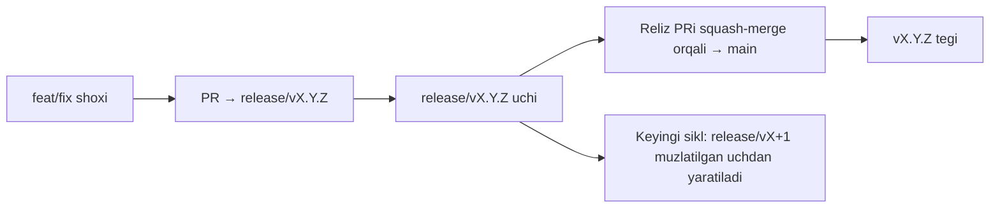

# Branching & Release Model (Oʻzbekcha)

🌐 **Languages:** 🇺🇸 [English](../../../../ops/BRANCHING_MODEL.md) · 🇪🇹 [am](../../../am/docs/ops/BRANCHING_MODEL.md) · 🇸🇦 [ar](../../../ar/docs/ops/BRANCHING_MODEL.md) · 🇦🇿 [az](../../../az/docs/ops/BRANCHING_MODEL.md) · 🇧🇬 [bg](../../../bg/docs/ops/BRANCHING_MODEL.md) · 🇧🇩 [bn](../../../bn/docs/ops/BRANCHING_MODEL.md) · 🇧🇦 [bs](../../../bs/docs/ops/BRANCHING_MODEL.md) · 🇨🇿 [cs](../../../cs/docs/ops/BRANCHING_MODEL.md) · 🇩🇰 [da](../../../da/docs/ops/BRANCHING_MODEL.md) · 🇩🇪 [de](../../../de/docs/ops/BRANCHING_MODEL.md) · 🇬🇷 [el](../../../el/docs/ops/BRANCHING_MODEL.md) · 🇪🇸 [es](../../../es/docs/ops/BRANCHING_MODEL.md) · 🇪🇪 [et](../../../et/docs/ops/BRANCHING_MODEL.md) · 🇮🇷 [fa](../../../fa/docs/ops/BRANCHING_MODEL.md) · 🇫🇮 [fi](../../../fi/docs/ops/BRANCHING_MODEL.md) · 🇫🇷 [fr](../../../fr/docs/ops/BRANCHING_MODEL.md) · 🇮🇪 [ga](../../../ga/docs/ops/BRANCHING_MODEL.md) · 🇮🇳 [gu](../../../gu/docs/ops/BRANCHING_MODEL.md) · 🇳🇬 [ha](../../../ha/docs/ops/BRANCHING_MODEL.md) · 🇮🇱 [he](../../../he/docs/ops/BRANCHING_MODEL.md) · 🇮🇳 [hi](../../../hi/docs/ops/BRANCHING_MODEL.md) · 🇭🇷 [hr](../../../hr/docs/ops/BRANCHING_MODEL.md) · 🇭🇺 [hu](../../../hu/docs/ops/BRANCHING_MODEL.md) · 🇦🇲 [hy](../../../hy/docs/ops/BRANCHING_MODEL.md) · 🇮🇩 [id](../../../id/docs/ops/BRANCHING_MODEL.md) · 🇳🇬 [ig](../../../ig/docs/ops/BRANCHING_MODEL.md) · 🇮🇹 [it](../../../it/docs/ops/BRANCHING_MODEL.md) · 🇯🇵 [ja](../../../ja/docs/ops/BRANCHING_MODEL.md) · 🇬🇪 [ka](../../../ka/docs/ops/BRANCHING_MODEL.md) · 🇰🇭 [km](../../../km/docs/ops/BRANCHING_MODEL.md) · 🇮🇳 [kn](../../../kn/docs/ops/BRANCHING_MODEL.md) · 🇰🇷 [ko](../../../ko/docs/ops/BRANCHING_MODEL.md) · 🇱🇹 [lt](../../../lt/docs/ops/BRANCHING_MODEL.md) · 🇱🇻 [lv](../../../lv/docs/ops/BRANCHING_MODEL.md) · 🇮🇳 [ml](../../../ml/docs/ops/BRANCHING_MODEL.md) · 🇮🇳 [mr](../../../mr/docs/ops/BRANCHING_MODEL.md) · 🇲🇾 [ms](../../../ms/docs/ops/BRANCHING_MODEL.md) · 🇲🇹 [mt](../../../mt/docs/ops/BRANCHING_MODEL.md) · 🇲🇲 [my](../../../my/docs/ops/BRANCHING_MODEL.md) · 🇳🇵 [ne](../../../ne/docs/ops/BRANCHING_MODEL.md) · 🇳🇱 [nl](../../../nl/docs/ops/BRANCHING_MODEL.md) · 🇳🇴 [no](../../../no/docs/ops/BRANCHING_MODEL.md) · 🇮🇳 [or](../../../or/docs/ops/BRANCHING_MODEL.md) · 🇮🇳 [pa](../../../pa/docs/ops/BRANCHING_MODEL.md) · 🇵🇭 [phi](../../../phi/docs/ops/BRANCHING_MODEL.md) · 🇵🇱 [pl](../../../pl/docs/ops/BRANCHING_MODEL.md) · 🇵🇹 [pt](../../../pt/docs/ops/BRANCHING_MODEL.md) · 🇧🇷 [pt-BR](../../../pt-BR/docs/ops/BRANCHING_MODEL.md) · 🇷🇴 [ro](../../../ro/docs/ops/BRANCHING_MODEL.md) · 🇷🇺 [ru](../../../ru/docs/ops/BRANCHING_MODEL.md) · 🇱🇰 [si](../../../si/docs/ops/BRANCHING_MODEL.md) · 🇸🇰 [sk](../../../sk/docs/ops/BRANCHING_MODEL.md) · 🇸🇮 [sl](../../../sl/docs/ops/BRANCHING_MODEL.md) · 🇷🇸 [sr](../../../sr/docs/ops/BRANCHING_MODEL.md) · 🇸🇪 [sv](../../../sv/docs/ops/BRANCHING_MODEL.md) · 🇰🇪 [sw](../../../sw/docs/ops/BRANCHING_MODEL.md) · 🇮🇳 [ta](../../../ta/docs/ops/BRANCHING_MODEL.md) · 🇮🇳 [te](../../../te/docs/ops/BRANCHING_MODEL.md) · 🇹🇭 [th](../../../th/docs/ops/BRANCHING_MODEL.md) · 🇹🇷 [tr](../../../tr/docs/ops/BRANCHING_MODEL.md) · 🇺🇦 [uk-UA](../../../uk-UA/docs/ops/BRANCHING_MODEL.md) · 🇵🇰 [ur](../../../ur/docs/ops/BRANCHING_MODEL.md) · 🇻🇳 [vi](../../../vi/docs/ops/BRANCHING_MODEL.md) · 🇳🇬 [yo](../../../yo/docs/ops/BRANCHING_MODEL.md) · 🇨🇳 [zh-CN](../../../zh-CN/docs/ops/BRANCHING_MODEL.md) · 🇹🇼 [zh-TW](../../../zh-TW/docs/ops/BRANCHING_MODEL.md)

---

OmniRoute **parallel sikl** reliz modelidan foydalanadi: faol sikl uchun alohida `release/vX.Y.Z`
shoxi, eʼlon qilingan yoʻnalish uchun `main` va sikl chiqarilganda oʻzgarmas
`vX.Y.Z` tegi. Kommitlarning `release/*`ga _ham_, `main`ga ham tushishi kutilgan holat — bu chalkashlik emas.

Maintaynerlar uchun batafsil maʼlumot `CLAUDE.md` (21-qattiq qoida) va
[RELEASE_CHECKLIST.md](./RELEASE_CHECKLIST.md) fayllarida keltirilgan. Ushbu sahifa ommaviy,
hissa qoʻshuvchilarga moʻljallangan qisqacha bayondir.

## Qisqacha

| Ref              | Vazifasi                                                                                                      |
| ---------------- | ------------------------------------------------------------------------------------------------------------- |
| `release/vX.Y.Z` | **Faol sikl** — ushbu versiya uchun kundalik ishlab chiqish va PRlarni birlashtirish                          |
| `main`           | **Eʼlon qilingan yoʻnalish** — reliz chiqarilganda siklni squash-merge orqali qabul qiladi                    |
| `vX.Y.Z` (teg)   | **Chiqarish belgisi** — reliz vaqtida yaratiladigan, “nima chiqarilganini” koʻrsatuvchi oʻzgarmas koʻrsatkich |



## PRim qaysi shoxga yoʻnaltirilishi kerak?

**Faol `release/vX.Y.Z` shoxini tanlang — `main`ni emas.**

1. Eng yuqori ochiq `release/v*` shoxini toping (yozish vaqtida misol:
   `release/v3.8.49`).
2. Shu uchdan shox yarating (`git fetch` + unga checkout / rebase qiling).
3. PRni **base = shu `release/vX.Y.Z`** bilan oching.

`main` kundalik integratsiya shoxi emas. `main`ga qarshi ochilgan PRlar
odatda birlashtirishdan oldin boshqa shoxga qayta yoʻnaltirilishi kerak.

## Relizni muzlatish (parallel sikllar)

Reliz muvofiqlashtirilayotganida `release-freeze` yorligʻiga ega belgilovchi issue
ochiladi. Bu **ishlab chiqishni toʻxtatmaydi**:

- Muzlatilgan `release/vX.Y.Z` shu reliz uchun reliz kapitaniga tegishli.
- Hissa qoʻshuvchilar ishlarini qoʻshishda davom etishlari uchun keyingi siklning `release/vX+1` shoxi muzlatilgan uchdan yaratiladi.
- Hali ham muzlatilgan shoxga yoʻnaltirilgan ochiq PRlar faol (eng yuqori)
  `release/v*` shoxiga **qayta yoʻnaltirilishi** kerak.

Kerakli shoxni birlashtirish mumkin deb hisoblashdan oldin ochiq muzlatish holati mavjudligini tekshiring:

```bash
gh issue list --repo diegosouzapw/OmniRoute --label release-freeze --state open
```

Birlashtirish mexanizmlari (egasining `queue` yorligʻi → Mergify)
[MERGE_TRAIN.md](./MERGE_TRAIN.md) faylida hujjatlashtirilgan.

## Nega ham shox, ham teg kerak?

| Artefakt         | Amal qilish muddati | Maqsadi                                                                                             |
| ---------------- | ------------------- | --------------------------------------------------------------------------------------------------- |
| `release/vX.Y.Z` | Jarayondagi sikl    | Tekshirilgan PRlarni jamlaydi, CI holatini yashil saqlaydi va PRlar uchun asos boʻlib xizmat qiladi |
| `vX.Y.Z` tegi    | Doimiy              | npm / GitHub Releasesʼga chiqarilgan aniq bitlarni belgilaydi                                       |

Shox — ustaxona, teg esa muhrlangan paketdir. `main`ga squash-merge qilingach,
keyingi sikl oldingi reliz PRi tugashini kutmasdan `release/vX+1`da davom etadi.

## Tegishli hujjatlar

- [CONTRIBUTING.md](../../CONTRIBUTING.md) — sozlash, testlar, PR nazorat roʻyxati
- [RELEASE_CHECKLIST.md](./RELEASE_CHECKLIST.md) — chiqarishdan oldingi tekshiruv
- [MERGE_TRAIN.md](./MERGE_TRAIN.md) — birlashtirish navbati va zaxira birlashtirish zanjiri
- [RELEASE_GREEN.md](./RELEASE_GREEN.md) — reliz uchini yashil holatda saqlash
