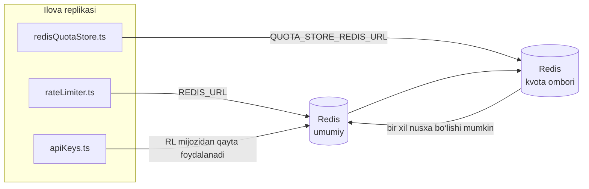

# Redis Production Configuration Guide (Oʻzbekcha)

🌐 **Languages:** 🇺🇸 [English](../../../../ops/REDIS_PRODUCTION_CONFIG.md) · 🇪🇹 [am](../../../am/docs/ops/REDIS_PRODUCTION_CONFIG.md) · 🇸🇦 [ar](../../../ar/docs/ops/REDIS_PRODUCTION_CONFIG.md) · 🇦🇿 [az](../../../az/docs/ops/REDIS_PRODUCTION_CONFIG.md) · 🇧🇬 [bg](../../../bg/docs/ops/REDIS_PRODUCTION_CONFIG.md) · 🇧🇩 [bn](../../../bn/docs/ops/REDIS_PRODUCTION_CONFIG.md) · 🇧🇦 [bs](../../../bs/docs/ops/REDIS_PRODUCTION_CONFIG.md) · 🇨🇿 [cs](../../../cs/docs/ops/REDIS_PRODUCTION_CONFIG.md) · 🇩🇰 [da](../../../da/docs/ops/REDIS_PRODUCTION_CONFIG.md) · 🇩🇪 [de](../../../de/docs/ops/REDIS_PRODUCTION_CONFIG.md) · 🇬🇷 [el](../../../el/docs/ops/REDIS_PRODUCTION_CONFIG.md) · 🇪🇸 [es](../../../es/docs/ops/REDIS_PRODUCTION_CONFIG.md) · 🇪🇪 [et](../../../et/docs/ops/REDIS_PRODUCTION_CONFIG.md) · 🇮🇷 [fa](../../../fa/docs/ops/REDIS_PRODUCTION_CONFIG.md) · 🇫🇮 [fi](../../../fi/docs/ops/REDIS_PRODUCTION_CONFIG.md) · 🇫🇷 [fr](../../../fr/docs/ops/REDIS_PRODUCTION_CONFIG.md) · 🇮🇪 [ga](../../../ga/docs/ops/REDIS_PRODUCTION_CONFIG.md) · 🇮🇳 [gu](../../../gu/docs/ops/REDIS_PRODUCTION_CONFIG.md) · 🇳🇬 [ha](../../../ha/docs/ops/REDIS_PRODUCTION_CONFIG.md) · 🇮🇱 [he](../../../he/docs/ops/REDIS_PRODUCTION_CONFIG.md) · 🇮🇳 [hi](../../../hi/docs/ops/REDIS_PRODUCTION_CONFIG.md) · 🇭🇷 [hr](../../../hr/docs/ops/REDIS_PRODUCTION_CONFIG.md) · 🇭🇺 [hu](../../../hu/docs/ops/REDIS_PRODUCTION_CONFIG.md) · 🇦🇲 [hy](../../../hy/docs/ops/REDIS_PRODUCTION_CONFIG.md) · 🇮🇩 [id](../../../id/docs/ops/REDIS_PRODUCTION_CONFIG.md) · 🇳🇬 [ig](../../../ig/docs/ops/REDIS_PRODUCTION_CONFIG.md) · 🇮🇹 [it](../../../it/docs/ops/REDIS_PRODUCTION_CONFIG.md) · 🇯🇵 [ja](../../../ja/docs/ops/REDIS_PRODUCTION_CONFIG.md) · 🇬🇪 [ka](../../../ka/docs/ops/REDIS_PRODUCTION_CONFIG.md) · 🇰🇭 [km](../../../km/docs/ops/REDIS_PRODUCTION_CONFIG.md) · 🇮🇳 [kn](../../../kn/docs/ops/REDIS_PRODUCTION_CONFIG.md) · 🇰🇷 [ko](../../../ko/docs/ops/REDIS_PRODUCTION_CONFIG.md) · 🇱🇹 [lt](../../../lt/docs/ops/REDIS_PRODUCTION_CONFIG.md) · 🇱🇻 [lv](../../../lv/docs/ops/REDIS_PRODUCTION_CONFIG.md) · 🇮🇳 [ml](../../../ml/docs/ops/REDIS_PRODUCTION_CONFIG.md) · 🇮🇳 [mr](../../../mr/docs/ops/REDIS_PRODUCTION_CONFIG.md) · 🇲🇾 [ms](../../../ms/docs/ops/REDIS_PRODUCTION_CONFIG.md) · 🇲🇹 [mt](../../../mt/docs/ops/REDIS_PRODUCTION_CONFIG.md) · 🇲🇲 [my](../../../my/docs/ops/REDIS_PRODUCTION_CONFIG.md) · 🇳🇵 [ne](../../../ne/docs/ops/REDIS_PRODUCTION_CONFIG.md) · 🇳🇱 [nl](../../../nl/docs/ops/REDIS_PRODUCTION_CONFIG.md) · 🇳🇴 [no](../../../no/docs/ops/REDIS_PRODUCTION_CONFIG.md) · 🇮🇳 [or](../../../or/docs/ops/REDIS_PRODUCTION_CONFIG.md) · 🇮🇳 [pa](../../../pa/docs/ops/REDIS_PRODUCTION_CONFIG.md) · 🇵🇭 [phi](../../../phi/docs/ops/REDIS_PRODUCTION_CONFIG.md) · 🇵🇱 [pl](../../../pl/docs/ops/REDIS_PRODUCTION_CONFIG.md) · 🇵🇹 [pt](../../../pt/docs/ops/REDIS_PRODUCTION_CONFIG.md) · 🇧🇷 [pt-BR](../../../pt-BR/docs/ops/REDIS_PRODUCTION_CONFIG.md) · 🇷🇴 [ro](../../../ro/docs/ops/REDIS_PRODUCTION_CONFIG.md) · 🇷🇺 [ru](../../../ru/docs/ops/REDIS_PRODUCTION_CONFIG.md) · 🇱🇰 [si](../../../si/docs/ops/REDIS_PRODUCTION_CONFIG.md) · 🇸🇰 [sk](../../../sk/docs/ops/REDIS_PRODUCTION_CONFIG.md) · 🇸🇮 [sl](../../../sl/docs/ops/REDIS_PRODUCTION_CONFIG.md) · 🇷🇸 [sr](../../../sr/docs/ops/REDIS_PRODUCTION_CONFIG.md) · 🇸🇪 [sv](../../../sv/docs/ops/REDIS_PRODUCTION_CONFIG.md) · 🇰🇪 [sw](../../../sw/docs/ops/REDIS_PRODUCTION_CONFIG.md) · 🇮🇳 [ta](../../../ta/docs/ops/REDIS_PRODUCTION_CONFIG.md) · 🇮🇳 [te](../../../te/docs/ops/REDIS_PRODUCTION_CONFIG.md) · 🇹🇭 [th](../../../th/docs/ops/REDIS_PRODUCTION_CONFIG.md) · 🇹🇷 [tr](../../../tr/docs/ops/REDIS_PRODUCTION_CONFIG.md) · 🇺🇦 [uk-UA](../../../uk-UA/docs/ops/REDIS_PRODUCTION_CONFIG.md) · 🇵🇰 [ur](../../../ur/docs/ops/REDIS_PRODUCTION_CONFIG.md) · 🇻🇳 [vi](../../../vi/docs/ops/REDIS_PRODUCTION_CONFIG.md) · 🇳🇬 [yo](../../../yo/docs/ops/REDIS_PRODUCTION_CONFIG.md) · 🇨🇳 [zh-CN](../../../zh-CN/docs/ops/REDIS_PRODUCTION_CONFIG.md) · 🇹🇼 [zh-TW](../../../zh-TW/docs/ops/REDIS_PRODUCTION_CONFIG.md)

---

## Umumiy koʻrinish

Redis OmniRoute’da **ixtiyoriy, qatʼiy boʻlmagan bogʻliqlik** hisoblanadi — Redis mavjud boʻlmaganda ilova imkoniyatlarini muammosiz kamaytiradi (xotiradagi
zaxira mexanizmlaridan foydalanadi). Ishlab chiqarish muhitida Redis’ni sozlash toʻrtta alohida
ish yuklamasi uchun kechikishni kamaytiradi:

| Ish yuklamasi                               | Drayver                       | Klient fabrikasi                                                        | Kalit namunasi                                               |
| ------------------------------------------- | ----------------------------- | ----------------------------------------------------------------------- | ------------------------------------------------------------ |
| Soʻrovlar tezligini cheklash                | `rateLimiter.ts`              | `getRedisClient()` — kechiktirib yaratiladigan yagona `ioredis` nusxasi | `<prefix>rl:*` Lua yordamida atomar tezlik cheklovi oynalari |
| Autentifikatsiya keshi                      | `apiKeys.ts`                  | `rateLimiter` klientidan qayta foydalanadi                              | TTL bilan `<prefix>auth:api_key:<sha256>`                    |
| Kvota ombori                                | `redisQuotaStore.ts`          | Alohida `getRedisClient(url)` yagona nusxasi                            | Har bir nusxa uchun sozlanadigan `<prefix>quota:*`           |
| Dastlabki ishga tushirish avtomatik uzgichi | `redisCircuitBreakerStore.ts` | `circuitBreakerFactory.ts` ichidagi alohida klient                      | `<prefix>warmup:cb:<connectionId>`                           |

Barcha toʻrtta ish yuklamasi bitta nomlar makoni prefiksidan foydalanadi, shu sababli OmniRoute bitta
Redis nusxasida (masalan, `127.0.0.1:6379`) boshqa ilovalar bilan birga ishlashi mumkin. [Kalitlarning nomlar makoni](#key-namespacing) boʻlimiga qarang.

---

## Joriy konfiguratsiya (koddagi standart qiymatlar)

| Sozlama                                     | Qiymat                                                        | Joylashuvi                                                                            |
| ------------------------------------------- | ------------------------------------------------------------- | ------------------------------------------------------------------------------------- |
| `REDIS_URL` muhit oʻzgaruvchisi             | `redis://redis:6379` (compose), ixtiyoriy                     | `rateLimiter.ts:5`, `.env.example`                                                    |
| `REDIS_KEY_PREFIX` muhit oʻzgaruvchisi      | `omniroute:` (standart)                                       | `rateLimiter.ts`, `redisQuotaStore.ts`, `redisCircuitBreakerStore.ts`, `.env.example` |
| `QUOTA_STORE_REDIS_URL` muhit oʻzgaruvchisi | alohida, `REDIS_URL` dan farq qilishi mumkin                  | `quota/storeFactory.ts`                                                               |
| `QUOTA_STORE_DRIVER`                        | `"sqlite"` (standart), `"redis"` ixtiyoriy                    | `quota/storeFactory.ts`                                                               |
| ioredis `maxRetriesPerRequest`              | `3`                                                           | `rateLimiter.ts` klientini yaratish                                                   |
| `enableReadyCheck`                          | oʻrnatilmagan (ioredis standarti: `true`)                     | —                                                                                     |
| `lazyConnect`                               | oʻrnatilmagan (ioredis standarti: `false`)                    | —                                                                                     |
| `retryStrategy`                             | oʻrnatilmagan (ioredis standarti: 200ms asosiy, eksponensial) | —                                                                                     |
| TLS / parol / DB indeksi                    | **sozlanmagan**                                               | —                                                                                     |
| Sentinel / Cluster                          | **sozlanmagan** — faqat mustaqil bitta tugun                  | —                                                                                     |

---

## Kalitlarning nomlar makoni

OmniRoute Redis nusxasini xostda ishlaydigan boshqa xizmatlar bilan ulashadi. Nomlar makonisiz
`auth:api_key:<sha256>` yoki `rl:*` kabi kalitlar ayni Redis’dan foydalanadigan boshqa ilovalar
kalitlari bilan toʻqnashishi mumkin (bu nusxa Redis’ni boshqa xizmatlar bilan birga `127.0.0.1:6379` manzilida ishga tushiradi).

**Har bir** OmniRoute kalitiga prefiks qoʻshish uchun `REDIS_KEY_PREFIX` ni boʻsh boʻlmagan satrga oʻrnating:

```bash
# .env — barcha OmniRoute kalitlari omniroute:rl:*, omniroute:auth:*, omniroute:quota:*, omniroute:warmup:cb:* koʻrinishiga keladi
REDIS_KEY_PREFIX=omniroute:
```

- **Standart qiymat:** `omniroute:` (`REDIS_KEY_PREFIX` oʻrnatilmagan yoki boʻsh boʻlsa qoʻllanadi).
- **Quyidagilarga qoʻllanadi:** tezlik cheklagichi + autentifikatsiya keshi (`keyPrefix` orqali umumiy `ioredis` klienti), shuningdek
  kvota ombori (`KEY_PREFIX = "${REDIS_KEY_PREFIX}quota"`) va dastlabki ishga tushirish avtomatik uzgichi
  (`KEY_PREFIX = "${REDIS_KEY_PREFIX}warmup:cb:"`).
- Redis’da kalitlar mavjud boʻlgan paytda **prefiksni oʻzgartirish** eski kalitlarni ajralib qolgan holatga keltiradi (ularning muddati
  TTL / LRU orqali tugaydi). Oʻzgartirish xavfsiz; migratsiya talab qilinmaydi. Bitta istisno — taqiqlangan deb belgilangan ulanish uchun dastlabki ishga tushirish
  avtomatik uzgichi kaliti: u TTL’siz saqlanadi, shuning uchun qolib ketgan kalitlarni `redis-cli --scan --pattern '<old-prefix>warmup:cb:*'` yordamida
  roʻyxatlang va oʻchirib tashlang.
- **ioredis `keyPrefix`** yozish paytida prefiksni avtomatik ravishda qoʻshadi **va** oʻqish paytida uni olib tashlaydi,
  shu sababli ilova kodi prefiksni hech qachon koʻrmaydi.

---

## Tavsiya etilgan ishlab chiqarish muhiti sozlamalari

### 1. Ulanish puli / mijoz parametrlari (ioredis `Redis` konstruktori)

Joriy kod hech qanday maxsus parametrlarsiz bitta `new Redis(url)` yaratadi. Bir nechta replika ishlatiladigan ishlab chiqarish muhiti uchun kodga mijoz fabrikasini uzating yoki `getRedisClient()` funksiyasini o‘rab qo‘ying:

```typescript
const redis = new Redis(REDIS_URL, {
  maxRetriesPerRequest: null, // qayta urinishlar chegarasi yo‘q; retryStrategy hal qilsin
  enableReadyCheck: true, // chaqiruvlarni qabul qilishdan oldin server tayyorligini tekshirish
  lazyConnect: true, // yaratish vaqtida ulanmaslik; birinchi chaqiruvni kutish
  retryStrategy: (times) => {
    if (times > 10) return null; // 10 ta urinishdan keyin voz kechish → keyinroq qayta ulanish
    return Math.min(times * 200, 5000); // 200ms, 400ms, …, eng ko‘pi 5s
  },
  enableAutoPipelining: true, // parallel buyruqlarni bitta TCP yozuviga birlashtirish
  keepAlive: 10000, // har 10s da TCP ulanishini faol saqlash
});
```

**Asosiy muvozanatlar:**

- `maxRetriesPerRequest: null` + `retryStrategy` — ishlab chiqarish muhiti uchun afzal, chunki Redis’ning vaqtinchalik qayta ishga tushishi har bir so‘rovning darhol xato bilan tugashiga olib kelmaydi. `checkRateLimit()` ichidagi xotiraga asoslangan zaxira mexanizmi xatolik yo‘lini qoplaydi.
- `lazyConnect: true` — server ulanishlarni qabul qilishni boshlashidan oldin Redis ishlab turishiga bog‘liq bo‘lib qolishning oldini oladi.
- `enableAutoPipelining: true` — parallel tezlik cheklovi tekshiruvlari uchun tarmoq qatnovlarini kamaytiradi; bitta ulanishda >50 RPS bo‘lganda foydali.

### 2. Redis serveri konfiguratsiyasi (`redis.conf`)

```
# Xotira
maxmemory 80%                        # OT sahifalar keshi uchun joy qoldirish
maxmemory-policy allkeys-lru         # bosim ostida eskirgan autentifikatsiya keshi yozuvlarini chiqarib tashlash

# Saqlab qolish (ixtiyoriy — OmniRoute busiz ham nosozliklarga bardoshli)
save 300 1                           # agar ≥1 ta kalit o‘zgargan bo‘lsa, kamida har 5 daqiqada oniy nusxa olish
appendonly no                        # AOF kerak emas; ma’lumotlarni qayta yaratish mumkin
appendfsync no                       # fsync ortiqcha xarajati yo‘q (RDB yetarli)

# Tarmoq
timeout 0                            # faol bo‘lmagan ulanishni uzmaslik
tcp-keepalive 300                    # 5 daqiqalik faol saqlash
tcp-backlog 511                      # keskin yuklama uchun ulanishlar navbati

# Unumdorlik
hz 10                                # standart qiymat; kechikishga sezgir holatlar uchun 100
activedefrag yes                     # fragmentatsiya >10% bo‘lganda avtomatik defragmentatsiya
```

**`maxmemory-policy allkeys-lru` uchun muvozanat:** Xotira bosimi ostida autentifikatsiya keshi yozuvlari chiqarib tashlanishi mumkin. Bu xavfsiz — `setCachedApiKey` keshda topilmaganda uni doimo qayta to‘ldiradi va SQLite zaxira manbasi asosiy haqiqat manbai hisoblanadi. Tezlik cheklovchi Lua skripti tuzilishiga ko‘ra qisqa muddatli kichik kalitlarni yaratadi.

### 3. Docker Compose sozlamalari

Ishlab chiqarish muhiti compose fayli (`docker-compose.prod.yml`) `redis:8.6.2-alpine` dan foydalanadi. Quyidagilarni qo‘shing:

```yaml
redis:
  image: redis:8.6.2-alpine
  command:
    [
      "redis-server",
      "--maxmemory",
      "512mb",
      "--maxmemory-policy",
      "allkeys-lru",
      "--activedefrag",
      "yes",
      "--save",
      "300 1",
    ]
  healthcheck:
    test: ["CMD", "redis-cli", "ping"]
    interval: 10s
    timeout: 3s
    retries: 3
    start_period: 5s
```

### 4. Bir nechta nusxa / masshtablash masalalari

**Barcha replikalar uchun bitta Redis** — tezlik cheklovchi Lua skripti yagona asosiy kalitlar makoniga tayanadi. Replikalar ortidagi bir nechta Redis nusxasi atomarlikni yo‘qotadi va byudjetni ikki baravar oshiradi. Barcha ilova replikalari uchun bitta Redis’dan (yoki avariyaviy almashishga ega Redis Sentinel klasteridan) foydalaning.

**Ulanishlar soni:** Har bir ilova replikasi Redis’ga **2 ta TCP ulanishi** ochadi (tezlik cheklovchi mijoz + kvota ombori mijozi). 10 ta replikada → 20 ta ulanish bo‘ladi, bu standart Redis nusxasining 10 mingta ulanish chegarasidan ancha past.

### 5. Monitoring

Holatni tekshirish yakuniy nuqtasi orqali taqdim eting:

```typescript
// src/app/api/monitoring/health/route.ts allaqachon rateLimiter funksiyalarini chaqiradi
// Redis’ga xos tekshiruvlarni qo‘shing:
//   1. ioredis .ping() orqali PING kechikishi
//   2. INFO memory orqali xotiradan foydalanish
//   3. INFO clients orqali ulanishlar soni
//   4. maxmemory-policy uchun muvaffaqiyat darajasi (evicted_keys / keyspace_hits)
```

Kuzatilishi kerak bo‘lgan asosiy ko‘rsatkichlar:

- **Chiqarib tashlangan kalitlar / soniya** — agar doimiy ravishda noldan katta bo‘lsa, `maxmemory` ni oshiring
- **Bloklangan mijozlar** — noldan katta qiymat Lua skriptlari sekinligini yoki yuqori darajadagi raqobatni bildiradi
- **Rad etilgan ulanishlar** — ulanishlar chegarasiga yetilgan; 20 ta ulanishda kamdan-kam uchraydi

---

## Arxitektura diagrammasi



---

## Manbalar

| Fayl                               | Maqsad                                                                          |
| ---------------------------------- | ------------------------------------------------------------------------------- |
| `src/shared/utils/rateLimiter.ts`  | Asosiy Redis mijozi, Lua tezlikni cheklash skripti, xotiradagi zaxira mexanizmi |
| `src/lib/db/apiKeys.ts`            | Autentifikatsiya keshi — Redis→SQLite zaxira mexanizmi                          |
| `src/lib/quota/redisQuotaStore.ts` | Ixtiyoriy kvota ombori uchun alohida Redis mijozi                               |
| `src/lib/quota/storeFactory.ts`    | `sqlite` va `redis` kvota drayverlari o‘rtasida almashadi                       |
| `docker-compose.prod.yml`          | Ishlab chiqarish muhiti Redis konteyneri (`redis:8.6.2-alpine` tasviri)         |
| `.env.example`                     | Redis muhit o‘zgaruvchilari hujjatlari                                          |
| `src/app/api/local/redis/`         | Dasturlash muhiti konteynerini boshqarish uchun API marshrutlari                |
| `bin/cli/commands/redis.mjs`       | Dasturlash muhiti konteynerini boshqarish uchun CLI buyruqlari                  |
