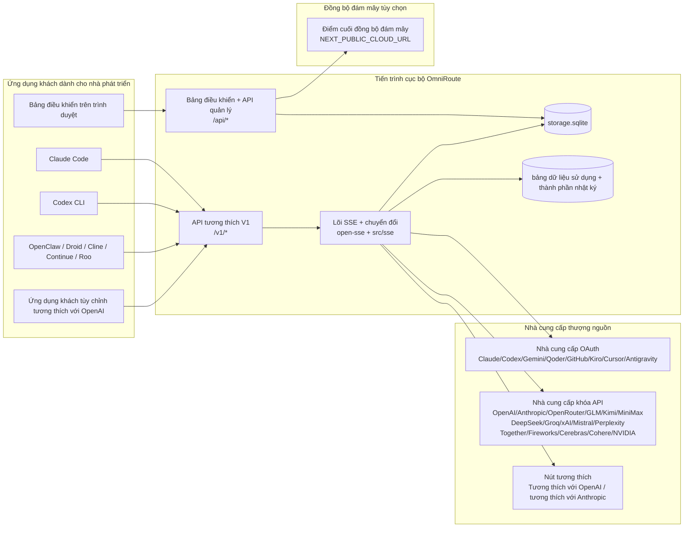
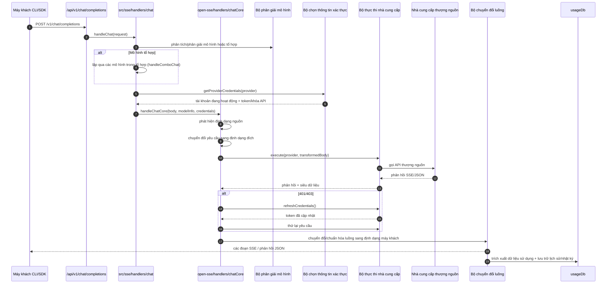
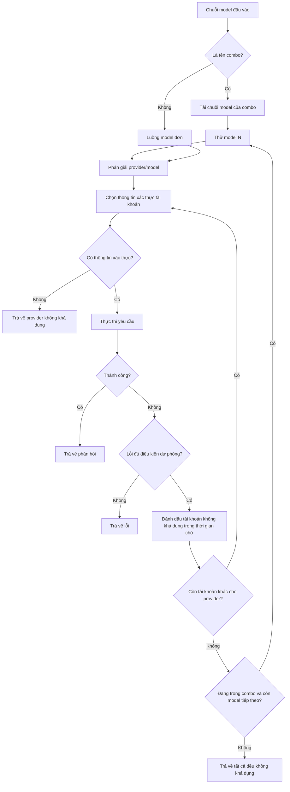
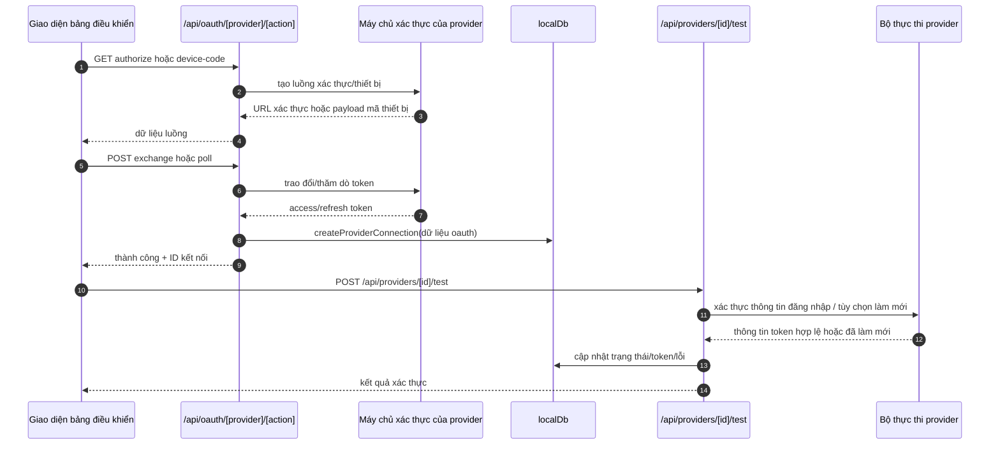
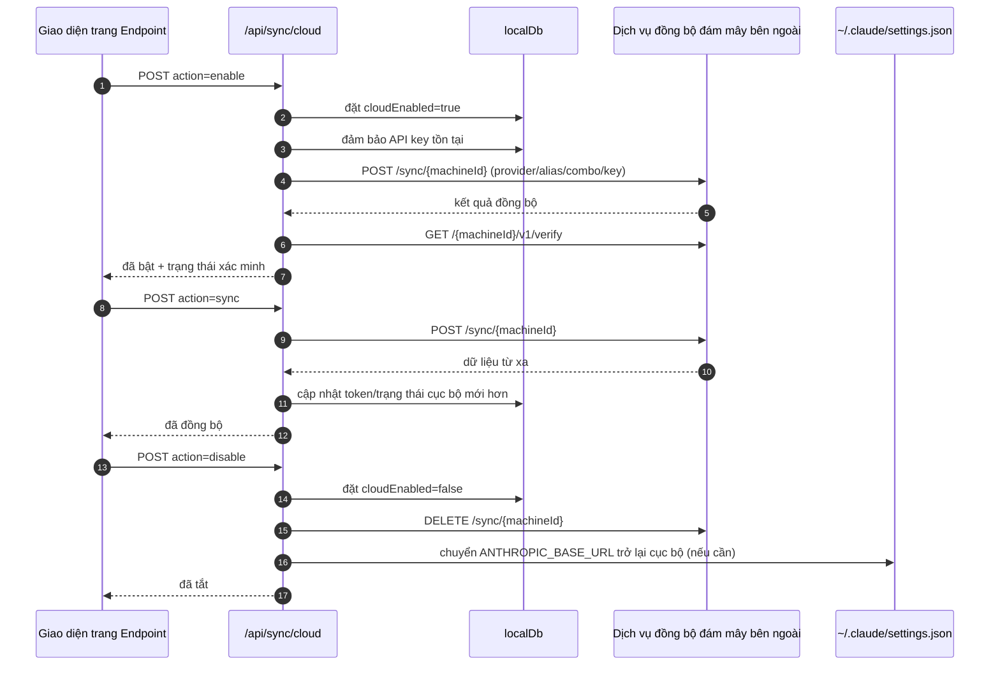
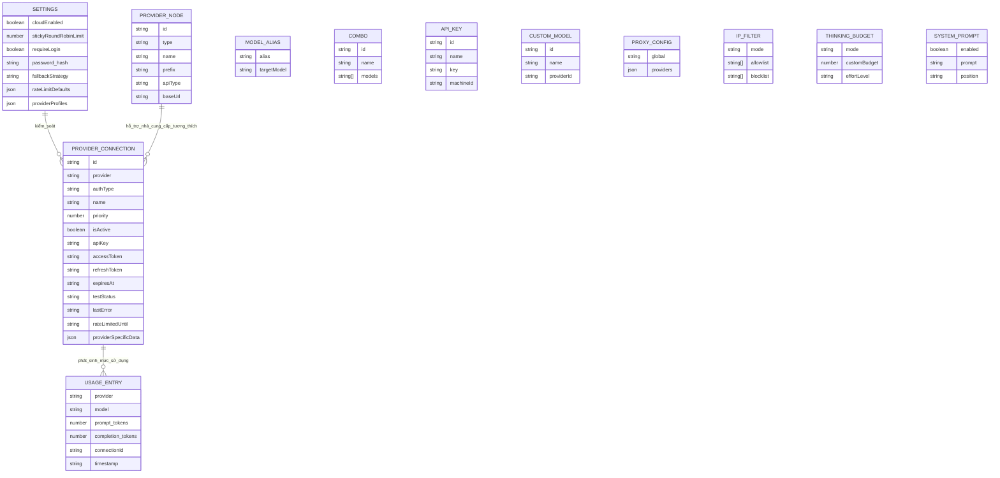
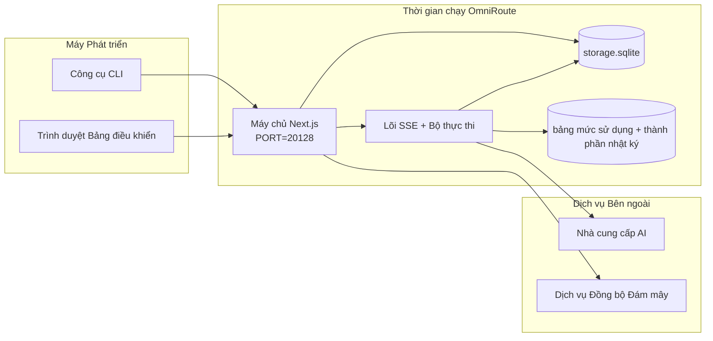

# OmniRoute Architecture (Tiếng Việt)

🌐 **Languages:** 🇺🇸 [English](../../../../architecture/ARCHITECTURE.md) · 🇪🇹 [am](../../../am/docs/architecture/ARCHITECTURE.md) · 🇸🇦 [ar](../../../ar/docs/architecture/ARCHITECTURE.md) · 🇦🇿 [az](../../../az/docs/architecture/ARCHITECTURE.md) · 🇧🇬 [bg](../../../bg/docs/architecture/ARCHITECTURE.md) · 🇧🇩 [bn](../../../bn/docs/architecture/ARCHITECTURE.md) · 🇨🇿 [cs](../../../cs/docs/architecture/ARCHITECTURE.md) · 🇩🇰 [da](../../../da/docs/architecture/ARCHITECTURE.md) · 🇩🇪 [de](../../../de/docs/architecture/ARCHITECTURE.md) · 🇬🇷 [el](../../../el/docs/architecture/ARCHITECTURE.md) · 🇪🇸 [es](../../../es/docs/architecture/ARCHITECTURE.md) · 🇪🇪 [et](../../../et/docs/architecture/ARCHITECTURE.md) · 🇮🇷 [fa](../../../fa/docs/architecture/ARCHITECTURE.md) · 🇫🇮 [fi](../../../fi/docs/architecture/ARCHITECTURE.md) · 🇫🇷 [fr](../../../fr/docs/architecture/ARCHITECTURE.md) · 🇮🇪 [ga](../../../ga/docs/architecture/ARCHITECTURE.md) · 🇮🇳 [gu](../../../gu/docs/architecture/ARCHITECTURE.md) · 🇳🇬 [ha](../../../ha/docs/architecture/ARCHITECTURE.md) · 🇮🇱 [he](../../../he/docs/architecture/ARCHITECTURE.md) · 🇮🇳 [hi](../../../hi/docs/architecture/ARCHITECTURE.md) · 🇭🇷 [hr](../../../hr/docs/architecture/ARCHITECTURE.md) · 🇭🇺 [hu](../../../hu/docs/architecture/ARCHITECTURE.md) · 🇦🇲 [hy](../../../hy/docs/architecture/ARCHITECTURE.md) · 🇮🇩 [id](../../../id/docs/architecture/ARCHITECTURE.md) · 🇳🇬 [ig](../../../ig/docs/architecture/ARCHITECTURE.md) · 🇮🇹 [it](../../../it/docs/architecture/ARCHITECTURE.md) · 🇯🇵 [ja](../../../ja/docs/architecture/ARCHITECTURE.md) · 🇬🇪 [ka](../../../ka/docs/architecture/ARCHITECTURE.md) · 🇰🇭 [km](../../../km/docs/architecture/ARCHITECTURE.md) · 🇮🇳 [kn](../../../kn/docs/architecture/ARCHITECTURE.md) · 🇰🇷 [ko](../../../ko/docs/architecture/ARCHITECTURE.md) · 🇱🇹 [lt](../../../lt/docs/architecture/ARCHITECTURE.md) · 🇱🇻 [lv](../../../lv/docs/architecture/ARCHITECTURE.md) · 🇮🇳 [ml](../../../ml/docs/architecture/ARCHITECTURE.md) · 🇮🇳 [mr](../../../mr/docs/architecture/ARCHITECTURE.md) · 🇲🇾 [ms](../../../ms/docs/architecture/ARCHITECTURE.md) · 🇲🇹 [mt](../../../mt/docs/architecture/ARCHITECTURE.md) · 🇲🇲 [my](../../../my/docs/architecture/ARCHITECTURE.md) · 🇳🇵 [ne](../../../ne/docs/architecture/ARCHITECTURE.md) · 🇳🇱 [nl](../../../nl/docs/architecture/ARCHITECTURE.md) · 🇳🇴 [no](../../../no/docs/architecture/ARCHITECTURE.md) · 🇮🇳 [or](../../../or/docs/architecture/ARCHITECTURE.md) · 🇮🇳 [pa](../../../pa/docs/architecture/ARCHITECTURE.md) · 🇵🇭 [phi](../../../phi/docs/architecture/ARCHITECTURE.md) · 🇵🇱 [pl](../../../pl/docs/architecture/ARCHITECTURE.md) · 🇵🇹 [pt](../../../pt/docs/architecture/ARCHITECTURE.md) · 🇧🇷 [pt-BR](../../../pt-BR/docs/architecture/ARCHITECTURE.md) · 🇷🇴 [ro](../../../ro/docs/architecture/ARCHITECTURE.md) · 🇷🇺 [ru](../../../ru/docs/architecture/ARCHITECTURE.md) · 🇱🇰 [si](../../../si/docs/architecture/ARCHITECTURE.md) · 🇸🇰 [sk](../../../sk/docs/architecture/ARCHITECTURE.md) · 🇸🇮 [sl](../../../sl/docs/architecture/ARCHITECTURE.md) · 🇷🇸 [sr](../../../sr/docs/architecture/ARCHITECTURE.md) · 🇸🇪 [sv](../../../sv/docs/architecture/ARCHITECTURE.md) · 🇰🇪 [sw](../../../sw/docs/architecture/ARCHITECTURE.md) · 🇮🇳 [ta](../../../ta/docs/architecture/ARCHITECTURE.md) · 🇮🇳 [te](../../../te/docs/architecture/ARCHITECTURE.md) · 🇹🇭 [th](../../../th/docs/architecture/ARCHITECTURE.md) · 🇹🇷 [tr](../../../tr/docs/architecture/ARCHITECTURE.md) · 🇺🇦 [uk-UA](../../../uk-UA/docs/architecture/ARCHITECTURE.md) · 🇵🇰 [ur](../../../ur/docs/architecture/ARCHITECTURE.md) · 🇺🇿 [uz](../../../uz/docs/architecture/ARCHITECTURE.md) · 🇳🇬 [yo](../../../yo/docs/architecture/ARCHITECTURE.md) · 🇨🇳 [zh-CN](../../../zh-CN/docs/architecture/ARCHITECTURE.md) · 🇹🇼 [zh-TW](../../../zh-TW/docs/architecture/ARCHITECTURE.md)

---

🌐 **Languages:** 🇺🇸 [English](../../../../architecture/ARCHITECTURE.md) · 🇪🇹 [am](../../../am/docs/architecture/ARCHITECTURE.md) · 🇸🇦 [ar](../../../ar/docs/architecture/ARCHITECTURE.md) · 🇦🇿 [az](../../../az/docs/architecture/ARCHITECTURE.md) · 🇧🇬 [bg](../../../bg/docs/architecture/ARCHITECTURE.md) · 🇧🇩 [bn](../../../bn/docs/architecture/ARCHITECTURE.md) · 🇨🇿 [cs](../../../cs/docs/architecture/ARCHITECTURE.md) · 🇩🇰 [da](../../../da/docs/architecture/ARCHITECTURE.md) · 🇩🇪 [de](../../../de/docs/architecture/ARCHITECTURE.md) · 🇬🇷 [el](../../../el/docs/architecture/ARCHITECTURE.md) · 🇪🇸 [es](../../../es/docs/architecture/ARCHITECTURE.md) · 🇪🇪 [et](../../../et/docs/architecture/ARCHITECTURE.md) · 🇮🇷 [fa](../../../fa/docs/architecture/ARCHITECTURE.md) · 🇫🇮 [fi](../../../fi/docs/architecture/ARCHITECTURE.md) · 🇫🇷 [fr](../../../fr/docs/architecture/ARCHITECTURE.md) · 🇮🇪 [ga](../../../ga/docs/architecture/ARCHITECTURE.md) · 🇮🇳 [gu](../../../gu/docs/architecture/ARCHITECTURE.md) · 🇳🇬 [ha](../../../ha/docs/architecture/ARCHITECTURE.md) · 🇮🇱 [he](../../../he/docs/architecture/ARCHITECTURE.md) · 🇮🇳 [hi](../../../hi/docs/architecture/ARCHITECTURE.md) · 🇭🇷 [hr](../../../hr/docs/architecture/ARCHITECTURE.md) · 🇭🇺 [hu](../../../hu/docs/architecture/ARCHITECTURE.md) · 🇦🇲 [hy](../../../hy/docs/architecture/ARCHITECTURE.md) · 🇮🇩 [id](../../../id/docs/architecture/ARCHITECTURE.md) · 🇳🇬 [ig](../../../ig/docs/architecture/ARCHITECTURE.md) · 🇮🇹 [it](../../../it/docs/architecture/ARCHITECTURE.md) · 🇯🇵 [ja](../../../ja/docs/architecture/ARCHITECTURE.md) · 🇬🇪 [ka](../../../ka/docs/architecture/ARCHITECTURE.md) · 🇰🇭 [km](../../../km/docs/architecture/ARCHITECTURE.md) · 🇮🇳 [kn](../../../kn/docs/architecture/ARCHITECTURE.md) · 🇰🇷 [ko](../../../ko/docs/architecture/ARCHITECTURE.md) · 🇱🇹 [lt](../../../lt/docs/architecture/ARCHITECTURE.md) · 🇱🇻 [lv](../../../lv/docs/architecture/ARCHITECTURE.md) · 🇮🇳 [ml](../../../ml/docs/architecture/ARCHITECTURE.md) · 🇮🇳 [mr](../../../mr/docs/architecture/ARCHITECTURE.md) · 🇲🇾 [ms](../../../ms/docs/architecture/ARCHITECTURE.md) · 🇲🇹 [mt](../../../mt/docs/architecture/ARCHITECTURE.md) · 🇲🇲 [my](../../../my/docs/architecture/ARCHITECTURE.md) · 🇳🇵 [ne](../../../ne/docs/architecture/ARCHITECTURE.md) · 🇳🇱 [nl](../../../nl/docs/architecture/ARCHITECTURE.md) · 🇳🇴 [no](../../../no/docs/architecture/ARCHITECTURE.md) · 🇮🇳 [or](../../../or/docs/architecture/ARCHITECTURE.md) · 🇮🇳 [pa](../../../pa/docs/architecture/ARCHITECTURE.md) · 🇵🇭 [phi](../../../phi/docs/architecture/ARCHITECTURE.md) · 🇵🇱 [pl](../../../pl/docs/architecture/ARCHITECTURE.md) · 🇵🇹 [pt](../../../pt/docs/architecture/ARCHITECTURE.md) · 🇧🇷 [pt-BR](../../../pt-BR/docs/architecture/ARCHITECTURE.md) · 🇷🇴 [ro](../../../ro/docs/architecture/ARCHITECTURE.md) · 🇷🇺 [ru](../../../ru/docs/architecture/ARCHITECTURE.md) · 🇱🇰 [si](../../../si/docs/architecture/ARCHITECTURE.md) · 🇸🇰 [sk](../../../sk/docs/architecture/ARCHITECTURE.md) · 🇸🇮 [sl](../../../sl/docs/architecture/ARCHITECTURE.md) · 🇷🇸 [sr](../../../sr/docs/architecture/ARCHITECTURE.md) · 🇸🇪 [sv](../../../sv/docs/architecture/ARCHITECTURE.md) · 🇰🇪 [sw](../../../sw/docs/architecture/ARCHITECTURE.md) · 🇮🇳 [ta](../../../ta/docs/architecture/ARCHITECTURE.md) · 🇮🇳 [te](../../../te/docs/architecture/ARCHITECTURE.md) · 🇹🇭 [th](../../../th/docs/architecture/ARCHITECTURE.md) · 🇹🇷 [tr](../../../tr/docs/architecture/ARCHITECTURE.md) · 🇺🇦 [uk-UA](../../../uk-UA/docs/architecture/ARCHITECTURE.md) · 🇵🇰 [ur](../../../ur/docs/architecture/ARCHITECTURE.md) · 🇺🇿 [uz](../../../uz/docs/architecture/ARCHITECTURE.md) · 🇳🇬 [yo](../../../yo/docs/architecture/ARCHITECTURE.md) · 🇨🇳 [zh-CN](../../../zh-CN/docs/architecture/ARCHITECTURE.md) · 🇹🇼 [zh-TW](../../../zh-TW/docs/architecture/ARCHITECTURE.md)

_Cập nhật lần cuối: 2026-06-28_

## Tóm tắt Điều hành

OmniRoute là một cổng định tuyến AI cục bộ và bảng điều khiển được xây dựng trên Next.js.
Nó cung cấp một endpoint duy nhất tương thích với OpenAI (`/v1/*`) và định tuyến lưu lượng qua nhiều nhà cung cấp thượng nguồn, hỗ trợ chuyển đổi định dạng, dự phòng, làm mới token và theo dõi mức sử dụng.

Các khả năng cốt lõi:

- Bề mặt API tương thích với OpenAI dành cho CLI/công cụ (355 nhà cung cấp, 108 trình thực thi)
- Chuyển đổi yêu cầu/phản hồi giữa các định dạng của nhà cung cấp
- Dự phòng theo tổ hợp mô hình (chuỗi nhiều mô hình)
- Các bước tổ hợp có cấu trúc (`provider + model + connection`) với thứ tự khi chạy dựa trên `compositeTiers`
- Dự phòng cấp tài khoản (nhiều tài khoản cho mỗi nhà cung cấp)
- Kiểm tra trước hạn ngạch và lựa chọn tài khoản P2C có xét hạn ngạch trong luồng chat chính
- Quản lý kết nối nhà cung cấp bằng OAuth + khóa API (22 mô-đun nhà cung cấp OAuth)
- Tạo embedding qua `/v1/embeddings` (18 nhà cung cấp)
- Tạo hình ảnh qua `/v1/images/generations` (hơn 10 nhà cung cấp, hơn 20 mô hình)
- Chuyển lời nói thành văn bản qua `/v1/audio/transcriptions` (18 nhà cung cấp)
- Chuyển văn bản thành giọng nói qua `/v1/audio/speech` (24 nhà cung cấp tích hợp sẵn)
- Tạo video qua `/v1/videos/generations` (ComfyUI + SD WebUI)
- Tạo nhạc qua `/v1/music/generations` (ComfyUI)
- Tìm kiếm web qua `/v1/search` (20 nhà cung cấp)
- Kiểm duyệt qua `/v1/moderations`
- Xếp hạng lại qua `/v1/rerank`
- Phân tích thẻ suy luận (`<think>...</think>`) cho các mô hình lập luận
- Làm sạch phản hồi để tương thích nghiêm ngặt với OpenAI SDK
- Chuẩn hóa vai trò (developer→system, system→user) để tương thích giữa các nhà cung cấp
- Chuyển đổi đầu ra có cấu trúc (json_schema → Gemini responseSchema)
- Lưu trữ cục bộ cho nhà cung cấp, khóa, bí danh, tổ hợp, cài đặt và giá cả (122 mô-đun DB)
- Theo dõi mức sử dụng/chi phí và ghi nhật ký yêu cầu
- Đồng bộ đám mây tùy chọn để đồng bộ trạng thái trên nhiều thiết bị
- Danh sách cho phép/chặn IP để kiểm soát quyền truy cập API
- Quản lý ngân sách suy luận (truyền nguyên trạng/tự động/tùy chỉnh/thích ứng)
- Chèn prompt hệ thống toàn cục
- Theo dõi phiên và tạo dấu vân tay
- Giới hạn tốc độ nâng cao theo từng tài khoản với hồ sơ riêng cho từng nhà cung cấp
- Mẫu ngắt mạch để tăng khả năng phục hồi của nhà cung cấp
- Bảo vệ chống hiệu ứng dồn tải bằng khóa mutex
- Bộ nhớ đệm chống trùng lặp yêu cầu dựa trên chữ ký
- Lớp miền: quy tắc chi phí, chính sách dự phòng, chính sách khóa
- Context Relay: bản tóm tắt bàn giao phiên để duy trì tính liên tục khi xoay vòng tài khoản
- Lưu trữ trạng thái miền (bộ nhớ đệm ghi xuyên SQLite cho trạng thái dự phòng, ngân sách, khóa và bộ ngắt mạch)
- Công cụ chính sách để đánh giá yêu cầu tập trung (khóa → ngân sách → dự phòng)
- Dữ liệu đo từ xa của yêu cầu với tổng hợp độ trễ p50/p95/p99
- Dữ liệu đo từ xa cho đích tổ hợp và tình trạng lịch sử của đích tổ hợp qua `combo_execution_key` / `combo_step_id`
- ID tương quan (X-Request-Id) để truy vết đầu cuối
- Ghi nhật ký kiểm toán tuân thủ với tùy chọn từ chối theo từng khóa API
- Khung đánh giá để đảm bảo chất lượng LLM
- Bảng điều khiển tình trạng với trạng thái bộ ngắt mạch của nhà cung cấp theo thời gian thực
- MCP Server (110 công cụ) với 3 phương thức truyền tải (stdio/SSE/Streamable HTTP)
- A2A Server (JSON-RPC 2.0 + SSE) với các kỹ năng và vòng đời tác vụ
- Hệ thống bộ nhớ (trích xuất, chèn, truy xuất, tóm tắt)
- Hệ thống kỹ năng (registry, trình thực thi, sandbox, các kỹ năng tích hợp sẵn)
- Proxy MITM với quản lý chứng chỉ và xử lý DNS
- Middleware bảo vệ chống chèn prompt
- Pipeline nén prompt với Caveman, RTK, các pipeline xếp chồng, tổ hợp nén, gói ngôn ngữ và phân tích
- Registry ACP (Agent Communication Protocol)
- Các nhà cung cấp OAuth dạng mô-đun (22 mô-đun riêng biệt trong `src/lib/oauth/providers/`)
- Các script gỡ cài đặt/gỡ cài đặt hoàn toàn
- Tác vụ sửa chữa môi trường OAuth
- Cầu nối WebSocket cho các máy khách WS tương thích với OpenAI (`/v1/ws`)
- Quản lý token đồng bộ (cấp/thu hồi, tải xuống gói cấu hình được lập phiên bản bằng ETag)
- Preset nhà cung cấp hạng nhất GLM Thinking (`glmt`)
- Đếm token kết hợp (`/messages/count_tokens` phía nhà cung cấp với phương án dự phòng bằng ước tính)
- Tự động khởi tạo bí danh mô hình (hơn 30 chuẩn hóa phương ngữ giữa các proxy khi khởi động)
- Tìm nạp ra ngoài an toàn với cơ chế bảo vệ SSRF, chặn URL riêng tư và khả năng thử lại có thể cấu hình
- Thử lại chat có xét thời gian chờ với `requestRetry` và `maxRetryIntervalSec` có thể cấu hình
- Xác thực môi trường runtime bằng Zod khi khởi động
- Kiểm toán tuân thủ v2 với phân trang, sự kiện CRUD của nhà cung cấp và ghi nhật ký xác thực bị SSRF chặn

Mô hình runtime chính:

- Các route ứng dụng Next.js trong `src/app/api/*` triển khai cả API bảng điều khiển và API tương thích
- Phần lõi SSE/định tuyến dùng chung trong `src/sse/*` + `open-sse/*` xử lý việc thực thi nhà cung cấp, chuyển đổi, truyền phát, dự phòng và mức sử dụng

## Sơ đồ tham chiếu

Các nguồn Mermaid chuẩn, được kiểm soát phiên bản cho nền tảng v3.8.0 nằm trong
[`docs/diagrams/`](../diagrams/README.md). Hai sơ đồ được trình bày lại bên dưới để định hướng;
các sơ đồ còn lại được liên kết từ những hướng dẫn dành riêng cho từng miền.


> Nguồn: [diagrams/request-pipeline.mmd](../diagrams/request-pipeline.mmd)


> Nguồn: [diagrams/resilience-3layers.mmd](../diagrams/resilience-3layers.mmd) — cũng được liên kết từ
> [RESILIENCE_GUIDE.md](./RESILIENCE_GUIDE.md) và tài liệu tham chiếu về khả năng phục hồi `CLAUDE.md`.

## Phạm vi và ranh giới

### Trong phạm vi

- Môi trường chạy gateway cục bộ
- Các API quản lý dashboard
- Xác thực nhà cung cấp và làm mới token
- Chuyển đổi yêu cầu và truyền phát SSE
- Trạng thái cục bộ + lưu trữ mức sử dụng
- Điều phối đồng bộ hóa đám mây tùy chọn

### Ngoài phạm vi

- Triển khai dịch vụ đám mây phía sau `NEXT_PUBLIC_CLOUD_URL`
- SLA/mặt phẳng điều khiển của nhà cung cấp bên ngoài tiến trình cục bộ
- Bản thân các tệp nhị phân CLI bên ngoài (Claude CLI, Codex CLI, v.v.)

## Giao diện dashboard (Hiện tại)

Các trang chính trong `src/app/(dashboard)/dashboard/`:

- `/dashboard` — bắt đầu nhanh + tổng quan về nhà cung cấp
- `/dashboard/endpoint` — proxy endpoint + MCP + A2A + các tab endpoint API
- `/dashboard/providers` — kết nối và thông tin xác thực của nhà cung cấp
- `/dashboard/combos` — chiến lược combo, mẫu, trình dựng theo từng bước, quy tắc định tuyến mô hình, thứ tự thủ công được lưu bền vững
- `/dashboard/auto-combo` — Auto Combo Engine: trọng số chấm điểm, gói chế độ, cài đặt sẵn cho nhà máy ảo, dữ liệu đo từ xa
- `/dashboard/costs` — tổng hợp chi phí và khả năng hiển thị giá
- `/dashboard/analytics` — phân tích mức sử dụng, đánh giá, tình trạng mục tiêu combo
- `/dashboard/limits` — kiểm soát hạn ngạch/tần suất
- `/dashboard/cli-tools` — hướng dẫn thiết lập CLI ban đầu, phát hiện môi trường chạy, tạo cấu hình
- `/dashboard/agents` — các tác nhân ACP được phát hiện + đăng ký tác nhân tùy chỉnh
- `/dashboard/cloud-agents` — tác vụ của tác nhân được lưu trữ trên đám mây (Codex Cloud, Devin, Jules) và vòng đời tác vụ
- `/dashboard/skills` — sổ đăng ký kỹ năng A2A, thực thi trong sandbox, danh mục kỹ năng tích hợp sẵn
- `/dashboard/memory` — kiểm tra và truy xuất bộ nhớ hội thoại bền vững
- `/dashboard/webhooks` — đăng ký webhook gửi đi, luân chuyển bí mật, số liệu thống kê thử lại
- `/dashboard/batch` — gửi công việc hàng loạt và theo dõi tiến độ
- `/dashboard/cache` — số liệu thống kê về bộ nhớ đệm đọc xuyên qua và suy luận, các tùy chọn kiểm soát loại bỏ
- `/dashboard/playground` — môi trường thử nghiệm trò chuyện tương tác với bất kỳ combo/mô hình nào đã được cấu hình
- `/dashboard/changelog` — trình xem nhật ký thay đổi trong ứng dụng (hiển thị `CHANGELOG.md`)
- `/dashboard/system` — chẩn đoán môi trường chạy, thông tin phiên bản, giao diện xác thực môi trường
- `/dashboard/onboarding` — trình hướng dẫn thiết lập lần đầu cho các bản cài đặt mới
- `/dashboard/media` — môi trường thử nghiệm hình ảnh/video/âm nhạc
- `/dashboard/search-tools` — kiểm thử nhà cung cấp tìm kiếm và lịch sử
- `/dashboard/health` — thời gian hoạt động, bộ ngắt mạch, giới hạn tần suất, các phiên được giám sát hạn ngạch
- `/dashboard/logs` — nhật ký yêu cầu/proxy/kiểm tra/console
- `/dashboard/settings` — các tab cài đặt hệ thống (chung, định tuyến, giá trị mặc định của combo, v.v.)
- `/dashboard/context/caveman` — quy tắc nén Caveman, gói ngôn ngữ, bản xem trước và chế độ đầu ra
- `/dashboard/context/rtk` — bộ lọc đầu ra lệnh RTK, bản xem trước và cài đặt an toàn khi chạy
- `/dashboard/context/combos` — các quy trình nén có tên được gán cho các combo định tuyến
- `/dashboard/translator` — kiểm tra trình chuyển đổi và xem trước việc chuyển đổi định dạng yêu cầu
- `/dashboard/audit` — trình duyệt nhật ký kiểm tra tuân thủ với tính năng phân trang và siêu dữ liệu có cấu trúc
- `/dashboard/usage` — trình duyệt mức sử dụng theo từng yêu cầu được liên kết với `usage_history`
- `/dashboard/compression` — phân tích nén, số liệu thống kê và gán quy trình
- `/dashboard/api-manager` — vòng đời khóa API và quyền mô hình

## Bối cảnh hệ thống cấp cao



## Các thành phần cốt lõi khi chạy

## 1) Lớp API và định tuyến (App Routes của Next.js)

Các thư mục chính:

- `src/app/api/v1/*` và `src/app/api/v1beta/*` dành cho các API tương thích
- `src/app/api/*` dành cho các API quản lý/cấu hình
- Các quy tắc rewrite của Next trong `next.config.mjs` ánh xạ `/v1/*` sang `/api/v1/*`

Các route tương thích quan trọng:

- `src/app/api/v1/chat/completions/route.ts`
- `src/app/api/v1/messages/route.ts`
- `src/app/api/v1/responses/route.ts`
- `src/app/api/v1/models/route.ts` — bao gồm các mô hình tùy chỉnh với `custom: true`
- `src/app/api/v1/embeddings/route.ts` — tạo embedding (6 nhà cung cấp)
- `src/app/api/v1/images/generations/route.ts` — tạo hình ảnh (hơn 4 nhà cung cấp, bao gồm Antigravity/Nebius)
- `src/app/api/v1/messages/count_tokens/route.ts`
- `src/app/api/v1/providers/[provider]/chat/completions/route.ts` — trò chuyện chuyên biệt theo từng nhà cung cấp
- `src/app/api/v1/providers/[provider]/embeddings/route.ts` — embedding chuyên biệt theo từng nhà cung cấp
- `src/app/api/v1/providers/[provider]/images/generations/route.ts` — hình ảnh chuyên biệt theo từng nhà cung cấp
- `src/app/api/v1beta/models/route.ts`
- `src/app/api/v1beta/models/[...path]/route.ts`

Các miền quản lý:

- Xác thực/cài đặt: `src/app/api/auth/*`, `src/app/api/settings/*`
- Nhà cung cấp/kết nối: `src/app/api/providers*`
- Nút nhà cung cấp: `src/app/api/provider-nodes*`
- Mô hình tùy chỉnh: `src/app/api/provider-models` (GET/POST/DELETE)
- Danh mục mô hình: `src/app/api/models/route.ts` (GET)
- Cấu hình proxy: `src/app/api/settings/proxy` (GET/PUT/DELETE) + `src/app/api/settings/proxy/test` (POST)
- OAuth: `src/app/api/oauth/*`
- Khóa/bí danh/tổ hợp/định giá: `src/app/api/keys*`, `src/app/api/models/alias`, `src/app/api/combos*`, `src/app/api/pricing`
- Mức sử dụng: `src/app/api/usage/*`
- Đồng bộ/đám mây: `src/app/api/sync/*`, `src/app/api/cloud/*`
- Trình trợ giúp công cụ CLI: `src/app/api/cli-tools/*`
- Bộ lọc IP: `src/app/api/settings/ip-filter` (GET/PUT)
- Ngân sách suy luận: `src/app/api/settings/thinking-budget` (GET/PUT)
- Lời nhắc hệ thống: `src/app/api/settings/system-prompt` (GET/PUT)
- Nén: `src/app/api/settings/compression`, `src/app/api/compression/*`, và
  `src/app/api/context/*`
- Phiên: `src/app/api/sessions` (GET)
- Giới hạn tốc độ: `src/app/api/rate-limits` (GET)
- Khả năng phục hồi: `src/app/api/resilience` (GET/PATCH) — hàng đợi yêu cầu, thời gian chờ kết nối, bộ ngắt nhà cung cấp, cấu hình chờ hết thời gian chờ
- Đặt lại khả năng phục hồi: `src/app/api/resilience/reset` (POST) — đặt lại các bộ ngắt nhà cung cấp
- Thống kê bộ nhớ đệm: `src/app/api/cache/stats` (GET/DELETE)
- Dữ liệu đo từ xa: `src/app/api/telemetry/summary` (GET)
- Ngân sách: `src/app/api/usage/budget` (GET/POST)
- Chuỗi dự phòng: `src/app/api/fallback/chains` (GET/POST/DELETE)
- Kiểm toán tuân thủ: `src/app/api/compliance/audit-log` (GET, có phân trang + siêu dữ liệu có cấu trúc)
- Đánh giá: `src/app/api/evals` (GET/POST), `src/app/api/evals/[suiteId]` (GET)
- Chính sách: `src/app/api/policies` (GET/POST)
- Token đồng bộ: `src/app/api/sync/tokens` (GET/POST), `src/app/api/sync/tokens/[id]` (GET/DELETE)
- Gói cấu hình: `src/app/api/sync/bundle` (GET, ảnh chụp nhanh cài đặt/nhà cung cấp/tổ hợp/khóa được quản lý phiên bản bằng ETag)
- WebSocket: `src/app/api/v1/ws/route.ts` — trình xử lý nâng cấp dành cho các ứng dụng khách WS tương thích với OpenAI

## 2) SSE + Lõi chuyển đổi

Các mô-đun luồng chính:

- Điểm vào: `src/sse/handlers/chat.ts`
- Điều phối cốt lõi: `open-sse/handlers/chatCore.ts`
- Bộ điều hợp thực thi nhà cung cấp: `open-sse/executors/*`
- Phát hiện định dạng/cấu hình nhà cung cấp: `open-sse/services/provider.ts`
- Phân tích/giải quyết mô hình: `src/sse/services/model.ts`, `open-sse/services/model.ts`
- Logic dự phòng tài khoản: `open-sse/services/accountFallback.ts`
- Sổ đăng ký chuyển đổi: `open-sse/translator/index.ts`
- Chuyển đổi luồng: `open-sse/utils/stream.ts`, `open-sse/utils/streamHandler.ts`
- Trích xuất/chuẩn hóa mức sử dụng: `open-sse/utils/usageTracking.ts`
- Bộ phân tích thẻ think: `open-sse/utils/thinkTagParser.ts`
- Trình xử lý embedding: `open-sse/handlers/embeddings.ts`
- Sổ đăng ký nhà cung cấp embedding: `open-sse/config/embeddingRegistry.ts`
- Trình xử lý tạo hình ảnh: `open-sse/handlers/imageGeneration.ts`
- Sổ đăng ký nhà cung cấp hình ảnh: `open-sse/config/imageRegistry.ts`
- Làm sạch phản hồi: `open-sse/handlers/responseSanitizer.ts`
- Chuẩn hóa vai trò: `open-sse/services/roleNormalizer.ts`

Các dịch vụ (logic nghiệp vụ):

- Lựa chọn/chấm điểm tài khoản: `open-sse/services/accountSelector.ts`
- Quản lý vòng đời ngữ cảnh: `open-sse/services/contextManager.ts`
- Thực thi bộ lọc IP: `open-sse/services/ipFilter.ts`
- Theo dõi phiên: `open-sse/services/sessionManager.ts`
- Loại bỏ yêu cầu trùng lặp: `open-sse/services/signatureCache.ts`
- Chèn lời nhắc hệ thống: `open-sse/services/systemPrompt.ts`
- Quản lý ngân sách suy luận: `open-sse/services/thinkingBudget.ts`
- Định tuyến mô hình bằng ký tự đại diện: `open-sse/services/wildcardRouter.ts`
- Quản lý giới hạn tốc độ: `open-sse/services/rateLimitManager.ts`
- Bộ ngắt mạch: `src/shared/utils/circuitBreaker.ts`
- Chuyển giao ngữ cảnh: `open-sse/services/contextHandoff.ts` — tạo và chèn bản tóm tắt chuyển giao cho chiến lược chuyển tiếp ngữ cảnh
- Nén: `open-sse/services/compression/*` — nén chủ động trước khi chuyển đổi cho nhà cung cấp;
  bao gồm các quy tắc Caveman, bộ lọc RTK, quy trình xếp chồng, tổ hợp nén, số liệu thống kê và xác thực
- Trình lấy hạn ngạch Codex: `open-sse/services/codexQuotaFetcher.ts` — lấy hạn ngạch Codex để phục vụ quyết định chuyển giao ngữ cảnh
- Thử lại có tính đến thời gian chờ: `src/sse/services/cooldownAwareRetry.ts` — thử lại theo thời gian chờ của từng mô hình với `requestRetry` / `maxRetryIntervalSec` có thể cấu hình
- Fetch đi an toàn: `src/shared/network/safeOutboundFetch.ts` — fetch nhà cung cấp/mô hình có bảo vệ với cơ chế chống SSRF, chặn URL riêng tư, thử lại và thời gian chờ
- Bộ bảo vệ URL đi: `src/shared/network/outboundUrlGuard.ts` — xác thực URL của nhà cung cấp dựa trên các dải CIDR riêng tư/localhost
- Giá trị mặc định cho yêu cầu nhà cung cấp: `open-sse/services/providerRequestDefaults.ts` — các giá trị mặc định cấp nhà cung cấp cho `maxTokens`, `temperature`, `thinkingBudgetTokens`
- Hằng số nhà cung cấp GLM: `open-sse/config/glmProvider.ts` — các mô hình GLM dùng chung, URL hạn ngạch, thời gian chờ/giá trị mặc định GLMT
- Thượng nguồn Antigravity: `open-sse/config/antigravityUpstream.ts` — URL cơ sở và các hằng số đường dẫn khám phá
- Hằng số máy khách Codex: `open-sse/config/codexClient.ts` — các giá trị user-agent và phiên bản máy khách có quản lý phiên bản
- Dữ liệu khởi tạo bí danh mô hình: `src/lib/modelAliasSeed.ts` — khởi tạo hơn 30 bí danh phương ngữ liên proxy khi khởi động

Các mô-đun tầng miền:

- Quy tắc chi phí/ngân sách: `src/domain/costRules.ts`
- Chính sách dự phòng: `src/domain/fallbackPolicy.ts`
- Bộ giải quyết tổ hợp: `src/domain/comboResolver.ts`
- Chính sách khóa: `src/domain/lockoutPolicy.ts`
- Công cụ chính sách: `src/domain/policyEngine.ts` — đánh giá tập trung theo thứ tự khóa → ngân sách → dự phòng
- Danh mục mã lỗi: `src/shared/constants/errorCodes.ts`
- ID yêu cầu: `src/shared/utils/requestId.ts`
- Thời gian chờ fetch: `src/shared/utils/fetchTimeout.ts`
- Dữ liệu đo từ xa của yêu cầu: `src/shared/utils/requestTelemetry.ts`
- Tuân thủ/kiểm toán: `src/lib/compliance/index.ts`
- Trình chạy đánh giá: `src/lib/evals/evalRunner.ts`
- Lưu trữ trạng thái miền: `src/lib/db/domainState.ts` — SQLite CRUD cho chuỗi dự phòng, ngân sách, lịch sử chi phí, trạng thái khóa và bộ ngắt mạch

Các mô-đun nhà cung cấp OAuth (22 tệp riêng lẻ trong `src/lib/oauth/providers/`):

- Chỉ mục sổ đăng ký: `src/lib/oauth/providers/index.ts`
- Các nhà cung cấp riêng lẻ: `agy.ts`, `antigravity.ts`, `claude.ts`, `cline.ts`, `codebuddy-cn.ts`, `codex.ts`, `cursor.ts`, `devin-desktop.ts`, `ghe-copilot.ts`, `github.ts`, `gitlab-duo.ts`, `grok-cli-oauth.ts`, `grok-cli.ts`, `kilocode.ts`, `kimi-coding.ts`, `kiro.ts`, `openference.ts`, `qoder.ts`, `trae.ts`, `xai-oauth.ts`, `zed-hosted.ts`, `zed.ts`
- Trình bao bọc mỏng: `src/lib/oauth/providers.ts` — tái xuất từ các mô-đun riêng lẻ

## 5) Dịch vụ nhúng (v3.8.4)

OmniRoute có thể cài đặt, giám sát và định tuyến đến các tiến trình công cụ AI chạy cục bộ
được gọi là **dịch vụ nhúng**. Có năm dịch vụ được cung cấp: 9Router, CLIProxyAPI, Bifrost, Mux và Dario.

Các lớp kiến trúc:

- **UI** (`/dashboard/providers/services`) — trang gồm hai tab với các nút điều khiển vòng đời,
  truyền phát nhật ký trực tiếp, quản lý khóa API và (đối với 9Router) UI gốc được nhúng thông qua
  một proxy ngược nội bộ.
- **API** (`/api/services/{name}/*`) — 11 endpoint cho 9Router, 10 cho CLIProxyAPI, mỗi dịch vụ Bifrost / Mux / Dario có 8 endpoint,
  tất cả đều được phân loại là **LOCAL_ONLY** (quy tắc cứng #17). Một endpoint SSE dùng chung `GET /api/services/[name]/logs`
  phục vụ cả hai dịch vụ.
- **Trình giám sát** (`src/lib/services/`) — lớp `ServiceSupervisor` tổng quát bao bọc
  `child_process.spawn`, duy trì bộ đệm vòng 5 MB để truyền phát nhật ký SSE, một vòng lặp
  thăm dò tình trạng, một khóa thao tác nguyên tử và quy trình tắt mềm SIGTERM→SIGKILL.
  `bootstrap.ts` kết nối tất cả các dịch vụ đã cấu hình khi tiến trình khởi động.
- **Nhà cung cấp/trình thực thi** (`open-sse/executors/ninerouter.ts`) — 9Router được cung cấp như
  một nhà cung cấp thực sự. Các mô hình có tiền tố `9router/{sub}/{model}` và được đồng bộ mỗi 5 phút
  từ endpoint `/v1/models` của 9Router.

Tìm hiểu chuyên sâu: `docs/frameworks/EMBEDDED-SERVICES.md`

## Các phân hệ chính (v3.8.0)

### A. Công cụ Auto Combo

Auto Combo tự động chấm điểm và chọn các đích định tuyến tại thời điểm yêu cầu, thay vì
dựa vào định nghĩa combo tĩnh. Nó vận hành họ tiền tố mô hình `auto/*`.

- Điểm vào của công cụ: `open-sse/services/autoCombo/` (`autoComboEngine.ts`,
  `scoringEngine.ts`, `virtualFactory.ts`, `modePacks.ts`)
- Trình phân giải: `src/domain/comboResolver.ts` (tự động phát hiện tiền tố `auto/`)
- Bảng điều khiển: `/dashboard/auto-combo`
- Dữ liệu đo từ xa: bảng SQLite `auto_combo_decisions`

Các khả năng chính:

- **19 chiến lược định tuyến** (ưu tiên, có trọng số, điền đầy trước, luân phiên, P2C, ngẫu nhiên,
  ít được dùng nhất, tối ưu chi phí, nhận biết đặt lại, cửa sổ đặt lại, dung lượng dự phòng, ngẫu nhiên nghiêm ngặt,
  **auto**, lkgp, tối ưu ngữ cảnh, chuyển tiếp ngữ cảnh, **fusion**, cùng một đường dẫn dự phòng) —
  auto là bổ sung nổi bật trong v3.8.0; `fusion` (phân tỏa theo bảng + tổng hợp bằng trình phán xét,
  `open-sse/services/fusion.ts`) là tính năng mới trong v3.8.36.
- **Chấm điểm theo 16 yếu tố**: hạn ngạch, tình trạng, nghịch đảo chi phí, nghịch đảo độ trễ, mức độ phù hợp với tác vụ và
  mười yếu tố khác. Bảng chuẩn về các yếu tố và trọng số mặc định của chúng nằm trong
  [`docs/routing/AUTO-COMBO.md`](../routing/AUTO-COMBO.md) — trình bày lại tại đây sẽ
  tạo thêm một nơi có thể trở nên lỗi thời.
- **Nhà máy ảo** hiện thực hóa các combo tạm thời khi không có combo được đặt tên nào
  phù hợp, bằng cách lấy ứng viên từ các kết nối nhà cung cấp đang hoạt động và có tình trạng tốt.
- **Các tiền tố tự động**: `auto/coding`, `auto/cheap`, `auto/fast`, `auto/offline`,
  `auto/smart`, `auto/lkgp` — mỗi tiền tố được hỗ trợ bởi một hồ sơ trọng số đã tinh chỉnh.
- **6 gói chế độ**: `ship-fast`, `cost-saver`, `quality-first`, `offline-friendly`,
  `reliability-first` và `chaos-mode` — các cấu hình trọng số định sẵn có thể gọi từ
  bảng điều khiển. (Không nên nhầm lẫn với các tiền tố `auto/*` ở trên, vốn là
  các biến thể tại thời điểm yêu cầu.)

Để biết đầy đủ chi tiết về thuật toán (công thức yếu tố, tinh chỉnh trọng số), hãy xem
[`docs/routing/AUTO-COMBO.md`](../routing/AUTO-COMBO.md).

### B. Tác nhân đám mây

Cloud Agents bao bọc các nền tảng tác nhân mã được lưu trữ bởi bên thứ ba (Codex Cloud, Devin,
Jules) phía sau một vòng đời tác vụ thống nhất được hỗ trợ bởi cơ sở dữ liệu. Tất cả endpoint tạo/kiểm tra
tác vụ đều yêu cầu xác thực quản lý.

- Thư mục gốc của mô-đun: `src/lib/cloudAgent/` (`baseAgent.ts`, `registry.ts`, `api.ts`,
  `types.ts`, `db.ts`, cùng các thư mục con dành riêng cho từng tác nhân trong `agents/`)
- Phần triển khai cho từng tác nhân: `agents/codex/`, `agents/devin/`, `agents/jules/`
- Endpoint công khai: `/api/v1/agents/tasks/*` (liệt kê/tạo/lấy/hủy)
- Endpoint quản lý: `/api/cloud/*` (cấp phát, trạng thái, hàng loạt)
- Bảng điều khiển: `/dashboard/cloud-agents`
- Lưu trữ: bảng `cloud_agent_tasks`

Để biết chi tiết về việc cấp phát và OAuth cho từng tác nhân, hãy xem
[`docs/frameworks/CLOUD_AGENT.md`](../frameworks/CLOUD_AGENT.md).

### C. Các biện pháp bảo vệ

Mô-đun biện pháp bảo vệ là một lớp middleware có thể nạp lại nóng, dùng để kiểm tra yêu cầu
và phản hồi nhằm phát hiện PII, hành vi chèn prompt và nội dung hình ảnh không an toàn. Các vi phạm
chấm dứt sớm yêu cầu bằng HTTP **503** cùng một mã lỗi có cấu trúc, cho phép
các trình gọi phía sau thử lại hoặc rẽ nhánh.

- Thư mục gốc của mô-đun: `src/lib/guardrails/` (`base.ts`, `registry.ts`, `piiMasker.ts`,
  `promptInjection.ts`, `visionBridge.ts`, `visionBridgeHelpers.ts`)
- Nạp lại nóng: registry theo dõi các thay đổi cấu hình và xây dựng lại chuỗi tại chỗ
- Các điểm tích hợp: điểm vào của trình xử lý trò chuyện, trình xử lý tạo hình ảnh, trình làm sạch phản hồi
- Giao ước HTTP: các vi phạm được trả về dưới dạng `503` với `error.code = "GUARDRAIL_VIOLATION"`

Để biết cách xây dựng bộ quy tắc và tinh chỉnh ngưỡng, hãy xem
[`docs/security/GUARDRAILS.md`](../security/GUARDRAILS.md).

### D. Lớp miền

Không gian tên `src/domain/` tập trung hóa các quyết định chính sách để trình xử lý tuyến không
phải tự kết hợp logic khóa/budget/dự phòng.

- Công cụ chính sách: `src/domain/policyEngine.ts` — điểm vào duy nhất để
  đánh giá trước khi thực thi (thứ tự khóa → budget → dự phòng)
- Quy tắc chi phí: `src/domain/costRules.ts`
- Chính sách dự phòng: `src/domain/fallbackPolicy.ts`
- Chính sách khóa: `src/domain/lockoutPolicy.ts`
- Định tuyến dựa trên thẻ: `src/domain/tagRouter.ts`
- Trình phân giải combo: `src/domain/comboResolver.ts` — phân giải tên combo, tiền tố auto/\*
  và các đích mô hình có ký tự đại diện thành kế hoạch thực thi cụ thể
- Trình nối quy tắc kết nối/mô hình: `src/domain/connectionModelRules.ts`
- Ảnh chụp nhanh về tính khả dụng của mô hình: `src/domain/modelAvailability.ts`
- Theo dõi thời hạn của nhà cung cấp: `src/domain/providerExpiration.ts`
- Bộ nhớ đệm hạn ngạch: `src/domain/quotaCache.ts`
- Trạng thái suy giảm: `src/domain/degradation.ts`
- Kiểm toán cấu hình: `src/domain/configAudit.ts`
- Trình dựng siêu dữ liệu phản hồi OmniRoute: `src/domain/omnirouteResponseMeta.ts`
- Phân hệ đánh giá: `src/domain/assessment/` — các tác vụ đánh giá định kỳ

### E. Quy trình phân quyền

Pipeline ủy quyền phân loại mọi yêu cầu đến và áp dụng chuỗi chính sách
phù hợp trước khi chuyển tiếp.

- Điểm vào pipeline: `src/server/authz/pipeline.ts`
- Bộ phân loại yêu cầu: `src/server/authz/classify.ts` — phân biệt các route tương thích
  công khai với các route quản trị
- Danh mục route công khai: `src/shared/constants/publicApiRoutes.ts`
- Chính sách: `src/server/authz/policies/` — các vị từ có thể kết hợp
  (`requireApiKey`, `requireManagement`, `requireFreshAuth`, v.v.)
- Tiện ích header: `src/server/authz/headers.ts`
- Trình trợ giúp xác nhận: `src/server/authz/assertAuth.ts`
- Ngữ cảnh yêu cầu: `src/server/authz/context.ts`

Route công khai và route quản trị có ranh giới nghiêm ngặt: các API agent/cooldown và
thao tác thay đổi provider yêu cầu xác thực quản trị (HTTP 401 nếu thiếu).

Để biết đầy đủ các quy tắc phân loại route, hãy xem
[`docs/architecture/AUTHZ_GUIDE.md`](./AUTHZ_GUIDE.md).

### F. FSM Quy trình làm việc và Router Nhận biết Tác vụ

Một router dựa trên máy trạng thái hữu hạn, được phân lớp phía trên cơ chế lựa chọn combo để điều hướng
lưu lượng dựa trên giai đoạn quy trình làm việc được phát hiện (lập kế hoạch, thực thi,
đánh giá) và mức độ liên quan đến tác vụ nền.

- FSM quy trình làm việc: `open-sse/services/workflowFSM.ts`
- Router nhận biết tác vụ: `open-sse/services/taskAwareRouter.ts`
- Bộ phát hiện tác vụ nền: `open-sse/services/backgroundTaskDetector.ts`
- Bộ phân loại ý định: `open-sse/services/intentClassifier.ts`

Các chuyển tiếp của FSM được đưa vào cơ chế tính điểm của Auto Combo, ưu tiên các mô hình rẻ hơn
cho tác vụ nền/tự động hóa và các mô hình mạnh hơn cho những lượt tương tác
lập kế hoạch/đánh giá.

### G. Khả năng Phục hồi Riêng theo Provider

Một số provider cung cấp các mô-đun chuyên biệt về khả năng phục hồi và ẩn mình, hoạt động dựa trên
các lớp circuit breaker / connection cooldown / model lockout toàn cục:

- Công cụ xử lý 429 của Antigravity: `open-sse/services/antigravity429Engine.ts` (luân chuyển
  danh tính, làm sạch header phản hồi, điều khiển theo dõi credit/phiên bản thông qua
  `antigravityCredits.ts`, `antigravityHeaderScrub.ts`, `antigravityHeaders.ts`,
  `antigravityIdentity.ts`, `antigravityVersion.ts`)
- Chính sách hạn ngạch ModelScope: `open-sse/services/modelscopePolicy.ts`
- CCH (Compatibility Channel Handshake) của Claude Code: `open-sse/services/claudeCodeCCH.ts`,
  cùng với `claudeCodeCompatible.ts`, `claudeCodeConstraints.ts`, `claudeCodeExtraRemap.ts`,
  `claudeCodeToolRemapper.ts`
- Định hình fingerprint của Claude Code: `open-sse/services/claudeCodeFingerprint.ts`
- Làm rối mã Claude Code: `open-sse/services/claudeCodeObfuscation.ts`

Để xem toàn bộ cẩm nang ẩn mình và hướng dẫn vận hành, hãy xem
`docs/security/STEALTH_GUIDE.md` (git; không được biên dịch vào `/docs`).

### H. Webhook, Bộ nhớ đệm Suy luận, Bộ nhớ đệm Đọc

- **Webhook** — gửi đi các sự kiện provider/tài khoản/tác vụ.
  - Bộ điều phối: `src/lib/webhookDispatcher.ts`
  - Lưu trữ: bảng SQLite `webhooks` (thông qua `src/lib/db/webhooks.ts`)
  - Bảng điều khiển: `/dashboard/webhooks` (đăng ký, secret, lịch sử thử lại)
  - Để biết cách phân loại sự kiện và ngữ nghĩa thử lại, hãy xem [`docs/frameworks/WEBHOOKS.md`](../frameworks/WEBHOOKS.md).
- **Bộ nhớ đệm Suy luận** — các khối suy luận có thể phát lại cho những provider phát ra
  thinking token (Claude, GLMT, v.v.), để các lượt liên tiếp có thể bỏ qua việc suy luận lại.
  - Lớp DB: `src/lib/db/reasoningCache.ts`
  - Lớp dịch vụ: `open-sse/services/reasoningCache.ts`
  - Để biết ngữ nghĩa phát lại, hãy xem [`docs/routing/REASONING_REPLAY.md`](../routing/REASONING_REPLAY.md).
- **Bộ nhớ đệm Đọc** — bộ nhớ đệm phản hồi tồn tại trong thời gian ngắn, được định danh bằng chữ ký và dùng để
  hợp nhất các lần thử lại giống hệt nhau từ những SDK upstream bị lỗi.
  - Lớp DB: `src/lib/db/readCache.ts`
  - Endpoint thống kê: `GET /api/cache/stats`, bảng điều khiển tại `/dashboard/cache`

## 3) Lớp lưu trữ

CSDL trạng thái chính (SQLite):

- Hạ tầng cốt lõi: `src/lib/db/core.ts` (better-sqlite3, migrations, WAL)
- Truy cập CSDL: nhập trực tiếp các mô-đun `src/lib/db/*` cụ thể (`localDb.ts` dạng barrel cũ đã bị loại bỏ)
- tệp: `${DATA_DIR}/storage.sqlite` (hoặc `$XDG_CONFIG_HOME/omniroute/storage.sqlite` khi được thiết lập, nếu không thì `~/.omniroute/storage.sqlite`)
- thực thể (bảng + không gian tên KV): providerConnections, providerNodes, modelAliases, combos, apiKeys, settings, pricing, **customModels**, **proxyConfig**, **ipFilter**, **thinkingBudget**, **systemPrompt**

Lưu trữ dữ liệu sử dụng:

- facade: `src/lib/usageDb.ts` (các mô-đun đã phân tách nằm trong `src/lib/usage/*`)
- Các bảng SQLite trong `storage.sqlite`: `usage_history`, `call_logs`, `proxy_logs`
- các tệp hiện vật tùy chọn vẫn được giữ lại để đảm bảo khả năng tương thích/gỡ lỗi (`${DATA_DIR}/log.txt`, `${DATA_DIR}/call_logs/`, `<repo>/logs/...`)
- các tệp JSON cũ được di chuyển sang SQLite thông qua các migration khi khởi động nếu có

CSDL trạng thái miền (SQLite):

- `src/lib/db/domainState.ts` — các thao tác CRUD cho trạng thái miền
- Các bảng (được tạo trong `src/lib/db/core.ts`): `domain_fallback_chains`, `domain_budgets`, `domain_cost_history`, `domain_lockout_state`, `domain_circuit_breakers`
- Mẫu bộ nhớ đệm ghi xuyên: các Map trong bộ nhớ là nguồn dữ liệu có thẩm quyền trong thời gian chạy; các thay đổi được ghi đồng bộ vào SQLite; trạng thái được khôi phục từ CSDL khi khởi động nguội

## 4) Các bề mặt xác thực + bảo mật

- Xác thực bảng điều khiển bằng cookie: `src/proxy.ts`, `src/app/api/auth/login/route.ts`
- Tạo/xác minh khóa API: `src/shared/utils/apiKey.ts`
- Thông tin bí mật của nhà cung cấp được lưu trữ trong các mục `providerConnections`
- Hỗ trợ proxy gửi đi thông qua `open-sse/utils/proxyFetch.ts` (biến môi trường) và `open-sse/utils/networkProxy.ts` (có thể cấu hình theo từng nhà cung cấp hoặc trên toàn cục)
- Cơ chế bảo vệ SSRF / URL gửi đi: `src/shared/network/outboundUrlGuard.ts` — chặn các dải địa chỉ riêng/loopback/link-local cho tất cả lệnh gọi đến nhà cung cấp
- Xác thực môi trường thời gian chạy: `src/lib/env/runtimeEnv.ts` — lược đồ Zod cho tất cả các biến môi trường, hiển thị dưới dạng lỗi/cảnh báo khi khởi động
- Token đồng bộ: `src/lib/db/syncTokens.ts` — các token có phạm vi dành cho endpoint tải xuống gói cấu hình; được hỗ trợ bởi bảng SQLite `sync_tokens` (migration `024_create_sync_tokens.sql`)
- Xác thực bắt tay WebSocket: `src/lib/ws/handshake.ts` — xác thực các yêu cầu nâng cấp WS bằng khóa API hoặc cookie phiên

## 5) Đồng bộ đám mây

- Khởi tạo bộ lập lịch: `src/lib/initCloudSync.ts`, `src/shared/services/initializeCloudSync.ts`, `src/shared/services/modelSyncScheduler.ts`
- Tác vụ định kỳ: `src/shared/services/cloudSyncScheduler.ts`
- Tác vụ định kỳ: `src/shared/services/modelSyncScheduler.ts`
- Route điều khiển: `src/app/api/sync/cloud/route.ts`

## Vòng đời yêu cầu (`/v1/chat/completions`)



## Luồng dự phòng Combo + Tài khoản



Các quyết định dự phòng được điều khiển bởi `open-sse/services/accountFallback.ts`, sử dụng mã trạng thái và các quy tắc phỏng đoán dựa trên thông báo lỗi. Định tuyến combo bổ sung thêm một lớp bảo vệ: các lỗi 400 trong phạm vi provider, chẳng hạn như lỗi chặn nội dung từ upstream và lỗi xác thực vai trò, được xem là lỗi cục bộ của model để các đích tiếp theo trong combo vẫn có thể chạy.

## Vòng đời thiết lập OAuth và làm mới token



Việc làm mới trong lưu lượng trực tiếp được thực thi bên trong `open-sse/handlers/chatCore.ts` thông qua `refreshCredentials()` của bộ thực thi.

## Vòng đời đồng bộ đám mây (Bật / Đồng bộ / Tắt)



Việc đồng bộ định kỳ được kích hoạt bởi `CloudSyncScheduler` khi tính năng đám mây được bật.

## Mô hình Dữ liệu và Sơ đồ Lưu trữ



Các tệp lưu trữ vật lý:

- cơ sở dữ liệu thời gian chạy chính: `${DATA_DIR}/storage.sqlite`
- các dòng nhật ký yêu cầu: `${DATA_DIR}/log.txt` (thành phần tương thích/gỡ lỗi)
- kho lưu trữ tải trọng cuộc gọi có cấu trúc: `${DATA_DIR}/call_logs/`
- các phiên gỡ lỗi tùy chọn cho bộ chuyển đổi/yêu cầu: `<repo>/logs/...`

## Kiến trúc Triển khai



## Ánh xạ Mô-đun (Có tính Quyết định)

### Mô-đun Tuyến và API

- `src/app/api/v1/*`, `src/app/api/v1beta/*`: các API tương thích
- `src/app/api/v1/providers/[provider]/*`: các tuyến riêng cho từng nhà cung cấp (trò chuyện, embedding, hình ảnh)
- `src/app/api/providers*`: CRUD, xác thực và kiểm thử nhà cung cấp
- `src/app/api/provider-nodes*`: quản lý nút tương thích tùy chỉnh
- `src/app/api/provider-models`: quản lý mô hình tùy chỉnh (CRUD)
- `src/app/api/models/route.ts`: API danh mục mô hình (bí danh + mô hình tùy chỉnh)
- `src/app/api/oauth/*`: các luồng OAuth/mã thiết bị
- `src/app/api/keys*`: vòng đời khóa API cục bộ
- `src/app/api/models/alias`: quản lý bí danh
- `src/app/api/combos*`: quản lý tổ hợp dự phòng
- `src/app/api/pricing`: ghi đè giá để tính toán chi phí
- `src/app/api/settings/proxy`: cấu hình proxy (GET/PUT/DELETE)
- `src/app/api/settings/proxy/test`: kiểm thử kết nối proxy đi ra ngoài (POST)
- `src/app/api/usage/*`: các API về mức sử dụng và nhật ký
- `src/app/api/sync/*` + `src/app/api/cloud/*`: đồng bộ đám mây và các trình trợ giúp hướng tới đám mây
- `src/app/api/cli-tools/*`: các trình ghi/kiểm tra cấu hình CLI cục bộ
- `src/app/api/settings/ip-filter`: danh sách cho phép/chặn IP (GET/PUT)
- `src/app/api/settings/thinking-budget`: cấu hình ngân sách token suy luận (GET/PUT)
- `src/app/api/settings/system-prompt`: lời nhắc hệ thống toàn cục (GET/PUT)
- `src/app/api/settings/compression`: cài đặt nén toàn cục (GET/PUT)
- `src/app/api/compression/*`: bản xem trước quá trình nén, siêu dữ liệu quy tắc và các gói ngôn ngữ
- `src/app/api/context/caveman/config`: bí danh cài đặt Caveman (GET/PUT)
- `src/app/api/context/rtk/*`: cấu hình RTK, danh mục bộ lọc, điểm cuối kiểm thử và khôi phục đầu ra thô
- `src/app/api/context/combos*`: CRUD tổ hợp nén và gán tổ hợp định tuyến
- `src/app/api/context/analytics`: bí danh phân tích nén
- `src/app/api/sessions`: liệt kê các phiên đang hoạt động (GET)
- `src/app/api/rate-limits`: trạng thái giới hạn tốc độ theo tài khoản (GET)
- `src/app/api/sync/tokens`: CRUD token đồng bộ (GET/POST)
- `src/app/api/sync/tokens/[id]`: lấy/xóa token đồng bộ (GET/DELETE)
- `src/app/api/sync/bundle`: tải xuống gói cấu hình (GET, lập phiên bản bằng ETag)
- `src/app/api/v1/ws`: trình xử lý nâng cấp WebSocket cho các máy khách WS tương thích OpenAI

### Lõi Định tuyến và Thực thi

- `src/sse/handlers/chat.ts`: phân tích cú pháp yêu cầu, xử lý tổ hợp, vòng lặp chọn tài khoản
- `open-sse/handlers/chatCore.ts`: chuyển đổi, điều phối bộ thực thi, xử lý thử lại/làm mới, thiết lập luồng
- `open-sse/executors/*`: hành vi mạng và định dạng dành riêng cho từng nhà cung cấp

### Sổ đăng ký Chuyển đổi và Bộ chuyển đổi Định dạng

- `open-sse/translator/index.ts`: sổ đăng ký và điều phối trình chuyển đổi
- Trình chuyển đổi yêu cầu: `open-sse/translator/request/*` (9 mô-đun — `antigravity-to-openai`, `claude-to-gemini`, `claude-to-openai`, `gemini-to-openai`, `openai-responses`, `openai-to-claude`, `openai-to-cursor`, `openai-to-gemini`, `openai-to-kiro`)
- Trình chuyển đổi phản hồi: `open-sse/translator/response/*` (11 mô-đun — `claude-to-openai`, `cursor-to-openai`, `gemini-to-claude`, `gemini-to-openai`, `kiro-to-openai`, `openai-responses`, `openai-to-antigravity`, `openai-to-claude`, `openai-to-gemini`, `openai-to-gemini-sse`, `responsesToolItem`)
- Trình hỗ trợ: `open-sse/translator/helpers/*` (12 mô-đun — `claudeHelper`, `geminiHelper`, `geminiToolsSanitizer`, `jsonUtil`, `markdownBoundary`, `maxTokensHelper`, `openaiHelper`, `responsesApiHelper`, `schemaCoercion`, `strictSystemHoist`, `toolCallHelper`, `toolCallShim`)
- Hằng số định dạng: `open-sse/translator/formats.ts`
- Khởi tạo và sổ đăng ký: `open-sse/translator/bootstrap.ts`, `open-sse/translator/registry.ts`
- Trình hỗ trợ định dạng hình ảnh: `open-sse/translator/image/`

### Lưu trữ bền vững

- `src/lib/db/*`: cấu hình/trạng thái bền vững và lưu trữ dữ liệu miền trên SQLite
- `src/lib/db/*`: nhập trực tiếp các mô-đun cụ thể — không dùng barrel (lớp tái xuất `localDb.ts` cũ đã bị loại bỏ)
- `src/lib/usageDb.ts`: facade cho lịch sử sử dụng/nhật ký lệnh gọi trên các bảng SQLite

## Phạm vi Executor của nhà cung cấp (Mẫu Strategy)

Mỗi nhà cung cấp có một executor chuyên biệt mở rộng `BaseExecutor` (trong `open-sse/executors/base.ts`), cung cấp chức năng xây dựng URL, tạo header, thử lại với thời gian chờ tăng theo cấp số nhân, các hook làm mới thông tin xác thực và phương thức điều phối `execute()`.

| Bộ thực thi               | (Các) nhà cung cấp                                                                                                                                          | Xử lý đặc biệt                                                        |
| ------------------------- | ----------------------------------------------------------------------------------------------------------------------------------------------------------- | --------------------------------------------------------------------- |
| `DefaultExecutor`         | OpenAI, Claude, Gemini, Qwen, OpenRouter, GLM, Kimi, MiniMax, DeepSeek, Groq, xAI, Mistral, Perplexity, Together, Fireworks, Cerebras, Cohere, NVIDIA, v.v. | Cấu hình URL/header động theo từng nhà cung cấp                       |
| `AntigravityExecutor`     | Google Antigravity                                                                                                                                          | ID dự án/phiên tùy chỉnh, phân tích Retry-After, làm rối mã lỗi 429   |
| `AzureOpenAIExecutor`     | Azure OpenAI                                                                                                                                                | Định tuyến dựa trên deployment, bắt buộc tham số truy vấn api-version |
| `BlackboxWebExecutor`     | Blackbox AI (chế độ web)                                                                                                                                    | Kỹ thuật đảo ngược phiên web với mô phỏng dấu vân tay TLS             |
| `ClaudeIdentityExecutor`  | Claude.ai (đường dẫn CCH)                                                                                                                                   | Quy trình ràng buộc + ánh xạ lại công cụ, định hình dấu vân tay       |
| `CliProxyApiExecutor`     | Các nhà cung cấp tương thích với CLIProxyAPI                                                                                                                | Xử lý xác thực và giao thức tùy chỉnh                                 |
| `CloudflareAiExecutor`    | Cloudflare Workers AI                                                                                                                                       | Chèn ID tài khoản, theo dõi mức sử dụng dựa trên Neurons              |
| `CodexExecutor`           | OpenAI Codex                                                                                                                                                | Chèn chỉ dẫn hệ thống, buộc mức độ suy luận                           |
| `ChatGptWebCodexExecutor` | ChatGPT Web (Codex)                                                                                                                                         | Cầu nối Responses API cho phiên trình duyệt với ghim luồng/lượt       |
| `CommandCodeExecutor`     | Command Code                                                                                                                                                | OAuth + xoay vòng header theo từng phiên                              |
| `CursorExecutor`          | Cursor IDE                                                                                                                                                  | Giao thức ConnectRPC, mã hóa Protobuf, ký yêu cầu qua checksum        |
| `DevinCliExecutor`        | Devin CLI                                                                                                                                                   | Cầu nối vòng đời tác vụ Devin thông qua mô-đun tác tử đám mây         |
| `GithubExecutor`          | GitHub Copilot                                                                                                                                              | Làm mới token Copilot, các header mô phỏng VSCode                     |
| `GitlabExecutor`          | GitLab Duo                                                                                                                                                  | GitLab OAuth + định tuyến theo phạm vi dự án                          |
| `GlmExecutor`             | Z.AI GLM (bao gồm thiết lập sẵn `glmt`)                                                                                                                     | Nhận biết ngân sách suy luận, các hằng số thiết lập sẵn GLMT          |
| `GrokWebExecutor`         | xAI Grok web                                                                                                                                                | Kỹ thuật đảo ngược phiên web, lựa chọn chế độ (suy luận/tiêu chuẩn)   |
| `KieExecutor`             | KIE                                                                                                                                                         | Cấp token tùy chỉnh với các điểm neo phiên xoay vòng                  |
| `KiroExecutor`            | AWS CodeWhisperer/Kiro                                                                                                                                      | Chuyển đổi định dạng nhị phân AWS EventStream → SSE                   |
| `MuseSparkWebExecutor`    | Muse Spark (web)                                                                                                                                            | Kỹ thuật đảo ngược phiên web với cầu nối tin nhắn hình ảnh            |
| `NlpCloudExecutor`        | NLP Cloud                                                                                                                                                   | Cấu trúc nội dung yêu cầu dành riêng cho nhà cung cấp                 |
| `OpenCodeExecutor`        | OpenCode                                                                                                                                                    | Thiết lập nhà cung cấp tương thích với AI SDK                         |
| `PerplexityWebExecutor`   | Perplexity web                                                                                                                                              | Kỹ thuật đảo ngược phiên web để tiếp tục cuộc trò chuyện              |
| `PetalsExecutor`          | Suy luận phân tán Petals                                                                                                                                    | Định tuyến cụm phi tập trung                                          |
| `PollinationsExecutor`    | Pollinations AI                                                                                                                                             | Không yêu cầu khóa API, các yêu cầu bị giới hạn tốc độ                |
| `QoderExecutor`           | Qoder AI                                                                                                                                                    | Hỗ trợ PAT và OAuth, gói miễn phí đa mô hình                          |
| `VertexExecutor`          | Google Vertex AI                                                                                                                                            | Xác thực bằng tài khoản dịch vụ, các endpoint theo khu vực            |
| `DevinDesktopExecutor`    | Devin Desktop                                                                                                                                               | Khóa API được nhập + truyền phát cuộc trò chuyện qua Connect-protobuf |

Tất cả các trình cung cấp khác (bao gồm cả các nút tương thích tùy chỉnh) đều sử dụng `DefaultExecutor`.

## Ma trận tương thích của nhà cung cấp

> **Lưu ý:** Ma trận dưới đây là mẫu đại diện cho 351 nhà cung cấp đã đăng ký trong
> OmniRoute v3.8.0. Để xem danh sách chuẩn và được cập nhật liên tục, hãy tham khảo
> [`docs/reference/PROVIDER_REFERENCE.md`](../reference/PROVIDER_REFERENCE.md) (được tạo tự động) hoặc nguồn
> chính xác tại `src/shared/constants/providers.ts` (được Zod xác thực khi tải).

| Nhà cung cấp        | Định dạng        | Xác thực                  | Luồng            | Không luồng | Làm mới token | API mức sử dụng         |
| ------------------- | ---------------- | ------------------------- | ---------------- | ----------- | ------------- | ----------------------- |
| Claude              | claude           | API Key / OAuth           | ✅               | ✅          | ✅            | ⚠️ Chỉ quản trị viên    |
| Gemini              | gemini           | API Key / OAuth           | ✅               | ✅          | ✅            | ⚠️ Cloud Console        |
| Antigravity         | antigravity      | OAuth                     | ✅               | ✅          | ✅            | ✅ API hạn ngạch đầy đủ |
| OpenAI              | openai           | API Key                   | ✅               | ✅          | ❌            | ❌                      |
| Codex               | openai-responses | OAuth                     | ✅ bắt buộc      | ❌          | ✅            | ✅ Giới hạn tốc độ      |
| ChatGPT Web (Codex) | openai-responses | Phiên trình duyệt         | ✅ bắt buộc      | ❌          | ❌            | ❌                      |
| GitHub Copilot      | openai           | OAuth + Copilot Token     | ✅               | ✅          | ✅            | ✅ Ảnh chụp hạn ngạch   |
| Cursor              | cursor           | Mã kiểm tra tùy chỉnh     | ✅               | ✅          | ❌            | ❌                      |
| Kiro                | kiro             | AWS SSO OIDC              | ✅ (EventStream) | ❌          | ✅            | ✅ Giới hạn sử dụng     |
| Qoder               | openai           | OAuth / PAT               | ✅               | ✅          | ✅            | ⚠️ Theo yêu cầu         |
| Kilo Code           | openai           | OAuth                     | ✅               | ✅          | ✅            | ❌                      |
| Cline               | openai           | OAuth                     | ✅               | ✅          | ✅            | ❌                      |
| Kimi Coding         | openai           | OAuth                     | ✅               | ✅          | ✅            | ❌                      |
| OpenRouter          | openai           | API Key                   | ✅               | ✅          | ❌            | ❌                      |
| GLM/Kimi/MiniMax    | claude           | API Key                   | ✅               | ✅          | ❌            | ❌                      |
| DeepSeek            | openai           | API Key                   | ✅               | ✅          | ❌            | ❌                      |
| Groq                | openai           | API Key                   | ✅               | ✅          | ❌            | ❌                      |
| xAI (Grok)          | openai           | API Key                   | ✅               | ✅          | ❌            | ❌                      |
| Mistral             | openai           | API Key                   | ✅               | ✅          | ❌            | ❌                      |
| Perplexity          | openai           | API Key                   | ✅               | ✅          | ❌            | ❌                      |
| Together AI         | openai           | API Key                   | ✅               | ✅          | ❌            | ❌                      |
| Fireworks AI        | openai           | API Key                   | ✅               | ✅          | ❌            | ❌                      |
| Cerebras            | openai           | API Key                   | ✅               | ✅          | ❌            | ❌                      |
| Cohere              | openai           | API Key                   | ✅               | ✅          | ❌            | ❌                      |
| NVIDIA NIM          | openai           | API Key                   | ✅               | ✅          | ❌            | ❌                      |
| Cloudflare AI       | openai           | API Token + ID tài khoản  | ✅               | ✅          | ❌            | ❌                      |
| Pollinations        | openai           | Không có (không cần khóa) | ✅               | ✅          | ❌            | ❌                      |
| Scaleway AI         | openai           | API Key                   | ✅               | ✅          | ❌            | ❌                      |
| LongCat             | openai           | API Key                   | ✅               | ✅          | ❌            | ❌                      |
| Ollama Cloud        | openai           | API Key (tùy chọn)        | ✅               | ✅          | ❌            | ❌                      |
| HuggingFace         | openai           | API Key                   | ✅               | ✅          | ❌            | ❌                      |
| Nebius              | openai           | API Key                   | ✅               | ✅          | ❌            | ❌                      |
| SiliconFlow         | openai           | API Key                   | ✅               | ✅          | ❌            | ❌                      |
| Hyperbolic          | openai           | API Key                   | ✅               | ✅          | ❌            | ❌                      |
| Vertex AI           | gemini           | Tài khoản dịch vụ         | ✅               | ✅          | ✅            | ⚠️ Cloud Console        |
| Command Code        | openai           | OAuth                     | ✅               | ✅          | ✅            | ⚠️ Theo yêu cầu         |
| Z.AI / GLM          | openai           | API Key / OAuth           | ✅               | ✅          | ❌            | ❌                      |
| GLMT (cấu hình sẵn) | claude           | API Key                   | ✅               | ✅          | ❌            | ⚠️ Theo yêu cầu         |
| Kimi Coding         | openai           | OAuth / API Key           | ✅               | ✅          | ✅            | ❌                      |
| KIE                 | openai           | API Key                   | ✅               | ✅          | ❌            | ❌                      |
| Devin Desktop       | openai           | API key đã nhập           | ✅ (Connect→SSE) | ✅          | ❌            | ⚠️ Theo yêu cầu         |
| GitLab Duo          | openai           | OAuth (GitLab)            | ✅               | ✅          | ✅            | ❌                      |
| Devin CLI           | openai           | Đăng nhập CLI cục bộ      | ✅               | ✅          | ❌            | ✅ API tác vụ           |
| Codex Cloud         | openai-responses | OAuth                     | ✅               | ❌          | ✅            | ✅ Giới hạn tốc độ      |
| Jules               | openai           | OAuth                     | ✅               | ✅          | ✅            | ✅ API tác vụ           |
| AgentRouter         | openai           | API Key                   | ✅               | ✅          | ❌            | ❌                      |
| Grok-Web            | openai           | Cookie phiên              | ✅               | ✅          | ❌            | ❌                      |
| Perplexity-Web      | openai           | Cookie phiên              | ✅               | ✅          | ❌            | ❌                      |
| BlackBox-Web        | openai           | Cookie phiên + TLS        | ✅               | ✅          | ❌            | ❌                      |
| Muse-Spark-Web      | openai           | Cookie phiên              | ✅               | ✅          | ❌            | ❌                      |
| ModelScope          | openai           | API Key                   | ✅               | ✅          | ❌            | ⚠️ Chính sách hạn ngạch |
| BazaarLink          | openai           | API Key                   | ✅               | ✅          | ❌            | ❌                      |
| Petals              | openai           | Không có                  | ✅               | ✅          | ❌            | ❌                      |
| Qoder               | openai           | OAuth / PAT               | ✅               | ✅          | ✅            | ⚠️ Theo yêu cầu         |
| OpenCode (Go/Zen)   | openai           | OAuth                     | ✅               | ✅          | ✅            | ❌                      |
| CLIProxyAPI         | openai           | Tùy chỉnh                 | ✅               | ✅          | ❌            | ❌                      |

## Phạm vi chuyển đổi định dạng

Các định dạng nguồn được phát hiện bao gồm:

- `openai`
- `openai-responses`
- `claude`
- `gemini`

Các định dạng đích bao gồm:

- OpenAI chat/Responses
- Claude
- Phong bì Gemini/Antigravity
- Kiro
- Cursor

Quá trình chuyển đổi sử dụng **OpenAI làm định dạng trung tâm** — tất cả quá trình chuyển đổi đều đi qua OpenAI như một định dạng trung gian:

```
Định dạng nguồn → OpenAI (trung tâm) → Định dạng đích
```

Các phép chuyển đổi được lựa chọn động dựa trên cấu trúc payload nguồn và định dạng đích của nhà cung cấp.

Các lớp xử lý bổ sung trong quy trình chuyển đổi:

- **Làm sạch phản hồi** — Loại bỏ các trường không chuẩn khỏi phản hồi theo định dạng OpenAI (cả dạng streaming và không streaming) để đảm bảo tuân thủ nghiêm ngặt SDK
- **Chuẩn hóa vai trò** — Chuyển đổi `developer` → `system` cho các đích không phải OpenAI; hợp nhất `system` → `user` đối với các mô hình từ chối vai trò system (GLM, ERNIE)
- **Trích xuất thẻ suy luận** — Phân tích các khối `<think>...</think>` từ nội dung vào trường `reasoning_content`
- **Đầu ra có cấu trúc** — Chuyển đổi `response_format.json_schema` của OpenAI thành `responseMimeType` + `responseSchema` của Gemini

## Các endpoint API được hỗ trợ

| Endpoint                                           | Định dạng                | Trình xử lý                                                                                 |
| -------------------------------------------------- | ------------------------ | ------------------------------------------------------------------------------------------- |
| `POST /v1/chat/completions`                        | OpenAI Chat              | `src/sse/handlers/chat.ts`                                                                  |
| `POST /v1/messages`                                | Claude Messages          | Cùng trình xử lý (tự động phát hiện)                                                        |
| `POST /v1/responses`                               | OpenAI Responses         | `open-sse/handlers/responsesHandler.ts`                                                     |
| `POST /v1/embeddings`                              | OpenAI Embeddings        | `open-sse/handlers/embeddings.ts`                                                           |
| `GET /v1/embeddings`                               | Danh sách mô hình        | Tuyến API                                                                                   |
| `POST /v1/images/generations`                      | OpenAI Images            | `open-sse/handlers/imageGeneration.ts`                                                      |
| `GET /v1/images/generations`                       | Danh sách mô hình        | Tuyến API                                                                                   |
| `POST /v1/providers/{provider}/chat/completions`   | OpenAI Chat              | Dành riêng cho từng nhà cung cấp với xác thực mô hình                                       |
| `POST /v1/providers/{provider}/embeddings`         | OpenAI Embeddings        | Dành riêng cho từng nhà cung cấp với xác thực mô hình                                       |
| `POST /v1/providers/{provider}/images/generations` | OpenAI Images            | Dành riêng cho từng nhà cung cấp với xác thực mô hình                                       |
| `POST /v1/messages/count_tokens`                   | Đếm token Claude         | Tuyến API                                                                                   |
| `GET /v1/models`                                   | Danh sách mô hình OpenAI | Tuyến API (mô hình chat + embedding + hình ảnh + tùy chỉnh)                                 |
| `GET /api/models/catalog`                          | Danh mục                 | Tất cả mô hình được nhóm theo nhà cung cấp + loại                                           |
| `POST /v1beta/models/*:streamGenerateContent`      | Gemini nguyên bản        | Tuyến API                                                                                   |
| `GET/PUT/DELETE /api/settings/proxy`               | Cấu hình proxy           | Cấu hình proxy mạng                                                                         |
| `POST /api/settings/proxy/test`                    | Khả năng kết nối proxy   | Endpoint kiểm tra tình trạng/khả năng kết nối proxy                                         |
| `GET/POST/DELETE /api/provider-models`             | Mô hình nhà cung cấp     | Siêu dữ liệu mô hình của nhà cung cấp hỗ trợ các mô hình khả dụng tùy chỉnh và được quản lý |

## Trình xử lý bỏ qua

Trình xử lý bỏ qua (`open-sse/utils/bypassHandler.ts`) chặn các yêu cầu "dùng một lần" đã biết từ Claude CLI — các ping khởi động, trích xuất tiêu đề và đếm token — rồi trả về một **phản hồi giả** mà không tiêu thụ token của nhà cung cấp thượng nguồn. Cơ chế này chỉ được kích hoạt khi `User-Agent` chứa `claude-cli`.

## Ghi nhật ký yêu cầu và tạo tác

Trình ghi nhật ký yêu cầu dựa trên tệp cũ hơn (`open-sse/utils/requestLogger.ts`) chỉ được giữ lại để
tương thích với hệ thống cũ. Hợp đồng runtime hiện tại sử dụng:

- `APP_LOG_TO_FILE=true` cho nhật ký ứng dụng và nhật ký kiểm toán được ghi trong `<repo>/logs/`
- Các bản ghi nhật ký lệnh gọi dựa trên SQLite trong `call_logs`
- Các tạo tác `${DATA_DIR}/call_logs/YYYY-MM-DD/...` khi quy trình nhật ký lệnh gọi được bật

## Chế độ lỗi và khả năng phục hồi

## 1) Tính khả dụng của tài khoản/nhà cung cấp

- thời gian chờ kết nối khi xảy ra lỗi thượng nguồn có thể thử lại
- chuyển sang tài khoản dự phòng trước khi báo yêu cầu thất bại
- chuyển sang mô hình tổ hợp dự phòng khi đường dẫn mô hình/nhà cung cấp hiện tại đã cạn lựa chọn

## 2) Token hết hạn

- kiểm tra trước và làm mới kèm thử lại đối với các nhà cung cấp hỗ trợ làm mới
- thử lại sau khi cố gắng làm mới khi gặp lỗi 401/403 trong luồng xử lý cốt lõi

## 3) An toàn luồng

- bộ điều khiển luồng có nhận biết trạng thái ngắt kết nối
- luồng chuyển đổi với thao tác đẩy dữ liệu còn lại khi kết thúc luồng và xử lý `[DONE]`
- ước tính mức sử dụng dự phòng khi thiếu siêu dữ liệu sử dụng từ nhà cung cấp

## 4) Suy giảm đồng bộ đám mây

- lỗi đồng bộ được hiển thị nhưng runtime cục bộ vẫn tiếp tục hoạt động
- bộ lập lịch có logic hỗ trợ thử lại, nhưng theo mặc định, việc thực thi định kỳ hiện gọi đồng bộ chỉ với một lần thử

## 5) Tính toàn vẹn dữ liệu

- di chuyển lược đồ SQLite và các hook tự động nâng cấp khi khởi động
- đường dẫn tương thích để di chuyển từ JSON cũ → SQLite

## 6) Cơ chế bảo vệ URL gửi đi / SSRF

- `src/shared/network/outboundUrlGuard.ts` chặn tất cả URL đích riêng tư/loopback/link-local trước khi chúng đến các trình thực thi của nhà cung cấp
- Các route khám phá và xác thực mô hình của nhà cung cấp sử dụng `src/shared/network/safeOutboundFetch.ts`, áp dụng cơ chế bảo vệ trước mỗi yêu cầu gửi đi
- Lỗi từ cơ chế bảo vệ được hiển thị dưới dạng `URL_GUARD_BLOCKED` với HTTP 422 và được ghi vào dấu vết kiểm toán tuân thủ thông qua `providerAudit.ts`

## Khả năng quan sát và tín hiệu vận hành

Các nguồn cung cấp khả năng theo dõi runtime:

- nhật ký bảng điều khiển từ `src/sse/utils/logger.ts`
- dữ liệu tổng hợp mức sử dụng theo từng yêu cầu trong SQLite (`usage_history`, `call_logs`, `proxy_logs`)
- dữ liệu tải chi tiết qua bốn giai đoạn được lưu trong SQLite (`request_detail_logs`) khi `settings.detailed_logs_enabled=true`
- nhật ký trạng thái yêu cầu dạng văn bản trong `log.txt` (tùy chọn/tương thích)
- các tệp nhật ký ứng dụng tùy chọn trong `logs/` khi `APP_LOG_TO_FILE=true`
- các tạo tác yêu cầu tùy chọn trong `${DATA_DIR}/call_logs/` khi quy trình nhật ký lệnh gọi được bật
- các endpoint mức sử dụng của bảng điều khiển (`/api/usage/*`) để giao diện người dùng sử dụng

Chức năng ghi lại dữ liệu tải chi tiết của yêu cầu lưu tối đa bốn giai đoạn dữ liệu tải JSON cho mỗi lệnh gọi được định tuyến:

- yêu cầu thô nhận được từ máy khách
- yêu cầu đã chuyển đổi thực sự được gửi lên thượng nguồn
- phản hồi của nhà cung cấp được tái tạo dưới dạng JSON; các phản hồi dạng luồng được rút gọn thành bản tóm tắt cuối cùng cùng siêu dữ liệu luồng
- phản hồi cuối cùng từ OmniRoute được trả về cho máy khách; các phản hồi dạng luồng được lưu dưới cùng dạng tóm tắt rút gọn

## Các Ranh giới Nhạy cảm về Bảo mật

- Bí mật JWT (`JWT_SECRET`) bảo vệ việc xác minh/ký cookie phiên của bảng điều khiển
- Mật khẩu khởi tạo ban đầu (`INITIAL_PASSWORD`) cần được cấu hình rõ ràng để cấp phát trong lần chạy đầu tiên
- Bí mật HMAC của khóa API (`API_KEY_SECRET`) bảo vệ định dạng khóa API cục bộ được tạo
- Các bí mật của nhà cung cấp (khóa API/token) được lưu trong DB cục bộ và cần được bảo vệ ở cấp hệ thống tệp
- Các endpoint đồng bộ đám mây dựa vào xác thực bằng khóa API + ngữ nghĩa machine id

## Ma trận Môi trường và Runtime

Các biến môi trường được mã nguồn sử dụng trực tiếp:

- Ứng dụng/xác thực: `JWT_SECRET`, `INITIAL_PASSWORD`
- Lưu trữ: `DATA_DIR`
- Ghi đè cơ sở lưu trữ tùy chọn (Linux/macOS khi `DATA_DIR` chưa được đặt): `XDG_CONFIG_HOME`
- Băm bảo mật: `API_KEY_SECRET`, `MACHINE_ID_SALT`
- Ghi log: `APP_LOG_TO_FILE`, `APP_LOG_RETENTION_DAYS`, `CALL_LOG_RETENTION_DAYS`
- URL đồng bộ/đám mây: `NEXT_PUBLIC_BASE_URL`, `NEXT_PUBLIC_CLOUD_URL`
- Proxy đầu ra: `HTTP_PROXY`, `HTTPS_PROXY`, `ALL_PROXY`, `NO_PROXY` và các biến thể chữ thường
- Cờ tính năng SOCKS5: `ENABLE_SOCKS5_PROXY`, `NEXT_PUBLIC_ENABLE_SOCKS5_PROXY`
- Trình trợ giúp nền tảng/runtime (không phải cấu hình riêng của ứng dụng): `APPDATA`, `NODE_ENV`, `PORT`, `HOSTNAME`

## Các Ghi chú Kiến trúc Đã biết

1. `usageDb` và `localDb` dùng chung chính sách thư mục cơ sở (`DATA_DIR` -> `XDG_CONFIG_HOME/omniroute` -> `~/.omniroute`) cùng với cơ chế di chuyển tệp cũ.
2. `/api/v1/route.ts` ủy quyền cho cùng một trình tạo danh mục hợp nhất được `/api/v1/models` sử dụng (`src/app/api/v1/models/catalog.ts`) để tránh sai lệch ngữ nghĩa.
3. Trình ghi log yêu cầu ghi toàn bộ header/body khi được bật; hãy coi thư mục log là dữ liệu nhạy cảm.
4. Hoạt động của đám mây phụ thuộc vào `NEXT_PUBLIC_BASE_URL` chính xác và khả năng truy cập endpoint đám mây.
5. Thư mục `open-sse/` được phát hành dưới dạng **gói npm workspace** `@omniroute/open-sse`. Mã nguồn import gói này qua `@omniroute/open-sse/...` (được phân giải bởi `transpilePackages` của Next.js). Các đường dẫn tệp trong tài liệu này vẫn sử dụng tên thư mục `open-sse/` để đảm bảo tính nhất quán.
6. Các biểu đồ trong bảng điều khiển sử dụng **Recharts** (dựa trên SVG) để cung cấp các hình ảnh trực quan phân tích có tính tương tác và khả năng truy cập (biểu đồ cột về mức sử dụng mô hình, bảng phân tích theo nhà cung cấp kèm tỷ lệ thành công).
7. Các kiểm thử E2E sử dụng **Playwright** (`tests/e2e/`), chạy qua `npm run test:e2e`. Các kiểm thử đơn vị sử dụng **trình chạy kiểm thử Node.js** (`tests/unit/`), chạy qua `npm run test:unit`. Mã nguồn trong `src/` là **TypeScript** (`.ts`/`.tsx`); workspace `open-sse/` vẫn sử dụng JavaScript (`.js`).
8. Trang cài đặt được tổ chức thành 7 tab: Chung, Giao diện, AI, Bảo mật, Định tuyến, Khả năng phục hồi, Nâng cao. Trang Khả năng phục hồi chỉ cấu hình hàng đợi yêu cầu, thời gian chờ kết nối, bộ ngắt mạch nhà cung cấp và hành vi chờ hết thời gian chờ; trạng thái runtime trực tiếp của bộ ngắt mạch được hiển thị trên trang Tình trạng.
9. Chiến lược **Chuyển tiếp Ngữ cảnh** (`context-relay`) được chia thành hai lớp: `combo.ts` quyết định có nên tạo một lượt bàn giao hay không, còn `chat.ts` chèn lượt bàn giao sau khi phân giải tài khoản. Dữ liệu bàn giao nằm trong bảng SQLite `context_handoffs`. Việc phân chia này là có chủ đích vì chỉ `chat.ts` biết liệu tài khoản thực tế có thay đổi hay không.
10. **Thực thi proxy** hiện đã toàn diện: `tokenHealthCheck.ts` phân giải proxy cho từng kết nối, `/api/providers/validate` sử dụng `runWithProxyContext`, và `proxyFetch.ts` sử dụng `undici.fetch()` để duy trì khả năng tương thích với dispatcher trên Node 22.
11. **Phát hiện chính sách runtime Node.js**: `/api/settings/require-login` trả về các trường `nodeVersion` và `nodeCompatible`. Trang đăng nhập hiển thị biểu ngữ cảnh báo khi runtime nằm ngoài các dòng Node.js bảo mật được hỗ trợ.

## Danh sách kiểm tra xác minh vận hành

- Xây dựng từ mã nguồn: `npm run build`
- Xây dựng image Docker: `docker build -t omniroute .`
- Khởi động dịch vụ và xác minh:
- `GET /api/settings`
- `GET /api/v1/models`
- URL cơ sở đích của CLI phải là `http://<host>:20128/v1` khi `PORT=20128`
