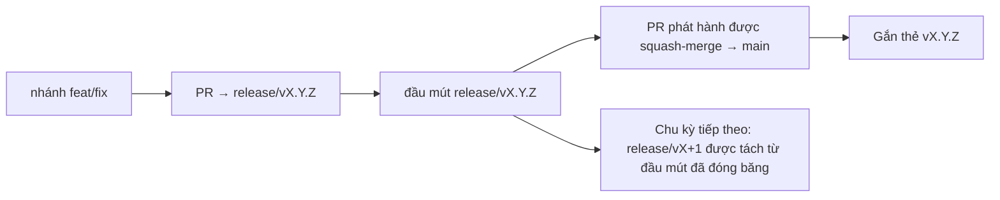

# Branching & Release Model (Tiếng Việt)

🌐 **Languages:** 🇺🇸 [English](../../../../ops/BRANCHING_MODEL.md) · 🇪🇹 [am](../../../am/docs/ops/BRANCHING_MODEL.md) · 🇸🇦 [ar](../../../ar/docs/ops/BRANCHING_MODEL.md) · 🇦🇿 [az](../../../az/docs/ops/BRANCHING_MODEL.md) · 🇧🇬 [bg](../../../bg/docs/ops/BRANCHING_MODEL.md) · 🇧🇩 [bn](../../../bn/docs/ops/BRANCHING_MODEL.md) · 🇧🇦 [bs](../../../bs/docs/ops/BRANCHING_MODEL.md) · 🇨🇿 [cs](../../../cs/docs/ops/BRANCHING_MODEL.md) · 🇩🇰 [da](../../../da/docs/ops/BRANCHING_MODEL.md) · 🇩🇪 [de](../../../de/docs/ops/BRANCHING_MODEL.md) · 🇬🇷 [el](../../../el/docs/ops/BRANCHING_MODEL.md) · 🇪🇸 [es](../../../es/docs/ops/BRANCHING_MODEL.md) · 🇪🇪 [et](../../../et/docs/ops/BRANCHING_MODEL.md) · 🇮🇷 [fa](../../../fa/docs/ops/BRANCHING_MODEL.md) · 🇫🇮 [fi](../../../fi/docs/ops/BRANCHING_MODEL.md) · 🇫🇷 [fr](../../../fr/docs/ops/BRANCHING_MODEL.md) · 🇮🇪 [ga](../../../ga/docs/ops/BRANCHING_MODEL.md) · 🇮🇳 [gu](../../../gu/docs/ops/BRANCHING_MODEL.md) · 🇳🇬 [ha](../../../ha/docs/ops/BRANCHING_MODEL.md) · 🇮🇱 [he](../../../he/docs/ops/BRANCHING_MODEL.md) · 🇮🇳 [hi](../../../hi/docs/ops/BRANCHING_MODEL.md) · 🇭🇷 [hr](../../../hr/docs/ops/BRANCHING_MODEL.md) · 🇭🇺 [hu](../../../hu/docs/ops/BRANCHING_MODEL.md) · 🇦🇲 [hy](../../../hy/docs/ops/BRANCHING_MODEL.md) · 🇮🇩 [id](../../../id/docs/ops/BRANCHING_MODEL.md) · 🇳🇬 [ig](../../../ig/docs/ops/BRANCHING_MODEL.md) · 🇮🇹 [it](../../../it/docs/ops/BRANCHING_MODEL.md) · 🇯🇵 [ja](../../../ja/docs/ops/BRANCHING_MODEL.md) · 🇬🇪 [ka](../../../ka/docs/ops/BRANCHING_MODEL.md) · 🇰🇭 [km](../../../km/docs/ops/BRANCHING_MODEL.md) · 🇮🇳 [kn](../../../kn/docs/ops/BRANCHING_MODEL.md) · 🇰🇷 [ko](../../../ko/docs/ops/BRANCHING_MODEL.md) · 🇱🇹 [lt](../../../lt/docs/ops/BRANCHING_MODEL.md) · 🇱🇻 [lv](../../../lv/docs/ops/BRANCHING_MODEL.md) · 🇮🇳 [ml](../../../ml/docs/ops/BRANCHING_MODEL.md) · 🇮🇳 [mr](../../../mr/docs/ops/BRANCHING_MODEL.md) · 🇲🇾 [ms](../../../ms/docs/ops/BRANCHING_MODEL.md) · 🇲🇹 [mt](../../../mt/docs/ops/BRANCHING_MODEL.md) · 🇲🇲 [my](../../../my/docs/ops/BRANCHING_MODEL.md) · 🇳🇵 [ne](../../../ne/docs/ops/BRANCHING_MODEL.md) · 🇳🇱 [nl](../../../nl/docs/ops/BRANCHING_MODEL.md) · 🇳🇴 [no](../../../no/docs/ops/BRANCHING_MODEL.md) · 🇮🇳 [or](../../../or/docs/ops/BRANCHING_MODEL.md) · 🇮🇳 [pa](../../../pa/docs/ops/BRANCHING_MODEL.md) · 🇵🇭 [phi](../../../phi/docs/ops/BRANCHING_MODEL.md) · 🇵🇱 [pl](../../../pl/docs/ops/BRANCHING_MODEL.md) · 🇵🇹 [pt](../../../pt/docs/ops/BRANCHING_MODEL.md) · 🇧🇷 [pt-BR](../../../pt-BR/docs/ops/BRANCHING_MODEL.md) · 🇷🇴 [ro](../../../ro/docs/ops/BRANCHING_MODEL.md) · 🇷🇺 [ru](../../../ru/docs/ops/BRANCHING_MODEL.md) · 🇱🇰 [si](../../../si/docs/ops/BRANCHING_MODEL.md) · 🇸🇰 [sk](../../../sk/docs/ops/BRANCHING_MODEL.md) · 🇸🇮 [sl](../../../sl/docs/ops/BRANCHING_MODEL.md) · 🇷🇸 [sr](../../../sr/docs/ops/BRANCHING_MODEL.md) · 🇸🇪 [sv](../../../sv/docs/ops/BRANCHING_MODEL.md) · 🇰🇪 [sw](../../../sw/docs/ops/BRANCHING_MODEL.md) · 🇮🇳 [ta](../../../ta/docs/ops/BRANCHING_MODEL.md) · 🇮🇳 [te](../../../te/docs/ops/BRANCHING_MODEL.md) · 🇹🇭 [th](../../../th/docs/ops/BRANCHING_MODEL.md) · 🇹🇷 [tr](../../../tr/docs/ops/BRANCHING_MODEL.md) · 🇺🇦 [uk-UA](../../../uk-UA/docs/ops/BRANCHING_MODEL.md) · 🇵🇰 [ur](../../../ur/docs/ops/BRANCHING_MODEL.md) · 🇺🇿 [uz](../../../uz/docs/ops/BRANCHING_MODEL.md) · 🇳🇬 [yo](../../../yo/docs/ops/BRANCHING_MODEL.md) · 🇨🇳 [zh-CN](../../../zh-CN/docs/ops/BRANCHING_MODEL.md) · 🇹🇼 [zh-TW](../../../zh-TW/docs/ops/BRANCHING_MODEL.md)

---

OmniRoute sử dụng mô hình phát hành **chu kỳ song song**: một nhánh `release/vX.Y.Z`
riêng cho chu kỳ đang hoạt động, `main` cho dòng đã phát hành và một thẻ
`vX.Y.Z` bất biến khi chu kỳ đó được phát hành. Việc thấy các commit được đưa vào cả `release/*` _lẫn_
`main` là điều bình thường — không phải nhầm lẫn.

Thông tin chi tiết dành cho người bảo trì nằm trong `CLAUDE.md` (Quy tắc cứng #21) và
[RELEASE_CHECKLIST.md](./RELEASE_CHECKLIST.md). Trang này là bản tóm tắt công khai
dành cho người đóng góp.

## Tổng quan

| Tham chiếu       | Vai trò                                                                                           |
| ---------------- | ------------------------------------------------------------------------------------------------- |
| `release/vX.Y.Z` | **Chu kỳ đang hoạt động** — phát triển hằng ngày và hợp nhất PR cho phiên bản đó                  |
| `main`           | **Dòng đã phát hành** — tiếp nhận chu kỳ thông qua squash-merge khi bản phát hành được xuất bản   |
| `vX.Y.Z` (thẻ)   | **Dấu mốc phát hành** — con trỏ “nội dung đã phát hành” bất biến được tạo tại thời điểm phát hành |



## PR của tôi nên nhắm đến đâu?

**Hãy nhắm đến nhánh `release/vX.Y.Z` đang hoạt động — không phải `main`.**

1. Tìm nhánh `release/v*` đang mở có phiên bản cao nhất (ví dụ tại thời điểm viết:
   `release/v3.8.49`).
2. Tạo nhánh từ đầu mút đó (`git fetch` + checkout / rebase lên nhánh đó).
3. Mở PR với **base = `release/vX.Y.Z` đó**.

`main` không phải là nhánh tích hợp hằng ngày. Các PR được mở với đích là `main`
thường cần được đổi đích trước khi hợp nhất.

## Đóng băng phát hành (các chu kỳ song song)

Khi một bản phát hành đang được đối soát, một issue đánh dấu có nhãn `release-freeze` sẽ
được mở. Điều đó **không làm gián đoạn quá trình phát triển**:

- Nhánh `release/vX.Y.Z` đã đóng băng thuộc quyền quản lý của người phụ trách bản phát hành đó.
- Nhánh `release/vX+1` của chu kỳ tiếp theo được tách từ đầu mút đã đóng băng để người đóng góp tiếp tục
  đưa công việc vào.
- Các PR đang mở vẫn nhắm đến nhánh đã đóng băng nên được **đổi đích** sang nhánh
  `release/v*` đang hoạt động (có phiên bản cao nhất).

Hãy kiểm tra xem có đợt đóng băng nào đang mở hay không trước khi cho rằng nhánh bạn muốn có thể được hợp nhất:

```bash
gh issue list --repo diegosouzapw/OmniRoute --label release-freeze --state open
```

Cơ chế hợp nhất (nhãn `queue` của chủ sở hữu → Mergify) được ghi lại trong
[MERGE_TRAIN.md](./MERGE_TRAIN.md).

## Tại sao cần cả nhánh lẫn thẻ?

| Thành phần       | Vòng đời              | Mục đích                                                                            |
| ---------------- | --------------------- | ----------------------------------------------------------------------------------- |
| `release/vX.Y.Z` | Chu kỳ đang thực hiện | Tập hợp các PR đã được xem xét, duy trì trạng thái CI xanh và là nhánh cơ sở của PR |
| Thẻ `vX.Y.Z`     | Vĩnh viễn             | Đánh dấu chính xác nội dung đã được phát hành lên npm / GitHub Releases             |

Nhánh là xưởng làm việc; thẻ là gói hàng đã niêm phong. Sau khi squash-merge vào
`main`, chu kỳ tiếp theo tiếp tục trên `release/vX+1` mà không cần chờ PR phát hành
trước đó hoàn tất.

## Tài liệu liên quan

- [CONTRIBUTING.md](../../CONTRIBUTING.md) — thiết lập, kiểm thử, danh sách kiểm tra PR
- [RELEASE_CHECKLIST.md](./RELEASE_CHECKLIST.md) — xác thực trước khi phát hành
- [MERGE_TRAIN.md](./MERGE_TRAIN.md) — hàng đợi hợp nhất và quy trình hợp nhất dự phòng
- [RELEASE_GREEN.md](./RELEASE_GREEN.md) — duy trì trạng thái xanh cho đầu mút phát hành
