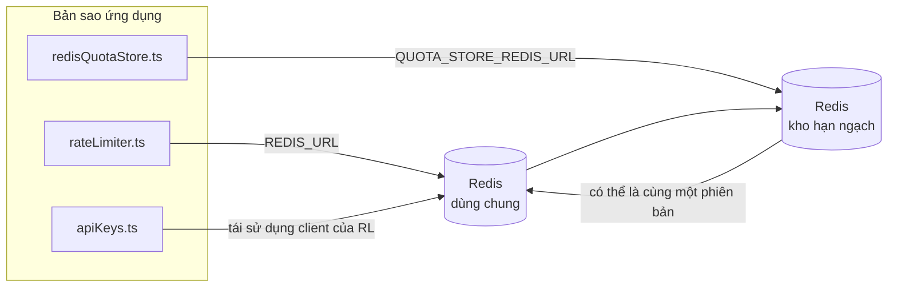

# Redis Production Configuration Guide (Tiếng Việt)

🌐 **Languages:** 🇺🇸 [English](../../../../ops/REDIS_PRODUCTION_CONFIG.md) · 🇪🇹 [am](../../../am/docs/ops/REDIS_PRODUCTION_CONFIG.md) · 🇸🇦 [ar](../../../ar/docs/ops/REDIS_PRODUCTION_CONFIG.md) · 🇦🇿 [az](../../../az/docs/ops/REDIS_PRODUCTION_CONFIG.md) · 🇧🇬 [bg](../../../bg/docs/ops/REDIS_PRODUCTION_CONFIG.md) · 🇧🇩 [bn](../../../bn/docs/ops/REDIS_PRODUCTION_CONFIG.md) · 🇨🇿 [cs](../../../cs/docs/ops/REDIS_PRODUCTION_CONFIG.md) · 🇩🇰 [da](../../../da/docs/ops/REDIS_PRODUCTION_CONFIG.md) · 🇩🇪 [de](../../../de/docs/ops/REDIS_PRODUCTION_CONFIG.md) · 🇬🇷 [el](../../../el/docs/ops/REDIS_PRODUCTION_CONFIG.md) · 🇪🇸 [es](../../../es/docs/ops/REDIS_PRODUCTION_CONFIG.md) · 🇪🇪 [et](../../../et/docs/ops/REDIS_PRODUCTION_CONFIG.md) · 🇮🇷 [fa](../../../fa/docs/ops/REDIS_PRODUCTION_CONFIG.md) · 🇫🇮 [fi](../../../fi/docs/ops/REDIS_PRODUCTION_CONFIG.md) · 🇫🇷 [fr](../../../fr/docs/ops/REDIS_PRODUCTION_CONFIG.md) · 🇮🇪 [ga](../../../ga/docs/ops/REDIS_PRODUCTION_CONFIG.md) · 🇮🇳 [gu](../../../gu/docs/ops/REDIS_PRODUCTION_CONFIG.md) · 🇳🇬 [ha](../../../ha/docs/ops/REDIS_PRODUCTION_CONFIG.md) · 🇮🇱 [he](../../../he/docs/ops/REDIS_PRODUCTION_CONFIG.md) · 🇮🇳 [hi](../../../hi/docs/ops/REDIS_PRODUCTION_CONFIG.md) · 🇭🇷 [hr](../../../hr/docs/ops/REDIS_PRODUCTION_CONFIG.md) · 🇭🇺 [hu](../../../hu/docs/ops/REDIS_PRODUCTION_CONFIG.md) · 🇦🇲 [hy](../../../hy/docs/ops/REDIS_PRODUCTION_CONFIG.md) · 🇮🇩 [id](../../../id/docs/ops/REDIS_PRODUCTION_CONFIG.md) · 🇳🇬 [ig](../../../ig/docs/ops/REDIS_PRODUCTION_CONFIG.md) · 🇮🇹 [it](../../../it/docs/ops/REDIS_PRODUCTION_CONFIG.md) · 🇯🇵 [ja](../../../ja/docs/ops/REDIS_PRODUCTION_CONFIG.md) · 🇬🇪 [ka](../../../ka/docs/ops/REDIS_PRODUCTION_CONFIG.md) · 🇰🇭 [km](../../../km/docs/ops/REDIS_PRODUCTION_CONFIG.md) · 🇮🇳 [kn](../../../kn/docs/ops/REDIS_PRODUCTION_CONFIG.md) · 🇰🇷 [ko](../../../ko/docs/ops/REDIS_PRODUCTION_CONFIG.md) · 🇱🇹 [lt](../../../lt/docs/ops/REDIS_PRODUCTION_CONFIG.md) · 🇱🇻 [lv](../../../lv/docs/ops/REDIS_PRODUCTION_CONFIG.md) · 🇮🇳 [ml](../../../ml/docs/ops/REDIS_PRODUCTION_CONFIG.md) · 🇮🇳 [mr](../../../mr/docs/ops/REDIS_PRODUCTION_CONFIG.md) · 🇲🇾 [ms](../../../ms/docs/ops/REDIS_PRODUCTION_CONFIG.md) · 🇲🇹 [mt](../../../mt/docs/ops/REDIS_PRODUCTION_CONFIG.md) · 🇲🇲 [my](../../../my/docs/ops/REDIS_PRODUCTION_CONFIG.md) · 🇳🇵 [ne](../../../ne/docs/ops/REDIS_PRODUCTION_CONFIG.md) · 🇳🇱 [nl](../../../nl/docs/ops/REDIS_PRODUCTION_CONFIG.md) · 🇳🇴 [no](../../../no/docs/ops/REDIS_PRODUCTION_CONFIG.md) · 🇮🇳 [or](../../../or/docs/ops/REDIS_PRODUCTION_CONFIG.md) · 🇮🇳 [pa](../../../pa/docs/ops/REDIS_PRODUCTION_CONFIG.md) · 🇵🇭 [phi](../../../phi/docs/ops/REDIS_PRODUCTION_CONFIG.md) · 🇵🇱 [pl](../../../pl/docs/ops/REDIS_PRODUCTION_CONFIG.md) · 🇵🇹 [pt](../../../pt/docs/ops/REDIS_PRODUCTION_CONFIG.md) · 🇧🇷 [pt-BR](../../../pt-BR/docs/ops/REDIS_PRODUCTION_CONFIG.md) · 🇷🇴 [ro](../../../ro/docs/ops/REDIS_PRODUCTION_CONFIG.md) · 🇷🇺 [ru](../../../ru/docs/ops/REDIS_PRODUCTION_CONFIG.md) · 🇱🇰 [si](../../../si/docs/ops/REDIS_PRODUCTION_CONFIG.md) · 🇸🇰 [sk](../../../sk/docs/ops/REDIS_PRODUCTION_CONFIG.md) · 🇸🇮 [sl](../../../sl/docs/ops/REDIS_PRODUCTION_CONFIG.md) · 🇷🇸 [sr](../../../sr/docs/ops/REDIS_PRODUCTION_CONFIG.md) · 🇸🇪 [sv](../../../sv/docs/ops/REDIS_PRODUCTION_CONFIG.md) · 🇰🇪 [sw](../../../sw/docs/ops/REDIS_PRODUCTION_CONFIG.md) · 🇮🇳 [ta](../../../ta/docs/ops/REDIS_PRODUCTION_CONFIG.md) · 🇮🇳 [te](../../../te/docs/ops/REDIS_PRODUCTION_CONFIG.md) · 🇹🇭 [th](../../../th/docs/ops/REDIS_PRODUCTION_CONFIG.md) · 🇹🇷 [tr](../../../tr/docs/ops/REDIS_PRODUCTION_CONFIG.md) · 🇺🇦 [uk-UA](../../../uk-UA/docs/ops/REDIS_PRODUCTION_CONFIG.md) · 🇵🇰 [ur](../../../ur/docs/ops/REDIS_PRODUCTION_CONFIG.md) · 🇺🇿 [uz](../../../uz/docs/ops/REDIS_PRODUCTION_CONFIG.md) · 🇳🇬 [yo](../../../yo/docs/ops/REDIS_PRODUCTION_CONFIG.md) · 🇨🇳 [zh-CN](../../../zh-CN/docs/ops/REDIS_PRODUCTION_CONFIG.md) · 🇹🇼 [zh-TW](../../../zh-TW/docs/ops/REDIS_PRODUCTION_CONFIG.md)

---

## Tổng quan

Redis là một **phần phụ thuộc tùy chọn, không bắt buộc** trong OmniRoute — ứng dụng vẫn tiếp tục hoạt động với chức năng suy giảm hợp lý (dùng bộ nhớ trong
làm phương án dự phòng) khi Redis không khả dụng. Trong môi trường production, việc tinh chỉnh Redis giúp giảm độ trễ cho bốn
khối lượng công việc riêng biệt:

| Khối lượng công việc      | Thành phần điều khiển         | Factory tạo client                                       | Mẫu khóa                                                     |
| ------------------------- | ----------------------------- | -------------------------------------------------------- | ------------------------------------------------------------ |
| Giới hạn tốc độ           | `rateLimiter.ts`              | Singleton `ioredis` khởi tạo lười qua `getRedisClient()` | Các cửa sổ giới hạn tốc độ nguyên tử bằng Lua `<prefix>rl:*` |
| Bộ nhớ đệm xác thực       | `apiKeys.ts`                  | Tái sử dụng client của `rateLimiter`                     | `<prefix>auth:api_key:<sha256>` với TTL                      |
| Kho hạn ngạch             | `redisQuotaStore.ts`          | Singleton `getRedisClient(url)` riêng biệt               | `<prefix>quota:*` có thể cấu hình theo từng instance         |
| Circuit breaker khởi động | `redisCircuitBreakerStore.ts` | Client riêng biệt trong `circuitBreakerFactory.ts`       | `<prefix>warmup:cb:<connectionId>`                           |

Cả bốn khối lượng công việc đều dùng chung một tiền tố namespace để OmniRoute có thể cùng tồn tại với các ứng dụng khác trên
một instance Redis duy nhất (ví dụ: `127.0.0.1:6379`). Xem [Phân vùng tên khóa](#key-namespacing).

---

## Cấu hình hiện tại (Giá trị mặc định trong mã)

| Thiết lập                               | Giá trị                                                             | Vị trí                                                                                |
| --------------------------------------- | ------------------------------------------------------------------- | ------------------------------------------------------------------------------------- |
| Biến môi trường `REDIS_URL`             | `redis://redis:6379` (compose), tùy chọn                            | `rateLimiter.ts:5`, `.env.example`                                                    |
| Biến môi trường `REDIS_KEY_PREFIX`      | `omniroute:` (mặc định)                                             | `rateLimiter.ts`, `redisQuotaStore.ts`, `redisCircuitBreakerStore.ts`, `.env.example` |
| Biến môi trường `QUOTA_STORE_REDIS_URL` | riêng biệt, có thể khác với `REDIS_URL`                             | `quota/storeFactory.ts`                                                               |
| `QUOTA_STORE_DRIVER`                    | `"sqlite"` (mặc định), tùy chọn `"redis"`                           | `quota/storeFactory.ts`                                                               |
| `maxRetriesPerRequest` của ioredis      | `3`                                                                 | quá trình tạo client trong `rateLimiter.ts`                                           |
| `enableReadyCheck`                      | chưa đặt (mặc định của ioredis: `true`)                             | —                                                                                     |
| `lazyConnect`                           | chưa đặt (mặc định của ioredis: `false`)                            | —                                                                                     |
| `retryStrategy`                         | chưa đặt (mặc định của ioredis: cơ sở 200ms, tăng theo cấp số nhân) | —                                                                                     |
| TLS / mật khẩu / chỉ mục DB             | **chưa được cấu hình**                                              | —                                                                                     |
| Sentinel / Cluster                      | **chưa được cấu hình** — chỉ hỗ trợ một nút độc lập                 | —                                                                                     |

---

## Phân vùng tên khóa

OmniRoute dùng chung một instance Redis với mọi dịch vụ khác đang chạy trên máy chủ. Nếu không có namespace,
các khóa như `auth:api_key:<sha256>` hoặc `rl:*` có thể xung đột với khóa của các ứng dụng khác
đang sử dụng cùng Redis (instance này chạy Redis tại `127.0.0.1:6379` cùng với các dịch vụ khác).

Đặt `REDIS_KEY_PREFIX` thành một chuỗi không rỗng để thêm tiền tố vào **mọi** khóa OmniRoute:

```bash
# .env — tất cả khóa OmniRoute trở thành omniroute:rl:*, omniroute:auth:*, omniroute:quota:*, omniroute:warmup:cb:*
REDIS_KEY_PREFIX=omniroute:
```

- **Mặc định:** `omniroute:` (được áp dụng khi `REDIS_KEY_PREFIX` chưa được đặt hoặc để trống).
- **Áp dụng cho:** bộ giới hạn tốc độ + bộ nhớ đệm xác thực (dùng chung client `ioredis` thông qua `keyPrefix`) và
  kho hạn ngạch (`KEY_PREFIX = "${REDIS_KEY_PREFIX}quota"`) cùng circuit breaker khởi động
  (`KEY_PREFIX = "${REDIS_KEY_PREFIX}warmup:cb:"`).
- **Việc thay đổi tiền tố** khi các khóa đã tồn tại trong Redis sẽ khiến các khóa cũ không còn được tham chiếu (chúng sẽ hết hạn
  thông qua TTL / LRU). Có thể thay đổi an toàn; không cần di chuyển dữ liệu. Ngoại lệ duy nhất là khóa circuit breaker
  khởi động của một kết nối được đánh dấu là bị cấm: khóa này được lưu trữ mà không có TTL, vì vậy
  hãy liệt kê các khóa còn sót lại bằng `redis-cli --scan --pattern '<old-prefix>warmup:cb:*'` rồi xóa chúng.
- **`keyPrefix` của ioredis** tự động thêm tiền tố khi ghi **và** loại bỏ tiền tố khi đọc,
  vì vậy mã ứng dụng không bao giờ thấy tiền tố này.

---

## Tinh chỉnh được khuyến nghị cho môi trường Production

### 1. Tùy chọn Connection Pool / Client (hàm khởi tạo `Redis` của ioredis)

Mã hiện tại tạo một `new Redis(url)` duy nhất mà không có tùy chọn tùy chỉnh. Đối với các
triển khai production có nhiều replica, hãy truyền một client factory vào mã hoặc bọc `getRedisClient()`:

```typescript
const redis = new Redis(REDIS_URL, {
  maxRetriesPerRequest: null, // không giới hạn số lần thử lại; để retryStrategy quyết định
  enableReadyCheck: true, // xác minh máy chủ đã sẵn sàng trước khi chấp nhận lời gọi
  lazyConnect: true, // không kết nối khi khởi tạo; chờ lời gọi đầu tiên
  retryStrategy: (times) => {
    if (times > 10) return null; // từ bỏ sau 10 lần thử lại → kết nối lại sau
    return Math.min(times * 200, 5000); // 200ms, 400ms, …, giới hạn 5s
  },
  enableAutoPipelining: true, // gộp các lệnh đồng thời vào một lần ghi TCP
  keepAlive: 10000, // TCP keep-alive mỗi 10s
});
```

**Các đánh đổi chính:**

- `maxRetriesPerRequest: null` + `retryStrategy` — được ưu tiên cho production để các lần
  khởi động lại Redis tạm thời không làm mọi request thất bại ngay lập tức. Cơ chế dự phòng
  trong bộ nhớ của `checkRateLimit()` xử lý nhánh lỗi này.
- `lazyConnect: true` — tránh việc khởi động phụ thuộc vào Redis phải hoạt động trước khi máy chủ
  bắt đầu chấp nhận kết nối.
- `enableAutoPipelining: true` — giảm số lượt khứ hồi cho các lần kiểm tra giới hạn tốc độ đồng thời;
  hữu ích khi >50 RPS trên một kết nối duy nhất.

### 2. Cấu hình máy chủ Redis (`redis.conf`)

```
# Bộ nhớ
maxmemory 80%                        # chừa không gian cho bộ nhớ đệm trang của hệ điều hành
maxmemory-policy allkeys-lru         # loại bỏ các mục bộ nhớ đệm xác thực cũ khi thiếu bộ nhớ

# Tính bền vững dữ liệu (tùy chọn — OmniRoute an toàn khi gặp sự cố mà không cần tính năng này)
save 300 1                           # tạo snapshot ít nhất mỗi 5 phút nếu có ≥1 khóa thay đổi
appendonly no                        # không cần AOF; dữ liệu có thể được tái tạo
appendfsync no                       # không có chi phí fsync (RDB là đủ)

# Mạng
timeout 0                            # không ngắt kết nối khi không hoạt động
tcp-keepalive 300                    # keep-alive 5 phút
tcp-backlog 511                      # hàng đợi kết nối cho tải tăng đột biến

# Hiệu năng
hz 10                                # mặc định; dùng 100 nếu nhạy cảm với độ trễ
activedefrag yes                     # tự động chống phân mảnh khi độ phân mảnh >10%
```

**Đánh đổi của `maxmemory-policy allkeys-lru`:** Các mục bộ nhớ đệm xác thực có thể bị loại bỏ khi
thiếu bộ nhớ. Điều này an toàn — `setCachedApiKey` luôn điền lại khi không tìm thấy, và cơ chế
dự phòng SQLite là nguồn dữ liệu có thẩm quyền. Script Lua của bộ giới hạn tốc độ tạo ra các khóa nhỏ,
được thiết kế để tồn tại trong thời gian ngắn.

### 3. Thiết lập Docker Compose

Cấu hình compose production (`docker-compose.prod.yml`) sử dụng `redis:8.6.2-alpine`. Hãy thêm:

```yaml
redis:
  image: redis:8.6.2-alpine
  command:
    [
      "redis-server",
      "--maxmemory",
      "512mb",
      "--maxmemory-policy",
      "allkeys-lru",
      "--activedefrag",
      "yes",
      "--save",
      "300 1",
    ]
  healthcheck:
    test: ["CMD", "redis-cli", "ping"]
    interval: 10s
    timeout: 3s
    retries: 3
    start_period: 5s
```

### 4. Các cân nhắc về nhiều instance / khả năng mở rộng

**Một Redis duy nhất cho tất cả replica** — script Lua của bộ giới hạn tốc độ phụ thuộc vào một
không gian khóa có thẩm quyền duy nhất. Việc sử dụng nhiều instance Redis phía sau các replica sẽ làm mất
tính nguyên tử và tăng gấp đôi hạn mức. Hãy sử dụng một Redis duy nhất (hoặc cụm Redis Sentinel có khả năng
chuyển đổi dự phòng) cho tất cả replica của ứng dụng.

**Số lượng kết nối:** Mỗi replica ứng dụng mở **2 kết nối TCP** đến Redis
(client của bộ giới hạn tốc độ + client của kho hạn ngạch). Với 10 replica → 20 kết nối, vẫn
nằm trong giới hạn mặc định 10k kết nối của một instance Redis.

### 5. Giám sát

Cung cấp thông qua endpoint kiểm tra tình trạng:

```typescript
// src/app/api/monitoring/health/route.ts đã gọi các hàm rateLimiter
// Thêm các kiểm tra dành riêng cho Redis:
//   1. Độ trễ PING thông qua ioredis .ping()
//   2. Mức sử dụng bộ nhớ thông qua INFO memory
//   3. Số lượng kết nối thông qua INFO clients
//   4. Tỷ lệ hit của maxmemory-policy (evicted_keys / keyspace_hits)
```

Các chỉ số chính cần theo dõi:

- **Số khóa bị loại bỏ / giây** — nếu liên tục khác 0, hãy tăng `maxmemory`
- **Client bị chặn** — giá trị khác 0 cho thấy script Lua chạy chậm hoặc mức độ tranh chấp cao
- **Kết nối bị từ chối** — đã đạt giới hạn kết nối; hiếm khi xảy ra với 20 kết nối

---

## Sơ đồ kiến trúc



---

## Tài liệu tham khảo

| Tệp                                | Mục đích                                                                          |
| ---------------------------------- | --------------------------------------------------------------------------------- |
| `src/shared/utils/rateLimiter.ts`  | Client Redis chính, tập lệnh giới hạn tốc độ Lua, phương án dự phòng trong bộ nhớ |
| `src/lib/db/apiKeys.ts`            | Bộ nhớ đệm xác thực — dự phòng Redis→SQLite                                       |
| `src/lib/quota/redisQuotaStore.ts` | Client Redis riêng cho kho hạn ngạch tùy chọn                                     |
| `src/lib/quota/storeFactory.ts`    | Chuyển đổi giữa các trình điều khiển hạn ngạch `sqlite` và `redis`                |
| `docker-compose.prod.yml`          | Container Redis cho môi trường production (image `redis:8.6.2-alpine`)            |
| `.env.example`                     | Tài liệu về các biến môi trường Redis                                             |
| `src/app/api/local/redis/`         | Các tuyến API để điều phối container phát triển                                   |
| `bin/cli/commands/redis.mjs`       | Các lệnh CLI để điều phối container phát triển                                    |
