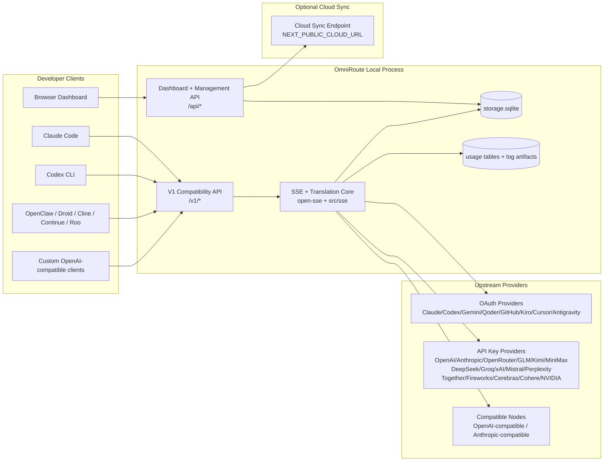
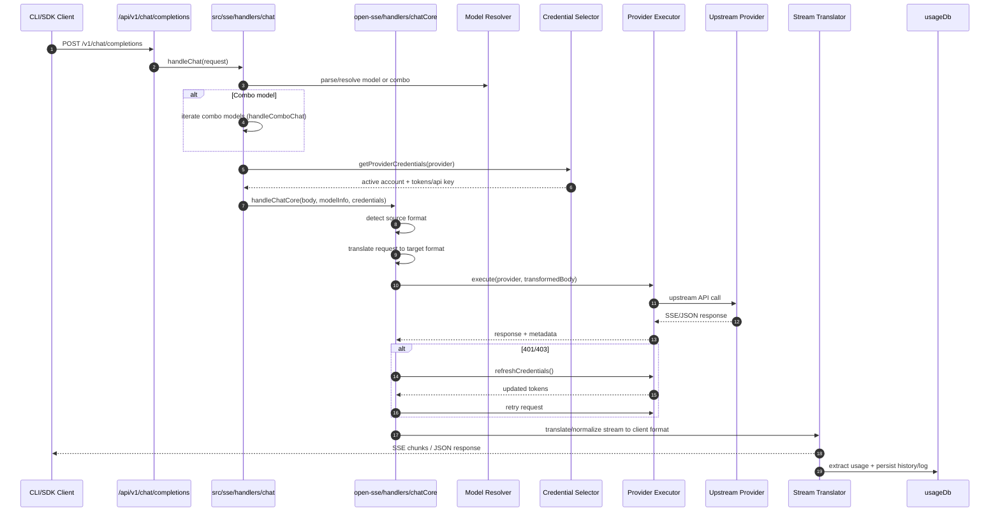
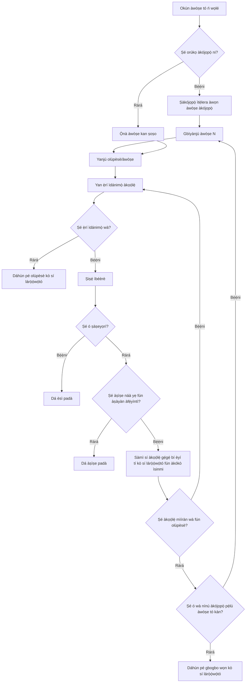
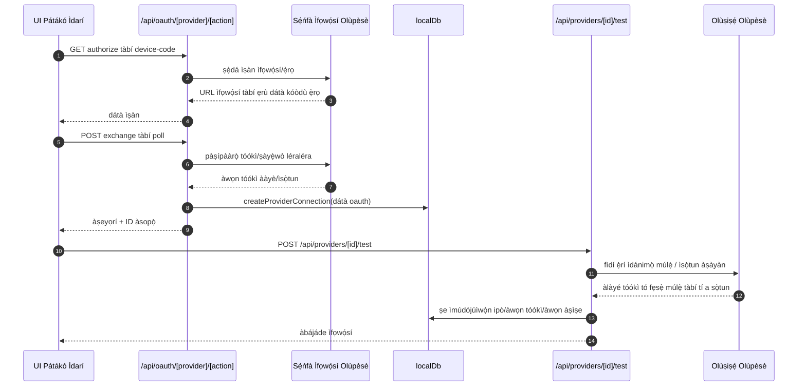
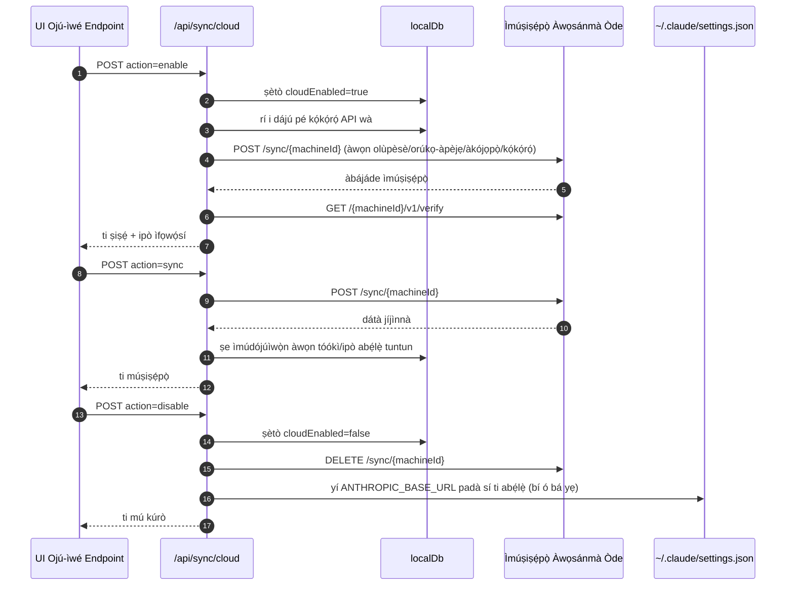
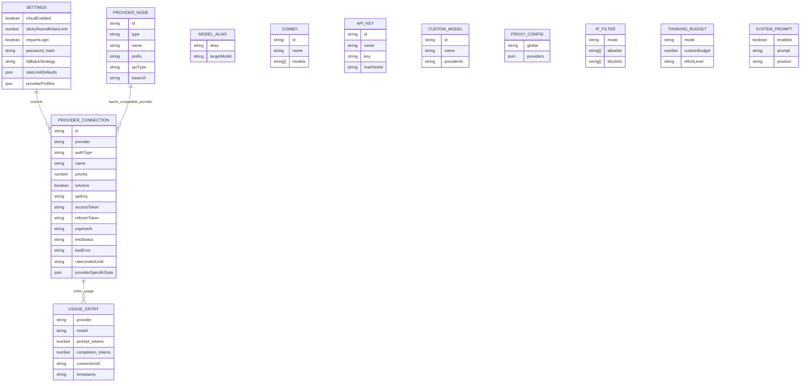
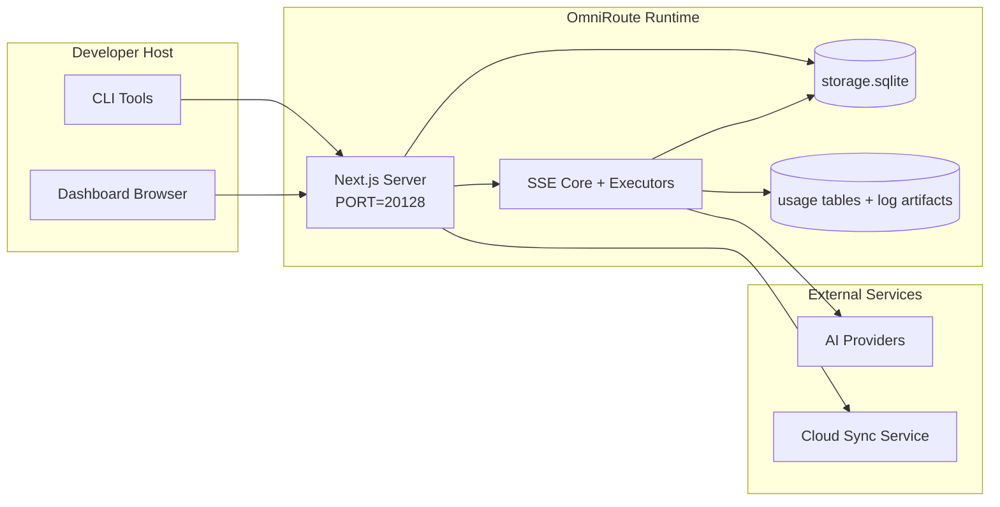

# OmniRoute Architecture (Yorùbá)

🌐 **Languages:** 🇺🇸 [English](../../../../architecture/ARCHITECTURE.md) · 🇪🇹 [am](../../../am/docs/architecture/ARCHITECTURE.md) · 🇸🇦 [ar](../../../ar/docs/architecture/ARCHITECTURE.md) · 🇦🇿 [az](../../../az/docs/architecture/ARCHITECTURE.md) · 🇧🇬 [bg](../../../bg/docs/architecture/ARCHITECTURE.md) · 🇧🇩 [bn](../../../bn/docs/architecture/ARCHITECTURE.md) · 🇧🇦 [bs](../../../bs/docs/architecture/ARCHITECTURE.md) · 🇨🇿 [cs](../../../cs/docs/architecture/ARCHITECTURE.md) · 🇩🇰 [da](../../../da/docs/architecture/ARCHITECTURE.md) · 🇩🇪 [de](../../../de/docs/architecture/ARCHITECTURE.md) · 🇬🇷 [el](../../../el/docs/architecture/ARCHITECTURE.md) · 🇪🇸 [es](../../../es/docs/architecture/ARCHITECTURE.md) · 🇪🇪 [et](../../../et/docs/architecture/ARCHITECTURE.md) · 🇮🇷 [fa](../../../fa/docs/architecture/ARCHITECTURE.md) · 🇫🇮 [fi](../../../fi/docs/architecture/ARCHITECTURE.md) · 🇫🇷 [fr](../../../fr/docs/architecture/ARCHITECTURE.md) · 🇮🇪 [ga](../../../ga/docs/architecture/ARCHITECTURE.md) · 🇮🇳 [gu](../../../gu/docs/architecture/ARCHITECTURE.md) · 🇳🇬 [ha](../../../ha/docs/architecture/ARCHITECTURE.md) · 🇮🇱 [he](../../../he/docs/architecture/ARCHITECTURE.md) · 🇮🇳 [hi](../../../hi/docs/architecture/ARCHITECTURE.md) · 🇭🇷 [hr](../../../hr/docs/architecture/ARCHITECTURE.md) · 🇭🇺 [hu](../../../hu/docs/architecture/ARCHITECTURE.md) · 🇦🇲 [hy](../../../hy/docs/architecture/ARCHITECTURE.md) · 🇮🇩 [id](../../../id/docs/architecture/ARCHITECTURE.md) · 🇳🇬 [ig](../../../ig/docs/architecture/ARCHITECTURE.md) · 🇮🇹 [it](../../../it/docs/architecture/ARCHITECTURE.md) · 🇯🇵 [ja](../../../ja/docs/architecture/ARCHITECTURE.md) · 🇬🇪 [ka](../../../ka/docs/architecture/ARCHITECTURE.md) · 🇰🇭 [km](../../../km/docs/architecture/ARCHITECTURE.md) · 🇮🇳 [kn](../../../kn/docs/architecture/ARCHITECTURE.md) · 🇰🇷 [ko](../../../ko/docs/architecture/ARCHITECTURE.md) · 🇱🇹 [lt](../../../lt/docs/architecture/ARCHITECTURE.md) · 🇱🇻 [lv](../../../lv/docs/architecture/ARCHITECTURE.md) · 🇮🇳 [ml](../../../ml/docs/architecture/ARCHITECTURE.md) · 🇮🇳 [mr](../../../mr/docs/architecture/ARCHITECTURE.md) · 🇲🇾 [ms](../../../ms/docs/architecture/ARCHITECTURE.md) · 🇲🇹 [mt](../../../mt/docs/architecture/ARCHITECTURE.md) · 🇲🇲 [my](../../../my/docs/architecture/ARCHITECTURE.md) · 🇳🇵 [ne](../../../ne/docs/architecture/ARCHITECTURE.md) · 🇳🇱 [nl](../../../nl/docs/architecture/ARCHITECTURE.md) · 🇳🇴 [no](../../../no/docs/architecture/ARCHITECTURE.md) · 🇮🇳 [or](../../../or/docs/architecture/ARCHITECTURE.md) · 🇮🇳 [pa](../../../pa/docs/architecture/ARCHITECTURE.md) · 🇵🇭 [phi](../../../phi/docs/architecture/ARCHITECTURE.md) · 🇵🇱 [pl](../../../pl/docs/architecture/ARCHITECTURE.md) · 🇵🇹 [pt](../../../pt/docs/architecture/ARCHITECTURE.md) · 🇧🇷 [pt-BR](../../../pt-BR/docs/architecture/ARCHITECTURE.md) · 🇷🇴 [ro](../../../ro/docs/architecture/ARCHITECTURE.md) · 🇷🇺 [ru](../../../ru/docs/architecture/ARCHITECTURE.md) · 🇱🇰 [si](../../../si/docs/architecture/ARCHITECTURE.md) · 🇸🇰 [sk](../../../sk/docs/architecture/ARCHITECTURE.md) · 🇸🇮 [sl](../../../sl/docs/architecture/ARCHITECTURE.md) · 🇷🇸 [sr](../../../sr/docs/architecture/ARCHITECTURE.md) · 🇸🇪 [sv](../../../sv/docs/architecture/ARCHITECTURE.md) · 🇰🇪 [sw](../../../sw/docs/architecture/ARCHITECTURE.md) · 🇮🇳 [ta](../../../ta/docs/architecture/ARCHITECTURE.md) · 🇮🇳 [te](../../../te/docs/architecture/ARCHITECTURE.md) · 🇹🇭 [th](../../../th/docs/architecture/ARCHITECTURE.md) · 🇹🇷 [tr](../../../tr/docs/architecture/ARCHITECTURE.md) · 🇺🇦 [uk-UA](../../../uk-UA/docs/architecture/ARCHITECTURE.md) · 🇵🇰 [ur](../../../ur/docs/architecture/ARCHITECTURE.md) · 🇺🇿 [uz](../../../uz/docs/architecture/ARCHITECTURE.md) · 🇻🇳 [vi](../../../vi/docs/architecture/ARCHITECTURE.md) · 🇨🇳 [zh-CN](../../../zh-CN/docs/architecture/ARCHITECTURE.md) · 🇹🇼 [zh-TW](../../../zh-TW/docs/architecture/ARCHITECTURE.md)

---

🌐 **Languages:** 🇺🇸 [English](../../../../architecture/ARCHITECTURE.md) · 🇪🇹 [am](../../../am/docs/architecture/ARCHITECTURE.md) · 🇸🇦 [ar](../../../ar/docs/architecture/ARCHITECTURE.md) · 🇦🇿 [az](../../../az/docs/architecture/ARCHITECTURE.md) · 🇧🇬 [bg](../../../bg/docs/architecture/ARCHITECTURE.md) · 🇧🇩 [bn](../../../bn/docs/architecture/ARCHITECTURE.md) · 🇧🇦 [bs](../../../bs/docs/architecture/ARCHITECTURE.md) · 🇨🇿 [cs](../../../cs/docs/architecture/ARCHITECTURE.md) · 🇩🇰 [da](../../../da/docs/architecture/ARCHITECTURE.md) · 🇩🇪 [de](../../../de/docs/architecture/ARCHITECTURE.md) · 🇬🇷 [el](../../../el/docs/architecture/ARCHITECTURE.md) · 🇪🇸 [es](../../../es/docs/architecture/ARCHITECTURE.md) · 🇪🇪 [et](../../../et/docs/architecture/ARCHITECTURE.md) · 🇮🇷 [fa](../../../fa/docs/architecture/ARCHITECTURE.md) · 🇫🇮 [fi](../../../fi/docs/architecture/ARCHITECTURE.md) · 🇫🇷 [fr](../../../fr/docs/architecture/ARCHITECTURE.md) · 🇮🇪 [ga](../../../ga/docs/architecture/ARCHITECTURE.md) · 🇮🇳 [gu](../../../gu/docs/architecture/ARCHITECTURE.md) · 🇳🇬 [ha](../../../ha/docs/architecture/ARCHITECTURE.md) · 🇮🇱 [he](../../../he/docs/architecture/ARCHITECTURE.md) · 🇮🇳 [hi](../../../hi/docs/architecture/ARCHITECTURE.md) · 🇭🇷 [hr](../../../hr/docs/architecture/ARCHITECTURE.md) · 🇭🇺 [hu](../../../hu/docs/architecture/ARCHITECTURE.md) · 🇦🇲 [hy](../../../hy/docs/architecture/ARCHITECTURE.md) · 🇮🇩 [id](../../../id/docs/architecture/ARCHITECTURE.md) · 🇳🇬 [ig](../../../ig/docs/architecture/ARCHITECTURE.md) · 🇮🇹 [it](../../../it/docs/architecture/ARCHITECTURE.md) · 🇯🇵 [ja](../../../ja/docs/architecture/ARCHITECTURE.md) · 🇬🇪 [ka](../../../ka/docs/architecture/ARCHITECTURE.md) · 🇰🇭 [km](../../../km/docs/architecture/ARCHITECTURE.md) · 🇮🇳 [kn](../../../kn/docs/architecture/ARCHITECTURE.md) · 🇰🇷 [ko](../../../ko/docs/architecture/ARCHITECTURE.md) · 🇱🇹 [lt](../../../lt/docs/architecture/ARCHITECTURE.md) · 🇱🇻 [lv](../../../lv/docs/architecture/ARCHITECTURE.md) · 🇮🇳 [ml](../../../ml/docs/architecture/ARCHITECTURE.md) · 🇮🇳 [mr](../../../mr/docs/architecture/ARCHITECTURE.md) · 🇲🇾 [ms](../../../ms/docs/architecture/ARCHITECTURE.md) · 🇲🇹 [mt](../../../mt/docs/architecture/ARCHITECTURE.md) · 🇲🇲 [my](../../../my/docs/architecture/ARCHITECTURE.md) · 🇳🇵 [ne](../../../ne/docs/architecture/ARCHITECTURE.md) · 🇳🇱 [nl](../../../nl/docs/architecture/ARCHITECTURE.md) · 🇳🇴 [no](../../../no/docs/architecture/ARCHITECTURE.md) · 🇮🇳 [or](../../../or/docs/architecture/ARCHITECTURE.md) · 🇮🇳 [pa](../../../pa/docs/architecture/ARCHITECTURE.md) · 🇵🇭 [phi](../../../phi/docs/architecture/ARCHITECTURE.md) · 🇵🇱 [pl](../../../pl/docs/architecture/ARCHITECTURE.md) · 🇵🇹 [pt](../../../pt/docs/architecture/ARCHITECTURE.md) · 🇧🇷 [pt-BR](../../../pt-BR/docs/architecture/ARCHITECTURE.md) · 🇷🇴 [ro](../../../ro/docs/architecture/ARCHITECTURE.md) · 🇷🇺 [ru](../../../ru/docs/architecture/ARCHITECTURE.md) · 🇱🇰 [si](../../../si/docs/architecture/ARCHITECTURE.md) · 🇸🇰 [sk](../../../sk/docs/architecture/ARCHITECTURE.md) · 🇸🇮 [sl](../../../sl/docs/architecture/ARCHITECTURE.md) · 🇷🇸 [sr](../../../sr/docs/architecture/ARCHITECTURE.md) · 🇸🇪 [sv](../../../sv/docs/architecture/ARCHITECTURE.md) · 🇰🇪 [sw](../../../sw/docs/architecture/ARCHITECTURE.md) · 🇮🇳 [ta](../../../ta/docs/architecture/ARCHITECTURE.md) · 🇮🇳 [te](../../../te/docs/architecture/ARCHITECTURE.md) · 🇹🇭 [th](../../../th/docs/architecture/ARCHITECTURE.md) · 🇹🇷 [tr](../../../tr/docs/architecture/ARCHITECTURE.md) · 🇺🇦 [uk-UA](../../../uk-UA/docs/architecture/ARCHITECTURE.md) · 🇵🇰 [ur](../../../ur/docs/architecture/ARCHITECTURE.md) · 🇺🇿 [uz](../../../uz/docs/architecture/ARCHITECTURE.md) · 🇻🇳 [vi](../../../vi/docs/architecture/ARCHITECTURE.md) · 🇨🇳 [zh-CN](../../../zh-CN/docs/architecture/ARCHITECTURE.md) · 🇹🇼 [zh-TW](../../../zh-TW/docs/architecture/ARCHITECTURE.md)

_Ìgbà ìkẹyìn tí a ṣe àfikún: 2026-06-28_

## Àkótán Aláṣẹ

OmniRoute jẹ́ ẹnubodè ìdarí AI agbègbè àti pátákó ìṣàkóso tí a kọ́ lórí Next.js.
Ó pèsè endpoint kan ṣoṣo tó bá OpenAI mu (`/v1/*`), ó sì ń darí ìrìnnà kọjá ọ̀pọ̀ olùpèsè upstream pẹ̀lú ìtumọ̀, fallback, ìsọdọ̀tun token, àti ìtọ́pinpin lílò.

Àwọn agbára pàtàkì:

- Ojú API tó bá OpenAI mu fún CLI/àwọn irinṣẹ́ (olùpèsè 355, executors 108)
- Ìtumọ̀ request/response láàárín àwọn fọ́ọ̀mù olùpèsè
- Fallback àkójọpọ̀ awoṣe (ìtẹ̀lé ọ̀pọ̀ awoṣe)
- Àwọn ìgbésẹ̀ àkójọpọ̀ tó ní ìṣètò (`provider + model + connection`) pẹ̀lú ìtòlẹ́sẹẹsẹ ní àsìkò ìṣiṣẹ́ nípasẹ̀ `compositeTiers`
- Fallback ní ìpele account (ọ̀pọ̀ account fún olùpèsè kọ̀ọ̀kan)
- Àyẹ̀wò quota ṣáájú àti yíyan account P2C tó mọ quota nínú ipa ọ̀nà ìjíròrò àkọ́kọ́
- Ìṣàkóso ìsopọ̀ olùpèsè OAuth + API-key (àwọn module olùpèsè OAuth 22)
- Ṣíṣẹ̀dá embedding nípasẹ̀ `/v1/embeddings` (olùpèsè 18)
- Ṣíṣẹ̀dá àwòrán nípasẹ̀ `/v1/images/generations` (olùpèsè 10+, awoṣe 20+)
- Ìkọ̀wé ohun sílẹ̀ nípasẹ̀ `/v1/audio/transcriptions` (olùpèsè 18)
- Yíyí ọ̀rọ̀ padà sí ohùn nípasẹ̀ `/v1/audio/speech` (olùpèsè tí a kọ́ sínú rẹ̀ 24)
- Ṣíṣẹ̀dá fídíò nípasẹ̀ `/v1/videos/generations` (ComfyUI + SD WebUI)
- Ṣíṣẹ̀dá orin nípasẹ̀ `/v1/music/generations` (ComfyUI)
- Ìṣàwárí wẹ́ẹ̀bù nípasẹ̀ `/v1/search` (olùpèsè 20)
- Àyẹ̀wò ìbámu àkóónú nípasẹ̀ `/v1/moderations`
- Àtúntò ipò àbájáde nípasẹ̀ `/v1/rerank`
- Ṣíṣe ìtúpalẹ̀ àmì Think (`<think>...</think>`) fún àwọn awoṣe ìrònú
- Ìwẹ̀nùmọ́ response fún ìbámu pípé pẹ̀lú OpenAI SDK
- Ìṣọ̀kan àwọn role (developer→system, system→user) fún ìbámu láàárín àwọn olùpèsè
- Ìyípadà àbájáde tó ní ìṣètò (json_schema → Gemini responseSchema)
- Ìfipamọ́ agbègbè fún àwọn olùpèsè, keys, aliases, combos, settings, pricing (àwọn module DB 122)
- Ìtọ́pinpin lílò/ìnáwó àti fífi àwọn request sí àkọsílẹ̀
- Sync cloud àṣàyàn fún sync ọ̀pọ̀ ẹ̀rọ/ipò
- Allowlist/blocklist IP fún ìṣàkóso ààyè sí API
- Ìṣàkóso ìwọ̀n ìrònú (passthrough/auto/custom/adaptive)
- Ìfikún system prompt àgbáyé
- Ìtọ́pinpin session àti fingerprinting
- Ìdínà oṣùwọ̀n tó lágbára sí i fún account kọ̀ọ̀kan pẹ̀lú àwọn profile tó jẹ́ ti olùpèsè pàtó
- Àpẹrẹ circuit breaker fún ìfaradà olùpèsè
- Ààbò lòdì sí thundering herd pẹ̀lú títì mutex
- Cache ìyọkúrò request àdáàkọ tó dá lórí signature
- Ìpele domain: àwọn òfin ìnáwó, ìlànà fallback, ìlànà lockout
- Context Relay: àwọn àkótán fífi session lé ẹlòmíràn lọ́wọ́ fún ìtẹ̀síwájú nígbà yíyí account
- Ìfipamọ́ ipò domain (cache write-through SQLite fún fallbacks, budgets, lockouts, circuit breakers)
- Engine ìlànà fún ìṣàyẹ̀wò request láti ibùdó kan (lockout → budget → fallback)
- Telemetry request pẹ̀lú àkójọpọ̀ latency p50/p95/p99
- Telemetry ibi-afẹ́ combo àti ìlera ibi-afẹ́ combo látijọ́ nípasẹ̀ `combo_execution_key` / `combo_step_id`
- Correlation ID (X-Request-Id) fún ìtọ́pasẹ̀ láti ìbẹ̀rẹ̀ dé òpin
- Fífi audit ìbámu sí àkọsílẹ̀ pẹ̀lú àṣàyàn láti jáde fún API key kọ̀ọ̀kan
- Framework eval fún ìmúdájú dídára LLM
- Pátákó ìlera pẹ̀lú ipò circuit breaker olùpèsè ní àsìkò gidi
- MCP Server (irinṣẹ́ 110) pẹ̀lú transports 3 (stdio/SSE/Streamable HTTP)
- A2A Server (JSON-RPC 2.0 + SSE) pẹ̀lú àwọn ọgbọ́n àti ìgbésí-ayé task
- Ètò memory (ìyọ̀jáde, ìfikún, ìgbàpadà, ṣíṣe àkótán)
- Ètò skills (registry, executor, sandbox, àwọn ọgbọ́n tí a kọ́ sínú rẹ̀)
- Proxy MITM pẹ̀lú ìṣàkóso certificate àti ìtọ́jú DNS
- Middleware ààbò lòdì sí prompt injection
- Pipeline fún fífi prompt pọ̀ sí kékeré pẹ̀lú Caveman, RTK, àwọn pipeline tí a tò léra, àwọn combo compression, language packs, àti analytics
- Registry ACP (Agent Communication Protocol)
- Àwọn olùpèsè OAuth tó jẹ́ modular (module kọ̀ọ̀kan 22 lábẹ́ `src/lib/oauth/providers/`)
- Àwọn script uninstall/full-uninstall
- Ìgbésẹ̀ àtúnṣe àyíká OAuth
- Afárá WebSocket fún àwọn client WS tó bá OpenAI mu (`/v1/ws`)
- Ìṣàkóso token sync (ìfúnni/ìfagilé, ìgbàsílẹ̀ config bundle tó ní version ETag)
- Preset olùpèsè GLM Thinking (`glmt`) gẹ́gẹ́ bí apá pàtàkì
- Kíkà token alápapọ̀ (ní ẹ̀gbẹ́ olùpèsè `/messages/count_tokens` pẹ̀lú estimation fallback)
- Ìgbìn model alias láìfọwọ́ṣe (30+ àtúnṣe dialect láàárín proxy ní ìbẹ̀rẹ̀)
- Fetch jáde tó ní ààbò pẹ̀lú guard SSRF, dídènà URL aládani, àti retry tí a lè ṣètò
- Retry ìjíròrò tó mọ cooldown pẹ̀lú `requestRetry` àti `maxRetryIntervalSec` tí a lè ṣètò
- Ìfọwọ́sí àyíká runtime pẹ̀lú Zod ní ìbẹ̀rẹ̀
- Audit ìbámu v2 pẹ̀lú pagination, àwọn ìṣẹ̀lẹ̀ CRUD olùpèsè, àti fífi ìfọwọ́sí tí SSRF dènà sí àkọsílẹ̀

Awoṣe runtime àkọ́kọ́:

- Àwọn route app Next.js lábẹ́ `src/app/api/*` ń ṣe àwọn API pátákó ìṣàkóso àti àwọn API ìbámu
- Kókó SSE/ìdarí àjọpín nínú `src/sse/*` + `open-sse/*` ń bójú tó ìṣiṣẹ́ olùpèsè, ìtumọ̀, streaming, fallback, àti lílò

## Àwọn Àwòrán Ìtọ́kasí

Àwọn orísun Mermaid àṣẹ́ṣe, tí a ń ṣàkóso ẹ̀yà wọn fún pẹpẹ v3.8.0 wà ní
[`docs/diagrams/`](../diagrams/README.md). A tún ṣe méjì nínú wọn ní ìsàlẹ̀ fún ìtọ́sọ́nà;
àwọn tó kù ní àwọn ìjápọ̀ láti inú àwọn ìtọ́sọ́nà pàtó fún agbègbè wọn.


> Orísun: [diagrams/request-pipeline.mmd](../diagrams/request-pipeline.mmd)


> Orísun: [diagrams/resilience-3layers.mmd](../diagrams/resilience-3layers.mmd) — a tún sopọ̀ mọ́ ọn láti
> [RESILIENCE_GUIDE.md](./RESILIENCE_GUIDE.md) àti ìtọ́kasí ìfaradà `CLAUDE.md`.

## Ìwọ̀n àti Àwọn Ààlà

### Ohun Tó Wà Nínú Ìwọ̀n

- Àkókò-ṣiṣe ẹnu-ọ̀nà agbègbè
- Àwọn API ìṣàkóso pánẹ́ẹ̀lì ìdarí
- Ìfàṣẹ̀sí olùpèsè àti ìsọdọ̀tun tọ́kìnnì
- Ìtumọ̀ ìbéèrè àti ìṣànwọ́lé SSE
- Ipò agbègbè + ìtọ́jú lílò
- Ìṣètò ìmúṣiṣẹ́pọ̀ awọsánmà àṣàyàn

### Ohun Tí Kò Sí Nínú Ìwọ̀n

- Ìmúṣẹ iṣẹ́ awọsánmà lẹ́yìn `NEXT_PUBLIC_CLOUD_URL`
- SLA/ọ̀nà ìṣàkóso olùpèsè níta ìlànà agbègbè
- Àwọn fáìlì aláṣẹ CLI ti òde fúnra wọn (Claude CLI, Codex CLI, àti bẹ́ẹ̀ bẹ́ẹ̀ lọ.)

## Ojú-Ìṣàkóso Pánẹ́ẹ̀lì (Lọ́wọ́lọ́wọ́)

Àwọn ojú-ìwé pàtàkì lábẹ́ `src/app/(dashboard)/dashboard/`:

- `/dashboard` — ìbẹ̀rẹ̀ kíákíá + àkótán olùpèsè
- `/dashboard/endpoint` — aṣojú ẹ̀ka-ìpẹ̀kun + MCP + A2A + àwọn táàbù ẹ̀ka-ìpẹ̀kun API
- `/dashboard/providers` — àwọn àsopọ̀ olùpèsè àti ẹ̀rí ìdánimọ̀
- `/dashboard/combos` — àwọn ọgbọ́n àkópọ̀, àwòṣe, olùkọ́lé tó dá lórí ìgbésẹ̀, àwọn òfin ìdarí àwòṣe, àti ètò àtẹ̀lé tí a tọ́jú pẹ̀lú ọwọ́
- `/dashboard/auto-combo` — Ẹ́ńjìnnì Àkópọ̀ Aifọwọ́ṣe: àwọn ìwọ̀n ìṣírò àmì, àwọn àkójọpọ̀ ipò, àwọn àtòjọ-àgbékalẹ̀ fáàkírí aláfojúrí, tẹlémẹ́tírì
- `/dashboard/costs` — àkójọpọ̀ iye owó àti híhàn ìdíyelé
- `/dashboard/analytics` — ìtúpalẹ̀ lílò, àwọn àyẹ̀wò, ìlera ibi-afẹ́ àkópọ̀
- `/dashboard/limits` — àwọn ìṣàkóso ìpín/lílewọ̀n
- `/dashboard/cli-tools` — ìṣàgbékalẹ̀ ìbẹ̀rẹ̀ CLI, ìṣàwárí àkókò-ṣiṣe, ìṣẹ̀dá àtúnṣe
- `/dashboard/agents` — àwọn aṣojú ACP tí a ṣàwárí + ìforúkọsílẹ̀ aṣojú àdáni
- `/dashboard/cloud-agents` — àwọn iṣẹ́ aṣojú tí a gbàlejò lórí awọsánmà (Codex Cloud, Devin, Jules) àti ìgbésí-ayé iṣẹ́
- `/dashboard/skills` — àkọsílẹ̀ ọgbọ́n A2A, ìṣiṣẹ́ àyíká ìdánwò, àkójọ ọgbọ́n inú-ẹ̀rọ
- `/dashboard/memory` — àyẹ̀wò àti ìmúpadàbọ̀ ìrántí ìjíròrò aláìpé
- `/dashboard/webhooks` — àwọn ìforúkọsílẹ̀ webhook tí ń jáde, yíyí àṣírí padà, àwọn ìṣirò àtúnṣe
- `/dashboard/batch` — fífi iṣẹ́ àkójọpọ̀ ránṣẹ́ àti ìlọsíwájú
- `/dashboard/cache` — àwọn ìṣirò kášẹ̀ ìkà-láti-inú àti ìrònú, àwọn ìṣàkóso ìyọkúrò
- `/dashboard/playground` — pápá ìdánwò ìjíròrò aláṣepọ̀ lòdì sí àkópọ̀/àwòṣe èyíkéyìí tí a ti ṣètò
- `/dashboard/changelog` — olùwò àkọsílẹ̀ ìyípadà inú-ìṣàfilọ́lẹ̀ (ń ṣàfihàn `CHANGELOG.md`)
- `/dashboard/system` — ìwádìí àṣìṣe àkókò-ṣiṣe, ìwífún ẹ̀yà, ojú ìfọwọ́sí àyíká
- `/dashboard/onboarding` — olùtọ́sọ́nà ìṣètò ìṣiṣẹ́ àkọ́kọ́ fún àwọn fifi-sórí tuntun
- `/dashboard/media` — pápá ìdánwò àwòrán/fídíò/orin
- `/dashboard/search-tools` — ìdánwò olùpèsè ìṣàwárí àti ìtàn
- `/dashboard/health` — àkókò ìṣiṣẹ́, àwọn aṣèdádúró iyíká, àwọn òpin lílewọ̀n, àwọn àkókò ìṣiṣẹ́ tí a ń ṣọ́ ìpín wọn
- `/dashboard/logs` — àwọn àkọsílẹ̀ ìbéèrè/aṣojú/àyẹ̀wò/console
- `/dashboard/settings` — àwọn táàbù ààtò ètò (gbogbogbò, ìdarí, àwọn àìyẹ̀ àkópọ̀, àti bẹ́ẹ̀ bẹ́ẹ̀ lọ.)
- `/dashboard/context/caveman` — àwọn òfin ìfúnpọ̀ Caveman, àwọn àkójọpọ̀ èdè, àwòtẹ́lẹ̀, àti ipò àbájáde
- `/dashboard/context/rtk` — àwọn àlẹ̀mọ́ àbájáde-àṣẹ RTK, àwòtẹ́lẹ̀, àti àwọn ààtò ààbò àkókò-ṣiṣe
- `/dashboard/context/combos` — àwọn ìṣàn ìfúnpọ̀ olórúkọ tí a yàn sí àwọn àkópọ̀ ìdarí
- `/dashboard/translator` — àyẹ̀wò atúmọ̀ àti àwòtẹ́lẹ̀ ìyípadà ìrísí ìbéèrè
- `/dashboard/audit` — aṣàwárí àkọsílẹ̀ àyẹ̀wò ìbámu pẹ̀lú pípín sí ojú-ìwé àti metadata tí a ṣètò
- `/dashboard/usage` — aṣàwárí lílò fún ìbéèrè kọ̀ọ̀kan tí a so mọ́ `usage_history`
- `/dashboard/compression` — ìtúpalẹ̀ ìfúnpọ̀, àwọn ìṣirò, àti yíyan ìṣàn
- `/dashboard/api-manager` — ìgbésí-ayé kọ́kọ́rọ́ API àti àwọn àṣẹ àwòṣe

## Àyíká Ètò Gíga



## Àwọn Ẹ̀yà Àkọ́kọ́ ti Runtime

## 1) Ìpele API àti Ìdarí Ọ̀nà (Àwọn App Routes Next.js)

Àwọn àkójọ-ọ̀nà pàtàkì:

- `src/app/api/v1/*` àti `src/app/api/v1beta/*` fún àwọn API ìbámu
- `src/app/api/*` fún àwọn API ìṣàkóso/ìṣètò
- Àwọn rewrite Next inú `next.config.mjs` ń darí `/v1/*` sí `/api/v1/*`

Àwọn ọ̀nà ìbámu pàtàkì:

- `src/app/api/v1/chat/completions/route.ts`
- `src/app/api/v1/messages/route.ts`
- `src/app/api/v1/responses/route.ts`
- `src/app/api/v1/models/route.ts` — ní àwọn model àdáni pẹ̀lú `custom: true`
- `src/app/api/v1/embeddings/route.ts` — ṣíṣẹ̀dá embedding (olùpèsè 6)
- `src/app/api/v1/images/generations/route.ts` — ṣíṣẹ̀dá àwòrán (olùpèsè 4+ pẹ̀lú Antigravity/Nebius)
- `src/app/api/v1/messages/count_tokens/route.ts`
- `src/app/api/v1/providers/[provider]/chat/completions/route.ts` — ìfọ̀rọ̀wérọ̀ pàtó fún olùpèsè kọ̀ọ̀kan
- `src/app/api/v1/providers/[provider]/embeddings/route.ts` — àwọn embedding pàtó fún olùpèsè kọ̀ọ̀kan
- `src/app/api/v1/providers/[provider]/images/generations/route.ts` — àwọn àwòrán pàtó fún olùpèsè kọ̀ọ̀kan
- `src/app/api/v1beta/models/route.ts`
- `src/app/api/v1beta/models/[...path]/route.ts`

Àwọn ẹ̀ka ìṣàkóso:

- Ìfàṣẹsí/àwọn ààtò: `src/app/api/auth/*`, `src/app/api/settings/*`
- Àwọn olùpèsè/àsopọ̀: `src/app/api/providers*`
- Àwọn node olùpèsè: `src/app/api/provider-nodes*`
- Àwọn model àdáni: `src/app/api/provider-models` (GET/POST/DELETE)
- Àkójọ model: `src/app/api/models/route.ts` (GET)
- Ìṣètò proxy: `src/app/api/settings/proxy` (GET/PUT/DELETE) + `src/app/api/settings/proxy/test` (POST)
- OAuth: `src/app/api/oauth/*`
- Àwọn kọ́kọ́rọ́/alias/combo/ìdíyelé: `src/app/api/keys*`, `src/app/api/models/alias`, `src/app/api/combos*`, `src/app/api/pricing`
- Ìlò: `src/app/api/usage/*`
- Ìmúdọ́gba/cloud: `src/app/api/sync/*`, `src/app/api/cloud/*`
- Àwọn olùrànlọ́wọ́ irinṣẹ́ CLI: `src/app/api/cli-tools/*`
- Àlẹ̀mọ́ IP: `src/app/api/settings/ip-filter` (GET/PUT)
- Ìnáwó ìrònú: `src/app/api/settings/thinking-budget` (GET/PUT)
- Ìtọ́nisọ́nà ètò: `src/app/api/settings/system-prompt` (GET/PUT)
- Ìfúnpọ̀: `src/app/api/settings/compression`, `src/app/api/compression/*`, àti
  `src/app/api/context/*`
- Àwọn session: `src/app/api/sessions` (GET)
- Àwọn òpin ìwọ̀n: `src/app/api/rate-limits` (GET)
- Ìfaradà sí ìkùnà: `src/app/api/resilience` (GET/PATCH) — ìlà ìbéèrè, àkókò ìsinmi àsopọ̀, breaker olùpèsè, ìṣètò wait-for-cooldown
- Àtúnṣètò ìfaradà sí ìkùnà: `src/app/api/resilience/reset` (POST) — tún àwọn breaker olùpèsè ṣe
- Àwọn ìṣirò cache: `src/app/api/cache/stats` (GET/DELETE)
- Telemetry: `src/app/api/telemetry/summary` (GET)
- Ìnáwó: `src/app/api/usage/budget` (GET/POST)
- Àwọn ẹ̀wọ̀n fallback: `src/app/api/fallback/chains` (GET/POST/DELETE)
- Àyẹ̀wò ìbámu: `src/app/api/compliance/audit-log` (GET, pẹ̀lú pípín ojú-ìwé + metadata tí a ṣètò)
- Àwọn eval: `src/app/api/evals` (GET/POST), `src/app/api/evals/[suiteId]` (GET)
- Àwọn ìlànà: `src/app/api/policies` (GET/POST)
- Àwọn token ìmúdọ́gba: `src/app/api/sync/tokens` (GET/POST), `src/app/api/sync/tokens/[id]` (GET/DELETE)
- Àkójọpọ̀ ìṣètò: `src/app/api/sync/bundle` (GET, àwòrán ìpamọ́ àwọn ààtò/olùpèsè/combo/kọ́kọ́rọ́ tí ETag ń ṣàkóso ẹ̀yà rẹ̀)
- WebSocket: `src/app/api/v1/ws/route.ts` — olùṣàkóso Upgrade fún àwọn client WS tó bá OpenAI mu

## 2) SSE + Kókó Ìtumọ̀

Àwọn módùlù ìṣàn pàtàkì:

- Ibi ìwọlé: `src/sse/handlers/chat.ts`
- Ìṣètò iṣẹ́ kókó: `open-sse/handlers/chatCore.ts`
- Àwọn adápítà ìmúṣẹ́ olùpèsè: `open-sse/executors/*`
- Ìṣàwárí fọ́ọ̀mù/àtúnṣe olùpèsè: `open-sse/services/provider.ts`
- Ìtúpalẹ̀/ìyanjú àwòṣe: `src/sse/services/model.ts`, `open-sse/services/model.ts`
- Ìlànà ìpadà-sẹ́yìn àkọọ́lẹ̀: `open-sse/services/accountFallback.ts`
- Àkọsílẹ̀ ìtumọ̀: `open-sse/translator/index.ts`
- Àwọn ìyípadà ìṣàn: `open-sse/utils/stream.ts`, `open-sse/utils/streamHandler.ts`
- Yíyọ/ṣíṣe ìlò di ọ̀nà kan náà: `open-sse/utils/usageTracking.ts`
- Olùtúpalẹ̀ táàgì ìrònú: `open-sse/utils/thinkTagParser.ts`
- Olùṣàkóso embedding: `open-sse/handlers/embeddings.ts`
- Àkọsílẹ̀ olùpèsè embedding: `open-sse/config/embeddingRegistry.ts`
- Olùṣàkóso ìṣẹ̀dá àwòrán: `open-sse/handlers/imageGeneration.ts`
- Àkọsílẹ̀ olùpèsè àwòrán: `open-sse/config/imageRegistry.ts`
- Ìmọ́tótó èsì: `open-sse/handlers/responseSanitizer.ts`
- Ṣíṣe ipa di ọ̀nà kan náà: `open-sse/services/roleNormalizer.ts`

Àwọn iṣẹ́ (ìlànà iṣẹ́-ajé):

- Yíyan/fífún àkọọ́lẹ̀ ní àmì: `open-sse/services/accountSelector.ts`
- Ìṣàkóso àyíká ìgbésí-ayé ọ̀rọ̀-àyíká: `open-sse/services/contextManager.ts`
- Ìmúṣẹ́ àlẹ̀mọ́ IP: `open-sse/services/ipFilter.ts`
- Títọpa sáà: `open-sse/services/sessionManager.ts`
- Yíyọ àwọn ìbéèrè àdáwòkọ: `open-sse/services/signatureCache.ts`
- Fífi ìtọ́ni ètò sínú: `open-sse/services/systemPrompt.ts`
- Ìṣàkóso ìnáwó ìrònú: `open-sse/services/thinkingBudget.ts`
- Ìdarí àwòṣe wildcard: `open-sse/services/wildcardRouter.ts`
- Ìṣàkóso òpin ìwọ̀n: `open-sse/services/rateLimitManager.ts`
- Olùdáwọ́lé àyíká: `src/shared/utils/circuitBreaker.ts`
- Ìfàrọ́wọ́lé ọ̀rọ̀-àyíká: `open-sse/services/contextHandoff.ts` — ìṣẹ̀dá àti fífi àkótán ìfàrọ́wọ́lé sínú fún ìlànà context-relay
- Ìfúnpọ̀: `open-sse/services/compression/*` — ìfúnpọ̀ aláṣekára ṣáájú ìtumọ̀ olùpèsè;
  ó ní àwọn òfin Caveman, àwọn àlẹ̀mọ́ RTK, àwọn pipeline tí a tò lé ara wọn, àwọn àkójọpọ̀ ìfúnpọ̀, àwọn ìṣirò, àti ìfọwọ́sí
- Olùgbé ìpín Codex wá: `open-sse/services/codexQuotaFetcher.ts` — ń gba ìpín Codex fún àwọn ìpinnu ìfàrọ́wọ́lé context-relay
- Àtúnṣe ìgbìyànjú tó mọ cooldown: `src/sse/services/cooldownAwareRetry.ts` — àwọn àtúnṣe ìgbìyànjú cooldown fún àwòṣe kọ̀ọ̀kan pẹ̀lú `requestRetry` / `maxRetryIntervalSec` tí a lè ṣètò
- Fetch àbájáde tó ní ààbò: `src/shared/network/safeOutboundFetch.ts` — fetch olùpèsè/àwòṣe tó ní ààbò pẹ̀lú ìdènà SSRF, dídènà URL àdáni, àtúnṣe ìgbìyànjú, àti àkókò-opin
- Olùṣọ́ URL àbájáde: `src/shared/network/outboundUrlGuard.ts` — ń fọwọ́sí àwọn URL olùpèsè ní ìbámu pẹ̀lú àwọn ìwọ̀n CIDR àdáni/localhost
- Àwọn iye àìyípadà ìbéèrè olùpèsè: `open-sse/services/providerRequestDefaults.ts` — àwọn iye àìyípadà `maxTokens`, `temperature`, `thinkingBudgetTokens` ní ìpele olùpèsè
- Àwọn iye ibakan olùpèsè GLM: `open-sse/config/glmProvider.ts` — àwọn àwòṣe GLM tí a pín, àwọn URL ìpín, àkókò-opin/àwọn iye àìyípadà GLMT
- Orísun òkè Antigravity: `open-sse/config/antigravityUpstream.ts` — URL ìpìlẹ̀ àti àwọn iye ibakan ojú-ọ̀nà ìṣàwárí
- Àwọn iye ibakan oníbàárà Codex: `open-sse/config/codexClient.ts` — àwọn iye user-agent tó ní ẹ̀yà àti client-version
- Irúgbìn orúkọ-àfirọ́ àwòṣe: `src/lib/modelAliasSeed.ts` — ń gbin àwọn orúkọ-àfirọ́ èdè-àgbègbè cross-proxy tó lé ní 30 nígbà ìbẹ̀rẹ̀

Àwọn módùlù ìpele ibùdó:

- Àwọn òfin/ìnáwó iye owó: `src/domain/costRules.ts`
- Ìlànà ìpadà-sẹ́yìn: `src/domain/fallbackPolicy.ts`
- Olùyanjú àkójọpọ̀: `src/domain/comboResolver.ts`
- Ìlànà ìdènà: `src/domain/lockoutPolicy.ts`
- Ẹ́ńjìnnì ìlànà: `src/domain/policyEngine.ts` — àyẹ̀wò àárín gbùngbùn ti ìdènà → ìnáwó → ìpadà-sẹ́yìn
- Àkójọ àwọn kóòdù àṣìṣe: `src/shared/constants/errorCodes.ts`
- ID ìbéèrè: `src/shared/utils/requestId.ts`
- Àkókò-opin fetch: `src/shared/utils/fetchTimeout.ts`
- Tẹlémẹ́tírì ìbéèrè: `src/shared/utils/requestTelemetry.ts`
- Ìbámu/àyẹ̀wò: `src/lib/compliance/index.ts`
- Olùṣiṣẹ́ eval: `src/lib/evals/evalRunner.ts`
- Ìtọ́jú ipò ibùdó: `src/lib/db/domainState.ts` — SQLite CRUD fún àwọn ẹ̀wọ̀n ìpadà-sẹ́yìn, àwọn ìnáwó, ìtàn iye owó, ipò ìdènà, àti àwọn olùdáwọ́lé àyíká

Àwọn módùlù olùpèsè OAuth (àwọn fáìlì ọ̀tọ̀ọ̀tọ̀ 22 lábẹ́ `src/lib/oauth/providers/`):

- Atọ́ka àkọsílẹ̀: `src/lib/oauth/providers/index.ts`
- Àwọn olùpèsè kọ̀ọ̀kan: `agy.ts`, `antigravity.ts`, `claude.ts`, `cline.ts`, `codebuddy-cn.ts`, `codex.ts`, `cursor.ts`, `devin-desktop.ts`, `ghe-copilot.ts`, `github.ts`, `gitlab-duo.ts`, `grok-cli-oauth.ts`, `grok-cli.ts`, `kilocode.ts`, `kimi-coding.ts`, `kiro.ts`, `openference.ts`, `qoder.ts`, `trae.ts`, `xai-oauth.ts`, `zed-hosted.ts`, `zed.ts`
- Wrapper kékeré: `src/lib/oauth/providers.ts` — ń tún export láti àwọn módùlù kọ̀ọ̀kan ṣe

## 5) Àwọn Iṣẹ́ Tí A Fi Sínú Ètò (v3.8.4)

OmniRoute lè fi àwọn ìlànà iṣẹ́ irinṣẹ́ AI tí ń ṣiṣẹ́ lórí ẹ̀rọ agbègbè sílẹ̀, ṣàbójútó wọn, kí ó sì darí ìbéèrè sí wọn; wọ́n ń pè wọ́n ní **àwọn iṣẹ́ tí a fi sínú ètò**. Márùn-ún ni a pèsè: 9Router, CLIProxyAPI, Bifrost, Mux àti Dario.

Àwọn ipele àwòrán-ilana:

- **UI** (`/dashboard/providers/services`) — ojú-ewé oní-taabu méjì pẹ̀lú àwọn ìṣàkóso ìgbésí-ayé,
  sísan àkọsílẹ̀ lọ́wọ́lọ́wọ́, ìṣàkóso kọ́kọ́rọ́ API, àti (fún 9Router) UI abinibi tí a fi sínú ètò nípasẹ̀
  reverse proxy inú.
- **API** (`/api/services/{name}/*`) — àwọn endpoint 11 fún 9Router, 10 fún CLIProxyAPI, àti 8 kọ̀ọ̀kan fún Bifrost / Mux / Dario,
  gbogbo wọn ni a pín sí **LOCAL_ONLY** (òfin líle #17). Endpoint SSE `GET /api/services/[name]/logs`
  tí wọ́n ń lò pọ̀ ń pèsè iṣẹ́ fún àwọn iṣẹ́ méjèèjì.
- **Olùṣàbójútó** (`src/lib/services/`) — class `ServiceSupervisor` gbogbogbò ń fi
  `child_process.spawn` wé, ó di ring buffer 5 MB mú fún sísan àkọsílẹ̀ SSE, ó ní loop
  àyẹ̀wò ìlera, titiipa iṣẹ́ atomic, àti ìdádúró pẹ̀lẹ́pẹ̀lẹ́ SIGTERM→SIGKILL.
  `bootstrap.ts` so gbogbo àwọn iṣẹ́ tí a ti ṣètò pọ̀ nígbà tí process bá bẹ̀rẹ̀.
- **Olùpèsè/olùṣe** (`open-sse/executors/ninerouter.ts`) — a ṣí 9Router síta gẹ́gẹ́ bí
  olùpèsè gidi. Àwọn model ní ìpelewájú `9router/{sub}/{model}`, a sì ń mú wọn bá ara wọn mu ní gbogbo ìṣẹ́jú 5
  láti endpoint `/v1/models` ti 9Router.

Àlàyé jinlẹ̀: `docs/frameworks/EMBEDDED-SERVICES.md`

## Àwọn Ẹ̀ka-Ètò Pàtàkì (v3.8.0)

### A. Ẹ́ńjìnnì Auto Combo

Auto Combo máa ń ṣe ìṣirò àmì kí ó sì yan àwọn ibi ìdarí ní àkókò ìbéèrè, dípò
gbígbẹ́kẹ̀lé àlàyé combo tí kò yí padà. Ó ń ṣiṣẹ́ fún ìdílé ìpelewájú model `auto/*`.

- Ibùdó ìwọlé ẹ́ńjìnnì: `open-sse/services/autoCombo/` (`autoComboEngine.ts`,
  `scoringEngine.ts`, `virtualFactory.ts`, `modePacks.ts`)
- Olùṣàwárí: `src/domain/comboResolver.ts` (ìmúdámọ̀ aládàáṣe ti ìpelewájú `auto/`)
- Dasibodu: `/dashboard/auto-combo`
- Tẹlimẹ́tírì: tábìlì SQLite `auto_combo_decisions`

Àwọn agbára pàtàkì:

- **Àwọn ọgbọ́n ìdarí 19** (ìṣáájú, oníwọ̀n, kọ́kọ́-kún, yíyí-ká, P2C, àrìnàkò,
  èyí-tí-a-lò-jùlọ-kéré, ìmúdára-iye-owó, mímọ-ìtúnṣètò, fèrèsé-ìtúnṣètò, àyè-àfikún, àrìnàkò-gídí,
  **auto**, lkgp, ìmúdára-àyíká-ọ̀rọ̀, ìfiránṣẹ́-àyíká-ọ̀rọ̀, **fusion**, pẹ̀lú ọ̀nà fallback) —
  auto ni àfikún pàtàkì jù lọ nínú v3.8.0; `fusion` (fífi ìbéèrè ránṣẹ́ sí ọ̀pọ̀ panel + àkójọpọ̀ adájọ́,
  `open-sse/services/fusion.ts`) jẹ́ tuntun nínú v3.8.36.
- **Ìṣirò àmì onífáktọ̀ 16**: quota, ìlera, òdì iye-owó, òdì àìlérò, ìbámu iṣẹ́ àti
  mẹ́wàá míì. Tábìlì àṣẹ àwọn fáktọ̀ àti àwọn ìwọ̀n àìyípadà wọn wà nínú
  [`docs/routing/AUTO-COMBO.md`](../routing/AUTO-COMBO.md) — ṣíṣàlàyé rẹ̀ lẹ́ẹ̀kan sí i níbí yóò
  fún un ní ibi kejì tí ó ti lè di àtijọ́.
- **Ilé-iṣẹ́ aláfojúdi** máa ń ṣẹ̀dá àwọn combo ìgbà-díẹ̀ nígbà tí kò bá sí combo olórúkọ
  tó bá a mu, nípa yíyan àwọn olùdíje láti inú àwọn àsopọ̀ olùpèsè tó ń ṣiṣẹ́ tí wọ́n sì ní ìlera.
- **Àwọn ìpelewájú auto**: `auto/coding`, `auto/cheap`, `auto/fast`, `auto/offline`,
  `auto/smart`, `auto/lkgp` — ọ̀kọ̀ọ̀kan ní àtìlẹ́yìn profaili ìwọ̀n tí a ti ṣàtúnṣe.
- **Àwọn àkójọpọ̀ mode 6**: `ship-fast`, `cost-saver`, `quality-first`, `offline-friendly`,
  `reliability-first` àti `chaos-mode` — àwọn ìṣètò ìwọ̀n tí a ti pèsè tẹ́lẹ̀ tí a lè pè láti
  dasibodu. (Ẹ má ṣe dà wọ́n pọ̀ mọ́ àwọn ìpelewájú `auto/*` lókè, èyí tí ó jẹ́
  àwọn àyípadà àkókò-ìbéèrè.)

Fún àlàyé kíkún nípa algoridimu (àwọn fọ́múlà fáktọ̀, àtúnṣe ìwọ̀n), wo
[`docs/routing/AUTO-COMBO.md`](../routing/AUTO-COMBO.md).

### B. Àwọn Aṣojú Cloud

Cloud Agents fi àwọn pẹpẹ aṣojú-kóòdù tí ẹlòmíràn gbàlejò (Codex Cloud, Devin,
Jules) sínú ìgbésí-ayé iṣẹ́ kan náà tí ibi ìpamọ́ dátà ń ṣètìlẹ́yìn fún. Gbogbo àwọn endpoint fún ṣíṣẹ̀dá/àyẹ̀wò iṣẹ́
níláti ní ìfàṣẹsí ìṣàkóso.

- Gbòngbò module: `src/lib/cloudAgent/` (`baseAgent.ts`, `registry.ts`, `api.ts`,
  `types.ts`, `db.ts`, pẹ̀lú àwọn ìtọ́nisọ́nà abẹ́ fún aṣojú kọ̀ọ̀kan lábẹ́ `agents/`)
- Àwọn ìmúṣẹ́ aṣojú kọ̀ọ̀kan: `agents/codex/`, `agents/devin/`, `agents/jules/`
- Àwọn endpoint gbogbogbò: `/api/v1/agents/tasks/*` (ṣe àtòjọ/ṣẹ̀dá/gba/fagilé)
- Àwọn endpoint ìṣàkóso: `/api/cloud/*` (ìpèsè, ipò, batch)
- Dasibodu: `/dashboard/cloud-agents`
- Ibi ìpamọ́: tábìlì `cloud_agent_tasks`

Fún ìpèsè aṣojú kọ̀ọ̀kan àti àwọn àlàyé OAuth, wo
[`docs/frameworks/CLOUD_AGENT.md`](../frameworks/CLOUD_AGENT.md).

### C. Àwọn Odi Ààbò

Module guardrails jẹ́ ipele middleware tí a lè tún kó láì dá iṣẹ́ dúró, tí ó ń ṣàyẹ̀wò àwọn ìbéèrè
àti àwọn ìdáhùn fún PII, àbẹrẹ prompt, àti àkóónú ìríran tí kò léwu. Àwọn ìrúfin
máa ń dá ìbéèrè dúró lẹ́sẹ̀kẹsẹ̀ pẹ̀lú HTTP **503** àti kóòdù àṣìṣe tí a ṣètò, èyí tí ó ń jẹ́ kí
àwọn olùpè tó wà lẹ́yìn tún gbìyànjú tàbí yan ẹ̀ka míì.

- Gbòngbò module: `src/lib/guardrails/` (`base.ts`, `registry.ts`, `piiMasker.ts`,
  `promptInjection.ts`, `visionBridge.ts`, `visionBridgeHelpers.ts`)
- Àtúnkó láì dá iṣẹ́ dúró: registry ń ṣọ́ àwọn ìyípadà ìṣètò, ó sì tún chain náà kọ́ níbi kan náà
- Àwọn ibi àsopọ̀: ìwọlé handler ìfọ̀rọ̀wérọ̀, handler ìṣẹ̀dá àwòrán, olùsọ ìdáhùn di mímọ́
- Àdéhùn HTTP: àwọn ìrúfin máa ń hàn bí `503` pẹ̀lú `error.code = "GUARDRAIL_VIOLATION"`

Fún kíkọ ruleset àti àtúnṣe ààlà, wo
[`docs/security/GUARDRAILS.md`](../security/GUARDRAILS.md).

### D. Ipele Domain

Namespace `src/domain/` kó àwọn ìpinnu ìlànà sí ibìkan kí àwọn handler route má bàa
ní láti kó ọgbọ́n lockout/budget/fallback jọ fúnra wọn.

- Ẹ́ńjìnnì ìlànà: `src/domain/policyEngine.ts` — ibùdó ìwọlé kan ṣoṣo fún
  àyẹ̀wò ṣáájú ìmúṣẹ (ìtòlẹ́sẹẹsẹ lockout → budget → fallback)
- Àwọn òfin iye-owó: `src/domain/costRules.ts`
- Ìlànà fallback: `src/domain/fallbackPolicy.ts`
- Ìlànà lockout: `src/domain/lockoutPolicy.ts`
- Ìdarí tó dá lórí àmì: `src/domain/tagRouter.ts`
- Olùṣàwárí combo: `src/domain/comboResolver.ts` — ń yanjú àwọn orúkọ combo, àwọn ìpelewájú auto/\*,
  àti àwọn ibi-afẹ́ model wildcard sí àwọn ètò ìmúṣẹ tó ṣe kedere
- Olùsopọ̀ òfin àsopọ̀/model: `src/domain/connectionModelRules.ts`
- Àwọn àwòrán-ìgbàkígbà wíwà model: `src/domain/modelAvailability.ts`
- Ìtọ́pa ìparí olùpèsè: `src/domain/providerExpiration.ts`
- Cache quota: `src/domain/quotaCache.ts`
- Ipò ìdínkù agbára: `src/domain/degradation.ts`
- Àyẹ̀wò ìṣètò: `src/domain/configAudit.ts`
- Olùkọ́ metadata ìdáhùn OmniRoute: `src/domain/omnirouteResponseMeta.ts`
- Ẹ̀ka-ètò àyẹ̀wò: `src/domain/assessment/` — àwọn iṣẹ́ àyẹ̀wò àsìkò

### E. Ọ̀nà Ìfúnni Láṣẹ

Kíláàsì ọ̀nà-àṣẹ náà ń ṣe àkójọ gbogbo ìbéèrè tó ń wọlé, ó sì ń lo
ẹ̀wọ̀n ìlànà tó yẹ kí ó tó fi ránṣẹ́ sí ibi ìmúṣẹ.

- Ibi ìwọlé ọ̀nà-àṣẹ: `src/server/authz/pipeline.ts`
- Ẹ̀rọ ìṣàkóso ìbéèrè: `src/server/authz/classify.ts` — ń ṣe ìyàtọ̀ láàárín àwọn
  ipa-ọ̀nà ìbámu ti gbogbo ènìyàn àti àwọn ipa-ọ̀nà ìṣàkóso
- Àkójọ àwọn ipa-ọ̀nà ti gbogbo ènìyàn: `src/shared/constants/publicApiRoutes.ts`
- Àwọn ìlànà: `src/server/authz/policies/` — àwọn àsọtẹ́lẹ̀ tí a lè ṣàkópọ̀
  (`requireApiKey`, `requireManagement`, `requireFreshAuth`, àti bẹ́ẹ̀ bẹ́ẹ̀ lọ)
- Àwọn ohun èlò ìrànlọ́wọ́ fún àkọlé: `src/server/authz/headers.ts`
- Olùrànlọ́wọ́ ìmúdájú: `src/server/authz/assertAuth.ts`
- Àyíká ìbéèrè: `src/server/authz/context.ts`

Àwọn ipa-ọ̀nà ti gbogbo ènìyàn àti ti ìṣàkóso ní ààlà líle láàárín wọn: àwọn API
agent/cooldown àti àwọn ìyípadà olùpèsè nílò ìfàṣẹsí ìṣàkóso (HTTP 401 bí kò bá sí).

Fún gbogbo àwọn òfin ìṣàkóso ipa-ọ̀nà, wo
[`docs/architecture/AUTHZ_GUIDE.md`](./AUTHZ_GUIDE.md).

### F. FSM Ìṣànṣẹ́ àti Ẹ̀rọ Ìtọ́sọ́nà Tó Mọ Iṣẹ́

Ẹ̀rọ ìtọ́sọ́nà tí ẹ̀rọ-ipò-aláìlópin ń darí, tí a gbé lókè yíyan combo láti darí
ìrìn-àjò dá lórí ìpele ìṣànṣẹ́ tí a ṣàwárí (ètò, ìmúṣẹ,
àtúnyẹ̀wò) àti ìbáṣepọ̀ pẹ̀lú iṣẹ́ abẹ́lẹ̀.

- FSM ìṣànṣẹ́: `open-sse/services/workflowFSM.ts`
- Ẹ̀rọ ìtọ́sọ́nà tó mọ iṣẹ́: `open-sse/services/taskAwareRouter.ts`
- Ẹ̀rọ ìṣàwárí iṣẹ́ abẹ́lẹ̀: `open-sse/services/backgroundTaskDetector.ts`
- Ẹ̀rọ ìṣàkóso èrò: `open-sse/services/intentClassifier.ts`

Àwọn ìyípadà FSM ń wọ inú ìṣírò iye Auto Combo, nípa fífún àwọn àwòṣe tó din owó
ní ààyò fún àwọn iṣẹ́ abẹ́lẹ̀/àìfọwọ́ṣe, àti àwọn àwòṣe tó lágbára sí i fún àwọn
ìpele ètò/àtúnyẹ̀wò tí olùlò ń bá ṣiṣẹ́ lórí.

### G. Ìfaradà Pàtó Fún Olùpèsè

Ọ̀pọ̀ àwọn olùpèsè ní àwọn módù ìfaradà àti ìfarapamọ́ tiwọn, tí wọ́n ń ṣiṣẹ́
pẹ̀lú àwọn ipele olùdádúró àyíká àgbáyé / cooldown àsopọ̀ / títìpa àwòṣe:

- Ẹ̀rọ Antigravity 429: `open-sse/services/antigravity429Engine.ts` (ń yí
  ìdánimọ̀ padà, ń nu àwọn àkọlé ìdáhùn, ó sì ń darí títọpinpin kírẹ́díìtì/ẹ̀yà nípasẹ̀
  `antigravityCredits.ts`, `antigravityHeaderScrub.ts`, `antigravityHeaders.ts`,
  `antigravityIdentity.ts`, `antigravityVersion.ts`)
- Ìlànà ìpín ModelScope: `open-sse/services/modelscopePolicy.ts`
- Claude Code CCH (Ìfọwọ́sowọ́pọ̀ Ìbámu Ikanni): `open-sse/services/claudeCodeCCH.ts`,
  pẹ̀lú `claudeCodeCompatible.ts`, `claudeCodeConstraints.ts`, `claudeCodeExtraRemap.ts`,
  `claudeCodeToolRemapper.ts`
- Ṣíṣe àtúnṣe àmì-ìdánimọ̀ Claude Code: `open-sse/services/claudeCodeFingerprint.ts`
- Ìṣíjú Claude Code: `open-sse/services/claudeCodeObfuscation.ts`

Fún gbogbo ìwé ìtọ́sọ́nà ìfarapamọ́ àti ìmọ̀ràn iṣẹ́, wo
`docs/security/STEALTH_GUIDE.md` (git; a kò kó o sínú `/docs`).

### H. Webhooks, Àpamọ́ Ìrònú, Àpamọ́ Kíkà

- **Webhooks** — fífi àwọn ìṣẹ̀lẹ̀ olùpèsè/àkọọ́lẹ̀/iṣẹ́ ránṣẹ́ síta.
  - Olùránṣẹ́: `src/lib/webhookDispatcher.ts`
  - Ibi ìpamọ́: tábìlì SQLite `webhooks` (nípasẹ̀ `src/lib/db/webhooks.ts`)
  - Dásíbọ́ọ̀dù: `/dashboard/webhooks` (àwọn ìforúkọsílẹ̀, àwọn àṣírí, ìtàn ìgbìyànjú-padà)
  - Fún ìṣètò ẹ̀ka ìṣẹ̀lẹ̀ àti ìtumọ̀ ìgbìyànjú-padà, wo [`docs/frameworks/WEBHOOKS.md`](../frameworks/WEBHOOKS.md).
- **Àpamọ́ Ìrònú** — àwọn búlọ́ọ̀kù ìrònú tí a lè tún ṣe fún àwọn olùpèsè tó ń ṣe
  àwọn token ìrònú (Claude, GLMT, àti bẹ́ẹ̀ bẹ́ẹ̀ lọ), kí àwọn ìpele tó tẹ̀ léra lè fo ìrònú-títún.
  - Ìpele DB: `src/lib/db/reasoningCache.ts`
  - Ìpele iṣẹ́: `open-sse/services/reasoningCache.ts`
  - Fún ìtumọ̀ àtúnṣe, wo [`docs/routing/REASONING_REPLAY.md`](../routing/REASONING_REPLAY.md).
- **Àpamọ́ Kíkà** — àpamọ́ ìdáhùn àkókò-kúkúrú tí a fi àmì ìdánimọ̀ ṣe kọ́kọ́rọ́, tí a sì ń lò láti
  darapọ̀ àwọn ìgbìyànjú-padà tó jọra láti inú àwọn SDK òkè tó ti bàjẹ́.
  - Ìpele DB: `src/lib/db/readCache.ts`
  - Ojú-ọ̀nà ìṣirò: `GET /api/cache/stats`, dásíbọ́ọ̀dù ní `/dashboard/cache`

## 3) Ìpele Ìtọ́jú Dátà

DB ipò àkọ́kọ́ (SQLite):

- Amáyédẹrùn pàtàkì: `src/lib/db/core.ts` (better-sqlite3, àwọn ìṣíkiri, WAL)
- Ìráyè sí DB: ṣàgbéwọlé àwọn module `src/lib/db/*` pàtó ní tààrà (a ti yọ barrel `localDb.ts` àtijọ́ kúrò)
- fáìlì: `${DATA_DIR}/storage.sqlite` (tàbí `$XDG_CONFIG_HOME/omniroute/storage.sqlite` nígbà tí a bá ṣètò rẹ̀, bí kò ṣe bẹ́ẹ̀ `~/.omniroute/storage.sqlite`)
- àwọn entity (àwọn tábìlì + namespace KV): providerConnections, providerNodes, modelAliases, combos, apiKeys, settings, pricing, **customModels**, **proxyConfig**, **ipFilter**, **thinkingBudget**, **systemPrompt**

Ìtọ́jú dátà ìlò:

- facade: `src/lib/usageDb.ts` (àwọn module tí a pín sí kéékèèké wà nínú `src/lib/usage/*`)
- Àwọn tábìlì SQLite nínú `storage.sqlite`: `usage_history`, `call_logs`, `proxy_logs`
- àwọn artifact fáìlì àṣàyàn ṣì wà fún ìbámu/ìṣàwárí àṣìṣe (`${DATA_DIR}/log.txt`, `${DATA_DIR}/call_logs/`, `<repo>/logs/...`)
- àwọn fáìlì JSON àtijọ́ ni àwọn ìṣíkiri ìbẹ̀rẹ̀ máa ń ṣí lọ sí SQLite nígbà tí wọ́n bá wà

DB Ipò Domain (SQLite):

- `src/lib/db/domainState.ts` — àwọn iṣẹ́ CRUD fún ipò domain
- Àwọn tábìlì (tí a ṣẹ̀dá nínú `src/lib/db/core.ts`): `domain_fallback_chains`, `domain_budgets`, `domain_cost_history`, `domain_lockout_state`, `domain_circuit_breakers`
- Àpẹẹrẹ cache write-through: àwọn Map inú memory ni ó ní àṣẹ ní àsìkò runtime; a máa ń kọ àwọn ìyípadà sí SQLite lẹ́sẹ̀kẹsẹ̀; a sì máa ń mú ipò padà láti DB ní ìbẹ̀rẹ̀ tútù

## 4) Àwọn Ojú-Ìwọlé Ìfàṣẹsí + Ààbò

- Ìfàṣẹsí cookie dashboard: `src/proxy.ts`, `src/app/api/auth/login/route.ts`
- Ṣíṣẹ̀dá/ìmúdájú kọ́kọ́rọ́ API: `src/shared/utils/apiKey.ts`
- Àwọn àṣírí olupèsè ni a tọ́jú sínú àwọn àkọsílẹ̀ `providerConnections`
- Àtìlẹ́yìn proxy tí ń jáde nípasẹ̀ `open-sse/utils/proxyFetch.ts` (àwọn env var) àti `open-sse/utils/networkProxy.ts` (tí a lè ṣètò fún olupèsè kọ̀ọ̀kan tàbí fún gbogbo wọn)
- Olùṣọ́ SSRF / URL tí ń jáde: `src/shared/network/outboundUrlGuard.ts` — ń dí àwọn range private/loopback/link-local fún gbogbo ìpè olupèsè
- Ìmúdájú env ní runtime: `src/lib/env/runtimeEnv.ts` — schema Zod fún gbogbo àwọn environment variable, tí a ń fi hàn gẹ́gẹ́ bí àṣìṣe/ìkìlọ̀ ní ìbẹ̀rẹ̀
- Àwọn token ìmúdọ́gba: `src/lib/db/syncTokens.ts` — àwọn token tí a fi scope sí fún àwọn endpoint ìgbàsílẹ̀ config bundle; tábìlì SQLite `sync_tokens` ni ó ń ṣe àtìlẹ́yìn fún wọn (ìṣíkiri `024_create_sync_tokens.sql`)
- Ìfàṣẹsí ìfọwọ́sowọ́pọ̀ WebSocket: `src/lib/ws/handshake.ts` — ń fìdí àwọn ìbéèrè ìgbéga WS múlẹ̀ nípasẹ̀ kọ́kọ́rọ́ API tàbí cookie session

## 5) Ìmúdọ́gba Cloud

- Ìbẹ̀rẹ̀ scheduler: `src/lib/initCloudSync.ts`, `src/shared/services/initializeCloudSync.ts`, `src/shared/services/modelSyncScheduler.ts`
- Iṣẹ́ àkókò-dé-àkókò: `src/shared/services/cloudSyncScheduler.ts`
- Iṣẹ́ àkókò-dé-àkókò: `src/shared/services/modelSyncScheduler.ts`
- Route ìṣàkóso: `src/app/api/sync/cloud/route.ts`

## Ìṣàn Ìbéèrè (`/v1/chat/completions`)



## Ìṣàn Àkójọpọ̀ + Àṣàyàn Àfẹ́yìntì Àkọọ́lẹ̀



Àwọn ìpinnu àṣàyàn àfẹ́yìntì ni `open-sse/services/accountFallback.ts` ń darí nípa lílo àwọn kóòdù ipò àti àwọn ìlànà àfojúsùn ọ̀rọ̀-àṣìṣe. Ìtọ́sọ́nà àkójọpọ̀ tún fi ààbò kan kún un: àwọn 400 tó ní í ṣe pẹ̀lú olùpèsè, bíi ìdènà àkóónú láti orísun òkè àti àwọn ìkùnà ìfọwọ́sí ipa, ni a máa ń kà sí ìkùnà tó mọ sí àwòṣe náà nìkan, kí àwọn ibi àfojúsùn àkójọpọ̀ tó tẹ̀ lé lè ṣì ṣiṣẹ́.

## Ìgbésí-ayé Ìforúkọsílẹ̀ OAuth àti Ìsọ̀tun Tóókì



Ìsọ̀tun nígbà tí ìrìnàjò aláàyè ń lọ ni a máa ń ṣiṣẹ́ nínú `open-sse/handlers/chatCore.ts` nípasẹ̀ `refreshCredentials()` ti olùṣiṣẹ́.

## Ìgbésí-ayé Ìmúṣiṣẹ́pọ̀ Àwọsánmà (Mú Ṣiṣẹ́ / Múṣiṣẹ́pọ̀ / Mú Kúrò)



`CloudSyncScheduler` ni ó máa ń ṣe ìmúṣiṣẹ́pọ̀ lẹ́ẹ̀kọ̀ọ̀kan nígbà tí àwọsánmà bá ti ṣiṣẹ́.

## Àwòṣe Dátà àti Àwòrán Ìpamọ́



Àwọn fáìlì ìpamọ́ ti ara:

- DB ìṣiṣẹ́ àkọ́kọ́: `${DATA_DIR}/storage.sqlite`
- àwọn ìlà àkọsílẹ̀ ìbéèrè: `${DATA_DIR}/log.txt` (ohun èlò ìbámu/ìṣàwárí-àṣìṣe)
- àwọn àkójọ payload ìpè tí a ṣètò: `${DATA_DIR}/call_logs/`
- àwọn sáà ìṣàwárí-àṣìṣe olùtumọ̀/ìbéèrè àṣàyàn: `<repo>/logs/...`

## Ìṣètò Ìmúṣiṣẹ́



## Ìbámu Módùlù (Pàtàkì fún Ìpinnu)

### Àwọn Módùlù Ojú-ọ̀nà àti API

- `src/app/api/v1/*`, `src/app/api/v1beta/*`: àwọn API ìbámu
- `src/app/api/v1/providers/[provider]/*`: àwọn ojú-ọ̀nà pàtó fún olùpèsè kọ̀ọ̀kan (ìfọ̀rọ̀wérọ̀, embeddings, àwọn àwòrán)
- `src/app/api/providers*`: CRUD olùpèsè, ìfọwọ́sowọ́pọ̀, ìdánwò
- `src/app/api/provider-nodes*`: ìṣàkóso node àdáni tó bá mu
- `src/app/api/provider-models`: ìṣàkóso àwòṣe àdáni (CRUD)
- `src/app/api/models/route.ts`: API àkójọ àwòṣe (àwọn alias + àwọn àwòṣe àdáni)
- `src/app/api/oauth/*`: àwọn ìṣàn OAuth/kóòdù-ẹ̀rọ
- `src/app/api/keys*`: ìgbésí-ayé kọ́kọ́rọ́ API àdúgbò
- `src/app/api/models/alias`: ìṣàkóso alias
- `src/app/api/combos*`: ìṣàkóso combo ìpadà-sẹ́yìn
- `src/app/api/pricing`: àwọn àtúnṣe owó fún ìṣírò iye owó
- `src/app/api/settings/proxy`: ìṣètò proxy (GET/PUT/DELETE)
- `src/app/api/settings/proxy/test`: ìdánwò àsopọ̀ proxy àjáde (POST)
- `src/app/api/usage/*`: àwọn API lílò àti àkọsílẹ̀
- `src/app/api/sync/*` + `src/app/api/cloud/*`: ìmúdọ́gba awọsánmà àti àwọn olùrànlọ́wọ́ tó dojú kọ awọsánmà
- `src/app/api/cli-tools/*`: àwọn olùkọ/olùṣàyẹ̀wò ìṣètò CLI àdúgbò
- `src/app/api/settings/ip-filter`: allowlist/blocklist IP (GET/PUT)
- `src/app/api/settings/thinking-budget`: ìṣètò ìnáwó token ìrònú (GET/PUT)
- `src/app/api/settings/system-prompt`: prompt ètò àgbáyé (GET/PUT)
- `src/app/api/settings/compression`: àwọn ètò ìkọ́pọ̀ àgbáyé (GET/PUT)
- `src/app/api/compression/*`: àwòtẹ́lẹ̀ ìkọ́pọ̀, metadata òfin, àti àwọn àkójọpọ̀ èdè
- `src/app/api/context/caveman/config`: alias àwọn ètò Caveman (GET/PUT)
- `src/app/api/context/rtk/*`: ìṣètò RTK, àkójọ àsẹ̀, endpoint ìdánwò, àti ìmúpadàbọ̀ àbájáde tútù
- `src/app/api/context/combos*`: CRUD combo ìkọ́pọ̀ àti àwọn ìyànjú combo ojú-ọ̀nà
- `src/app/api/context/analytics`: alias ìtúpalẹ̀ ìkọ́pọ̀
- `src/app/api/sessions`: àtòjọ àwọn sáà tó ń ṣiṣẹ́ (GET)
- `src/app/api/rate-limits`: ipò ààlà oṣùwọ̀n fún àkọọ́lẹ̀ kọ̀ọ̀kan (GET)
- `src/app/api/sync/tokens`: CRUD token ìmúdọ́gba (GET/POST)
- `src/app/api/sync/tokens/[id]`: gbígba/píparẹ́ token ìmúdọ́gba (GET/DELETE)
- `src/app/api/sync/bundle`: ìgbàsílẹ̀ àkójọpọ̀ ìṣètò (GET, ìṣàtẹ̀jáde ETag)
- `src/app/api/v1/ws`: olùdarí ìgbéga WebSocket fún àwọn oníbàárà WS tó bá OpenAI mu

### Kókó Ojú-ọ̀nà àti Ìmúṣẹ

- `src/sse/handlers/chat.ts`: ìtúpalẹ̀ ìbéèrè, ìṣàkóso combo, yíyípo yíyan àkọọ́lẹ̀
- `open-sse/handlers/chatCore.ts`: ìtumọ̀, fífi iṣẹ́ ránṣẹ́ sí executor, ìṣàkóso àtúnṣe/ìmúdójúìwọ̀n, ìṣètò stream
- `open-sse/executors/*`: ìhùwàsí nẹ́tíwọ̀ọ̀kì àti ìgúnlẹ̀ tó jẹ́ pàtó fún olùpèsè

### Iforúkọsílẹ̀ Ìtumọ̀ àti Àwọn Olùyí Ìgúnlẹ̀

- `open-sse/translator/index.ts`: ìforúkọsílẹ̀ àti ìṣàkóso àwọn olùtumọ̀
- Àwọn olùtumọ̀ ìbéèrè: `open-sse/translator/request/*` (módù 9 — `antigravity-to-openai`, `claude-to-gemini`, `claude-to-openai`, `gemini-to-openai`, `openai-responses`, `openai-to-claude`, `openai-to-cursor`, `openai-to-gemini`, `openai-to-kiro`)
- Àwọn olùtumọ̀ ìdáhùn: `open-sse/translator/response/*` (módù 11 — `claude-to-openai`, `cursor-to-openai`, `gemini-to-claude`, `gemini-to-openai`, `kiro-to-openai`, `openai-responses`, `openai-to-antigravity`, `openai-to-claude`, `openai-to-gemini`, `openai-to-gemini-sse`, `responsesToolItem`)
- Àwọn olùrànlọ́wọ́: `open-sse/translator/helpers/*` (módù 12 — `claudeHelper`, `geminiHelper`, `geminiToolsSanitizer`, `jsonUtil`, `markdownBoundary`, `maxTokensHelper`, `openaiHelper`, `responsesApiHelper`, `schemaCoercion`, `strictSystemHoist`, `toolCallHelper`, `toolCallShim`)
- Àwọn iye àìyípadà fún fọ́ọ̀mátì: `open-sse/translator/formats.ts`
- Ìpilẹ̀ṣẹ̀ àti ìforúkọsílẹ̀: `open-sse/translator/bootstrap.ts`, `open-sse/translator/registry.ts`
- Àwọn olùrànlọ́wọ́ fọ́ọ̀mátì àwòrán: `open-sse/translator/image/`

### Ìtọ́jú Dátà Títí Láé

- `src/lib/db/*`: àtòpọ̀/ìpo tí a tọ́jú títí láé àti ìtọ́jú dátà ibùdó lórí SQLite
- `src/lib/db/*`: ṣàgbéwọlé àwọn módù pàtó ní tààrà — kò sí barrel (a ti yọ ipele àtúnṣàgbéjáde `localDb.ts` àtijọ́ kúrò)
- `src/lib/usageDb.ts`: ojú-ọ̀nà sí ìtàn lílò/àwọn àkọsílẹ̀ ìpè lórí àwọn tábìlì SQLite

## Ìbòrí Executor Olùpèsè (Àpẹẹrẹ Strategy)

Olùpèsè kọ̀ọ̀kan ní executor àkànṣe kan tí ó jogún láti inú `BaseExecutor` (nínú `open-sse/executors/base.ts`), èyí tí ó pèsè ṣíṣe URL, ìkọ́ àwọn header, àtúnṣe ìgbìyànjú pẹ̀lú ìdádúró tí ń pọ̀ sí i lọ́nà exponential, àwọn hook fún ìtúnṣe credential, àti method ìṣètò `execute()`.

| Olùṣe                     | Olùpèsè                                                                                                                                                            | Ìṣàkóso Pàtàkì                                                        |
| ------------------------- | ------------------------------------------------------------------------------------------------------------------------------------------------------------------ | --------------------------------------------------------------------- |
| `DefaultExecutor`         | OpenAI, Claude, Gemini, Qwen, OpenRouter, GLM, Kimi, MiniMax, DeepSeek, Groq, xAI, Mistral, Perplexity, Together, Fireworks, Cerebras, Cohere, NVIDIA, àti bẹ́ẹ̀ lọ. | Àtúnṣe URL/header aláyípadà fún olùpèsè kọ̀ọ̀kan                        |
| `AntigravityExecutor`     | Google Antigravity                                                                                                                                                 | Àwọn ID project/session àkànṣe, ṣíṣàyẹ̀wò Retry-After, ìfipamọ́ 429     |
| `AzureOpenAIExecutor`     | Azure OpenAI                                                                                                                                                       | Ìdarí tó dá lórí deployment, fífi òfin query api-version múlẹ̀         |
| `BlackboxWebExecutor`     | Blackbox AI (ipò wẹ́ẹ̀bù)                                                                                                                                            | Ìyípadà session wẹ́ẹ̀bù pẹ̀lú àfarawé fingerprint TLS                    |
| `ClaudeIdentityExecutor`  | Claude.ai (ọ̀nà CCH)                                                                                                                                                | Àwọn pipeline constraint + tool-remap, ṣíṣe àtúnṣe fingerprint        |
| `CliProxyApiExecutor`     | Àwọn olùpèsè tó bá CLIProxyAPI mu                                                                                                                                  | Ìṣàkóso auth àti protocol àkànṣe                                      |
| `CloudflareAiExecutor`    | Cloudflare Workers AI                                                                                                                                              | Ìfikún Account ID, ìtọ́pa lílò tó dá lórí Neurons                      |
| `CodexExecutor`           | OpenAI Codex                                                                                                                                                       | Ó ń fi àwọn ìtọ́nisọ́nà system kún un, ó sì ń fipá mú ìsapá reasoning   |
| `ChatGptWebCodexExecutor` | ChatGPT Web (Codex)                                                                                                                                                | Afárá Responses API session browser pẹ̀lú fífi thread/turn dúró        |
| `CommandCodeExecutor`     | Command Code                                                                                                                                                       | OAuth + yíyí header padà fún session kọ̀ọ̀kan                           |
| `CursorExecutor`          | Cursor IDE                                                                                                                                                         | Protocol ConnectRPC, encoding Protobuf, fífi checksum fọwọ́ sí request |
| `DevinCliExecutor`        | Devin CLI                                                                                                                                                          | Sísopọ̀ ìgbésí-ayé task Devin nípasẹ̀ module agent cloud                |
| `GithubExecutor`          | GitHub Copilot                                                                                                                                                     | Ìsọdọ̀tun token Copilot, àwọn header tó ń fara wé VSCode               |
| `GitlabExecutor`          | GitLab Duo                                                                                                                                                         | GitLab OAuth + ìdarí tó ní ààlà project                               |
| `GlmExecutor`             | Z.AI GLM (pẹ̀lú preset `glmt`)                                                                                                                                      | Ó mọ thinking-budget, àwọn constant preset GLMT                       |
| `GrokWebExecutor`         | xAI Grok web                                                                                                                                                       | Ìyípadà session wẹ́ẹ̀bù, yíyan ipò (ìrònú/boṣewa)                       |
| `KieExecutor`             | KIE                                                                                                                                                                | Ìfúnni token àkànṣe pẹ̀lú àwọn anchor session tó ń yí padà             |
| `KiroExecutor`            | AWS CodeWhisperer/Kiro                                                                                                                                             | Ọ̀nà kika binary AWS EventStream → ìyípadà SSE                         |
| `MuseSparkWebExecutor`    | Muse Spark (wẹ́ẹ̀bù)                                                                                                                                                 | Ìyípadà session wẹ́ẹ̀bù pẹ̀lú afárá ifiranṣẹ-àwòrán                      |
| `NlpCloudExecutor`        | NLP Cloud                                                                                                                                                          | Ìrísí body request tó jẹ́ ti olùpèsè pàtó                              |
| `OpenCodeExecutor`        | OpenCode                                                                                                                                                           | Ìṣètò olùpèsè tó bá AI SDK mu                                         |
| `PerplexityWebExecutor`   | Perplexity web                                                                                                                                                     | Ìyípadà session wẹ́ẹ̀bù fún ìtẹ̀síwájú ìfọ̀rọ̀wérọ̀                         |
| `PetalsExecutor`          | Ìṣírò inference alápín Petals                                                                                                                                      | Ìdarí swarm aláìlákóso-àárín                                          |
| `PollinationsExecutor`    | Pollinations AI                                                                                                                                                    | Kò nílò API key, àwọn request tó ní ààlà oṣùwọ̀n                       |
| `QoderExecutor`           | Qoder AI                                                                                                                                                           | Àtìlẹ́yìn PAT àti OAuth, ipele ọ̀fẹ́ onírúurú model                      |
| `VertexExecutor`          | Google Vertex AI                                                                                                                                                   | Auth service account, àwọn endpoint tó dá lórí region                 |
| `DevinDesktopExecutor`    | Devin Desktop                                                                                                                                                      | API key tí a ṣàgbéwọlé + streaming chat Connect-protobuf              |

Gbogbo àwọn olupèsè yòókù (pẹ̀lú àwọn node àdáni tó bá ara wọn mu) ń lo `DefaultExecutor`.

## Mátríìsì Ìbámu Olùpèsè

> **Àkíyèsí:** Mátríìsì tó wà nísàlẹ̀ jẹ́ àpẹẹrẹ aṣojú àwọn olùpèsè 351 tí a forúkọsílẹ̀ sínú
> OmniRoute v3.8.0. Fún àkójọ àṣẹ tí a sì ń ṣe àfikún sí nígbà gbogbo, tọ́ka sí
> [`docs/reference/PROVIDER_REFERENCE.md`](../reference/PROVIDER_REFERENCE.md) (tí a ṣẹ̀dá láìfọwọ́ṣe) tàbí orísun
> òtítọ́ ní `src/shared/constants/providers.ts` (tí Zod fọwọ́sí nígbà ìrùsókè).

| Olùpèsè             | Ọ̀nà-kíkọ         | Ìfàṣẹ̀sí                  | Ṣiṣan            | Láìsí Ṣiṣan | Ìsọdọ̀tun Tókìn | API Ìlò                   |
| ------------------- | ---------------- | ------------------------ | ---------------- | ----------- | -------------- | ------------------------- |
| Claude              | claude           | Kọ́kọ́rọ́ API / OAuth       | ✅               | ✅          | ✅             | ⚠️ Fún alámójútó nìkan    |
| Gemini              | gemini           | Kọ́kọ́rọ́ API / OAuth       | ✅               | ✅          | ✅             | ⚠️ Cloud Console          |
| Antigravity         | antigravity      | OAuth                    | ✅               | ✅          | ✅             | ✅ API ìpín kíkún         |
| OpenAI              | openai           | Kọ́kọ́rọ́ API               | ✅               | ✅          | ❌             | ❌                        |
| Codex               | openai-responses | OAuth                    | ✅ dandan        | ❌          | ✅             | ✅ Àwọn ààlà ìwọ̀n         |
| ChatGPT Web (Codex) | openai-responses | Àkókò aṣàwákiri          | ✅ dandan        | ❌          | ❌             | ❌                        |
| GitHub Copilot      | openai           | OAuth + Tókìn Copilot    | ✅               | ✅          | ✅             | ✅ Àwọn àwòrán-ìṣẹ́jú ìpín |
| Cursor              | cursor           | Àpapọ̀ ìṣàyẹ̀wò àkànṣe     | ✅               | ✅          | ❌             | ❌                        |
| Kiro                | kiro             | AWS SSO OIDC             | ✅ (EventStream) | ❌          | ✅             | ✅ Àwọn ààlà ìlò          |
| Qoder               | openai           | OAuth / PAT              | ✅               | ✅          | ✅             | ⚠️ Fún ìbéèrè kọ̀ọ̀kan      |
| Kilo Code           | openai           | OAuth                    | ✅               | ✅          | ✅             | ❌                        |
| Cline               | openai           | OAuth                    | ✅               | ✅          | ✅             | ❌                        |
| Kimi Coding         | openai           | OAuth                    | ✅               | ✅          | ✅             | ❌                        |
| OpenRouter          | openai           | Kọ́kọ́rọ́ API               | ✅               | ✅          | ❌             | ❌                        |
| GLM/Kimi/MiniMax    | claude           | Kọ́kọ́rọ́ API               | ✅               | ✅          | ❌             | ❌                        |
| DeepSeek            | openai           | Kọ́kọ́rọ́ API               | ✅               | ✅          | ❌             | ❌                        |
| Groq                | openai           | Kọ́kọ́rọ́ API               | ✅               | ✅          | ❌             | ❌                        |
| xAI (Grok)          | openai           | Kọ́kọ́rọ́ API               | ✅               | ✅          | ❌             | ❌                        |
| Mistral             | openai           | Kọ́kọ́rọ́ API               | ✅               | ✅          | ❌             | ❌                        |
| Perplexity          | openai           | Kọ́kọ́rọ́ API               | ✅               | ✅          | ❌             | ❌                        |
| Together AI         | openai           | Kọ́kọ́rọ́ API               | ✅               | ✅          | ❌             | ❌                        |
| Fireworks AI        | openai           | Kọ́kọ́rọ́ API               | ✅               | ✅          | ❌             | ❌                        |
| Cerebras            | openai           | Kọ́kọ́rọ́ API               | ✅               | ✅          | ❌             | ❌                        |
| Cohere              | openai           | Kọ́kọ́rọ́ API               | ✅               | ✅          | ❌             | ❌                        |
| NVIDIA NIM          | openai           | Kọ́kọ́rọ́ API               | ✅               | ✅          | ❌             | ❌                        |
| Cloudflare AI       | openai           | Tókìn API + ID Àkọọ́lẹ̀    | ✅               | ✅          | ❌             | ❌                        |
| Pollinations        | openai           | Kò sí (kò nílò kọ́kọ́rọ́)   | ✅               | ✅          | ❌             | ❌                        |
| Scaleway AI         | openai           | Kọ́kọ́rọ́ API               | ✅               | ✅          | ❌             | ❌                        |
| LongCat             | openai           | Kọ́kọ́rọ́ API               | ✅               | ✅          | ❌             | ❌                        |
| Ollama Cloud        | openai           | Kọ́kọ́rọ́ API (àṣàyàn)      | ✅               | ✅          | ❌             | ❌                        |
| HuggingFace         | openai           | Kọ́kọ́rọ́ API               | ✅               | ✅          | ❌             | ❌                        |
| Nebius              | openai           | Kọ́kọ́rọ́ API               | ✅               | ✅          | ❌             | ❌                        |
| SiliconFlow         | openai           | Kọ́kọ́rọ́ API               | ✅               | ✅          | ❌             | ❌                        |
| Hyperbolic          | openai           | Kọ́kọ́rọ́ API               | ✅               | ✅          | ❌             | ❌                        |
| Vertex AI           | gemini           | Àkọọ́lẹ̀ Iṣẹ́               | ✅               | ✅          | ✅             | ⚠️ Cloud Console          |
| Command Code        | openai           | OAuth                    | ✅               | ✅          | ✅             | ⚠️ Fún ìbéèrè kọ̀ọ̀kan      |
| Z.AI / GLM          | openai           | Kọ́kọ́rọ́ API / OAuth       | ✅               | ✅          | ❌             | ❌                        |
| GLMT (ètò-àkọ́kọ́)    | claude           | Kọ́kọ́rọ́ API               | ✅               | ✅          | ❌             | ⚠️ Fún ìbéèrè kọ̀ọ̀kan      |
| Kimi Coding         | openai           | OAuth / Kọ́kọ́rọ́ API       | ✅               | ✅          | ✅             | ❌                        |
| KIE                 | openai           | Kọ́kọ́rọ́ API               | ✅               | ✅          | ❌             | ❌                        |
| Devin Desktop       | openai           | Kọ́kọ́rọ́ API tí a gbé wọlé | ✅ (Connect→SSE) | ✅          | ❌             | ⚠️ Fún ìbéèrè kọ̀ọ̀kan      |
| GitLab Duo          | openai           | OAuth (GitLab)           | ✅               | ✅          | ✅             | ❌                        |
| Devin CLI           | openai           | Ìwọlé CLI abẹ́nú          | ✅               | ✅          | ❌             | ✅ API Iṣẹ́-ṣiṣe           |
| Codex Cloud         | openai-responses | OAuth                    | ✅               | ❌          | ✅             | ✅ Àwọn ààlà ìwọ̀n         |
| Jules               | openai           | OAuth                    | ✅               | ✅          | ✅             | ✅ API Iṣẹ́-ṣiṣe           |
| AgentRouter         | openai           | Kọ́kọ́rọ́ API               | ✅               | ✅          | ❌             | ❌                        |
| Grok-Web            | openai           | Kúkì àkókò               | ✅               | ✅          | ❌             | ❌                        |
| Perplexity-Web      | openai           | Kúkì àkókò               | ✅               | ✅          | ❌             | ❌                        |
| BlackBox-Web        | openai           | Kúkì àkókò + TLS         | ✅               | ✅          | ❌             | ❌                        |
| Muse-Spark-Web      | openai           | Kúkì àkókò               | ✅               | ✅          | ❌             | ❌                        |
| ModelScope          | openai           | Kọ́kọ́rọ́ API               | ✅               | ✅          | ❌             | ⚠️ Ìlànà ìpín             |
| BazaarLink          | openai           | Kọ́kọ́rọ́ API               | ✅               | ✅          | ❌             | ❌                        |
| Petals              | openai           | Kò sí                    | ✅               | ✅          | ❌             | ❌                        |
| Qoder               | openai           | OAuth / PAT              | ✅               | ✅          | ✅             | ⚠️ Fún ìbéèrè kọ̀ọ̀kan      |
| OpenCode (Go/Zen)   | openai           | OAuth                    | ✅               | ✅          | ✅             | ❌                        |
| CLIProxyAPI         | openai           | Àkànṣe                   | ✅               | ✅          | ❌             | ❌                        |

## Àgbékalẹ̀ Àwọn Fọ́ọ̀mù Tí Ìtumọ̀ Kàn

Àwọn fọ́ọ̀mù orísun tí a ṣàwárí ní:

- `openai`
- `openai-responses`
- `claude`
- `gemini`

Àwọn fọ́ọ̀mù àfojúsùn ní:

- Ìfọ̀rọ̀wérọ̀/Responses OpenAI
- Claude
- Àpò ìfiránṣẹ́ Gemini/Antigravity
- Kiro
- Cursor

Àwọn ìtumọ̀ ń lo **OpenAI gẹ́gẹ́ bí fọ́ọ̀mù àárín gbùngbùn** — gbogbo ìyípadà ń kọjá nípasẹ̀ OpenAI gẹ́gẹ́ bí alárinà:

```
Fọ́ọ̀mù Orísun → OpenAI (àárín gbùngbùn) → Fọ́ọ̀mù Àfojúsùn
```

A ń yan àwọn ìtumọ̀ lọ́nà alágbára ní ìbámu pẹ̀lú ìrísí ẹrù ìfiránṣẹ́ orísun àti fọ́ọ̀mù àfojúsùn olùpèsè.

Àwọn ipele ìṣètò àfikún nínú ọ̀nà ìtumọ̀:

- **Ìmọ́tótó èsì** — Yọ àwọn pápá tí kò bá ìlànà mu kúrò nínú àwọn èsì fọ́ọ̀mù OpenAI (èyí tó ń ṣàn àti èyí tí kò ṣàn) láti rí i dájú pé wọ́n tẹ̀lé SDK pátápátá
- **Ìṣọ̀kan ipa** — Yí `developer` → `system` padà fún àwọn àfojúsùn tí kì í ṣe OpenAI; dapọ̀ `system` → `user` fún àwọn mọ́dẹ́lì tí kò gba ipa system (GLM, ERNIE)
- **Ìyọkúrò àmì ìrònú** — Ṣe àtúpalẹ̀ àwọn ìdènà `<think>...</think>` láti inú àkóónú sínú pápá `reasoning_content`
- **Àbájáde oníṣètò** — Yí `response_format.json_schema` OpenAI padà sí `responseMimeType` + `responseSchema` Gemini

## Àwọn Endpoint API Tí A Ṣètìlẹ́yìn Fún

| Endpoint                                           | Fọ́ọ̀mù                    | Olùṣàkóso                                                                                        |
| -------------------------------------------------- | ------------------------ | ------------------------------------------------------------------------------------------------ |
| `POST /v1/chat/completions`                        | Ìfọ̀rọ̀wérọ̀ OpenAI         | `src/sse/handlers/chat.ts`                                                                       |
| `POST /v1/messages`                                | Àwọn Ìfiránṣẹ́ Claude     | Olùṣàkóso kan náà (a ṣàwárí rẹ̀ láìfọwọ́ṣe)                                                        |
| `POST /v1/responses`                               | Àwọn Èsì OpenAI          | `open-sse/handlers/responsesHandler.ts`                                                          |
| `POST /v1/embeddings`                              | Àwọn Ìfàṣẹ̀wọlé OpenAI    | `open-sse/handlers/embeddings.ts`                                                                |
| `GET /v1/embeddings`                               | Àtòjọ àwọn mọ́dẹ́lì        | Òpópónà API                                                                                      |
| `POST /v1/images/generations`                      | Àwọn Àwòrán OpenAI       | `open-sse/handlers/imageGeneration.ts`                                                           |
| `GET /v1/images/generations`                       | Àtòjọ àwọn mọ́dẹ́lì        | Òpópónà API                                                                                      |
| `POST /v1/providers/{provider}/chat/completions`   | Ìfọ̀rọ̀wérọ̀ OpenAI         | Tí a yà sọ́tọ̀ fún olùpèsè kọ̀ọ̀kan pẹ̀lú ìfàṣẹsí mọ́dẹ́lì                                              |
| `POST /v1/providers/{provider}/embeddings`         | Àwọn Ìfàṣẹ̀wọlé OpenAI    | Tí a yà sọ́tọ̀ fún olùpèsè kọ̀ọ̀kan pẹ̀lú ìfàṣẹsí mọ́dẹ́lì                                              |
| `POST /v1/providers/{provider}/images/generations` | Àwọn Àwòrán OpenAI       | Tí a yà sọ́tọ̀ fún olùpèsè kọ̀ọ̀kan pẹ̀lú ìfàṣẹsí mọ́dẹ́lì                                              |
| `POST /v1/messages/count_tokens`                   | Ìṣírò Token Claude       | Òpópónà API                                                                                      |
| `GET /v1/models`                                   | Àtòjọ àwọn mọ́dẹ́lì OpenAI | Òpópónà API (ìfọ̀rọ̀wérọ̀ + ìfàṣẹ̀wọlé + àwòrán + àwọn mọ́dẹ́lì àkànṣe)                                |
| `GET /api/models/catalog`                          | Àkójọ                    | Gbogbo mọ́dẹ́lì tí a pín sí ẹgbẹ́ gẹ́gẹ́ bí olùpèsè + irú                                             |
| `POST /v1beta/models/*:streamGenerateContent`      | Gemini àbínibí           | Òpópónà API                                                                                      |
| `GET/PUT/DELETE /api/settings/proxy`               | Àgbékalẹ̀ Proxy           | Ìṣètò proxy nẹ́tíwọ́ọ̀kì                                                                            |
| `POST /api/settings/proxy/test`                    | Ìsopọ̀ Proxy              | Endpoint ìdánwò ìlera/ìsopọ̀ proxy                                                                |
| `GET/POST/DELETE /api/provider-models`             | Àwọn Mọ́dẹ́lì Olùpèsè      | Métádátà mọ́dẹ́lì olùpèsè tó ń ṣètìlẹ́yìn fún àwọn mọ́dẹ́lì àkànṣe àti àwọn mọ́dẹ́lì tó wà lábẹ́ ìṣàkóso |

## Olùdarí Ìrékọjá

Olùdarí ìrékọjá (`open-sse/utils/bypassHandler.ts`) ń dá àwọn ìbéèrè “asán” tí a mọ̀ láti Claude CLI dúró — àwọn ping ìmúrasílẹ̀, yíyọ àkọlé jáde, àti kíkà token — ó sì ń dá **èsì èké** padà láìlo àwọn token olùpèsè upstream. Èyí máa ń ṣiṣẹ́ nìkan nígbà tí `User-Agent` bá ní `claude-cli`.

## Ìkọ̀sílẹ̀ Àwọn Ìbéèrè àti Àwọn Artifact

A pa olùkọ̀sílẹ̀ ìbéèrè onífáìlì ti àtijọ́ (`open-sse/utils/requestLogger.ts`) mọ́ nìkan fún
ìbámu pẹ̀lú àwọn ẹ̀yà àtijọ́. Àdéhùn runtime lọ́wọ́lọ́wọ́ ń lo:

- `APP_LOG_TO_FILE=true` fún àwọn log ohun èlò àti àyẹ̀wò tí a kọ sí abẹ́ `<repo>/logs/`
- Àwọn àkọsílẹ̀ log ìpè tí SQLite ń ṣe àtìlẹ́yìn fún nínú `call_logs`
- Àwọn artifact `${DATA_DIR}/call_logs/YYYY-MM-DD/...` nígbà tí pipeline log ìpè bá ṣiṣẹ́

## Àwọn Ọ̀nà Ìkùnà àti Ìfaradà

## 1) Wíwà Àkọọ́lẹ̀/Olùpèsè

- cooldown ìsopọ̀ lórí àwọn ìkùnà upstream tí a lè tún gbìyànjú
- fallback àkọọ́lẹ̀ ṣáájú kí ìbéèrè tó kùnà
- fallback awoṣe combo nígbà tí ipa ọ̀nà awoṣe/olùpèsè lọ́wọ́lọ́wọ́ bá ti tán

## 2) Ìparí Àkókò Token

- àyẹ̀wò ṣáájú àti ìsọ̀tun pẹ̀lú àtúngbìyànjú fún àwọn olùpèsè tí a lè sọ̀tun
- àtúngbìyànjú 401/403 lẹ́yìn ìgbìyànjú ìsọ̀tun ní ipa ọ̀nà pàtàkì

## 3) Ààbò Stream

- olùdarí stream tó mọ ìgbà tí ìsopọ̀ bá já
- stream ìtumọ̀ pẹ̀lú flush ní òpin stream àti ìmúlò `[DONE]`
- fallback ìṣírò ìlò nígbà tí metadata ìlò olùpèsè kò bá sí

## 4) Ìrẹ̀wẹ̀sì Cloud Sync

- a máa fi àwọn àṣìṣe sync hàn, ṣùgbọ́n runtime abẹ́lẹ̀ á tẹ̀síwájú
- scheduler ní ọgbọ́n tó lè tún gbìyànjú, ṣùgbọ́n ìṣiṣẹ́ onígbàkúgbà lọ́wọ́lọ́wọ́ máa ń pe sync ìgbìyànjú ẹyọ kan gẹ́gẹ́ bí àtòjọṣe àkọ́kọ́

## 5) Ìdúróṣinṣin Dátà

- àwọn ìṣílọ schema SQLite àti àwọn hook ìmúdójúìwọ̀n aládàáṣiṣẹ́ nígbà ìbẹ̀rẹ̀
- ipa ọ̀nà ìbámu ìṣílọ JSON àtijọ́ → SQLite

## 6) Ààbò SSRF / URL Tí Ń Jáde

- `src/shared/network/outboundUrlGuard.ts` ń dí gbogbo URL ibi-àfojúsùn private/loopback/link-local kí wọ́n tó dé ọ̀dọ̀ àwọn olùṣe olùpèsè
- Àwọn ipa ọ̀nà ìṣàwárí àti ìfìdímúlẹ̀ awoṣe olùpèsè ń lo `src/shared/network/safeOutboundFetch.ts`, èyí tí ń lo ààbò náà ṣáájú gbogbo ìbéèrè tó ń jáde
- Àwọn àṣìṣe ààbò máa ń farahàn gẹ́gẹ́ bí `URL_GUARD_BLOCKED` pẹ̀lú HTTP 422, a sì máa ń kọ wọ́n sínú àkọsílẹ̀ àyẹ̀wò ìbámu nípasẹ̀ `providerAudit.ts`

## Àkíyèsí àti Àwọn Àmì Ìṣiṣẹ́

Àwọn orísun ìríran runtime:

- àwọn log console láti `src/sse/utils/logger.ts`
- àkójọpọ̀ ìlò fún ìbéèrè kọ̀ọ̀kan nínú SQLite (`usage_history`, `call_logs`, `proxy_logs`)
- ìgbàwọlé payload alálàyé onípele mẹ́rin nínú SQLite (`request_detail_logs`) nígbà tí `settings.detailed_logs_enabled=true`
- log ipò ìbéèrè oníṣọ̀rọ̀ nínú `log.txt` (àṣàyàn/ìbámu)
- àwọn fáìlì log ohun èlò àṣàyàn lábẹ́ `logs/` nígbà tí `APP_LOG_TO_FILE=true`
- àwọn artifact ìbéèrè àṣàyàn lábẹ́ `${DATA_DIR}/call_logs/` nígbà tí pipeline log ìpè bá ṣiṣẹ́
- àwọn endpoint ìlò dashboard (`/api/usage/*`) fún lílo UI

Ìgbàwọlé payload ìbéèrè alálàyé ń tọ́jú àwọn ipele payload JSON tó pọ̀jù mẹ́rin fún ìpè tí a tọ́ ọ̀nà rẹ̀:

- ìbéèrè àìṣe tí a gbà láti ọ̀dọ̀ client
- ìbéèrè tí a túmọ̀ tí a fi ránṣẹ́ sí upstream ní ti gidi
- èsì olùpèsè tí a tún ṣe gẹ́gẹ́ bí JSON; a máa ń fún àwọn èsì stream pọ̀ sí àkótán ìkẹyìn pẹ̀lú metadata stream
- èsì client ìkẹyìn tí OmniRoute dá padà; a máa ń tọ́jú àwọn èsì stream ní fọ́ọ̀mù àkótán ṣókí kan náà

## Àwọn Ààlà Tó Ṣe Pàtàkì Fún Ààbò

- Àṣírí JWT (`JWT_SECRET`) ń dáàbò bo ìjẹ́rìísí àti fífi àmì sí kúkì sáẹ́ṣọ̀nù dashboard
- Ìṣètò ọ̀rọ̀ aṣínà àkọ́kọ́ (`INITIAL_PASSWORD`) yẹ kí a ṣe é ní kedere fún ìpèsè nígbà ìṣiṣẹ́ àkọ́kọ́
- Àṣírí HMAC fún kọ́kọ́rọ́ API (`API_KEY_SECRET`) ń dáàbò bo ìgúnrégé kọ́kọ́rọ́ API agbègbè tí a ṣẹ̀dá
- Àwọn àṣírí olùpèsè (àwọn kọ́kọ́rọ́ API/tókìnì) ni a tọ́jú sínú DB agbègbè, ó sì yẹ kí a dáàbò bò wọ́n ní ìpele ètò fáìlì
- Àwọn endpoint ìmúdọ́gba awọsánmà gbára lé ìfàṣẹsí kọ́kọ́rọ́ API + ìtumọ̀ machine id

## Àyíká àti Mátríìsì Àkókò-Ìṣiṣẹ́

Àwọn àyípadà àyíká tí kóòdù ń lò ní tààrà:

- Ìṣàfilọ́lẹ̀/ìfàṣẹsí: `JWT_SECRET`, `INITIAL_PASSWORD`
- Ìtọ́jú dátà: `DATA_DIR`
- Ìṣàtúnṣe àṣàyàn fún ìpìlẹ̀ ibi ìtọ́jú (Linux/macOS nígbà tí a kò bá ṣètò `DATA_DIR`): `XDG_CONFIG_HOME`
- Ìṣírò hash fún ààbò: `API_KEY_SECRET`, `MACHINE_ID_SALT`
- Ìkọ àkọsílẹ̀: `APP_LOG_TO_FILE`, `APP_LOG_RETENTION_DAYS`, `CALL_LOG_RETENTION_DAYS`
- Ṣíṣe URL fún ìmúdọ́gba/awọsánmà: `NEXT_PUBLIC_BASE_URL`, `NEXT_PUBLIC_CLOUD_URL`
- Proxy àbájáde: `HTTP_PROXY`, `HTTPS_PROXY`, `ALL_PROXY`, `NO_PROXY` àti àwọn ẹ̀dà wọn ní lẹ́tà kékeré
- Àwọn àmì ẹ̀yà SOCKS5: `ENABLE_SOCKS5_PROXY`, `NEXT_PUBLIC_ENABLE_SOCKS5_PROXY`
- Àwọn olùrànlọ́wọ́ pẹpẹ/àkókò-ìṣiṣẹ́ (kì í ṣe àtúnṣe pàtó fún ìṣàfilọ́lẹ̀): `APPDATA`, `NODE_ENV`, `PORT`, `HOSTNAME`

## Àwọn Àkíyèsí Ìṣètò Ẹ̀rọ Tí A Mọ̀

1. `usageDb` àti `localDb` ń pín ìlànà ìtọ́jú ìtọ́kasí ìpìlẹ̀ kan náà (`DATA_DIR` -> `XDG_CONFIG_HOME/omniroute` -> `~/.omniroute`) pẹ̀lú ìṣíkiri àwọn fáìlì àtijọ́.
2. `/api/v1/route.ts` ń fi iṣẹ́ lé olùkọ́ kátálọ́ọ̀gù àpapọ̀ kan náà tí `/api/v1/models` (`src/app/api/v1/models/catalog.ts`) ń lò lọ́wọ́ láti yẹra fún ìyapa nínú ìtumọ̀.
3. Olùkọ àkọsílẹ̀ ìbéèrè máa ń kọ gbogbo header/body nígbà tí a bá mú un ṣiṣẹ́; ka ìtọ́kasí àkọsílẹ̀ sí ibi tó ní àlàyé ìkọ̀kọ̀.
4. Ìhùwàsí awọsánmà gbára lé `NEXT_PUBLIC_BASE_URL` tó péye àti bí a ṣe lè dé endpoint awọsánmà.
5. A tẹ ìtọ́kasí `open-sse/` jáde gẹ́gẹ́ bí **npm workspace package** `@omniroute/open-sse`. Kóòdù orísun ń ṣàgbéwọlé rẹ̀ nípasẹ̀ `@omniroute/open-sse/...` (tí Next.js `transpilePackages` ń yanjú). Àwọn ipa ọ̀nà fáìlì nínú ìwé yìí ṣì ń lo orúkọ ìtọ́kasí `open-sse/` fún ìṣọ̀kan.
6. Àwọn àwòrán ìṣirò nínú dashboard ń lo **Recharts** (tó dá lórí SVG) fún àfihàn ìtúpalẹ̀ dátà tó ṣeé ráyè lò, tí ó sì ń dáhùn sí ìbáṣepọ̀ (àwọn àwòrán ọ̀pá lílo model, àwọn tábìlì pípín olùpèsè pẹ̀lú ìwọ̀n àṣeyọrí).
7. Àwọn ìdánwò E2E ń lo **Playwright** (`tests/e2e/`), a sì ń ṣiṣẹ́ wọn nípasẹ̀ `npm run test:e2e`. Àwọn ìdánwò unit ń lo **Node.js test runner** (`tests/unit/`), a sì ń ṣiṣẹ́ wọn nípasẹ̀ `npm run test:unit`. Kóòdù orísun lábẹ́ `src/` jẹ́ **TypeScript** (`.ts`/`.tsx`); workspace `open-sse/` ṣì jẹ́ JavaScript (`.js`).
8. A ṣètò ojú-ewé àtúnṣe sí tabù 7: Gbogbogbò, Ìrísí, AI, Ààbò, Ìtọ́sọ́nà, Ìfaradà, Onípele-gíga. Ojú-ewé Ìfaradà ń ṣètò ìlà ìdúró ìbéèrè, àsìkò ìtutù àsopọ̀, olùdánudúró olùpèsè, àti ìhùwàsí dídúró-de-ìtutù nìkan; ipò àkókò-ìṣiṣẹ́ olùdánudúró lọ́wọ́lọ́wọ́ ni a fihàn lójú-ewé Ìlera.
9. A pín ọgbọ́n **Context Relay** (`context-relay`) sí ìpele méjì: `combo.ts` ń pinnu bóyá ó yẹ kí a ṣẹ̀dá ìfìránṣẹ́ ìgbàlódé, `chat.ts` sì ń fi ìfìránṣẹ́ náà sínú rẹ̀ lẹ́yìn yíyan àkọọ́lẹ̀. Dátà ìfìránṣẹ́ náà wà nínú tábìlì SQLite `context_handoffs`. Ìpín yìí jẹ́ àfọ̀mọ́ nítorí pé `chat.ts` nìkan ló mọ̀ bóyá àkọọ́lẹ̀ gangan ti yí padà.
10. **Ìfipámúlò proxy** ti pé ní gbogbo ọ̀nà báyìí: `tokenHealthCheck.ts` ń yanjú proxy fún àsopọ̀ kọ̀ọ̀kan, `/api/providers/validate` ń lo `runWithProxyContext`, `proxyFetch.ts` sì ń lo `undici.fetch()` láti pa ìbámu dispatcher mọ́ lórí Node 22.
11. **Ìṣàwárí ìlànà àkókò-ìṣiṣẹ́ Node.js**: `/api/settings/require-login` ń dá àwọn field `nodeVersion` àti `nodeCompatible` padà. Ojú-ewé ìwọlé máa ń fi asia ìkìlọ̀ hàn nígbà tí àkókò-ìṣiṣẹ́ bá wà lẹ́yìn àwọn ẹ̀ka Node.js tó ní ààbò tí a ń ṣe àtìlẹ́yìn fún.

## Àtòjọ Àyẹ̀wò Ìṣiṣẹ́

- Kọ́ láti inú kóòdù orísun: `npm run build`
- Kọ́ àwòrán Docker: `docker build -t omniroute .`
- Bẹ̀rẹ̀ iṣẹ́ náà kí o sì ṣàyẹ̀wò:
- `GET /api/settings`
- `GET /api/v1/models`
- URL ìpìlẹ̀ ibi àfojúsùn CLI gbọ́dọ̀ jẹ́ `http://<host>:20128/v1` nígbà tí `PORT=20128`
