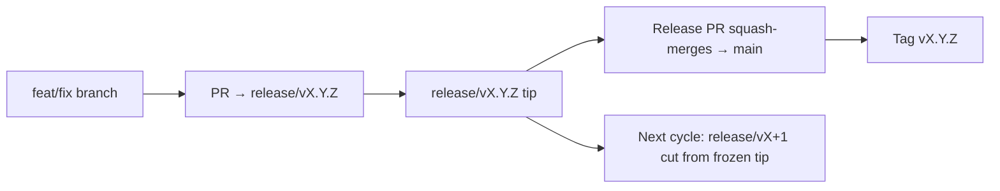

# Branching & Release Model (Yorùbá)

🌐 **Languages:** 🇺🇸 [English](../../../../ops/BRANCHING_MODEL.md) · 🇪🇹 [am](../../../am/docs/ops/BRANCHING_MODEL.md) · 🇸🇦 [ar](../../../ar/docs/ops/BRANCHING_MODEL.md) · 🇦🇿 [az](../../../az/docs/ops/BRANCHING_MODEL.md) · 🇧🇬 [bg](../../../bg/docs/ops/BRANCHING_MODEL.md) · 🇧🇩 [bn](../../../bn/docs/ops/BRANCHING_MODEL.md) · 🇨🇿 [cs](../../../cs/docs/ops/BRANCHING_MODEL.md) · 🇩🇰 [da](../../../da/docs/ops/BRANCHING_MODEL.md) · 🇩🇪 [de](../../../de/docs/ops/BRANCHING_MODEL.md) · 🇬🇷 [el](../../../el/docs/ops/BRANCHING_MODEL.md) · 🇪🇸 [es](../../../es/docs/ops/BRANCHING_MODEL.md) · 🇪🇪 [et](../../../et/docs/ops/BRANCHING_MODEL.md) · 🇮🇷 [fa](../../../fa/docs/ops/BRANCHING_MODEL.md) · 🇫🇮 [fi](../../../fi/docs/ops/BRANCHING_MODEL.md) · 🇫🇷 [fr](../../../fr/docs/ops/BRANCHING_MODEL.md) · 🇮🇪 [ga](../../../ga/docs/ops/BRANCHING_MODEL.md) · 🇮🇳 [gu](../../../gu/docs/ops/BRANCHING_MODEL.md) · 🇳🇬 [ha](../../../ha/docs/ops/BRANCHING_MODEL.md) · 🇮🇱 [he](../../../he/docs/ops/BRANCHING_MODEL.md) · 🇮🇳 [hi](../../../hi/docs/ops/BRANCHING_MODEL.md) · 🇭🇷 [hr](../../../hr/docs/ops/BRANCHING_MODEL.md) · 🇭🇺 [hu](../../../hu/docs/ops/BRANCHING_MODEL.md) · 🇦🇲 [hy](../../../hy/docs/ops/BRANCHING_MODEL.md) · 🇮🇩 [id](../../../id/docs/ops/BRANCHING_MODEL.md) · 🇳🇬 [ig](../../../ig/docs/ops/BRANCHING_MODEL.md) · 🇮🇹 [it](../../../it/docs/ops/BRANCHING_MODEL.md) · 🇯🇵 [ja](../../../ja/docs/ops/BRANCHING_MODEL.md) · 🇬🇪 [ka](../../../ka/docs/ops/BRANCHING_MODEL.md) · 🇰🇭 [km](../../../km/docs/ops/BRANCHING_MODEL.md) · 🇮🇳 [kn](../../../kn/docs/ops/BRANCHING_MODEL.md) · 🇰🇷 [ko](../../../ko/docs/ops/BRANCHING_MODEL.md) · 🇱🇹 [lt](../../../lt/docs/ops/BRANCHING_MODEL.md) · 🇱🇻 [lv](../../../lv/docs/ops/BRANCHING_MODEL.md) · 🇮🇳 [ml](../../../ml/docs/ops/BRANCHING_MODEL.md) · 🇮🇳 [mr](../../../mr/docs/ops/BRANCHING_MODEL.md) · 🇲🇾 [ms](../../../ms/docs/ops/BRANCHING_MODEL.md) · 🇲🇹 [mt](../../../mt/docs/ops/BRANCHING_MODEL.md) · 🇲🇲 [my](../../../my/docs/ops/BRANCHING_MODEL.md) · 🇳🇵 [ne](../../../ne/docs/ops/BRANCHING_MODEL.md) · 🇳🇱 [nl](../../../nl/docs/ops/BRANCHING_MODEL.md) · 🇳🇴 [no](../../../no/docs/ops/BRANCHING_MODEL.md) · 🇮🇳 [or](../../../or/docs/ops/BRANCHING_MODEL.md) · 🇮🇳 [pa](../../../pa/docs/ops/BRANCHING_MODEL.md) · 🇵🇭 [phi](../../../phi/docs/ops/BRANCHING_MODEL.md) · 🇵🇱 [pl](../../../pl/docs/ops/BRANCHING_MODEL.md) · 🇵🇹 [pt](../../../pt/docs/ops/BRANCHING_MODEL.md) · 🇧🇷 [pt-BR](../../../pt-BR/docs/ops/BRANCHING_MODEL.md) · 🇷🇴 [ro](../../../ro/docs/ops/BRANCHING_MODEL.md) · 🇷🇺 [ru](../../../ru/docs/ops/BRANCHING_MODEL.md) · 🇱🇰 [si](../../../si/docs/ops/BRANCHING_MODEL.md) · 🇸🇰 [sk](../../../sk/docs/ops/BRANCHING_MODEL.md) · 🇸🇮 [sl](../../../sl/docs/ops/BRANCHING_MODEL.md) · 🇷🇸 [sr](../../../sr/docs/ops/BRANCHING_MODEL.md) · 🇸🇪 [sv](../../../sv/docs/ops/BRANCHING_MODEL.md) · 🇰🇪 [sw](../../../sw/docs/ops/BRANCHING_MODEL.md) · 🇮🇳 [ta](../../../ta/docs/ops/BRANCHING_MODEL.md) · 🇮🇳 [te](../../../te/docs/ops/BRANCHING_MODEL.md) · 🇹🇭 [th](../../../th/docs/ops/BRANCHING_MODEL.md) · 🇹🇷 [tr](../../../tr/docs/ops/BRANCHING_MODEL.md) · 🇺🇦 [uk-UA](../../../uk-UA/docs/ops/BRANCHING_MODEL.md) · 🇵🇰 [ur](../../../ur/docs/ops/BRANCHING_MODEL.md) · 🇺🇿 [uz](../../../uz/docs/ops/BRANCHING_MODEL.md) · 🇻🇳 [vi](../../../vi/docs/ops/BRANCHING_MODEL.md) · 🇨🇳 [zh-CN](../../../zh-CN/docs/ops/BRANCHING_MODEL.md) · 🇹🇼 [zh-TW](../../../zh-TW/docs/ops/BRANCHING_MODEL.md)

---

OmniRoute ń lo àwòṣe ìtújáde **parallel-cycle**: ẹ̀ka `release/vX.Y.Z`
tí a yà sọ́tọ̀ fún yípo tó ń ṣiṣẹ́ lọ́wọ́, `main` fún ìlà tí a ti tẹ̀jáde, àti táàgì
`vX.Y.Z` tí kò ṣeé yípadà nígbà tí a bá fi yípo náà jáde. Rírí àwọn commit tí wọ́n dé sórí `release/*` _àti_ sórí
`main` jẹ́ ohun tí a retí — kì í ṣe àṣìṣe.

Àwọn àlàyé fún olùtọ́jú wà nínú `CLAUDE.md` (Òfin Líle #21) àti
[RELEASE_CHECKLIST.md](./RELEASE_CHECKLIST.md). Ojú-ìwé yìí ni àkótán gbangba
fún àwọn olùkópa.

## Ní ṣókí

| Ref              | Ipa                                                                                           |
| ---------------- | --------------------------------------------------------------------------------------------- |
| `release/vX.Y.Z` | **Yípo tó ń ṣiṣẹ́** — ìdàgbàsókè ojoojúmọ́ àti ìdapọ̀ PR fún ẹ̀yà yẹn                             |
| `main`           | **Ìlà tí a ti tẹ̀jáde** — ń gba yípo náà nípasẹ̀ squash-merge nígbà tí a bá fi ìtújáde náà jáde |
| `vX.Y.Z` (táàgì) | **Àmì ìtújáde** — atọ́ka “ohun tí a fi jáde” tí kò ṣeé yípadà, tí a ṣẹ̀dá ní àkókò ìtújáde      |



## Ẹ̀ka wo ni PR mi yẹ kí ó dojú kọ?

**Jẹ́ kí ó dojú kọ ẹ̀ka `release/vX.Y.Z` tó ń ṣiṣẹ́ — kì í ṣe `main`.**

1. Wá ẹ̀ka `release/v*` tó ṣí tí ó ga jù lọ (àpẹẹrẹ ní àkókò tí a ń kọ èyí:
   `release/v3.8.49`).
2. Ṣẹ̀dá ẹ̀ka láti tip yẹn (`git fetch` + checkout / rebase sórí rẹ̀).
3. Ṣí PR náà pẹ̀lú **base = `release/vX.Y.Z` yẹn**.

`main` kì í ṣe ẹ̀ka ìṣọ̀kan ojoojúmọ́. Àwọn PR tí a ṣí sí `main`
máa ń nílò kí a tún ibi tí wọ́n dojú kọ ṣe kí a tó dapọ̀ wọn.

## Dídì ìtújáde (àwọn yípo tó ń lọ ní ìrẹ́pọ̀)

Nígbà tí a bá ń mú ìtújáde kan bára mu, a máa ń ṣí issue àmì kan tí a fi label `release-freeze`
sí. Èyí **kò dá ìdàgbàsókè dúró**:

- `release/vX.Y.Z` tí a dì náà jẹ́ ti balógun ìtújáde fún ìtújáde yẹn.
- A máa ń ṣẹ̀dá `release/vX+1` ti yípo tó tẹ̀lé láti tip tí a dì náà, kí àwọn olùkópa lè máa
  fi iṣẹ́ wọn wọlé.
- Àwọn PR tó ṣì dojú kọ ẹ̀ka tí a dì náà yẹ kí a **tún tọ́ka** sí ẹ̀ka
  `release/v*` tó ń ṣiṣẹ́ (tó ga jù lọ).

Ṣàyẹ̀wò bóyá freeze kan wà ní ṣíṣí kí o tó gbà pé ẹ̀ka tí o fẹ́ lè gba ìdapọ̀:

```bash
gh issue list --repo diegosouzapw/OmniRoute --label release-freeze --state open
```

A ṣàkọsílẹ̀ ìlànà ìdapọ̀ (label `queue` ti owner → Mergify) nínú
[MERGE_TRAIN.md](./MERGE_TRAIN.md).

## Kí nìdí tí ẹ̀ka àti táàgì fi wà?

| Ohun èlò         | Àkókò ìwàláàyè    | Ète                                                                           |
| ---------------- | ----------------- | ----------------------------------------------------------------------------- |
| `release/vX.Y.Z` | Yípo tó ń lọ lọ́wọ́ | Ń kó àwọn PR tí a ti ṣàyẹ̀wò jọ, ń jẹ́ kí CI dúró ní green, ó sì jẹ́ base fún PR |
| Táàgì `vX.Y.Z`   | Títí láé          | Ń samisi àwọn bit gangan tí a fi jáde sí npm / GitHub Releases                |

Ẹ̀ka náà ni ilé-iṣẹ́; táàgì náà ni àpò tí a ti dí. Lẹ́yìn squash-merge sí
`main`, yípo tó tẹ̀lé máa ń tẹ̀síwájú lórí `release/vX+1` láì dúró de PR ìtújáde
tẹ́lẹ̀ láti parí.

## Àwọn ìwé tó jọmọ́

- [CONTRIBUTING.md](../../CONTRIBUTING.md) — ìṣètò, àwọn ìdánwò, àkójọ àyẹ̀wò PR
- [RELEASE_CHECKLIST.md](./RELEASE_CHECKLIST.md) — ìfọwọ́sí ṣáájú ìtújáde
- [MERGE_TRAIN.md](./MERGE_TRAIN.md) — ìlà ìdapọ̀ àti train àfidípò
- [RELEASE_GREEN.md](./RELEASE_GREEN.md) — mímú tip ìtújáde dúró ní green
