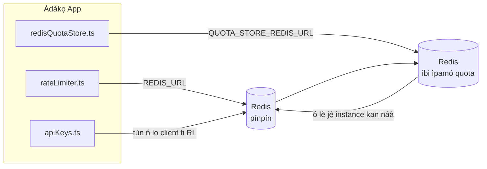

# Redis Production Configuration Guide (Yorùbá)

🌐 **Languages:** 🇺🇸 [English](../../../../ops/REDIS_PRODUCTION_CONFIG.md) · 🇪🇹 [am](../../../am/docs/ops/REDIS_PRODUCTION_CONFIG.md) · 🇸🇦 [ar](../../../ar/docs/ops/REDIS_PRODUCTION_CONFIG.md) · 🇦🇿 [az](../../../az/docs/ops/REDIS_PRODUCTION_CONFIG.md) · 🇧🇬 [bg](../../../bg/docs/ops/REDIS_PRODUCTION_CONFIG.md) · 🇧🇩 [bn](../../../bn/docs/ops/REDIS_PRODUCTION_CONFIG.md) · 🇨🇿 [cs](../../../cs/docs/ops/REDIS_PRODUCTION_CONFIG.md) · 🇩🇰 [da](../../../da/docs/ops/REDIS_PRODUCTION_CONFIG.md) · 🇩🇪 [de](../../../de/docs/ops/REDIS_PRODUCTION_CONFIG.md) · 🇬🇷 [el](../../../el/docs/ops/REDIS_PRODUCTION_CONFIG.md) · 🇪🇸 [es](../../../es/docs/ops/REDIS_PRODUCTION_CONFIG.md) · 🇪🇪 [et](../../../et/docs/ops/REDIS_PRODUCTION_CONFIG.md) · 🇮🇷 [fa](../../../fa/docs/ops/REDIS_PRODUCTION_CONFIG.md) · 🇫🇮 [fi](../../../fi/docs/ops/REDIS_PRODUCTION_CONFIG.md) · 🇫🇷 [fr](../../../fr/docs/ops/REDIS_PRODUCTION_CONFIG.md) · 🇮🇪 [ga](../../../ga/docs/ops/REDIS_PRODUCTION_CONFIG.md) · 🇮🇳 [gu](../../../gu/docs/ops/REDIS_PRODUCTION_CONFIG.md) · 🇳🇬 [ha](../../../ha/docs/ops/REDIS_PRODUCTION_CONFIG.md) · 🇮🇱 [he](../../../he/docs/ops/REDIS_PRODUCTION_CONFIG.md) · 🇮🇳 [hi](../../../hi/docs/ops/REDIS_PRODUCTION_CONFIG.md) · 🇭🇷 [hr](../../../hr/docs/ops/REDIS_PRODUCTION_CONFIG.md) · 🇭🇺 [hu](../../../hu/docs/ops/REDIS_PRODUCTION_CONFIG.md) · 🇦🇲 [hy](../../../hy/docs/ops/REDIS_PRODUCTION_CONFIG.md) · 🇮🇩 [id](../../../id/docs/ops/REDIS_PRODUCTION_CONFIG.md) · 🇳🇬 [ig](../../../ig/docs/ops/REDIS_PRODUCTION_CONFIG.md) · 🇮🇹 [it](../../../it/docs/ops/REDIS_PRODUCTION_CONFIG.md) · 🇯🇵 [ja](../../../ja/docs/ops/REDIS_PRODUCTION_CONFIG.md) · 🇬🇪 [ka](../../../ka/docs/ops/REDIS_PRODUCTION_CONFIG.md) · 🇰🇭 [km](../../../km/docs/ops/REDIS_PRODUCTION_CONFIG.md) · 🇮🇳 [kn](../../../kn/docs/ops/REDIS_PRODUCTION_CONFIG.md) · 🇰🇷 [ko](../../../ko/docs/ops/REDIS_PRODUCTION_CONFIG.md) · 🇱🇹 [lt](../../../lt/docs/ops/REDIS_PRODUCTION_CONFIG.md) · 🇱🇻 [lv](../../../lv/docs/ops/REDIS_PRODUCTION_CONFIG.md) · 🇮🇳 [ml](../../../ml/docs/ops/REDIS_PRODUCTION_CONFIG.md) · 🇮🇳 [mr](../../../mr/docs/ops/REDIS_PRODUCTION_CONFIG.md) · 🇲🇾 [ms](../../../ms/docs/ops/REDIS_PRODUCTION_CONFIG.md) · 🇲🇹 [mt](../../../mt/docs/ops/REDIS_PRODUCTION_CONFIG.md) · 🇲🇲 [my](../../../my/docs/ops/REDIS_PRODUCTION_CONFIG.md) · 🇳🇵 [ne](../../../ne/docs/ops/REDIS_PRODUCTION_CONFIG.md) · 🇳🇱 [nl](../../../nl/docs/ops/REDIS_PRODUCTION_CONFIG.md) · 🇳🇴 [no](../../../no/docs/ops/REDIS_PRODUCTION_CONFIG.md) · 🇮🇳 [or](../../../or/docs/ops/REDIS_PRODUCTION_CONFIG.md) · 🇮🇳 [pa](../../../pa/docs/ops/REDIS_PRODUCTION_CONFIG.md) · 🇵🇭 [phi](../../../phi/docs/ops/REDIS_PRODUCTION_CONFIG.md) · 🇵🇱 [pl](../../../pl/docs/ops/REDIS_PRODUCTION_CONFIG.md) · 🇵🇹 [pt](../../../pt/docs/ops/REDIS_PRODUCTION_CONFIG.md) · 🇧🇷 [pt-BR](../../../pt-BR/docs/ops/REDIS_PRODUCTION_CONFIG.md) · 🇷🇴 [ro](../../../ro/docs/ops/REDIS_PRODUCTION_CONFIG.md) · 🇷🇺 [ru](../../../ru/docs/ops/REDIS_PRODUCTION_CONFIG.md) · 🇱🇰 [si](../../../si/docs/ops/REDIS_PRODUCTION_CONFIG.md) · 🇸🇰 [sk](../../../sk/docs/ops/REDIS_PRODUCTION_CONFIG.md) · 🇸🇮 [sl](../../../sl/docs/ops/REDIS_PRODUCTION_CONFIG.md) · 🇷🇸 [sr](../../../sr/docs/ops/REDIS_PRODUCTION_CONFIG.md) · 🇸🇪 [sv](../../../sv/docs/ops/REDIS_PRODUCTION_CONFIG.md) · 🇰🇪 [sw](../../../sw/docs/ops/REDIS_PRODUCTION_CONFIG.md) · 🇮🇳 [ta](../../../ta/docs/ops/REDIS_PRODUCTION_CONFIG.md) · 🇮🇳 [te](../../../te/docs/ops/REDIS_PRODUCTION_CONFIG.md) · 🇹🇭 [th](../../../th/docs/ops/REDIS_PRODUCTION_CONFIG.md) · 🇹🇷 [tr](../../../tr/docs/ops/REDIS_PRODUCTION_CONFIG.md) · 🇺🇦 [uk-UA](../../../uk-UA/docs/ops/REDIS_PRODUCTION_CONFIG.md) · 🇵🇰 [ur](../../../ur/docs/ops/REDIS_PRODUCTION_CONFIG.md) · 🇺🇿 [uz](../../../uz/docs/ops/REDIS_PRODUCTION_CONFIG.md) · 🇻🇳 [vi](../../../vi/docs/ops/REDIS_PRODUCTION_CONFIG.md) · 🇨🇳 [zh-CN](../../../zh-CN/docs/ops/REDIS_PRODUCTION_CONFIG.md) · 🇹🇼 [zh-TW](../../../zh-TW/docs/ops/REDIS_PRODUCTION_CONFIG.md)

---

## Àyẹ̀wò Gbogbogbò

Redis jẹ́ **ìgbẹ́kẹ̀lé àṣàyàn tí kò fi dandan múlẹ̀** nínú OmniRoute — ohun èlò náà ń tẹ̀síwájú láìsí ìṣòro tó pọ̀ (nípa lílo àwọn
àṣàyàn ìpadàsí inú ìrántí) nígbà tí Redis kò bá sí. Nínú production, ṣíṣe àtúnṣe Redis máa ń dín ìdádúró kù fún àwọn
ẹrù iṣẹ́ mẹ́rin ọ̀tọ̀ọ̀tọ̀:

| Ẹrù Iṣẹ́                | Driver                        | Ilé-iṣẹ́ Client                                                                 | Àpẹẹrẹ Key                                          |
| ---------------------- | ----------------------------- | ------------------------------------------------------------------------------ | --------------------------------------------------- |
| Ìdíwọ̀n oṣùwọ̀n          | `rateLimiter.ts`              | `getRedisClient()` — singleton `ioredis` aláìṣiṣẹ́ títí di ìgbà tí a bá nílò rẹ̀ | `<prefix>rl:*` àwọn fèrèsé ìdíwọ̀n oṣùwọ̀n Lua‑atomic |
| Cache ìfàṣẹsí          | `apiKeys.ts`                  | Tún ń lo client `rateLimiter`                                                  | `<prefix>auth:api_key:<sha256>` pẹ̀lú TTL            |
| Ibi ìpamọ́ quota        | `redisQuotaStore.ts`          | Singleton `getRedisClient(url)` ọ̀tọ̀                                            | `<prefix>quota:*` tí a lè ṣètò fún instance kọ̀ọ̀kan  |
| Circuit breaker warmup | `redisCircuitBreakerStore.ts` | Client ọ̀tọ̀ nínú `circuitBreakerFactory.ts`                                     | `<prefix>warmup:cb:<connectionId>`                  |

Gbogbo ẹrù iṣẹ́ mẹ́rẹ̀ẹ̀rin ń pín prefix namespace kan náà kí OmniRoute lè ṣiṣẹ́ pọ̀ pẹ̀lú àwọn app mìíràn lórí
instance Redis kan ṣoṣo (fún àpẹẹrẹ `127.0.0.1:6379`). Wo [Ṣíṣe Namespace fún Àwọn Key](#key-namespacing).

---

## Ìṣètò Lọ́wọ́lọ́wọ́ (Àwọn Àìyípadà Code)

| Ètò                               | Iye                                                                      | Ibi                                                                                   |
| --------------------------------- | ------------------------------------------------------------------------ | ------------------------------------------------------------------------------------- |
| env var `REDIS_URL`               | `redis://redis:6379` (compose), àṣàyàn                                   | `rateLimiter.ts:5`, `.env.example`                                                    |
| env var `REDIS_KEY_PREFIX`        | `omniroute:` (àìyípadà)                                                  | `rateLimiter.ts`, `redisQuotaStore.ts`, `redisCircuitBreakerStore.ts`, `.env.example` |
| env var `QUOTA_STORE_REDIS_URL`   | ọ̀tọ̀, ó lè yàtọ̀ sí `REDIS_URL`                                            | `quota/storeFactory.ts`                                                               |
| `QUOTA_STORE_DRIVER`              | `"sqlite"` (àìyípadà), `"redis"` jẹ́ àṣàyàn                               | `quota/storeFactory.ts`                                                               |
| `maxRetriesPerRequest` ti ioredis | `3`                                                                      | ṣíṣẹ̀dá client nínú `rateLimiter.ts`                                                   |
| `enableReadyCheck`                | a kò ṣètò rẹ̀ (àìyípadà ioredis: `true`)                                  | —                                                                                     |
| `lazyConnect`                     | a kò ṣètò rẹ̀ (àìyípadà ioredis: `false`)                                 | —                                                                                     |
| `retryStrategy`                   | a kò ṣètò rẹ̀ (àìyípadà ioredis: ìpìlẹ̀ 200ms, ń pọ̀ sí i lọ́nà exponential) | —                                                                                     |
| TLS / password / atọ́ka DB         | **a kò ṣètò wọn**                                                        | —                                                                                     |
| Sentinel / Cluster                | **a kò ṣètò wọn** — standalone olójú-òpó kan ṣoṣo nìkan                  | —                                                                                     |

---

## Ṣíṣe Namespace fún Àwọn Key

OmniRoute ń pín instance Redis kan pẹ̀lú ohunkóhun mìíràn tó ń ṣiṣẹ́ lórí host náà. Láìsí namespace,
àwọn key bíi `auth:api_key:<sha256>` tàbí `rl:*` lè bá àwọn key láti inú àwọn ohun èlò mìíràn
tó ń lo Redis kan náà kọlu ara wọn (instance yìí ń ṣiṣẹ́ Redis lórí `127.0.0.1:6379` lẹ́gbẹ̀ẹ́ àwọn iṣẹ́ mìíràn).

Ṣètò `REDIS_KEY_PREFIX` sí ọ̀rọ̀ tí kò ṣófo láti fi prefix sí **gbogbo** key OmniRoute:

```bash
# .env — gbogbo key OmniRoute di omniroute:rl:*, omniroute:auth:*, omniroute:quota:*, omniroute:warmup:cb:*
REDIS_KEY_PREFIX=omniroute:
```

- **Àìyípadà:** `omniroute:` (a máa lò ó nígbà tí `REDIS_KEY_PREFIX` kò bá ṣètò tàbí tí ó ṣófo).
- **A lò ó sí:** rate limiter + cache ìfàṣẹsí (client `ioredis` tí wọ́n ń pín nípasẹ̀ `keyPrefix`) àti
  ibi ìpamọ́ quota (`KEY_PREFIX = "${REDIS_KEY_PREFIX}quota"`) àti circuit breaker warmup
  (`KEY_PREFIX = "${REDIS_KEY_PREFIX}warmup:cb:"`).
- **Yíyí prefix padà** nígbà tí àwọn key ti wà tẹ́lẹ̀ nínú Redis máa ń sọ àwọn key àtijọ́ di aláìní olùtọ́jú (wọ́n máa ń parí
  nípasẹ̀ TTL / LRU). Ó ní ààbò láti yí i padà; kò nílò migration. Ìyàtọ̀ kan ṣoṣo ni key
  circuit-breaker warmup fún connection tí a sàmì sí gẹ́gẹ́ bí èyí tí a fi dè: a fi í pamọ́ láìsí TTL, nítorí náà
  ṣàkójọ àwọn tó ṣẹ́kù pẹ̀lú `redis-cli --scan --pattern '<old-prefix>warmup:cb:*'` kí o sì pa wọ́n rẹ́.
- **`keyPrefix` ioredis** máa ń fi prefix sí iwájú láìfọwọ́sí nígbà ìkọ̀wé, ó sì máa ń yọ ọ́ kúrò nígbà kíkà,
  nítorí náà code ohun èlò kò ní rí prefix náà láéláé.

---

## Ìṣàtúnṣe Iṣéjade Tí A Ṣedúró Fún

### 1. Àwọn Àṣàyàn Pool Ìsopọ̀ / Client (ioredis `Redis` constructor)

Kóòdù tó wà lọ́wọ́lọ́wọ́ ń ṣẹ̀dá `new Redis(url)` kan ṣoṣo láìsí àwọn àṣàyàn àkànṣe. Fún àwọn ìmúṣiṣẹ́ iṣéjade
aládàpọ̀-ẹ̀dà, fi factory client kan sínú kóòdù náà tàbí fi ohun kan yí `getRedisClient()` ká:

```typescript
const redis = new Redis(REDIS_URL, {
  maxRetriesPerRequest: null, // kò sí òpin àtúnṣe; jẹ́ kí retryStrategy pinnu
  enableReadyCheck: true, // jẹ́rìí pé server ti ṣetán kí ó tó gba àwọn ìpè
  lazyConnect: true, // má ṣe sopọ̀ nígbà ìṣẹ̀dá; dúró de ìpè àkọ́kọ́
  retryStrategy: (times) => {
    if (times > 10) return null; // jáwọ́ lẹ́yìn àtúnṣe 10 → tún sopọ̀ nígbà tó bá yá
    return Math.min(times * 200, 5000); // 200ms, 400ms, …, òpin 5s
  },
  enableAutoPipelining: true, // darapọ̀ àwọn command alásìkò-pọ̀ sí ìkọ̀wé TCP kan
  keepAlive: 10000, // TCP keep‑alive ní gbogbo 10s
});
```

**Àwọn pàṣípààrọ̀ pàtàkì:**

- `maxRetriesPerRequest: null` + `retryStrategy` — èyí ló dára jù fún iṣéjade kí àwọn
  ìtúnrẹ̀sílẹ̀ Redis fún ìgbà díẹ̀ má bàa fa kí gbogbo request kùnà lẹ́sẹ̀kẹsẹ̀. Fallback inú-memory tó wà nínú
  `checkRateLimit()` ń gba ipa-ọ̀nà ìkùnà náà.
- `lazyConnect: true` — ń yẹra fún gbígbẹ́kẹ̀lé Redis ní ìbẹ̀rẹ̀ kí server tó
  bẹ̀rẹ̀ sí í gba àwọn ìsopọ̀.
- `enableAutoPipelining: true` — ń dín iye ìrìn-àti-padà kù fún àwọn àyẹ̀wò rate-limit alásìkò-pọ̀;
  ó ṣàǹfààní ní >50 RPS lórí ìsopọ̀ kan ṣoṣo.

### 2. Àtúnṣe Server Redis (`redis.conf`)

```
# Memory
maxmemory 80%                        # fi àyè sílẹ̀ fún cache ojú-ìwé OS
maxmemory-policy allkeys-lru         # lé àwọn àkọsílẹ̀ cache auth tí ó ti pé jáde lábẹ́ ìfúnpọ̀

# Ìtọ́jú data (kò pọn dandan — OmniRoute lè yè ìkọlù láìsí i)
save 300 1                           # ya snapshot ó kéré tán ní gbogbo 5 min bí ≥1 key bá yípadà
appendonly no                        # AOF kò ṣe pàtàkì; a lè tún data náà ṣe
appendfsync no                       # kò sí overhead fsync (RDB ti tó)

# Nẹ́tíwọ́ọ̀kì
timeout 0                            # má ṣe gé ìsopọ̀ tí kò ṣiṣẹ́
tcp-keepalive 300                    # keep‑alive 5 min
tcp-backlog 511                      # backlog ìsopọ̀ fún ẹrù tó ń dé lojijì

# Ìṣiṣẹ́
hz 10                                # àiyipada; 100 fún èyí tó nílò latency kékeré
activedefrag yes                     # ṣe defragmentation fúnra rẹ̀ nígbà tí fragmentation >10%
```

**Pàṣípààrọ̀ fún `maxmemory-policy allkeys-lru`:** Àwọn àkọsílẹ̀ cache Auth lè jẹ́ lílé jáde lábẹ́
ìfúnpọ̀ memory. Èyí kò léwu — `setCachedApiKey` máa ń tún un kún nígbà gbogbo tí miss bá ṣẹlẹ̀, àti pé
fallback SQLite ni orísun àṣẹ. Script Lua rate-limiter náà ń ṣẹ̀dá àwọn key kéékèèké tí
a ṣe láti wà fún ìgbà kúkúrú.

### 3. Àwọn Ètò Docker Compose

Compose prod (`docker-compose.prod.yml`) ń lo `redis:8.6.2-alpine`. Ṣàfikún:

```yaml
redis:
  image: redis:8.6.2-alpine
  command:
    [
      "redis-server",
      "--maxmemory",
      "512mb",
      "--maxmemory-policy",
      "allkeys-lru",
      "--activedefrag",
      "yes",
      "--save",
      "300 1",
    ]
  healthcheck:
    test: ["CMD", "redis-cli", "ping"]
    interval: 10s
    timeout: 3s
    retries: 3
    start_period: 5s
```

### 4. Àwọn Ohun Tó Yẹ Kí A Gbé Yẹ̀ Wò Fún Multi‑Instance / Scaling

**Redis kan ṣoṣo fún gbogbo replica** — script Lua rate-limiter náà gbẹ́kẹ̀lé àyè key aláṣẹ kan ṣoṣo.
Ọ̀pọ̀ instance Redis lẹ́yìn àwọn replica yóò mú atomicity sọnù
yóò sì sọ budget náà di ìlọ́po méjì. Lo Redis kan ṣoṣo (tàbí cluster Redis Sentinel pẹ̀lú failover) fún
gbogbo replica application.

**Iye ìsopọ̀:** Replica application kọ̀ọ̀kan ń ṣí **ìsopọ̀ TCP 2** sí Redis
(client rate limiter + client quota store). Ní replica 10 → ìsopọ̀ 20, èyí sì
wà lábẹ́ òpin ìsopọ̀ 10k ti instance Redis àiyipada dáadáa.

### 5. Àbójútó

Ṣí i síta nípasẹ̀ endpoint health-check:

```typescript
// src/app/api/monitoring/health/route.ts ti ń pe àwọn function rateLimiter tẹ́lẹ̀
// Ṣàfikún àwọn àyẹ̀wò pàtó fún Redis:
//   1. Latency PING nípasẹ̀ ioredis .ping()
//   2. Ìlò memory nípasẹ̀ INFO memory
//   3. Iye ìsopọ̀ nípasẹ̀ INFO clients
//   4. Ìwọ̀n hit fún maxmemory-policy (evicted_keys / keyspace_hits)
```

Àwọn metric pàtàkì láti ṣọ́:

- **Àwọn key tí a lé jáde / sec** — bí kò bá dẹ́kun jíjẹ́ iye tí kì í ṣe òdo, mú `maxmemory` pọ̀ sí i
- **Àwọn client tí a dí** — iye tí kì í ṣe òdo ń tọ́ka sí àwọn script Lua tó lọ́ra tàbí ìjà fún resource tó pọ̀
- **Àwọn ìsopọ̀ tí a kọ̀** — a ti dé òpin ìsopọ̀; kò wọ́pọ̀ ní ìsopọ̀ 20

---

## Àwòrán Àkànṣe Ẹ̀rọ



---

## Àwọn Ìtọ́kasí

| Fáìlì                              | Ìdí                                                                              |
| ---------------------------------- | -------------------------------------------------------------------------------- |
| `src/shared/utils/rateLimiter.ts`  | Client Redis àkọ́kọ́, script Lua fún dídín ìwọ̀n ìbéèrè kù, àti fallback inú-memory |
| `src/lib/db/apiKeys.ts`            | Cache ìfàṣẹsí — fallback Redis→SQLite                                            |
| `src/lib/quota/redisQuotaStore.ts` | Client Redis ọ̀tọ̀ fún ibi ìpamọ́ quota àṣàyàn                                      |
| `src/lib/quota/storeFactory.ts`    | Ń yí padà láàárín àwọn driver quota `sqlite` àti `redis`                         |
| `docker-compose.prod.yml`          | Container Redis fún prod (image `redis:8.6.2-alpine`)                            |
| `.env.example`                     | Ìwé àlàyé àwọn env vars Redis                                                    |
| `src/app/api/local/redis/`         | Àwọn ipa-ọ̀nà API fún ìṣètò container dev                                         |
| `bin/cli/commands/redis.mjs`       | Àwọn àṣẹ CLI fún ìṣètò container dev                                             |
