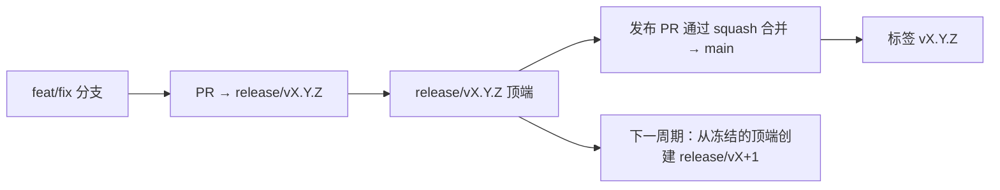

# Branching & Release Model (中文 (简体))

🌐 **Languages:** 🇺🇸 [English](../../../../ops/BRANCHING_MODEL.md) · 🇪🇹 [am](../../../am/docs/ops/BRANCHING_MODEL.md) · 🇸🇦 [ar](../../../ar/docs/ops/BRANCHING_MODEL.md) · 🇦🇿 [az](../../../az/docs/ops/BRANCHING_MODEL.md) · 🇧🇬 [bg](../../../bg/docs/ops/BRANCHING_MODEL.md) · 🇧🇩 [bn](../../../bn/docs/ops/BRANCHING_MODEL.md) · 🇨🇿 [cs](../../../cs/docs/ops/BRANCHING_MODEL.md) · 🇩🇰 [da](../../../da/docs/ops/BRANCHING_MODEL.md) · 🇩🇪 [de](../../../de/docs/ops/BRANCHING_MODEL.md) · 🇬🇷 [el](../../../el/docs/ops/BRANCHING_MODEL.md) · 🇪🇸 [es](../../../es/docs/ops/BRANCHING_MODEL.md) · 🇪🇪 [et](../../../et/docs/ops/BRANCHING_MODEL.md) · 🇮🇷 [fa](../../../fa/docs/ops/BRANCHING_MODEL.md) · 🇫🇮 [fi](../../../fi/docs/ops/BRANCHING_MODEL.md) · 🇫🇷 [fr](../../../fr/docs/ops/BRANCHING_MODEL.md) · 🇮🇪 [ga](../../../ga/docs/ops/BRANCHING_MODEL.md) · 🇮🇳 [gu](../../../gu/docs/ops/BRANCHING_MODEL.md) · 🇳🇬 [ha](../../../ha/docs/ops/BRANCHING_MODEL.md) · 🇮🇱 [he](../../../he/docs/ops/BRANCHING_MODEL.md) · 🇮🇳 [hi](../../../hi/docs/ops/BRANCHING_MODEL.md) · 🇭🇷 [hr](../../../hr/docs/ops/BRANCHING_MODEL.md) · 🇭🇺 [hu](../../../hu/docs/ops/BRANCHING_MODEL.md) · 🇦🇲 [hy](../../../hy/docs/ops/BRANCHING_MODEL.md) · 🇮🇩 [id](../../../id/docs/ops/BRANCHING_MODEL.md) · 🇳🇬 [ig](../../../ig/docs/ops/BRANCHING_MODEL.md) · 🇮🇹 [it](../../../it/docs/ops/BRANCHING_MODEL.md) · 🇯🇵 [ja](../../../ja/docs/ops/BRANCHING_MODEL.md) · 🇬🇪 [ka](../../../ka/docs/ops/BRANCHING_MODEL.md) · 🇰🇭 [km](../../../km/docs/ops/BRANCHING_MODEL.md) · 🇮🇳 [kn](../../../kn/docs/ops/BRANCHING_MODEL.md) · 🇰🇷 [ko](../../../ko/docs/ops/BRANCHING_MODEL.md) · 🇱🇹 [lt](../../../lt/docs/ops/BRANCHING_MODEL.md) · 🇱🇻 [lv](../../../lv/docs/ops/BRANCHING_MODEL.md) · 🇮🇳 [ml](../../../ml/docs/ops/BRANCHING_MODEL.md) · 🇮🇳 [mr](../../../mr/docs/ops/BRANCHING_MODEL.md) · 🇲🇾 [ms](../../../ms/docs/ops/BRANCHING_MODEL.md) · 🇲🇹 [mt](../../../mt/docs/ops/BRANCHING_MODEL.md) · 🇲🇲 [my](../../../my/docs/ops/BRANCHING_MODEL.md) · 🇳🇵 [ne](../../../ne/docs/ops/BRANCHING_MODEL.md) · 🇳🇱 [nl](../../../nl/docs/ops/BRANCHING_MODEL.md) · 🇳🇴 [no](../../../no/docs/ops/BRANCHING_MODEL.md) · 🇮🇳 [or](../../../or/docs/ops/BRANCHING_MODEL.md) · 🇮🇳 [pa](../../../pa/docs/ops/BRANCHING_MODEL.md) · 🇵🇭 [phi](../../../phi/docs/ops/BRANCHING_MODEL.md) · 🇵🇱 [pl](../../../pl/docs/ops/BRANCHING_MODEL.md) · 🇵🇹 [pt](../../../pt/docs/ops/BRANCHING_MODEL.md) · 🇧🇷 [pt-BR](../../../pt-BR/docs/ops/BRANCHING_MODEL.md) · 🇷🇴 [ro](../../../ro/docs/ops/BRANCHING_MODEL.md) · 🇷🇺 [ru](../../../ru/docs/ops/BRANCHING_MODEL.md) · 🇱🇰 [si](../../../si/docs/ops/BRANCHING_MODEL.md) · 🇸🇰 [sk](../../../sk/docs/ops/BRANCHING_MODEL.md) · 🇸🇮 [sl](../../../sl/docs/ops/BRANCHING_MODEL.md) · 🇷🇸 [sr](../../../sr/docs/ops/BRANCHING_MODEL.md) · 🇸🇪 [sv](../../../sv/docs/ops/BRANCHING_MODEL.md) · 🇰🇪 [sw](../../../sw/docs/ops/BRANCHING_MODEL.md) · 🇮🇳 [ta](../../../ta/docs/ops/BRANCHING_MODEL.md) · 🇮🇳 [te](../../../te/docs/ops/BRANCHING_MODEL.md) · 🇹🇭 [th](../../../th/docs/ops/BRANCHING_MODEL.md) · 🇹🇷 [tr](../../../tr/docs/ops/BRANCHING_MODEL.md) · 🇺🇦 [uk-UA](../../../uk-UA/docs/ops/BRANCHING_MODEL.md) · 🇵🇰 [ur](../../../ur/docs/ops/BRANCHING_MODEL.md) · 🇺🇿 [uz](../../../uz/docs/ops/BRANCHING_MODEL.md) · 🇻🇳 [vi](../../../vi/docs/ops/BRANCHING_MODEL.md) · 🇳🇬 [yo](../../../yo/docs/ops/BRANCHING_MODEL.md) · 🇹🇼 [zh-TW](../../../zh-TW/docs/ops/BRANCHING_MODEL.md)

---

OmniRoute 采用 **并行周期** 发布模型：为当前活跃周期设置专用的 `release/vX.Y.Z`
分支，`main` 用于已发布版本线，并在该周期发布时创建不可变的
`vX.Y.Z` 标签。看到提交同时进入 `release/*` _和_
`main` 是正常现象，而不是操作失误。

维护者相关详细信息见 `CLAUDE.md`（硬性规则 #21）和
[RELEASE_CHECKLIST.md](./RELEASE_CHECKLIST.md)。本页面是面向公开贡献者的摘要。

## 一览

| 引用             | 角色                                                      |
| ---------------- | --------------------------------------------------------- |
| `release/vX.Y.Z` | **活跃周期** — 该版本的日常开发和 PR 合并目标             |
| `main`           | **已发布版本线** — 发布时通过 squash 合并接收该周期的内容 |
| `vX.Y.Z`（标签） | **发布标记** — 发布时创建的不可变“实际发布内容”指针       |



## 我的 PR 应以哪个分支为目标？

**请以活跃的 `release/vX.Y.Z` 分支为目标，而不是 `main`。**

1. 找到版本号最高的开放 `release/v*` 分支（本文撰写时的示例：
   `release/v3.8.49`）。
2. 从该分支顶端创建分支（执行 `git fetch`，然后 checkout / rebase 到该分支）。
3. 创建 PR，并将 **base = 该 `release/vX.Y.Z`**。

`main` 不是日常集成分支。以 `main` 为目标创建的 PR
通常需要在合并前重新指定目标分支。

## 发布冻结（并行周期）

协调发布时，会创建一个带有 `release-freeze` 标签的标记 issue。
这**不会停止开发**：

- 冻结的 `release/vX.Y.Z` 由该次发布的发布负责人管理。
- 下一周期的 `release/vX+1` 从冻结的顶端创建，以便贡献者继续合入工作。
- 仍以冻结分支为目标的开放 PR 应**重新指定目标**为活跃的（版本号最高的）
  `release/v*` 分支。

在认定所需分支可合并之前，请先检查是否存在开放的冻结：

```bash
gh issue list --repo diegosouzapw/OmniRoute --label release-freeze --state open
```

合并机制（所有者添加 `queue` 标签 → Mergify）记录在
[MERGE_TRAIN.md](./MERGE_TRAIN.md) 中。

## 为什么同时需要分支和标签？

| 制品             | 生命周期     | 用途                                                |
| ---------------- | ------------ | --------------------------------------------------- |
| `release/vX.Y.Z` | 进行中的周期 | 汇集已审核的 PR、保持 CI 通过，并作为 PR 的基础分支 |
| 标签 `vX.Y.Z`    | 永久         | 标记发布到 npm / GitHub Releases 的确切内容         |

分支是工作坊；标签是密封的包。通过 squash 合并到
`main` 后，下一周期会在 `release/vX+1` 上继续推进，无需等待上一个
发布 PR 完成。

## 相关文档

- [CONTRIBUTING.md](../../CONTRIBUTING.md) — 环境设置、测试和 PR 检查清单
- [RELEASE_CHECKLIST.md](./RELEASE_CHECKLIST.md) — 发布前验证
- [MERGE_TRAIN.md](./MERGE_TRAIN.md) — 合并队列和备用合并列车
- [RELEASE_GREEN.md](./RELEASE_GREEN.md) — 保持发布分支顶端处于通过状态
