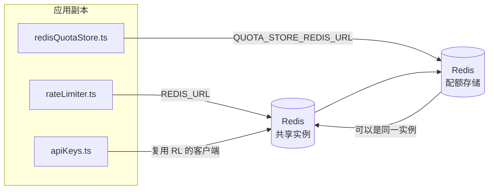

# Redis Production Configuration Guide (中文 (简体))

🌐 **Languages:** 🇺🇸 [English](../../../../ops/REDIS_PRODUCTION_CONFIG.md) · 🇪🇹 [am](../../../am/docs/ops/REDIS_PRODUCTION_CONFIG.md) · 🇸🇦 [ar](../../../ar/docs/ops/REDIS_PRODUCTION_CONFIG.md) · 🇦🇿 [az](../../../az/docs/ops/REDIS_PRODUCTION_CONFIG.md) · 🇧🇬 [bg](../../../bg/docs/ops/REDIS_PRODUCTION_CONFIG.md) · 🇧🇩 [bn](../../../bn/docs/ops/REDIS_PRODUCTION_CONFIG.md) · 🇨🇿 [cs](../../../cs/docs/ops/REDIS_PRODUCTION_CONFIG.md) · 🇩🇰 [da](../../../da/docs/ops/REDIS_PRODUCTION_CONFIG.md) · 🇩🇪 [de](../../../de/docs/ops/REDIS_PRODUCTION_CONFIG.md) · 🇬🇷 [el](../../../el/docs/ops/REDIS_PRODUCTION_CONFIG.md) · 🇪🇸 [es](../../../es/docs/ops/REDIS_PRODUCTION_CONFIG.md) · 🇪🇪 [et](../../../et/docs/ops/REDIS_PRODUCTION_CONFIG.md) · 🇮🇷 [fa](../../../fa/docs/ops/REDIS_PRODUCTION_CONFIG.md) · 🇫🇮 [fi](../../../fi/docs/ops/REDIS_PRODUCTION_CONFIG.md) · 🇫🇷 [fr](../../../fr/docs/ops/REDIS_PRODUCTION_CONFIG.md) · 🇮🇪 [ga](../../../ga/docs/ops/REDIS_PRODUCTION_CONFIG.md) · 🇮🇳 [gu](../../../gu/docs/ops/REDIS_PRODUCTION_CONFIG.md) · 🇳🇬 [ha](../../../ha/docs/ops/REDIS_PRODUCTION_CONFIG.md) · 🇮🇱 [he](../../../he/docs/ops/REDIS_PRODUCTION_CONFIG.md) · 🇮🇳 [hi](../../../hi/docs/ops/REDIS_PRODUCTION_CONFIG.md) · 🇭🇷 [hr](../../../hr/docs/ops/REDIS_PRODUCTION_CONFIG.md) · 🇭🇺 [hu](../../../hu/docs/ops/REDIS_PRODUCTION_CONFIG.md) · 🇦🇲 [hy](../../../hy/docs/ops/REDIS_PRODUCTION_CONFIG.md) · 🇮🇩 [id](../../../id/docs/ops/REDIS_PRODUCTION_CONFIG.md) · 🇳🇬 [ig](../../../ig/docs/ops/REDIS_PRODUCTION_CONFIG.md) · 🇮🇹 [it](../../../it/docs/ops/REDIS_PRODUCTION_CONFIG.md) · 🇯🇵 [ja](../../../ja/docs/ops/REDIS_PRODUCTION_CONFIG.md) · 🇬🇪 [ka](../../../ka/docs/ops/REDIS_PRODUCTION_CONFIG.md) · 🇰🇭 [km](../../../km/docs/ops/REDIS_PRODUCTION_CONFIG.md) · 🇮🇳 [kn](../../../kn/docs/ops/REDIS_PRODUCTION_CONFIG.md) · 🇰🇷 [ko](../../../ko/docs/ops/REDIS_PRODUCTION_CONFIG.md) · 🇱🇹 [lt](../../../lt/docs/ops/REDIS_PRODUCTION_CONFIG.md) · 🇱🇻 [lv](../../../lv/docs/ops/REDIS_PRODUCTION_CONFIG.md) · 🇮🇳 [ml](../../../ml/docs/ops/REDIS_PRODUCTION_CONFIG.md) · 🇮🇳 [mr](../../../mr/docs/ops/REDIS_PRODUCTION_CONFIG.md) · 🇲🇾 [ms](../../../ms/docs/ops/REDIS_PRODUCTION_CONFIG.md) · 🇲🇹 [mt](../../../mt/docs/ops/REDIS_PRODUCTION_CONFIG.md) · 🇲🇲 [my](../../../my/docs/ops/REDIS_PRODUCTION_CONFIG.md) · 🇳🇵 [ne](../../../ne/docs/ops/REDIS_PRODUCTION_CONFIG.md) · 🇳🇱 [nl](../../../nl/docs/ops/REDIS_PRODUCTION_CONFIG.md) · 🇳🇴 [no](../../../no/docs/ops/REDIS_PRODUCTION_CONFIG.md) · 🇮🇳 [or](../../../or/docs/ops/REDIS_PRODUCTION_CONFIG.md) · 🇮🇳 [pa](../../../pa/docs/ops/REDIS_PRODUCTION_CONFIG.md) · 🇵🇭 [phi](../../../phi/docs/ops/REDIS_PRODUCTION_CONFIG.md) · 🇵🇱 [pl](../../../pl/docs/ops/REDIS_PRODUCTION_CONFIG.md) · 🇵🇹 [pt](../../../pt/docs/ops/REDIS_PRODUCTION_CONFIG.md) · 🇧🇷 [pt-BR](../../../pt-BR/docs/ops/REDIS_PRODUCTION_CONFIG.md) · 🇷🇴 [ro](../../../ro/docs/ops/REDIS_PRODUCTION_CONFIG.md) · 🇷🇺 [ru](../../../ru/docs/ops/REDIS_PRODUCTION_CONFIG.md) · 🇱🇰 [si](../../../si/docs/ops/REDIS_PRODUCTION_CONFIG.md) · 🇸🇰 [sk](../../../sk/docs/ops/REDIS_PRODUCTION_CONFIG.md) · 🇸🇮 [sl](../../../sl/docs/ops/REDIS_PRODUCTION_CONFIG.md) · 🇷🇸 [sr](../../../sr/docs/ops/REDIS_PRODUCTION_CONFIG.md) · 🇸🇪 [sv](../../../sv/docs/ops/REDIS_PRODUCTION_CONFIG.md) · 🇰🇪 [sw](../../../sw/docs/ops/REDIS_PRODUCTION_CONFIG.md) · 🇮🇳 [ta](../../../ta/docs/ops/REDIS_PRODUCTION_CONFIG.md) · 🇮🇳 [te](../../../te/docs/ops/REDIS_PRODUCTION_CONFIG.md) · 🇹🇭 [th](../../../th/docs/ops/REDIS_PRODUCTION_CONFIG.md) · 🇹🇷 [tr](../../../tr/docs/ops/REDIS_PRODUCTION_CONFIG.md) · 🇺🇦 [uk-UA](../../../uk-UA/docs/ops/REDIS_PRODUCTION_CONFIG.md) · 🇵🇰 [ur](../../../ur/docs/ops/REDIS_PRODUCTION_CONFIG.md) · 🇺🇿 [uz](../../../uz/docs/ops/REDIS_PRODUCTION_CONFIG.md) · 🇻🇳 [vi](../../../vi/docs/ops/REDIS_PRODUCTION_CONFIG.md) · 🇳🇬 [yo](../../../yo/docs/ops/REDIS_PRODUCTION_CONFIG.md) · 🇹🇼 [zh-TW](../../../zh-TW/docs/ops/REDIS_PRODUCTION_CONFIG.md)

---

## 概述

Redis 是 OmniRoute 中的**可选软依赖项**——当 Redis 不可用时，应用程序会优雅降级（回退到内存实现）。在生产环境中，调优 Redis 可以降低四种不同工作负载的延迟：

| 工作负载     | 驱动                          | 客户端工厂                                       | 键模式                                         |
| ------------ | ----------------------------- | ------------------------------------------------ | ---------------------------------------------- |
| 速率限制     | `rateLimiter.ts`              | `getRedisClient()` — 延迟初始化的 `ioredis` 单例 | `<prefix>rl:*` 基于 Lua 原子操作的速率限制窗口 |
| 身份验证缓存 | `apiKeys.ts`                  | 复用 `rateLimiter` 的客户端                      | 带 TTL 的 `<prefix>auth:api_key:<sha256>`      |
| 配额存储     | `redisQuotaStore.ts`          | 独立的 `getRedisClient(url)` 单例                | `<prefix>quota:*`，可按实例配置                |
| 预热熔断器   | `redisCircuitBreakerStore.ts` | `circuitBreakerFactory.ts` 中的独立客户端        | `<prefix>warmup:cb:<connectionId>`             |

所有四种工作负载共享同一个命名空间前缀，因此 OmniRoute 可以与其他应用共存于同一个 Redis 实例中（例如 `127.0.0.1:6379`）。请参阅[键命名空间](#key-namespacing)。

---

## 当前配置（代码默认值）

| 设置                             | 值                                                  | 位置                                                                                  |
| -------------------------------- | --------------------------------------------------- | ------------------------------------------------------------------------------------- |
| `REDIS_URL` 环境变量             | `redis://redis:6379`（compose），可选               | `rateLimiter.ts:5`、`.env.example`                                                    |
| `REDIS_KEY_PREFIX` 环境变量      | `omniroute:`（默认值）                              | `rateLimiter.ts`、`redisQuotaStore.ts`、`redisCircuitBreakerStore.ts`、`.env.example` |
| `QUOTA_STORE_REDIS_URL` 环境变量 | 独立配置，可以与 `REDIS_URL` 不同                   | `quota/storeFactory.ts`                                                               |
| `QUOTA_STORE_DRIVER`             | `"sqlite"`（默认值），可选 `"redis"`                | `quota/storeFactory.ts`                                                               |
| ioredis `maxRetriesPerRequest`   | `3`                                                 | `rateLimiter.ts` 客户端创建                                                           |
| `enableReadyCheck`               | 未设置（ioredis 默认值：`true`）                    | —                                                                                     |
| `lazyConnect`                    | 未设置（ioredis 默认值：`false`）                   | —                                                                                     |
| `retryStrategy`                  | 未设置（ioredis 默认值：以 200ms 为基数，指数退避） | —                                                                                     |
| TLS / 密码 / DB 索引             | **未配置**                                          | —                                                                                     |
| Sentinel / Cluster               | **未配置**——仅支持独立单节点                        | —                                                                                     |

---

## 键命名空间

OmniRoute 与主机上运行的其他服务共享 Redis 实例。如果没有命名空间，`auth:api_key:<sha256>` 或 `rl:*` 等键可能会与使用同一 Redis 的其他应用程序的键发生冲突（此实例在 `127.0.0.1:6379` 上运行 Redis，并与其他服务共存）。

将 `REDIS_KEY_PREFIX` 设置为非空字符串，为**每个** OmniRoute 键添加前缀：

```bash
# .env — 所有 OmniRoute 键都会变成 omniroute:rl:*、omniroute:auth:*、omniroute:quota:*、omniroute:warmup:cb:*
REDIS_KEY_PREFIX=omniroute:
```

- **默认值：** `omniroute:`（当 `REDIS_KEY_PREFIX` 未设置或为空时应用）。
- **应用范围：**速率限制器 + 身份验证缓存（通过 `keyPrefix` 共享 `ioredis` 客户端）、配额存储（`KEY_PREFIX = "${REDIS_KEY_PREFIX}quota"`）以及预热熔断器（`KEY_PREFIX = "${REDIS_KEY_PREFIX}warmup:cb:"`）。
- 当 Redis 中已存在键时，**更改前缀**会使旧键成为孤立键（它们会通过 TTL / LRU 过期）。可以安全更改，无需迁移。唯一的例外是标记为禁止的连接所对应的预热熔断器键：该键会在不设置 TTL 的情况下持久保存，因此请使用 `redis-cli --scan --pattern '<old-prefix>warmup:cb:*'` 列出残留键并将其删除。
- **ioredis `keyPrefix`**会在写入时自动添加前缀，**并且**在读取时将其去除，因此应用程序代码永远不会看到该前缀。

---

## 推荐的生产环境调优

### 1. 连接池 / 客户端选项（ioredis `Redis` 构造函数）

当前代码创建了一个没有自定义选项的 `new Redis(url)`。对于生产环境中的多副本部署，请在代码中传入客户端工厂，或封装 `getRedisClient()`：

```typescript
const redis = new Redis(REDIS_URL, {
  maxRetriesPerRequest: null, // 不限制重试次数；由 retryStrategy 决定
  enableReadyCheck: true, // 在接受调用之前确认服务器已就绪
  lazyConnect: true, // 构造时不连接；等待首次调用
  retryStrategy: (times) => {
    if (times > 10) return null; // 重试 10 次后放弃 → 稍后重新连接
    return Math.min(times * 200, 5000); // 200ms、400ms、…，最大 5s
  },
  enableAutoPipelining: true, // 将并发命令合并为一次 TCP 写入
  keepAlive: 10000, // 每 10s 执行一次 TCP keep-alive
});
```

**关键权衡：**

- `maxRetriesPerRequest: null` + `retryStrategy` — 生产环境中的首选设置，使 Redis
  短暂重启时不会立即导致所有请求失败。`checkRateLimit()` 中的内存回退机制会处理失败路径。
- `lazyConnect: true` — 避免服务器开始接受连接之前必须依赖 Redis 已经启动。
- `enableAutoPipelining: true` — 减少并发速率限制检查所需的往返次数；
  在单连接超过 50 RPS 时尤其有益。

### 2. Redis 服务器配置（`redis.conf`）

```
# 内存
maxmemory 80%                        # 为操作系统页缓存预留空间
maxmemory-policy allkeys-lru         # 在内存压力下淘汰过期的身份验证缓存条目

# 持久化（可选 — 即使不启用，OmniRoute 也具备崩溃安全性）
save 300 1                           # 如果至少有 1 个键发生变化，则每 5 分钟至少创建一次快照
appendonly no                        # 不需要 AOF；数据可以重新生成
appendfsync no                       # 无 fsync 开销（RDB 已足够）

# 网络
timeout 0                            # 不断开空闲连接
tcp-keepalive 300                    # 5 分钟 keep-alive
tcp-backlog 511                      # 用于突发负载的连接积压队列

# 性能
hz 10                                # 默认值；延迟敏感场景可设为 100
activedefrag yes                     # 当碎片率 >10% 时自动进行碎片整理
```

**`maxmemory-policy allkeys-lru` 的权衡：** 身份验证缓存条目可能会在内存压力下被淘汰。
这是安全的 — `setCachedApiKey` 始终会在缓存未命中时重新填充，而 SQLite 回退存储是权威数据源。
速率限制器的 Lua 脚本会创建较小且设计上生命周期很短的键。

### 3. Docker Compose 设置

生产环境 compose（`docker-compose.prod.yml`）使用 `redis:8.6.2-alpine`。添加：

```yaml
redis:
  image: redis:8.6.2-alpine
  command:
    [
      "redis-server",
      "--maxmemory",
      "512mb",
      "--maxmemory-policy",
      "allkeys-lru",
      "--activedefrag",
      "yes",
      "--save",
      "300 1",
    ]
  healthcheck:
    test: ["CMD", "redis-cli", "ping"]
    interval: 10s
    timeout: 3s
    retries: 3
    start_period: 5s
```

### 4. 多实例 / 扩展注意事项

**所有副本共用单个 Redis** — 速率限制器的 Lua 脚本依赖单一权威键空间。
如果不同副本背后使用多个 Redis 实例，将会失去原子性并使预算翻倍。
所有应用程序副本都应使用同一个 Redis（或具有故障转移能力的 Redis Sentinel 集群）。

**连接数：** 每个应用程序副本会打开到 Redis 的 **2 个 TCP 连接**
（速率限制器客户端 + 配额存储客户端）。10 个副本 → 20 个连接，
远低于默认 Redis 实例的 10k 连接上限。

### 5. 监控

通过健康检查端点公开：

```typescript
// src/app/api/monitoring/health/route.ts 已经调用了 rateLimiter 函数
// 添加 Redis 专用检查：
//   1. 通过 ioredis .ping() 检查 PING 延迟
//   2. 通过 INFO memory 检查内存使用情况
//   3. 通过 INFO clients 检查连接数
//   4. 检查 maxmemory-policy 的命中率（evicted_keys / keyspace_hits）
```

需要关注的关键指标：

- **每秒淘汰的键数** — 如果持续不为零，请增大 `maxmemory`
- **被阻塞的客户端** — 非零值表明 Lua 脚本运行缓慢或存在较高争用
- **被拒绝的连接** — 已达到连接数限制；在 20 个连接的情况下很少发生

---

## 架构图



---

## 参考资料

| 文件                               | 用途                                             |
| ---------------------------------- | ------------------------------------------------ |
| `src/shared/utils/rateLimiter.ts`  | 主 Redis 客户端、Lua 限流脚本、内存回退机制      |
| `src/lib/db/apiKeys.ts`            | 身份验证缓存——Redis→SQLite 回退                  |
| `src/lib/quota/redisQuotaStore.ts` | 用于可选配额存储的独立 Redis 客户端              |
| `src/lib/quota/storeFactory.ts`    | 在 `sqlite` 和 `redis` 配额驱动之间切换          |
| `docker-compose.prod.yml`          | 生产环境 Redis 容器（镜像 `redis:8.6.2-alpine`） |
| `.env.example`                     | Redis 环境变量文档                               |
| `src/app/api/local/redis/`         | 用于开发容器编排的 API 路由                      |
| `bin/cli/commands/redis.mjs`       | 用于开发容器编排的 CLI 命令                      |
