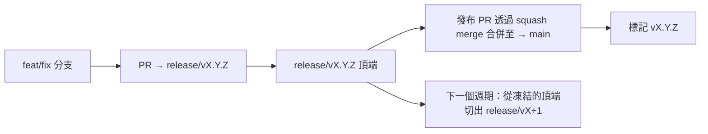

# Branching & Release Model (中文 (繁體))

🌐 **Languages:** 🇺🇸 [English](../../../../ops/BRANCHING_MODEL.md) · 🇪🇹 [am](../../../am/docs/ops/BRANCHING_MODEL.md) · 🇸🇦 [ar](../../../ar/docs/ops/BRANCHING_MODEL.md) · 🇦🇿 [az](../../../az/docs/ops/BRANCHING_MODEL.md) · 🇧🇬 [bg](../../../bg/docs/ops/BRANCHING_MODEL.md) · 🇧🇩 [bn](../../../bn/docs/ops/BRANCHING_MODEL.md) · 🇧🇦 [bs](../../../bs/docs/ops/BRANCHING_MODEL.md) · 🇨🇿 [cs](../../../cs/docs/ops/BRANCHING_MODEL.md) · 🇩🇰 [da](../../../da/docs/ops/BRANCHING_MODEL.md) · 🇩🇪 [de](../../../de/docs/ops/BRANCHING_MODEL.md) · 🇬🇷 [el](../../../el/docs/ops/BRANCHING_MODEL.md) · 🇪🇸 [es](../../../es/docs/ops/BRANCHING_MODEL.md) · 🇪🇪 [et](../../../et/docs/ops/BRANCHING_MODEL.md) · 🇮🇷 [fa](../../../fa/docs/ops/BRANCHING_MODEL.md) · 🇫🇮 [fi](../../../fi/docs/ops/BRANCHING_MODEL.md) · 🇫🇷 [fr](../../../fr/docs/ops/BRANCHING_MODEL.md) · 🇮🇪 [ga](../../../ga/docs/ops/BRANCHING_MODEL.md) · 🇮🇳 [gu](../../../gu/docs/ops/BRANCHING_MODEL.md) · 🇳🇬 [ha](../../../ha/docs/ops/BRANCHING_MODEL.md) · 🇮🇱 [he](../../../he/docs/ops/BRANCHING_MODEL.md) · 🇮🇳 [hi](../../../hi/docs/ops/BRANCHING_MODEL.md) · 🇭🇷 [hr](../../../hr/docs/ops/BRANCHING_MODEL.md) · 🇭🇺 [hu](../../../hu/docs/ops/BRANCHING_MODEL.md) · 🇦🇲 [hy](../../../hy/docs/ops/BRANCHING_MODEL.md) · 🇮🇩 [id](../../../id/docs/ops/BRANCHING_MODEL.md) · 🇳🇬 [ig](../../../ig/docs/ops/BRANCHING_MODEL.md) · 🇮🇹 [it](../../../it/docs/ops/BRANCHING_MODEL.md) · 🇯🇵 [ja](../../../ja/docs/ops/BRANCHING_MODEL.md) · 🇬🇪 [ka](../../../ka/docs/ops/BRANCHING_MODEL.md) · 🇰🇭 [km](../../../km/docs/ops/BRANCHING_MODEL.md) · 🇮🇳 [kn](../../../kn/docs/ops/BRANCHING_MODEL.md) · 🇰🇷 [ko](../../../ko/docs/ops/BRANCHING_MODEL.md) · 🇱🇹 [lt](../../../lt/docs/ops/BRANCHING_MODEL.md) · 🇱🇻 [lv](../../../lv/docs/ops/BRANCHING_MODEL.md) · 🇮🇳 [ml](../../../ml/docs/ops/BRANCHING_MODEL.md) · 🇮🇳 [mr](../../../mr/docs/ops/BRANCHING_MODEL.md) · 🇲🇾 [ms](../../../ms/docs/ops/BRANCHING_MODEL.md) · 🇲🇹 [mt](../../../mt/docs/ops/BRANCHING_MODEL.md) · 🇲🇲 [my](../../../my/docs/ops/BRANCHING_MODEL.md) · 🇳🇵 [ne](../../../ne/docs/ops/BRANCHING_MODEL.md) · 🇳🇱 [nl](../../../nl/docs/ops/BRANCHING_MODEL.md) · 🇳🇴 [no](../../../no/docs/ops/BRANCHING_MODEL.md) · 🇮🇳 [or](../../../or/docs/ops/BRANCHING_MODEL.md) · 🇮🇳 [pa](../../../pa/docs/ops/BRANCHING_MODEL.md) · 🇵🇭 [phi](../../../phi/docs/ops/BRANCHING_MODEL.md) · 🇵🇱 [pl](../../../pl/docs/ops/BRANCHING_MODEL.md) · 🇵🇹 [pt](../../../pt/docs/ops/BRANCHING_MODEL.md) · 🇧🇷 [pt-BR](../../../pt-BR/docs/ops/BRANCHING_MODEL.md) · 🇷🇴 [ro](../../../ro/docs/ops/BRANCHING_MODEL.md) · 🇷🇺 [ru](../../../ru/docs/ops/BRANCHING_MODEL.md) · 🇱🇰 [si](../../../si/docs/ops/BRANCHING_MODEL.md) · 🇸🇰 [sk](../../../sk/docs/ops/BRANCHING_MODEL.md) · 🇸🇮 [sl](../../../sl/docs/ops/BRANCHING_MODEL.md) · 🇷🇸 [sr](../../../sr/docs/ops/BRANCHING_MODEL.md) · 🇸🇪 [sv](../../../sv/docs/ops/BRANCHING_MODEL.md) · 🇰🇪 [sw](../../../sw/docs/ops/BRANCHING_MODEL.md) · 🇮🇳 [ta](../../../ta/docs/ops/BRANCHING_MODEL.md) · 🇮🇳 [te](../../../te/docs/ops/BRANCHING_MODEL.md) · 🇹🇭 [th](../../../th/docs/ops/BRANCHING_MODEL.md) · 🇹🇷 [tr](../../../tr/docs/ops/BRANCHING_MODEL.md) · 🇺🇦 [uk-UA](../../../uk-UA/docs/ops/BRANCHING_MODEL.md) · 🇵🇰 [ur](../../../ur/docs/ops/BRANCHING_MODEL.md) · 🇺🇿 [uz](../../../uz/docs/ops/BRANCHING_MODEL.md) · 🇻🇳 [vi](../../../vi/docs/ops/BRANCHING_MODEL.md) · 🇳🇬 [yo](../../../yo/docs/ops/BRANCHING_MODEL.md) · 🇨🇳 [zh-CN](../../../zh-CN/docs/ops/BRANCHING_MODEL.md)

---

OmniRoute 採用 **平行週期** 發布模型：為目前進行中的週期使用專用的 `release/vX.Y.Z`
分支、以 `main` 作為已發布版本線，並在該週期發布時建立不可變的
`vX.Y.Z` 標籤。看到提交同時進入 `release/*` _和_
`main` 是正常現象，並非混淆所致。

維護者的詳細資訊位於 `CLAUDE.md`（強制規則 #21）及
[RELEASE_CHECKLIST.md](./RELEASE_CHECKLIST.md)。本頁是面向公開貢獻者的摘要。

## 快速概覽

| 參照             | 角色                                                            |
| ---------------- | --------------------------------------------------------------- |
| `release/vX.Y.Z` | **進行中的週期** — 該版本的日常開發與 PR 合併                   |
| `main`           | **已發布版本線** — 發布時透過 squash merge 接收該週期的內容     |
| `vX.Y.Z`（標籤） | **發布標記** — 發布時建立、用來指向「實際發布內容」的不可變指標 |



## 我的 PR 應該以哪個分支為目標？

**請以目前進行中的 `release/vX.Y.Z` 分支為目標，而不是 `main`。**

1. 找出版本最高且仍開放的 `release/v*` 分支（本文撰寫時的範例：
   `release/v3.8.49`）。
2. 從該分支頂端建立分支（執行 `git fetch`，然後 checkout／rebase 至該分支）。
3. 開啟 PR，並將 **base 設為該 `release/vX.Y.Z`**。

`main` 並非日常整合分支。以 `main` 為目標開啟的 PR
通常需要在合併前重新設定目標分支。

## 發布凍結（平行週期）

當某個發布版本正在進行核對整合時，會開啟一個標有 `release-freeze` 標籤的標記議題。
這**不會停止開發**：

- 已凍結的 `release/vX.Y.Z` 由該次發布的發布負責人管理。
- 下一個週期的 `release/vX+1` 會從已凍結的頂端切出，讓貢獻者可以繼續
  提交工作。
- 仍以已凍結分支為目標的開放 PR，應該**重新設定目標**至
  目前進行中的（版本最高的）`release/v*` 分支。

在假設所需分支可以合併之前，請先檢查是否有進行中的凍結：

```bash
gh issue list --repo diegosouzapw/OmniRoute --label release-freeze --state open
```

合併機制（擁有者新增 `queue` 標籤 → Mergify）記載於
[MERGE_TRAIN.md](./MERGE_TRAIN.md)。

## 為什麼同時需要分支和標籤？

| 成品             | 存續期間     | 用途                                                  |
| ---------------- | ------------ | ----------------------------------------------------- |
| `release/vX.Y.Z` | 進行中的週期 | 收集通過審查的 PR、維持 CI 綠燈，並作為 PR 的基礎分支 |
| 標籤 `vX.Y.Z`    | 永久         | 標記實際發布至 npm／GitHub Releases 的確切內容        |

分支是工作坊；標籤則是密封的成品。透過 squash merge 合併至
`main` 後，下一個週期會在 `release/vX+1` 上繼續進行，無須等待上一個
發布 PR 完成。

## 相關文件

- [CONTRIBUTING.md](../../CONTRIBUTING.md) — 設定、測試、PR 檢查清單
- [RELEASE_CHECKLIST.md](./RELEASE_CHECKLIST.md) — 發布前驗證
- [MERGE_TRAIN.md](./MERGE_TRAIN.md) — 合併佇列與備援合併列車
- [RELEASE_GREEN.md](./RELEASE_GREEN.md) — 維持發布分支頂端的綠燈狀態
