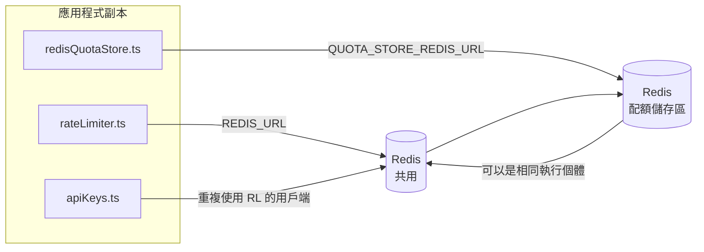

# Redis Production Configuration Guide (中文 (繁體))

🌐 **Languages:** 🇺🇸 [English](../../../../ops/REDIS_PRODUCTION_CONFIG.md) · 🇪🇹 [am](../../../am/docs/ops/REDIS_PRODUCTION_CONFIG.md) · 🇸🇦 [ar](../../../ar/docs/ops/REDIS_PRODUCTION_CONFIG.md) · 🇦🇿 [az](../../../az/docs/ops/REDIS_PRODUCTION_CONFIG.md) · 🇧🇬 [bg](../../../bg/docs/ops/REDIS_PRODUCTION_CONFIG.md) · 🇧🇩 [bn](../../../bn/docs/ops/REDIS_PRODUCTION_CONFIG.md) · 🇨🇿 [cs](../../../cs/docs/ops/REDIS_PRODUCTION_CONFIG.md) · 🇩🇰 [da](../../../da/docs/ops/REDIS_PRODUCTION_CONFIG.md) · 🇩🇪 [de](../../../de/docs/ops/REDIS_PRODUCTION_CONFIG.md) · 🇬🇷 [el](../../../el/docs/ops/REDIS_PRODUCTION_CONFIG.md) · 🇪🇸 [es](../../../es/docs/ops/REDIS_PRODUCTION_CONFIG.md) · 🇪🇪 [et](../../../et/docs/ops/REDIS_PRODUCTION_CONFIG.md) · 🇮🇷 [fa](../../../fa/docs/ops/REDIS_PRODUCTION_CONFIG.md) · 🇫🇮 [fi](../../../fi/docs/ops/REDIS_PRODUCTION_CONFIG.md) · 🇫🇷 [fr](../../../fr/docs/ops/REDIS_PRODUCTION_CONFIG.md) · 🇮🇪 [ga](../../../ga/docs/ops/REDIS_PRODUCTION_CONFIG.md) · 🇮🇳 [gu](../../../gu/docs/ops/REDIS_PRODUCTION_CONFIG.md) · 🇳🇬 [ha](../../../ha/docs/ops/REDIS_PRODUCTION_CONFIG.md) · 🇮🇱 [he](../../../he/docs/ops/REDIS_PRODUCTION_CONFIG.md) · 🇮🇳 [hi](../../../hi/docs/ops/REDIS_PRODUCTION_CONFIG.md) · 🇭🇷 [hr](../../../hr/docs/ops/REDIS_PRODUCTION_CONFIG.md) · 🇭🇺 [hu](../../../hu/docs/ops/REDIS_PRODUCTION_CONFIG.md) · 🇦🇲 [hy](../../../hy/docs/ops/REDIS_PRODUCTION_CONFIG.md) · 🇮🇩 [id](../../../id/docs/ops/REDIS_PRODUCTION_CONFIG.md) · 🇳🇬 [ig](../../../ig/docs/ops/REDIS_PRODUCTION_CONFIG.md) · 🇮🇹 [it](../../../it/docs/ops/REDIS_PRODUCTION_CONFIG.md) · 🇯🇵 [ja](../../../ja/docs/ops/REDIS_PRODUCTION_CONFIG.md) · 🇬🇪 [ka](../../../ka/docs/ops/REDIS_PRODUCTION_CONFIG.md) · 🇰🇭 [km](../../../km/docs/ops/REDIS_PRODUCTION_CONFIG.md) · 🇮🇳 [kn](../../../kn/docs/ops/REDIS_PRODUCTION_CONFIG.md) · 🇰🇷 [ko](../../../ko/docs/ops/REDIS_PRODUCTION_CONFIG.md) · 🇱🇹 [lt](../../../lt/docs/ops/REDIS_PRODUCTION_CONFIG.md) · 🇱🇻 [lv](../../../lv/docs/ops/REDIS_PRODUCTION_CONFIG.md) · 🇮🇳 [ml](../../../ml/docs/ops/REDIS_PRODUCTION_CONFIG.md) · 🇮🇳 [mr](../../../mr/docs/ops/REDIS_PRODUCTION_CONFIG.md) · 🇲🇾 [ms](../../../ms/docs/ops/REDIS_PRODUCTION_CONFIG.md) · 🇲🇹 [mt](../../../mt/docs/ops/REDIS_PRODUCTION_CONFIG.md) · 🇲🇲 [my](../../../my/docs/ops/REDIS_PRODUCTION_CONFIG.md) · 🇳🇵 [ne](../../../ne/docs/ops/REDIS_PRODUCTION_CONFIG.md) · 🇳🇱 [nl](../../../nl/docs/ops/REDIS_PRODUCTION_CONFIG.md) · 🇳🇴 [no](../../../no/docs/ops/REDIS_PRODUCTION_CONFIG.md) · 🇮🇳 [or](../../../or/docs/ops/REDIS_PRODUCTION_CONFIG.md) · 🇮🇳 [pa](../../../pa/docs/ops/REDIS_PRODUCTION_CONFIG.md) · 🇵🇭 [phi](../../../phi/docs/ops/REDIS_PRODUCTION_CONFIG.md) · 🇵🇱 [pl](../../../pl/docs/ops/REDIS_PRODUCTION_CONFIG.md) · 🇵🇹 [pt](../../../pt/docs/ops/REDIS_PRODUCTION_CONFIG.md) · 🇧🇷 [pt-BR](../../../pt-BR/docs/ops/REDIS_PRODUCTION_CONFIG.md) · 🇷🇴 [ro](../../../ro/docs/ops/REDIS_PRODUCTION_CONFIG.md) · 🇷🇺 [ru](../../../ru/docs/ops/REDIS_PRODUCTION_CONFIG.md) · 🇱🇰 [si](../../../si/docs/ops/REDIS_PRODUCTION_CONFIG.md) · 🇸🇰 [sk](../../../sk/docs/ops/REDIS_PRODUCTION_CONFIG.md) · 🇸🇮 [sl](../../../sl/docs/ops/REDIS_PRODUCTION_CONFIG.md) · 🇷🇸 [sr](../../../sr/docs/ops/REDIS_PRODUCTION_CONFIG.md) · 🇸🇪 [sv](../../../sv/docs/ops/REDIS_PRODUCTION_CONFIG.md) · 🇰🇪 [sw](../../../sw/docs/ops/REDIS_PRODUCTION_CONFIG.md) · 🇮🇳 [ta](../../../ta/docs/ops/REDIS_PRODUCTION_CONFIG.md) · 🇮🇳 [te](../../../te/docs/ops/REDIS_PRODUCTION_CONFIG.md) · 🇹🇭 [th](../../../th/docs/ops/REDIS_PRODUCTION_CONFIG.md) · 🇹🇷 [tr](../../../tr/docs/ops/REDIS_PRODUCTION_CONFIG.md) · 🇺🇦 [uk-UA](../../../uk-UA/docs/ops/REDIS_PRODUCTION_CONFIG.md) · 🇵🇰 [ur](../../../ur/docs/ops/REDIS_PRODUCTION_CONFIG.md) · 🇺🇿 [uz](../../../uz/docs/ops/REDIS_PRODUCTION_CONFIG.md) · 🇻🇳 [vi](../../../vi/docs/ops/REDIS_PRODUCTION_CONFIG.md) · 🇳🇬 [yo](../../../yo/docs/ops/REDIS_PRODUCTION_CONFIG.md) · 🇨🇳 [zh-CN](../../../zh-CN/docs/ops/REDIS_PRODUCTION_CONFIG.md)

---

## 概觀

Redis 是 OmniRoute 中的**選用軟相依項目**——當 Redis 無法使用時，應用程式會平順降級（使用記憶體內備援機制）。在生產環境中，調校 Redis 可降低四種不同工作負載的延遲：

| 工作負載   | 驅動來源                      | 用戶端工廠                                    | 鍵模式                                           |
| ---------- | ----------------------------- | --------------------------------------------- | ------------------------------------------------ |
| 速率限制   | `rateLimiter.ts`              | `getRedisClient()`——延遲建立的 `ioredis` 單例 | `<prefix>rl:*` 使用 Lua 原子操作的速率限制時間窗 |
| 驗證快取   | `apiKeys.ts`                  | 重複使用 `rateLimiter` 的用戶端               | `<prefix>auth:api_key:<sha256>`，具有 TTL        |
| 配額儲存區 | `redisQuotaStore.ts`          | 獨立的 `getRedisClient(url)` 單例             | `<prefix>quota:*`，可依執行個體設定              |
| 預熱斷路器 | `redisCircuitBreakerStore.ts` | `circuitBreakerFactory.ts` 中的獨立用戶端     | `<prefix>warmup:cb:<connectionId>`               |

這四種工作負載共用同一個命名空間前綴，因此 OmniRoute 能與其他應用程式共存於單一 Redis 執行個體中（例如 `127.0.0.1:6379`）。請參閱[鍵命名空間](#key-namespacing)。

---

## 目前的設定（程式碼預設值）

| 設定                             | 值                                             | 所在位置                                                                              |
| -------------------------------- | ---------------------------------------------- | ------------------------------------------------------------------------------------- |
| `REDIS_URL` 環境變數             | `redis://redis:6379`（compose），選用          | `rateLimiter.ts:5`、`.env.example`                                                    |
| `REDIS_KEY_PREFIX` 環境變數      | `omniroute:`（預設）                           | `rateLimiter.ts`、`redisQuotaStore.ts`、`redisCircuitBreakerStore.ts`、`.env.example` |
| `QUOTA_STORE_REDIS_URL` 環境變數 | 獨立設定，可與 `REDIS_URL` 不同                | `quota/storeFactory.ts`                                                               |
| `QUOTA_STORE_DRIVER`             | `"sqlite"`（預設），可選用 `"redis"`           | `quota/storeFactory.ts`                                                               |
| ioredis `maxRetriesPerRequest`   | `3`                                            | `rateLimiter.ts` 用戶端建立作業                                                       |
| `enableReadyCheck`               | 未設定（ioredis 預設值：`true`）               | —                                                                                     |
| `lazyConnect`                    | 未設定（ioredis 預設值：`false`）              | —                                                                                     |
| `retryStrategy`                  | 未設定（ioredis 預設值：200ms 基準、指數成長） | —                                                                                     |
| TLS／密碼／資料庫索引            | **未設定**                                     | —                                                                                     |
| Sentinel／Cluster                | **未設定**——僅支援獨立單一節點                 | —                                                                                     |

---

## 鍵命名空間

OmniRoute 會與主機上執行的其他服務共用 Redis 執行個體。若沒有命名空間，`auth:api_key:<sha256>` 或 `rl:*` 等鍵可能會與使用同一 Redis 的其他應用程式所建立的鍵發生衝突（此執行個體在 `127.0.0.1:6379` 上執行 Redis，並與其他服務並存）。

將 `REDIS_KEY_PREFIX` 設為非空字串，為 OmniRoute 的**每一個**鍵加上前綴：

```bash
# .env——所有 OmniRoute 鍵都會變成 omniroute:rl:*、omniroute:auth:*、omniroute:quota:*、omniroute:warmup:cb:*
REDIS_KEY_PREFIX=omniroute:
```

- **預設值：** `omniroute:`（當 `REDIS_KEY_PREFIX` 未設定或為空白時套用）。
- **套用範圍：**速率限制器與驗證快取（透過 `keyPrefix` 共用 `ioredis` 用戶端）、配額儲存區（`KEY_PREFIX = "${REDIS_KEY_PREFIX}quota"`），以及預熱斷路器（`KEY_PREFIX = "${REDIS_KEY_PREFIX}warmup:cb:"`）。
- 當 Redis 中已存在鍵時，**變更前綴**會使舊鍵成為孤立鍵（它們會透過 TTL／LRU 到期）。此變更是安全的，無需移轉。唯一的例外是標示為禁止之連線的預熱斷路器鍵：該鍵會在沒有 TTL 的情況下持久保存，因此請使用 `redis-cli --scan --pattern '<old-prefix>warmup:cb:*'` 列出遺留鍵並將其刪除。
- **ioredis `keyPrefix`** 會在寫入時自動加上前綴，並在讀取時將其移除，因此應用程式碼永遠不會看到該前綴。

---

## 建議的正式環境調校

### 1. 連線池／用戶端選項（ioredis `Redis` 建構函式）

目前的程式碼建立單一 `new Redis(url)`，且未指定任何自訂選項。對於正式環境的多副本部署，請在程式碼中傳入用戶端工廠函式，或包裝 `getRedisClient()`：

```typescript
const redis = new Redis(REDIS_URL, {
  maxRetriesPerRequest: null, // 不限制重試次數；由 retryStrategy 決定
  enableReadyCheck: true, // 接受呼叫前確認伺服器已就緒
  lazyConnect: true, // 建構時不連線；等待第一次呼叫
  retryStrategy: (times) => {
    if (times > 10) return null; // 重試 10 次後放棄 → 稍後重新連線
    return Math.min(times * 200, 5000); // 200ms、400ms、…，上限 5s
  },
  enableAutoPipelining: true, // 將並行命令合併為一次 TCP 寫入
  keepAlive: 10000, // 每 10s 執行一次 TCP keep-alive
});
```

**主要權衡：**

- `maxRetriesPerRequest: null` + `retryStrategy` — 建議用於正式環境，避免 Redis 暫時重新啟動時立即導致所有請求失敗。`checkRateLimit()` 中的記憶體內備援會承接失敗路徑。
- `lazyConnect: true` — 避免伺服器在開始接受連線前，於啟動階段依賴 Redis 必須已經上線。
- `enableAutoPipelining: true` — 減少並行速率限制檢查的往返次數；單一連線超過 50 RPS 時特別有益。

### 2. Redis 伺服器設定（`redis.conf`）

```
# 記憶體
maxmemory 80%                        # 為作業系統頁面快取保留空間
maxmemory-policy allkeys-lru         # 在記憶體壓力下淘汰過期未用的驗證快取項目

# 持久化（選用 — OmniRoute 即使不使用持久化也可安全應對當機）
save 300 1                           # 若至少有 1 個鍵變更，則至少每 5 分鐘建立一次快照
appendonly no                        # 不需要 AOF；資料可重新產生
appendfsync no                       # 無 fsync 額外負擔（RDB 已足夠）

# 網路
timeout 0                            # 不因閒置而中斷連線
tcp-keepalive 300                    # 5 分鐘 keep-alive
tcp-backlog 511                      # 因應突發負載的連線待處理佇列

# 效能
hz 10                                # 預設值；對延遲敏感時使用 100
activedefrag yes                     # 碎片率 >10% 時自動重組
```

**`maxmemory-policy allkeys-lru` 的權衡：** 在記憶體壓力下，驗證快取項目可能被淘汰。這是安全的 — `setCachedApiKey` 總會在快取未命中時重新填入資料，而 SQLite 備援則是權威資料來源。速率限制器的 Lua 指令碼會建立體積小且依設計存續時間很短的鍵。

### 3. Docker Compose 設定

正式環境的 compose（`docker-compose.prod.yml`）使用 `redis:8.6.2-alpine`。請新增：

```yaml
redis:
  image: redis:8.6.2-alpine
  command:
    [
      "redis-server",
      "--maxmemory",
      "512mb",
      "--maxmemory-policy",
      "allkeys-lru",
      "--activedefrag",
      "yes",
      "--save",
      "300 1",
    ]
  healthcheck:
    test: ["CMD", "redis-cli", "ping"]
    interval: 10s
    timeout: 3s
    retries: 3
    start_period: 5s
```

### 4. 多執行個體／擴展考量

**所有副本共用單一 Redis** — 速率限制器的 Lua 指令碼依賴單一權威鍵空間。若各副本使用多個 Redis 執行個體，將失去原子性，並使配額加倍。所有應用程式副本都應使用單一 Redis（或具備容錯移轉功能的 Redis Sentinel 叢集）。

**連線數：** 每個應用程式副本會開啟 **2 個 TCP 連線**至 Redis（速率限制器用戶端 + 配額儲存區用戶端）。10 個副本 → 20 個連線，遠低於預設 Redis 執行個體的 10k 連線上限。

### 5. 監控

透過健康檢查端點公開：

```typescript
// src/app/api/monitoring/health/route.ts 已呼叫速率限制器函式
// 新增 Redis 專用檢查：
//   1. 透過 ioredis .ping() 檢查 PING 延遲
//   2. 透過 INFO memory 檢查記憶體用量
//   3. 透過 INFO clients 檢查連線數
//   4. maxmemory-policy 的命中率（evicted_keys / keyspace_hits）
```

應關注的主要指標：

- **每秒淘汰的鍵數** — 若持續不為零，請提高 `maxmemory`
- **遭封鎖的用戶端** — 非零表示 Lua 指令碼執行緩慢或競爭情況嚴重
- **遭拒絕的連線** — 已達連線上限；僅有 20 個連線時很少發生

---

## 架構圖



---

## 參考資料

| 檔案                               | 用途                                                |
| ---------------------------------- | --------------------------------------------------- |
| `src/shared/utils/rateLimiter.ts`  | 主要 Redis 用戶端、Lua 速率限制指令碼、記憶體內備援 |
| `src/lib/db/apiKeys.ts`            | 驗證快取 — Redis→SQLite 備援                        |
| `src/lib/quota/redisQuotaStore.ts` | 用於選用配額儲存區的獨立 Redis 用戶端               |
| `src/lib/quota/storeFactory.ts`    | 在 `sqlite` 與 `redis` 配額驅動程式之間切換         |
| `docker-compose.prod.yml`          | 正式環境 Redis 容器（映像檔 `redis:8.6.2-alpine`）  |
| `.env.example`                     | Redis 環境變數文件                                  |
| `src/app/api/local/redis/`         | 用於開發容器協調管理的 API 路由                     |
| `bin/cli/commands/redis.mjs`       | 用於開發容器協調管理的 CLI 命令                     |
